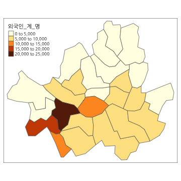

Kormaps 패키지는 한국한국행정지도 Shape파일을 R에서 사용하기 쉽도록 변환한 패키지입니다. 이 패키지를 이용하면 각종 통계자료와 행정구역을 연계하여 단계구분도(Choropleth map)을 쉽게 만들 수 있게 하기 위하여 패키지를 제작하였습니다. 한국행정지도 Shape파일은 통계지리정보서비스(sgis.go.kr)에서 제공하는 2010년 행정경계구역지도 Shape 파일을 빠른 속도로 단계구분도를 그릴 수 있도록 파일을 단순화한 후 국제규격에 맞게 형식을 변형한 후 만들었습니다. Shape파일 단순화에 대한 자세한 내용은 패키지 제작자가 쓴 ["웹에서 클릭만으로 하는 R 통계분석(한나래,2015)"](http://www.aladin.co.kr/shop/wproduct.aspx?ItemId=66714863) 책을 참조하십시요.  static image를 만들고자 할 때는 tmap패키지를 이용하면 쉽게 단계구분도를 그릴 수 있으며 웹상에서 축소/확대가 가능한 단계구분도를 그리고 싶을 때는 leaflet 패키지를 이용하면 좋습니다. 또한 국가통계포털(kosis.kr)에서 제공하는 2010년 인구총조사 데이타와 지도 데이타를 합친 데이터를 제공하므로 단계구분도를 연습해보는데 도움이 될 것입니다. 패키지에서 제공하는 행정구역지도 데이터는 다음과 같습니다. 

- kormap1: 2010년 행정구역지도 level1(시/도별)
- kormap2: 2010년 행정구역지도 level2(시/군/구)
- kormap3: 2010년 행정구역지도 level3(읍/면/동)

2010년 인구통계와 병합된 지도데이타도 제공됩니다. 

- korpopmap1: 2010년 행정구역지도 level1(시/도별) + 인구총조사(2010)
- korpopmap2: 2010년 행정구역지도 level2(시/군/구) + 인구총조사(2010)
- korpopmap3: 2010년 행정구역지도 level3(읍/면/동) + 인구총조사(2010)


## 패키지 설치하기

Kormaps 패키지는 CRAN에 등록되어 있지 않습니다. 한국행정구역 지도이기 때문에 함수에 한글이 포함되어 있어 CRAN에 등록하기 어렵습니다. 현재는 Github 에 저장되어 있으며 github에 있는 패키지를 설치하려면 먼저 devtools 패키지를 설치하여야 합니다. 이후 devtools 패키지의 install_github()함수를 이용하여 패키지를 설치합니다.


```r
install.packages("devtools")  # 한번 설치한 경우에는 다시 설치할 필요 없습니다.
devtools::install_github("cardiomoon/Kormaps")
```

## 행정구역 지도 그리기

Kormaps 패키지와 tmap 패키지를 이용하면 단계구분도를 쉽게 그릴 수 있습니다. 먼저 시도경계지도는 다음과 같이 그립니다.


```r
require(Kormaps)
require(tmap)
require(magrittr)
require(leaflet)

qtm(kormap1)
```


2010년 인구통계자료와 통합된 지도는 korpopmap1입니다. 다음은 총인구_명으로 구분된 단계구분도입니다.


```r
qtm(korpopmap1,"총인구_명")+tm_layout(fontfamily="NanumGothic")
```


인구통계자료에 포함된 항목은 다음과 같습니다.

```r
colnames(korpopmap1@data)
```

```
 [1] "SP_ID"                   "FID"                    
 [3] "code"                    "code1"                  
 [5] "long"                    "lat"                    
 [7] "order"                   "hole"                   
 [9] "piece"                   "group"                  
[11] "id"                      "FID.data"               
[13] "code.data"               "code.1"                 
[15] "name"                    "name_eng"               
[17] "base_year"               "C행정구역별_읍면동"     
[19] "행정구역별_읍면동"       "시점"                   
[21] "총인구_명"               "남자_명"                
[23] "여자_명"                 "내국인_계_명"           
[25] "내국인_남자_명"          "내국인_여자_명"         
[27] "외국인_계_명"            "외국인_남자_명"         
[29] "외국인_여자_명"          "가구_계_가구"           
[31] "일반가구_가구"           "집단가구_가구"          
[33] "외국인가구_가구"         "주택_계_호"             
[35] "단독주택_호"             "아파트_호"              
[37] "연립주택_호"             "다세대주택_호"          
[39] "비거주용_건물내_주택_호" "주택이외의_거처_호"     
[41] "region"                  "code1.data"             
```

시/군/구 지도는 korpopmap2입니다.

```r
qtm(korpopmap2,"총인구_명")+tm_layout(fontfamily="NanumGothic")
```


submap() 함수는 지도 중에서 원하는 지역만 골라서 지도를 그릴 수 있도록 해줍니다.

```r
Seoul2=submap(korpopmap2,"서울")
qtm(Seoul2,"외국인_계_명")+tm_layout(fontfamily="NanumGothic")
```



읍/면/동 지도는 korpopmap3입니다. 대구시의 읍/면/동 단계구분도를 보려면 다음과 같이 합니다.

```r
qtm(submap(korpopmap3,"대구"),"아파트_호")+tm_layout(fontfamily="NanumGothic")
```


또한 여러개의 지역으로 지도를 그리고 여러개의 layer를 넣는 것도 가능합니다.


```r
qtm(submap(korpopmap3,c("전라","광주")),"총인구_명")+
    tm_layout(title="호남지역 읍/면/동별 총인구수",fontfamily="NanumGothic")
```


## leaflet을 이용한 동적인 지도

leaflet패키지는 자바를 이용하여 동적인 지도를 그려줍니다. Kormaps패키지에 포함되어 있는 myleaflet()함수는 여러 layer를 가지는 동적인 지도를 쉽게 구현해줍니다. 이 단계구분도는 축소/확대가 가능하고 클릭시 행정구역과 인구통계정보를 보여줍니다. 


```r
myleaflet(korpopmap1,"총인구_명")
```

<!--html_preserve--><div id="htmlwidget-3988" style="width:360px;height:360px;" class="leaflet html-widget"></div>
<script type="application/json" data-for="htmlwidget-3988">{"x":{"calls":[{"method":"addTiles","args":["http://{s}.tile.openstreetmap.org/{z}/{x}/{y}.png",null,null,{"minZoom":0,"maxZoom":18,"maxNativeZoom":null,"tileSize":256,"subdomains":"abc","errorTileUrl":"","tms":false,"continuousWorld":false,"noWrap":false,"zoomOffset":0,"zoomReverse":false,"opacity":1,"zIndex":null,"unloadInvisibleTiles":null,"updateWhenIdle":null,"detectRetina":false,"reuseTiles":false,"attribution":"&copy; <a href=\"http://openstreetmap.org\">OpenStreetMap\u003c/a> contributors, <a href=\"http://creativecommons.org/licenses/by-sa/2.0/\">CC-BY-SA\u003c/a>"}]},{"method":"addPolygons","args":[[[{"lng":[127.018782609297,127.030360310074,127.040941725106,127.049359303613,127.064330930162,127.080985107397,127.09417370767,127.091049517135,127.095131594471,127.091517057151,127.107250463798,127.110205782738,127.102729016956,127.116272652233,127.117234019426,127.108549995238,127.100664241183,127.100366945243,127.11590502168,127.12146227614,127.173181119068,127.181197982605,127.178274702402,127.162418541663,127.14395646781,127.14035952896,127.160604252604,127.156032116908,127.145685448449,127.131890289928,127.116682383812,127.097434585328,127.081529235871,127.073975057151,127.064891101703,127.051355032425,127.034627614681,127.035927398829,127.025318327426,127.010272238238,127.002633243037,126.981952520085,126.962314374167,126.938638949639,126.925204907317,126.907936422433,126.901986269385,126.887850749859,126.879094899805,126.866960915872,126.851089264074,126.838652073655,126.821303387338,126.813607031184,126.823990849348,126.822405741583,126.827656547347,126.820052757784,126.790971166556,126.770353980605,126.768560510972,126.775900267216,126.782078137106,126.792509619377,126.800003508253,126.79621536304,126.804699343758,126.81962391677,126.850138200927,126.87507613057,126.886463775231,126.901076550891,126.900140598748,126.906464831205,126.911664571968,126.936249384915,126.946513390873,126.953583680998,126.961351552386,126.974449819589,126.984120944524,126.978854941268,126.992057091578,126.992170026971,127.007109161499,127.008109502409,127.018782609297],"lat":[37.6982991140954,37.6901566759732,37.6925676380932,37.6851014493958,37.6870637987822,37.693595241883,37.6863838787652,37.676403539548,37.6674296086961,37.6471354915485,37.6418509712307,37.6278030661203,37.6201128744685,37.6150003724074,37.6017847479022,37.5818695724049,37.5810153042559,37.5572258746389,37.5572225563624,37.5614421790571,37.5767855473272,37.5581431153676,37.5438414207364,37.5422182945387,37.5166134161504,37.5026488493941,37.4974450477221,37.4861268468866,37.4738141513343,37.4650953138159,37.4593617234614,37.4559844639334,37.4383879650495,37.4396071874775,37.4261979555084,37.4257492528049,37.4383626276469,37.4538209166611,37.4557008386999,37.4525792674758,37.4644515470357,37.4539191150166,37.4382500030203,37.4331518922888,37.4456698856945,37.431009342708,37.4313003148906,37.4596658839464,37.469976443847,37.4909728914815,37.4788254561459,37.4728978999866,37.4729512921843,37.4904560675869,37.5054902471949,37.5133852645703,37.5239022099686,37.5379684832085,37.5410440935191,37.5459126691171,37.5543435223856,37.5591948028765,37.5709076618349,37.574511590579,37.5862141462864,37.5956989701113,37.6008976261578,37.5880431374466,37.5728247224341,37.5768015402653,37.5858007877677,37.5922735453353,37.6099775227253,37.6191223226364,37.6415010830438,37.6491440142904,37.6561456605368,37.652480248528,37.6407164564529,37.6285870394924,37.6344502752004,37.6520977843881,37.6622384561737,37.6748278154154,37.6819041678225,37.6919426013251,37.6982991140954]}],[{"lng":[129.210688238023,129.217107958864,129.241344527631,129.264661519139,129.28290084402,129.283868630307,129.279247726749,129.300268480219,129.298432139726,129.287540889194,129.283855645856,129.264666614709,129.252294535573,129.242570504178,129.252022635735,129.245126396162,129.232619437666,129.229538088223,129.224423098575,129.198252533921,129.195809205822,129.180569239371,129.16794675605,129.152420954221,129.133745309669,129.114637102613,129.127301811798,129.12163034113,129.09396892493,129.086958686999,129.074285638914,129.06470980857,129.055407625159,129.049378747584,129.040248606305,129.038359339025,129.025070538086,129.026047844307,129.020288347057,129.021643916365,129.01175264055,129.003296815511,128.996540837208,128.994690765269,128.998965042319,128.989640969803,128.97247275704,128.96929219039,128.958584220644,128.950222412324,128.954980956226,128.947113568419,128.943966688986,128.931513919954,128.937378597905,128.932263824253,128.922347452807,128.911532410905,128.886233290511,128.884178491914,128.872662212951,128.871304754019,128.833867813576,128.831570622203,128.822234073798,128.841432361192,128.83138214151,128.81479644411,128.801483246763,128.793370330114,128.815213819469,128.825194051532,128.842707224403,128.846016477274,128.865466159279,128.864489850445,128.880058520306,128.880990257262,128.869743619149,128.883498426445,128.90430061145,128.912174415013,128.922848098579,128.94419344267,128.951825617073,128.981913626194,128.996972639128,129.009302324235,129.011961436942,129.026903617233,129.038604064218,129.049688271331,129.051287817697,129.059373149746,129.073013573392,129.088324290519,129.111022585321,129.126649146928,129.134044247472,129.129968072252,129.147743299204,129.173916026525,129.19287758734,129.198745872695,129.193115681777,129.199911399807,129.210688238023],"lat":[35.3773339489407,35.3756130356392,35.3825952236235,35.3834122708568,35.3596519306753,35.3492066166999,35.338449743239,35.3311781007463,35.3151978395913,35.3164768290244,35.3233105127145,35.3160414746038,35.2681014571811,35.2612042745958,35.2565141862087,35.228060665898,35.2113961574294,35.1926448561706,35.1832196981787,35.1753339252619,35.1620366312863,35.1516591205343,35.156340378267,35.1487995275324,35.1516230610794,35.1454355666592,35.1071524518148,35.0967438217126,35.0960351738245,35.1004982023767,35.1004880695727,35.1198056221707,35.1148984228904,35.1204428824549,35.1050223411423,35.0951178519212,35.0924830970154,35.0822562558216,35.0658232659864,35.0592469746163,35.0499615257346,35.0781981744112,35.0799366555013,35.0604004799432,35.0498390013942,35.0459894729555,35.0460021371045,35.037324033772,35.0442231215218,35.0750810041554,35.0961198521297,35.0952998294796,35.084891312687,35.0888753774268,35.1057050582407,35.1071962887118,35.0838524433928,35.0763716929537,35.0760183628694,35.0604421627359,35.0584611522838,35.0773871030212,35.0771527200881,35.0853831344037,35.093828145194,35.1039442863195,35.1264451897189,35.1294774816893,35.1388340989541,35.1548568163506,35.1572956850444,35.152696236881,35.1549043349352,35.1622009926593,35.1637579077541,35.1551829950188,35.1568136818882,35.1788660790547,35.1986348026864,35.2106030964826,35.2122684795245,35.2191189018097,35.2129777799833,35.2248467870076,35.2212424308203,35.2256737167788,35.2313126545431,35.2559261154353,35.270175428504,35.2761679834621,35.2728149378136,35.2769186657028,35.2849678114283,35.2924154083472,35.2870822729492,35.3000005798604,35.3057024975512,35.3419808843724,35.3500547901832,35.3612371091223,35.3611043504895,35.3484027623599,35.3578484407886,35.372694596483,35.3790208771988,35.3856071655245,35.3773339489407]},{"lng":[128.844498705761,128.849582109163,128.84889992923,128.843107523163,128.835174529639,128.840755175743,128.834413329151,128.82062411969,128.825378971349,128.805155899054,128.81135456276,128.795962568989,128.823224732474,128.844498705761],"lat":[35.0662399038918,35.0486946616447,35.030437364389,35.0255870588887,35.0097847023613,35.0035133503883,34.9913434120622,34.9911280709193,35.0106822359887,35.0174984580381,35.0370651198122,35.0508344662037,35.0631977888101,35.0662399038918]},{"lng":[129.058242786745,129.06780468697,129.082698559285,129.079351112036,129.095473874552,129.090874420422,129.082540558318,129.076824439096,129.069771104411,129.039254523974,129.030742370513,129.058242786745],"lat":[35.0974632174905,35.0928981185961,35.0764263729426,35.0682911964158,35.0569658290641,35.0479320967271,35.047183489427,35.0571263264118,35.0564962612431,35.0776397320548,35.0891521214416,35.0974632174905]}],[{"lng":[128.694593167006,128.699868096218,128.724906174589,128.734513570628,128.730753334929,128.745414339484,128.737720953695,128.744401680451,128.737736986749,128.746232096725,128.75596678282,128.757003714235,128.762536903603,128.750996714863,128.737639113405,128.725477316838,128.72453578365,128.708137180822,128.715732307486,128.696716122025,128.681743132324,128.685772381672,128.694890919074,128.691130389037,128.682737565977,128.66342895478,128.637173708896,128.622412208076,128.613321083836,128.616418372675,128.609549550801,128.61599993419,128.594796966552,128.58864147157,128.579365734099,128.543097946305,128.527443149492,128.532877830366,128.53117425151,128.508455234666,128.507426322912,128.51048935815,128.504414480104,128.484140381311,128.469134564998,128.460449721046,128.445757015067,128.43089599543,128.398712487813,128.38403411625,128.402262850247,128.38092904271,128.362797588073,128.354849671366,128.350360176104,128.358969102383,128.396595604248,128.417157258639,128.432490695554,128.431817917773,128.413680685678,128.391958526752,128.385346140582,128.385753700384,128.399332616574,128.406735876653,128.419606271135,128.468452592132,128.477507068531,128.47680865497,128.459444473291,128.422109715967,128.389406106536,128.384795866112,128.393034392035,128.40265643277,128.417423818962,128.424238750789,128.44053870467,128.459798267172,128.475006674401,128.472882838938,128.466620256524,128.474717476663,128.492077996507,128.503881628336,128.504500157307,128.522627366935,128.534552638253,128.526341665574,128.541679568163,128.548899003407,128.555577198416,128.571298108424,128.589184591343,128.603161831397,128.616823596988,128.643573680976,128.650490605881,128.666751020296,128.694593167006],"lat":[36.0133117651917,36.0082196656158,36.0018221151925,35.9899165697247,35.982033369595,35.9678214895455,35.9532195406022,35.9411028494338,35.9253982221442,35.9161472133891,35.9118533615139,35.8927732490592,35.8809039230118,35.8540810396859,35.8477519355192,35.8541146725673,35.8337805010475,35.8235982813459,35.8028822409709,35.7911395129323,35.7867807903845,35.7661746779602,35.7548868020508,35.7293088375449,35.7187374915905,35.7173905027013,35.7028259878102,35.7003797086818,35.7074866102496,35.713696305687,35.7224832578512,35.7341009481998,35.7343649334858,35.7288501465245,35.7360732261705,35.7160703654971,35.7106264355957,35.7013417890131,35.6803494692355,35.6715626497158,35.6521301543194,35.6409726566625,35.6359769135514,35.6324221471579,35.6333172997235,35.6375890945518,35.6353281900171,35.6198153914055,35.6128968961042,35.6069493317536,35.6388988479893,35.6522640061009,35.6680206257544,35.6778845177625,35.6999086464938,35.704486998373,35.6941357836401,35.6901021941806,35.7000006359449,35.7223620764857,35.7345363500274,35.7425209544946,35.7520218115302,35.7603337806224,35.7766186451204,35.7935268365634,35.8063500631895,35.8054284492185,35.8107558092563,35.8242126186673,35.8382588017146,35.8482549705612,35.8473689454536,35.8622424067895,35.8800416438346,35.8861010630958,35.9182524020184,35.9249176276013,35.9320542251523,35.9356345534428,35.9330027608219,35.912724393726,35.9035320065089,35.8922271931723,35.8931639863263,35.8863848059415,35.9000005044452,35.9147578204434,35.9352211778614,35.9728390988286,35.9717588581728,35.9592655376069,35.9676033395956,35.9747258955045,35.9757324161395,35.9856426768288,36.0034636721124,36.0075889376384,36.004637340252,36.0110151884087,36.0133117651917]}],[{"lng":[126.70526295064,126.702988743987,126.703288120696,126.705814174876,126.707349262518,126.70745793873,126.710073786318,126.710384775727,126.71488487379,126.714971560468,126.715353464341,126.716224025098,126.716834477786,126.717360777465,126.717542879694,126.720782130342,126.721050869419,126.728199898094,126.728369207344,126.729061856168,126.730364589638,126.734864894862,126.734988359693,126.73512631097,126.735211689626,126.735833009254,126.73592172307,126.735860861685,126.735826402648,126.735940322382,126.738299823022,126.745275711961,126.745473040746,126.746321159096,126.747803329981,126.747878289963,126.74789394399,126.748984893758,126.749208236285,126.751006161379,126.75159971324,126.751805043776,126.754769133508,126.76226917506,126.763230106209,126.76738333118,126.76864055824,126.772552823541,126.776869622922,126.778860622954,126.779166834135,126.781377060497,126.782059446423,126.782078136612,126.775900264714,126.763938726864,126.762380242135,126.759387087988,126.744289134184,126.741586409171,126.752355317829,126.758707645711,126.77864696898,126.777543436182,126.767506118903,126.768215585405,126.752595870636,126.745006260749,126.728476510338,126.660248131978,126.616482049118,126.616322538118,126.611029362395,126.610730386968,126.607313343937,126.592109091551,126.595470649503,126.592342025883,126.599715531577,126.607254971239,126.640122331787,126.640272251474,126.629868180504,126.625971757047,126.603562484373,126.603302774703,126.612647493463,126.610109309091,126.598755762314,126.603940655457,126.605255868872,126.592516658793,126.580667644299,126.571752508646,126.591899109545,126.607782629287,126.626928315542,126.636378842008,126.64600595528,126.656289830522,126.697818523921,126.70526295064],"lat":[37.6049807218655,37.6012891613569,37.5999486074868,37.6006411710668,37.6019668668554,37.602060715587,37.6021606056973,37.6021142696744,37.6003195564779,37.5991190350657,37.5967979102063,37.596172705289,37.5958052633169,37.5955448174225,37.5954357157377,37.5934302755263,37.5931360199226,37.5901509332399,37.5900963404493,37.5894935468195,37.5890262166073,37.5874290114422,37.58746613569,37.5875110079814,37.5875035075208,37.5880716151978,37.5886208941017,37.5894691074272,37.5896813713452,37.589716826588,37.5905945402985,37.5848104052363,37.5843304755464,37.5837011561451,37.5822415155285,37.5822096959481,37.5822030509702,37.5808569570301,37.5796265582965,37.5767781780198,37.5769727478289,37.5770400584764,37.5795114313349,37.5820986000606,37.5831071908313,37.5851105629983,37.5844428713006,37.5823239628417,37.5818453377419,37.5816148574994,37.5814684489492,37.5812566977961,37.5815877781167,37.5709076613006,37.5591948026701,37.5483776124136,37.5416117531755,37.513622540456,37.5112835329532,37.4838853145404,37.4814791619119,37.4737516031291,37.4654841546373,37.4480035657915,37.44085650559,37.424529816888,37.4194534883567,37.398356565987,37.3848652790426,37.3404291406633,37.340031372151,37.3582154755389,37.3581981883679,37.4272000493338,37.437819531412,37.4385095854367,37.4479492676488,37.4609188592444,37.4787267274665,37.4840118586935,37.492839345247,37.5028909706926,37.502357470501,37.4944146160581,37.49401014451,37.5072604506724,37.509961558245,37.5248108620443,37.5305102601859,37.5368028771898,37.5512953686976,37.5565595414794,37.5686469102436,37.5849926288642,37.5901846555015,37.6010004833483,37.6041098744277,37.6238712413301,37.6250469492136,37.6352175770833,37.6146734499817,37.6049807218655]},{"lng":[126.486673573269,126.507207201887,126.513405353148,126.511557556645,126.526073364867,126.518827843949,126.51768466273,126.526451924502,126.522152350485,126.534473760743,126.528058890618,126.529698157677,126.541990232101,126.546604659952,126.523115311419,126.525680596976,126.515475999925,126.499632379184,126.479462267851,126.472508601249,126.462302844079,126.434870446408,126.402881062519,126.376879980655,126.371151193757,126.373267495621,126.394452342501,126.404160183679,126.387670221312,126.39485364191,126.392439038919,126.385928718956,126.376648684428,126.351527112643,126.342336612107,126.340637108581,126.351207250447,126.353917203336,126.352485911268,126.348089295825,126.371119321809,126.393032623575,126.412820541326,126.426049023765,126.435794988584,126.463895514695,126.486673573269],"lat":[37.7887437612583,37.7805299637096,37.7685283051689,37.7607663640699,37.7450604683367,37.7234132788034,37.7099512613899,37.7003636513111,37.6737362262278,37.6635514092481,37.6511255176896,37.6357670107995,37.6197892025849,37.6020306748572,37.5936794854063,37.581953224012,37.5767036610966,37.587420575595,37.5807884585582,37.5946982057708,37.5912618790291,37.5898405516862,37.591308758612,37.6067255606466,37.6302529263134,37.634488251592,37.6390889216132,37.6479995920268,37.6536065272582,37.6617915795027,37.6750611426353,37.6874962236463,37.6936141532731,37.7030334993039,37.7178230696021,37.7455969724629,37.7425614270356,37.7557617435107,37.7737592234945,37.7892016335853,37.8027081361011,37.8227294505454,37.8219300898209,37.8306063700127,37.8284685682045,37.8021966218027,37.7887437612583]},{"lng":[126.364754998273,126.372573592559,126.431333346083,126.463705307134,126.482151684112,126.493235675529,126.497558994875,126.512944495439,126.525510502174,126.543056586617,126.564674497464,126.577054933163,126.584296822763,126.56626037383,126.549540487697,126.54155655367,126.506512194614,126.495329118081,126.477070479655,126.440972296176,126.418764762585,126.41474157388,126.394444344849,126.38778322926,126.363239054561,126.371132798032,126.360453901896,126.35485341888,126.364754998273],"lat":[37.4716037869866,37.4693290073263,37.5011191223867,37.4966728847414,37.5013986372838,37.5134005504609,37.5290509107085,37.5321804234166,37.5245688914128,37.5208067482699,37.5118463868814,37.5014700408276,37.4868906907651,37.4773240333105,37.4735833496473,37.4751230999402,37.4630042254171,37.4453995580972,37.4380277711981,37.4180785459497,37.4186901168394,37.4296564637408,37.4432784567034,37.4363632322403,37.4388464296464,37.4447245174565,37.4543574277825,37.4643540611364,37.4716037869866]},{"lng":[124.668084004017,124.676212444275,124.688143735573,124.712435964706,124.717137633965,124.711915082294,124.695327274101,124.686472758609,124.686573964023,124.678201264596,124.619430418108,124.607084677841,124.593918085139,124.592286293038,124.603375093733,124.620713679398,124.634435288947,124.668084004017],"lat":[37.9781404578001,37.9761392215775,37.9808061464763,37.9741716307879,37.9589484272852,37.950693897886,37.9423323230194,37.9343500214416,37.9265588140724,37.9126382352138,37.9200704854897,37.9504384253745,37.9571508333115,37.9666325511058,37.9741817339611,37.9657037925517,37.9708050068973,37.9781404578001]},{"lng":[126.327843973872,126.319753438359,126.345547154557,126.371084239039,126.378749248554,126.375765828512,126.341962950638,126.324183384365,126.322539697324,126.325973406481,126.316455450685,126.284285211136,126.269082162811,126.283928170786,126.288073846244,126.30291803675,126.323101336901,126.327843973872],"lat":[37.7472063140284,37.7133364375088,37.6963822690567,37.6924497055772,37.6794185611685,37.6651523802243,37.6407966699778,37.6386603758213,37.6563300732292,37.6592447367618,37.6789625327408,37.6934548744446,37.705509809105,37.7148887399596,37.7412544241342,37.7437508848418,37.7515130987737,37.7472063140284]},{"lng":[126.264849553302,126.292056001473,126.304820854909,126.326797029018,126.334403616614,126.317360746468,126.315973157698,126.291342265726,126.270679839773,126.258133548095,126.246820247451,126.233777688312,126.225948185161,126.206242294856,126.221300888877,126.222320467369,126.236123540501,126.264849553302],"lat":[37.8130626560076,37.8016059955404,37.7998536386067,37.8019434111431,37.7961455572554,37.7771025042037,37.7717017479655,37.7615871120879,37.7672767804518,37.7617889490427,37.7626765888349,37.7502117704866,37.7502129062225,37.7657088789191,37.7881533275798,37.8026477692842,37.8136476788822,37.8130626560076]},{"lng":[126.470141977127,126.474486884772,126.488465398552,126.500790304857,126.480867045734,126.480646976123,126.468864396091,126.457405839852,126.430406753433,126.434174248186,126.4310875206,126.436952481427,126.446275409858,126.449669059265,126.470141977127],"lat":[37.2847660288832,37.2796107695732,37.2804324893316,37.2554313547895,37.2472762736731,37.2382427914316,37.2347656126561,37.2227761756814,37.2316814028749,37.251383194331,37.2606946609042,37.2700757461614,37.2690644483262,37.277525175171,37.2847660288832]},{"lng":[126.106645261916,126.110826316165,126.118054257036,126.143924205142,126.159691367983,126.145718492482,126.156413330095,126.151145608515,126.141244755788,126.116493199286,126.111747036232,126.0903821209,126.088610537678,126.106645261916],"lat":[37.2702499926906,37.2556130033433,37.2551842429595,37.2359083061813,37.2325255630451,37.2166917799914,37.2132044829179,37.2021196928734,37.2114471769167,37.2064540246516,37.2194943693648,37.2270703173189,37.2444682832902,37.2702499926906]},{"lng":[124.690511774068,124.699309461947,124.70112642513,124.692241103142,124.664215024788,124.659899473167,124.672244925218,124.690511774068],"lat":[37.8388949346759,37.8324527651981,37.8129223301767,37.8034702154542,37.8018104303787,37.8186370307703,37.8351180326951,37.8388949346759]},{"lng":[126.410836913953,126.430740441902,126.440199929793,126.434125507195,126.412375729638,126.407651515005,126.406502329851,126.398608908737,126.410836913953],"lat":[37.4085649552741,37.3871291232775,37.3828304833969,37.3676320405127,37.363434762706,37.3680634227224,37.3853041177893,37.3983769863556,37.4085649552741]},{"lng":[126.460558324377,126.472982006207,126.473049869147,126.466194866981,126.450072939029,126.435669207303,126.430645416207,126.448203057377,126.460558324377],"lat":[37.5416615164417,37.5346932940467,37.5258979038535,37.5082731902642,37.516107491946,37.5133324815122,37.5227772322529,37.5307276765715,37.5416615164417]},{"lng":[126.194411098732,126.195292574527,126.210377791437,126.203906237869,126.192836930808,126.176415715422,126.164488607411,126.159629510659,126.173253322888,126.194411098732],"lat":[37.6862654101743,37.6789015545786,37.6642318527278,37.6534704262387,37.6555765621934,37.6666979844886,37.6645731722125,37.6758266755109,37.674576782406,37.6862654101743]},{"lng":[126.28653630176,126.288083572819,126.316092104355,126.332801754255,126.333939771136,126.348136347696,126.342054308487,126.330490372301,126.303150513518,126.295722816271,126.281323196231,126.28653630176],"lat":[37.2695316644275,37.2649710142801,37.2600435697196,37.2528153236977,37.2601642196525,37.2564738069683,37.2471701878431,37.2425510712468,37.2505103758365,37.2493742202356,37.2611301332312,37.2695316644275]},{"lng":[126.307524420236,126.328915203752,126.335679302743,126.342681261548,126.352187712483,126.383824369283,126.381205565161,126.359828321596,126.346881768982,126.334786049357,126.327957486638,126.308128617426,126.307524420236],"lat":[37.5577403232413,37.5478757016435,37.5493496248374,37.5367505388867,37.5327782926923,37.5345570206451,37.5245641838363,37.5278716437619,37.5251680260962,37.527466367677,37.5382733520225,37.5532942822593,37.5577403232413]},{"lng":[125.714895314581,125.709516781568,125.69167032297,125.682013219969,125.682580086547,125.692521788909,125.714895314581],"lat":[37.6773320502762,37.6634684452805,37.6506202374367,37.6509044510023,37.6784534414021,37.6749222546394,37.6773320502762]},{"lng":[126.232078641365,126.252911052843,126.250557150888,126.245023904522,126.231698379289,126.224554152462,126.232078641365],"lat":[37.6537023596892,37.6514620134004,37.6348002696488,37.6282033887213,37.6353579804554,37.6460996556959,37.6537023596892]},{"lng":[126.078827415419,126.088005931555,126.073743883533,126.06292449188,126.059291510373,126.065224916596,126.078827415419],"lat":[37.1056508535239,37.0920824928685,37.0805929651446,37.0824776868738,37.0932235581293,37.100241601743,37.1056508535239]},{"lng":[126.096295457705,126.102684853574,126.111661245133,126.109061204936,126.093135010704,126.083754706211,126.096295457705],"lat":[37.1841889831479,37.1810474171171,37.1677252736917,37.1623079242491,37.1641267795411,37.1735431873804,37.1841889831479]},{"lng":[124.750832446509,124.749682039459,124.733277397706,124.721231807285,124.714782220149,124.731641072343,124.750832446509],"lat":[37.7763666353319,37.7640345070032,37.766596049143,37.7625662357792,37.7688380495443,37.7745373113747,37.7763666353319]},{"lng":[126.294490732593,126.314495694525,126.319595530219,126.304535226048,126.293774009343,126.294490732593],"lat":[37.1725534800097,37.1647317448807,37.1553027828728,37.1566206141961,37.1617512502801,37.1725534800097]},{"lng":[126.245185833822,126.231027744795,126.217247842523,126.229586990794,126.245185833822],"lat":[37.7172750273175,37.7131521732368,37.716308941412,37.7299744367489,37.7172750273175]},{"lng":[126.256263281878,126.269482747063,126.267657251748,126.242700299832,126.256263281878],"lat":[37.1780777257197,37.173482328613,37.1634266685232,37.1709800423682,37.1780777257197]},{"lng":[126.169930309933,126.179593452689,126.168237868869,126.159625921825,126.162280534347,126.169930309933],"lat":[37.2240556114467,37.2142486514893,37.2061279577828,37.2122484238465,37.2211697855319,37.2240556114467]},{"lng":[126.432036466797,126.430993184551,126.421369750301,126.419336139563,126.432036466797],"lat":[37.5416695843308,37.5278621818318,37.5199640804154,37.5350027389442,37.5416695843308]},{"lng":[126.217151511489,126.23940226782,126.227491119238,126.213978801343,126.217151511489],"lat":[37.1857602048416,37.1837963093692,37.1746361061626,37.1793955998839,37.1857602048416]},{"lng":[126.521257996052,126.527863994171,126.524819681776,126.510712026154,126.521257996052],"lat":[37.2564898383086,37.2495441395445,37.2422990202773,37.2502626082433,37.2564898383086]},{"lng":[125.989923168519,126.000891172836,125.982251259327,125.989923168519],"lat":[37.0313378105722,37.015904739612,37.0213601330105,37.0313378105722]},{"lng":[126.273461539943,126.26501019932,126.273930044435,126.273461539943],"lat":[37.6292071220751,37.6455608638592,37.649962335304,37.6292071220751]}],[{"lng":[126.907505349708,126.930062581359,126.931617558953,126.941586629085,126.95122471418,126.948074606755,126.964450668353,126.957788725591,126.967856907619,126.974636180606,127.000969836332,127.015805874402,127.020038570801,127.007151197279,127.010319297379,127.008268992869,126.996758422517,126.98659614166,126.965873208807,126.951007757532,126.931585768893,126.92130223329,126.909965335057,126.905384110383,126.884235674334,126.870968438325,126.854864524292,126.842071115022,126.82599714373,126.818143637086,126.80288991197,126.794376428419,126.777571514672,126.768060938192,126.766042304201,126.761206649688,126.753572790798,126.748094808131,126.734499754071,126.72985487424,126.686087612755,126.677422540388,126.668358113046,126.656244950344,126.650667425673,126.654008525878,126.650632734513,126.653134515119,126.670211646525,126.65882659097,126.677032926216,126.676586457514,126.68605094951,126.701796405193,126.716992886834,126.718974325086,126.735626626107,126.763042017614,126.754669593724,126.7546974464,126.766515474425,126.785440429142,126.804868328823,126.814885586009,126.838269498195,126.843487611291,126.858008274775,126.87337878565,126.888847002859,126.907505349708],"lat":[35.2558283251146,35.2483340159801,35.2374203126941,35.2329451625089,35.2214819107924,35.2156856897885,35.1973504746,35.1901247360685,35.1778723457249,35.1835074869081,35.1847952244835,35.1763107298544,35.1642227804731,35.1518388884193,35.1356445411678,35.1213316472513,35.1114947952965,35.0911342286252,35.0864995116801,35.0699526963398,35.071355345234,35.0872041960525,35.0857306970511,35.0793243765305,35.0784551320325,35.0712296537038,35.0750617209603,35.0622031017283,35.0593398453053,35.0494380535558,35.0493038649725,35.0580860296011,35.0500821296568,35.0520806822614,35.0724128142605,35.0879005139043,35.0886349425908,35.09786689379,35.1060651908931,35.1040443338428,35.1087827849243,35.1027729025789,35.1090237332494,35.1103094141375,35.1174214069727,35.1336432134216,35.1428088108049,35.161500154973,35.1663709426302,35.1887697672743,35.1905884148836,35.1989372815445,35.2121170789884,35.2047393945359,35.2090229752778,35.2238404440399,35.2487140333257,35.2512524874351,35.2405752297186,35.2313245223371,35.2287117008454,35.2191231085506,35.2157871661671,35.2216181560971,35.2272096105715,35.2336541440295,35.2366749854625,35.247135717927,35.243925015123,35.2558283251146]}],[{"lng":[127.496722885781,127.497721369198,127.49720452113,127.495486088511,127.490249960497,127.496539861352,127.48782155383,127.48542828398,127.492008665374,127.48919041825,127.466761813587,127.467788625517,127.452492604773,127.454036987326,127.442047954029,127.428512500732,127.407509698797,127.399920885449,127.387114965571,127.390351533868,127.385628271147,127.388614959711,127.372045935589,127.35954610997,127.363569410766,127.363950472852,127.352256102859,127.339887898168,127.330948782504,127.331224995472,127.322854592274,127.320733042114,127.307940354076,127.292989303138,127.291658421288,127.277302631658,127.28023159712,127.248681875764,127.247406635489,127.25843363178,127.256807407805,127.258949887679,127.267106063033,127.26647635731,127.277114188476,127.270223465111,127.280214649482,127.277815766603,127.281594996884,127.293461896458,127.309836395427,127.325968729637,127.33994860376,127.343930654143,127.352321652329,127.360229241671,127.36056430316,127.368622967706,127.380403352838,127.387203270627,127.403446217791,127.39983715185,127.401858215021,127.435495950096,127.443131809624,127.45245252774,127.463201580183,127.465482179438,127.478440563084,127.483766264021,127.478584811188,127.498168553829,127.501892708064,127.491466216426,127.488456429675,127.501808960158,127.508334470314,127.514943910716,127.528584230726,127.541648868284,127.543874980908,127.554397928091,127.53334848874,127.523906736561,127.526104664156,127.520557276181,127.509690958624,127.500461298247,127.502829629228,127.496722885781],"lat":[36.3164835909186,36.3151738770806,36.3008858435413,36.3000263987163,36.293994678683,36.2837335699903,36.270296507529,36.2562900877379,36.2351402066183,36.2308175736065,36.2202978355859,36.2118436083041,36.2038191463869,36.1978822513521,36.1911028095641,36.2023871323417,36.209925411486,36.2301590633022,36.2315207344587,36.2397919722975,36.2478125648575,36.2619157874614,36.269332800836,36.2611018715378,36.2486105441262,36.21701547392,36.2088658989326,36.1861593035813,36.1811210884998,36.1985178186568,36.2001617799635,36.2107509291148,36.2217299455224,36.2201700163877,36.226675482915,36.2411192360697,36.2624604570215,36.2804844663239,36.2900590189865,36.2932876432657,36.3104406090713,36.3242709976886,36.3282520529268,36.3359188741997,36.3459960171442,36.3583359650233,36.3718836101561,36.3938729893364,36.4116421514179,36.4192689964748,36.4218632277377,36.4189828656486,36.4280497277073,36.4415367959427,36.4449789485436,36.4676545197599,36.4881460843116,36.4866706095202,36.4971003413728,36.4955887445124,36.4804008040676,36.4672460150054,36.4527664438587,36.4537233224095,36.4473946770313,36.4471718234847,36.4536439682563,36.4663878051236,36.4745386092961,36.4723521269627,36.4549136809496,36.4527564079942,36.4463769794905,36.4375114479939,36.4297735068159,36.4052681735967,36.4022563985732,36.419340767291,36.4164049168721,36.4178150897925,36.4081562455969,36.3960316398834,36.390742125995,36.3841337925843,36.3663564804915,36.3502654005115,36.3482315163341,36.3303599699895,36.3228226554753,36.3164835909186]}],[{"lng":[129.452215945099,129.457898720216,129.451801238185,129.451370437678,129.445249882324,129.44285487298,129.431772831336,129.438728875621,129.431556716708,129.418957851628,129.408692088688,129.403428271516,129.407421224829,129.402436969951,129.378721507542,129.388729067823,129.383867855572,129.361416409248,129.353795553203,129.349365253319,129.368210644303,129.353400089086,129.355470737176,129.34590365538,129.344952697168,129.355360304777,129.362686429104,129.358388572799,129.322100852965,129.313038593212,129.27924772635,129.283868629902,129.282900843753,129.264661518786,129.241344527517,129.217107958789,129.202599986183,129.20564277699,129.219246882678,129.209736174787,129.202515883999,129.201721619826,129.190137421246,129.167525550231,129.139173859312,129.135096798319,129.120957702145,129.116773807839,129.109012265634,129.106083353342,129.090157556765,129.068253162621,129.058713009326,129.045494356505,129.02249459802,128.99386775648,128.997464356898,128.992202989808,128.980020569422,128.970270066252,128.994819545543,129.012067837014,129.019470467506,129.025399666952,129.020338768239,129.006895407915,129.007105249272,129.026507876041,129.036752468469,129.046686103965,129.063704368002,129.073508493638,129.080452196203,129.067206290705,129.068862281244,129.076237834335,129.088180195646,129.101060427227,129.122657547709,129.134627777416,129.145104079821,129.160024744569,129.176243280707,129.18577859767,129.19725147557,129.206623775397,129.233454228528,129.253389666449,129.262087895256,129.259142499024,129.253569823656,129.259863154576,129.269162575662,129.283757347756,129.291218096649,129.302184672515,129.310150528509,129.318867011509,129.353449356882,129.363953175843,129.373148556341,129.380390785233,129.41204058166,129.427990926883,129.444120881227,129.440690712645,129.444386840719,129.457318673263,129.462311774167,129.464471373254,129.456415534213,129.452215945099],"lat":[35.5696431321289,35.5556703837549,35.5406314055406,35.5310194829145,35.5194100048708,35.4990824288377,35.4962697883566,35.4825286690242,35.4773781315385,35.4787022947693,35.4680204769402,35.474330906837,35.4901935148438,35.4966675656497,35.4969307004844,35.4846956737713,35.4722491647797,35.456884618236,35.4566837704586,35.4452186844162,35.4301060694371,35.4233540763492,35.389425652784,35.3863577714392,35.3733616865099,35.3708385085351,35.3581557031903,35.3525089336183,35.3429112260421,35.3273939190868,35.3384497430674,35.3492066165162,35.3596519305417,35.3834122707609,35.3825952235794,35.3756130353453,35.3824424030872,35.3905543782017,35.4061098495083,35.4166596985107,35.4178779402704,35.4288991431298,35.4326680636107,35.4288629458817,35.4459483441389,35.4533968350093,35.4630857143041,35.472807963512,35.4766514738367,35.4917341371337,35.4951909836264,35.5037149328383,35.5129722720167,35.5113044139215,35.5219773831107,35.525947764633,35.5362292819315,35.5449518456398,35.5429812525897,35.5576011708586,35.5659126963741,35.5799158169753,35.5813634314165,35.5976563937237,35.6119672628397,35.6128558635868,35.6237764399967,35.6333196776643,35.6294158644644,35.6471181847662,35.6432174002012,35.6370553601441,35.6444516702973,35.6563393833012,35.6777034794255,35.6891690627354,35.6991206447281,35.7032066973665,35.7044577628967,35.7089076494765,35.7216767145481,35.7118576320425,35.7125090945683,35.7162542614045,35.7139003423265,35.7184859152868,35.7005587969326,35.6984644162255,35.6884200455886,35.6698140938665,35.6630032969254,35.6513235795901,35.647838188151,35.6484698665737,35.6421757197835,35.6453167495997,35.657196640451,35.654487642161,35.6767034675747,35.6757403669491,35.6667838165985,35.6680472223895,35.6609891721082,35.6526423516182,35.6508155248346,35.6275125936786,35.6203774692188,35.6107492032263,35.6009495321456,35.5828488720422,35.581295242059,35.5696431321289]}],[{"lng":[127.117981050086,127.118581804727,127.122922929511,127.129181018442,127.136557789189,127.137671763691,127.141796330118,127.142773007865,127.142870720831,127.148180565097,127.148935500516,127.150431870073,127.152472266134,127.153259916187,127.156033225023,127.157194198659,127.157594904374,127.158757994223,127.160841333505,127.161725989454,127.159364235501,127.15927350358,127.160412417911,127.160545617773,127.171510800967,127.165680541589,127.17861154856,127.187772296315,127.185434140303,127.189227203333,127.202290740924,127.22112893794,127.222505188642,127.234323616573,127.238860497012,127.255139005841,127.270309551057,127.282865118522,127.288576909296,127.286480292204,127.274793441019,127.282447698479,127.290746271273,127.310537653253,127.312082034979,127.320438695047,127.336454346714,127.346908358071,127.382868998309,127.402701917951,127.413097974885,127.430188756716,127.440262060548,127.446181532561,127.442966710659,127.451710199855,127.44992758958,127.457247675721,127.471417810822,127.496534782873,127.500673941406,127.522769577039,127.538899289804,127.547060107318,127.543591665716,127.56156076698,127.572490414731,127.602264399687,127.601653546809,127.613032463272,127.611758852562,127.616993419928,127.600370192991,127.583623221751,127.568453684571,127.561690615381,127.549553509436,127.528535511601,127.524308767329,127.534745992057,127.535162341376,127.520854575519,127.537746696784,127.543014036756,127.535341196135,127.512383013342,127.506907835179,127.510186995035,127.52464587407,127.540065639279,127.551356850822,127.561664005902,127.549411094225,127.548475031179,127.552070124911,127.536280026624,127.558244992045,127.563837833396,127.578776640939,127.584945979805,127.601615327941,127.626829926994,127.652640469256,127.666528306511,127.695803800058,127.697213395131,127.707390851935,127.719770301781,127.738752114906,127.753258786513,127.765497597342,127.785248022336,127.792035328042,127.809012896638,127.812189425727,127.839241363689,127.848736443641,127.84168643203,127.805669496685,127.795852006554,127.77322496422,127.759320192037,127.759106602423,127.773757654372,127.788726164873,127.798945720921,127.795521005205,127.797834673528,127.803243762571,127.793890743969,127.786719788857,127.777395029013,127.776633870041,127.758763404544,127.757151079578,127.759045106549,127.767848784225,127.754084583292,127.75461062227,127.757585060962,127.748134689795,127.745673275929,127.749870602034,127.735894532595,127.725775295278,127.717269472737,127.703864980504,127.70357005814,127.69526369359,127.694698813672,127.685703998948,127.659408833569,127.64596977829,127.62802752372,127.637099395922,127.633313839254,127.634274582936,127.630375706489,127.609516914255,127.600149627679,127.594596162318,127.578766845881,127.565634608996,127.565943342864,127.55200066018,127.529955021428,127.515095765902,127.508453305503,127.498543349873,127.485762333109,127.470622383961,127.456966704707,127.457255240719,127.448840311523,127.429008820153,127.39328003175,127.384181455216,127.40109944576,127.386835582099,127.377767920124,127.361285401679,127.348972966064,127.342666734579,127.308381061969,127.294897363444,127.303310778377,127.297262368817,127.287789934073,127.269387450768,127.243246270378,127.219433650397,127.201115209707,127.189335251354,127.171559809198,127.164271290674,127.14351991136,127.129434565335,127.112646406861,127.096439039307,127.102616854072,127.097222269839,127.085336567558,127.073147445586,127.059850233694,127.030942529923,127.015067322302,126.994611351899,126.972056392461,126.942434849183,126.91649652161,126.907860748992,126.903696932259,126.895494553716,126.873734134882,126.844933657879,126.824548276471,126.823408830494,126.810018165434,126.798848506884,126.786302139687,126.781035490832,126.796791904559,126.793751281088,126.78824787217,126.750190134202,126.743935859791,126.747551803803,126.76207234801,126.76052412173,126.769423893655,126.758143592988,126.767927051646,126.781892323097,126.794115900197,126.80031694437,126.811141232985,126.803702468125,126.793960244524,126.796828100281,126.789543998383,126.777164039261,126.745702231341,126.74176446994,126.727250465236,126.687658405075,126.672254603869,126.681738839187,126.693680294053,126.681789790434,126.669301636862,126.659828848785,126.65503814077,126.663851265752,126.664752002912,126.685762840508,126.665411340344,126.668421455782,126.676564152451,126.663707566831,126.650619987236,126.64828755709,126.669118153819,126.675786835708,126.685914008379,126.718323409285,126.725774049247,126.733215612832,126.744272047826,126.756194681294,126.766727708076,126.788552160402,126.789300554532,126.809632576023,126.828063910181,126.838900209691,126.824929841771,126.81311260487,126.796932676287,126.78370030593,126.731325083326,126.72198464554,126.691643657851,126.684772288805,126.687629217598,126.700098348841,126.735728300801,126.745006260749,126.752595870636,126.768215585405,126.767506118903,126.777543436182,126.778868378418,126.752355317829,126.741586409171,126.744289134184,126.759387087988,126.762380242135,126.763938726864,126.790971165962,126.820052757631,126.827656544767,126.822405739086,126.823990848904,126.813607030996,126.821303386986,126.838652075283,126.851089261383,126.866960915715,126.879094899671,126.893275258024,126.901986268904,126.907936422252,126.925204904828,126.938638949135,126.962314371625,126.981952517495,127.002633240541,127.010272237585,127.025318326697,127.03592739874,127.03462761395,127.051355029733,127.064891101491,127.073975057033,127.081529235716,127.097434584622,127.116682383288,127.131890289825,127.145685448333,127.156032114306,127.160604250027,127.140359528281,127.143956467721,127.162418541179,127.178274699719,127.181197979964,127.173181118903,127.121462275665,127.115905021551,127.100366942585,127.100664240538,127.108549994755,127.11723401896,127.116272649558,127.102729016231,127.11020578265,127.107250463154,127.091517054611,127.095131593992,127.091049516973,127.094173707493,127.080985106632,127.064330929707,127.049359301023,127.04094172448,127.030360309978,127.027298252059,127.014993621618,127.008109501656,127.00710916137,126.992170024449,126.992057089054,126.978854940739,126.984120944331,126.974449819061,126.961351551767,126.953583680397,126.946513390234,126.936249384352,126.911664571808,126.906464831004,126.900140598146,126.901076550188,126.886463774594,126.875076127973,126.850138200443,126.819623916104,126.804699341118,126.796215360399,126.800003507489,126.79205555261,126.782059446423,126.781377060497,126.779166834135,126.778860622954,126.776869622922,126.772552823541,126.76864055824,126.76738333118,126.763230106209,126.76226917506,126.754769133508,126.751805043776,126.75159971324,126.751006161379,126.749208236285,126.748984893758,126.74789394399,126.747878289963,126.747803329981,126.746321159096,126.745473040746,126.745275711961,126.738299823022,126.735940322382,126.735826402648,126.735860861685,126.73592172307,126.735833009254,126.735211689626,126.73512631097,126.734988359693,126.734864894862,126.730364589638,126.729061856168,126.728369207344,126.728199898094,126.721050869419,126.720782130342,126.717542879694,126.717360777465,126.716834477786,126.716224025098,126.715353464341,126.714971560468,126.71488487379,126.710384775727,126.710073786318,126.70745793873,126.707349262518,126.705814174876,126.703288120696,126.702988743987,126.70526295064,126.697818523921,126.656289830522,126.64600595528,126.635467415188,126.626928315542,126.607782629287,126.591899109545,126.564922458647,126.56523330887,126.553340823704,126.548727356206,126.537101844195,126.528126573686,126.534473760743,126.522152350485,126.526451924502,126.51768466273,126.518827843949,126.527015786936,126.513734050093,126.535500676058,126.55432891053,126.565935837514,126.576424687989,126.59019745743,126.608646499612,126.621792832287,126.62707528176,126.638124157466,126.666187928671,126.661343059096,126.665231696149,126.673148618391,126.691576213898,126.706981760931,126.728834890637,126.756969875454,126.756860330145,126.732211167795,126.733671955053,126.721410316602,126.712113999589,126.712395254567,126.696501046236,126.686282501083,126.66928438159,126.664745366533,126.672127490436,126.689683045959,126.713578363186,126.723827076058,126.733706632961,126.743794159626,126.735977919202,126.747254006105,126.758893271449,126.770112035052,126.766000404535,126.767067909534,126.772578017648,126.768300259969,126.776865143181,126.790853983883,126.794429348488,126.806301600191,126.817532661008,126.826202071678,126.832477337294,126.835542258373,126.812408171389,126.800799742649,126.806596628883,126.828752146151,126.822341843241,126.831039394342,126.853615298288,126.858877030963,126.875084931991,126.880696553601,126.879621741847,126.892031424117,126.888924404772,126.892491366083,126.866154436112,126.849455492626,126.826744476409,126.820722427902,126.805709520334,126.795343120438,126.779394851656,126.784203134932,126.768971421256,126.766609829398,126.747109789017,126.747258013873,126.768986467584,126.799830258059,126.82498860193,126.872176802226,126.894542718563,126.924924536032,126.928062379278,126.951699934416,126.964220699307,126.98317153659,126.975912094486,126.974509413182,126.989972790085,127.025119819476,127.069608654768,127.100487331501,127.108512625749,127.113216530826,127.109792254326,127.109261390074,127.112025364569,127.117981050086],"lat":[38.2328854358195,38.2325759839997,38.2302248582582,38.2301872735403,38.2334288752445,38.2339046789043,38.2341618701329,38.2353020667725,38.2353570795845,38.2399642588775,38.2398863679113,38.2393582500841,38.2388598947008,38.2375215311542,38.2367584282182,38.2363986259745,38.236184462277,38.2348521485339,38.2312428237136,38.2294976409868,38.2251348915951,38.2219635889412,38.2209612514199,38.2198591188679,38.2036811054856,38.19681107451,38.1819272987574,38.1855617780239,38.1682088050904,38.1579630506204,38.1504892568387,38.1348983072688,38.1441283021139,38.1452837846583,38.1518136831187,38.1604884906109,38.1790866007199,38.1798690886372,38.1741707673018,38.1495976273135,38.1340555862258,38.1137454568024,38.1116156421998,38.1132391241855,38.1039032396039,38.0924875845136,38.0937177609583,38.102463035859,38.1116501141635,38.1099352679701,38.0992341201696,38.1123701852475,38.1054354857089,38.0768545251516,38.0562705243557,38.0440568165739,38.0362399901398,38.0134858339833,38.003315492062,38.0008630767827,37.9968081408549,37.9991240197267,37.9978353119236,37.9757611424636,37.9653668649612,37.9599066656461,37.961300373048,37.9523397357287,37.9451941905698,37.9366288128276,37.9222972673727,37.903766273355,37.8718579346804,37.8729665311856,37.863640293229,37.8527100142939,37.8489714228958,37.8361367225389,37.821224045561,37.8147458297531,37.806453910069,37.7885640763885,37.7707160242001,37.7620071138593,37.7474996129477,37.7348062264444,37.7279156165258,37.7149096859023,37.7241190921442,37.7163081554396,37.7254802363028,37.7182562502163,37.6826768628669,37.6647826874962,37.6587577457504,37.6402106054362,37.6256561368438,37.6302745565109,37.6303339877082,37.6393149949751,37.6485487090526,37.6398313414815,37.6195457842417,37.6148915663352,37.5975703136882,37.5887801232252,37.5836012957323,37.5878025319496,37.584364186614,37.5894773966156,37.580178374925,37.5757529276081,37.5825297554728,37.5705675194415,37.5618388687907,37.5567011323127,37.5504073849385,37.5362178617201,37.5322046709334,37.5206303365968,37.5032862238569,37.4998155557154,37.490534125066,37.4888364399573,37.4720733148699,37.4694068981674,37.4607107310048,37.4394142920845,37.4262997299874,37.4214305582785,37.3977799541946,37.3861901859318,37.3684417390687,37.3642193367657,37.3426783812958,37.3272471318141,37.3049990399934,37.2949691569172,37.2690328048004,37.2551893993435,37.2446414099561,37.2267921763778,37.2184522409349,37.2069551242747,37.1798307795364,37.180931774254,37.1638199734223,37.1537996350629,37.1493107752329,37.1375715022363,37.1321762541153,37.1369149629825,37.1481807491584,37.1509478130693,37.1381850051884,37.1186914680914,37.1007819894415,37.0934332786705,37.083320744703,37.0826783342883,37.0711335918281,37.0725062184892,37.0602578779016,37.0442481428907,37.0414705683204,37.0529476183531,37.0552991287674,37.04676305568,37.0449151076583,37.0514141606364,37.0496859737739,37.0407399750549,37.0177213987958,37.0153468567016,36.9990277515517,36.9950797572602,36.9815344591373,36.964881030922,36.9611968851281,36.9485964326619,36.9464020661555,36.9496976071413,36.9414256321008,36.9262221109498,36.9260188122232,36.9122669264304,36.9004110088825,36.8906575621663,36.9103723198353,36.9145315892149,36.9274299071093,36.9492460550904,36.9499896639811,36.9603262135683,36.9591516399969,36.9686457667997,36.9623878129168,36.9697472293256,36.9572204224791,36.9515474030788,36.9363714474921,36.9449365390334,36.9355236633437,36.936648875005,36.9254692236006,36.9315913451216,36.9326478494837,36.9233448003079,36.915126537511,36.902529409677,36.9020988064009,36.9231137197685,36.9307540175958,36.9400189040128,36.9572411210266,36.9842622841744,36.9931036437226,36.9927251681305,36.9965403539336,36.9923784852387,37.0008513429736,37.0051754825085,37.0229336504068,37.0263140094004,37.0263933007986,37.0334623260803,37.0461796855151,37.0599447033138,37.0652264073439,37.0999832548057,37.1076759522741,37.1250498476676,37.1322721555216,37.1261684767681,37.1358098948861,37.1365690823152,37.1486242447328,37.1480350802706,37.1612611989267,37.1724804447294,37.1618346337932,37.1626420543503,37.1509581472808,37.1359148197081,37.1132699504109,37.1350703097687,37.146008234037,37.1495213585693,37.157524250415,37.1528625385858,37.1592701785144,37.1706531581673,37.179544152448,37.1890073034063,37.1993693313789,37.2058080732164,37.2146991026419,37.2207603649252,37.233953240642,37.2359624791444,37.2448521451799,37.2400168239497,37.2436425170362,37.2598767740973,37.2532856187393,37.2549986973088,37.2475182893364,37.2529408339092,37.2522162361874,37.2454897678372,37.2415419019839,37.2644921071334,37.277628445006,37.2680727667574,37.2726799764178,37.2859825591701,37.2922245664443,37.2942009184476,37.2915575679785,37.3062435869513,37.3105845642469,37.3310649200418,37.3380557506084,37.3460400621485,37.3521200069921,37.3926118536115,37.398356565987,37.4194534883567,37.424529816888,37.44085650559,37.4480035657915,37.4624459000834,37.4814791619119,37.4838853145404,37.5112835329532,37.513622540456,37.5416117531755,37.5483776124136,37.5410440932178,37.5379684829133,37.5239022093566,37.5133852639882,37.5054902469318,37.4904560673058,37.4729512937606,37.4728978996041,37.4788254538869,37.4909728891782,37.4699764435237,37.4498302591718,37.4313003142934,37.4310093424085,37.4456698835192,37.433151890062,37.4382500007867,37.4539191144344,37.4644515448312,37.4525792669644,37.4557008380838,37.4538209161066,37.4383626253449,37.425749250502,37.4261979551871,37.4396071852836,37.4383879644123,37.4559844633962,37.4593617231608,37.465095313272,37.4738141510166,37.486126844623,37.4974450473602,37.5026488491079,37.5166134155264,37.5422182923516,37.5438414204367,37.558143115023,37.5767855468054,37.5614421786992,37.5572225560641,37.5572258743559,37.5810153036483,37.5818695718578,37.6017847456788,37.6150003718203,37.6201128738803,37.6278030654849,37.6418509709266,37.6471354912607,37.6674296083716,37.6764035373551,37.6863838782565,37.6935952412973,37.6870637967866,37.6851014487446,37.6925676342109,37.6901566754512,37.6977672609309,37.6981268286169,37.6919426007768,37.6819041672371,37.6748278132416,37.6622384539761,37.6520977840649,37.6344502748605,37.628587038848,37.6407164561181,37.6524802479249,37.6561456600224,37.6491440120117,37.6415010808709,37.6191223220043,37.6099775205476,37.5922735430818,37.5858007871245,37.576801539745,37.5728247221315,37.5880431368145,37.6008976258488,37.5956989698646,37.5862141457411,37.5792529395119,37.5815877781167,37.5812566977961,37.5814684489492,37.5816148574994,37.5818453377419,37.5823239628417,37.5844428713006,37.5851105629983,37.5831071908313,37.5820986000606,37.5795114313349,37.5770400584764,37.5769727478289,37.5767781780198,37.5796265582965,37.5808569570301,37.5822030509702,37.5822096959481,37.5822415155285,37.5837011561451,37.5843304755464,37.5848104052363,37.5905945402985,37.589716826588,37.5896813713452,37.5894691074272,37.5886208941017,37.5880716151978,37.5875035075208,37.5875110079814,37.58746613569,37.5874290114422,37.5890262166073,37.5894935468195,37.5900963404493,37.5901509332399,37.5931360199226,37.5934302755263,37.5954357157377,37.5955448174225,37.5958052633169,37.596172705289,37.5967979102063,37.5991190350657,37.6003195564779,37.6021142696744,37.6021606056973,37.602060715587,37.6019668668554,37.6006411710668,37.5999486074868,37.6012891613569,37.6049807218655,37.6146734499817,37.6352175770833,37.6250469492136,37.6250097574443,37.6041098744277,37.6010004833483,37.5901846555015,37.5832852902448,37.5913795172534,37.6065119829084,37.6242985585448,37.6340293035606,37.6501906377884,37.6635514092481,37.6737362262278,37.7003636513111,37.7099512613899,37.7234132788034,37.745624635724,37.7641776589301,37.7691282070788,37.7662122426467,37.7532564385545,37.7508815585833,37.7549944963062,37.750136319173,37.759507032015,37.7687845407366,37.7756638392292,37.7817474021837,37.7873840366833,37.8093007348114,37.8282845534733,37.8384752150078,37.8421580313548,37.8413690186393,37.8492840340059,37.8537476139638,37.8840631907479,37.8900603465659,37.8973119580253,37.8958884267659,37.9071899088748,37.9129414826681,37.9094929526136,37.9115286697064,37.918382892149,37.9527152814175,37.9411471177672,37.9372219676051,37.9449269898151,37.941450853005,37.9491334331871,37.9626802763788,37.9762855929003,37.9753465040466,37.968057800433,37.9547899350448,37.9402369608525,37.9349217691997,37.9218318402499,37.9120969920392,37.9115952603879,37.8926598452224,37.8885091078179,37.8975967072337,37.9154467939321,37.9528931734391,37.9579925669734,37.9607992193592,37.9870049227923,37.9910045898303,37.9903543290181,38.0091339375516,38.0310066384937,38.0283492866718,38.0234123551303,38.0184678305114,38.0254426325061,38.0364107370022,38.0486001641969,38.0657371223733,38.0716483871649,38.0775819063739,38.0922103766536,38.0758343090718,38.0854568732104,38.0845224824155,38.0793963050227,38.0833505700618,38.0962672738828,38.1043004757961,38.1121220269435,38.1179162552806,38.1250722493892,38.1520223261614,38.178280488635,38.1954871479172,38.220357675393,38.2018047367304,38.2008541591502,38.2047268750264,38.2078649594524,38.1950608873969,38.2094008431209,38.2193085506833,38.231360923412,38.234131529176,38.2545499757291,38.2680118114334,38.2867669788207,38.2893247561646,38.2625577519347,38.2494086857807,38.2422313803507,38.2351784104516,38.2328854358195]},{"lng":[126.581362776598,126.569391021303,126.596032336749,126.607966897516,126.617394418118,126.61372940582,126.622566042838,126.621767426414,126.649463596558,126.646008769941,126.627558828772,126.618459115408,126.609122462556,126.598680431024,126.61079100681,126.61500592553,126.602115355313,126.578934738654,126.567691280298,126.55709808822,126.543573438765,126.540865748914,126.543504984087,126.553535392408,126.559660131161,126.562185603112,126.547567133134,126.559567001098,126.576438375458,126.581362776598],"lat":[37.285721143753,37.2770207236849,37.2595974434809,37.2602096135059,37.2545736685541,37.2476331425442,37.2404184511466,37.2338112626594,37.2226435603244,37.2079306274058,37.215294814234,37.2264844228444,37.2297963729485,37.224071337112,37.2161883381688,37.2063959576035,37.2047789813945,37.217761051619,37.2014656537105,37.1974977951642,37.203506930861,37.222291668251,37.2307908346773,37.2307749786747,37.2394163493128,37.2533680143303,37.2775557587604,37.2747148070014,37.2882670940356,37.285721143753]},{"lng":[126.532503273542,126.537619401596,126.516796833241,126.513984277731,126.523011306496,126.532503273542],"lat":[37.7775168071342,37.771283722036,37.7688495571937,37.7780903975561,37.7870366460242,37.7775168071342]},{"lng":[126.621008590083,126.629152889893,126.616963255525,126.61539232573,126.621008590083],"lat":[37.1761306662608,37.1702354636292,37.1574148930619,37.1704482677521,37.1761306662608]},{"lng":[126.387966395641,126.39439461704,126.392805445511,126.379037901533,126.387966395641],"lat":[37.110473433198,37.1090025095997,37.0961543315972,37.1016367633259,37.110473433198]}],[{"lng":[127.160545617773,127.160412417911,127.15927350358,127.159364235501,127.161725989454,127.160841333505,127.158757994223,127.157594904374,127.157194198659,127.156033225023,127.153259916187,127.152472266134,127.150431870073,127.148935500516,127.148180565097,127.142870720831,127.142773007865,127.141796330118,127.137671763691,127.136557789189,127.129181018442,127.122922929511,127.118581804727,127.117981050086,127.112025364569,127.109261390074,127.109792254326,127.113216530826,127.108512625749,127.13658531102,127.142511998879,127.158524371341,127.167054661228,127.181289769382,127.19603496469,127.242828358243,127.258269269835,127.293263175653,127.299363642802,127.309882562446,127.32238883166,127.337569704222,127.347334620134,127.371814498872,127.387195685545,127.423802440885,127.448369443308,127.464720008978,127.474619758154,127.486039422148,127.507740754396,127.529678059523,127.540920047261,127.587359164578,127.606215843099,127.61672998679,127.63764083348,127.674431989483,127.689478929504,127.699219396552,127.716030173131,127.729363336972,127.746022149686,127.757231500301,127.776833472495,127.793040687266,127.801564218062,127.817248565705,127.842960577787,127.864641304709,127.868228162988,127.883684762373,127.924728434602,127.949818365384,127.971966168091,127.976742978512,128.031849521378,128.048289997485,128.062798802671,128.081172007296,128.10132752029,128.149991071471,128.214940465687,128.242389800976,128.248345326519,128.281560957832,128.300776220406,128.300797734073,128.304793922548,128.312614806962,128.309027530637,128.310416997818,128.31462631726,128.310215730476,128.313188575486,128.320604415677,128.35039494651,128.359314889415,128.371201280796,128.396534032098,128.402195139521,128.405502150753,128.422653697956,128.422600853996,128.438429166322,128.439404066757,128.467502251793,128.455617854305,128.457552558101,128.471224582804,128.497389117621,128.515159641368,128.515427195755,128.525703736647,128.537077982917,128.539052597773,128.550422254532,128.56817371604,128.582816556587,128.589282896721,128.585874871912,128.596428878399,128.608646051378,128.604764990618,128.610631992538,128.608963984746,128.618063598982,128.628865647258,128.635272556241,128.661821724246,128.66655508507,128.677279514888,128.701926965549,128.725752132641,128.732629037708,128.735371358489,128.749731115198,128.761923592124,128.761075967455,128.772508698745,128.789910594183,128.789826370062,128.82449737265,128.834182358454,128.829764152614,128.850947993948,128.877068510639,128.878663982277,128.917865463734,128.948226762036,128.965715129622,128.987036027536,128.994512978041,129.011367932671,129.013222071797,129.05592808754,129.056621844641,129.043661712525,129.053700702057,129.072441507055,129.116691396031,129.121273336894,129.112293173117,129.124716471227,129.121682206532,129.141384080051,129.15940556999,129.187110075783,129.192755511113,129.188691488979,129.197330268458,129.220661415737,129.249995651585,129.25062922496,129.266709665838,129.269242125029,129.301711182237,129.30027603554,129.328641696761,129.326489685426,129.347328578738,129.35626285201,129.340727549542,129.34736132825,129.339505837118,129.341067011932,129.346471752267,129.35739511735,129.361153979072,129.339302069851,129.303408604777,129.293873520691,129.271369932396,129.26540775985,129.24914880836,129.240140391109,129.224989869792,129.232629489887,129.22827424363,129.232100536993,129.194360686326,129.169913045494,129.165843211859,129.154632439854,129.140122706215,129.12680905881,129.118178276014,129.107985250987,129.095190473007,129.075791305797,129.065117183956,129.064226446595,129.032049290668,128.982441455264,128.959691630641,128.94396830334,128.921703166847,128.909052814662,128.896744541046,128.895541678414,128.877698474353,128.87500709414,128.846001353349,128.831575015732,128.826346554743,128.807958738663,128.802241912819,128.784429009481,128.776889703205,128.764377843746,128.755958178548,128.751383608047,128.760205048565,128.76108243806,128.751262013911,128.734104720193,128.718477463696,128.708297663652,128.699567382982,128.688271757842,128.627482659433,128.622109571155,128.608298651699,128.591012984992,128.561472527705,128.554531289166,128.53731711706,128.534349798686,128.514117045415,128.511735305246,128.500159697515,128.486056182009,128.479890813558,128.470784576362,128.422930448526,128.417656678246,128.395977087967,128.402947187157,128.400333716233,128.383336922843,128.375385173704,128.349659707184,128.336311470433,128.329938651523,128.292609663369,128.272715984123,128.263996914323,128.275608479317,128.297487303238,128.295130429657,128.312017390699,128.312956063969,128.325118938608,128.332710099611,128.314743023307,128.30782753319,128.28782439458,128.283331093808,128.268346073299,128.258938563949,128.252092482778,128.227812598675,128.219997650733,128.207253116271,128.199850101947,128.173496619131,128.172414346066,128.16348557346,128.154229867463,128.125988127924,128.120123084559,128.124576837724,128.110860422136,128.078116142905,128.059028915391,128.038802465686,128.030799542591,128.029106659191,128.038546515605,128.018877119266,128.018338684275,128.006827410406,127.984351253634,127.970177412924,127.962111418625,127.947209227502,127.920581904295,127.93202995468,127.936185559218,127.932805691912,127.920835374999,127.907743452535,127.901173573941,127.885970246207,127.871811804185,127.861046346339,127.836339025766,127.828605693937,127.814029375024,127.788517902493,127.767119733074,127.753212650852,127.743142993556,127.749870602034,127.745673275929,127.748134689795,127.757585060962,127.75461062227,127.754084583292,127.767848784225,127.759045106549,127.757151079578,127.758763404544,127.776633870041,127.777395029013,127.786719788857,127.793890743969,127.803243762571,127.797834673528,127.795521005205,127.798945720921,127.788726164873,127.773757654372,127.759106602423,127.759320192037,127.77322496422,127.795852006554,127.805669496685,127.84168643203,127.848736443641,127.839241363689,127.812189425727,127.809012896638,127.792035328042,127.785248022336,127.765497597342,127.753258786513,127.738752114906,127.719770301781,127.707390851935,127.697213395131,127.695803800058,127.666528306511,127.652640469256,127.626829926994,127.601615327941,127.584945979805,127.578776640939,127.563837833396,127.558244992045,127.536280026624,127.552070124911,127.548475031179,127.549411094225,127.561664005902,127.551356850822,127.540065639279,127.52464587407,127.510186995035,127.506907835179,127.512383013342,127.535341196135,127.543014036756,127.537746696784,127.520854575519,127.535162341376,127.534745992057,127.524308767329,127.528535511601,127.549553509436,127.561690615381,127.568453684571,127.583623221751,127.600370192991,127.616993419928,127.611758852562,127.613032463272,127.601653546809,127.602264399687,127.572490414731,127.56156076698,127.543591665716,127.547060107318,127.538899289804,127.522769577039,127.500673941406,127.496534782873,127.471417810822,127.457247675721,127.44992758958,127.451710199855,127.442966710659,127.446181532561,127.440262060548,127.430188756716,127.413097974885,127.402701917951,127.382868998309,127.346908358071,127.336454346714,127.320438695047,127.312082034979,127.310537653253,127.290746271273,127.282447698479,127.274793441019,127.286480292204,127.288576909296,127.282865118522,127.270309551057,127.255139005841,127.238860497012,127.234323616573,127.222505188642,127.22112893794,127.202290740924,127.189227203333,127.185434140303,127.187772296315,127.17861154856,127.165680541589,127.171510800967,127.160545617773],"lat":[38.2198591188679,38.2209612514199,38.2219635889412,38.2251348915951,38.2294976409868,38.2312428237136,38.2348521485339,38.236184462277,38.2363986259745,38.2367584282182,38.2375215311542,38.2388598947008,38.2393582500841,38.2398863679113,38.2399642588775,38.2353570795845,38.2353020667725,38.2341618701329,38.2339046789043,38.2334288752445,38.2301872735403,38.2302248582582,38.2325759839997,38.2328854358195,38.2351784104516,38.2422313803507,38.2494086857807,38.2625577519347,38.2893247561646,38.3070632703445,38.3264362223383,38.3315962842735,38.3204393802776,38.3144537766483,38.3161689541463,38.3360109538287,38.3290584935957,38.32467858389,38.3174103149336,38.3141845438326,38.3183854185215,38.3293165669161,38.3262697841408,38.331465416128,38.3372899712873,38.3316224340175,38.3145117685643,38.317727654857,38.3153725344046,38.3009732888309,38.3010615693372,38.3131546929378,38.3225275087593,38.3373952978136,38.3379930780768,38.3300728511057,38.326411225538,38.3273316381534,38.3304425473028,38.3406648228886,38.3401129075636,38.3350214116593,38.3454578068908,38.3430524983241,38.3510508705539,38.3285626848243,38.3225584329146,38.3229727394439,38.3271153319258,38.3334713772612,38.3397785542053,38.3408883991603,38.3344905123746,38.3252625014222,38.3256936882418,38.3177346629203,38.3135238858192,38.3101256934069,38.3107969592765,38.3175752865248,38.3285413573976,38.3486425293098,38.3795468540608,38.3998180661378,38.4099351312329,38.4325587971274,38.4693471636107,38.4845721359104,38.5040501237301,38.5123590539116,38.5225793027161,38.5441761394613,38.5617773424189,38.5893217956263,38.600657602052,38.6068983207751,38.6110086075357,38.6066712030218,38.5899563783772,38.5644592435283,38.562905113446,38.5388750020925,38.5198303685366,38.5033861909688,38.4805018914263,38.4748154399406,38.4486581297615,38.4442914968481,38.4273015754631,38.4077318734018,38.3820247305297,38.368962140754,38.3548369910258,38.3356736046711,38.3348813138724,38.3219809002394,38.3114912861643,38.2661337511412,38.25249488797,38.2395452967061,38.2275752347158,38.1956939684023,38.180943174543,38.1698792068226,38.155631332663,38.1483824165195,38.1347008102018,38.1267768569445,38.1136595755085,38.0897099739691,38.0892171902377,38.0630610570185,38.038392339839,38.0212827845178,38.0215187190511,38.0024638909221,37.9854431063936,37.9803376037335,37.9709718086177,37.9522436359582,37.9423716054166,37.9318051830989,37.9045151520707,37.8952432158566,37.88188649398,37.8588300762212,37.8366155512008,37.8268835163553,37.7933419441128,37.7690774921246,37.7530848216848,37.7370089344983,37.7242151154125,37.7108571337366,37.7057910723311,37.6729754850808,37.6580541447204,37.6403842345648,37.6186364547457,37.6032607635233,37.5735238860647,37.5544795249187,37.5366624583038,37.5226202019279,37.5179863104035,37.4922851672755,37.4739191822966,37.4530439278651,37.43874261507,37.4316291345879,37.41307799102,37.3941684811338,37.3781524017135,37.3606171734672,37.3404639257322,37.3198337624631,37.3010564373939,37.2903305802119,37.2775019077453,37.262868296175,37.2455693003382,37.2326427320382,37.2227868329865,37.2092519520829,37.1916524003445,37.1749167834277,37.1649417574376,37.1559543014719,37.1419727263724,37.1424524528211,37.1255414546452,37.1115410299603,37.11412910141,37.0994345755735,37.0930720540881,37.0820456614074,37.0705342809619,37.0613259014041,37.0551182141059,37.0417278035485,37.0378633279718,37.0578318435451,37.0666004938611,37.0671468863708,37.0788071930267,37.0819630887532,37.0900508719666,37.0906571788279,37.0975967280157,37.0901715342227,37.0756435027298,37.0648714255481,37.0721938569115,37.0814635039963,37.0745733932284,37.0922189406581,37.0892045779346,37.0638596024062,37.0549989590731,37.0420280709771,37.050714713967,37.0419838016031,37.0492926172857,37.0649120882945,37.0752359704651,37.0746693669895,37.0824910830495,37.0848562522775,37.0801772508817,37.0611280882156,37.0642192020563,37.0546711948641,37.0406014773626,37.0323612219504,37.0256037839147,37.0372712657455,37.0410668095648,37.0363613692283,37.0383190042606,37.050256210243,37.0722789247238,37.0842697242695,37.076236489156,37.0753454698283,37.0874999225032,37.0839708073553,37.0871832214936,37.0949863575519,37.1004677248898,37.1108427626288,37.117236418653,37.1173060489695,37.1087693044627,37.1070492595687,37.1095571376018,37.1171653225264,37.1255692465842,37.1366715764591,37.1439970361356,37.1543250986487,37.1490369337045,37.1550793534618,37.1550200272804,37.1474866382098,37.1352581573004,37.1444713954308,37.1575417258749,37.1691966843256,37.1694014069447,37.1800733366463,37.1849992361316,37.1939410670497,37.1941104226619,37.2126788204379,37.2205922170947,37.2140608697842,37.212309002674,37.2074585008899,37.2052053648478,37.2122315030599,37.225000432033,37.2251160323442,37.2374626942811,37.2460790127227,37.2457717990225,37.2296837569983,37.2159374710842,37.2104367607383,37.2127479786576,37.2320679360868,37.2241444342553,37.2184334158227,37.2049730910263,37.1911634929623,37.1907720787808,37.1859599035179,37.1910965609804,37.1993485639127,37.212548427209,37.2306907674655,37.2415582089444,37.2488636995538,37.2553244272986,37.2541157204586,37.2471104612741,37.243953284794,37.2229039995515,37.2042586264934,37.1856458344499,37.1730442124659,37.1622617627838,37.1643663305547,37.1490731227202,37.1580740126315,37.1614930901298,37.1538032794462,37.148911361469,37.1510989216495,37.1437030643847,37.1416787361621,37.1544969577881,37.1733155581898,37.2075278788025,37.2184522409349,37.2267921763778,37.2446414099561,37.2551893993435,37.2690328048004,37.2949691569172,37.3049990399934,37.3272471318141,37.3426783812958,37.3642193367658,37.3684417390687,37.3861901859318,37.3977799541946,37.4214305582785,37.4262997299874,37.4394142920845,37.4607107310048,37.4694068981674,37.4720733148699,37.4888364399573,37.490534125066,37.4998155557154,37.5032862238569,37.5206303365968,37.5322046709334,37.5362178617201,37.5504073849385,37.5567011323127,37.5618388687907,37.5705675194415,37.5825297554728,37.5757529276081,37.580178374925,37.5894773966156,37.584364186614,37.5878025319496,37.5836012957323,37.5887801232252,37.5975703136882,37.6148915663352,37.6195457842417,37.6398313414815,37.6485487090526,37.6393149949751,37.6303339877082,37.6302745565109,37.6256561368438,37.6402106054362,37.6587577457504,37.6647826874962,37.6826768628669,37.7182562502163,37.7254802363028,37.7163081554396,37.7241190921442,37.7149096859023,37.7279156165258,37.7348062264444,37.7474996129477,37.7620071138593,37.7707160242001,37.7885640763885,37.806453910069,37.8147458297531,37.821224045561,37.8361367225389,37.8489714228958,37.8527100142939,37.863640293229,37.8729665311856,37.8718579346804,37.903766273355,37.9222972673727,37.9366288128276,37.9451941905698,37.9523397357287,37.961300373048,37.9599066656461,37.9653668649612,37.9757611424636,37.9978353119236,37.9991240197267,37.9968081408549,38.0008630767827,38.003315492062,38.0134858339833,38.0362399901398,38.0440568165739,38.0562705243557,38.0768545251516,38.1054354857089,38.1123701852475,38.0992341201696,38.1099352679701,38.1116501141635,38.102463035859,38.0937177609583,38.0924875845136,38.1039032396039,38.1132391241855,38.1116156421998,38.1137454568024,38.1340555862258,38.1495976273135,38.1741707673018,38.1798690886372,38.1790866007199,38.1604884906109,38.1518136831187,38.1452837846583,38.1441283021139,38.1348983072688,38.1504892568387,38.1579630506204,38.1682088050904,38.1855617780239,38.1819272987574,38.19681107451,38.2036811054856,38.2198591188679]}],[{"lng":[127.637010477159,127.631988097088,127.617409889619,127.617150652769,127.609321181132,127.603540497668,127.589454055535,127.592881143663,127.600990951176,127.59737403599,127.592328203624,127.59852255979,127.597049744587,127.578389779055,127.545868356424,127.548480350472,127.530376472203,127.517441511867,127.492008665374,127.48542828398,127.48782155383,127.496539861352,127.490249960497,127.495486088511,127.49720452113,127.497721369198,127.496722885781,127.502829629228,127.500461298247,127.509690958624,127.520557276181,127.526104664156,127.523906736561,127.53334848874,127.554397928091,127.543874980908,127.541648868284,127.528584230726,127.514943910716,127.508334470314,127.501808960158,127.488456429675,127.491466216426,127.501892708064,127.498168553829,127.478584811188,127.483766264021,127.478440563084,127.465482179438,127.463201580183,127.45245252774,127.443131809624,127.435495950096,127.401858215021,127.39983715185,127.403446217791,127.387203270627,127.380403352838,127.368622967706,127.36056430316,127.350094565564,127.36719019983,127.356827851987,127.353398390891,127.358210320963,127.350216428729,127.33630092933,127.335581753132,127.323888276409,127.30694131533,127.303182450505,127.306379062457,127.300095298897,127.290161844632,127.291597341048,127.278436694679,127.286185393947,127.299612274238,127.306840950089,127.284855273907,127.307345381346,127.307564594153,127.324284453058,127.340138585509,127.335640912392,127.355102440785,127.363613426881,127.371390502095,127.386646727631,127.3959238794,127.403799744359,127.411213377372,127.420039182982,127.411180323233,127.401088766145,127.394223903928,127.400943886939,127.38070906222,127.365818877444,127.35507497541,127.332644121932,127.335506805078,127.305241268893,127.310565708212,127.307310956846,127.289033518047,127.303310779092,127.294897363621,127.30838106246,127.342666734744,127.348972966215,127.361285401827,127.377767920625,127.38683558474,127.40109944632,127.384181455418,127.393280034379,127.429008822727,127.448840314143,127.457255240858,127.456966705456,127.470622384542,127.485762335779,127.498543350054,127.50845330572,127.515095766405,127.529955022109,127.552000662756,127.565943342959,127.565634611481,127.578715420886,127.594596163091,127.600149628272,127.60951691445,127.630375706955,127.634274585588,127.633313839757,127.637099396544,127.628027524359,127.645969778783,127.659408833696,127.685703999133,127.694698814399,127.695263693772,127.703570060757,127.703864983164,127.71726947331,127.725775297758,127.735894532798,127.746095131958,127.753212651423,127.767119735559,127.788517905046,127.814029375154,127.828605694495,127.836339026223,127.861046347039,127.871811806782,127.885970248833,127.901173574132,127.907743455236,127.920835375157,127.932805692127,127.936185559737,127.932029957168,127.920581906973,127.947209229996,127.962111419116,127.970177413464,127.98435125426,128.006827413081,128.018338684762,128.018877121793,128.038546515828,128.029106659777,128.030799542748,128.038802468272,128.05902891596,128.078116143063,128.110860422891,128.124576838207,128.12012308719,128.125988128468,128.154229867659,128.16348557415,128.172414348781,128.173496619893,128.199850102098,128.207253116493,128.219997653316,128.227812599276,128.25209248348,128.258938564059,128.268346074068,128.283331094502,128.287824394798,128.307827535691,128.31474302592,128.332710100171,128.325118941106,128.312956064518,128.312017393407,128.29513043043,128.297487305832,128.275608479491,128.263996914808,128.272715986828,128.29260966352,128.329938654183,128.33631147305,128.349659707371,128.375385174511,128.383336923479,128.400333716393,128.402947189652,128.395977088098,128.417656678958,128.422930449002,128.470784576931,128.479890813766,128.486056184607,128.500159697705,128.511735305715,128.514117045525,128.534349799433,128.537317117806,128.554531291824,128.561472528481,128.591012985724,128.608298652415,128.622109571924,128.627482662006,128.642114994248,128.643970787822,128.629861248335,128.618617657602,128.607979885343,128.605604199485,128.583207103567,128.575908476959,128.564603178359,128.572168852501,128.570654609001,128.555699421117,128.554399789572,128.543905254961,128.513899590638,128.512895473466,128.50116569327,128.477095304645,128.462579517897,128.459262271129,128.441203131852,128.444719559821,128.43971395683,128.426286293271,128.423655602195,128.438265476874,128.447459099263,128.44823860768,128.433648199551,128.43033681318,128.419977607103,128.381151295346,128.366239120255,128.354551881049,128.3509634096,128.33355276608,128.320442625816,128.308400277885,128.295947790844,128.282021240433,128.2679602296,128.241236120574,128.233270819379,128.23293945287,128.213056873368,128.217702366311,128.213699009475,128.175181806779,128.164515135143,128.141320819018,128.1115371473,128.106087819697,128.083525926923,128.067384778502,128.05798974188,128.054420256668,128.048051371341,128.0437221761,128.031443689481,128.031773519251,128.054940562507,128.068250355009,128.07062414265,128.047417929528,128.021517300582,128.009232799784,128.001910564313,127.986091912407,127.97263162097,127.960587966245,127.947634946929,127.948404370866,127.930953797713,127.930852406037,127.914657274453,127.886634763127,127.891322305512,127.912214677541,127.917762657961,127.931605865342,127.930794163067,127.937686803716,127.930925363233,127.924199979128,127.919720275591,127.909012078341,127.88869575223,127.88842768026,127.873352487861,127.8698320149,127.861978548776,127.847284057763,127.848890452964,127.839821473742,127.823063465805,127.805786736349,127.797682307085,127.796867164949,127.803924439789,127.82332256233,127.847422256143,127.860735921006,127.872641528599,127.872674491353,127.892943235435,127.899920722054,127.906003811397,127.888142592597,127.87403209101,127.873777737394,127.879957347877,127.881682559824,127.874164568243,127.872461484571,127.881917279199,127.872402077567,127.862906987408,127.864507791123,127.875295437995,127.883570234511,127.882182892284,127.890331869083,127.880724706157,127.851362067829,127.849933994757,127.84034975757,127.846540328199,127.850587603772,127.858632388618,127.879045884588,127.886969866254,127.891320571131,127.904372909723,127.906328169967,127.92124724625,127.930196544145,127.93723174682,127.946586305172,127.948472372209,127.96709602476,127.978243685386,127.981457575104,127.999847025641,128.009573695148,128.025524865275,128.046093814333,128.02933950931,128.038618949939,128.04172061523,128.049667966307,128.054694349054,128.037645845232,128.025589721611,128.012806848212,127.996822221683,127.985304066403,127.974928599884,127.983968775893,127.994981273184,127.986618681351,127.986318606272,127.966156970049,127.967851950652,127.957119531976,127.961029860286,127.960669711967,127.935142541537,127.9157273877,127.905006180756,127.902832519385,127.883278074925,127.876201847399,127.864599155528,127.852694206001,127.829826972965,127.81679420767,127.800079579953,127.787120344607,127.759489747034,127.762527359771,127.738739183888,127.730337329363,127.705089697182,127.695703490643,127.69598774041,127.684120205088,127.668413384477,127.671877800816,127.658778472777,127.653703814353,127.643968445653,127.637010477159],"lat":[36.0653872203029,36.0786743119421,36.0907171100543,36.1021506020812,36.1156537447594,36.1138504659573,36.1308654870265,36.1500046498207,36.1586259853921,36.1813935247816,36.1927127343047,36.201555872016,36.214458166648,36.2301043924805,36.2272193699891,36.2363853853613,36.2459257892469,36.2377405507297,36.2351402066183,36.2562900877379,36.270296507529,36.2837335699903,36.293994678683,36.3000263987163,36.3008858435413,36.3151738770806,36.3164835909186,36.3228226554753,36.3303599699895,36.3482315163341,36.3502654005115,36.3663564804915,36.3841337925843,36.390742125995,36.3960316398834,36.4081562455969,36.4178150897925,36.4164049168721,36.419340767291,36.4022563985732,36.4052681735967,36.4297735068159,36.4375114479939,36.4463769794905,36.4527564079942,36.4549136809496,36.4723521269627,36.4745386092961,36.4663878051236,36.4536439682563,36.4471718234847,36.4473946770313,36.4537233224095,36.4527664438587,36.4672460150054,36.4804008040676,36.4955887445124,36.4971003413728,36.4866706095202,36.4881460843116,36.4974744744498,36.5142606955121,36.5244317279176,36.538769015931,36.5464543327605,36.5595862288055,36.5602352438359,36.5672576440685,36.5780726396305,36.5806804265067,36.5872149865975,36.5986060288784,36.6126312468214,36.6240481597924,36.6328543301025,36.6322114438222,36.6512656790579,36.6555336689791,36.6787269488177,36.6880348862763,36.7020390671916,36.7181126664051,36.7295112444915,36.7294933628879,36.7497651392072,36.7537689999607,36.7586401964515,36.7553852538247,36.7564441914895,36.7441443358109,36.7434159121101,36.7543744589602,36.756710879645,36.7694419352575,36.7728540970648,36.7813444454017,36.7923807849706,36.8109666537663,36.8139653783863,36.8255890352157,36.8277785739003,36.8517622393809,36.8601794170338,36.8671992630832,36.882380852893,36.8909428551809,36.9122669269551,36.9260188144336,36.9262221131735,36.9414256326206,36.9496976077913,36.9464020667229,36.9485964348563,36.961196885477,36.9648810331169,36.9815344594527,36.9950797578967,36.9990277518567,37.0153468572032,37.0177214010378,37.0407399772822,37.0496859740675,37.0514141609231,37.0449151082183,37.0467630579136,37.0552991309963,37.0529476187128,37.041470568944,37.0442481432513,37.0602578784338,37.0725034998501,37.0711335940165,37.0826783348407,37.0833207470043,37.0934332808586,37.1007819897091,37.1186914703285,37.1381850055126,37.1509478152564,37.1481807494463,37.136914963554,37.1321762546696,37.137571502872,37.1493107758014,37.1537996348266,37.1638199740491,37.1809317748966,37.1798307797378,37.206955124916,37.2000323059961,37.1733155583782,37.1544969581092,37.1416787367182,37.1437030650563,37.1510989239461,37.1489113620925,37.1538032817178,37.161493092391,37.1580740129614,37.1490731233235,37.1643663327667,37.1622617633028,37.1730442131199,37.1856458350338,37.2042586270231,37.2229040017432,37.2439532853603,37.2471104615941,37.2541157207914,37.2553244279201,37.2488636998973,37.2415582112195,37.2306907680731,37.2125484278558,37.1993485644437,37.1910965616427,37.1859599057341,37.1907720810647,37.1911634934837,37.2049730916538,37.2184334164677,37.2241444365044,37.2320679382914,37.2127479808408,37.2104367610432,37.2159374733173,37.2296837575498,37.2457717996028,37.2460790132363,37.2374626948944,37.2251160329884,37.2250004343313,37.2122315036652,37.2052053654126,37.2074585030596,37.2123090049306,37.2140608700463,37.2205922192737,37.2126788226818,37.1941104229738,37.1939410673412,37.1849992383686,37.180073337283,37.1694014074937,37.1691966865625,37.1575417264446,37.1444713976898,37.1352581579642,37.1474866387582,37.1550200278925,37.1550793537722,37.149036937568,37.1543250989644,37.1439970366865,37.1366715770351,37.1255692471002,37.1171653228797,37.1095571381858,37.1070492601267,37.1087693049697,37.1173060493022,37.1172364208815,37.1108427629882,37.1004677252476,37.0949863579084,37.0871832219989,37.0839708076497,37.0874999231426,37.0753454704706,37.0762364897941,37.0842697248636,37.0722789253398,37.0676707377027,37.0590602275047,37.0360881394473,37.0466826066425,37.0497194656695,37.0398577164778,37.0410242968154,37.0325981295253,37.0286229660619,37.0190118590221,37.0131119323542,37.0028012110144,36.9954905128873,36.9897237008571,36.983967201703,36.9738113067115,36.9648458190083,36.9548852174831,36.9445734305795,36.9315066312161,36.9250207122703,36.914809984456,36.8989978951698,36.8864231500064,36.8735782009487,36.8702227376421,36.8616043501093,36.8449683420265,36.8311307830267,36.820230910763,36.8085236096862,36.8110867489824,36.7975664733335,36.8015003225294,36.8079298045094,36.8140753345337,36.8123300525517,36.8260357318548,36.8315491076986,36.8538968719358,36.8574269116929,36.8699103190468,36.8528129053477,36.844764226704,36.8456918065575,36.8118695219037,36.8097855429032,36.8182962572589,36.8171286545652,36.8294533859716,36.8160018203063,36.8028997388236,36.8011506539082,36.8126295134788,36.813214884966,36.7902899651118,36.78334978244,36.7683513580711,36.7517454627934,36.7446263208889,36.7258113671888,36.7187653707155,36.7043908502164,36.70548683623,36.7229724331665,36.7260879918138,36.7137304802341,36.7145981682261,36.7227394089696,36.7341022775332,36.7153347278615,36.703055093101,36.703423405707,36.6904609028719,36.6911008008662,36.6884074911188,36.6794029583843,36.6748405915482,36.6650862492968,36.662245924079,36.6507111200542,36.648172665961,36.6150250047154,36.6125703669156,36.6007354116129,36.6228196802021,36.6265499285172,36.6373704119473,36.6524787058876,36.6410309945397,36.6319488050195,36.6304528052924,36.609855739894,36.6054254378763,36.6096397121333,36.6002398148226,36.5993683297212,36.5884821840086,36.5787473996274,36.5680832213031,36.5686654901356,36.5653955155445,36.5523400013082,36.5353844481435,36.5272076876185,36.5217980758804,36.5049229540965,36.4904467497296,36.4911461983797,36.4804336499187,36.4777907953061,36.4580700931942,36.4456414378479,36.4344894990798,36.4188076108999,36.4029388761407,36.4001462991022,36.3887240160999,36.3878093083745,36.3768507536476,36.3709006729649,36.3544428293085,36.3419226125096,36.3274534746911,36.3176675555424,36.3066759347492,36.2970708947619,36.2727895615129,36.2745991345549,36.272033241697,36.2755047009939,36.2892214242042,36.2994314820205,36.2831314235839,36.2759426521582,36.2752652640357,36.2661777957376,36.2642798165921,36.2536453144141,36.2476969747072,36.251099263004,36.2612452652849,36.2634221678975,36.2691964411647,36.2649154899991,36.2536834029979,36.2373530641409,36.2261861109859,36.2143088445382,36.2123444097754,36.1996670439337,36.1910386162642,36.2027229876554,36.2061743807119,36.2030976407356,36.1974422706957,36.1851878828229,36.1741320512513,36.1500382636249,36.1444197579171,36.1257314537707,36.1152838465824,36.1042501752832,36.0919173381194,36.0798328673993,36.0654149576164,36.0476876200831,36.0510660428678,36.042989954417,36.0359895742508,36.0291399810798,36.0194630875402,36.022087115238,36.0360768126248,36.0320092246742,36.024869787523,36.0235171396376,36.0112697256185,36.0106663488377,36.0201961524109,36.0225013833387,36.0292728167801,36.0300844973199,36.038027702189,36.0532410660292,36.0586248124635,36.0473310178293,36.0383370297952,36.0364595756778,36.0532383040736,36.0635974363595,36.0653872203029]}],[{"lng":[127.289033518047,127.307310956846,127.310565708212,127.305241268893,127.335506805078,127.332644121932,127.35507497541,127.365818877444,127.38070906222,127.400943886939,127.394223903928,127.401088766145,127.411180323233,127.420039182982,127.411213377372,127.403799744359,127.3959238794,127.386646727631,127.371390502095,127.363613426881,127.355102440785,127.335640912392,127.340138585509,127.324284453058,127.307564594153,127.307345381346,127.284855273907,127.306840950089,127.299612274238,127.286185393947,127.278436694679,127.291597341048,127.290161844632,127.300095298897,127.306379062457,127.303182450505,127.30694131533,127.323888276409,127.335581753132,127.33630092933,127.350216428729,127.358210320963,127.353398390891,127.356827851987,127.36719019983,127.350094565564,127.36056430316,127.360229241671,127.352321652329,127.343930654143,127.33994860376,127.325968729637,127.309836395427,127.293461896458,127.281594996884,127.277815766603,127.280214649482,127.270223465111,127.277114188476,127.26647635731,127.267106063033,127.258949887679,127.256807407805,127.25843363178,127.247406635489,127.248681875764,127.28023159712,127.277302631658,127.291658421288,127.292989303138,127.307940354076,127.320733042114,127.322854592274,127.331224995472,127.330948782504,127.339887898168,127.352256102859,127.363950472852,127.363569410766,127.35954610997,127.372045935589,127.388614959711,127.385628271147,127.390351533868,127.387114965571,127.399920885449,127.407509698797,127.428512500732,127.442047954029,127.454036987326,127.452492604773,127.467788625517,127.466761813587,127.48919041825,127.492008665374,127.517441511867,127.530376472203,127.548480350472,127.545868356424,127.578389779055,127.597049744587,127.59852255979,127.592328203624,127.59737403599,127.600990951176,127.592881143663,127.589454055535,127.603540497668,127.609321181132,127.617150652769,127.617409889619,127.631988097088,127.637010477159,127.62359744125,127.619232424128,127.618127060876,127.629994361952,127.626817919282,127.616461765579,127.617269146883,127.610125448897,127.590540736896,127.574519839642,127.567209374235,127.537166215698,127.535534654494,127.539425697575,127.532913064279,127.524343117363,127.505058797766,127.498359809063,127.486847613283,127.473905105349,127.467462435377,127.455213525384,127.447403239352,127.443817978263,127.436644935184,127.433903811745,127.425501861085,127.400378758373,127.384086957107,127.373610389048,127.372309856797,127.360372883683,127.356077186609,127.359231998983,127.347121976947,127.354202522597,127.343672378369,127.337710536626,127.323579876048,127.313635597448,127.30540400774,127.295767552131,127.293695600041,127.27255332988,127.25074618636,127.245487951692,127.242426589284,127.233541033847,127.203948247736,127.198783768096,127.178559018818,127.167897865213,127.156391677355,127.15039140521,127.136374067031,127.132911924788,127.122109712528,127.108661074425,127.080806606236,127.060601875676,127.056985299643,127.059996769533,127.050048034216,127.048965516441,127.022860902746,127.017118951088,127.002646597148,126.989379176756,126.967983343221,126.95617143741,126.942572756337,126.922584930461,126.904110151873,126.891508414063,126.883249872894,126.872465752425,126.874086581326,126.869306352293,126.862768575185,126.828886440088,126.809275368009,126.794772136126,126.774447113508,126.747857263598,126.733975101529,126.71981658387,126.703029831342,126.674765487847,126.66558133343,126.659778056812,126.661227800531,126.666613461002,126.655771299428,126.643269703966,126.631519924641,126.632558283316,126.63050711433,126.616266737516,126.60528308992,126.590847816596,126.575714621578,126.558720470202,126.548048309021,126.536747173985,126.511579062385,126.500141517898,126.492900780439,126.493812546864,126.508781171991,126.520463676093,126.526116166676,126.523208611414,126.530165126557,126.565103916686,126.566573049397,126.541865124767,126.528712839161,126.529501900452,126.545970185777,126.545578305268,126.526637270615,126.516638127678,126.501951938975,126.514392881921,126.528905245924,126.543380135196,126.55082529452,126.508261189484,126.47945584946,126.487009360139,126.496122065998,126.490684120156,126.481651774006,126.477655940957,126.472576208982,126.483661611891,126.476928673973,126.461293815396,126.452329836512,126.453468084294,126.445976642968,126.450487177313,126.462788015337,126.475409547624,126.472985345356,126.455921651582,126.465065598033,126.467048749261,126.460429311376,126.461389872215,126.452601316314,126.441011285264,126.443300307897,126.4287817242,126.423035575255,126.409867321835,126.407873800784,126.393872935207,126.37215241574,126.363611751576,126.36005557212,126.347467150695,126.347323361763,126.338955696541,126.339701212876,126.343808907554,126.34626125762,126.354721070031,126.346321617546,126.33482545068,126.319464014069,126.309251516584,126.291630227683,126.281019924119,126.284729416044,126.284012446259,126.295475730398,126.293789290382,126.284494161058,126.273700939637,126.262372828791,126.260621363313,126.271449037479,126.269696995083,126.252536327876,126.234844208575,126.234379624571,126.241378448435,126.228213561139,126.210941873719,126.201252716824,126.196491779323,126.18759720985,126.171983153352,126.154001564801,126.139501776739,126.129542759587,126.122154946227,126.128925200164,126.145865031199,126.1452170445,126.17033906964,126.183821606065,126.193815103889,126.206830265532,126.216379964042,126.220264347265,126.201918532342,126.210058645689,126.194767813914,126.183780765691,126.163937822968,126.146435079394,126.151775196321,126.151300105928,126.134897595929,126.123812754725,126.121169966196,126.132649116407,126.129154934439,126.121245467548,126.112209959327,126.100656775574,126.128309612079,126.129095433432,126.141281661114,126.149314368844,126.157480816799,126.144651750436,126.162306703727,126.171258541114,126.172204016139,126.181986691748,126.180284063532,126.17440085545,126.192524768545,126.187413678056,126.20091708689,126.20780654742,126.233994134215,126.247889745733,126.240982829733,126.224507414558,126.220042736797,126.241353542535,126.247349504015,126.251830195022,126.268814080951,126.28311559132,126.282156634397,126.292217948825,126.287648090421,126.28885394178,126.283315281932,126.295537940985,126.30756842353,126.306294335117,126.312884372526,126.301914774504,126.309323474609,126.301265507006,126.308072248598,126.319064031482,126.319673837917,126.312906728586,126.311722767682,126.303628287051,126.304849015329,126.295570357313,126.293611726317,126.316190139471,126.311459370425,126.295367168413,126.28196660767,126.280104616114,126.296265312091,126.336939702633,126.329299668503,126.320365883906,126.323553765651,126.330445761248,126.345432503366,126.34111517278,126.362443396384,126.370517488884,126.362874954026,126.378600367737,126.396972562016,126.394528175265,126.403401613502,126.41383614006,126.429182785311,126.426345155061,126.408691623692,126.403382713506,126.415787158833,126.392722099169,126.385379383008,126.379831564353,126.349430834207,126.348876216121,126.333153639465,126.337633721727,126.324634697418,126.349063377814,126.374507194545,126.426830776389,126.43089133846,126.449746894275,126.461897810083,126.477138857059,126.485837746443,126.489229613079,126.482458236965,126.485761719323,126.478293034649,126.452714640215,126.485408995543,126.497463643916,126.518697642499,126.528217799737,126.597244984936,126.618008279902,126.638749594474,126.647288309167,126.681338862006,126.694170466182,126.696914784443,126.711578005409,126.779834047119,126.779523592992,126.795792271038,126.790706149189,126.801374015079,126.811538728776,126.815790421311,126.825664178045,126.83098602517,126.846313345567,126.847088802089,126.860941241359,126.879838446811,126.911100623569,126.907946217171,126.916496522274,126.942434849711,126.972056395015,126.994611354386,127.015067322511,127.030942530599,127.059850236196,127.073147448059,127.085336567651,127.097222269995,127.10261685474,127.096439039402,127.112646407066,127.12943456603,127.143519913919,127.164271290821,127.17155981177,127.189335251571,127.20111520987,127.219433650994,127.243246273051,127.269387451491,127.289033518047],"lat":[36.8909428551809,36.882380852893,36.8671992630832,36.8601794170338,36.8517622393809,36.8277785739003,36.8255890352157,36.8139653783863,36.8109666537663,36.7923807849706,36.7813444454017,36.7728540970648,36.7694419352575,36.756710879645,36.7543744589602,36.7434159121101,36.7441443358109,36.7564441914895,36.7553852538247,36.7586401964515,36.7537689999607,36.7497651392072,36.7294933628879,36.7295112444915,36.7181126664051,36.7020390671916,36.6880348862763,36.6787269488177,36.6555336689791,36.6512656790579,36.6322114438222,36.6328543301025,36.6240481597924,36.6126312468214,36.5986060288784,36.5872149865975,36.5806804265067,36.5780726396305,36.5672576440685,36.5602352438359,36.5595862288055,36.5464543327605,36.538769015931,36.5244317279176,36.5142606955121,36.4974744744498,36.4881460843116,36.4676545197599,36.4449789485436,36.4415367959427,36.4280497277073,36.4189828656486,36.4218632277377,36.4192689964748,36.4116421514179,36.3938729893364,36.3718836101561,36.3583359650233,36.3459960171442,36.3359188741997,36.3282520529268,36.3242709976886,36.3104406090713,36.2932876432657,36.2900590189865,36.2804844663239,36.2624604570215,36.2411192360697,36.226675482915,36.2201700163877,36.2217299455224,36.2107509291148,36.2001617799635,36.1985178186568,36.1811210884998,36.1861593035813,36.2088658989326,36.21701547392,36.2486105441262,36.2611018715378,36.269332800836,36.2619157874614,36.2478125648575,36.2397919722975,36.2315207344587,36.2301590633022,36.209925411486,36.2023871323417,36.1911028095641,36.1978822513521,36.2038191463869,36.2118436083041,36.2202978355859,36.2308175736065,36.2351402066183,36.2377405507297,36.2459257892469,36.2363853853613,36.2272193699891,36.2301043924805,36.214458166648,36.201555872016,36.1927127343047,36.1813935247816,36.1586259853921,36.1500046498207,36.1308654870265,36.1138504659573,36.1156537447594,36.1021506020812,36.0907171100543,36.0786743119421,36.0653872203029,36.0637336829549,36.0583161914007,36.0386884953088,36.0377958387468,36.0284622737,36.0149300904048,36.0043513349234,35.9992073096179,36.0218288377186,36.019783366927,36.0269849167315,36.0299990238866,36.01841738163,36.0087564350536,35.9891268579183,35.9828099068158,35.9773740525628,35.9845000295976,35.9750337890484,35.978197676411,35.9847638735777,35.980803539787,35.99046889067,36.0038681283324,36.0061412601961,36.0247585342188,36.0234911933472,36.0049228885417,36.018504466492,36.0312905488829,36.0405508003863,36.0503339311985,36.0785898916165,36.0865391586079,36.0954213704647,36.105344439583,36.1151079159868,36.1275299566296,36.1273157907403,36.1156380923913,36.1228345684749,36.1194616327339,36.1100014551246,36.1046188596555,36.1098829941455,36.1017857787194,36.0818407267636,36.0916684455578,36.0974193086745,36.0831290935103,36.0911959687505,36.0809700984007,36.0805953046744,36.0870045737058,36.0838813433533,36.0667137791346,36.0602223387609,36.0695690465824,36.074954878525,36.0905212042502,36.1141921556837,36.1221663417181,36.128151296475,36.1394081728664,36.1335949173912,36.1423320275656,36.1461787058545,36.1420352690551,36.1477617175022,36.1534613172041,36.1503617721246,36.1363721647073,36.1405933497269,36.1377685011881,36.1295297597183,36.1099692136772,36.088538822906,36.0662865036368,36.0576009530507,36.0439335195158,36.0309939654383,36.0275273433355,36.0286658608552,36.0205712302381,35.9978761823427,35.9974158716831,36.0030578608189,36.0056053938717,36.001359142811,36.0079505701601,36.024090360445,36.0286842475864,36.0428839791524,36.0526692350618,36.0527712421187,36.0899997286171,36.0965483719326,36.0990128664132,36.1062982378781,36.124896246321,36.1354527178697,36.1268262757731,36.1386113678032,36.1451477382601,36.148548079324,36.1383465020828,36.1477666799816,36.1556976460188,36.1571568620045,36.1642307774682,36.1738424747419,36.1824281059713,36.1917263477071,36.1850156166674,36.1917017529508,36.1940970472589,36.2186222060111,36.2363808292447,36.2605510259526,36.2659335836617,36.2939405127467,36.297483147472,36.3217951343248,36.3244959541939,36.3340160235813,36.336589309386,36.3450875259581,36.3772947283281,36.3800632737914,36.4096102069354,36.4240813264804,36.4424799858303,36.4498045962599,36.4657423302402,36.5003374101378,36.5129037951582,36.5171512342726,36.5357208132616,36.5509304555841,36.5587666856346,36.5825762014318,36.5936046153384,36.594536003923,36.6027306282381,36.6143131517834,36.6233861813326,36.6410689426884,36.6510541031546,36.6616728477528,36.6815577122643,36.6901791531054,36.6641493613269,36.6413236527052,36.6055688192223,36.5973705386311,36.5996655622893,36.6050223959725,36.6154892353298,36.6164871222972,36.6239504105395,36.6662023072192,36.6715097708316,36.6934089831465,36.6980489557729,36.6652925169672,36.6570482109792,36.6363674763315,36.6235495187871,36.6148338682543,36.6092871225401,36.5937880925798,36.5910224784942,36.5808379415473,36.5929149100445,36.6004614595712,36.6154453955895,36.6266628197968,36.643673541061,36.660580398572,36.6683941658588,36.6709612554044,36.6940065060336,36.7024325274956,36.7229019705589,36.7146711962827,36.7135407912993,36.7053090258751,36.7005204117682,36.6897827809499,36.6895139627428,36.6815887245976,36.6716102302091,36.6706706033237,36.6752771281896,36.6735347642963,36.6652020849192,36.6653709136145,36.6764359634587,36.6850787167519,36.6840030757536,36.7008386817285,36.715581275139,36.7140290061758,36.7048310607611,36.7032738635027,36.7086743711534,36.7190502364724,36.7235329193336,36.7312672027635,36.7352770453664,36.7500497066452,36.7546273086009,36.7477173154633,36.7374721442096,36.7275868691142,36.7155414135697,36.713273862608,36.7239492541456,36.737868695136,36.748713902482,36.74944354945,36.7612674213139,36.770390504323,36.7718139934547,36.7844906447342,36.7861834494359,36.7998342791789,36.8231373493635,36.8364741857546,36.8443320269221,36.8352383941228,36.8087063220092,36.8100712846898,36.8220156702688,36.8329714723128,36.8464496448515,36.8650121031914,36.900603112199,36.8975266905698,36.9069490372031,36.9085209942996,36.8856573160387,36.8857522038434,36.8778220697546,36.8610189286897,36.86356670312,36.8765696534522,36.8805481900415,36.9003152963514,36.9065464585061,36.9268028297536,36.9328975392106,36.9493613053899,36.9614384312251,36.9687733722205,36.9711201565374,36.9589615773811,36.9519480224905,36.9412941552495,36.9263938745588,36.9189890258197,36.9070922621806,36.9026979367119,36.8892151385579,36.8803905418586,36.8699973466219,36.8635864632892,36.8559685141293,36.8496049070216,36.8400913652435,36.8360084362269,36.8279216711369,36.8216660777991,36.8216963270865,36.8150602131703,36.8058963910252,36.8149041528099,36.8200498581827,36.8345574656134,36.8536390076246,36.8601432148596,36.857138665776,36.8456550581592,36.8478860234501,36.8616473025277,36.8738915469105,36.8800469128687,36.8783982993359,36.8901457797011,36.8942105792371,36.8917978817931,36.8960197060363,36.9031372879778,36.9045833692563,36.9157908202298,36.9274287507358,36.9299097065727,36.9269548500104,36.9411322548584,36.949019607659,36.9582506232409,36.9568752849279,36.9721714675092,36.9907389335076,37.000905674702,37.0091329015782,37.0095854815663,37.0054942653211,37.0031631281639,36.9901235333179,36.9658738526243,36.9409849357314,36.9419225787905,36.9672654089111,36.9799486842949,36.9939123278374,37.0227447163772,37.0491023007088,37.0624213104324,37.0565416995279,37.0408537596475,37.0139603583015,37.0017281645703,36.9952304280988,36.9966371942779,36.995351727833,36.9973937862732,36.9829915650025,36.991225655643,36.9736360408548,36.9646495108927,36.9373636711706,36.9341085270946,36.9216347609573,36.9222899035077,36.8938183141374,36.8837717891896,36.8590806705404,36.859881169684,36.8745703299106,36.8773301443935,36.8851856848982,36.8875391836343,36.9020812168454,36.9025294102198,36.915126537852,36.9233448025106,36.9326478498474,36.9315913457448,36.9254692239095,36.9366488755935,36.9355236638669,36.9449365412337,36.9363714481047,36.9515474034453,36.9572204227846,36.9697472291029,36.9623878132023,36.9686457671549,36.9591516406288,36.9603262141271,36.9499896646022,36.949246057367,36.9274299092927,36.9145315895529,36.9103723204218,36.8909428551809]},{"lng":[126.35983360394,126.37553705372,126.384019838498,126.395075414682,126.397842881237,126.391010848888,126.385407864654,126.389829578573,126.395790580523,126.41375179194,126.426417824259,126.427617815847,126.434549598898,126.425811000148,126.417814188498,126.405503611677,126.390654030358,126.380506006935,126.369880709105,126.349955016401,126.346995458671,126.336776567938,126.325467940589,126.332940913339,126.331126775125,126.324278242383,126.327440216476,126.325046118778,126.320083845611,126.309183356664,126.309502720189,126.319359464596,126.322456614769,126.339120270197,126.35983360394],"lat":[36.6099486027526,36.6031117220392,36.6034893736299,36.5926239467353,36.5794373950564,36.5612377752461,36.5559312205562,36.5476130456429,36.5162552303922,36.4851499488954,36.4592052259964,36.4408061356119,36.4156022142402,36.4049396427292,36.4021196299363,36.4109588995381,36.409054789109,36.4149845516752,36.4072458654555,36.4208806452002,36.4332510975241,36.4357382607021,36.4649325326558,36.4884805460393,36.5040744763624,36.5190978733657,36.5240182194549,36.5437481834782,36.5554176161131,36.5658603534337,36.5822705119549,36.5849367834026,36.5961507209432,36.6055833698546,36.6099486027526]},{"lng":[126.432015869066,126.434628489699,126.45815748654,126.443659913355,126.431161601518,126.395517079173,126.384276159735,126.384924614976,126.432015869066],"lat":[36.3831096626131,36.376547409873,36.3516203660504,36.3522400568929,36.3581176819048,36.3645516305263,36.363190276751,36.3779008517705,36.3831096626131]},{"lng":[126.340195891669,126.34961541078,126.355595164734,126.344700069548,126.338453887042,126.32250652452,126.335684709243,126.340195891669],"lat":[36.4020214418207,36.4033791049232,36.3966031842614,36.3893233707403,36.3763235861317,36.3854912730355,36.4042577928156,36.4020214418207]},{"lng":[126.427271361742,126.427725839487,126.449731351371,126.450030570173,126.422381955875,126.418930531057,126.427271361742],"lat":[37.0620162776629,37.0569479769742,37.0514761180907,37.0430149378596,37.0408545709967,37.0615255000042,37.0620162776629]},{"lng":[126.356546735625,126.359762804091,126.368388665179,126.359471002178,126.339438419497,126.350501829881,126.356546735625],"lat":[36.3520800839088,36.3399765753442,36.3344136282448,36.3266117315671,36.3309284821245,36.3412145571444,36.3520800839088]},{"lng":[126.179971435615,126.180883947577,126.152923620182,126.144977239854,126.159174059629,126.179534298114,126.179971435615],"lat":[36.6614212635374,36.648719699286,36.637067689893,36.6405140969859,36.6496042081894,36.6534694055667,36.6614212635374]},{"lng":[126.325720969788,126.332673147027,126.346886621771,126.331652955852,126.325720969788],"lat":[36.9127018499245,36.9135158744334,36.9021661562346,36.8992666327436,36.9127018499245]},{"lng":[126.376721703505,126.385692038601,126.372419706923,126.368323914497,126.376721703505],"lat":[36.9262872773009,36.916627527965,36.9140791505501,36.9196903755913,36.9262872773009]}],[{"lng":[126.989016893359,127.002646597264,127.017118952566,127.022860904359,127.048965517202,127.050048035826,127.059996771109,127.056985300433,127.060601877129,127.080806606266,127.10866107599,127.122109713226,127.132911925456,127.136374067911,127.150391405791,127.156391678243,127.167897866692,127.178559020939,127.198783768165,127.203948248621,127.23354103369,127.245477745067,127.250746187785,127.272553330602,127.293695601307,127.295767551663,127.305404007975,127.313635599628,127.323579875547,127.337710538799,127.343672379179,127.354202523396,127.347121978202,127.359231998777,127.360372885185,127.372309858224,127.37361038895,127.384086958599,127.400378757828,127.425501862708,127.43390381164,127.436644934314,127.443817977666,127.447403240588,127.455213525649,127.467462436852,127.47390510527,127.48684761311,127.498359809758,127.505058798927,127.524343118701,127.53291306411,127.539425699131,127.535534653876,127.537166217246,127.567209375762,127.574519840868,127.590540738468,127.610125449171,127.617269146845,127.616461765781,127.626817920874,127.629994363334,127.618127060222,127.619232424278,127.623597441998,127.643968446834,127.653703814878,127.658778473036,127.671877800943,127.668413385365,127.684120205286,127.695987740449,127.695703492219,127.705089698514,127.730337330143,127.738739185467,127.762527359233,127.75948974793,127.787120345516,127.800079579123,127.816794208828,127.829826972775,127.852694207511,127.864599155766,127.876201847609,127.875089963158,127.894119307685,127.895784582732,127.90329595263,127.910744480615,127.907872273071,127.881494007118,127.881672358822,127.866468753689,127.850780483356,127.852072957868,127.843945049539,127.840210975992,127.830147787588,127.819054203168,127.807970030165,127.787132172043,127.771417802864,127.756789260881,127.744822379919,127.737202562597,127.737912932268,127.718807356882,127.699625331106,127.684245375724,127.678664112463,127.664390227381,127.660749948337,127.662855421705,127.659716590151,127.660424524497,127.644127580587,127.638186109769,127.627460135637,127.619426467514,127.628184190017,127.627338380115,127.611652316138,127.60689335915,127.609835843978,127.593945401519,127.586654749155,127.590322037933,127.608873322981,127.62513429591,127.625553748383,127.645073226869,127.651973276856,127.636019528165,127.634950364702,127.64375854265,127.666349085696,127.661228983985,127.648124795843,127.639481387644,127.624496659877,127.621643191547,127.609500374675,127.611369695833,127.622109537037,127.619895872845,127.607375489541,127.60475522856,127.59154153628,127.576692741823,127.56739394756,127.553850473094,127.500649972971,127.485340063122,127.470823274383,127.453743070403,127.430553082521,127.423513545427,127.414795548463,127.400360247173,127.398559718258,127.383888695041,127.376463084862,127.355174054536,127.33019678472,127.322349161097,127.304196199937,127.287759470777,127.260003009458,127.233808582356,127.221863876148,127.215232045658,127.214056673829,127.200088032103,127.167634985045,127.145777230837,127.144335454255,127.129471560016,127.125328256329,127.104705687888,127.061138505838,127.045902849109,127.051317125129,127.064470546999,127.068878426463,127.069483650155,127.055842436465,127.045631673038,127.02972652005,127.030924969019,127.041082685452,127.04830717695,127.047904508177,127.036776075854,127.033816623539,127.034081332821,127.012172849768,126.998814756341,126.997109737094,126.984502507137,126.979042402715,126.96958467977,126.970964127932,126.976240297823,126.962561680454,126.953601568454,126.931944761277,126.929321981136,126.907810557958,126.896884100072,126.903698658506,126.895936660068,126.883184381426,126.867758173995,126.849797065414,126.842316834761,126.825305111614,126.813140630698,126.812595911785,126.787083656868,126.781331424966,126.76322249915,126.747044895673,126.737297348364,126.750850096279,126.750996889091,126.743387022921,126.728685913648,126.730119219584,126.718603809041,126.703685451651,126.69840198092,126.681258516115,126.665898062105,126.65954966612,126.658274610145,126.643987476121,126.623830948777,126.603089713049,126.59784166563,126.582785071371,126.579974415231,126.590973210768,126.587128755831,126.572452579036,126.550348443017,126.53033649884,126.523524846529,126.516769799677,126.519385389364,126.506912123328,126.495113638932,126.495476154408,126.482544226782,126.480728325636,126.489412584099,126.488111124172,126.477858724468,126.451179583683,126.44098315286,126.428180475817,126.441228837915,126.462932973346,126.472828538041,126.482563332127,126.494908882855,126.49974514491,126.518466658608,126.535581387373,126.541000598547,126.561555041191,126.602233642704,126.609616889478,126.615572243646,126.616407668756,126.631099011885,126.647061046409,126.66377609278,126.671261390663,126.670754590073,126.64647795006,126.635199608998,126.616319681119,126.574406635013,126.558660932627,126.540249501993,126.527255174123,126.510111401509,126.490862893259,126.485937059201,126.466681090774,126.460432450856,126.469338406719,126.464210396112,126.475750491543,126.483427112148,126.499539561431,126.513035366518,126.519799059797,126.529007405239,126.531942323077,126.560042058963,126.569724416392,126.584045447498,126.601067761901,126.610707358188,126.626057880331,126.621794304882,126.631510942462,126.642154636307,126.698431339453,126.716444618368,126.727461046936,126.769062527222,126.766999483125,126.776014315829,126.732331471037,126.721752137335,126.698382987629,126.684404201891,126.691305624743,126.718951912571,126.730147214966,126.787159545,126.797800299599,126.800079248554,126.82446532406,126.818461363368,126.798129681517,126.783324214637,126.769166307573,126.762227389943,126.735509095471,126.724177346551,126.698303504332,126.675556660525,126.666838576573,126.640248570923,126.619717402505,126.614285679228,126.60954024754,126.614116089865,126.594238028793,126.537475695561,126.525770902341,126.522169176964,126.520294416188,126.567961776313,126.567682868286,126.641955836516,126.665612487662,126.679279796915,126.703287896021,126.724581872399,126.732540668823,126.747857264817,126.774447114056,126.79477213702,126.809275369254,126.828886439632,126.862768574532,126.869306352966,126.874086582798,126.872465752317,126.883249873121,126.891508414866,126.904110152014,126.922584930507,126.942572756151,126.956171439337,126.967983345337,126.989016893359],"lat":[36.1420503111536,36.1461787063331,36.1423320285413,36.1335949184857,36.1394081739177,36.1281512964266,36.122166342805,36.1141921550379,36.0905212052378,36.0749548790758,36.0695690479416,36.0602223398189,36.0667137805024,36.0838813435361,36.0870045742374,36.0805953045965,36.08097009885,36.0911959680932,36.0831290935232,36.0974193088551,36.0916684455166,36.0918269351162,36.1098829943465,36.1046188595296,36.1100014561618,36.1194616340191,36.1228345687205,36.1156380936766,36.1273157906447,36.1275299579277,36.1151079170026,36.1053444411137,36.0954213718129,36.0865391590572,36.050333931758,36.0405508005974,36.0312905502368,36.0185044675873,36.004922889435,36.0234911941212,36.024758534161,36.0061412609349,36.0038681294496,35.9904688912408,35.9808035405419,35.9847638730216,35.9781976766303,35.975033789834,35.9845000306693,35.977374053004,35.9828099079083,35.9891268592612,36.0087564361537,36.0184173829387,36.0299990252139,36.0269849171818,36.0197833671683,36.0218288371887,35.9992073109252,36.0043513360395,36.0149300908666,36.0284622736202,36.0377958400324,36.0386884953058,36.05831619142,36.0637336828892,36.0635974377076,36.0532383039764,36.0364595767421,36.0383370292838,36.0473310178004,36.0586248124921,36.0532410660244,36.0380277026612,36.0300844978461,36.0292728178121,36.0225013846587,36.020196152408,36.0106663493502,36.0112697264221,36.023517139598,36.0248697877764,36.0320092260397,36.0360768137432,36.0220871165951,36.0194630880692,35.9937410451106,35.9820876173558,35.9690583654477,35.9515314211348,35.9464627640002,35.9382476175916,35.9247486480986,35.9100897918288,35.901122627328,35.8865030017086,35.8777321733403,35.8727540599777,35.8638748967188,35.8667467902312,35.8563754324067,35.8505859718923,35.8486370508683,35.8359312179987,35.8337183566253,35.8402312602219,35.8316973038248,35.8239700621863,35.7944017291756,35.78594941471,35.7748419318778,35.7664297671399,35.7659571542302,35.7557640938683,35.7420108835282,35.7327500168396,35.7070191811287,35.6953512949277,35.6668772926541,35.6595541952186,35.6393085779649,35.6218092358973,35.6151118708582,35.6039300801769,35.5918910476398,35.5818350685815,35.571125075156,35.5621352224977,35.5511393184458,35.537333449935,35.5292844787349,35.5215545638322,35.4951532944221,35.4826316634309,35.4754252895495,35.459265190241,35.4469008257813,35.4450286677084,35.4136101105615,35.4041393767901,35.4019251441705,35.3817013157148,35.3701515348828,35.3627390229742,35.3528937582585,35.3408947432728,35.3293971218671,35.3222603560059,35.3159060106148,35.3084758304701,35.3059014624802,35.3152294617802,35.3192877682657,35.3557745295811,35.3553149747507,35.363553074565,35.3578503821316,35.3564808592999,35.3498539806486,35.3343361424148,35.3218793702361,35.3099038634051,35.3003053370888,35.3076918913868,35.318141256337,35.3120479961797,35.3032940527992,35.3004014514253,35.3110949338888,35.3085923836738,35.3273059856791,35.3336518303042,35.3260557688438,35.313112851335,35.3127469338825,35.3291289173221,35.3123603631142,35.3059821175476,35.3062757819199,35.3004671670364,35.2961423113052,35.3139115785781,35.315132458166,35.3368602420809,35.3334284521253,35.3485332011728,35.3628924868889,35.3813279102934,35.3738952598617,35.386763009085,35.3981285658989,35.3958920066458,35.4188437017378,35.4283287677935,35.4329544615535,35.4444881524062,35.4624554678429,35.4551094226707,35.4580551001186,35.4430675639259,35.4336407458755,35.4236256689366,35.4243895641308,35.4105345236444,35.4003478504934,35.3917201162609,35.3936091240625,35.3921039923788,35.4028772769849,35.4135557840428,35.4299583673261,35.4379499715005,35.4449287036853,35.4479519978869,35.458435117322,35.4629432685531,35.4729522060722,35.4832679651231,35.47990865057,35.4656506549586,35.464571229493,35.4673047300208,35.4630081735002,35.4472907662529,35.4460825210016,35.4330807932126,35.4199388653034,35.4056759066332,35.3915952175765,35.3732764603,35.3618741842648,35.361994739202,35.3466341503708,35.3440552684632,35.3484997268039,35.3413687893079,35.3310950134338,35.3169307073137,35.3182188477471,35.3323766418294,35.3272352516438,35.326064308059,35.32129750107,35.3022955992759,35.2965781204973,35.306491932189,35.3104732138222,35.3044197366453,35.3105615199267,35.3310453715371,35.3467420860366,35.3583562542645,35.3544499271638,35.3709933651866,35.3773462767847,35.3825819903088,35.3917015980624,35.4083436279916,35.4211871141634,35.4238670906992,35.4326060133796,35.4350207326225,35.4506223919038,35.4834628011703,35.5032733776655,35.5162546797869,35.5085154103678,35.5213214001834,35.5305092943164,35.528350032066,35.5243736870917,35.5384023642186,35.5396139696157,35.5519370707589,35.553868005215,35.5668479603485,35.5696767479963,35.5666428120724,35.5518803855298,35.5686085409278,35.5775125381794,35.5883649474755,35.5903994989704,35.5819326519724,35.5871162440066,35.5825154139662,35.5849913925723,35.5762526764396,35.5760800728917,35.5829495985227,35.5927190851666,35.6011242967322,35.6133817028514,35.6164671784964,35.6309500855026,35.6403284210982,35.6525968385311,35.6543480858522,35.6638192290432,35.6733504758365,35.6762111523899,35.684331777931,35.6957095679088,35.6921248343432,35.7053306793074,35.7168775815569,35.7338214699195,35.7454506097877,35.7857018776403,35.79740845016,35.7946970867744,35.7964418277514,35.7909609967551,35.7911042244714,35.7745205089516,35.782335218934,35.798490277344,35.8156119887563,35.8247400515796,35.8369566026123,35.8398494215269,35.8487229653809,35.8569719818594,35.8636612551837,35.8619220940964,35.8705440689814,35.890763666885,35.895478633979,35.9051496373415,35.9038893013875,35.8993832781481,35.8860177818878,35.8884824963442,35.8885873478646,35.882785134246,35.8907509664961,35.8916699646174,35.8804377270142,35.8813626988805,35.8853813174251,35.8830913974502,35.9136210594616,35.9396935265525,35.9445211425668,35.9390996023666,35.9403341908593,35.9467898471158,35.9680416342238,35.9707135049907,35.9729324767145,35.9759103880849,35.9810848188293,35.9963107501222,35.996713889796,35.9921142739537,35.995190917869,36.0205712301727,36.0286658607654,36.02752734385,36.0309939647712,36.0439335206354,36.057600952975,36.0662865049295,36.0885388239029,36.1099692136901,36.1295297597359,36.1377685016886,36.1405933499724,36.1363721652159,36.1503617734869,36.1534613177909,36.1477617187877,36.1420503111536]},{"lng":[126.303597789524,126.313151696864,126.304223205937,126.28859863119,126.279540327258,126.265675233825,126.251001210582,126.248104730193,126.270048266419,126.26809919093,126.275252420448,126.294249344123,126.303597789524],"lat":[35.6193230853349,35.6117877626743,35.5943667576873,35.5893920901783,35.5772572638278,35.5737455201129,35.5777651449595,35.5843750369393,35.5871508407708,35.5938611197976,35.6017167368599,35.6019571807978,35.6193230853349]},{"lng":[126.442841647238,126.454755993056,126.460085716906,126.478600866166,126.48168355212,126.469491138377,126.456454299218,126.441555430461,126.442841647238],"lat":[35.8291478937255,35.8278737174001,35.8215558870666,35.819625937277,35.810099348758,35.8077462133701,35.8115045811345,35.8241391833573,35.8291478937255]},{"lng":[126.319367510087,126.332036742052,126.335220803367,126.320714943741,126.313405358162,126.319367510087],"lat":[35.7697878679894,35.7608285652624,35.7516511133958,35.7511307178027,35.7669955526196,35.7697878679894]},{"lng":[126.436692110708,126.43680924534,126.423996294036,126.412700463564,126.42036593455,126.430923964404,126.436692110708],"lat":[35.8077277291855,35.7978940126235,35.7902543297082,35.7951998199027,35.8038131975294,35.7992646310851,35.8077277291855]},{"lng":[126.403793672637,126.413228240865,126.414911530025,126.400796518875,126.411658423738,126.403793672637],"lat":[35.8290520252569,35.8275479522178,35.8045873994449,35.8037992947046,35.8184706686675,35.8290520252569]},{"lng":[126.556268757105,126.550216982663,126.54281436313,126.556268757105],"lat":[36.0417248594259,36.0304146937069,36.0386273431866,36.0417248594259]}],[{"lng":[126.825594140868,126.838444833651,126.849797064635,126.867758172085,126.883184380943,126.895936659628,126.903698657813,126.896884098918,126.907810556678,126.929321980905,126.931944760121,126.953601566963,126.962561678292,126.976240298474,126.970964126525,126.969584679581,126.979042402904,126.984502506612,126.997109736148,126.998814754219,127.012172848192,127.03408133259,127.033816623686,127.036776075329,127.047904507735,127.048307176803,127.041082684632,127.030924969796,127.029726518602,127.045631671799,127.05584243594,127.069483649966,127.068878424889,127.064470545635,127.051317125359,127.0459028485,127.061138504474,127.100184747263,127.114936105956,127.129471560456,127.144335453393,127.145777231361,127.167634984938,127.182610114722,127.186216389841,127.200088030572,127.21405667238,127.215232044126,127.221863875916,127.233808581661,127.260003008849,127.287759469581,127.304196199246,127.319754548384,127.33019678403,127.355174053169,127.376463084421,127.383888694471,127.398559718695,127.40036024799,127.414795547729,127.423513545364,127.430553081949,127.453743070837,127.470823274229,127.485340062841,127.500649971058,127.529775911947,127.553850471227,127.567393946943,127.595044232808,127.60926726082,127.61764065511,127.619962350438,127.616430911415,127.620805166177,127.630397570971,127.639832529526,127.644548845933,127.658634656748,127.672703989653,127.694355652552,127.693851531881,127.707638223913,127.718125861909,127.736721493529,127.739573934177,127.767950876914,127.771219618892,127.78641277105,127.785758619807,127.777560200993,127.763829813194,127.759708469933,127.736703886644,127.727465976422,127.710964608267,127.701107810168,127.700613398693,127.691067345847,127.639225315359,127.623743430403,127.617177302231,127.597591409531,127.5780515396,127.603661025004,127.613484060671,127.588922591214,127.609924273808,127.626117878965,127.625966135822,127.642184940857,127.660843064553,127.669359375429,127.678936504781,127.694300877058,127.697895062614,127.720117097113,127.733161546266,127.761229898207,127.774263285833,127.774143863165,127.767035640657,127.769307801586,127.764900464413,127.758531631346,127.754891459374,127.744724896362,127.753361350268,127.747457472849,127.755302813112,127.737293573043,127.733631420298,127.724001914963,127.703310658942,127.683629393096,127.671053842665,127.654562001752,127.640500989456,127.638633927376,127.623298792835,127.622779065837,127.634591967199,127.628112276398,127.639434941525,127.634654489617,127.619689310454,127.588835176079,127.582260771108,127.569368123157,127.563815519764,127.552621639025,127.553621021345,127.549901071119,127.55590460417,127.577940086307,127.589275768917,127.578755067921,127.564553630223,127.557319727707,127.556402715031,127.545488666677,127.536774737388,127.522797282396,127.5249135322,127.537597048395,127.521919050224,127.515733111821,127.513666416688,127.501562108449,127.488860197595,127.491672177121,127.482515838476,127.471680283934,127.449602084897,127.434122856636,127.431495827051,127.400074939467,127.383230906381,127.391188712323,127.396887795923,127.419278015835,127.411908020483,127.394243481535,127.387105190217,127.385893780984,127.400435467465,127.396511155218,127.37985097244,127.372506952496,127.378249420964,127.391766918122,127.389962808822,127.40677739176,127.414456019339,127.4355782791,127.451277521821,127.442806126144,127.448700414037,127.476830108664,127.470969224617,127.473222980045,127.486263620211,127.476058393478,127.490966258216,127.496868366438,127.50532252713,127.505400248824,127.485879579382,127.470314120184,127.45575148113,127.44384727037,127.426867840585,127.418047306061,127.410857725972,127.394766431842,127.393280736791,127.406846406241,127.419081579177,127.432697642615,127.422316021165,127.423662496785,127.412361427627,127.403225499211,127.387135938356,127.378194451163,127.390713889887,127.375613476931,127.372248417577,127.359445344267,127.351918775127,127.332065528028,127.329478758829,127.338617083412,127.337809807694,127.321018985279,127.305310671939,127.308220412188,127.296966554499,127.286410566915,127.266803414415,127.268428273457,127.28216026524,127.272960446054,127.256268786525,127.244727616786,127.229611896894,127.219450082914,127.208688265808,127.193570766016,127.177901703805,127.168270799968,127.160958318437,127.135014628263,127.122075172564,127.121030275484,127.111229467386,127.112412925268,127.122612147866,127.143506072151,127.143896758999,127.161950033299,127.170760743609,127.171641553652,127.185662614865,127.198921600642,127.206759242975,127.221280817399,127.226802812479,127.227116680718,127.231962594422,127.242495102193,127.239669635768,127.249827473758,127.268106602429,127.277667178804,127.285523344061,127.285638517245,127.278694902146,127.285843424616,127.295518814384,127.313863955243,127.31872729147,127.316744926524,127.328356536166,127.332901752938,127.32313011847,127.302785763369,127.291904658991,127.269858280464,127.260708458269,127.251265635921,127.251037480353,127.237656389881,127.228004732864,127.224352325528,127.208592082693,127.21068837063,127.197309317834,127.190262612479,127.179742243953,127.157988838333,127.139981684481,127.12716790219,127.114215785856,127.106429643775,127.094839647923,127.086768928449,127.061458723942,127.053026058933,127.011484549483,126.994187513018,126.993657957743,127.008288667914,126.992493508265,126.991539626998,126.981735297656,126.988116371426,126.987041455409,126.971386976029,126.957987994616,126.972390508301,126.96151202197,126.96652011231,126.975798378331,126.978543963549,126.966490367803,126.953582253156,126.944161477518,126.936830502036,126.940643122985,126.946184734077,126.936131301099,126.924732342682,126.87584199825,126.886290522605,126.849301721578,126.837935116763,126.818688510063,126.803487029918,126.80033041369,126.789279718932,126.785412680466,126.791225696633,126.789550475731,126.785737213834,126.790545837548,126.787962638464,126.792009473937,126.784820841968,126.787713405042,126.779552556339,126.7781311166,126.769203771197,126.770856580315,126.764953361625,126.76765026203,126.763273882361,126.758217268502,126.760842080343,126.757229162153,126.739879411976,126.747356363745,126.726720552317,126.709965600232,126.696998470939,126.680396543105,126.676754993192,126.665930691952,126.651236556639,126.648331303177,126.63403809547,126.617050802145,126.621533593376,126.611862029877,126.62013137582,126.619942611747,126.602537294902,126.602632339184,126.605692912157,126.597979593231,126.585393888365,126.556747232394,126.543853207851,126.516532950251,126.511266268848,126.526041626601,126.519306219776,126.518849438754,126.509878405112,126.500693857373,126.480210499181,126.477144962469,126.480197776666,126.494149194448,126.489455877069,126.504097776365,126.51587327573,126.507184053194,126.512516955282,126.505553262063,126.49444527796,126.488403139826,126.475620417153,126.457182270611,126.466502605312,126.454616829784,126.462936161659,126.461365603193,126.454976468901,126.470529506063,126.462784909477,126.443791058083,126.459255045915,126.431369007407,126.429288387455,126.417189259931,126.400730381925,126.402528438818,126.387964753514,126.38404657606,126.38804837717,126.37897580317,126.361616990947,126.351567294092,126.333205569297,126.313357894315,126.303690222985,126.312352455871,126.305016996517,126.28953729296,126.278132587957,126.286572282373,126.279918272544,126.28437779383,126.269391380848,126.261769473242,126.254152465387,126.259182839456,126.254090379886,126.26129711312,126.257022402601,126.27326338028,126.273457330304,126.283052172304,126.28520084427,126.299113419286,126.314923329955,126.334373182753,126.330310833205,126.338886455001,126.349787479209,126.339315431208,126.33686121576,126.341223809037,126.352241976503,126.367742755368,126.375729545296,126.379614732207,126.409153861317,126.433710785666,126.4455010725,126.42582741733,126.427607042829,126.387972760233,126.373013645751,126.361640760786,126.362055480239,126.387349794292,126.378314439414,126.37304951875,126.35750036265,126.343065948654,126.350487822034,126.367372217189,126.374593701546,126.383486509782,126.387621631201,126.36572877772,126.365179044813,126.379542545786,126.378333379282,126.401131148308,126.424739641962,126.432663477491,126.448318818803,126.440594627479,126.419291746093,126.405892303696,126.399668095895,126.372630623144,126.360960685294,126.369247636495,126.387187340181,126.395762839878,126.406052670374,126.393837812321,126.400671321282,126.390854602437,126.388582023866,126.399928568446,126.403695742466,126.390759913884,126.386238027125,126.393156970074,126.378001788788,126.379056009762,126.367399925716,126.36515428306,126.370139149643,126.360970771951,126.372385504601,126.371994828349,126.365661246094,126.368248623001,126.352379174774,126.342245076691,126.329072155451,126.325486916877,126.31497106209,126.320304175267,126.307586649115,126.293920156383,126.29781385298,126.305350883614,126.332155200115,126.347156022021,126.35802644832,126.356300058564,126.338276326579,126.343337774714,126.361251521414,126.388400032298,126.387190143713,126.380506880821,126.371384216758,126.350697585537,126.346073708364,126.34825244033,126.337103747918,126.343178180401,126.336479829226,126.327067642806,126.315884317335,126.316944547389,126.310351369616,126.313926200115,126.300002977967,126.290294520776,126.277058061284,126.259235160696,126.263351093166,126.273321549892,126.255046666707,126.240576630174,126.227963003589,126.225753043676,126.234305501327,126.23180588341,126.221732595978,126.206324166424,126.184617845088,126.159922553473,126.16461348724,126.156210085225,126.16611909239,126.18966724035,126.208937916544,126.21732795532,126.231747265818,126.244493011811,126.245309442575,126.256478856323,126.271091175145,126.280891324151,126.29368489726,126.307408670039,126.314169575324,126.323940600449,126.333316943716,126.343973570424,126.345991861774,126.342066636379,126.343581639266,126.334678567752,126.334190074561,126.344479326569,126.352546148914,126.367168210678,126.379031286863,126.383266184116,126.395774540237,126.406128674061,126.399287823818,126.398190704926,126.425441977652,126.417008973015,126.422089952459,126.440456365382,126.451191882694,126.439334580484,126.459200770463,126.463806482523,126.444989031082,126.418771059998,126.40215051537,126.395607695916,126.385778081768,126.381998343894,126.361631908018,126.351482014325,126.340864236985,126.339470368152,126.31661785285,126.306139021754,126.297251167666,126.303105458221,126.298289707908,126.29662773483,126.30322844874,126.310273545986,126.323165904999,126.331233623721,126.323986396225,126.322497080218,126.343007748826,126.357534765754,126.376914788008,126.374680364017,126.377466093153,126.386650637475,126.386384435844,126.396947613946,126.412733855411,126.420466707159,126.409091367428,126.406825436197,126.401169066788,126.408017281521,126.404921325099,126.420786353491,126.444115071372,126.461434442659,126.477858725161,126.488111124654,126.489412584552,126.480728326203,126.482544226857,126.495476155317,126.495113637659,126.506912121921,126.51938538792,126.517482522586,126.530336498697,126.55034844086,126.572452577091,126.587128755975,126.590973210166,126.579974415926,126.582785070597,126.59784166519,126.603089712943,126.623830948759,126.64398747493,126.65827461004,126.659549664845,126.665898061291,126.681258516602,126.698401980985,126.703685452133,126.718603807634,126.730119220404,126.728685912998,126.743387021687,126.750996888192,126.75085009706,126.737297349229,126.747044894859,126.763222499636,126.781331424401,126.787083656931,126.812595911848,126.813140630216,126.825594140868],"lat":[35.4830734697132,35.4800215938079,35.4629432691882,35.4584351162711,35.4479519973878,35.4449287023954,35.4379499714827,35.4299583662764,35.413555782993,35.4028772765549,35.3921039930143,35.3936091235634,35.3917201151427,35.400347849376,35.4105345225265,35.4243895630132,35.4236256687475,35.4336407451361,35.4430675634616,35.458055099001,35.4551094213126,35.4624554678602,35.4444881527672,35.4329544610895,35.4283287664354,35.4188437009985,35.3958920050127,35.3981285664317,35.3867630088962,35.3738952593979,35.3813279098294,35.3628924863216,35.3485332007095,35.3334284518682,35.3368602415134,35.3151324562577,35.3139115781145,35.2988490013047,35.2965194645187,35.3062757813865,35.3059821164654,35.3123603631651,35.3291289165142,35.325000511809,35.3193587273461,35.3127469339366,35.3131128508734,35.3260557688638,35.3336518297717,35.327305984666,35.3085923832109,35.3110949338745,35.3004014517537,35.3023081077344,35.3120479967834,35.3181412555673,35.307691891199,35.3003053363513,35.3099038626643,35.3218793699754,35.3343361424345,35.349853980666,35.3564808582875,35.3578503808405,35.3635530734825,35.355314973428,35.3557745291248,35.3342285837194,35.3192877683258,35.3152294604592,35.2650982855624,35.2588497147674,35.2341405966901,35.2098411433917,35.2070022553392,35.184933093858,35.1735701163264,35.168148611876,35.1582292222779,35.1552746039763,35.1463091121809,35.1266832868901,35.1000001182589,35.09040473628,35.0785480795802,35.075000512077,35.0588748129613,35.0473552444791,35.0263916534721,35.0141563585567,35.0056891664375,34.9857662809128,34.9750003802351,34.9628533878633,34.9521315434042,34.9501688253178,34.9341830348666,34.9303113564289,34.9224089637098,34.914762870998,34.8832541151857,34.8987952101313,34.9134710444897,34.9228766767588,34.9157135198453,34.8996097297604,34.8892422804507,34.8717992840364,34.8463440161072,34.8373850222242,34.8266853026271,34.8273480409112,34.8413891354735,34.8339159048181,34.8415094551255,34.861777719909,34.8562679232496,34.8557516221191,34.8516477108205,34.8617212502042,34.8567022247246,34.8343577330119,34.8282130753919,34.8094712514543,34.7965237684981,34.7971083217037,34.7815650298191,34.772179075603,34.7592815609938,34.7440497304176,34.7379547788944,34.7307049358054,34.7212063014444,34.7232032496037,34.7172292215174,34.7308481217931,34.7454187701555,34.7428097748943,34.7236999442048,34.7118705063642,34.6983292315093,34.6841000847411,34.6594402952221,34.6524110712685,34.6427191688431,34.635798088233,34.6364823145208,34.6486897044025,34.6488289666019,34.6404580828966,34.6514371286083,34.655688814639,34.6755419979125,34.6860793407681,34.7171978443756,34.7300304051586,34.7546026758771,34.7587642104535,34.789448549075,34.7948518365644,34.8037537251724,34.8070749331751,34.8023880091676,34.8067416321482,34.8193846406413,34.8286839270165,34.8468481724023,34.8608679789964,34.8750307657962,34.8714667269019,34.8541844781028,34.8437323735623,34.8377273740449,34.8417588032033,34.836368265292,34.8368298884629,34.8320185011546,34.8219438477322,34.822544167998,34.8114365246507,34.8134779614121,34.8082083389851,34.7993949186618,34.7933423680608,34.7849293538687,34.7759303201894,34.7644791661524,34.7536367517475,34.7474491109426,34.738400917188,34.7242623940414,34.7149966442851,34.7082868027784,34.7014654054504,34.7036665125316,34.6955034969207,34.6918080707923,34.6791310220101,34.6683621341489,34.6687703457233,34.6577534621909,34.6516095424498,34.6490224210549,34.6319218839307,34.6329701472256,34.6117354794043,34.6011573065358,34.5887571828122,34.5752364532169,34.5736243866504,34.5804843089252,34.5734978762907,34.5821635930416,34.5791830095726,34.5869673902717,34.5838124719324,34.578165208874,34.5577756673244,34.5494320109855,34.5491159786723,34.5278883677652,34.508036282492,34.5164737138548,34.5018426905432,34.5034378180475,34.4994393874733,34.4853915547807,34.4826440031519,34.4768505983567,34.4884412804442,34.4784592096492,34.4757534516333,34.4704368043117,34.4514938398484,34.4422059899508,34.4382786793974,34.4453052338278,34.4545924395974,34.4617532336049,34.4738069118692,34.479040458478,34.4851496832442,34.4942774516768,34.499228580368,34.5160058487966,34.5122057878748,34.5147043941381,34.5308139956693,34.5173679105675,34.5292309917701,34.5277672779997,34.5189671377636,34.5210817723012,34.5203677645241,34.5257440193117,34.5365012032653,34.5437716949395,34.5561929800469,34.5665137639788,34.5808513357939,34.5920454132045,34.5872956293735,34.5924403326807,34.6239293944573,34.6376860847057,34.6449694444212,34.6255976740281,34.6303979369614,34.6403940894066,34.6581401129747,34.6766323509031,34.6839472891519,34.6972634827846,34.7071741192728,34.7092128158382,34.716370396495,34.6951257179705,34.687962986811,34.6698646411401,34.6643863071799,34.6657657332179,34.6620778421605,34.6682863105905,34.6789528625522,34.6947114255399,34.7051368177593,34.7490011451118,34.7464716715023,34.7275178974699,34.7375783284825,34.7288047363129,34.7390467150593,34.7452315386186,34.7645417735347,34.7591295955374,34.749893405785,34.7344417796601,34.7273012623863,34.7028352741434,34.7003301810024,34.6890999319604,34.6882600355464,34.6909095071384,34.6993194734502,34.6905680605202,34.6737074796936,34.6664862708165,34.6660444587224,34.6538211815349,34.6388402288169,34.6210182628895,34.6196259250658,34.611479467127,34.6021941903167,34.5908943394019,34.5788487801162,34.5670752275787,34.5583928878575,34.5368009534418,34.5398176648026,34.5276997312664,34.5134247750683,34.4985649007057,34.4883753862889,34.4841654455512,34.4744221799153,34.4735953009889,34.4669926641931,34.4803691957159,34.473791906294,34.4592894214845,34.4532781387435,34.4448217933624,34.4495075089311,34.4535661777936,34.4254380603836,34.4437786550252,34.4467165885294,34.4455082814844,34.4556150051982,34.4656560182327,34.4633867706922,34.472916288299,34.485349012721,34.5047384909601,34.5097055886085,34.5289011040292,34.5505869457269,34.5668111203014,34.5739221438701,34.583303512757,34.5870472536679,34.6205920269013,34.612898206198,34.5998921432951,34.5602138433582,34.5517460055615,34.5306624078537,34.522902721878,34.4997172829357,34.4906169984993,34.4849720999756,34.4687399908358,34.4421163654289,34.4357846592027,34.436703690171,34.4230354806627,34.4129314258233,34.4201409541732,34.4183155957119,34.4101798098471,34.4083862714006,34.3988216813916,34.393253195893,34.3831019441968,34.3762703936322,34.3550439717244,34.3435058920432,34.3209631859699,34.3132104557233,34.3090344213817,34.3165438594199,34.3181284246497,34.2999046700141,34.2950845784093,34.3159885057721,34.3309813964518,34.3417346209737,34.3577645573224,34.3618645149947,34.3569185987942,34.3554616623216,34.3668028690862,34.3784937892586,34.3862147877153,34.4003597143889,34.402280242685,34.4111979423994,34.4235949781987,34.429571342032,34.4370502319862,34.4281789216192,34.4315069398488,34.4234743589599,34.4464907274886,34.4589237147529,34.4735031755221,34.4788762603363,34.4927229361189,34.4981753748478,34.5038321936639,34.515075629723,34.5254686790321,34.5289391653282,34.5412534655242,34.5521338548185,34.549273990099,34.5409176447745,34.5354786606916,34.5287651170392,34.5397114182302,34.5492161486189,34.5596079930651,34.5576442978351,34.5642115003828,34.5699432271812,34.5634399177608,34.5735052791353,34.5827513995711,34.5874499159013,34.5889386773277,34.5932662011637,34.6025274176417,34.6100354222874,34.6267191745224,34.6304242145639,34.656586982066,34.6609946591767,34.6696689756293,34.67537112092,34.6834798134318,34.6910143265232,34.7088568155163,34.7256327169021,34.7449969773351,34.7554723191863,34.7590481579527,34.7456030261869,34.7352295281454,34.7180370133392,34.7159260682143,34.7001415318742,34.6918729901935,34.6817245504732,34.6709858269133,34.6596673225981,34.6368927190108,34.6150241813935,34.6146141933536,34.5977805774634,34.5871233034671,34.5931829320404,34.6008281661509,34.610526841799,34.6309097973834,34.6405606486643,34.6606917896206,34.6704351787979,34.6895422373185,34.6920108860156,34.6845496661692,34.673462357303,34.6830598573918,34.6935055825855,34.6957428191236,34.7114698186451,34.7170160783369,34.7279502236493,34.7349734132476,34.7440447505611,34.7497016994161,34.7638712074048,34.7710592531451,34.7758885844516,34.7745079941211,34.7800983847873,34.7963099115495,34.7879556938637,34.786753620554,34.7800765596252,34.7766857754764,34.7900857169926,34.8102911919374,34.8337815952707,34.8350560116347,34.848850727345,34.8661593652918,34.8771112024686,34.8795022852292,34.8870372653787,34.8974550753717,34.9083565633428,34.9168733696315,34.943806186274,34.9586526507804,34.9680778475394,34.9846291580571,34.9862703313378,34.9783524414537,34.9699397120206,34.9633016632971,34.9546486217975,34.93861885054,34.9248963971615,34.9164700267202,34.9190074200655,34.9115058559746,34.9168293784384,34.9274128251546,34.9339257085811,34.9404676129191,34.9463586484705,34.9622082575317,34.9739317013456,34.9833822103514,34.9677227936997,34.9727054563174,34.9836064242536,34.9901219801548,34.993917591486,34.9994623360178,35.0063916605867,35.0220207042905,35.0333070332387,35.0439825929954,35.0436665172882,35.0357057599542,35.045502795728,35.0530755877124,35.0601278392166,35.0673771970952,35.0784339073569,35.0854492166983,35.0835994714371,35.0746929052312,35.0566778667792,35.0504600606429,35.0446455831677,35.0563960125034,35.0512968543141,35.0501533779641,35.0393436351259,35.034582653303,35.0095980314813,35.0160428660746,35.0144365277956,35.0203462569683,35.0411643531787,35.0499830248415,35.0547311096498,35.0515798124938,35.0546796760001,35.0672852746315,35.0802882035525,35.0864281014149,35.1007585068408,35.1097002097013,35.1001310717226,35.1035801956375,35.0954675994226,35.1068643198107,35.1183656540785,35.1389876443733,35.1429830099416,35.1319263598835,35.1364054954433,35.1342613690316,35.1288579971402,35.1310732172106,35.146277288975,35.1477825728836,35.1339270716449,35.1261461209653,35.1123292859413,35.0997609989635,35.0885961706219,35.0844742702925,35.0760566607532,35.0682594274498,35.0724938447078,35.0669769844657,35.073594608796,35.0605815067109,35.0408447381471,35.0298393149515,35.0249742712487,35.0388043614852,35.0451665225617,35.0527150169736,35.070116282993,35.0812316100159,35.0887873209852,35.0966540048501,35.1026970092677,35.1044671835573,35.1323286007624,35.1309780108452,35.1398469149894,35.1490247392827,35.1640533657325,35.1784679370072,35.181981770251,35.189511054965,35.1772129778355,35.1751613019272,35.1850576906808,35.1979073036484,35.2074758615971,35.2243123936499,35.2420383094246,35.2515267889808,35.2495302697714,35.2644237339366,35.2676606882628,35.2850083694306,35.289936872717,35.2862983323491,35.3027035285343,35.308318045142,35.3259308954449,35.3408594983494,35.3501008902149,35.3662349549077,35.3603116353008,35.365458864835,35.3735647577404,35.3856835556732,35.3871349301912,35.4014561055076,35.4063746322572,35.4253702907964,35.4277102355115,35.4223814215056,35.4211871141836,35.4083436280796,35.3917015961559,35.382581990294,35.377346274911,35.3709933642104,35.354449926041,35.3583562542415,35.3467420852572,35.3230991424246,35.3044197361118,35.3104732132812,35.3064919311334,35.2965781210308,35.3022955981562,35.3212975005395,35.3260643075577,35.3272352516251,35.3323766419494,35.318218846939,35.3169307062271,35.3310950134851,35.3413687882899,35.3484997257529,35.3440552674157,35.346634149838,35.3619947394954,35.3618741846225,35.3732764598376,35.3915952173172,35.405675905066,35.4199388642184,35.4330807921655,35.4460825199204,35.4472907644116,35.4630081725211,35.4673047290054,35.4645712295103,35.4656506549759,35.4799086500706,35.4830734697132]},{"lng":[126.906376966725,126.888847002873,126.873378785675,126.859144418178,126.84348761128,126.838269498214,126.814885586018,126.804868328844,126.785440429162,126.766515474442,126.754697446393,126.754669593718,126.763042017629,126.735626626127,126.718974325078,126.716992886847,126.701796405205,126.68605094953,126.676586457531,126.677032926214,126.658826590993,126.670211646539,126.653134515138,126.65063273453,126.654008525897,126.6506674257,126.656244950375,126.668358113038,126.677422540383,126.686087612785,126.739376823378,126.753572790806,126.761206649697,126.7700518364,126.768060938185,126.77757151468,126.794376428436,126.802889911981,126.818143637097,126.825997143755,126.842071115047,126.854864524289,126.870968438339,126.884235674336,126.905384110373,126.909965335082,126.921302233281,126.931585768892,126.951007757528,126.965873208817,126.986596141688,126.996758422545,127.008268992891,127.010319297379,127.007151197288,127.020038570828,127.01580587442,127.000969836322,126.974636180627,126.967856907639,126.957788725602,126.964450668366,126.948074606755,126.951224714175,126.941586629086,126.931617558966,126.930062581369,126.906376966725],"lat":[35.2558606520371,35.24392501512,35.2471357179442,35.2372768864983,35.2336541440537,35.2272096105771,35.2216181560903,35.2157871661891,35.2191231085642,35.2287117008559,35.2313245223401,35.2405752297276,35.2512524874297,35.2487140333322,35.2238404440623,35.2090229752752,35.2047393945291,35.2121170789975,35.198937281566,35.190588414897,35.1887697672764,35.1663709426377,35.161500154977,35.142808810811,35.1336432134261,35.1174214069851,35.1103094141484,35.109023733255,35.1027729025845,35.1087827849433,35.1037245455342,35.0886349425831,35.0879005139227,35.0668878321124,35.0520806822546,35.0500821296717,35.0580860296029,35.0493038649948,35.0494380535588,35.059339845313,35.0622031017437,35.0750617209801,35.0712296537181,35.0784551320453,35.0793243765475,35.0857306970576,35.0872041960706,35.0713553452397,35.0699526963313,35.0864995116921,35.0911342286498,35.1114947952952,35.121331647275,35.1356445411713,35.1518388884302,35.1642227804671,35.1763107298781,35.1847952244988,35.1835074869257,35.1778723457401,35.1901247360778,35.1973504746061,35.2156856897845,35.2214819107945,35.2329451625109,35.2374203127051,35.2483340160042,35.2558606520371]},{"lng":[126.24993292589,126.266158545414,126.274968413203,126.303016024749,126.309366831109,126.306286972761,126.322156744188,126.336771574402,126.358977259026,126.368127227823,126.381287768981,126.371978830595,126.378048952199,126.376206930302,126.359141700233,126.359392892383,126.370701765498,126.357295863273,126.36463919653,126.350863024649,126.350706240407,126.336459057286,126.335592056358,126.319873212854,126.313714778904,126.291797182539,126.296362880738,126.295548948654,126.306471172519,126.307102298895,126.297364004507,126.278694701053,126.284379357352,126.28383464811,126.264559793912,126.26033741554,126.261718731708,126.242764836918,126.238559113638,126.227574311923,126.220229399957,126.200383298523,126.172550289802,126.145047088249,126.133782885009,126.133522714205,126.142034957438,126.12933385059,126.125360251042,126.11359809473,126.10806310007,126.09642731547,126.088102455893,126.101096683124,126.117121281777,126.123152762109,126.132399067397,126.144249650079,126.160489665114,126.171619141371,126.177250847172,126.187604036769,126.201392074033,126.196974434867,126.202814158433,126.222269720781,126.210784972096,126.224572119154,126.254112206389,126.260113238819,126.254196411825,126.240035045779,126.24993292589],"lat":[34.5861523620286,34.578650120225,34.5794536940372,34.5678714454994,34.5599902991038,34.5491343091973,34.5411566825183,34.5430753010312,34.5235389865364,34.5116458943981,34.5015049398712,34.4972528508016,34.4892932548857,34.4811484411889,34.4798380949789,34.4702191482645,34.4629985043518,34.4529906136779,34.4397268783157,34.4279311868992,34.4231398960037,34.412547576435,34.3970274922569,34.4097409765672,34.4020857319997,34.4056642661713,34.3948252059184,34.3830026425852,34.3813761374903,34.3702395334149,34.3652766128974,34.3680907813279,34.3779777618717,34.3914381342991,34.3942635347509,34.3904194239422,34.3755681096656,34.3754705833489,34.3673359786336,34.3702587604531,34.3642883981255,34.3551292036148,34.3495615556902,34.3568395538532,34.3565761186198,34.3712531990953,34.3815851522692,34.3821668828168,34.3751736650278,34.3780144097152,34.3920571106245,34.4010017880846,34.415398988159,34.4383148041781,34.4505281651148,34.4614385019269,34.4623224960211,34.4726722279298,34.4803303366012,34.4815479407567,34.4986429887973,34.493181647849,34.4928117793669,34.5045167725995,34.5119795916041,34.5132330783533,34.5232768952464,34.532140472173,34.5336528899261,34.5450494117221,34.5563874370331,34.5659649658188,34.5861523620286]},{"lng":[126.683649197814,126.700539797312,126.71901103947,126.731354035063,126.728292082743,126.734975917133,126.74774872586,126.755309069944,126.769693792097,126.75906671935,126.747088851947,126.735094606957,126.731161245377,126.716701278692,126.702503952861,126.693414459306,126.676472150733,126.648137567046,126.643631277793,126.637831529074,126.648466272947,126.671354040775,126.683649197814],"lat":[34.3992694354141,34.3953519189654,34.3842416598852,34.372837734418,34.3590886601407,34.3397641632228,34.3173946799067,34.3115873888073,34.3095135271684,34.2892106529559,34.2881279861032,34.2981537628132,34.283671217595,34.2936806893524,34.2940261466584,34.2894798470797,34.311426186744,34.330251310589,34.34075954549,34.3789579319592,34.3897994638543,34.3937922237649,34.3992694354141]},{"lng":[126.080348492605,126.095899707855,126.100817601103,126.123075722256,126.129814312086,126.137487881052,126.162026821449,126.174489580177,126.185556659035,126.192802741361,126.195396495614,126.18928998,126.172088126049,126.153315998145,126.144561417686,126.134660572516,126.119052309424,126.107990280109,126.099956866712,126.091412426924,126.073033978997,126.066750988041,126.068191719525,126.071980799795,126.079130242007,126.068707147658,126.067019708646,126.080348492605],"lat":[34.7757787288457,34.7682440174004,34.7711708951041,34.7726934745151,34.759479690396,34.7552835965921,34.7552179437546,34.7461215564453,34.7319136342769,34.7287313103336,34.7163363164599,34.7084744656839,34.6974768974548,34.6934372419891,34.6831743198521,34.6842946284806,34.679592017243,34.692943869172,34.6927147726301,34.7015430780575,34.7049752524943,34.7139387506267,34.7324827724899,34.7439035305786,34.7499087279661,34.7600310797401,34.7688762750076,34.7757787288457]},{"lng":[127.747882073022,127.785207527403,127.790534962863,127.779033320617,127.781709952797,127.775669777841,127.784340402691,127.794253000134,127.794295520081,127.804723204047,127.796017980242,127.799646545918,127.789828543629,127.791463895537,127.801708445185,127.805195245606,127.784778584995,127.769919427262,127.762749798998,127.749102054615,127.735630216123,127.720073970617,127.709512260513,127.72377673664,127.718123145539,127.722667815526,127.736316597971,127.747342278964,127.757470886955,127.753186542904,127.756597472885,127.746144467018,127.738825309416,127.747882073022],"lat":[34.7306650069962,34.7139836666464,34.6988198695439,34.6934652851674,34.686180342227,34.6782337096049,34.6669266330416,34.6681984430991,34.6576026670887,34.6581674413012,34.6433194270043,34.6271475356195,34.6178369207115,34.6075727079299,34.5976204730563,34.5870633319891,34.5821789780051,34.584712082172,34.5902748842423,34.5894838414315,34.6025079550475,34.6096711295893,34.6198953481546,34.6341006238809,34.6425294214342,34.6525743968699,34.6573547197197,34.6669501013663,34.6862680298879,34.6946165972179,34.7068719800081,34.7112624502152,34.7305402195877,34.7306650069962]},{"lng":[126.423875107468,126.397189676869,126.389949818803,126.387438329478,126.421019496443,126.424701626448,126.438928605544,126.451827265993,126.456528703629,126.450347320314,126.470575379992,126.478372972604,126.49338131035,126.516418249537,126.54185713676,126.53725178249,126.552057297708,126.559646901341,126.549827393225,126.538524294538,126.5274894827,126.515806882538,126.497886224676,126.488988607264,126.470305174759,126.458589420803,126.450317813553,126.425517504424,126.423875107468],"lat":[34.7397410578007,34.7361844325954,34.7270681841908,34.7167537709571,34.7102696313516,34.6995305290803,34.7069978759404,34.7031992730929,34.6921815729797,34.6842592076874,34.6560247960983,34.6767247597033,34.6625001182392,34.6549358364725,34.6518119168707,34.6626161653413,34.6690184561918,34.6788549532682,34.6813780584497,34.6788736583947,34.7039999103494,34.7121530148762,34.7321698165237,34.7357040048191,34.7354058576549,34.7262377565166,34.7273718747298,34.7221646320612,34.7397410578007]},{"lng":[127.222275418803,127.229881844937,127.234207503635,127.229119078037,127.221449368679,127.220124070314,127.212187424267,127.187868504429,127.167097267275,127.144546207102,127.123986336664,127.108275218364,127.097397879603,127.11116421799,127.12399977328,127.128017601722,127.135989000343,127.14740017121,127.156155079225,127.17759978167,127.187390719751,127.198512444714,127.214803263978,127.222275418803],"lat":[34.489854313767,34.4833623807191,34.4716761274517,34.4597167862262,34.4518743896599,34.440499085379,34.4293038632242,34.4272275699112,34.4321425194679,34.4260801146895,34.4282997373435,34.4445757500084,34.4631384813526,34.4728390332405,34.4862776716514,34.4756099791992,34.4703919283251,34.478266327853,34.4757204799268,34.4888774960893,34.4914614769759,34.4850382807921,34.4931085456998,34.489854313767]},{"lng":[126.06175698012,126.068525391089,126.07911763247,126.079696733762,126.09098208449,126.092074418978,126.103178950953,126.094900574429,126.084452527263,126.059854875492,126.049373123743,126.04271546167,126.031021688683,125.996217051531,125.981617911271,125.976315338338,125.988366938262,126.004498892955,126.012703016189,126.030338825234,126.039285396137,126.049269595196,126.057247518484,126.06175698012],"lat":[34.932581392605,34.9342289318788,34.9263322763799,34.917881808355,34.9200940922511,34.9089338190928,34.8979807566266,34.8722061092953,34.8605217128495,34.8512928719146,34.8502806860402,34.8397017637859,34.854652472775,34.8618477747335,34.8583064217888,34.8692973217903,34.8740909550114,34.8941676818972,34.9104553031935,34.9064385228822,34.9162692020317,34.9084191122939,34.9171234714605,34.932581392605]},{"lng":[125.99618367348,126.000377173705,125.994805267347,126.000126346761,125.997714316646,125.976198922869,125.956881223588,125.940622582775,125.95004595808,125.941515021208,125.917774787751,125.908772691751,125.893321043379,125.886464648804,125.890582473407,125.887761098032,125.89614618725,125.907778140123,125.935482289133,125.966071589157,125.973044567762,125.99618367348],"lat":[34.8016029263455,34.7900503945725,34.7766740930404,34.769873064812,34.7568153992633,34.7493573561075,34.7480568067024,34.7495419744411,34.731094119197,34.7183083751888,34.7113941585416,34.7124546726576,34.7231115860366,34.733479271079,34.7432377351628,34.7620592261135,34.7706501519462,34.7734325417291,34.773176515102,34.7884817094454,34.8001932376797,34.8016029263455]},{"lng":[126.161062742492,126.144396693185,126.127152528401,126.120110837671,126.122553603326,126.114814558288,126.117679736567,126.104287765058,126.100682469678,126.089827131756,126.077251729547,126.07169621787,126.047128789519,126.040589270299,126.050254711662,126.047490059763,126.066416600166,126.083940930384,126.117096138608,126.140486408786,126.152281178246,126.161062742492],"lat":[35.1405075522308,35.1343152578788,35.1131701353811,35.0935552043484,35.0727219753923,35.0633089678022,35.0582261603326,35.0520043889191,35.0435930701426,35.0489803662422,35.0493714317483,35.0567415231801,35.0580092160379,35.0821989665497,35.0907811241141,35.0994846062321,35.1008469788611,35.108550458268,35.1398306259566,35.1401203135402,35.1449425075435,35.1405075522308]},{"lng":[125.967610341993,125.975435111677,125.9964267438,125.998404191391,126.013780387445,126.007487117342,125.987111151232,125.979465715754,125.980306832608,125.965256385668,125.953281273945,125.946728704195,125.931284992799,125.92711852037,125.914714011233,125.914286698964,125.936257549619,125.941008669906,125.959917885032,125.967610341993],"lat":[34.7268179516349,34.7182929753468,34.7159930254133,34.7284330696468,34.7072961688658,34.6813140725454,34.6750821299284,34.6694295438606,34.6607443666037,34.6531622601972,34.6553127686063,34.6631778765433,34.6644584817154,34.6742258237666,34.6742170785227,34.707165687688,34.7131233421646,34.7105447962505,34.7344339156792,34.7268179516349]},{"lng":[126.29554109756,126.304499508926,126.307217495473,126.33518245495,126.342141491289,126.324546442909,126.319432410251,126.323676582958,126.335272356457,126.355744894457,126.370613943893,126.369776113558,126.356700828053,126.330749082581,126.338459847597,126.333426343478,126.290660930519,126.275697068084,126.264511827153,126.254191026677,126.239019347289,126.226789451267,126.231738128414,126.241224929594,126.263298220214,126.280728377386,126.277331475173,126.280309447617,126.291930129939,126.302806522652,126.301392278233,126.279634744625,126.29554109756],"lat":[34.9189040663354,34.9163649124107,34.9082896050967,34.9061991864094,34.8914063354412,34.8871218916096,34.8731103422444,34.8582335002939,34.8610271752719,34.8609177311272,34.8442845225631,34.8342836931961,34.8115018260322,34.8155757086803,34.835497632329,34.8452643017235,34.8518621857213,34.8526460233906,34.8383353124511,34.8370492456785,34.8448241827953,34.8466054562663,34.8615239325184,34.8559988037078,34.8562114779823,34.8644992947873,34.8701405302814,34.8841626481957,34.8782060293207,34.8841194302824,34.8904251341112,34.9073460089589,34.9189040663354]},{"lng":[126.833958230714,126.84521351525,126.838336689293,126.851046594482,126.865361678824,126.853165197705,126.835258790759,126.790376750183,126.772292909489,126.764579056393,126.774004766971,126.754435349643,126.757574401361,126.767175299961,126.762905750403,126.773958945328,126.787542796749,126.800408364673,126.818754397566,126.833958230714],"lat":[34.4389429574586,34.4256401926349,34.4081871987168,34.413457743808,34.3868568942988,34.3892265757162,34.3803984799216,34.3772821443076,34.3508676829545,34.3567569634997,34.3783570966392,34.3833324211887,34.3911578047139,34.3959509536571,34.4029845217425,34.4186048231613,34.4301595044095,34.428571948591,34.4361092394102,34.4389429574586]},{"lng":[126.132744709744,126.153278983324,126.164352794074,126.171111785941,126.186782316413,126.184519095327,126.17370948407,126.157088371823,126.12260929809,126.134299237352,126.132319362135,126.114921540025,126.097084312598,126.108976882271,126.114446765752,126.132744709744],"lat":[35.0241640238403,35.02339436923,35.0196600083518,35.0115251631977,34.9834195923186,34.9705606682098,34.9428741716546,34.9347970249989,34.9477816344309,34.964433509494,34.998318501367,34.9924333670973,34.9982125460994,35.0072438317577,35.0159015241383,35.0241640238403]},{"lng":[126.548397560508,126.562042918727,126.583589435051,126.617725452583,126.62347345528,126.614738114289,126.604875710165,126.57873615733,126.576532702831,126.563709128881,126.546925711237,126.52380536573,126.50370391038,126.507878518881,126.503441937728,126.514593974669,126.531060579182,126.539260205725,126.548397560508],"lat":[34.1763309455508,34.1671131777434,34.1671303625577,34.1619462353215,34.1530028698136,34.1452865237189,34.155777278622,34.1536941822797,34.1412144912025,34.1385558897415,34.1234401542176,34.1177070851123,34.1341460986332,34.1521023433481,34.1574163979345,34.1667205192651,34.1726236971725,34.1793610820315,34.1763309455508]},{"lng":[126.113768333059,126.137056515872,126.145117372113,126.148943255904,126.134413375838,126.132608577179,126.150152939985,126.148383905445,126.132218373925,126.123712750504,126.113392695088,126.12216404574,126.119535866644,126.099822230112,126.091934374412,126.072881153388,126.075430792713,126.057476819416,126.072147857468,126.081225021805,126.102076801247,126.11431418595,126.115242124445,126.108165448164,126.113768333059],"lat":[34.8800177444398,34.8721027267475,34.8757957535011,34.855651660797,34.859201684131,34.8534439909073,34.842331990735,34.8365069718307,34.8290087728148,34.8327986945609,34.8227405065534,34.808254314859,34.7995030764716,34.7937131779276,34.8079469505242,34.8201685060782,34.8249512939777,34.8464922207574,34.8474298068328,34.8564174088782,34.8479670945099,34.8476183517137,34.8551001774644,34.8651993132793,34.8800177444398]},{"lng":[126.14656316656,126.155321846883,126.17018391234,126.183510843637,126.187105900915,126.182905290263,126.189894794374,126.161020214302,126.127277088408,126.110615598663,126.107267515473,126.116550364277,126.141822499818,126.14656316656],"lat":[34.6708709559902,34.6699434683161,34.6612484416433,34.6592902583197,34.6491481657183,34.6405550000428,34.6290573372901,34.6129249258335,34.6169707603689,34.6361676535285,34.6434979648292,34.6612542420744,34.6712100554922,34.6708709559902]},{"lng":[126.067573972141,126.077842996509,126.082362600173,126.102292615382,126.098261120943,126.110223129081,126.095259707878,126.101516684812,126.084686902448,126.085766635278,126.079202765986,126.063542788466,126.062397679542,126.047350578266,126.039544081504,126.02405273145,126.028368247598,126.041927048202,126.049506960978,126.045145647893,126.063922138816,126.079469524,126.067570417798,126.061963700433,126.046957722543,126.048301507704,126.067573972141],"lat":[34.6321307363602,34.6213790698034,34.6105833822028,34.6027655345149,34.5936120735238,34.5862831958636,34.5707316550319,34.5519208944107,34.5513789179828,34.5431731085468,34.5380679749153,34.5346652239327,34.5299654805551,34.5260808915983,34.5307106884665,34.5325684786587,34.5409423443021,34.5351076141234,34.5448922412348,34.5624018032323,34.5582211567477,34.5751277324736,34.5901363898101,34.6062817656085,34.6053315317919,34.6257990890742,34.6321307363602]},{"lng":[126.891498266111,126.911367774459,126.903438931092,126.913843843498,126.924380381125,126.914680705534,126.892325805547,126.882717626794,126.864161327923,126.85438904842,126.846103931157,126.862178668134,126.871491593581,126.882936012521,126.891498266111],"lat":[34.213092505269,34.2042650745833,34.2001288096923,34.1830572642589,34.1714419899843,34.1511509176074,34.1507673491001,34.1479151858283,34.1626381624188,34.1570729012935,34.1710372819076,34.1977874392638,34.2071955445359,34.2132370217554,34.213092505269]},{"lng":[126.838666391435,126.846921230442,126.858100055235,126.86834840158,126.876214132916,126.878647538872,126.895825333524,126.896705942217,126.880519985861,126.885546852284,126.880080545278,126.866360240999,126.855331478117,126.844510373376,126.835199861301,126.8308664166,126.807849680302,126.797943266881,126.779093219075,126.767469765023,126.786795342412,126.80179647426,126.815674097468,126.81766610919,126.834183958247,126.838666391435],"lat":[34.3499873241462,34.3422144224337,34.3421323947123,34.3474920143431,34.3436800833436,34.3344860109307,34.3419988372378,34.3287246329562,34.3264178167695,34.315602526211,34.3065646694708,34.3122342012429,34.3059599305067,34.2951002717402,34.303276557784,34.320378764093,34.3229458460838,34.3151268293817,34.3243423779149,34.3248025135549,34.3442425547711,34.3304790518869,34.3338433468641,34.3451916493892,34.3554817027005,34.3499873241462]},{"lng":[125.441246060155,125.464451005118,125.460052015996,125.447139014563,125.443959912517,125.426493157566,125.429327635313,125.413798788714,125.412829374046,125.401980900197,125.39199216441,125.38361235995,125.385434992176,125.397111845162,125.406838975249,125.412015883433,125.441246060155],"lat":[34.697336772926,34.6903012243676,34.6781669275492,34.6774409679139,34.6597558151043,34.6555813355063,34.6406067888626,34.6354020792248,34.6193249611659,34.6197100128722,34.6251090963401,34.6400143194807,34.6508308426104,34.6738963964891,34.682451132925,34.695422848203,34.697336772926]},{"lng":[126.567336902576,126.586033426026,126.595219790879,126.614585797305,126.624263829417,126.614976244762,126.615791048021,126.60330193725,126.586017772474,126.55942189918,126.560935019498,126.546921191116,126.56443447169,126.553093425773,126.567336902576],"lat":[34.2312567149987,34.2208002484402,34.2241109955224,34.2129096728138,34.1995970800635,34.192636750445,34.1773476451803,34.1703763218229,34.1690814628244,34.1757347597923,34.1857844272353,34.1857953815096,34.2155582440822,34.2309580819479,34.2312567149987]},{"lng":[126.047847333741,126.052204969465,126.050440529199,126.03650386533,126.039376052746,126.055653111012,126.064249742872,126.060284767425,126.053914603381,126.039911495459,126.018022703508,126.019333043648,126.013537093007,126.024285562648,126.010016939525,126.015478548298,126.008943546172,126.027357447845,126.02732014822,126.042501376229,126.047847333741],"lat":[34.6562253765115,34.6469910555081,34.6376537471174,34.6117529825852,34.6020527374669,34.5995124581476,34.5805775627805,34.5688128151862,34.5644354367652,34.5650590971022,34.5606964308775,34.5713877429167,34.5829253226092,34.5921424148266,34.6019157136366,34.6152893603866,34.6282414010103,34.6327516815367,34.6437845861787,34.6607258909074,34.6562253765115]},{"lng":[127.740476055138,127.755942192482,127.763271778253,127.761571090182,127.779649234911,127.792503463698,127.789336010472,127.770729729786,127.766591175366,127.748937974553,127.735778067675,127.736671141016,127.724678921852,127.71205914451,127.712903188664,127.723703822527,127.740476055138],"lat":[34.5497064043433,34.5493963960685,34.5369052513823,34.5319705202002,34.5159553973703,34.4979122752241,34.4838047810141,34.4842308510964,34.4927462606038,34.5000487787219,34.5008232750777,34.5092269625055,34.5128036179769,34.5265696840259,34.5358602898959,34.5437119468532,34.5497064043433]},{"lng":[127.034059193365,127.053609709783,127.074844961719,127.090206184915,127.089915683635,127.101845170411,127.096041812622,127.081747921388,127.05513709783,127.036934648357,127.035323391494,127.048889077514,127.050959775975,127.031105096443,127.018259128543,127.007851653354,126.989129248537,126.988278616878,127.005696636045,127.00974328708,127.034059193365],"lat":[34.3729410842278,34.3576563281329,34.3601914895188,34.3553200382934,34.34490357319,34.3353472709383,34.3317751813314,34.3332386145171,34.3258489451622,34.3069273397229,34.3226879893298,34.3256988929386,34.3362089259402,34.3387641538259,34.3487984860548,34.3456316804632,34.3522312651366,34.3596229984531,34.3550475490486,34.373311222642,34.3729410842278]},{"lng":[126.660354780158,126.681036904362,126.681494335839,126.6574561075,126.655936081511,126.667869972854,126.66902430029,126.681050208692,126.679989197781,126.671752488573,126.662115330499,126.649293904047,126.648276838252,126.633471993147,126.632095678686,126.626447022633,126.646657132297,126.632699466168,126.643804175832,126.649376663282,126.660354780158],"lat":[34.1917186718711,34.1821545472668,34.1725360881525,34.1693146916511,34.1630772989795,34.1596269451428,34.1466512586287,34.1473247492772,34.1360472833635,34.1260340961734,34.1080521603206,34.1144327394938,34.120296364842,34.1254404242913,34.1375360058919,34.1423771496165,34.164884230451,34.1764845597287,34.187150261863,34.1972846666838,34.1917186718711]},{"lng":[126.169391347066,126.168349462916,126.174554012944,126.174146080852,126.159771538655,126.134869023999,126.122574518396,126.098653959761,126.090662015245,126.098947815391,126.115422274066,126.131944136008,126.149087302832,126.155605973482,126.164685133492,126.169391347066],"lat":[34.800119505887,34.7866592602351,34.7817767590216,34.7591208146827,34.7576793670012,34.7592211803389,34.7763959475507,34.7745455414178,34.7824919932349,34.789448422396,34.7896438989183,34.7965529909043,34.8111191926537,34.8201186205194,34.8178681804178,34.800119505887]},{"lng":[127.462642537082,127.471563897919,127.498717977698,127.521027559473,127.524328511433,127.536240322362,127.534289866749,127.529089513992,127.51729847244,127.491933824259,127.485998319442,127.493417690632,127.490449447093,127.47528063844,127.464425220004,127.483773792148,127.472507406938,127.453671996417,127.451176020128,127.462642537082],"lat":[34.468625380491,34.4617903912175,34.4643038764845,34.4546554262371,34.4487298361044,34.4450486544483,34.4260580500878,34.4190050755452,34.420086014508,34.4086746485301,34.4147831279768,34.422637534612,34.429812514894,34.4292116147524,34.4369693264128,34.4425728008483,34.4491314476409,34.4519758319072,34.4656382022384,34.468625380491]},{"lng":[126.943824072751,126.949821639551,126.94141924093,126.948121795268,126.932787730406,126.920698835985,126.916773121154,126.894251215013,126.884184645937,126.869357302288,126.862771969406,126.864303295059,126.87110707269,126.884380617833,126.889865050172,126.903324937882,126.915570445285,126.930013189786,126.94154168797,126.943824072751],"lat":[34.4092307873055,34.3987930422402,34.3835237517685,34.3641037256156,34.367388011403,34.3626669146519,34.352611102102,34.3574195419935,34.3629141872582,34.3649713795979,34.3695652189828,34.3808291373027,34.3916489979337,34.4005175068416,34.3971868967362,34.3993052455303,34.3882235161397,34.3874402288797,34.3991237847405,34.4092307873055]},{"lng":[127.736234249987,127.73767408268,127.764538623565,127.78407728445,127.783649616304,127.775395407354,127.759886044389,127.758427032212,127.734171597651,127.703528918107,127.702207292577,127.711570530057,127.723821345082,127.736234249987],"lat":[34.9440381271929,34.9288944661008,34.9287791316663,34.9123849388052,34.8832865422771,34.8833145579586,34.8901405865116,34.9029654524554,34.903931011824,34.9094573343426,34.9279790593305,34.9283000923086,34.9452320742228,34.9440381271929]},{"lng":[127.457797768145,127.474832028196,127.478092805053,127.460712943487,127.490488134794,127.501232053131,127.496576559501,127.487502115416,127.480640196036,127.46919826812,127.45149347442,127.443453025366,127.457733827011,127.454807942889,127.44627541162,127.433310738438,127.452839301976,127.457797768145],"lat":[34.5425508208327,34.5391612144417,34.5334590152491,34.5072442333969,34.5049069802519,34.4916614302823,34.4822197607333,34.4864906104139,34.4804028404303,34.4831157536191,34.475542946462,34.493536088726,34.4996113627172,34.5078800701991,34.5140518598281,34.5158896241022,34.5407904658024,34.5425508208327]},{"lng":[126.039445355299,126.044695191235,126.054286878999,126.079441888353,126.0856704826,126.09368357776,126.073047841718,126.06512475667,126.053531961177,126.047078109434,126.027033258873,126.019910669293,126.031368103438,126.030911190062,126.039445355299],"lat":[34.3156856338375,34.306799094198,34.3013332087461,34.3048853482744,34.2961949333262,34.2741839032917,34.2786616537692,34.2722437006765,34.2709739919895,34.2800973087948,34.2804847367396,34.2997274220859,34.303542365014,34.3147101476261,34.3156856338375]},{"lng":[126.213828491479,126.226030481805,126.229747547712,126.225922551154,126.21552838675,126.211865548899,126.200312468039,126.193790727053,126.187083012924,126.200036957756,126.206206903065,126.213828491479],"lat":[34.9832664226634,34.9829686393292,34.9768479562628,34.962027112782,34.9489193920092,34.933472149062,34.9147642279064,34.9117116743622,34.9430156391277,34.9745241781397,34.9829660516256,34.9832664226634]},{"lng":[127.046854559409,127.053990428568,127.06507563808,127.074542298202,127.074323398406,127.065925129081,127.057957792708,127.046140685944,127.035577551564,127.031519244895,127.021706154272,127.046854559409],"lat":[34.4539541718332,34.4557050591518,34.4484504586502,34.4261778809245,34.418209950728,34.4009976942505,34.4100709926244,34.4109511127106,34.4205497347241,34.4463566749158,34.4530258342937,34.4539541718332]},{"lng":[126.985024004661,126.998218442258,127.014189160613,127.014457796994,127.006125188657,127.002236497776,126.970801646828,126.956045584422,126.956557644301,126.967467573825,126.985024004661],"lat":[34.3374416601949,34.3362915307904,34.3289528466168,34.3194920803004,34.3185299567812,34.3105346307081,34.2978720201486,34.309521942878,34.3262122401026,34.3353191541808,34.3374416601949]},{"lng":[126.146001823845,126.157717064634,126.1677678081,126.184858388614,126.200205765518,126.191419188794,126.16577368689,126.147709233223,126.132278633064,126.146001823845],"lat":[35.0552992591735,35.0507413303124,35.0530099401977,35.0393632044877,35.0354593952123,35.016060794149,35.0263347125733,35.0306687427693,35.048406830695,35.0552992591735]},{"lng":[125.093638497356,125.110265596322,125.119928040145,125.120060957298,125.13046526527,125.144959926152,125.133762533219,125.121220279388,125.114610492456,125.111460124924,125.09347727168,125.093638497356],"lat":[34.0944280955942,34.091677242706,34.080195316182,34.074181699588,34.0617075556263,34.049494796301,34.0433095743453,34.0435195473825,34.0480303466326,34.059612221974,34.0657511909003,34.0944280955942]},{"lng":[125.855019500877,125.860460819665,125.841268693583,125.825803917729,125.821238845248,125.810214163387,125.811135404701,125.819981191795,125.831669569495,125.855019500877],"lat":[34.626974550769,34.6009915651121,34.5937446762763,34.5973654285688,34.5908834059107,34.5928211924518,34.6186484801634,34.6115505603927,34.6185328666444,34.626974550769]},{"lng":[127.716661282317,127.727161000568,127.744887303306,127.750482422399,127.745652717292,127.72720653228,127.71712748782,127.700328921863,127.690895966057,127.697438391999,127.716661282317],"lat":[34.8960018635083,34.8900136181132,34.8878655788749,34.8746470782171,34.8695880993491,34.8706628228813,34.8645260863814,34.8720313507316,34.8818289198668,34.8889440900494,34.8960018635083]},{"lng":[126.19469585872,126.202966622164,126.195749079663,126.180263750139,126.16000823052,126.153113308271,126.158619601152,126.19469585872],"lat":[34.7027811784067,34.6969764311297,34.680270717905,34.6695981511212,34.6769277759559,34.68423265681,34.6903596706885,34.7027811784067]},{"lng":[127.657663997842,127.670407913184,127.668683530385,127.695232136731,127.696792551852,127.679322988273,127.658895075286,127.646890132165,127.647000972738,127.63876619863,127.657663997842],"lat":[34.5820495548144,34.5770801405276,34.571805102105,34.5719661187124,34.5596713534332,34.5659286882833,34.5495943212507,34.5554291292526,34.563958106045,34.5720244097513,34.5820495548144]},{"lng":[126.08262581268,126.085621681142,126.078199396308,126.068954856883,126.062791002211,126.061660406231,126.063739906261,126.078563016803,126.08262581268],"lat":[34.6813258782011,34.6658702978671,34.6402649313276,34.640300712696,34.651809065565,34.6723671261069,34.6816063337139,34.6886102010198,34.6813258782011]},{"lng":[126.029295535696,126.052725589524,126.057845464305,126.037225822669,126.022862533321,126.019990476454,126.010046981712,125.995435999697,125.997089833009,126.008103790497,126.016377910375,126.029295535696],"lat":[34.3374249892786,34.328979800156,34.320539324029,34.3188912461101,34.3271830460901,34.3194984001419,34.3180794871935,34.3243576411605,34.336198430682,34.3307092631672,34.3368755857045,34.3374249892786]},{"lng":[127.255897691273,127.2571741278,127.26189375483,127.256016418737,127.248491945935,127.226355965328,127.232270165379,127.241784489917,127.255897691273],"lat":[34.2479284801624,34.233933582492,34.2241330876073,34.207671201356,34.2116621232007,34.2144722718604,34.2334488014464,34.2340409921601,34.2479284801624]},{"lng":[126.057692595588,126.058797884096,126.071010139479,126.048143061126,126.039945569246,126.03420415554,126.040006013851,126.038051900588,126.046569789358,126.057692595588],"lat":[34.4935803834391,34.4852223388915,34.4782878251698,34.4617133598905,34.4536172912388,34.4606000096355,34.466000335719,34.4776981983846,34.4930247970362,34.4935803834391]},{"lng":[125.210803906304,125.212198987839,125.202209900458,125.192810930837,125.187508144305,125.174994347195,125.177374930214,125.18751582958,125.19991302671,125.210803906304],"lat":[34.7084224069689,34.6922761159795,34.6771121583016,34.6762655629299,34.6609745528015,34.6690853927129,34.6800026524477,34.6815929494361,34.701941145725,34.7084224069689]},{"lng":[127.2924902289,127.29674579736,127.302344667427,127.314874312439,127.300012269296,127.280530547687,127.281165956521,127.2924902289],"lat":[34.0602725879726,34.0282674023652,34.0270817500471,34.0110746787705,34.0094228792167,34.0310961873719,34.0474773268628,34.0602725879726]},{"lng":[127.804841156685,127.801017946148,127.810172739491,127.808809532871,127.795076806571,127.785099864725,127.796724231296,127.804841156685],"lat":[34.4575226833684,34.4509271784162,34.4428802071904,34.421730870229,34.4130351390959,34.4148152065809,34.4490003838571,34.4575226833684]},{"lng":[126.248595745482,126.260859226878,126.269856899212,126.269690286411,126.253700207828,126.248242401429,126.248595745482],"lat":[35.0036590055544,35.0027263640173,34.9876191132105,34.9729722227219,34.9700017663862,34.9766734561632,35.0036590055544]},{"lng":[126.228987495007,126.237842368302,126.25380815315,126.247653047556,126.233447612586,126.22207507211,126.218592306053,126.228987495007],"lat":[34.9345878741624,34.9298695856885,34.927647461406,34.9144765104078,34.9062611407236,34.9122195248147,34.9209852435497,34.9345878741624]},{"lng":[126.894477427538,126.90272720493,126.905464632875,126.873315591838,126.86518589551,126.881176736895,126.894477427538],"lat":[34.1350868788953,34.1315328753139,34.1191870911799,34.117415958961,34.1291213421728,34.1381177658459,34.1350868788953]},{"lng":[127.544730414958,127.564058314461,127.560787430612,127.547819693614,127.529546972823,127.521503518975,127.52558128378,127.539849356442,127.544730414958],"lat":[34.6159349042473,34.6101506014179,34.5996637980679,34.5927774588983,34.6002112286358,34.6099616851038,34.6143016370049,34.6086315540606,34.6159349042473]},{"lng":[126.018143589966,126.029109228848,126.024678218177,126.030852854841,126.017309876906,126.011245065729,126.010430901505,126.018143589966],"lat":[34.763262509291,34.7547894630505,34.7356017335943,34.7241863224679,34.7202215637431,34.7309278849408,34.749520560902,34.763262509291]},{"lng":[127.75918568236,127.767246501431,127.768020263772,127.74396362627,127.739976480103,127.75918568236],"lat":[34.9573977885227,34.9497564092346,34.9306026354113,34.9314215541427,34.9481995155045,34.9573977885227]},{"lng":[126.272715017879,126.288371977785,126.299677722423,126.291716744672,126.286130682974,126.263366073585,126.272715017879],"lat":[34.9669626104145,34.9548498648988,34.9350194934574,34.9306048008488,34.93934841526,34.9587528855442,34.9669626104145]},{"lng":[126.762647380398,126.768512571639,126.769006340733,126.763312400372,126.761003789918,126.748751549942,126.754250099961,126.762647380398],"lat":[34.2085026079864,34.2009467283603,34.1872010543408,34.1856551188102,34.1739124454513,34.1849746392438,34.2060943796025,34.2085026079864]},{"lng":[126.049737053366,126.060910146676,126.064867156056,126.055772450851,126.044374621958,126.035336210546,126.029977755126,126.040153155226,126.048875034138,126.049737053366],"lat":[34.2516237508513,34.2469565690612,34.2372675783349,34.2277079765106,34.2280775970748,34.2188888867149,34.2329116905892,34.2324206001419,34.2378220069237,34.2516237508513]},{"lng":[127.632755338768,127.620822270747,127.613106705678,127.632924713909,127.646282266536,127.632755338768],"lat":[34.8457104270868,34.8453515712518,34.8549992120714,34.867826452196,34.8543200057025,34.8457104270868]},{"lng":[126.324841267865,126.330549001021,126.318945081039,126.30544905731,126.306457595567,126.324841267865],"lat":[34.783928761229,34.7813807276169,34.7560903810042,34.7615744277124,34.7765668263591,34.783928761229]},{"lng":[127.135880013734,127.129851216536,127.096821023598,127.098878252688,127.113324023753,127.118405750862,127.128008852778,127.135880013734],"lat":[34.5152173038082,34.5025548662393,34.5058258349482,34.5107104803512,34.5189024390576,34.5124111832613,34.5212272346567,34.5152173038082]},{"lng":[126.616700244646,126.626044284849,126.610584070864,126.592153432255,126.592966723364,126.603384884572,126.616700244646],"lat":[34.2472703789651,34.2356065270136,34.2301617631784,34.2310655359673,34.2390347111246,34.2464570858861,34.2472703789651]},{"lng":[126.019915391072,126.027975973763,126.03632337995,126.039296582662,126.031175509727,126.020498782809,126.01526821435,126.019915391072],"lat":[35.3613298211052,35.3520314911791,35.3491238219813,35.3401905807842,35.3340842065368,35.332943639291,35.3387435133089,35.3613298211052]},{"lng":[126.14035018169,126.150434517462,126.153894897899,126.147158202796,126.131515993841,126.14035018169],"lat":[35.2972138182839,35.2888772488762,35.2750313266074,35.26772294644,35.2786800140044,35.2972138182839]},{"lng":[127.245162405992,127.260336305859,127.270847208704,127.24928337416,127.252316522531,127.242727766986,127.245162405992],"lat":[34.4109182856338,34.3997051499323,34.377414978756,34.3826576709899,34.4003998612611,34.4020156601554,34.4109182856338]},{"lng":[126.32787301651,126.336106516288,126.32849066486,126.312298614141,126.315771872082,126.32787301651],"lat":[34.8125417016989,34.7964416824241,34.791079159236,34.7910980865298,34.8096143840949,34.8125417016989]},{"lng":[126.359006161907,126.374744697635,126.371339989726,126.361147660983,126.34800012606,126.347967794433,126.361358337017,126.359006161907],"lat":[34.775339869596,34.7678300780056,34.7552021581834,34.7484671149248,34.7470667240604,34.756511161938,34.756666980452,34.775339869596]},{"lng":[125.991724182436,125.996052731615,126.006017522304,125.999334327679,125.990765491871,125.976250344742,125.991724182436],"lat":[34.2759253098335,34.263468609202,34.2633469353385,34.2510481115946,34.2528808510638,34.2729222498016,34.2759253098335]},{"lng":[125.940833970676,125.955062897279,125.937837803683,125.927865617357,125.924899865326,125.929398079603,125.940833970676],"lat":[34.2413171010368,34.2380267572272,34.2261058791338,34.2261897162343,34.2330738980118,34.2431798993581,34.2413171010368]},{"lng":[125.185696518956,125.186204529387,125.174348166733,125.1734402643,125.177751677004,125.188555243212,125.185696518956],"lat":[34.0876689028358,34.0724305141895,34.0767793924297,34.0943694819616,34.1011367226987,34.0969545291972,34.0876689028358]},{"lng":[125.454574884495,125.476396147432,125.465946617452,125.458649762213,125.450085974623,125.45530523008,125.454574884495],"lat":[34.7401783296568,34.7260324236308,34.7224315691796,34.7113169485104,34.7225685270977,34.7269330241132,34.7401783296568]},{"lng":[125.996176599675,126.003021264381,126.009053239296,126.002087231997,125.986765592581,125.996176599675],"lat":[34.6274391242724,34.6275659378507,34.6168726655891,34.6055080441236,34.6131558710971,34.6274391242724]},{"lng":[125.394337893516,125.392749569294,125.369738179133,125.359262063503,125.379653430823,125.394337893516],"lat":[34.6943010047898,34.6876380380938,34.6626241082843,34.6716052277304,34.6823281217939,34.6943010047898]},{"lng":[126.021220605656,126.030692638753,126.023457254115,126.010928651613,126.011362074424,126.021220605656],"lat":[35.0965993406848,35.0870269672022,35.0760121700574,35.0831878756881,35.0967646558296,35.0965993406848]},{"lng":[127.092753879061,127.09579025222,127.091272365468,127.078800765323,127.07242830676,127.092753879061],"lat":[34.3896268289281,34.3823003913696,34.37364270555,34.3725486679959,34.3839466606002,34.3896268289281]},{"lng":[125.293794415584,125.302806431595,125.314090390859,125.308923004912,125.295117261894,125.293794415584],"lat":[34.3904396334087,34.3935282122752,34.3881988986024,34.3769866732601,34.3767322264471,34.3904396334087]},{"lng":[127.635733308869,127.645221618837,127.643779159191,127.63251578634,127.624203701728,127.626314886471,127.635733308869],"lat":[34.6211110713241,34.6167491176279,34.6087595759836,34.6041569767074,34.61124390905,34.6184421419239,34.6211110713241]},{"lng":[125.965141567779,125.978482785974,125.976608572803,125.953137969194,125.965141567779],"lat":[34.6391554073081,34.6248136153195,34.6157487815009,34.6344980464532,34.6391554073081]},{"lng":[126.048148562106,126.065462902286,126.071345553643,126.07592151095,126.046105074869,126.048148562106],"lat":[34.8218930556239,34.8100480962791,34.8102118389789,34.7979301015777,34.81247776488,34.8218930556239]},{"lng":[127.306256895966,127.326527872252,127.323934422854,127.312586587456,127.306256895966],"lat":[34.0596452871927,34.0496014238743,34.0422956812221,34.0369617140716,34.0596452871927]},{"lng":[125.478556529231,125.470894909776,125.454443832983,125.46260699648,125.478556529231],"lat":[34.6520828562435,34.6390478166169,34.6392681469161,34.6530590529246,34.6520828562435]},{"lng":[127.823972798742,127.812622558877,127.82475785541,127.812455419861,127.804062907937,127.810586042013,127.823972798742],"lat":[34.4960721485624,34.4891120625504,34.4816913182295,34.4746331614295,34.4864354861847,34.4945658569251,34.4960721485624]},{"lng":[125.924161626522,125.918772273997,125.900678570262,125.904331767066,125.924161626522],"lat":[34.2560830219528,34.2458007986537,34.2431518622995,34.2557377185775,34.2560830219528]},{"lng":[127.109041496779,127.09046818407,127.088039739819,127.097692784099,127.109041496779],"lat":[34.5953930322886,34.5927165763172,34.601394310959,34.6085884709047,34.5953930322886]},{"lng":[126.060531815683,126.05618435093,126.040806951131,126.054948809093,126.060531815683],"lat":[34.7528419275312,34.7404719740906,34.7524568398023,34.7586584708992,34.7528419275312]},{"lng":[126.587751610821,126.604562516855,126.605436693793,126.585128550553,126.587751610821],"lat":[34.1100558796583,34.1019671501123,34.0963317915504,34.0972437404667,34.1100558796583]},{"lng":[127.724714725061,127.727484910782,127.739122903036,127.73376548817,127.719188978334,127.724714725061],"lat":[34.718746781902,34.7065985642283,34.7041573294722,34.6959040099427,34.7021718251199,34.718746781902]},{"lng":[126.011407368631,126.021026477244,126.025827241834,126.013453174723,126.011407368631],"lat":[34.3572440009227,34.3546484580636,34.3400833141485,34.3413015654855,34.3572440009227]},{"lng":[127.731016789727,127.729552405875,127.743320796892,127.733943454749,127.720847362647,127.731016789727],"lat":[34.5918676279719,34.585921145173,34.5792864779114,34.5725647798553,34.5861369862888,34.5918676279719]},{"lng":[126.509856948801,126.505030626198,126.494741202723,126.504018047923,126.509856948801],"lat":[34.1965398745549,34.1815535594583,34.1905891190631,34.2019307295025,34.1965398745549]},{"lng":[125.974523919224,125.978720122459,125.969199558934,125.968221351129,125.974523919224],"lat":[34.5976532487636,34.5767737510287,34.5743260119362,34.5858602806526,34.5976532487636]},{"lng":[127.351957105404,127.364603627537,127.351052632817,127.347915126674,127.351957105404],"lat":[34.2868427429303,34.2798256181758,34.2703759436374,34.2826437188467,34.2868427429303]},{"lng":[127.724945440578,127.720372246739,127.709701885208,127.709769661277,127.724945440578],"lat":[34.5763240939518,34.5645659158888,34.5656807561765,34.5731413042224,34.5763240939518]},{"lng":[126.200487200388,126.191143161939,126.182252015213,126.200487200388],"lat":[35.144271897853,35.1289256324356,35.1396246834123,35.144271897853]},{"lng":[126.524424805806,126.500496525405,126.503486437898,126.524424805806],"lat":[34.6583711094379,34.6630167982258,34.6720582072995,34.6583711094379]},{"lng":[127.045488314057,127.050096127627,127.033417190064,127.036336507999,127.045488314057],"lat":[34.3915849962949,34.3832620970255,34.3838190295029,34.3919921104007,34.3915849962949]},{"lng":[127.121903253968,127.121543409005,127.109721081953,127.111375614814,127.121903253968],"lat":[34.2740142705082,34.2659913578407,34.2639515507524,34.2746464611124,34.2740142705082]},{"lng":[125.285492519513,125.291183342829,125.286532695029,125.276738869668,125.285492519513],"lat":[34.4289310368748,34.4203126442287,34.4141219071209,34.4265244322088,34.4289310368748]},{"lng":[127.014633793936,127.021042917276,127.010213390098,127.008048442751,127.014633793936],"lat":[34.2789115308003,34.2684912639995,34.2662650632824,34.2751755567953,34.2789115308003]},{"lng":[126.377931057237,126.364860091979,126.358523163323,126.377931057237],"lat":[34.875622811771,34.8624283601582,34.8694849949536,34.875622811771]},{"lng":[125.297100065816,125.297081740173,125.28389353356,125.297100065816],"lat":[34.4501330243455,34.4370830407714,34.4384472678463,34.4501330243455]},{"lng":[127.397780128284,127.397703988576,127.384736481895,127.397780128284],"lat":[34.2914994100345,34.2798144334289,34.2870188017699,34.2914994100345]}],[{"lng":[129.365948134615,129.372782983091,129.373120339925,129.380938488934,129.375785398532,129.378983423601,129.404471728278,129.426618574777,129.414230492431,129.414959132904,129.409847975338,129.418560468703,129.417589770248,129.408356881011,129.419291240008,129.419460434731,129.415329056589,129.420743659669,129.414986451962,129.421238376897,129.419605475701,129.428820809031,129.443690099598,129.445253441671,129.457158237089,129.457501503182,129.462726042785,129.478363527707,129.467408944016,129.4702151823,129.476846348552,129.47194227452,129.47569318198,129.46440477012,129.444923554407,129.436826570791,129.427884606796,129.417212405513,129.411613515715,129.415533635367,129.409991979426,129.412593969294,129.422510310693,129.440118238307,129.439723732767,129.446119012205,129.443433292572,129.433755581974,129.437433436634,129.432885680719,129.43578221374,129.43000713551,129.424590143138,129.395293264432,129.3891684534,129.378944309506,129.382170110494,129.377231599086,129.379554843572,129.374373937061,129.380879340492,129.375418782847,129.372572410516,129.384561608007,129.381128730074,129.386140842064,129.383721166079,129.371991903953,129.376566771409,129.392464616774,129.399220106849,129.399974955799,129.394659741985,129.397157069514,129.425320922848,129.440270875605,129.440074228765,129.427208584136,129.418004873138,129.41965418956,129.40088735092,129.397233409455,129.380303239577,129.37562709317,129.383458430943,129.400155908838,129.420883844404,129.428983681106,129.451351635793,129.454942046393,129.473364335215,129.492601842649,129.502323324752,129.503524774877,129.515019343006,129.525939432677,129.53989305474,129.546508689613,129.568974055125,129.576826540346,129.583044416965,129.57741629514,129.582786527873,129.578428707831,129.567130560946,129.566856964749,129.555823474414,129.551090302223,129.553923921786,129.533513962896,129.518315099077,129.52680683693,129.525074705354,129.519412342603,129.527108138515,129.52584827121,129.519801802219,129.509057096183,129.513816280017,129.499408839342,129.500477912815,129.491250132593,129.496543146042,129.491252767477,129.492168883894,129.483756795642,129.485900262257,129.472465749823,129.475116080054,129.466398502014,129.462841293218,129.444120880959,129.427990927401,129.412040582184,129.380390785583,129.373148555909,129.363953176277,129.353449356354,129.31886701192,129.310150528944,129.302184672844,129.291218097071,129.283757347619,129.269162575224,129.259863154345,129.25356982323,129.259142499393,129.262087894938,129.253389666082,129.233454228171,129.206623775039,129.197251476008,129.18577859722,129.176243280195,129.16002474406,129.14510407947,129.134627777722,129.122657548247,129.101060426841,129.088180196192,129.076237833831,129.068862280838,129.067206291234,129.080452195914,129.073508493956,129.063704367456,129.046686103446,129.036752468248,129.02650787582,129.007105249672,128.999025386847,128.981125454878,128.959651688102,128.936755326459,128.911124216863,128.891973100763,128.872283280269,128.871653797574,128.857705993339,128.853003362967,128.842492077661,128.833148316487,128.822922502374,128.811605229559,128.800216920225,128.796882706675,128.786103733819,128.768380388337,128.759969867993,128.724455366742,128.702612270104,128.695582325041,128.69061863579,128.657354996179,128.644469586793,128.635327386406,128.627692186112,128.606184131394,128.584151934572,128.566799410239,128.558909888389,128.557701909088,128.535832595385,128.534101610263,128.537119505711,128.52570775118,128.533562360725,128.532877831347,128.527443150473,128.543097946199,128.579365733993,128.588641471446,128.594796966427,128.615999934065,128.609549551781,128.616418372551,128.613321083712,128.622412207951,128.637173708772,128.663428955759,128.682737565852,128.691130388912,128.694890918968,128.685772381566,128.681743132199,128.6967161219,128.715732308467,128.708137180716,128.724535783525,128.725477316713,128.737639113279,128.750996714737,128.762536903477,128.757003714109,128.755966782694,128.746232096619,128.737736986624,128.744401680345,128.737720953569,128.745414339358,128.730753334803,128.734513570502,128.724906174463,128.690159060419,128.66675102017,128.650490605755,128.64357368085,128.616823596881,128.603161831272,128.589184591237,128.5712981083,128.555577198291,128.548899003283,128.541679568039,128.526341666558,128.534112935817,128.532621116291,128.522627366811,128.504500157183,128.503881628212,128.492077997491,128.474717476539,128.4666202564,128.472882839922,128.475006674277,128.459798267048,128.440538705654,128.424238750665,128.417423818839,128.402656432646,128.393034391912,128.384795865988,128.389406106428,128.42210971586,128.459444473167,128.476808654863,128.477507069531,128.468452593115,128.419606271012,128.40673587653,128.399332616451,128.385753700261,128.385346141564,128.391958526629,128.413680685555,128.43181791765,128.432490695447,128.417157258515,128.37740707342,128.358969102276,128.350360177101,128.354849671243,128.362797587966,128.380929043692,128.40226285014,128.40099777086,128.384733811923,128.361661157333,128.362365571467,128.354232249209,128.335643051216,128.305358375931,128.277709403311,128.260406775501,128.242919379443,128.235081334698,128.235020708418,128.218016334037,128.200318873164,128.198164951696,128.184188465239,128.1630316032,128.159292057554,128.163426075662,128.178296995978,128.183795313223,128.201400461151,128.203757353227,128.200352138059,128.200870112931,128.186567358535,128.1635799491,128.163193853654,128.151636412556,128.139047260372,128.128101075644,128.120970178872,128.123426985677,128.108002604173,128.095030296453,128.069699166162,128.050128513434,128.030903973771,128.011429344882,127.996691586316,127.984649862476,127.973014859105,127.950115359476,127.941621109531,127.931432906928,127.929774722096,127.915258610406,127.892573244107,127.884136997194,127.8814940075,127.907872272809,127.91074447814,127.903295952347,127.895784580256,127.894119308743,127.878093727095,127.875000153393,127.883278074034,127.902832518494,127.905006178755,127.915727386808,127.935142540645,127.960669711075,127.961029860482,127.957119532193,127.967851950848,127.966156968023,127.986318603157,127.986618680435,127.994981271179,127.983968776088,127.97492859899,127.985304064409,127.996822219677,128.012806845094,128.025589720717,128.037645843226,128.051813487974,128.049667965412,128.041720614335,128.03861894902,128.029339508415,128.046093813413,128.02552486438,128.009573695366,127.999847024746,127.981457571961,127.978243685604,127.967096022753,127.948472369089,127.946586304277,127.937231745925,127.93019654325,127.921247245356,127.906328166826,127.904372909942,127.89132057133,127.88696986536,127.879045883694,127.858632387705,127.850587601746,127.846540327286,127.840349756676,127.849933993843,127.851362066934,127.880724704128,127.890331868188,127.882182891389,127.883570232501,127.875295438224,127.864507791342,127.862906985398,127.872402076671,127.881917276084,127.872461483675,127.874164567327,127.881682557812,127.879957344749,127.873777734265,127.874032090113,127.88814259168,127.906003811595,127.899920722273,127.892943233421,127.872674490456,127.872641527682,127.860735920088,127.847422255227,127.823322561433,127.80392444001,127.796867164052,127.797682306188,127.80578673657,127.823063464907,127.839821471727,127.848890452066,127.847284056865,127.861978547878,127.869832012884,127.873352484706,127.888427678244,127.888695750193,127.909012078561,127.919720274693,127.924199978208,127.930925363431,127.937686802795,127.930794162146,127.931605865561,127.917762658181,127.912214676621,127.881136800765,127.886634763347,127.914657272413,127.930852405138,127.930953797943,127.948404368847,127.947634946029,127.960587965323,127.97263162007,127.986091912604,128.001910564509,128.009232798884,128.021517297443,128.047417927508,128.070624142843,128.068250354108,128.043060240788,128.03177351835,128.03144368746,128.043722175174,128.048051368199,128.054420255766,128.057989740978,128.067384777575,128.083525927116,128.106087819915,128.111537146398,128.128039007246,128.138894777251,128.16451513424,128.175181805876,128.213699008543,128.217702365379,128.213056871344,128.232939451937,128.233270818475,128.241236118548,128.267960229787,128.282021239528,128.295947791076,128.308400276949,128.320442624912,128.333552764023,128.350963408695,128.354551880145,128.36623911935,128.381151293321,128.419977605077,128.430336810033,128.433648198645,128.448238605653,128.447459099445,128.438265474847,128.42365560241,128.426286292365,128.439713957012,128.444719558914,128.441203132067,128.45926227131,128.462579516989,128.477095303738,128.501165692362,128.512895472557,128.513899590853,128.543905255175,128.554399788626,128.555699419049,128.570654609215,128.572168850432,128.564603178573,128.575908477136,128.583207102657,128.605604198575,128.607979885557,128.61861765553,128.629861245177,128.643970785787,128.674766630117,128.688271758255,128.69956738244,128.70829766405,128.718477464112,128.734104720036,128.751262013778,128.761082437901,128.760205048934,128.751383607484,128.755958178032,128.764377843455,128.776889702829,128.78442900918,128.802241912553,128.807958738199,128.826346555151,128.831575015447,128.846001353724,128.875007094603,128.87769847409,128.895541678765,128.896744541536,128.90905281498,128.9217031667,128.943968303145,128.959691630294,128.982441455767,129.032049290338,129.064226447083,129.065117183632,129.075791305557,129.095190472845,129.107985251536,129.118178275634,129.126809058592,129.140122706062,129.154632440289,129.165843211501,129.169913045857,129.194360685999,129.232100537326,129.228274243368,129.232629490218,129.224989869269,129.240140390813,129.249148808175,129.265407760312,129.271369932709,129.293873520504,129.303408604235,129.339302069551,129.365948134615],"lat":[37.142170170764,37.1323448076045,37.1221394363851,37.1173005249709,37.1073907611197,37.0973752309968,37.0747065225973,37.0611758349292,37.050119368138,37.0309003538294,37.0212043560224,37.0033195164494,36.9893777894147,36.9772093879584,36.9483779263315,36.9162435075625,36.9065079061463,36.8940721219792,36.8855978302618,36.8705243039943,36.8651104774492,36.8453715575706,36.8318382523107,36.8242515572912,36.8123926222707,36.7999776593997,36.7852575395903,36.7651784123535,36.7550563430818,36.7418378858184,36.7298203316403,36.7208397685842,36.695824990433,36.6832061911269,36.6737392871344,36.6668469819153,36.6454049466914,36.6364493655741,36.6195114680354,36.6019981821303,36.5918075257398,36.5815484202016,36.5664261240402,36.5488925621541,36.5307926715764,36.5003339153932,36.4855581429609,36.4802593034502,36.4599801741644,36.4375415916359,36.4259553364668,36.4066419783126,36.4026883301281,36.3628906394987,36.3446414220145,36.3300610382325,36.3199449626655,36.3044143300963,36.2909552450845,36.2857096655364,36.2716587065382,36.2666720986523,36.2516526424126,36.2374918016544,36.2253340202586,36.220478723696,36.2093745698883,36.2041446589736,36.1867430810649,36.1765583059697,36.1616348956861,36.1507860171018,36.1378274477295,36.1319166787878,36.1106788376452,36.1078928810842,36.0973001325642,36.0932832107775,36.0855647943711,36.0736315631233,36.0664475305626,36.0613124330475,36.0574220480627,36.0470440055302,36.0268304709757,36.0181201484856,35.9982040914546,35.9939470674806,35.9886719762352,35.9971055201536,36.0101336280904,36.0159575308247,36.0226686738823,36.0337356017597,36.0414005648259,36.0551984799154,36.0647035165869,36.082197240255,36.0738169922841,36.0489796172727,36.042761366819,36.0325784775231,36.0168335462709,36.0050091301215,35.9951598306081,35.9867205738433,35.9877017451869,35.9747640456709,35.9648793095062,35.9334464860808,35.9241590151654,35.902440010955,35.8853250753961,35.8696841054327,35.8605658897685,35.8499107302375,35.8457007044243,35.8205047839654,35.8128788343728,35.7975685187871,35.7897666646326,35.7835793359603,35.7684502230668,35.7569781429456,35.7483632913117,35.7386970818582,35.7260344907792,35.7004227419732,35.6831879472831,35.6758145566241,35.6626170410389,35.6508155244503,35.6526423512426,35.6609891717642,35.6680472220764,35.6667838163175,35.6757403667135,35.6767034674918,35.6544876420088,35.6571966403089,35.6453167491701,35.6421757195722,35.6484698663475,35.6478381879806,35.6513235792187,35.6630032966456,35.6698140934689,35.6884200454573,35.6984644161443,35.7005587966022,35.7184859152177,35.7139003421636,35.7162542611848,35.7125090941472,35.7118576316222,35.7216767142121,35.7089076493645,35.704457762735,35.7032066971761,35.6991206446377,35.6891690625567,35.6777034792943,35.6563393836696,35.6444516701061,35.6370553598042,35.6432173999527,35.6471181845559,35.6294158641558,35.6333196773556,35.6237764398298,35.6135739566642,35.604535862806,35.6162535015265,35.6315087155089,35.6348845507215,35.6272254085353,35.6297357862866,35.6178863127353,35.6030113908287,35.5936729492909,35.5860617586071,35.5943546791179,35.593284923088,35.5867555998025,35.5850466642243,35.5724929506824,35.5630541237227,35.5673985507342,35.5648966823311,35.5775346727218,35.5754921362773,35.5798436130689,35.5913883046857,35.5947120565085,35.5908916236478,35.5810544387373,35.5831566568377,35.5773910122208,35.5831656503175,35.598190443851,35.600446894421,35.6117390258448,35.6206256406853,35.6409276577097,35.6483500290804,35.671177287065,35.6903107492329,35.7013417884408,35.7106264350235,35.71607036584,35.7360732265134,35.7288501459663,35.7343649329277,35.7341009476417,35.7224832572783,35.7136963051289,35.7074866096915,35.7003797081237,35.7028259872521,35.717390502128,35.7187374910325,35.7293088369869,35.7548868023938,35.7661746783032,35.7867807898265,35.7911395123743,35.8028822403972,35.8235982816889,35.8337805004895,35.8541146720093,35.8477519349612,35.854081039128,35.8809039224539,35.8927732485013,35.911853360956,35.9161472137321,35.9253982215863,35.9411028497768,35.9532195400443,35.9678214889876,35.9820333690371,35.9899165691668,36.0018221146346,36.0117017242717,36.0110151878507,36.004637339694,36.0075889370804,36.0034636724553,35.9856426762707,35.9757324164824,35.9747258949464,35.9676033390374,35.9592655370488,35.9717588576147,35.9728390982564,35.9366823442792,35.9287007610756,35.9147578198852,35.900000503887,35.8863848053832,35.8931639857543,35.8922271926141,35.9035320059506,35.9127243931542,35.9330027602636,35.9356345528846,35.9320542245808,35.924917627043,35.9182524014601,35.8861010625374,35.8800416432763,35.8622424062311,35.8473689457963,35.8482549709039,35.8382588011563,35.8242126190101,35.8107558095855,35.8054284486468,35.8063500626312,35.7935268360051,35.776618644562,35.7603337800641,35.7520218109591,35.7425209539362,35.7345363494691,35.7223620759274,35.7000006362877,35.6901021936222,35.6986827056152,35.7044869987157,35.6999086468241,35.6778845172041,35.6680206260971,35.6522640055299,35.638898848332,35.629044386313,35.6090511167231,35.6088652088467,35.6255488458373,35.6394485080849,35.6416930706146,35.6521203014225,35.648729925984,35.6396648085576,35.6526361950943,35.6482098022847,35.6377063346433,35.63725886041,35.6407714562438,35.6461411583416,35.6547708228507,35.6504718664227,35.6640564224876,35.6702348578637,35.6701041307132,35.6761897138146,35.6813658381191,35.694338708399,35.7031320855371,35.719793811942,35.751146753511,35.7597354137996,35.7732714221311,35.7831071868225,35.7810389030422,35.7863678491394,35.8009080121234,35.8193476807587,35.8209019795295,35.8295710263075,35.837686802637,35.8262586844026,35.8327128117893,35.8258618992384,35.8347541122,35.8543926033388,35.8478697030205,35.858256673843,35.8513094399376,35.8565587440058,35.875165023345,35.8888209635617,35.8835950669324,35.8900215543898,35.924748646919,35.9382476155533,35.9464627598329,35.9515314201582,35.9690583645024,35.9820876138096,35.9983297244835,36.0162525586817,36.0291399803504,36.0359895735216,36.0429899536961,36.0510660421387,36.0476876193541,36.0654149568875,36.0798328648593,36.0919173373817,36.1042501727431,36.1152838440602,36.1257314530604,36.1444197553862,36.1500382629056,36.1741320487113,36.1851878820942,36.1974422708774,36.2030976400163,36.2061743800024,36.2027229869271,36.1910386155456,36.1979290164038,36.2123444090473,36.2143088438101,36.2261861084554,36.2373530634126,36.2536834004675,36.2649154892708,36.269196440427,36.263422167169,36.2612452627722,36.2510992622663,36.2476969739874,36.2536453137028,36.2642798158632,36.2661777950087,36.2752652633067,36.2759426514291,36.2831314210693,36.2994314812829,36.2892214216642,36.2755047002646,36.2720332409676,36.2745991320229,36.2727895589888,36.2970708922299,36.3066759340196,36.3176675530104,36.3274534739615,36.3419226099861,36.3544428285793,36.3709006722355,36.3768507529265,36.3878093085381,36.3887240153624,36.4001462983808,36.4029388754113,36.4188076110882,36.4344894983504,36.4456414353162,36.4580700924732,36.4777907945932,36.4804336492057,36.4911461976503,36.490446747198,36.5049229515567,36.5217980751428,36.5272076868977,36.5353844474142,36.5523399987766,36.5653955130128,36.5686654876038,36.5680832205733,36.57874739889,36.5884821832787,36.5993683289913,36.6002398140852,36.6096397114036,36.6054254371546,36.6098557391645,36.6304528045629,36.6319488042901,36.6410309938185,36.6524787033725,36.6373704112265,36.626549925994,36.6228196794645,36.6007354108839,36.6125703643844,36.6150250021755,36.64817266343,36.650711117523,36.6622459233414,36.6650862485592,36.6748405890169,36.6805829974604,36.6884074903813,36.6911007983436,36.690460902143,36.7034234058705,36.7030550923812,36.7153347271328,36.7341022750024,36.7227394082411,36.7145981656863,36.7137304776942,36.7260879910856,36.7229724324576,36.7054868355119,36.7043908476764,36.7187653699877,36.7351706969112,36.7446263201608,36.7517454620751,36.768351355541,36.7833497817318,36.7902899643839,36.8132148842382,36.8126295109489,36.8011506513683,36.8028997380857,36.8160018195788,36.8213665330312,36.8313546043871,36.8171286538381,36.8182962565319,36.8097855403745,36.8118695193751,36.8456918058423,36.8447642241755,36.8528129046212,36.8699103183321,36.8574269091528,36.8538968712097,36.8315491078614,36.826035729327,36.8123300518258,36.8140753320186,36.8079298037838,36.8015003218038,36.797566472608,36.8110867482701,36.8085236089746,36.8202309100651,36.8311307823017,36.8449683413154,36.8616043475691,36.8702227369308,36.8735782002103,36.8864231492814,36.8989978926295,36.9148099837313,36.9250207115319,36.9315066286758,36.9445734298548,36.9548852167586,36.964845818284,36.9738113059873,36.9839672009645,36.9897237001185,36.9954905103617,37.0028012085036,37.0131119316156,37.0190118565116,37.0286229653232,37.032598126985,37.0410242960918,37.0398577157544,37.0497194649308,37.0466826041328,37.0360881387549,37.0590602267971,37.0559036194029,37.0502562098623,37.0383190040844,37.0363613690695,37.0410668093872,37.0372712656748,37.0256037837055,37.0323612217399,37.0406014770879,37.0546711947791,37.0642192017313,37.0611280879929,37.0801772508064,37.0848562519891,37.0824910828503,37.0746693668065,37.0752359703339,37.0649120882153,37.0492926170916,37.0419838014603,37.050714713731,37.0420280705271,37.0549989589377,37.0638596021187,37.089204577849,37.0922189405522,37.074573393045,37.0814635037812,37.0721938567659,37.0648714253979,37.0756435025999,37.0901715340518,37.0975967277299,37.0906571784891,37.0900508715264,37.0819630886736,37.0788071926247,37.0671468860321,37.066600493587,37.057831843161,37.037863327881,37.0417278033654,37.0551182140307,37.0613259009677,37.0705342809137,37.0820456610435,37.0930720536588,37.0994345751142,37.1141291010766,37.1115410296603,37.1255414545818,37.1424524527065,37.142170170764]},{"lng":[130.904349858893,130.910471418075,130.906892239287,130.916988655128,130.913677267552,130.911537714054,130.899957938015,130.882340986661,130.870763917396,130.861649054166,130.829705754903,130.821857953316,130.81066436887,130.799214132929,130.802134479927,130.789520735273,130.797891682486,130.810513302635,130.82830450859,130.844332153681,130.865880168225,130.873036191657,130.890863366789,130.904349858893],"lat":[37.5503711482333,37.5392517543118,37.5299078026092,37.5151100769709,37.5084808502303,37.4833171514988,37.4757468605223,37.4717572752861,37.4548592179186,37.4615529355813,37.4668527974005,37.4732181763305,37.4741146837626,37.485193914983,37.5042861766666,37.5145191923969,37.5247631329125,37.52330493409,37.5284001742427,37.5367845981576,37.5382875356835,37.5440275123899,37.5425561342902,37.5503711482333]}],[{"lng":[127.883648567043,127.884136997341,127.892573244264,127.915258609445,127.929774722242,127.931432907084,127.941621109677,127.950115358525,127.970567178738,127.984649862633,127.996691585366,128.011429345039,128.03090397281,128.050128513592,128.069699166319,128.095030296598,128.108002604331,128.123426985834,128.120970177923,128.128101075802,128.13904726053,128.151636412714,128.163193853799,128.163579949258,128.186567358693,128.20087011309,128.200352138217,128.203757352281,128.201400460191,128.183795313368,128.178296996136,128.16342607582,128.159292057712,128.163031603358,128.18418846428,128.198164951854,128.200318873322,128.218016333091,128.235020708563,128.235081333753,128.242919378497,128.260406774541,128.27770940347,128.305358376076,128.335643051375,128.354232249369,128.362365571626,128.361661157492,128.380984524237,128.39871248785,128.430895995451,128.445757014,128.460449721083,128.469134565034,128.484140381348,128.50441448014,128.51048935817,128.507426322932,128.508455234703,128.52570775134,128.537119504768,128.534101610424,128.535832595545,128.557701909248,128.558909888532,128.566799409279,128.584151934733,128.606184131555,128.627692186273,128.635327385464,128.644469586954,128.65735499634,128.690618635952,128.695582325203,128.702612270247,128.724455366885,128.759969868155,128.768380388499,128.786103733981,128.796882706838,128.800216919285,128.811605229722,128.822922502537,128.83314831663,128.842492076721,128.853003362027,128.857705992399,128.871653797716,128.872283280432,128.891973100905,128.911124215923,128.93675532552,128.959651687162,128.981125455042,128.999025387011,129.020338767724,129.025399666792,129.019470468032,129.012067837503,128.994819546054,128.970270066014,128.980020569896,128.992202989262,128.997464356352,128.993867756317,129.022494597834,129.045494357003,129.058713009044,129.068253162552,129.090157556329,129.106083352883,129.109012266121,129.116773807784,129.120957702066,129.135096798286,129.139173859149,129.1675255497,129.190137421009,129.201721619432,129.202515883974,129.209736174781,129.219246882704,129.193115681189,129.198745873207,129.192877586728,129.173916025937,129.147743298617,129.129968071665,129.134044247983,129.126649146317,129.11102258471,129.088324289932,129.073013572805,129.059373149159,129.05128781711,129.049688270743,129.038604063631,129.026903616646,129.011961436355,129.009302323648,128.996972639617,128.981913626705,128.951825616486,128.944193443181,128.922848097992,128.912174414426,128.90430061194,128.883498425837,128.869743619659,128.880990256675,128.880058519719,128.864489850955,128.865466158692,128.846016476687,128.842707223796,128.825194050945,128.815213819979,128.793370330624,128.801483247274,128.814796443523,128.831382140923,128.841432360605,128.83600656953,128.823281716066,128.819121189465,128.798088034311,128.79379384654,128.781187150278,128.792275622949,128.779003184363,128.751665563235,128.738058297603,128.732576628771,128.714470347521,128.702480012885,128.698143097663,128.687530507046,128.699845071261,128.687988151645,128.682055652368,128.670500973519,128.676205115439,128.664983645745,128.662318624776,128.648127951194,128.634145728745,128.624242504279,128.613179940914,128.604171792142,128.593340462814,128.585368479394,128.564091657063,128.569768867339,128.57876269535,128.581486246595,128.590994001076,128.591090791136,128.600304247067,128.602401991467,128.622462154372,128.6241478632,128.607694171582,128.616232908291,128.625309728413,128.636080360117,128.609138678247,128.603475845185,128.576931689,128.573312382108,128.559496735799,128.560854656931,128.57577353824,128.54513312396,128.533527078959,128.518004234929,128.503554318291,128.49513626129,128.487849178547,128.480114880182,128.467196523576,128.458909247792,128.447101681412,128.465283055558,128.460912317581,128.439855188085,128.426738999513,128.410769331793,128.400791338472,128.379775985424,128.373764314517,128.381546096015,128.362218959201,128.372837156304,128.38703893142,128.388479767364,128.405932748052,128.417105745788,128.444522128971,128.441295786854,128.447018123641,128.459574363939,128.467555011912,128.482197553107,128.48174967793,128.470916612639,128.485673898493,128.481681545753,128.502150687723,128.477880002955,128.462017695646,128.438568140665,128.407114010595,128.416690694162,128.440589615462,128.442839419818,128.439521117442,128.430759971307,128.433349604904,128.428660149812,128.430050714917,128.419905462787,128.422431443496,128.431215180922,128.436003119291,128.443345732778,128.450363144425,128.464460419081,128.468069622879,128.465414953156,128.446231852348,128.453500103517,128.451535452471,128.422534523659,128.440950786417,128.438778453648,128.441477945233,128.433628934331,128.434952207128,128.423634390465,128.424708184627,128.405873410696,128.393619084696,128.396448224552,128.388663014893,128.362959887141,128.379907669671,128.378127734374,128.355759168313,128.330876551882,128.357894362076,128.36932613732,128.375316377322,128.385139870487,128.376421567488,128.376705294615,128.393275827628,128.409603463701,128.412130456798,128.384090944983,128.374220780988,128.362830097013,128.336665621741,128.3276875371,128.321263520812,128.310568942685,128.309167595046,128.297744868869,128.307156767343,128.331543594233,128.349286738557,128.355040509303,128.344953039357,128.345822740574,128.333206508568,128.330327151415,128.316810555066,128.320109806352,128.313791144376,128.299292703083,128.301714381856,128.299852788426,128.282441986073,128.264815952434,128.259972427737,128.268802927262,128.258193735849,128.247964497407,128.24047616171,128.225876850599,128.222268872214,128.209008026116,128.195277394977,128.203141084348,128.196162766768,128.201772509472,128.176202341796,128.161209167854,128.140425301926,128.140031889547,128.132017444558,128.121085487306,128.110408260279,128.104052304698,128.101271152299,128.054536746886,128.042444968291,128.028976163337,128.044905605376,128.050875493455,128.039086014891,128.03816116201,128.048762836754,128.03792757219,128.038435880475,128.051704794585,128.031989515134,128.034285172255,128.025714586468,128.03062268452,128.025335935878,128.007476227982,128.007647065556,128.016546727386,128.014661818068,127.988603814805,127.991100104664,127.981944877921,127.971611055774,127.960344532813,127.947058300574,127.930991577284,127.942026077739,127.92661892803,127.916285723429,127.917597451614,127.91081943256,127.902113608544,127.903213089847,127.880975106627,127.874126508708,127.836023804866,127.784455796367,127.764343035823,127.777560201325,127.78575862015,127.786412771411,127.771219615979,127.76795087399,127.739573933434,127.736721490595,127.718125861145,127.707638220956,127.693851528963,127.694355651787,127.672703988904,127.658634657084,127.644548842967,127.639832528769,127.630397568024,127.620805163231,127.616430910698,127.619962347491,127.617640654352,127.609267260065,127.595044232061,127.581100081318,127.575349550728,127.591541531822,127.604755227885,127.607375488664,127.619895870606,127.622109536842,127.611369695728,127.609500373896,127.621643191408,127.624496658659,127.639481388774,127.648124794372,127.661228983224,127.666349082965,127.643758539493,127.634950363136,127.636019528003,127.651973273653,127.645073223793,127.625553747577,127.623369924911,127.608873321087,127.590322035723,127.586654748185,127.593945400152,127.609835840801,127.606893354749,127.611652311672,127.627338380017,127.628184187796,127.619426468644,127.62746013186,127.638186105298,127.644127579688,127.660424519999,127.659716588039,127.662855420871,127.660749946202,127.664390225949,127.678664111638,127.684245374894,127.699625328037,127.718807355905,127.737912931063,127.737202559419,127.744822378684,127.756789258359,127.771417801289,127.787132168186,127.807970029482,127.81905419869,127.830147786233,127.84021097149,127.843945047254,127.85207295558,127.850780483145,127.866468751152,127.883648567043],"lat":[35.9014875880624,35.8900215541128,35.8835950675566,35.8888209632931,35.8751650230679,35.85655874463,35.8513094396605,35.8582566744759,35.8481313756937,35.8543926039629,35.8347541128333,35.8258618998624,35.8327128115216,35.8262586850266,35.837686803261,35.8295710260303,35.8209019801535,35.8193476813826,35.8009080127576,35.7863678497633,35.7810389036661,35.7831071874464,35.7732714218538,35.7597354144234,35.7511467541348,35.7197938125658,35.7031320861608,35.6943387090338,35.6813658378527,35.6761897135372,35.670104131337,35.6702348584876,35.6640564231115,35.6504718670466,35.6547708225842,35.6461411589654,35.6407714568676,35.637258861045,35.6377063343659,35.6482098029198,35.6526361957294,35.6396648082917,35.6487299266077,35.652120301145,35.6416930712382,35.6394485087085,35.6255488464608,35.6088652094702,35.6037368657495,35.6128968961693,35.6198153905695,35.6353281900955,35.6375890946169,35.6333172997886,35.632422147223,35.6359769136165,35.6409726558266,35.6521301534834,35.6715626497809,35.6711772876884,35.6483500297178,35.640927658333,35.6206256413086,35.6117390264681,35.6004468941432,35.5981904435875,35.5831656509407,35.577391012844,35.5831566574609,35.5810544393754,35.5908916242709,35.5947120571316,35.5913883053087,35.579843613692,35.5754921359993,35.5775346724439,35.564896682954,35.5673985513571,35.5630541243456,35.5724929513053,35.5850466648637,35.5867556004254,35.5932849237109,35.5943546788398,35.5860617592468,35.5936729499307,35.6030113914685,35.6178863124572,35.6297357869094,35.6272254082572,35.6348845513618,35.6315087161493,35.6162535021671,35.6045358634286,35.6135739572868,35.611967262898,35.597656393755,35.5813634318412,35.5799158170864,35.5659126966715,35.557601171156,35.5429812529784,35.5449518452101,35.5362292819973,35.5259477648615,35.5219773834417,35.5113044134876,35.5129722724197,35.5037149332536,35.4951909837119,35.491734137275,35.4766514738955,35.4728079635891,35.4630857146949,35.4533968345597,35.4459483445391,35.4288629460642,35.4326680640343,35.4288991435485,35.4178779405116,35.416659698168,35.4061098497846,35.3790208773081,35.3726945965722,35.357848439997,35.348402762469,35.3611043505986,35.3612371092312,35.3500547902727,35.3419808835806,35.3057024967592,35.3000005799691,35.2870822730578,35.2924154084558,35.2849678115368,35.2769186658113,35.2728149379221,35.2761679835705,35.2701754286123,35.2559261155437,35.2313126537323,35.225673716869,35.2212424309283,35.224846787098,35.2129777800912,35.2191189019175,35.2122684787141,35.2106030956894,35.1986348027771,35.1788660791624,35.1568136819959,35.1551829951095,35.1637579078617,35.1622009927668,35.1549043341417,35.1526962369884,35.1572956851354,35.1548568164416,35.138834099045,35.1294774817966,35.1264451898264,35.103944286427,35.098899416347,35.0986784049369,35.089155667374,35.0862992424466,35.0766530989654,35.0830265655585,35.095081998318,35.0999942520114,35.0906016321284,35.0962690655087,35.0885024147183,35.0994665768965,35.1016538529728,35.0948458311348,35.0997407239849,35.1127335183561,35.1467170106561,35.150035060661,35.1385664785324,35.1210359566416,35.1153300416107,35.1273049228548,35.1346606958538,35.146276069484,35.139398724182,35.1418508773031,35.1574306381512,35.1689844222684,35.2065114187479,35.1814501624277,35.1719574854766,35.1696762771505,35.1615189806355,35.1548489978045,35.1467163547359,35.1302762137465,35.1010616067612,35.0873767733861,35.0800751321899,35.0761405934392,35.0697950369169,35.0724049955876,35.0646516033875,35.0562329357218,35.052015916813,35.0484620779114,35.0616746490858,35.0662524038706,35.0802223883139,35.0869539134661,35.0932394506317,35.1092156068162,35.0938090250844,35.094511582308,35.1030872228417,35.1037778420789,35.095387492013,35.0944911528068,35.1025840617518,35.0945921322586,35.0825504281466,35.0684170714734,35.0687787303236,35.0518534340889,35.0588198950322,35.0519352397898,35.0457235472422,35.0368222801786,35.0333362234257,35.0145784902206,35.0123156537773,35.0206745435018,35.0319813668,35.0403565900563,35.0399393002437,35.0484723839369,35.057128834216,35.0668424177962,35.0603470626057,35.0657364242064,35.061262348062,35.049833815705,35.037844721705,35.0355499450889,35.0282429760639,35.0112438598629,34.9894939050394,34.9847950765078,34.9905609955895,34.9907316069463,34.9836440269332,34.9796764643123,34.9707638213415,34.9592183979137,34.9537521454983,34.9287501970958,34.9250482704276,34.9109677056224,34.8916341998878,34.8776272890505,34.8743286984042,34.8868100719837,34.8929409562603,34.9123117461043,34.8957694112921,34.8844733115316,34.8681005824789,34.8625113029026,34.8516265743063,34.8434508997957,34.8300789154419,34.8235230022053,34.8103338762269,34.7996640783322,34.7859047188763,34.7763498746658,34.7674971752785,34.7624289889559,34.759216566885,34.7704093688701,34.7753171037418,34.7867533492845,34.7932685080401,34.8027857287581,34.8122231154537,34.8210634318649,34.8210926068602,34.8365629742203,34.8311627069134,34.8230498445296,34.8299085164192,34.8367127759471,34.8485508603516,34.8605600208959,34.8574731840078,34.8614364504473,34.8653608372995,34.8782994794549,34.8666794524757,34.8741077777753,34.8722983898627,34.8810726025114,34.8817674748072,34.8890453267919,34.8994164751179,34.9055096672586,34.9057429047676,34.9023144061817,34.9058197766241,34.9209829879616,34.9296375728757,34.9413709088157,34.9501662586342,34.9534508564665,34.9409126008453,34.9348384186341,34.9326908489474,34.9235410961592,34.9090360799227,34.9012552611229,34.9095350516458,34.9203891892128,34.9307644461658,34.9366035477508,34.9341704916304,34.9406410567292,34.9377829314466,34.942981207153,34.935385100122,34.9335915102643,34.9205509253299,34.9094168295073,34.8910445464435,34.8921141394845,34.8960300142264,34.8977060792011,34.8897684888687,34.8846270528412,34.9013116628304,34.9021103762008,34.90777390283,34.9218111339249,34.9253964842454,34.934689799931,34.9532771359719,34.9640976397933,34.9750546874908,34.9860201420025,34.9980291555308,35.0132911283169,35.0327817341277,35.0529086950221,35.0764555376386,35.0653628980872,35.0592154071842,35.0515818115967,35.0465264118017,35.0303227849378,35.0208192510428,35.0103247689648,35.0049275462614,34.9891340673554,34.9860964348079,34.9791919276293,34.9747658239312,34.9833027644284,34.9849556413466,34.9735767957811,34.9897437177667,34.9953773694603,35.0100730453723,34.9943575527408,34.9844750474747,34.9808763587775,34.9671834370498,34.9552286372032,34.9498978193998,34.9437990412946,34.9465093828377,34.9370956002335,34.9696921303848,34.9857662799061,35.0056891654139,35.014156356622,35.02639165338,35.0473552434808,35.0588748119427,35.0750005119663,35.0785480785713,35.0904047352724,35.1000001181712,35.1266832858644,35.1463091102633,35.1552746029691,35.1582292203815,35.1681486117757,35.1735701162303,35.1849330937537,35.2070022552139,35.2098411424031,35.2341405956744,35.2588497137579,35.2650982845317,35.2890970790666,35.3033039157366,35.3084758298251,35.31590600813,35.3222603539623,35.3293971189697,35.3408947417954,35.3528937552454,35.3627390226775,35.3701515329447,35.3817013138193,35.4019251434924,35.4041393747236,35.4136101084613,35.4450286647319,35.4469008238567,35.4592651893843,35.4754252875403,35.482631663137,35.4951532923923,35.5215545623994,35.530815857887,35.5373334479151,35.5511393159149,35.5621352210575,35.5711250752353,35.5818350665893,35.5918910456184,35.6039300787353,35.615111870155,35.6218092329165,35.6393085769886,35.659554193186,35.6668772912303,35.6953512923829,35.7070191804937,35.7327500149688,35.7420108825658,35.7557640942836,35.7659571535599,35.7664297670077,35.7748419314578,35.7859494143384,35.79440172874,35.8239700620409,35.8316973031397,35.8402312591676,35.8337183552386,35.8359312177047,35.848637050196,35.8505859714282,35.856375431061,35.8667467900976,35.8638748957086,35.8727540581871,35.8777321729864,35.8865029996272,35.901122627441,35.9014875880624]},{"lng":[128.679498089465,128.693680872806,128.711914245123,128.721180731357,128.712187478618,128.701804822322,128.694636723469,128.69825744306,128.726674007934,128.726674950288,128.718397589073,128.71698489732,128.723357182356,128.703872135499,128.695557945206,128.69532667744,128.713884475859,128.723648482124,128.734291244271,128.74266318759,128.7289178332,128.735223456177,128.724945391753,128.716506104347,128.701085670707,128.709653882781,128.71873810292,128.720369394194,128.740008895884,128.70864582303,128.713730381977,128.708361898762,128.695715146602,128.698413120234,128.687273782226,128.690903171363,128.672795911698,128.666273655772,128.673679152801,128.657087692984,128.645583507031,128.637650804399,128.652220632913,128.667847700799,128.682921082191,128.650993550709,128.638224615735,128.622631983477,128.632513092503,128.609560909224,128.590060102779,128.581363000839,128.573863024698,128.579604810826,128.602653070358,128.60492292642,128.587010842276,128.576149485553,128.577991540176,128.60041068555,128.588252680591,128.577319122124,128.563282826228,128.553844621809,128.551200631679,128.542378238928,128.537387922524,128.564458005996,128.578392365889,128.584032482229,128.582916256661,128.591773495027,128.585560582075,128.577243301028,128.562071119967,128.563767951581,128.543887791469,128.527894251496,128.515689123268,128.500903579287,128.500726229981,128.481139915394,128.474054317035,128.471401641156,128.483217688098,128.495634278162,128.514727259683,128.52657249557,128.544094756168,128.547140112371,128.57235006061,128.570028785512,128.58254570325,128.595521147775,128.61136183537,128.617490226918,128.624948262023,128.607058754383,128.594219548378,128.593114477862,128.598770154532,128.596718056517,128.605399000841,128.619241700473,128.635424931079,128.645831085583,128.649399249551,128.607998125617,128.612921378702,128.620649038726,128.63024126968,128.646380175232,128.654799244329,128.649278668978,128.652357704689,128.666847230347,128.674086813664,128.679498089465],"lat":[35.0368501511505,35.027408540053,35.0292288967713,35.0150338893553,35.0019472883152,35.0029191496856,34.976072967424,34.9680137765114,34.9438603537107,34.9353079498015,34.9331018588406,34.9200910179388,34.9116955291705,34.8899705137864,34.8864194469618,34.878240774171,34.8717287742349,34.8839962459516,34.8879567848532,34.864788291479,34.8555835959096,34.8409416501739,34.8378558531067,34.8463412829642,34.8374737197787,34.8256412470516,34.821722572275,34.8125112623518,34.789412625758,34.7914473189895,34.7988854760191,34.8088560669723,34.8038203911162,34.7942410479456,34.7946610717754,34.8044174536889,34.8102337868956,34.7898087911242,34.7826089217104,34.7708955875153,34.7750938182295,34.75987995389,34.7396144180449,34.7426653102049,34.7346244928854,34.7306488451123,34.7319978630625,34.7291910172491,34.715775492205,34.6979872288315,34.7054054069735,34.6997135202434,34.7041079143267,34.7129593848946,34.7235145567818,34.7321990435219,34.7335747385487,34.7379275674687,34.7578821828833,34.7636207289411,34.7724374790143,34.7752126852945,34.7625445365336,34.7632973050957,34.7721780567268,34.7717635608363,34.7850972554227,34.7909662393845,34.7913129022019,34.7989280421036,34.8140655588341,34.8226915680662,34.8288657291251,34.8505740973514,34.8391790241937,34.8311677676063,34.8309812451179,34.8184952085597,34.8050024687596,34.8194847625505,34.830074280321,34.8372440080114,34.8584560846329,34.8737507629694,34.8850281137132,34.9019175680861,34.9067651015962,34.9206669165638,34.911664047071,34.905280825479,34.8960794081429,34.9055210772856,34.9111771497124,34.8969979039634,34.8982008583512,34.8881178109033,34.8945388018175,34.9133637160755,34.937573768547,34.946407862737,34.9530094662434,34.9624214593859,34.9672413442727,34.9593173821671,34.9627770492752,34.9596371524283,34.9762736824553,34.9716066189746,34.9835904997079,34.9831304264976,35.0057649687224,35.0153593521553,35.0100878450671,35.0008611119142,34.984598652475,35.0033848759938,35.0281456851156,35.0368501511505]},{"lng":[127.894863159425,127.917253980162,127.926851460783,127.929552633855,127.922161758263,127.924987593781,127.912983098834,127.897658887687,127.902908479899,127.923459252664,127.931275491756,127.941838353572,127.943542244223,127.958924662746,127.964854441129,127.977659527859,127.989283833601,128.031630345186,128.059843529524,128.065312822671,128.060877241876,128.050566683368,128.049471402327,128.053950096746,128.056241184269,128.035227201399,128.034891905091,128.043520594252,128.022491611119,128.020363913108,128.025092543886,128.013234776817,128.007183430404,128.000157440028,127.984790434709,127.955534162529,127.954674457632,127.945179319844,127.944907171143,127.948431994959,127.928292305678,127.917044795434,127.90340910677,127.909939154413,127.91206368881,127.90528431872,127.885894120337,127.866430863441,127.854642919519,127.835445305638,127.835233731828,127.851294487376,127.844179953153,127.835475318347,127.834081173194,127.811855216166,127.811626117191,127.805760802917,127.816379514921,127.825988542706,127.829731869143,127.849628525515,127.863593243654,127.8559405567,127.853843235009,127.869679951745,127.894863159425],"lat":[34.943184216565,34.9365064379181,34.9251539260592,34.9114967102104,34.8962905937242,34.8883738069299,34.8856331188161,34.8694747015748,34.856178186798,34.8275562310287,34.8304061386366,34.8234514580758,34.8066281185845,34.8026541746026,34.8140174431658,34.8174214103438,34.8299267431912,34.8273103491146,34.8187528644753,34.8096812305083,34.7963318525038,34.7917094147071,34.7807255661022,34.766542074116,34.7422866175971,34.728332902324,34.7187691800734,34.711892505236,34.6978898909756,34.7074438223864,34.7158194977282,34.7208433101089,34.7078392038652,34.713209531484,34.7078821554833,34.7063312649307,34.7189975877642,34.7295324750949,34.747080331548,34.7741702497856,34.7727348143694,34.7653528722043,34.7625507504722,34.7471734414686,34.7331618410605,34.7240697970146,34.7186626913896,34.7229732947462,34.7404295467116,34.7471811665652,34.7543095352774,34.7661441653366,34.7841277677902,34.7879368990324,34.7997143996396,34.8315409409539,34.8447701824026,34.8542665536864,34.8659635734351,34.8710422248061,34.8936216051656,34.8997266460233,34.9008954387478,34.9097403693474,34.9227007969932,34.9392294007526,34.943184216565]},{"lng":[128.032682674422,128.025631875264,128.015927064994,128.010491118766,128.024407990867,128.019415854281,128.030020172294,128.03642799116,128.054979980491,128.066282495398,128.059621789282,128.07259747573,128.084304737651,128.062730972088,128.053130550571,128.045763319936,128.024127103275,128.02245579939,128.001942962848,127.986546302253,127.968521322975,127.960140056194,127.960702039083,127.97756257576,127.995211820539,128.006287131107,128.029166594825,128.032682674422],"lat":[34.9164143424432,34.899192095024,34.8914078951338,34.8649890430544,34.8645097464274,34.8741304808506,34.8905707614587,34.8954508007838,34.8807612602749,34.8672287540704,34.8430766330765,34.8422975196819,34.8336307237379,34.8272280375068,34.8351181073117,34.8323935954472,34.8433582090754,34.835937432615,34.8328397485471,34.8332909558779,34.8400142443859,34.8608320428254,34.8666291936773,34.8769840833268,34.9067677613174,34.9164456869345,34.9191767687958,34.9164143424432]},{"lng":[128.483086810009,128.491568458287,128.493448924717,128.509782511439,128.507941420951,128.490412817654,128.472219842613,128.472226179403,128.459541334967,128.462725728735,128.472205945107,128.464913245077,128.468543433254,128.483086810009],"lat":[34.8126611316301,34.7965490883227,34.7789351625831,34.7763016547436,34.763522606093,34.7540969421841,34.7574151829204,34.7724727838342,34.7846394255174,34.794876195629,34.8006071845753,34.8106380325459,34.8149209561094,34.8126611316301]},{"lng":[128.236521186644,128.249211720586,128.26316560454,128.245648775814,128.223601856881,128.212614680969,128.199218869296,128.210818949132,128.215836946453,128.236521186644],"lat":[34.8372972468881,34.821790420947,34.81530081675,34.7969723477549,34.7981663270801,34.8036711936796,34.8202134041047,34.8274105282573,34.8354487354424,34.8372972468881]},{"lng":[128.236132351759,128.247476575365,128.264690204338,128.272472749997,128.289845733872,128.295528161913,128.276444229428,128.261147263972,128.257813252567,128.242083868147,128.223186252606,128.234266101989,128.236132351759],"lat":[34.6476133271886,34.6485835823273,34.6426584236612,34.6331174843634,34.6378774336739,34.6301006716012,34.6161781559877,34.6234062347617,34.6177795759469,34.6195926147632,34.6325703377649,34.640747897166,34.6476133271886]},{"lng":[128.195095353988,128.209805359818,128.222380951976,128.231710907737,128.205765339603,128.195081462554,128.180999132594,128.175704132893,128.166304178221,128.169766022831,128.195095353988],"lat":[34.8572673820977,34.8491235870404,34.8492834915242,34.8411196053516,34.839665669245,34.8263169661691,34.8235979376358,34.8352897462809,34.8388434863863,34.8506579273869,34.8572673820977]},{"lng":[128.538515746886,128.521702371521,128.534123546121,128.523317877683,128.511614364932,128.516726825735,128.516308702086,128.510854190575,128.51782904622,128.531835321592,128.538515746886],"lat":[34.9609047899847,34.9522442029815,34.9386944096319,34.9245548363183,34.9368770173859,34.9432817791599,34.9557361413257,34.9609789132521,34.9729605520224,34.9698167703118,34.9609047899847]},{"lng":[128.175503438387,128.190314343717,128.197426004286,128.201540954647,128.18227956318,128.171721669101,128.16664003527,128.175503438387],"lat":[34.7084628654832,34.7082368800887,34.7037095934045,34.6879473237241,34.687950884539,34.6933187153197,34.7010382247186,34.7084628654832]},{"lng":[128.522150647956,128.529856638316,128.546051900756,128.55836690141,128.559647204609,128.551485810351,128.52980936268,128.51026779784,128.512466747415,128.522150647956],"lat":[34.7632273541141,34.7546871771614,34.7584752856952,34.7567381816692,34.7465166888945,34.7447854002389,34.7527081944932,34.755625069065,34.7635518778955,34.7632273541141]},{"lng":[128.46418259116,128.470360804501,128.460503267229,128.467245664647,128.461047830698,128.446362082544,128.4571374582,128.453653585154,128.46418259116],"lat":[34.7325097672683,34.7262714140125,34.7132643230856,34.7051079671028,34.7003774910573,34.7057949753848,34.7127551905239,34.7240330031397,34.7325097672683]},{"lng":[128.493870685292,128.508211247592,128.488658957811,128.480056868651,128.493870685292],"lat":[34.7471415723738,34.7289099718573,34.7296051358251,34.7364802050364,34.7471415723738]},{"lng":[128.542582858397,128.545995364272,128.534617970118,128.526287554465,128.533454979602,128.542582858397],"lat":[34.8217857191547,34.8133949153812,34.8001578689378,34.8021247556422,34.8193058165282,34.8217857191547]},{"lng":[128.55175469459,128.560589102959,128.563553809649,128.554640435335,128.541261361361,128.55175469459],"lat":[35.067149365776,35.0640429146969,35.0495375785447,35.0504567398175,35.0659659149236,35.067149365776]},{"lng":[127.964270513089,127.972869665986,127.983219165923,127.968228079577,127.964270513089],"lat":[34.9790308594978,34.9772263333323,34.9659782355565,34.96412959106,34.9790308594978]},{"lng":[128.251803057819,128.252636072285,128.232516987142,128.237963407557,128.251803057819],"lat":[34.6746073236676,34.6671159751024,34.6673721136741,34.6743117315869,34.6746073236676]},{"lng":[128.13285458588,128.142950745658,128.135021616792,128.124391710786,128.13285458588],"lat":[34.8323602433288,34.8282137374913,34.8202358058204,34.8268282178603,34.8323602433288]},{"lng":[128.466129349705,128.476084993837,128.465470689364,128.466129349705],"lat":[34.9179142904531,34.9056988921089,34.9034414303048,34.9179142904531]}],[{"lng":[126.779694289594,126.798968035178,126.813408796028,126.827081728986,126.830251350181,126.841837943967,126.851564706194,126.856670101044,126.871002915846,126.901596665311,126.906734544957,126.915100334016,126.903841306707,126.911622805461,126.935452234293,126.939319434224,126.925695187116,126.923014022494,126.936304089977,126.931287833671,126.915326752007,126.907282458216,126.906302701403,126.890126539359,126.872468520453,126.867253465567,126.86765987425,126.852807748935,126.843827760466,126.84849906527,126.835169343731,126.807691021995,126.777696935551,126.744554900601,126.731455022498,126.691084672712,126.658504714747,126.640818697554,126.639724405763,126.62356860153,126.618356469389,126.597342392995,126.585042484653,126.569721822775,126.547112445584,126.519988637905,126.508327896574,126.487598123396,126.469445452841,126.44956762932,126.430379076334,126.411673899682,126.402244058949,126.3837439045,126.368877389685,126.360377856337,126.336330789407,126.32957254499,126.318971529007,126.296720560897,126.291739354318,126.270714221089,126.259315452547,126.261520392597,126.24804908036,126.231570493712,126.218369514238,126.198935767588,126.181325471458,126.168546360691,126.167447494296,126.158377176626,126.164954066331,126.161279882607,126.165296315394,126.160302649352,126.166363838327,126.17365457762,126.177294432526,126.188805902877,126.19909992304,126.21172346744,126.221276272277,126.235534470105,126.261819034281,126.259080194242,126.276602341673,126.28805702615,126.304149807233,126.307163814039,126.326894679126,126.334604744656,126.358866501973,126.368167048138,126.384721383632,126.393813253825,126.422879397498,126.43097880624,126.451509247585,126.465333189855,126.479194075288,126.492405093647,126.513789603848,126.526925406815,126.538878256786,126.547983991721,126.580732095669,126.596515903022,126.609830052425,126.621299637632,126.631959215131,126.642799026178,126.657199567188,126.66324699591,126.674427352155,126.716721870008,126.725021483926,126.737994119137,126.755115910453,126.765277828247,126.779694289594],"lat":[33.5639355494708,33.553702396433,33.5596590278714,33.5568508772929,33.5430082456875,33.5323906438347,33.5310295037173,33.5237460009924,33.5284098942073,33.5230649112467,33.5084217507041,33.4983373515934,33.4838143821908,33.4699642736199,33.4705527653748,33.4590256176303,33.4491472987737,33.4352046370732,33.4259174773453,33.4190859321478,33.4214844618778,33.4026107227226,33.3879256066888,33.3836056216474,33.368224131092,33.3603905543088,33.3497516413014,33.3350346701273,33.3300590830004,33.3223309595994,33.3054188691425,33.2981090914309,33.3034812169926,33.2747792204962,33.275320400738,33.2658978876386,33.2676488691456,33.2617638298888,33.2541642250833,33.2482168830703,33.2380015007953,33.2325379809702,33.2407890779643,33.2403541671231,33.233994652467,33.237410669656,33.2267410686976,33.2266533087487,33.2192412337968,33.2367620420645,33.2286202514152,33.2407776889731,33.2391269693075,33.2281961083715,33.2253862240395,33.2316545961619,33.2316685923985,33.2371361813588,33.2348134431963,33.2194710303415,33.2032574200545,33.1906526127828,33.1973549051952,33.2062889456292,33.2097170301999,33.2311926310495,33.2385115483542,33.2426449768151,33.2556337279356,33.2708545749087,33.2781223097543,33.2890267701085,33.2957636623476,33.3053610503829,33.3138817789893,33.3205964707236,33.3431056308333,33.3450076006656,33.3539330104421,33.3615554852372,33.3629484677164,33.3730915973417,33.3880016786141,33.3928489400949,33.4164401478486,33.4314255141123,33.4410059502696,33.4412359245466,33.4482309506064,33.4630983764012,33.465833533537,33.4636742573588,33.4768311142439,33.4759857456858,33.4865146292734,33.4811365147146,33.4925511812259,33.4912755216022,33.4948464690886,33.5065889085454,33.5067762708542,33.5184122212374,33.5133140633196,33.5162992013877,33.5275625137443,33.5175902877849,33.5239277522745,33.5345198451265,33.5335468172881,33.5368159233262,33.5352743315593,33.5534148612711,33.5488718727935,33.5408782513416,33.5494391413383,33.5530657978997,33.5580821775606,33.5546934760494,33.5555517431555,33.5636615498301,33.5639355494708]},{"lng":[126.954603553217,126.965257689749,126.970308712582,126.965833737906,126.946655466491,126.939905762473,126.941711607755,126.954603553217],"lat":[33.5224564550253,33.5116998969072,33.4987541158551,33.4862233371194,33.4895447966884,33.5010305812564,33.5076683996144,33.5224564550253]},{"lng":[126.336499957466,126.341074547597,126.326435382739,126.329498948967,126.320124220566,126.308613521096,126.315466870075,126.324059871928,126.336499957466],"lat":[33.9536928616297,33.9426739182556,33.9418402807158,33.9275833464915,33.9270118135853,33.9440799957063,33.9513478005028,33.9484627191866,33.9536928616297]},{"lng":[126.270952482519,126.279334330965,126.268940685468,126.262510433037,126.270952482519],"lat":[33.1733697739643,33.1641453914365,33.1578309171422,33.1674455216527,33.1733697739643]}]],null,"총인구_명",{"lineCap":null,"lineJoin":null,"clickable":true,"pointerEvents":null,"className":"","stroke":false,"color":["#AB1116","#FCB69B","#FED1BE","#FECBB6","#FFE6DB","#FEE6DA","#FFECE4","#67000D","#FFE6DB","#FEE6DA","#FEDCCD","#FEE2D4","#FEE2D5","#FECDB8","#FCBDA4","#FFF5F0"],"weight":5,"opacity":0.5,"fill":true,"fillColor":["#AB1116","#FCB69B","#FED1BE","#FECBB6","#FFE6DB","#FEE6DA","#FFECE4","#67000D","#FFE6DB","#FEE6DA","#FEDCCD","#FEE2D4","#FEE2D5","#FECDB8","#FCBDA4","#FFF5F0"],"fillOpacity":0.8,"dashArray":null,"smoothFactor":0.2,"noClip":false},["서울특별시:9794304","부산광역시:3414950","대구광역시:2446418","인천광역시:2662509","광주광역시:1475745","대전광역시:1501859","울산광역시:1082567","경기도:11379459","강원도:1471513","충청북도:1512157","충청남도:2028002","전라북도:1777220","전라남도:1741499","경상북도:2600032","경상남도:3160154","제주특별자치도:531905"]]},{"method":"addLayersControl","args":["총인구_명",[],{"collapsed":false,"autoZIndex":true,"position":"bottomleft"}]}],"limits":{"lat":[33.1578309171422,38.6110086075357],"lng":[124.592286293038,130.916988655128]}},"evals":[],"jsHooks":[]}</script><!--/html_preserve-->

또한 하나의 지도에 여러개의 layer를 넣는 것도 가능합니다.


```r
myleaflet(submap(korpopmap3,c("전라","광주")),choices=c("남자_명","여자_명","주택_계_호"))
```

<!--html_preserve--><div id="htmlwidget-7905" style="width:360px;height:360px;" class="leaflet html-widget"></div>
<script type="application/json" data-for="htmlwidget-7905">{"x":{"calls":[{"method":"addTiles","args":["http://{s}.tile.openstreetmap.org/{z}/{x}/{y}.png",null,null,{"minZoom":0,"maxZoom":18,"maxNativeZoom":null,"tileSize":256,"subdomains":"abc","errorTileUrl":"","tms":false,"continuousWorld":false,"noWrap":false,"zoomOffset":0,"zoomReverse":false,"opacity":1,"zIndex":null,"unloadInvisibleTiles":null,"updateWhenIdle":null,"detectRetina":false,"reuseTiles":false,"attribution":"&copy; <a href=\"http://openstreetmap.org\">OpenStreetMap\u003c/a> contributors, <a href=\"http://creativecommons.org/licenses/by-sa/2.0/\">CC-BY-SA\u003c/a>"}]},{"method":"addPolygons","args":[[[{"lng":[126.918373890675,126.92352369916,126.912933934858,126.909155121716,126.906453697631,126.912256451076,126.912848473211,126.918373890675],"lat":[35.1501832996573,35.1450451637256,35.1415928161341,35.1458981939758,35.1484155203771,35.1539997403437,35.1536585159446,35.1501832996573]}],[{"lng":[126.920973779499,126.925311319951,126.926607437892,126.92352369916,126.918373890675,126.919850726054,126.920973779499],"lat":[35.152239814725,35.1495311626787,35.1429037228043,35.1450451637256,35.1501832996573,35.1517033544166,35.152239814725]}],[{"lng":[126.918748431146,126.919850726054,126.918373890675,126.912848473211,126.916983189371,126.917319015225,126.918748431146],"lat":[35.1609795830823,35.1517033544166,35.1501832996573,35.1536585159446,35.1610932533212,35.1614806883399,35.1609795830823]}],[{"lng":[126.926727079147,126.920973779499,126.919850726054,126.918748431146,126.926727079147],"lat":[35.1565566378152,35.152239814725,35.1517033544166,35.1609795830823,35.1565566378152]}],[{"lng":[126.932280055659,126.925311319951,126.920973779499,126.926727079147,126.930055640668,126.932280055659],"lat":[35.1501185756984,35.1495311626787,35.152239814725,35.1565566378152,35.1584199495629,35.1501185756984]}],[{"lng":[126.942680165052,126.943852174517,126.935410637757,126.932280055659,126.930055640668,126.932472402251,126.942680165052],"lat":[35.1558453834265,35.1528542332044,35.149359955103,35.1501185756984,35.1584199495629,35.1589583264199,35.1558453834265]}],[{"lng":[126.935410637757,126.930403614576,126.926607437892,126.925311319951,126.932280055659,126.935410637757],"lat":[35.149359955103,35.1429570083857,35.1429037228043,35.1495311626787,35.1501185756984,35.149359955103]}],[{"lng":[126.953562736879,126.933873982843,126.930403614576,126.935410637757,126.943852174517,126.954548472044,126.953562736879],"lat":[35.1391365706154,35.1414977991788,35.1429570083857,35.149359955103,35.1528542332044,35.1488914174942,35.1391365706154]}],[{"lng":[126.92352369916,126.926607437892,126.930403614576,126.933873982843,126.930246832407,126.916671625608,126.915136366139,126.912933934858,126.92352369916],"lat":[35.1450451637256,35.1429037228043,35.1429570083857,35.1414977991788,35.1339554524784,35.1382197155559,35.1398534710043,35.1415928161341,35.1450451637256]}],[{"lng":[126.930246832407,126.928891647705,126.928983072636,126.921261635485,126.919802310869,126.916671625608,126.930246832407],"lat":[35.1339554524784,35.126592351894,35.125000329071,35.1324180126563,35.1345384693298,35.1382197155559,35.1339554524784]}],[{"lng":[126.953562736879,126.966917197832,126.982504619527,126.993527096109,126.984656898246,126.967316788355,126.953481531262,126.945743777981,126.940265324994,126.928891647705,126.930246832407,126.933873982843,126.953562736879],"lat":[35.1391365706154,35.1336683831952,35.1336854244332,35.1162403540628,35.1159284831409,35.1083822984434,35.1147390729727,35.1218685054471,35.1290791293576,35.126592351894,35.1339554524784,35.1414977991788,35.1391365706154]}],[{"lng":[126.945743777981,126.929200806044,126.928983072636,126.928891647705,126.940265324994,126.945743777981],"lat":[35.1218685054471,35.123168782281,35.125000329071,35.126592351894,35.1290791293576,35.1218685054471]}],[{"lng":[126.945743777981,126.953481531262,126.967316788355,126.984656898246,126.993527096109,126.996758422144,126.997057041639,126.987943820512,126.986596141287,126.965873208434,126.951007757159,126.931585768521,126.918406723295,126.920309013919,126.913231744771,126.911285446481,126.923907330775,126.929200806044,126.945743777981],"lat":[35.1218685054471,35.1147390729727,35.1083822984434,35.1159284831409,35.1162403540628,35.1114947950711,35.1089467505913,35.0982021275144,35.0911342283998,35.0864995114546,35.0699526961143,35.0713553450084,35.0884532529822,35.0939966561147,35.103244666228,35.1126273353662,35.1215030186462,35.123168782281,35.1218685054471]}],[{"lng":[126.89929309988,126.90062739512,126.906453697631,126.909155121716,126.904691549608,126.898972564683,126.898963045773,126.895654282603,126.895193342075,126.89929309988],"lat":[35.1535754819328,35.1524117839284,35.1484155203771,35.1458981939758,35.1451977897677,35.149297441147,35.1492963712949,35.1490906530021,35.1512987790933,35.1535754819328]}],[{"lng":[126.89929309988,126.895193342075,126.889723855926,126.89929309988],"lat":[35.1535754819328,35.1512987790933,35.1574859365342,35.1535754819328]}],[{"lng":[126.88661165666,126.889723855926,126.895193342075,126.895654282603,126.893524900196,126.883004472344,126.882204008153,126.88661165666],"lat":[35.15815604138,35.1574859365342,35.1512987790933,35.1490906530021,35.1482643846608,35.1500901274499,35.1562827832766,35.15815604138]}],[{"lng":[126.893524900196,126.893770690123,126.885704815671,126.880385328045,126.883004472344,126.893524900196],"lat":[35.1482643846608,35.1478209414604,35.1440674190687,35.1496279413337,35.1500901274499,35.1482643846608]}],[{"lng":[126.88661165666,126.882204008153,126.876176950423,126.870841515324,126.874868710838,126.883473023806,126.88661165666],"lat":[35.15815604138,35.1562827832766,35.1564754976541,35.1646215180952,35.1668688078056,35.1656073985311,35.15815604138]}],[{"lng":[126.869127506552,126.870841515324,126.876176950423,126.868877042344,126.855192076152,126.838498323815,126.831409553051,126.827735298858,126.822725855973,126.835291265291,126.837383000812,126.837904428564,126.855796790447,126.869127506552],"lat":[35.1642721051864,35.1646215180952,35.1564754976541,35.154676055061,35.1572823280825,35.1552765768215,35.1461958917203,35.1476105960053,35.1584668418899,35.166188430828,35.1741796222173,35.1752543574339,35.1638160270173,35.1642721051864]}],[{"lng":[126.855057058487,126.855192076152,126.868877042344,126.868812376331,126.855057058487],"lat":[35.1469192896474,35.1572823280825,35.154676055061,35.1485148793502,35.1469192896474]}],[{"lng":[126.862728952648,126.853401395408,126.849522958042,126.855057058487,126.868812376331,126.871061568888,126.871297802144,126.862728952648],"lat":[35.1397136568051,35.1371183661217,35.1444426909849,35.1469192896474,35.1485148793502,35.1485822254272,35.1438773523718,35.1397136568051]}],[{"lng":[126.883004472344,126.880385328045,126.875993226603,126.871061568888,126.868812376331,126.868877042344,126.876176950423,126.882204008153,126.883004472344],"lat":[35.1500901274499,35.1496279413337,35.1486991424985,35.1485822254272,35.1485148793502,35.154676055061,35.1564754976541,35.1562827832766,35.1500901274499]}],[{"lng":[126.885704815671,126.887076412853,126.882767407967,126.879856845927,126.875993226603,126.880385328045,126.885704815671],"lat":[35.1440674190687,35.1389157574818,35.1345005204869,35.1351154591948,35.1486991424985,35.1496279413337,35.1440674190687]}],[{"lng":[126.875993226603,126.879856845927,126.878939024335,126.871297802144,126.871061568888,126.875993226603],"lat":[35.1486991424985,35.1351154591948,35.1334383384519,35.1438773523718,35.1485822254272,35.1486991424985]}],[{"lng":[126.878939024335,126.870243498359,126.862728952648,126.871297802144,126.878939024335],"lat":[35.1334383384519,35.1309421881209,35.1397136568051,35.1438773523718,35.1334383384519]}],[{"lng":[126.849522958042,126.853401395408,126.847072694034,126.858870395643,126.864253503965,126.853620513387,126.839637898167,126.83583684319,126.818884395413,126.802135436062,126.799532721231,126.80233651928,126.815054504453,126.820001040961,126.817856627681,126.82576440999,126.827735298858,126.831409553051,126.840453470672,126.849522958042],"lat":[35.1444426909849,35.1371183661217,35.1268886630037,35.1174888679931,35.1063052592071,35.1035782636996,35.1014657608839,35.0955528194673,35.0878645991283,35.0894052016301,35.0962921437165,35.1077332432861,35.1137011482242,35.120457542943,35.1292315348276,35.1392699439396,35.1476105960053,35.1461958917203,35.1400208504676,35.1444426909849]}],[{"lng":[126.831409553051,126.838498323815,126.855192076152,126.855057058487,126.849522958042,126.840453470672,126.831409553051],"lat":[35.1461958917203,35.1552765768215,35.1572823280825,35.1469192896474,35.1444426909849,35.1400208504676,35.1461958917203]}],[{"lng":[126.882767407967,126.887275139056,126.887602383269,126.886920375959,126.874226057511,126.864253503965,126.858870395643,126.864520108195,126.870243498359,126.878939024335,126.879856845927,126.882767407967],"lat":[35.1345005204869,35.1279531230319,35.1185841971161,35.1139031307083,35.1161929308361,35.1063052592071,35.1174888679931,35.1295506288311,35.1309421881209,35.1334383384519,35.1351154591948,35.1345005204869]}],[{"lng":[126.862728952648,126.870243498359,126.864520108195,126.86168155564,126.861671495512,126.851502226736,126.851127624553,126.847072694034,126.853401395408,126.862728952648],"lat":[35.1397136568051,35.1309421881209,35.1295506288311,35.1296023935922,35.1296024704538,35.1288385652018,35.128837510697,35.1268886630037,35.1371183661217,35.1397136568051]}],[{"lng":[126.861671495512,126.86168155564,126.864520108195,126.858870395643,126.847072694034,126.851127624553,126.851502226736,126.861671495512],"lat":[35.1296024704538,35.1296023935922,35.1295506288311,35.1174888679931,35.1268886630037,35.128837510697,35.1288385652018,35.1296024704538]}],[{"lng":[126.916671625608,126.919802310869,126.910738182294,126.908743997895,126.908760179677,126.915136366139,126.916671625608],"lat":[35.1382197155559,35.1345384693298,35.1312285206292,35.1325908958619,35.1366883367622,35.1398534710043,35.1382197155559]}],[{"lng":[126.913562101041,126.910199909266,126.910738182294,126.919802310869,126.921261635485,126.913562101041],"lat":[35.1270880430192,35.1311840200249,35.1312285206292,35.1345384693298,35.1324180126563,35.1270880430192]}],[{"lng":[126.928983072636,126.929200806044,126.923907330775,126.915995361518,126.913562101041,126.921261635485,126.928983072636],"lat":[35.125000329071,35.123168782281,35.1215030186462,35.1241544222094,35.1270880430192,35.1324180126563,35.125000329071]}],[{"lng":[126.915136366139,126.908760179677,126.902545135981,126.904691549608,126.909155121716,126.912933934858,126.915136366139],"lat":[35.1398534710043,35.1366883367622,35.1408112166268,35.1451977897677,35.1458981939758,35.1415928161341,35.1398534710043]}],[{"lng":[126.904691549608,126.902545135981,126.901268532571,126.898066671218,126.896014633057,126.893770690123,126.893524900196,126.895654282603,126.898963045773,126.898972564683,126.904691549608],"lat":[35.1451977897677,35.1408112166268,35.1370262495922,35.1358050708976,35.1411881727337,35.1478209414604,35.1482643846608,35.1490906530021,35.1492963712949,35.149297441147,35.1451977897677]}],[{"lng":[126.896014633057,126.888227233968,126.887076412853,126.885704815671,126.893770690123,126.896014633057],"lat":[35.1411881727337,35.1379149821716,35.1389157574818,35.1440674190687,35.1478209414604,35.1411881727337]}],[{"lng":[126.896014633057,126.898066671218,126.896263908233,126.888227233968,126.896014633057],"lat":[35.1411881727337,35.1358050708976,35.1339281654423,35.1379149821716,35.1411881727337]}],[{"lng":[126.908760179677,126.908743997895,126.901268532571,126.902545135981,126.908760179677],"lat":[35.1366883367622,35.1325908958619,35.1370262495922,35.1408112166268,35.1366883367622]}],[{"lng":[126.908743997895,126.910738182294,126.910199909266,126.900710705256,126.898234962982,126.896263908233,126.898066671218,126.901268532571,126.908743997895],"lat":[35.1325908958619,35.1312285206292,35.1311840200249,35.130454367037,35.1317834834462,35.1339281654423,35.1358050708976,35.1370262495922,35.1325908958619]}],[{"lng":[126.900710705256,126.905194108242,126.902977857482,126.887602383269,126.887275139056,126.898234962982,126.900710705256],"lat":[35.130454367037,35.1228639389116,35.1211723565097,35.1185841971161,35.1279531230319,35.1317834834462,35.130454367037]}],[{"lng":[126.888227233968,126.896263908233,126.898234962982,126.887275139056,126.882767407967,126.887076412853,126.888227233968],"lat":[35.1379149821716,35.1339281654423,35.1317834834462,35.1279531230319,35.1345005204869,35.1389157574818,35.1379149821716]}],[{"lng":[126.902977857482,126.911285446481,126.913231744771,126.920309013919,126.918406723295,126.898505996237,126.885198072679,126.886455564692,126.883930220445,126.884688127974,126.895496224762,126.886920375959,126.887602383269,126.902977857482],"lat":[35.1211723565097,35.1126273353662,35.103244666228,35.0939966561147,35.0884532529822,35.0780257082163,35.0914369814269,35.097265882631,35.0988617918814,35.0993379468846,35.106322706148,35.1139031307083,35.1185841971161,35.1211723565097]}],[{"lng":[126.886920375959,126.895496224762,126.884688127974,126.883930220445,126.886455564692,126.885198072679,126.873073253245,126.868119577047,126.853620513387,126.864253503965,126.874226057511,126.886920375959],"lat":[35.1139031307083,35.106322706148,35.0993379468846,35.0988617918814,35.097265882631,35.0914369814269,35.089481962188,35.0973302565941,35.1035782636996,35.1063052592071,35.1161929308361,35.1139031307083]}],[{"lng":[126.913562101041,126.915995361518,126.905194108242,126.900710705256,126.910199909266,126.913562101041],"lat":[35.1270880430192,35.1241544222094,35.1228639389116,35.130454367037,35.1311840200249,35.1270880430192]}],[{"lng":[126.923907330775,126.911285446481,126.902977857482,126.905194108242,126.915995361518,126.923907330775],"lat":[35.1215030186462,35.1126273353662,35.1211723565097,35.1228639389116,35.1241544222094,35.1215030186462]}],[{"lng":[126.885198072679,126.898505996237,126.891242847029,126.884235673961,126.870968437952,126.854864523919,126.84207111465,126.825997143358,126.818261760614,126.802889911598,126.794376428046,126.777452393716,126.76806093782,126.765514854213,126.756213769685,126.752610471691,126.770051836019,126.78188770986,126.802135436062,126.818884395413,126.83583684319,126.839637898167,126.853620513387,126.868119577047,126.873073253245,126.885198072679],"lat":[35.0914369814269,35.0780257082163,35.0750815391271,35.0784551318068,35.071229653478,35.0750617207345,35.0622031015025,35.0593398450794,35.0499074057386,35.0493038647465,35.0580860293751,35.0500813286299,35.0520806820353,35.0620025431546,35.0564004218134,35.0632451204609,35.0668878318789,35.0694814842175,35.0894052016301,35.0878645991283,35.0955528194673,35.1014657608839,35.1035782636996,35.0973302565941,35.089481962188,35.0914369814269]}],[{"lng":[126.912848473211,126.912256451076,126.906471685518,126.905804338868,126.912358690964,126.914529806167,126.916983189371,126.912848473211],"lat":[35.1536585159446,35.1539997403437,35.157917498822,35.1647953369271,35.1633469927973,35.1627622110526,35.1610932533212,35.1536585159446]}],[{"lng":[126.912358690964,126.905804338868,126.904256664644,126.904268819453,126.904051010471,126.904568814958,126.90491948985,126.911795199755,126.912358690964],"lat":[35.1633469927973,35.1647953369271,35.1653418272286,35.1653715974304,35.1655336543542,35.1668038943021,35.1694335816389,35.1705667948628,35.1633469927973]}],[{"lng":[126.914529806167,126.912358690964,126.911795199755,126.91494474402,126.917536022288,126.914529806167],"lat":[35.1627622110526,35.1633469927973,35.1705667948628,35.172950260399,35.1724462018706,35.1627622110526]}],[{"lng":[126.912256451076,126.906453697631,126.90062739512,126.903373422228,126.906471685518,126.912256451076],"lat":[35.1539997403437,35.1484155203771,35.1524117839284,35.1588120872097,35.157917498822,35.1539997403437]}],[{"lng":[126.90062739512,126.89929309988,126.889723855926,126.88661165666,126.883473023806,126.890454522744,126.903373422228,126.90062739512],"lat":[35.1524117839284,35.1535754819328,35.1574859365342,35.15815604138,35.1656073985311,35.1657870619981,35.1588120872097,35.1524117839284]}],[{"lng":[126.90491948985,126.904568814958,126.904051010471,126.904268819453,126.904256664644,126.905804338868,126.906471685518,126.903373422228,126.890454522744,126.890480309841,126.90491948985],"lat":[35.1694335816389,35.1668038943021,35.1655336543542,35.1653715974304,35.1653418272286,35.1647953369271,35.157917498822,35.1588120872097,35.1657870619981,35.171657465658,35.1694335816389]}],[{"lng":[126.897296089092,126.905631862436,126.912126510954,126.91494474402,126.911795199755,126.90491948985,126.890480309841,126.886485420418,126.897296089092],"lat":[35.1842176264337,35.1808578552048,35.1802094662683,35.172950260399,35.1705667948628,35.1694335816389,35.171657465658,35.1813160517229,35.1842176264337]}],[{"lng":[126.878438652661,126.874868710838,126.870841515324,126.869127506552,126.868607723393,126.868605985116,126.86634126111,126.878438652661],"lat":[35.1735140207882,35.1668688078056,35.1646215180952,35.1642721051864,35.1695042873737,35.1693960336234,35.1765598222573,35.1735140207882]}],[{"lng":[126.890480309841,126.890454522744,126.883473023806,126.874868710838,126.878438652661,126.883351329304,126.886485420418,126.890480309841],"lat":[35.171657465658,35.1657870619981,35.1656073985311,35.1668688078056,35.1735140207882,35.1808720569744,35.1813160517229,35.171657465658]}],[{"lng":[126.878702315904,126.883351329304,126.878438652661,126.86634126111,126.873279716696,126.878702315904],"lat":[35.1875014938726,35.1808720569744,35.1735140207882,35.1765598222573,35.1869862887699,35.1875014938726]}],[{"lng":[126.873279716696,126.86634126111,126.868605985116,126.868607723393,126.869127506552,126.855796790447,126.837904428564,126.839961003691,126.857349712679,126.858884253479,126.873279716696],"lat":[35.1869862887699,35.1765598222573,35.1693960336234,35.1695042873737,35.1642721051864,35.1638160270173,35.1752543574339,35.1785353622276,35.179409501033,35.1894643987193,35.1869862887699]}],[{"lng":[126.92666825641,126.925041411353,126.920752376872,126.917319015225,126.916983189371,126.914529806167,126.917536022288,126.921866793371,126.92666825641],"lat":[35.1763323629069,35.1708584833365,35.1672148786936,35.1614806883399,35.1610932533212,35.1627622110526,35.1724462018706,35.178514050157,35.1763323629069]}],[{"lng":[126.930648110638,126.932472402251,126.930055640668,126.926727079147,126.918748431146,126.917319015225,126.920752376872,126.930648110638],"lat":[35.1618545534754,35.1589583264199,35.1584199495629,35.1565566378152,35.1609795830823,35.1614806883399,35.1672148786936,35.1618545534754]}],[{"lng":[126.941449318629,126.9538535748,126.948876811505,126.92666825641,126.921866793371,126.925680331824,126.936049818148,126.941449318629],"lat":[35.1899869995371,35.1774336193792,35.1691744816729,35.1763323629069,35.178514050157,35.1798959094648,35.1912976386243,35.1899869995371]}],[{"lng":[126.941449318629,126.936049818148,126.925680331824,126.916303596454,126.919906408405,126.926997800005,126.938497749131,126.941449318629],"lat":[35.1899869995371,35.1912976386243,35.1798959094648,35.1837638241973,35.1933396050297,35.1950961269248,35.1971601527716,35.1899869995371]}],[{"lng":[126.916303596454,126.925680331824,126.921866793371,126.917536022288,126.91494474402,126.912126510954,126.916303596454],"lat":[35.1837638241973,35.1798959094648,35.178514050157,35.1724462018706,35.172950260399,35.1802094662683,35.1837638241973]}],[{"lng":[126.931818133565,126.930648110638,126.920752376872,126.925041411353,126.931818133565],"lat":[35.1686623458745,35.1618545534754,35.1672148786936,35.1708584833365,35.1686623458745]}],[{"lng":[126.948876811505,126.945834056361,126.931818133565,126.925041411353,126.92666825641,126.948876811505],"lat":[35.1691744816729,35.1641615371663,35.1686623458745,35.1708584833365,35.1763323629069,35.1691744816729]}],[{"lng":[126.945834056361,126.942680165052,126.932472402251,126.930648110638,126.931818133565,126.945834056361],"lat":[35.1641615371663,35.1558453834265,35.1589583264199,35.1618545534754,35.1686623458745,35.1641615371663]}],[{"lng":[126.926997800005,126.919906408405,126.903710653068,126.897880723615,126.892427226504,126.890008598779,126.913109948661,126.916619066038,126.926997800005],"lat":[35.1950961269248,35.1933396050297,35.1894398556036,35.1887483716765,35.1958021298624,35.2013132971659,35.2120076539732,35.2030809434619,35.1950961269248]}],[{"lng":[126.897880723615,126.897296089092,126.886485420418,126.883351329304,126.878702315904,126.892427226504,126.897880723615],"lat":[35.1887483716765,35.1842176264337,35.1813160517229,35.1808720569744,35.1875014938726,35.1958021298624,35.1887483716765]}],[{"lng":[126.916303596454,126.912126510954,126.905631862436,126.903710653068,126.919906408405,126.916303596454],"lat":[35.1837638241973,35.1802094662683,35.1808578552048,35.1894398556036,35.1933396050297,35.1837638241973]}],[{"lng":[126.905631862436,126.897296089092,126.897880723615,126.903710653068,126.905631862436],"lat":[35.1808578552048,35.1842176264337,35.1887483716765,35.1894398556036,35.1808578552048]}],[{"lng":[126.965381462292,126.985327846019,127.000969835959,127.015805874029,127.020038570427,127.007151196905,127.009650843343,127.008268992496,126.996758422144,126.993527096109,126.982504619527,126.966917197832,126.953562736879,126.954548472044,126.943852174517,126.942680165052,126.945834056361,126.948876811505,126.9538535748,126.941449318629,126.938497749131,126.926997800005,126.916619066038,126.913109948661,126.912268562052,126.923403580863,126.932843019412,126.941586628711,126.951224713807,126.948074606382,126.96445066798,126.957788725218,126.965381462292],"lat":[35.1810534250216,35.1855113808638,35.1847952242581,35.176310729629,35.1642227802478,35.151838888194,35.1306997633259,35.121331647026,35.1114947950711,35.1162403540628,35.1336854244332,35.1336683831952,35.1391365706154,35.1488914174942,35.1528542332044,35.1558453834265,35.1641615371663,35.1691744816729,35.1774336193792,35.1899869995371,35.1971601527716,35.1950961269248,35.2030809434619,35.2120076539732,35.2146080330428,35.2213856844568,35.2368991115676,35.2329451622833,35.2214819105669,35.2156856895629,35.1973504743746,35.1901247358431,35.1810534250216]}],[{"lng":[126.908649082368,126.930062580986,126.931790627076,126.932843019412,126.923403580863,126.912268562052,126.909127232174,126.886212015128,126.890008598779,126.892427226504,126.878702315904,126.873279716696,126.858884253479,126.851978576557,126.852037913277,126.837396028052,126.835629987839,126.843531645224,126.859144417797,126.87873589609,126.888847002486,126.908649082368],"lat":[35.2557547112638,35.2483340157545,35.2384248162068,35.2368991115676,35.2213856844568,35.2146080330428,35.2167124341206,35.2155060057291,35.2013132971659,35.1958021298624,35.1875014938726,35.1869862887699,35.1894643987193,35.1941814049205,35.2146433044726,35.2207587883419,35.2260075422609,35.2313249077443,35.2372768862581,35.2484337301222,35.2439250148973,35.2557547112638]}],[{"lng":[126.912268562052,126.913109948661,126.890008598779,126.886212015128,126.909127232174,126.912268562052],"lat":[35.2146080330428,35.2120076539732,35.2013132971659,35.2155060057291,35.2167124341206,35.2146080330428]}],[{"lng":[126.805244796886,126.796364088823,126.795633822513,126.798396376951,126.811047186995,126.805244796886],"lat":[35.1234058689237,35.1294972053331,35.1399694677987,35.140650288065,35.1317269338606,35.1234058689237]}],[{"lng":[126.796364088823,126.785237379441,126.790350349754,126.795633822513,126.796364088823],"lat":[35.1294972053331,35.1325931765543,35.1359810054349,35.1399694677987,35.1294972053331]}],[{"lng":[126.796364088823,126.805244796886,126.800676309679,126.80233651928,126.799532721231,126.786263615509,126.782026778923,126.785237379441,126.796364088823],"lat":[35.1294972053331,35.1234058689237,35.1170084820629,35.1077332432861,35.0962921437165,35.1086536524533,35.1225033537768,35.1325931765543,35.1294972053331]}],[{"lng":[126.82576440999,126.817856627681,126.820001040961,126.815054504453,126.80233651928,126.800676309679,126.805244796886,126.811047186995,126.798396376951,126.806398813285,126.81703975434,126.82576440999],"lat":[35.1392699439396,35.1292315348276,35.120457542943,35.1137011482242,35.1077332432861,35.1170084820629,35.1234058689237,35.1317269338606,35.140650288065,35.1486587879226,35.1402305635256,35.1392699439396]}],[{"lng":[126.770591727877,126.78155913807,126.795138567084,126.798884419612,126.806398813285,126.798396376951,126.795633822513,126.790350349754,126.773174259415,126.762429016715,126.75249659069,126.736556963254,126.733215936528,126.750015183389,126.751088289255,126.754855156608,126.770591727877],"lat":[35.1750958176297,35.1662894996685,35.1623217565547,35.1605389947347,35.1486587879226,35.140650288065,35.1399694677987,35.1359810054349,35.1394505928644,35.1456650316007,35.1462145589265,35.1510942592578,35.1649220471479,35.1771115494185,35.1814918641339,35.1763620402408,35.1750958176297]}],[{"lng":[126.822725855973,126.827735298858,126.82576440999,126.81703975434,126.806398813285,126.798884419612,126.80788268278,126.817049750889,126.822725855973],"lat":[35.1584668418899,35.1476105960053,35.1392699439396,35.1402305635256,35.1486587879226,35.1605389947347,35.1630299360024,35.1653831798107,35.1584668418899]}],[{"lng":[126.80788268278,126.812205761792,126.817049750889,126.80788268278],"lat":[35.1630299360024,35.1691281226389,35.1653831798107,35.1630299360024]}],[{"lng":[126.812205761792,126.80788268278,126.798884419612,126.795138567084,126.802492522607,126.802603462539,126.802623595993,126.802738408856,126.807313162052,126.811109785481,126.812205761792],"lat":[35.1691281226389,35.1630299360024,35.1605389947347,35.1623217565547,35.169014577987,35.1693968427862,35.169466191828,35.1698617826386,35.1770487077272,35.1768816559851,35.1691281226389]}],[{"lng":[126.828379401818,126.838596933769,126.833697059937,126.83132643785,126.817812335077,126.811922636503,126.809481066481,126.82276904363,126.824850656882,126.828379401818],"lat":[35.2104252033375,35.2000400364327,35.1944986803075,35.1965046094994,35.1992738021975,35.2028839917475,35.2176194083231,35.2227263874814,35.2286475779846,35.2104252033375]}],[{"lng":[126.809481066481,126.811922636503,126.817812335077,126.809828401827,126.807313162052,126.802738408856,126.802623595993,126.802603462539,126.802492522607,126.795138567084,126.78155913807,126.770591727877,126.785953465502,126.779257357346,126.785440428769,126.80486832845,126.809481066481],"lat":[35.2176194083231,35.2028839917475,35.1992738021975,35.199306882795,35.1770487077272,35.1698617826386,35.169466191828,35.1693968427862,35.169014577987,35.1623217565547,35.1662894996685,35.1750958176297,35.1973688061708,35.2133446503361,35.2191231083246,35.2157871659411,35.2176194083231]}],[{"lng":[126.785440428769,126.779257357346,126.785953465502,126.770591727877,126.754855156608,126.751088289255,126.756228860667,126.755798096567,126.748626731846,126.736196489858,126.724081244974,126.71691844794,126.718974324713,126.738966792782,126.745466518608,126.76250225723,126.754669593352,126.754697446027,126.766515474052,126.785440428769],"lat":[35.2191231083246,35.2133446503361,35.1973688061708,35.1750958176297,35.1763620402408,35.1814918641339,35.1914479192996,35.2018334947329,35.2062362839139,35.2063333244289,35.2006658340556,35.2088269352793,35.2238404438137,35.2485274291658,35.2519796401306,35.2533620487203,35.2405752294925,35.231324522111,35.2287117006193,35.2191231083246]}],[{"lng":[126.799532721231,126.802135436062,126.78188770986,126.770051836019,126.761206649315,126.753572790425,126.743628302295,126.764193660505,126.778702270525,126.782026778923,126.786263615509,126.799532721231],"lat":[35.0962921437165,35.0894052016301,35.0694814842175,35.0668878318789,35.0879005136782,35.0886349423647,35.1008563588463,35.1041015067224,35.1143001798222,35.1225033537768,35.1086536524533,35.0962921437165]}],[{"lng":[126.790350349754,126.785237379441,126.782026778923,126.778702270525,126.764193660505,126.743628302295,126.729854873868,126.708352640757,126.704081199731,126.698126517042,126.701083049051,126.698060266061,126.714785161737,126.722666788892,126.73059897174,126.741443718409,126.75249659069,126.762429016715,126.773174259415,126.790350349754],"lat":[35.1359810054349,35.1325931765543,35.1225033537768,35.1143001798222,35.1041015067224,35.1008563588463,35.1040443336166,35.1057558841219,35.1097059174236,35.1167893195706,35.1241896406302,35.1328635538207,35.1432948753207,35.1450283548618,35.1398109778698,35.13931586955,35.1462145589265,35.1456650316007,35.1394505928644,35.1359810054349]}],[{"lng":[126.733215936528,126.736556963254,126.75249659069,126.741443718409,126.73059897174,126.722666788892,126.714785161737,126.698060266061,126.701083049051,126.698126517042,126.704081199731,126.686087612383,126.677422540015,126.666983623873,126.668358112674,126.654376652284,126.650667425301,126.654008525506,126.650344233708,126.653134514747,126.670211646153,126.691047173412,126.704835592928,126.721433499378,126.733215936528],"lat":[35.1649220471479,35.1510942592578,35.1462145589265,35.13931586955,35.1398109778698,35.1450283548618,35.1432948753207,35.1328635538207,35.1241896406302,35.1167893195706,35.1097059174236,35.1087827846979,35.1027729023525,35.1026048193915,35.1090237330231,35.1119571841111,35.1174214067463,35.1336432131952,35.1476212933417,35.1615001547465,35.1663709424039,35.161875756451,35.1684465566496,35.1684379971039,35.1649220471479]}],[{"lng":[126.689718042062,126.70179640482,126.71691844794,126.724081244974,126.736196489858,126.748626731846,126.755798096567,126.756228860667,126.751088289255,126.750015183389,126.733215936528,126.721433499378,126.704835592928,126.691047173412,126.670211646153,126.660328196321,126.652281573057,126.677032925844,126.676586457142,126.689718042062],"lat":[35.2122647447031,35.2047393943096,35.2088269352793,35.2006658340556,35.2063333244289,35.2062362839139,35.2018334947329,35.1914479192996,35.1814918641339,35.1771115494185,35.1649220471479,35.1684379971039,35.1684465566496,35.161875756451,35.1663709424039,35.1822234978594,35.1893373066432,35.1905884146572,35.1989372813181,35.2122647447031]}],[{"lng":[126.835629987839,126.837396028052,126.852037913277,126.83801850065,126.828379401818,126.824850656882,126.835629987839],"lat":[35.2260075422609,35.2207587883419,35.2146433044726,35.2147084805052,35.2104252033375,35.2286475779846,35.2260075422609]}],[{"lng":[126.852037913277,126.851978576557,126.838596933769,126.828379401818,126.83801850065,126.852037913277],"lat":[35.2146433044726,35.1941814049205,35.2000400364327,35.2104252033375,35.2147084805052,35.2146433044726]}],[{"lng":[126.822725855973,126.817049750889,126.812205761792,126.811109785481,126.815676854903,126.816789050666,126.817590624164,126.817940172332,126.821384826581,126.837383000812,126.835291265291,126.822725855973],"lat":[35.1584668418899,35.1653831798107,35.1691281226389,35.1768816559851,35.1765609007397,35.1764863685583,35.1764326492693,35.1764128366049,35.1762166708939,35.1741796222173,35.166188430828,35.1584668418899]}],[{"lng":[126.851978576557,126.858884253479,126.857349712679,126.839961003691,126.834795465731,126.834099907271,126.831540660534,126.833697059937,126.838596933769,126.851978576557],"lat":[35.1941814049205,35.1894643987193,35.179409501033,35.1785353622276,35.1875764844228,35.1875783606054,35.187514849113,35.1944986803075,35.2000400364327,35.1941814049205]}],[{"lng":[126.839961003691,126.837904428564,126.837383000812,126.821384826581,126.821866997106,126.822075220947,126.831540660534,126.834099907271,126.834795465731,126.839961003691],"lat":[35.1785353622276,35.1752543574339,35.1741796222173,35.1762166708939,35.1787727293794,35.1798181845727,35.187514849113,35.1875783606054,35.1875764844228,35.1785353622276]}],[{"lng":[126.83132643785,126.833697059937,126.831540660534,126.822075220947,126.821866997106,126.821384826581,126.817940172332,126.817590624164,126.816789050666,126.815676854903,126.811109785481,126.807313162052,126.809828401827,126.817812335077,126.83132643785],"lat":[35.1965046094994,35.1944986803075,35.187514849113,35.1798181845727,35.1787727293794,35.1762166708939,35.1764128366049,35.1764326492693,35.1764863685583,35.1765609007397,35.1768816559851,35.1770487077272,35.199306882795,35.1992738021975,35.1965046094994]}],[{"lng":[127.216490962222,127.19895175138,127.198611809805,127.18465230371,127.178066009616,127.161629910836,127.160864537209,127.151967399457,127.152398211279,127.171321573122,127.179488989233,127.197690403211,127.216490962222],"lat":[35.7986372237058,35.7829144018018,35.7730712603526,35.7761479870846,35.7696063606016,35.7809432606129,35.7894966325675,35.7960584076597,35.8076693287757,35.8087392709245,35.8022844218571,35.807857984407,35.7986372237058]}],[{"lng":[127.152398211279,127.151967399457,127.160864537209,127.161629910836,127.152633885235,127.151144983817,127.140513119824,127.148153301598,127.152398211279],"lat":[35.8076693287757,35.7960584076597,35.7894966325675,35.7809432606129,35.7755673068767,35.7784120595181,35.7995455437026,35.8081668840965,35.8076693287757]}],[{"lng":[127.1377360928,127.129329264559,127.127257806435,127.127205534595,127.122675141441,127.122265891859,127.128632552098,127.134582435596,127.1377360928],"lat":[35.8107410141233,35.8059544032563,35.8048516875937,35.8049624062501,35.8063541546385,35.8090567140224,35.8164469964878,35.8173563271605,35.8107410141233]}],[{"lng":[127.125862830507,127.128632552098,127.122265891859,127.11244767551,127.112852060495,127.125862830507],"lat":[35.8222197980233,35.8164469964878,35.8090567140224,35.8124563917137,35.8223253729969,35.8222197980233]}],[{"lng":[127.151144983817,127.134707265908,127.136812875309,127.14018887926,127.140513119824,127.151144983817],"lat":[35.7784120595181,35.7967562990881,35.7977804020614,35.7990778826297,35.7995455437026,35.7784120595181]}],[{"lng":[127.151144983817,127.152633885235,127.144915640752,127.135871194118,127.115076157795,127.101268528901,127.102216209772,127.11018452042,127.109705653551,127.11607755163,127.129567224634,127.134707265908,127.151144983817],"lat":[35.7784120595181,35.7755673068767,35.758457162768,35.7579637330204,35.7464261947481,35.7488654165144,35.7644660677959,35.7697626830451,35.7842483633882,35.7874513965564,35.7947935320073,35.7967562990881,35.7784120595181]}],[{"lng":[127.123085389276,127.125862830507,127.112852060495,127.104553051035,127.103941050164,127.104203971822,127.111234508241,127.123085389276],"lat":[35.8317704645276,35.8222197980233,35.8223253729969,35.8298561271183,35.8371043196834,35.8418614357465,35.8351302798996,35.8317704645276]}],[{"lng":[127.136812875309,127.134707265908,127.129567224634,127.116060281264,127.116087665037,127.124509925527,127.136812875309],"lat":[35.7977804020614,35.7967562990881,35.7947935320073,35.7956218866698,35.7992519335283,35.7996050220432,35.7977804020614]}],[{"lng":[127.11607755163,127.116060281264,127.129567224634,127.11607755163],"lat":[35.7874513965564,35.7956218866698,35.7947935320073,35.7874513965564]}],[{"lng":[127.109215245712,127.116060281264,127.11607755163,127.109705653551,127.11018452042,127.102216209772,127.101268528901,127.084379000889,127.069714549575,127.05874664049,127.050671802168,127.073399147649,127.065112674629,127.06311790787,127.066823187354,127.086325713243,127.084745975789,127.094817492874,127.109215245712],"lat":[35.7982828151953,35.7956218866698,35.7874513965564,35.7842483633882,35.7697626830451,35.7644660677959,35.7488654165144,35.7254252010779,35.7392227214998,35.755415137258,35.7566540037274,35.7725015267867,35.7877596708969,35.7928395962169,35.8111939531644,35.8048843535269,35.8002113621633,35.791769760641,35.7982828151953]}],[{"lng":[127.14018887926,127.136812875309,127.124509925527,127.122675141441,127.127205534595,127.127257806435,127.129329264559,127.13348589944,127.133428596391,127.134944567318,127.135069802652,127.14018887926],"lat":[35.7990778826297,35.7977804020614,35.7996050220432,35.8063541546385,35.8049624062501,35.8048516875937,35.8059544032563,35.8039608711387,35.8041514349901,35.8045324722819,35.8045490518435,35.7990778826297]}],[{"lng":[127.116087665037,127.111832922604,127.11244767551,127.122265891859,127.122675141441,127.124509925527,127.116087665037],"lat":[35.7992519335283,35.8106512004458,35.8124563917137,35.8090567140224,35.8063541546385,35.7996050220432,35.7992519335283]}],[{"lng":[127.116087665037,127.116060281264,127.109215245712,127.111832922604,127.116087665037],"lat":[35.7992519335283,35.7956218866698,35.7982828151953,35.8106512004458,35.7992519335283]}],[{"lng":[127.071849337619,127.072139967756,127.08480266706,127.086475118811,127.103941050164,127.104553051035,127.112852060495,127.11244767551,127.111832922604,127.109215245712,127.094817492874,127.084745975789,127.086325713243,127.066823187354,127.050144145076,127.057143525098,127.065959701474,127.06645948336,127.071849337619],"lat":[35.8231823366485,35.8232988466944,35.8294734464497,35.8370345465197,35.8371043196834,35.8298561271183,35.8223253729969,35.8124563917137,35.8106512004458,35.7982828151953,35.791769760641,35.8002113621633,35.8048843535269,35.8111939531644,35.8256489974403,35.8351817554123,35.8421075711816,35.8255669472705,35.8231823366485]}],[{"lng":[127.144873376398,127.142375691768,127.1377360928,127.134582435596,127.140566754612,127.144873376398],"lat":[35.8186926694002,35.8098291555757,35.8107410141233,35.8173563271605,35.8248315710627,35.8186926694002]}],[{"lng":[127.168533971715,127.171321573122,127.152398211279,127.148153301598,127.142375691768,127.144873376398,127.154929269478,127.168533971715],"lat":[35.8145639914255,35.8087392709245,35.8076693287757,35.8081668840965,35.8098291555757,35.8186926694002,35.8138615233372,35.8145639914255]}],[{"lng":[127.150752576449,127.153309456726,127.168991223915,127.168533971715,127.154929269478,127.144873376398,127.140566754612,127.14566071624,127.150752576449],"lat":[35.8266855673479,35.8266049682201,35.8154495447466,35.8145639914255,35.8138615233372,35.8186926694002,35.8248315710627,35.8276857712255,35.8266855673479]}],[{"lng":[127.142375691768,127.148153301598,127.140513119824,127.14018887926,127.135069802652,127.134944567318,127.133428596391,127.13348589944,127.129329264559,127.1377360928,127.142375691768],"lat":[35.8098291555757,35.8081668840965,35.7995455437026,35.7990778826297,35.8045490518435,35.8045324722819,35.8041514349901,35.8039608711387,35.8059544032563,35.8107410141233,35.8098291555757]}],[{"lng":[127.161852609511,127.162873295163,127.153309456726,127.150752576449,127.152092911059,127.161852609511],"lat":[35.8400104242805,35.8345937537732,35.8266049682201,35.8266855673479,35.8406813287972,35.8400104242805]}],[{"lng":[127.149123947081,127.152092911059,127.150752576449,127.14566071624,127.141604965659,127.143747782625,127.149123947081],"lat":[35.8475037627459,35.8406813287972,35.8266855673479,35.8276857712255,35.8298695896884,35.8476128265914,35.8475037627459]}],[{"lng":[127.168991223915,127.153309456726,127.162873295163,127.170105071029,127.168991223915],"lat":[35.8154495447466,35.8266049682201,35.8345937537732,35.8230720649238,35.8154495447466]}],[{"lng":[127.149523186788,127.149123947081,127.143747782625,127.137152619996,127.125952113894,127.123085389276,127.111234508241,127.104203971822,127.114185489895,127.11951813858,127.139526995856,127.141416343125,127.149523186788],"lat":[35.8487141366513,35.8475037627459,35.8476128265914,35.8416566003437,35.8312715713198,35.8317704645276,35.8351302798996,35.8418614357465,35.8506753481295,35.8480845148559,35.8566489479193,35.864735826996,35.8487141366513]}],[{"lng":[127.137529433853,127.125952113894,127.137152619996,127.137529433853],"lat":[35.8298850717289,35.8312715713198,35.8416566003437,35.8298850717289]}],[{"lng":[127.143747782625,127.141604965659,127.137529433853,127.137152619996,127.143747782625],"lat":[35.8476128265914,35.8298695896884,35.8298850717289,35.8416566003437,35.8476128265914]}],[{"lng":[127.114185489895,127.104203971822,127.103941050164,127.086475118811,127.081805535342,127.081047999636,127.091423657788,127.100709513341,127.106035966316,127.114185489895],"lat":[35.8506753481295,35.8418614357465,35.8371043196834,35.8370345465197,35.8470207557346,35.8617948138146,35.8633257437534,35.870627344143,35.8589410264693,35.8506753481295]}],[{"lng":[127.166816083273,127.167303126992,127.161852609511,127.152092911059,127.149123947081,127.149523186788,127.1658031007,127.166816083273],"lat":[35.8539998541815,35.8426120121845,35.8400104242805,35.8406813287972,35.8475037627459,35.8487141366513,35.8559913669516,35.8539998541815]}],[{"lng":[127.23483169915,127.22727120502,127.216490962222,127.197690403211,127.179488989233,127.171321573122,127.168533971715,127.168991223915,127.170105071029,127.162873295163,127.161852609511,127.167303126992,127.166816083273,127.173263266957,127.193780028374,127.209794817334,127.20785490844,127.218714903658,127.23483169915],"lat":[35.8184897399023,35.8055015393995,35.7986372237058,35.807857984407,35.8022844218571,35.8087392709245,35.8145639914255,35.8154495447466,35.8230720649238,35.8345937537732,35.8400104242805,35.8426120121845,35.8539998541815,35.8517072497651,35.8557813454157,35.8357177619356,35.8255550363544,35.8168691886673,35.8184897399023]}],[{"lng":[127.1658031007,127.149523186788,127.141416343125,127.135180730917,127.126834853701,127.135582995101,127.147109730915,127.151184976094,127.1658031007],"lat":[35.8559913669516,35.8487141366513,35.864735826996,35.8772838161351,35.8985065389436,35.8974765482678,35.8871535974052,35.8776024209194,35.8559913669516]}],[{"lng":[127.141416343125,127.139526995856,127.11951813858,127.120571827243,127.126865773556,127.135180730917,127.141416343125],"lat":[35.864735826996,35.8566489479193,35.8480845148559,35.8667262132305,35.8754991102117,35.8772838161351,35.864735826996]}],[{"lng":[127.135180730917,127.126865773556,127.120571827243,127.11951813858,127.114185489895,127.106035966316,127.100709513341,127.091601462549,127.087846751139,127.110944566268,127.126834853701,127.135180730917],"lat":[35.8772838161351,35.8754991102117,35.8667262132305,35.8480845148559,35.8506753481295,35.8589410264693,35.870627344143,35.8778566474737,35.8903260777373,35.894944299326,35.8985065389436,35.8772838161351]}],[{"lng":[127.075886530574,127.075743996908,127.064840491729,127.046008395228,127.049080053012,127.033920998722,127.025553350367,127.014532261682,127.004730098129,127.005861603689,127.00574805334,126.997066716887,126.999517625467,127.02738515427,127.036422668255,127.053169982278,127.06242237263,127.075886530574],"lat":[35.8951605107372,35.8681745277249,35.8632071884766,35.8653511194523,35.8508787468189,35.8479012008605,35.8611905152706,35.8562271100042,35.8590463046005,35.8674598582005,35.873716170094,35.8807163852917,35.8897960790771,35.8948418315113,35.8904692891409,35.8893196135945,35.8960186444785,35.8951605107372]}],[{"lng":[127.087846751139,127.091601462549,127.100709513341,127.091423657788,127.081047999636,127.081805535342,127.086475118811,127.08480266706,127.072139967756,127.071849337619,127.06645948336,127.065959701474,127.057143525098,127.049080053012,127.046008395228,127.064840491729,127.075743996908,127.075886530574,127.087846751139],"lat":[35.8903260777373,35.8778566474737,35.870627344143,35.8633257437534,35.8617948138146,35.8470207557346,35.8370345465197,35.8294734464497,35.8232988466944,35.8231823366485,35.8255669472705,35.8421075711816,35.8351817554123,35.8508787468189,35.8653511194523,35.8632071884766,35.8681745277249,35.8951605107372,35.8903260777373]}],[{"lng":[127.137529433853,127.141604965659,127.14566071624,127.140566754612,127.134582435596,127.128632552098,127.125862830507,127.123085389276,127.125952113894,127.137529433853],"lat":[35.8298850717289,35.8298695896884,35.8276857712255,35.8248315710627,35.8173563271605,35.8164469964878,35.8222197980233,35.8317704645276,35.8312715713198,35.8298850717289]}],[{"lng":[126.728673917684,126.729052557332,126.714072295748,126.712301002205,126.698303503182,126.675556659893,126.666838574703,126.649673514152,126.658132179608,126.64957583124,126.649772454017,126.666627113188,126.675804796245,126.700774093058,126.708517575143,126.717410645445,126.725642672874,126.728673917684],"lat":[35.9169748846437,35.9028342755444,35.8962212188942,35.8862874706152,35.8907509651537,35.8916699628405,35.8804377267556,35.881129121653,35.8956660242234,35.8990244682268,35.9276663993624,35.9245314805843,35.9243468596505,35.9396786916155,35.9398885907729,35.9248124496424,35.9255449445597,35.9169748846437]}],[{"lng":[126.767765647655,126.773021868594,126.771330620277,126.749845073283,126.728673917684,126.725642672874,126.717410645445,126.708517575143,126.717638621183,126.734862856753,126.753722504341,126.767765647655],"lat":[35.9520150799698,35.9367430210761,35.9294119028158,35.9310477328347,35.9169748846437,35.9255449445597,35.9248124496424,35.9398885907729,35.9522447196152,35.9559750852895,35.9517683689137,35.9520150799698]}],[{"lng":[126.784546043615,126.786066912298,126.806061624541,126.783324212682,126.769166307018,126.762227390188,126.735509094902,126.724177345283,126.712301002205,126.714072295748,126.729052557332,126.728673917684,126.749845073283,126.771330620277,126.773021868594,126.784546043615],"lat":[35.9314361831681,35.9209646249986,35.905150855956,35.899383278003,35.8860177803413,35.8884824947948,35.8885873466163,35.8827851329458,35.8862874706152,35.8962212188942,35.9028342755444,35.9169748846437,35.9310477328347,35.9294119028158,35.9367430210761,35.9314361831681]}],[{"lng":[126.856986580243,126.857600241683,126.858093375571,126.858782070722,126.860596501581,126.864167070556,126.858023623159,126.876701924675,126.906960264615,126.908379430499,126.908655796196,126.900264547209,126.884398678385,126.889524393526,126.88117543217,126.863675942818,126.858147664571,126.831808964983,126.834206579279,126.831165657238,126.827440143107,126.831987578804,126.842850215505,126.845686467866,126.846633571575,126.847835648068,126.849458726283,126.85053036939,126.856986580243],"lat":[35.9945087223587,35.9945676061104,35.9937468304378,35.9929476282621,35.9919431397356,35.9830969492536,35.9704705809502,35.9721667685008,35.9804042964285,35.9805593287895,35.9789320741947,35.9690689249834,35.9578692572332,35.949699602259,35.9518256061019,35.9461819440646,35.9492311375516,35.9489202263125,35.9690673952814,35.9735321699668,35.9813428651723,35.988413897799,36.0034386839168,36.0002810978183,35.9983450254596,35.9975800174915,35.9971348907079,35.9965520396788,35.9945087223587]}],[{"lng":[126.91397614062,126.914413137623,126.906960264615,126.876701924675,126.858023623159,126.864167070556,126.860596501581,126.858782070722,126.858093375571,126.857600241683,126.856986580243,126.85053036939,126.849458726283,126.847835648068,126.846633571575,126.845686467866,126.842850215505,126.852803594677,126.861253277018,126.870635468531,126.869491400947,126.883259188428,126.900139870905,126.91397614062],"lat":[36.0013731562788,35.9937815281886,35.9804042964285,35.9721667685008,35.9704705809502,35.9830969492536,35.9919431397356,35.9929476282621,35.9937468304378,35.9945676061104,35.9945087223587,35.9965520396788,35.9971348907079,35.9975800174915,35.9983450254596,36.0002810978183,36.0034386839168,36.0173831642884,36.0135178775037,36.0244685213933,36.0298549369792,36.0230114537482,36.0053105674301,36.0013731562788]}],[{"lng":[126.889524393526,126.881019865105,126.876372521154,126.859947764336,126.852788963353,126.846673329493,126.836466582151,126.827304793975,126.806061624541,126.786066912298,126.784546043615,126.802687002502,126.807362954238,126.8050231995,126.831165657238,126.834206579279,126.831808964983,126.858147664571,126.863675942818,126.88117543217,126.889524393526],"lat":[35.949699602259,35.9442660435334,35.9302865491935,35.9159047144054,35.9138039971833,35.9172249665408,35.9085795233265,35.9037981509272,35.905150855956,35.9209646249986,35.9314361831681,35.9372910240092,35.9504690339793,35.968912151612,35.9735321699668,35.9690673952814,35.9489202263125,35.9492311375516,35.9461819440646,35.9518256061019,35.949699602259]}],[{"lng":[126.786043140493,126.786625634694,126.78740918145,126.787657985965,126.790118675234,126.79069080184,126.791886680171,126.79220660011,126.8050231995,126.807362954238,126.802687002502,126.784546043615,126.773021868594,126.767765647655,126.767090719416,126.762480787701,126.764185806414,126.774959346898,126.786043140493],"lat":[35.9769684851592,35.9772464491381,35.9772974563911,35.9771487176459,35.9762776489044,35.9762329886203,35.976719247599,35.9767664188884,35.968912151612,35.9504690339793,35.9372910240092,35.9314361831681,35.9367430210761,35.9520150799698,35.9746705673183,35.9774506771855,35.9874557074989,35.9780539767422,35.9769684851592]}],[{"lng":[126.784596968682,126.785471798993,126.786398245184,126.788204770092,126.78885418474,126.78991296851,126.790158931851,126.790446350373,126.790907216047,126.791053337776,126.791513161243,126.792450048631,126.792791617972,126.793006963255,126.794807921772,126.795289790912,126.79537456982,126.795522524704,126.795605580932,126.796049871597,126.818456288795,126.831987578804,126.827440143107,126.831165657238,126.8050231995,126.79220660011,126.791886680171,126.79069080184,126.790118675234,126.787657985965,126.78740918145,126.786625634694,126.786043140493,126.774959346898,126.764185806414,126.767513133822,126.748339903726,126.743973939827,126.755842616722,126.774447113131,126.787399963941,126.787122752678,126.78631687695,126.786253361841,126.786306330725,126.786432339803,126.786310864533,126.785566006777,126.785435030068,126.784656262109,126.784588030439,126.784828719683,126.784796146778,126.784622714602,126.784596968682],"lat":[36.0137291324059,36.0137790618381,36.0135369734387,36.012209933858,36.0119897853081,36.0118610369527,36.0117595834373,36.0111877601731,36.0109121818432,36.0108267942788,36.0098786656391,36.0091195476199,36.0090008953882,36.009118703714,36.0105463514631,36.0111341382319,36.0113839321875,36.0115700433426,36.0116289928223,36.0132977950858,36.0049144329377,35.988413897799,35.9813428651723,35.9735321699668,35.968912151612,35.9767664188884,35.976719247599,35.9762329886203,35.9762776489044,35.9771487176459,35.9772974563911,35.9772464491381,35.9769684851592,35.9780539767422,35.9874557074989,36.001788006394,36.0100664787867,36.0151627811167,36.0227888768511,36.0286658606291,36.0277053772291,36.022664651956,36.0218337661488,36.0216895906933,36.0213805650784,36.0210169086433,36.0206785658005,36.020108141843,36.0199811020416,36.0183998102852,36.0179353288053,36.0171648684532,36.0161108130926,36.0158191339995,36.0137291324059]}],[{"lng":[126.842850215505,126.831987578804,126.818456288795,126.796049871597,126.795605580932,126.795522524704,126.79537456982,126.795289790912,126.794807921772,126.793006963255,126.792791617972,126.792450048631,126.791513161243,126.791053337776,126.790907216047,126.790446350373,126.790158931851,126.78991296851,126.78885418474,126.788204770092,126.786398245184,126.785471798993,126.784596968682,126.784622714602,126.784796146778,126.784828719683,126.784588030439,126.784656262109,126.785435030068,126.785566006777,126.786310864533,126.786432339803,126.786306330725,126.786253361841,126.78631687695,126.787122752678,126.792126115376,126.799812010963,126.805351644772,126.809275367632,126.828886439711,126.842818730563,126.862768574808,126.872109726831,126.869491400947,126.870635468531,126.861253277018,126.852803594677,126.842850215505],"lat":[36.0034386839168,35.988413897799,36.0049144329377,36.0132977950858,36.0116289928223,36.0115700433426,36.0113839321875,36.0111341382319,36.0105463514631,36.009118703714,36.0090008953882,36.0091195476199,36.0098786656391,36.0108267942788,36.0109121818432,36.0111877601731,36.0117595834373,36.0118610369527,36.0119897853081,36.012209933858,36.0135369734387,36.0137790618381,36.0137291324059,36.0158191339995,36.0161108130926,36.0171648684532,36.0179353288053,36.0183998102852,36.0199811020416,36.020108141843,36.0206785658005,36.0210169086433,36.0213805650784,36.0216895906933,36.0218337661488,36.022664651956,36.0274437378455,36.0284818030097,36.0297870437474,36.0309939652124,36.0439335192899,36.0494844209531,36.057600952825,36.0366609584737,36.0298549369792,36.0244685213933,36.0135178775037,36.0173831642884,36.0034386839168]}],[{"lng":[126.442841647238,126.454755993056,126.460085714204,126.478600866166,126.48168355212,126.469491138377,126.456454296517,126.441555430461,126.442841647238],"lat":[35.8291478937255,35.8278737174001,35.8215558870544,35.819625937277,35.810099348758,35.8077462133701,35.8115045811223,35.8241391833573,35.8291478937255]},{"lng":[126.319367510087,126.332036742052,126.335220803367,126.320714943741,126.313405358162,126.319367510087],"lat":[35.7697878679894,35.7608285652624,35.7516511133958,35.7511307178027,35.7669955526196,35.7697878679894]},{"lng":[126.436692110708,126.43680924534,126.423996294036,126.412700463564,126.42036593455,126.430923964404,126.436692110708],"lat":[35.8077277291855,35.7978940126235,35.7902543297082,35.7951998199027,35.8038131975294,35.7992646310851,35.8077277291855]},{"lng":[126.403793669935,126.413228240865,126.414911530025,126.400796518875,126.411658423738,126.403793669935],"lat":[35.8290520252435,35.8275479522178,35.8045873994449,35.8037992947046,35.8184706686675,35.8290520252435]},{"lng":[126.38594491667,126.379613191723,126.370576424569,126.366781568671,126.38594491667],"lat":[35.8534953158305,35.8450908173188,35.8430442060119,35.8503582286089,35.8534953158305]},{"lng":[126.556268755073,126.550216982663,126.54281436313,126.556268755073],"lat":[36.0417248594184,36.0304146937069,36.0386273431866,36.0417248594184]},{"lng":[126.370317538834,126.375795005536,126.367149074212,126.370317538834],"lat":[35.8175986400565,35.8050611921078,35.8054513395801,35.8175986400565]}],[{"lng":[126.649772454017,126.64957583124,126.658132179608,126.649673514152,126.619717400626,126.614285678375,126.609540246579,126.614116088268,126.630628323948,126.635574808013,126.649772454017],"lat":[35.9276663993624,35.8990244682268,35.8956660242234,35.881129121653,35.8853813172688,35.8830913956757,35.9136210598028,35.9396935263715,35.9416216524214,35.9345345170031,35.9276663993624]}],[{"lng":[126.704802933551,126.704300904023,126.704133815303,126.703892881621,126.70334860808,126.703218547908,126.703166781474,126.702699751768,126.70263259312,126.701397362454,126.698933897553,126.695043382038,126.685432242719,126.67927979535,126.703287895436,126.712879369788,126.704802933551],"lat":[35.9826025024407,35.9826594343704,35.9825462338327,35.9824505042611,35.9825119012873,35.9825555590695,35.9825542034039,35.9830909093638,35.9831011532773,35.983447519644,35.9815484010167,35.9799133688972,35.9902608301869,35.9963107488023,35.9967138884542,35.9943183915746,35.9826025024407]}],[{"lng":[126.720759388026,126.716449110369,126.713062330215,126.7021819603,126.698933897553,126.701397362454,126.70263259312,126.702699751768,126.703166781474,126.703218547908,126.70334860808,126.703892881621,126.704133815303,126.704300904023,126.704802933551,126.712879369788,126.720759388026],"lat":[35.9924331529423,35.9781014696905,35.9769571702261,35.9791760781911,35.9815484010167,35.983447519644,35.9831011532773,35.9830909093638,35.9825542034039,35.9825555590695,35.9825119012873,35.9824505042611,35.9825462338327,35.9826594343704,35.9826025024407,35.9943183915746,35.9924331529423]}],[{"lng":[126.7021819603,126.708382078834,126.709846334523,126.704376510157,126.69308281367,126.695043382038,126.698933897553,126.7021819603],"lat":[35.9791760781911,35.9718989226442,35.9668660994284,35.9668150486925,35.9733633566985,35.9799133688972,35.9815484010167,35.9791760781911]}],[{"lng":[126.713062330215,126.708382078834,126.7021819603,126.713062330215],"lat":[35.9769571702261,35.9718989226442,35.9791760781911,35.9769571702261]}],[{"lng":[126.72809286329,126.726529051482,126.720172017204,126.716449110369,126.720759388026,126.72809286329],"lat":[35.9930273884284,35.9788638521686,35.9794178600983,35.9781014696905,35.9924331529423,35.9930273884284]}],[{"lng":[126.720172017204,126.723328480685,126.723282373552,126.709846334523,126.708382078834,126.713062330215,126.716449110369,126.720172017204],"lat":[35.9794178600983,35.9737044704043,35.9700370143962,35.9668660994284,35.9718989226442,35.9769571702261,35.9781014696905,35.9794178600983]}],[{"lng":[126.750525363197,126.734862856753,126.734770988358,126.723282373552,126.723328480685,126.730272501658,126.732244923581,126.73295763859,126.732955659562,126.73314695,126.735043700739,126.736663250326,126.736751992372,126.738452391335,126.746402464877,126.750525363197],"lat":[35.9700883556416,35.9559750852895,35.9611559087547,35.9700370143962,35.9737044704043,35.9725176042871,35.9725698822996,35.9736971295614,35.97378560516,35.9741316710941,35.9752557519221,35.9766364594823,35.9767081224692,35.979486640881,35.9794105400677,35.9700883556416]}],[{"lng":[126.738452391335,126.736751992372,126.736663250326,126.735043700739,126.73314695,126.732955659562,126.73295763859,126.732244923581,126.730272501658,126.723328480685,126.720172017204,126.726529051482,126.72809286329,126.731428932775,126.738452391335],"lat":[35.979486640881,35.9767081224692,35.9766364594823,35.9752557519221,35.9741316710941,35.97378560516,35.9736971295614,35.9725698822996,35.9725176042871,35.9737044704043,35.9794178600983,35.9788638521686,35.9930273884284,35.9945798251455,35.979486640881]}],[{"lng":[126.764185806414,126.762480787701,126.750525363197,126.746402464877,126.738452391335,126.731428932775,126.733975101152,126.733994485406,126.743973939827,126.748339903726,126.767513133822,126.764185806414],"lat":[35.9874557074989,35.9774506771855,35.9700883556416,35.9794105400677,35.979486640881,35.9945798251455,35.9978761821165,35.9979065709725,36.0151627811167,36.0100664787867,36.001788006394,35.9874557074989]}],[{"lng":[126.767765647655,126.753722504341,126.734862856753,126.750525363197,126.762480787701,126.767090719416,126.767765647655],"lat":[35.9520150799698,35.9517683689137,35.9559750852895,35.9700883556416,35.9774506771855,35.9746705673183,35.9520150799698]}],[{"lng":[126.723282373552,126.734770988358,126.734862856753,126.717638621183,126.708517575143,126.700774093058,126.70425405135,126.70988364861,126.709895970797,126.710941672238,126.709846334523,126.723282373552],"lat":[35.9700370143962,35.9611559087547,35.9559750852895,35.9522447196152,35.9398885907729,35.9396786916155,35.9577718850324,35.960987147782,35.962081358204,35.9640431922397,35.9668660994284,35.9700370143962]}],[{"lng":[126.704376510157,126.695746519869,126.687133722254,126.68893858922,126.689797554289,126.69308281367,126.704376510157],"lat":[35.9668150486925,35.9594777890639,35.9643645593454,35.9649362945053,35.9680196673419,35.9733633566985,35.9668150486925]}],[{"lng":[126.710941672238,126.709895970797,126.70988364861,126.70425405135,126.695746519869,126.704376510157,126.709846334523,126.710941672238],"lat":[35.9640431922397,35.962081358204,35.960987147782,35.9577718850324,35.9594777890639,35.9668150486925,35.9668660994284,35.9640431922397]}],[{"lng":[126.695043382038,126.69308281367,126.689797554289,126.68893858922,126.685936715866,126.67420944375,126.670919972315,126.639201149571,126.637649070457,126.628530833256,126.627968504521,126.627960425105,126.621512481454,126.616763909971,126.608520162546,126.607017602949,126.601375019474,126.593430222593,126.582898904855,126.581594905001,126.583143147753,126.587269649796,126.594238029144,126.537475695118,126.52577090217,126.522169175606,126.520294413677,126.567961774828,126.5676828684,126.641955836897,126.665612487018,126.685432242719,126.695043382038],"lat":[35.9799133688972,35.9733633566985,35.9680196673419,35.9649362945053,35.9634228175515,35.9664472622375,35.9759491182318,35.9666675303461,35.9665374430099,35.9645010179962,35.9643691782352,35.9643694506267,35.9626251214873,35.9622181590892,35.9609771526557,35.9601666927706,35.9571068077209,35.9526054647506,35.9512623074398,35.9496579468808,35.9487635996148,35.9489141807158,35.9445211431685,35.9390996011636,35.9403341896687,35.9467898457859,35.9680416333919,35.9707135037497,35.9729324754027,35.9759103873143,35.9810848169414,35.9902608301869,35.9799133688972]}],[{"lng":[126.685936715866,126.683981946014,126.674233133298,126.667688799198,126.666627113188,126.649772454017,126.635574808013,126.630628323948,126.614116088268,126.592187546777,126.587269649796,126.583143147753,126.581594905001,126.582898904855,126.593430222593,126.601375019474,126.607017602949,126.608520162546,126.616763909971,126.621512481454,126.627960425105,126.627968504521,126.628530833256,126.637649070457,126.639201149571,126.670919972315,126.67420944375,126.685936715866],"lat":[35.9634228175515,35.9550206323574,35.9566379474146,35.9471161102646,35.9245314805843,35.9276663993624,35.9345345170031,35.9416216524214,35.9396935263715,35.9452503290026,35.9489141807158,35.9487635996148,35.9496579468808,35.9512623074398,35.9526054647506,35.9571068077209,35.9601666927706,35.9609771526557,35.9622181590892,35.9626251214873,35.9643694506267,35.9643691782352,35.9645010179962,35.9665374430099,35.9666675303461,35.9759491182318,35.9664472622375,35.9634228175515]}],[{"lng":[126.700774093058,126.675804796245,126.666627113188,126.667688799198,126.674233133298,126.683981946014,126.685936715866,126.687133722254,126.695746519869,126.70425405135,126.700774093058],"lat":[35.9396786916155,35.9243468596505,35.9245314805843,35.9471161102646,35.9566379474146,35.9550206323574,35.9634228175515,35.9643645593454,35.9594777890639,35.9577718850324,35.9396786916155]}],[{"lng":[126.987643512857,126.98114383898,126.984468976428,126.982109400255,126.973089639208,126.961248072466,126.942540512945,126.944273524257,126.949537770222,126.947299118067,126.950298731703,126.961769745564,126.969710513627,126.981826751941,126.987643512857],"lat":[36.0841768375568,36.0725784291043,36.0665852152568,36.0498286784119,36.036473885186,36.0239957956591,36.0359102208499,36.0488475158013,36.0609052686123,36.0772882271361,36.0844541878693,36.0880574880691,36.0809154018486,36.0863240245848,36.0841768375568]}],[{"lng":[126.928035149715,126.932472699187,126.93255791111,126.931435062962,126.930660682897,126.930554757386,126.921071818683,126.910625016206,126.931796804538,126.922514085783,126.907594772085,126.891273863369,126.865995119693,126.854114708568,126.852788963353,126.859947764336,126.876372521154,126.881019865105,126.889524393526,126.884398678385,126.900264547209,126.908655796196,126.922109720027,126.928035149715],"lat":[35.9571156562645,35.9483387727797,35.9481129546185,35.9435031994766,35.9424678114409,35.9423592038766,35.9340751020304,35.9167431153496,35.9085806364646,35.905355472301,35.9016141170526,35.9121112832014,35.9047473654372,35.9059863422466,35.9138039971833,35.9159047144054,35.9302865491935,35.9442660435334,35.949699602259,35.9578692572332,35.9690689249834,35.9789320741947,35.9593488970269,35.9571156562645]}],[{"lng":[126.961248072466,126.964129706141,126.963157717632,126.956783957286,126.941060149555,126.931110280728,126.908379430499,126.906960264615,126.914413137623,126.91397614062,126.921390055756,126.922910189009,126.913018556098,126.920223684942,126.932734522424,126.949537770222,126.944273524257,126.942540512945,126.961248072466],"lat":[36.0239957956591,36.0102808272719,35.9989171271583,35.9834056120821,35.9856041255435,35.9813946854469,35.9805593287895,35.9804042964285,35.9937815281886,36.0013731562788,36.0068345936829,36.0164889965449,36.0342775473978,36.0484596227554,36.0551084157325,36.0609052686123,36.0488475158013,36.0359102208499,36.0239957956591]}],[{"lng":[126.916562333585,126.929428577875,126.932734522424,126.920223684942,126.913018556098,126.922910189009,126.921390055756,126.91397614062,126.900139870905,126.883259188428,126.869491400947,126.872109726831,126.879406896219,126.890377081194,126.905774763477,126.916562333585],"lat":[36.0763170814637,36.0648785996112,36.0551084157325,36.0484596227554,36.0342775473978,36.0164889965449,36.0068345936829,36.0013731562788,36.0053105674301,36.0230114537482,36.0298549369792,36.0366609584737,36.0380995681978,36.0480125281705,36.0697844746164,36.0763170814637]}],[{"lng":[126.916562333585,126.905774763477,126.890377081194,126.879406896219,126.872109726831,126.862768574808,126.869306351915,126.874086580949,126.872465752047,126.883249872517,126.889534985109,126.904110151496,126.913710834994,126.909707012369,126.916030542259,126.916562333585],"lat":[36.0763170814637,36.0697844746164,36.0480125281705,36.0380995681978,36.0366609584737,36.057600952825,36.0662865034111,36.0885388226803,36.1099692134514,36.1295297594926,36.1364056493701,36.1405933495013,36.1384193641746,36.0902211549358,36.0849984382784,36.0763170814637]}],[{"lng":[126.950298731703,126.947299118067,126.949537770222,126.932734522424,126.929428577875,126.916562333585,126.916030542259,126.909707012369,126.913710834994,126.918174185032,126.922743382598,126.935898589648,126.941709724553,126.936302123996,126.950298731703],"lat":[36.0844541878693,36.0772882271361,36.0609052686123,36.0551084157325,36.0648785996112,36.0763170814637,36.0849984382784,36.0902211549358,36.1384193641746,36.1362084228242,36.1273606897469,36.1204398522428,36.1034763989905,36.090485746797,36.0844541878693]}],[{"lng":[126.987643512857,126.981826751941,126.969710513627,126.961769745564,126.950298731703,126.936302123996,126.941709724553,126.935898589648,126.922743382598,126.918174185032,126.922584930083,126.938352386114,126.956171437033,126.973888447657,126.965677291437,126.974556486059,126.977313340404,126.987643512857],"lat":[36.0841768375568,36.0863240245848,36.0809154018486,36.0880574880691,36.0844541878693,36.090485746797,36.1034763989905,36.1204398522428,36.1273606897469,36.1362084228242,36.1363721644817,36.1483613411004,36.1534613169786,36.1455840339828,36.1332443929854,36.1258926121015,36.1089533875743,36.0841768375568]}],[{"lng":[127.048277192059,127.061200954059,127.060029461672,127.048945123746,127.037964457801,127.023902685969,127.014075792893,127.006366779391,126.973089639208,126.982109400255,126.984468976428,126.98114383898,126.987643512857,126.994270814784,127.016307732344,127.018852336673,127.033160334173,127.038091025195,127.048277192059],"lat":[36.0731483389881,36.0599201625253,36.0383763754452,36.0387179466306,36.028820392379,36.0347566346143,36.0316020658276,36.0395624088839,36.036473885186,36.0498286784119,36.0665852152568,36.0725784291043,36.0841768375568,36.0771359754243,36.0838394951433,36.0908265710901,36.0876910790279,36.0729152703289,36.0731483389881]}],[{"lng":[127.038795320273,127.04530773902,127.050048033838,127.059996769156,127.056985299265,127.062233503752,127.048277192059,127.038091025195,127.033160334173,127.018852336673,127.017960712031,126.999583548511,126.993147331198,126.985054155295,126.972978856819,126.965677291437,126.973888447657,126.989379176378,127.00264659677,127.01711895071,127.022860902368,127.038795320273],"lat":[36.1393708962361,36.1408240444342,36.1281512962498,36.1221663414929,36.1141921554585,36.0891434870192,36.0731483389881,36.0729152703289,36.0876910790279,36.0908265710901,36.1148299748588,36.1188605149035,36.115688410085,36.1291843918064,36.1344652475593,36.1332443929854,36.1455840339828,36.1420352688298,36.1461787056291,36.1423320273403,36.133594917166,36.1393708962361]}],[{"lng":[127.129118458243,127.139311483796,127.130905427195,127.115345325893,127.090204704306,127.067594324207,127.066644715067,127.060029461672,127.061200954059,127.048277192059,127.062233503752,127.080806605858,127.108661074048,127.122109712151,127.129118458243],"lat":[36.0626765939544,36.054137261924,36.0425258016034,36.0275892916276,36.0121551115685,36.0169410302295,36.0348360953966,36.0383763754452,36.0599201625253,36.0731483389881,36.0891434870192,36.0749548782999,36.0695690463574,36.060222338536,36.0626765939544]}],[{"lng":[127.060029461672,127.066644715067,127.067594324207,127.065080275618,127.07192795665,127.061075979253,127.052725722116,127.040170833579,127.028355906603,127.016095323154,127.004599292561,126.997090266117,126.999072250563,127.008368663951,127.018891617566,127.024003926798,127.037964457801,127.048945123746,127.060029461672],"lat":[36.0383763754452,36.0348360953966,36.0169410302295,36.0096401493885,35.9897836407858,35.9743474345429,35.9741559724806,35.9815671632036,35.9830671396686,35.9903823569559,35.9877983035653,35.9895816907822,36.0026724195587,36.0120465887601,36.013156219797,36.0225967042828,36.028820392379,36.0387179466306,36.0383763754452]}],[{"lng":[127.124370788369,127.106883036618,127.107870135587,127.103466747972,127.105572084613,127.093607038642,127.093413422543,127.079802740217,127.065378503896,127.056278016823,127.053502681885,127.05202228912,127.052725722116,127.061075979253,127.07192795665,127.065080275618,127.067594324207,127.090204704306,127.115345325893,127.124370788369],"lat":[36.0024892143051,35.9918509645778,35.9814062734288,35.9615341191293,35.9577577266244,35.9369837650554,35.9325605696826,35.9185086953475,35.9128089877422,35.9179217486663,35.9253782482682,35.9660091852677,35.9741559724806,35.9743474345429,35.9897836407858,36.0096401493885,36.0169410302295,36.0121551115685,36.0275892916276,36.0024892143051]}],[{"lng":[127.05202228912,127.053502681885,127.056278016823,127.042261617996,127.028921058107,127.036422668255,127.02738515427,126.999517625467,126.997066716887,126.99335497235,126.994691020504,126.980295017987,126.99668773519,127.012479217381,127.016298837368,127.012505871372,127.015752041117,127.029307557934,127.038923662836,127.05202228912],"lat":[35.9660091852677,35.9253782482682,35.9179217486663,35.922852114119,35.9155596432523,35.8904692891409,35.8948418315113,35.8897960790771,35.8807163852917,35.8892020587568,35.9007663530437,35.9068733610074,35.9231209365997,35.9268515367518,35.9369923301584,35.9444532391774,35.9515215663641,35.9606425622642,35.9572739620543,35.9660091852677]}],[{"lng":[127.037964457801,127.024003926798,127.018891617566,127.008368663951,126.999072250563,126.997090266117,126.977583195052,126.963157717632,126.964129706141,126.961248072466,126.973089639208,127.006366779391,127.014075792893,127.023902685969,127.037964457801],"lat":[36.028820392379,36.0225967042828,36.013156219797,36.0120465887601,36.0026724195587,35.9895816907822,35.9905796135247,35.9989171271583,36.0102808272719,36.0239957956591,36.036473885186,36.0395624088839,36.0316020658276,36.0347566346143,36.028820392379]}],[{"lng":[127.018852336673,127.016307732344,126.994270814784,126.987643512857,126.977313340404,126.974556486059,126.965677291437,126.972978856819,126.985054155295,126.993147331198,126.999583548511,127.017960712031,127.018852336673],"lat":[36.0908265710901,36.0838394951433,36.0771359754243,36.0841768375568,36.1089533875743,36.1258926121015,36.1332443929854,36.1344652475593,36.1291843918064,36.115688410085,36.1188605149035,36.1148299748588,36.0908265710901]}],[{"lng":[126.954441220462,126.948533167158,126.942533665467,126.942220729631,126.946583007405,126.954441220462],"lat":[35.9366142944358,35.9331298136098,35.9334347025964,35.9376590258953,35.9418985808762,35.9366142944358]}],[{"lng":[126.948533167158,126.942032746372,126.94055496261,126.931796804538,126.910625016206,126.921071818683,126.942533665467,126.948533167158],"lat":[35.9331298136098,35.9216804708214,35.9090524628741,35.9085806364646,35.9167431153496,35.9340751020304,35.9334347025964,35.9331298136098]}],[{"lng":[126.960465464059,126.956133974578,126.956631601999,126.945536679518,126.94055496261,126.942032746372,126.948533167158,126.954441220462,126.960465464059],"lat":[35.9304782717955,35.9236061954215,35.9235169649819,35.9073468487741,35.9090524628741,35.9216804708214,35.9331298136098,35.9366142944358,35.9304782717955]}],[{"lng":[126.99668773519,126.980295017987,126.994691020504,126.99335497235,126.980493999066,126.971338520758,126.945536679518,126.956631601999,126.956133974578,126.960465464059,126.969846104819,126.980449893169,126.99668773519],"lat":[35.9231209365997,35.9068733610074,35.9007663530437,35.8892020587568,35.8952159010217,35.8948971485185,35.9073468487741,35.9235169649819,35.9236061954215,35.9304782717955,35.9367695118805,35.9268650636959,35.9231209365997]}],[{"lng":[126.969371296973,126.969846104819,126.960465464059,126.954441220462,126.961553258113,126.969371296973],"lat":[35.942924544207,35.9367695118805,35.9304782717955,35.9366142944358,35.9450978720682,35.942924544207]}],[{"lng":[126.965301748973,126.961553258113,126.954441220462,126.946583007405,126.953272957844,126.965301748973],"lat":[35.9527063719482,35.9450978720682,35.9366142944358,35.9418985808762,35.9521833904876,35.9527063719482]}],[{"lng":[126.953272957844,126.946583007405,126.942220729631,126.931435062962,126.93255791111,126.932472699187,126.928035149715,126.940598746491,126.953272957844],"lat":[35.9521833904876,35.9418985808762,35.9376590258953,35.9435031994766,35.9481129546185,35.9483387727797,35.9571156562645,35.9572956515407,35.9521833904876]}],[{"lng":[126.942220729631,126.942533665467,126.921071818683,126.930554757386,126.930660682897,126.931435062962,126.942220729631],"lat":[35.9376590258953,35.9334347025964,35.9340751020304,35.9423592038766,35.9424678114409,35.9435031994766,35.9376590258953]}],[{"lng":[126.956783957286,126.967713945211,126.967167741702,126.965301748973,126.953272957844,126.940598746491,126.928035149715,126.922109720027,126.908655796196,126.908379430499,126.931110280728,126.941060149555,126.956783957286],"lat":[35.9834056120821,35.9716880336243,35.9563100141032,35.9527063719482,35.9521833904876,35.9572956515407,35.9571156562645,35.9593488970269,35.9789320741947,35.9805593287895,35.9813946854469,35.9856041255435,35.9834056120821]}],[{"lng":[126.977718451974,126.977729581205,126.969371296973,126.961553258113,126.965301748973,126.967167741702,126.977718451974],"lat":[35.9555552619344,35.9440177602083,35.942924544207,35.9450978720682,35.9527063719482,35.9563100141032,35.9555552619344]}],[{"lng":[127.052725722116,127.05202228912,127.038923662836,127.029307557934,127.015752041117,127.012505871372,127.016298837368,127.012479217381,126.99668773519,126.980449893169,126.969846104819,126.969371296973,126.977729581205,126.993579097716,127.002742392842,127.001538618547,127.004599292561,127.016095323154,127.028355906603,127.040170833579,127.052725722116],"lat":[35.9741559724806,35.9660091852677,35.9572739620543,35.9606425622642,35.9515215663641,35.9444532391774,35.9369923301584,35.9268515367518,35.9231209365997,35.9268650636959,35.9367695118805,35.942924544207,35.9440177602083,35.9497754984287,35.9627587473919,35.9720362421311,35.9877983035653,35.9903823569559,35.9830671396686,35.9815671632036,35.9741559724806]}],[{"lng":[126.997090266117,127.004599292561,127.001538618547,127.002742392842,126.993579097716,126.984474022929,126.983958490678,126.972615268957,126.967713945211,126.956783957286,126.963157717632,126.977583195052,126.997090266117],"lat":[35.9895816907822,35.9877983035653,35.9720362421311,35.9627587473919,35.9497754984287,35.9527571229598,35.9668599427703,35.9675289735477,35.9716880336243,35.9834056120821,35.9989171271583,35.9905796135247,35.9895816907822]}],[{"lng":[126.977718451974,126.967167741702,126.967713945211,126.972615268957,126.979612671693,126.977718451974],"lat":[35.9555552619344,35.9563100141032,35.9716880336243,35.9675289735477,35.9622758674675,35.9555552619344]}],[{"lng":[126.993579097716,126.977729581205,126.977718451974,126.979612671693,126.972615268957,126.983958490678,126.984474022929,126.993579097716],"lat":[35.9497754984287,35.9440177602083,35.9555552619344,35.9622758674675,35.9675289735477,35.9668599427703,35.9527571229598,35.9497754984287]}],[{"lng":[126.916618952166,126.912233363872,126.903407440944,126.890879990831,126.872924091964,126.860684364818,126.860645430518,126.849330441103,126.838698335116,126.824454587358,126.826038996374,126.846833290664,126.854043637323,126.86764346312,126.876285951426,126.885078589528,126.915169324233,126.916618952166],"lat":[35.6898694876944,35.6810808588234,35.681707540581,35.6751722537476,35.6703021917225,35.670120188891,35.6807363748959,35.6846765736604,35.6947207849201,35.7112986974233,35.7150778928785,35.7250418248188,35.7229106021199,35.7256569587139,35.7188600243689,35.705541845335,35.7028429332306,35.6898694876944]}],[{"lng":[126.939282836276,126.934303763578,126.937400401475,126.934448319271,126.920899252837,126.903193589944,126.891896169863,126.879731415036,126.866080195224,126.876560612155,126.872420527144,126.860436284515,126.861311781602,126.883170462814,126.888863152829,126.905908135531,126.915890397038,126.921940763992,126.917021920786,126.925057212978,126.944514226555,126.939282836276],"lat":[35.5982000605343,35.5862864309793,35.5779090421851,35.5663408501313,35.5584244662229,35.5554384562872,35.5800649127594,35.576107132738,35.5770890327409,35.5916644039316,35.6015334868009,35.596725929944,35.6111653395898,35.619013035988,35.6142883798968,35.6259380446288,35.636517589048,35.6328554714452,35.6193360488539,35.6116415128221,35.6100958116615,35.5982000605343]}],[{"lng":[126.825305112015,126.813140629838,126.812750930089,126.771693097891,126.769194538167,126.763386881284,126.768736999129,126.763283152709,126.767857959322,126.779642518752,126.783923126946,126.798665712692,126.802363472743,126.821940065243,126.827305497918,126.827168476971,126.835839881103,126.827117631547,126.823090152723,126.825305112015],"lat":[35.483267964152,35.4799086498267,35.4658119119978,35.465343822545,35.4795864558718,35.4900268947132,35.5055102413269,35.5155544003236,35.5103618211773,35.5176948734714,35.5256939756932,35.5315410752612,35.5409740268458,35.5366154207775,35.5267326351976,35.5173445767309,35.5092960636046,35.5002669810341,35.4907614860777,35.483267964152]}],[{"lng":[126.802338896126,126.818109727487,126.816868888285,126.810234381101,126.802363472743,126.798665712692,126.783923126946,126.779642518752,126.767857959322,126.763283152709,126.773257720474,126.760603312237,126.7601010718,126.765899058155,126.754797008009,126.73821035357,126.740814943117,126.752418355171,126.769544548263,126.774348308102,126.786541593104,126.79200055678,126.802338896126],"lat":[35.5804558438995,35.5796877877228,35.5680690680985,35.5630894154487,35.5409740268458,35.5315410752612,35.5256939756932,35.5176948734714,35.5103618211773,35.5155544003236,35.5205995960729,35.5297064092028,35.552705608692,35.560782516453,35.5706560646687,35.564567256218,35.5799854189345,35.5863349192843,35.5885102095763,35.5824378645043,35.5783679636757,35.5713678842954,35.5804558438995]}],[{"lng":[126.794439713352,126.793314153388,126.797724808587,126.803948836531,126.802338896126,126.79200055678,126.786541593104,126.774348308102,126.769544548263,126.752418355171,126.740814943117,126.73821035357,126.725538456141,126.720865748375,126.717658288245,126.724248190167,126.71936292053,126.721308673061,126.722831751047,126.723730260093,126.738456207839,126.759096153581,126.781209460404,126.794439713352],"lat":[35.6285013083637,35.6066668498264,35.6036134983627,35.5903618008203,35.5804558438995,35.5713678842954,35.5783679636757,35.5824378645043,35.5885102095763,35.5863349192843,35.5799854189345,35.564567256218,35.5677102499818,35.5700058089262,35.5776659219677,35.5900765590474,35.5956206070356,35.6201780044789,35.6318741119365,35.6350214657534,35.6304308456135,35.6274830008292,35.6334931800636,35.6285013083637]}],[{"lng":[126.788473984352,126.802488715499,126.799358105048,126.794439713352,126.781209460404,126.759096153581,126.738456207839,126.723730260093,126.743123181445,126.764264016991,126.764579348765,126.770991817923,126.788473984352],"lat":[35.6725164809394,35.6477607235728,35.6392374214254,35.6285013083637,35.6334931800636,35.6274830008292,35.6304308456135,35.6350214657534,35.6637217760274,35.6617026425028,35.6707863336596,35.6818386759625,35.6725164809394]}],[{"lng":[126.852475594111,126.850039124304,126.828677615981,126.82085907342,126.803052029654,126.797724808587,126.793314153388,126.794439713352,126.799358105048,126.820990060643,126.832873462771,126.839065580674,126.85748531252,126.863735113097,126.854591681564,126.852475594111],"lat":[35.6150397890595,35.6094534988157,35.6162285693266,35.6064014764184,35.6065458665029,35.6036134983627,35.6066668498264,35.6285013083637,35.6392374214254,35.6393584631841,35.6495985467423,35.6466543381784,35.6465495555669,35.6384353049656,35.6273002214482,35.6150397890595]}],[{"lng":[126.860684364818,126.863870100297,126.862476214707,126.85748531252,126.839065580674,126.832873462771,126.820990060643,126.799358105048,126.802488715499,126.788473984352,126.797261343791,126.804975263047,126.814906469425,126.826425436328,126.838698335116,126.849330441103,126.860645430518,126.860684364818],"lat":[35.670120188891,35.6641916526296,35.6497054439397,35.6465495555669,35.6466543381784,35.6495985467423,35.6393584631841,35.6392374214254,35.6477607235728,35.6725164809394,35.6816095812618,35.6727876881126,35.6800682565515,35.6769778231189,35.6947207849201,35.6846765736604,35.6807363748959,35.670120188891]}],[{"lng":[126.890879990831,126.908623211338,126.913728012717,126.91083775422,126.921461622876,126.915890397038,126.905908135531,126.888863152829,126.883170462814,126.861311781602,126.852475594111,126.854591681564,126.863735113097,126.85748531252,126.862476214707,126.863870100297,126.860684364818,126.872924091964,126.890879990831],"lat":[35.6751722537476,35.67125304427,35.6629862600432,35.6560794904341,35.6424181978484,35.636517589048,35.6259380446288,35.6142883798968,35.619013035988,35.6111653395898,35.6150397890595,35.6273002214482,35.6384353049656,35.6465495555669,35.6497054439397,35.6641916526296,35.670120188891,35.6703021917225,35.6751722537476]}],[{"lng":[126.972435926595,126.967270367639,126.959348284011,126.960197965476,126.946949243801,126.946840004758,126.952055671505,126.947253032961,126.939282836276,126.944514226555,126.925057212978,126.917021920786,126.921940763992,126.915890397038,126.921461622876,126.91083775422,126.913728012717,126.908623211338,126.890879990831,126.903407440944,126.912233363872,126.916618952166,126.935022617125,126.943007900416,126.951556282264,126.966486224297,126.972435926595],"lat":[35.6848954041566,35.6680711255619,35.6605905190221,35.6546839284167,35.6409171993731,35.6316107732968,35.61669419126,35.5967669142902,35.5982000605343,35.6100958116615,35.6116415128221,35.6193360488539,35.6328554714452,35.636517589048,35.6424181978484,35.6560794904341,35.6629862600432,35.67125304427,35.6751722537476,35.681707540581,35.6810808588234,35.6898694876944,35.6879381369064,35.6825563956025,35.6872862205284,35.6822995573432,35.6848954041566]}],[{"lng":[126.886390321612,126.894297443691,126.912969746724,126.92166355624,126.933055644948,126.950238995702,126.973584819182,126.988655104059,126.990344790119,126.972435926595,126.966486224297,126.951556282264,126.943007900416,126.935022617125,126.916618952166,126.915169324233,126.885078589528,126.876285951426,126.86764346312,126.88031184592,126.881180071535,126.872238445469,126.886390321612],"lat":[35.7512034381805,35.750346265847,35.7423229092025,35.7360050581564,35.7173106701766,35.7222719945254,35.7146510187144,35.7021894802302,35.6864575900276,35.6848954041566,35.6822995573432,35.6872862205284,35.6825563956025,35.6879381369064,35.6898694876944,35.7028429332306,35.705541845335,35.7188600243689,35.7256569587139,35.7370892120872,35.7453523354357,35.7553047026259,35.7512034381805]}],[{"lng":[127.029937215831,127.019279585072,127.01000041293,127.008614284486,127.014727046487,127.004034324046,126.973609086019,126.952055671505,126.946840004758,126.946949243801,126.960197965476,126.959348284011,126.967270367639,126.972435926595,126.990344790119,127.001600097383,127.02041471319,127.029937215831],"lat":[35.6630045573058,35.6498381029898,35.6453932634335,35.632884394255,35.6195647256947,35.6124444597189,35.6133328426479,35.61669419126,35.6316107732968,35.6409171993731,35.6546839284167,35.6605905190221,35.6680711255619,35.6848954041566,35.6864575900276,35.6826944028606,35.6661899853186,35.6630045573058]}],[{"lng":[127.004034324046,127.010443356188,127.006704212247,127.028836965713,127.014657124157,127.003186510285,126.988708323605,126.987843552248,126.978257639935,126.970839255909,126.962774228054,126.950299938365,126.937824535611,126.923027723329,126.919255762469,126.899623829165,126.900439196081,126.903193589944,126.920899252837,126.934448319271,126.937400401475,126.934303763578,126.939282836276,126.947253032961,126.952055671505,126.973609086019,127.004034324046],"lat":[35.6124444597189,35.6074976234882,35.5981268435372,35.587876194521,35.5760509501694,35.5816189802467,35.5705535515033,35.558322263292,35.5526326539158,35.5506418841628,35.5409490929399,35.5354725814647,35.5384789380666,35.5345348466259,35.5418884150788,35.5413586393907,35.553480788446,35.5554384562872,35.5584244662229,35.5663408501313,35.5779090421851,35.5862864309793,35.5982000605343,35.5967669142902,35.61669419126,35.6133328426479,35.6124444597189]}],[{"lng":[127.082128373719,127.091909160513,127.085742228347,127.08664225972,127.114677814711,127.098228682484,127.085687329392,127.08710713402,127.082150606787,127.066261955537,127.054252428029,127.04919218717,127.027874385678,127.014534577608,126.991808972739,126.978257639935,126.987843552248,126.988708323605,127.003186510285,127.014657124157,127.028836965713,127.041641697451,127.0530737876,127.082128373719],"lat":[35.5813814378243,35.5640133553802,35.5546064602523,35.5460979333308,35.5356163439078,35.5266756300805,35.5165518306708,35.5050158551436,35.5034135140398,35.5131723955653,35.5061651430889,35.518026482606,35.5287017320828,35.5423253838585,35.5338960287506,35.5526326539158,35.558322263292,35.5705535515033,35.5816189802467,35.5760509501694,35.587876194521,35.590261960924,35.5779466323974,35.5813814378243]}],[{"lng":[127.092798718189,127.091410916535,127.103432656921,127.097933201662,127.082128373719,127.0530737876,127.041641697451,127.028836965713,127.006704212247,127.010443356188,127.004034324046,127.014727046487,127.008614284486,127.01000041293,127.019279585072,127.029937215831,127.059923567457,127.063325556448,127.081670243258,127.07948806467,127.089362062642,127.086647772021,127.093079311507,127.092798718189],"lat":[35.6184234986346,35.6091950414098,35.5918148187131,35.5850915366909,35.5813814378243,35.5779466323974,35.590261960924,35.587876194521,35.5981268435372,35.6074976234882,35.6124444597189,35.6195647256947,35.632884394255,35.6453932634335,35.6498381029898,35.6630045573058,35.6674220942002,35.6747068657736,35.663147347251,35.6558934154027,35.6487556393218,35.6435885380023,35.6301939014364,35.6184234986346]}],[{"lng":[126.866080195224,126.855836637942,126.849696484802,126.848803037562,126.852408500682,126.849905906978,126.860436284515,126.872420527144,126.876560612155,126.866080195224],"lat":[35.5770890327409,35.5628560390309,35.564627057625,35.5755677795279,35.5814849283644,35.5913974778095,35.596725929944,35.6015334868009,35.5916644039316,35.5770890327409]}],[{"lng":[126.903193589944,126.900439196081,126.888437844387,126.868444799104,126.860426409332,126.855836637942,126.866080195224,126.879731415036,126.891896169863,126.903193589944],"lat":[35.5554384562872,35.553480788446,35.5561797114017,35.564736878539,35.5609241450953,35.5628560390309,35.5770890327409,35.576107132738,35.5800649127594,35.5554384562872]}],[{"lng":[126.900439196081,126.899623829165,126.919255762469,126.923027723329,126.937824535611,126.950299938365,126.949059215204,126.927601129082,126.934662202097,126.934823915709,126.921820772055,126.912607999021,126.880214032947,126.880257677363,126.872577776254,126.876381407186,126.867886995013,126.865390532098,126.857068191458,126.860426409332,126.868444799104,126.888437844387,126.900439196081],"lat":[35.553480788446,35.5413586393907,35.5418884150788,35.5345348466259,35.5384789380666,35.5354725814647,35.5305867064693,35.5154806133407,35.4929277625977,35.4785493607553,35.4795681876834,35.4734604008068,35.4826757554884,35.5034909280957,35.5087260870172,35.5246175600035,35.5325589175037,35.5488429534282,35.5563397320167,35.5609241450953,35.564736878539,35.5561797114017,35.553480788446]}],[{"lng":[126.849696484802,126.855836637942,126.860426409332,126.857068191458,126.848469772511,126.849696484802],"lat":[35.564627057625,35.5628560390309,35.5609241450953,35.5563397320167,35.5614970504832,35.564627057625]}],[{"lng":[126.857068191458,126.865390532098,126.85583162547,126.838553380999,126.844646286223,126.848469772511,126.857068191458],"lat":[35.5563397320167,35.5488429534282,35.5453406370451,35.5524172810198,35.5589303875909,35.5614970504832,35.5563397320167]}],[{"lng":[126.848803037562,126.849696484802,126.848469772511,126.844646286223,126.832109668355,126.848803037562],"lat":[35.5755677795279,35.564627057625,35.5614970504832,35.5589303875909,35.5721245840542,35.5755677795279]}],[{"lng":[126.852475594111,126.861311781602,126.860436284515,126.849905906978,126.852408500682,126.848803037562,126.832109668355,126.816868888285,126.818109727487,126.802338896126,126.803948836531,126.797724808587,126.803052029654,126.82085907342,126.828677615981,126.850039124304,126.852475594111],"lat":[35.6150397890595,35.6111653395898,35.596725929944,35.5913974778095,35.5814849283644,35.5755677795279,35.5721245840542,35.5680690680985,35.5796877877228,35.5804558438995,35.5903618008203,35.6036134983627,35.6065458665029,35.6064014764184,35.6162285693266,35.6094534988157,35.6150397890595]}],[{"lng":[126.844646286223,126.838553380999,126.85583162547,126.865390532098,126.867886995013,126.876381407186,126.872577776254,126.880257677363,126.880214032947,126.872594900345,126.86108888252,126.859807393601,126.86787409119,126.849797064246,126.842316835233,126.830221083126,126.825305112015,126.823090152723,126.827117631547,126.835839881103,126.827168476971,126.827305497918,126.821940065243,126.802363472743,126.810234381101,126.816868888285,126.832109668355,126.844646286223],"lat":[35.5589303875909,35.5524172810198,35.5453406370451,35.5488429534282,35.5325589175037,35.5246175600035,35.5087260870172,35.5034909280957,35.4826757554884,35.476612410335,35.4772785328572,35.47065543856,35.4583524286462,35.4629432689532,35.4729522056364,35.4771750339529,35.483267964152,35.4907614860777,35.5002669810341,35.5092960636046,35.5173445767309,35.5267326351976,35.5366154207775,35.5409740268458,35.5630894154487,35.5680690680985,35.5721245840542,35.5589303875909]}],[{"lng":[127.513245040659,127.541969393242,127.561398304692,127.575174349868,127.583510949512,127.583207744634,127.575351947951,127.563546913356,127.563853821994,127.551558655542,127.534242793632,127.524692453972,127.52054621686,127.50536974212,127.503397036249,127.495138213466,127.500875363971,127.498706560011,127.494740361577,127.498038158875,127.489140409545,127.495986135473,127.496305443394,127.513245040659],"lat":[35.4761599398147,35.465351205842,35.4717812107943,35.4594635908776,35.4446726887032,35.4294671200779,35.4185937613463,35.4082936785478,35.398562487926,35.378613879881,35.3737869798063,35.3670492897973,35.3752540864871,35.3819939880885,35.3981947889245,35.4045741960856,35.4139012742307,35.428102327871,35.4322752203408,35.4429631027418,35.4560781300197,35.4600698533223,35.4705484604328,35.4761599398147]}],[{"lng":[127.495138213466,127.503397036249,127.50536974212,127.52054621686,127.524692453972,127.513459838343,127.494857592816,127.485340062465,127.470823273846,127.453743070454,127.430553081581,127.42198624624,127.408803241802,127.396955986635,127.39203170773,127.393338473153,127.395562755057,127.40132458558,127.413048835576,127.420571290606,127.436019432263,127.458126596517,127.473230391092,127.487826248152,127.495138213466],"lat":[35.4045741960856,35.3981947889245,35.3819939880885,35.3752540864871,35.3670492897973,35.3482885143584,35.3577623209367,35.355314973184,35.3635530732645,35.3578503806122,35.3564808580604,35.3477868503776,35.3544438802442,35.3550742522231,35.3626186016878,35.3723465179364,35.3899995939675,35.3903192219184,35.409397036306,35.4041015468881,35.4068622433997,35.4008164144922,35.3917941296138,35.4031329450889,35.4045741960856]}],[{"lng":[127.42198624624,127.40551586886,127.40036024759,127.398559718325,127.383677052772,127.376463084022,127.355174052802,127.330196783657,127.322869849493,127.326300146427,127.322778541831,127.33425906538,127.351595617919,127.358638181108,127.369921912211,127.372574219248,127.39203170773,127.396955986635,127.408803241802,127.42198624624],"lat":[35.3477868503776,35.3245325686806,35.321879369741,35.3099038624182,35.3002192777468,35.3076918909582,35.3181412553237,35.3120479965473,35.3059405902187,35.3160708297374,35.322925088638,35.3417985697005,35.3380245344604,35.3432665285803,35.342918547371,35.3492250397619,35.3626186016878,35.3550742522231,35.3544438802442,35.3477868503776]}],[{"lng":[127.393338473153,127.39203170773,127.372574219248,127.369921912211,127.358638181108,127.351595617919,127.33425906538,127.322778541831,127.326300146427,127.322869849493,127.323332285068,127.320616551879,127.312705821273,127.311050782116,127.302890590109,127.3097501161,127.314641418486,127.355971247035,127.36747299816,127.369316857299,127.381967610199,127.393338473153],"lat":[35.3723465179364,35.3626186016878,35.3492250397619,35.342918547371,35.3432665285803,35.3380245344604,35.3417985697005,35.322925088638,35.3160708297374,35.3059405902187,35.3034048743634,35.3026869298433,35.3115019875019,35.3213748171488,35.3350572798374,35.3558907844594,35.3638198402206,35.3855229384442,35.3916667940013,35.3817640990963,35.3704487350727,35.3723465179364]}],[{"lng":[127.358481644716,127.355971247035,127.314641418486,127.3097501161,127.304779065999,127.292669803043,127.260422051611,127.253695591915,127.255832081597,127.256156137805,127.256494628678,127.256721124141,127.257129928165,127.25744970506,127.257773315492,127.257833645591,127.258275425428,127.258430421936,127.258575499662,127.258727021306,127.259014261756,127.259155560528,127.259629206517,127.259481090452,127.259238872782,127.259018940864,127.258914909402,127.258746080783,127.258673289165,127.258570670191,127.258521921882,127.258643992226,127.25891515372,127.259099921658,127.259246104393,127.259285642572,127.259337856651,127.259300334939,127.259147052078,127.258818073295,127.258708700123,127.258755850493,127.258832231764,127.259132490112,127.259181517028,127.259262407676,127.259291770609,127.259110462977,127.259063890418,127.259112046985,127.259311032649,127.259434613829,127.259456129469,127.259973579791,127.260169841385,127.260114562634,127.260088514618,127.260181788771,127.260199580355,127.260292249556,127.260401656695,127.260716590425,127.260851129911,127.261389252447,127.27096390636,127.280232584975,127.303187918378,127.309450628426,127.310129230665,127.324738985618,127.345945096802,127.358481644716],"lat":[35.395590898622,35.3855229384442,35.3638198402206,35.3558907844594,35.3709622899138,35.3629451727518,35.3661785109363,35.3707597802296,35.3727255541918,35.3729725329422,35.3733418470745,35.3736873375056,35.3746387249537,35.3750004996699,35.3752911559196,35.3752943552488,35.3755348156648,35.3756810623639,35.3759623645821,35.37616087363,35.3765998806872,35.3769036265949,35.3772296484879,35.3775454635099,35.3779012274548,35.3780151445549,35.3781610080626,35.3785456376186,35.3789142883254,35.379140504624,35.3795248677737,35.3798373124954,35.3802012819182,35.3804339730243,35.3809203410654,35.3810997287655,35.3813500273129,35.3816289185428,35.3817864945282,35.3819944935737,35.382178254899,35.3823639354681,35.3825007812292,35.3828047451009,35.3828712241458,35.383003146314,35.3833210948282,35.3835580106437,35.3836210205212,35.3839156829662,35.3841478184706,35.3845851900941,35.3847050343611,35.3854580559694,35.3864503817355,35.3867525443714,35.3872094355708,35.3876671767722,35.3878278468733,35.3880961832955,35.3881956371562,35.3884342934441,35.3886897677561,35.3894169160758,35.401264239443,35.3953225840356,35.3891221076812,35.3920230303701,35.3917487020375,35.3977015717622,35.4014017346812,35.395590898622]}],[{"lng":[127.3097501161,127.302890590109,127.311050782116,127.312705821273,127.320616551879,127.304196198848,127.28775946919,127.255671486965,127.250416433909,127.259301876148,127.245865618278,127.246829214952,127.253695591915,127.260422051611,127.292669803043,127.304779065999,127.3097501161],"lat":[35.3558907844594,35.3350572798374,35.3213748171488,35.3115019875019,35.3026869298433,35.3004014515048,35.3110949336331,35.3096711770725,35.31390528213,35.3338217184177,35.3530789784386,35.3653192385781,35.3707597802296,35.3661785109363,35.3629451727518,35.3709622899138,35.3558907844594]}],[{"lng":[127.274910436585,127.269601828528,127.27096390636,127.261389252447,127.260851129911,127.260716590425,127.260401656695,127.260292249556,127.260199580355,127.260181788771,127.260088514618,127.260114562634,127.260169841385,127.259973579791,127.259456129469,127.259434613829,127.259311032649,127.259112046985,127.259063890418,127.259110462977,127.259291770609,127.259262407676,127.259181517028,127.259132490112,127.258832231764,127.258755850493,127.258708700123,127.258818073295,127.259147052078,127.259300334939,127.259337856651,127.259285642572,127.259246104393,127.259099921658,127.25891515372,127.258643992226,127.258521921882,127.258570670191,127.258673289165,127.258746080783,127.258914909402,127.259018940864,127.259238872782,127.259481090452,127.259629206517,127.259155560528,127.259014261756,127.258727021306,127.258575499662,127.258430421936,127.258275425428,127.257833645591,127.257773315492,127.25744970506,127.257129928165,127.256721124141,127.256494628678,127.256156137805,127.255832081597,127.253695591915,127.246829214952,127.245865618278,127.259301876148,127.250416433909,127.236025024895,127.231004568695,127.221863875547,127.215232043731,127.214056671997,127.200088030186,127.186315993865,127.185307016447,127.188555819208,127.196543285618,127.204258801467,127.21447935408,127.212611700966,127.221825734768,127.225954834293,127.244370029448,127.245088179597,127.245609585654,127.246125127603,127.253789681703,127.259068759097,127.274910436585],"lat":[35.4181059294415,35.4108952981133,35.401264239443,35.3894169160758,35.3886897677561,35.3884342934441,35.3881956371562,35.3880961832955,35.3878278468733,35.3876671767722,35.3872094355708,35.3867525443714,35.3864503817355,35.3854580559694,35.3847050343611,35.3845851900941,35.3841478184706,35.3839156829662,35.3836210205212,35.3835580106437,35.3833210948282,35.383003146314,35.3828712241458,35.3828047451009,35.3825007812292,35.3823639354681,35.382178254899,35.3819944935737,35.3817864945282,35.3816289185428,35.3813500273129,35.3810997287655,35.3809203410654,35.3804339730243,35.3802012819182,35.3798373124954,35.3795248677737,35.379140504624,35.3789142883254,35.3785456376186,35.3781610080626,35.3780151445549,35.3779012274548,35.3775454635099,35.3772296484879,35.3769036265949,35.3765998806872,35.37616087363,35.3759623645821,35.3756810623639,35.3755348156648,35.3752943552488,35.3752911559196,35.3750004996699,35.3746387249537,35.3736873375056,35.3733418470745,35.3729725329422,35.3727255541918,35.3707597802296,35.3653192385781,35.3530789784386,35.3338217184177,35.31390528213,35.3254365158552,35.3322169490473,35.3336518295476,35.3260557686397,35.3131128506325,35.3127469337203,35.3193106428513,35.3331421617213,35.3477996419264,35.3613173083155,35.3575726180686,35.3674750647671,35.3731016110172,35.3900733826862,35.3960474668961,35.3954611586309,35.3957931344467,35.396347728879,35.3972163595812,35.415840015607,35.4238901393026,35.4181059294415]}],[{"lng":[127.348457633069,127.3486099994,127.352547663568,127.34535503132,127.335935514933,127.345945096802,127.324738985618,127.310129230665,127.309450628426,127.303187918378,127.280232584975,127.27096390636,127.269601828528,127.274910436585,127.292980678204,127.297109746562,127.312897097086,127.325416783658,127.336816230557,127.348457633069],"lat":[35.4467547186704,35.4284848458951,35.4225582510336,35.4147000552506,35.4145497758859,35.4014017346812,35.3977015717622,35.3917487020375,35.3920230303701,35.3891221076812,35.3953225840356,35.401264239443,35.4108952981133,35.4181059294415,35.4267836897035,35.441881688835,35.4605555758856,35.4547690583932,35.4565558056546,35.4467547186704]}],[{"lng":[127.390238991338,127.396013914014,127.388583093169,127.362748347897,127.348457633069,127.336816230557,127.325416783658,127.312897097086,127.307880368413,127.306441199243,127.309774104294,127.325223824501,127.33097726697,127.351476210917,127.354568460839,127.361174684137,127.384789097074,127.390238991338],"lat":[35.484111911946,35.4654213981031,35.4576892401727,35.4558324370001,35.4467547186704,35.4565558056546,35.4547690583932,35.4605555758856,35.4746231668891,35.4833599094675,35.4909094539649,35.4927911217394,35.4894822153499,35.4942598081889,35.5015988923228,35.5034328641227,35.493174679534,35.484111911946]}],[{"lng":[127.362698595615,127.383780366872,127.38438204826,127.378740146829,127.397004001884,127.403437867035,127.390238991338,127.384789097074,127.361174684137,127.354568460839,127.353920883597,127.342393043558,127.341425985949,127.34872528862,127.333340903864,127.351376654964,127.362698595615],"lat":[35.5552016406284,35.5434946189919,35.5365977387868,35.5234663329102,35.5150634781272,35.5069878131101,35.484111911946,35.493174679534,35.5034328641227,35.5015988923228,35.5092720362585,35.5172858343652,35.5227210917224,35.5369879668791,35.5474938567334,35.5493485288878,35.5552016406284]}],[{"lng":[127.438638489911,127.451535608845,127.449666547836,127.443796275099,127.44684416381,127.436661030573,127.43264206662,127.423886014134,127.41863989618,127.398723665561,127.396013914014,127.390238991338,127.403437867035,127.397004001884,127.378740146829,127.38438204826,127.383780366872,127.401680376493,127.407246785678,127.412650123555,127.425367065018,127.438638489911],"lat":[35.5497858738743,35.537720754663,35.522618093608,35.5144883577004,35.4960067230868,35.4913954225381,35.4795335174881,35.476062136507,35.4649900912165,35.4585780462492,35.4654213981031,35.484111911946,35.5069878131101,35.5150634781272,35.5234663329102,35.5365977387868,35.5434946189919,35.5454124052745,35.5567134168341,35.5570365347411,35.5471650994785,35.5497858738743]}],[{"lng":[127.513245040659,127.496305443394,127.495986135473,127.489140409545,127.47162770104,127.455395015531,127.435033957234,127.41863989618,127.423886014134,127.43264206662,127.436661030573,127.44684416381,127.443796275099,127.449666547836,127.451535608845,127.466280905058,127.475701650983,127.491583762309,127.490471479437,127.512187695391,127.515177943498,127.526176174019,127.526172148114,127.513245040659],"lat":[35.4761599398147,35.4705484604328,35.4600698533223,35.4560781300197,35.4589732065154,35.4646029529464,35.4545808310653,35.4649900912165,35.476062136507,35.4795335174881,35.4913954225381,35.4960067230868,35.5144883577004,35.522618093608,35.537720754663,35.5432278504743,35.5354165817252,35.5311073584671,35.5239186978763,35.5058566045031,35.4957654232717,35.4925037786011,35.4832124821949,35.4761599398147]}],[{"lng":[127.489140409545,127.498038158875,127.494740361577,127.498706560011,127.500875363971,127.495138213466,127.487826248152,127.473230391092,127.458126596517,127.436019432263,127.420571290606,127.413048835576,127.404453445757,127.411301531807,127.417425597938,127.431750898922,127.435033957234,127.455395015531,127.47162770104,127.489140409545],"lat":[35.4560781300197,35.4429631027418,35.4322752203408,35.428102327871,35.4139012742307,35.4045741960856,35.4031329450889,35.3917941296138,35.4008164144922,35.4068622433997,35.4041015468881,35.409397036306,35.4160220562172,35.4185728812287,35.4294148365231,35.4407170209463,35.4545808310653,35.4646029529464,35.4589732065154,35.4560781300197]}],[{"lng":[127.64432327412,127.636703336117,127.617318164572,127.608664180856,127.611334960103,127.596169222183,127.584075077448,127.575351947951,127.583207744634,127.583510949512,127.575174349868,127.586344574828,127.58852844031,127.597960833485,127.614944378154,127.636343528413,127.65197327621,127.636019527261,127.634950363488,127.64432327412],"lat":[35.4464680230554,35.4424492962867,35.4444690363227,35.4368147752724,35.4295917383956,35.4147221731445,35.414507146404,35.4185937613463,35.4294671200779,35.4446726887032,35.4594635908776,35.4614721575539,35.4705995750338,35.4721029983733,35.505422329042,35.5061557055716,35.4826316630085,35.4754252883309,35.4592651892678,35.4464680230554]}],[{"lng":[127.636343528413,127.614944378154,127.597960833485,127.58852844031,127.586344574828,127.575174349868,127.561398304692,127.562695413341,127.579398203147,127.5775095478,127.567630758494,127.572818111136,127.58465127744,127.590322036082,127.60887332144,127.625134294083,127.62555374793,127.633942880872,127.636343528413],"lat":[35.5061557055716,35.505422329042,35.4721029983733,35.4705995750338,35.4614721575539,35.4594635908776,35.4717812107943,35.4852947158923,35.498979633814,35.513280651376,35.5219628402723,35.5430888521688,35.5515561604067,35.5511393166998,35.5373334477986,35.5292844774312,35.5215545622829,35.5161725831378,35.5061557055716]}],[{"lng":[127.57669273995,127.571893245875,127.567393946547,127.553850470856,127.529775911574,127.513459838343,127.524692453972,127.534242793632,127.551558655542,127.563853821994,127.563546913356,127.575351947951,127.584075077448,127.596169222183,127.611334960103,127.608664180856,127.617318164572,127.636703336117,127.64432327412,127.666349083332,127.661228983591,127.648124794731,127.639481388025,127.624496659026,127.621643190673,127.609500374248,127.611369696094,127.622109536094,127.619895870972,127.607375487924,127.60475522825,127.591541534374,127.57669273995],"lat":[35.3059014612244,35.3089885298527,35.3152294602375,35.3192877681089,35.334228583498,35.3482885143584,35.3670492897973,35.3737869798063,35.378613879881,35.398562487926,35.4082936785478,35.4185937613463,35.414507146404,35.4147221731445,35.4295917383956,35.4368147752724,35.4444690363227,35.4424492962867,35.4464680230554,35.445028666418,35.4136101101474,35.4041393755084,35.4019251433817,35.3817013155055,35.3701515346366,35.362739022561,35.3528937569316,35.3408947416846,35.3293971206559,35.3222603547527,35.3159060098163,35.3084758296979,35.3059014612244]}],[{"lng":[127.387814502504,127.390477351291,127.375778928906,127.37606341937,127.387814502504],"lat":[35.4091416224115,35.4087800057005,35.4062734477684,35.4110288984934,35.4091416224115]}],[{"lng":[127.380022501221,127.375643266007,127.375778928906,127.390477351291,127.392883735288,127.380022501221],"lat":[35.3983095483113,35.4034453537424,35.4062734477684,35.4087800057005,35.4080510862206,35.3983095483113]}],[{"lng":[127.413048835576,127.40132458558,127.395562755057,127.393338473153,127.381967610199,127.369316857299,127.36747299816,127.380022501221,127.392883735288,127.404453445757,127.413048835576],"lat":[35.409397036306,35.3903192219184,35.3899995939675,35.3723465179364,35.3704487350727,35.3817640990963,35.3916667940013,35.3983095483113,35.4080510862206,35.4160220562172,35.409397036306]}],[{"lng":[127.380022501221,127.36747299816,127.355971247035,127.358481644716,127.369358132253,127.375643266007,127.380022501221],"lat":[35.3983095483113,35.3916667940013,35.3855229384442,35.395590898622,35.4037885336989,35.4034453537424,35.3983095483113]}],[{"lng":[127.37606341937,127.375778928906,127.375643266007,127.369358132253,127.358481644716,127.345945096802,127.335935514933,127.34535503132,127.352547663568,127.37606341937],"lat":[35.4110288984934,35.4062734477684,35.4034453537424,35.4037885336989,35.395590898622,35.4014017346812,35.4145497758859,35.4147000552506,35.4225582510336,35.4110288984934]}],[{"lng":[127.398723665561,127.401131038551,127.391254664568,127.394025670952,127.392343054585,127.387814502504,127.37606341937,127.352547663568,127.3486099994,127.348457633069,127.362748347897,127.388583093169,127.396013914014,127.398723665561],"lat":[35.4585780462492,35.4526558904386,35.4444934306267,35.4343467358768,35.4202178016564,35.4091416224115,35.4110288984934,35.4225582510336,35.4284848458951,35.4467547186704,35.4558324370001,35.4576892401727,35.4654213981031,35.4585780462492]}],[{"lng":[127.435033957234,127.431750898922,127.417425597938,127.411301531807,127.404453445757,127.392883735288,127.390477351291,127.387814502504,127.392343054585,127.394025670952,127.391254664568,127.401131038551,127.398723665561,127.41863989618,127.435033957234],"lat":[35.4545808310653,35.4407170209463,35.4294148365231,35.4185728812287,35.4160220562172,35.4080510862206,35.4087800057005,35.4091416224115,35.4202178016564,35.4343467358768,35.4444934306267,35.4526558904386,35.4585780462492,35.4649900912165,35.4545808310653]}],[{"lng":[126.855241737187,126.852847540385,126.861695316436,126.840711845009,126.828613599559,126.815528134473,126.812828576566,126.80417567135,126.803818202771,126.79781223295,126.795647093033,126.80007924889,126.824537497772,126.831882544478,126.826821112923,126.839473097417,126.831019241919,126.848584601371,126.855241737187],"lat":[35.8571891452185,35.8494041181451,35.8404221594108,35.8350952711182,35.8345032237828,35.840483833783,35.8500476418251,35.8543890207188,35.867701772847,35.8709688277859,35.8802479055884,35.8907636655442,35.895522267205,35.8871749380634,35.881782858114,35.871450631222,35.8607109527971,35.8607039001387,35.8571891452185]}],[{"lng":[126.848578586035,126.832126483675,126.817414680103,126.804083508574,126.791917467358,126.776652895831,126.776406741891,126.77592096853,126.766999481897,126.776014314055,126.798072435552,126.818742736017,126.829861141651,126.840422896987,126.851724267364,126.844619741115,126.848578586035],"lat":[35.7556462828387,35.7433552314795,35.7459732124409,35.7323623178114,35.7505320270039,35.7501763104237,35.7546438357308,35.7633971090967,35.7823352187918,35.798490276583,35.7963373394066,35.8009117014839,35.7931723864221,35.7799806945392,35.7752298536781,35.7620926996452,35.7556462828387]}],[{"lng":[126.94039226631,126.934550085492,126.923934428319,126.913187802148,126.905770493443,126.88880970309,126.872837647993,126.863237891285,126.856635560963,126.848517414828,126.849409088213,126.840711845009,126.861695316436,126.852847540385,126.855241737187,126.860525408662,126.880156907056,126.881990687138,126.900590211103,126.900328738124,126.922141143399,126.94039226631],"lat":[35.8550187367844,35.8369377839581,35.8298612983648,35.8315095816821,35.8369338367634,35.8232360252888,35.8159751340557,35.8230536349433,35.8164918384125,35.8124972492386,35.8207948021885,35.8350952711182,35.8404221594108,35.8494041181451,35.8571891452185,35.8615630779465,35.8660206993886,35.8736228615857,35.8675589177147,35.8550996836551,35.8538520380956,35.8550187367844]}],[{"lng":[127.005861603689,127.004730098129,127.008866600555,126.993845996727,126.99706693002,126.98406920777,126.957414142307,126.944023680936,126.93493882318,126.934550085492,126.94039226631,126.934488987684,126.951324411245,126.960288907345,126.976353580866,127.005861603689],"lat":[35.8674598582005,35.8590463046005,35.8436370299252,35.8263220662025,35.815281099956,35.81179987214,35.8136627211433,35.8161225807264,35.8267866314574,35.8369377839581,35.8550187367844,35.8643352065273,35.867502516268,35.8764312713719,35.8615118459063,35.8674598582005]}],[{"lng":[126.945536679518,126.971338520758,126.980493999066,126.99335497235,126.997066716887,127.00574805334,127.005861603689,126.976353580866,126.960288907345,126.951324411245,126.934488987684,126.938523532129,126.93108286507,126.933901011295,126.922514085783,126.931796804538,126.94055496261,126.945536679518],"lat":[35.9073468487741,35.8948971485185,35.8952159010217,35.8892020587568,35.8807163852917,35.873716170094,35.8674598582005,35.8615118459063,35.8764312713719,35.867502516268,35.8643352065273,35.8719371561116,35.8840053737322,35.8946929529346,35.905355472301,35.9085806364646,35.9090524628741,35.9073468487741]}],[{"lng":[126.872238445469,126.881180071535,126.88031184592,126.86764346312,126.854043637323,126.846833290664,126.826038996374,126.824454587358,126.811387705504,126.804083508574,126.817414680103,126.832126483675,126.848578586035,126.86058907527,126.872238445469],"lat":[35.7553047026259,35.7453523354357,35.7370892120872,35.7256569587139,35.7229106021199,35.7250418248188,35.7150778928785,35.7112986974233,35.7135687762607,35.7323623178114,35.7459732124409,35.7433552314795,35.7556462828387,35.7580779508784,35.7553047026259]}],[{"lng":[126.922514085783,126.933901011295,126.93108286507,126.938523532129,126.934488987684,126.94039226631,126.922141143399,126.900328738124,126.900590211103,126.881990687138,126.870904284828,126.865770458619,126.868732870538,126.865995119693,126.891273863369,126.907594772085,126.922514085783],"lat":[35.905355472301,35.8946929529346,35.8840053737322,35.8719371561116,35.8643352065273,35.8550187367844,35.8538520380956,35.8550996836551,35.8675589177147,35.8736228615857,35.8760208122069,35.8846369580732,35.8923392298915,35.9047473654372,35.9121112832014,35.9016141170526,35.905355472301]}],[{"lng":[126.865995119693,126.868732870538,126.865770458619,126.870904284828,126.881990687138,126.880156907056,126.860525408662,126.855241737187,126.848584601371,126.831019241919,126.839473097417,126.826821112923,126.831882544478,126.824537497772,126.836466582151,126.846673329493,126.852788963353,126.854114708568,126.865995119693],"lat":[35.9047473654372,35.8923392298915,35.8846369580732,35.8760208122069,35.8736228615857,35.8660206993886,35.8615630779465,35.8571891452185,35.8607039001387,35.8607109527971,35.871450631222,35.881782858114,35.8871749380634,35.895522267205,35.9085795233265,35.9172249665408,35.9138039971833,35.9059863422466,35.9047473654372]}],[{"lng":[126.840711845009,126.849409088213,126.848517414828,126.826887297093,126.818742736017,126.798072435552,126.776014314055,126.764818109118,126.780554785663,126.779980294549,126.786210493922,126.80316919207,126.815528134473,126.828613599559,126.840711845009],"lat":[35.8350952711182,35.8207948021885,35.8124972492386,35.8021990769054,35.8009117014839,35.7963373394066,35.798490276583,35.8044151711367,35.8119654187858,35.8180794362619,35.8273901902702,35.826076807724,35.840483833783,35.8345032237828,35.8350952711182]}],[{"lng":[126.815528134473,126.80316919207,126.786210493922,126.779980294549,126.756563894728,126.729749987822,126.715796342958,126.702877401101,126.689395775576,126.691305624849,126.718951910569,126.730147212398,126.787159543056,126.79781223295,126.803818202771,126.80417567135,126.812828576566,126.815528134473],"lat":[35.840483833783,35.826076807724,35.8273901902702,35.8180794362619,35.844072927431,35.8440031726347,35.8366329520381,35.8436909758814,35.8386628788392,35.8487229643673,35.8569719816331,35.8636612550513,35.8619220931055,35.8709688277859,35.867701772847,35.8543890207188,35.8500476418251,35.840483833783]}],[{"lng":[127.065112674629,127.073399147649,127.050671802168,127.032493495382,126.997687667432,126.987951181144,126.979292712317,126.976872256232,126.983292084337,126.970215025568,126.970703072325,126.95925892316,126.957414142307,126.98406920777,126.99706693002,127.00519353533,127.018322662405,127.065112674629],"lat":[35.7877596708969,35.7725015267867,35.7566540037274,35.7427914669092,35.7563465310746,35.7558933685589,35.7690275586166,35.7823394564049,35.7976627774018,35.802027610023,35.803023574933,35.8071468600888,35.8136627211433,35.81179987214,35.815281099956,35.8050369652923,35.7988617977677,35.7877596708969]}],[{"lng":[126.979292712317,126.987951181144,126.983656991855,126.988124541411,126.987447991975,126.978859945138,126.973584819182,126.950238995702,126.933055644948,126.92166355624,126.912969746724,126.919893492751,126.939415917946,126.949723957562,126.952610286003,126.968195464256,126.979292712317],"lat":[35.7690275586166,35.7558933685589,35.7495470822387,35.7391328178511,35.7291112052289,35.7242026318542,35.7146510187144,35.7222719945254,35.7173106701766,35.7360050581564,35.7423229092025,35.7483440720054,35.7514957700599,35.7637134436023,35.758884105339,35.7579891101876,35.7690275586166]}],[{"lng":[126.957414142307,126.95925892316,126.970703072325,126.970215025568,126.983292084337,126.976872256232,126.979292712317,126.968195464256,126.952610286003,126.949723957562,126.939744137545,126.941946126256,126.937671857773,126.945939923776,126.944023680936,126.957414142307],"lat":[35.8136627211433,35.8071468600888,35.803023574933,35.802027610023,35.7976627774018,35.7823394564049,35.7690275586166,35.7579891101876,35.758884105339,35.7637134436023,35.7736651851805,35.7900049221465,35.7932585116253,35.8039839640482,35.8161225807264,35.8136627211433]}],[{"lng":[127.084379000889,127.073893821396,127.060459527608,127.068075497565,127.063325556448,127.059923567457,127.029937215831,127.02041471319,127.001600097383,126.990344790119,126.988655104059,126.973584819182,126.978859945138,126.987447991975,126.988124541411,126.983656991855,126.987951181144,126.997687667432,127.032493495382,127.050671802168,127.05874664049,127.069714549575,127.084379000889],"lat":[35.7254252010779,35.7171090556519,35.7016659134628,35.686410991681,35.6747068657736,35.6674220942002,35.6630045573058,35.6661899853186,35.6826944028606,35.6864575900276,35.7021894802302,35.7146510187144,35.7242026318542,35.7291112052289,35.7391328178511,35.7495470822387,35.7558933685589,35.7563465310746,35.7427914669092,35.7566540037274,35.755415137258,35.7392227214998,35.7254252010779]}],[{"lng":[126.779980294549,126.780554785663,126.764818109118,126.732331469402,126.721752136434,126.698382986494,126.689395775576,126.702877401101,126.715796342958,126.729749987822,126.756563894728,126.779980294549],"lat":[35.8180794362619,35.8119654187858,35.8044151711367,35.8156119868489,35.8247400505381,35.8369566007444,35.8386628788392,35.8436909758814,35.8366329520381,35.8440031726347,35.844072927431,35.8180794362619]}],[{"lng":[126.913187802148,126.920564761668,126.899760945393,126.895313604923,126.888797543737,126.869854638512,126.863385328484,126.856635560963,126.863237891285,126.872837647993,126.88880970309,126.905770493443,126.913187802148],"lat":[35.8315095816821,35.8274706739393,35.8131281422215,35.8010223693882,35.7931286831863,35.8036211287584,35.8136192014065,35.8164918384125,35.8230536349433,35.8159751340557,35.8232360252888,35.8369338367634,35.8315095816821]}],[{"lng":[126.937671857773,126.941946126256,126.939744137545,126.949723957562,126.939415917946,126.919893492751,126.912969746724,126.894297443691,126.886390321612,126.896344568088,126.898662874247,126.883358434449,126.888797543737,126.895313604923,126.907136315326,126.922425227988,126.937671857773],"lat":[35.7932585116253,35.7900049221465,35.7736651851805,35.7637134436023,35.7514957700599,35.7483440720054,35.7423229092025,35.750346265847,35.7512034381805,35.7579294558279,35.7751688964646,35.7842246289627,35.7931286831863,35.8010223693882,35.7910445094658,35.7938956972768,35.7932585116253]}],[{"lng":[126.944023680936,126.945939923776,126.937671857773,126.922425227988,126.907136315326,126.895313604923,126.899760945393,126.920564761668,126.913187802148,126.923934428319,126.934550085492,126.93493882318,126.944023680936],"lat":[35.8161225807264,35.8039839640482,35.7932585116253,35.7938956972768,35.7910445094658,35.8010223693882,35.8131281422215,35.8274706739393,35.8315095816821,35.8298612983648,35.8369377839581,35.8267866314574,35.8161225807264]}],[{"lng":[126.888797543737,126.883358434449,126.898662874247,126.896344568088,126.886390321612,126.872238445469,126.86058907527,126.848578586035,126.844619741115,126.851724267364,126.840422896987,126.829861141651,126.818742736017,126.826887297093,126.848517414828,126.856635560963,126.863385328484,126.869854638512,126.888797543737],"lat":[35.7931286831863,35.7842246289627,35.7751688964646,35.7579294558279,35.7512034381805,35.7553047026259,35.7580779508784,35.7556462828387,35.7620926996452,35.7752298536781,35.7799806945392,35.7931723864221,35.8009117014839,35.8021990769054,35.8124972492386,35.8164918384125,35.8136192014065,35.8036211287584,35.7931286831863]}],[{"lng":[127.133818039791,127.110944566268,127.087846751139,127.075886530574,127.06242237263,127.053169982278,127.036422668255,127.028921058107,127.042261617996,127.056278016823,127.065378503896,127.079802740217,127.093413422543,127.123013369751,127.124664055051,127.133818039791],"lat":[35.9072514321919,35.894944299326,35.8903260777373,35.8951605107372,35.8960186444785,35.8893196135945,35.8904692891409,35.9155596432523,35.922852114119,35.9179217486663,35.9128089877422,35.9185086953475,35.9325605696826,35.9361150265527,35.9219950100164,35.9072514321919]}],[{"lng":[127.175925054591,127.183554415381,127.180410854927,127.171501955182,127.171320329644,127.162947361174,127.147375789225,127.133818039791,127.124664055051,127.123013369751,127.093413422543,127.093607038642,127.105572084613,127.103466747972,127.107870135587,127.106883036618,127.124370788369,127.132455725951,127.131416164701,127.140966372379,127.141416240973,127.175925054591],"lat":[35.9578555985408,35.9481842863079,35.9438928007029,35.9404349896981,35.9271353852928,35.9113120962543,35.8956310672348,35.9072514321919,35.9219950100164,35.9361150265527,35.9325605696826,35.9369837650554,35.9577577266244,35.9615341191293,35.9814062734288,35.9918509645778,36.0024892143051,35.9900004268505,35.9814654612192,35.97958395605,35.9727624487419,35.9578555985408]}],[{"lng":[127.217893516321,127.225845340491,127.226264040725,127.205676213633,127.205455417504,127.189943316805,127.193780028374,127.173263266957,127.166816083273,127.1658031007,127.151184976094,127.147109730915,127.135582995101,127.126834853701,127.110944566268,127.133818039791,127.147375789225,127.162947361174,127.171320329644,127.171501955182,127.180410854927,127.190290893176,127.188709844037,127.204941383434,127.217893516321],"lat":[35.9129927422714,35.9078717684294,35.8979957954846,35.8944656996167,35.8763766692601,35.8608830323808,35.8557813454157,35.8517072497651,35.8539998541815,35.8559913669516,35.8776024209194,35.8871535974052,35.8974765482678,35.8985065389436,35.894944299326,35.9072514321919,35.8956310672348,35.9113120962543,35.9271353852928,35.9404349896981,35.9438928007029,35.9400748610995,35.9196815675511,35.912888059141,35.9129927422714]}],[{"lng":[127.273360727438,127.270020807382,127.245954253496,127.243853408559,127.252729539275,127.255488261734,127.251019782489,127.252539757957,127.258711274075,127.241392979742,127.239768680357,127.22317121889,127.207149450035,127.204788712046,127.187166561036,127.185521325843,127.19235195925,127.186543516995,127.180244304367,127.178066009616,127.18465230371,127.198611809805,127.19895175138,127.216490962222,127.22727120502,127.23483169915,127.24684962973,127.268564413627,127.268661402877,127.273360727438],"lat":[35.7864519147926,35.7749620198784,35.7570822367865,35.7500223232344,35.739031112193,35.7298068954008,35.7199501294454,35.7077667435029,35.6900723125674,35.6840615634852,35.6955837233929,35.7087116145672,35.7068090546382,35.7207690333774,35.7278737665688,35.732809900461,35.7404636012029,35.7541296807523,35.7573861259116,35.7696063606016,35.7761479870846,35.7730712603526,35.7829144018018,35.7986372237058,35.8055015393995,35.8184897399023,35.8172310009934,35.8066628190451,35.7928924559705,35.7864519147926]}],[{"lng":[127.049080053012,127.057143525098,127.050144145076,127.066823187354,127.06311790787,127.065112674629,127.018322662405,127.00519353533,126.99706693002,126.993845996727,127.008866600555,127.004730098129,127.014532261682,127.025553350367,127.033920998722,127.049080053012],"lat":[35.8508787468189,35.8351817554123,35.8256489974403,35.8111939531644,35.7928395962169,35.7877596708969,35.7988617977677,35.8050369652923,35.815281099956,35.8263220662025,35.8436370299252,35.8590463046005,35.8562271100042,35.8611905152706,35.8479012008605,35.8508787468189]}],[{"lng":[127.238257792044,127.244327402654,127.259836509833,127.262361988739,127.276312655448,127.292472088016,127.297855422544,127.319072887632,127.32514766935,127.320370337298,127.311130459727,127.309915711145,127.296762223684,127.294740542447,127.302424208504,127.286244633575,127.273360727438,127.268661402877,127.268564413627,127.24684962973,127.23483169915,127.218714903658,127.20785490844,127.209794817334,127.193780028374,127.189943316805,127.205455417504,127.205676213633,127.226264040725,127.225845340491,127.217893516321,127.222109743866,127.238257792044],"lat":[35.9246749469801,35.9116200308149,35.912689270629,35.8977549059127,35.884196524162,35.8821117988755,35.8656691296247,35.8604898676371,35.8560052461383,35.8444310163623,35.8379691874112,35.8230496111996,35.8148186434281,35.8056671023286,35.7978433213844,35.7904378545178,35.7864519147926,35.7928924559705,35.8066628190451,35.8172310009934,35.8184897399023,35.8168691886673,35.8255550363544,35.8357177619356,35.8557813454157,35.8608830323808,35.8763766692601,35.8944656996167,35.8979957954846,35.9078717684294,35.9129927422714,35.9236259092569,35.9246749469801]}],[{"lng":[127.178066009616,127.180244304367,127.186543516995,127.19235195925,127.185521325843,127.177338276716,127.158988812559,127.151691888312,127.137866684956,127.13827450036,127.12429322941,127.125554771369,127.130175646768,127.126187733339,127.134733394183,127.126231885659,127.117747455213,127.105479235148,127.092798718189,127.093079311507,127.086647772021,127.089362062642,127.07948806467,127.081670243258,127.063325556448,127.068075497565,127.060459527608,127.073893821396,127.084379000889,127.101268528901,127.115076157795,127.135871194118,127.144915640752,127.152633885235,127.161629910836,127.178066009616],"lat":[35.7696063606016,35.7573861259116,35.7541296807523,35.7404636012029,35.732809900461,35.7352141325641,35.7209603968626,35.7219934371065,35.7149983270638,35.6966751640957,35.6866333845573,35.6706636284026,35.6665386630911,35.6542082385103,35.6437836285107,35.6323113972418,35.6302167350432,35.6165174909123,35.6184234986346,35.6301939014364,35.6435885380023,35.6487556393218,35.6558934154027,35.663147347251,35.6747068657736,35.686410991681,35.7016659134628,35.7171090556519,35.7254252010779,35.7488654165144,35.7464261947481,35.7579637330204,35.758457162768,35.7755673068767,35.7809432606129,35.7696063606016]}],[{"lng":[127.330848050444,127.319308685634,127.303117593917,127.295209997229,127.282016964669,127.266805827761,127.257627160325,127.264455472701,127.253986915066,127.243338831278,127.245600867457,127.238257792044,127.222109743866,127.217893516321,127.204941383434,127.188709844037,127.190290893176,127.180410854927,127.183554415381,127.175925054591,127.17583665061,127.164153650039,127.173879976311,127.205367548522,127.209090534219,127.221873329454,127.232384462349,127.246154857536,127.258572977623,127.273050767671,127.275263925127,127.288217449053,127.300423726857,127.324434281265,127.330848050444],"lat":[36.010587731064,36.0002584654834,35.9985260231872,35.9878352062165,35.9858185524415,35.9875777048655,35.9725300151467,35.9645588862709,35.9566251988813,35.9399696955912,35.9269136975697,35.9246749469801,35.9236259092569,35.9129927422714,35.912888059141,35.9196815675511,35.9400748610995,35.9438928007029,35.9481842863079,35.9578555985408,35.9686182586159,35.9750005099281,35.9858174435993,35.9971856425681,35.9908550430728,35.9958922211988,35.9909324381545,36.0001398281446,35.998739766299,36.0047653729048,36.009846135916,36.0144093047348,36.0139305721221,36.0180721900312,36.010587731064]}],[{"lng":[127.205367548522,127.173879976311,127.164153650039,127.17583665061,127.175925054591,127.141416240973,127.140966372379,127.131416164701,127.132455725951,127.124370788369,127.115345325893,127.130905427195,127.139311483796,127.155551451953,127.166689641926,127.167667332976,127.15733273098,127.150146821716,127.159923233311,127.166074232599,127.180880791687,127.210901490436,127.205367548522],"lat":[35.9971856425681,35.9858174435993,35.9750005099281,35.9686182586159,35.9578555985408,35.9727624487419,35.97958395605,35.9814654612192,35.9900004268505,36.0024892143051,36.0275892916276,36.0425258016034,36.054137261924,36.0464112382283,36.04600818687,36.0355435505741,36.0356137908551,36.0308170563125,36.0240640523275,36.0284644288036,36.0237428708423,36.0025702783053,35.9971856425681]}],[{"lng":[127.359231998604,127.35607718623,127.360964483731,127.360372883305,127.372309856419,127.377062210308,127.368584305808,127.361470086069,127.363201038879,127.352475126463,127.338552710099,127.330848050444,127.324434281265,127.310262553146,127.290044231771,127.290008543558,127.278701140957,127.268355007699,127.242829473524,127.236361096329,127.222873057519,127.225158739431,127.218576476933,127.24547774413,127.245487951313,127.250746185981,127.272553329502,127.293695599663,127.301591066316,127.313635597069,127.322226784928,127.337710536247,127.343672377991,127.354202522218,127.347121976568,127.359231998604],"lat":[36.0865391583837,36.0785898913922,36.0732114632622,36.0503339309743,36.0405508001622,36.019840031691,36.0179974503785,36.0064164497135,35.9888052126446,35.9859103600544,36.0077580761282,36.010587731064,36.0180721900312,36.0434059619987,36.0592927458022,36.0646917117318,36.0723526840676,36.0727278070499,36.0585786824776,36.0609917880484,36.0778284473091,36.088415795408,36.0939970101973,36.0918269349237,36.1017857784948,36.1098829939209,36.104618859431,36.1100014549002,36.1224837971932,36.1156380921669,36.1271225367633,36.1275299564053,36.1151079157625,36.1053444393588,36.0954213702405,36.0865391583837]}],[{"lng":[127.218576476933,127.225158739431,127.222873057519,127.236361096329,127.233931212095,127.23981583847,127.248475191069,127.253080628215,127.250783081412,127.240082470908,127.247027195413,127.246154857536,127.232384462349,127.221873329454,127.209090534219,127.205367548522,127.210901490436,127.180880791687,127.166074232599,127.159923233311,127.150146821716,127.15733273098,127.167667332976,127.166689641926,127.155551451953,127.139311483796,127.129118458243,127.136374066653,127.150463935579,127.156391676977,127.167897864835,127.178605022299,127.198783767718,127.203948247358,127.218576476933],"lat":[36.0939970101973,36.088415795408,36.0778284473091,36.0609917880484,36.0528826024874,36.0441464668313,36.0402720872938,36.0321336305994,36.021255335521,36.0160770413984,36.0105028457052,36.0001398281446,35.9909324381545,35.9958922211988,35.9908550430728,35.9971856425681,36.0025702783053,36.0237428708423,36.0284644288036,36.0240640523275,36.0308170563125,36.0356137908551,36.0355435505741,36.04600818687,36.0464112382283,36.054137261924,36.0626765939544,36.0838813431284,36.0869537347716,36.0805953044496,36.0809700981759,36.0912136774984,36.0831290932856,36.0974193084499,36.0939970101973]}],[{"lng":[127.352475126463,127.342995622433,127.343410606518,127.348395287051,127.347799377788,127.34499927013,127.34582105708,127.345417925238,127.352453161084,127.331838596112,127.332564004187,127.323917372371,127.319072887632,127.297855422544,127.292472088016,127.276312655448,127.262361988739,127.259836509833,127.244327402654,127.238257792044,127.245600867457,127.243338831278,127.253986915066,127.264455472701,127.257627160325,127.266805827761,127.282016964669,127.295209997229,127.303117593917,127.319308685634,127.330848050444,127.338552710099,127.352475126463],"lat":[35.9859103600544,35.9774720499289,35.9567804352174,35.9441966370437,35.9432802008882,35.9380716255164,35.9369337552303,35.9247252005679,35.9105864347675,35.904925750972,35.8719204709817,35.8684413435178,35.8604898676371,35.8656691296247,35.8821117988755,35.884196524162,35.8977549059127,35.912689270629,35.9116200308149,35.9246749469801,35.9269136975697,35.9399696955912,35.9566251988813,35.9645588862709,35.9725300151467,35.9875777048655,35.9858185524415,35.9878352062165,35.9985260231872,36.0002584654834,36.010587731064,36.0077580761282,35.9859103600544]}],[{"lng":[127.324434281265,127.300423726857,127.288217449053,127.275263925127,127.273050767671,127.258572977623,127.246154857536,127.247027195413,127.240082470908,127.250783081412,127.253080628215,127.248475191069,127.23981583847,127.233931212095,127.236361096329,127.242829473524,127.268355007699,127.278701140957,127.290008543558,127.290044231771,127.310262553146,127.324434281265],"lat":[36.0180721900312,36.0139305721221,36.0144093047348,36.009846135916,36.0047653729048,35.998739766299,36.0001398281446,36.0105028457052,36.0160770413984,36.021255335521,36.0321336305994,36.0402720872938,36.0441464668313,36.0528826024874,36.0609917880484,36.0585786824776,36.0727278070499,36.0723526840676,36.0646917117318,36.0592927458022,36.0434059619987,36.0180721900312]}],[{"lng":[127.452724104537,127.467033452432,127.461773775812,127.474129526285,127.486396684021,127.49843867816,127.496070299878,127.498016722796,127.513757897006,127.524177152918,127.517900225611,127.52261412425,127.512649546743,127.51084302433,127.521790978746,127.49442356727,127.482786293603,127.477761144141,127.47372095902,127.450307791589,127.427581572791,127.418238917004,127.408179712261,127.40003363603,127.412172162072,127.404651727396,127.366556948271,127.360237047271,127.358724598189,127.366329864735,127.359519172455,127.368857801074,127.384647384437,127.403851503054,127.416461606854,127.424493445021,127.431254511281,127.452724104537],"lat":[35.8303536817306,35.8197354132268,35.8058281032444,35.7978460621568,35.7840632706051,35.7883450283516,35.8026218392076,35.8132915082784,35.8225646450352,35.8245028794973,35.8149170152945,35.8096063687032,35.7960998435237,35.772651195705,35.7508496891962,35.7338978928029,35.7195172597184,35.7182837782138,35.7244478601733,35.7225697033416,35.7271685195521,35.722480832888,35.7304741559826,35.7480907447274,35.7547431054014,35.7609733079353,35.7545322325221,35.7597370822236,35.7724601972631,35.7788031089939,35.7988947555568,35.7985601401969,35.8050139297061,35.8086017737975,35.8215885009321,35.821665231694,35.8298991201719,35.8303536817306]}],[{"lng":[127.523975868159,127.527556626116,127.540231009149,127.544428972214,127.552554681421,127.540549178488,127.536142708937,127.525405907326,127.520712522468,127.510315680714,127.519203556807,127.499739576382,127.481419514395,127.462819785089,127.452971288907,127.447215837727,127.439369324419,127.447539991841,127.449991805497,127.441295486297,127.452178082645,127.449677647254,127.455213525005,127.467462434999,127.473905104971,127.486847612905,127.498359808685,127.505058797387,127.523975868159],"lat":[35.9825885387501,35.9743048116134,35.9607208727543,35.9604131921912,35.940570049328,35.9427001356027,35.9477273700459,35.9459914410351,35.9239892330865,35.9225379899836,35.911627287339,35.9210917447489,35.9199118795131,35.9114343140041,35.9039854748679,35.9128824831228,35.9226256971626,35.9271504892885,35.9373877164608,35.9521581716715,35.9573220121389,35.9660534290192,35.9808035395631,35.9847638733538,35.9781976761871,35.9750337888246,35.9845000293738,35.9773740523391,35.9825885387501]}],[{"lng":[127.552554681421,127.547592636575,127.554147408881,127.562359131756,127.568208923546,127.582111379709,127.583095964884,127.574128761083,127.550171051895,127.539638692514,127.527181815064,127.525474405541,127.530173062063,127.522277137954,127.524198586057,127.519203556807,127.510315680714,127.520712522468,127.525405907326,127.536142708937,127.540549178488,127.552554681421],"lat":[35.940570049328,35.9297933029349,35.9198758966714,35.9199967118236,35.9095713630431,35.899953452248,35.8932264801082,35.8763862337296,35.8525895719938,35.8521619582155,35.8657597904599,35.8756889227582,35.8860998878593,35.8963107892058,35.9036007879903,35.911627287339,35.9225379899836,35.9239892330865,35.9459914410351,35.9477273700459,35.9427001356027,35.940570049328]}],[{"lng":[127.596847564862,127.598349953395,127.607836660368,127.615655142944,127.620953046758,127.619049901763,127.606355390708,127.601875720159,127.592029967333,127.576034906726,127.559468795158,127.553018863362,127.541244766886,127.535027857748,127.52261412425,127.517900225611,127.524177152918,127.536144178257,127.539638692514,127.550171051895,127.574128761083,127.58188968263,127.596847564862],"lat":[35.8778122887845,35.8693367966068,35.8589787071672,35.8567511077024,35.846012118843,35.8366986127604,35.8271983459221,35.8088467888719,35.7987839643563,35.7920919728957,35.7967292996672,35.8027587048942,35.8040388118028,35.8103133866674,35.8096063687032,35.8149170152945,35.8245028794973,35.8384556931677,35.8521619582155,35.8525895719938,35.8763862337296,35.872696314814,35.8778122887845]}],[{"lng":[127.522277137954,127.530173062063,127.525474405541,127.527181815064,127.539638692514,127.536144178257,127.524177152918,127.513757897006,127.498016722796,127.496070299878,127.49843867816,127.486396684021,127.474129526285,127.461773775812,127.467033452432,127.452724104537,127.463952871818,127.463321800943,127.469279768585,127.487608482636,127.48425214846,127.502277265447,127.513662473275,127.522277137954],"lat":[35.8963107892058,35.8860998878593,35.8756889227582,35.8657597904599,35.8521619582155,35.8384556931677,35.8245028794973,35.8225646450352,35.8132915082784,35.8026218392076,35.7883450283516,35.7840632706051,35.7978460621568,35.8058281032444,35.8197354132268,35.8303536817306,35.8339855507019,35.8559084707215,35.8648096154365,35.8739225310195,35.8824532165929,35.8975856518593,35.8902723075976,35.8963107892058]}],[{"lng":[127.477761144141,127.477046103826,127.464127134191,127.465899382162,127.459174279895,127.476202778773,127.471820184309,127.465909480655,127.469253611337,127.452972099668,127.441350355024,127.435224005381,127.431457047677,127.398423547515,127.386685644136,127.377243143106,127.376357930331,127.374759549866,127.36387131973,127.368422348927,127.382626001724,127.391329286069,127.388611757199,127.408179712261,127.418238917004,127.427581572791,127.450307791589,127.47372095902,127.477761144141],"lat":[35.7182837782138,35.6997133048216,35.6903610361072,35.6821090406093,35.6702521277246,35.6579780983618,35.6426937627164,35.6349984834458,35.6237374176067,35.61580650408,35.6165034874515,35.6188360125662,35.6334010241865,35.6486958788374,35.6525054084638,35.6510861325782,35.6612189808394,35.6716341944314,35.6761247022559,35.6915092472864,35.7070725770285,35.7104267957824,35.7222453931755,35.7304741559826,35.722480832888,35.7271685195521,35.7225697033416,35.7244478601733,35.7182837782138]}],[{"lng":[127.303368020129,127.300088134313,127.32946257545,127.34162171197,127.33492753732,127.343289763196,127.350998081074,127.362714866027,127.368422348927,127.36387131973,127.374759549866,127.376357930331,127.363924433784,127.355740852472,127.345648360492,127.322804694893,127.318846036817,127.305547997877,127.295541178402,127.291443466737,127.289162263814,127.292808946358,127.28738146868,127.280185598814,127.275323805259,127.264793740614,127.270020807382,127.273360727438,127.286244633575,127.303368020129],"lat":[35.7811356998892,35.7692061587099,35.7540658930908,35.7531129893069,35.7359132973722,35.7284103710464,35.7127300413389,35.7118192691379,35.6915092472864,35.6761247022559,35.6716341944314,35.6612189808394,35.6573762500286,35.6661764684229,35.6624045099166,35.660164249971,35.6721343305143,35.6818258775943,35.6794042428479,35.6887891574473,35.7097402579903,35.7143093970108,35.7290420037279,35.7346476235109,35.7500001607561,35.7594507207995,35.7749620198784,35.7864519147926,35.7904378545178,35.7811356998892]}],[{"lng":[127.358724598189,127.360237047271,127.366556948271,127.404651727396,127.412172162072,127.40003363603,127.408179712261,127.388611757199,127.391329286069,127.382626001724,127.368422348927,127.362714866027,127.350998081074,127.343289763196,127.33492753732,127.34162171197,127.32946257545,127.300088134313,127.303368020129,127.319752536359,127.333259731047,127.358724598189],"lat":[35.7724601972631,35.7597370822236,35.7545322325221,35.7609733079353,35.7547431054014,35.7480907447274,35.7304741559826,35.7222453931755,35.7104267957824,35.7070725770285,35.6915092472864,35.7118192691379,35.7127300413389,35.7284103710464,35.7359132973722,35.7531129893069,35.7540658930908,35.7692061587099,35.7811356998892,35.7771246510482,35.7819026512623,35.7724601972631]}],[{"lng":[127.352453161084,127.356655479961,127.36269706262,127.382282216976,127.39310955591,127.405878658184,127.418578126741,127.435383982336,127.428877138136,127.431254511281,127.424493445021,127.416461606854,127.403851503054,127.384647384437,127.368857801074,127.359519172455,127.366329864735,127.358724598189,127.333259731047,127.319752536359,127.303368020129,127.286244633575,127.302424208504,127.294740542447,127.296762223684,127.309915711145,127.311130459727,127.320370337298,127.32514766935,127.319072887632,127.323917372371,127.332564004187,127.331838596112,127.352453161084],"lat":[35.9105864347675,35.9085941180115,35.8901343729129,35.8796878408701,35.8764922167512,35.8657051850494,35.8651406422465,35.8459554984239,35.8381913592608,35.8298991201719,35.821665231694,35.8215885009321,35.8086017737975,35.8050139297061,35.7985601401969,35.7988947555568,35.7788031089939,35.7724601972631,35.7819026512623,35.7771246510482,35.7811356998892,35.7904378545178,35.7978433213844,35.8056671023286,35.8148186434281,35.8230496111996,35.8379691874112,35.8444310163623,35.8560052461383,35.8604898676371,35.8684413435178,35.8719204709817,35.904925750972,35.9105864347675]}],[{"lng":[127.447215837727,127.452971288907,127.462819785089,127.481419514395,127.499739576382,127.519203556807,127.524198586057,127.522277137954,127.513662473275,127.502277265447,127.48425214846,127.487608482636,127.469279768585,127.463321800943,127.463952871818,127.452724104537,127.431254511281,127.428877138136,127.435383982336,127.418578126741,127.405878658184,127.39310955591,127.382282216976,127.36269706262,127.356655479961,127.370431515474,127.379601797951,127.390493890053,127.406981611095,127.413403836434,127.422559182479,127.447215837727],"lat":[35.9128824831228,35.9039854748679,35.9114343140041,35.9199118795131,35.9210917447489,35.911627287339,35.9036007879903,35.8963107892058,35.8902723075976,35.8975856518593,35.8824532165929,35.8739225310195,35.8648096154365,35.8559084707215,35.8339855507019,35.8303536817306,35.8298991201719,35.8381913592608,35.8459554984239,35.8651406422465,35.8657051850494,35.8764922167512,35.8796878408701,35.8901343729129,35.9085941180115,35.9174254461437,35.9153031853822,35.9292945994868,35.9186271452036,35.9212752776791,35.9094027051285,35.9128824831228]}],[{"lng":[127.455213525005,127.449677647254,127.452178082645,127.441295486297,127.449991805497,127.447539991841,127.439369324419,127.447215837727,127.422559182479,127.413403836434,127.406981611095,127.390493890053,127.379601797951,127.370431515474,127.356655479961,127.352453161084,127.345417925238,127.34582105708,127.34499927013,127.347799377788,127.348395287051,127.343410606518,127.342995622433,127.352475126463,127.363201038879,127.361470086069,127.368584305808,127.377062210308,127.384086956728,127.400378757995,127.425501860707,127.433903811366,127.436644934806,127.443817977885,127.447403238974,127.455213525005],"lat":[35.9808035395631,35.9660534290192,35.9573220121389,35.9521581716715,35.9373877164608,35.9271504892885,35.9226256971626,35.9128824831228,35.9094027051285,35.9212752776791,35.9186271452036,35.9292945994868,35.9153031853822,35.9174254461437,35.9085941180115,35.9105864347675,35.9247252005679,35.9369337552303,35.9380716255164,35.9432802008882,35.9441966370437,35.9567804352174,35.9774720499289,35.9859103600544,35.9888052126446,36.0064164497135,36.0179974503785,36.019840031691,36.0185044662679,36.0049228883176,36.0234911931232,36.0247585339949,36.0061412599721,36.0038681281085,35.990468890446,35.9808035395631]}],[{"lng":[127.694493972948,127.695703490264,127.705089696803,127.719092536531,127.707598295911,127.706500942867,127.715863249241,127.712077774202,127.698289029851,127.683376543332,127.676853822991,127.682405757385,127.666625826623,127.663388939951,127.647254822551,127.635515689824,127.62786412743,127.618754155584,127.602821611224,127.59400369933,127.591230256446,127.598963862948,127.604201908628,127.614360808126,127.6164617652,127.626817918903,127.629994361573,127.618127060497,127.619232423748,127.623597440871,127.63701047678,127.643968445274,127.653703813974,127.658778472397,127.671877800437,127.668413384098,127.684120204709,127.694493972948],"lat":[36.0556932435019,36.0380277019659,36.0300844970968,36.0274624339825,36.0215669166887,36.0029882544864,35.9942742458654,35.9871149688702,35.9894840173754,35.9882575840759,35.9817329871735,35.964690232191,35.9724089163488,35.9654749779583,35.9520934720844,35.9582933939549,35.968949347275,35.9654389686612,35.9749652295275,35.9698792811943,35.9807181365206,35.9871304728823,36.0086175241654,35.9988641600558,36.0149300901815,36.0284622734766,36.0377958385235,36.0386884950854,36.0583161911774,36.0637336827315,36.0653872200796,36.0635974361362,36.0532383038503,36.0364595754546,36.038337029572,36.0473310176061,36.0586248122404,36.0556932435019]}],[{"lng":[127.803140509916,127.801510490985,127.792634677324,127.799875096714,127.800632619176,127.817529599251,127.818155774792,127.807709552725,127.807195467323,127.821602662809,127.824378688934,127.846979954253,127.867926872273,127.875089961479,127.894119308166,127.895784580767,127.90329595175,127.910744478671,127.907872272212,127.881494006903,127.881672357008,127.866468753722,127.850780482402,127.852072955935,127.843945047627,127.840210974059,127.830147786587,127.821702613575,127.819054201277,127.807970029836,127.803140509916],"lat":[35.8541804940731,35.8721400596346,35.8817197392257,35.8932248734354,35.9060663366053,35.9330849745275,35.9411334819112,35.9620522400874,35.9688451237997,35.969616048062,35.9782781405254,35.9893740119359,35.9871051842585,35.993741044095,35.9820876161271,35.9690583650093,35.9515314206734,35.9464627621421,35.9382476160685,35.9247486474341,35.9100897906012,35.9011226273077,35.886503000419,35.8777321728692,35.8727540598724,35.863874895576,35.8667467899804,35.8636771193682,35.8563754327313,35.8505859713111,35.8541804940731]}],[{"lng":[127.87620184702,127.875089961479,127.867926872273,127.846979954253,127.824378688934,127.821602662809,127.807195467323,127.807709552725,127.818155774792,127.817529599251,127.800632619176,127.799875096714,127.792634677324,127.801510490985,127.803140509916,127.778507700368,127.771417801643,127.756789260927,127.74418392264,127.745537610867,127.734882844711,127.721549163621,127.716431119977,127.730048325767,127.740040707948,127.74674184562,127.73853295255,127.741068042409,127.73785424066,127.748996002748,127.751091383078,127.742820276864,127.726270644009,127.712077774202,127.715863249241,127.706500942867,127.707598295911,127.719092536531,127.730337328984,127.738739183508,127.762527359392,127.759489746655,127.787120344227,127.800079579574,127.81679420729,127.829826972585,127.848646126421,127.864599155149,127.87620184702],"lat":[36.0194630873176,35.993741044095,35.9871051842585,35.9893740119359,35.9782781405254,35.969616048062,35.9688451237997,35.9620522400874,35.9411334819112,35.9330849745275,35.9060663366053,35.8932248734354,35.8817197392257,35.8721400596346,35.8541804940731,35.8441728662402,35.8359312175877,35.8337183551077,35.8409201184404,35.8567330940962,35.8731671338912,35.8741848736946,35.8819325698911,35.8929883167599,35.8966348317587,35.9095995193019,35.9304084137429,35.9374032146336,35.9502632236918,35.9624825862362,35.9733940590238,35.9824062231372,35.9804976139467,35.9871149688702,35.9942742458654,36.0029882544864,36.0215669166887,36.0274624339825,36.0292728165571,36.0225013831157,36.020196152188,36.0106663486147,36.0112697253956,36.0235171394148,36.0248697873003,36.0320092244515,36.0366866750928,36.0220871150154,36.0194630873176]}],[{"lng":[127.712077774202,127.726270644009,127.742820276864,127.751091383078,127.748996002748,127.73785424066,127.741068042409,127.73853295255,127.74674184562,127.740040707948,127.730048325767,127.716431119977,127.702031706118,127.668570877162,127.658790740318,127.650406470041,127.642117172396,127.635456361271,127.606108331639,127.601699216568,127.604322631111,127.591732817723,127.588051619479,127.591104191573,127.583751498755,127.59400369933,127.602821611224,127.618754155584,127.62786412743,127.635515689824,127.647254822551,127.663388939951,127.666625826623,127.682405757385,127.676853822991,127.683376543332,127.698289029851,127.712077774202],"lat":[35.9871149688702,35.9804976139467,35.9824062231372,35.9733940590238,35.9624825862362,35.9502632236918,35.9374032146336,35.9304084137429,35.9095995193019,35.8966348317587,35.8929883167599,35.8819325698911,35.8890622254323,35.8800472744494,35.8753446936579,35.8785809953435,35.8892169881485,35.8849494871406,35.8817458996474,35.8850539623699,35.9084470681796,35.9221609316736,35.9337588382446,35.9459203755873,35.9544192593099,35.9698792811943,35.9749652295275,35.9654389686612,35.968949347275,35.9582933939549,35.9520934720844,35.9654749779583,35.9724089163488,35.964690232191,35.9817329871735,35.9882575840759,35.9894840173754,35.9871149688702]}],[{"lng":[127.716431119977,127.721549163621,127.734882844711,127.745537610867,127.74418392264,127.737202561986,127.737912931417,127.718807356259,127.698912111755,127.687543619509,127.686139598041,127.670494384928,127.661902305895,127.654290405042,127.629103668255,127.620075711263,127.619049901763,127.620953046758,127.615655142944,127.607836660368,127.598349953395,127.596847564862,127.606108331639,127.635456361271,127.642117172396,127.650406470041,127.658790740318,127.668570877162,127.702031706118,127.716431119977],"lat":[35.8819325698911,35.8741848736946,35.8731671338912,35.8567330940962,35.8409201184404,35.8316973030093,35.8239700619241,35.7944017286232,35.7852140228436,35.7924057202399,35.8008762236462,35.8068713897841,35.8152597953133,35.808804832423,35.8117289046336,35.8224527192603,35.8366986127604,35.846012118843,35.8567511077024,35.8589787071672,35.8693367966068,35.8778122887845,35.8817458996474,35.8849494871406,35.8892169881485,35.8785809953435,35.8753446936579,35.8800472744494,35.8890622254323,35.8819325698911]}],[{"lng":[127.604201908628,127.598963862948,127.591230256446,127.59400369933,127.583751498755,127.591104191573,127.588051619479,127.591732817723,127.604322631111,127.601699216568,127.606108331639,127.596847564862,127.58188968263,127.574128761083,127.583095964884,127.582111379709,127.568208923546,127.562359131756,127.554147408881,127.547592636575,127.552554681421,127.544428972214,127.540231009149,127.527556626116,127.523975868159,127.5329130639,127.535577596647,127.531557295638,127.539425697197,127.535534654115,127.537166215319,127.530894881884,127.546768421706,127.551627463728,127.567209373856,127.574519839263,127.590540736517,127.604201908628],"lat":[36.0086175241654,35.9871304728823,35.9807181365206,35.9698792811943,35.9544192593099,35.9459203755873,35.9337588382446,35.9221609316736,35.9084470681796,35.8850539623699,35.8817458996474,35.8778122887845,35.872696314814,35.8763862337296,35.8932264801082,35.899953452248,35.9095713630431,35.9199967118236,35.9198758966714,35.9297933029349,35.940570049328,35.9604131921912,35.9607208727543,35.9743048116134,35.9825885387501,35.9891268576947,35.997718001097,36.005149691163,36.00875643483,36.0184173814063,36.029999023663,36.0381675785509,36.0349196630767,36.0298345638403,36.0269849165079,36.0197833667034,36.0218288374951,36.0086175241654]}],[{"lng":[127.594313429282,127.589038144186,127.580309143115,127.575837648645,127.560460818643,127.535662605754,127.533659538648,127.521296690188,127.513173638817,127.51078121389,127.502036798408,127.486786545091,127.48317334017,127.482275918833,127.449588696084,127.454344875113,127.441655166197,127.445007717819,127.441350355024,127.452972099668,127.469253611337,127.465909480655,127.471820184309,127.476202778773,127.479404802891,127.493738426116,127.5078370063,127.532231612184,127.542946028025,127.548996660833,127.562951559693,127.567973885464,127.578333621858,127.581707016657,127.594313429282],"lat":[35.6260054216945,35.6160170149998,35.6117738955295,35.6019101181756,35.6016556278752,35.5968326547857,35.6061913451341,35.605924200123,35.5923136594404,35.5820768567607,35.5779519952343,35.582330173653,35.5728069105748,35.5564009069941,35.5623964611353,35.5734448866088,35.587704255116,35.5998484925227,35.6165034874515,35.61580650408,35.6237374176067,35.6349984834458,35.6426937627164,35.6579780983618,35.6634775470636,35.6641241376399,35.6722908503906,35.667459804763,35.6790871807962,35.6660399815867,35.6633129002782,35.650384194547,35.6443169893009,35.6350334235934,35.6260054216945]}],[{"lng":[127.441350355024,127.445007717819,127.441655166197,127.454344875113,127.449588696084,127.438638489911,127.425367065018,127.412650123555,127.407246785678,127.401680376493,127.383780366872,127.362698595615,127.364336750947,127.377202861579,127.370996692331,127.374916044933,127.373585132279,127.386850974182,127.399121881235,127.4249247291,127.435224005381,127.441350355024],"lat":[35.6165034874515,35.5998484925227,35.587704255116,35.5734448866088,35.5623964611353,35.5497858738743,35.5471650994785,35.5570365347411,35.5567134168341,35.5454124052745,35.5434946189919,35.5552016406284,35.5659002449753,35.5727004968083,35.5862621902756,35.5959708656017,35.6045581405673,35.6126801039631,35.6097718950962,35.6116229746106,35.6188360125662,35.6165034874515]}],[{"lng":[127.619332095106,127.628184188163,127.627338380371,127.611652314232,127.606893357317,127.609835843368,127.593945400505,127.586654748545,127.58465127744,127.572818111136,127.567630758494,127.5775095478,127.579398203147,127.562695413341,127.561398304692,127.541969393242,127.513245040659,127.526172148114,127.526176174019,127.515177943498,127.512187695391,127.490471479437,127.491583762309,127.475701650983,127.466280905058,127.451535608845,127.438638489911,127.449588696084,127.482275918833,127.48317334017,127.486786545091,127.502036798408,127.51078121389,127.513173638817,127.521296690188,127.533659538648,127.535662605754,127.560460818643,127.575837648645,127.580309143115,127.589038144186,127.594313429282,127.612702997273,127.619332095106],"lat":[35.6397007987333,35.6218092346027,35.6151118700384,35.6039300786075,35.5918910463922,35.581835067363,35.5711250751189,35.5621352218424,35.5515561604067,35.5430888521688,35.5219628402723,35.513280651376,35.498979633814,35.4852947158923,35.4717812107943,35.465351205842,35.4761599398147,35.4832124821949,35.4925037786011,35.4957654232717,35.5058566045031,35.5239186978763,35.5311073584671,35.5354165817252,35.5432278504743,35.537720754663,35.5497858738743,35.5623964611353,35.5564009069941,35.5728069105748,35.582330173653,35.5779519952343,35.5820768567607,35.5923136594404,35.605924200123,35.6061913451341,35.5968326547857,35.6016556278752,35.6019101181756,35.6117738955295,35.6160170149998,35.6260054216945,35.6407263864901,35.6397007987333]}],[{"lng":[127.668317586014,127.660749946556,127.662855421232,127.659716588407,127.660424522563,127.644127578944,127.640985582627,127.638186107861,127.62746013443,127.619332095106,127.612702997273,127.609726796737,127.612244815876,127.608481494378,127.594677122576,127.586563131028,127.578255266389,127.560877353251,127.552736683836,127.55190230708,127.559121504679,127.574145197605,127.578828596637,127.595360459051,127.603455337583,127.619720305023,127.63205620827,127.646329313164,127.661268873527,127.668317586014],"lat":[35.768462912022,35.755764094167,35.7420108833505,35.7327500166548,35.7070191803649,35.6953512931735,35.6881954400799,35.666877291102,35.6595541939592,35.6397007987333,35.6407263864901,35.661376165613,35.6799021679446,35.6920851873583,35.7168211129173,35.7245767381155,35.7258621545138,35.7471654518327,35.7430517783224,35.7531278639057,35.7655548204909,35.7748761813763,35.7638226368629,35.7602958442872,35.7529804516056,35.7460465944335,35.7586369542407,35.7677163986435,35.7736263565563,35.768462912022]}],[{"lng":[127.576034906726,127.579609068561,127.574145197605,127.559121504679,127.55190230708,127.552736683836,127.557012263522,127.553648258641,127.555292158102,127.544891938425,127.54975980167,127.542946028025,127.532231612184,127.5078370063,127.493738426116,127.479404802891,127.476202778773,127.459174279895,127.465899382162,127.464127134191,127.477046103826,127.477761144141,127.482786293603,127.49442356727,127.521790978746,127.51084302433,127.512649546743,127.52261412425,127.535027857748,127.541244766886,127.553018863362,127.559468795158,127.576034906726],"lat":[35.7920919728957,35.786637734882,35.7748761813763,35.7655548204909,35.7531278639057,35.7430517783224,35.737461044434,35.7237557576874,35.7139570997499,35.7044775317313,35.6945902607699,35.6790871807962,35.667459804763,35.6722908503906,35.6641241376399,35.6634775470636,35.6579780983618,35.6702521277246,35.6821090406093,35.6903610361072,35.6997133048216,35.7182837782138,35.7195172597184,35.7338978928029,35.7508496891962,35.772651195705,35.7960998435237,35.8096063687032,35.8103133866674,35.8040388118028,35.8027587048942,35.7967292996672,35.7920919728957]}],[{"lng":[127.612702997273,127.594313429282,127.581707016657,127.578333621858,127.567973885464,127.562951559693,127.548996660833,127.542946028025,127.54975980167,127.544891938425,127.555292158102,127.553648258641,127.557012263522,127.552736683836,127.560877353251,127.578255266389,127.586563131028,127.594677122576,127.608481494378,127.612244815876,127.609726796737,127.612702997273],"lat":[35.6407263864901,35.6260054216945,35.6350334235934,35.6443169893009,35.650384194547,35.6633129002782,35.6660399815867,35.6790871807962,35.6945902607699,35.7044775317313,35.7139570997499,35.7237557576874,35.737461044434,35.7430517783224,35.7471654518327,35.7258621545138,35.7245767381155,35.7168211129173,35.6920851873583,35.6799021679446,35.661376165613,35.6407263864901]}],[{"lng":[127.698912111755,127.684245375248,127.678664110886,127.668317586014,127.661268873527,127.646329313164,127.63205620827,127.619720305023,127.603455337583,127.595360459051,127.578828596637,127.574145197605,127.579609068561,127.576034906726,127.592029967333,127.601875720159,127.606355390708,127.619049901763,127.620075711263,127.629103668255,127.654290405042,127.661902305895,127.670494384928,127.686139598041,127.687543619509,127.698912111755],"lat":[35.7852140228436,35.7748419313411,35.7664297668972,35.768462912022,35.7736263565563,35.7677163986435,35.7586369542407,35.7460465944335,35.7529804516056,35.7602958442872,35.7638226368629,35.7748761813763,35.786637734882,35.7920919728957,35.7987839643563,35.8088467888719,35.8271983459221,35.8366986127604,35.8224527192603,35.8117289046336,35.808804832423,35.8152597953133,35.8068713897841,35.8008762236462,35.7924057202399,35.7852140228436]}],[{"lng":[127.305085361461,127.292609120563,127.287182987795,127.275553620537,127.277557275009,127.269387097605,127.251446737432,127.236481029598,127.22586030574,127.239970710829,127.243196622187,127.236140808996,127.223048853814,127.228458844159,127.223774012705,127.239081219192,127.271066671005,127.277395787452,127.295755792251,127.302444752797,127.314413227029,127.319449609631,127.307599087204,127.30413855481,127.310130685417,127.305085361461],"lat":[35.5887242662272,35.5786023637211,35.5653322638198,35.5500222058181,35.5471346884954,35.5318233719,35.5286891867474,35.5335393437426,35.5336075548187,35.553056387524,35.5653257654658,35.5735329036245,35.598304867416,35.6087078128119,35.6168080675626,35.6271035150582,35.6330827045269,35.6415326434242,35.6470668562035,35.6432824830303,35.6512741080369,35.6479050085957,35.6319772224373,35.6118849020771,35.6016886838653,35.5887242662272]}],[{"lng":[127.22586030574,127.222696820078,127.212248846487,127.202735464176,127.189071960821,127.178945194824,127.196906790588,127.198750101013,127.190122675357,127.166584692339,127.154872937934,127.167475429669,127.184522270466,127.188073306951,127.198343094321,127.223048853814,127.236140808996,127.243196622187,127.239970710829,127.22586030574],"lat":[35.5336075548187,35.5179567806093,35.5164700045093,35.5313994351533,35.5331951214353,35.5395101611682,35.5471996416708,35.5629955087765,35.571226514916,35.5654328500381,35.5816177548245,35.5883866813194,35.5851684390133,35.5916889140009,35.5881727479498,35.598304867416,35.5735329036245,35.5653257654658,35.553056387524,35.5336075548187]}],[{"lng":[127.190844044483,127.185351096775,127.19825930765,127.202189584242,127.223774012705,127.228458844159,127.223048853814,127.198343094321,127.188073306951,127.184522270466,127.167475429669,127.154872937934,127.14190009576,127.130148666902,127.12891786377,127.097872874894,127.091909160513,127.082128373719,127.097933201662,127.103432656921,127.091410916535,127.092798718189,127.105479235148,127.117747455213,127.126231885659,127.134733394183,127.144939973813,127.152240298553,127.148605779239,127.171908997948,127.188701755156,127.190844044483],"lat":[35.6494153668151,35.6377129399066,35.6260055239295,35.6156362085951,35.6168080675626,35.6087078128119,35.598304867416,35.5881727479498,35.5916889140009,35.5851684390133,35.5883866813194,35.5816177548245,35.5808762169006,35.5749178242243,35.5621213756643,35.5598654927431,35.5640133553802,35.5813814378243,35.5850915366909,35.5918148187131,35.6091950414098,35.6184234986346,35.6165174909123,35.6302167350432,35.6323113972418,35.6437836285107,35.6426457855039,35.6554320667682,35.6661078765061,35.6633642648847,35.654075358602,35.6494153668151]}],[{"lng":[127.277395787452,127.271066671005,127.239081219192,127.223774012705,127.202189584242,127.19825930765,127.185351096775,127.190844044483,127.205719000904,127.21233034393,127.234429709073,127.242700228645,127.257657668247,127.266216254984,127.275157342433,127.277395787452],"lat":[35.6415326434242,35.6330827045269,35.6271035150582,35.6168080675626,35.6156362085951,35.6260055239295,35.6377129399066,35.6494153668151,35.6505390135553,35.6663234520015,35.6693400919673,35.6744988330877,35.6652053768512,35.6646126773,35.6562988286972,35.6415326434242]}],[{"lng":[127.435224005381,127.4249247291,127.399121881235,127.386850974182,127.373585132279,127.364250846992,127.346915957162,127.334691242354,127.305085361461,127.310130685417,127.30413855481,127.307599087204,127.319449609631,127.333943027966,127.341549530343,127.350166670941,127.363924433784,127.376357930331,127.377243143106,127.386685644136,127.398423547515,127.431457047677,127.435224005381],"lat":[35.6188360125662,35.6116229746106,35.6097718950962,35.6126801039631,35.6045581405673,35.6011907683431,35.6016471721728,35.58071181489,35.5887242662272,35.6016886838653,35.6118849020771,35.6319772224373,35.6479050085957,35.6440016708935,35.655965338425,35.6592441202314,35.6573762500286,35.6612189808394,35.6510861325782,35.6525054084638,35.6486958788374,35.6334010241865,35.6188360125662]}],[{"lng":[127.334691242354,127.336433169076,127.327990147417,127.333340903864,127.34872528862,127.341425985949,127.342393043558,127.353920883597,127.354568460839,127.351476210917,127.33097726697,127.325223824501,127.309774104294,127.306441199243,127.298348409878,127.309337251281,127.317828305406,127.303273184894,127.293208138296,127.277557275009,127.275553620537,127.287182987795,127.292609120563,127.305085361461,127.334691242354],"lat":[35.58071181489,35.573239879643,35.5496359808623,35.5474938567334,35.5369879668791,35.5227210917224,35.5172858343652,35.5092720362585,35.5015988923228,35.4942598081889,35.4894822153499,35.4927911217394,35.4909094539649,35.4833599094675,35.4883054404528,35.5001563466663,35.5261681601793,35.5390401835784,35.5358892596924,35.5471346884954,35.5500222058181,35.5653322638198,35.5786023637211,35.5887242662272,35.58071181489]}],[{"lng":[127.185521325843,127.187166561036,127.204788712046,127.207149450035,127.22317121889,127.239768680357,127.241392979742,127.242700228645,127.234429709073,127.21233034393,127.205719000904,127.190844044483,127.188701755156,127.171908997948,127.148605779239,127.152240298553,127.144939973813,127.134733394183,127.126187733339,127.130175646768,127.125554771369,127.12429322941,127.13827450036,127.137866684956,127.151691888312,127.158988812559,127.177338276716,127.185521325843],"lat":[35.732809900461,35.7278737665688,35.7207690333774,35.7068090546382,35.7087116145672,35.6955837233929,35.6840615634852,35.6744988330877,35.6693400919673,35.6663234520015,35.6505390135553,35.6494153668151,35.654075358602,35.6633642648847,35.6661078765061,35.6554320667682,35.6426457855039,35.6437836285107,35.6542082385103,35.6665386630911,35.6706636284026,35.6866333845573,35.6966751640957,35.7149983270638,35.7219934371065,35.7209603968626,35.7352141325641,35.732809900461]}],[{"lng":[127.306441199243,127.307880368413,127.294774179075,127.28317798732,127.274076178898,127.243653953783,127.236389896912,127.22725971144,127.215803661801,127.214186154687,127.207990154044,127.212248846487,127.222696820078,127.22586030574,127.236481029598,127.251446737432,127.269387097605,127.277557275009,127.293208138296,127.303273184894,127.317828305406,127.309337251281,127.298348409878,127.306441199243],"lat":[35.4833599094675,35.4746231668891,35.4721659498491,35.4760420699734,35.4705814530813,35.4814138892174,35.4743012826487,35.475777377172,35.4868701995567,35.497637917535,35.5036039096231,35.5164700045093,35.5179567806093,35.5336075548187,35.5335393437426,35.5286891867474,35.5318233719,35.5471346884954,35.5358892596924,35.5390401835784,35.5261681601793,35.5001563466663,35.4883054404528,35.4833599094675]}],[{"lng":[127.270020807382,127.264793740614,127.275323805259,127.280185598814,127.28738146868,127.292808946358,127.289162263814,127.291443466737,127.295541178402,127.305547997877,127.318846036817,127.322804694893,127.345648360492,127.355740852472,127.363924433784,127.350166670941,127.341549530343,127.333943027966,127.319449609631,127.314413227029,127.302444752797,127.295755792251,127.277395787452,127.275157342433,127.266216254984,127.257657668247,127.242700228645,127.241392979742,127.258711274075,127.252539757957,127.251019782489,127.255488261734,127.252729539275,127.243853408559,127.245954253496,127.270020807382],"lat":[35.7749620198784,35.7594507207995,35.7500001607561,35.7346476235109,35.7290420037279,35.7143093970108,35.7097402579903,35.6887891574473,35.6794042428479,35.6818258775943,35.6721343305143,35.660164249971,35.6624045099166,35.6661764684229,35.6573762500286,35.6592441202314,35.655965338425,35.6440016708935,35.6479050085957,35.6512741080369,35.6432824830303,35.6470668562035,35.6415326434242,35.6562988286972,35.6646126773,35.6652053768512,35.6744988330877,35.6840615634852,35.6900723125674,35.7077667435029,35.7199501294454,35.7298068954008,35.739031112193,35.7500223232344,35.7570822367865,35.7749620198784]}],[{"lng":[127.189071960821,127.177045747777,127.133272957139,127.130869225927,127.126922065389,127.115025649441,127.11006097977,127.091434315119,127.08710713402,127.085687329392,127.098228682484,127.114677814711,127.08664225972,127.085742228347,127.091909160513,127.097872874894,127.12891786377,127.130148666902,127.14190009576,127.154872937934,127.166584692339,127.190122675357,127.198750101013,127.196906790588,127.178945194824,127.189071960821],"lat":[35.5331951214353,35.5210761028891,35.5190018510508,35.5009830653756,35.5002202904204,35.5009782306492,35.5059676147468,35.5027943319791,35.5050158551436,35.5165518306708,35.5266756300805,35.5356163439078,35.5460979333308,35.5546064602523,35.5640133553802,35.5598654927431,35.5621213756643,35.5749178242243,35.5808762169006,35.5816177548245,35.5654328500381,35.571226514916,35.5629955087765,35.5471996416708,35.5395101611682,35.5331951214353]}],[{"lng":[127.212248846487,127.207990154044,127.214186154687,127.215803661801,127.193793713937,127.176389296808,127.176651103588,127.17250471306,127.165257125365,127.143532548833,127.141302013405,127.135578294819,127.126922065389,127.130869225927,127.133272957139,127.177045747777,127.189071960821,127.202735464176,127.212248846487],"lat":[35.5164700045093,35.5036039096231,35.497637917535,35.4868701995567,35.483349556061,35.4716193581589,35.4677736483533,35.4558459220545,35.4591986154441,35.4587457569075,35.4733782168914,35.4796801424022,35.5002202904204,35.5009830653756,35.5190018510508,35.5210761028891,35.5331951214353,35.5313994351533,35.5164700045093]}],[{"lng":[127.362698595615,127.351376654964,127.333340903864,127.327990147417,127.336433169076,127.334691242354,127.346915957162,127.364250846992,127.373585132279,127.374916044933,127.370996692331,127.377202861579,127.364336750947,127.362698595615],"lat":[35.5552016406284,35.5493485288878,35.5474938567334,35.5496359808623,35.573239879643,35.58071181489,35.6016471721728,35.6011907683431,35.6045581405673,35.5959708656017,35.5862621902756,35.5727004968083,35.5659002449753,35.5552016406284]}],[{"lng":[127.157950751643,127.158728924532,127.160200121878,127.148359182059,127.156002308353,127.155622334334,127.139156832049,127.130194986438,127.119511223285,127.105820696147,127.103629017263,127.098902602935,127.11603519575,127.116477414431,127.127434439079,127.134687198725,127.135470068588,127.153895232649,127.157950751643],"lat":[35.3758621991045,35.3760873677651,35.3762095340022,35.3630681136464,35.3547040797201,35.3463138370091,35.3356165820252,35.3484384579303,35.3561104457816,35.349182385264,35.3524261821424,35.3631112278407,35.3777407128829,35.3901181367231,35.387296017058,35.3923076131192,35.4005979682089,35.3848179764672,35.3758621991045]}],[{"lng":[127.17250471306,127.177784907389,127.191200348913,127.185821839608,127.174393412371,127.181474383448,127.189401467916,127.160908011066,127.158728924532,127.157950751643,127.153895232649,127.135470068588,127.120996577282,127.129717257515,127.134827650597,127.134303666052,127.143532548833,127.165257125365,127.17250471306],"lat":[35.4558459220545,35.4428749558706,35.4279527579916,35.4196474343096,35.4156580938906,35.4060211427472,35.3875453332364,35.3765252772848,35.3760873677651,35.3758621991045,35.3848179764672,35.4005979682089,35.4162541913824,35.4219624106308,35.4364938434809,35.4467162535335,35.4587457569075,35.4591986154441,35.4558459220545]}],[{"lng":[127.215803661801,127.22725971144,127.236389896912,127.243653953783,127.274076178898,127.28317798732,127.294774179075,127.307880368413,127.312897097086,127.297109746562,127.292980678204,127.274910436585,127.259068759097,127.253789681703,127.229946965837,127.217872799491,127.20433274203,127.200081029493,127.202160363113,127.192582984791,127.176651103588,127.176389296808,127.193793713937,127.215803661801],"lat":[35.4868701995567,35.475777377172,35.4743012826487,35.4814138892174,35.4705814530813,35.4760420699734,35.4721659498491,35.4746231668891,35.4605555758856,35.441881688835,35.4267836897035,35.4181059294415,35.4238901393026,35.415840015607,35.4279535268987,35.4309730397371,35.4289531636958,35.4429008273175,35.4568109231227,35.4654120941869,35.4677736483533,35.4716193581589,35.483349556061,35.4868701995567]}],[{"lng":[127.253789681703,127.246125127603,127.245609585654,127.245088179597,127.244370029448,127.225954834293,127.221825734768,127.189401467916,127.181474383448,127.174393412371,127.185821839608,127.191200348913,127.177784907389,127.17250471306,127.176651103588,127.192582984791,127.202160363113,127.200081029493,127.20433274203,127.217872799491,127.229946965837,127.253789681703],"lat":[35.415840015607,35.3972163595812,35.396347728879,35.3957931344467,35.3954611586309,35.3960474668961,35.3900733826862,35.3875453332364,35.4060211427472,35.4156580938906,35.4196474343096,35.4279527579916,35.4428749558706,35.4558459220545,35.4677736483533,35.4654120941869,35.4568109231227,35.4429008273175,35.4289531636958,35.4309730397371,35.4279535268987,35.415840015607]}],[{"lng":[127.221825734768,127.212611700966,127.21447935408,127.204258801467,127.196543285618,127.188555819208,127.182722955819,127.167285677224,127.156002308353,127.148359182059,127.160200121878,127.160908011066,127.189401467916,127.221825734768],"lat":[35.3900733826862,35.3731016110172,35.3674750647671,35.3575726180686,35.3613173083155,35.3477996419264,35.3589032562028,35.3525963064817,35.3547040797201,35.3630681136464,35.3762095340022,35.3765252772848,35.3875453332364,35.3900733826862]}],[{"lng":[127.188555819208,127.185307016447,127.175536291203,127.167634984547,127.145777230965,127.144335453005,127.129471560052,127.114936105568,127.101496984444,127.102979716988,127.114572851811,127.105820696147,127.119511223285,127.130194986438,127.139156832049,127.155622334334,127.156002308353,127.167285677224,127.182722955819,127.188555819208],"lat":[35.3477996419264,35.3331421617213,35.3261312714805,35.3291289162824,35.3123603629487,35.3059821162191,35.3062757811533,35.2965194642829,35.2980706744243,35.3129626368457,35.3309339457646,35.349182385264,35.3561104457816,35.3484384579303,35.3356165820252,35.3463138370091,35.3547040797201,35.3525963064817,35.3589032562028,35.3477996419264]}],[{"lng":[127.103629017263,127.105820696147,127.114572851811,127.102979716988,127.101496984444,127.095872235353,127.071278934014,127.064774504617,127.061138504108,127.045902848133,127.051317124959,127.064470545242,127.068878424516,127.069477413285,127.09295760325,127.103629017263],"lat":[35.3524261821424,35.349182385264,35.3309339457646,35.3129626368457,35.2980706744243,35.2986814852951,35.3095574230736,35.3075083842994,35.3139115778802,35.3151324560406,35.336860241281,35.3334284516502,35.3485332004637,35.3630734993336,35.3616160682692,35.3524261821424]}],[{"lng":[127.120996577282,127.135470068588,127.134687198725,127.127434439079,127.116477414431,127.11603519575,127.098902602935,127.103629017263,127.09295760325,127.069477413285,127.055842435561,127.045631671394,127.038328924147,127.029726518199,127.030924969399,127.041082684236,127.047057765066,127.077615834019,127.120996577282],"lat":[35.4162541913824,35.4005979682089,35.3923076131192,35.387296017058,35.3901181367231,35.3777407128829,35.3631112278407,35.3524261821424,35.3616160682692,35.3630734993336,35.3813279095827,35.3738952591503,35.3769113395012,35.3867630086463,35.3981285662018,35.3958920047669,35.4025595799443,35.4166611101962,35.4162541913824]}],[{"lng":[127.00159845118,126.993355485208,126.984502506224,126.979042402505,126.969584679198,126.970964126127,126.976240298084,126.960667272291,126.95360156659,126.931944759754,126.92601701086,126.918785549671,126.919853194403,126.901143659573,126.89688409855,126.903698657414,126.895936659229,126.883184380549,126.86787409119,126.859807393601,126.86108888252,126.872594900345,126.880214032947,126.912607999021,126.921820772055,126.934823915709,126.934662202097,126.955962079743,126.957905485159,126.970015425735,126.98390445154,127.00159845118],"lat":[35.4600782918654,35.4367351519674,35.4336407449116,35.4236256685054,35.4243895627796,35.4105345222903,35.4003478491565,35.3918673856232,35.3936091233305,35.3921039927927,35.4020174478471,35.3989290338628,35.4078499574041,35.419731709769,35.4299583660521,35.4379499712463,35.4449287021654,35.4479519971406,35.4583524286462,35.47065543856,35.4772785328572,35.476612410335,35.4826757554884,35.4734604008068,35.4795681876834,35.4785493607553,35.4929277625977,35.4752315621717,35.4644129880742,35.459443252295,35.4695364851281,35.4600782918654]}],[{"lng":[126.978257639935,126.991808972739,127.014534577608,127.027874385678,127.04919218717,127.054252428029,127.045287063571,127.051883119982,127.038116457542,127.033824260303,127.017377006233,127.00159845118,126.98390445154,126.970015425735,126.957905485159,126.955962079743,126.934662202097,126.927601129082,126.949059215204,126.950299938365,126.962774228054,126.970839255909,126.978257639935],"lat":[35.5526326539158,35.5338960287506,35.5423253838585,35.5287017320828,35.518026482606,35.5061651430889,35.498158740333,35.4860518496402,35.4786475476843,35.4627648984036,35.4556470455395,35.4600782918654,35.4695364851281,35.459443252295,35.4644129880742,35.4752315621717,35.4929277625977,35.5154806133407,35.5305867064693,35.5354725814647,35.5409490929399,35.5506418841628,35.5526326539158]}],[{"lng":[127.08710713402,127.091434315119,127.11006097977,127.115025649441,127.126922065389,127.135578294819,127.141302013405,127.143532548833,127.134303666052,127.134827650597,127.129717257515,127.120996577282,127.077615834019,127.047057765066,127.047904507334,127.036776074957,127.03381662332,127.033824260303,127.038116457542,127.051883119982,127.045287063571,127.054252428029,127.066261955537,127.082150606787,127.08710713402],"lat":[35.5050158551436,35.5027943319791,35.5059676147468,35.5009782306492,35.5002202904204,35.4796801424022,35.4733782168914,35.4587457569075,35.4467162535335,35.4364938434809,35.4219624106308,35.4162541913824,35.4166611101962,35.4025595799443,35.4283287662121,35.4329544608603,35.44448815252,35.4627648984036,35.4786475476843,35.4860518496402,35.498158740333,35.5061651430889,35.5131723955653,35.5034135140398,35.5050158551436]}],[{"lng":[126.737288263396,126.750850096656,126.753136386678,126.747584032101,126.73574686901,126.721213365772,126.715308142674,126.702242370368,126.689370364449,126.685743574044,126.6643555803,126.654257980465,126.6446329255,126.658514058835,126.662919165645,126.675299586364,126.68615617797,126.690823509554,126.709761562604,126.719101949629,126.737288263396],"lat":[35.4459963287896,35.4330807919416,35.4132021518149,35.4121219840069,35.4002292195181,35.3953077280978,35.3923945536398,35.4005446699236,35.4026764626095,35.4182343879317,35.4307195173776,35.425438887432,35.4476795973294,35.454328328119,35.4616630004224,35.457961265545,35.4601571053537,35.4529739388144,35.4524749743407,35.4456351808101,35.4459963287896]}],[{"lng":[126.721213365772,126.728685912618,126.729875524477,126.71860120559,126.703685451752,126.698401980619,126.690636013716,126.684643216913,126.665898060896,126.66469945626,126.649910768311,126.640538702183,126.629240466458,126.641490467,126.654257980465,126.6643555803,126.685743574044,126.689370364449,126.702242370368,126.715308142674,126.721213365772],"lat":[35.3953077280978,35.391595217099,35.3771499554416,35.3618742522553,35.3619947392772,35.3466341495868,35.348532125644,35.3415369935632,35.3484997255041,35.3713639898112,35.3910407228968,35.3928065566455,35.407514839462,35.4220236166897,35.425438887432,35.4307195173776,35.4182343879317,35.4026764626095,35.4005446699236,35.3923945536398,35.3953077280978]}],[{"lng":[126.595449248576,126.597320783422,126.612372483874,126.635017516271,126.647538836222,126.662694510341,126.668817379632,126.662919165645,126.658514058835,126.6446329255,126.654257980465,126.641490467,126.629240466458,126.620563624802,126.611237657628,126.59826399727,126.592369288403,126.579975059217,126.581973025073,126.576036650379,126.569070779348,126.570273323365,126.55438044395,126.558858048468,126.555270640893,126.56768835451,126.576165343503,126.595449248576],"lat":[35.5122757869655,35.5065398353049,35.5023898433272,35.4905169523048,35.4962555289337,35.4829819113846,35.4703044105155,35.4616630004224,35.454328328119,35.4476795973294,35.425438887432,35.4220236166897,35.407514839462,35.4151192478218,35.4192778983274,35.419093386423,35.4250821438199,35.4280302761659,35.4349872329812,35.4477345731558,35.4488304002933,35.4576470206175,35.4681317388292,35.4737693204107,35.4867401678796,35.4980304850271,35.515093974952,35.5122757869655]}],[{"lng":[126.620563624802,126.611898929637,126.619912470143,126.617075388208,126.59977057712,126.596667320906,126.583455066186,126.578402669063,126.577132750952,126.568275979906,126.557512354809,126.541547817936,126.542377310744,126.526915250346,126.524975001227,126.528857471864,126.548376223855,126.560166197823,126.569070779348,126.576036650379,126.581973025073,126.579975059217,126.592369288403,126.59826399727,126.611237657628,126.620563624802],"lat":[35.4151192478218,35.3975968527187,35.3889994891946,35.3722093284811,35.3693717292226,35.3777316957388,35.3832919719234,35.3813284847624,35.391443113135,35.3939422350297,35.3867919784664,35.3898354593474,35.4007198923798,35.4057978032103,35.4318053264078,35.4410311966081,35.4404421576381,35.4358676081329,35.4488304002933,35.4477345731558,35.4349872329812,35.4280302761659,35.4250821438199,35.419093386423,35.4192778983274,35.4151192478218]}],[{"lng":[126.524975001227,126.526915250346,126.542377310744,126.541547817936,126.557512354809,126.568275979906,126.577132750952,126.578402669063,126.577275415379,126.555764996139,126.561185520864,126.556678231218,126.534434254817,126.525954977389,126.514884828761,126.51938538753,126.51325243796,126.506912121541,126.495113637294,126.49175594313,126.4767305512,126.489412584154,126.49196124361,126.500619488799,126.505993115966,126.504835073656,126.524975001227],"lat":[35.4318053264078,35.4057978032103,35.4007198923798,35.3898354593474,35.3867919784664,35.3939422350297,35.391443113135,35.3813284847624,35.37114360083,35.3610700205133,35.3534593196271,35.3484867125724,35.3417461956498,35.3311258183102,35.3286171430986,35.3467420850242,35.3532513873557,35.3583562540188,35.3544499258103,35.3710207789635,35.3830561601729,35.3917015959202,35.4061019861198,35.4109275940811,35.4261875112489,35.4337865737863,35.4318053264078]}],[{"lng":[126.528857471864,126.524975001227,126.504835073656,126.505993115966,126.500619488799,126.49196124361,126.477858724778,126.451179582777,126.446711787049,126.440983150947,126.428180476308,126.441228836728,126.461318672807,126.468673712777,126.470632614074,126.466788567072,126.481947032868,126.489162303153,126.520432522622,126.528857471864],"lat":[35.4410311966081,35.4318053264078,35.4337865737863,35.4261875112489,35.4109275940811,35.4061019861198,35.4211871139396,35.4238670907965,35.4267681140527,35.432606013135,35.4350207318944,35.4506223906345,35.479368460508,35.4792592859516,35.4675831417069,35.4605821206411,35.4539548394988,35.4571680149173,35.4504314667587,35.4410311966081]}],[{"lng":[126.55438044395,126.570273323365,126.569070779348,126.560166197823,126.548376223855,126.528857471864,126.520432522622,126.489162303153,126.481947032868,126.466788567072,126.470632614074,126.468673712777,126.461318672807,126.472828536264,126.482563331586,126.495707630715,126.506090438794,126.509863760833,126.516340662564,126.51837264947,126.536525129984,126.54500221329,126.55438044395],"lat":[35.4681317388292,35.4576470206175,35.4488304002933,35.4358676081329,35.4404421576381,35.4410311966081,35.4504314667587,35.4571680149173,35.4539548394988,35.4605821206411,35.4675831417069,35.4792592859516,35.479368460508,35.5032733766605,35.5162546793068,35.5070230714979,35.5049786919511,35.4946052433423,35.4918950363946,35.4821243962448,35.4763542458932,35.4686785932978,35.4681317388292]}],[{"lng":[126.665898060896,126.659549664475,126.658274609654,126.643377311116,126.615127257239,126.603195842894,126.607346694893,126.59977057712,126.617075388208,126.619912470143,126.611898929637,126.620563624802,126.629240466458,126.640538702183,126.649910768311,126.66469945626,126.665898060896],"lat":[35.3484997255041,35.3413687880614,35.3310950132583,35.3242171083378,35.3303497784218,35.3436739610055,35.350652249504,35.3693717292226,35.3722093284811,35.3889994891946,35.3975968527187,35.4151192478218,35.407514839462,35.3928065566455,35.3910407228968,35.3713639898112,35.3484997255041]}],[{"lng":[126.59977057712,126.607346694893,126.603195842894,126.615127257239,126.643377311116,126.643895382379,126.623830948372,126.603089712565,126.597841664786,126.582785070205,126.579974415551,126.590973209776,126.587128755608,126.572452576723,126.557092122916,126.530336498324,126.514884828761,126.525954977389,126.534434254817,126.556678231218,126.561185520864,126.555764996139,126.577275415379,126.578402669063,126.583455066186,126.596667320906,126.59977057712],"lat":[35.3693717292226,35.350652249504,35.3436739610055,35.3303497784218,35.3242171083378,35.3168138822434,35.3182188467187,35.332376641703,35.3272352513858,35.3260643073139,35.3212975003063,35.3022955979214,35.2965781208031,35.3064919309134,35.3087266795918,35.304419735875,35.3286171430986,35.3311258183102,35.3417461956498,35.3484867125724,35.3534593196271,35.3610700205133,35.37114360083,35.3813284847624,35.3832919719234,35.3777316957388,35.3693717292226]}],[{"lng":[126.593145896106,126.598382489241,126.595449248576,126.576165343503,126.56768835451,126.555270640893,126.558858048468,126.55438044395,126.54500221329,126.536525129984,126.51837264947,126.516340662564,126.509863760833,126.506090438794,126.495707630715,126.499745143008,126.518466657015,126.535581386103,126.541000598201,126.561555039941,126.588912932136,126.593145896106],"lat":[35.5320974407046,35.5219788515472,35.5122757869655,35.515093974952,35.4980304850271,35.4867401678796,35.4737693204107,35.4681317388292,35.4686785932978,35.4763542458932,35.4821243962448,35.4918950363946,35.4946052433423,35.5049786919511,35.5070230714979,35.5213213991696,35.5305092943789,35.5283500318993,35.5243736862974,35.5384023640293,35.5390454315312,35.5320974407046]}],[{"lng":[126.720865748375,126.725538456141,126.719211037598,126.71818069531,126.712590395745,126.727152812744,126.73420956336,126.710151279642,126.69510837071,126.683469814177,126.677362097914,126.680264266545,126.678294197084,126.666299594853,126.671413331432,126.691235673949,126.70160080221,126.720865748375],"lat":[35.5700058089262,35.5677102499818,35.5467847907696,35.5277515390643,35.5190496865546,35.516650060013,35.5012209208084,35.4992223910468,35.5018045869397,35.4927256340673,35.497567299414,35.513784219446,35.5280840064328,35.5512988658653,35.5683726407844,35.5663772654088,35.5714890230566,35.5700058089262]}],[{"lng":[126.763283152709,126.768736999129,126.763386881284,126.744062638411,126.748706696834,126.73420956336,126.727152812744,126.712590395745,126.71818069531,126.719211037598,126.725538456141,126.73821035357,126.754797008009,126.765899058155,126.7601010718,126.760603312237,126.773257720474,126.763283152709],"lat":[35.5155544003236,35.5055102413269,35.4900268947132,35.4910330906425,35.5004084271869,35.5012209208084,35.516650060013,35.5190496865546,35.5277515390643,35.5467847907696,35.5677102499818,35.564567256218,35.5706560646687,35.560782516453,35.552705608692,35.5297064092028,35.5205995960729,35.5155544003236]}],[{"lng":[126.73420956336,126.748706696834,126.744062638411,126.763386881284,126.769194538167,126.771693097891,126.755928340594,126.747044894481,126.737288263396,126.719101949629,126.709761562604,126.690823509554,126.68615617797,126.675299586364,126.662919165645,126.668817379632,126.679880051533,126.683469814177,126.69510837071,126.710151279642,126.73420956336],"lat":[35.5012209208084,35.5004084271869,35.4910330906425,35.4900268947132,35.4795864558718,35.465343822545,35.4577475815449,35.4472907641599,35.4459963287896,35.4456351808101,35.4524749743407,35.4529739388144,35.4601571053537,35.457961265545,35.4616630004224,35.4703044105155,35.472433904049,35.4927256340673,35.5018045869397,35.4992223910468,35.5012209208084]}],[{"lng":[126.666299594853,126.678294197084,126.680264266545,126.677362097914,126.683469814177,126.679880051533,126.668817379632,126.662694510341,126.647538836222,126.635017516271,126.612372483874,126.597320783422,126.595449248576,126.598382489241,126.593145896106,126.602233640794,126.609616887821,126.615572242763,126.61640766771,126.631099010225,126.647061045267,126.666299594853],"lat":[35.5512988658653,35.5280840064328,35.513784219446,35.497567299414,35.4927256340673,35.472433904049,35.4703044105155,35.4829819113846,35.4962555289337,35.4905169523048,35.5023898433272,35.5065398353049,35.5122757869655,35.5219788515472,35.5320974407046,35.5396139693419,35.5519370705134,35.5538680050838,35.5668479601068,35.5696767477819,35.5666428115842,35.5512988658653]}],[{"lng":[126.774844369286,126.778189336221,126.769110984631,126.760863158174,126.756222418288,126.740586952454,126.73355615553,126.717550176437,126.71287399991,126.725792245389,126.722356703556,126.727930550561,126.723239159914,126.729434429227,126.741413677562,126.748407236191,126.759472305761,126.76529627588,126.765601848383,126.774844369286],"lat":[35.7176556216093,35.7133188448748,35.6953193122248,35.6902337060369,35.6805024406429,35.6812534947836,35.6769102308454,35.6768920578506,35.6843388008519,35.6935728189558,35.7068543646707,35.7087791818726,35.7249770312328,35.7372578437803,35.7377958222432,35.7314875702164,35.733579784734,35.7263893153836,35.7153979021799,35.7176556216093]}],[{"lng":[126.725792245389,126.71287399991,126.717550176437,126.73355615553,126.743123181445,126.723730260093,126.722831751047,126.710595604247,126.698413614551,126.685790273172,126.671778784486,126.670932644515,126.68813373084,126.696808276491,126.705646253203,126.725792245389],"lat":[35.6935728189558,35.6843388008519,35.6768920578506,35.6769102308454,35.6637217760274,35.6350214657534,35.6318741119365,35.6402857302579,35.6411488174599,35.6491273341843,35.641771046598,35.6570701056424,35.6667555154837,35.6973198012184,35.6917608251303,35.6935728189558]}],[{"lng":[126.776406741891,126.776652895831,126.778962601214,126.788176029493,126.774844369286,126.765601848383,126.76529627588,126.759472305761,126.748407236191,126.741413677562,126.729434429227,126.718382583799,126.702478902606,126.696288068961,126.716381967367,126.727065277055,126.727461046763,126.751473529596,126.770329267075,126.776406741891],"lat":[35.7546438357308,35.7501763104237,35.7408137134862,35.7267193215227,35.7176556216093,35.7153979021799,35.7263893153836,35.733579784734,35.7314875702164,35.7377958222432,35.7372578437803,35.7468949874825,35.7346928160635,35.7387041553927,35.7664427511818,35.7757040560754,35.7911042229396,35.7821886058585,35.7681306883271,35.7546438357308]}],[{"lng":[126.729434429227,126.723239159914,126.727930550561,126.722356703556,126.725792245389,126.705646253203,126.696808276491,126.685471746647,126.689614090109,126.677752238809,126.666513185122,126.696288068961,126.702478902606,126.718382583799,126.729434429227],"lat":[35.7372578437803,35.7249770312328,35.7087791818726,35.7068543646707,35.6935728189558,35.6917608251303,35.6973198012184,35.7094029154084,35.7218721367388,35.7222363730635,35.7376910809488,35.7387041553927,35.7346928160635,35.7468949874825,35.7372578437803]}],[{"lng":[126.638607002824,126.642154634451,126.698431337716,126.716444617767,126.727461046763,126.727065277055,126.716381967367,126.696288068961,126.666513185122,126.661189040108,126.634512490115,126.626057879798,126.621794304657,126.631510940477,126.638607002824],"lat":[35.796660114316,35.7946970865357,35.7964418264312,35.7909609960056,35.7911042229396,35.7757040560754,35.7664427511818,35.7387041553927,35.7376910809488,35.7477924347425,35.7367406106326,35.745450608987,35.7857018777287,35.7974084500388,35.796660114316]}],[{"lng":[126.722831751047,126.721308673061,126.701337411208,126.689297060974,126.662071465515,126.6565674553,126.624277810445,126.629321189707,126.616122556578,126.621073843169,126.631401993669,126.645615135869,126.649747871083,126.657794086971,126.664252404481,126.671778784486,126.685790273172,126.698413614551,126.710595604247,126.722831751047],"lat":[35.6318741119365,35.6201780044789,35.6093096930897,35.6089552359813,35.5960400132393,35.5875783271587,35.5899512188976,35.6063815912999,35.6223942074257,35.6315224847234,35.6350111167303,35.6324519346132,35.6462833070566,35.6476355132517,35.6376566889044,35.641771046598,35.6491273341843,35.6411488174599,35.6402857302579,35.6318741119365]}],[{"lng":[126.567312398658,126.579772888504,126.59836774977,126.618201928295,126.603911846101,126.600548471773,126.585977778459,126.589013102588,126.567057809292,126.538702907968,126.530781158043,126.522053255385,126.508353720661,126.516366173849,126.526982444346,126.510111399529,126.490862892012,126.485937058852,126.466681088952,126.460432449791,126.469338405102,126.46421039563,126.475750490467,126.483427110192,126.499539560801,126.513035366604,126.519799058538,126.52900740425,126.531942321908,126.549197801211,126.560042059475,126.567312398658],"lat":[35.6915757716469,35.6792200139623,35.6746030585057,35.6743454609595,35.6632277276834,35.6502297977956,35.6308084269867,35.6236978631679,35.616435577118,35.6206350137766,35.6147353282718,35.6157324693745,35.6103447115825,35.5999038214281,35.5762817158695,35.5760800726329,35.5829495975186,35.5927190847224,35.601124295683,35.6133817020537,35.6164671776981,35.6309500847251,35.6403284201342,35.6525968367491,35.6543480851121,35.6638192269056,35.6733504751389,35.6762111516476,35.6843317768994,35.6930047485241,35.6957095677638,35.6915757716469]}],[{"lng":[126.616122556578,126.629321189707,126.624277810445,126.61631967933,126.605757341579,126.597374415548,126.592113743725,126.574406634474,126.558660933109,126.540249502219,126.526982444346,126.516366173849,126.508353720661,126.522053255385,126.530781158043,126.538702907968,126.567057809292,126.589013102588,126.604282663811,126.616122556578],"lat":[35.6223942074257,35.6063815912999,35.5899512188976,35.5819326515575,35.5826563212463,35.591279716385,35.5851510981391,35.5871162440595,35.5825154138405,35.5849913906948,35.5762817158695,35.5999038214281,35.6103447115825,35.6157324693745,35.6147353282718,35.6206350137766,35.616435577118,35.6236978631679,35.6192607897801,35.6223942074257]}],[{"lng":[126.824454587358,126.838698335116,126.826425436328,126.814906469425,126.804975263047,126.797261343791,126.788473984352,126.770991817923,126.764579348765,126.764264016991,126.743123181445,126.73355615553,126.740586952454,126.756222418288,126.760863158174,126.769110984631,126.778189336221,126.774844369286,126.788176029493,126.778962601214,126.776652895831,126.791917467358,126.804083508574,126.811387705504,126.824454587358],"lat":[35.7112986974233,35.6947207849201,35.6769778231189,35.6800682565515,35.6727876881126,35.6816095812618,35.6725164809394,35.6818386759625,35.6707863336596,35.6617026425028,35.6637217760274,35.6769102308454,35.6812534947836,35.6805024406429,35.6902337060369,35.6953193122248,35.7133188448748,35.7176556216093,35.7267193215227,35.7408137134862,35.7501763104237,35.7505320270039,35.7323623178114,35.7135687762607,35.7112986974233]}],[{"lng":[126.685471746647,126.696808276491,126.68813373084,126.670932644515,126.671778784486,126.664252404481,126.657794086971,126.649747871083,126.645615135869,126.631401993669,126.621073843169,126.616122556578,126.604282663811,126.589013102588,126.585977778459,126.600548471773,126.603911846101,126.618201928295,126.620831935707,126.638868758597,126.641540787597,126.661280859945,126.678374987938,126.685471746647],"lat":[35.7094029154084,35.6973198012184,35.6667555154837,35.6570701056424,35.641771046598,35.6376566889044,35.6476355132517,35.6462833070566,35.6324519346132,35.6350111167303,35.6315224847234,35.6223942074257,35.6192607897801,35.6236978631679,35.6308084269867,35.6502297977956,35.6632277276834,35.6743454609595,35.6823188931521,35.6836505543428,35.6916054705679,35.7118883385748,35.7147882915937,35.7094029154084]}],[{"lng":[126.666513185122,126.677752238809,126.689614090109,126.685471746647,126.678374987938,126.661280859945,126.641540787597,126.638868758597,126.620831935707,126.618201928295,126.59836774977,126.579772888504,126.567312398658,126.601067762381,126.610707358234,126.625200777433,126.634512490115,126.661189040108,126.666513185122],"lat":[35.7376910809488,35.7222363730635,35.7218721367388,35.7094029154084,35.7147882915937,35.7118883385748,35.6916054705679,35.6836505543428,35.6823188931521,35.6743454609595,35.6746030585057,35.6792200139623,35.6915757716469,35.7168775800147,35.7338214680194,35.7445820596845,35.7367406106326,35.7477924347425,35.7376910809488]}],[{"lng":[126.720865748375,126.70160080221,126.691235673949,126.671413331432,126.670754588085,126.6565674553,126.662071465515,126.689297060974,126.701337411208,126.721308673061,126.71936292053,126.724248190167,126.717658288245,126.720865748375],"lat":[35.5700058089262,35.5714890230566,35.5663772654088,35.5683726407844,35.577512537977,35.5875783271587,35.5960400132393,35.6089552359813,35.6093096930897,35.6201780044789,35.5956206070356,35.5900765590474,35.5776659219677,35.5700058089262]}],[{"lng":[126.303597789009,126.313151696493,126.310706320871,126.304223204353,126.288598629246,126.279540326139,126.265675231555,126.251001208245,126.248104728316,126.270048266161,126.268099190075,126.275252420561,126.294249343056,126.303597789009],"lat":[35.6193230857088,35.6117877624224,35.6014914382293,35.5943667569451,35.5893920905279,35.5772572641558,35.5737455185103,35.5777651453491,35.5843750354041,35.587150839427,35.5938611201456,35.6017167351055,35.6019571808506,35.6193230857088]}],[{"lng":[126.403108530023,126.392722930855,126.388529092987,126.385659444694,126.384288461728,126.386974821661,126.390878842268,126.403108530023],"lat":[34.8030238008597,34.7999268570847,34.7953100153566,34.7946959161602,34.79937492553,34.8073358816281,34.8105372953696,34.8030238008597]}],[{"lng":[126.403367349336,126.396040925675,126.392722930855,126.403108530023,126.403367349336],"lat":[34.7905523749652,34.7930369166662,34.7999268570847,34.8030238008597,34.7905523749652]}],[{"lng":[126.396040925675,126.394943940139,126.388802630462,126.388529092987,126.392722930855,126.396040925675],"lat":[34.7930369166662,34.7903767764424,34.7904469991767,34.7953100153566,34.7999268570847,34.7930369166662]}],[{"lng":[126.386974821661,126.384288461728,126.37897451546,126.383903879533,126.386974821661],"lat":[34.8073358816281,34.79937492553,34.7995038006526,34.809494396311,34.8073358816281]}],[{"lng":[126.391850333752,126.390878842268,126.386974821661,126.383903879533,126.370738215396,126.366803979722,126.381273647164,126.385857805046,126.391850333752],"lat":[34.8256878223242,34.8105372953696,34.8073358816281,34.809494396311,34.8046841968114,34.8081284687102,34.8250295837108,34.8264622752779,34.8256878223242]}],[{"lng":[126.377817860557,126.370738215396,126.383903879533,126.37897451546,126.377817860557],"lat":[34.7985952366182,34.8046841968114,34.809494396311,34.7995038006526,34.7985952366182]}],[{"lng":[126.384288461728,126.385659444694,126.37844283182,126.3774459977,126.377817860557,126.37897451546,126.384288461728],"lat":[34.79937492553,34.7946959161602,34.794961464926,34.7979339185342,34.7985952366182,34.7995038006526,34.79937492553]}],[{"lng":[126.388529092987,126.388802630462,126.386816026889,126.383687353479,126.370620852704,126.37844283182,126.385659444694,126.388529092987],"lat":[34.7953100153566,34.7904469991767,34.7860987304338,34.7848130625058,34.791293836931,34.794961464926,34.7946959161602,34.7953100153566]}],[{"lng":[126.394943940139,126.400022140572,126.386816026889,126.388802630462,126.394943940139],"lat":[34.7903767764424,34.7832466776114,34.7860987304338,34.7904469991767,34.7903767764424]}],[{"lng":[126.403367349336,126.406187411975,126.401027893923,126.400022140572,126.394943940139,126.396040925675,126.403367349336],"lat":[34.7905523749652,34.7865204809124,34.7831517036246,34.7832466776114,34.7903767764424,34.7930369166662,34.7905523749652]}],[{"lng":[126.400022140572,126.401027893923,126.399668095522,126.378674324728,126.383687353479,126.386816026889,126.400022140572],"lat":[34.7832466776114,34.7831517036246,34.780076559399,34.7772754385821,34.7848130625058,34.7860987304338,34.7832466776114]}],[{"lng":[126.324841267492,126.330549000641,126.318945080663,126.305449056942,126.306457595184,126.324841267492],"lat":[34.7839287610069,34.7813807273695,34.7560903807813,34.7615744274713,34.7765668261299,34.7839287610069]},{"lng":[126.327873016123,126.336106515892,126.328490664483,126.312298613776,126.315771871704,126.327873016123],"lat":[34.8125417014615,34.7964416821884,34.7910791589869,34.7910980862907,34.8096143838628,34.8125417014615]},{"lng":[126.359006161529,126.374744697243,126.371339989344,126.361147660614,126.348000125666,126.347967794055,126.36135833665,126.359006161529],"lat":[34.77533986936,34.7678300777699,34.7552021579544,34.7484671146826,34.7470667238087,34.7565111616927,34.7566669802279,34.77533986936]},{"lng":[126.370620852704,126.383687353479,126.378674324728,126.367833120661,126.360736972366,126.370620852704],"lat":[34.791293836931,34.7848130625058,34.7772754385821,34.777960428148,34.7970836408966,34.791293836931]}],[{"lng":[126.363744253705,126.3774459977,126.37844283182,126.370620852704,126.360736972366,126.363744253705],"lat":[34.8002380471851,34.7979339185342,34.794961464926,34.791293836931,34.7970836408966,34.8002380471851]}],[{"lng":[126.377817860557,126.3774459977,126.363744253705,126.366803979722,126.370738215396,126.377817860557],"lat":[34.7985952366182,34.7979339185342,34.8002380471851,34.8081284687102,34.8046841968114,34.7985952366182]}],[{"lng":[126.403797458773,126.409261859354,126.403108530023,126.390878842268,126.391850333752,126.403797458773],"lat":[34.8205301221265,34.8027412674816,34.8030238008597,34.8105372953696,34.8256878223242,34.8205301221265]}],[{"lng":[126.409261859354,126.412041419734,126.424844858516,126.406187411975,126.403367349336,126.403108530023,126.409261859354],"lat":[34.8027412674816,34.7971439929267,34.7899689938821,34.7865204809124,34.7905523749652,34.8030238008597,34.8027412674816]}],[{"lng":[126.426398248262,126.416690060181,126.409261859354,126.403797458773,126.417461891,126.426398248262],"lat":[34.8166977279361,34.8056394069259,34.8027412674816,34.8205301221265,34.8270632825376,34.8166977279361]}],[{"lng":[126.426398248262,126.426983976303,126.42181013884,126.426073806797,126.412041419734,126.409261859354,126.416690060181,126.426398248262],"lat":[34.8166977279361,34.8163410058869,34.8102294913588,34.8038592651435,34.7971439929267,34.8027412674816,34.8056394069259,34.8166977279361]}],[{"lng":[126.43580554225,126.424844858516,126.412041419734,126.426073806797,126.427721194991,126.43580554225],"lat":[34.7940606343925,34.7899689938821,34.7971439929267,34.8038592651435,34.8015146692437,34.7940606343925]}],[{"lng":[126.411247548513,126.437383017271,126.437448495184,126.426983976303,126.426398248262,126.417461891,126.403797458773,126.391850333752,126.385857805046,126.387187339794,126.411247548513],"lat":[34.8407849733413,34.8335300146885,34.8180281132494,34.8163410058869,34.8166977279361,34.8270632825376,34.8205301221265,34.8256878223242,34.8264622752779,34.8337815950228,34.8407849733413]}],[{"lng":[126.437448495184,126.453585419398,126.458551508895,126.446682719504,126.443545179824,126.427721194991,126.426073806797,126.42181013884,126.426983976303,126.437448495184],"lat":[34.8180281132494,34.8144820619433,34.8022678549616,34.80224249291,34.807971399407,34.8015146692437,34.8038592651435,34.8102294913588,34.8163410058869,34.8180281132494]}],[{"lng":[126.458551508895,126.457970417499,126.443797144167,126.43580554225,126.427721194991,126.443545179824,126.446682719504,126.458551508895],"lat":[34.8022678549616,34.7902426623039,34.7893298022987,34.7940606343925,34.8015146692437,34.807971399407,34.80224249291,34.8022678549616]}],[{"lng":[127.747882072656,127.785207527002,127.79053496246,127.77903332022,127.781709952406,127.775669777473,127.78434040229,127.794252999769,127.794295519711,127.80472320365,127.796017979844,127.799646545514,127.789828543254,127.791463895156,127.801708444792,127.805195245238,127.799587887318,127.784778584628,127.769919426878,127.762749798619,127.749102054228,127.735630215749,127.736780024567,127.720073970215,127.709512260147,127.719128041067,127.723776736273,127.718123145148,127.722667815148,127.736316597591,127.747342278583,127.757470886551,127.753186542536,127.756597472501,127.74614446665,127.738825309011,127.747882072656],"lat":[34.7306650067578,34.7139836664039,34.6988198692962,34.6934652849223,34.6861803420086,34.6782337093903,34.6669266328036,34.6681984428785,34.6576026668505,34.6581674410773,34.6433194267706,34.6271475353957,34.6178369204969,34.6075727076854,34.5976204728351,34.5870633317428,34.5831657291567,34.5821789777862,34.5847120819526,34.5902748840203,34.5894838411949,34.6025079548002,34.607346645497,34.6096711293678,34.6198953479086,34.625917124995,34.6341006236454,34.6425294212091,34.6525743966535,34.6573547195011,34.6669501011456,34.6862680296448,34.6946165969799,34.7068719797769,34.7112624499984,34.7305402193653,34.7306650067578]}],[{"lng":[127.625966135431,127.63822514141,127.632636652798,127.629803588361,127.638924303624,127.641949887254,127.632422068375,127.643035410851,127.64472877768,127.634950693285,127.619035085941,127.617839572791,127.60310453397,127.588960872828,127.589275768523,127.57875506754,127.564553629856,127.557319727337,127.555096177631,127.570281117356,127.575637179542,127.570450166371,127.573041821295,127.59541756024,127.607083690185,127.625966135431],"lat":[34.8266853023882,34.8167885371633,34.8077232203188,34.7987070819749,34.7887126621006,34.7851122762211,34.7685541071747,34.7577603370297,34.748167543847,34.7343262264416,34.733961476352,34.7389229616105,34.7402359410608,34.747961081291,34.7546026756384,34.7587642102255,34.7894485488298,34.7948518363456,34.8046344352322,34.8070317072117,34.8166828906556,34.8280691546365,34.8359685968474,34.8256791399598,34.8327498623437,34.8266853023882]}],[{"lng":[127.625966135431,127.607083690185,127.59541756024,127.573041821295,127.570450166371,127.575637179542,127.570281117356,127.555096177631,127.545488666291,127.536774737015,127.522797281996,127.524913531807,127.537597047991,127.541437641005,127.550137337849,127.550003988516,127.541314004482,127.534996104045,127.549484194605,127.566658380839,127.576930638266,127.580450145396,127.603661024618,127.613484060275,127.588922590819,127.60992427344,127.626117878578,127.625966135431],"lat":[34.8266853023882,34.8327498623437,34.8256791399598,34.8359685968474,34.8280691546365,34.8166828906556,34.8070317072117,34.8046344352322,34.8070749329388,34.8023880089428,34.8067416319012,34.8193846404075,34.8286839268001,34.8401842277796,34.852639480879,34.8597089786792,34.8643382838178,34.8750439294218,34.8864401952942,34.881860290659,34.8819652860202,34.8822755364099,34.8996097295173,34.8892422802186,34.8717992837932,34.8463440158647,34.8373850219995,34.8266853023882]},{"lng":[127.632755338368,127.620822270346,127.613106705305,127.632924713508,127.646282266172,127.632755338368],"lat":[34.8457104268605,34.8453515710352,34.8549992118539,34.8678264519706,34.8543200054638,34.8457104268605]}],[{"lng":[127.60310453397,127.617839572791,127.619035085941,127.634950693285,127.634643043242,127.639590726288,127.638633926982,127.623298792454,127.622779065463,127.634591966832,127.628112276029,127.639434941141,127.634654489219,127.619689310081,127.588835175699,127.582260770716,127.569368122785,127.563815519375,127.552621638621,127.553621020972,127.54990107072,127.55590460379,127.577940085919,127.583710590549,127.60310453397],"lat":[34.7402359410608,34.7389229616105,34.733961476352,34.7343262264416,34.7200480901351,34.7187150454386,34.7118705061247,34.6983292312644,34.6841000845042,34.6594402949749,34.6524110710385,34.6427191686163,34.6357980880067,34.6364823142742,34.6486897041662,34.6488289663587,34.6404580826665,34.6514371283628,34.6556888143908,34.6755419976823,34.6860793405276,34.7171978441438,34.7300304049401,34.7432993307465,34.7402359410608]}],[{"lng":[127.740476054749,127.755942192096,127.763271777874,127.761571089792,127.779649234514,127.792503463325,127.78933601008,127.770729729418,127.766591175003,127.748937974184,127.735778067288,127.736671140628,127.724678921453,127.712059144135,127.712903188288,127.723703822165,127.740476054749],"lat":[34.5497064041115,34.5493963958319,34.536905251155,34.5319705199707,34.5159553971436,34.4979122749783,34.4838047807733,34.4842308508686,34.4927462603777,34.5000487785007,34.500823274863,34.5092269622667,34.5128036177588,34.5265696837928,34.5358602896565,34.5437119466376,34.5497064041115]},{"lng":[127.804841156314,127.801017945748,127.810172739119,127.808809532509,127.79933029202,127.795076806175,127.785099864332,127.796724230898,127.804841156314],"lat":[34.4575226831442,34.4509271781724,34.4428802069602,34.4217308700109,34.4062071269933,34.413035138874,34.4148152063339,34.4490003836344,34.4575226831442]},{"lng":[127.823972798376,127.812622558497,127.824757855037,127.812455419483,127.804062907567,127.810586041638,127.823972798376],"lat":[34.4960721483207,34.4891120623197,34.4816913180089,34.4746331612018,34.4864354859421,34.4945658566877,34.4960721483207]},{"lng":[127.731016789336,127.729552405494,127.743320796523,127.733943454354,127.720847362266,127.731016789336],"lat":[34.5918676277255,34.5859211449479,34.579286477687,34.5725647796204,34.586136986057,34.5918676277255]}],[{"lng":[127.657663997441,127.670407912816,127.66868352999,127.695232136354,127.696792551485,127.679322987887,127.658895074924,127.646890131795,127.647000972361,127.638766198227,127.657663997441],"lat":[34.5820495545834,34.5770801403049,34.5718051018608,34.5719661184853,34.5596713532042,34.5659286880413,34.549594321012,34.5554291290324,34.5639581058054,34.5720244095189,34.5820495545834]},{"lng":[127.544730414586,127.564058314072,127.560787430223,127.547819693212,127.529546972459,127.521503518606,127.525581283392,127.539849356074,127.544730414586],"lat":[34.6159349040048,34.6101506011756,34.599663797844,34.5927774586492,34.6002112284064,34.609961684863,34.6143016367728,34.6086315538418,34.6159349040048]},{"lng":[127.63573330848,127.645221618456,127.643779158816,127.632515785952,127.624203701364,127.626314886086,127.63573330848],"lat":[34.6211110711016,34.616749117383,34.6087595757502,34.6041569764859,34.6112439088034,34.6184421416983,34.6211110711016]},{"lng":[127.724945440192,127.720372246358,127.709701884815,127.709769660879,127.724945440192],"lat":[34.5763240937231,34.5645659156592,34.5656807559364,34.5731413039862,34.5763240937231]}],[{"lng":[127.255897690886,127.260039665187,127.257174127407,127.261893754434,127.25601641834,127.248491945564,127.226355964956,127.232270165013,127.241784489525,127.247091499626,127.255897690886],"lat":[34.247928479919,34.2433001658905,34.233933582275,34.2241330873837,34.2076712011276,34.2116621229599,34.2144722716415,34.233448801228,34.2340409919308,34.2426817245237,34.247928479919]},{"lng":[127.292490228531,127.299180466763,127.293009422245,127.296745796968,127.302344667061,127.314874312055,127.300012268911,127.289249492379,127.286903653156,127.280530547313,127.281165956139,127.292490228531],"lat":[34.0602725877403,34.0539238198869,34.0485374302952,34.0282674021426,34.0270817498249,34.0110746785529,34.0094228789715,34.0206188010081,34.0308857363426,34.0310961871452,34.0474773266273,34.0602725877403]},{"lng":[127.306256895568,127.326527871873,127.323934422457,127.312586587069,127.306256895568],"lat":[34.059645286976,34.0496014236497,34.0422956809903,34.0369617138355,34.059645286976]},{"lng":[127.351957105005,127.364603627147,127.351052632425,127.347915126297,127.351957105005],"lat":[34.2868427427074,34.2798256179495,34.2703759434154,34.2826437185983,34.2868427427074]},{"lng":[127.397780127894,127.397703988213,127.384736481516,127.397780127894],"lat":[34.2914994097941,34.279814433185,34.2870188015208,34.2914994097941]}],[{"lng":[127.738837709454,127.753304507877,127.741590258619,127.736001525663,127.73491547493,127.738837709454],"lat":[34.7459853886695,34.7349246678486,34.7338729029063,34.7381194943871,34.7459300904214,34.7459853886695]}],[{"lng":[127.753304507877,127.738837709454,127.747477996164,127.753304507877],"lat":[34.7349246678486,34.7459853886695,34.7441161954726,34.7349246678486]}],[{"lng":[127.736001525663,127.741590258619,127.736033564866,127.733320010552,127.728535924154,127.728381748682,127.736001525663],"lat":[34.7381194943871,34.7338729029063,34.729142646167,34.7291704611093,34.7367736848359,34.7373055063653,34.7381194943871]}],[{"lng":[127.729277961138,127.73491547493,127.736001525663,127.728381748682,127.727948194112,127.729277961138],"lat":[34.7548452584411,34.7459300904214,34.7381194943871,34.7373055063653,34.7436318377135,34.7548452584411]}],[{"lng":[127.729277961138,127.727948194112,127.713680032798,127.710842381468,127.706997489849,127.714909839589,127.732198752527,127.729277961138],"lat":[34.7548452584411,34.7436318377135,34.7425485539865,34.7524422579794,34.7587793133404,34.7655233709884,34.7600645532167,34.7548452584411]}],[{"lng":[127.728381748682,127.728535924154,127.711774099243,127.713680032798,127.727948194112,127.728381748682],"lat":[34.7373055063653,34.7367736848359,34.7392873327289,34.7425485539865,34.7436318377135,34.7373055063653]}],[{"lng":[127.728535924154,127.733320010552,127.723100513978,127.715417623918,127.70910384103,127.711774099243,127.728535924154],"lat":[34.7367736848359,34.7291704611093,34.7246138866535,34.7349309119914,34.7367841525378,34.7392873327289,34.7367736848359]}],[{"lng":[127.733320010552,127.736033564866,127.733631419919,127.711638368247,127.705578686954,127.707683858359,127.70910384103,127.715417623918,127.723100513978,127.733320010552],"lat":[34.7291704611093,34.729142646167,34.7212063012025,34.7214866261504,34.7284329992737,34.7356813888603,34.7367841525378,34.7349309119914,34.7246138866535,34.7291704611093]}],[{"lng":[127.707683858359,127.705578686954,127.711638368247,127.703310658542,127.683629392694,127.67986917637,127.693249389475,127.707683858359],"lat":[34.7356813888603,34.7284329992737,34.7214866261504,34.7172292212756,34.7308481215766,34.7306443263132,34.7393078972248,34.7356813888603]},{"lng":[127.724714724697,127.727484910386,127.73912290265,127.733765487774,127.719188977935,127.724714724697],"lat":[34.7187467816749,34.7065985640119,34.7041573292498,34.695904009726,34.7021718248885,34.7187467816749]}],[{"lng":[127.710842381468,127.713680032798,127.711774099243,127.70910384103,127.707683858359,127.693249389475,127.7016251789,127.710842381468],"lat":[34.7524422579794,34.7425485539865,34.7392873327289,34.7367841525378,34.7356813888603,34.7393078972248,34.7493406858352,34.7524422579794]}],[{"lng":[127.706997489849,127.710842381468,127.7016251789,127.693249389475,127.687957058217,127.693149281966,127.69980537776,127.706997489849],"lat":[34.7587793133404,34.7524422579794,34.7493406858352,34.7393078972248,34.7521398448849,34.7583565605045,34.7592139293863,34.7587793133404]}],[{"lng":[127.714909839589,127.706997489849,127.69980537776,127.697501625654,127.713581139001,127.720706916443,127.714909839589],"lat":[34.7655233709884,34.7587793133404,34.7592139293863,34.7721919342073,34.7831227167377,34.7834687555348,34.7655233709884]}],[{"lng":[127.713581139001,127.697501625654,127.69980537776,127.693149281966,127.687603036025,127.684981244229,127.696116477341,127.696134754251,127.703326776487,127.713581139001],"lat":[34.7831227167377,34.7721919342073,34.7592139293863,34.7583565605045,34.7633214763806,34.7687428202417,34.7830278796832,34.7885189062487,34.7898062835559,34.7831227167377]}],[{"lng":[127.768563050014,127.758531630962,127.754891458978,127.744724895984,127.753361349883,127.747477996164,127.738837709454,127.73491547493,127.729277961138,127.732198752527,127.714909839589,127.720706916443,127.725416558685,127.730281606224,127.768563050014],"lat":[34.8018424685321,34.7971083214596,34.7815650296015,34.7721790753858,34.7592815607599,34.7441161954726,34.7459853886695,34.7459300904214,34.7548452584411,34.7600645532167,34.7655233709884,34.7834687555348,34.7973980488784,34.7994100284148,34.8018424685321]}],[{"lng":[127.687603036025,127.669526297127,127.662277217416,127.639590726288,127.634643043242,127.634950693285,127.64472877768,127.643035410851,127.654835324713,127.66031044041,127.67227042079,127.681391615755,127.684981244229,127.687603036025],"lat":[34.7633214763806,34.7622709706441,34.7535291552633,34.7187150454386,34.7200480901351,34.7343262264416,34.748167543847,34.7577603370297,34.7578586469354,34.7650458113855,34.7624597357708,34.7682558978046,34.7687428202417,34.7633214763806]}],[{"lng":[127.693149281966,127.687957058217,127.693249389475,127.67986917637,127.681009954547,127.662277217416,127.669526297127,127.687603036025,127.693149281966],"lat":[34.7583565605045,34.7521398448849,34.7393078972248,34.7306443263132,34.7356536835779,34.7535291552633,34.7622709706441,34.7633214763806,34.7583565605045]}],[{"lng":[127.681391615755,127.67227042079,127.66031044041,127.654835324713,127.643035410851,127.632422068375,127.641949887254,127.638924303624,127.646964770024,127.659016155467,127.674409528687,127.681391615755],"lat":[34.7682558978046,34.7624597357708,34.7650458113855,34.7578586469354,34.7577603370297,34.7685541071747,34.7851122762211,34.7887126621006,34.781493301749,34.7832344433429,34.7780837994939,34.7682558978046]}],[{"lng":[127.696134754251,127.696116477341,127.684981244229,127.681391615755,127.674409528687,127.659016155467,127.646964770024,127.638924303624,127.629803588361,127.632636652798,127.665110720557,127.671617035939,127.696134754251],"lat":[34.7885189062487,34.7830278796832,34.7687428202417,34.7682558978046,34.7780837994939,34.7832344433429,34.781493301749,34.7887126621006,34.7987070819749,34.8077232203188,34.7945102860754,34.7966412730334,34.7885189062487]}],[{"lng":[127.768563050014,127.730281606224,127.725416558685,127.720706916443,127.713581139001,127.703326776487,127.696134754251,127.671617035939,127.665110720557,127.632636652798,127.63822514141,127.642184940463,127.660843064155,127.669359375043,127.678936504389,127.694300876676,127.697895062233,127.720117096738,127.733161545878,127.761229897823,127.774263285461,127.774143862791,127.76703564028,127.768563050014],"lat":[34.8018424685321,34.7994100284148,34.7973980488784,34.7834687555348,34.7831227167377,34.7898062835559,34.7885189062487,34.7966412730334,34.7945102860754,34.8077232203188,34.8167885371633,34.8273480406927,34.8413891352262,34.8339159045923,34.841509454894,34.861777719666,34.8562679230296,34.8557516218981,34.8516477106007,34.8617212499631,34.8567022244783,34.8343577327903,34.8282130751608,34.8018424685321]}],[{"lng":[127.716661281945,127.727161000182,127.74488730293,127.75048242203,127.745652716919,127.727206531875,127.717127487441,127.700328921486,127.69089596568,127.697438391619,127.716661281945],"lat":[34.8960018632797,34.8900136178902,34.8878655786322,34.874647077969,34.8695880991064,34.8706628226417,34.8645260861658,34.8720313504892,34.8818289196283,34.8889440898277,34.8960018632797]}],[{"lng":[127.409343999476,127.403367118679,127.413954786853,127.429786160884,127.432039142257,127.426772417731,127.414791491802,127.408763748493,127.410830655693,127.394980443026,127.38127542238,127.366568537227,127.349867074556,127.345374476305,127.327564215041,127.326517735007,127.312975062236,127.308865369363,127.31241430921,127.316630745958,127.312845022143,127.321790374064,127.320612159149,127.334969928185,127.346628511129,127.370353556654,127.392701723011,127.404675828527,127.409343999476],"lat":[35.0455845364434,35.0304564747124,35.026762334966,35.0119829205157,35.001219996777,34.9997062969667,35.0023764516039,34.9947456137671,34.9885987758491,34.9851585361616,34.9648975217521,34.9570825136761,34.9572454678489,34.9627900822498,34.9691603970304,34.9766502943991,34.9813914342973,35.0039521293857,35.0227850823353,35.025623798752,35.0377201374504,35.0582831034382,35.0663063870352,35.074992319074,35.0625937952055,35.0684956939002,35.0488964418481,35.0530426453102,35.0455845364434]}],[{"lng":[127.245435483744,127.259027373599,127.262580258852,127.27829757141,127.290502908679,127.301751837301,127.311967046958,127.320612159149,127.321790374064,127.312845022143,127.316630745958,127.31241430921,127.308865369363,127.29177793056,127.291875423054,127.271689650248,127.261407573347,127.23984180927,127.233136937086,127.232721276501,127.227671028425,127.226385787388,127.225595720822,127.22402253826,127.222747688634,127.220078300107,127.218277606999,127.208910171959,127.20796205933,127.207374784692,127.204301741149,127.203742765557,127.199567141708,127.198149474899,127.194198632565,127.193298403077,127.191873395997,127.190891544402,127.189199576007,127.188671044583,127.187160588567,127.182709606684,127.183023564527,127.1831820181,127.184319160706,127.185325102057,127.184455648736,127.184041592959,127.18454548868,127.187285592094,127.187782218083,127.188402640129,127.188683978829,127.184976497728,127.184483037938,127.183872543853,127.184201638378,127.184780009975,127.184287986192,127.184491057131,127.184276556069,127.184448517997,127.181432343789,127.189730272448,127.18687887631,127.192221342401,127.196886696371,127.213551483922,127.221756414859,127.245435483744],"lat":[35.1069349481941,35.0953551496941,35.0790386210153,35.0884958904627,35.0830955425062,35.0737422873519,35.0727068645129,35.0663063870352,35.0582831034382,35.0377201374504,35.025623798752,35.0227850823353,35.0039521293857,35.0067758961994,35.0212032707666,35.0225201026239,35.038905786664,35.040401018147,35.0352180978942,35.0336708426785,35.0325126335373,35.0322201126326,35.0317979770575,35.0311037978099,35.0310203461039,35.0324408518674,35.0332377130481,35.0378710731864,35.0381139950086,35.0379487778455,35.0371979215302,35.0366036486914,35.0355596056113,35.0357710522815,35.0345977392957,35.0344168720014,35.0342689970622,35.0340345871097,35.0340479554808,35.033877192206,35.0334237505691,35.0315614210656,35.0327838764572,35.0345376877614,35.0488288013602,35.0493547496148,35.0510973932457,35.0525787957257,35.0532389605397,35.054963382517,35.0558015163766,35.0567029733594,35.0580371297298,35.0661393742919,35.0667120888058,35.0702592104618,35.072216105286,35.0749988055339,35.0762324513128,35.0771472872383,35.0780246276807,35.0788545709811,35.0924551657677,35.1093345016497,35.1206637682287,35.1270681620372,35.1293654129059,35.1296700123205,35.1139711778833,35.1069349481941]}],[{"lng":[127.308865369363,127.312975062236,127.31000703578,127.316859735313,127.315409896915,127.305007242313,127.292533696198,127.282434478423,127.267816150742,127.266365753934,127.248119911583,127.23764930129,127.231459571028,127.22298859303,127.219976881336,127.210480089894,127.202931059487,127.208126114399,127.200796160483,127.187590627131,127.189230715399,127.182221069766,127.174138047704,127.177799241806,127.186903648933,127.186097222027,127.182709606684,127.187160588567,127.188671044583,127.189199576007,127.190891544402,127.191873395997,127.193298403077,127.194198632565,127.198149474899,127.199567141708,127.203742765557,127.204301741149,127.207374784692,127.20796205933,127.208910171959,127.218277606999,127.220078300107,127.222747688634,127.22402253826,127.225595720822,127.226385787388,127.227671028425,127.232721276501,127.233136937086,127.23984180927,127.261407573347,127.271689650248,127.291875423054,127.29177793056,127.308865369363],"lat":[35.0039521293857,34.9813914342973,34.9646188401925,34.9563319054282,34.9478673252668,34.9424680361669,34.9499260500886,34.9420823952305,34.9442130011969,34.9286019315218,34.9247796363364,34.9200604605512,34.9332443984608,34.937024054721,34.9522897933622,34.9551456317713,34.9639082455668,34.9696972506735,34.9844643228132,34.9782135857323,34.9678817479655,34.9669298759009,34.9748040449953,35.0039389237126,35.0094225228798,35.0251529431394,35.0315614210656,35.0334237505691,35.033877192206,35.0340479554808,35.0340345871097,35.0342689970622,35.0344168720014,35.0345977392957,35.0357710522815,35.0355596056113,35.0366036486914,35.0371979215302,35.0379487778455,35.0381139950086,35.0378710731864,35.0332377130481,35.0324408518674,35.0310203461039,35.0311037978099,35.0317979770575,35.0322201126326,35.0325126335373,35.0336708426785,35.0352180978942,35.040401018147,35.038905786664,35.0225201026239,35.0212032707666,35.0067758961994,35.0039521293857]}],[{"lng":[127.305007242313,127.310693960493,127.309137494156,127.302833414026,127.290402452771,127.272717177936,127.258532504134,127.251531262231,127.241027115646,127.225163792859,127.231510079889,127.23764930129,127.248119911583,127.266365753934,127.267816150742,127.282434478423,127.292533696198,127.305007242313],"lat":[34.9424680361669,34.9202593598168,34.9033455406237,34.8978582288208,34.8982119237374,34.8872176797652,34.8869287597351,34.88140160375,34.8845657451662,34.895618025444,34.9149134661874,34.9200604605512,34.9247796363364,34.9286019315218,34.9442130011969,34.9420823952305,34.9499260500886,34.9424680361669]}],[{"lng":[127.366568537227,127.361724447313,127.373162921586,127.38576952458,127.399995082464,127.3902423986,127.36963878155,127.374028930265,127.370173490868,127.365650698859,127.356130515621,127.339488223817,127.33473665862,127.324447150869,127.302833414026,127.309137494156,127.310693960493,127.305007242313,127.315409896915,127.316859735313,127.31000703578,127.312975062236,127.326517735007,127.327564215041,127.345374476305,127.349867074556,127.366568537227],"lat":[34.9570825136761,34.9378981045627,34.9315882964553,34.9336905852267,34.9239371573404,34.900925991688,34.9029922094749,34.8917888567768,34.8686267346388,34.8647352955033,34.8610073950633,34.8666617693955,34.8866032961728,34.8804209933824,34.8978582288208,34.9033455406237,34.9202593598168,34.9424680361669,34.9478673252668,34.9563319054282,34.9646188401925,34.9813914342973,34.9766502943991,34.9691603970304,34.9627900822498,34.9572454678489,34.9570825136761]}],[{"lng":[127.3902423986,127.398115155748,127.430001565814,127.440128877901,127.445590583785,127.469949066639,127.474381729463,127.490132733788,127.488860197224,127.491672176753,127.482515838107,127.471680283542,127.449602084525,127.434122856243,127.431495826666,127.416169531559,127.400829908144,127.391342970825,127.379579024039,127.375662657971,127.365650698859,127.370173490868,127.374028930265,127.36963878155,127.3902423986],"lat":[34.900925991688,34.8907800215985,34.8962045531985,34.8946844798007,34.9019440987721,34.8957072495718,34.8856664518237,34.8736301792494,34.8541844778773,34.8437323733203,34.8377273738251,34.841758802973,34.8363682650721,34.8368298882369,34.8320185009188,34.8293793683546,34.8398499907219,34.8370019810692,34.8397170060151,34.8525187409876,34.8647352955033,34.8686267346388,34.8917888567768,34.9029922094749,34.900925991688]}],[{"lng":[127.410830655693,127.407816298959,127.412992951939,127.434576865097,127.45173226932,127.459797311323,127.465157994953,127.473236627202,127.465766234149,127.471466029907,127.469949066639,127.445590583785,127.440128877901,127.430001565814,127.398115155748,127.3902423986,127.399995082464,127.38576952458,127.373162921586,127.361724447313,127.366568537227,127.38127542238,127.394980443026,127.410830655693],"lat":[34.9885987758491,34.9848100989896,34.9710003886417,34.9572860902097,34.9520206649557,34.9382720662945,34.9374009947792,34.93349374956,34.92527073339,34.9150466552286,34.8957072495718,34.9019440987721,34.8946844798007,34.8962045531985,34.8907800215985,34.900925991688,34.9239371573404,34.9336905852267,34.9315882964553,34.9378981045627,34.9570825136761,34.9648975217521,34.9851585361616,34.9885987758491]}],[{"lng":[127.578051539219,127.603661024618,127.580450145396,127.576930638266,127.566658380839,127.549484194605,127.534996104045,127.541314004482,127.550003988516,127.550137337849,127.541437641005,127.531722648204,127.52191904986,127.521478921638,127.515733111418,127.514037011825,127.522410827831,127.514710543575,127.518463399159,127.513637524536,127.523679131014,127.530290453994,127.52532500298,127.533788177929,127.540626137353,127.549167105505,127.546856352676,127.562616913471,127.565449031734,127.577357349863,127.578051539219],"lat":[34.9157135196245,34.8996097295173,34.8822755364099,34.8819652860202,34.881860290659,34.8864401952942,34.8750439294218,34.8643382838178,34.8597089786792,34.852639480879,34.8401842277796,34.8382630765133,34.8468481721843,34.8557607906309,34.8608679787593,34.8780337892865,34.8931029070934,34.9054880817507,34.9150932386037,34.9223353276415,34.927147311435,34.9358431594901,34.9473105755785,34.9489971661892,34.9600895280325,34.9614020813228,34.9570756550928,34.9437493021806,34.9377944510695,34.9378388486693,34.9157135196245]}],[{"lng":[127.529180677182,127.524832072409,127.527333802804,127.535635999797,127.556842896333,127.559899399218,127.559724536326,127.566421361178,127.557372510339,127.551765110993,127.536011737058,127.523567166331,127.506385364579,127.50653981958,127.492638625168,127.494552462047,127.47591173224,127.471312875443,127.445578737145,127.432039142257,127.429786160884,127.413954786853,127.403367118679,127.409343999476,127.412764277876,127.42809129943,127.437051210468,127.451375094076,127.470097967997,127.479481162215,127.486260494886,127.501797352792,127.513126448771,127.529180677182],"lat":[35.0850079711416,35.0697843599622,35.0571215896181,35.0465720581479,35.0328702495101,35.0218062801177,35.0068958061056,35.0011110812181,34.9947968254676,34.9806837274083,34.9811839986974,34.9763318639901,34.9651273662273,34.9739361576339,34.979481979275,34.9890504365216,34.9881211254532,34.993325297112,35.0023576169749,35.001219996777,35.0119829205157,35.026762334966,35.0304564747124,35.0455845364434,35.052452964849,35.049940835094,35.0581091362731,35.058962159597,35.0483601616453,35.0514481158599,35.066475399057,35.0818046873933,35.0864059125537,35.0850079711416]}],[{"lng":[127.517808369929,127.520466444658,127.532984180336,127.529180677182,127.513126448771,127.501797352792,127.486260494886,127.479481162215,127.470097967997,127.451375094076,127.437051210468,127.430385885606,127.431259256246,127.415654607785,127.414906562582,127.425881871473,127.4271006269,127.411714465756,127.405942533027,127.407863332841,127.400755514188,127.410670975011,127.410474833652,127.406165054177,127.405649857485,127.421895643807,127.446115769196,127.460311609599,127.481023787576,127.497422467699,127.502348263922,127.517808369929],"lat":[35.12249722519,35.1157806959966,35.1035172359002,35.0850079711416,35.0864059125537,35.0818046873933,35.066475399057,35.0514481158599,35.0483601616453,35.058962159597,35.0581091362731,35.0628349324462,35.0723112036522,35.0803203413125,35.0865042170561,35.0962438440301,35.1021261175461,35.1073750660087,35.1162185726335,35.1270599051935,35.1322059272731,35.1432206482327,35.1657450403278,35.1723092946369,35.1860171461531,35.1830719858913,35.1655561601979,35.1592260038382,35.1493308835249,35.1303672940615,35.1212477707064,35.12249722519]}],[{"lng":[127.437051210468,127.42809129943,127.412764277876,127.409343999476,127.404675828527,127.392701723011,127.370353556654,127.346628511129,127.334969928185,127.336660094568,127.343906947023,127.358085570912,127.374567328695,127.385751456135,127.400755514188,127.407863332841,127.405942533027,127.411714465756,127.4271006269,127.425881871473,127.414906562582,127.415654607785,127.431259256246,127.430385885606,127.437051210468],"lat":[35.0581091362731,35.049940835094,35.052452964849,35.0455845364434,35.0530426453102,35.0488964418481,35.0684956939002,35.0625937952055,35.074992319074,35.0902204028463,35.0953930553969,35.0934119442788,35.0976004224533,35.1184275833533,35.1322059272731,35.1270599051935,35.1162185726335,35.1073750660087,35.1021261175461,35.0962438440301,35.0865042170561,35.0803203413125,35.0723112036522,35.0628349324462,35.0581091362731]}],[{"lng":[127.426772417731,127.435613830165,127.438797498487,127.46221194542,127.469361931265,127.470513907883,127.483414829502,127.483112876321,127.46956833017,127.467986371768,127.465157994953,127.459797311323,127.45173226932,127.434576865097,127.412992951939,127.407816298959,127.410830655693,127.408763748493,127.414791491802,127.426772417731],"lat":[34.9997062969667,34.9914153553504,34.9818184235681,34.9643919848466,34.9633222612717,34.9582479893243,34.954155173872,34.9499676040347,34.9479910031292,34.940492790907,34.9374009947792,34.9382720662945,34.9520206649557,34.9572860902097,34.9710003886417,34.9848100989896,34.9885987758491,34.9947456137671,35.0023764516039,34.9997062969667]}],[{"lng":[127.489547592098,127.487776206687,127.483414829502,127.470513907883,127.469361931265,127.479287603134,127.489547592098],"lat":[34.9610892096305,34.9580693166729,34.954155173872,34.9582479893243,34.9633222612717,34.9645949061817,34.9610892096305]}],[{"lng":[127.506385364579,127.502443899467,127.489547592098,127.479287603134,127.469361931265,127.46221194542,127.438797498487,127.435613830165,127.426772417731,127.432039142257,127.445578737145,127.471312875443,127.47591173224,127.494552462047,127.492638625168,127.50653981958,127.506385364579],"lat":[34.9651273662273,34.9587202674193,34.9610892096305,34.9645949061817,34.9633222612717,34.9643919848466,34.9818184235681,34.9914153553504,34.9997062969667,35.001219996777,35.0023576169749,34.993325297112,34.9881211254532,34.9890504365216,34.979481979275,34.9739361576339,34.9651273662273]}],[{"lng":[127.502443899467,127.502637066213,127.502128699801,127.5021006176,127.501690465524,127.493886092912,127.491147339359,127.487776206687,127.489547592098,127.502443899467],"lat":[34.9587202674193,34.9558773812646,34.9478469021664,34.9477655069155,34.940741598747,34.9459481045951,34.9490336550668,34.9580693166729,34.9610892096305,34.9587202674193]}],[{"lng":[127.520272287326,127.52532500298,127.530290453994,127.523679131014,127.513637524536,127.5075952373,127.501690465524,127.5021006176,127.502128699801,127.502637066213,127.520272287326],"lat":[34.9511597771906,34.9473105755785,34.9358431594901,34.927147311435,34.9223353276415,34.9385332519191,34.940741598747,34.9477655069155,34.9478469021664,34.9558773812646,34.9511597771906]}],[{"lng":[127.501690465524,127.5075952373,127.513637524536,127.518463399159,127.503186845226,127.492093852629,127.492247424046,127.493886092912,127.501690465524],"lat":[34.940741598747,34.9385332519191,34.9223353276415,34.9150932386037,34.9237509223075,34.9345315191137,34.9433266284312,34.9459481045951,34.940741598747]}],[{"lng":[127.487475217334,127.492247424046,127.492093852629,127.473236627202,127.465157994953,127.467986371768,127.487475217334],"lat":[34.9436313024053,34.9433266284312,34.9345315191137,34.93349374956,34.9374009947792,34.940492790907,34.9436313024053]}],[{"lng":[127.487475217334,127.467986371768,127.46956833017,127.483112876321,127.487475217334],"lat":[34.9436313024053,34.940492790907,34.9479910031292,34.9499676040347,34.9436313024053]}],[{"lng":[127.491147339359,127.493886092912,127.492247424046,127.487475217334,127.483112876321,127.491147339359],"lat":[34.9490336550668,34.9459481045951,34.9433266284312,34.9436313024053,34.9499676040347,34.9490336550668]}],[{"lng":[127.487776206687,127.491147339359,127.483112876321,127.483414829502,127.487776206687],"lat":[34.9580693166729,34.9490336550668,34.9499676040347,34.954155173872,34.9580693166729]}],[{"lng":[127.492093852629,127.503186845226,127.518463399159,127.514710543575,127.522410827831,127.514037011825,127.501562108054,127.490132733788,127.474381729463,127.469949066639,127.471466029907,127.465766234149,127.473236627202,127.492093852629],"lat":[34.9345315191137,34.9237509223075,34.9150932386037,34.9054880817507,34.8931029070934,34.8780337892865,34.8714667266694,34.8736301792494,34.8856664518237,34.8957072495718,34.9150466552286,34.92527073339,34.93349374956,34.9345315191137]}],[{"lng":[127.551765110993,127.555211741333,127.545292639923,127.549167105505,127.540626137353,127.520272287326,127.502637066213,127.502443899467,127.506385364579,127.523567166331,127.536011737058,127.551765110993],"lat":[34.9806837274083,34.9724903024419,34.968232029209,34.9614020813228,34.9600895280325,34.9511597771906,34.9558773812646,34.9587202674193,34.9651273662273,34.9763318639901,34.9811839986974,34.9806837274083]}],[{"lng":[127.52532500298,127.520272287326,127.540626137353,127.533788177929,127.52532500298],"lat":[34.9473105755785,34.9511597771906,34.9600895280325,34.9489971661892,34.9473105755785]}],[{"lng":[126.890213674699,126.889860455379,126.89147293757,126.889074457313,126.880472658375,126.881484546924,126.874696794131,126.867815127705,126.883424912985,126.893899125123,126.886674961159,126.876172663498,126.880850094892,126.877783940491,126.868190534672,126.86244758164,126.869335642253,126.856244155939,126.843957490821,126.845487102376,126.841458992379,126.831428349697,126.835728254163,126.823359499326,126.833862746723,126.825873084197,126.818261760614,126.825997143358,126.84207111465,126.854864523919,126.870968437952,126.884235673961,126.891242847029,126.89400678492,126.898954084797,126.890213674699],"lat":[35.0450817268573,35.0446180611572,35.0414456950064,35.0339552525089,35.028574756884,35.0183917036087,35.0169494753772,35.0065361579239,34.9989975399326,34.986319736373,34.9778769039188,34.9644979917405,34.9572999762566,34.9490671665546,34.953444835695,34.965814522163,34.9721515419509,34.981544143746,34.9840362178429,34.9965620968672,35.0060653013368,35.0035169364538,35.0204354539175,35.033162831379,35.0423968783822,35.0500212208047,35.0499074057386,35.0593398450794,35.0622031015025,35.0750617207345,35.071229653478,35.0784551318068,35.0750815391271,35.0581128935147,35.052434775924,35.0450817268573]}],[{"lng":[126.728820330795,126.734562678329,126.740796463381,126.737320722105,126.751452851137,126.750590172868,126.756901638258,126.767971799806,126.765041639572,126.744006770172,126.73258885374,126.724924755115,126.719902720941,126.712506132833,126.715099895495,126.706893157189,126.701811968165,126.716232506854,126.714588646353,126.728820330795],"lat":[34.9698616557919,34.9652802097682,34.9572714185777,34.9493492800923,34.9368633576474,34.9271280299285,34.921844942507,34.9001495147682,34.8963029798575,34.8949080989293,34.8873392180971,34.8863979791076,34.8891491642103,34.9039584754776,34.9145219439551,34.9208879642315,34.93132294655,34.9552883597357,34.9693699465929,34.9698616557919]}],[{"lng":[126.714588646353,126.716232506854,126.701811968165,126.698118991885,126.685224659476,126.667667796704,126.658656450921,126.658569748076,126.65661258649,126.656133528477,126.643037778473,126.629598680575,126.625168215092,126.609055253677,126.613019655047,126.634877245226,126.631282069722,126.636921603894,126.642211654727,126.653638648445,126.662589716763,126.680986399166,126.692196824204,126.702803174462,126.714588646353],"lat":[34.9693699465929,34.9552883597357,34.93132294655,34.9373788614517,34.9424599697361,34.9419964154778,34.9453617654991,34.9454666291617,34.9471339100891,34.9476213487731,34.9389962994939,34.9421249360138,34.9483170251905,34.9553121463174,34.9683432721759,34.9608121834105,34.9700174150614,34.9806711099396,34.9731866085436,34.970662845448,34.973489238279,34.9668116444061,34.971483294762,34.9843464727361,34.9693699465929]}],[{"lng":[126.65661258649,126.658569748076,126.658656450921,126.667667796704,126.66125122345,126.675153595305,126.677985882518,126.672919292306,126.662981113343,126.650514353972,126.630173686247,126.633932740505,126.627801338533,126.643300073233,126.6459524618,126.643037778473,126.656133528477,126.65661258649],"lat":[34.9471339100891,34.9454666291617,34.9453617654991,34.9419964154778,34.9309592780437,34.913882238023,34.8945642267078,34.8844592251285,34.8893261868235,34.8903655488426,34.8854380768095,34.9039725728736,34.9172726399464,34.9188075243597,34.9255731502123,34.9389962994939,34.9476213487731,34.9471339100891]}],[{"lng":[126.613019655047,126.609055253677,126.625168215092,126.629598680575,126.643037778473,126.6459524618,126.643300073233,126.627801338533,126.604054207835,126.592926757398,126.581887831607,126.582862285405,126.573558419388,126.560701955324,126.569012389671,126.579981915843,126.590410738793,126.598881685925,126.608859925649,126.613019655047],"lat":[34.9683432721759,34.9553121463174,34.9483170251905,34.9421249360138,34.9389962994939,34.9255731502123,34.9188075243597,34.9172726399464,34.9250477398227,34.9117953516844,34.9172582241058,34.9224081520385,34.9460822706686,34.9622647868052,34.9732617498894,34.9737473190338,34.9881663778583,34.9801164465429,34.9766622509589,34.9683432721759]}],[{"lng":[126.581887831607,126.573552362548,126.579700485009,126.578766252288,126.571143088369,126.568864885039,126.55235331424,126.546980267518,126.514561252898,126.512769256234,126.519839114437,126.527983814882,126.535586969125,126.541500849362,126.527754733461,126.52786275861,126.539900998801,126.545166960548,126.562597941155,126.569012389671,126.560701955324,126.573558419388,126.582862285405,126.581887831607],"lat":[34.9172582241058,34.9120098831798,34.9015616243435,34.8917895818613,34.888259331535,34.8719011266683,34.8601396492964,34.8775295328558,34.9111688785778,34.9190354723175,34.9259855117813,34.9233963563398,34.9145618528046,34.9195849611225,34.9419989138353,34.9500004686192,34.9721365395278,34.9798226975263,34.984473662276,34.9732617498894,34.9622647868052,34.9460822706686,34.9224081520385,34.9172582241058]}],[{"lng":[126.682512127873,126.696410390372,126.68610156819,126.680302337573,126.680504771517,126.674773718345,126.675844739376,126.654574548349,126.636921603894,126.631282069722,126.634877245226,126.613019655047,126.608859925649,126.598881685925,126.590410738793,126.597835270784,126.584943452635,126.59369655721,126.592179683039,126.608778041611,126.622895900521,126.629665067996,126.633155607691,126.642928422435,126.653045310967,126.657743438532,126.677168082331,126.682512127873],"lat":[35.0550240382609,35.0518777141432,35.0444625434651,35.0358579562191,35.0174423023757,35.008074967721,35.0002840882862,34.977387779923,34.9806711099396,34.9700174150614,34.9608121834105,34.9683432721759,34.9766622509589,34.9801164465429,34.9881663778583,35.0096812598257,35.0117092086417,35.0248408438225,35.0291627881919,35.0265554873931,35.0175317054056,35.0228835012703,35.0474148423015,35.064390539311,35.0594605761134,35.0517741635304,35.0520484072283,35.0550240382609]}],[{"lng":[126.666983623873,126.673867730846,126.681928195095,126.682512127873,126.677168082331,126.657743438532,126.653045310967,126.642928422435,126.633155607691,126.629665067996,126.622895900521,126.608778041611,126.592179683039,126.587285481645,126.595017473973,126.592974253758,126.603999286159,126.607652448015,126.622473542392,126.633584430127,126.646444182101,126.6459416071,126.654376652284,126.668358112674,126.666983623873],"lat":[35.1026048193915,35.0767539188614,35.0674882508001,35.0550240382609,35.0520484072283,35.0517741635304,35.0594605761134,35.064390539311,35.0474148423015,35.0228835012703,35.0175317054056,35.0265554873931,35.0291627881919,35.0553185669957,35.0854205436127,35.094844559799,35.0961443611575,35.0898372436535,35.0838525175119,35.0918715294401,35.0919767307111,35.1004484508217,35.1119571841111,35.1090237330231,35.1026048193915]}],[{"lng":[126.743628302295,126.753572790425,126.761206649315,126.770051836019,126.752610471691,126.756213769685,126.745454047544,126.739358228416,126.738854671456,126.731055320775,126.705052610813,126.696410390372,126.682512127873,126.681928195095,126.673867730846,126.666983623873,126.677422540015,126.686087612383,126.704081199731,126.708352640757,126.729854873868,126.743628302295],"lat":[35.1008563588463,35.0886349423647,35.0879005136782,35.0668878318789,35.0632451204609,35.0564004218134,35.044967688692,35.0437955097865,35.0584110852364,35.0632100240962,35.0535477796801,35.0518777141432,35.0550240382609,35.0674882508001,35.0767539188614,35.1026048193915,35.1027729023525,35.1087827846979,35.1097059174236,35.1057558841219,35.1040443336166,35.1008563588463]}],[{"lng":[126.777452393716,126.779213793145,126.793838932625,126.789630815223,126.793607643192,126.784076940541,126.772109660179,126.769116202264,126.759600656538,126.759533402041,126.743103078253,126.738392054886,126.736939998674,126.7377397529,126.733163719769,126.739358228416,126.745454047544,126.756213769685,126.765514854213,126.76806093782,126.777452393716],"lat":[35.0500813286299,35.0367623068426,35.016571457047,35.0086751324971,34.9953154827553,34.9881050193929,34.9847454489646,34.9748086780184,34.9794838402203,34.9962018087418,34.9996036239317,35.0104959600127,35.0140258396772,35.0267298627486,35.0372697844412,35.0437955097865,35.044967688692,35.0564004218134,35.0620025431546,35.0520806820353,35.0500813286299]}],[{"lng":[126.818261760614,126.825873084197,126.833862746723,126.823359499326,126.835728254163,126.831428349697,126.811505973614,126.81208458662,126.802214605409,126.793607643192,126.789630815223,126.793838932625,126.779213793145,126.777452393716,126.794376428046,126.802889911598,126.818261760614],"lat":[35.0499074057386,35.0500212208047,35.0423968783822,35.033162831379,35.0204354539175,35.0035169364538,35.000690453139,34.9922936657877,34.9899413419677,34.9953154827553,35.0086751324971,35.016571457047,35.0367623068426,35.0500813286299,35.0580860293751,35.0493038647465,35.0499074057386]}],[{"lng":[126.877783940491,126.865770612416,126.87230235596,126.86929355602,126.874781663801,126.869392962416,126.849285957099,126.823065254379,126.810826463396,126.812110470011,126.80181486291,126.799119864883,126.792621731817,126.792689727754,126.804494397336,126.810975346042,126.81373710462,126.82554847254,126.814599409264,126.811689740744,126.817690139135,126.81208458662,126.811505973614,126.831428349697,126.841458992379,126.845487102376,126.843957490821,126.856244155939,126.869335642253,126.86244758164,126.868190534672,126.877783940491],"lat":[34.9490671665546,34.9342454033296,34.9238008272421,34.9190657721167,34.9008262827535,34.8875292597292,34.8833949254867,34.8680181987597,34.8714087114708,34.8793025262618,34.8833381671058,34.8952993509112,34.9022201586095,34.9211918830708,34.9320105697664,34.9317145737789,34.9500003351096,34.9625855174506,34.9669885280799,34.9755264438854,34.9801658495688,34.9922936657877,35.000690453139,35.0035169364538,35.0060653013368,34.9965620968672,34.9840362178429,34.981544143746,34.9721515419509,34.965814522163,34.953444835695,34.9490671665546]}],[{"lng":[126.793607643192,126.802214605409,126.81208458662,126.817690139135,126.811689740744,126.814599409264,126.82554847254,126.81373710462,126.810975346042,126.804494397336,126.792689727754,126.792621731817,126.799119864883,126.80181486291,126.812110470011,126.810826463396,126.804580384725,126.793208870464,126.784784129357,126.765041639572,126.767971799806,126.756901638258,126.750590172868,126.751452851137,126.737320722105,126.740796463381,126.734562678329,126.746365488884,126.759600656538,126.769116202264,126.772109660179,126.784076940541,126.793607643192],"lat":[34.9953154827553,34.9899413419677,34.9922936657877,34.9801658495688,34.9755264438854,34.9669885280799,34.9625855174506,34.9500003351096,34.9317145737789,34.9320105697664,34.9211918830708,34.9022201586095,34.8952993509112,34.8833381671058,34.8793025262618,34.8714087114708,34.8648966593748,34.8750146168298,34.8761484943035,34.8963029798575,34.9001495147682,34.921844942507,34.9271280299285,34.9368633576474,34.9493492800923,34.9572714185777,34.9652802097682,34.9700545990983,34.9794838402203,34.9748086780184,34.9847454489646,34.9881050193929,34.9953154827553]}],[{"lng":[126.736939998674,126.738392054886,126.73339052015,126.721392240024,126.71508162173,126.706691472262,126.705531392363,126.713916121911,126.736939998674],"lat":[35.0140258396772,35.0104959600127,35.0022669492674,35.0082302104341,35.0050417227372,35.0073801883477,35.0199630650069,35.0249884354467,35.0140258396772]}],[{"lng":[126.71508162173,126.704033438572,126.693834246516,126.675844739376,126.674773718345,126.680504771517,126.705531392363,126.706691472262,126.71508162173],"lat":[35.0050417227372,34.9961232441831,34.9938030715836,35.0002840882862,35.008074967721,35.0174423023757,35.0199630650069,35.0073801883477,35.0050417227372]}],[{"lng":[126.733163719769,126.7377397529,126.736939998674,126.713916121911,126.705531392363,126.680504771517,126.680302337573,126.68610156819,126.696410390372,126.705052610813,126.706699967282,126.716745413648,126.722979739702,126.733163719769],"lat":[35.0372697844412,35.0267298627486,35.0140258396772,35.0249884354467,35.0199630650069,35.0174423023757,35.0358579562191,35.0444625434651,35.0518777141432,35.0535477796801,35.0375025099058,35.0277428515047,35.0345024134085,35.0372697844412]}],[{"lng":[126.739358228416,126.733163719769,126.722979739702,126.716745413648,126.706699967282,126.705052610813,126.731055320775,126.738854671456,126.739358228416],"lat":[35.0437955097865,35.0372697844412,35.0345024134085,35.0277428515047,35.0375025099058,35.0535477796801,35.0632100240962,35.0584110852364,35.0437955097865]}],[{"lng":[126.759600656538,126.746365488884,126.734562678329,126.728820330795,126.724582535738,126.717671278123,126.711821574908,126.704033438572,126.71508162173,126.721392240024,126.73339052015,126.738392054886,126.743103078253,126.759533402041,126.759600656538],"lat":[34.9794838402203,34.9700545990983,34.9652802097682,34.9698616557919,34.9792948317636,34.9827489639794,34.994113725741,34.9961232441831,35.0050417227372,35.0082302104341,35.0022669492674,35.0104959600127,34.9996036239317,34.9962018087418,34.9794838402203]}],[{"lng":[126.704033438572,126.711821574908,126.717671278123,126.724582535738,126.728820330795,126.714588646353,126.702803174462,126.692196824204,126.680986399166,126.662589716763,126.653638648445,126.642211654727,126.636921603894,126.654574548349,126.675844739376,126.693834246516,126.704033438572],"lat":[34.9961232441831,34.994113725741,34.9827489639794,34.9792948317636,34.9698616557919,34.9693699465929,34.9843464727361,34.971483294762,34.9668116444061,34.973489238279,34.970662845448,34.9731866085436,34.9806711099396,34.977387779923,35.0002840882862,34.9938030715836,34.9961232441831]}],[{"lng":[127.654158270119,127.647533216537,127.647760585435,127.640220144343,127.637106464007,127.624922160249,127.622718160822,127.612588874956,127.603764221515,127.579466244844,127.578051539219,127.577357349863,127.565449031734,127.562616913471,127.546856352676,127.549167105505,127.545292639923,127.555211741333,127.565365912559,127.578822243832,127.595943663116,127.623014847931,127.632610172267,127.640677782638,127.645281869403,127.643824493614,127.654158270119],"lat":[34.9675219344299,34.9552498105662,34.9549589068654,34.9468065850448,34.9332112393794,34.931161862469,34.9194406331888,34.9173470006481,34.9249570524467,34.9189983053696,34.9157135196245,34.9378388486693,34.9377944510695,34.9437493021806,34.9570756550928,34.9614020813228,34.968232029209,34.9724903024419,34.9700733080184,34.9867136435125,34.9914423658726,34.9846170188137,34.9858338321142,34.9964332814413,34.9927550918708,34.9796931313509,34.9675219344299]}],[{"lng":[127.595943663116,127.578822243832,127.565365912559,127.555211741333,127.551765110993,127.557372510339,127.566421361178,127.559724536326,127.559899399218,127.556842896333,127.535635999797,127.527333802804,127.524832072409,127.529180677182,127.532984180336,127.551487893963,127.558823891144,127.563089946638,127.575974997904,127.584819634941,127.586386512023,127.580448183331,127.582279891753,127.59339650849,127.603483298615,127.59342751585,127.595943663116],"lat":[34.9914423658726,34.9867136435125,34.9700733080184,34.9724903024419,34.9806837274083,34.9947968254676,35.0011110812181,35.0068958061056,35.0218062801177,35.0328702495101,35.0465720581479,35.0571215896181,35.0697843599622,35.0850079711416,35.1035172359002,35.0915357337581,35.0924058705831,35.1051885403813,35.110567221226,35.0913042566102,35.0618660741729,35.0562464809748,35.0381786184686,35.0331844858015,35.0103311156543,35.0070670717125,34.9914423658726]}],[{"lng":[127.602049940089,127.608133796207,127.620861474603,127.620806536316,127.636557300227,127.647764558249,127.645424467072,127.649845225616,127.645193351935,127.647037845472,127.638803889107,127.641569469159,127.640677782638,127.632610172267,127.623014847931,127.595943663116,127.59342751585,127.603483298615,127.59339650849,127.582279891753,127.580448183331,127.586386512023,127.584819634941,127.575974997904,127.587915160872,127.602049940089],"lat":[35.1150660624563,35.1150708976835,35.1031532017037,35.0959067969456,35.0860554981323,35.0708750909425,35.06332973488,35.0561237342899,35.0451276857739,35.0333538929344,35.0243042684754,35.0106911196276,34.9964332814413,34.9858338321142,34.9846170188137,34.9914423658726,35.0070670717125,35.0103311156543,35.0331844858015,35.0381786184686,35.0562464809748,35.0618660741729,35.0913042566102,35.110567221226,35.1168697140723,35.1150660624563]}],[{"lng":[127.723175623654,127.728730647113,127.729262567187,127.728032508816,127.714983493486,127.700751561708,127.689887740537,127.677199750104,127.654158270119,127.643824493614,127.645281869403,127.640677782638,127.641569469159,127.638803889107,127.647037845472,127.670599533821,127.677967807254,127.696653955371,127.700229738592,127.697756080342,127.706392146607,127.707361004468,127.723175623654],"lat":[34.9846496733939,34.9769317072509,34.960115171712,34.9601067758092,34.9666167779296,34.9658431885811,34.9710137506846,34.96437653155,34.9675219344299,34.9796931313509,34.9927550918708,34.9964332814413,35.0106911196276,35.0243042684754,35.0333538929344,35.0206236637813,35.0249687323797,35.026859896077,35.0188910236993,35.0059873387052,34.9972103921111,34.9901441755988,34.9846496733939]}],[{"lng":[127.733734580682,127.738802662165,127.73447734956,127.743443063293,127.731960963159,127.729038199187,127.723175623654,127.707361004468,127.706392146607,127.697756080342,127.700229738592,127.696653955371,127.677967807254,127.670599533821,127.647037845472,127.645193351935,127.649845225616,127.645424467072,127.647764558249,127.636557300227,127.620806536316,127.620861474603,127.631355448317,127.654394473262,127.660554865365,127.672977989922,127.677766878186,127.685127182754,127.689171416263,127.701763039947,127.701804574159,127.722232637973,127.733734580682],"lat":[35.0459149132375,35.0388974410258,35.0306585878689,35.0218040439447,35.0046766646173,34.9907938376143,34.9846496733939,34.9901441755988,34.9972103921111,35.0059873387052,35.0188910236993,35.026859896077,35.0249687323797,35.0206236637813,35.0333538929344,35.0451276857739,35.0561237342899,35.06332973488,35.0708750909425,35.0860554981323,35.0959067969456,35.1031532017037,35.1098099085736,35.1151767933842,35.1062545335596,35.0998321334678,35.0900980753958,35.0855575027216,35.0727273167854,35.0624304748195,35.0568537082227,35.0517216650344,35.0459149132375]}],[{"lng":[127.729262567187,127.728730647113,127.723175623654,127.729038199187,127.731960963159,127.743443063293,127.73447734956,127.738802662165,127.733734580682,127.750135401138,127.759795545454,127.767950876542,127.771219618522,127.786412770683,127.785758619414,127.777560200589,127.763829812813,127.759708469531,127.736703886239,127.729262567187],"lat":[34.960115171712,34.9769317072509,34.9846496733939,34.9907938376143,35.0046766646173,35.0218040439447,35.0306585878689,35.0388974410258,35.0459149132375,35.0540611516574,35.0549270000322,35.0473552442514,35.0263916532491,35.0141563583149,35.0056891662054,34.9857662806976,34.9750003800118,34.9628533876409,34.9521315431775,34.960115171712]}],[{"lng":[127.750135401138,127.733734580682,127.722232637973,127.701804574159,127.701763039947,127.689171416263,127.685127182754,127.677766878186,127.672977989922,127.660554865365,127.654394473262,127.631355448317,127.620861474603,127.608133796207,127.602049940089,127.606879706822,127.603026713423,127.606942965295,127.615321057152,127.623987128232,127.639832529121,127.644548845528,127.658634656345,127.67270398927,127.694355652146,127.692323966199,127.693851531508,127.707638223508,127.718125861504,127.736721493139,127.739573933793,127.750135401138],"lat":[35.0540611516574,35.0459149132375,35.0517216650344,35.0568537082227,35.0624304748195,35.0727273167854,35.0855575027216,35.0900980753958,35.0998321334678,35.1062545335596,35.1151767933842,35.1098099085736,35.1031532017037,35.1150708976835,35.1150660624563,35.1409377471672,35.1442133479627,35.1579342687722,35.1666876138564,35.1814181864862,35.1681486116591,35.158229222056,35.1552746037598,35.1463091119494,35.1266832866491,35.112562683065,35.1000001180419,35.0904047360442,35.0785480793559,35.0750005118361,35.0588748127272,35.0540611516574]}],[{"lng":[127.700751561708,127.697683054957,127.683352628795,127.683358434075,127.687037915358,127.687079808958,127.687295501677,127.68701721098,127.691067345479,127.639225314976,127.613523233602,127.612588874956,127.622718160822,127.624922160249,127.637106464007,127.640220144343,127.647760585435,127.647533216537,127.654158270119,127.677199750104,127.689887740537,127.700751561708],"lat":[34.9658431885811,34.9609029438841,34.9542733475793,34.9384896033146,34.924340408361,34.9242765242666,34.9238276825309,34.9211850241781,34.9147628707629,34.8832541149418,34.9112613755984,34.9173470006481,34.9194406331888,34.931161862469,34.9332112393794,34.9468065850448,34.9549589068654,34.9552498105662,34.9675219344299,34.96437653155,34.9710137506846,34.9658431885811]}],[{"lng":[127.720949844085,127.710964607902,127.701107809787,127.695724599357,127.68701721098,127.687295501677,127.687079808958,127.687037915358,127.683358434075,127.683352628795,127.697683054957,127.718922927607,127.720949844085],"lat":[34.9440877962336,34.9341830346324,34.9303113561961,34.9151346757995,34.9211850241781,34.9238276825309,34.9242765242666,34.924340408361,34.9384896033146,34.9542733475793,34.9609029438841,34.9526444663523,34.9440877962336]}],[{"lng":[127.728032508816,127.730584034299,127.720949844085,127.718922927607,127.697683054957,127.700751561708,127.714983493486,127.728032508816],"lat":[34.9601067758092,34.9532494552086,34.9440877962336,34.9526444663523,34.9609029438841,34.9658431885811,34.9666167779296,34.9601067758092]}],[{"lng":[127.759185681962,127.767246501054,127.768020263781,127.743963625867,127.739976479705,127.759185681962],"lat":[34.9573977882832,34.9497564090077,34.9306026353998,34.9314215538975,34.9481995152786,34.9573977882832]}],[{"lng":[127.736234249594,127.737674082276,127.764538623186,127.784077284049,127.783649615912,127.77539540699,127.759886044021,127.758427031827,127.734171597269,127.703528917736,127.70220729218,127.711570529662,127.723821344699,127.736234249594],"lat":[34.9440381269759,34.9288944658767,34.9287791314324,34.9123849385839,34.8832865420623,34.8833145577185,34.8901405862802,34.9029654522401,34.9039310115777,34.9094573341032,34.9279790590823,34.9283000920862,34.9452320739976,34.9440381269759]}],[{"lng":[127.002883241466,127.010551055587,127.021411796909,127.021193052341,127.013471148826,127.013064779229,127.000294057097,126.996838212047,126.983732158093,126.975035721746,126.976142215436,126.956774803487,126.956291980611,126.942655201037,126.930798789636,126.967557296234,126.969151259179,126.98288827048,126.990070458377,127.002883241466],"lat":[35.3464049707156,35.3349952514863,35.326715540682,35.318019024968,35.3155217164384,35.3062089527758,35.3051528482656,35.291182245803,35.2925450415537,35.2867336167736,35.2940576294663,35.3009706262142,35.3062702205389,35.310585366592,35.3323239998029,35.323947789437,35.3314562913818,35.34072595858,35.3462070584944,35.3464049707156]}],[{"lng":[126.975035721746,126.976871430468,126.984294312868,126.98068263909,126.974243270193,126.966032586309,126.953324120724,126.950005525504,126.936173542335,126.931790627076,126.930062580986,126.908649082368,126.911240508092,126.922347554876,126.945208634006,126.956774803487,126.976142215436,126.975035721746],"lat":[35.2867336167736,35.2754175470157,35.2701886963591,35.2578073538358,35.2544514339294,35.2419279574364,35.2497988117603,35.2445703074645,35.243137615198,35.2384248162068,35.2483340157545,35.2557547112638,35.257478172581,35.2570434188472,35.2722304201682,35.3009706262142,35.2940576294663,35.2867336167736]}],[{"lng":[126.966032586309,126.982329942514,126.999155717273,126.99947021422,127.014951775412,127.011275317318,126.987709182328,126.973668573767,126.965381462292,126.957788725218,126.96445066798,126.948074606382,126.951224713807,126.941586628711,126.932843019412,126.931790627076,126.936173542335,126.950005525504,126.953324120724,126.966032586309],"lat":[35.2419279574364,35.2335536175938,35.2277444488915,35.2161483407429,35.2010672723152,35.1959861069393,35.1953417582342,35.1897181643735,35.1810534250216,35.1901247358431,35.1973504743746,35.2156856895629,35.2214819105669,35.2329451622833,35.2368991115676,35.2384248162068,35.243137615198,35.2445703074645,35.2497988117603,35.2419279574364]}],[{"lng":[127.047565208287,127.05747846418,127.064673064887,127.066951147535,127.072261035188,127.083296922942,127.087279352347,127.079045841776,127.069469103817,127.053670040685,127.045105102116,127.019595127459,127.009650843343,127.007151196905,127.020038570427,127.015805874029,127.000969835959,126.985327846019,126.965381462292,126.973668573767,126.987709182328,127.011275317318,127.033111540127,127.040358260477,127.047565208287],"lat":[35.184397261903,35.1856467122621,35.1813143941648,35.1613258792935,35.1503975315571,35.1412321150425,35.1282877856084,35.1165094624685,35.1135111823581,35.1237017437809,35.1248718691909,35.1353225958563,35.1306997633259,35.151838888194,35.1642227802478,35.176310729629,35.1847952242581,35.1855113808638,35.1810534250216,35.1897181643735,35.1953417582342,35.1959861069393,35.1885797658068,35.1757061017134,35.184397261903]}],[{"lng":[127.020202728523,126.990626614948,127.011260772393,127.022696938137,127.039087260676,127.047032326821,127.044268862197,127.04798021293,127.045539168867,127.047565208287,127.040358260477,127.033111540127,127.011275317318,127.014951775412,126.99947021422,126.999155717273,126.982329942514,126.966032586309,126.974243270193,126.98068263909,126.984294312868,126.98993209111,127.014605027396,127.020202728523],"lat":[35.271421141073,35.2604609918797,35.2393604812194,35.2418681320016,35.2395433693917,35.2318284992514,35.2156729432398,35.205982587222,35.1933452105898,35.184397261903,35.1757061017134,35.1885797658068,35.1959861069393,35.2010672723152,35.2161483407429,35.2277444488915,35.2335536175938,35.2419279574364,35.2544514339294,35.2578073538358,35.2701886963591,35.2743309048082,35.2787449430394,35.271421141073]}],[{"lng":[127.080124345903,127.092880400251,127.092862155559,127.101202772159,127.104643570431,127.11608217607,127.095839278484,127.092204862262,127.080428306778,127.064673064887,127.05747846418,127.047565208287,127.045539168867,127.04798021293,127.044268862197,127.047032326821,127.039087260676,127.022696938137,127.011260772393,126.990626614948,127.020202728523,127.036388535582,127.046300880491,127.057472830271,127.069735007728,127.069495936268,127.080124345903],"lat":[35.2450727018639,35.2284581045211,35.2222859143184,35.2083359348833,35.196168867433,35.1915902510877,35.1855985459642,35.1793982843843,35.1771515247875,35.1813143941648,35.1856467122621,35.184397261903,35.1933452105898,35.205982587222,35.2156729432398,35.2318284992514,35.2395433693917,35.2418681320016,35.2393604812194,35.2604609918797,35.271421141073,35.2744037176957,35.2695871871458,35.2702072931759,35.26477318295,35.250592222412,35.2450727018639]}],[{"lng":[127.013064779229,127.028865524693,127.05193078643,127.064774504617,127.071278934014,127.095872235353,127.092889593376,127.090943308062,127.098189071109,127.096650013556,127.080124345903,127.069495936268,127.069735007728,127.057472830271,127.046300880491,127.036388535582,127.020202728523,127.014605027396,126.98993209111,126.984294312868,126.976871430468,126.975035721746,126.983732158093,126.996838212047,127.000294057097,127.013064779229],"lat":[35.3062089527758,35.2988579290566,35.2994019893618,35.3075083842994,35.3095574230736,35.2986814852951,35.2880398634596,35.2739250226685,35.2670181342851,35.2583842102062,35.2450727018639,35.250592222412,35.26477318295,35.2702072931759,35.2695871871458,35.2744037176957,35.271421141073,35.2787449430394,35.2743309048082,35.2701886963591,35.2754175470157,35.2867336167736,35.2925450415537,35.291182245803,35.3051528482656,35.3062089527758]}],[{"lng":[127.069477413285,127.068878424516,127.064470545242,127.051317124959,127.045902848133,127.061138504108,127.064774504617,127.05193078643,127.028865524693,127.013064779229,127.013471148826,127.021193052341,127.021411796909,127.010551055587,127.002883241466,127.006418819164,127.00529134735,127.015483182063,127.021320625696,127.038328924147,127.045631671394,127.055842435561,127.069477413285],"lat":[35.3630734993336,35.3485332004637,35.3334284516502,35.336860241281,35.3151324560406,35.3139115778802,35.3075083842994,35.2994019893618,35.2988579290566,35.3062089527758,35.3155217164384,35.318019024968,35.326715540682,35.3349952514863,35.3464049707156,35.3592478217894,35.3692077065093,35.3756713362021,35.3724104125021,35.3769113395012,35.3738952591503,35.3813279095827,35.3630734993336]}],[{"lng":[127.047057765066,127.041082684236,127.030924969399,127.029726518199,127.038328924147,127.021320625696,127.015483182063,127.00529134735,127.006418819164,127.002883241466,126.990070458377,126.98288827048,126.97530786193,126.975002025333,126.970550410399,126.956738151192,126.960667272291,126.976240298084,126.970964126127,126.969584679198,126.979042402505,126.984502506224,126.993355485208,127.00159845118,127.017377006233,127.033824260303,127.03381662332,127.036776074957,127.047904507334,127.047057765066],"lat":[35.4025595799443,35.3958920047669,35.3981285662018,35.3867630086463,35.3769113395012,35.3724104125021,35.3756713362021,35.3692077065093,35.3592478217894,35.3464049707156,35.3462070584944,35.34072595858,35.3431787007339,35.3580581882616,35.3706130223294,35.3818794027348,35.3918673856232,35.4003478491565,35.4105345222903,35.4243895627796,35.4236256685054,35.4336407449116,35.4367351519674,35.4600782918654,35.4556470455395,35.4627648984036,35.44448815252,35.4329544608603,35.4283287662121,35.4025595799443]}],[{"lng":[126.960667272291,126.956738151192,126.970550410399,126.975002025333,126.97530786193,126.98288827048,126.969151259179,126.967557296234,126.930798789636,126.922109709754,126.906325891533,126.886901820218,126.875072090424,126.886191477799,126.890713003605,126.90407113765,126.91656464413,126.924282690816,126.92441275619,126.918785549671,126.92601701086,126.931944759754,126.95360156659,126.960667272291],"lat":[35.3918673856232,35.3818794027348,35.3706130223294,35.3580581882616,35.3431787007339,35.34072595858,35.3314562913818,35.323947789437,35.3323239998029,35.3266229233261,35.3284435708495,35.3228173222517,35.3394528755577,35.3619216289587,35.3616019131806,35.374759104538,35.3830665733526,35.3835826074368,35.3957072412305,35.3989290338628,35.4020174478471,35.3921039927927,35.3936091233305,35.3918673856232]}],[{"lng":[126.956774803487,126.945208634006,126.922347554876,126.911240508092,126.92175154585,126.914818886628,126.904204328872,126.903406274575,126.883403784339,126.879314738731,126.886901820218,126.906325891533,126.922109709754,126.930798789636,126.942655201037,126.956291980611,126.956774803487],"lat":[35.3009706262142,35.2722304201682,35.2570434188472,35.257478172581,35.273007880844,35.2902524297763,35.2948420092624,35.3012565239292,35.3062957052079,35.3179998786735,35.3228173222517,35.3284435708495,35.3266229233261,35.3323239998029,35.310585366592,35.3062702205389,35.3009706262142]}],[{"lng":[126.879314738731,126.883403784339,126.903406274575,126.904204328872,126.914818886628,126.92175154585,126.911240508092,126.908649082368,126.888847002486,126.87873589609,126.865540273349,126.859000936077,126.853852262359,126.862455387457,126.860563216693,126.879314738731],"lat":[35.3179998786735,35.3062957052079,35.3012565239292,35.2948420092624,35.2902524297763,35.273007880844,35.257478172581,35.2557547112638,35.2439250148973,35.2484337301222,35.268885585372,35.2869191057934,35.2911526269964,35.298329237646,35.3181741268061,35.3179998786735]}],[{"lng":[127.320616551879,127.323332285068,127.328858333743,127.325196666941,127.300406799124,127.291205399119,127.281289751522,127.275853878713,127.268962171339,127.254808149009,127.24627381036,127.2360652055,127.23456568975,127.227656331621,127.227704497845,127.23322321463,127.23454345472,127.241658312178,127.231415112758,127.230402665574,127.236025024895,127.250416433909,127.255671486965,127.28775946919,127.304196198848,127.320616551879],"lat":[35.3026869298433,35.3034048743634,35.2796071964545,35.2698247314399,35.2774762901234,35.2586561832986,35.2557279865328,35.2437286865898,35.2417809261544,35.2255396569436,35.2259578629675,35.23480770046,35.2474936101791,35.2528596983868,35.2538481291193,35.2574781571079,35.2693767442356,35.2781864562148,35.2970081346651,35.3098934096181,35.3254365158552,35.31390528213,35.3096711770725,35.3110949336331,35.3004014515048,35.3026869298433]}],[{"lng":[127.325196666941,127.349179246193,127.35421547329,127.369673829661,127.367090648063,127.373720735071,127.370986383576,127.376233653431,127.366368692786,127.359045479329,127.331903588254,127.319423173537,127.315040655427,127.302591029528,127.294520788405,127.276335632468,127.264067972204,127.254808149009,127.268962171339,127.275853878713,127.281289751522,127.291205399119,127.300406799124,127.325196666941],"lat":[35.2698247314399,35.2592859485022,35.247426079053,35.23695729864,35.2253034904094,35.2144368042264,35.2032404395102,35.1907029832226,35.1829467782878,35.1910204983765,35.1930204050378,35.2016372452395,35.216078570646,35.2195594636547,35.2066988177218,35.2097384984511,35.2063363862029,35.2255396569436,35.2417809261544,35.2437286865898,35.2557279865328,35.2586561832986,35.2774762901234,35.2698247314399]}],[{"lng":[127.254808149009,127.264067972204,127.265304315203,127.258474569832,127.237370815409,127.213566787256,127.200888091296,127.196609549961,127.187563230099,127.192568908491,127.20254656453,127.213628934756,127.214169713075,127.227656331621,127.23456568975,127.2360652055,127.24627381036,127.254808149009],"lat":[35.2255396569436,35.2063363862029,35.1954625154228,35.1871116325285,35.1799176034527,35.1785015353951,35.1829469789878,35.1999904400703,35.2087481818817,35.2116943245794,35.2373120269893,35.2434286362458,35.2500004277017,35.2528596983868,35.2474936101791,35.23480770046,35.2259578629675,35.2255396569436]}],[{"lng":[127.269194551882,127.259229921631,127.256675384816,127.245435483744,127.221756414859,127.213551483922,127.196886696371,127.195971165223,127.188341278158,127.194853161089,127.200888091296,127.213566787256,127.237370815409,127.258474569832,127.265304315203,127.274068586146,127.276101477741,127.286019518407,127.285862631035,127.276913140129,127.269194551882],"lat":[35.1254592718329,35.1291139053304,35.1156695107925,35.1069349481941,35.1139711778833,35.1296700123205,35.1293654129059,35.1546126548518,35.1607746817327,35.1771020354944,35.1829469789878,35.1785015353951,35.1799176034527,35.1871116325285,35.1954625154228,35.19070615014,35.1743509688498,35.1686924420783,35.1530276078592,35.1510036085535,35.1254592718329]}],[{"lng":[127.343906947023,127.336660094568,127.334969928185,127.320612159149,127.311967046958,127.301751837301,127.290502908679,127.27829757141,127.262580258852,127.259027373599,127.245435483744,127.256675384816,127.259229921631,127.269194551882,127.282352361021,127.284153742867,127.297078007539,127.315294698352,127.328168589583,127.334304850491,127.34635671174,127.343906947023],"lat":[35.0953930553969,35.0902204028463,35.074992319074,35.0663063870352,35.0727068645129,35.0737422873519,35.0830955425062,35.0884958904627,35.0790386210153,35.0953551496941,35.1069349481941,35.1156695107925,35.1291139053304,35.1254592718329,35.1239367499715,35.1305333284797,35.1253242127601,35.1373623044584,35.1388988695678,35.1269027800727,35.1160055413526,35.0953930553969]}],[{"lng":[127.376233653431,127.389513125305,127.405649857485,127.406165054177,127.410474833652,127.410670975011,127.400755514188,127.385751456135,127.374567328695,127.358085570912,127.343906947023,127.34635671174,127.334304850491,127.328168589583,127.315294698352,127.297078007539,127.284153742867,127.282352361021,127.269194551882,127.276913140129,127.285862631035,127.286019518407,127.276101477741,127.274068586146,127.265304315203,127.264067972204,127.276335632468,127.294520788405,127.302591029528,127.315040655427,127.319423173537,127.331903588254,127.359045479329,127.366368692786,127.376233653431],"lat":[35.1907029832226,35.1855608937428,35.1860171461531,35.1723092946369,35.1657450403278,35.1432206482327,35.1322059272731,35.1184275833533,35.0976004224533,35.0934119442788,35.0953930553969,35.1160055413526,35.1269027800727,35.1388988695678,35.1373623044584,35.1253242127601,35.1305333284797,35.1239367499715,35.1254592718329,35.1510036085535,35.1530276078592,35.1686924420783,35.1743509688498,35.19070615014,35.1954625154228,35.2063363862029,35.2097384984511,35.2066988177218,35.2195594636547,35.216078570646,35.2016372452395,35.1930204050378,35.1910204983765,35.1829467782878,35.1907029832226]}],[{"lng":[127.383677052772,127.38087845576,127.38995605276,127.400864600675,127.402157957113,127.389481830627,127.376678862148,127.367090648063,127.369673829661,127.35421547329,127.349179246193,127.325196666941,127.328858333743,127.323332285068,127.322869849493,127.330196783657,127.355174052802,127.376463084022,127.383677052772],"lat":[35.3002192777468,35.2770182191956,35.2699108081652,35.2460099882592,35.2305194782269,35.2340876183903,35.2223913257066,35.2253034904094,35.23695729864,35.247426079053,35.2592859485022,35.2698247314399,35.2796071964545,35.3034048743634,35.3059405902187,35.3120479965473,35.3181412553237,35.3076918909582,35.3002192777468]}],[{"lng":[127.186315993865,127.174522372612,127.176236254048,127.170037441292,127.166604045295,127.14882611477,127.143922318995,127.132734320799,127.132920779604,127.113742244499,127.097766666528,127.092889593376,127.095872235353,127.101496984444,127.114936105568,127.129471560052,127.144335453005,127.145777230965,127.167634984547,127.175536291203,127.185307016447,127.186315993865],"lat":[35.3193106428513,35.3104232447578,35.297467634667,35.2955451058072,35.2845624510742,35.2770537918803,35.2654270304342,35.2620358021701,35.2562150117621,35.2740539279014,35.2814710217791,35.2880398634596,35.2986814852951,35.2980706744243,35.2965194642829,35.3062757811533,35.3059821162191,35.3123603629487,35.3291289162824,35.3261312714805,35.3331421617213,35.3193106428513]}],[{"lng":[127.236025024895,127.230402665574,127.231415112758,127.241658312178,127.23454345472,127.23322321463,127.227704497845,127.203585727278,127.189405326565,127.166604045295,127.170037441292,127.176236254048,127.174522372612,127.186315993865,127.200088030186,127.214056671997,127.215232043731,127.221863875547,127.231004568695,127.236025024895],"lat":[35.3254365158552,35.3098934096181,35.2970081346651,35.2781864562148,35.2693767442356,35.2574781571079,35.2538481291193,35.2664631025956,35.2803934990688,35.2845624510742,35.2955451058072,35.297467634667,35.3104232447578,35.3193106428513,35.3127469337203,35.3131128506325,35.3260557686397,35.3336518295476,35.3322169490473,35.3254365158552]}],[{"lng":[127.227704497845,127.227656331621,127.214169713075,127.213628934756,127.20254656453,127.192568908491,127.187563230099,127.183663629798,127.180622208666,127.16828097113,127.161088048029,127.151446507721,127.148881492272,127.132920779604,127.132734320799,127.143922318995,127.14882611477,127.166604045295,127.189405326565,127.203585727278,127.227704497845],"lat":[35.2538481291193,35.2528596983868,35.2500004277017,35.2434286362458,35.2373120269893,35.2116943245794,35.2087481818817,35.2111224838948,35.2162779803217,35.2202723506208,35.217222040851,35.2293660956556,35.2437842610244,35.2562150117621,35.2620358021701,35.2654270304342,35.2770537918803,35.2845624510742,35.2803934990688,35.2664631025956,35.2538481291193]}],[{"lng":[127.132920779604,127.148881492272,127.151446507721,127.161088048029,127.16828097113,127.180622208666,127.183663629798,127.177145074795,127.160187002963,127.143632707342,127.11608217607,127.104643570431,127.101202772159,127.092862155559,127.092880400251,127.080124345903,127.096650013556,127.098189071109,127.090943308062,127.092889593376,127.097766666528,127.113742244499,127.132920779604],"lat":[35.2562150117621,35.2437842610244,35.2293660956556,35.217222040851,35.2202723506208,35.2162779803217,35.2111224838948,35.2093695500657,35.1970178101418,35.1911824892134,35.1915902510877,35.196168867433,35.2083359348833,35.2222859143184,35.2284581045211,35.2450727018639,35.2583842102062,35.2670181342851,35.2739250226685,35.2880398634596,35.2814710217791,35.2740539279014,35.2562150117621]}],[{"lng":[127.402157957113,127.406052869659,127.428999927862,127.444182390104,127.459301532517,127.468267262202,127.469270719698,127.483189639729,127.481259301248,127.467536946678,127.467519987618,127.460311609599,127.446115769196,127.421895643807,127.405649857485,127.389513125305,127.376233653431,127.370986383576,127.373720735071,127.367090648063,127.376678862148,127.389481830627,127.402157957113],"lat":[35.2305194782269,35.2210382408671,35.2204854614857,35.2157677579833,35.2207699438825,35.2182326730262,35.2107303539196,35.2040185008944,35.1976523946242,35.186679839566,35.16983636109,35.1592260038382,35.1655561601979,35.1830719858913,35.1860171461531,35.1855608937428,35.1907029832226,35.2032404395102,35.2144368042264,35.2253034904094,35.2223913257066,35.2340876183903,35.2305194782269]}],[{"lng":[127.526783086333,127.532641602024,127.532455096821,127.519993422104,127.521523751347,127.517808369929,127.502348263922,127.497422467699,127.481023787576,127.460311609599,127.467519987618,127.467536946678,127.481259301248,127.495390119413,127.498702233437,127.526783086333],"lat":[35.1820809531637,35.1714268853652,35.1638708126029,35.1543201042048,35.1321751866907,35.12249722519,35.1212477707064,35.1303672940615,35.1493308835249,35.1592260038382,35.16983636109,35.186679839566,35.1976523946242,35.1966449067545,35.1923801145499,35.1820809531637]}],[{"lng":[127.620612015861,127.623987128232,127.615321057152,127.606942965295,127.603026713423,127.606879706822,127.602049940089,127.587915160872,127.575974997904,127.563089946638,127.558823891144,127.551487893963,127.532984180336,127.520466444658,127.517808369929,127.521523751347,127.519993422104,127.532455096821,127.532641602024,127.526783086333,127.537781988347,127.553745419648,127.563526793785,127.587744782215,127.605733351375,127.620612015861],"lat":[35.1854423350922,35.1814181864862,35.1666876138564,35.1579342687722,35.1442133479627,35.1409377471672,35.1150660624563,35.1168697140723,35.110567221226,35.1051885403813,35.0924058705831,35.0915357337581,35.1035172359002,35.1157806959966,35.12249722519,35.1321751866907,35.1543201042048,35.1638708126029,35.1714268853652,35.1820809531637,35.1885550726132,35.1863808663615,35.1928350625132,35.1991345874652,35.1953034513157,35.1854423350922]}],[{"lng":[127.620612015861,127.605733351375,127.587744782215,127.563526793785,127.553745419648,127.537781988347,127.526783086333,127.498702233437,127.495390119413,127.504624017856,127.514802222765,127.512723084374,127.519811525966,127.515534180082,127.525030570504,127.526254206081,127.546111427334,127.566981217004,127.571893245875,127.57669273995,127.576378463369,127.581100083882,127.595044232419,127.609267260424,127.617640654711,127.619962350046,127.616430911049,127.620612015861],"lat":[35.1854423350922,35.1953034513157,35.1991345874652,35.1928350625132,35.1863808663615,35.1885550726132,35.1820809531637,35.1923801145499,35.1966449067545,35.1998850131783,35.2116812820548,35.2217932425539,35.2422209204783,35.2462665678604,35.2756619540645,35.2897567067468,35.2934178114583,35.3041486764491,35.3089885298527,35.3059014612244,35.2924194106882,35.2890970807424,35.2650982853166,35.2588497145428,35.2341405964593,35.2098411431768,35.2070022550973,35.1854423350922]}],[{"lng":[127.526254206081,127.525030570504,127.515534180082,127.519811525966,127.512723084374,127.514802222765,127.504624017856,127.495390119413,127.481259301248,127.483189639729,127.469270719698,127.468267262202,127.460974207834,127.46549218332,127.487521331509,127.485018977561,127.494068880013,127.50226744829,127.513530939466,127.526254206081],"lat":[35.2897567067468,35.2756619540645,35.2462665678604,35.2422209204783,35.2217932425539,35.2116812820548,35.1998850131783,35.1966449067545,35.1976523946242,35.2040185008944,35.2107303539196,35.2182326730262,35.2258941981985,35.2323982236919,35.2450604055097,35.257629448341,35.2650419691631,35.2802559016509,35.2931799417171,35.2897567067468]}],[{"lng":[127.513530939466,127.50226744829,127.494068880013,127.485018977561,127.487521331509,127.46549218332,127.460974207834,127.468267262202,127.459301532517,127.451334165795,127.442976287405,127.458644774366,127.440633477239,127.430244408752,127.428133039664,127.43006582702,127.440932400083,127.458638700773,127.463661341472,127.486659028515,127.494586842515,127.513530939466],"lat":[35.2931799417171,35.2802559016509,35.2650419691631,35.257629448341,35.2450604055097,35.2323982236919,35.2258941981985,35.2182326730262,35.2207699438825,35.2277778354304,35.2420795087465,35.2571190428142,35.2543771320167,35.261716104192,35.2716696135876,35.2782931235483,35.2897742509451,35.2908088845236,35.2870301478829,35.2919583170734,35.2994574698724,35.2931799417171]}],[{"lng":[127.428133039664,127.430244408752,127.440633477239,127.458644774366,127.442976287405,127.451334165795,127.459301532517,127.444182390104,127.428999927862,127.406052869659,127.402157957113,127.400864600675,127.38995605276,127.411308927698,127.428133039664],"lat":[35.2716696135876,35.261716104192,35.2543771320167,35.2571190428142,35.2420795087465,35.2277778354304,35.2207699438825,35.2157677579833,35.2204854614857,35.2210382408671,35.2305194782269,35.2460099882592,35.2699108081652,35.2745396408849,35.2716696135876]}],[{"lng":[127.513459838343,127.529775911574,127.553850470856,127.567393946547,127.571893245875,127.566981217004,127.546111427334,127.526254206081,127.513530939466,127.494586842515,127.486659028515,127.463661341472,127.458638700773,127.440932400083,127.43006582702,127.428133039664,127.411308927698,127.38995605276,127.38087845576,127.383677052772,127.398559718325,127.40036024759,127.40551586886,127.42198624624,127.430553081581,127.453743070454,127.470823273846,127.485340062465,127.494857592816,127.513459838343],"lat":[35.3482885143584,35.334228583498,35.3192877681089,35.3152294602375,35.3089885298527,35.3041486764491,35.2934178114583,35.2897567067468,35.2931799417171,35.2994574698724,35.2919583170734,35.2870301478829,35.2908088845236,35.2897742509451,35.2782931235483,35.2716696135876,35.2745396408849,35.2699108081652,35.2770182191956,35.3002192777468,35.3099038624182,35.321879369741,35.3245325686806,35.3477868503776,35.3564808580604,35.3578503806122,35.3635530732645,35.355314973184,35.3577623209367,35.3482885143584]}],[{"lng":[127.314966297992,127.308003545965,127.312961283817,127.306886931142,127.29004561833,127.27632244341,127.262780385648,127.26366159231,127.251412490201,127.237718994952,127.221389103072,127.201413032681,127.206759242599,127.221280817008,127.224777552416,127.243568495071,127.262881721564,127.27316881778,127.286875864615,127.293729000912,127.304720853521,127.314966297992],"lat":[34.6139530237796,34.6009486489716,34.5833300856467,34.5748985557082,34.5724740765526,34.5644581672653,34.5749768884923,34.5858580851335,34.5964471057492,34.5856086217919,34.594740269297,34.5973483123395,34.6255976737837,34.6303979367134,34.6359055224657,34.6334193023281,34.6203269842242,34.6253830112506,34.6213016705171,34.6259993591198,34.6249045917071,34.6139530237796]}],[{"lng":[127.182950132511,127.168270799599,127.160958318046,127.135014627893,127.122075172187,127.121030275108,127.111229466992,127.112412924891,127.122612147498,127.143506071777,127.143896758604,127.15677997201,127.151223231393,127.160923215616,127.157056397414,127.147506093261,127.146695075202,127.170433208859,127.182950132511],"lat":[34.5281868127525,34.5189671375327,34.5210817720787,34.520367764304,34.5257440190651,34.5365012030364,34.5437716947071,34.5561929798056,34.5665137637623,34.5808513355576,34.5920454129766,34.5891057474565,34.5746741835937,34.5631332208257,34.5536663925466,34.5452962399367,34.5375235627207,34.5359876344104,34.5281868127525]},{"lng":[127.135880013369,127.129851216154,127.096821023216,127.098878252288,127.113324023352,127.118405750474,127.128008852376,127.135880013369],"lat":[34.5152173035661,34.502554866022,34.5058258346981,34.5107104801006,34.5189024388138,34.5124111830184,34.5212272344169,34.5152173035661]},{"lng":[127.245162405615,127.248860030327,127.260336305498,127.270847208335,127.249283373761,127.252316522133,127.242727766606,127.245162405615],"lat":[34.4109182853868,34.4050882031164,34.3997051496946,34.377414978524,34.3826576707501,34.4003998610211,34.4020156599182,34.4109182853868]},{"lng":[127.109041496409,127.090468183671,127.088039739446,127.097692783706,127.109041496409],"lat":[34.5953930320386,34.5927165760697,34.6013943107154,34.608588470678,34.5953930320386]}],[{"lng":[127.27632244341,127.275141484385,127.278174721059,127.282446283454,127.272832083423,127.266376780778,127.256268786134,127.244727616414,127.229611896505,127.232571670151,127.216625846223,127.208050386186,127.203851292368,127.197844688114,127.200192721267,127.198751792379,127.201413032681,127.221389103072,127.237718994952,127.251412490201,127.26366159231,127.262780385648,127.27632244341],"lat":[34.5644581672653,34.5408736129739,34.5389810937051,34.526552331724,34.50955962696,34.5078916922371,34.516005848556,34.5122057876339,34.514704393888,34.5216606790118,34.5278048928091,34.5375384806821,34.5593758978554,34.5606309456874,34.5786170683626,34.5922067938064,34.5973483123395,34.594740269297,34.5856086217919,34.5964471057492,34.5858580851335,34.5749768884923,34.5644581672653]}],[{"lng":[127.198751792379,127.200192721267,127.197844688114,127.203851292368,127.208050386186,127.216625846223,127.203894125579,127.193570765638,127.182950132511,127.170433208859,127.146695075202,127.147506093261,127.157056397414,127.160923215616,127.151223231393,127.15677997201,127.170760743232,127.171641553285,127.17794378864,127.185662614478,127.198921600247,127.202143622494,127.198751792379],"lat":[34.5922067938064,34.5786170683626,34.5606309456874,34.5593758978554,34.5375384806821,34.5278048928091,34.5181693560021,34.5292309915295,34.5281868127525,34.5359876344104,34.5375235627207,34.5452962399367,34.5536663925466,34.5631332208257,34.5746741835937,34.5891057474565,34.5924403324635,34.6239293942092,34.626741086533,34.6376860844803,34.6449694441991,34.6351734663937,34.5922067938064]}],[{"lng":[127.222275418437,127.229881844575,127.234207503252,127.229119077651,127.221449368318,127.220124069927,127.212187423905,127.187868504043,127.167097266891,127.144546206703,127.123986336291,127.108275217983,127.097397879217,127.111164217628,127.123999772893,127.128017601342,127.135988999963,127.147400170846,127.156155078837,127.177599781294,127.187390719354,127.198512444349,127.214803263581,127.222275418437],"lat":[34.4898543135216,34.4833623804827,34.471676127232,34.4597167859783,34.4518743894388,34.4404990851332,34.4293038629757,34.4272275696888,34.4321425192431,34.4260801144599,34.4282997370969,34.4445757497852,34.4631384811149,34.4728390330089,34.4862776714189,34.4756099789748,34.4703919280927,34.4782663276311,34.4757204797029,34.4888774958553,34.4914614767365,34.4850382805572,34.4931085454633,34.4898543135216]}],[{"lng":[127.387135937965,127.378194450789,127.390713889516,127.375613476541,127.372248417201,127.359445343886,127.351918774727,127.332065527659,127.329478758463,127.338617083027,127.337809807292,127.321018984898,127.305310671568,127.308220411804,127.29696655413,127.286410566542,127.266803414019,127.268428273077,127.28216026485,127.272960445658,127.266376780778,127.272832083423,127.282446283454,127.278174721059,127.296006151399,127.312223288901,127.325192432135,127.339072313848,127.336190867807,127.337912905161,127.351406648034,127.360648269215,127.372160955608,127.380180056818,127.387135937965],"lat":[34.5034378177992,34.4994393872548,34.4853915545544,34.4826440029204,34.4768505981153,34.4884412802231,34.4784592094273,34.475753451405,34.4704368040835,34.4514938396299,34.4422059897195,34.4382786791805,34.4453052335978,34.4545924393652,34.4617532333748,34.4738069116271,34.4790404582293,34.4851496830016,34.4942774514493,34.4992285801449,34.5078916922371,34.50955962696,34.526552331724,34.5389810937051,34.5342835652894,34.5378755721687,34.5465901478836,34.5395068943366,34.530466776215,34.5149750172712,34.5181487103059,34.5147199851406,34.5156752952949,34.5040552207859,34.5034378177992]},{"lng":[127.302593728356,127.31487443002,127.305724291206,127.302593728356],"lat":[34.439020005262,34.437389214342,34.4268835415142,34.439020005262]}],[{"lng":[127.398003649746,127.393280736424,127.40684640587,127.4190815788,127.432697642216,127.422316020774,127.423662496422,127.412361427265,127.40322549884,127.387135937965,127.380180056818,127.372160955608,127.360648269215,127.351406648034,127.337912905161,127.336190867807,127.339072313848,127.325192432135,127.312223288901,127.296006151399,127.278174721059,127.275141484385,127.27632244341,127.29004561833,127.306886931142,127.312961283817,127.308003545965,127.314966297992,127.334296454506,127.344681541129,127.359813799987,127.361335512749,127.372250705722,127.369773439402,127.384672195616,127.398003649746],"lat":[34.585506566561,34.578165208652,34.5577756671038,34.5494320107442,34.5491159784542,34.5278883675321,34.508036282249,34.5164737136157,34.5018426902984,34.5034378177992,34.5040552207859,34.5156752952949,34.5147199851406,34.5181487103059,34.5149750172712,34.530466776215,34.5395068943366,34.5465901478836,34.5378755721687,34.5342835652894,34.5389810937051,34.5408736129739,34.5644581672653,34.5724740765526,34.5748985557082,34.5833300856467,34.6009486489716,34.6139530237796,34.6213045355977,34.6342631343771,34.6368532018738,34.6222646882194,34.6108175444496,34.6053839920628,34.6028186355794,34.585506566561]}],[{"lng":[127.462642536705,127.471563897551,127.498717977322,127.521027559088,127.524328511058,127.536240321966,127.534289866354,127.529089513627,127.517298472059,127.491933823887,127.485998319074,127.493417690236,127.490449446706,127.47528063805,127.464425219637,127.483773791771,127.472507406563,127.453671996049,127.451176019749,127.462642536705],"lat":[34.4686253802754,34.4617903909927,34.4643038762549,34.4546554259972,34.4487298358565,34.4450486542314,34.4260580498457,34.4190050753147,34.4200860142601,34.4086746483124,34.4147831277411,34.4226375343668,34.4298125146497,34.4292116145063,34.4369693261806,34.4425728006303,34.4491314473924,34.4519758316669,34.4656382019946,34.4686253802754]},{"lng":[127.445994856621,127.445214520513,127.43603066698,127.445994856621],"lat":[34.4794217501444,34.4677811494299,34.4717958315472,34.4794217501444]}],[{"lng":[127.457797767782,127.47483202782,127.478092804691,127.460712943084,127.490488134399,127.499443240969,127.501232052769,127.496576559137,127.487502115022,127.480640195653,127.469198267755,127.451493474024,127.443453024996,127.457733826646,127.454807942491,127.446275411223,127.433310738072,127.452839301585,127.457797767782],"lat":[34.5425508206119,34.5391612141959,34.5334590150194,34.507244233155,34.5049069800043,34.4983658378957,34.4916614300494,34.4822197605121,34.4864906101677,34.480402840188,34.4831157533859,34.4755429462288,34.4935360884945,34.4996113624844,34.5078800699502,34.5140518596073,34.515889623883,34.5407904655547,34.5425508206119]}],[{"lng":[127.44446873361,127.462190463136,127.476830108285,127.470969224255,127.473222979678,127.486263619849,127.471334661319,127.474670824142,127.460764202972,127.447207972018,127.439650944739,127.421498381961,127.409619675389,127.397923490008,127.403328405994,127.401462774663,127.407884466807,127.398003649746,127.384672195616,127.369773439402,127.372250705722,127.361335512749,127.359813799987,127.344681541129,127.332967472827,127.317445589825,127.319183736774,127.328422074557,127.354844280862,127.370847942283,127.378435240833,127.402056095343,127.416831866051,127.43512016449,127.44446873361],"lat":[34.6595301089072,34.6679580542557,34.6687703454823,34.6577534619473,34.6516095422096,34.6490224208183,34.6349292835633,34.624499861799,34.620780568068,34.6216713835169,34.6264045054503,34.6178650160638,34.6211591782747,34.6159568903383,34.609840889649,34.599384511159,34.586624446906,34.585506566561,34.6028186355794,34.6053839920628,34.6108175444496,34.6222646882194,34.6368532018738,34.6342631343771,34.6440370924945,34.6529141805207,34.6643600373673,34.6669221426449,34.668759942072,34.6769916699348,34.6695952850776,34.6672833884894,34.6607463097538,34.6629661682386,34.6595301089072]}],[{"lng":[127.407884466807,127.401462774663,127.403328405994,127.397923490008,127.409619675389,127.421498381961,127.439650944739,127.447207972018,127.460764202972,127.474670824142,127.471334661319,127.476058393115,127.490966257848,127.496868366052,127.505322526764,127.50540024843,127.485879578983,127.470314119797,127.455751480753,127.443847270001,127.42686784019,127.418047305686,127.407884466807],"lat":[34.586624446906,34.599384511159,34.609840889649,34.6159568903383,34.6211591782747,34.6178650160638,34.6264045054503,34.6216713835169,34.620780568068,34.624499861799,34.6349292835633,34.6319218837011,34.6329701469846,34.6117354791871,34.6011573062934,34.5887571825779,34.5752364530002,34.5736243864307,34.5804843086775,34.5734978760453,34.5821635928209,34.5791830093469,34.586624446906]}],[{"lng":[127.44446873361,127.43512016449,127.416831866051,127.402056095343,127.378435240833,127.370847942283,127.354844280862,127.328422074557,127.319183736774,127.317178506272,127.316744926142,127.328356535792,127.332901752539,127.343201581602,127.355750057502,127.365338855284,127.379071561304,127.382231442357,127.389962808418,127.406777391394,127.414456018976,127.435578278724,127.451277521438,127.442806125781,127.429408817086,127.428783552782,127.448700413671,127.44446873361],"lat":[34.6595301089072,34.6629661682386,34.6607463097538,34.6672833884894,34.6695952850776,34.6769916699348,34.668759942072,34.6669221426449,34.6643600373673,34.6663681435923,34.6789528623328,34.6947114253169,34.705136817543,34.7063747016612,34.7007669241298,34.692391426497,34.699954289803,34.7198758626623,34.7082868025303,34.7014654052046,34.7036665122869,34.6955034966985,34.6918080705671,34.6791310217891,34.6872012456681,34.6779586822302,34.6683621339029,34.6595301089072]}],[{"lng":[127.382231442357,127.379071561304,127.365338855284,127.355750057502,127.343201581602,127.331767838245,127.327888764385,127.325747269869,127.334502082435,127.342940364787,127.368058490351,127.387003228907,127.400435467067,127.396511154839,127.379850972058,127.3725069521,127.382231442357],"lat":[34.7198758626623,34.699954289803,34.692391426497,34.7007669241298,34.7063747016612,34.7116767619602,34.7233732206244,34.7484209182811,34.7671999312207,34.7662345866314,34.7738801557797,34.7716341448795,34.7644791659104,34.7536367515055,34.7474491107199,34.7384009169678,34.7198758626623]}],[{"lng":[127.390303234684,127.385893780615,127.368058490351,127.342940364787,127.334502082435,127.304587579258,127.292917786979,127.275641761169,127.290233182861,127.296928982643,127.318479374499,127.329043948489,127.339891392068,127.351950950528,127.357126507748,127.365387570895,127.371484984442,127.382326725278,127.390303234684],"lat":[34.7868772300151,34.7759303199626,34.7738801557797,34.7662345866314,34.7671999312207,34.7729930487185,34.7732211035094,34.7891544470022,34.8076861901509,34.8059556123265,34.8077540682798,34.8207915732676,34.8247289396168,34.8221528146322,34.8132293644907,34.8119457969799,34.8035416074874,34.8000634436552,34.7868772300151]}],[{"lng":[127.275641761169,127.292917786979,127.304587579258,127.334502082435,127.325747269869,127.315610031333,127.302785762997,127.291904658611,127.285062536298,127.269858280068,127.260708457887,127.251265635535,127.251037479974,127.242472154795,127.243185586812,127.247971465977,127.261935348767,127.275641761169],"lat":[34.7891544470022,34.7732211035094,34.7729930487185,34.7671999312207,34.7484209182811,34.7498168328953,34.7464716712841,34.7275178972464,34.7328115983967,34.7375783282612,34.7288047360752,34.7390467148317,34.7452315384007,34.7576356574139,34.7718499329471,34.7865273195468,34.7844004404288,34.7891544470022]}],[{"lng":[127.317178506272,127.319183736774,127.317445589825,127.332967472827,127.344681541129,127.334296454506,127.314966297992,127.304720853521,127.293729000912,127.286875864615,127.27316881778,127.262881721564,127.243568495071,127.224777552416,127.227116680333,127.231962594058,127.24249510182,127.239669635376,127.249827473359,127.268106602032,127.27766717841,127.285523343666,127.285638516853,127.278694901753,127.285843424216,127.295518813985,127.313863954859,127.317178506272],"lat":[34.6663681435923,34.6643600373673,34.6529141805207,34.6440370924945,34.6342631343771,34.6213045355977,34.6139530237796,34.6249045917071,34.6259993591198,34.6213016705171,34.6253830112506,34.6203269842242,34.6334193023281,34.6359055224657,34.6581401127533,34.676632350671,34.6839472889217,34.6972634825675,34.7071741190249,34.709212815608,34.716370396248,34.6951257177469,34.6879629865634,34.6698646409047,34.6643863069312,34.6657657329817,34.6620778419445,34.6663681435923]}],[{"lng":[127.117109570234,127.108761169948,127.109603509252,127.090216967597,127.072003053131,127.068576895711,127.07043314196,127.040366929388,127.027974148141,127.026441551161,127.016711121913,127.019634774737,127.010766580909,127.023075421585,127.041991545802,127.051828993745,127.062407435622,127.06088411002,127.080375718395,127.085963766233,127.098011569943,127.095953403341,127.109236356695,127.117109570234],"lat":[34.7582693021396,34.7379197564176,34.7306380281394,34.7100483388351,34.7092036425495,34.7121617887849,34.721198033136,34.7234483108061,34.7293502272579,34.7368469934806,34.7374850894187,34.7452945263732,34.766843673602,34.7700523556797,34.7583947073055,34.7583591320664,34.7688969140978,34.7764736935842,34.7897343690671,34.788815439309,34.7844644699826,34.7727109523423,34.7604135136811,34.7582693021396]}],[{"lng":[127.302833414026,127.324447150869,127.33473665862,127.339488223817,127.356130515621,127.365650698859,127.375662657971,127.379579024039,127.391342970825,127.400829908144,127.416169531559,127.400074939073,127.388479625784,127.381607039869,127.365893684685,127.38323090599,127.391188711925,127.396887795519,127.419278015464,127.411908020087,127.394243481136,127.390303234684,127.382326725278,127.371484984442,127.365387570895,127.357126507748,127.351950950528,127.339891392068,127.329043948489,127.318479374499,127.296928982643,127.290233182861,127.284771379728,127.282811898261,127.270178472905,127.255944305318,127.246323285186,127.22956604979,127.223992282235,127.229020134446,127.244986488586,127.250563744555,127.251531262231,127.258532504134,127.272717177936,127.290402452771,127.302833414026],"lat":[34.8978582288208,34.8804209933824,34.8866032961728,34.8666617693955,34.8610073950633,34.8647352955033,34.8525187409876,34.8397170060151,34.8370019810692,34.8398499907219,34.8293793683546,34.8219438474832,34.8256842984076,34.8330385606488,34.8279576900419,34.8225441677519,34.8114365244067,34.8134779611632,34.8082083387425,34.7993949184269,34.7933423678259,34.7868772300151,34.8000634436552,34.8035416074874,34.8119457969799,34.8132293644907,34.8221528146322,34.8247289396168,34.8207915732676,34.8077540682798,34.8059556123265,34.8076861901509,34.8119484184339,34.8225851281433,34.8284861038311,34.8305455395642,34.8272069793657,34.8301570439654,34.8367215682184,34.8516439841269,34.8543964245424,34.8619105575272,34.88140160375,34.8869287597351,34.8872176797652,34.8982119237374,34.8978582288208]},{"lng":[127.465019550341,127.468940952154,127.442646940974,127.44675903418,127.460375028886,127.465019550341],"lat":[34.7980817692933,34.793121180296,34.7803759408806,34.7889449835878,34.790293255862,34.7980817692933]}],[{"lng":[127.083686309478,127.081349121316,127.088037468882,127.079640550155,127.086279377603,127.076468412241,127.085963766233,127.080375718395,127.06088411002,127.062407435622,127.051828993745,127.041991545802,127.023075421585,127.015078016456,127.016519889323,127.021921119582,127.021895909895,127.030246019492,127.030208220461,127.036635338891,127.06013348952,127.062560226544,127.072174268281,127.083686309478],"lat":[34.8661847148947,34.8483876221159,34.8432260332776,34.8269899202139,34.8154452575806,34.7967999166686,34.788815439309,34.7897343690671,34.7764736935842,34.7688969140978,34.7583591320664,34.7583947073055,34.7700523556797,34.784594625875,34.797154635273,34.807829891309,34.8171586514896,34.8207193672953,34.8309501499377,34.834921937656,34.8440639033731,34.8581625143275,34.864374967057,34.8661847148947]}],[{"lng":[127.111935862571,127.111716903667,127.128341179538,127.129767358537,127.123702172682,127.12082970757,127.125885971798,127.117109570234,127.109236356695,127.095953403341,127.098011569943,127.085963766233,127.076468412241,127.086279377603,127.079640550155,127.088037468882,127.101958400572,127.111935862571],"lat":[34.8387863854866,34.8320188950135,34.8322021653725,34.8049732184496,34.7871978680411,34.7709442881269,34.7645825451567,34.7582693021396,34.7604135136811,34.7727109523423,34.7844644699826,34.788815439309,34.7967999166686,34.8154452575806,34.8269899202139,34.8432260332776,34.8466821045369,34.8387863854866]}],[{"lng":[127.150101376537,127.161536596473,127.160829068904,127.182629188352,127.19959889747,127.210196459367,127.211296646627,127.201175272415,127.188726080377,127.179058122363,127.165501000094,127.163642626955,127.14050451604,127.123702172682,127.129767358537,127.128341179538,127.111716903667,127.111935862571,127.123017606705,127.122662117829,127.136240896719,127.150101376537],"lat":[34.8676430510823,34.8543115539687,34.8376246484991,34.8244579926912,34.8319716741157,34.8310847689206,34.8050168057283,34.7979872980125,34.7948681110241,34.7857143943211,34.7854342891129,34.7946589803889,34.7859532651476,34.7871978680411,34.8049732184496,34.8322021653725,34.8320188950135,34.8387863854866,34.8518163391921,34.86203790613,34.8742734572769,34.8676430510823]}],[{"lng":[127.225163792859,127.241027115646,127.251531262231,127.250563744555,127.244986488586,127.229020134446,127.223992282235,127.210196459367,127.19959889747,127.182629188352,127.160829068904,127.161536596473,127.150101376537,127.157665044596,127.177149797722,127.185832891513,127.194687126408,127.209980483327,127.225163792859],"lat":[34.895618025444,34.8845657451662,34.88140160375,34.8619105575272,34.8543964245424,34.8516439841269,34.8367215682184,34.8310847689206,34.8319716741157,34.8244579926912,34.8376246484991,34.8543115539687,34.8676430510823,34.87754292554,34.8769978984058,34.8898660666715,34.8961986738638,34.8988189055176,34.895618025444]}],[{"lng":[127.185832891513,127.177149797722,127.157665044596,127.150101376537,127.136240896719,127.122662117829,127.123017606705,127.111935862571,127.101958400572,127.088037468882,127.081349121316,127.083686309478,127.088424209986,127.087626990217,127.079214236712,127.080411011867,127.088167115979,127.099406582243,127.10543943282,127.115136756567,127.13229614089,127.162004522452,127.16340084663,127.174383607405,127.185832891513],"lat":[34.8898660666715,34.8769978984058,34.87754292554,34.8676430510823,34.8742734572769,34.86203790613,34.8518163391921,34.8387863854866,34.8466821045369,34.8432260332776,34.8483876221159,34.8661847148947,34.8708430366261,34.8821181214602,34.9022508615665,34.923554600245,34.9329368262088,34.9353369410878,34.9423436058848,34.9497081191945,34.9441675928909,34.9189332181929,34.9098979425498,34.8958307102598,34.8898660666715]}],[{"lng":[127.23764930129,127.231510079889,127.225163792859,127.209980483327,127.194687126408,127.185832891513,127.174383607405,127.16340084663,127.162004522452,127.13229614089,127.115136756567,127.126917174331,127.139513606971,127.151745635899,127.172428024638,127.174138047704,127.182221069766,127.189230715399,127.187590627131,127.200796160483,127.208126114399,127.202931059487,127.210480089894,127.219976881336,127.22298859303,127.231459571028,127.23764930129],"lat":[34.9200604605512,34.9149134661874,34.895618025444,34.8988189055176,34.8961986738638,34.8898660666715,34.8958307102598,34.9098979425498,34.9189332181929,34.9441675928909,34.9497081191945,34.9655942925898,34.9615347957166,34.9622678628308,34.9707333089382,34.9748040449953,34.9669298759009,34.9678817479655,34.9782135857323,34.9844643228132,34.9696972506735,34.9639082455668,34.9551456317713,34.9522897933622,34.937024054721,34.9332443984608,34.9200604605512]}],[{"lng":[127.290233182861,127.275641761169,127.261935348767,127.247971465977,127.243185586812,127.232963065008,127.227990181319,127.223360685975,127.208373344191,127.19528197273,127.188726080377,127.201175272415,127.211296646627,127.210196459367,127.223992282235,127.22956604979,127.246323285186,127.255944305318,127.270178472905,127.282811898261,127.284771379728,127.290233182861],"lat":[34.8076861901509,34.7891544470022,34.7844004404288,34.7865273195468,34.7718499329471,34.759526492931,34.7604199564961,34.7651892365614,34.7673736176219,34.7829231560767,34.7948681110241,34.7979872980125,34.8050168057283,34.8310847689206,34.8367215682184,34.8301570439654,34.8272069793657,34.8305455395642,34.8284861038311,34.8225851281433,34.8119484184339,34.8076861901509]}],[{"lng":[127.227990181319,127.228809098741,127.208592082306,127.210688370243,127.197309317451,127.186651571435,127.175114215331,127.183609531404,127.179069080877,127.165054965021,127.161344180853,127.148083618077,127.118212334191,127.109603509252,127.108761169948,127.117109570234,127.125885971798,127.12082970757,127.123702172682,127.14050451604,127.163642626955,127.165501000094,127.179058122363,127.188726080377,127.19528197273,127.208373344191,127.223360685975,127.227990181319],"lat":[34.7604199564961,34.75453495001,34.7344417794183,34.727301262163,34.7028352739112,34.6929495410657,34.6882284859333,34.6999569367937,34.7049250334767,34.7081518990867,34.7125472969238,34.7092669602523,34.7328196280817,34.7306380281394,34.7379197564176,34.7582693021396,34.7645825451567,34.7709442881269,34.7871978680411,34.7859532651476,34.7946589803889,34.7854342891129,34.7857143943211,34.7948681110241,34.7829231560767,34.7673736176219,34.7651892365614,34.7604199564961]}],[{"lng":[127.175114215331,127.157988837952,127.139981684099,127.1271679018,127.114215785457,127.106429643382,127.094839647538,127.086768928082,127.061458723581,127.053026058545,127.045592980273,127.041268237672,127.029222759997,127.023467652477,127.032211416058,127.044984671811,127.068565514901,127.068576895711,127.072003053131,127.090216967597,127.109603509252,127.118212334191,127.148083618077,127.161344180853,127.165054965021,127.179069080877,127.183609531404,127.175114215331],"lat":[34.6882284859333,34.6882600353301,34.6909095069052,34.699319473224,34.6905680602975,34.6737074794558,34.6664862705911,34.6660444584754,34.6538211812909,34.6388402285862,34.6410713772952,34.6510364732714,34.6593455000033,34.6727512473068,34.6819465988337,34.6859084748064,34.7002585412738,34.7121617887849,34.7092036425495,34.7100483388351,34.7306380281394,34.7328196280817,34.7092669602523,34.7125472969238,34.7081518990867,34.7049250334767,34.6999569367937,34.6882284859333]}],[{"lng":[127.068576895711,127.068565514901,127.044984671811,127.032211416058,127.023467652477,127.016851728452,127.005445789156,126.978773559443,126.97125278055,126.98351176617,126.988026625214,127.000615890062,127.016711121913,127.026441551161,127.027974148141,127.040366929388,127.07043314196,127.068576895711],"lat":[34.7121617887849,34.7002585412738,34.6859084748064,34.6819465988337,34.6727512473068,34.6793274608094,34.6777207362462,34.6814404361181,34.7029433438643,34.7085797498413,34.7188067386336,34.7245556911023,34.7374850894187,34.7368469934806,34.7293502272579,34.7234483108061,34.721198033136,34.7121617887849]}],[{"lng":[127.02851935501,127.014703466733,127.005393349046,127.011453238224,127.003776073736,127.005742960953,126.99296959412,126.974795680395,126.966123339425,126.944722172622,126.943605109001,126.941206293749,126.919251143997,126.921829440327,126.901884102087,126.901720682628,126.89147293757,126.889860455379,126.890213674699,126.898954084797,126.89400678492,126.891242847029,126.898505996237,126.918406723295,126.931585768521,126.951007757159,126.965873208434,126.986596141287,126.987943820512,126.997057041639,127.018703924737,127.02851935501],"lat":[35.0834440755064,35.0758552283447,35.0636507497321,35.049355436769,35.0473413675159,35.0299923637288,35.0186997921467,35.012576254461,35.0292447741716,35.0273663731488,35.0181483682478,35.02144606848,35.0289135832534,35.0378553542292,35.0443420636161,35.0442380872148,35.0414456950064,35.0446180611572,35.0450817268573,35.052434775924,35.0581128935147,35.0750815391271,35.0780257082163,35.0884532529822,35.0713553450084,35.0699526961143,35.0864995114546,35.0911342283998,35.0982021275144,35.1089467505913,35.0979550907839,35.0834440755064]}],[{"lng":[126.99296959412,127.00146907985,126.998915618729,127.005621191959,127.016961931469,127.02916488361,127.050876599048,127.065636204491,127.077679477013,127.074894562913,127.088658857727,127.09245782653,127.10543943282,127.099406582243,127.088167115979,127.080411011867,127.055047750764,127.024095380257,127.023923318563,127.007944650521,126.997109693563,126.991965427181,126.959789740204,126.959926936864,126.964982250815,126.969019862945,126.973505050925,126.974795680395,126.99296959412],"lat":[35.0186997921467,35.012691242318,35.0068725255809,34.9916696381894,34.9827347151425,34.9918467434798,34.9977954882662,34.9875780069686,34.984613366888,34.9710451179063,34.9593019694046,34.949938259673,34.9423436058848,34.9353369410878,34.9329368262088,34.923554600245,34.9278764116285,34.9421603816217,34.9480869961299,34.9508882195643,34.9597922614651,34.9571687900207,34.9711701305118,34.971410081217,34.9762740448804,34.9942843387239,35.0000001294025,35.012576254461,35.0186997921467]}],[{"lng":[126.959189257107,126.959789740204,126.991965427181,126.997109693563,127.007944650521,127.008533568407,126.99620809154,126.989864758051,126.974932389232,126.967671563896,126.959938060133,126.948845749518,126.938541918181,126.919556870597,126.908013633285,126.918975098955,126.920140917505,126.911442539929,126.914605863619,126.907844651332,126.925687704052,126.931989823905,126.943034686024,126.959189257107],"lat":[34.9715518227307,34.9711701305118,34.9571687900207,34.9597922614651,34.9508882195643,34.9406722747353,34.9304980923359,34.9344658950215,34.9330852331262,34.9205580268844,34.9209858786347,34.8989378321063,34.8929875562921,34.8875189940075,34.9008204395559,34.9107806415988,34.9202664546316,34.9419849709211,34.9500002945801,34.9615699478968,34.9681701809946,34.9778904694427,34.982071002726,34.9715518227307]}],[{"lng":[126.990859617716,126.991816845981,126.984045522526,126.988130302574,126.977876492302,126.960570768211,126.950351384743,126.937975096348,126.923156312577,126.919891526592,126.905109039567,126.906484675795,126.919087676202,126.919556870597,126.938541918181,126.948845749518,126.959938060133,126.967671563896,126.974932389232,126.989864758051,126.985567611125,126.986160756564,126.978885642891,126.986098697918,126.98588300131,126.990859617716],"lat":[34.8787085148809,34.8787165360786,34.872281461518,34.8634343569088,34.8477100447846,34.8386571302784,34.837071035028,34.8258733116976,34.8326969573423,34.8423854234028,34.843479120516,34.856148983377,34.8580558039909,34.8875189940075,34.8929875562921,34.8989378321063,34.9209858786347,34.9205580268844,34.9330852331262,34.9344658950215,34.9305752497324,34.9160895870623,34.9067964165682,34.8977611375651,34.8855607086706,34.8787085148809]}],[{"lng":[127.080411011867,127.079214236712,127.087626990217,127.088424209986,127.083686309478,127.072174268281,127.062560226544,127.06013348952,127.036635338891,127.009298915474,126.99082498726,126.980270830952,126.977876492302,126.988130302574,126.984045522526,126.991816845981,126.990859617716,126.98588300131,126.986098697918,126.978885642891,126.986160756564,126.985567611125,126.989864758051,126.99620809154,127.008533568407,127.007944650521,127.023923318563,127.024095380257,127.055047750764,127.080411011867],"lat":[34.923554600245,34.9022508615665,34.8821181214602,34.8708430366261,34.8661847148947,34.864374967057,34.8581625143275,34.8440639033731,34.834921937656,34.8381812900493,34.8327690656219,34.8408976133568,34.8477100447846,34.8634343569088,34.872281461518,34.8787165360786,34.8787085148809,34.8855607086706,34.8977611375651,34.9067964165682,34.9160895870623,34.9305752497324,34.9344658950215,34.9304980923359,34.9406722747353,34.9508882195643,34.9480869961299,34.9421603816217,34.9278764116285,34.923554600245]}],[{"lng":[126.974795680395,126.973505050925,126.969019862945,126.964982250815,126.959926936864,126.959189257107,126.943034686024,126.939203973945,126.947378536689,126.936050512268,126.941190861301,126.943605109001,126.944722172622,126.966123339425,126.974795680395],"lat":[35.012576254461,35.0000001294025,34.9942843387239,34.9762740448804,34.971410081217,34.9715518227307,34.982071002726,34.9874007826228,34.9943925131248,34.9981353187139,35.0050499185334,35.0181483682478,35.0273663731488,35.0292447741716,35.012576254461]}],[{"lng":[126.901720682628,126.901884102087,126.921829440327,126.919251143997,126.941206293749,126.943605109001,126.941190861301,126.936050512268,126.947378536689,126.939203973945,126.943034686024,126.931989823905,126.925687704052,126.907844651332,126.894035710835,126.886674961159,126.893899125123,126.883424912985,126.867815127705,126.874696794131,126.881484546924,126.880472658375,126.889074457313,126.89147293757,126.901720682628],"lat":[35.0442380872148,35.0443420636161,35.0378553542292,35.0289135832534,35.02144606848,35.0181483682478,35.0050499185334,34.9981353187139,34.9943925131248,34.9874007826228,34.982071002726,34.9778904694427,34.9681701809946,34.9615699478968,34.9672212028737,34.9778769039188,34.986319736373,34.9989975399326,35.0065361579239,35.0169494753772,35.0183917036087,35.028574756884,35.0339552525089,35.0414456950064,35.0442380872148]}],[{"lng":[126.907844651332,126.914605863619,126.911442539929,126.920140917505,126.918975098955,126.908013633285,126.919556870597,126.919087676202,126.906484675795,126.897955674778,126.883786708949,126.861886397721,126.857908133549,126.834406607904,126.823065254379,126.849285957099,126.869392962416,126.874781663801,126.86929355602,126.87230235596,126.865770612416,126.877783940491,126.880850094892,126.876172663498,126.886674961159,126.894035710835,126.907844651332],"lat":[34.9615699478968,34.9500002945801,34.9419849709211,34.9202664546316,34.9107806415988,34.9008204395559,34.8875189940075,34.8580558039909,34.856148983377,34.8698142632137,34.8740954628903,34.8696508864187,34.866123313989,34.8642304157782,34.8680181987597,34.8833949254867,34.8875292597292,34.9008262827535,34.9190657721167,34.9238008272421,34.9342454033296,34.9490671665546,34.9572999762566,34.9644979917405,34.9778769039188,34.9672212028737,34.9615699478968]}],[{"lng":[127.087279352347,127.10657751115,127.118494389306,127.132289032608,127.130217366607,127.124802686282,127.1006809463,127.092940614845,127.083334771991,127.059374070399,127.044004722306,127.02851935501,127.018703924737,126.997057041639,126.996758422144,127.008268992496,127.009650843343,127.019595127459,127.045105102116,127.053670040685,127.069469103817,127.079045841776,127.087279352347],"lat":[35.1282877856084,35.129968997769,35.1260130557179,35.1127606768361,35.0987193684441,35.0910893238729,35.0792129053346,35.0658915703451,35.0680631293557,35.0879763708445,35.073098744949,35.0834440755064,35.0979550907839,35.1089467505913,35.1114947950711,35.121331647026,35.1306997633259,35.1353225958563,35.1248718691909,35.1237017437809,35.1135111823581,35.1165094624685,35.1282877856084]}],[{"lng":[127.200888091296,127.194853161089,127.188341278158,127.195971165223,127.196886696371,127.192221342401,127.17376029462,127.149807518258,127.132289032608,127.118494389306,127.10657751115,127.087279352347,127.083296922942,127.072261035188,127.066951147535,127.064673064887,127.080428306778,127.092204862262,127.095839278484,127.11608217607,127.143632707342,127.160187002963,127.177145074795,127.183663629798,127.187563230099,127.196609549961,127.200888091296],"lat":[35.1829469789878,35.1771020354944,35.1607746817327,35.1546126548518,35.1293654129059,35.1270681620372,35.1285590250718,35.1148130788261,35.1127606768361,35.1260130557179,35.129968997769,35.1282877856084,35.1412321150425,35.1503975315571,35.1613258792935,35.1813143941648,35.1771515247875,35.1793982843843,35.1855985459642,35.1915902510877,35.1911824892134,35.1970178101418,35.2093695500657,35.2111224838948,35.2087481818817,35.1999904400703,35.1829469789878]}],[{"lng":[127.192221342401,127.18687887631,127.189730272448,127.181432343789,127.184448517997,127.184276556069,127.184491057131,127.184287986192,127.184780009975,127.184201638378,127.183872543853,127.184483037938,127.184976497728,127.188683978829,127.188402640129,127.187782218083,127.187285592094,127.18454548868,127.184041592959,127.184455648736,127.185325102057,127.184319160706,127.1831820181,127.183023564527,127.182709606684,127.170797008626,127.16503438606,127.150670211444,127.138088565827,127.122495710199,127.109686844919,127.09635314506,127.092940614845,127.1006809463,127.124802686282,127.130217366607,127.132289032608,127.149807518258,127.17376029462,127.192221342401],"lat":[35.1270681620372,35.1206637682287,35.1093345016497,35.0924551657677,35.0788545709811,35.0780246276807,35.0771472872383,35.0762324513128,35.0749988055339,35.072216105286,35.0702592104618,35.0667120888058,35.0661393742919,35.0580371297298,35.0567029733594,35.0558015163766,35.054963382517,35.0532389605397,35.0525787957257,35.0510973932457,35.0493547496148,35.0488288013602,35.0345376877614,35.0327838764572,35.0315614210656,35.0328687672044,35.046410976624,35.0457486506726,35.0346745551166,35.0382202855442,35.0336508007224,35.0444996057897,35.0658915703451,35.0792129053346,35.0910893238729,35.0987193684441,35.1127606768361,35.1148130788261,35.1285590250718,35.1270681620372]}],[{"lng":[127.182709606684,127.186097222027,127.186903648933,127.177799241806,127.174138047704,127.172428024638,127.151745635899,127.139513606971,127.126917174331,127.115136756567,127.10543943282,127.09245782653,127.088658857727,127.074894562913,127.077679477013,127.065636204491,127.050876599048,127.056562995924,127.068971180099,127.078638970793,127.085281156332,127.09635314506,127.109686844919,127.122495710199,127.138088565827,127.150670211444,127.16503438606,127.170797008626,127.182709606684],"lat":[35.0315614210656,35.0251529431394,35.0094225228798,35.0039389237126,34.9748040449953,34.9707333089382,34.9622678628308,34.9615347957166,34.9655942925898,34.9497081191945,34.9423436058848,34.949938259673,34.9593019694046,34.9710451179063,34.984613366888,34.9875780069686,34.9977954882662,35.0074049894696,35.0146424941566,35.0152795699918,35.038035540082,35.0444996057897,35.0336508007224,35.0382202855442,35.0346745551166,35.0457486506726,35.046410976624,35.0328687672044,35.0315614210656]}],[{"lng":[127.092940614845,127.09635314506,127.085281156332,127.078638970793,127.068971180099,127.056562995924,127.050876599048,127.02916488361,127.016961931469,127.005621191959,126.998915618729,127.00146907985,126.99296959412,127.005742960953,127.003776073736,127.011453238224,127.005393349046,127.014703466733,127.02851935501,127.044004722306,127.059374070399,127.083334771991,127.092940614845],"lat":[35.0658915703451,35.0444996057897,35.038035540082,35.0152795699918,35.0146424941566,35.0074049894696,34.9977954882662,34.9918467434798,34.9827347151425,34.9916696381894,35.0068725255809,35.012691242318,35.0186997921467,35.0299923637288,35.0473413675159,35.049355436769,35.0636507497321,35.0758552283447,35.0834440755064,35.073098744949,35.0879763708445,35.0680631293557,35.0658915703451]}],[{"lng":[126.868365292568,126.871248258482,126.889651058008,126.930468901633,126.936331234418,126.947049141073,126.97125278055,126.978773559443,126.957273369817,126.941426366482,126.934208219114,126.93667496496,126.930870937567,126.908277938719,126.895816422389,126.892229171707,126.878298773211,126.870596736123,126.869757227363,126.873168366552,126.86473143455,126.866668674943,126.854837455676,126.85330579653,126.846856904302,126.858723825228,126.868365292568],"lat":[34.710494830204,34.6980563294421,34.6935966550753,34.7070522225236,34.7032847177973,34.7086077634962,34.7029433438643,34.6814404361181,34.683469736101,34.6781332020605,34.6709203583866,34.6570231537181,34.6576724939653,34.6506010619682,34.6396086345867,34.6298028160482,34.6231634226487,34.6305916172665,34.6448631389736,34.6496666398514,34.6572888013038,34.6672264200764,34.678523216856,34.6978619110665,34.7130615725161,34.7140940038526,34.710494830204]}],[{"lng":[126.992379224257,126.981735297285,126.988116371056,126.987041455042,126.971386975641,126.957987994228,126.97239050794,126.964798515111,126.939165915172,126.926702617211,126.921292203944,126.923737578075,126.91877094765,126.894553387406,126.884988255199,126.875386527771,126.878144877666,126.875626741858,126.868867319866,126.867340107255,126.888360131119,126.906413957182,126.920771700229,126.937912518832,126.951275965146,126.954400091732,126.949117936563,126.96260736853,126.980892118803,126.983578045129,126.992379224257],"lat":[34.580069857099,34.5670752273608,34.5583928876194,34.5368009532143,34.5398176645789,34.5276997310424,34.5134247748213,34.5019350117282,34.4989934717534,34.4925656129948,34.5027265180193,34.5139494640801,34.5283601984522,34.5397893213018,34.5413077498983,34.5488246859685,34.561099013073,34.5748511045726,34.5799139783106,34.5913915766332,34.5886717267508,34.5760671669762,34.5712156054564,34.5692141827462,34.5719671821918,34.5784506622271,34.5890569879933,34.5978198281732,34.5990423350025,34.5876872893508,34.580069857099]}],[{"lng":[126.926702617211,126.913190763863,126.905126933514,126.914939058299,126.901312985842,126.898793775769,126.875841997886,126.886290522218,126.874112288544,126.854083793358,126.844288448966,126.849425570645,126.853356279084,126.849379418517,126.849737422324,126.844085904653,126.844734327467,126.862089359164,126.884988255199,126.894553387406,126.91877094765,126.923737578075,126.921292203944,126.926702617211],"lat":[34.4925656129948,34.495247066519,34.4851734175955,34.4740620649544,34.4681457261239,34.452117648855,34.4535661775676,34.4254380601649,34.4324041203205,34.4394097110928,34.448188936744,34.4537499668565,34.4715034085824,34.4752207097422,34.4916891855412,34.5010404503332,34.5053820226421,34.5251318667167,34.5413077498983,34.5397893213018,34.5283601984522,34.5139494640801,34.5027265180193,34.4925656129948]}],[{"lng":[126.93667496496,126.935765636047,126.947109711188,126.958467930316,126.957932973546,126.962999551693,126.994187512636,126.99365795735,127.007652966463,127.008288667518,126.992493507868,126.992379224257,126.983578045129,126.980892118803,126.96260736853,126.949117936563,126.954400091732,126.951275965146,126.937912518832,126.920771700229,126.906413957182,126.888360131119,126.867340107255,126.855970402398,126.853023039929,126.848907051381,126.857432302334,126.87380085622,126.878298773211,126.892229171707,126.895816422389,126.908277938719,126.930870937567,126.93667496496],"lat":[34.6570231537181,34.6501490717252,34.6496205899324,34.6448865425039,34.6330963363079,34.622995975133,34.6196259248425,34.6114794668942,34.6064864229452,34.6021941900673,34.5908943391563,34.580069857099,34.5876872893508,34.5990423350025,34.5978198281732,34.5890569879933,34.5784506622271,34.5719671821918,34.5692141827462,34.5712156054564,34.5760671669762,34.5886717267508,34.5913915766332,34.5958409776895,34.6123495122693,34.6153232906874,34.6208447908091,34.6168891738976,34.6231634226487,34.6298028160482,34.6396086345867,34.6506010619682,34.6576724939653,34.6570231537181]}],[{"lng":[126.978773559443,127.005445789156,127.016851728452,127.023467652477,127.029222759997,127.041268237672,127.045592980273,127.039993574418,127.011484549099,126.983420317103,126.962999551693,126.957932973546,126.958467930316,126.947109711188,126.935765636047,126.93667496496,126.934208219114,126.941426366482,126.957273369817,126.978773559443],"lat":[34.6814404361181,34.6777207362462,34.6793274608094,34.6727512473068,34.6593455000033,34.6510364732714,34.6410713772952,34.6333826160138,34.6210182626559,34.6248600314296,34.622995975133,34.6330963363079,34.6448865425039,34.6496205899324,34.6501490717252,34.6570231537181,34.6709203583866,34.6781332020605,34.683469736101,34.6814404361181]}],[{"lng":[127.015078016456,127.023075421585,127.010766580909,127.019634774737,127.016711121913,127.000615890062,126.988026625214,126.98351176617,126.97125278055,126.947049141073,126.941068077993,126.944903547911,126.930763915625,126.938267476753,126.936017199234,126.942891434097,126.953367508124,126.966925756258,126.977660081435,126.978723007638,126.998248568798,127.015078016456],"lat":[34.784594625875,34.7700523556797,34.766843673602,34.7452945263732,34.7374850894187,34.7245556911023,34.7188067386336,34.7085797498413,34.7029433438643,34.7086077634962,34.7216770261611,34.7286581026303,34.7438656341496,34.7524886564458,34.7574258493424,34.7603181158423,34.7562918889984,34.7571298631167,34.7644172470771,34.7741459089724,34.7850066043921,34.784594625875]}],[{"lng":[127.036635338891,127.030208220461,127.030246019492,127.021895909895,127.021921119582,127.016519889323,127.015078016456,126.998248568798,126.978723007638,126.977660081435,126.966925756258,126.953367508124,126.942891434097,126.936017199234,126.919024505456,126.914535430672,126.915733209625,126.908085444406,126.893629880146,126.895559934727,126.905109039567,126.919891526592,126.923156312577,126.937975096348,126.950351384743,126.960570768211,126.977876492302,126.980270830952,126.99082498726,127.009298915474,127.036635338891],"lat":[34.834921937656,34.8309501499377,34.8207193672953,34.8171586514896,34.807829891309,34.797154635273,34.784594625875,34.7850066043921,34.7741459089724,34.7644172470771,34.7571298631167,34.7562918889984,34.7603181158423,34.7574258493424,34.7703711744022,34.7797013583125,34.7994444915808,34.8054906617991,34.8293316776069,34.8374909995948,34.843479120516,34.8423854234028,34.8326969573423,34.8258733116976,34.837071035028,34.8386571302784,34.8477100447846,34.8408976133568,34.8327690656219,34.8381812900493,34.834921937656]}],[{"lng":[126.906484675795,126.905109039567,126.895559934727,126.893629880146,126.908085444406,126.915733209625,126.914535430672,126.919024505456,126.905972245924,126.88099662142,126.890930999595,126.880078986011,126.878861296274,126.868365292568,126.858723825228,126.846856904302,126.849195060218,126.839913240838,126.834568201859,126.823060232098,126.813545315704,126.816365968722,126.795043009536,126.792393503469,126.799915988007,126.800225463121,126.807035726577,126.822108048902,126.843033304547,126.856201622724,126.857908133549,126.861886397721,126.883786708949,126.897955674778,126.906484675795],"lat":[34.856148983377,34.843479120516,34.8374909995948,34.8293316776069,34.8054906617991,34.7994444915808,34.7797013583125,34.7703711744022,34.7684268579112,34.7536480691943,34.7370574631327,34.7230210457436,34.7125300604318,34.710494830204,34.7140940038526,34.7130615725161,34.7193324327141,34.7242271097105,34.7332523119363,34.7444853782629,34.7639052837645,34.7733206826468,34.7773879172139,34.7911125576608,34.7998660120907,34.8106553461731,34.8264636011701,34.8331652419433,34.8369043921191,34.850404896765,34.866123313989,34.8696508864187,34.8740954628903,34.8698142632137,34.856148983377]}],[{"lng":[126.919024505456,126.936017199234,126.938267476753,126.930763915625,126.944903547911,126.941068077993,126.947049141073,126.936331234418,126.930468901633,126.889651058008,126.871248258482,126.868365292568,126.878861296274,126.880078986011,126.890930999595,126.88099662142,126.905972245924,126.919024505456],"lat":[34.7703711744022,34.7574258493424,34.7524886564458,34.7438656341496,34.7286581026303,34.7216770261611,34.7086077634962,34.7032847177973,34.7070522225236,34.6935966550753,34.6980563294421,34.710494830204,34.7125300604318,34.7230210457436,34.7370574631327,34.7536480691943,34.7684268579112,34.7703711744022]}],[{"lng":[126.964798515111,126.96652011193,126.975798377934,126.978543963185,126.966490367434,126.953582252766,126.944161477123,126.93683050165,126.940643122612,126.946184733705,126.936131300707,126.924732342305,126.898793775769,126.901312985842,126.914939058299,126.905126933514,126.913190763863,126.926702617211,126.939165915172,126.964798515111],"lat":[34.5019350117282,34.4883753860494,34.4841654453232,34.4744221796864,34.4735953007485,34.4669926639619,34.4803691954759,34.4737919060676,34.4592894212507,34.4532781385176,34.4448217931391,34.4495075087108,34.452117648855,34.4681457261239,34.4740620649544,34.4851734175955,34.495247066519,34.4925656129948,34.4989934717534,34.5019350117282]}],[{"lng":[126.766416986319,126.775322478906,126.780388989466,126.781677319026,126.778131116236,126.7692037708,126.769094239902,126.752839074418,126.731078979772,126.726542000085,126.711401093746,126.710009334003,126.697215217959,126.687456309663,126.700873472661,126.706844751907,126.733918441129,126.745079591554,126.766416986319],"lat":[34.6630678249103,34.6550277782034,34.6424685877877,34.6299449342547,34.6205920266686,34.6128982059769,34.5887747601691,34.5861721254892,34.5910558207178,34.5984229535416,34.6061645338752,34.6200130016033,34.6270191904585,34.635732266788,34.6589266650179,34.6544595823526,34.6556025547436,34.6620961167247,34.6630678249103]}],[{"lng":[126.827937063482,126.842715057345,126.845941706044,126.854837455676,126.866668674943,126.86473143455,126.873168366552,126.869757227363,126.870596736123,126.878298773211,126.87380085622,126.857432302334,126.848907051381,126.838274812184,126.813470610373,126.799756279372,126.788765740905,126.779809325339,126.781677319026,126.780388989466,126.775322478906,126.766416986319,126.769480366779,126.782938155123,126.78742996998,126.806852664955,126.821264987471,126.827937063482],"lat":[34.668078764165,34.6707585149918,34.6785393175783,34.678523216856,34.6672264200764,34.6572888013038,34.6496666398514,34.6448631389736,34.6305916172665,34.6231634226487,34.6168891738976,34.6208447908091,34.6153232906874,34.6065898969852,34.5984562126441,34.6100992031732,34.6108609751119,34.6185213653646,34.6299449342547,34.6424685877877,34.6550277782034,34.6630678249103,34.6670066264522,34.6667274828238,34.6715994198085,34.6793673341154,34.6752112620686,34.668078764165]}],[{"lng":[126.848907051381,126.853023039929,126.855970402398,126.867340107255,126.868867319866,126.875626741858,126.878144877666,126.875386527771,126.884988255199,126.862089359164,126.854877997237,126.842332258563,126.812348536735,126.8072875483,126.797580120707,126.789324187932,126.787962638086,126.79200947357,126.784820841605,126.787713404664,126.779552555944,126.777515227349,126.779809325339,126.788765740905,126.799756279372,126.813470610373,126.838274812184,126.848907051381],"lat":[34.6153232906874,34.6123495122693,34.5958409776895,34.5913915766332,34.5799139783106,34.5748511045726,34.561099013073,34.5488246859685,34.5413077498983,34.5251318667167,34.5379886132641,34.542816022703,34.5306106936622,34.5401606542057,34.5401961790084,34.5347619068101,34.5505869454987,34.5668111200813,34.5739221436507,34.5833035125095,34.5870472534396,34.6144474319841,34.6185213653646,34.6108609751119,34.6100992031732,34.5984562126441,34.6065898969852,34.6153232906874]}],[{"lng":[126.862089359164,126.844734327467,126.844085904653,126.831016917831,126.822227749945,126.814901931059,126.808166164366,126.795921570958,126.78472373275,126.785412680069,126.795549748408,126.791225696269,126.789550475342,126.785737213469,126.790545837151,126.789324187932,126.797580120707,126.8072875483,126.812348536735,126.842332258563,126.854877997237,126.862089359164],"lat":[34.5251318667167,34.5053820226421,34.5010404503332,34.4909810666113,34.4927063135546,34.4852628271667,34.4715151588024,34.4645440842269,34.465566381298,34.4729162880656,34.4813358071133,34.4853490124943,34.5047384907381,34.5097055883742,34.5289011037949,34.5347619068101,34.5401961790084,34.5401606542057,34.5306106936622,34.542816022703,34.5379886132641,34.5251318667167]}],[{"lng":[126.844288448966,126.818688509671,126.803487029524,126.795921570958,126.808166164366,126.814901931059,126.822227749945,126.831016917831,126.844085904653,126.849737422324,126.849379418517,126.853356279084,126.849425570645,126.844288448966],"lat":[34.448188936744,34.4455082812491,34.4556150049779,34.4645440842269,34.4715151588024,34.4852628271667,34.4927063135546,34.4909810666113,34.5010404503332,34.4916891855412,34.4752207097422,34.4715034085824,34.4537499668565,34.448188936744]}],[{"lng":[126.769094239902,126.764953361257,126.767650261666,126.763273881962,126.758217268115,126.759719587472,126.744758701934,126.741386115361,126.709572709421,126.696122235012,126.684093493533,126.673582606376,126.666729717469,126.678662974694,126.692316619085,126.694240415097,126.679290131965,126.671867767006,126.687936373,126.688910901331,126.697215217959,126.710009334003,126.711401093746,126.726542000085,126.731078979772,126.752839074418,126.769094239902],"lat":[34.5887747601691,34.5602138431151,34.55174600532,34.5306624076051,34.5229027216546,34.5086252991293,34.5088531262424,34.5151350173251,34.5246288063644,34.5329012350783,34.52486268129,34.5282002811793,34.5356223241716,34.5388047652446,34.5540372293387,34.5606711102912,34.5783956814446,34.5908826809982,34.6044751184495,34.6133649410424,34.6270191904585,34.6200130016033,34.6061645338752,34.5984229535416,34.5910558207178,34.5861721254892,34.5887747601691]}],[{"lng":[126.759719587472,126.757229161758,126.739879411604,126.740357651901,126.747356363378,126.734013284536,126.720206459341,126.716091455993,126.683293612424,126.682057635009,126.685313962043,126.680605672551,126.684093493533,126.696122235012,126.709572709421,126.741386115361,126.744758701934,126.759719587472],"lat":[34.5086252991293,34.4906169982543,34.4849720997386,34.4772136915891,34.4687399906155,34.4514707197923,34.4607629716278,34.4673366389944,34.4664733914216,34.4872187671221,34.5065117389667,34.5079974768339,34.52486268129,34.5329012350783,34.5246288063644,34.5151350173251,34.5088531262424,34.5086252991293]}],[{"lng":[126.742417007172,126.73341246486,126.727904084012,126.718716173777,126.719523398454,126.737276316187,126.74234850587,126.757330260644,126.763567795659,126.769480366779,126.766416986319,126.745079591554,126.733918441129,126.706844751907,126.700873472661,126.69764793984,126.704819640817,126.669220943571,126.674494133536,126.67129439752,126.680552312982,126.678517336622,126.664142211218,126.655313590492,126.668207976985,126.679692408786,126.686021116513,126.701805796141,126.714656916964,126.731437758771,126.742417007172],"lat":[34.7536131034761,34.7415093537774,34.7217816701286,34.7186313947725,34.7100019184011,34.6996230258383,34.7013292264788,34.6900601169826,34.6735026563409,34.6670066264522,34.6630678249103,34.6620961167247,34.6556025547436,34.6544595823526,34.6589266650179,34.6693546705137,34.6785771002282,34.687885664334,34.6985284300565,34.703359553407,34.7099227546132,34.7175552926945,34.7193153121841,34.7285757356866,34.7370644124457,34.7502859914892,34.7508036654665,34.7628809210344,34.7569304325352,34.7572020959118,34.7536131034761]}],[{"lng":[126.788628398234,126.794598363977,126.789200319355,126.820200808509,126.818241772056,126.826181357687,126.827937063482,126.821264987471,126.806852664955,126.78742996998,126.782938155123,126.769480366779,126.763567795659,126.757330260644,126.74234850587,126.737276316187,126.719523398454,126.718716173777,126.727904084012,126.73341246486,126.742417007172,126.745681491179,126.750788861295,126.767375684093,126.788628398234],"lat":[34.7312924526156,34.7212923147319,34.7067973538659,34.6952328280153,34.6895473628629,34.6820207354635,34.668078764165,34.6752112620686,34.6793673341154,34.6715994198085,34.6667274828238,34.6670066264522,34.6735026563409,34.6900601169826,34.7013292264788,34.6996230258383,34.7100019184011,34.7186313947725,34.7217816701286,34.7415093537774,34.7536131034761,34.7543274496566,34.7447367052429,34.7298201017145,34.7312924526156]}],[{"lng":[126.834568201859,126.839913240838,126.849195060218,126.846856904302,126.85330579653,126.854837455676,126.845941706044,126.842715057345,126.827937063482,126.826181357687,126.818241772056,126.820200808509,126.789200319355,126.794598363977,126.788628398234,126.822013978824,126.834568201859],"lat":[34.7332523119363,34.7242271097105,34.7193324327141,34.7130615725161,34.6978619110665,34.678523216856,34.6785393175783,34.6707585149918,34.668078764165,34.6820207354635,34.6895473628629,34.6952328280153,34.7067973538659,34.7212923147319,34.7312924526156,34.7373447641126,34.7332523119363]}],[{"lng":[126.795043009536,126.816365968722,126.813545315704,126.823060232098,126.834568201859,126.822013978824,126.788628398234,126.767375684093,126.750788861295,126.745681491179,126.74800082502,126.761463224716,126.769260731978,126.781884546175,126.783386205102,126.795043009536],"lat":[34.7773879172139,34.7733206826468,34.7639052837645,34.7444853782629,34.7332523119363,34.7373447641126,34.7312924526156,34.7298201017145,34.7447367052429,34.7543274496566,34.7600986500309,34.7677923164792,34.7826988666307,34.7833585795098,34.7776276145995,34.7773879172139]}],[{"lng":[126.630751722166,126.613523769464,126.595747284956,126.590888810118,126.557731277967,126.552234264874,126.54015051534,126.539800519341,126.521232730344,126.511968332227,126.48811072528,126.475756026974,126.487197084407,126.493578124425,126.51932309855,126.533641506861,126.547298670054,126.565546720649,126.583419664104,126.601312106308,126.608566949061,126.629031518192,126.630751722166],"lat":[34.5455808558764,34.5361549586353,34.5396665220202,34.5362162186249,34.5391592256102,34.5291982615253,34.5260614589044,34.5173398636326,34.5202071822284,34.5183796607902,34.5239057099112,34.5246566685211,34.5428048645376,34.5471098401229,34.5505961085778,34.5742706675521,34.5789494172216,34.5809278900826,34.5930509846732,34.587920801769,34.5944284487264,34.583682032173,34.5455808558764]}],[{"lng":[126.650507688525,126.64185152365,126.634051686829,126.619487158197,126.60963801666,126.60365318278,126.60580184437,126.589487021664,126.57889723413,126.569662512714,126.558296279971,126.540142224113,126.539800519341,126.54015051534,126.552234264874,126.557731277967,126.590888810118,126.595747284956,126.613523769464,126.630751722166,126.640500588441,126.639781744881,126.645615140573,126.637696571248,126.639960815816,126.650507688525],"lat":[34.4804638222618,34.4755362601466,34.4621089023204,34.4522207478979,34.4682176252151,34.4711790957492,34.4875750859219,34.5044082698835,34.5034377491416,34.5101068294075,34.5080160416932,34.4996886622634,34.5173398636326,34.5260614589044,34.5291982615253,34.5391592256102,34.5362162186249,34.5396665220202,34.5361549586353,34.5455808558764,34.5409970797934,34.5286676822581,34.5205759224445,34.5054746632253,34.496299786883,34.4804638222618]}],[{"lng":[126.539800519341,126.540142224113,126.525040018899,126.532811999009,126.52187524926,126.526438549336,126.513700099474,126.509149680128,126.514821637193,126.509867195101,126.494445277576,126.488403139461,126.475620416775,126.457182270236,126.466502604917,126.454616829405,126.462936161274,126.461365602833,126.454976468505,126.470529505693,126.462784909088,126.475756026974,126.48811072528,126.511968332227,126.521232730344,126.539800519341],"lat":[34.5173398636326,34.4996886622634,34.4905936552316,34.4829288942561,34.4713804420642,34.461111663721,34.4568096587304,34.4495025690387,34.4379246850666,34.4347810616383,34.4281789213962,34.4315069396281,34.4234743587256,34.4464907272604,34.4589237145158,34.4735031752943,34.478876260085,34.4927229358836,34.4981753746,34.503832193441,34.5150756294957,34.5246566685211,34.5239057099112,34.5183796607902,34.5202071822284,34.5173398636326]}],[{"lng":[126.619487158197,126.624505802678,126.621033135698,126.603187587253,126.586040007975,126.577180494652,126.55975774699,126.564346464472,126.540102379144,126.529828941144,126.521563949663,126.511071506014,126.509867195101,126.514821637193,126.509149680128,126.513700099474,126.526438549336,126.52187524926,126.532811999009,126.525040018899,126.540142224113,126.558296279971,126.569662512714,126.57889723413,126.589487021664,126.60580184437,126.60365318278,126.60963801666,126.619487158197],"lat":[34.4522207478979,34.44261283385,34.430973633169,34.3992797265519,34.3819030966633,34.391217928922,34.4023042810589,34.4199235818338,34.424044946542,34.4225399528635,34.4168067254927,34.4190975115014,34.4347810616383,34.4379246850666,34.4495025690387,34.4568096587304,34.461111663721,34.4713804420642,34.4829288942561,34.4905936552316,34.4996886622634,34.5080160416932,34.5101068294075,34.5034377491416,34.5044082698835,34.4875750859219,34.4711790957492,34.4682176252151,34.4522207478979]}],[{"lng":[126.586040007975,126.571713395552,126.56096382578,126.56331907977,126.572629105453,126.587927120678,126.598607754702,126.58539388797,126.556747232006,126.543853207465,126.516532949879,126.51126626845,126.526041626212,126.519306219405,126.518849438372,126.509878404717,126.500693857014,126.480210498821,126.477144962083,126.480197776301,126.494149194055,126.48776879874,126.489455876709,126.504097775998,126.51587327536,126.511071506014,126.521563949663,126.529828941144,126.540102379144,126.564346464472,126.55975774699,126.577180494652,126.586040007975],"lat":[34.3819030966633,34.3610435006081,34.339645535273,34.3304691438405,34.3263173745017,34.324644820626,34.3093398368227,34.3165438591985,34.3181284244138,34.2999046697896,34.2950845781794,34.3159885055492,34.3309813962012,34.3417346207237,34.3577645570906,34.3618645147613,34.3569185985617,34.3554616620736,34.3668028688637,34.3784937890088,34.386214787487,34.3936006365944,34.4003597141503,34.4022802424648,34.4111979421661,34.4190975115014,34.4168067254927,34.4225399528635,34.424044946542,34.4199235818338,34.4023042810589,34.391217928922,34.3819030966633]}],[{"lng":[126.664784778463,126.651236556276,126.6483313028,126.634038095103,126.617050801771,126.621533593,126.611862029486,126.620131375434,126.619942611358,126.602537294503,126.602632338801,126.605692911789,126.598607754702,126.587927120678,126.572629105453,126.56331907977,126.56096382578,126.571713395552,126.586040007975,126.603187587253,126.621033135698,126.624505802678,126.619487158197,126.634051686829,126.646264645901,126.652847091415,126.651302292343,126.664784778463],"lat":[34.4229754206752,34.4183155954641,34.4101798095996,34.4083862711615,34.3988216811523,34.3932531956705,34.3831019439751,34.3762703934058,34.3550439714996,34.3435058917977,34.3209631857473,34.3132104555004,34.3093398368227,34.324644820626,34.3263173745017,34.3304691438405,34.339645535273,34.3610435006081,34.3819030966633,34.3992797265519,34.430973633169,34.44261283385,34.4522207478979,34.4621089023204,34.4531799919253,34.444488965438,34.4369849541863,34.4229754206752]}],[{"lng":[126.734013284536,126.722225890617,126.709965599833,126.69699847054,126.680396542743,126.676754992817,126.664784778463,126.651302292343,126.652847091415,126.646264645901,126.634051686829,126.64185152365,126.650507688525,126.680605672551,126.685313962043,126.682057635009,126.683293612424,126.716091455993,126.720206459341,126.734013284536],"lat":[34.4514707197923,34.4394556383951,34.4357846589751,34.4367036899257,34.4230354804174,34.4129314255861,34.4229754206752,34.4369849541863,34.444488965438,34.4531799919253,34.4621089023204,34.4755362601466,34.4804638222618,34.5079974768339,34.5065117389667,34.4872187671221,34.4664733914216,34.4673366389944,34.4607629716278,34.4514707197923]}],[{"lng":[126.671867767006,126.679290131965,126.694240415097,126.692316619085,126.678662974694,126.666729717469,126.673582606376,126.684093493533,126.680605672551,126.650507688525,126.639960815816,126.637696571248,126.645615140573,126.639781744881,126.640500588441,126.630751722166,126.629031518192,126.608566949061,126.612877592323,126.628081721457,126.63737134695,126.643293219138,126.651850496017,126.663473826275,126.665559674457,126.672975100646,126.671867767006],"lat":[34.5908826809982,34.5783956814446,34.5606711102912,34.5540372293387,34.5388047652446,34.5356223241716,34.5282002811793,34.52486268129,34.5079974768339,34.4804638222618,34.496299786883,34.5054746632253,34.5205759224445,34.5286676822581,34.5409970797934,34.5455808558764,34.583682032173,34.5944284487264,34.6046945632776,34.6075432949563,34.6198313887586,34.6244982108188,34.618149665546,34.6194889894461,34.6080208148591,34.5986657269369,34.5908826809982]}],[{"lng":[126.669220943571,126.704819640817,126.69764793984,126.700873472661,126.687456309663,126.697215217959,126.688910901331,126.687936373,126.671867767006,126.672975100646,126.665559674457,126.663473826275,126.651850496017,126.643293219138,126.63737134695,126.632886419183,126.621767085171,126.579984216604,126.567886605522,126.560967849894,126.537251782094,126.552057297311,126.563871543422,126.569201923959,126.5865765761,126.596288151612,126.613262067433,126.63817809069,126.647336378645,126.669220943571],"lat":[34.687885664334,34.6785771002282,34.6693546705137,34.6589266650179,34.635732266788,34.6270191904585,34.6133649410424,34.6044751184495,34.5908826809982,34.5986657269369,34.6080208148591,34.6194889894461,34.618149665546,34.6244982108188,34.6198313887586,34.6267754316602,34.6293545535709,34.6353443243495,34.6442898240281,34.6452225702417,34.6626161651154,34.6690184559623,34.6780259986125,34.6753269352867,34.67545091142,34.679568144009,34.6786789168986,34.6711614998627,34.685902017831,34.687885664334]}],[{"lng":[126.621767085171,126.632886419183,126.63737134695,126.628081721457,126.612877592323,126.608566949061,126.601312106308,126.583419664104,126.565546720649,126.547298670054,126.533641506861,126.52621853937,126.525062447685,126.53062938365,126.514189726273,126.502184534913,126.498828792669,126.518788790154,126.52475582114,126.503024476708,126.487788697411,126.475319897675,126.478372972238,126.493381309984,126.516418249147,126.541857136364,126.561151839299,126.568651458626,126.577908997,126.613014757176,126.621767085171],"lat":[34.6293545535709,34.6267754316602,34.6198313887586,34.6075432949563,34.6046945632776,34.5944284487264,34.587920801769,34.5930509846732,34.5809278900826,34.5789494172216,34.5742706675521,34.5765861331092,34.5852628103769,34.5896929967816,34.6009831964519,34.5987587182379,34.6066778882604,34.621088888093,34.6313836370918,34.6536703239216,34.6529614520259,34.664994579019,34.6767247594814,34.6625001180024,34.654935836243,34.6518119166495,34.6419653226662,34.6408203859976,34.6324416645003,34.6279131384671,34.6293545535709]},{"lng":[126.524424805424,126.500496525017,126.503486437521,126.524424805424],"lat":[34.658371109201,34.6630167979763,34.6720582070572,34.658371109201]}],[{"lng":[126.464269429233,126.479304447806,126.483160709169,126.498828792669,126.502184534913,126.514189726273,126.53062938365,126.525062447685,126.52621853937,126.533641506861,126.51932309855,126.493578124425,126.487197084407,126.475756026974,126.462784909088,126.443791057721,126.459255045532,126.431369007025,126.429288387096,126.417189259533,126.400730381531,126.40252843844,126.387964753138,126.384046575699,126.388048376777,126.378975802805,126.36161699056,126.344520298443,126.346134271739,126.361604668527,126.37253780257,126.369205945624,126.372788928076,126.379614731847,126.409153860931,126.433710785307,126.448308473877,126.464269429233],"lat":[34.591448624405,34.5987764546562,34.608625792689,34.6066778882604,34.5987587182379,34.6009831964519,34.5896929967816,34.5852628103769,34.5765861331092,34.5742706675521,34.5505961085778,34.5471098401229,34.5428048645376,34.5246566685211,34.5150756294957,34.5254686788096,34.5289391650959,34.5412534652909,34.5521338545738,34.5492739898488,34.5409176445411,34.535478660457,34.5287651168072,34.5397114180057,34.5492161483745,34.5596079928416,34.5576442976157,34.5660599035315,34.5733125051389,34.5745227249779,34.5713921579726,34.6015577242611,34.6122318896064,34.6146141931203,34.5977805772296,34.5871233032312,34.585064937171,34.591448624405]}],[{"lng":[126.52475582114,126.518788790154,126.498828792669,126.483160709169,126.479304447806,126.464269429233,126.458518826877,126.435222451753,126.425827416958,126.42760704246,126.387972759865,126.373013645364,126.361640760394,126.36205547984,126.387349793909,126.377378942644,126.372507131923,126.378314439047,126.37304951837,126.357500362289,126.343065948254,126.350487821642,126.360152628851,126.367372216796,126.37459370115,126.383486509402,126.388124363759,126.389949818417,126.387438329106,126.421019496083,126.42470162608,126.438928605164,126.451827265625,126.456528703236,126.450347319938,126.460393683909,126.470575379592,126.490889409743,126.497289156718,126.509828255739,126.52475582114],"lat":[34.6313836370918,34.621088888093,34.6066778882604,34.608625792689,34.5987764546562,34.591448624405,34.5945194526626,34.5949615967671,34.6008281659013,34.6105268415645,34.6309097971509,34.6405606484393,34.6606917893942,34.6704351785684,34.6895422370966,34.705771876423,34.7030867980205,34.6920108857951,34.684549665938,34.6734623570666,34.6830598571705,34.6935055823559,34.6914113348548,34.695742818872,34.7114698184041,34.7170160781136,34.7279087582033,34.7270681839697,34.7167537707365,34.7102696311224,34.6995305288541,34.7069978757077,34.7031992728677,34.6921815727382,34.6842592074425,34.6679278955391,34.6560247958604,34.647992352385,34.6512480331844,34.6453482485115,34.6313836370918]}],[{"lng":[126.35979332066,126.367742754998,126.372640394503,126.369205945624,126.37253780257,126.361604668527,126.346134271739,126.344520298443,126.333205568922,126.313357893945,126.303690222613,126.312352455481,126.305016996128,126.289537292564,126.278132587579,126.286572282009,126.279918272169,126.284377793448,126.269391380489,126.266134588096,126.277538065693,126.296620751897,126.321647122228,126.340867492331,126.35979332066],"lat":[34.6354203917939,34.6368927187674,34.622628599451,34.6015577242611,34.5713921579726,34.5745227249779,34.5733125051389,34.5660599035315,34.5699432269456,34.5634399175383,34.5735052788906,34.5827513993281,34.587449915655,34.5889386770921,34.5932662009411,34.6025274173963,34.6100354220629,34.6267191742824,34.6304242143324,34.6402414834539,34.6399243919211,34.6318780600684,34.6339494665898,34.6321170174743,34.6354203917939]}],[{"lng":[126.35979332066,126.340867492331,126.321647122228,126.296620751897,126.277538065693,126.266134588096,126.261769472849,126.254152464992,126.259182839079,126.254090379508,126.261297112743,126.257022402204,126.273263379904,126.273457329932,126.283052171934,126.285200843895,126.299113418891,126.314923329592,126.334373182383,126.33031083282,126.338886454606,126.348791639477,126.349787478821,126.339315430826,126.336861215377,126.34122380867,126.352241976138,126.359629291591,126.35979332066],"lat":[34.6354203917939,34.6321170174743,34.6339494665898,34.6318780600684,34.6399243919211,34.6402414834539,34.6565869818131,34.6609946589511,34.6696689753765,34.6753711206854,34.683479813206,34.6910143262937,34.7088568152857,34.7256327166722,34.7449969770843,34.7554723189394,34.7590481577328,34.745603025956,34.7352295278933,34.7180370130866,34.7159260679723,34.7058903542099,34.7001415316451,34.6918729899419,34.6817245502464,34.670985826669,34.6596673223712,34.646459181576,34.6354203917939]}],[{"lng":[126.747735680686,126.754835165771,126.760682629245,126.775595223185,126.787246461886,126.799915988007,126.792393503469,126.795043009536,126.783386205102,126.781884546175,126.769260731978,126.761463224716,126.74800082502,126.745681491179,126.742417007172,126.731437758771,126.714656916964,126.701805796141,126.686021116513,126.672597924609,126.672425682663,126.67716727448,126.66015494183,126.659434942289,126.650872220327,126.668330188699,126.690924933733,126.709252377641,126.710465647297,126.723899176426,126.747735680686],"lat":[34.8156808434543,34.8167250586158,34.8063781126431,34.8096653905079,34.8082522725168,34.7998660120907,34.7911125576608,34.7773879172139,34.7776276145995,34.7833585795098,34.7826988666307,34.7677923164792,34.7600986500309,34.7543274496566,34.7536131034761,34.7572020959118,34.7569304325352,34.7628809210344,34.7508036654665,34.7614187617428,34.7752063772109,34.7838152094686,34.7951157795598,34.8105401574411,34.816896285743,34.8188131864946,34.8120637916979,34.8138679693396,34.8090166542227,34.8067498729583,34.8156808434543]}],[{"lng":[126.509999855659,126.518741847995,126.531071297296,126.552920267914,126.565398701174,126.545230326692,126.541568258317,126.530156351048,126.527929003294,126.51580688214,126.497886224295,126.488988606892,126.470305174379,126.458589420403,126.450317813161,126.42551750403,126.427820707581,126.407141420242,126.397189676493,126.389949818417,126.388124363759,126.365728777345,126.365179044432,126.379542545413,126.378333378921,126.401131147943,126.406695309061,126.424739641591,126.432663477103,126.448318818436,126.443797144167,126.457970417499,126.461451373034,126.473491168718,126.49374701402,126.509999855659],"lat":[34.7710091291003,34.7588259670784,34.731226421789,34.7268889422524,34.7213829110867,34.7209516588896,34.7132683246644,34.713037062747,34.7040723660434,34.7121530146243,34.7321698162783,34.7357040045741,34.7354058574209,34.726237756282,34.7273718744916,34.7221646318407,34.7346096744638,34.739379739594,34.7361844323688,34.7270681839697,34.7279087582033,34.7349734130165,34.7440447503228,34.7497016991798,34.7638712071817,34.7710592529189,34.7700692474269,34.7758885842137,34.7745079938922,34.7800983845395,34.7893298022987,34.7902426623039,34.7894603257393,34.7847286798188,34.7662506011417,34.7710091291003]}],[{"lng":[126.747735680686,126.723899176426,126.710465647297,126.709252377641,126.690924933733,126.668330188699,126.650872220327,126.640424603914,126.645798406387,126.658151796301,126.660907977333,126.672385300027,126.683993272013,126.690469570642,126.69126248351,126.703370493119,126.709487627701,126.725627593883,126.731444232594,126.738882915352,126.742791111519,126.747735680686],"lat":[34.8156808434543,34.8067498729583,34.8090166542227,34.8138679693396,34.8120637916979,34.8188131864946,34.816896285743,34.8169191644957,34.829478894429,34.8340665278392,34.8285581142988,34.831395226615,34.8486236741477,34.8483882547923,34.839113692566,34.8408222116539,34.847509254002,34.8502734435155,34.8393683632175,34.8334576028203,34.8202978382949,34.8156808434543]}],[{"lng":[126.765041639572,126.784784129357,126.793208870464,126.804580384725,126.810826463396,126.823065254379,126.834406607904,126.857908133549,126.856201622724,126.843033304547,126.822108048902,126.807035726577,126.800225463121,126.799915988007,126.787246461886,126.775595223185,126.760682629245,126.754835165771,126.747735680686,126.742791111519,126.738882915352,126.731444232594,126.725627593883,126.73261199746,126.724924755115,126.73258885374,126.744006770172,126.765041639572],"lat":[34.8963029798575,34.8761484943035,34.8750146168298,34.8648966593748,34.8714087114708,34.8680181987597,34.8642304157782,34.866123313989,34.850404896765,34.8369043921191,34.8331652419433,34.8264636011701,34.8106553461731,34.7998660120907,34.8082522725168,34.8096653905079,34.8063781126431,34.8167250586158,34.8156808434543,34.8202978382949,34.8334576028203,34.8393683632175,34.8502734435155,34.8747419138551,34.8863979791076,34.8873392180971,34.8949080989293,34.8963029798575]}],[{"lng":[126.701811968165,126.706893157189,126.715099895495,126.712506132833,126.719902720941,126.724924755115,126.73261199746,126.725627593883,126.709487627701,126.703370493119,126.69126248351,126.690469570642,126.686480605941,126.68145787435,126.670294119596,126.655815582463,126.648761471836,126.630125460106,126.630173686247,126.650514353972,126.662981113343,126.672919292306,126.677985882518,126.675153595305,126.66125122345,126.667667796704,126.685224659476,126.698118991885,126.701811968165],"lat":[34.93132294655,34.9208879642315,34.9145219439551,34.9039584754776,34.8891491642103,34.8863979791076,34.8747419138551,34.8502734435155,34.847509254002,34.8408222116539,34.839113692566,34.8483882547923,34.8708668234095,34.8733200140075,34.8648688033704,34.8638944813254,34.8770121378814,34.8678227005351,34.8854380768095,34.8903655488426,34.8893261868235,34.8844592251285,34.8945642267078,34.913882238023,34.9309592780437,34.9419964154778,34.9424599697361,34.9373788614517,34.93132294655]}],[{"lng":[126.627801338533,126.633932740505,126.630173686247,126.630125460106,126.626049373448,126.618274272655,126.605161102133,126.605793260127,126.596663744637,126.590264399945,126.573908111811,126.559201780777,126.542818082801,126.547289645448,126.55235331424,126.568864885039,126.571143088369,126.578766252288,126.579700485009,126.573552362548,126.581887831607,126.592926757398,126.604054207835,126.627801338533],"lat":[34.9172726399464,34.9039725728736,34.8854380768095,34.8678227005351,34.8541385635033,34.8468671420606,34.8473850191954,34.8392908156359,34.8231128497062,34.8054150994005,34.8161630450271,34.8173668094845,34.8110176748067,34.8250000096176,34.8601396492964,34.8719011266683,34.888259331535,34.8917895818613,34.9015616243435,34.9120098831798,34.9172582241058,34.9117953516844,34.9250477398227,34.9172726399464]}],[{"lng":[126.690469570642,126.683993272013,126.672385300027,126.660907977333,126.658151796301,126.645798406387,126.640424603914,126.631373386224,126.60506466396,126.590264399945,126.596663744637,126.605793260127,126.605161102133,126.618274272655,126.626049373448,126.630125460106,126.648761471836,126.655815582463,126.670294119596,126.68145787435,126.686480605941,126.690469570642],"lat":[34.8483882547923,34.8486236741477,34.831395226615,34.8285581142988,34.8340665278392,34.829478894429,34.8169191644957,34.8198565128261,34.8051157349424,34.8054150994005,34.8231128497062,34.8392908156359,34.8473850191954,34.8468671420606,34.8541385635033,34.8678227005351,34.8770121378814,34.8638944813254,34.8648688033704,34.8733200140075,34.8708668234095,34.8483882547923]}],[{"lng":[126.650872220327,126.659434942289,126.66015494183,126.67716727448,126.672425682663,126.672597924609,126.686021116513,126.679692408786,126.668207976985,126.655313590492,126.648378941641,126.631572560084,126.614295734857,126.607983539754,126.596906598141,126.588691483999,126.590264399945,126.60506466396,126.631373386224,126.640424603914,126.650872220327],"lat":[34.816896285743,34.8105401574411,34.7951157795598,34.7838152094686,34.7752063772109,34.7614187617428,34.7508036654665,34.7502859914892,34.7370644124457,34.7285757356866,34.7402185015125,34.7401901612601,34.7460959216487,34.7574748347957,34.7680068975356,34.7861145804913,34.8054150994005,34.8051157349424,34.8198565128261,34.8169191644957,34.816896285743]}],[{"lng":[126.614295734857,126.60833143008,126.598197853681,126.589707219095,126.581688416974,126.58163306963,126.576435944876,126.556411839637,126.549943725469,126.555706290347,126.552108667621,126.533786366737,126.542818082801,126.559201780777,126.573908111811,126.590264399945,126.588691483999,126.596906598141,126.607983539754,126.614295734857],"lat":[34.7460959216487,34.7297957270464,34.7226816826888,34.7298343473858,34.7255111479866,34.7256815328071,34.7246066335892,34.7344431113397,34.7568330541607,34.7628645136892,34.7787549956461,34.7999771930691,34.8110176748067,34.8173668094845,34.8161630450271,34.8054150994005,34.7861145804913,34.7680068975356,34.7574748347957,34.7460959216487]}],[{"lng":[126.58163306963,126.581688416974,126.589707219095,126.598197853681,126.60833143008,126.614295734857,126.631572560084,126.648378941641,126.655313590492,126.664142211218,126.678517336622,126.680552312982,126.67129439752,126.674494133536,126.669220943571,126.647336378645,126.63817809069,126.613262067433,126.612048413235,126.603482528118,126.591457058095,126.574203539417,126.565398701174,126.552920267914,126.531071297296,126.518741847995,126.509999855659,126.517056559668,126.521813949717,126.533786366737,126.552108667621,126.555706290347,126.549943725469,126.556411839637,126.576435944876,126.58163306963],"lat":[34.7256815328071,34.7255111479866,34.7298343473858,34.7226816826888,34.7297957270464,34.7460959216487,34.7401901612601,34.7402185015125,34.7285757356866,34.7193153121841,34.7175552926945,34.7099227546132,34.703359553407,34.6985284300565,34.687885664334,34.685902017831,34.6711614998627,34.6786789168986,34.6980647223342,34.7124178911438,34.7149411756578,34.7223812715518,34.7213829110867,34.7268889422524,34.731226421789,34.7588259670784,34.7710091291003,34.7778181915977,34.7957303195196,34.7999771930691,34.7787549956461,34.7628645136892,34.7568330541607,34.7344431113397,34.7246066335892,34.7256815328071]}],[{"lng":[126.613262067433,126.596288151612,126.5865765761,126.569201923959,126.563871543422,126.549827392858,126.538524294166,126.527929003294,126.530156351048,126.541568258317,126.545230326692,126.565398701174,126.574203539417,126.591457058095,126.603482528118,126.612048413235,126.613262067433],"lat":[34.6786789168986,34.679568144009,34.67545091142,34.6753269352867,34.6780259986125,34.681378058216,34.6788736581517,34.7040723660434,34.713037062747,34.7132683246644,34.7209516588896,34.7213829110867,34.7223812715518,34.7149411756578,34.7124178911438,34.6980647223342,34.6786789168986]}],[{"lng":[126.464025081807,126.468687549829,126.479618086117,126.481502336507,126.496174895401,126.499256855876,126.489138829558,126.498899024809,126.510117727801,126.516018044411,126.507286147286,126.514935723032,126.510019465256,126.486757099582,126.474369557222,126.465064790364,126.453360010081,126.446023960125,126.421416500944,126.415933214595,126.419464854228,126.433455597959,126.443736746666,126.453595485568,126.445937555559,126.451745834924,126.456754623556,126.464025081807],"lat":[35.0347580183451,35.0179857026311,35.0235790341222,35.0156092418534,35.0147966371142,35.0010198716041,34.9981235786802,34.9856866367155,34.9871991928052,34.9811953622197,34.9740230668839,34.968496561568,34.96266759099,34.9586967877542,34.961283369756,34.9704913728929,34.9761861518426,34.965328118327,34.9748558334474,34.9742952666094,34.9826666585035,34.9902551162434,34.9883708663136,34.9953848619232,35.0127633080184,35.0162609616138,35.0359318880915,35.0347580183451]}],[{"lng":[126.55235331424,126.547289645448,126.542818082801,126.533786366737,126.521813949717,126.517056559668,126.509999855659,126.49374701402,126.473491168718,126.461451373034,126.481987450065,126.483403034877,126.494964942133,126.496765143464,126.488565520745,126.476235972082,126.461474396224,126.451730993517,126.462869277004,126.467701662432,126.485347844062,126.502128310955,126.512548787678,126.530300017656,126.55235331424],"lat":[34.8601396492964,34.8250000096176,34.8110176748067,34.7999771930691,34.7957303195196,34.7778181915977,34.7710091291003,34.7662506011417,34.7847286798188,34.7894603257393,34.8069906795763,34.8129170972036,34.8199556489133,34.8322370436294,34.8355717993578,34.8590564632829,34.8557319677014,34.8674326052568,34.8770951305871,34.8739465247293,34.8738605555127,34.8837784001652,34.8820798298056,34.8734777460135,34.8601396492964]}],[{"lng":[126.451730993517,126.461474396224,126.476235972082,126.488565520745,126.496765143464,126.494964942133,126.483403034877,126.481987450065,126.461451373034,126.457970417499,126.458551508895,126.453585419398,126.437448495184,126.437383017271,126.411247548513,126.399676567826,126.393837811927,126.400671320895,126.392300636692,126.396277439265,126.419153933765,126.434501887185,126.438416818531,126.451730993517],"lat":[34.8674326052568,34.8557319677014,34.8590564632829,34.8355717993578,34.8322370436294,34.8199556489133,34.8129170972036,34.8069906795763,34.7894603257393,34.7902426623039,34.8022678549616,34.8144820619433,34.8180281132494,34.8335300146885,34.8407849733413,34.8606283136367,34.8661593650455,34.8771112022269,34.8791947646251,34.8819987012964,34.8859365995955,34.8805454018688,34.8725092918117,34.8674326052568]}],[{"lng":[126.539900998801,126.52786275861,126.527754733461,126.541500849362,126.535586969125,126.527983814882,126.519839114437,126.512769256234,126.514561252898,126.546980267518,126.55235331424,126.530300017656,126.512548787678,126.502128310955,126.485347844062,126.467701662432,126.462869277004,126.464775837936,126.46108374205,126.452629942286,126.448990782203,126.449422224086,126.449531876378,126.449950730744,126.462727744494,126.460535696447,126.463160874401,126.474369557222,126.486757099582,126.510019465256,126.514935723032,126.507286147286,126.516018044411,126.539900998801],"lat":[34.9721365395278,34.9500004686192,34.9419989138353,34.9195849611225,34.9145618528046,34.9233963563398,34.9259855117813,34.9190354723175,34.9111688785778,34.8775295328558,34.8601396492964,34.8734777460135,34.8820798298056,34.8837784001652,34.8738605555127,34.8739465247293,34.8770951305871,34.882600140964,34.8982155211328,34.9081704567285,34.9204515199042,34.920828844718,34.9208797303983,34.9210118326846,34.9225091715254,34.9298857841495,34.9436518326224,34.961283369756,34.9586967877542,34.96266759099,34.968496561568,34.9740230668839,34.9811953622197,34.9721365395278]}],[{"lng":[126.415933214595,126.421416500944,126.446023960125,126.453360010081,126.465064790364,126.474369557222,126.463160874401,126.460535696447,126.462727744494,126.449950730744,126.449531876378,126.449422224086,126.448990782203,126.452629942286,126.46108374205,126.464775837936,126.462869277004,126.451730993517,126.438416818531,126.434501887185,126.419153933765,126.396277439265,126.392300636692,126.388582023501,126.399928568071,126.403695742097,126.390759913487,126.386238026742,126.393156969684,126.391305222685,126.385691283261,126.399849749463,126.415933214595],"lat":[34.9742952666094,34.9748558334474,34.965328118327,34.9761861518426,34.9704913728929,34.961283369756,34.9436518326224,34.9298857841495,34.9225091715254,34.9210118326846,34.9208797303983,34.920828844718,34.9204515199042,34.9081704567285,34.8982155211328,34.882600140964,34.8770951305871,34.8674326052568,34.8725092918117,34.8805454018688,34.8859365995955,34.8819987012964,34.8791947646251,34.8870372651327,34.8974550751204,34.9083565631205,34.9168733693995,34.9438061860243,34.9586526505382,34.9628490363282,34.9707174519927,34.9842603243959,34.9742952666094]}],[{"lng":[126.456184957523,126.476552106019,126.471587469061,126.464759801981,126.464025081807,126.456754623556,126.451745834924,126.445937555559,126.453595485568,126.443736746666,126.433455597959,126.419464854228,126.415933214595,126.399849749463,126.407059697888,126.406999021882,126.401195301314,126.388400031924,126.387190143335,126.380506880433,126.371384216383,126.350697585173,126.346073707964,126.348252439936,126.337103747534,126.343178179999,126.331584002803,126.334190074199,126.344479326185,126.352546148525,126.367168210293,126.379031286472,126.383266183746,126.395774539868,126.406128673676,126.399287823432,126.398190704554,126.425441977266,126.417008972644,126.422089952065,126.440456364982,126.451191882307,126.456184957523],"lat":[35.0712086892335,35.0618283997237,35.0497029070111,35.0430212880454,35.0347580183451,35.0359318880915,35.0162609616138,35.0127633080184,34.9953848619232,34.9883708663136,34.9902551162434,34.9826666585035,34.9742952666094,34.9842603243959,35.0017795828413,35.0021259652443,35.01954496367,35.0220207040383,35.0333070330036,35.043982592766,35.0436665170694,35.0357057597249,35.0455027954861,35.053075587481,35.0601278389764,35.0673771968558,35.0844545562297,35.0885961703853,35.0844742700643,35.0760566605236,35.0682594272045,35.0724938444696,35.066976984217,35.0735946085768,35.0605815064722,35.0408447378956,35.0298393147199,35.0249742710137,35.0388043612365,35.0451665223402,35.05271501674,35.0701162827707,35.0712086892335]}],[{"lng":[126.388400031924,126.401195301314,126.406999021882,126.407059697888,126.399849749463,126.385691283261,126.391305222685,126.378001788419,126.379056009396,126.366781464466,126.357129819625,126.338276326196,126.343337774348,126.361251521039,126.388400031924],"lat":[35.0220207040383,35.01954496367,35.0021259652443,35.0017795828413,34.9842603243959,34.9707174519927,34.9628490363282,34.9680778473039,34.9846291578049,34.9856109096605,34.9881911672299,34.993917591259,34.9994623357678,35.0063916603348,35.0220207040383]}],[{"lng":[126.334190074199,126.331584002803,126.315884316969,126.31694454702,126.310351369243,126.313926199721,126.300002977578,126.293701505979,126.290294520408,126.281157274355,126.277058060899,126.261272403222,126.258225886633,126.245235295397,126.2468009149,126.240944999529,126.245309442202,126.256478855922,126.271091174782,126.280891323752,126.293684896859,126.307408669642,126.314169574962,126.323940600077,126.333316943346,126.343973570041,126.345991861376,126.342066636015,126.3435816389,126.334678567351,126.334190074199],"lat":[35.0885961703853,35.0844545562297,35.0835994712006,35.074692904992,35.056677866547,35.0504600603956,35.0446455829424,35.046735328485,35.0563960122836,35.0584830507885,35.0512968540649,35.0506150320663,35.0645252259645,35.0724186768972,35.0940329812996,35.1029913433363,35.1183656538544,35.1389876441257,35.1429830097041,35.1319263596484,35.1364054952002,35.1342613688124,35.1288579968895,35.1310732169805,35.1462772887552,35.1477825726504,35.1339270714016,35.1261461207345,35.1123292856895,35.0997609987218,35.0885961703853]}],[{"lng":[126.366781464466,126.365154282677,126.370139149248,126.360970771585,126.372385504216,126.371994827978,126.365661245719,126.36824862262,126.352379174413,126.342245076322,126.329072155065,126.325486916512,126.314971061711,126.320304174883,126.307586648723,126.293920155985,126.29781385258,126.305350883249,126.332155199742,126.347156021625,126.355973074798,126.357129819625,126.366781464466],"lat":[34.9856109096605,34.9783524412237,34.9699397117912,34.9633016630707,34.9546486215666,34.938618850301,34.9248963969339,34.9164700264933,34.9190074198334,34.9115058557382,34.916829378193,34.9274128249132,34.9339257083593,34.9404676126826,34.9463586482373,34.9622082573108,34.9739317010997,34.9833822101175,34.9677227934688,34.9727054560887,34.9805455639219,34.9881911672299,34.9856109096605]}],[{"lng":[126.490466495174,126.489712520221,126.504719968343,126.504433150794,126.516855666123,126.525640165494,126.53099899742,126.53012542701,126.525293061478,126.509573606234,126.496902800336,126.479618086117,126.468687549829,126.464025081807,126.464759801981,126.471587469061,126.476552106019,126.456184957523,126.439334580111,126.459200770066,126.46100824347,126.470102607874,126.482844703268,126.490466495174],"lat":[35.1115277267991,35.1037434121382,35.0924544809968,35.0860273644386,35.0731696434627,35.0763165168069,35.0690122125291,35.0494819759387,35.0479174648635,35.0469932014503,35.0275477684449,35.0235790341222,35.0179857026311,35.0347580183451,35.0430212880454,35.0497029070111,35.0618283997237,35.0712086892335,35.0812316097912,35.0887873207472,35.0929765355367,35.1034069705577,35.1088003091296,35.1115277267991]}],[{"lng":[126.418858114383,126.434448457291,126.435990960202,126.445856875597,126.458362050143,126.472533287669,126.484659016291,126.482844703268,126.470102607874,126.46100824347,126.444989030716,126.418771059614,126.402150514998,126.395607695541,126.385778081407,126.381998343492,126.367781155131,126.391350080478,126.403628681172,126.406988795799,126.418858114383],"lat":[35.1824191769742,35.1698439477335,35.1576329091097,35.1487148488751,35.1537523652471,35.1447465821695,35.1296055142998,35.1088003091296,35.1034069705577,35.0929765355367,35.102697009036,35.1044671833205,35.1323286005195,35.1309780105934,35.139846914746,35.1490247390347,35.161960109557,35.1766215313675,35.1750003512985,35.1830199089594,35.1824191769742]}],[{"lng":[126.52991907041,126.529411198404,126.526929716668,126.528000270601,126.52210973888,126.498915380181,126.489729699612,126.490466495174,126.482844703268,126.484659016291,126.472533287669,126.458362050143,126.445856875597,126.435990960202,126.434448457291,126.449293555342,126.468931717215,126.472632114917,126.499894645482,126.513556594323,126.52991907041],"lat":[35.1795671178222,35.1687357224516,35.1665463057044,35.1454927045448,35.1378800216719,35.1308648256595,35.1196218973319,35.1115277267991,35.1088003091296,35.1296055142998,35.1447465821695,35.1537523652471,35.1487148488751,35.1576329091097,35.1698439477335,35.1827773091637,35.1849071705052,35.1898287074946,35.1800642056225,35.1844458886277,35.1795671178222]}],[{"lng":[126.587285481645,126.592179683039,126.59369655721,126.584943452635,126.597835270784,126.590410738793,126.579981915843,126.569012389671,126.562597941155,126.545166960548,126.535228868282,126.528524161804,126.528535028624,126.525293061478,126.53012542701,126.546548318185,126.551277818118,126.566739837205,126.573143921236,126.587285481645],"lat":[35.0553185669957,35.0291627881919,35.0248408438225,35.0117092086417,35.0096812598257,34.9881663778583,34.9737473190338,34.9732617498894,34.984473662276,34.9798226975263,34.9859840438995,34.9965652687864,35.0332475611909,35.0479174648635,35.0494819759387,35.0589531276369,35.0532486658198,35.0491219944907,35.0582414665327,35.0553185669957]}],[{"lng":[126.545166960548,126.539900998801,126.516018044411,126.510117727801,126.498899024809,126.489138829558,126.499256855876,126.496174895401,126.481502336507,126.479618086117,126.496902800336,126.509573606234,126.525293061478,126.528535028624,126.528524161804,126.535228868282,126.545166960548],"lat":[34.9798226975263,34.9721365395278,34.9811953622197,34.9871991928052,34.9856866367155,34.9981235786802,35.0010198716041,35.0147966371142,35.0156092418534,35.0235790341222,35.0275477684449,35.0469932014503,35.0479174648635,35.0332475611909,34.9965652687864,34.9859840438995,34.9798226975263]}],[{"lng":[126.552534632959,126.558322559663,126.547680075906,126.547109724487,126.560139799514,126.570177894852,126.595017473973,126.587285481645,126.573143921236,126.566739837205,126.551277818118,126.546548318185,126.53012542701,126.53099899742,126.525640165494,126.516855666123,126.504433150794,126.504719968343,126.489712520221,126.490466495174,126.489729699612,126.498915380181,126.52210973888,126.528000270601,126.526929716668,126.529411198404,126.537561753816,126.539573411638,126.552534632959],"lat":[35.1316043832432,35.1162903580812,35.110805544599,35.103660149855,35.0927655402787,35.0924717245537,35.0854205436127,35.0553185669957,35.0582414665327,35.0491219944907,35.0532486658198,35.0589531276369,35.0494819759387,35.0690122125291,35.0763165168069,35.0731696434627,35.0860273644386,35.0924544809968,35.1037434121382,35.1115277267991,35.1196218973319,35.1308648256595,35.1378800216719,35.1454927045448,35.1665463057044,35.1687357224516,35.1593341610719,35.1343530349393,35.1316043832432]}],[{"lng":[126.650344233708,126.654008525506,126.650667425301,126.654376652284,126.6459416071,126.646444182101,126.633584430127,126.622473542392,126.607652448015,126.603999286159,126.592974253758,126.595017473973,126.570177894852,126.560139799514,126.547109724487,126.547680075906,126.558322559663,126.552534632959,126.553270975136,126.56996179995,126.587053934794,126.595046926522,126.607020332548,126.615131721386,126.628758246112,126.640939882089,126.650344233708],"lat":[35.1476212933417,35.1336432131952,35.1174214067463,35.1119571841111,35.1004484508217,35.0919767307111,35.0918715294401,35.0838525175119,35.0898372436535,35.0961443611575,35.094844559799,35.0854205436127,35.0924717245537,35.0927655402787,35.103660149855,35.110805544599,35.1162903580812,35.1316043832432,35.1369252642651,35.1393830447167,35.1504315835653,35.1511309924062,35.1452546145126,35.152330869344,35.1456166036326,35.1522902223301,35.1476212933417]}],[{"lng":[126.615131721386,126.607020332548,126.595046926522,126.587053934794,126.56996179995,126.553270975136,126.552534632959,126.539573411638,126.537561753816,126.529411198404,126.52991907041,126.542814507313,126.553482271855,126.564114429444,126.561448819688,126.576735065431,126.58275375369,126.592878356401,126.606932499261,126.617820571068,126.619503689309,126.610424579529,126.615131721386],"lat":[35.152330869344,35.1452546145126,35.1511309924062,35.1504315835653,35.1393830447167,35.1369252642651,35.1316043832432,35.1343530349393,35.1593341610719,35.1687357224516,35.1795671178222,35.185115736016,35.1831012632659,35.18765940716,35.1936269582688,35.1945385483576,35.1982515517657,35.1918611018879,35.1922784911422,35.1862779329968,35.1702829086273,35.1607978830634,35.152330869344]}],[{"lng":[126.652281573057,126.660328196321,126.670211646153,126.653134514747,126.650344233708,126.640939882089,126.628758246112,126.615131721386,126.610424579529,126.619503689309,126.617820571068,126.606932499261,126.592878356401,126.58275375369,126.589708930196,126.591033557996,126.600860138228,126.613632083954,126.61800143344,126.641708328617,126.652281573057],"lat":[35.1893373066432,35.1822234978594,35.1663709424039,35.1615001547465,35.1476212933417,35.1522902223301,35.1456166036326,35.152330869344,35.1607978830634,35.1702829086273,35.1862779329968,35.1922784911422,35.1918611018879,35.1982515517657,35.2103599449153,35.2288759943547,35.2324889689948,35.2246709527073,35.2179597872791,35.2042809974395,35.1893373066432]}],[{"lng":[126.514884828761,126.530336498324,126.557092122916,126.549013756593,126.549156397169,126.541206884707,126.540711997685,126.52893928003,126.534216221653,126.525920947478,126.533232448193,126.527179570698,126.513743294366,126.509962139329,126.514216482368,126.508285225976,126.49452640505,126.476992964805,126.462303716468,126.470110909885,126.458256742343,126.456036838873,126.467301517926,126.473230740048,126.494585206509,126.508596675727,126.51325243796,126.51938538753,126.514884828761],"lat":[35.3286171430986,35.304419735875,35.3087266795918,35.3000000123192,35.2996212101018,35.2948227220906,35.2948530878803,35.2889767816944,35.2813755461976,35.2680883629679,35.2598745786148,35.2376831851088,35.2335722853283,35.2363408719333,35.2421279147326,35.2498736606059,35.2525771506336,35.2877437220705,35.2964259789536,35.3087213925508,35.3154706310053,35.3218265898274,35.3199257649872,35.3247483592393,35.3223766565596,35.3324680281216,35.3532513873557,35.3467420850242,35.3286171430986]}],[{"lng":[126.447538558249,126.440102192025,126.447383201601,126.456036838873,126.458256742343,126.470110909885,126.462303716468,126.456730994059,126.447109590673,126.439343813502,126.424255389482,126.407122067066,126.386479961884,126.364064826403,126.332566069737,126.32316590462,126.331233623356,126.32398639584,126.322497079833,126.343007748462,126.357534765376,126.376914787617,126.374680363619,126.377466092766,126.386650637112,126.386384435459,126.396947613578,126.426731380642,126.44326015363,126.447538558249],"lat":[35.3472918298871,35.3384676094052,35.3227705279559,35.3218265898274,35.3154706310053,35.3087213925508,35.2964259789536,35.2815987457657,35.2804000747885,35.2683470035386,35.2608302026395,35.2648450748305,35.2558622415781,35.2456276856155,35.2442107075363,35.2495302695366,35.2644237337067,35.2676606880107,35.285008369185,35.2899368724647,35.2862983321143,35.3027035283118,35.3083180449002,35.3259308951961,35.3408594981077,35.3501008899776,35.3662349546793,35.355224929617,35.3525305971741,35.3472918298871]}],[{"lng":[126.446711787049,126.451179582777,126.477858724778,126.49196124361,126.489412584154,126.4767305512,126.464093713687,126.451926897388,126.423924156176,126.409091367047,126.40682543583,126.401169066415,126.40801728113,126.404921324699,126.420786353118,126.446711787049],"lat":[35.4267681140527,35.4238670907965,35.4211871139396,35.4061019861198,35.3917015959202,35.3830561601729,35.3847990159941,35.3738712898972,35.3658589343779,35.3735647575168,35.3856835554364,35.3871349299389,35.4014561052659,35.4063746320287,35.4253702905452,35.4267681140527]}],[{"lng":[126.643895382379,126.639297497615,126.631018193907,126.618093028777,126.609823933285,126.617375209061,126.608985303242,126.597544730786,126.586653991688,126.548267682841,126.540711997685,126.541206884707,126.549156397169,126.549013756593,126.557092122916,126.572452576723,126.587128755608,126.590973209776,126.579974415551,126.582785070205,126.597841664786,126.603089712565,126.623830948372,126.643895382379],"lat":[35.3168138822434,35.3059914200908,35.2995078032434,35.3016995250468,35.2966268504748,35.2904878216626,35.2682027605903,35.2649053869428,35.2702835570811,35.2750332169122,35.2948530878803,35.2948227220906,35.2996212101018,35.3000000123192,35.3087266795918,35.3064919309134,35.2965781208031,35.3022955979214,35.3212975003063,35.3260643073139,35.3272352513858,35.332376641703,35.3182188467187,35.3168138822434]}],[{"lng":[126.597544730786,126.584156733232,126.586632228091,126.583514762252,126.591033557996,126.589708930196,126.58275375369,126.576735065431,126.561448819688,126.547519131866,126.521172831241,126.513743294366,126.527179570698,126.533232448193,126.525920947478,126.534216221653,126.52893928003,126.540711997685,126.548267682841,126.586653991688,126.597544730786],"lat":[35.2649053869428,35.2555075122003,35.2433110607705,35.2350752958478,35.2288759943547,35.2103599449153,35.1982515517657,35.1945385483576,35.1936269582688,35.2087358981217,35.233271089833,35.2335722853283,35.2376831851088,35.2598745786148,35.2680883629679,35.2813755461976,35.2889767816944,35.2948530878803,35.2750332169122,35.2702835570811,35.2649053869428]}],[{"lng":[126.509962139329,126.513743294366,126.521172831241,126.547519131866,126.561448819688,126.564114429444,126.553482271855,126.542814507313,126.52991907041,126.513556594323,126.499894645482,126.472632114917,126.469365956978,126.473538373135,126.469490134503,126.478552079179,126.476731362602,126.484310814432,126.509962139329],"lat":[35.2363408719333,35.2335722853283,35.233271089833,35.2087358981217,35.1936269582688,35.18765940716,35.1831012632659,35.185115736016,35.1795671178222,35.1844458886277,35.1800642056225,35.1898287074946,35.197971485824,35.2053833831727,35.2153791244171,35.2195537617549,35.2262829978915,35.239639344761,35.2363408719333]}],[{"lng":[126.509962139329,126.484310814432,126.474738800572,126.459365762575,126.445529126182,126.424255389482,126.439343813502,126.447109590673,126.456730994059,126.462303716468,126.476992964805,126.49452640505,126.508285225976,126.514216482368,126.509962139329],"lat":[35.2363408719333,35.239639344761,35.2462973379113,35.2467641803772,35.2434174249889,35.2608302026395,35.2683470035386,35.2804000747885,35.2815987457657,35.2964259789536,35.2877437220705,35.2525771506336,35.2498736606059,35.2421279147326,35.2363408719333]}],[{"lng":[126.424255389482,126.445529126182,126.459365762575,126.474738800572,126.484310814432,126.476731362602,126.478552079179,126.469490134503,126.473538373135,126.469365956978,126.472632114917,126.468931717215,126.449293555342,126.434448457291,126.418858114383,126.420259212979,126.41131266408,126.419199351422,126.409698435226,126.393979562808,126.395038566442,126.386479961884,126.407122067066,126.424255389482],"lat":[35.2608302026395,35.2434174249889,35.2467641803772,35.2462973379113,35.239639344761,35.2262829978915,35.2195537617549,35.2153791244171,35.2053833831727,35.197971485824,35.1898287074946,35.1849071705052,35.1827773091637,35.1698439477335,35.1824191769742,35.1883580681222,35.2017154105632,35.2176265537439,35.2336651817478,35.23612656989,35.2486090202598,35.2558622415781,35.2648450748305,35.2608302026395]}],[{"lng":[126.418858114383,126.406988795799,126.403628681172,126.391350080478,126.367781155131,126.361631907635,126.351482013945,126.340864236588,126.339470367753,126.31661785245,126.306139021353,126.297251167293,126.303105457832,126.298289707542,126.29662773443,126.303228448347,126.310273545622,126.325077074535,126.332566069737,126.364064826403,126.386479961884,126.395038566442,126.393979562808,126.409698435226,126.419199351422,126.41131266408,126.420259212979,126.418858114383],"lat":[35.1824191769742,35.1830199089594,35.1750003512985,35.1766215313675,35.161960109557,35.1640533655101,35.1784679367671,35.181981770032,35.1895110547402,35.177212977597,35.1751613016939,35.1850576904516,35.1979073034253,35.2074758613476,35.2243123934235,35.2420383091965,35.2515267887338,35.2398633358187,35.2442107075363,35.2456276856155,35.2558622415781,35.2486090202598,35.23612656989,35.2336651817478,35.2176265537439,35.2017154105632,35.1883580681222,35.1824191769742]}],[{"lng":[126.4767305512,126.49175594313,126.495113637294,126.506912121541,126.51325243796,126.508596675727,126.494585206509,126.473230740048,126.467301517926,126.456036838873,126.447383201601,126.440102192025,126.447538558249,126.445413681901,126.429017895429,126.423924156176,126.451926897388,126.464093713687,126.4767305512],"lat":[35.3830561601729,35.3710207789635,35.3544499258103,35.3583562540188,35.3532513873557,35.3324680281216,35.3223766565596,35.3247483592393,35.3199257649872,35.3218265898274,35.3227705279559,35.3384676094052,35.3472918298871,35.3540665046225,35.358236167738,35.3658589343779,35.3738712898972,35.3847990159941,35.3830561601729]}],[{"lng":[126.019915390696,126.027975973377,126.036323379567,126.039296582272,126.031175509332,126.020498782445,126.015268213968,126.019915390696],"lat":[35.3613298208681,35.3520314909503,35.3491238217332,35.3401905805387,35.3340842063009,35.3329436390509,35.3387435130796,35.3613298208681]},{"lng":[126.140350181316,126.150434517082,126.15389489752,126.147158202401,126.131515993445,126.140350181316],"lat":[35.2972138180405,35.2888772486328,35.2750313263845,35.2677229461912,35.2786800137812,35.2972138180405]},{"lng":[126.099736117903,126.097116829949,126.088548096739,126.099736117903],"lat":[35.2525977397643,35.2404136451001,35.2429456853722,35.2525977397643]}],[{"lng":[126.860563216693,126.862455387457,126.853852262359,126.847351904312,126.83802307764,126.822783956553,126.810023075737,126.793574552826,126.784166511781,126.784501422926,126.779527742783,126.765645630855,126.764990744866,126.771904381111,126.779556087932,126.767421055243,126.768118405596,126.790856145825,126.800832648942,126.807866454263,126.812818248321,126.816417340046,126.821677881528,126.831694328762,126.841048802413,126.846652160655,126.841957416849,126.858093883325,126.852986877441,126.853460160262,126.84657795724,126.860563216693],"lat":[35.3181741268061,35.298329237646,35.2911526269964,35.289146738109,35.2959313345595,35.2954137331907,35.2725441993223,35.2695855691438,35.2645754637363,35.2750004985179,35.2861062867549,35.2960646378779,35.3050151923132,35.3051087376919,35.3203936789582,35.338051276591,35.3445867041918,35.3493161830056,35.3484481942199,35.3636440459469,35.3655997928169,35.3816903952774,35.384792041916,35.3782801162864,35.3866118231287,35.3775727400005,35.3674429849185,35.3523994898935,35.3393572173503,35.3307275292133,35.3215149214204,35.3181741268061]}],[{"lng":[126.853852262359,126.859000936077,126.865540273349,126.87873589609,126.859144417797,126.843531645224,126.832224100448,126.833424537825,126.820063986099,126.810421978831,126.802944221388,126.793574552826,126.810023075737,126.822783956553,126.83802307764,126.847351904312,126.853852262359],"lat":[35.2911526269964,35.2869191057934,35.268885585372,35.2484337301222,35.2372768862581,35.2313249077443,35.2406079115231,35.2528475992183,35.2585014364184,35.250762196794,35.2630216974549,35.2695855691438,35.2725441993223,35.2954137331907,35.2959313345595,35.289146738109,35.2911526269964]}],[{"lng":[126.793574552826,126.802944221388,126.810421978831,126.820063986099,126.833424537825,126.832224100448,126.843531645224,126.835629987839,126.824850656882,126.82276904363,126.809481066481,126.80486832845,126.785440428769,126.766515474052,126.754697446027,126.754669593352,126.76250225723,126.784166511781,126.793574552826],"lat":[35.2695855691438,35.2630216974549,35.250762196794,35.2585014364184,35.2528475992183,35.2406079115231,35.2313249077443,35.2260075422609,35.2286475779846,35.2227263874814,35.2176194083231,35.2157871659411,35.2191231083246,35.2287117006193,35.231324522111,35.2405752294925,35.2533620487203,35.2645754637363,35.2695855691438]}],[{"lng":[126.738966792782,126.718974324713,126.71691844794,126.70179640482,126.689718042062,126.700356684313,126.703244000844,126.709751635178,126.706772833982,126.713663736473,126.709803517275,126.70894034558,126.698059521797,126.692758534504,126.691742600008,126.710971968516,126.728488164423,126.740953560403,126.746769392029,126.743448753896,126.735565771688,126.738966792782],"lat":[35.2485274291658,35.2238404438137,35.2088269352793,35.2047393943096,35.2122647447031,35.2237702485884,35.2333416310594,35.2403280380585,35.2495430023607,35.257592480896,35.2649729120871,35.279364751212,35.2835992483822,35.2921730113366,35.3056296004333,35.3027515000947,35.2941396912617,35.2972638089245,35.291590170919,35.2721975603727,35.2601064617831,35.2485274291658]}],[{"lng":[126.703244000844,126.700356684313,126.689718042062,126.676586457142,126.677032925844,126.652281573057,126.641708328617,126.61800143344,126.613632083954,126.600860138228,126.591033557996,126.583514762252,126.586632228091,126.584156733232,126.597544730786,126.608985303242,126.614562329259,126.634473992603,126.644136336882,126.64948764471,126.672272585172,126.701388262087,126.703244000844],"lat":[35.2333416310594,35.2237702485884,35.2122647447031,35.1989372813181,35.1905884146572,35.1893373066432,35.2042809974395,35.2179597872791,35.2246709527073,35.2324889689948,35.2288759943547,35.2350752958478,35.2433110607705,35.2555075122003,35.2649053869428,35.2682027605903,35.2626497899043,35.2537670209993,35.2556100433206,35.2450937838048,35.2386703807499,35.2390522068734,35.2333416310594]}],[{"lng":[126.684643216913,126.67698686162,126.677380776621,126.686507457177,126.691742600008,126.692758534504,126.698059521797,126.70894034558,126.709803517275,126.713663736473,126.706772833982,126.709751635178,126.703244000844,126.701388262087,126.672272585172,126.64948764471,126.644136336882,126.634473992603,126.614562329259,126.608985303242,126.617375209061,126.609823933285,126.618093028777,126.631018193907,126.639297497615,126.643895382379,126.643377311116,126.658274609654,126.659549664475,126.665898060896,126.684643216913],"lat":[35.3415369935632,35.3313056341729,35.3187344024083,35.3144340853686,35.3056296004333,35.2921730113366,35.2835992483822,35.279364751212,35.2649729120871,35.257592480896,35.2495430023607,35.2403280380585,35.2333416310594,35.2390522068734,35.2386703807499,35.2450937838048,35.2556100433206,35.2537670209993,35.2626497899043,35.2682027605903,35.2904878216626,35.2966268504748,35.3016995250468,35.2995078032434,35.3059914200908,35.3168138822434,35.3242171083378,35.3310950132583,35.3413687880614,35.3484997255041,35.3415369935632]}],[{"lng":[126.71860120559,126.712635579425,126.716689791999,126.725415369184,126.733564161964,126.741042731757,126.745368458825,126.764990744866,126.765645630855,126.779527742783,126.784501422926,126.784166511781,126.76250225723,126.745466518608,126.738966792782,126.735565771688,126.743448753896,126.746769392029,126.740953560403,126.728488164423,126.710971968516,126.691742600008,126.686507457177,126.677380776621,126.67698686162,126.684643216913,126.690636013716,126.698401980619,126.703685451752,126.71860120559],"lat":[35.3618742522553,35.3552775052206,35.3402439346998,35.3395935980946,35.3242548652216,35.3271768517194,35.3139721802022,35.3050151923132,35.2960646378779,35.2861062867549,35.2750004985179,35.2645754637363,35.2533620487203,35.2519796401306,35.2485274291658,35.2601064617831,35.2721975603727,35.291590170919,35.2972638089245,35.2941396912617,35.3027515000947,35.3056296004333,35.3144340853686,35.3187344024083,35.3313056341729,35.3415369935632,35.348532125644,35.3466341495868,35.3619947392772,35.3618742522553]}],[{"lng":[126.790856145825,126.768118405596,126.767421055243,126.779556087932,126.771904381111,126.764990744866,126.745368458825,126.741042731757,126.733564161964,126.725415369184,126.716689791999,126.712635579425,126.71860120559,126.729875524477,126.755579527831,126.770132372678,126.775150451535,126.790856145825],"lat":[35.3493161830056,35.3445867041918,35.338051276591,35.3203936789582,35.3051087376919,35.3050151923132,35.3139721802022,35.3271768517194,35.3242548652216,35.3395935980946,35.3402439346998,35.3552775052206,35.3618742522553,35.3771499554416,35.3835061388737,35.375000055541,35.3641007496631,35.3493161830056]}],[{"lng":[126.821677881528,126.816417340046,126.812818248321,126.807866454263,126.800832648942,126.790856145825,126.775150451535,126.770132372678,126.755579527831,126.729875524477,126.728685912618,126.721213365772,126.73574686901,126.747584032101,126.753136386678,126.760615229768,126.782433659202,126.788001865994,126.821677881528],"lat":[35.384792041916,35.3816903952774,35.3655997928169,35.3636440459469,35.3484481942199,35.3493161830056,35.3641007496631,35.375000055541,35.3835061388737,35.3771499554416,35.391595217099,35.3953077280978,35.4002292195181,35.4121219840069,35.4132021518149,35.4072207002784,35.4049278102062,35.3985473512559,35.384792041916]}],[{"lng":[126.812750930089,126.831535563281,126.834308054672,126.838767555028,126.833807173161,126.83750569179,126.834539210979,126.841048802413,126.831694328762,126.821677881528,126.788001865994,126.782433659202,126.760615229768,126.753136386678,126.750850096656,126.737288263396,126.747044894481,126.755928340594,126.771693097891,126.812750930089],"lat":[35.4658119119978,35.4469128802791,35.4256527475578,35.4213406886081,35.4113717029053,35.3992523531546,35.3918244040129,35.3866118231287,35.3782801162864,35.384792041916,35.3985473512559,35.4049278102062,35.4072207002784,35.4132021518149,35.4330807919416,35.4459963287896,35.4472907641599,35.4577475815449,35.465343822545,35.4658119119978]}],[{"lng":[126.86787409119,126.883184380549,126.895936659229,126.903698657414,126.89688409855,126.901143659573,126.919853194403,126.918785549671,126.92441275619,126.924282690816,126.91656464413,126.90407113765,126.890713003605,126.886191477799,126.875072090424,126.886901820218,126.879314738731,126.860563216693,126.84657795724,126.853460160262,126.852986877441,126.858093883325,126.841957416849,126.846652160655,126.841048802413,126.834539210979,126.83750569179,126.833807173161,126.838767555028,126.834308054672,126.831535563281,126.812750930089,126.813140629838,126.825305112015,126.830221083126,126.842316835233,126.849797064246,126.86787409119],"lat":[35.4583524286462,35.4479519971406,35.4449287021654,35.4379499712463,35.4299583660521,35.419731709769,35.4078499574041,35.3989290338628,35.3957072412305,35.3835826074368,35.3830665733526,35.374759104538,35.3616019131806,35.3619216289587,35.3394528755577,35.3228173222517,35.3179998786735,35.3181741268061,35.3215149214204,35.3307275292133,35.3393572173503,35.3523994898935,35.3674429849185,35.3775727400005,35.3866118231287,35.3918244040129,35.3992523531546,35.4113717029053,35.4213406886081,35.4256527475578,35.4469128802791,35.4658119119978,35.4799086498267,35.483267964152,35.4771750339529,35.4729522056364,35.4629432689532,35.4583524286462]}],[{"lng":[126.716877717348,126.718227865441,126.719835516212,126.720664643596,126.72210961904,126.72260354366,126.72327919831,126.723595931637,126.724746097349,126.726768958058,126.728561989623,126.732106381876,126.728292082376,126.734975916746,126.747748725497,126.755309069574,126.765197625531,126.769693791714,126.759066718953,126.747088851557,126.735094606588,126.731161245005,126.7167012783,126.702503952465,126.693414458911,126.676472150334,126.668353058032,126.664635791908,126.664836768639,126.665350787953,126.665395371646,126.665611211581,126.665921717286,126.666319797901,126.66679450835,126.666898359601,126.666927754933,126.666915699465,126.666895606107,126.666729229782,126.667361786799,126.667583440787,126.667737292776,126.668353454068,126.668772689897,126.668846205875,126.668920809141,126.669176623684,126.669459895595,126.669498319481,126.669886402513,126.67077865216,126.671187833257,126.671300855407,126.671856939819,126.672324893912,126.672494910325,126.672945354028,126.673498319935,126.673678230558,126.673881932263,126.673951462544,126.67419319197,126.674428186465,126.674841564388,126.674892208747,126.674891347998,126.674830275859,126.675117595969,126.67561631822,126.675772045627,126.675832478669,126.67615542746,126.676529623233,126.676763531067,126.676918681637,126.677246023368,126.677352604565,126.677533030835,126.678520910934,126.678620728683,126.67925963124,126.679415859355,126.679847415952,126.679857850509,126.680646155502,126.681201939289,126.681540158702,126.681684299531,126.681796628286,126.681893206337,126.682001299508,126.682567270508,126.682912675646,126.683282417258,126.683695375322,126.68370650042,126.684123248963,126.685047842063,126.685256001017,126.685910608606,126.686111231509,126.686677761451,126.687653860556,126.68784565612,126.688411103124,126.688609711874,126.689160910632,126.6892554979,126.689310160552,126.68948082698,126.689763073295,126.690259311708,126.690390345222,126.690606463542,126.690807985416,126.691034784422,126.691162184722,126.691286606626,126.691676316749,126.6917628538,126.692016485639,126.692016606098,126.69155382225,126.691253033457,126.690997167962,126.690515511418,126.690018567539,126.689662964412,126.689311088603,126.688703618991,126.688567755714,126.688318793321,126.688060996522,126.687466023678,126.687406728946,126.687280447211,126.686917221491,126.686588576587,126.686218522546,126.686041492305,126.685908484539,126.685867436063,126.685758330108,126.685725932011,126.685696592345,126.685635045782,126.6854708404,126.685419517958,126.685254826192,126.684843524638,126.684668360751,126.683700853094,126.68378344579,126.684105149412,126.684335337655,126.684331247918,126.684275230858,126.684252042041,126.684223554421,126.684146442993,126.683947737254,126.683889513286,126.683850944424,126.683812292004,126.683841341552,126.683620517864,126.683397943384,126.683066113791,126.682973364668,126.682988397134,126.683112853311,126.683523063336,126.683623256153,126.683730276373,126.684716175597,126.684971735338,126.685785163309,126.687361784666,126.687931453993,126.688328999628,126.688909722319,126.689083800409,126.689419515652,126.689588150342,126.689989482023,126.690344601086,126.691470179611,126.691878290845,126.692179013979,126.692366439131,126.69255001966,126.693294652844,126.693457681649,126.693603554938,126.693763320659,126.694077130249,126.694292788477,126.69474683587,126.694820298106,126.694897376237,126.695038006022,126.695231559498,126.695827779839,126.69618534332,126.697092070966,126.697109585488,126.698444396996,126.699704591033,126.701667542886,126.70171099801,126.702364472875,126.703426338423,126.70391869573,126.704687072873,126.705163878937,126.705438831605,126.705775541782,126.705897689948,126.706021926495,126.706283667989,126.706770026661,126.707116185684,126.707481845183,126.707864395432,126.70825575141,126.70840143447,126.708566467486,126.708406759075,126.708450469392,126.70831323882,126.710224470361,126.710449427474,126.711635722089,126.711997132783,126.712583602881,126.71409798759,126.714302994411,126.71560269473,126.715983197519,126.716493666161,126.716877717348],"lat":[34.371703063445,34.3722097154545,34.3731379490588,34.3734574717992,34.3729917692991,34.3729076934093,34.3734063454242,34.3737395601273,34.3744075567779,34.3753268702026,34.3759127883265,34.3629677824223,34.3590886599168,34.3397641629822,34.3173946796701,34.3115873885677,34.3149612884267,34.3095135269438,34.2892106527153,34.2881279858563,34.2981537625648,34.2836712173455,34.2936806891107,34.2940261464334,34.2894798468292,34.31142618651,34.3139047857124,34.321436036493,34.3219119916556,34.3231747197681,34.3232121522815,34.3233166895438,34.3234460182919,34.3238488336478,34.3248557423957,34.3252261295856,34.3254555552413,34.3255929311695,34.325754081344,34.3266918846206,34.3275229754059,34.3276496639682,34.3277329810692,34.327988802697,34.3281083894909,34.3281621381024,34.3282744269082,34.3288309268172,34.3291745596909,34.3292681474321,34.3300716872798,34.330427770566,34.3309580062324,34.331185157823,34.3319445990078,34.3323379384988,34.3325238376503,34.3330665544536,34.333797479219,34.3340662539232,34.3343397113696,34.3344303277718,34.3347077608905,34.3349565795675,34.3356202375155,34.3357566932154,34.3359538700438,34.3370601128009,34.3371173029873,34.3372439489838,34.3373018077433,34.3373235621809,34.3374600436896,34.3376633417542,34.3377454849195,34.3377909603207,34.3378506817428,34.337859718682,34.3378589299526,34.3378251130163,34.337813903439,34.3378318086929,34.3378607110703,34.3379470404542,34.3379451780416,34.3381490965324,34.3383518674707,34.3384819481478,34.3385634679676,34.3386062257372,34.3386195386373,34.3386401696695,34.3387376897868,34.3387395692274,34.3386307093166,34.338617183904,34.3386155122773,34.3386566051992,34.3388054723594,34.338864656615,34.3391569770624,34.3392782840508,34.339674536733,34.340390543102,34.3405202165482,34.341007430565,34.3412341454397,34.3422012981723,34.3425206060671,34.3427909618509,34.3430186700183,34.3432062865559,34.3435755551409,34.3437696305321,34.3439661603092,34.344111656388,34.344274248397,34.3443886275401,34.3445090666116,34.3448654009183,34.3449297186827,34.3452920184362,34.3452929635853,34.3457232885536,34.3459678622325,34.3462023427627,34.3466205314301,34.3469074252272,34.3470391345925,34.3471625831737,34.3473839119687,34.3474766698199,34.3476842160866,34.3478207857505,34.3479243879151,34.3479386688773,34.3479615275694,34.348036053499,34.3480452994311,34.3480558916933,34.3480717634946,34.3481223556536,34.3483143749337,34.348888494249,34.349181141852,34.349469770872,34.3500001705079,34.3505131981843,34.3507789284238,34.3513299989233,34.35190035745,34.3520594788116,34.3529330488486,34.3530258479697,34.3537408926696,34.3544515641233,34.3547015550937,34.3551739266036,34.3555284575006,34.3560256137284,34.3562350169491,34.3568400860996,34.3572918020304,34.3576021215515,34.3579977184013,34.3588872899812,34.3596193321746,34.3598295343985,34.3601543312233,34.3603884825775,34.3609297419156,34.3614556747681,34.3619166132379,34.3622440584761,34.3624068138069,34.3629027149096,34.3630157659377,34.3630545504551,34.3631472168967,34.3633284395774,34.3634009593932,34.3633617686909,34.3633843011882,34.3635057760227,34.3636224104771,34.3638963321668,34.3641022620008,34.3652609034075,34.365419350537,34.3654807051306,34.3655421042679,34.3656173162989,34.3660384909032,34.3661424894233,34.3662432965096,34.3663490769667,34.3665593860022,34.3665938363722,34.3662914892103,34.3662388549441,34.3662114627246,34.3661371669696,34.3660750658115,34.3659564528094,34.3659036127875,34.3659107248295,34.3659109647122,34.3657246498658,34.3656417293719,34.3675515603396,34.3677222410623,34.36927515927,34.3697301758216,34.3699380702013,34.3700946228532,34.3701167896682,34.3700917732281,34.3700587995479,34.3700545149507,34.3700524927725,34.3700910681258,34.3702869494118,34.3704320524641,34.3705190644643,34.3706148735153,34.3708236164771,34.3709227754354,34.3712096929488,34.3717696592414,34.3737497780549,34.3753813647732,34.3769987193989,34.3771794966309,34.3768891873586,34.3764868487111,34.3757059351404,34.3740419536161,34.3737827737642,34.3723564612294,34.3719527104608,34.3717680826616,34.371703063445]}],[{"lng":[127.034059192995,127.053609709391,127.074844961321,127.090206184526,127.089915683266,127.101845170027,127.096041812252,127.081747921013,127.055137097435,127.036934647981,127.035323391128,127.048889077134,127.050959775599,127.031105096079,127.018259128174,127.007851652989,126.989129248162,126.988278616477,127.005696635678,127.009743286715,127.034059192995],"lat":[34.3729410839774,34.3576563278849,34.3601914892828,34.3553200380504,34.3449035729465,34.3353472706882,34.3317751810822,34.3332386142696,34.325848944923,34.3069273394796,34.3226879891037,34.325698892692,34.3362089257067,34.3387641536092,34.348798485816,34.3456316802145,34.352231264894,34.3596229982352,34.3550475488291,34.373311222419,34.3729410839774]},{"lng":[127.09275387869,127.095790251835,127.091272365091,127.078800764928,127.072428306396,127.09275387869],"lat":[34.3896268286825,34.3823003911437,34.3736427053223,34.372548667751,34.3839466603672,34.3896268286825]},{"lng":[127.045488313673,127.050096127255,127.033417189697,127.036336507614,127.045488313673],"lat":[34.3915849960535,34.3832620967955,34.3838190292834,34.3919921101668,34.3915849960535]},{"lng":[127.121903253605,127.121543408621,127.109721081567,127.111375614414,127.121903253605],"lat":[34.2740142702661,34.2659913576219,34.2639515505195,34.2746464608854,34.2740142702661]}],[{"lng":[126.56733690218,126.586033425651,126.59521979052,126.614585796947,126.624263829032,126.614976244403,126.615791047648,126.603301936869,126.586017772087,126.559421898801,126.560935019126,126.546921190753,126.564434471297,126.553093425393,126.56733690218],"lat":[34.2312567147486,34.2208002482071,34.2241109952919,34.2129096725952,34.1995970798194,34.192636750223,34.1773476449357,34.1703763215756,34.1690814625904,34.1757347595423,34.1857844270171,34.1857953812861,34.2155582438392,34.2309580817094,34.2312567147486]},{"lng":[126.509856948403,126.505030625812,126.494741202326,126.504018047533,126.509856948403],"lat":[34.1965398743031,34.1815535592283,34.1905891188414,34.2019307292814,34.1965398743031]}],[{"lng":[126.728561989623,126.726768958058,126.724746097349,126.723595931637,126.72327919831,126.72260354366,126.72210961904,126.720664643596,126.719835516212,126.718227865441,126.716877717348,126.716493666161,126.715983197519,126.71560269473,126.714302994411,126.71409798759,126.712583602881,126.711997132783,126.711635722089,126.710449427474,126.710224470361,126.70831323882,126.708450469392,126.708406759075,126.708566467486,126.70840143447,126.70825575141,126.707864395432,126.707481845183,126.707116185684,126.706770026661,126.706283667989,126.706021926495,126.705897689948,126.705775541782,126.705438831605,126.705163878937,126.704687072873,126.70391869573,126.703426338423,126.702364472875,126.70171099801,126.701667542886,126.699704591033,126.698444396996,126.697109585488,126.697092070966,126.69618534332,126.695827779839,126.695231559498,126.695038006022,126.694897376237,126.694820298106,126.69474683587,126.694292788477,126.694077130249,126.693763320659,126.693603554938,126.693457681649,126.693294652844,126.69255001966,126.692366439131,126.692179013979,126.691878290845,126.691470179611,126.690344601086,126.689989482023,126.689588150342,126.689419515652,126.689083800409,126.688909722319,126.688328999628,126.687931453993,126.687361784666,126.685785163309,126.684971735338,126.684716175597,126.683730276373,126.683623256153,126.683523063336,126.683112853311,126.682988397134,126.682973364668,126.683066113791,126.683397943384,126.683620517864,126.683841341552,126.683812292004,126.683850944424,126.683889513286,126.683947737254,126.684146442993,126.684223554421,126.684252042041,126.684275230858,126.684331247918,126.684335337655,126.684105149412,126.68378344579,126.683700853094,126.684668360751,126.684843524638,126.685254826192,126.685419517958,126.6854708404,126.685635045782,126.685696592345,126.685725932011,126.685758330108,126.685867436063,126.685908484539,126.686041492305,126.686218522546,126.686588576587,126.686917221491,126.687280447211,126.687406728946,126.687466023678,126.688060996522,126.688318793321,126.688567755714,126.688703618991,126.689311088603,126.689662964412,126.690018567539,126.690515511418,126.690997167962,126.691253033457,126.69155382225,126.692016606098,126.692016485639,126.6917628538,126.691676316749,126.691286606626,126.691162184722,126.691034784422,126.690807985416,126.690606463542,126.690390345222,126.690259311708,126.689763073295,126.68948082698,126.689310160552,126.6892554979,126.689160910632,126.688609711874,126.688411103124,126.68784565612,126.687653860556,126.686677761451,126.686111231509,126.685910608606,126.685256001017,126.685047842063,126.684123248963,126.68370650042,126.683695375322,126.683282417258,126.682912675646,126.682567270508,126.682001299508,126.681893206337,126.681796628286,126.681684299531,126.681540158702,126.681201939289,126.680646155502,126.679857850509,126.679847415952,126.679415859355,126.67925963124,126.678620728683,126.678520910934,126.677533030835,126.677352604565,126.677246023368,126.676918681637,126.676763531067,126.676529623233,126.67615542746,126.675832478669,126.675772045627,126.67561631822,126.675117595969,126.674830275859,126.674891347998,126.674892208747,126.674841564388,126.674428186465,126.67419319197,126.673951462544,126.673881932263,126.673678230558,126.673498319935,126.672945354028,126.672494910325,126.672324893912,126.671856939819,126.671300855407,126.671187833257,126.67077865216,126.669886402513,126.669498319481,126.669459895595,126.669176623684,126.668920809141,126.668846205875,126.668772689897,126.668353454068,126.667737292776,126.667583440787,126.667361786799,126.666729229782,126.666895606107,126.666915699465,126.666927754933,126.666898359601,126.66679450835,126.666319797901,126.665921717286,126.665611211581,126.665395371646,126.665350787953,126.664836768639,126.664635791908,126.648137566667,126.643631277393,126.637831528693,126.64846627255,126.6713540404,126.684496529615,126.692076359142,126.700539796938,126.719011039074,126.728561989623],"lat":[34.3759127883265,34.3753268702026,34.3744075567779,34.3737395601273,34.3734063454242,34.3729076934093,34.3729917692991,34.3734574717992,34.3731379490588,34.3722097154545,34.371703063445,34.3717680826616,34.3719527104608,34.3723564612294,34.3737827737642,34.3740419536161,34.3757059351404,34.3764868487111,34.3768891873586,34.3771794966309,34.3769987193989,34.3753813647732,34.3737497780549,34.3717696592414,34.3712096929488,34.3709227754354,34.3708236164771,34.3706148735153,34.3705190644643,34.3704320524641,34.3702869494118,34.3700910681258,34.3700524927725,34.3700545149507,34.3700587995479,34.3700917732281,34.3701167896682,34.3700946228532,34.3699380702013,34.3697301758216,34.36927515927,34.3677222410623,34.3675515603396,34.3656417293719,34.3657246498658,34.3659109647122,34.3659107248295,34.3659036127875,34.3659564528094,34.3660750658115,34.3661371669696,34.3662114627246,34.3662388549441,34.3662914892103,34.3665938363722,34.3665593860022,34.3663490769667,34.3662432965096,34.3661424894233,34.3660384909032,34.3656173162989,34.3655421042679,34.3654807051306,34.365419350537,34.3652609034075,34.3641022620008,34.3638963321668,34.3636224104771,34.3635057760227,34.3633843011882,34.3633617686909,34.3634009593932,34.3633284395774,34.3631472168967,34.3630545504551,34.3630157659377,34.3629027149096,34.3624068138069,34.3622440584761,34.3619166132379,34.3614556747681,34.3609297419156,34.3603884825775,34.3601543312233,34.3598295343985,34.3596193321746,34.3588872899812,34.3579977184013,34.3576021215515,34.3572918020304,34.3568400860996,34.3562350169491,34.3560256137284,34.3555284575006,34.3551739266036,34.3547015550937,34.3544515641233,34.3537408926696,34.3530258479697,34.3529330488486,34.3520594788116,34.35190035745,34.3513299989233,34.3507789284238,34.3505131981843,34.3500001705079,34.349469770872,34.349181141852,34.348888494249,34.3483143749337,34.3481223556536,34.3480717634946,34.3480558916933,34.3480452994311,34.348036053499,34.3479615275694,34.3479386688773,34.3479243879151,34.3478207857505,34.3476842160866,34.3474766698199,34.3473839119687,34.3471625831737,34.3470391345925,34.3469074252272,34.3466205314301,34.3462023427627,34.3459678622325,34.3457232885536,34.3452929635853,34.3452920184362,34.3449297186827,34.3448654009183,34.3445090666116,34.3443886275401,34.344274248397,34.344111656388,34.3439661603092,34.3437696305321,34.3435755551409,34.3432062865559,34.3430186700183,34.3427909618509,34.3425206060671,34.3422012981723,34.3412341454397,34.341007430565,34.3405202165482,34.340390543102,34.339674536733,34.3392782840508,34.3391569770624,34.338864656615,34.3388054723594,34.3386566051992,34.3386155122773,34.338617183904,34.3386307093166,34.3387395692274,34.3387376897868,34.3386401696695,34.3386195386373,34.3386062257372,34.3385634679676,34.3384819481478,34.3383518674707,34.3381490965324,34.3379451780416,34.3379470404542,34.3378607110703,34.3378318086929,34.337813903439,34.3378251130163,34.3378589299526,34.337859718682,34.3378506817428,34.3377909603207,34.3377454849195,34.3376633417542,34.3374600436896,34.3373235621809,34.3373018077433,34.3372439489838,34.3371173029873,34.3370601128009,34.3359538700438,34.3357566932154,34.3356202375155,34.3349565795675,34.3347077608905,34.3344303277718,34.3343397113696,34.3340662539232,34.333797479219,34.3330665544536,34.3325238376503,34.3323379384988,34.3319445990078,34.331185157823,34.3309580062324,34.330427770566,34.3300716872798,34.3292681474321,34.3291745596909,34.3288309268172,34.3282744269082,34.3281621381024,34.3281083894909,34.327988802697,34.3277329810692,34.3276496639682,34.3275229754059,34.3266918846206,34.325754081344,34.3255929311695,34.3254555552413,34.3252261295856,34.3248557423957,34.3238488336478,34.3234460182919,34.3233166895438,34.3232121522815,34.3231747197681,34.3219119916556,34.321436036493,34.3302513103529,34.3407595452535,34.3789579317386,34.3897994636124,34.3937922235355,34.4000872469193,34.394169283744,34.3953519187142,34.384241659656,34.3759127883265]}],[{"lng":[126.83866639105,126.846921230068,126.858100054858,126.86834840118,126.876214132545,126.878647538508,126.895825333148,126.896705941848,126.88817645096,126.880519985496,126.8855468519,126.880080544894,126.866360240609,126.855331477756,126.844510373017,126.835199860925,126.830866416232,126.807849679918,126.797943266523,126.779093218701,126.767469764656,126.786795342039,126.801796473887,126.81567409707,126.81766610883,126.834183957851,126.83866639105],"lat":[34.3499873239217,34.3422144221965,34.3421323944814,34.3474920141152,34.3436800831219,34.3344860106825,34.3419988369914,34.328724632723,34.3308181968373,34.3264178165517,34.3156025259735,34.3065646692336,34.3122342010172,34.30595993027,34.2951002714919,34.3032765575547,34.3203787638567,34.3229458458425,34.3151268291554,34.3243423776647,34.3248025133311,34.3442425545359,34.3304790516604,34.3338433466328,34.3451916491537,34.3554817024596,34.3499873239217]}],[{"lng":[126.833958230342,126.84521351487,126.838336688893,126.851046594101,126.865361678425,126.853165197336,126.835258790362,126.807022996239,126.8024588062,126.790376749795,126.772292909124,126.764579056023,126.774004766589,126.754435349252,126.757574400963,126.767175299582,126.762905750012,126.773958944945,126.787542796374,126.800408364278,126.818754397201,126.833958230342],"lat":[34.4389429572283,34.4256401923836,34.4081871984901,34.413457743569,34.3868568940704,34.3892265754738,34.3803984796826,34.3789508224012,34.3821373788234,34.3772821440619,34.3508676827335,34.3567569632675,34.3783570963968,34.3833324209525,34.391157804479,34.3959509534155,34.4029845214983,34.4186048229274,34.430159504168,34.4285719483399,34.4361092391733,34.4389429572283]}],[{"lng":[126.943824072356,126.949821639152,126.942700031094,126.941419240561,126.946933419145,126.948121794881,126.937880213604,126.932787730029,126.920698835595,126.916773120794,126.894251214617,126.884184645564,126.86935730192,126.862771969038,126.864303294674,126.871107072314,126.884380617437,126.889865049804,126.903324937513,126.915570444909,126.930013189397,126.941541687601,126.943824072356],"lat":[34.4092307870628,34.3987930420065,34.3914134594166,34.3835237515506,34.3744218463906,34.364103725369,34.3623850830025,34.3673880111656,34.3626669144057,34.3526111018628,34.3574195417745,34.3629141870278,34.3649713793708,34.3695652187493,34.380829137081,34.3916489976943,34.4005175066103,34.3971868964858,34.3993052452928,34.3882235159005,34.3874402286499,34.3991237845203,34.4092307870628]}],[{"lng":[126.891498265731,126.911367774073,126.90343893073,126.913843843126,126.919452278699,126.924380380741,126.917847492607,126.914680705141,126.892325805177,126.88271762642,126.864161327533,126.854389048061,126.846103930788,126.86217866776,126.8714915932,126.882936012157,126.891498265731],"lat":[34.2130925050342,34.2042650743344,34.2001288094539,34.1830572640122,34.1829519476281,34.1714419897399,34.162857768247,34.1511509173884,34.1507673488627,34.147915185596,34.1626381621953,34.1570729010545,34.1710372816819,34.1977874390421,34.2071955442945,34.2132370215315,34.2130925050342]},{"lng":[126.894477427168,126.902727204571,126.905464632501,126.873315591461,126.865185895129,126.881176736504,126.894477427168],"lat":[34.1350868786773,34.1315328750835,34.1191870909379,34.1174159587344,34.129121341936,34.1381177656038,34.1350868786773]},{"lng":[126.762647380032,126.768512571246,126.769006340337,126.763312400002,126.761003789549,126.748751549575,126.754250099586,126.762647380032],"lat":[34.2085026077683,34.2009467281205,34.1872010541227,34.1856551185621,34.1739124452059,34.1849746389951,34.2060943793539,34.2085026077683]}],[{"lng":[126.660354779763,126.681036903985,126.681494335459,126.657456107117,126.655936081135,126.667869972486,126.669024299916,126.681050208304,126.679989197399,126.671487861241,126.671752488198,126.662115330136,126.649293903657,126.648276837858,126.633471992778,126.632095678323,126.62644702227,126.646657131901,126.632699465798,126.64380417547,126.64937666289,126.660354779763],"lat":[34.1917186716317,34.1821545470242,34.1725360879215,34.1693146914005,34.1630772987448,34.1596269449046,34.1466512583843,34.1473247490444,34.13604728312,34.137399786359,34.126034095952,34.1080521600877,34.114432739263,34.1202963645935,34.1254404240566,34.1375360056434,34.1423771493668,34.1648842302148,34.1764845595098,34.1871502616336,34.1972846664356,34.1917186716317]},{"lng":[126.61670024426,126.626044284476,126.610584070485,126.592153431864,126.592966722977,126.603384884185,126.61670024426],"lat":[34.2472703787184,34.2356065267902,34.2301617629374,34.2310655357218,34.2390347108833,34.246457085639,34.2472703787184]},{"lng":[126.587751610436,126.604562516496,126.605436693428,126.585128550162,126.587751610436],"lat":[34.1100558794075,34.1019671498899,34.0963317913192,34.097243740233,34.1100558794075]}],[{"lng":[127.046854559009,127.053990428187,127.065075637687,127.074542297835,127.074323398005,127.0659251287,127.057957792311,127.046140685583,127.03557755119,127.035550242137,127.031519244496,127.021706153908,127.046854559009],"lat":[34.4539541716092,34.4557050589193,34.4484504584247,34.4261778807051,34.4182099505064,34.4009976940118,34.4100709924032,34.4109511124673,34.4205497345012,34.432147859506,34.4463566746672,34.453025834072,34.4539541716092]}],[{"lng":[126.548397560135,126.562042918354,126.583589434653,126.603163591515,126.60875905128,126.617725452224,126.6234734549,126.614738113892,126.6048757098,126.578736156933,126.576532702438,126.563709128488,126.546925710843,126.523805365366,126.503703909995,126.507878518513,126.503441937349,126.514593974275,126.531060578824,126.539260205363,126.548397560135],"lat":[34.1763309453282,34.167113177511,34.1671303623287,34.1646514060524,34.1589694737267,34.1619462350902,34.1530028695707,34.1452865234967,34.1557772783774,34.1536941820582,34.1412144909727,34.1385558895107,34.1234401539697,34.1177070848869,34.134146098399,34.1521023431139,34.1574163976861,34.1667205190273,34.1726236969409,34.1793610817884,34.1763309453282]}],[{"lng":[126.985024004268,126.99821844187,127.01418916025,127.014457796608,127.006125188268,127.002236497412,126.970801646438,126.956045584026,126.956557643925,126.967467573443,126.985024004268],"lat":[34.3374416599721,34.3362915305709,34.328952846377,34.3194920800566,34.3185299565307,34.3105346304595,34.2978720199302,34.3095219426508,34.3262122398689,34.3353191539612,34.3374416599721]},{"lng":[127.014633793548,127.02104291688,127.010213389724,127.008048442391,127.014633793548],"lat":[34.278911530565,34.2684912637822,34.2662650630524,34.275175556567,34.278911530565]}],[{"lng":[126.241315422992,126.255422024649,126.252968798306,126.260702534671,126.261871488257,126.281475030867,126.283145850832,126.302280214283,126.29956595041,126.275517916012,126.270004463268,126.259930072412,126.238989010551,126.238734575959,126.231353926446,126.220652812636,126.220311597287,126.21280348246,126.215218665303,126.208973059847,126.211260043362,126.205539947061,126.196974434502,126.202814158039,126.222269720415,126.210784971721,126.224572118781,126.241315422992],"lat":[34.5289074085695,34.5093862513146,34.5024244825683,34.4937004984651,34.4933177273558,34.4901759566192,34.482170204815,34.4755030860251,34.4702378931365,34.4701778622487,34.4615292088097,34.4635878919536,34.4542335045401,34.4543220013966,34.4474007029106,34.4467158639129,34.4467824463699,34.4472749442123,34.4560542209315,34.473629817228,34.4877309885754,34.4951660637903,34.5045167723524,34.511979591374,34.5132330781138,34.5232768950077,34.5321404719396,34.5289074085695]}],[{"lng":[126.324573337773,126.321174883819,126.32550993291,126.335635229313,126.346789484688,126.333290725126,126.321493086056,126.305196247706,126.290044056562,126.31633752391,126.302280214283,126.283145850832,126.281475030867,126.261871488257,126.260702534671,126.252968798306,126.255422024649,126.241315422992,126.254112206031,126.260113238448,126.254196411459,126.240035045397,126.249327875541,126.266158545051,126.274968412836,126.303016024387,126.309366830735,126.306286972391,126.324573337773],"lat":[34.5381959510986,34.5342476482703,34.5226797701276,34.5268411228861,34.5129704026614,34.5079712509562,34.5118297352946,34.501984611845,34.5005633640581,34.4784878785928,34.4755030860251,34.482170204815,34.4901759566192,34.4933177273558,34.4937004984651,34.5024244825683,34.5093862513146,34.5289074085695,34.5336528896872,34.5450494114919,34.5563874367941,34.5659649655873,34.5863667120377,34.5786501199932,34.5794536937973,34.5678714452597,34.5599902988803,34.549134308964,34.5381959510986]}],[{"lng":[126.341666457991,126.337696827976,126.330401986509,126.31633752391,126.290044056562,126.305196247706,126.321493086056,126.333290725126,126.346789484688,126.335635229313,126.32550993291,126.321174883819,126.324573337773,126.336771574003,126.358977258634,126.368127227455,126.376513106362,126.381287768607,126.371978830233,126.378048951807,126.376206929929,126.359141699871,126.359392892024,126.370701765111,126.357295862878,126.36463919617,126.350863024289,126.341666457991],"lat":[34.412406523567,34.4210190739161,34.4534393932604,34.4784878785928,34.5005633640581,34.501984611845,34.5118297352946,34.5079712509562,34.5129704026614,34.5268411228861,34.5226797701276,34.5342476482703,34.5381959510986,34.5430753008077,34.5235389863061,34.5116458941679,34.5094330618414,34.5015049396281,34.4972528505828,34.4892932546633,34.4811484409363,34.4798380947291,34.4702191480159,34.4629985041249,34.4529906134322,34.4397268780904,34.427931186679,34.412406523567]}],[{"lng":[126.341666457991,126.326736161389,126.319873212462,126.313714778541,126.291797182143,126.296362880379,126.295548948257,126.306471172136,126.307102298528,126.297364004129,126.278694700671,126.284379356987,126.283834647718,126.270700905218,126.257297818993,126.255298517252,126.245404021458,126.231353926446,126.238734575959,126.238989010551,126.259930072412,126.270004463268,126.275517916012,126.29956595041,126.302280214283,126.31633752391,126.330401986509,126.337696827976,126.341666457991],"lat":[34.412406523567,34.4029034302913,34.409740976337,34.4020857317525,34.4056642659451,34.3948252056846,34.3830026423374,34.3813761372443,34.3702395331817,34.3652766126758,34.3680907810991,34.377977761632,34.3914381340597,34.3932173363769,34.4068186903424,34.4260480196825,34.4240338661302,34.4474007029106,34.4543220013966,34.4542335045401,34.4635878919536,34.4615292088097,34.4701778622487,34.4702378931365,34.4755030860251,34.4784878785928,34.4534393932604,34.4210190739161,34.412406523567]}],[{"lng":[126.220311597287,126.220652812636,126.231353926446,126.245404021458,126.255298517252,126.257297818993,126.270700905218,126.260337415153,126.26171873134,126.242764836532,126.238559113255,126.227574311557,126.220229399562,126.200383298136,126.172550289443,126.145047087864,126.13378288462,126.133522713838,126.144537037935,126.132016374921,126.143540415691,126.147755425056,126.157395755798,126.17411940731,126.179025414159,126.202523623677,126.212135720093,126.21280348246,126.220311597287],"lat":[34.4467824463699,34.4467158639129,34.4474007029106,34.4240338661302,34.4260480196825,34.4068186903424,34.3932173363769,34.3904194236983,34.3755681094464,34.3754705831159,34.3673359783945,34.3702587602321,34.3642883978866,34.3551292033613,34.3495615554593,34.3568395536319,34.3565761183812,34.3712531988653,34.3764327979851,34.3820837471803,34.3893497257339,34.3982436717027,34.3904008200828,34.3949982083308,34.4075156121618,34.4249098958108,34.440669167756,34.4472749442123,34.4467824463699]}],[{"lng":[126.205539947061,126.211260043362,126.208973059847,126.215218665303,126.21280348246,126.212135720093,126.202523623677,126.179025414159,126.17411940731,126.157395755798,126.147755425056,126.143540415691,126.132016374921,126.125360250682,126.113598094334,126.108063099687,126.096427315096,126.08810245551,126.101096682738,126.117121281384,126.123152761737,126.132399067018,126.14424964968,126.160489664728,126.171619140998,126.177250846803,126.189517419907,126.187604036378,126.205539947061],"lat":[34.4951660637903,34.4877309885754,34.473629817228,34.4560542209315,34.4472749442123,34.440669167756,34.4249098958108,34.4075156121618,34.3949982083308,34.3904008200828,34.3982436717027,34.3893497257339,34.3820837471803,34.3751736647902,34.378014409472,34.3920571103858,34.4010017878367,34.4153989879341,34.4383148039327,34.4505281648615,34.4614385016994,34.4623224957734,34.4726722277022,34.4803303363529,34.4815479405188,34.4986429885507,34.5111545563926,34.4931816476278,34.4951660637903]}],[{"lng":[126.039445354916,126.044695190876,126.054286878634,126.079441887963,126.085670482217,126.093683577366,126.073047841331,126.065124756279,126.053531960814,126.047078109074,126.027033258497,126.0199106689,126.031368103073,126.030911189679,126.039445354916],"lat":[34.3156856336097,34.3067990939746,34.3013332084965,34.3048853480396,34.2961949330964,34.2741839030533,34.2786616535327,34.2722437004514,34.2709739917609,34.2800973085522,34.2804847365143,34.2997274218598,34.3035423647607,34.3147101473837,34.3156856336097]},{"lng":[126.029295535325,126.052725589158,126.057845463931,126.037225822278,126.022862532958,126.019990476096,126.010046981341,125.9954359993,125.997089832649,126.008103790118,126.016377910009,126.029295535325],"lat":[34.3374249890463,34.3289797999045,34.3205393237926,34.3188912458874,34.3271830458376,34.3194983998952,34.3180794869705,34.324357640921,34.3361984304296,34.3307092629313,34.3368755854621,34.3374249890463]},{"lng":[126.057692595199,126.058797883737,126.071010139108,126.048143060742,126.039945568866,126.034204155152,126.040006013468,126.038051900196,126.046569788982,126.057692595199],"lat":[34.4935803832156,34.485222338656,34.4782878249214,34.4617133596371,34.4536172910171,34.4606000094068,34.4660003354789,34.4776981981558,34.4930247967908,34.4935803832156]},{"lng":[126.049737052979,126.060910146281,126.064867155696,126.055772450454,126.044374621576,126.035336210188,126.029977754759,126.040153154842,126.04887503376,126.049737052979],"lat":[34.2516237506287,34.2469565688096,34.2372675781007,34.2277079762664,34.228077596847,34.2188888864925,34.2329116903463,34.2324205999194,34.2378220066999,34.2516237506287]},{"lng":[125.991724182074,125.996052731233,126.006017521942,125.999334327299,125.99076549151,125.976250344349,125.991724182074],"lat":[34.2759253095855,34.2634686089818,34.2633469351135,34.2510481113724,34.2528808508302,34.272922249573,34.2759253095855]},{"lng":[125.94083397032,125.955062896922,125.937837803305,125.927865616987,125.92489986493,125.929398079234,125.94083397032],"lat":[34.2413171007904,34.2380267569901,34.2261058789065,34.2261897159894,34.233073897776,34.2431798991222,34.2413171007904]},{"lng":[125.924161626147,125.918772273605,125.900678569872,125.904331766703,125.924161626147],"lat":[34.2560830217101,34.2458007984003,34.2431518620469,34.2557377183273,34.2560830217101]},{"lng":[126.011407368247,126.02102647687,126.025827241472,126.013453174346,126.011407368247],"lat":[34.3572440007005,34.3546484578127,34.3400833139182,34.3413015652549,34.3572440007005]}],[{"lng":[126.2468009149,126.245235295397,126.258225886633,126.261272403222,126.263351092802,126.273321549532,126.255046666336,126.240576629803,126.227963003188,126.225753043287,126.234305500954,126.231805883024,126.2217325956,126.206324166054,126.184617844716,126.179129726264,126.171855883989,126.159922553105,126.164613486874,126.156210084839,126.166119092026,126.189667239952,126.208937916177,126.217327954924,126.231747265445,126.2468009149],"lat":[35.0940329812996,35.0724186768972,35.0645252259645,35.0506150320663,35.0393436348972,35.0345826530618,35.0095980312621,35.0160428658412,35.0144365275672,35.0203462567359,35.0411643529273,35.0499830246209,35.054731109423,35.0515798122617,35.0546796757473,35.0624914682459,35.0604470006094,35.0672852743917,35.0802882033226,35.0864281011781,35.1007585066095,35.1097002094592,35.1001310714742,35.103580195412,35.0954675991945,35.0940329812996]},{"lng":[126.146001823445,126.157717064235,126.167767807735,126.184858388227,126.192398324362,126.20020576515,126.191419188395,126.165773686506,126.147709232836,126.132278632702,126.146001823445],"lat":[35.0552992589384,35.0507413300689,35.053009939973,35.039363204243,35.0414756134121,35.0354593949622,35.0160607939287,35.0263347123274,35.0306687425219,35.0484068304434,35.0552992589384]},{"lng":[126.248595745118,126.260859226489,126.26985689883,126.269690286031,126.25370020743,126.248242401058,126.248595745118],"lat":[35.0036590053336,35.0027263637694,34.9876191129855,34.9729722224894,34.9700017661494,34.9766734559397,35.0036590053336]},{"lng":[126.20048719999,126.191143161546,126.182252014818,126.20048719999],"lat":[35.1442718976251,35.1289256321857,35.1396246831779,35.1442718976251]}],[{"lng":[126.132744709364,126.153278982926,126.164352793708,126.171111785579,126.186782316014,126.184519094956,126.173709483685,126.157088371437,126.12260929769,126.134299236976,126.132319361763,126.114921539646,126.097084312234,126.108976881896,126.11444676539,126.125613829016,126.132744709364],"lat":[35.0241640235947,35.0233943689955,35.0196600081262,35.0115251629696,34.9834195920673,34.9705606679719,34.9428741714033,34.9347970247634,34.947781634185,34.9644335092652,34.9983185011246,34.9924333668529,34.9982125458472,35.0072438315349,35.0159015238857,35.023807965997,35.0241640235947]},{"lng":[126.213828491105,126.226030481431,126.229747547327,126.225922550788,126.215528386367,126.211865548537,126.20031246767,126.193790726653,126.187083012555,126.200036957362,126.206206902673,126.213828491105],"lat":[34.9832664224269,34.9829686391082,34.976847956028,34.9620271125461,34.9489193917668,34.9334721488264,34.9147642276593,34.9117116741161,34.9430156388788,34.9745241779009,34.982966051401,34.9832664224269]}],[{"lng":[126.161062742107,126.144396692807,126.127152528027,126.120110837292,126.122553602965,126.114814557888,126.117679736196,126.104287764674,126.100682469303,126.089827131362,126.077251729174,126.071696217482,126.047128789135,126.040589269917,126.050254711261,126.047490059375,126.066416599788,126.083940930014,126.117096138223,126.140486408424,126.152281177859,126.161062742107],"lat":[35.1405075519967,35.1343152576293,35.1131701351276,35.0935552040962,35.0727219751414,35.0633089675613,35.0582261600949,35.0520043886883,35.0435930699061,35.0489803659955,35.0493714314986,35.0567415229519,35.0580092158004,35.0821989663257,35.0907811238901,35.0994846060105,35.1008469786369,35.1085504580245,35.1398306257321,35.140120313298,35.1449425073055,35.1405075519967]},{"lng":[126.021220605273,126.030692638353,126.023457253727,126.010928651253,126.011362074062,126.021220605273],"lat":[35.0965993404339,35.0870269669517,35.0760121698367,35.0831878754501,35.0967646555824,35.0965993404339]}],[{"lng":[126.061756979738,126.068525390696,126.079117632099,126.07969673337,126.090982084099,126.09207441859,126.103178950583,126.094900574045,126.08445252689,126.074462507011,126.059854875114,126.049373123379,126.042715461293,126.031021688313,125.996217051142,125.981617910888,125.976315337941,125.988366937893,126.004498892583,126.012703015819,126.020676722575,126.030338824853,126.039285395753,126.049269594807,126.05724751809,126.061756979738],"lat":[34.9325813923785,34.9342289316568,34.9263322761451,34.9178818081233,34.920094092019,34.9089338188681,34.8979807564044,34.8722061090469,34.8605217126114,34.858717652666,34.8512928716833,34.8502806857944,34.8397017635453,34.8546524725552,34.8618477744989,34.8583064215612,34.8692973215625,34.8740909547822,34.8941676816588,34.9104553029613,34.905600426067,34.9064385226561,34.9162692017924,34.9084191120479,34.9171234712225,34.9325813923785]}],[{"lng":[125.996183673105,126.000377173317,125.994805266958,126.000126346379,125.997714316253,125.976198922485,125.956881223199,125.940622582384,125.950045957702,125.94151502081,125.917774787365,125.90877269138,125.893321042989,125.886464648438,125.890582473019,125.887761097657,125.896146186868,125.907778139747,125.93548228876,125.96607158878,125.97304456737,125.996183673105],"lat":[34.8016029261145,34.7900503943418,34.7766740928145,34.7698730645742,34.7568153990237,34.749357355874,34.7480568064557,34.7495419741873,34.7310941189733,34.7183083749595,34.7113941583178,34.7124546724113,34.7231115858007,34.7334792708446,34.7432377349372,34.7620592258857,34.7706501517126,34.7734325414766,34.7731765148545,34.7884817091961,34.8001932374402,34.8016029261145]},{"lng":[126.018143589576,126.029109228465,126.024678217796,126.030852854441,126.017309876534,126.011245065331,126.010430901106,126.018143589576],"lat":[34.7632625090648,34.7547894628129,34.7356017333541,34.7241863222267,34.7202215635109,34.7309278846924,34.7495205606819,34.7632625090648]}],[{"lng":[125.967610341625,125.975435111315,125.996426743421,125.990090245813,125.998404191012,126.013780387082,126.00748711697,125.987111150874,125.97946571539,125.980306832219,125.965256385272,125.953281273562,125.9467287038,125.93128499244,125.927118519971,125.914714010844,125.913019258253,125.914286698587,125.936257549227,125.941008669547,125.959917884633,125.967610341625],"lat":[34.7268179513814,34.7182929751031,34.7159930251787,34.7279873934867,34.7284330694236,34.7072961686134,34.6813140723074,34.6750821297069,34.6694295436258,34.6607443663649,34.6531622599629,34.6553127683777,34.6631778763088,34.664458481475,34.674225823518,34.6742170782972,34.6930815246104,34.7071656874545,34.7131233419315,34.7105447959978,34.734433915459,34.7268179513814]},{"lng":[125.855019500516,125.860460819268,125.846007352984,125.841268693215,125.82580391734,125.821238844876,125.810214163017,125.811135404314,125.81998119142,125.83166956913,125.855019500516],"lat":[34.626974550517,34.600991564877,34.5981077735283,34.5937446760427,34.5973654283172,34.5908834056576,34.5928211922066,34.6186484799243,34.6115505601624,34.6185328663924,34.626974550517]}],[{"lng":[125.441246059784,125.44220042996,125.453749877209,125.464451004758,125.460052015639,125.447139014198,125.443959912126,125.434490895446,125.426493157184,125.429327634946,125.413798788335,125.412829373686,125.401980899826,125.39199216405,125.383612359574,125.394172080733,125.385434991804,125.397111844764,125.406838974888,125.40632818922,125.412015883072,125.441246059784],"lat":[34.697336772701,34.6878886450342,34.6937279922795,34.6903012241351,34.6781669273221,34.6774409676775,34.6597558148746,34.6543675392996,34.6555813352527,34.6406067886273,34.6354020789709,34.619324960916,34.6197100126293,34.6251090960885,34.6400143192473,34.6443624658243,34.6508308423735,34.6738963962669,34.6824511326797,34.69245176324,34.6954228479651,34.697336772701]},{"lng":[125.093638496964,125.11026559593,125.119928039764,125.120060956916,125.130465264907,125.144959925761,125.133762532842,125.121220279008,125.114610492092,125.111460124534,125.093477271308,125.093638496964],"lat":[34.094428095351,34.0916772424709,34.0801953159443,34.0741816993565,34.0617075553933,34.049494796046,34.0433095740917,34.0435195471334,34.0480303463889,34.0596122217326,34.0657511906574,34.094428095351]},{"lng":[125.21080390594,125.214495244467,125.212198987462,125.202209900062,125.192810930479,125.187508143926,125.178182644844,125.174994346813,125.177374929851,125.18751582922,125.199913026345,125.21080390594],"lat":[34.7084224067238,34.702106684934,34.6922761157358,34.6771121580666,34.6762655627028,34.6609745525791,34.6625956140671,34.6690853924877,34.6800026521928,34.681592949207,34.7019411454799,34.7084224067238]},{"lng":[125.454574884113,125.476396147051,125.46594661708,125.465412947122,125.458649761817,125.450085974244,125.455305229683,125.454574884113],"lat":[34.7401783294236,34.7260324234047,34.7224315689518,34.7123286777402,34.7113169482798,34.7225685268637,34.7269330238724,34.7401783294236]},{"lng":[125.185696518567,125.186204528993,125.174348166345,125.173440263944,125.177751676621,125.18855524284,125.185696518567],"lat":[34.0876689026123,34.0724305139651,34.0767793921824,34.0943694817226,34.1011367224489,34.0969545289554,34.0876689026123]},{"lng":[125.394337893136,125.392749568916,125.369738178745,125.359262063118,125.37965343043,125.394337893136],"lat":[34.6943010045564,34.6876380378635,34.6626241080473,34.6716052275013,34.6823281215577,34.6943010045564]},{"lng":[125.293794415197,125.302806431232,125.314090390478,125.308923004544,125.295117261535,125.293794415197],"lat":[34.3904396331556,34.3935282120264,34.3881988983477,34.3769866730284,34.3767322262067,34.3904396331556]},{"lng":[125.478556528844,125.47089490938,125.454443832624,125.462606996088,125.478556528844],"lat":[34.6520828559979,34.6390478163937,34.6392681466718,34.6530590526737,34.6520828559979]},{"lng":[125.297100065425,125.297081739781,125.283893533169,125.29153786822,125.297100065425],"lat":[34.4501330241039,34.4370830405173,34.4384472675991,34.4494433925916,34.4501330241039]},{"lng":[125.285492519144,125.291183342442,125.286532694646,125.276738869296,125.285492519144],"lat":[34.4289310366501,34.4203126440015,34.4141219068964,34.4265244319809,34.4289310366501]},{"lng":[125.444023827212,125.448392316948,125.439037120427,125.435524305763,125.444023827212],"lat":[34.7396330356278,34.7291066974303,34.7291956532586,34.737856038536,34.7396330356278]}],[{"lng":[126.04784733335,126.052204969093,126.050440528809,126.036503864972,126.039376052372,126.055653110636,126.061847472006,126.064249742498,126.060284767066,126.053914602997,126.039911495078,126.018022703137,126.019333043278,126.013537092629,126.024285562257,126.010016939151,126.015478547908,126.008943545797,126.014557409025,126.027357447471,126.027320147822,126.042501375866,126.04784733335],"lat":[34.6562253762633,34.6469910552852,34.6376537468897,34.6117529823386,34.6020527372434,34.5995124579092,34.5911908010597,34.5805775625281,34.5688128149577,34.5644354365225,34.5650590968519,34.5606964306568,34.5713877426876,34.5829253223558,34.5921424146013,34.6019157134065,34.6152893601555,34.6282414007788,34.6324404836255,34.6327516812856,34.6437845859427,34.6607258906594,34.6562253762633]},{"lng":[126.082625812281,126.085621680747,126.078199395925,126.068954856518,126.062791001853,126.06166040586,126.063739905884,126.078563016421,126.082625812281],"lat":[34.6813258779782,34.6658702976313,34.6402649310813,34.6403007124552,34.6518090653127,34.6723671258665,34.681606333473,34.6886102007846,34.6813258779782]},{"lng":[125.996176599293,126.003021264,126.009053238899,126.008990467389,126.002087231598,125.986765592188,125.996176599293],"lat":[34.6274391240295,34.6275659376113,34.6168726653689,34.6077552006547,34.6055080438748,34.6131558708725,34.6274391240295]},{"lng":[125.965141567414,125.97848278561,125.976608572406,125.961557448445,125.953137968823,125.965141567414],"lat":[34.6391554070581,34.6248136150837,34.6157487812479,34.6257638580466,34.6344980462318,34.6391554070581]},{"lng":[125.974523918866,125.978720122081,125.969199558548,125.968221350735,125.974523918866],"lat":[34.5976532485164,34.5767737507906,34.5743260116825,34.5858602803993,34.5976532485164]},{"lng":[126.013044800008,126.019248323992,126.006545988186,126.001382603354,126.013044800008],"lat":[34.6418978864826,34.6367150408375,34.6308962832179,34.6387437030394,34.6418978864826]}],[{"lng":[126.067573971777,126.077842996109,126.082362599806,126.10229261499,126.098261120553,126.110223128696,126.095259707484,126.101516684433,126.084686902052,126.085766634892,126.079202765588,126.06354278807,126.062397679166,126.047350577878,126.039544081126,126.024052731078,126.0283682472,126.041927047812,126.049506960606,126.047794199404,126.037104750865,126.045145647524,126.063922138452,126.079469523641,126.067570417421,126.06196370006,126.046957722168,126.048301507308,126.067573971777],"lat":[34.6321307361251,34.6213790695803,34.6105833819824,34.6027655342686,34.5936120732947,34.5862831956314,34.57073165479,34.5519208941847,34.5513789177319,34.5431731083007,34.5380679746909,34.5346652236889,34.5299654803027,34.5260808913562,34.5307106882135,34.5325684784234,34.540942344079,34.5351076138765,34.5448922410096,34.551341966704,34.5542290556417,34.562401803009,34.5582211564998,34.5751277322462,34.5901363895728,34.6062817653848,34.605331531558,34.6257990888352,34.6321307361251]}],[{"lng":[126.146563166178,126.155321846492,126.170183911954,126.183510843244,126.187105900525,126.182905289871,126.201706144065,126.189894794001,126.161020213927,126.1534444777,126.127277088032,126.110615598286,126.107267515101,126.116550363907,126.141822499453,126.146563166178],"lat":[34.6708709557575,34.6699434680872,34.6612484414062,34.6592902580896,34.6491481654808,34.6405549998114,34.6317420014611,34.6290573370513,34.6129249256005,34.6152931763371,34.6169707601229,34.636167653304,34.6434979645936,34.6612542418302,34.6712100552471,34.6708709557575]},{"lng":[126.118679413727,126.125539126951,126.116911908726,126.107787166501,126.118679413727],"lat":[34.625109669435,34.6174168465996,34.6139818247199,34.620428572631,34.625109669435]}],[{"lng":[126.080348492212,126.095899707462,126.100817600738,126.123075721866,126.129814311725,126.137487880661,126.162026821059,126.174489579814,126.185556658663,126.192802740994,126.195396495231,126.189289979601,126.172088125666,126.153315997746,126.144561417293,126.134660572121,126.119052309059,126.107990279723,126.099956866332,126.091412426526,126.073033978638,126.066750987653,126.068191719126,126.071980799429,126.079130241647,126.068707147261,126.067019708267,126.080348492212],"lat":[34.7757787286015,34.7682440171712,34.7711708948511,34.772693474292,34.759479690167,34.755283596352,34.7552179435327,34.7461215562167,34.731913634038,34.7287313100855,34.7163363162127,34.7084744654521,34.6974768972191,34.6934372417659,34.6831743196324,34.6842946282521,34.679592017005,34.6929438689443,34.6927147723882,34.701543077824,34.7049752522446,34.7139387504015,34.7324827722537,34.7439035303255,34.749908727728,34.7600310794933,34.7688762747562,34.7757787286015]},{"lng":[126.194695858358,126.202966621793,126.19574907929,126.180263749748,126.160008230127,126.153113307895,126.158619600769,126.194695858358],"lat":[34.7027811781548,34.6969764308901,34.6802707176662,34.6695981508947,34.6769277757283,34.684232656557,34.690359670462,34.7027811781548]},{"lng":[126.060531815303,126.056184350554,126.040806950747,126.054948808696,126.060531815303],"lat":[34.7528419272787,34.7404719738444,34.7524568395582,34.7586584706621,34.7528419272787]}],[{"lng":[126.169391346696,126.168349462548,126.174554012552,126.17414608049,126.159771538262,126.134869023602,126.122574518022,126.098653959369,126.090662014874,126.098947814997,126.115422273677,126.131944135635,126.149087302437,126.155605973102,126.164685133104,126.169391346696],"lat":[34.8001195056666,34.7866592600061,34.7817767587857,34.7591208144515,34.7576793667701,34.7592211800979,34.7763959472977,34.7745455411743,34.7824919930148,34.7894484221744,34.789643898688,34.7965529906635,34.8111191924036,34.8201186202897,34.8178681801894,34.8001195056666]}],[{"lng":[126.113768332698,126.126957926586,126.137056515472,126.145117371746,126.148943255538,126.134413375468,126.132608576788,126.150152939611,126.14838390507,126.132218373533,126.123712750144,126.113392694708,126.122164045375,126.119535866245,126.099822229713,126.091934374018,126.072881152988,126.075430792332,126.057476819045,126.072147857069,126.081225021406,126.10207680085,126.11431418559,126.115242124058,126.108165447788,126.113768332698],"lat":[34.8800177441969,34.8774849638339,34.87210272652,34.8757957532582,34.8556516605462,34.8592016838825,34.8534439906772,34.8423319904992,34.8365069715979,34.8290087725925,34.8327986943115,34.8227405063003,34.8082543146204,34.799503076236,34.7937131776861,34.8079469502957,34.8201685058419,34.8249512937281,34.846492220536,34.8474298065863,34.8564174086361,34.8479670942708,34.8476183514889,34.8551001772332,34.8651993130597,34.8800177441969]},{"lng":[126.048148561713,126.055339075075,126.065462901906,126.071345553264,126.07592151057,126.055264306256,126.0461050745,126.048148561713],"lat":[34.8218930553946,34.8198612828185,34.810048096058,34.81021183873,34.7979301013571,34.8095984809346,34.8124777646417,34.8218930553946]}],[{"lng":[126.295541097178,126.304499508534,126.307217495112,126.315116680736,126.32500405137,126.335182454586,126.342141490897,126.324546442511,126.325143894287,126.319432409882,126.323676582565,126.335272356056,126.355744894058,126.370613943516,126.369776113176,126.356700827655,126.346439034478,126.330749082199,126.338459847232,126.333426343082,126.290660930146,126.275697067723,126.264511826777,126.25419102629,126.239019346892,126.226789450903,126.231738128038,126.241224929208,126.263298219841,126.28072837699,126.277331474804,126.280309447239,126.291930129569,126.30280652228,126.301392277866,126.279634744256,126.295541097178],"lat":[34.9189040661074,34.916364912182,34.9082896048479,34.9053288853744,34.9084752999655,34.9061991861571,34.8914063352117,34.8871218913774,34.8781937421028,34.873110342022,34.8582335000703,34.8610271750211,34.8609177309015,34.8442845223332,34.8342836929508,34.8115018257894,34.811227514002,34.8155757084546,34.8354976320779,34.8452643014753,34.8518621854722,34.8526460231655,34.83833531221,34.8370492454592,34.8448241825521,34.8466054560194,34.8615239322684,34.8559988034721,34.8562114777433,34.8644992945644,34.8701405300298,34.8841626479493,34.8782060290858,34.8841194300523,34.890425133867,34.907346008739,34.9189040661074]},{"lng":[126.22898749462,126.237842367917,126.253808152784,126.247653047157,126.233447612193,126.222075071723,126.218592305683,126.22898749462],"lat":[34.9345878739299,34.9298695854643,34.9276474611551,34.9144765101576,34.9062611405033,34.912219524584,34.920985243304,34.9345878739299]},{"lng":[126.272715017515,126.288371977418,126.299677722027,126.291716744295,126.286130682584,126.273546531676,126.263366073207,126.272715017515],"lat":[34.9669626101804,34.9548498646708,34.9350194932259,34.9306048006281,34.9393484150269,34.9480442089664,34.9587528853114,34.9669626101804]},{"lng":[126.240831302919,126.247602085303,126.233742604835,126.231750963346,126.240831302919],"lat":[34.9520765260153,34.9457580496937,34.9424369022879,34.9522445382565,34.9520765260153]},{"lng":[126.377931056871,126.36486009158,126.358523162948,126.377931056871],"lat":[34.8756228115417,34.8624283599277,34.8694849947321,34.8756228115417]}]],null,"남자_명",{"lineCap":null,"lineJoin":null,"clickable":true,"pointerEvents":null,"className":"","stroke":false,"color":["#FFE9DF","#FEE5D9","#FEDFD1","#FED8C7","#FEDBCC","#FED0BD","#FEE5D9","#FEE3D6","#FEE5DA","#FEE3D6","#FDC4AC","#FED9C8","#FEDFD0","#FFE9DE","#FFE8DD","#FEDDCE","#FEE6DB","#FED5C4","#FDC1A9","#FC7D5C","#FC8B6B","#FCB59A","#FDAA8D","#FDC8B1","#FC9778","#FEE6DB","#F75C40","#D72622","#FC8B6A","#FA6446","#FED8C7","#FEDDCE","#FECDB9","#FFE7DB","#FED7C6","#FED1BE","#FEDFD0","#FEDDCE","#FEE5D9","#FDA182","#FED0BD","#C3161B","#FEE4D8","#FCB89E","#FC7757","#FFE7DB","#FFEAE0","#FED8C8","#FEE1D3","#FFEDE4","#FED3C1","#FDC9B4","#BB141A","#FC8564","#FCB99F","#FDA183","#ED392B","#FCBCA2","#FEE0D2","#FCB69B","#FD9C7D","#FDA081","#FED5C3","#FD9F80","#FDA88A","#FCBEA5","#FCB59A","#FDC4AC","#FCBDA4","#FFEFE8","#67000D","#F44E37","#FDC6AF","#FEE4D8","#FCBCA2","#FFE7DC","#FC8C6B","#FC8362","#FCB99E","#FC9272","#FEDACA","#FDB397","#FFF0E9","#FFF1EA","#FFEAE0","#FFEFE7","#FFF0E9","#FC8665","#CE1B1E","#F34A34","#F44E37","#FC8867","#C7171C","#FEDBCB","#FECCB7","#FCBEA4","#FD9E80","#FCBEA5","#CD1B1E","#BC141A","#FCBEA5","#FDA98C","#FC8565","#FCBDA4","#FCBFA6","#FDAA8D","#A70F15","#FEDBCC","#FEE4D7","#FCBDA4","#FEE3D6","#FC9B7B","#FDC8B2","#F03E2D","#FDA183","#FECFBC","#FDC8B3","#FED1BE","#FDC9B3","#FCBCA3","#FC8766","#EF3B2C","#FC7656","#FED2BF","#FDAE91","#FDB094","#FFEDE5","#FFF0E8","#FFEEE6","#FFE6DB","#FFEFE7","#FFE8DD","#FFEDE5","#FFEDE5","#FFF0E9","#FFF1EA","#FFECE3","#FFEDE4","#FEE2D5","#FEDDCE","#FEE2D4","#FFECE3","#FED8C7","#FDC7B1","#FEDDCE","#FEE2D5","#FFECE3","#F0412F","#FDB397","#FC7453","#FC9070","#FECEBA","#CF1D1F","#FEE4D8","#FFE7DC","#FEE0D2","#FFF0E9","#FFF2EC","#FFF0E9","#FFEEE6","#FFEDE5","#FFEDE4","#FFECE4","#FFE8DD","#FFE8DD","#FFE8DD","#FFEFE7","#FFF1EB","#FFEDE4","#FFE7DC","#FEE2D5","#FC8565","#FECCB7","#FDC1A9","#FC8868","#FEDDCD","#FC7E5D","#FC7756","#FEE1D3","#F55239","#FDAB8E","#FC8261","#FEE6DB","#FFE9DF","#FFEEE6","#FFF1EA","#FFEFE7","#FFF1EB","#FFF1EB","#FFF0E9","#FFEFE7","#FFECE3","#FFEFE7","#FFF2EC","#FFF0E8","#FFF3ED","#FFF1EA","#FDB094","#FFEBE1","#FDA385","#FFEBE1","#FED8C7","#FFE8DE","#FFE8DE","#FFEBE1","#FFEDE4","#FFF1EA","#FFF3EE","#FFF1EB","#FFF2EC","#FFF0E9","#FFF2EB","#FFF2EB","#FFF1EB","#FFF4EE","#FFF2EC","#FFF2EB","#FFF1EA","#FFEFE8","#FFF1EB","#FFF2EB","#FFEBE2","#FFEBE1","#FFE8DD","#FFE9DF","#FFE9DF","#FEDACA","#FDB398","#FFEEE5","#FFEFE7","#FFEFE8","#FFEBE2","#FFEAE0","#FFF2EC","#FFEFE7","#FFF1EB","#FFF1EA","#FFEFE8","#FFE9DE","#FFF0E9","#FFF1EA","#FFE8DD","#FFF3ED","#FED9C9","#FCBEA4","#FED3C0","#FFE9DE","#FDAE92","#FC8F6F","#FEE0D2","#FFE8DD","#FEE4D8","#FEE4D8","#FFE9DF","#FFE9DE","#FFF0E9","#FFF0E9","#FFEDE5","#FFF3ED","#FFF3ED","#FEDECF","#FFF4EF","#FFF4EE","#FFF3ED","#FFF5EF","#FFF2EC","#FFF2EC","#FFF2EC","#FFF1EB","#FFF4EF","#FFF2EC","#FEDED0","#FFF0E9","#FFECE3","#FFF0E9","#FFEBE2","#FFF3EC","#FEE6DB","#FFF1EA","#FFF1EA","#FFEBE2","#FFF1EA","#FFF1EA","#FFF2EC","#FFE7DC","#FFF3ED","#FFF3ED","#FFF3ED","#FFF3EC","#FFECE3","#FFF3ED","#FFF3ED","#FFEEE6","#FFF2EC","#FFF4EE","#FFF3ED","#FED9C9","#FFF3ED","#FFF2EB","#FFF3EE","#FFF4EE","#FFF2EC","#FFF3EC","#FFF3ED","#FFF1EA","#FFF1EB","#FFF0EA","#FDA082","#FFF0E9","#FFF0E9","#FFEEE5","#FFF0E8","#FFF0E9","#FFEFE7","#FFF2EB","#FFECE4","#FFF0E9","#FFEDE5","#FFF1EB","#FFF1EA","#FFF0E8","#FDAA8D","#FFF1EA","#FFEEE6","#FFF0E9","#FFECE3","#FFF0E8","#FFEAE0","#FFF0E9","#FFEFE7","#FFF0E9","#FFEFE7","#FFEFE7","#FFF4EE","#FDC3AB","#FEE1D4","#FEE4D7","#FED6C5","#FEE3D7","#FDAE92","#FFECE3","#FED4C2","#FEE0D2","#FEE1D4","#FFEAE0","#FEDACA","#FFE8DD","#FED2BF","#FCB79D","#FECBB7","#FD9D7E","#FDC1A9","#FDA88B","#FEE1D4","#FDA385","#FC8766","#FECAB5","#FEE5D9","#FFE6DB","#FFE6DB","#FFEFE8","#FFF1EB","#FFF1EA","#FFE9DE","#FFEBE2","#FEE6DB","#FFE9DE","#FEE0D2","#FFE9DF","#FEE4D8","#FDCAB5","#FEDECF","#FC8C6B","#FC8C6C","#FCB99F","#FDC8B1","#FEE5DA","#EC382B","#FC9272","#FC8B6A","#FEDACA","#FFEEE6","#FFF4EE","#FFF0E8","#FFEEE6","#FFF2EC","#FFF4EE","#FFEDE5","#FFE8DE","#FFF0E9","#FC8565","#FED7C6","#FFEFE7","#FFF2EB","#FFE9DE","#FEDDCE","#FC8B6B","#FEE0D3","#A60F15","#FED7C6","#FED1BE","#FFEDE4","#FFEFE7","#FFECE2","#FED7C7","#DF2E25","#FC8666","#FEE2D5","#FFEFE8","#FFEEE6","#FFF3ED","#FFF0E9","#FFF0E8","#FFEDE4","#FFF1EB","#FFEAE0","#FFE9DF","#FFEEE6","#FFF1EA","#FFECE3","#FEE1D4","#FFEAE1","#FEE4D8","#FED4C2","#FFEBE2","#FFEDE5","#DE2C25","#FFF1EA","#FFEFE8","#FFEEE5","#FFEFE7","#FFEEE6","#FFF2EB","#FFF1EA","#970B14","#FDC9B3","#FFEEE7","#FDB296","#FDC9B3","#FFF0E8","#FFEEE6","#FFF3ED","#FFECE3","#FFF2EB","#FFF0E9","#FFF0E9","#FFF1EB","#FFF0E9","#FFEDE5","#FFEAE1","#FEE3D6","#FFF2EC","#FFF2EC","#FFF0E9","#FFF3ED","#FFF2EC","#FFF3ED","#FFE9DF","#FFEFE7","#FFF2EC","#FFF3EC","#FED8C8","#FFF3EE","#FFF3ED","#FFF1EA","#FFF0E9","#FFF1EA","#FFF3ED","#FFEFE8","#FED0BD","#FED5C4","#FFEEE6","#FFEFE7","#FFEBE1","#FFEBE2","#FFEAE0","#FFF1EA","#FFF2EC","#FFF0E8","#FFF2EC","#FFEEE6","#FFF0E9","#FFEEE6","#FFF0E9","#FFEEE6","#FEDCCD","#FECFBB","#FFF4EE","#FFF2EC","#FFF3ED","#FFF3EE","#FFF2EC","#FFF4EF","#FFECE3","#FFECE3","#FFEFE7","#FFF3EE","#E73428","#FFF3ED","#FFF2EB","#FFF4EE","#FFF2EB","#FFEDE5","#FFF0E8","#FFF3ED","#FFF4EF","#FFF2EC","#FFF2EC","#FFF1EA","#FFEDE5","#FDC6B0","#FFE8DE","#FFEDE4","#FFF0EA","#FFEFE8","#FFF3ED","#FFF0EA","#FFF3EE","#FFF3ED","#FFEFE7","#FDC8B2","#FFECE3","#FFF0E9","#FFF4EE","#FFF2EB","#FFEFE8","#FFF2EB","#FFECE4","#FFF1EB","#FFF2EC","#FFF5EF","#FC9474","#FFEFE7","#FFEDE4","#FFEEE6","#FEE6DB","#FFEFE7","#FFF1EA","#FFEFE7","#FFF1EB","#FFF0E9","#FFE8DE","#FFEDE4","#FFEDE4","#FFEBE2","#FEDFD1","#FA6647","#FFF1EB","#FFF1EB","#FFECE3","#FFEDE4","#FFF0E9","#FFEDE4","#FFF1EB","#FFEDE4","#FFF0E9","#FED3C1","#FEE4D8","#FC8766","#FFEEE6","#FEDCCD","#FFEAE0","#FFF1EA","#FFE8DD","#FFEEE6","#FEE2D4","#FFEDE4","#FFF2EB","#FFECE3","#FFF1EA","#FFF0E8","#FFEEE6","#FFEEE6","#FFECE4","#FDA385","#FFEBE1","#FEE4D8","#FFF2EC","#FFF2EC","#FFF3ED","#FFF0E9","#FFF0E9","#FFECE3","#FFE8DE","#FFF5F0","#FECEBA","#FFF0E8","#FFEFE7","#FFF1EA","#FFF1EA","#FEE1D4","#FFECE2","#FFF2EC","#FFF3EE","#FFEFE7","#FFF0E9","#FDB297","#FFEDE5","#FFE8DD","#FFEFE7","#FFEDE5","#FFECE2","#FFF0E9","#FFF0E9","#FFEFE8","#FFF4EE","#FFEFE8","#FFF4EF","#FEDACA","#FFEEE6","#FFEDE4","#FFECE4","#FFEEE5","#FFEEE6","#FFEFE8","#FFE9DF","#FFF1EB","#FFEDE5","#FFF1EB","#FFEEE6","#FFF0E8","#FFEDE5","#FFF3ED","#FFF2EC","#FFF3ED","#FFEFE8","#FFF4EE","#FFF2EB","#FFE9DF"],"weight":5,"opacity":0.5,"fill":true,"fillColor":["#FFE9DF","#FEE5D9","#FEDFD1","#FED8C7","#FEDBCC","#FED0BD","#FEE5D9","#FEE3D6","#FEE5DA","#FEE3D6","#FDC4AC","#FED9C8","#FEDFD0","#FFE9DE","#FFE8DD","#FEDDCE","#FEE6DB","#FED5C4","#FDC1A9","#FC7D5C","#FC8B6B","#FCB59A","#FDAA8D","#FDC8B1","#FC9778","#FEE6DB","#F75C40","#D72622","#FC8B6A","#FA6446","#FED8C7","#FEDDCE","#FECDB9","#FFE7DB","#FED7C6","#FED1BE","#FEDFD0","#FEDDCE","#FEE5D9","#FDA182","#FED0BD","#C3161B","#FEE4D8","#FCB89E","#FC7757","#FFE7DB","#FFEAE0","#FED8C8","#FEE1D3","#FFEDE4","#FED3C1","#FDC9B4","#BB141A","#FC8564","#FCB99F","#FDA183","#ED392B","#FCBCA2","#FEE0D2","#FCB69B","#FD9C7D","#FDA081","#FED5C3","#FD9F80","#FDA88A","#FCBEA5","#FCB59A","#FDC4AC","#FCBDA4","#FFEFE8","#67000D","#F44E37","#FDC6AF","#FEE4D8","#FCBCA2","#FFE7DC","#FC8C6B","#FC8362","#FCB99E","#FC9272","#FEDACA","#FDB397","#FFF0E9","#FFF1EA","#FFEAE0","#FFEFE7","#FFF0E9","#FC8665","#CE1B1E","#F34A34","#F44E37","#FC8867","#C7171C","#FEDBCB","#FECCB7","#FCBEA4","#FD9E80","#FCBEA5","#CD1B1E","#BC141A","#FCBEA5","#FDA98C","#FC8565","#FCBDA4","#FCBFA6","#FDAA8D","#A70F15","#FEDBCC","#FEE4D7","#FCBDA4","#FEE3D6","#FC9B7B","#FDC8B2","#F03E2D","#FDA183","#FECFBC","#FDC8B3","#FED1BE","#FDC9B3","#FCBCA3","#FC8766","#EF3B2C","#FC7656","#FED2BF","#FDAE91","#FDB094","#FFEDE5","#FFF0E8","#FFEEE6","#FFE6DB","#FFEFE7","#FFE8DD","#FFEDE5","#FFEDE5","#FFF0E9","#FFF1EA","#FFECE3","#FFEDE4","#FEE2D5","#FEDDCE","#FEE2D4","#FFECE3","#FED8C7","#FDC7B1","#FEDDCE","#FEE2D5","#FFECE3","#F0412F","#FDB397","#FC7453","#FC9070","#FECEBA","#CF1D1F","#FEE4D8","#FFE7DC","#FEE0D2","#FFF0E9","#FFF2EC","#FFF0E9","#FFEEE6","#FFEDE5","#FFEDE4","#FFECE4","#FFE8DD","#FFE8DD","#FFE8DD","#FFEFE7","#FFF1EB","#FFEDE4","#FFE7DC","#FEE2D5","#FC8565","#FECCB7","#FDC1A9","#FC8868","#FEDDCD","#FC7E5D","#FC7756","#FEE1D3","#F55239","#FDAB8E","#FC8261","#FEE6DB","#FFE9DF","#FFEEE6","#FFF1EA","#FFEFE7","#FFF1EB","#FFF1EB","#FFF0E9","#FFEFE7","#FFECE3","#FFEFE7","#FFF2EC","#FFF0E8","#FFF3ED","#FFF1EA","#FDB094","#FFEBE1","#FDA385","#FFEBE1","#FED8C7","#FFE8DE","#FFE8DE","#FFEBE1","#FFEDE4","#FFF1EA","#FFF3EE","#FFF1EB","#FFF2EC","#FFF0E9","#FFF2EB","#FFF2EB","#FFF1EB","#FFF4EE","#FFF2EC","#FFF2EB","#FFF1EA","#FFEFE8","#FFF1EB","#FFF2EB","#FFEBE2","#FFEBE1","#FFE8DD","#FFE9DF","#FFE9DF","#FEDACA","#FDB398","#FFEEE5","#FFEFE7","#FFEFE8","#FFEBE2","#FFEAE0","#FFF2EC","#FFEFE7","#FFF1EB","#FFF1EA","#FFEFE8","#FFE9DE","#FFF0E9","#FFF1EA","#FFE8DD","#FFF3ED","#FED9C9","#FCBEA4","#FED3C0","#FFE9DE","#FDAE92","#FC8F6F","#FEE0D2","#FFE8DD","#FEE4D8","#FEE4D8","#FFE9DF","#FFE9DE","#FFF0E9","#FFF0E9","#FFEDE5","#FFF3ED","#FFF3ED","#FEDECF","#FFF4EF","#FFF4EE","#FFF3ED","#FFF5EF","#FFF2EC","#FFF2EC","#FFF2EC","#FFF1EB","#FFF4EF","#FFF2EC","#FEDED0","#FFF0E9","#FFECE3","#FFF0E9","#FFEBE2","#FFF3EC","#FEE6DB","#FFF1EA","#FFF1EA","#FFEBE2","#FFF1EA","#FFF1EA","#FFF2EC","#FFE7DC","#FFF3ED","#FFF3ED","#FFF3ED","#FFF3EC","#FFECE3","#FFF3ED","#FFF3ED","#FFEEE6","#FFF2EC","#FFF4EE","#FFF3ED","#FED9C9","#FFF3ED","#FFF2EB","#FFF3EE","#FFF4EE","#FFF2EC","#FFF3EC","#FFF3ED","#FFF1EA","#FFF1EB","#FFF0EA","#FDA082","#FFF0E9","#FFF0E9","#FFEEE5","#FFF0E8","#FFF0E9","#FFEFE7","#FFF2EB","#FFECE4","#FFF0E9","#FFEDE5","#FFF1EB","#FFF1EA","#FFF0E8","#FDAA8D","#FFF1EA","#FFEEE6","#FFF0E9","#FFECE3","#FFF0E8","#FFEAE0","#FFF0E9","#FFEFE7","#FFF0E9","#FFEFE7","#FFEFE7","#FFF4EE","#FDC3AB","#FEE1D4","#FEE4D7","#FED6C5","#FEE3D7","#FDAE92","#FFECE3","#FED4C2","#FEE0D2","#FEE1D4","#FFEAE0","#FEDACA","#FFE8DD","#FED2BF","#FCB79D","#FECBB7","#FD9D7E","#FDC1A9","#FDA88B","#FEE1D4","#FDA385","#FC8766","#FECAB5","#FEE5D9","#FFE6DB","#FFE6DB","#FFEFE8","#FFF1EB","#FFF1EA","#FFE9DE","#FFEBE2","#FEE6DB","#FFE9DE","#FEE0D2","#FFE9DF","#FEE4D8","#FDCAB5","#FEDECF","#FC8C6B","#FC8C6C","#FCB99F","#FDC8B1","#FEE5DA","#EC382B","#FC9272","#FC8B6A","#FEDACA","#FFEEE6","#FFF4EE","#FFF0E8","#FFEEE6","#FFF2EC","#FFF4EE","#FFEDE5","#FFE8DE","#FFF0E9","#FC8565","#FED7C6","#FFEFE7","#FFF2EB","#FFE9DE","#FEDDCE","#FC8B6B","#FEE0D3","#A60F15","#FED7C6","#FED1BE","#FFEDE4","#FFEFE7","#FFECE2","#FED7C7","#DF2E25","#FC8666","#FEE2D5","#FFEFE8","#FFEEE6","#FFF3ED","#FFF0E9","#FFF0E8","#FFEDE4","#FFF1EB","#FFEAE0","#FFE9DF","#FFEEE6","#FFF1EA","#FFECE3","#FEE1D4","#FFEAE1","#FEE4D8","#FED4C2","#FFEBE2","#FFEDE5","#DE2C25","#FFF1EA","#FFEFE8","#FFEEE5","#FFEFE7","#FFEEE6","#FFF2EB","#FFF1EA","#970B14","#FDC9B3","#FFEEE7","#FDB296","#FDC9B3","#FFF0E8","#FFEEE6","#FFF3ED","#FFECE3","#FFF2EB","#FFF0E9","#FFF0E9","#FFF1EB","#FFF0E9","#FFEDE5","#FFEAE1","#FEE3D6","#FFF2EC","#FFF2EC","#FFF0E9","#FFF3ED","#FFF2EC","#FFF3ED","#FFE9DF","#FFEFE7","#FFF2EC","#FFF3EC","#FED8C8","#FFF3EE","#FFF3ED","#FFF1EA","#FFF0E9","#FFF1EA","#FFF3ED","#FFEFE8","#FED0BD","#FED5C4","#FFEEE6","#FFEFE7","#FFEBE1","#FFEBE2","#FFEAE0","#FFF1EA","#FFF2EC","#FFF0E8","#FFF2EC","#FFEEE6","#FFF0E9","#FFEEE6","#FFF0E9","#FFEEE6","#FEDCCD","#FECFBB","#FFF4EE","#FFF2EC","#FFF3ED","#FFF3EE","#FFF2EC","#FFF4EF","#FFECE3","#FFECE3","#FFEFE7","#FFF3EE","#E73428","#FFF3ED","#FFF2EB","#FFF4EE","#FFF2EB","#FFEDE5","#FFF0E8","#FFF3ED","#FFF4EF","#FFF2EC","#FFF2EC","#FFF1EA","#FFEDE5","#FDC6B0","#FFE8DE","#FFEDE4","#FFF0EA","#FFEFE8","#FFF3ED","#FFF0EA","#FFF3EE","#FFF3ED","#FFEFE7","#FDC8B2","#FFECE3","#FFF0E9","#FFF4EE","#FFF2EB","#FFEFE8","#FFF2EB","#FFECE4","#FFF1EB","#FFF2EC","#FFF5EF","#FC9474","#FFEFE7","#FFEDE4","#FFEEE6","#FEE6DB","#FFEFE7","#FFF1EA","#FFEFE7","#FFF1EB","#FFF0E9","#FFE8DE","#FFEDE4","#FFEDE4","#FFEBE2","#FEDFD1","#FA6647","#FFF1EB","#FFF1EB","#FFECE3","#FFEDE4","#FFF0E9","#FFEDE4","#FFF1EB","#FFEDE4","#FFF0E9","#FED3C1","#FEE4D8","#FC8766","#FFEEE6","#FEDCCD","#FFEAE0","#FFF1EA","#FFE8DD","#FFEEE6","#FEE2D4","#FFEDE4","#FFF2EB","#FFECE3","#FFF1EA","#FFF0E8","#FFEEE6","#FFEEE6","#FFECE4","#FDA385","#FFEBE1","#FEE4D8","#FFF2EC","#FFF2EC","#FFF3ED","#FFF0E9","#FFF0E9","#FFECE3","#FFE8DE","#FFF5F0","#FECEBA","#FFF0E8","#FFEFE7","#FFF1EA","#FFF1EA","#FEE1D4","#FFECE2","#FFF2EC","#FFF3EE","#FFEFE7","#FFF0E9","#FDB297","#FFEDE5","#FFE8DD","#FFEFE7","#FFEDE5","#FFECE2","#FFF0E9","#FFF0E9","#FFEFE8","#FFF4EE","#FFEFE8","#FFF4EF","#FEDACA","#FFEEE6","#FFEDE4","#FFECE4","#FFEEE5","#FFEEE6","#FFEFE8","#FFE9DF","#FFF1EB","#FFEDE5","#FFF1EB","#FFEEE6","#FFF0E8","#FFEDE5","#FFF3ED","#FFF2EC","#FFF3ED","#FFEFE8","#FFF4EE","#FFF2EB","#FFE9DF"],"fillOpacity":0.8,"dashArray":null,"smoothFactor":0.2,"noClip":false},["충장동:2221","동명동:3050","계림1동:3945","계림2동:4660","산수1동:4322","산수2동:5463","지산1동:3031","지산2동:3412","서남동:2914","학동:3414","학운동:6695","지원1동:4583","지원2동:4021","양동:2386","양3동:2475","농성1동:4160","농성2동:2781","광천동:4935","유덕동:6909","상무1동:13179","상무2동:11851","화정1동:8097","화정2동:9072","화정3동:6300","화정4동:10756","서창동:2823","치평동:16123","풍암동:20922","금호1동:11903","금호2동:15359","양림동:4660","방림1동:4143","방림2동:5752","사직동:2735","월산동:4735","월산4동:5354","월산5동:4012","백운1동:4143","백운2동:2981","주월1동:9924","주월2동:5430","효덕동:22974","송암동:3138","봉선1동:7805","봉선2동:13696","대촌동:2738","중흥1동:2183","중흥2동:4644","중흥3동:3732","중앙동:1650","임동:5122","신안동:6134","용봉동:23733","운암1동:12479","운암2동:7679","운암3동:9862","동림동:18750","우산동:7440","풍향동:3868","문화동:8025","문흥1동:10334","문흥2동:10005","두암1동:4986","두암2동:10101","두암3동:9301","삼각동:7246","매곡동:8067","오치1동:6668","오치2동:7327","석곡동:1211","건국동:29522","일곡동:17224","송정1동:6452","송정2동:3100","도산동:7461","신흥동:2640","어룡동:11797","우산동:12649","월곡1동:7762","월곡2동:11248","비아동:4446","하남동:8271","임곡동:1076","동곡동:925","평동:2096","삼도동:1261","본량동:1117","첨단1동:12344","첨단2동:21910","운남동:17495","신창동:17220","신가동:12210","수완동:22575","동서학동:4413","서서학동:5882","중화산1동:7276","중화산2동:10111","평화1동:7247","평화2동:21976","서신동:23669","삼천1동:7227","삼천2동:9153","삼천3동:12403","효자1동:7338","효자2동:7162","효자3동:9118","효자4동:25684","중앙동:4340","풍남동:3229","노송동:7298","완산동:3360","인후1동:10458","인후2동:6226","인후3동:18363","덕진동:9897","금암1동:5537","금암2동:6204","팔복동:5349","우아1동:6197","우아2동:7395","호성동:12275","송천1동:18530","송천2동:13790","조촌동:5282","동산동:8754","진북동:8505","옥구읍:1524","옥산면:1128","회현면:1474","임피면:2758","서수면:1264","대야면:2525","개정면:1570","성산면:1519","나포면:1117","옥도면:946","옥서면:1804","해신동:1690","월명동:3556","신풍동:4194","삼학동:3584","중앙동:1838","흥남동:4683","조촌동:6334","경암동:4165","구암동:3452","개정동:1742","수송동:18132","나운1동:8290","나운2동:14000","소룡동:11352","미성동:5681","나운3동:21768","함열읍:3167","오산면:2587","황등면:3842","함라면:1105","웅포면:722","성당면:1047","용안면:1410","낭산면:1524","망성면:1608","여산면:1693","금마면:2554","왕궁면:2463","춘포면:2523","삼기면:1270","용동면:851","중앙동:1658","평화동:2640","인화동:3512","동산동:12414","마동:5882","남중동:6906","모현동:12126","송학동:4212","신동:13071","영등1동:13753","팔봉동:3711","삼성동:16900","영등2동:9005","어양동:12735","신태인읍:2793","북면:2326","입암면:1417","소성면:951","고부면:1338","영원면:834","덕천면:854","이평면:1053","정우면:1247","태인면:1744","감곡면:1318","옹동면:741","칠보면:1145","산내면:529","산외면:991","수성동:8531","장명동:1987","내장상동:9679","시기동:2006","시기3동:4657","연지동:2455","농소동:2430","상교동:1994","운봉읍:1649","주천면:959","수지면:485","송동면:862","주생면:720","금지면:1028","대강면:762","대산면:795","사매면:862","덕과면:425","보절면:694","산동면:762","이백면:979","인월면:1225","아영면:829","산내면:819","동충동:1913","죽항동:1974","노암동:2545","금동:2264","왕정동:2336","향교동:4456","도통동:8260","만경읍:1508","죽산면:1287","백산면:1231","용지면:1921","백구면:2125","부량면:654","공덕면:1273","청하면:862","성덕면:946","진봉면:1212","금구면:2389","봉남면:1094","황산면:938","금산면:2503","광활면:630","요촌동:4560","신풍동:7281","검산동:5188","교동월촌동:2387","삼례읍:8695","봉동읍:11470","용진면:3860","상관면:2530","이서면:3148","소양면:3180","구이면:2255","고산면:2362","비봉면:1104","운주면:1080","화산면:1550","동상면:572","경천면:533","진안읍:4066","용담면:336","안천면:410","동향면:583","상전면:276","백운면:733","성수면:677","마령면:724","부귀면:852","정천면:391","주천면:688","무주읍:4040","무풍면:1022","설천면:1792","적상면:1088","안성면:1889","부남면:642","장수읍:2800","산서면:982","번암면:964","장계면:1934","천천면:938","계남면:915","계북면:664","임실읍:2614","청웅면:539","운암면:582","신평면:627","성수면:637","오수면:1794","신덕면:532","삼계면:614","관촌면:1434","강진면:724","덕치면:454","지사면:515","순창읍:4533","인계면:606","동계면:804","적성면:490","유등면:462","풍산면:662","금과면:644","팔덕면:611","복흥면:904","쌍치면:877","구림면:996","고창읍:9940","고수면:1064","아산면:1093","무장면:1508","공음면:1124","상하면:1101","해리면:1307","성송면:796","대산면:1696","심원면:1065","흥덕면:1524","성내면:865","신림면:920","부안면:1153","부안읍:9084","주산면:883","동진면:1428","행안면:1037","계화면:1803","보안면:1151","변산면:2123","진서면:1051","백산면:1288","상서면:1064","하서면:1293","줄포면:1277","위도면:445","용당1동:6746","용당2동:3668","연동:3241","산정동:4863","연산동:3319","원산동:8675","대성동:1760","목원동:5041","동명동:3819","삼학동:3630","만호동:2192","유달동:4487","죽교동:2466","북항동:5302","용해동:7870","이로동:5912","상동:10264","하당동:6950","신흥동:9229","삼향동:3617","옥암동:9687","부흥동:12281","돌산읍:6024","소라면:3043","율촌면:2747","화양면:2755","남면:1192","화정면:836","삼산면:911","동문동:2345","한려동:1935","중앙동:2813","충무동:2359","광림동:3841","서강동:2237","대교동:3172","국동:6037","월호동:4120","여서동:11809","문수동:11765","미평동:7700","둔덕동:6292","만덕동:2943","쌍봉동:18856","시전동:11186","여천동:11888","주삼동:4485","삼일동:1471","묘도동:423","승주읍:1161","주암면:1436","송광면:695","외서면:395","낙안면:1537","별량면:2416","상사면:1073","해룡면:12428","서면:4761","황전면:1332","월등면:792","향동:2347","매곡동:4201","삼산동:11850","조곡동:3792","덕연동:25721","풍덕동:4748","남제동:5347","저전동:1651","장천동:1292","중앙동:1865","도사동:4720","왕조1동:20101","왕조2동:12328","남평읍:3479","세지면:1197","왕곡면:1419","반남면:630","공산면:1097","동강면:1159","다시면:1628","문평면:838","노안면:2114","금천면:2258","산포면:1459","다도면:893","봉황면:1790","송월동:3679","영강동:2062","금남동:3128","성북동:5083","영산동:1904","이창동:1562","광양읍:20259","봉강면:934","옥룡면:1196","옥곡면:1511","진상면:1335","진월면:1423","다압면:805","골약동:920","중마동:26669","광영동:6163","태인동:1352","금호동:8390","담양읍:6143","봉산면:1136","고서면:1414","남면:556","창평면:1849","대덕면:784","무정면:1048","금성면:1058","용면:842","월산면:1103","수북면:1587","대전면:2082","곡성읍:3381","오곡면:755","삼기면:736","석곡면:1106","목사동면:536","죽곡면:711","고달면:531","옥과면:2261","입면:1250","겸면:657","오산면:645","구례읍:4632","문척면:474","간전면:561","토지면:977","마산면:1055","광의면:962","용방면:573","산동면:1186","고흥읍:5425","도양읍:4928","풍양면:1459","도덕면:1341","금산면:2017","도화면:1891","포두면:2169","봉래면:924","동일면:649","점암면:1163","영남면:664","과역면:1472","남양면:1103","동강면:1464","대서면:1021","두원면:1385","보성읍:4252","벌교읍:5573","노동면:460","미력면:653","겸백면:530","율어면:501","복내면:742","문덕면:351","조성면:1735","득량면:1747","회천면:1342","웅치면:488","화순읍:19382","한천면:598","춘양면:778","청풍면:401","이양면:813","능주면:1542","도곡면:1150","도암면:611","이서면:370","북면:663","동복면:722","남면:910","동면:1525","장흥읍:6440","관산읍:2432","대덕읍:1628","용산면:998","안양면:1221","장동면:551","장평면:997","유치면:483","부산면:580","회진면:1328","강진읍:6242","군동면:1781","칠량면:1014","대구면:471","마량면:802","도암면:1215","신전면:773","성전면:1724","작천면:838","병영면:752","옴천면:285","해남읍:11029","삼산면:1281","화산면:1617","현산면:1412","송지면:2813","북평면:1330","북일면:945","옥천면:1329","계곡면:874","마산면:1029","황산면:2414","산이면:1686","문내면:1685","화원면:1900","영암읍:3956","삼호읍:15253","덕진면:827","금정면:867","신북면:1776","시종면:1630","도포면:1094","군서면:1631","서호면:861","학산면:1613","미암면:1099","무안읍:5150","일로읍:3150","삼향면:12272","몽탄면:1462","청계면:4229","현경면:2174","망운면:942","해제면:2488","운남면:1473","함평읍:3605","손불면:1627","신광면:789","학교면:1842","엄다면:944","대동면:1167","나산면:1391","해보면:1413","월야면:1720","영광읍:9677","백수읍:1993","홍농읍:3145","대마면:677","묘량면:703","불갑면:518","군서면:1082","군남면:1013","염산면:1789","법성면:2448","낙월면:212","장성읍:5635","진원면:1125","남면:1260","동화면:917","삼서면:976","삼계면:3672","황룡면:1860","서삼면:650","북일면:488","북이면:1262","북하면:1017","완도읍:8322","금일읍:1597","노화읍:2525","군외면:1319","신지면:1558","고금면:1855","약산면:1021","청산면:1043","소안면:1173","금당면:448","보길면:1234","생일면:359","진도읍:4453","군내면:1428","고군면:1615","의신면:1729","임회면:1490","지산면:1430","조도면:1192","지도읍:2222","증도면:872","임자면:1530","자은면:867","비금면:1438","도초면:1152","흑산면:1530","하의면:614","신의면:693","장산면:609","안좌면:1224","팔금면:412","암태면:811","압해면:2251"]]},{"method":"addPolygons","args":[[[{"lng":[126.918373890675,126.92352369916,126.912933934858,126.909155121716,126.906453697631,126.912256451076,126.912848473211,126.918373890675],"lat":[35.1501832996573,35.1450451637256,35.1415928161341,35.1458981939758,35.1484155203771,35.1539997403437,35.1536585159446,35.1501832996573]}],[{"lng":[126.920973779499,126.925311319951,126.926607437892,126.92352369916,126.918373890675,126.919850726054,126.920973779499],"lat":[35.152239814725,35.1495311626787,35.1429037228043,35.1450451637256,35.1501832996573,35.1517033544166,35.152239814725]}],[{"lng":[126.918748431146,126.919850726054,126.918373890675,126.912848473211,126.916983189371,126.917319015225,126.918748431146],"lat":[35.1609795830823,35.1517033544166,35.1501832996573,35.1536585159446,35.1610932533212,35.1614806883399,35.1609795830823]}],[{"lng":[126.926727079147,126.920973779499,126.919850726054,126.918748431146,126.926727079147],"lat":[35.1565566378152,35.152239814725,35.1517033544166,35.1609795830823,35.1565566378152]}],[{"lng":[126.932280055659,126.925311319951,126.920973779499,126.926727079147,126.930055640668,126.932280055659],"lat":[35.1501185756984,35.1495311626787,35.152239814725,35.1565566378152,35.1584199495629,35.1501185756984]}],[{"lng":[126.942680165052,126.943852174517,126.935410637757,126.932280055659,126.930055640668,126.932472402251,126.942680165052],"lat":[35.1558453834265,35.1528542332044,35.149359955103,35.1501185756984,35.1584199495629,35.1589583264199,35.1558453834265]}],[{"lng":[126.935410637757,126.930403614576,126.926607437892,126.925311319951,126.932280055659,126.935410637757],"lat":[35.149359955103,35.1429570083857,35.1429037228043,35.1495311626787,35.1501185756984,35.149359955103]}],[{"lng":[126.953562736879,126.933873982843,126.930403614576,126.935410637757,126.943852174517,126.954548472044,126.953562736879],"lat":[35.1391365706154,35.1414977991788,35.1429570083857,35.149359955103,35.1528542332044,35.1488914174942,35.1391365706154]}],[{"lng":[126.92352369916,126.926607437892,126.930403614576,126.933873982843,126.930246832407,126.916671625608,126.915136366139,126.912933934858,126.92352369916],"lat":[35.1450451637256,35.1429037228043,35.1429570083857,35.1414977991788,35.1339554524784,35.1382197155559,35.1398534710043,35.1415928161341,35.1450451637256]}],[{"lng":[126.930246832407,126.928891647705,126.928983072636,126.921261635485,126.919802310869,126.916671625608,126.930246832407],"lat":[35.1339554524784,35.126592351894,35.125000329071,35.1324180126563,35.1345384693298,35.1382197155559,35.1339554524784]}],[{"lng":[126.953562736879,126.966917197832,126.982504619527,126.993527096109,126.984656898246,126.967316788355,126.953481531262,126.945743777981,126.940265324994,126.928891647705,126.930246832407,126.933873982843,126.953562736879],"lat":[35.1391365706154,35.1336683831952,35.1336854244332,35.1162403540628,35.1159284831409,35.1083822984434,35.1147390729727,35.1218685054471,35.1290791293576,35.126592351894,35.1339554524784,35.1414977991788,35.1391365706154]}],[{"lng":[126.945743777981,126.929200806044,126.928983072636,126.928891647705,126.940265324994,126.945743777981],"lat":[35.1218685054471,35.123168782281,35.125000329071,35.126592351894,35.1290791293576,35.1218685054471]}],[{"lng":[126.945743777981,126.953481531262,126.967316788355,126.984656898246,126.993527096109,126.996758422144,126.997057041639,126.987943820512,126.986596141287,126.965873208434,126.951007757159,126.931585768521,126.918406723295,126.920309013919,126.913231744771,126.911285446481,126.923907330775,126.929200806044,126.945743777981],"lat":[35.1218685054471,35.1147390729727,35.1083822984434,35.1159284831409,35.1162403540628,35.1114947950711,35.1089467505913,35.0982021275144,35.0911342283998,35.0864995114546,35.0699526961143,35.0713553450084,35.0884532529822,35.0939966561147,35.103244666228,35.1126273353662,35.1215030186462,35.123168782281,35.1218685054471]}],[{"lng":[126.89929309988,126.90062739512,126.906453697631,126.909155121716,126.904691549608,126.898972564683,126.898963045773,126.895654282603,126.895193342075,126.89929309988],"lat":[35.1535754819328,35.1524117839284,35.1484155203771,35.1458981939758,35.1451977897677,35.149297441147,35.1492963712949,35.1490906530021,35.1512987790933,35.1535754819328]}],[{"lng":[126.89929309988,126.895193342075,126.889723855926,126.89929309988],"lat":[35.1535754819328,35.1512987790933,35.1574859365342,35.1535754819328]}],[{"lng":[126.88661165666,126.889723855926,126.895193342075,126.895654282603,126.893524900196,126.883004472344,126.882204008153,126.88661165666],"lat":[35.15815604138,35.1574859365342,35.1512987790933,35.1490906530021,35.1482643846608,35.1500901274499,35.1562827832766,35.15815604138]}],[{"lng":[126.893524900196,126.893770690123,126.885704815671,126.880385328045,126.883004472344,126.893524900196],"lat":[35.1482643846608,35.1478209414604,35.1440674190687,35.1496279413337,35.1500901274499,35.1482643846608]}],[{"lng":[126.88661165666,126.882204008153,126.876176950423,126.870841515324,126.874868710838,126.883473023806,126.88661165666],"lat":[35.15815604138,35.1562827832766,35.1564754976541,35.1646215180952,35.1668688078056,35.1656073985311,35.15815604138]}],[{"lng":[126.869127506552,126.870841515324,126.876176950423,126.868877042344,126.855192076152,126.838498323815,126.831409553051,126.827735298858,126.822725855973,126.835291265291,126.837383000812,126.837904428564,126.855796790447,126.869127506552],"lat":[35.1642721051864,35.1646215180952,35.1564754976541,35.154676055061,35.1572823280825,35.1552765768215,35.1461958917203,35.1476105960053,35.1584668418899,35.166188430828,35.1741796222173,35.1752543574339,35.1638160270173,35.1642721051864]}],[{"lng":[126.855057058487,126.855192076152,126.868877042344,126.868812376331,126.855057058487],"lat":[35.1469192896474,35.1572823280825,35.154676055061,35.1485148793502,35.1469192896474]}],[{"lng":[126.862728952648,126.853401395408,126.849522958042,126.855057058487,126.868812376331,126.871061568888,126.871297802144,126.862728952648],"lat":[35.1397136568051,35.1371183661217,35.1444426909849,35.1469192896474,35.1485148793502,35.1485822254272,35.1438773523718,35.1397136568051]}],[{"lng":[126.883004472344,126.880385328045,126.875993226603,126.871061568888,126.868812376331,126.868877042344,126.876176950423,126.882204008153,126.883004472344],"lat":[35.1500901274499,35.1496279413337,35.1486991424985,35.1485822254272,35.1485148793502,35.154676055061,35.1564754976541,35.1562827832766,35.1500901274499]}],[{"lng":[126.885704815671,126.887076412853,126.882767407967,126.879856845927,126.875993226603,126.880385328045,126.885704815671],"lat":[35.1440674190687,35.1389157574818,35.1345005204869,35.1351154591948,35.1486991424985,35.1496279413337,35.1440674190687]}],[{"lng":[126.875993226603,126.879856845927,126.878939024335,126.871297802144,126.871061568888,126.875993226603],"lat":[35.1486991424985,35.1351154591948,35.1334383384519,35.1438773523718,35.1485822254272,35.1486991424985]}],[{"lng":[126.878939024335,126.870243498359,126.862728952648,126.871297802144,126.878939024335],"lat":[35.1334383384519,35.1309421881209,35.1397136568051,35.1438773523718,35.1334383384519]}],[{"lng":[126.849522958042,126.853401395408,126.847072694034,126.858870395643,126.864253503965,126.853620513387,126.839637898167,126.83583684319,126.818884395413,126.802135436062,126.799532721231,126.80233651928,126.815054504453,126.820001040961,126.817856627681,126.82576440999,126.827735298858,126.831409553051,126.840453470672,126.849522958042],"lat":[35.1444426909849,35.1371183661217,35.1268886630037,35.1174888679931,35.1063052592071,35.1035782636996,35.1014657608839,35.0955528194673,35.0878645991283,35.0894052016301,35.0962921437165,35.1077332432861,35.1137011482242,35.120457542943,35.1292315348276,35.1392699439396,35.1476105960053,35.1461958917203,35.1400208504676,35.1444426909849]}],[{"lng":[126.831409553051,126.838498323815,126.855192076152,126.855057058487,126.849522958042,126.840453470672,126.831409553051],"lat":[35.1461958917203,35.1552765768215,35.1572823280825,35.1469192896474,35.1444426909849,35.1400208504676,35.1461958917203]}],[{"lng":[126.882767407967,126.887275139056,126.887602383269,126.886920375959,126.874226057511,126.864253503965,126.858870395643,126.864520108195,126.870243498359,126.878939024335,126.879856845927,126.882767407967],"lat":[35.1345005204869,35.1279531230319,35.1185841971161,35.1139031307083,35.1161929308361,35.1063052592071,35.1174888679931,35.1295506288311,35.1309421881209,35.1334383384519,35.1351154591948,35.1345005204869]}],[{"lng":[126.862728952648,126.870243498359,126.864520108195,126.86168155564,126.861671495512,126.851502226736,126.851127624553,126.847072694034,126.853401395408,126.862728952648],"lat":[35.1397136568051,35.1309421881209,35.1295506288311,35.1296023935922,35.1296024704538,35.1288385652018,35.128837510697,35.1268886630037,35.1371183661217,35.1397136568051]}],[{"lng":[126.861671495512,126.86168155564,126.864520108195,126.858870395643,126.847072694034,126.851127624553,126.851502226736,126.861671495512],"lat":[35.1296024704538,35.1296023935922,35.1295506288311,35.1174888679931,35.1268886630037,35.128837510697,35.1288385652018,35.1296024704538]}],[{"lng":[126.916671625608,126.919802310869,126.910738182294,126.908743997895,126.908760179677,126.915136366139,126.916671625608],"lat":[35.1382197155559,35.1345384693298,35.1312285206292,35.1325908958619,35.1366883367622,35.1398534710043,35.1382197155559]}],[{"lng":[126.913562101041,126.910199909266,126.910738182294,126.919802310869,126.921261635485,126.913562101041],"lat":[35.1270880430192,35.1311840200249,35.1312285206292,35.1345384693298,35.1324180126563,35.1270880430192]}],[{"lng":[126.928983072636,126.929200806044,126.923907330775,126.915995361518,126.913562101041,126.921261635485,126.928983072636],"lat":[35.125000329071,35.123168782281,35.1215030186462,35.1241544222094,35.1270880430192,35.1324180126563,35.125000329071]}],[{"lng":[126.915136366139,126.908760179677,126.902545135981,126.904691549608,126.909155121716,126.912933934858,126.915136366139],"lat":[35.1398534710043,35.1366883367622,35.1408112166268,35.1451977897677,35.1458981939758,35.1415928161341,35.1398534710043]}],[{"lng":[126.904691549608,126.902545135981,126.901268532571,126.898066671218,126.896014633057,126.893770690123,126.893524900196,126.895654282603,126.898963045773,126.898972564683,126.904691549608],"lat":[35.1451977897677,35.1408112166268,35.1370262495922,35.1358050708976,35.1411881727337,35.1478209414604,35.1482643846608,35.1490906530021,35.1492963712949,35.149297441147,35.1451977897677]}],[{"lng":[126.896014633057,126.888227233968,126.887076412853,126.885704815671,126.893770690123,126.896014633057],"lat":[35.1411881727337,35.1379149821716,35.1389157574818,35.1440674190687,35.1478209414604,35.1411881727337]}],[{"lng":[126.896014633057,126.898066671218,126.896263908233,126.888227233968,126.896014633057],"lat":[35.1411881727337,35.1358050708976,35.1339281654423,35.1379149821716,35.1411881727337]}],[{"lng":[126.908760179677,126.908743997895,126.901268532571,126.902545135981,126.908760179677],"lat":[35.1366883367622,35.1325908958619,35.1370262495922,35.1408112166268,35.1366883367622]}],[{"lng":[126.908743997895,126.910738182294,126.910199909266,126.900710705256,126.898234962982,126.896263908233,126.898066671218,126.901268532571,126.908743997895],"lat":[35.1325908958619,35.1312285206292,35.1311840200249,35.130454367037,35.1317834834462,35.1339281654423,35.1358050708976,35.1370262495922,35.1325908958619]}],[{"lng":[126.900710705256,126.905194108242,126.902977857482,126.887602383269,126.887275139056,126.898234962982,126.900710705256],"lat":[35.130454367037,35.1228639389116,35.1211723565097,35.1185841971161,35.1279531230319,35.1317834834462,35.130454367037]}],[{"lng":[126.888227233968,126.896263908233,126.898234962982,126.887275139056,126.882767407967,126.887076412853,126.888227233968],"lat":[35.1379149821716,35.1339281654423,35.1317834834462,35.1279531230319,35.1345005204869,35.1389157574818,35.1379149821716]}],[{"lng":[126.902977857482,126.911285446481,126.913231744771,126.920309013919,126.918406723295,126.898505996237,126.885198072679,126.886455564692,126.883930220445,126.884688127974,126.895496224762,126.886920375959,126.887602383269,126.902977857482],"lat":[35.1211723565097,35.1126273353662,35.103244666228,35.0939966561147,35.0884532529822,35.0780257082163,35.0914369814269,35.097265882631,35.0988617918814,35.0993379468846,35.106322706148,35.1139031307083,35.1185841971161,35.1211723565097]}],[{"lng":[126.886920375959,126.895496224762,126.884688127974,126.883930220445,126.886455564692,126.885198072679,126.873073253245,126.868119577047,126.853620513387,126.864253503965,126.874226057511,126.886920375959],"lat":[35.1139031307083,35.106322706148,35.0993379468846,35.0988617918814,35.097265882631,35.0914369814269,35.089481962188,35.0973302565941,35.1035782636996,35.1063052592071,35.1161929308361,35.1139031307083]}],[{"lng":[126.913562101041,126.915995361518,126.905194108242,126.900710705256,126.910199909266,126.913562101041],"lat":[35.1270880430192,35.1241544222094,35.1228639389116,35.130454367037,35.1311840200249,35.1270880430192]}],[{"lng":[126.923907330775,126.911285446481,126.902977857482,126.905194108242,126.915995361518,126.923907330775],"lat":[35.1215030186462,35.1126273353662,35.1211723565097,35.1228639389116,35.1241544222094,35.1215030186462]}],[{"lng":[126.885198072679,126.898505996237,126.891242847029,126.884235673961,126.870968437952,126.854864523919,126.84207111465,126.825997143358,126.818261760614,126.802889911598,126.794376428046,126.777452393716,126.76806093782,126.765514854213,126.756213769685,126.752610471691,126.770051836019,126.78188770986,126.802135436062,126.818884395413,126.83583684319,126.839637898167,126.853620513387,126.868119577047,126.873073253245,126.885198072679],"lat":[35.0914369814269,35.0780257082163,35.0750815391271,35.0784551318068,35.071229653478,35.0750617207345,35.0622031015025,35.0593398450794,35.0499074057386,35.0493038647465,35.0580860293751,35.0500813286299,35.0520806820353,35.0620025431546,35.0564004218134,35.0632451204609,35.0668878318789,35.0694814842175,35.0894052016301,35.0878645991283,35.0955528194673,35.1014657608839,35.1035782636996,35.0973302565941,35.089481962188,35.0914369814269]}],[{"lng":[126.912848473211,126.912256451076,126.906471685518,126.905804338868,126.912358690964,126.914529806167,126.916983189371,126.912848473211],"lat":[35.1536585159446,35.1539997403437,35.157917498822,35.1647953369271,35.1633469927973,35.1627622110526,35.1610932533212,35.1536585159446]}],[{"lng":[126.912358690964,126.905804338868,126.904256664644,126.904268819453,126.904051010471,126.904568814958,126.90491948985,126.911795199755,126.912358690964],"lat":[35.1633469927973,35.1647953369271,35.1653418272286,35.1653715974304,35.1655336543542,35.1668038943021,35.1694335816389,35.1705667948628,35.1633469927973]}],[{"lng":[126.914529806167,126.912358690964,126.911795199755,126.91494474402,126.917536022288,126.914529806167],"lat":[35.1627622110526,35.1633469927973,35.1705667948628,35.172950260399,35.1724462018706,35.1627622110526]}],[{"lng":[126.912256451076,126.906453697631,126.90062739512,126.903373422228,126.906471685518,126.912256451076],"lat":[35.1539997403437,35.1484155203771,35.1524117839284,35.1588120872097,35.157917498822,35.1539997403437]}],[{"lng":[126.90062739512,126.89929309988,126.889723855926,126.88661165666,126.883473023806,126.890454522744,126.903373422228,126.90062739512],"lat":[35.1524117839284,35.1535754819328,35.1574859365342,35.15815604138,35.1656073985311,35.1657870619981,35.1588120872097,35.1524117839284]}],[{"lng":[126.90491948985,126.904568814958,126.904051010471,126.904268819453,126.904256664644,126.905804338868,126.906471685518,126.903373422228,126.890454522744,126.890480309841,126.90491948985],"lat":[35.1694335816389,35.1668038943021,35.1655336543542,35.1653715974304,35.1653418272286,35.1647953369271,35.157917498822,35.1588120872097,35.1657870619981,35.171657465658,35.1694335816389]}],[{"lng":[126.897296089092,126.905631862436,126.912126510954,126.91494474402,126.911795199755,126.90491948985,126.890480309841,126.886485420418,126.897296089092],"lat":[35.1842176264337,35.1808578552048,35.1802094662683,35.172950260399,35.1705667948628,35.1694335816389,35.171657465658,35.1813160517229,35.1842176264337]}],[{"lng":[126.878438652661,126.874868710838,126.870841515324,126.869127506552,126.868607723393,126.868605985116,126.86634126111,126.878438652661],"lat":[35.1735140207882,35.1668688078056,35.1646215180952,35.1642721051864,35.1695042873737,35.1693960336234,35.1765598222573,35.1735140207882]}],[{"lng":[126.890480309841,126.890454522744,126.883473023806,126.874868710838,126.878438652661,126.883351329304,126.886485420418,126.890480309841],"lat":[35.171657465658,35.1657870619981,35.1656073985311,35.1668688078056,35.1735140207882,35.1808720569744,35.1813160517229,35.171657465658]}],[{"lng":[126.878702315904,126.883351329304,126.878438652661,126.86634126111,126.873279716696,126.878702315904],"lat":[35.1875014938726,35.1808720569744,35.1735140207882,35.1765598222573,35.1869862887699,35.1875014938726]}],[{"lng":[126.873279716696,126.86634126111,126.868605985116,126.868607723393,126.869127506552,126.855796790447,126.837904428564,126.839961003691,126.857349712679,126.858884253479,126.873279716696],"lat":[35.1869862887699,35.1765598222573,35.1693960336234,35.1695042873737,35.1642721051864,35.1638160270173,35.1752543574339,35.1785353622276,35.179409501033,35.1894643987193,35.1869862887699]}],[{"lng":[126.92666825641,126.925041411353,126.920752376872,126.917319015225,126.916983189371,126.914529806167,126.917536022288,126.921866793371,126.92666825641],"lat":[35.1763323629069,35.1708584833365,35.1672148786936,35.1614806883399,35.1610932533212,35.1627622110526,35.1724462018706,35.178514050157,35.1763323629069]}],[{"lng":[126.930648110638,126.932472402251,126.930055640668,126.926727079147,126.918748431146,126.917319015225,126.920752376872,126.930648110638],"lat":[35.1618545534754,35.1589583264199,35.1584199495629,35.1565566378152,35.1609795830823,35.1614806883399,35.1672148786936,35.1618545534754]}],[{"lng":[126.941449318629,126.9538535748,126.948876811505,126.92666825641,126.921866793371,126.925680331824,126.936049818148,126.941449318629],"lat":[35.1899869995371,35.1774336193792,35.1691744816729,35.1763323629069,35.178514050157,35.1798959094648,35.1912976386243,35.1899869995371]}],[{"lng":[126.941449318629,126.936049818148,126.925680331824,126.916303596454,126.919906408405,126.926997800005,126.938497749131,126.941449318629],"lat":[35.1899869995371,35.1912976386243,35.1798959094648,35.1837638241973,35.1933396050297,35.1950961269248,35.1971601527716,35.1899869995371]}],[{"lng":[126.916303596454,126.925680331824,126.921866793371,126.917536022288,126.91494474402,126.912126510954,126.916303596454],"lat":[35.1837638241973,35.1798959094648,35.178514050157,35.1724462018706,35.172950260399,35.1802094662683,35.1837638241973]}],[{"lng":[126.931818133565,126.930648110638,126.920752376872,126.925041411353,126.931818133565],"lat":[35.1686623458745,35.1618545534754,35.1672148786936,35.1708584833365,35.1686623458745]}],[{"lng":[126.948876811505,126.945834056361,126.931818133565,126.925041411353,126.92666825641,126.948876811505],"lat":[35.1691744816729,35.1641615371663,35.1686623458745,35.1708584833365,35.1763323629069,35.1691744816729]}],[{"lng":[126.945834056361,126.942680165052,126.932472402251,126.930648110638,126.931818133565,126.945834056361],"lat":[35.1641615371663,35.1558453834265,35.1589583264199,35.1618545534754,35.1686623458745,35.1641615371663]}],[{"lng":[126.926997800005,126.919906408405,126.903710653068,126.897880723615,126.892427226504,126.890008598779,126.913109948661,126.916619066038,126.926997800005],"lat":[35.1950961269248,35.1933396050297,35.1894398556036,35.1887483716765,35.1958021298624,35.2013132971659,35.2120076539732,35.2030809434619,35.1950961269248]}],[{"lng":[126.897880723615,126.897296089092,126.886485420418,126.883351329304,126.878702315904,126.892427226504,126.897880723615],"lat":[35.1887483716765,35.1842176264337,35.1813160517229,35.1808720569744,35.1875014938726,35.1958021298624,35.1887483716765]}],[{"lng":[126.916303596454,126.912126510954,126.905631862436,126.903710653068,126.919906408405,126.916303596454],"lat":[35.1837638241973,35.1802094662683,35.1808578552048,35.1894398556036,35.1933396050297,35.1837638241973]}],[{"lng":[126.905631862436,126.897296089092,126.897880723615,126.903710653068,126.905631862436],"lat":[35.1808578552048,35.1842176264337,35.1887483716765,35.1894398556036,35.1808578552048]}],[{"lng":[126.965381462292,126.985327846019,127.000969835959,127.015805874029,127.020038570427,127.007151196905,127.009650843343,127.008268992496,126.996758422144,126.993527096109,126.982504619527,126.966917197832,126.953562736879,126.954548472044,126.943852174517,126.942680165052,126.945834056361,126.948876811505,126.9538535748,126.941449318629,126.938497749131,126.926997800005,126.916619066038,126.913109948661,126.912268562052,126.923403580863,126.932843019412,126.941586628711,126.951224713807,126.948074606382,126.96445066798,126.957788725218,126.965381462292],"lat":[35.1810534250216,35.1855113808638,35.1847952242581,35.176310729629,35.1642227802478,35.151838888194,35.1306997633259,35.121331647026,35.1114947950711,35.1162403540628,35.1336854244332,35.1336683831952,35.1391365706154,35.1488914174942,35.1528542332044,35.1558453834265,35.1641615371663,35.1691744816729,35.1774336193792,35.1899869995371,35.1971601527716,35.1950961269248,35.2030809434619,35.2120076539732,35.2146080330428,35.2213856844568,35.2368991115676,35.2329451622833,35.2214819105669,35.2156856895629,35.1973504743746,35.1901247358431,35.1810534250216]}],[{"lng":[126.908649082368,126.930062580986,126.931790627076,126.932843019412,126.923403580863,126.912268562052,126.909127232174,126.886212015128,126.890008598779,126.892427226504,126.878702315904,126.873279716696,126.858884253479,126.851978576557,126.852037913277,126.837396028052,126.835629987839,126.843531645224,126.859144417797,126.87873589609,126.888847002486,126.908649082368],"lat":[35.2557547112638,35.2483340157545,35.2384248162068,35.2368991115676,35.2213856844568,35.2146080330428,35.2167124341206,35.2155060057291,35.2013132971659,35.1958021298624,35.1875014938726,35.1869862887699,35.1894643987193,35.1941814049205,35.2146433044726,35.2207587883419,35.2260075422609,35.2313249077443,35.2372768862581,35.2484337301222,35.2439250148973,35.2557547112638]}],[{"lng":[126.912268562052,126.913109948661,126.890008598779,126.886212015128,126.909127232174,126.912268562052],"lat":[35.2146080330428,35.2120076539732,35.2013132971659,35.2155060057291,35.2167124341206,35.2146080330428]}],[{"lng":[126.805244796886,126.796364088823,126.795633822513,126.798396376951,126.811047186995,126.805244796886],"lat":[35.1234058689237,35.1294972053331,35.1399694677987,35.140650288065,35.1317269338606,35.1234058689237]}],[{"lng":[126.796364088823,126.785237379441,126.790350349754,126.795633822513,126.796364088823],"lat":[35.1294972053331,35.1325931765543,35.1359810054349,35.1399694677987,35.1294972053331]}],[{"lng":[126.796364088823,126.805244796886,126.800676309679,126.80233651928,126.799532721231,126.786263615509,126.782026778923,126.785237379441,126.796364088823],"lat":[35.1294972053331,35.1234058689237,35.1170084820629,35.1077332432861,35.0962921437165,35.1086536524533,35.1225033537768,35.1325931765543,35.1294972053331]}],[{"lng":[126.82576440999,126.817856627681,126.820001040961,126.815054504453,126.80233651928,126.800676309679,126.805244796886,126.811047186995,126.798396376951,126.806398813285,126.81703975434,126.82576440999],"lat":[35.1392699439396,35.1292315348276,35.120457542943,35.1137011482242,35.1077332432861,35.1170084820629,35.1234058689237,35.1317269338606,35.140650288065,35.1486587879226,35.1402305635256,35.1392699439396]}],[{"lng":[126.770591727877,126.78155913807,126.795138567084,126.798884419612,126.806398813285,126.798396376951,126.795633822513,126.790350349754,126.773174259415,126.762429016715,126.75249659069,126.736556963254,126.733215936528,126.750015183389,126.751088289255,126.754855156608,126.770591727877],"lat":[35.1750958176297,35.1662894996685,35.1623217565547,35.1605389947347,35.1486587879226,35.140650288065,35.1399694677987,35.1359810054349,35.1394505928644,35.1456650316007,35.1462145589265,35.1510942592578,35.1649220471479,35.1771115494185,35.1814918641339,35.1763620402408,35.1750958176297]}],[{"lng":[126.822725855973,126.827735298858,126.82576440999,126.81703975434,126.806398813285,126.798884419612,126.80788268278,126.817049750889,126.822725855973],"lat":[35.1584668418899,35.1476105960053,35.1392699439396,35.1402305635256,35.1486587879226,35.1605389947347,35.1630299360024,35.1653831798107,35.1584668418899]}],[{"lng":[126.80788268278,126.812205761792,126.817049750889,126.80788268278],"lat":[35.1630299360024,35.1691281226389,35.1653831798107,35.1630299360024]}],[{"lng":[126.812205761792,126.80788268278,126.798884419612,126.795138567084,126.802492522607,126.802603462539,126.802623595993,126.802738408856,126.807313162052,126.811109785481,126.812205761792],"lat":[35.1691281226389,35.1630299360024,35.1605389947347,35.1623217565547,35.169014577987,35.1693968427862,35.169466191828,35.1698617826386,35.1770487077272,35.1768816559851,35.1691281226389]}],[{"lng":[126.828379401818,126.838596933769,126.833697059937,126.83132643785,126.817812335077,126.811922636503,126.809481066481,126.82276904363,126.824850656882,126.828379401818],"lat":[35.2104252033375,35.2000400364327,35.1944986803075,35.1965046094994,35.1992738021975,35.2028839917475,35.2176194083231,35.2227263874814,35.2286475779846,35.2104252033375]}],[{"lng":[126.809481066481,126.811922636503,126.817812335077,126.809828401827,126.807313162052,126.802738408856,126.802623595993,126.802603462539,126.802492522607,126.795138567084,126.78155913807,126.770591727877,126.785953465502,126.779257357346,126.785440428769,126.80486832845,126.809481066481],"lat":[35.2176194083231,35.2028839917475,35.1992738021975,35.199306882795,35.1770487077272,35.1698617826386,35.169466191828,35.1693968427862,35.169014577987,35.1623217565547,35.1662894996685,35.1750958176297,35.1973688061708,35.2133446503361,35.2191231083246,35.2157871659411,35.2176194083231]}],[{"lng":[126.785440428769,126.779257357346,126.785953465502,126.770591727877,126.754855156608,126.751088289255,126.756228860667,126.755798096567,126.748626731846,126.736196489858,126.724081244974,126.71691844794,126.718974324713,126.738966792782,126.745466518608,126.76250225723,126.754669593352,126.754697446027,126.766515474052,126.785440428769],"lat":[35.2191231083246,35.2133446503361,35.1973688061708,35.1750958176297,35.1763620402408,35.1814918641339,35.1914479192996,35.2018334947329,35.2062362839139,35.2063333244289,35.2006658340556,35.2088269352793,35.2238404438137,35.2485274291658,35.2519796401306,35.2533620487203,35.2405752294925,35.231324522111,35.2287117006193,35.2191231083246]}],[{"lng":[126.799532721231,126.802135436062,126.78188770986,126.770051836019,126.761206649315,126.753572790425,126.743628302295,126.764193660505,126.778702270525,126.782026778923,126.786263615509,126.799532721231],"lat":[35.0962921437165,35.0894052016301,35.0694814842175,35.0668878318789,35.0879005136782,35.0886349423647,35.1008563588463,35.1041015067224,35.1143001798222,35.1225033537768,35.1086536524533,35.0962921437165]}],[{"lng":[126.790350349754,126.785237379441,126.782026778923,126.778702270525,126.764193660505,126.743628302295,126.729854873868,126.708352640757,126.704081199731,126.698126517042,126.701083049051,126.698060266061,126.714785161737,126.722666788892,126.73059897174,126.741443718409,126.75249659069,126.762429016715,126.773174259415,126.790350349754],"lat":[35.1359810054349,35.1325931765543,35.1225033537768,35.1143001798222,35.1041015067224,35.1008563588463,35.1040443336166,35.1057558841219,35.1097059174236,35.1167893195706,35.1241896406302,35.1328635538207,35.1432948753207,35.1450283548618,35.1398109778698,35.13931586955,35.1462145589265,35.1456650316007,35.1394505928644,35.1359810054349]}],[{"lng":[126.733215936528,126.736556963254,126.75249659069,126.741443718409,126.73059897174,126.722666788892,126.714785161737,126.698060266061,126.701083049051,126.698126517042,126.704081199731,126.686087612383,126.677422540015,126.666983623873,126.668358112674,126.654376652284,126.650667425301,126.654008525506,126.650344233708,126.653134514747,126.670211646153,126.691047173412,126.704835592928,126.721433499378,126.733215936528],"lat":[35.1649220471479,35.1510942592578,35.1462145589265,35.13931586955,35.1398109778698,35.1450283548618,35.1432948753207,35.1328635538207,35.1241896406302,35.1167893195706,35.1097059174236,35.1087827846979,35.1027729023525,35.1026048193915,35.1090237330231,35.1119571841111,35.1174214067463,35.1336432131952,35.1476212933417,35.1615001547465,35.1663709424039,35.161875756451,35.1684465566496,35.1684379971039,35.1649220471479]}],[{"lng":[126.689718042062,126.70179640482,126.71691844794,126.724081244974,126.736196489858,126.748626731846,126.755798096567,126.756228860667,126.751088289255,126.750015183389,126.733215936528,126.721433499378,126.704835592928,126.691047173412,126.670211646153,126.660328196321,126.652281573057,126.677032925844,126.676586457142,126.689718042062],"lat":[35.2122647447031,35.2047393943096,35.2088269352793,35.2006658340556,35.2063333244289,35.2062362839139,35.2018334947329,35.1914479192996,35.1814918641339,35.1771115494185,35.1649220471479,35.1684379971039,35.1684465566496,35.161875756451,35.1663709424039,35.1822234978594,35.1893373066432,35.1905884146572,35.1989372813181,35.2122647447031]}],[{"lng":[126.835629987839,126.837396028052,126.852037913277,126.83801850065,126.828379401818,126.824850656882,126.835629987839],"lat":[35.2260075422609,35.2207587883419,35.2146433044726,35.2147084805052,35.2104252033375,35.2286475779846,35.2260075422609]}],[{"lng":[126.852037913277,126.851978576557,126.838596933769,126.828379401818,126.83801850065,126.852037913277],"lat":[35.2146433044726,35.1941814049205,35.2000400364327,35.2104252033375,35.2147084805052,35.2146433044726]}],[{"lng":[126.822725855973,126.817049750889,126.812205761792,126.811109785481,126.815676854903,126.816789050666,126.817590624164,126.817940172332,126.821384826581,126.837383000812,126.835291265291,126.822725855973],"lat":[35.1584668418899,35.1653831798107,35.1691281226389,35.1768816559851,35.1765609007397,35.1764863685583,35.1764326492693,35.1764128366049,35.1762166708939,35.1741796222173,35.166188430828,35.1584668418899]}],[{"lng":[126.851978576557,126.858884253479,126.857349712679,126.839961003691,126.834795465731,126.834099907271,126.831540660534,126.833697059937,126.838596933769,126.851978576557],"lat":[35.1941814049205,35.1894643987193,35.179409501033,35.1785353622276,35.1875764844228,35.1875783606054,35.187514849113,35.1944986803075,35.2000400364327,35.1941814049205]}],[{"lng":[126.839961003691,126.837904428564,126.837383000812,126.821384826581,126.821866997106,126.822075220947,126.831540660534,126.834099907271,126.834795465731,126.839961003691],"lat":[35.1785353622276,35.1752543574339,35.1741796222173,35.1762166708939,35.1787727293794,35.1798181845727,35.187514849113,35.1875783606054,35.1875764844228,35.1785353622276]}],[{"lng":[126.83132643785,126.833697059937,126.831540660534,126.822075220947,126.821866997106,126.821384826581,126.817940172332,126.817590624164,126.816789050666,126.815676854903,126.811109785481,126.807313162052,126.809828401827,126.817812335077,126.83132643785],"lat":[35.1965046094994,35.1944986803075,35.187514849113,35.1798181845727,35.1787727293794,35.1762166708939,35.1764128366049,35.1764326492693,35.1764863685583,35.1765609007397,35.1768816559851,35.1770487077272,35.199306882795,35.1992738021975,35.1965046094994]}],[{"lng":[127.216490962222,127.19895175138,127.198611809805,127.18465230371,127.178066009616,127.161629910836,127.160864537209,127.151967399457,127.152398211279,127.171321573122,127.179488989233,127.197690403211,127.216490962222],"lat":[35.7986372237058,35.7829144018018,35.7730712603526,35.7761479870846,35.7696063606016,35.7809432606129,35.7894966325675,35.7960584076597,35.8076693287757,35.8087392709245,35.8022844218571,35.807857984407,35.7986372237058]}],[{"lng":[127.152398211279,127.151967399457,127.160864537209,127.161629910836,127.152633885235,127.151144983817,127.140513119824,127.148153301598,127.152398211279],"lat":[35.8076693287757,35.7960584076597,35.7894966325675,35.7809432606129,35.7755673068767,35.7784120595181,35.7995455437026,35.8081668840965,35.8076693287757]}],[{"lng":[127.1377360928,127.129329264559,127.127257806435,127.127205534595,127.122675141441,127.122265891859,127.128632552098,127.134582435596,127.1377360928],"lat":[35.8107410141233,35.8059544032563,35.8048516875937,35.8049624062501,35.8063541546385,35.8090567140224,35.8164469964878,35.8173563271605,35.8107410141233]}],[{"lng":[127.125862830507,127.128632552098,127.122265891859,127.11244767551,127.112852060495,127.125862830507],"lat":[35.8222197980233,35.8164469964878,35.8090567140224,35.8124563917137,35.8223253729969,35.8222197980233]}],[{"lng":[127.151144983817,127.134707265908,127.136812875309,127.14018887926,127.140513119824,127.151144983817],"lat":[35.7784120595181,35.7967562990881,35.7977804020614,35.7990778826297,35.7995455437026,35.7784120595181]}],[{"lng":[127.151144983817,127.152633885235,127.144915640752,127.135871194118,127.115076157795,127.101268528901,127.102216209772,127.11018452042,127.109705653551,127.11607755163,127.129567224634,127.134707265908,127.151144983817],"lat":[35.7784120595181,35.7755673068767,35.758457162768,35.7579637330204,35.7464261947481,35.7488654165144,35.7644660677959,35.7697626830451,35.7842483633882,35.7874513965564,35.7947935320073,35.7967562990881,35.7784120595181]}],[{"lng":[127.123085389276,127.125862830507,127.112852060495,127.104553051035,127.103941050164,127.104203971822,127.111234508241,127.123085389276],"lat":[35.8317704645276,35.8222197980233,35.8223253729969,35.8298561271183,35.8371043196834,35.8418614357465,35.8351302798996,35.8317704645276]}],[{"lng":[127.136812875309,127.134707265908,127.129567224634,127.116060281264,127.116087665037,127.124509925527,127.136812875309],"lat":[35.7977804020614,35.7967562990881,35.7947935320073,35.7956218866698,35.7992519335283,35.7996050220432,35.7977804020614]}],[{"lng":[127.11607755163,127.116060281264,127.129567224634,127.11607755163],"lat":[35.7874513965564,35.7956218866698,35.7947935320073,35.7874513965564]}],[{"lng":[127.109215245712,127.116060281264,127.11607755163,127.109705653551,127.11018452042,127.102216209772,127.101268528901,127.084379000889,127.069714549575,127.05874664049,127.050671802168,127.073399147649,127.065112674629,127.06311790787,127.066823187354,127.086325713243,127.084745975789,127.094817492874,127.109215245712],"lat":[35.7982828151953,35.7956218866698,35.7874513965564,35.7842483633882,35.7697626830451,35.7644660677959,35.7488654165144,35.7254252010779,35.7392227214998,35.755415137258,35.7566540037274,35.7725015267867,35.7877596708969,35.7928395962169,35.8111939531644,35.8048843535269,35.8002113621633,35.791769760641,35.7982828151953]}],[{"lng":[127.14018887926,127.136812875309,127.124509925527,127.122675141441,127.127205534595,127.127257806435,127.129329264559,127.13348589944,127.133428596391,127.134944567318,127.135069802652,127.14018887926],"lat":[35.7990778826297,35.7977804020614,35.7996050220432,35.8063541546385,35.8049624062501,35.8048516875937,35.8059544032563,35.8039608711387,35.8041514349901,35.8045324722819,35.8045490518435,35.7990778826297]}],[{"lng":[127.116087665037,127.111832922604,127.11244767551,127.122265891859,127.122675141441,127.124509925527,127.116087665037],"lat":[35.7992519335283,35.8106512004458,35.8124563917137,35.8090567140224,35.8063541546385,35.7996050220432,35.7992519335283]}],[{"lng":[127.116087665037,127.116060281264,127.109215245712,127.111832922604,127.116087665037],"lat":[35.7992519335283,35.7956218866698,35.7982828151953,35.8106512004458,35.7992519335283]}],[{"lng":[127.071849337619,127.072139967756,127.08480266706,127.086475118811,127.103941050164,127.104553051035,127.112852060495,127.11244767551,127.111832922604,127.109215245712,127.094817492874,127.084745975789,127.086325713243,127.066823187354,127.050144145076,127.057143525098,127.065959701474,127.06645948336,127.071849337619],"lat":[35.8231823366485,35.8232988466944,35.8294734464497,35.8370345465197,35.8371043196834,35.8298561271183,35.8223253729969,35.8124563917137,35.8106512004458,35.7982828151953,35.791769760641,35.8002113621633,35.8048843535269,35.8111939531644,35.8256489974403,35.8351817554123,35.8421075711816,35.8255669472705,35.8231823366485]}],[{"lng":[127.144873376398,127.142375691768,127.1377360928,127.134582435596,127.140566754612,127.144873376398],"lat":[35.8186926694002,35.8098291555757,35.8107410141233,35.8173563271605,35.8248315710627,35.8186926694002]}],[{"lng":[127.168533971715,127.171321573122,127.152398211279,127.148153301598,127.142375691768,127.144873376398,127.154929269478,127.168533971715],"lat":[35.8145639914255,35.8087392709245,35.8076693287757,35.8081668840965,35.8098291555757,35.8186926694002,35.8138615233372,35.8145639914255]}],[{"lng":[127.150752576449,127.153309456726,127.168991223915,127.168533971715,127.154929269478,127.144873376398,127.140566754612,127.14566071624,127.150752576449],"lat":[35.8266855673479,35.8266049682201,35.8154495447466,35.8145639914255,35.8138615233372,35.8186926694002,35.8248315710627,35.8276857712255,35.8266855673479]}],[{"lng":[127.142375691768,127.148153301598,127.140513119824,127.14018887926,127.135069802652,127.134944567318,127.133428596391,127.13348589944,127.129329264559,127.1377360928,127.142375691768],"lat":[35.8098291555757,35.8081668840965,35.7995455437026,35.7990778826297,35.8045490518435,35.8045324722819,35.8041514349901,35.8039608711387,35.8059544032563,35.8107410141233,35.8098291555757]}],[{"lng":[127.161852609511,127.162873295163,127.153309456726,127.150752576449,127.152092911059,127.161852609511],"lat":[35.8400104242805,35.8345937537732,35.8266049682201,35.8266855673479,35.8406813287972,35.8400104242805]}],[{"lng":[127.149123947081,127.152092911059,127.150752576449,127.14566071624,127.141604965659,127.143747782625,127.149123947081],"lat":[35.8475037627459,35.8406813287972,35.8266855673479,35.8276857712255,35.8298695896884,35.8476128265914,35.8475037627459]}],[{"lng":[127.168991223915,127.153309456726,127.162873295163,127.170105071029,127.168991223915],"lat":[35.8154495447466,35.8266049682201,35.8345937537732,35.8230720649238,35.8154495447466]}],[{"lng":[127.149523186788,127.149123947081,127.143747782625,127.137152619996,127.125952113894,127.123085389276,127.111234508241,127.104203971822,127.114185489895,127.11951813858,127.139526995856,127.141416343125,127.149523186788],"lat":[35.8487141366513,35.8475037627459,35.8476128265914,35.8416566003437,35.8312715713198,35.8317704645276,35.8351302798996,35.8418614357465,35.8506753481295,35.8480845148559,35.8566489479193,35.864735826996,35.8487141366513]}],[{"lng":[127.137529433853,127.125952113894,127.137152619996,127.137529433853],"lat":[35.8298850717289,35.8312715713198,35.8416566003437,35.8298850717289]}],[{"lng":[127.143747782625,127.141604965659,127.137529433853,127.137152619996,127.143747782625],"lat":[35.8476128265914,35.8298695896884,35.8298850717289,35.8416566003437,35.8476128265914]}],[{"lng":[127.114185489895,127.104203971822,127.103941050164,127.086475118811,127.081805535342,127.081047999636,127.091423657788,127.100709513341,127.106035966316,127.114185489895],"lat":[35.8506753481295,35.8418614357465,35.8371043196834,35.8370345465197,35.8470207557346,35.8617948138146,35.8633257437534,35.870627344143,35.8589410264693,35.8506753481295]}],[{"lng":[127.166816083273,127.167303126992,127.161852609511,127.152092911059,127.149123947081,127.149523186788,127.1658031007,127.166816083273],"lat":[35.8539998541815,35.8426120121845,35.8400104242805,35.8406813287972,35.8475037627459,35.8487141366513,35.8559913669516,35.8539998541815]}],[{"lng":[127.23483169915,127.22727120502,127.216490962222,127.197690403211,127.179488989233,127.171321573122,127.168533971715,127.168991223915,127.170105071029,127.162873295163,127.161852609511,127.167303126992,127.166816083273,127.173263266957,127.193780028374,127.209794817334,127.20785490844,127.218714903658,127.23483169915],"lat":[35.8184897399023,35.8055015393995,35.7986372237058,35.807857984407,35.8022844218571,35.8087392709245,35.8145639914255,35.8154495447466,35.8230720649238,35.8345937537732,35.8400104242805,35.8426120121845,35.8539998541815,35.8517072497651,35.8557813454157,35.8357177619356,35.8255550363544,35.8168691886673,35.8184897399023]}],[{"lng":[127.1658031007,127.149523186788,127.141416343125,127.135180730917,127.126834853701,127.135582995101,127.147109730915,127.151184976094,127.1658031007],"lat":[35.8559913669516,35.8487141366513,35.864735826996,35.8772838161351,35.8985065389436,35.8974765482678,35.8871535974052,35.8776024209194,35.8559913669516]}],[{"lng":[127.141416343125,127.139526995856,127.11951813858,127.120571827243,127.126865773556,127.135180730917,127.141416343125],"lat":[35.864735826996,35.8566489479193,35.8480845148559,35.8667262132305,35.8754991102117,35.8772838161351,35.864735826996]}],[{"lng":[127.135180730917,127.126865773556,127.120571827243,127.11951813858,127.114185489895,127.106035966316,127.100709513341,127.091601462549,127.087846751139,127.110944566268,127.126834853701,127.135180730917],"lat":[35.8772838161351,35.8754991102117,35.8667262132305,35.8480845148559,35.8506753481295,35.8589410264693,35.870627344143,35.8778566474737,35.8903260777373,35.894944299326,35.8985065389436,35.8772838161351]}],[{"lng":[127.075886530574,127.075743996908,127.064840491729,127.046008395228,127.049080053012,127.033920998722,127.025553350367,127.014532261682,127.004730098129,127.005861603689,127.00574805334,126.997066716887,126.999517625467,127.02738515427,127.036422668255,127.053169982278,127.06242237263,127.075886530574],"lat":[35.8951605107372,35.8681745277249,35.8632071884766,35.8653511194523,35.8508787468189,35.8479012008605,35.8611905152706,35.8562271100042,35.8590463046005,35.8674598582005,35.873716170094,35.8807163852917,35.8897960790771,35.8948418315113,35.8904692891409,35.8893196135945,35.8960186444785,35.8951605107372]}],[{"lng":[127.087846751139,127.091601462549,127.100709513341,127.091423657788,127.081047999636,127.081805535342,127.086475118811,127.08480266706,127.072139967756,127.071849337619,127.06645948336,127.065959701474,127.057143525098,127.049080053012,127.046008395228,127.064840491729,127.075743996908,127.075886530574,127.087846751139],"lat":[35.8903260777373,35.8778566474737,35.870627344143,35.8633257437534,35.8617948138146,35.8470207557346,35.8370345465197,35.8294734464497,35.8232988466944,35.8231823366485,35.8255669472705,35.8421075711816,35.8351817554123,35.8508787468189,35.8653511194523,35.8632071884766,35.8681745277249,35.8951605107372,35.8903260777373]}],[{"lng":[127.137529433853,127.141604965659,127.14566071624,127.140566754612,127.134582435596,127.128632552098,127.125862830507,127.123085389276,127.125952113894,127.137529433853],"lat":[35.8298850717289,35.8298695896884,35.8276857712255,35.8248315710627,35.8173563271605,35.8164469964878,35.8222197980233,35.8317704645276,35.8312715713198,35.8298850717289]}],[{"lng":[126.728673917684,126.729052557332,126.714072295748,126.712301002205,126.698303503182,126.675556659893,126.666838574703,126.649673514152,126.658132179608,126.64957583124,126.649772454017,126.666627113188,126.675804796245,126.700774093058,126.708517575143,126.717410645445,126.725642672874,126.728673917684],"lat":[35.9169748846437,35.9028342755444,35.8962212188942,35.8862874706152,35.8907509651537,35.8916699628405,35.8804377267556,35.881129121653,35.8956660242234,35.8990244682268,35.9276663993624,35.9245314805843,35.9243468596505,35.9396786916155,35.9398885907729,35.9248124496424,35.9255449445597,35.9169748846437]}],[{"lng":[126.767765647655,126.773021868594,126.771330620277,126.749845073283,126.728673917684,126.725642672874,126.717410645445,126.708517575143,126.717638621183,126.734862856753,126.753722504341,126.767765647655],"lat":[35.9520150799698,35.9367430210761,35.9294119028158,35.9310477328347,35.9169748846437,35.9255449445597,35.9248124496424,35.9398885907729,35.9522447196152,35.9559750852895,35.9517683689137,35.9520150799698]}],[{"lng":[126.784546043615,126.786066912298,126.806061624541,126.783324212682,126.769166307018,126.762227390188,126.735509094902,126.724177345283,126.712301002205,126.714072295748,126.729052557332,126.728673917684,126.749845073283,126.771330620277,126.773021868594,126.784546043615],"lat":[35.9314361831681,35.9209646249986,35.905150855956,35.899383278003,35.8860177803413,35.8884824947948,35.8885873466163,35.8827851329458,35.8862874706152,35.8962212188942,35.9028342755444,35.9169748846437,35.9310477328347,35.9294119028158,35.9367430210761,35.9314361831681]}],[{"lng":[126.856986580243,126.857600241683,126.858093375571,126.858782070722,126.860596501581,126.864167070556,126.858023623159,126.876701924675,126.906960264615,126.908379430499,126.908655796196,126.900264547209,126.884398678385,126.889524393526,126.88117543217,126.863675942818,126.858147664571,126.831808964983,126.834206579279,126.831165657238,126.827440143107,126.831987578804,126.842850215505,126.845686467866,126.846633571575,126.847835648068,126.849458726283,126.85053036939,126.856986580243],"lat":[35.9945087223587,35.9945676061104,35.9937468304378,35.9929476282621,35.9919431397356,35.9830969492536,35.9704705809502,35.9721667685008,35.9804042964285,35.9805593287895,35.9789320741947,35.9690689249834,35.9578692572332,35.949699602259,35.9518256061019,35.9461819440646,35.9492311375516,35.9489202263125,35.9690673952814,35.9735321699668,35.9813428651723,35.988413897799,36.0034386839168,36.0002810978183,35.9983450254596,35.9975800174915,35.9971348907079,35.9965520396788,35.9945087223587]}],[{"lng":[126.91397614062,126.914413137623,126.906960264615,126.876701924675,126.858023623159,126.864167070556,126.860596501581,126.858782070722,126.858093375571,126.857600241683,126.856986580243,126.85053036939,126.849458726283,126.847835648068,126.846633571575,126.845686467866,126.842850215505,126.852803594677,126.861253277018,126.870635468531,126.869491400947,126.883259188428,126.900139870905,126.91397614062],"lat":[36.0013731562788,35.9937815281886,35.9804042964285,35.9721667685008,35.9704705809502,35.9830969492536,35.9919431397356,35.9929476282621,35.9937468304378,35.9945676061104,35.9945087223587,35.9965520396788,35.9971348907079,35.9975800174915,35.9983450254596,36.0002810978183,36.0034386839168,36.0173831642884,36.0135178775037,36.0244685213933,36.0298549369792,36.0230114537482,36.0053105674301,36.0013731562788]}],[{"lng":[126.889524393526,126.881019865105,126.876372521154,126.859947764336,126.852788963353,126.846673329493,126.836466582151,126.827304793975,126.806061624541,126.786066912298,126.784546043615,126.802687002502,126.807362954238,126.8050231995,126.831165657238,126.834206579279,126.831808964983,126.858147664571,126.863675942818,126.88117543217,126.889524393526],"lat":[35.949699602259,35.9442660435334,35.9302865491935,35.9159047144054,35.9138039971833,35.9172249665408,35.9085795233265,35.9037981509272,35.905150855956,35.9209646249986,35.9314361831681,35.9372910240092,35.9504690339793,35.968912151612,35.9735321699668,35.9690673952814,35.9489202263125,35.9492311375516,35.9461819440646,35.9518256061019,35.949699602259]}],[{"lng":[126.786043140493,126.786625634694,126.78740918145,126.787657985965,126.790118675234,126.79069080184,126.791886680171,126.79220660011,126.8050231995,126.807362954238,126.802687002502,126.784546043615,126.773021868594,126.767765647655,126.767090719416,126.762480787701,126.764185806414,126.774959346898,126.786043140493],"lat":[35.9769684851592,35.9772464491381,35.9772974563911,35.9771487176459,35.9762776489044,35.9762329886203,35.976719247599,35.9767664188884,35.968912151612,35.9504690339793,35.9372910240092,35.9314361831681,35.9367430210761,35.9520150799698,35.9746705673183,35.9774506771855,35.9874557074989,35.9780539767422,35.9769684851592]}],[{"lng":[126.784596968682,126.785471798993,126.786398245184,126.788204770092,126.78885418474,126.78991296851,126.790158931851,126.790446350373,126.790907216047,126.791053337776,126.791513161243,126.792450048631,126.792791617972,126.793006963255,126.794807921772,126.795289790912,126.79537456982,126.795522524704,126.795605580932,126.796049871597,126.818456288795,126.831987578804,126.827440143107,126.831165657238,126.8050231995,126.79220660011,126.791886680171,126.79069080184,126.790118675234,126.787657985965,126.78740918145,126.786625634694,126.786043140493,126.774959346898,126.764185806414,126.767513133822,126.748339903726,126.743973939827,126.755842616722,126.774447113131,126.787399963941,126.787122752678,126.78631687695,126.786253361841,126.786306330725,126.786432339803,126.786310864533,126.785566006777,126.785435030068,126.784656262109,126.784588030439,126.784828719683,126.784796146778,126.784622714602,126.784596968682],"lat":[36.0137291324059,36.0137790618381,36.0135369734387,36.012209933858,36.0119897853081,36.0118610369527,36.0117595834373,36.0111877601731,36.0109121818432,36.0108267942788,36.0098786656391,36.0091195476199,36.0090008953882,36.009118703714,36.0105463514631,36.0111341382319,36.0113839321875,36.0115700433426,36.0116289928223,36.0132977950858,36.0049144329377,35.988413897799,35.9813428651723,35.9735321699668,35.968912151612,35.9767664188884,35.976719247599,35.9762329886203,35.9762776489044,35.9771487176459,35.9772974563911,35.9772464491381,35.9769684851592,35.9780539767422,35.9874557074989,36.001788006394,36.0100664787867,36.0151627811167,36.0227888768511,36.0286658606291,36.0277053772291,36.022664651956,36.0218337661488,36.0216895906933,36.0213805650784,36.0210169086433,36.0206785658005,36.020108141843,36.0199811020416,36.0183998102852,36.0179353288053,36.0171648684532,36.0161108130926,36.0158191339995,36.0137291324059]}],[{"lng":[126.842850215505,126.831987578804,126.818456288795,126.796049871597,126.795605580932,126.795522524704,126.79537456982,126.795289790912,126.794807921772,126.793006963255,126.792791617972,126.792450048631,126.791513161243,126.791053337776,126.790907216047,126.790446350373,126.790158931851,126.78991296851,126.78885418474,126.788204770092,126.786398245184,126.785471798993,126.784596968682,126.784622714602,126.784796146778,126.784828719683,126.784588030439,126.784656262109,126.785435030068,126.785566006777,126.786310864533,126.786432339803,126.786306330725,126.786253361841,126.78631687695,126.787122752678,126.792126115376,126.799812010963,126.805351644772,126.809275367632,126.828886439711,126.842818730563,126.862768574808,126.872109726831,126.869491400947,126.870635468531,126.861253277018,126.852803594677,126.842850215505],"lat":[36.0034386839168,35.988413897799,36.0049144329377,36.0132977950858,36.0116289928223,36.0115700433426,36.0113839321875,36.0111341382319,36.0105463514631,36.009118703714,36.0090008953882,36.0091195476199,36.0098786656391,36.0108267942788,36.0109121818432,36.0111877601731,36.0117595834373,36.0118610369527,36.0119897853081,36.012209933858,36.0135369734387,36.0137790618381,36.0137291324059,36.0158191339995,36.0161108130926,36.0171648684532,36.0179353288053,36.0183998102852,36.0199811020416,36.020108141843,36.0206785658005,36.0210169086433,36.0213805650784,36.0216895906933,36.0218337661488,36.022664651956,36.0274437378455,36.0284818030097,36.0297870437474,36.0309939652124,36.0439335192899,36.0494844209531,36.057600952825,36.0366609584737,36.0298549369792,36.0244685213933,36.0135178775037,36.0173831642884,36.0034386839168]}],[{"lng":[126.442841647238,126.454755993056,126.460085714204,126.478600866166,126.48168355212,126.469491138377,126.456454296517,126.441555430461,126.442841647238],"lat":[35.8291478937255,35.8278737174001,35.8215558870544,35.819625937277,35.810099348758,35.8077462133701,35.8115045811223,35.8241391833573,35.8291478937255]},{"lng":[126.319367510087,126.332036742052,126.335220803367,126.320714943741,126.313405358162,126.319367510087],"lat":[35.7697878679894,35.7608285652624,35.7516511133958,35.7511307178027,35.7669955526196,35.7697878679894]},{"lng":[126.436692110708,126.43680924534,126.423996294036,126.412700463564,126.42036593455,126.430923964404,126.436692110708],"lat":[35.8077277291855,35.7978940126235,35.7902543297082,35.7951998199027,35.8038131975294,35.7992646310851,35.8077277291855]},{"lng":[126.403793669935,126.413228240865,126.414911530025,126.400796518875,126.411658423738,126.403793669935],"lat":[35.8290520252435,35.8275479522178,35.8045873994449,35.8037992947046,35.8184706686675,35.8290520252435]},{"lng":[126.38594491667,126.379613191723,126.370576424569,126.366781568671,126.38594491667],"lat":[35.8534953158305,35.8450908173188,35.8430442060119,35.8503582286089,35.8534953158305]},{"lng":[126.556268755073,126.550216982663,126.54281436313,126.556268755073],"lat":[36.0417248594184,36.0304146937069,36.0386273431866,36.0417248594184]},{"lng":[126.370317538834,126.375795005536,126.367149074212,126.370317538834],"lat":[35.8175986400565,35.8050611921078,35.8054513395801,35.8175986400565]}],[{"lng":[126.649772454017,126.64957583124,126.658132179608,126.649673514152,126.619717400626,126.614285678375,126.609540246579,126.614116088268,126.630628323948,126.635574808013,126.649772454017],"lat":[35.9276663993624,35.8990244682268,35.8956660242234,35.881129121653,35.8853813172688,35.8830913956757,35.9136210598028,35.9396935263715,35.9416216524214,35.9345345170031,35.9276663993624]}],[{"lng":[126.704802933551,126.704300904023,126.704133815303,126.703892881621,126.70334860808,126.703218547908,126.703166781474,126.702699751768,126.70263259312,126.701397362454,126.698933897553,126.695043382038,126.685432242719,126.67927979535,126.703287895436,126.712879369788,126.704802933551],"lat":[35.9826025024407,35.9826594343704,35.9825462338327,35.9824505042611,35.9825119012873,35.9825555590695,35.9825542034039,35.9830909093638,35.9831011532773,35.983447519644,35.9815484010167,35.9799133688972,35.9902608301869,35.9963107488023,35.9967138884542,35.9943183915746,35.9826025024407]}],[{"lng":[126.720759388026,126.716449110369,126.713062330215,126.7021819603,126.698933897553,126.701397362454,126.70263259312,126.702699751768,126.703166781474,126.703218547908,126.70334860808,126.703892881621,126.704133815303,126.704300904023,126.704802933551,126.712879369788,126.720759388026],"lat":[35.9924331529423,35.9781014696905,35.9769571702261,35.9791760781911,35.9815484010167,35.983447519644,35.9831011532773,35.9830909093638,35.9825542034039,35.9825555590695,35.9825119012873,35.9824505042611,35.9825462338327,35.9826594343704,35.9826025024407,35.9943183915746,35.9924331529423]}],[{"lng":[126.7021819603,126.708382078834,126.709846334523,126.704376510157,126.69308281367,126.695043382038,126.698933897553,126.7021819603],"lat":[35.9791760781911,35.9718989226442,35.9668660994284,35.9668150486925,35.9733633566985,35.9799133688972,35.9815484010167,35.9791760781911]}],[{"lng":[126.713062330215,126.708382078834,126.7021819603,126.713062330215],"lat":[35.9769571702261,35.9718989226442,35.9791760781911,35.9769571702261]}],[{"lng":[126.72809286329,126.726529051482,126.720172017204,126.716449110369,126.720759388026,126.72809286329],"lat":[35.9930273884284,35.9788638521686,35.9794178600983,35.9781014696905,35.9924331529423,35.9930273884284]}],[{"lng":[126.720172017204,126.723328480685,126.723282373552,126.709846334523,126.708382078834,126.713062330215,126.716449110369,126.720172017204],"lat":[35.9794178600983,35.9737044704043,35.9700370143962,35.9668660994284,35.9718989226442,35.9769571702261,35.9781014696905,35.9794178600983]}],[{"lng":[126.750525363197,126.734862856753,126.734770988358,126.723282373552,126.723328480685,126.730272501658,126.732244923581,126.73295763859,126.732955659562,126.73314695,126.735043700739,126.736663250326,126.736751992372,126.738452391335,126.746402464877,126.750525363197],"lat":[35.9700883556416,35.9559750852895,35.9611559087547,35.9700370143962,35.9737044704043,35.9725176042871,35.9725698822996,35.9736971295614,35.97378560516,35.9741316710941,35.9752557519221,35.9766364594823,35.9767081224692,35.979486640881,35.9794105400677,35.9700883556416]}],[{"lng":[126.738452391335,126.736751992372,126.736663250326,126.735043700739,126.73314695,126.732955659562,126.73295763859,126.732244923581,126.730272501658,126.723328480685,126.720172017204,126.726529051482,126.72809286329,126.731428932775,126.738452391335],"lat":[35.979486640881,35.9767081224692,35.9766364594823,35.9752557519221,35.9741316710941,35.97378560516,35.9736971295614,35.9725698822996,35.9725176042871,35.9737044704043,35.9794178600983,35.9788638521686,35.9930273884284,35.9945798251455,35.979486640881]}],[{"lng":[126.764185806414,126.762480787701,126.750525363197,126.746402464877,126.738452391335,126.731428932775,126.733975101152,126.733994485406,126.743973939827,126.748339903726,126.767513133822,126.764185806414],"lat":[35.9874557074989,35.9774506771855,35.9700883556416,35.9794105400677,35.979486640881,35.9945798251455,35.9978761821165,35.9979065709725,36.0151627811167,36.0100664787867,36.001788006394,35.9874557074989]}],[{"lng":[126.767765647655,126.753722504341,126.734862856753,126.750525363197,126.762480787701,126.767090719416,126.767765647655],"lat":[35.9520150799698,35.9517683689137,35.9559750852895,35.9700883556416,35.9774506771855,35.9746705673183,35.9520150799698]}],[{"lng":[126.723282373552,126.734770988358,126.734862856753,126.717638621183,126.708517575143,126.700774093058,126.70425405135,126.70988364861,126.709895970797,126.710941672238,126.709846334523,126.723282373552],"lat":[35.9700370143962,35.9611559087547,35.9559750852895,35.9522447196152,35.9398885907729,35.9396786916155,35.9577718850324,35.960987147782,35.962081358204,35.9640431922397,35.9668660994284,35.9700370143962]}],[{"lng":[126.704376510157,126.695746519869,126.687133722254,126.68893858922,126.689797554289,126.69308281367,126.704376510157],"lat":[35.9668150486925,35.9594777890639,35.9643645593454,35.9649362945053,35.9680196673419,35.9733633566985,35.9668150486925]}],[{"lng":[126.710941672238,126.709895970797,126.70988364861,126.70425405135,126.695746519869,126.704376510157,126.709846334523,126.710941672238],"lat":[35.9640431922397,35.962081358204,35.960987147782,35.9577718850324,35.9594777890639,35.9668150486925,35.9668660994284,35.9640431922397]}],[{"lng":[126.695043382038,126.69308281367,126.689797554289,126.68893858922,126.685936715866,126.67420944375,126.670919972315,126.639201149571,126.637649070457,126.628530833256,126.627968504521,126.627960425105,126.621512481454,126.616763909971,126.608520162546,126.607017602949,126.601375019474,126.593430222593,126.582898904855,126.581594905001,126.583143147753,126.587269649796,126.594238029144,126.537475695118,126.52577090217,126.522169175606,126.520294413677,126.567961774828,126.5676828684,126.641955836897,126.665612487018,126.685432242719,126.695043382038],"lat":[35.9799133688972,35.9733633566985,35.9680196673419,35.9649362945053,35.9634228175515,35.9664472622375,35.9759491182318,35.9666675303461,35.9665374430099,35.9645010179962,35.9643691782352,35.9643694506267,35.9626251214873,35.9622181590892,35.9609771526557,35.9601666927706,35.9571068077209,35.9526054647506,35.9512623074398,35.9496579468808,35.9487635996148,35.9489141807158,35.9445211431685,35.9390996011636,35.9403341896687,35.9467898457859,35.9680416333919,35.9707135037497,35.9729324754027,35.9759103873143,35.9810848169414,35.9902608301869,35.9799133688972]}],[{"lng":[126.685936715866,126.683981946014,126.674233133298,126.667688799198,126.666627113188,126.649772454017,126.635574808013,126.630628323948,126.614116088268,126.592187546777,126.587269649796,126.583143147753,126.581594905001,126.582898904855,126.593430222593,126.601375019474,126.607017602949,126.608520162546,126.616763909971,126.621512481454,126.627960425105,126.627968504521,126.628530833256,126.637649070457,126.639201149571,126.670919972315,126.67420944375,126.685936715866],"lat":[35.9634228175515,35.9550206323574,35.9566379474146,35.9471161102646,35.9245314805843,35.9276663993624,35.9345345170031,35.9416216524214,35.9396935263715,35.9452503290026,35.9489141807158,35.9487635996148,35.9496579468808,35.9512623074398,35.9526054647506,35.9571068077209,35.9601666927706,35.9609771526557,35.9622181590892,35.9626251214873,35.9643694506267,35.9643691782352,35.9645010179962,35.9665374430099,35.9666675303461,35.9759491182318,35.9664472622375,35.9634228175515]}],[{"lng":[126.700774093058,126.675804796245,126.666627113188,126.667688799198,126.674233133298,126.683981946014,126.685936715866,126.687133722254,126.695746519869,126.70425405135,126.700774093058],"lat":[35.9396786916155,35.9243468596505,35.9245314805843,35.9471161102646,35.9566379474146,35.9550206323574,35.9634228175515,35.9643645593454,35.9594777890639,35.9577718850324,35.9396786916155]}],[{"lng":[126.987643512857,126.98114383898,126.984468976428,126.982109400255,126.973089639208,126.961248072466,126.942540512945,126.944273524257,126.949537770222,126.947299118067,126.950298731703,126.961769745564,126.969710513627,126.981826751941,126.987643512857],"lat":[36.0841768375568,36.0725784291043,36.0665852152568,36.0498286784119,36.036473885186,36.0239957956591,36.0359102208499,36.0488475158013,36.0609052686123,36.0772882271361,36.0844541878693,36.0880574880691,36.0809154018486,36.0863240245848,36.0841768375568]}],[{"lng":[126.928035149715,126.932472699187,126.93255791111,126.931435062962,126.930660682897,126.930554757386,126.921071818683,126.910625016206,126.931796804538,126.922514085783,126.907594772085,126.891273863369,126.865995119693,126.854114708568,126.852788963353,126.859947764336,126.876372521154,126.881019865105,126.889524393526,126.884398678385,126.900264547209,126.908655796196,126.922109720027,126.928035149715],"lat":[35.9571156562645,35.9483387727797,35.9481129546185,35.9435031994766,35.9424678114409,35.9423592038766,35.9340751020304,35.9167431153496,35.9085806364646,35.905355472301,35.9016141170526,35.9121112832014,35.9047473654372,35.9059863422466,35.9138039971833,35.9159047144054,35.9302865491935,35.9442660435334,35.949699602259,35.9578692572332,35.9690689249834,35.9789320741947,35.9593488970269,35.9571156562645]}],[{"lng":[126.961248072466,126.964129706141,126.963157717632,126.956783957286,126.941060149555,126.931110280728,126.908379430499,126.906960264615,126.914413137623,126.91397614062,126.921390055756,126.922910189009,126.913018556098,126.920223684942,126.932734522424,126.949537770222,126.944273524257,126.942540512945,126.961248072466],"lat":[36.0239957956591,36.0102808272719,35.9989171271583,35.9834056120821,35.9856041255435,35.9813946854469,35.9805593287895,35.9804042964285,35.9937815281886,36.0013731562788,36.0068345936829,36.0164889965449,36.0342775473978,36.0484596227554,36.0551084157325,36.0609052686123,36.0488475158013,36.0359102208499,36.0239957956591]}],[{"lng":[126.916562333585,126.929428577875,126.932734522424,126.920223684942,126.913018556098,126.922910189009,126.921390055756,126.91397614062,126.900139870905,126.883259188428,126.869491400947,126.872109726831,126.879406896219,126.890377081194,126.905774763477,126.916562333585],"lat":[36.0763170814637,36.0648785996112,36.0551084157325,36.0484596227554,36.0342775473978,36.0164889965449,36.0068345936829,36.0013731562788,36.0053105674301,36.0230114537482,36.0298549369792,36.0366609584737,36.0380995681978,36.0480125281705,36.0697844746164,36.0763170814637]}],[{"lng":[126.916562333585,126.905774763477,126.890377081194,126.879406896219,126.872109726831,126.862768574808,126.869306351915,126.874086580949,126.872465752047,126.883249872517,126.889534985109,126.904110151496,126.913710834994,126.909707012369,126.916030542259,126.916562333585],"lat":[36.0763170814637,36.0697844746164,36.0480125281705,36.0380995681978,36.0366609584737,36.057600952825,36.0662865034111,36.0885388226803,36.1099692134514,36.1295297594926,36.1364056493701,36.1405933495013,36.1384193641746,36.0902211549358,36.0849984382784,36.0763170814637]}],[{"lng":[126.950298731703,126.947299118067,126.949537770222,126.932734522424,126.929428577875,126.916562333585,126.916030542259,126.909707012369,126.913710834994,126.918174185032,126.922743382598,126.935898589648,126.941709724553,126.936302123996,126.950298731703],"lat":[36.0844541878693,36.0772882271361,36.0609052686123,36.0551084157325,36.0648785996112,36.0763170814637,36.0849984382784,36.0902211549358,36.1384193641746,36.1362084228242,36.1273606897469,36.1204398522428,36.1034763989905,36.090485746797,36.0844541878693]}],[{"lng":[126.987643512857,126.981826751941,126.969710513627,126.961769745564,126.950298731703,126.936302123996,126.941709724553,126.935898589648,126.922743382598,126.918174185032,126.922584930083,126.938352386114,126.956171437033,126.973888447657,126.965677291437,126.974556486059,126.977313340404,126.987643512857],"lat":[36.0841768375568,36.0863240245848,36.0809154018486,36.0880574880691,36.0844541878693,36.090485746797,36.1034763989905,36.1204398522428,36.1273606897469,36.1362084228242,36.1363721644817,36.1483613411004,36.1534613169786,36.1455840339828,36.1332443929854,36.1258926121015,36.1089533875743,36.0841768375568]}],[{"lng":[127.048277192059,127.061200954059,127.060029461672,127.048945123746,127.037964457801,127.023902685969,127.014075792893,127.006366779391,126.973089639208,126.982109400255,126.984468976428,126.98114383898,126.987643512857,126.994270814784,127.016307732344,127.018852336673,127.033160334173,127.038091025195,127.048277192059],"lat":[36.0731483389881,36.0599201625253,36.0383763754452,36.0387179466306,36.028820392379,36.0347566346143,36.0316020658276,36.0395624088839,36.036473885186,36.0498286784119,36.0665852152568,36.0725784291043,36.0841768375568,36.0771359754243,36.0838394951433,36.0908265710901,36.0876910790279,36.0729152703289,36.0731483389881]}],[{"lng":[127.038795320273,127.04530773902,127.050048033838,127.059996769156,127.056985299265,127.062233503752,127.048277192059,127.038091025195,127.033160334173,127.018852336673,127.017960712031,126.999583548511,126.993147331198,126.985054155295,126.972978856819,126.965677291437,126.973888447657,126.989379176378,127.00264659677,127.01711895071,127.022860902368,127.038795320273],"lat":[36.1393708962361,36.1408240444342,36.1281512962498,36.1221663414929,36.1141921554585,36.0891434870192,36.0731483389881,36.0729152703289,36.0876910790279,36.0908265710901,36.1148299748588,36.1188605149035,36.115688410085,36.1291843918064,36.1344652475593,36.1332443929854,36.1455840339828,36.1420352688298,36.1461787056291,36.1423320273403,36.133594917166,36.1393708962361]}],[{"lng":[127.129118458243,127.139311483796,127.130905427195,127.115345325893,127.090204704306,127.067594324207,127.066644715067,127.060029461672,127.061200954059,127.048277192059,127.062233503752,127.080806605858,127.108661074048,127.122109712151,127.129118458243],"lat":[36.0626765939544,36.054137261924,36.0425258016034,36.0275892916276,36.0121551115685,36.0169410302295,36.0348360953966,36.0383763754452,36.0599201625253,36.0731483389881,36.0891434870192,36.0749548782999,36.0695690463574,36.060222338536,36.0626765939544]}],[{"lng":[127.060029461672,127.066644715067,127.067594324207,127.065080275618,127.07192795665,127.061075979253,127.052725722116,127.040170833579,127.028355906603,127.016095323154,127.004599292561,126.997090266117,126.999072250563,127.008368663951,127.018891617566,127.024003926798,127.037964457801,127.048945123746,127.060029461672],"lat":[36.0383763754452,36.0348360953966,36.0169410302295,36.0096401493885,35.9897836407858,35.9743474345429,35.9741559724806,35.9815671632036,35.9830671396686,35.9903823569559,35.9877983035653,35.9895816907822,36.0026724195587,36.0120465887601,36.013156219797,36.0225967042828,36.028820392379,36.0387179466306,36.0383763754452]}],[{"lng":[127.124370788369,127.106883036618,127.107870135587,127.103466747972,127.105572084613,127.093607038642,127.093413422543,127.079802740217,127.065378503896,127.056278016823,127.053502681885,127.05202228912,127.052725722116,127.061075979253,127.07192795665,127.065080275618,127.067594324207,127.090204704306,127.115345325893,127.124370788369],"lat":[36.0024892143051,35.9918509645778,35.9814062734288,35.9615341191293,35.9577577266244,35.9369837650554,35.9325605696826,35.9185086953475,35.9128089877422,35.9179217486663,35.9253782482682,35.9660091852677,35.9741559724806,35.9743474345429,35.9897836407858,36.0096401493885,36.0169410302295,36.0121551115685,36.0275892916276,36.0024892143051]}],[{"lng":[127.05202228912,127.053502681885,127.056278016823,127.042261617996,127.028921058107,127.036422668255,127.02738515427,126.999517625467,126.997066716887,126.99335497235,126.994691020504,126.980295017987,126.99668773519,127.012479217381,127.016298837368,127.012505871372,127.015752041117,127.029307557934,127.038923662836,127.05202228912],"lat":[35.9660091852677,35.9253782482682,35.9179217486663,35.922852114119,35.9155596432523,35.8904692891409,35.8948418315113,35.8897960790771,35.8807163852917,35.8892020587568,35.9007663530437,35.9068733610074,35.9231209365997,35.9268515367518,35.9369923301584,35.9444532391774,35.9515215663641,35.9606425622642,35.9572739620543,35.9660091852677]}],[{"lng":[127.037964457801,127.024003926798,127.018891617566,127.008368663951,126.999072250563,126.997090266117,126.977583195052,126.963157717632,126.964129706141,126.961248072466,126.973089639208,127.006366779391,127.014075792893,127.023902685969,127.037964457801],"lat":[36.028820392379,36.0225967042828,36.013156219797,36.0120465887601,36.0026724195587,35.9895816907822,35.9905796135247,35.9989171271583,36.0102808272719,36.0239957956591,36.036473885186,36.0395624088839,36.0316020658276,36.0347566346143,36.028820392379]}],[{"lng":[127.018852336673,127.016307732344,126.994270814784,126.987643512857,126.977313340404,126.974556486059,126.965677291437,126.972978856819,126.985054155295,126.993147331198,126.999583548511,127.017960712031,127.018852336673],"lat":[36.0908265710901,36.0838394951433,36.0771359754243,36.0841768375568,36.1089533875743,36.1258926121015,36.1332443929854,36.1344652475593,36.1291843918064,36.115688410085,36.1188605149035,36.1148299748588,36.0908265710901]}],[{"lng":[126.954441220462,126.948533167158,126.942533665467,126.942220729631,126.946583007405,126.954441220462],"lat":[35.9366142944358,35.9331298136098,35.9334347025964,35.9376590258953,35.9418985808762,35.9366142944358]}],[{"lng":[126.948533167158,126.942032746372,126.94055496261,126.931796804538,126.910625016206,126.921071818683,126.942533665467,126.948533167158],"lat":[35.9331298136098,35.9216804708214,35.9090524628741,35.9085806364646,35.9167431153496,35.9340751020304,35.9334347025964,35.9331298136098]}],[{"lng":[126.960465464059,126.956133974578,126.956631601999,126.945536679518,126.94055496261,126.942032746372,126.948533167158,126.954441220462,126.960465464059],"lat":[35.9304782717955,35.9236061954215,35.9235169649819,35.9073468487741,35.9090524628741,35.9216804708214,35.9331298136098,35.9366142944358,35.9304782717955]}],[{"lng":[126.99668773519,126.980295017987,126.994691020504,126.99335497235,126.980493999066,126.971338520758,126.945536679518,126.956631601999,126.956133974578,126.960465464059,126.969846104819,126.980449893169,126.99668773519],"lat":[35.9231209365997,35.9068733610074,35.9007663530437,35.8892020587568,35.8952159010217,35.8948971485185,35.9073468487741,35.9235169649819,35.9236061954215,35.9304782717955,35.9367695118805,35.9268650636959,35.9231209365997]}],[{"lng":[126.969371296973,126.969846104819,126.960465464059,126.954441220462,126.961553258113,126.969371296973],"lat":[35.942924544207,35.9367695118805,35.9304782717955,35.9366142944358,35.9450978720682,35.942924544207]}],[{"lng":[126.965301748973,126.961553258113,126.954441220462,126.946583007405,126.953272957844,126.965301748973],"lat":[35.9527063719482,35.9450978720682,35.9366142944358,35.9418985808762,35.9521833904876,35.9527063719482]}],[{"lng":[126.953272957844,126.946583007405,126.942220729631,126.931435062962,126.93255791111,126.932472699187,126.928035149715,126.940598746491,126.953272957844],"lat":[35.9521833904876,35.9418985808762,35.9376590258953,35.9435031994766,35.9481129546185,35.9483387727797,35.9571156562645,35.9572956515407,35.9521833904876]}],[{"lng":[126.942220729631,126.942533665467,126.921071818683,126.930554757386,126.930660682897,126.931435062962,126.942220729631],"lat":[35.9376590258953,35.9334347025964,35.9340751020304,35.9423592038766,35.9424678114409,35.9435031994766,35.9376590258953]}],[{"lng":[126.956783957286,126.967713945211,126.967167741702,126.965301748973,126.953272957844,126.940598746491,126.928035149715,126.922109720027,126.908655796196,126.908379430499,126.931110280728,126.941060149555,126.956783957286],"lat":[35.9834056120821,35.9716880336243,35.9563100141032,35.9527063719482,35.9521833904876,35.9572956515407,35.9571156562645,35.9593488970269,35.9789320741947,35.9805593287895,35.9813946854469,35.9856041255435,35.9834056120821]}],[{"lng":[126.977718451974,126.977729581205,126.969371296973,126.961553258113,126.965301748973,126.967167741702,126.977718451974],"lat":[35.9555552619344,35.9440177602083,35.942924544207,35.9450978720682,35.9527063719482,35.9563100141032,35.9555552619344]}],[{"lng":[127.052725722116,127.05202228912,127.038923662836,127.029307557934,127.015752041117,127.012505871372,127.016298837368,127.012479217381,126.99668773519,126.980449893169,126.969846104819,126.969371296973,126.977729581205,126.993579097716,127.002742392842,127.001538618547,127.004599292561,127.016095323154,127.028355906603,127.040170833579,127.052725722116],"lat":[35.9741559724806,35.9660091852677,35.9572739620543,35.9606425622642,35.9515215663641,35.9444532391774,35.9369923301584,35.9268515367518,35.9231209365997,35.9268650636959,35.9367695118805,35.942924544207,35.9440177602083,35.9497754984287,35.9627587473919,35.9720362421311,35.9877983035653,35.9903823569559,35.9830671396686,35.9815671632036,35.9741559724806]}],[{"lng":[126.997090266117,127.004599292561,127.001538618547,127.002742392842,126.993579097716,126.984474022929,126.983958490678,126.972615268957,126.967713945211,126.956783957286,126.963157717632,126.977583195052,126.997090266117],"lat":[35.9895816907822,35.9877983035653,35.9720362421311,35.9627587473919,35.9497754984287,35.9527571229598,35.9668599427703,35.9675289735477,35.9716880336243,35.9834056120821,35.9989171271583,35.9905796135247,35.9895816907822]}],[{"lng":[126.977718451974,126.967167741702,126.967713945211,126.972615268957,126.979612671693,126.977718451974],"lat":[35.9555552619344,35.9563100141032,35.9716880336243,35.9675289735477,35.9622758674675,35.9555552619344]}],[{"lng":[126.993579097716,126.977729581205,126.977718451974,126.979612671693,126.972615268957,126.983958490678,126.984474022929,126.993579097716],"lat":[35.9497754984287,35.9440177602083,35.9555552619344,35.9622758674675,35.9675289735477,35.9668599427703,35.9527571229598,35.9497754984287]}],[{"lng":[126.916618952166,126.912233363872,126.903407440944,126.890879990831,126.872924091964,126.860684364818,126.860645430518,126.849330441103,126.838698335116,126.824454587358,126.826038996374,126.846833290664,126.854043637323,126.86764346312,126.876285951426,126.885078589528,126.915169324233,126.916618952166],"lat":[35.6898694876944,35.6810808588234,35.681707540581,35.6751722537476,35.6703021917225,35.670120188891,35.6807363748959,35.6846765736604,35.6947207849201,35.7112986974233,35.7150778928785,35.7250418248188,35.7229106021199,35.7256569587139,35.7188600243689,35.705541845335,35.7028429332306,35.6898694876944]}],[{"lng":[126.939282836276,126.934303763578,126.937400401475,126.934448319271,126.920899252837,126.903193589944,126.891896169863,126.879731415036,126.866080195224,126.876560612155,126.872420527144,126.860436284515,126.861311781602,126.883170462814,126.888863152829,126.905908135531,126.915890397038,126.921940763992,126.917021920786,126.925057212978,126.944514226555,126.939282836276],"lat":[35.5982000605343,35.5862864309793,35.5779090421851,35.5663408501313,35.5584244662229,35.5554384562872,35.5800649127594,35.576107132738,35.5770890327409,35.5916644039316,35.6015334868009,35.596725929944,35.6111653395898,35.619013035988,35.6142883798968,35.6259380446288,35.636517589048,35.6328554714452,35.6193360488539,35.6116415128221,35.6100958116615,35.5982000605343]}],[{"lng":[126.825305112015,126.813140629838,126.812750930089,126.771693097891,126.769194538167,126.763386881284,126.768736999129,126.763283152709,126.767857959322,126.779642518752,126.783923126946,126.798665712692,126.802363472743,126.821940065243,126.827305497918,126.827168476971,126.835839881103,126.827117631547,126.823090152723,126.825305112015],"lat":[35.483267964152,35.4799086498267,35.4658119119978,35.465343822545,35.4795864558718,35.4900268947132,35.5055102413269,35.5155544003236,35.5103618211773,35.5176948734714,35.5256939756932,35.5315410752612,35.5409740268458,35.5366154207775,35.5267326351976,35.5173445767309,35.5092960636046,35.5002669810341,35.4907614860777,35.483267964152]}],[{"lng":[126.802338896126,126.818109727487,126.816868888285,126.810234381101,126.802363472743,126.798665712692,126.783923126946,126.779642518752,126.767857959322,126.763283152709,126.773257720474,126.760603312237,126.7601010718,126.765899058155,126.754797008009,126.73821035357,126.740814943117,126.752418355171,126.769544548263,126.774348308102,126.786541593104,126.79200055678,126.802338896126],"lat":[35.5804558438995,35.5796877877228,35.5680690680985,35.5630894154487,35.5409740268458,35.5315410752612,35.5256939756932,35.5176948734714,35.5103618211773,35.5155544003236,35.5205995960729,35.5297064092028,35.552705608692,35.560782516453,35.5706560646687,35.564567256218,35.5799854189345,35.5863349192843,35.5885102095763,35.5824378645043,35.5783679636757,35.5713678842954,35.5804558438995]}],[{"lng":[126.794439713352,126.793314153388,126.797724808587,126.803948836531,126.802338896126,126.79200055678,126.786541593104,126.774348308102,126.769544548263,126.752418355171,126.740814943117,126.73821035357,126.725538456141,126.720865748375,126.717658288245,126.724248190167,126.71936292053,126.721308673061,126.722831751047,126.723730260093,126.738456207839,126.759096153581,126.781209460404,126.794439713352],"lat":[35.6285013083637,35.6066668498264,35.6036134983627,35.5903618008203,35.5804558438995,35.5713678842954,35.5783679636757,35.5824378645043,35.5885102095763,35.5863349192843,35.5799854189345,35.564567256218,35.5677102499818,35.5700058089262,35.5776659219677,35.5900765590474,35.5956206070356,35.6201780044789,35.6318741119365,35.6350214657534,35.6304308456135,35.6274830008292,35.6334931800636,35.6285013083637]}],[{"lng":[126.788473984352,126.802488715499,126.799358105048,126.794439713352,126.781209460404,126.759096153581,126.738456207839,126.723730260093,126.743123181445,126.764264016991,126.764579348765,126.770991817923,126.788473984352],"lat":[35.6725164809394,35.6477607235728,35.6392374214254,35.6285013083637,35.6334931800636,35.6274830008292,35.6304308456135,35.6350214657534,35.6637217760274,35.6617026425028,35.6707863336596,35.6818386759625,35.6725164809394]}],[{"lng":[126.852475594111,126.850039124304,126.828677615981,126.82085907342,126.803052029654,126.797724808587,126.793314153388,126.794439713352,126.799358105048,126.820990060643,126.832873462771,126.839065580674,126.85748531252,126.863735113097,126.854591681564,126.852475594111],"lat":[35.6150397890595,35.6094534988157,35.6162285693266,35.6064014764184,35.6065458665029,35.6036134983627,35.6066668498264,35.6285013083637,35.6392374214254,35.6393584631841,35.6495985467423,35.6466543381784,35.6465495555669,35.6384353049656,35.6273002214482,35.6150397890595]}],[{"lng":[126.860684364818,126.863870100297,126.862476214707,126.85748531252,126.839065580674,126.832873462771,126.820990060643,126.799358105048,126.802488715499,126.788473984352,126.797261343791,126.804975263047,126.814906469425,126.826425436328,126.838698335116,126.849330441103,126.860645430518,126.860684364818],"lat":[35.670120188891,35.6641916526296,35.6497054439397,35.6465495555669,35.6466543381784,35.6495985467423,35.6393584631841,35.6392374214254,35.6477607235728,35.6725164809394,35.6816095812618,35.6727876881126,35.6800682565515,35.6769778231189,35.6947207849201,35.6846765736604,35.6807363748959,35.670120188891]}],[{"lng":[126.890879990831,126.908623211338,126.913728012717,126.91083775422,126.921461622876,126.915890397038,126.905908135531,126.888863152829,126.883170462814,126.861311781602,126.852475594111,126.854591681564,126.863735113097,126.85748531252,126.862476214707,126.863870100297,126.860684364818,126.872924091964,126.890879990831],"lat":[35.6751722537476,35.67125304427,35.6629862600432,35.6560794904341,35.6424181978484,35.636517589048,35.6259380446288,35.6142883798968,35.619013035988,35.6111653395898,35.6150397890595,35.6273002214482,35.6384353049656,35.6465495555669,35.6497054439397,35.6641916526296,35.670120188891,35.6703021917225,35.6751722537476]}],[{"lng":[126.972435926595,126.967270367639,126.959348284011,126.960197965476,126.946949243801,126.946840004758,126.952055671505,126.947253032961,126.939282836276,126.944514226555,126.925057212978,126.917021920786,126.921940763992,126.915890397038,126.921461622876,126.91083775422,126.913728012717,126.908623211338,126.890879990831,126.903407440944,126.912233363872,126.916618952166,126.935022617125,126.943007900416,126.951556282264,126.966486224297,126.972435926595],"lat":[35.6848954041566,35.6680711255619,35.6605905190221,35.6546839284167,35.6409171993731,35.6316107732968,35.61669419126,35.5967669142902,35.5982000605343,35.6100958116615,35.6116415128221,35.6193360488539,35.6328554714452,35.636517589048,35.6424181978484,35.6560794904341,35.6629862600432,35.67125304427,35.6751722537476,35.681707540581,35.6810808588234,35.6898694876944,35.6879381369064,35.6825563956025,35.6872862205284,35.6822995573432,35.6848954041566]}],[{"lng":[126.886390321612,126.894297443691,126.912969746724,126.92166355624,126.933055644948,126.950238995702,126.973584819182,126.988655104059,126.990344790119,126.972435926595,126.966486224297,126.951556282264,126.943007900416,126.935022617125,126.916618952166,126.915169324233,126.885078589528,126.876285951426,126.86764346312,126.88031184592,126.881180071535,126.872238445469,126.886390321612],"lat":[35.7512034381805,35.750346265847,35.7423229092025,35.7360050581564,35.7173106701766,35.7222719945254,35.7146510187144,35.7021894802302,35.6864575900276,35.6848954041566,35.6822995573432,35.6872862205284,35.6825563956025,35.6879381369064,35.6898694876944,35.7028429332306,35.705541845335,35.7188600243689,35.7256569587139,35.7370892120872,35.7453523354357,35.7553047026259,35.7512034381805]}],[{"lng":[127.029937215831,127.019279585072,127.01000041293,127.008614284486,127.014727046487,127.004034324046,126.973609086019,126.952055671505,126.946840004758,126.946949243801,126.960197965476,126.959348284011,126.967270367639,126.972435926595,126.990344790119,127.001600097383,127.02041471319,127.029937215831],"lat":[35.6630045573058,35.6498381029898,35.6453932634335,35.632884394255,35.6195647256947,35.6124444597189,35.6133328426479,35.61669419126,35.6316107732968,35.6409171993731,35.6546839284167,35.6605905190221,35.6680711255619,35.6848954041566,35.6864575900276,35.6826944028606,35.6661899853186,35.6630045573058]}],[{"lng":[127.004034324046,127.010443356188,127.006704212247,127.028836965713,127.014657124157,127.003186510285,126.988708323605,126.987843552248,126.978257639935,126.970839255909,126.962774228054,126.950299938365,126.937824535611,126.923027723329,126.919255762469,126.899623829165,126.900439196081,126.903193589944,126.920899252837,126.934448319271,126.937400401475,126.934303763578,126.939282836276,126.947253032961,126.952055671505,126.973609086019,127.004034324046],"lat":[35.6124444597189,35.6074976234882,35.5981268435372,35.587876194521,35.5760509501694,35.5816189802467,35.5705535515033,35.558322263292,35.5526326539158,35.5506418841628,35.5409490929399,35.5354725814647,35.5384789380666,35.5345348466259,35.5418884150788,35.5413586393907,35.553480788446,35.5554384562872,35.5584244662229,35.5663408501313,35.5779090421851,35.5862864309793,35.5982000605343,35.5967669142902,35.61669419126,35.6133328426479,35.6124444597189]}],[{"lng":[127.082128373719,127.091909160513,127.085742228347,127.08664225972,127.114677814711,127.098228682484,127.085687329392,127.08710713402,127.082150606787,127.066261955537,127.054252428029,127.04919218717,127.027874385678,127.014534577608,126.991808972739,126.978257639935,126.987843552248,126.988708323605,127.003186510285,127.014657124157,127.028836965713,127.041641697451,127.0530737876,127.082128373719],"lat":[35.5813814378243,35.5640133553802,35.5546064602523,35.5460979333308,35.5356163439078,35.5266756300805,35.5165518306708,35.5050158551436,35.5034135140398,35.5131723955653,35.5061651430889,35.518026482606,35.5287017320828,35.5423253838585,35.5338960287506,35.5526326539158,35.558322263292,35.5705535515033,35.5816189802467,35.5760509501694,35.587876194521,35.590261960924,35.5779466323974,35.5813814378243]}],[{"lng":[127.092798718189,127.091410916535,127.103432656921,127.097933201662,127.082128373719,127.0530737876,127.041641697451,127.028836965713,127.006704212247,127.010443356188,127.004034324046,127.014727046487,127.008614284486,127.01000041293,127.019279585072,127.029937215831,127.059923567457,127.063325556448,127.081670243258,127.07948806467,127.089362062642,127.086647772021,127.093079311507,127.092798718189],"lat":[35.6184234986346,35.6091950414098,35.5918148187131,35.5850915366909,35.5813814378243,35.5779466323974,35.590261960924,35.587876194521,35.5981268435372,35.6074976234882,35.6124444597189,35.6195647256947,35.632884394255,35.6453932634335,35.6498381029898,35.6630045573058,35.6674220942002,35.6747068657736,35.663147347251,35.6558934154027,35.6487556393218,35.6435885380023,35.6301939014364,35.6184234986346]}],[{"lng":[126.866080195224,126.855836637942,126.849696484802,126.848803037562,126.852408500682,126.849905906978,126.860436284515,126.872420527144,126.876560612155,126.866080195224],"lat":[35.5770890327409,35.5628560390309,35.564627057625,35.5755677795279,35.5814849283644,35.5913974778095,35.596725929944,35.6015334868009,35.5916644039316,35.5770890327409]}],[{"lng":[126.903193589944,126.900439196081,126.888437844387,126.868444799104,126.860426409332,126.855836637942,126.866080195224,126.879731415036,126.891896169863,126.903193589944],"lat":[35.5554384562872,35.553480788446,35.5561797114017,35.564736878539,35.5609241450953,35.5628560390309,35.5770890327409,35.576107132738,35.5800649127594,35.5554384562872]}],[{"lng":[126.900439196081,126.899623829165,126.919255762469,126.923027723329,126.937824535611,126.950299938365,126.949059215204,126.927601129082,126.934662202097,126.934823915709,126.921820772055,126.912607999021,126.880214032947,126.880257677363,126.872577776254,126.876381407186,126.867886995013,126.865390532098,126.857068191458,126.860426409332,126.868444799104,126.888437844387,126.900439196081],"lat":[35.553480788446,35.5413586393907,35.5418884150788,35.5345348466259,35.5384789380666,35.5354725814647,35.5305867064693,35.5154806133407,35.4929277625977,35.4785493607553,35.4795681876834,35.4734604008068,35.4826757554884,35.5034909280957,35.5087260870172,35.5246175600035,35.5325589175037,35.5488429534282,35.5563397320167,35.5609241450953,35.564736878539,35.5561797114017,35.553480788446]}],[{"lng":[126.849696484802,126.855836637942,126.860426409332,126.857068191458,126.848469772511,126.849696484802],"lat":[35.564627057625,35.5628560390309,35.5609241450953,35.5563397320167,35.5614970504832,35.564627057625]}],[{"lng":[126.857068191458,126.865390532098,126.85583162547,126.838553380999,126.844646286223,126.848469772511,126.857068191458],"lat":[35.5563397320167,35.5488429534282,35.5453406370451,35.5524172810198,35.5589303875909,35.5614970504832,35.5563397320167]}],[{"lng":[126.848803037562,126.849696484802,126.848469772511,126.844646286223,126.832109668355,126.848803037562],"lat":[35.5755677795279,35.564627057625,35.5614970504832,35.5589303875909,35.5721245840542,35.5755677795279]}],[{"lng":[126.852475594111,126.861311781602,126.860436284515,126.849905906978,126.852408500682,126.848803037562,126.832109668355,126.816868888285,126.818109727487,126.802338896126,126.803948836531,126.797724808587,126.803052029654,126.82085907342,126.828677615981,126.850039124304,126.852475594111],"lat":[35.6150397890595,35.6111653395898,35.596725929944,35.5913974778095,35.5814849283644,35.5755677795279,35.5721245840542,35.5680690680985,35.5796877877228,35.5804558438995,35.5903618008203,35.6036134983627,35.6065458665029,35.6064014764184,35.6162285693266,35.6094534988157,35.6150397890595]}],[{"lng":[126.844646286223,126.838553380999,126.85583162547,126.865390532098,126.867886995013,126.876381407186,126.872577776254,126.880257677363,126.880214032947,126.872594900345,126.86108888252,126.859807393601,126.86787409119,126.849797064246,126.842316835233,126.830221083126,126.825305112015,126.823090152723,126.827117631547,126.835839881103,126.827168476971,126.827305497918,126.821940065243,126.802363472743,126.810234381101,126.816868888285,126.832109668355,126.844646286223],"lat":[35.5589303875909,35.5524172810198,35.5453406370451,35.5488429534282,35.5325589175037,35.5246175600035,35.5087260870172,35.5034909280957,35.4826757554884,35.476612410335,35.4772785328572,35.47065543856,35.4583524286462,35.4629432689532,35.4729522056364,35.4771750339529,35.483267964152,35.4907614860777,35.5002669810341,35.5092960636046,35.5173445767309,35.5267326351976,35.5366154207775,35.5409740268458,35.5630894154487,35.5680690680985,35.5721245840542,35.5589303875909]}],[{"lng":[127.513245040659,127.541969393242,127.561398304692,127.575174349868,127.583510949512,127.583207744634,127.575351947951,127.563546913356,127.563853821994,127.551558655542,127.534242793632,127.524692453972,127.52054621686,127.50536974212,127.503397036249,127.495138213466,127.500875363971,127.498706560011,127.494740361577,127.498038158875,127.489140409545,127.495986135473,127.496305443394,127.513245040659],"lat":[35.4761599398147,35.465351205842,35.4717812107943,35.4594635908776,35.4446726887032,35.4294671200779,35.4185937613463,35.4082936785478,35.398562487926,35.378613879881,35.3737869798063,35.3670492897973,35.3752540864871,35.3819939880885,35.3981947889245,35.4045741960856,35.4139012742307,35.428102327871,35.4322752203408,35.4429631027418,35.4560781300197,35.4600698533223,35.4705484604328,35.4761599398147]}],[{"lng":[127.495138213466,127.503397036249,127.50536974212,127.52054621686,127.524692453972,127.513459838343,127.494857592816,127.485340062465,127.470823273846,127.453743070454,127.430553081581,127.42198624624,127.408803241802,127.396955986635,127.39203170773,127.393338473153,127.395562755057,127.40132458558,127.413048835576,127.420571290606,127.436019432263,127.458126596517,127.473230391092,127.487826248152,127.495138213466],"lat":[35.4045741960856,35.3981947889245,35.3819939880885,35.3752540864871,35.3670492897973,35.3482885143584,35.3577623209367,35.355314973184,35.3635530732645,35.3578503806122,35.3564808580604,35.3477868503776,35.3544438802442,35.3550742522231,35.3626186016878,35.3723465179364,35.3899995939675,35.3903192219184,35.409397036306,35.4041015468881,35.4068622433997,35.4008164144922,35.3917941296138,35.4031329450889,35.4045741960856]}],[{"lng":[127.42198624624,127.40551586886,127.40036024759,127.398559718325,127.383677052772,127.376463084022,127.355174052802,127.330196783657,127.322869849493,127.326300146427,127.322778541831,127.33425906538,127.351595617919,127.358638181108,127.369921912211,127.372574219248,127.39203170773,127.396955986635,127.408803241802,127.42198624624],"lat":[35.3477868503776,35.3245325686806,35.321879369741,35.3099038624182,35.3002192777468,35.3076918909582,35.3181412553237,35.3120479965473,35.3059405902187,35.3160708297374,35.322925088638,35.3417985697005,35.3380245344604,35.3432665285803,35.342918547371,35.3492250397619,35.3626186016878,35.3550742522231,35.3544438802442,35.3477868503776]}],[{"lng":[127.393338473153,127.39203170773,127.372574219248,127.369921912211,127.358638181108,127.351595617919,127.33425906538,127.322778541831,127.326300146427,127.322869849493,127.323332285068,127.320616551879,127.312705821273,127.311050782116,127.302890590109,127.3097501161,127.314641418486,127.355971247035,127.36747299816,127.369316857299,127.381967610199,127.393338473153],"lat":[35.3723465179364,35.3626186016878,35.3492250397619,35.342918547371,35.3432665285803,35.3380245344604,35.3417985697005,35.322925088638,35.3160708297374,35.3059405902187,35.3034048743634,35.3026869298433,35.3115019875019,35.3213748171488,35.3350572798374,35.3558907844594,35.3638198402206,35.3855229384442,35.3916667940013,35.3817640990963,35.3704487350727,35.3723465179364]}],[{"lng":[127.358481644716,127.355971247035,127.314641418486,127.3097501161,127.304779065999,127.292669803043,127.260422051611,127.253695591915,127.255832081597,127.256156137805,127.256494628678,127.256721124141,127.257129928165,127.25744970506,127.257773315492,127.257833645591,127.258275425428,127.258430421936,127.258575499662,127.258727021306,127.259014261756,127.259155560528,127.259629206517,127.259481090452,127.259238872782,127.259018940864,127.258914909402,127.258746080783,127.258673289165,127.258570670191,127.258521921882,127.258643992226,127.25891515372,127.259099921658,127.259246104393,127.259285642572,127.259337856651,127.259300334939,127.259147052078,127.258818073295,127.258708700123,127.258755850493,127.258832231764,127.259132490112,127.259181517028,127.259262407676,127.259291770609,127.259110462977,127.259063890418,127.259112046985,127.259311032649,127.259434613829,127.259456129469,127.259973579791,127.260169841385,127.260114562634,127.260088514618,127.260181788771,127.260199580355,127.260292249556,127.260401656695,127.260716590425,127.260851129911,127.261389252447,127.27096390636,127.280232584975,127.303187918378,127.309450628426,127.310129230665,127.324738985618,127.345945096802,127.358481644716],"lat":[35.395590898622,35.3855229384442,35.3638198402206,35.3558907844594,35.3709622899138,35.3629451727518,35.3661785109363,35.3707597802296,35.3727255541918,35.3729725329422,35.3733418470745,35.3736873375056,35.3746387249537,35.3750004996699,35.3752911559196,35.3752943552488,35.3755348156648,35.3756810623639,35.3759623645821,35.37616087363,35.3765998806872,35.3769036265949,35.3772296484879,35.3775454635099,35.3779012274548,35.3780151445549,35.3781610080626,35.3785456376186,35.3789142883254,35.379140504624,35.3795248677737,35.3798373124954,35.3802012819182,35.3804339730243,35.3809203410654,35.3810997287655,35.3813500273129,35.3816289185428,35.3817864945282,35.3819944935737,35.382178254899,35.3823639354681,35.3825007812292,35.3828047451009,35.3828712241458,35.383003146314,35.3833210948282,35.3835580106437,35.3836210205212,35.3839156829662,35.3841478184706,35.3845851900941,35.3847050343611,35.3854580559694,35.3864503817355,35.3867525443714,35.3872094355708,35.3876671767722,35.3878278468733,35.3880961832955,35.3881956371562,35.3884342934441,35.3886897677561,35.3894169160758,35.401264239443,35.3953225840356,35.3891221076812,35.3920230303701,35.3917487020375,35.3977015717622,35.4014017346812,35.395590898622]}],[{"lng":[127.3097501161,127.302890590109,127.311050782116,127.312705821273,127.320616551879,127.304196198848,127.28775946919,127.255671486965,127.250416433909,127.259301876148,127.245865618278,127.246829214952,127.253695591915,127.260422051611,127.292669803043,127.304779065999,127.3097501161],"lat":[35.3558907844594,35.3350572798374,35.3213748171488,35.3115019875019,35.3026869298433,35.3004014515048,35.3110949336331,35.3096711770725,35.31390528213,35.3338217184177,35.3530789784386,35.3653192385781,35.3707597802296,35.3661785109363,35.3629451727518,35.3709622899138,35.3558907844594]}],[{"lng":[127.274910436585,127.269601828528,127.27096390636,127.261389252447,127.260851129911,127.260716590425,127.260401656695,127.260292249556,127.260199580355,127.260181788771,127.260088514618,127.260114562634,127.260169841385,127.259973579791,127.259456129469,127.259434613829,127.259311032649,127.259112046985,127.259063890418,127.259110462977,127.259291770609,127.259262407676,127.259181517028,127.259132490112,127.258832231764,127.258755850493,127.258708700123,127.258818073295,127.259147052078,127.259300334939,127.259337856651,127.259285642572,127.259246104393,127.259099921658,127.25891515372,127.258643992226,127.258521921882,127.258570670191,127.258673289165,127.258746080783,127.258914909402,127.259018940864,127.259238872782,127.259481090452,127.259629206517,127.259155560528,127.259014261756,127.258727021306,127.258575499662,127.258430421936,127.258275425428,127.257833645591,127.257773315492,127.25744970506,127.257129928165,127.256721124141,127.256494628678,127.256156137805,127.255832081597,127.253695591915,127.246829214952,127.245865618278,127.259301876148,127.250416433909,127.236025024895,127.231004568695,127.221863875547,127.215232043731,127.214056671997,127.200088030186,127.186315993865,127.185307016447,127.188555819208,127.196543285618,127.204258801467,127.21447935408,127.212611700966,127.221825734768,127.225954834293,127.244370029448,127.245088179597,127.245609585654,127.246125127603,127.253789681703,127.259068759097,127.274910436585],"lat":[35.4181059294415,35.4108952981133,35.401264239443,35.3894169160758,35.3886897677561,35.3884342934441,35.3881956371562,35.3880961832955,35.3878278468733,35.3876671767722,35.3872094355708,35.3867525443714,35.3864503817355,35.3854580559694,35.3847050343611,35.3845851900941,35.3841478184706,35.3839156829662,35.3836210205212,35.3835580106437,35.3833210948282,35.383003146314,35.3828712241458,35.3828047451009,35.3825007812292,35.3823639354681,35.382178254899,35.3819944935737,35.3817864945282,35.3816289185428,35.3813500273129,35.3810997287655,35.3809203410654,35.3804339730243,35.3802012819182,35.3798373124954,35.3795248677737,35.379140504624,35.3789142883254,35.3785456376186,35.3781610080626,35.3780151445549,35.3779012274548,35.3775454635099,35.3772296484879,35.3769036265949,35.3765998806872,35.37616087363,35.3759623645821,35.3756810623639,35.3755348156648,35.3752943552488,35.3752911559196,35.3750004996699,35.3746387249537,35.3736873375056,35.3733418470745,35.3729725329422,35.3727255541918,35.3707597802296,35.3653192385781,35.3530789784386,35.3338217184177,35.31390528213,35.3254365158552,35.3322169490473,35.3336518295476,35.3260557686397,35.3131128506325,35.3127469337203,35.3193106428513,35.3331421617213,35.3477996419264,35.3613173083155,35.3575726180686,35.3674750647671,35.3731016110172,35.3900733826862,35.3960474668961,35.3954611586309,35.3957931344467,35.396347728879,35.3972163595812,35.415840015607,35.4238901393026,35.4181059294415]}],[{"lng":[127.348457633069,127.3486099994,127.352547663568,127.34535503132,127.335935514933,127.345945096802,127.324738985618,127.310129230665,127.309450628426,127.303187918378,127.280232584975,127.27096390636,127.269601828528,127.274910436585,127.292980678204,127.297109746562,127.312897097086,127.325416783658,127.336816230557,127.348457633069],"lat":[35.4467547186704,35.4284848458951,35.4225582510336,35.4147000552506,35.4145497758859,35.4014017346812,35.3977015717622,35.3917487020375,35.3920230303701,35.3891221076812,35.3953225840356,35.401264239443,35.4108952981133,35.4181059294415,35.4267836897035,35.441881688835,35.4605555758856,35.4547690583932,35.4565558056546,35.4467547186704]}],[{"lng":[127.390238991338,127.396013914014,127.388583093169,127.362748347897,127.348457633069,127.336816230557,127.325416783658,127.312897097086,127.307880368413,127.306441199243,127.309774104294,127.325223824501,127.33097726697,127.351476210917,127.354568460839,127.361174684137,127.384789097074,127.390238991338],"lat":[35.484111911946,35.4654213981031,35.4576892401727,35.4558324370001,35.4467547186704,35.4565558056546,35.4547690583932,35.4605555758856,35.4746231668891,35.4833599094675,35.4909094539649,35.4927911217394,35.4894822153499,35.4942598081889,35.5015988923228,35.5034328641227,35.493174679534,35.484111911946]}],[{"lng":[127.362698595615,127.383780366872,127.38438204826,127.378740146829,127.397004001884,127.403437867035,127.390238991338,127.384789097074,127.361174684137,127.354568460839,127.353920883597,127.342393043558,127.341425985949,127.34872528862,127.333340903864,127.351376654964,127.362698595615],"lat":[35.5552016406284,35.5434946189919,35.5365977387868,35.5234663329102,35.5150634781272,35.5069878131101,35.484111911946,35.493174679534,35.5034328641227,35.5015988923228,35.5092720362585,35.5172858343652,35.5227210917224,35.5369879668791,35.5474938567334,35.5493485288878,35.5552016406284]}],[{"lng":[127.438638489911,127.451535608845,127.449666547836,127.443796275099,127.44684416381,127.436661030573,127.43264206662,127.423886014134,127.41863989618,127.398723665561,127.396013914014,127.390238991338,127.403437867035,127.397004001884,127.378740146829,127.38438204826,127.383780366872,127.401680376493,127.407246785678,127.412650123555,127.425367065018,127.438638489911],"lat":[35.5497858738743,35.537720754663,35.522618093608,35.5144883577004,35.4960067230868,35.4913954225381,35.4795335174881,35.476062136507,35.4649900912165,35.4585780462492,35.4654213981031,35.484111911946,35.5069878131101,35.5150634781272,35.5234663329102,35.5365977387868,35.5434946189919,35.5454124052745,35.5567134168341,35.5570365347411,35.5471650994785,35.5497858738743]}],[{"lng":[127.513245040659,127.496305443394,127.495986135473,127.489140409545,127.47162770104,127.455395015531,127.435033957234,127.41863989618,127.423886014134,127.43264206662,127.436661030573,127.44684416381,127.443796275099,127.449666547836,127.451535608845,127.466280905058,127.475701650983,127.491583762309,127.490471479437,127.512187695391,127.515177943498,127.526176174019,127.526172148114,127.513245040659],"lat":[35.4761599398147,35.4705484604328,35.4600698533223,35.4560781300197,35.4589732065154,35.4646029529464,35.4545808310653,35.4649900912165,35.476062136507,35.4795335174881,35.4913954225381,35.4960067230868,35.5144883577004,35.522618093608,35.537720754663,35.5432278504743,35.5354165817252,35.5311073584671,35.5239186978763,35.5058566045031,35.4957654232717,35.4925037786011,35.4832124821949,35.4761599398147]}],[{"lng":[127.489140409545,127.498038158875,127.494740361577,127.498706560011,127.500875363971,127.495138213466,127.487826248152,127.473230391092,127.458126596517,127.436019432263,127.420571290606,127.413048835576,127.404453445757,127.411301531807,127.417425597938,127.431750898922,127.435033957234,127.455395015531,127.47162770104,127.489140409545],"lat":[35.4560781300197,35.4429631027418,35.4322752203408,35.428102327871,35.4139012742307,35.4045741960856,35.4031329450889,35.3917941296138,35.4008164144922,35.4068622433997,35.4041015468881,35.409397036306,35.4160220562172,35.4185728812287,35.4294148365231,35.4407170209463,35.4545808310653,35.4646029529464,35.4589732065154,35.4560781300197]}],[{"lng":[127.64432327412,127.636703336117,127.617318164572,127.608664180856,127.611334960103,127.596169222183,127.584075077448,127.575351947951,127.583207744634,127.583510949512,127.575174349868,127.586344574828,127.58852844031,127.597960833485,127.614944378154,127.636343528413,127.65197327621,127.636019527261,127.634950363488,127.64432327412],"lat":[35.4464680230554,35.4424492962867,35.4444690363227,35.4368147752724,35.4295917383956,35.4147221731445,35.414507146404,35.4185937613463,35.4294671200779,35.4446726887032,35.4594635908776,35.4614721575539,35.4705995750338,35.4721029983733,35.505422329042,35.5061557055716,35.4826316630085,35.4754252883309,35.4592651892678,35.4464680230554]}],[{"lng":[127.636343528413,127.614944378154,127.597960833485,127.58852844031,127.586344574828,127.575174349868,127.561398304692,127.562695413341,127.579398203147,127.5775095478,127.567630758494,127.572818111136,127.58465127744,127.590322036082,127.60887332144,127.625134294083,127.62555374793,127.633942880872,127.636343528413],"lat":[35.5061557055716,35.505422329042,35.4721029983733,35.4705995750338,35.4614721575539,35.4594635908776,35.4717812107943,35.4852947158923,35.498979633814,35.513280651376,35.5219628402723,35.5430888521688,35.5515561604067,35.5511393166998,35.5373334477986,35.5292844774312,35.5215545622829,35.5161725831378,35.5061557055716]}],[{"lng":[127.57669273995,127.571893245875,127.567393946547,127.553850470856,127.529775911574,127.513459838343,127.524692453972,127.534242793632,127.551558655542,127.563853821994,127.563546913356,127.575351947951,127.584075077448,127.596169222183,127.611334960103,127.608664180856,127.617318164572,127.636703336117,127.64432327412,127.666349083332,127.661228983591,127.648124794731,127.639481388025,127.624496659026,127.621643190673,127.609500374248,127.611369696094,127.622109536094,127.619895870972,127.607375487924,127.60475522825,127.591541534374,127.57669273995],"lat":[35.3059014612244,35.3089885298527,35.3152294602375,35.3192877681089,35.334228583498,35.3482885143584,35.3670492897973,35.3737869798063,35.378613879881,35.398562487926,35.4082936785478,35.4185937613463,35.414507146404,35.4147221731445,35.4295917383956,35.4368147752724,35.4444690363227,35.4424492962867,35.4464680230554,35.445028666418,35.4136101101474,35.4041393755084,35.4019251433817,35.3817013155055,35.3701515346366,35.362739022561,35.3528937569316,35.3408947416846,35.3293971206559,35.3222603547527,35.3159060098163,35.3084758296979,35.3059014612244]}],[{"lng":[127.387814502504,127.390477351291,127.375778928906,127.37606341937,127.387814502504],"lat":[35.4091416224115,35.4087800057005,35.4062734477684,35.4110288984934,35.4091416224115]}],[{"lng":[127.380022501221,127.375643266007,127.375778928906,127.390477351291,127.392883735288,127.380022501221],"lat":[35.3983095483113,35.4034453537424,35.4062734477684,35.4087800057005,35.4080510862206,35.3983095483113]}],[{"lng":[127.413048835576,127.40132458558,127.395562755057,127.393338473153,127.381967610199,127.369316857299,127.36747299816,127.380022501221,127.392883735288,127.404453445757,127.413048835576],"lat":[35.409397036306,35.3903192219184,35.3899995939675,35.3723465179364,35.3704487350727,35.3817640990963,35.3916667940013,35.3983095483113,35.4080510862206,35.4160220562172,35.409397036306]}],[{"lng":[127.380022501221,127.36747299816,127.355971247035,127.358481644716,127.369358132253,127.375643266007,127.380022501221],"lat":[35.3983095483113,35.3916667940013,35.3855229384442,35.395590898622,35.4037885336989,35.4034453537424,35.3983095483113]}],[{"lng":[127.37606341937,127.375778928906,127.375643266007,127.369358132253,127.358481644716,127.345945096802,127.335935514933,127.34535503132,127.352547663568,127.37606341937],"lat":[35.4110288984934,35.4062734477684,35.4034453537424,35.4037885336989,35.395590898622,35.4014017346812,35.4145497758859,35.4147000552506,35.4225582510336,35.4110288984934]}],[{"lng":[127.398723665561,127.401131038551,127.391254664568,127.394025670952,127.392343054585,127.387814502504,127.37606341937,127.352547663568,127.3486099994,127.348457633069,127.362748347897,127.388583093169,127.396013914014,127.398723665561],"lat":[35.4585780462492,35.4526558904386,35.4444934306267,35.4343467358768,35.4202178016564,35.4091416224115,35.4110288984934,35.4225582510336,35.4284848458951,35.4467547186704,35.4558324370001,35.4576892401727,35.4654213981031,35.4585780462492]}],[{"lng":[127.435033957234,127.431750898922,127.417425597938,127.411301531807,127.404453445757,127.392883735288,127.390477351291,127.387814502504,127.392343054585,127.394025670952,127.391254664568,127.401131038551,127.398723665561,127.41863989618,127.435033957234],"lat":[35.4545808310653,35.4407170209463,35.4294148365231,35.4185728812287,35.4160220562172,35.4080510862206,35.4087800057005,35.4091416224115,35.4202178016564,35.4343467358768,35.4444934306267,35.4526558904386,35.4585780462492,35.4649900912165,35.4545808310653]}],[{"lng":[126.855241737187,126.852847540385,126.861695316436,126.840711845009,126.828613599559,126.815528134473,126.812828576566,126.80417567135,126.803818202771,126.79781223295,126.795647093033,126.80007924889,126.824537497772,126.831882544478,126.826821112923,126.839473097417,126.831019241919,126.848584601371,126.855241737187],"lat":[35.8571891452185,35.8494041181451,35.8404221594108,35.8350952711182,35.8345032237828,35.840483833783,35.8500476418251,35.8543890207188,35.867701772847,35.8709688277859,35.8802479055884,35.8907636655442,35.895522267205,35.8871749380634,35.881782858114,35.871450631222,35.8607109527971,35.8607039001387,35.8571891452185]}],[{"lng":[126.848578586035,126.832126483675,126.817414680103,126.804083508574,126.791917467358,126.776652895831,126.776406741891,126.77592096853,126.766999481897,126.776014314055,126.798072435552,126.818742736017,126.829861141651,126.840422896987,126.851724267364,126.844619741115,126.848578586035],"lat":[35.7556462828387,35.7433552314795,35.7459732124409,35.7323623178114,35.7505320270039,35.7501763104237,35.7546438357308,35.7633971090967,35.7823352187918,35.798490276583,35.7963373394066,35.8009117014839,35.7931723864221,35.7799806945392,35.7752298536781,35.7620926996452,35.7556462828387]}],[{"lng":[126.94039226631,126.934550085492,126.923934428319,126.913187802148,126.905770493443,126.88880970309,126.872837647993,126.863237891285,126.856635560963,126.848517414828,126.849409088213,126.840711845009,126.861695316436,126.852847540385,126.855241737187,126.860525408662,126.880156907056,126.881990687138,126.900590211103,126.900328738124,126.922141143399,126.94039226631],"lat":[35.8550187367844,35.8369377839581,35.8298612983648,35.8315095816821,35.8369338367634,35.8232360252888,35.8159751340557,35.8230536349433,35.8164918384125,35.8124972492386,35.8207948021885,35.8350952711182,35.8404221594108,35.8494041181451,35.8571891452185,35.8615630779465,35.8660206993886,35.8736228615857,35.8675589177147,35.8550996836551,35.8538520380956,35.8550187367844]}],[{"lng":[127.005861603689,127.004730098129,127.008866600555,126.993845996727,126.99706693002,126.98406920777,126.957414142307,126.944023680936,126.93493882318,126.934550085492,126.94039226631,126.934488987684,126.951324411245,126.960288907345,126.976353580866,127.005861603689],"lat":[35.8674598582005,35.8590463046005,35.8436370299252,35.8263220662025,35.815281099956,35.81179987214,35.8136627211433,35.8161225807264,35.8267866314574,35.8369377839581,35.8550187367844,35.8643352065273,35.867502516268,35.8764312713719,35.8615118459063,35.8674598582005]}],[{"lng":[126.945536679518,126.971338520758,126.980493999066,126.99335497235,126.997066716887,127.00574805334,127.005861603689,126.976353580866,126.960288907345,126.951324411245,126.934488987684,126.938523532129,126.93108286507,126.933901011295,126.922514085783,126.931796804538,126.94055496261,126.945536679518],"lat":[35.9073468487741,35.8948971485185,35.8952159010217,35.8892020587568,35.8807163852917,35.873716170094,35.8674598582005,35.8615118459063,35.8764312713719,35.867502516268,35.8643352065273,35.8719371561116,35.8840053737322,35.8946929529346,35.905355472301,35.9085806364646,35.9090524628741,35.9073468487741]}],[{"lng":[126.872238445469,126.881180071535,126.88031184592,126.86764346312,126.854043637323,126.846833290664,126.826038996374,126.824454587358,126.811387705504,126.804083508574,126.817414680103,126.832126483675,126.848578586035,126.86058907527,126.872238445469],"lat":[35.7553047026259,35.7453523354357,35.7370892120872,35.7256569587139,35.7229106021199,35.7250418248188,35.7150778928785,35.7112986974233,35.7135687762607,35.7323623178114,35.7459732124409,35.7433552314795,35.7556462828387,35.7580779508784,35.7553047026259]}],[{"lng":[126.922514085783,126.933901011295,126.93108286507,126.938523532129,126.934488987684,126.94039226631,126.922141143399,126.900328738124,126.900590211103,126.881990687138,126.870904284828,126.865770458619,126.868732870538,126.865995119693,126.891273863369,126.907594772085,126.922514085783],"lat":[35.905355472301,35.8946929529346,35.8840053737322,35.8719371561116,35.8643352065273,35.8550187367844,35.8538520380956,35.8550996836551,35.8675589177147,35.8736228615857,35.8760208122069,35.8846369580732,35.8923392298915,35.9047473654372,35.9121112832014,35.9016141170526,35.905355472301]}],[{"lng":[126.865995119693,126.868732870538,126.865770458619,126.870904284828,126.881990687138,126.880156907056,126.860525408662,126.855241737187,126.848584601371,126.831019241919,126.839473097417,126.826821112923,126.831882544478,126.824537497772,126.836466582151,126.846673329493,126.852788963353,126.854114708568,126.865995119693],"lat":[35.9047473654372,35.8923392298915,35.8846369580732,35.8760208122069,35.8736228615857,35.8660206993886,35.8615630779465,35.8571891452185,35.8607039001387,35.8607109527971,35.871450631222,35.881782858114,35.8871749380634,35.895522267205,35.9085795233265,35.9172249665408,35.9138039971833,35.9059863422466,35.9047473654372]}],[{"lng":[126.840711845009,126.849409088213,126.848517414828,126.826887297093,126.818742736017,126.798072435552,126.776014314055,126.764818109118,126.780554785663,126.779980294549,126.786210493922,126.80316919207,126.815528134473,126.828613599559,126.840711845009],"lat":[35.8350952711182,35.8207948021885,35.8124972492386,35.8021990769054,35.8009117014839,35.7963373394066,35.798490276583,35.8044151711367,35.8119654187858,35.8180794362619,35.8273901902702,35.826076807724,35.840483833783,35.8345032237828,35.8350952711182]}],[{"lng":[126.815528134473,126.80316919207,126.786210493922,126.779980294549,126.756563894728,126.729749987822,126.715796342958,126.702877401101,126.689395775576,126.691305624849,126.718951910569,126.730147212398,126.787159543056,126.79781223295,126.803818202771,126.80417567135,126.812828576566,126.815528134473],"lat":[35.840483833783,35.826076807724,35.8273901902702,35.8180794362619,35.844072927431,35.8440031726347,35.8366329520381,35.8436909758814,35.8386628788392,35.8487229643673,35.8569719816331,35.8636612550513,35.8619220931055,35.8709688277859,35.867701772847,35.8543890207188,35.8500476418251,35.840483833783]}],[{"lng":[127.065112674629,127.073399147649,127.050671802168,127.032493495382,126.997687667432,126.987951181144,126.979292712317,126.976872256232,126.983292084337,126.970215025568,126.970703072325,126.95925892316,126.957414142307,126.98406920777,126.99706693002,127.00519353533,127.018322662405,127.065112674629],"lat":[35.7877596708969,35.7725015267867,35.7566540037274,35.7427914669092,35.7563465310746,35.7558933685589,35.7690275586166,35.7823394564049,35.7976627774018,35.802027610023,35.803023574933,35.8071468600888,35.8136627211433,35.81179987214,35.815281099956,35.8050369652923,35.7988617977677,35.7877596708969]}],[{"lng":[126.979292712317,126.987951181144,126.983656991855,126.988124541411,126.987447991975,126.978859945138,126.973584819182,126.950238995702,126.933055644948,126.92166355624,126.912969746724,126.919893492751,126.939415917946,126.949723957562,126.952610286003,126.968195464256,126.979292712317],"lat":[35.7690275586166,35.7558933685589,35.7495470822387,35.7391328178511,35.7291112052289,35.7242026318542,35.7146510187144,35.7222719945254,35.7173106701766,35.7360050581564,35.7423229092025,35.7483440720054,35.7514957700599,35.7637134436023,35.758884105339,35.7579891101876,35.7690275586166]}],[{"lng":[126.957414142307,126.95925892316,126.970703072325,126.970215025568,126.983292084337,126.976872256232,126.979292712317,126.968195464256,126.952610286003,126.949723957562,126.939744137545,126.941946126256,126.937671857773,126.945939923776,126.944023680936,126.957414142307],"lat":[35.8136627211433,35.8071468600888,35.803023574933,35.802027610023,35.7976627774018,35.7823394564049,35.7690275586166,35.7579891101876,35.758884105339,35.7637134436023,35.7736651851805,35.7900049221465,35.7932585116253,35.8039839640482,35.8161225807264,35.8136627211433]}],[{"lng":[127.084379000889,127.073893821396,127.060459527608,127.068075497565,127.063325556448,127.059923567457,127.029937215831,127.02041471319,127.001600097383,126.990344790119,126.988655104059,126.973584819182,126.978859945138,126.987447991975,126.988124541411,126.983656991855,126.987951181144,126.997687667432,127.032493495382,127.050671802168,127.05874664049,127.069714549575,127.084379000889],"lat":[35.7254252010779,35.7171090556519,35.7016659134628,35.686410991681,35.6747068657736,35.6674220942002,35.6630045573058,35.6661899853186,35.6826944028606,35.6864575900276,35.7021894802302,35.7146510187144,35.7242026318542,35.7291112052289,35.7391328178511,35.7495470822387,35.7558933685589,35.7563465310746,35.7427914669092,35.7566540037274,35.755415137258,35.7392227214998,35.7254252010779]}],[{"lng":[126.779980294549,126.780554785663,126.764818109118,126.732331469402,126.721752136434,126.698382986494,126.689395775576,126.702877401101,126.715796342958,126.729749987822,126.756563894728,126.779980294549],"lat":[35.8180794362619,35.8119654187858,35.8044151711367,35.8156119868489,35.8247400505381,35.8369566007444,35.8386628788392,35.8436909758814,35.8366329520381,35.8440031726347,35.844072927431,35.8180794362619]}],[{"lng":[126.913187802148,126.920564761668,126.899760945393,126.895313604923,126.888797543737,126.869854638512,126.863385328484,126.856635560963,126.863237891285,126.872837647993,126.88880970309,126.905770493443,126.913187802148],"lat":[35.8315095816821,35.8274706739393,35.8131281422215,35.8010223693882,35.7931286831863,35.8036211287584,35.8136192014065,35.8164918384125,35.8230536349433,35.8159751340557,35.8232360252888,35.8369338367634,35.8315095816821]}],[{"lng":[126.937671857773,126.941946126256,126.939744137545,126.949723957562,126.939415917946,126.919893492751,126.912969746724,126.894297443691,126.886390321612,126.896344568088,126.898662874247,126.883358434449,126.888797543737,126.895313604923,126.907136315326,126.922425227988,126.937671857773],"lat":[35.7932585116253,35.7900049221465,35.7736651851805,35.7637134436023,35.7514957700599,35.7483440720054,35.7423229092025,35.750346265847,35.7512034381805,35.7579294558279,35.7751688964646,35.7842246289627,35.7931286831863,35.8010223693882,35.7910445094658,35.7938956972768,35.7932585116253]}],[{"lng":[126.944023680936,126.945939923776,126.937671857773,126.922425227988,126.907136315326,126.895313604923,126.899760945393,126.920564761668,126.913187802148,126.923934428319,126.934550085492,126.93493882318,126.944023680936],"lat":[35.8161225807264,35.8039839640482,35.7932585116253,35.7938956972768,35.7910445094658,35.8010223693882,35.8131281422215,35.8274706739393,35.8315095816821,35.8298612983648,35.8369377839581,35.8267866314574,35.8161225807264]}],[{"lng":[126.888797543737,126.883358434449,126.898662874247,126.896344568088,126.886390321612,126.872238445469,126.86058907527,126.848578586035,126.844619741115,126.851724267364,126.840422896987,126.829861141651,126.818742736017,126.826887297093,126.848517414828,126.856635560963,126.863385328484,126.869854638512,126.888797543737],"lat":[35.7931286831863,35.7842246289627,35.7751688964646,35.7579294558279,35.7512034381805,35.7553047026259,35.7580779508784,35.7556462828387,35.7620926996452,35.7752298536781,35.7799806945392,35.7931723864221,35.8009117014839,35.8021990769054,35.8124972492386,35.8164918384125,35.8136192014065,35.8036211287584,35.7931286831863]}],[{"lng":[127.133818039791,127.110944566268,127.087846751139,127.075886530574,127.06242237263,127.053169982278,127.036422668255,127.028921058107,127.042261617996,127.056278016823,127.065378503896,127.079802740217,127.093413422543,127.123013369751,127.124664055051,127.133818039791],"lat":[35.9072514321919,35.894944299326,35.8903260777373,35.8951605107372,35.8960186444785,35.8893196135945,35.8904692891409,35.9155596432523,35.922852114119,35.9179217486663,35.9128089877422,35.9185086953475,35.9325605696826,35.9361150265527,35.9219950100164,35.9072514321919]}],[{"lng":[127.175925054591,127.183554415381,127.180410854927,127.171501955182,127.171320329644,127.162947361174,127.147375789225,127.133818039791,127.124664055051,127.123013369751,127.093413422543,127.093607038642,127.105572084613,127.103466747972,127.107870135587,127.106883036618,127.124370788369,127.132455725951,127.131416164701,127.140966372379,127.141416240973,127.175925054591],"lat":[35.9578555985408,35.9481842863079,35.9438928007029,35.9404349896981,35.9271353852928,35.9113120962543,35.8956310672348,35.9072514321919,35.9219950100164,35.9361150265527,35.9325605696826,35.9369837650554,35.9577577266244,35.9615341191293,35.9814062734288,35.9918509645778,36.0024892143051,35.9900004268505,35.9814654612192,35.97958395605,35.9727624487419,35.9578555985408]}],[{"lng":[127.217893516321,127.225845340491,127.226264040725,127.205676213633,127.205455417504,127.189943316805,127.193780028374,127.173263266957,127.166816083273,127.1658031007,127.151184976094,127.147109730915,127.135582995101,127.126834853701,127.110944566268,127.133818039791,127.147375789225,127.162947361174,127.171320329644,127.171501955182,127.180410854927,127.190290893176,127.188709844037,127.204941383434,127.217893516321],"lat":[35.9129927422714,35.9078717684294,35.8979957954846,35.8944656996167,35.8763766692601,35.8608830323808,35.8557813454157,35.8517072497651,35.8539998541815,35.8559913669516,35.8776024209194,35.8871535974052,35.8974765482678,35.8985065389436,35.894944299326,35.9072514321919,35.8956310672348,35.9113120962543,35.9271353852928,35.9404349896981,35.9438928007029,35.9400748610995,35.9196815675511,35.912888059141,35.9129927422714]}],[{"lng":[127.273360727438,127.270020807382,127.245954253496,127.243853408559,127.252729539275,127.255488261734,127.251019782489,127.252539757957,127.258711274075,127.241392979742,127.239768680357,127.22317121889,127.207149450035,127.204788712046,127.187166561036,127.185521325843,127.19235195925,127.186543516995,127.180244304367,127.178066009616,127.18465230371,127.198611809805,127.19895175138,127.216490962222,127.22727120502,127.23483169915,127.24684962973,127.268564413627,127.268661402877,127.273360727438],"lat":[35.7864519147926,35.7749620198784,35.7570822367865,35.7500223232344,35.739031112193,35.7298068954008,35.7199501294454,35.7077667435029,35.6900723125674,35.6840615634852,35.6955837233929,35.7087116145672,35.7068090546382,35.7207690333774,35.7278737665688,35.732809900461,35.7404636012029,35.7541296807523,35.7573861259116,35.7696063606016,35.7761479870846,35.7730712603526,35.7829144018018,35.7986372237058,35.8055015393995,35.8184897399023,35.8172310009934,35.8066628190451,35.7928924559705,35.7864519147926]}],[{"lng":[127.049080053012,127.057143525098,127.050144145076,127.066823187354,127.06311790787,127.065112674629,127.018322662405,127.00519353533,126.99706693002,126.993845996727,127.008866600555,127.004730098129,127.014532261682,127.025553350367,127.033920998722,127.049080053012],"lat":[35.8508787468189,35.8351817554123,35.8256489974403,35.8111939531644,35.7928395962169,35.7877596708969,35.7988617977677,35.8050369652923,35.815281099956,35.8263220662025,35.8436370299252,35.8590463046005,35.8562271100042,35.8611905152706,35.8479012008605,35.8508787468189]}],[{"lng":[127.238257792044,127.244327402654,127.259836509833,127.262361988739,127.276312655448,127.292472088016,127.297855422544,127.319072887632,127.32514766935,127.320370337298,127.311130459727,127.309915711145,127.296762223684,127.294740542447,127.302424208504,127.286244633575,127.273360727438,127.268661402877,127.268564413627,127.24684962973,127.23483169915,127.218714903658,127.20785490844,127.209794817334,127.193780028374,127.189943316805,127.205455417504,127.205676213633,127.226264040725,127.225845340491,127.217893516321,127.222109743866,127.238257792044],"lat":[35.9246749469801,35.9116200308149,35.912689270629,35.8977549059127,35.884196524162,35.8821117988755,35.8656691296247,35.8604898676371,35.8560052461383,35.8444310163623,35.8379691874112,35.8230496111996,35.8148186434281,35.8056671023286,35.7978433213844,35.7904378545178,35.7864519147926,35.7928924559705,35.8066628190451,35.8172310009934,35.8184897399023,35.8168691886673,35.8255550363544,35.8357177619356,35.8557813454157,35.8608830323808,35.8763766692601,35.8944656996167,35.8979957954846,35.9078717684294,35.9129927422714,35.9236259092569,35.9246749469801]}],[{"lng":[127.178066009616,127.180244304367,127.186543516995,127.19235195925,127.185521325843,127.177338276716,127.158988812559,127.151691888312,127.137866684956,127.13827450036,127.12429322941,127.125554771369,127.130175646768,127.126187733339,127.134733394183,127.126231885659,127.117747455213,127.105479235148,127.092798718189,127.093079311507,127.086647772021,127.089362062642,127.07948806467,127.081670243258,127.063325556448,127.068075497565,127.060459527608,127.073893821396,127.084379000889,127.101268528901,127.115076157795,127.135871194118,127.144915640752,127.152633885235,127.161629910836,127.178066009616],"lat":[35.7696063606016,35.7573861259116,35.7541296807523,35.7404636012029,35.732809900461,35.7352141325641,35.7209603968626,35.7219934371065,35.7149983270638,35.6966751640957,35.6866333845573,35.6706636284026,35.6665386630911,35.6542082385103,35.6437836285107,35.6323113972418,35.6302167350432,35.6165174909123,35.6184234986346,35.6301939014364,35.6435885380023,35.6487556393218,35.6558934154027,35.663147347251,35.6747068657736,35.686410991681,35.7016659134628,35.7171090556519,35.7254252010779,35.7488654165144,35.7464261947481,35.7579637330204,35.758457162768,35.7755673068767,35.7809432606129,35.7696063606016]}],[{"lng":[127.330848050444,127.319308685634,127.303117593917,127.295209997229,127.282016964669,127.266805827761,127.257627160325,127.264455472701,127.253986915066,127.243338831278,127.245600867457,127.238257792044,127.222109743866,127.217893516321,127.204941383434,127.188709844037,127.190290893176,127.180410854927,127.183554415381,127.175925054591,127.17583665061,127.164153650039,127.173879976311,127.205367548522,127.209090534219,127.221873329454,127.232384462349,127.246154857536,127.258572977623,127.273050767671,127.275263925127,127.288217449053,127.300423726857,127.324434281265,127.330848050444],"lat":[36.010587731064,36.0002584654834,35.9985260231872,35.9878352062165,35.9858185524415,35.9875777048655,35.9725300151467,35.9645588862709,35.9566251988813,35.9399696955912,35.9269136975697,35.9246749469801,35.9236259092569,35.9129927422714,35.912888059141,35.9196815675511,35.9400748610995,35.9438928007029,35.9481842863079,35.9578555985408,35.9686182586159,35.9750005099281,35.9858174435993,35.9971856425681,35.9908550430728,35.9958922211988,35.9909324381545,36.0001398281446,35.998739766299,36.0047653729048,36.009846135916,36.0144093047348,36.0139305721221,36.0180721900312,36.010587731064]}],[{"lng":[127.205367548522,127.173879976311,127.164153650039,127.17583665061,127.175925054591,127.141416240973,127.140966372379,127.131416164701,127.132455725951,127.124370788369,127.115345325893,127.130905427195,127.139311483796,127.155551451953,127.166689641926,127.167667332976,127.15733273098,127.150146821716,127.159923233311,127.166074232599,127.180880791687,127.210901490436,127.205367548522],"lat":[35.9971856425681,35.9858174435993,35.9750005099281,35.9686182586159,35.9578555985408,35.9727624487419,35.97958395605,35.9814654612192,35.9900004268505,36.0024892143051,36.0275892916276,36.0425258016034,36.054137261924,36.0464112382283,36.04600818687,36.0355435505741,36.0356137908551,36.0308170563125,36.0240640523275,36.0284644288036,36.0237428708423,36.0025702783053,35.9971856425681]}],[{"lng":[127.359231998604,127.35607718623,127.360964483731,127.360372883305,127.372309856419,127.377062210308,127.368584305808,127.361470086069,127.363201038879,127.352475126463,127.338552710099,127.330848050444,127.324434281265,127.310262553146,127.290044231771,127.290008543558,127.278701140957,127.268355007699,127.242829473524,127.236361096329,127.222873057519,127.225158739431,127.218576476933,127.24547774413,127.245487951313,127.250746185981,127.272553329502,127.293695599663,127.301591066316,127.313635597069,127.322226784928,127.337710536247,127.343672377991,127.354202522218,127.347121976568,127.359231998604],"lat":[36.0865391583837,36.0785898913922,36.0732114632622,36.0503339309743,36.0405508001622,36.019840031691,36.0179974503785,36.0064164497135,35.9888052126446,35.9859103600544,36.0077580761282,36.010587731064,36.0180721900312,36.0434059619987,36.0592927458022,36.0646917117318,36.0723526840676,36.0727278070499,36.0585786824776,36.0609917880484,36.0778284473091,36.088415795408,36.0939970101973,36.0918269349237,36.1017857784948,36.1098829939209,36.104618859431,36.1100014549002,36.1224837971932,36.1156380921669,36.1271225367633,36.1275299564053,36.1151079157625,36.1053444393588,36.0954213702405,36.0865391583837]}],[{"lng":[127.218576476933,127.225158739431,127.222873057519,127.236361096329,127.233931212095,127.23981583847,127.248475191069,127.253080628215,127.250783081412,127.240082470908,127.247027195413,127.246154857536,127.232384462349,127.221873329454,127.209090534219,127.205367548522,127.210901490436,127.180880791687,127.166074232599,127.159923233311,127.150146821716,127.15733273098,127.167667332976,127.166689641926,127.155551451953,127.139311483796,127.129118458243,127.136374066653,127.150463935579,127.156391676977,127.167897864835,127.178605022299,127.198783767718,127.203948247358,127.218576476933],"lat":[36.0939970101973,36.088415795408,36.0778284473091,36.0609917880484,36.0528826024874,36.0441464668313,36.0402720872938,36.0321336305994,36.021255335521,36.0160770413984,36.0105028457052,36.0001398281446,35.9909324381545,35.9958922211988,35.9908550430728,35.9971856425681,36.0025702783053,36.0237428708423,36.0284644288036,36.0240640523275,36.0308170563125,36.0356137908551,36.0355435505741,36.04600818687,36.0464112382283,36.054137261924,36.0626765939544,36.0838813431284,36.0869537347716,36.0805953044496,36.0809700981759,36.0912136774984,36.0831290932856,36.0974193084499,36.0939970101973]}],[{"lng":[127.352475126463,127.342995622433,127.343410606518,127.348395287051,127.347799377788,127.34499927013,127.34582105708,127.345417925238,127.352453161084,127.331838596112,127.332564004187,127.323917372371,127.319072887632,127.297855422544,127.292472088016,127.276312655448,127.262361988739,127.259836509833,127.244327402654,127.238257792044,127.245600867457,127.243338831278,127.253986915066,127.264455472701,127.257627160325,127.266805827761,127.282016964669,127.295209997229,127.303117593917,127.319308685634,127.330848050444,127.338552710099,127.352475126463],"lat":[35.9859103600544,35.9774720499289,35.9567804352174,35.9441966370437,35.9432802008882,35.9380716255164,35.9369337552303,35.9247252005679,35.9105864347675,35.904925750972,35.8719204709817,35.8684413435178,35.8604898676371,35.8656691296247,35.8821117988755,35.884196524162,35.8977549059127,35.912689270629,35.9116200308149,35.9246749469801,35.9269136975697,35.9399696955912,35.9566251988813,35.9645588862709,35.9725300151467,35.9875777048655,35.9858185524415,35.9878352062165,35.9985260231872,36.0002584654834,36.010587731064,36.0077580761282,35.9859103600544]}],[{"lng":[127.324434281265,127.300423726857,127.288217449053,127.275263925127,127.273050767671,127.258572977623,127.246154857536,127.247027195413,127.240082470908,127.250783081412,127.253080628215,127.248475191069,127.23981583847,127.233931212095,127.236361096329,127.242829473524,127.268355007699,127.278701140957,127.290008543558,127.290044231771,127.310262553146,127.324434281265],"lat":[36.0180721900312,36.0139305721221,36.0144093047348,36.009846135916,36.0047653729048,35.998739766299,36.0001398281446,36.0105028457052,36.0160770413984,36.021255335521,36.0321336305994,36.0402720872938,36.0441464668313,36.0528826024874,36.0609917880484,36.0585786824776,36.0727278070499,36.0723526840676,36.0646917117318,36.0592927458022,36.0434059619987,36.0180721900312]}],[{"lng":[127.452724104537,127.467033452432,127.461773775812,127.474129526285,127.486396684021,127.49843867816,127.496070299878,127.498016722796,127.513757897006,127.524177152918,127.517900225611,127.52261412425,127.512649546743,127.51084302433,127.521790978746,127.49442356727,127.482786293603,127.477761144141,127.47372095902,127.450307791589,127.427581572791,127.418238917004,127.408179712261,127.40003363603,127.412172162072,127.404651727396,127.366556948271,127.360237047271,127.358724598189,127.366329864735,127.359519172455,127.368857801074,127.384647384437,127.403851503054,127.416461606854,127.424493445021,127.431254511281,127.452724104537],"lat":[35.8303536817306,35.8197354132268,35.8058281032444,35.7978460621568,35.7840632706051,35.7883450283516,35.8026218392076,35.8132915082784,35.8225646450352,35.8245028794973,35.8149170152945,35.8096063687032,35.7960998435237,35.772651195705,35.7508496891962,35.7338978928029,35.7195172597184,35.7182837782138,35.7244478601733,35.7225697033416,35.7271685195521,35.722480832888,35.7304741559826,35.7480907447274,35.7547431054014,35.7609733079353,35.7545322325221,35.7597370822236,35.7724601972631,35.7788031089939,35.7988947555568,35.7985601401969,35.8050139297061,35.8086017737975,35.8215885009321,35.821665231694,35.8298991201719,35.8303536817306]}],[{"lng":[127.523975868159,127.527556626116,127.540231009149,127.544428972214,127.552554681421,127.540549178488,127.536142708937,127.525405907326,127.520712522468,127.510315680714,127.519203556807,127.499739576382,127.481419514395,127.462819785089,127.452971288907,127.447215837727,127.439369324419,127.447539991841,127.449991805497,127.441295486297,127.452178082645,127.449677647254,127.455213525005,127.467462434999,127.473905104971,127.486847612905,127.498359808685,127.505058797387,127.523975868159],"lat":[35.9825885387501,35.9743048116134,35.9607208727543,35.9604131921912,35.940570049328,35.9427001356027,35.9477273700459,35.9459914410351,35.9239892330865,35.9225379899836,35.911627287339,35.9210917447489,35.9199118795131,35.9114343140041,35.9039854748679,35.9128824831228,35.9226256971626,35.9271504892885,35.9373877164608,35.9521581716715,35.9573220121389,35.9660534290192,35.9808035395631,35.9847638733538,35.9781976761871,35.9750337888246,35.9845000293738,35.9773740523391,35.9825885387501]}],[{"lng":[127.552554681421,127.547592636575,127.554147408881,127.562359131756,127.568208923546,127.582111379709,127.583095964884,127.574128761083,127.550171051895,127.539638692514,127.527181815064,127.525474405541,127.530173062063,127.522277137954,127.524198586057,127.519203556807,127.510315680714,127.520712522468,127.525405907326,127.536142708937,127.540549178488,127.552554681421],"lat":[35.940570049328,35.9297933029349,35.9198758966714,35.9199967118236,35.9095713630431,35.899953452248,35.8932264801082,35.8763862337296,35.8525895719938,35.8521619582155,35.8657597904599,35.8756889227582,35.8860998878593,35.8963107892058,35.9036007879903,35.911627287339,35.9225379899836,35.9239892330865,35.9459914410351,35.9477273700459,35.9427001356027,35.940570049328]}],[{"lng":[127.596847564862,127.598349953395,127.607836660368,127.615655142944,127.620953046758,127.619049901763,127.606355390708,127.601875720159,127.592029967333,127.576034906726,127.559468795158,127.553018863362,127.541244766886,127.535027857748,127.52261412425,127.517900225611,127.524177152918,127.536144178257,127.539638692514,127.550171051895,127.574128761083,127.58188968263,127.596847564862],"lat":[35.8778122887845,35.8693367966068,35.8589787071672,35.8567511077024,35.846012118843,35.8366986127604,35.8271983459221,35.8088467888719,35.7987839643563,35.7920919728957,35.7967292996672,35.8027587048942,35.8040388118028,35.8103133866674,35.8096063687032,35.8149170152945,35.8245028794973,35.8384556931677,35.8521619582155,35.8525895719938,35.8763862337296,35.872696314814,35.8778122887845]}],[{"lng":[127.522277137954,127.530173062063,127.525474405541,127.527181815064,127.539638692514,127.536144178257,127.524177152918,127.513757897006,127.498016722796,127.496070299878,127.49843867816,127.486396684021,127.474129526285,127.461773775812,127.467033452432,127.452724104537,127.463952871818,127.463321800943,127.469279768585,127.487608482636,127.48425214846,127.502277265447,127.513662473275,127.522277137954],"lat":[35.8963107892058,35.8860998878593,35.8756889227582,35.8657597904599,35.8521619582155,35.8384556931677,35.8245028794973,35.8225646450352,35.8132915082784,35.8026218392076,35.7883450283516,35.7840632706051,35.7978460621568,35.8058281032444,35.8197354132268,35.8303536817306,35.8339855507019,35.8559084707215,35.8648096154365,35.8739225310195,35.8824532165929,35.8975856518593,35.8902723075976,35.8963107892058]}],[{"lng":[127.477761144141,127.477046103826,127.464127134191,127.465899382162,127.459174279895,127.476202778773,127.471820184309,127.465909480655,127.469253611337,127.452972099668,127.441350355024,127.435224005381,127.431457047677,127.398423547515,127.386685644136,127.377243143106,127.376357930331,127.374759549866,127.36387131973,127.368422348927,127.382626001724,127.391329286069,127.388611757199,127.408179712261,127.418238917004,127.427581572791,127.450307791589,127.47372095902,127.477761144141],"lat":[35.7182837782138,35.6997133048216,35.6903610361072,35.6821090406093,35.6702521277246,35.6579780983618,35.6426937627164,35.6349984834458,35.6237374176067,35.61580650408,35.6165034874515,35.6188360125662,35.6334010241865,35.6486958788374,35.6525054084638,35.6510861325782,35.6612189808394,35.6716341944314,35.6761247022559,35.6915092472864,35.7070725770285,35.7104267957824,35.7222453931755,35.7304741559826,35.722480832888,35.7271685195521,35.7225697033416,35.7244478601733,35.7182837782138]}],[{"lng":[127.303368020129,127.300088134313,127.32946257545,127.34162171197,127.33492753732,127.343289763196,127.350998081074,127.362714866027,127.368422348927,127.36387131973,127.374759549866,127.376357930331,127.363924433784,127.355740852472,127.345648360492,127.322804694893,127.318846036817,127.305547997877,127.295541178402,127.291443466737,127.289162263814,127.292808946358,127.28738146868,127.280185598814,127.275323805259,127.264793740614,127.270020807382,127.273360727438,127.286244633575,127.303368020129],"lat":[35.7811356998892,35.7692061587099,35.7540658930908,35.7531129893069,35.7359132973722,35.7284103710464,35.7127300413389,35.7118192691379,35.6915092472864,35.6761247022559,35.6716341944314,35.6612189808394,35.6573762500286,35.6661764684229,35.6624045099166,35.660164249971,35.6721343305143,35.6818258775943,35.6794042428479,35.6887891574473,35.7097402579903,35.7143093970108,35.7290420037279,35.7346476235109,35.7500001607561,35.7594507207995,35.7749620198784,35.7864519147926,35.7904378545178,35.7811356998892]}],[{"lng":[127.358724598189,127.360237047271,127.366556948271,127.404651727396,127.412172162072,127.40003363603,127.408179712261,127.388611757199,127.391329286069,127.382626001724,127.368422348927,127.362714866027,127.350998081074,127.343289763196,127.33492753732,127.34162171197,127.32946257545,127.300088134313,127.303368020129,127.319752536359,127.333259731047,127.358724598189],"lat":[35.7724601972631,35.7597370822236,35.7545322325221,35.7609733079353,35.7547431054014,35.7480907447274,35.7304741559826,35.7222453931755,35.7104267957824,35.7070725770285,35.6915092472864,35.7118192691379,35.7127300413389,35.7284103710464,35.7359132973722,35.7531129893069,35.7540658930908,35.7692061587099,35.7811356998892,35.7771246510482,35.7819026512623,35.7724601972631]}],[{"lng":[127.352453161084,127.356655479961,127.36269706262,127.382282216976,127.39310955591,127.405878658184,127.418578126741,127.435383982336,127.428877138136,127.431254511281,127.424493445021,127.416461606854,127.403851503054,127.384647384437,127.368857801074,127.359519172455,127.366329864735,127.358724598189,127.333259731047,127.319752536359,127.303368020129,127.286244633575,127.302424208504,127.294740542447,127.296762223684,127.309915711145,127.311130459727,127.320370337298,127.32514766935,127.319072887632,127.323917372371,127.332564004187,127.331838596112,127.352453161084],"lat":[35.9105864347675,35.9085941180115,35.8901343729129,35.8796878408701,35.8764922167512,35.8657051850494,35.8651406422465,35.8459554984239,35.8381913592608,35.8298991201719,35.821665231694,35.8215885009321,35.8086017737975,35.8050139297061,35.7985601401969,35.7988947555568,35.7788031089939,35.7724601972631,35.7819026512623,35.7771246510482,35.7811356998892,35.7904378545178,35.7978433213844,35.8056671023286,35.8148186434281,35.8230496111996,35.8379691874112,35.8444310163623,35.8560052461383,35.8604898676371,35.8684413435178,35.8719204709817,35.904925750972,35.9105864347675]}],[{"lng":[127.447215837727,127.452971288907,127.462819785089,127.481419514395,127.499739576382,127.519203556807,127.524198586057,127.522277137954,127.513662473275,127.502277265447,127.48425214846,127.487608482636,127.469279768585,127.463321800943,127.463952871818,127.452724104537,127.431254511281,127.428877138136,127.435383982336,127.418578126741,127.405878658184,127.39310955591,127.382282216976,127.36269706262,127.356655479961,127.370431515474,127.379601797951,127.390493890053,127.406981611095,127.413403836434,127.422559182479,127.447215837727],"lat":[35.9128824831228,35.9039854748679,35.9114343140041,35.9199118795131,35.9210917447489,35.911627287339,35.9036007879903,35.8963107892058,35.8902723075976,35.8975856518593,35.8824532165929,35.8739225310195,35.8648096154365,35.8559084707215,35.8339855507019,35.8303536817306,35.8298991201719,35.8381913592608,35.8459554984239,35.8651406422465,35.8657051850494,35.8764922167512,35.8796878408701,35.8901343729129,35.9085941180115,35.9174254461437,35.9153031853822,35.9292945994868,35.9186271452036,35.9212752776791,35.9094027051285,35.9128824831228]}],[{"lng":[127.455213525005,127.449677647254,127.452178082645,127.441295486297,127.449991805497,127.447539991841,127.439369324419,127.447215837727,127.422559182479,127.413403836434,127.406981611095,127.390493890053,127.379601797951,127.370431515474,127.356655479961,127.352453161084,127.345417925238,127.34582105708,127.34499927013,127.347799377788,127.348395287051,127.343410606518,127.342995622433,127.352475126463,127.363201038879,127.361470086069,127.368584305808,127.377062210308,127.384086956728,127.400378757995,127.425501860707,127.433903811366,127.436644934806,127.443817977885,127.447403238974,127.455213525005],"lat":[35.9808035395631,35.9660534290192,35.9573220121389,35.9521581716715,35.9373877164608,35.9271504892885,35.9226256971626,35.9128824831228,35.9094027051285,35.9212752776791,35.9186271452036,35.9292945994868,35.9153031853822,35.9174254461437,35.9085941180115,35.9105864347675,35.9247252005679,35.9369337552303,35.9380716255164,35.9432802008882,35.9441966370437,35.9567804352174,35.9774720499289,35.9859103600544,35.9888052126446,36.0064164497135,36.0179974503785,36.019840031691,36.0185044662679,36.0049228883176,36.0234911931232,36.0247585339949,36.0061412599721,36.0038681281085,35.990468890446,35.9808035395631]}],[{"lng":[127.694493972948,127.695703490264,127.705089696803,127.719092536531,127.707598295911,127.706500942867,127.715863249241,127.712077774202,127.698289029851,127.683376543332,127.676853822991,127.682405757385,127.666625826623,127.663388939951,127.647254822551,127.635515689824,127.62786412743,127.618754155584,127.602821611224,127.59400369933,127.591230256446,127.598963862948,127.604201908628,127.614360808126,127.6164617652,127.626817918903,127.629994361573,127.618127060497,127.619232423748,127.623597440871,127.63701047678,127.643968445274,127.653703813974,127.658778472397,127.671877800437,127.668413384098,127.684120204709,127.694493972948],"lat":[36.0556932435019,36.0380277019659,36.0300844970968,36.0274624339825,36.0215669166887,36.0029882544864,35.9942742458654,35.9871149688702,35.9894840173754,35.9882575840759,35.9817329871735,35.964690232191,35.9724089163488,35.9654749779583,35.9520934720844,35.9582933939549,35.968949347275,35.9654389686612,35.9749652295275,35.9698792811943,35.9807181365206,35.9871304728823,36.0086175241654,35.9988641600558,36.0149300901815,36.0284622734766,36.0377958385235,36.0386884950854,36.0583161911774,36.0637336827315,36.0653872200796,36.0635974361362,36.0532383038503,36.0364595754546,36.038337029572,36.0473310176061,36.0586248122404,36.0556932435019]}],[{"lng":[127.803140509916,127.801510490985,127.792634677324,127.799875096714,127.800632619176,127.817529599251,127.818155774792,127.807709552725,127.807195467323,127.821602662809,127.824378688934,127.846979954253,127.867926872273,127.875089961479,127.894119308166,127.895784580767,127.90329595175,127.910744478671,127.907872272212,127.881494006903,127.881672357008,127.866468753722,127.850780482402,127.852072955935,127.843945047627,127.840210974059,127.830147786587,127.821702613575,127.819054201277,127.807970029836,127.803140509916],"lat":[35.8541804940731,35.8721400596346,35.8817197392257,35.8932248734354,35.9060663366053,35.9330849745275,35.9411334819112,35.9620522400874,35.9688451237997,35.969616048062,35.9782781405254,35.9893740119359,35.9871051842585,35.993741044095,35.9820876161271,35.9690583650093,35.9515314206734,35.9464627621421,35.9382476160685,35.9247486474341,35.9100897906012,35.9011226273077,35.886503000419,35.8777321728692,35.8727540598724,35.863874895576,35.8667467899804,35.8636771193682,35.8563754327313,35.8505859713111,35.8541804940731]}],[{"lng":[127.87620184702,127.875089961479,127.867926872273,127.846979954253,127.824378688934,127.821602662809,127.807195467323,127.807709552725,127.818155774792,127.817529599251,127.800632619176,127.799875096714,127.792634677324,127.801510490985,127.803140509916,127.778507700368,127.771417801643,127.756789260927,127.74418392264,127.745537610867,127.734882844711,127.721549163621,127.716431119977,127.730048325767,127.740040707948,127.74674184562,127.73853295255,127.741068042409,127.73785424066,127.748996002748,127.751091383078,127.742820276864,127.726270644009,127.712077774202,127.715863249241,127.706500942867,127.707598295911,127.719092536531,127.730337328984,127.738739183508,127.762527359392,127.759489746655,127.787120344227,127.800079579574,127.81679420729,127.829826972585,127.848646126421,127.864599155149,127.87620184702],"lat":[36.0194630873176,35.993741044095,35.9871051842585,35.9893740119359,35.9782781405254,35.969616048062,35.9688451237997,35.9620522400874,35.9411334819112,35.9330849745275,35.9060663366053,35.8932248734354,35.8817197392257,35.8721400596346,35.8541804940731,35.8441728662402,35.8359312175877,35.8337183551077,35.8409201184404,35.8567330940962,35.8731671338912,35.8741848736946,35.8819325698911,35.8929883167599,35.8966348317587,35.9095995193019,35.9304084137429,35.9374032146336,35.9502632236918,35.9624825862362,35.9733940590238,35.9824062231372,35.9804976139467,35.9871149688702,35.9942742458654,36.0029882544864,36.0215669166887,36.0274624339825,36.0292728165571,36.0225013831157,36.020196152188,36.0106663486147,36.0112697253956,36.0235171394148,36.0248697873003,36.0320092244515,36.0366866750928,36.0220871150154,36.0194630873176]}],[{"lng":[127.712077774202,127.726270644009,127.742820276864,127.751091383078,127.748996002748,127.73785424066,127.741068042409,127.73853295255,127.74674184562,127.740040707948,127.730048325767,127.716431119977,127.702031706118,127.668570877162,127.658790740318,127.650406470041,127.642117172396,127.635456361271,127.606108331639,127.601699216568,127.604322631111,127.591732817723,127.588051619479,127.591104191573,127.583751498755,127.59400369933,127.602821611224,127.618754155584,127.62786412743,127.635515689824,127.647254822551,127.663388939951,127.666625826623,127.682405757385,127.676853822991,127.683376543332,127.698289029851,127.712077774202],"lat":[35.9871149688702,35.9804976139467,35.9824062231372,35.9733940590238,35.9624825862362,35.9502632236918,35.9374032146336,35.9304084137429,35.9095995193019,35.8966348317587,35.8929883167599,35.8819325698911,35.8890622254323,35.8800472744494,35.8753446936579,35.8785809953435,35.8892169881485,35.8849494871406,35.8817458996474,35.8850539623699,35.9084470681796,35.9221609316736,35.9337588382446,35.9459203755873,35.9544192593099,35.9698792811943,35.9749652295275,35.9654389686612,35.968949347275,35.9582933939549,35.9520934720844,35.9654749779583,35.9724089163488,35.964690232191,35.9817329871735,35.9882575840759,35.9894840173754,35.9871149688702]}],[{"lng":[127.716431119977,127.721549163621,127.734882844711,127.745537610867,127.74418392264,127.737202561986,127.737912931417,127.718807356259,127.698912111755,127.687543619509,127.686139598041,127.670494384928,127.661902305895,127.654290405042,127.629103668255,127.620075711263,127.619049901763,127.620953046758,127.615655142944,127.607836660368,127.598349953395,127.596847564862,127.606108331639,127.635456361271,127.642117172396,127.650406470041,127.658790740318,127.668570877162,127.702031706118,127.716431119977],"lat":[35.8819325698911,35.8741848736946,35.8731671338912,35.8567330940962,35.8409201184404,35.8316973030093,35.8239700619241,35.7944017286232,35.7852140228436,35.7924057202399,35.8008762236462,35.8068713897841,35.8152597953133,35.808804832423,35.8117289046336,35.8224527192603,35.8366986127604,35.846012118843,35.8567511077024,35.8589787071672,35.8693367966068,35.8778122887845,35.8817458996474,35.8849494871406,35.8892169881485,35.8785809953435,35.8753446936579,35.8800472744494,35.8890622254323,35.8819325698911]}],[{"lng":[127.604201908628,127.598963862948,127.591230256446,127.59400369933,127.583751498755,127.591104191573,127.588051619479,127.591732817723,127.604322631111,127.601699216568,127.606108331639,127.596847564862,127.58188968263,127.574128761083,127.583095964884,127.582111379709,127.568208923546,127.562359131756,127.554147408881,127.547592636575,127.552554681421,127.544428972214,127.540231009149,127.527556626116,127.523975868159,127.5329130639,127.535577596647,127.531557295638,127.539425697197,127.535534654115,127.537166215319,127.530894881884,127.546768421706,127.551627463728,127.567209373856,127.574519839263,127.590540736517,127.604201908628],"lat":[36.0086175241654,35.9871304728823,35.9807181365206,35.9698792811943,35.9544192593099,35.9459203755873,35.9337588382446,35.9221609316736,35.9084470681796,35.8850539623699,35.8817458996474,35.8778122887845,35.872696314814,35.8763862337296,35.8932264801082,35.899953452248,35.9095713630431,35.9199967118236,35.9198758966714,35.9297933029349,35.940570049328,35.9604131921912,35.9607208727543,35.9743048116134,35.9825885387501,35.9891268576947,35.997718001097,36.005149691163,36.00875643483,36.0184173814063,36.029999023663,36.0381675785509,36.0349196630767,36.0298345638403,36.0269849165079,36.0197833667034,36.0218288374951,36.0086175241654]}],[{"lng":[127.594313429282,127.589038144186,127.580309143115,127.575837648645,127.560460818643,127.535662605754,127.533659538648,127.521296690188,127.513173638817,127.51078121389,127.502036798408,127.486786545091,127.48317334017,127.482275918833,127.449588696084,127.454344875113,127.441655166197,127.445007717819,127.441350355024,127.452972099668,127.469253611337,127.465909480655,127.471820184309,127.476202778773,127.479404802891,127.493738426116,127.5078370063,127.532231612184,127.542946028025,127.548996660833,127.562951559693,127.567973885464,127.578333621858,127.581707016657,127.594313429282],"lat":[35.6260054216945,35.6160170149998,35.6117738955295,35.6019101181756,35.6016556278752,35.5968326547857,35.6061913451341,35.605924200123,35.5923136594404,35.5820768567607,35.5779519952343,35.582330173653,35.5728069105748,35.5564009069941,35.5623964611353,35.5734448866088,35.587704255116,35.5998484925227,35.6165034874515,35.61580650408,35.6237374176067,35.6349984834458,35.6426937627164,35.6579780983618,35.6634775470636,35.6641241376399,35.6722908503906,35.667459804763,35.6790871807962,35.6660399815867,35.6633129002782,35.650384194547,35.6443169893009,35.6350334235934,35.6260054216945]}],[{"lng":[127.441350355024,127.445007717819,127.441655166197,127.454344875113,127.449588696084,127.438638489911,127.425367065018,127.412650123555,127.407246785678,127.401680376493,127.383780366872,127.362698595615,127.364336750947,127.377202861579,127.370996692331,127.374916044933,127.373585132279,127.386850974182,127.399121881235,127.4249247291,127.435224005381,127.441350355024],"lat":[35.6165034874515,35.5998484925227,35.587704255116,35.5734448866088,35.5623964611353,35.5497858738743,35.5471650994785,35.5570365347411,35.5567134168341,35.5454124052745,35.5434946189919,35.5552016406284,35.5659002449753,35.5727004968083,35.5862621902756,35.5959708656017,35.6045581405673,35.6126801039631,35.6097718950962,35.6116229746106,35.6188360125662,35.6165034874515]}],[{"lng":[127.619332095106,127.628184188163,127.627338380371,127.611652314232,127.606893357317,127.609835843368,127.593945400505,127.586654748545,127.58465127744,127.572818111136,127.567630758494,127.5775095478,127.579398203147,127.562695413341,127.561398304692,127.541969393242,127.513245040659,127.526172148114,127.526176174019,127.515177943498,127.512187695391,127.490471479437,127.491583762309,127.475701650983,127.466280905058,127.451535608845,127.438638489911,127.449588696084,127.482275918833,127.48317334017,127.486786545091,127.502036798408,127.51078121389,127.513173638817,127.521296690188,127.533659538648,127.535662605754,127.560460818643,127.575837648645,127.580309143115,127.589038144186,127.594313429282,127.612702997273,127.619332095106],"lat":[35.6397007987333,35.6218092346027,35.6151118700384,35.6039300786075,35.5918910463922,35.581835067363,35.5711250751189,35.5621352218424,35.5515561604067,35.5430888521688,35.5219628402723,35.513280651376,35.498979633814,35.4852947158923,35.4717812107943,35.465351205842,35.4761599398147,35.4832124821949,35.4925037786011,35.4957654232717,35.5058566045031,35.5239186978763,35.5311073584671,35.5354165817252,35.5432278504743,35.537720754663,35.5497858738743,35.5623964611353,35.5564009069941,35.5728069105748,35.582330173653,35.5779519952343,35.5820768567607,35.5923136594404,35.605924200123,35.6061913451341,35.5968326547857,35.6016556278752,35.6019101181756,35.6117738955295,35.6160170149998,35.6260054216945,35.6407263864901,35.6397007987333]}],[{"lng":[127.668317586014,127.660749946556,127.662855421232,127.659716588407,127.660424522563,127.644127578944,127.640985582627,127.638186107861,127.62746013443,127.619332095106,127.612702997273,127.609726796737,127.612244815876,127.608481494378,127.594677122576,127.586563131028,127.578255266389,127.560877353251,127.552736683836,127.55190230708,127.559121504679,127.574145197605,127.578828596637,127.595360459051,127.603455337583,127.619720305023,127.63205620827,127.646329313164,127.661268873527,127.668317586014],"lat":[35.768462912022,35.755764094167,35.7420108833505,35.7327500166548,35.7070191803649,35.6953512931735,35.6881954400799,35.666877291102,35.6595541939592,35.6397007987333,35.6407263864901,35.661376165613,35.6799021679446,35.6920851873583,35.7168211129173,35.7245767381155,35.7258621545138,35.7471654518327,35.7430517783224,35.7531278639057,35.7655548204909,35.7748761813763,35.7638226368629,35.7602958442872,35.7529804516056,35.7460465944335,35.7586369542407,35.7677163986435,35.7736263565563,35.768462912022]}],[{"lng":[127.576034906726,127.579609068561,127.574145197605,127.559121504679,127.55190230708,127.552736683836,127.557012263522,127.553648258641,127.555292158102,127.544891938425,127.54975980167,127.542946028025,127.532231612184,127.5078370063,127.493738426116,127.479404802891,127.476202778773,127.459174279895,127.465899382162,127.464127134191,127.477046103826,127.477761144141,127.482786293603,127.49442356727,127.521790978746,127.51084302433,127.512649546743,127.52261412425,127.535027857748,127.541244766886,127.553018863362,127.559468795158,127.576034906726],"lat":[35.7920919728957,35.786637734882,35.7748761813763,35.7655548204909,35.7531278639057,35.7430517783224,35.737461044434,35.7237557576874,35.7139570997499,35.7044775317313,35.6945902607699,35.6790871807962,35.667459804763,35.6722908503906,35.6641241376399,35.6634775470636,35.6579780983618,35.6702521277246,35.6821090406093,35.6903610361072,35.6997133048216,35.7182837782138,35.7195172597184,35.7338978928029,35.7508496891962,35.772651195705,35.7960998435237,35.8096063687032,35.8103133866674,35.8040388118028,35.8027587048942,35.7967292996672,35.7920919728957]}],[{"lng":[127.612702997273,127.594313429282,127.581707016657,127.578333621858,127.567973885464,127.562951559693,127.548996660833,127.542946028025,127.54975980167,127.544891938425,127.555292158102,127.553648258641,127.557012263522,127.552736683836,127.560877353251,127.578255266389,127.586563131028,127.594677122576,127.608481494378,127.612244815876,127.609726796737,127.612702997273],"lat":[35.6407263864901,35.6260054216945,35.6350334235934,35.6443169893009,35.650384194547,35.6633129002782,35.6660399815867,35.6790871807962,35.6945902607699,35.7044775317313,35.7139570997499,35.7237557576874,35.737461044434,35.7430517783224,35.7471654518327,35.7258621545138,35.7245767381155,35.7168211129173,35.6920851873583,35.6799021679446,35.661376165613,35.6407263864901]}],[{"lng":[127.698912111755,127.684245375248,127.678664110886,127.668317586014,127.661268873527,127.646329313164,127.63205620827,127.619720305023,127.603455337583,127.595360459051,127.578828596637,127.574145197605,127.579609068561,127.576034906726,127.592029967333,127.601875720159,127.606355390708,127.619049901763,127.620075711263,127.629103668255,127.654290405042,127.661902305895,127.670494384928,127.686139598041,127.687543619509,127.698912111755],"lat":[35.7852140228436,35.7748419313411,35.7664297668972,35.768462912022,35.7736263565563,35.7677163986435,35.7586369542407,35.7460465944335,35.7529804516056,35.7602958442872,35.7638226368629,35.7748761813763,35.786637734882,35.7920919728957,35.7987839643563,35.8088467888719,35.8271983459221,35.8366986127604,35.8224527192603,35.8117289046336,35.808804832423,35.8152597953133,35.8068713897841,35.8008762236462,35.7924057202399,35.7852140228436]}],[{"lng":[127.305085361461,127.292609120563,127.287182987795,127.275553620537,127.277557275009,127.269387097605,127.251446737432,127.236481029598,127.22586030574,127.239970710829,127.243196622187,127.236140808996,127.223048853814,127.228458844159,127.223774012705,127.239081219192,127.271066671005,127.277395787452,127.295755792251,127.302444752797,127.314413227029,127.319449609631,127.307599087204,127.30413855481,127.310130685417,127.305085361461],"lat":[35.5887242662272,35.5786023637211,35.5653322638198,35.5500222058181,35.5471346884954,35.5318233719,35.5286891867474,35.5335393437426,35.5336075548187,35.553056387524,35.5653257654658,35.5735329036245,35.598304867416,35.6087078128119,35.6168080675626,35.6271035150582,35.6330827045269,35.6415326434242,35.6470668562035,35.6432824830303,35.6512741080369,35.6479050085957,35.6319772224373,35.6118849020771,35.6016886838653,35.5887242662272]}],[{"lng":[127.22586030574,127.222696820078,127.212248846487,127.202735464176,127.189071960821,127.178945194824,127.196906790588,127.198750101013,127.190122675357,127.166584692339,127.154872937934,127.167475429669,127.184522270466,127.188073306951,127.198343094321,127.223048853814,127.236140808996,127.243196622187,127.239970710829,127.22586030574],"lat":[35.5336075548187,35.5179567806093,35.5164700045093,35.5313994351533,35.5331951214353,35.5395101611682,35.5471996416708,35.5629955087765,35.571226514916,35.5654328500381,35.5816177548245,35.5883866813194,35.5851684390133,35.5916889140009,35.5881727479498,35.598304867416,35.5735329036245,35.5653257654658,35.553056387524,35.5336075548187]}],[{"lng":[127.190844044483,127.185351096775,127.19825930765,127.202189584242,127.223774012705,127.228458844159,127.223048853814,127.198343094321,127.188073306951,127.184522270466,127.167475429669,127.154872937934,127.14190009576,127.130148666902,127.12891786377,127.097872874894,127.091909160513,127.082128373719,127.097933201662,127.103432656921,127.091410916535,127.092798718189,127.105479235148,127.117747455213,127.126231885659,127.134733394183,127.144939973813,127.152240298553,127.148605779239,127.171908997948,127.188701755156,127.190844044483],"lat":[35.6494153668151,35.6377129399066,35.6260055239295,35.6156362085951,35.6168080675626,35.6087078128119,35.598304867416,35.5881727479498,35.5916889140009,35.5851684390133,35.5883866813194,35.5816177548245,35.5808762169006,35.5749178242243,35.5621213756643,35.5598654927431,35.5640133553802,35.5813814378243,35.5850915366909,35.5918148187131,35.6091950414098,35.6184234986346,35.6165174909123,35.6302167350432,35.6323113972418,35.6437836285107,35.6426457855039,35.6554320667682,35.6661078765061,35.6633642648847,35.654075358602,35.6494153668151]}],[{"lng":[127.277395787452,127.271066671005,127.239081219192,127.223774012705,127.202189584242,127.19825930765,127.185351096775,127.190844044483,127.205719000904,127.21233034393,127.234429709073,127.242700228645,127.257657668247,127.266216254984,127.275157342433,127.277395787452],"lat":[35.6415326434242,35.6330827045269,35.6271035150582,35.6168080675626,35.6156362085951,35.6260055239295,35.6377129399066,35.6494153668151,35.6505390135553,35.6663234520015,35.6693400919673,35.6744988330877,35.6652053768512,35.6646126773,35.6562988286972,35.6415326434242]}],[{"lng":[127.435224005381,127.4249247291,127.399121881235,127.386850974182,127.373585132279,127.364250846992,127.346915957162,127.334691242354,127.305085361461,127.310130685417,127.30413855481,127.307599087204,127.319449609631,127.333943027966,127.341549530343,127.350166670941,127.363924433784,127.376357930331,127.377243143106,127.386685644136,127.398423547515,127.431457047677,127.435224005381],"lat":[35.6188360125662,35.6116229746106,35.6097718950962,35.6126801039631,35.6045581405673,35.6011907683431,35.6016471721728,35.58071181489,35.5887242662272,35.6016886838653,35.6118849020771,35.6319772224373,35.6479050085957,35.6440016708935,35.655965338425,35.6592441202314,35.6573762500286,35.6612189808394,35.6510861325782,35.6525054084638,35.6486958788374,35.6334010241865,35.6188360125662]}],[{"lng":[127.334691242354,127.336433169076,127.327990147417,127.333340903864,127.34872528862,127.341425985949,127.342393043558,127.353920883597,127.354568460839,127.351476210917,127.33097726697,127.325223824501,127.309774104294,127.306441199243,127.298348409878,127.309337251281,127.317828305406,127.303273184894,127.293208138296,127.277557275009,127.275553620537,127.287182987795,127.292609120563,127.305085361461,127.334691242354],"lat":[35.58071181489,35.573239879643,35.5496359808623,35.5474938567334,35.5369879668791,35.5227210917224,35.5172858343652,35.5092720362585,35.5015988923228,35.4942598081889,35.4894822153499,35.4927911217394,35.4909094539649,35.4833599094675,35.4883054404528,35.5001563466663,35.5261681601793,35.5390401835784,35.5358892596924,35.5471346884954,35.5500222058181,35.5653322638198,35.5786023637211,35.5887242662272,35.58071181489]}],[{"lng":[127.185521325843,127.187166561036,127.204788712046,127.207149450035,127.22317121889,127.239768680357,127.241392979742,127.242700228645,127.234429709073,127.21233034393,127.205719000904,127.190844044483,127.188701755156,127.171908997948,127.148605779239,127.152240298553,127.144939973813,127.134733394183,127.126187733339,127.130175646768,127.125554771369,127.12429322941,127.13827450036,127.137866684956,127.151691888312,127.158988812559,127.177338276716,127.185521325843],"lat":[35.732809900461,35.7278737665688,35.7207690333774,35.7068090546382,35.7087116145672,35.6955837233929,35.6840615634852,35.6744988330877,35.6693400919673,35.6663234520015,35.6505390135553,35.6494153668151,35.654075358602,35.6633642648847,35.6661078765061,35.6554320667682,35.6426457855039,35.6437836285107,35.6542082385103,35.6665386630911,35.6706636284026,35.6866333845573,35.6966751640957,35.7149983270638,35.7219934371065,35.7209603968626,35.7352141325641,35.732809900461]}],[{"lng":[127.306441199243,127.307880368413,127.294774179075,127.28317798732,127.274076178898,127.243653953783,127.236389896912,127.22725971144,127.215803661801,127.214186154687,127.207990154044,127.212248846487,127.222696820078,127.22586030574,127.236481029598,127.251446737432,127.269387097605,127.277557275009,127.293208138296,127.303273184894,127.317828305406,127.309337251281,127.298348409878,127.306441199243],"lat":[35.4833599094675,35.4746231668891,35.4721659498491,35.4760420699734,35.4705814530813,35.4814138892174,35.4743012826487,35.475777377172,35.4868701995567,35.497637917535,35.5036039096231,35.5164700045093,35.5179567806093,35.5336075548187,35.5335393437426,35.5286891867474,35.5318233719,35.5471346884954,35.5358892596924,35.5390401835784,35.5261681601793,35.5001563466663,35.4883054404528,35.4833599094675]}],[{"lng":[127.270020807382,127.264793740614,127.275323805259,127.280185598814,127.28738146868,127.292808946358,127.289162263814,127.291443466737,127.295541178402,127.305547997877,127.318846036817,127.322804694893,127.345648360492,127.355740852472,127.363924433784,127.350166670941,127.341549530343,127.333943027966,127.319449609631,127.314413227029,127.302444752797,127.295755792251,127.277395787452,127.275157342433,127.266216254984,127.257657668247,127.242700228645,127.241392979742,127.258711274075,127.252539757957,127.251019782489,127.255488261734,127.252729539275,127.243853408559,127.245954253496,127.270020807382],"lat":[35.7749620198784,35.7594507207995,35.7500001607561,35.7346476235109,35.7290420037279,35.7143093970108,35.7097402579903,35.6887891574473,35.6794042428479,35.6818258775943,35.6721343305143,35.660164249971,35.6624045099166,35.6661764684229,35.6573762500286,35.6592441202314,35.655965338425,35.6440016708935,35.6479050085957,35.6512741080369,35.6432824830303,35.6470668562035,35.6415326434242,35.6562988286972,35.6646126773,35.6652053768512,35.6744988330877,35.6840615634852,35.6900723125674,35.7077667435029,35.7199501294454,35.7298068954008,35.739031112193,35.7500223232344,35.7570822367865,35.7749620198784]}],[{"lng":[127.189071960821,127.177045747777,127.133272957139,127.130869225927,127.126922065389,127.115025649441,127.11006097977,127.091434315119,127.08710713402,127.085687329392,127.098228682484,127.114677814711,127.08664225972,127.085742228347,127.091909160513,127.097872874894,127.12891786377,127.130148666902,127.14190009576,127.154872937934,127.166584692339,127.190122675357,127.198750101013,127.196906790588,127.178945194824,127.189071960821],"lat":[35.5331951214353,35.5210761028891,35.5190018510508,35.5009830653756,35.5002202904204,35.5009782306492,35.5059676147468,35.5027943319791,35.5050158551436,35.5165518306708,35.5266756300805,35.5356163439078,35.5460979333308,35.5546064602523,35.5640133553802,35.5598654927431,35.5621213756643,35.5749178242243,35.5808762169006,35.5816177548245,35.5654328500381,35.571226514916,35.5629955087765,35.5471996416708,35.5395101611682,35.5331951214353]}],[{"lng":[127.212248846487,127.207990154044,127.214186154687,127.215803661801,127.193793713937,127.176389296808,127.176651103588,127.17250471306,127.165257125365,127.143532548833,127.141302013405,127.135578294819,127.126922065389,127.130869225927,127.133272957139,127.177045747777,127.189071960821,127.202735464176,127.212248846487],"lat":[35.5164700045093,35.5036039096231,35.497637917535,35.4868701995567,35.483349556061,35.4716193581589,35.4677736483533,35.4558459220545,35.4591986154441,35.4587457569075,35.4733782168914,35.4796801424022,35.5002202904204,35.5009830653756,35.5190018510508,35.5210761028891,35.5331951214353,35.5313994351533,35.5164700045093]}],[{"lng":[127.362698595615,127.351376654964,127.333340903864,127.327990147417,127.336433169076,127.334691242354,127.346915957162,127.364250846992,127.373585132279,127.374916044933,127.370996692331,127.377202861579,127.364336750947,127.362698595615],"lat":[35.5552016406284,35.5493485288878,35.5474938567334,35.5496359808623,35.573239879643,35.58071181489,35.6016471721728,35.6011907683431,35.6045581405673,35.5959708656017,35.5862621902756,35.5727004968083,35.5659002449753,35.5552016406284]}],[{"lng":[127.157950751643,127.158728924532,127.160200121878,127.148359182059,127.156002308353,127.155622334334,127.139156832049,127.130194986438,127.119511223285,127.105820696147,127.103629017263,127.098902602935,127.11603519575,127.116477414431,127.127434439079,127.134687198725,127.135470068588,127.153895232649,127.157950751643],"lat":[35.3758621991045,35.3760873677651,35.3762095340022,35.3630681136464,35.3547040797201,35.3463138370091,35.3356165820252,35.3484384579303,35.3561104457816,35.349182385264,35.3524261821424,35.3631112278407,35.3777407128829,35.3901181367231,35.387296017058,35.3923076131192,35.4005979682089,35.3848179764672,35.3758621991045]}],[{"lng":[127.17250471306,127.177784907389,127.191200348913,127.185821839608,127.174393412371,127.181474383448,127.189401467916,127.160908011066,127.158728924532,127.157950751643,127.153895232649,127.135470068588,127.120996577282,127.129717257515,127.134827650597,127.134303666052,127.143532548833,127.165257125365,127.17250471306],"lat":[35.4558459220545,35.4428749558706,35.4279527579916,35.4196474343096,35.4156580938906,35.4060211427472,35.3875453332364,35.3765252772848,35.3760873677651,35.3758621991045,35.3848179764672,35.4005979682089,35.4162541913824,35.4219624106308,35.4364938434809,35.4467162535335,35.4587457569075,35.4591986154441,35.4558459220545]}],[{"lng":[127.215803661801,127.22725971144,127.236389896912,127.243653953783,127.274076178898,127.28317798732,127.294774179075,127.307880368413,127.312897097086,127.297109746562,127.292980678204,127.274910436585,127.259068759097,127.253789681703,127.229946965837,127.217872799491,127.20433274203,127.200081029493,127.202160363113,127.192582984791,127.176651103588,127.176389296808,127.193793713937,127.215803661801],"lat":[35.4868701995567,35.475777377172,35.4743012826487,35.4814138892174,35.4705814530813,35.4760420699734,35.4721659498491,35.4746231668891,35.4605555758856,35.441881688835,35.4267836897035,35.4181059294415,35.4238901393026,35.415840015607,35.4279535268987,35.4309730397371,35.4289531636958,35.4429008273175,35.4568109231227,35.4654120941869,35.4677736483533,35.4716193581589,35.483349556061,35.4868701995567]}],[{"lng":[127.253789681703,127.246125127603,127.245609585654,127.245088179597,127.244370029448,127.225954834293,127.221825734768,127.189401467916,127.181474383448,127.174393412371,127.185821839608,127.191200348913,127.177784907389,127.17250471306,127.176651103588,127.192582984791,127.202160363113,127.200081029493,127.20433274203,127.217872799491,127.229946965837,127.253789681703],"lat":[35.415840015607,35.3972163595812,35.396347728879,35.3957931344467,35.3954611586309,35.3960474668961,35.3900733826862,35.3875453332364,35.4060211427472,35.4156580938906,35.4196474343096,35.4279527579916,35.4428749558706,35.4558459220545,35.4677736483533,35.4654120941869,35.4568109231227,35.4429008273175,35.4289531636958,35.4309730397371,35.4279535268987,35.415840015607]}],[{"lng":[127.221825734768,127.212611700966,127.21447935408,127.204258801467,127.196543285618,127.188555819208,127.182722955819,127.167285677224,127.156002308353,127.148359182059,127.160200121878,127.160908011066,127.189401467916,127.221825734768],"lat":[35.3900733826862,35.3731016110172,35.3674750647671,35.3575726180686,35.3613173083155,35.3477996419264,35.3589032562028,35.3525963064817,35.3547040797201,35.3630681136464,35.3762095340022,35.3765252772848,35.3875453332364,35.3900733826862]}],[{"lng":[127.188555819208,127.185307016447,127.175536291203,127.167634984547,127.145777230965,127.144335453005,127.129471560052,127.114936105568,127.101496984444,127.102979716988,127.114572851811,127.105820696147,127.119511223285,127.130194986438,127.139156832049,127.155622334334,127.156002308353,127.167285677224,127.182722955819,127.188555819208],"lat":[35.3477996419264,35.3331421617213,35.3261312714805,35.3291289162824,35.3123603629487,35.3059821162191,35.3062757811533,35.2965194642829,35.2980706744243,35.3129626368457,35.3309339457646,35.349182385264,35.3561104457816,35.3484384579303,35.3356165820252,35.3463138370091,35.3547040797201,35.3525963064817,35.3589032562028,35.3477996419264]}],[{"lng":[127.103629017263,127.105820696147,127.114572851811,127.102979716988,127.101496984444,127.095872235353,127.071278934014,127.064774504617,127.061138504108,127.045902848133,127.051317124959,127.064470545242,127.068878424516,127.069477413285,127.09295760325,127.103629017263],"lat":[35.3524261821424,35.349182385264,35.3309339457646,35.3129626368457,35.2980706744243,35.2986814852951,35.3095574230736,35.3075083842994,35.3139115778802,35.3151324560406,35.336860241281,35.3334284516502,35.3485332004637,35.3630734993336,35.3616160682692,35.3524261821424]}],[{"lng":[127.120996577282,127.135470068588,127.134687198725,127.127434439079,127.116477414431,127.11603519575,127.098902602935,127.103629017263,127.09295760325,127.069477413285,127.055842435561,127.045631671394,127.038328924147,127.029726518199,127.030924969399,127.041082684236,127.047057765066,127.077615834019,127.120996577282],"lat":[35.4162541913824,35.4005979682089,35.3923076131192,35.387296017058,35.3901181367231,35.3777407128829,35.3631112278407,35.3524261821424,35.3616160682692,35.3630734993336,35.3813279095827,35.3738952591503,35.3769113395012,35.3867630086463,35.3981285662018,35.3958920047669,35.4025595799443,35.4166611101962,35.4162541913824]}],[{"lng":[127.00159845118,126.993355485208,126.984502506224,126.979042402505,126.969584679198,126.970964126127,126.976240298084,126.960667272291,126.95360156659,126.931944759754,126.92601701086,126.918785549671,126.919853194403,126.901143659573,126.89688409855,126.903698657414,126.895936659229,126.883184380549,126.86787409119,126.859807393601,126.86108888252,126.872594900345,126.880214032947,126.912607999021,126.921820772055,126.934823915709,126.934662202097,126.955962079743,126.957905485159,126.970015425735,126.98390445154,127.00159845118],"lat":[35.4600782918654,35.4367351519674,35.4336407449116,35.4236256685054,35.4243895627796,35.4105345222903,35.4003478491565,35.3918673856232,35.3936091233305,35.3921039927927,35.4020174478471,35.3989290338628,35.4078499574041,35.419731709769,35.4299583660521,35.4379499712463,35.4449287021654,35.4479519971406,35.4583524286462,35.47065543856,35.4772785328572,35.476612410335,35.4826757554884,35.4734604008068,35.4795681876834,35.4785493607553,35.4929277625977,35.4752315621717,35.4644129880742,35.459443252295,35.4695364851281,35.4600782918654]}],[{"lng":[126.978257639935,126.991808972739,127.014534577608,127.027874385678,127.04919218717,127.054252428029,127.045287063571,127.051883119982,127.038116457542,127.033824260303,127.017377006233,127.00159845118,126.98390445154,126.970015425735,126.957905485159,126.955962079743,126.934662202097,126.927601129082,126.949059215204,126.950299938365,126.962774228054,126.970839255909,126.978257639935],"lat":[35.5526326539158,35.5338960287506,35.5423253838585,35.5287017320828,35.518026482606,35.5061651430889,35.498158740333,35.4860518496402,35.4786475476843,35.4627648984036,35.4556470455395,35.4600782918654,35.4695364851281,35.459443252295,35.4644129880742,35.4752315621717,35.4929277625977,35.5154806133407,35.5305867064693,35.5354725814647,35.5409490929399,35.5506418841628,35.5526326539158]}],[{"lng":[127.08710713402,127.091434315119,127.11006097977,127.115025649441,127.126922065389,127.135578294819,127.141302013405,127.143532548833,127.134303666052,127.134827650597,127.129717257515,127.120996577282,127.077615834019,127.047057765066,127.047904507334,127.036776074957,127.03381662332,127.033824260303,127.038116457542,127.051883119982,127.045287063571,127.054252428029,127.066261955537,127.082150606787,127.08710713402],"lat":[35.5050158551436,35.5027943319791,35.5059676147468,35.5009782306492,35.5002202904204,35.4796801424022,35.4733782168914,35.4587457569075,35.4467162535335,35.4364938434809,35.4219624106308,35.4162541913824,35.4166611101962,35.4025595799443,35.4283287662121,35.4329544608603,35.44448815252,35.4627648984036,35.4786475476843,35.4860518496402,35.498158740333,35.5061651430889,35.5131723955653,35.5034135140398,35.5050158551436]}],[{"lng":[126.737288263396,126.750850096656,126.753136386678,126.747584032101,126.73574686901,126.721213365772,126.715308142674,126.702242370368,126.689370364449,126.685743574044,126.6643555803,126.654257980465,126.6446329255,126.658514058835,126.662919165645,126.675299586364,126.68615617797,126.690823509554,126.709761562604,126.719101949629,126.737288263396],"lat":[35.4459963287896,35.4330807919416,35.4132021518149,35.4121219840069,35.4002292195181,35.3953077280978,35.3923945536398,35.4005446699236,35.4026764626095,35.4182343879317,35.4307195173776,35.425438887432,35.4476795973294,35.454328328119,35.4616630004224,35.457961265545,35.4601571053537,35.4529739388144,35.4524749743407,35.4456351808101,35.4459963287896]}],[{"lng":[126.721213365772,126.728685912618,126.729875524477,126.71860120559,126.703685451752,126.698401980619,126.690636013716,126.684643216913,126.665898060896,126.66469945626,126.649910768311,126.640538702183,126.629240466458,126.641490467,126.654257980465,126.6643555803,126.685743574044,126.689370364449,126.702242370368,126.715308142674,126.721213365772],"lat":[35.3953077280978,35.391595217099,35.3771499554416,35.3618742522553,35.3619947392772,35.3466341495868,35.348532125644,35.3415369935632,35.3484997255041,35.3713639898112,35.3910407228968,35.3928065566455,35.407514839462,35.4220236166897,35.425438887432,35.4307195173776,35.4182343879317,35.4026764626095,35.4005446699236,35.3923945536398,35.3953077280978]}],[{"lng":[126.595449248576,126.597320783422,126.612372483874,126.635017516271,126.647538836222,126.662694510341,126.668817379632,126.662919165645,126.658514058835,126.6446329255,126.654257980465,126.641490467,126.629240466458,126.620563624802,126.611237657628,126.59826399727,126.592369288403,126.579975059217,126.581973025073,126.576036650379,126.569070779348,126.570273323365,126.55438044395,126.558858048468,126.555270640893,126.56768835451,126.576165343503,126.595449248576],"lat":[35.5122757869655,35.5065398353049,35.5023898433272,35.4905169523048,35.4962555289337,35.4829819113846,35.4703044105155,35.4616630004224,35.454328328119,35.4476795973294,35.425438887432,35.4220236166897,35.407514839462,35.4151192478218,35.4192778983274,35.419093386423,35.4250821438199,35.4280302761659,35.4349872329812,35.4477345731558,35.4488304002933,35.4576470206175,35.4681317388292,35.4737693204107,35.4867401678796,35.4980304850271,35.515093974952,35.5122757869655]}],[{"lng":[126.620563624802,126.611898929637,126.619912470143,126.617075388208,126.59977057712,126.596667320906,126.583455066186,126.578402669063,126.577132750952,126.568275979906,126.557512354809,126.541547817936,126.542377310744,126.526915250346,126.524975001227,126.528857471864,126.548376223855,126.560166197823,126.569070779348,126.576036650379,126.581973025073,126.579975059217,126.592369288403,126.59826399727,126.611237657628,126.620563624802],"lat":[35.4151192478218,35.3975968527187,35.3889994891946,35.3722093284811,35.3693717292226,35.3777316957388,35.3832919719234,35.3813284847624,35.391443113135,35.3939422350297,35.3867919784664,35.3898354593474,35.4007198923798,35.4057978032103,35.4318053264078,35.4410311966081,35.4404421576381,35.4358676081329,35.4488304002933,35.4477345731558,35.4349872329812,35.4280302761659,35.4250821438199,35.419093386423,35.4192778983274,35.4151192478218]}],[{"lng":[126.524975001227,126.526915250346,126.542377310744,126.541547817936,126.557512354809,126.568275979906,126.577132750952,126.578402669063,126.577275415379,126.555764996139,126.561185520864,126.556678231218,126.534434254817,126.525954977389,126.514884828761,126.51938538753,126.51325243796,126.506912121541,126.495113637294,126.49175594313,126.4767305512,126.489412584154,126.49196124361,126.500619488799,126.505993115966,126.504835073656,126.524975001227],"lat":[35.4318053264078,35.4057978032103,35.4007198923798,35.3898354593474,35.3867919784664,35.3939422350297,35.391443113135,35.3813284847624,35.37114360083,35.3610700205133,35.3534593196271,35.3484867125724,35.3417461956498,35.3311258183102,35.3286171430986,35.3467420850242,35.3532513873557,35.3583562540188,35.3544499258103,35.3710207789635,35.3830561601729,35.3917015959202,35.4061019861198,35.4109275940811,35.4261875112489,35.4337865737863,35.4318053264078]}],[{"lng":[126.528857471864,126.524975001227,126.504835073656,126.505993115966,126.500619488799,126.49196124361,126.477858724778,126.451179582777,126.446711787049,126.440983150947,126.428180476308,126.441228836728,126.461318672807,126.468673712777,126.470632614074,126.466788567072,126.481947032868,126.489162303153,126.520432522622,126.528857471864],"lat":[35.4410311966081,35.4318053264078,35.4337865737863,35.4261875112489,35.4109275940811,35.4061019861198,35.4211871139396,35.4238670907965,35.4267681140527,35.432606013135,35.4350207318944,35.4506223906345,35.479368460508,35.4792592859516,35.4675831417069,35.4605821206411,35.4539548394988,35.4571680149173,35.4504314667587,35.4410311966081]}],[{"lng":[126.55438044395,126.570273323365,126.569070779348,126.560166197823,126.548376223855,126.528857471864,126.520432522622,126.489162303153,126.481947032868,126.466788567072,126.470632614074,126.468673712777,126.461318672807,126.472828536264,126.482563331586,126.495707630715,126.506090438794,126.509863760833,126.516340662564,126.51837264947,126.536525129984,126.54500221329,126.55438044395],"lat":[35.4681317388292,35.4576470206175,35.4488304002933,35.4358676081329,35.4404421576381,35.4410311966081,35.4504314667587,35.4571680149173,35.4539548394988,35.4605821206411,35.4675831417069,35.4792592859516,35.479368460508,35.5032733766605,35.5162546793068,35.5070230714979,35.5049786919511,35.4946052433423,35.4918950363946,35.4821243962448,35.4763542458932,35.4686785932978,35.4681317388292]}],[{"lng":[126.665898060896,126.659549664475,126.658274609654,126.643377311116,126.615127257239,126.603195842894,126.607346694893,126.59977057712,126.617075388208,126.619912470143,126.611898929637,126.620563624802,126.629240466458,126.640538702183,126.649910768311,126.66469945626,126.665898060896],"lat":[35.3484997255041,35.3413687880614,35.3310950132583,35.3242171083378,35.3303497784218,35.3436739610055,35.350652249504,35.3693717292226,35.3722093284811,35.3889994891946,35.3975968527187,35.4151192478218,35.407514839462,35.3928065566455,35.3910407228968,35.3713639898112,35.3484997255041]}],[{"lng":[126.59977057712,126.607346694893,126.603195842894,126.615127257239,126.643377311116,126.643895382379,126.623830948372,126.603089712565,126.597841664786,126.582785070205,126.579974415551,126.590973209776,126.587128755608,126.572452576723,126.557092122916,126.530336498324,126.514884828761,126.525954977389,126.534434254817,126.556678231218,126.561185520864,126.555764996139,126.577275415379,126.578402669063,126.583455066186,126.596667320906,126.59977057712],"lat":[35.3693717292226,35.350652249504,35.3436739610055,35.3303497784218,35.3242171083378,35.3168138822434,35.3182188467187,35.332376641703,35.3272352513858,35.3260643073139,35.3212975003063,35.3022955979214,35.2965781208031,35.3064919309134,35.3087266795918,35.304419735875,35.3286171430986,35.3311258183102,35.3417461956498,35.3484867125724,35.3534593196271,35.3610700205133,35.37114360083,35.3813284847624,35.3832919719234,35.3777316957388,35.3693717292226]}],[{"lng":[126.593145896106,126.598382489241,126.595449248576,126.576165343503,126.56768835451,126.555270640893,126.558858048468,126.55438044395,126.54500221329,126.536525129984,126.51837264947,126.516340662564,126.509863760833,126.506090438794,126.495707630715,126.499745143008,126.518466657015,126.535581386103,126.541000598201,126.561555039941,126.588912932136,126.593145896106],"lat":[35.5320974407046,35.5219788515472,35.5122757869655,35.515093974952,35.4980304850271,35.4867401678796,35.4737693204107,35.4681317388292,35.4686785932978,35.4763542458932,35.4821243962448,35.4918950363946,35.4946052433423,35.5049786919511,35.5070230714979,35.5213213991696,35.5305092943789,35.5283500318993,35.5243736862974,35.5384023640293,35.5390454315312,35.5320974407046]}],[{"lng":[126.720865748375,126.725538456141,126.719211037598,126.71818069531,126.712590395745,126.727152812744,126.73420956336,126.710151279642,126.69510837071,126.683469814177,126.677362097914,126.680264266545,126.678294197084,126.666299594853,126.671413331432,126.691235673949,126.70160080221,126.720865748375],"lat":[35.5700058089262,35.5677102499818,35.5467847907696,35.5277515390643,35.5190496865546,35.516650060013,35.5012209208084,35.4992223910468,35.5018045869397,35.4927256340673,35.497567299414,35.513784219446,35.5280840064328,35.5512988658653,35.5683726407844,35.5663772654088,35.5714890230566,35.5700058089262]}],[{"lng":[126.763283152709,126.768736999129,126.763386881284,126.744062638411,126.748706696834,126.73420956336,126.727152812744,126.712590395745,126.71818069531,126.719211037598,126.725538456141,126.73821035357,126.754797008009,126.765899058155,126.7601010718,126.760603312237,126.773257720474,126.763283152709],"lat":[35.5155544003236,35.5055102413269,35.4900268947132,35.4910330906425,35.5004084271869,35.5012209208084,35.516650060013,35.5190496865546,35.5277515390643,35.5467847907696,35.5677102499818,35.564567256218,35.5706560646687,35.560782516453,35.552705608692,35.5297064092028,35.5205995960729,35.5155544003236]}],[{"lng":[126.73420956336,126.748706696834,126.744062638411,126.763386881284,126.769194538167,126.771693097891,126.755928340594,126.747044894481,126.737288263396,126.719101949629,126.709761562604,126.690823509554,126.68615617797,126.675299586364,126.662919165645,126.668817379632,126.679880051533,126.683469814177,126.69510837071,126.710151279642,126.73420956336],"lat":[35.5012209208084,35.5004084271869,35.4910330906425,35.4900268947132,35.4795864558718,35.465343822545,35.4577475815449,35.4472907641599,35.4459963287896,35.4456351808101,35.4524749743407,35.4529739388144,35.4601571053537,35.457961265545,35.4616630004224,35.4703044105155,35.472433904049,35.4927256340673,35.5018045869397,35.4992223910468,35.5012209208084]}],[{"lng":[126.666299594853,126.678294197084,126.680264266545,126.677362097914,126.683469814177,126.679880051533,126.668817379632,126.662694510341,126.647538836222,126.635017516271,126.612372483874,126.597320783422,126.595449248576,126.598382489241,126.593145896106,126.602233640794,126.609616887821,126.615572242763,126.61640766771,126.631099010225,126.647061045267,126.666299594853],"lat":[35.5512988658653,35.5280840064328,35.513784219446,35.497567299414,35.4927256340673,35.472433904049,35.4703044105155,35.4829819113846,35.4962555289337,35.4905169523048,35.5023898433272,35.5065398353049,35.5122757869655,35.5219788515472,35.5320974407046,35.5396139693419,35.5519370705134,35.5538680050838,35.5668479601068,35.5696767477819,35.5666428115842,35.5512988658653]}],[{"lng":[126.774844369286,126.778189336221,126.769110984631,126.760863158174,126.756222418288,126.740586952454,126.73355615553,126.717550176437,126.71287399991,126.725792245389,126.722356703556,126.727930550561,126.723239159914,126.729434429227,126.741413677562,126.748407236191,126.759472305761,126.76529627588,126.765601848383,126.774844369286],"lat":[35.7176556216093,35.7133188448748,35.6953193122248,35.6902337060369,35.6805024406429,35.6812534947836,35.6769102308454,35.6768920578506,35.6843388008519,35.6935728189558,35.7068543646707,35.7087791818726,35.7249770312328,35.7372578437803,35.7377958222432,35.7314875702164,35.733579784734,35.7263893153836,35.7153979021799,35.7176556216093]}],[{"lng":[126.725792245389,126.71287399991,126.717550176437,126.73355615553,126.743123181445,126.723730260093,126.722831751047,126.710595604247,126.698413614551,126.685790273172,126.671778784486,126.670932644515,126.68813373084,126.696808276491,126.705646253203,126.725792245389],"lat":[35.6935728189558,35.6843388008519,35.6768920578506,35.6769102308454,35.6637217760274,35.6350214657534,35.6318741119365,35.6402857302579,35.6411488174599,35.6491273341843,35.641771046598,35.6570701056424,35.6667555154837,35.6973198012184,35.6917608251303,35.6935728189558]}],[{"lng":[126.776406741891,126.776652895831,126.778962601214,126.788176029493,126.774844369286,126.765601848383,126.76529627588,126.759472305761,126.748407236191,126.741413677562,126.729434429227,126.718382583799,126.702478902606,126.696288068961,126.716381967367,126.727065277055,126.727461046763,126.751473529596,126.770329267075,126.776406741891],"lat":[35.7546438357308,35.7501763104237,35.7408137134862,35.7267193215227,35.7176556216093,35.7153979021799,35.7263893153836,35.733579784734,35.7314875702164,35.7377958222432,35.7372578437803,35.7468949874825,35.7346928160635,35.7387041553927,35.7664427511818,35.7757040560754,35.7911042229396,35.7821886058585,35.7681306883271,35.7546438357308]}],[{"lng":[126.729434429227,126.723239159914,126.727930550561,126.722356703556,126.725792245389,126.705646253203,126.696808276491,126.685471746647,126.689614090109,126.677752238809,126.666513185122,126.696288068961,126.702478902606,126.718382583799,126.729434429227],"lat":[35.7372578437803,35.7249770312328,35.7087791818726,35.7068543646707,35.6935728189558,35.6917608251303,35.6973198012184,35.7094029154084,35.7218721367388,35.7222363730635,35.7376910809488,35.7387041553927,35.7346928160635,35.7468949874825,35.7372578437803]}],[{"lng":[126.638607002824,126.642154634451,126.698431337716,126.716444617767,126.727461046763,126.727065277055,126.716381967367,126.696288068961,126.666513185122,126.661189040108,126.634512490115,126.626057879798,126.621794304657,126.631510940477,126.638607002824],"lat":[35.796660114316,35.7946970865357,35.7964418264312,35.7909609960056,35.7911042229396,35.7757040560754,35.7664427511818,35.7387041553927,35.7376910809488,35.7477924347425,35.7367406106326,35.745450608987,35.7857018777287,35.7974084500388,35.796660114316]}],[{"lng":[126.722831751047,126.721308673061,126.701337411208,126.689297060974,126.662071465515,126.6565674553,126.624277810445,126.629321189707,126.616122556578,126.621073843169,126.631401993669,126.645615135869,126.649747871083,126.657794086971,126.664252404481,126.671778784486,126.685790273172,126.698413614551,126.710595604247,126.722831751047],"lat":[35.6318741119365,35.6201780044789,35.6093096930897,35.6089552359813,35.5960400132393,35.5875783271587,35.5899512188976,35.6063815912999,35.6223942074257,35.6315224847234,35.6350111167303,35.6324519346132,35.6462833070566,35.6476355132517,35.6376566889044,35.641771046598,35.6491273341843,35.6411488174599,35.6402857302579,35.6318741119365]}],[{"lng":[126.567312398658,126.579772888504,126.59836774977,126.618201928295,126.603911846101,126.600548471773,126.585977778459,126.589013102588,126.567057809292,126.538702907968,126.530781158043,126.522053255385,126.508353720661,126.516366173849,126.526982444346,126.510111399529,126.490862892012,126.485937058852,126.466681088952,126.460432449791,126.469338405102,126.46421039563,126.475750490467,126.483427110192,126.499539560801,126.513035366604,126.519799058538,126.52900740425,126.531942321908,126.549197801211,126.560042059475,126.567312398658],"lat":[35.6915757716469,35.6792200139623,35.6746030585057,35.6743454609595,35.6632277276834,35.6502297977956,35.6308084269867,35.6236978631679,35.616435577118,35.6206350137766,35.6147353282718,35.6157324693745,35.6103447115825,35.5999038214281,35.5762817158695,35.5760800726329,35.5829495975186,35.5927190847224,35.601124295683,35.6133817020537,35.6164671776981,35.6309500847251,35.6403284201342,35.6525968367491,35.6543480851121,35.6638192269056,35.6733504751389,35.6762111516476,35.6843317768994,35.6930047485241,35.6957095677638,35.6915757716469]}],[{"lng":[126.616122556578,126.629321189707,126.624277810445,126.61631967933,126.605757341579,126.597374415548,126.592113743725,126.574406634474,126.558660933109,126.540249502219,126.526982444346,126.516366173849,126.508353720661,126.522053255385,126.530781158043,126.538702907968,126.567057809292,126.589013102588,126.604282663811,126.616122556578],"lat":[35.6223942074257,35.6063815912999,35.5899512188976,35.5819326515575,35.5826563212463,35.591279716385,35.5851510981391,35.5871162440595,35.5825154138405,35.5849913906948,35.5762817158695,35.5999038214281,35.6103447115825,35.6157324693745,35.6147353282718,35.6206350137766,35.616435577118,35.6236978631679,35.6192607897801,35.6223942074257]}],[{"lng":[126.824454587358,126.838698335116,126.826425436328,126.814906469425,126.804975263047,126.797261343791,126.788473984352,126.770991817923,126.764579348765,126.764264016991,126.743123181445,126.73355615553,126.740586952454,126.756222418288,126.760863158174,126.769110984631,126.778189336221,126.774844369286,126.788176029493,126.778962601214,126.776652895831,126.791917467358,126.804083508574,126.811387705504,126.824454587358],"lat":[35.7112986974233,35.6947207849201,35.6769778231189,35.6800682565515,35.6727876881126,35.6816095812618,35.6725164809394,35.6818386759625,35.6707863336596,35.6617026425028,35.6637217760274,35.6769102308454,35.6812534947836,35.6805024406429,35.6902337060369,35.6953193122248,35.7133188448748,35.7176556216093,35.7267193215227,35.7408137134862,35.7501763104237,35.7505320270039,35.7323623178114,35.7135687762607,35.7112986974233]}],[{"lng":[126.685471746647,126.696808276491,126.68813373084,126.670932644515,126.671778784486,126.664252404481,126.657794086971,126.649747871083,126.645615135869,126.631401993669,126.621073843169,126.616122556578,126.604282663811,126.589013102588,126.585977778459,126.600548471773,126.603911846101,126.618201928295,126.620831935707,126.638868758597,126.641540787597,126.661280859945,126.678374987938,126.685471746647],"lat":[35.7094029154084,35.6973198012184,35.6667555154837,35.6570701056424,35.641771046598,35.6376566889044,35.6476355132517,35.6462833070566,35.6324519346132,35.6350111167303,35.6315224847234,35.6223942074257,35.6192607897801,35.6236978631679,35.6308084269867,35.6502297977956,35.6632277276834,35.6743454609595,35.6823188931521,35.6836505543428,35.6916054705679,35.7118883385748,35.7147882915937,35.7094029154084]}],[{"lng":[126.666513185122,126.677752238809,126.689614090109,126.685471746647,126.678374987938,126.661280859945,126.641540787597,126.638868758597,126.620831935707,126.618201928295,126.59836774977,126.579772888504,126.567312398658,126.601067762381,126.610707358234,126.625200777433,126.634512490115,126.661189040108,126.666513185122],"lat":[35.7376910809488,35.7222363730635,35.7218721367388,35.7094029154084,35.7147882915937,35.7118883385748,35.6916054705679,35.6836505543428,35.6823188931521,35.6743454609595,35.6746030585057,35.6792200139623,35.6915757716469,35.7168775800147,35.7338214680194,35.7445820596845,35.7367406106326,35.7477924347425,35.7376910809488]}],[{"lng":[126.720865748375,126.70160080221,126.691235673949,126.671413331432,126.670754588085,126.6565674553,126.662071465515,126.689297060974,126.701337411208,126.721308673061,126.71936292053,126.724248190167,126.717658288245,126.720865748375],"lat":[35.5700058089262,35.5714890230566,35.5663772654088,35.5683726407844,35.577512537977,35.5875783271587,35.5960400132393,35.6089552359813,35.6093096930897,35.6201780044789,35.5956206070356,35.5900765590474,35.5776659219677,35.5700058089262]}],[{"lng":[126.303597789009,126.313151696493,126.310706320871,126.304223204353,126.288598629246,126.279540326139,126.265675231555,126.251001208245,126.248104728316,126.270048266161,126.268099190075,126.275252420561,126.294249343056,126.303597789009],"lat":[35.6193230857088,35.6117877624224,35.6014914382293,35.5943667569451,35.5893920905279,35.5772572641558,35.5737455185103,35.5777651453491,35.5843750354041,35.587150839427,35.5938611201456,35.6017167351055,35.6019571808506,35.6193230857088]}],[{"lng":[126.403108530023,126.392722930855,126.388529092987,126.385659444694,126.384288461728,126.386974821661,126.390878842268,126.403108530023],"lat":[34.8030238008597,34.7999268570847,34.7953100153566,34.7946959161602,34.79937492553,34.8073358816281,34.8105372953696,34.8030238008597]}],[{"lng":[126.403367349336,126.396040925675,126.392722930855,126.403108530023,126.403367349336],"lat":[34.7905523749652,34.7930369166662,34.7999268570847,34.8030238008597,34.7905523749652]}],[{"lng":[126.396040925675,126.394943940139,126.388802630462,126.388529092987,126.392722930855,126.396040925675],"lat":[34.7930369166662,34.7903767764424,34.7904469991767,34.7953100153566,34.7999268570847,34.7930369166662]}],[{"lng":[126.386974821661,126.384288461728,126.37897451546,126.383903879533,126.386974821661],"lat":[34.8073358816281,34.79937492553,34.7995038006526,34.809494396311,34.8073358816281]}],[{"lng":[126.391850333752,126.390878842268,126.386974821661,126.383903879533,126.370738215396,126.366803979722,126.381273647164,126.385857805046,126.391850333752],"lat":[34.8256878223242,34.8105372953696,34.8073358816281,34.809494396311,34.8046841968114,34.8081284687102,34.8250295837108,34.8264622752779,34.8256878223242]}],[{"lng":[126.377817860557,126.370738215396,126.383903879533,126.37897451546,126.377817860557],"lat":[34.7985952366182,34.8046841968114,34.809494396311,34.7995038006526,34.7985952366182]}],[{"lng":[126.384288461728,126.385659444694,126.37844283182,126.3774459977,126.377817860557,126.37897451546,126.384288461728],"lat":[34.79937492553,34.7946959161602,34.794961464926,34.7979339185342,34.7985952366182,34.7995038006526,34.79937492553]}],[{"lng":[126.388529092987,126.388802630462,126.386816026889,126.383687353479,126.370620852704,126.37844283182,126.385659444694,126.388529092987],"lat":[34.7953100153566,34.7904469991767,34.7860987304338,34.7848130625058,34.791293836931,34.794961464926,34.7946959161602,34.7953100153566]}],[{"lng":[126.394943940139,126.400022140572,126.386816026889,126.388802630462,126.394943940139],"lat":[34.7903767764424,34.7832466776114,34.7860987304338,34.7904469991767,34.7903767764424]}],[{"lng":[126.403367349336,126.406187411975,126.401027893923,126.400022140572,126.394943940139,126.396040925675,126.403367349336],"lat":[34.7905523749652,34.7865204809124,34.7831517036246,34.7832466776114,34.7903767764424,34.7930369166662,34.7905523749652]}],[{"lng":[126.400022140572,126.401027893923,126.399668095522,126.378674324728,126.383687353479,126.386816026889,126.400022140572],"lat":[34.7832466776114,34.7831517036246,34.780076559399,34.7772754385821,34.7848130625058,34.7860987304338,34.7832466776114]}],[{"lng":[126.324841267492,126.330549000641,126.318945080663,126.305449056942,126.306457595184,126.324841267492],"lat":[34.7839287610069,34.7813807273695,34.7560903807813,34.7615744274713,34.7765668261299,34.7839287610069]},{"lng":[126.327873016123,126.336106515892,126.328490664483,126.312298613776,126.315771871704,126.327873016123],"lat":[34.8125417014615,34.7964416821884,34.7910791589869,34.7910980862907,34.8096143838628,34.8125417014615]},{"lng":[126.359006161529,126.374744697243,126.371339989344,126.361147660614,126.348000125666,126.347967794055,126.36135833665,126.359006161529],"lat":[34.77533986936,34.7678300777699,34.7552021579544,34.7484671146826,34.7470667238087,34.7565111616927,34.7566669802279,34.77533986936]},{"lng":[126.370620852704,126.383687353479,126.378674324728,126.367833120661,126.360736972366,126.370620852704],"lat":[34.791293836931,34.7848130625058,34.7772754385821,34.777960428148,34.7970836408966,34.791293836931]}],[{"lng":[126.363744253705,126.3774459977,126.37844283182,126.370620852704,126.360736972366,126.363744253705],"lat":[34.8002380471851,34.7979339185342,34.794961464926,34.791293836931,34.7970836408966,34.8002380471851]}],[{"lng":[126.377817860557,126.3774459977,126.363744253705,126.366803979722,126.370738215396,126.377817860557],"lat":[34.7985952366182,34.7979339185342,34.8002380471851,34.8081284687102,34.8046841968114,34.7985952366182]}],[{"lng":[126.403797458773,126.409261859354,126.403108530023,126.390878842268,126.391850333752,126.403797458773],"lat":[34.8205301221265,34.8027412674816,34.8030238008597,34.8105372953696,34.8256878223242,34.8205301221265]}],[{"lng":[126.409261859354,126.412041419734,126.424844858516,126.406187411975,126.403367349336,126.403108530023,126.409261859354],"lat":[34.8027412674816,34.7971439929267,34.7899689938821,34.7865204809124,34.7905523749652,34.8030238008597,34.8027412674816]}],[{"lng":[126.426398248262,126.416690060181,126.409261859354,126.403797458773,126.417461891,126.426398248262],"lat":[34.8166977279361,34.8056394069259,34.8027412674816,34.8205301221265,34.8270632825376,34.8166977279361]}],[{"lng":[126.426398248262,126.426983976303,126.42181013884,126.426073806797,126.412041419734,126.409261859354,126.416690060181,126.426398248262],"lat":[34.8166977279361,34.8163410058869,34.8102294913588,34.8038592651435,34.7971439929267,34.8027412674816,34.8056394069259,34.8166977279361]}],[{"lng":[126.43580554225,126.424844858516,126.412041419734,126.426073806797,126.427721194991,126.43580554225],"lat":[34.7940606343925,34.7899689938821,34.7971439929267,34.8038592651435,34.8015146692437,34.7940606343925]}],[{"lng":[126.411247548513,126.437383017271,126.437448495184,126.426983976303,126.426398248262,126.417461891,126.403797458773,126.391850333752,126.385857805046,126.387187339794,126.411247548513],"lat":[34.8407849733413,34.8335300146885,34.8180281132494,34.8163410058869,34.8166977279361,34.8270632825376,34.8205301221265,34.8256878223242,34.8264622752779,34.8337815950228,34.8407849733413]}],[{"lng":[126.437448495184,126.453585419398,126.458551508895,126.446682719504,126.443545179824,126.427721194991,126.426073806797,126.42181013884,126.426983976303,126.437448495184],"lat":[34.8180281132494,34.8144820619433,34.8022678549616,34.80224249291,34.807971399407,34.8015146692437,34.8038592651435,34.8102294913588,34.8163410058869,34.8180281132494]}],[{"lng":[126.458551508895,126.457970417499,126.443797144167,126.43580554225,126.427721194991,126.443545179824,126.446682719504,126.458551508895],"lat":[34.8022678549616,34.7902426623039,34.7893298022987,34.7940606343925,34.8015146692437,34.807971399407,34.80224249291,34.8022678549616]}],[{"lng":[127.747882072656,127.785207527002,127.79053496246,127.77903332022,127.781709952406,127.775669777473,127.78434040229,127.794252999769,127.794295519711,127.80472320365,127.796017979844,127.799646545514,127.789828543254,127.791463895156,127.801708444792,127.805195245238,127.799587887318,127.784778584628,127.769919426878,127.762749798619,127.749102054228,127.735630215749,127.736780024567,127.720073970215,127.709512260147,127.719128041067,127.723776736273,127.718123145148,127.722667815148,127.736316597591,127.747342278583,127.757470886551,127.753186542536,127.756597472501,127.74614446665,127.738825309011,127.747882072656],"lat":[34.7306650067578,34.7139836664039,34.6988198692962,34.6934652849223,34.6861803420086,34.6782337093903,34.6669266328036,34.6681984428785,34.6576026668505,34.6581674410773,34.6433194267706,34.6271475353957,34.6178369204969,34.6075727076854,34.5976204728351,34.5870633317428,34.5831657291567,34.5821789777862,34.5847120819526,34.5902748840203,34.5894838411949,34.6025079548002,34.607346645497,34.6096711293678,34.6198953479086,34.625917124995,34.6341006236454,34.6425294212091,34.6525743966535,34.6573547195011,34.6669501011456,34.6862680296448,34.6946165969799,34.7068719797769,34.7112624499984,34.7305402193653,34.7306650067578]}],[{"lng":[127.625966135431,127.63822514141,127.632636652798,127.629803588361,127.638924303624,127.641949887254,127.632422068375,127.643035410851,127.64472877768,127.634950693285,127.619035085941,127.617839572791,127.60310453397,127.588960872828,127.589275768523,127.57875506754,127.564553629856,127.557319727337,127.555096177631,127.570281117356,127.575637179542,127.570450166371,127.573041821295,127.59541756024,127.607083690185,127.625966135431],"lat":[34.8266853023882,34.8167885371633,34.8077232203188,34.7987070819749,34.7887126621006,34.7851122762211,34.7685541071747,34.7577603370297,34.748167543847,34.7343262264416,34.733961476352,34.7389229616105,34.7402359410608,34.747961081291,34.7546026756384,34.7587642102255,34.7894485488298,34.7948518363456,34.8046344352322,34.8070317072117,34.8166828906556,34.8280691546365,34.8359685968474,34.8256791399598,34.8327498623437,34.8266853023882]}],[{"lng":[127.625966135431,127.607083690185,127.59541756024,127.573041821295,127.570450166371,127.575637179542,127.570281117356,127.555096177631,127.545488666291,127.536774737015,127.522797281996,127.524913531807,127.537597047991,127.541437641005,127.550137337849,127.550003988516,127.541314004482,127.534996104045,127.549484194605,127.566658380839,127.576930638266,127.580450145396,127.603661024618,127.613484060275,127.588922590819,127.60992427344,127.626117878578,127.625966135431],"lat":[34.8266853023882,34.8327498623437,34.8256791399598,34.8359685968474,34.8280691546365,34.8166828906556,34.8070317072117,34.8046344352322,34.8070749329388,34.8023880089428,34.8067416319012,34.8193846404075,34.8286839268001,34.8401842277796,34.852639480879,34.8597089786792,34.8643382838178,34.8750439294218,34.8864401952942,34.881860290659,34.8819652860202,34.8822755364099,34.8996097295173,34.8892422802186,34.8717992837932,34.8463440158647,34.8373850219995,34.8266853023882]},{"lng":[127.632755338368,127.620822270346,127.613106705305,127.632924713508,127.646282266172,127.632755338368],"lat":[34.8457104268605,34.8453515710352,34.8549992118539,34.8678264519706,34.8543200054638,34.8457104268605]}],[{"lng":[127.60310453397,127.617839572791,127.619035085941,127.634950693285,127.634643043242,127.639590726288,127.638633926982,127.623298792454,127.622779065463,127.634591966832,127.628112276029,127.639434941141,127.634654489219,127.619689310081,127.588835175699,127.582260770716,127.569368122785,127.563815519375,127.552621638621,127.553621020972,127.54990107072,127.55590460379,127.577940085919,127.583710590549,127.60310453397],"lat":[34.7402359410608,34.7389229616105,34.733961476352,34.7343262264416,34.7200480901351,34.7187150454386,34.7118705061247,34.6983292312644,34.6841000845042,34.6594402949749,34.6524110710385,34.6427191686163,34.6357980880067,34.6364823142742,34.6486897041662,34.6488289663587,34.6404580826665,34.6514371283628,34.6556888143908,34.6755419976823,34.6860793405276,34.7171978441438,34.7300304049401,34.7432993307465,34.7402359410608]}],[{"lng":[127.740476054749,127.755942192096,127.763271777874,127.761571089792,127.779649234514,127.792503463325,127.78933601008,127.770729729418,127.766591175003,127.748937974184,127.735778067288,127.736671140628,127.724678921453,127.712059144135,127.712903188288,127.723703822165,127.740476054749],"lat":[34.5497064041115,34.5493963958319,34.536905251155,34.5319705199707,34.5159553971436,34.4979122749783,34.4838047807733,34.4842308508686,34.4927462603777,34.5000487785007,34.500823274863,34.5092269622667,34.5128036177588,34.5265696837928,34.5358602896565,34.5437119466376,34.5497064041115]},{"lng":[127.804841156314,127.801017945748,127.810172739119,127.808809532509,127.79933029202,127.795076806175,127.785099864332,127.796724230898,127.804841156314],"lat":[34.4575226831442,34.4509271781724,34.4428802069602,34.4217308700109,34.4062071269933,34.413035138874,34.4148152063339,34.4490003836344,34.4575226831442]},{"lng":[127.823972798376,127.812622558497,127.824757855037,127.812455419483,127.804062907567,127.810586041638,127.823972798376],"lat":[34.4960721483207,34.4891120623197,34.4816913180089,34.4746331612018,34.4864354859421,34.4945658566877,34.4960721483207]},{"lng":[127.731016789336,127.729552405494,127.743320796523,127.733943454354,127.720847362266,127.731016789336],"lat":[34.5918676277255,34.5859211449479,34.579286477687,34.5725647796204,34.586136986057,34.5918676277255]}],[{"lng":[127.657663997441,127.670407912816,127.66868352999,127.695232136354,127.696792551485,127.679322987887,127.658895074924,127.646890131795,127.647000972361,127.638766198227,127.657663997441],"lat":[34.5820495545834,34.5770801403049,34.5718051018608,34.5719661184853,34.5596713532042,34.5659286880413,34.549594321012,34.5554291290324,34.5639581058054,34.5720244095189,34.5820495545834]},{"lng":[127.544730414586,127.564058314072,127.560787430223,127.547819693212,127.529546972459,127.521503518606,127.525581283392,127.539849356074,127.544730414586],"lat":[34.6159349040048,34.6101506011756,34.599663797844,34.5927774586492,34.6002112284064,34.609961684863,34.6143016367728,34.6086315538418,34.6159349040048]},{"lng":[127.63573330848,127.645221618456,127.643779158816,127.632515785952,127.624203701364,127.626314886086,127.63573330848],"lat":[34.6211110711016,34.616749117383,34.6087595757502,34.6041569764859,34.6112439088034,34.6184421416983,34.6211110711016]},{"lng":[127.724945440192,127.720372246358,127.709701884815,127.709769660879,127.724945440192],"lat":[34.5763240937231,34.5645659156592,34.5656807559364,34.5731413039862,34.5763240937231]}],[{"lng":[127.255897690886,127.260039665187,127.257174127407,127.261893754434,127.25601641834,127.248491945564,127.226355964956,127.232270165013,127.241784489525,127.247091499626,127.255897690886],"lat":[34.247928479919,34.2433001658905,34.233933582275,34.2241330873837,34.2076712011276,34.2116621229599,34.2144722716415,34.233448801228,34.2340409919308,34.2426817245237,34.247928479919]},{"lng":[127.292490228531,127.299180466763,127.293009422245,127.296745796968,127.302344667061,127.314874312055,127.300012268911,127.289249492379,127.286903653156,127.280530547313,127.281165956139,127.292490228531],"lat":[34.0602725877403,34.0539238198869,34.0485374302952,34.0282674021426,34.0270817498249,34.0110746785529,34.0094228789715,34.0206188010081,34.0308857363426,34.0310961871452,34.0474773266273,34.0602725877403]},{"lng":[127.306256895568,127.326527871873,127.323934422457,127.312586587069,127.306256895568],"lat":[34.059645286976,34.0496014236497,34.0422956809903,34.0369617138355,34.059645286976]},{"lng":[127.351957105005,127.364603627147,127.351052632425,127.347915126297,127.351957105005],"lat":[34.2868427427074,34.2798256179495,34.2703759434154,34.2826437185983,34.2868427427074]},{"lng":[127.397780127894,127.397703988213,127.384736481516,127.397780127894],"lat":[34.2914994097941,34.279814433185,34.2870188015208,34.2914994097941]}],[{"lng":[127.738837709454,127.753304507877,127.741590258619,127.736001525663,127.73491547493,127.738837709454],"lat":[34.7459853886695,34.7349246678486,34.7338729029063,34.7381194943871,34.7459300904214,34.7459853886695]}],[{"lng":[127.753304507877,127.738837709454,127.747477996164,127.753304507877],"lat":[34.7349246678486,34.7459853886695,34.7441161954726,34.7349246678486]}],[{"lng":[127.736001525663,127.741590258619,127.736033564866,127.733320010552,127.728535924154,127.728381748682,127.736001525663],"lat":[34.7381194943871,34.7338729029063,34.729142646167,34.7291704611093,34.7367736848359,34.7373055063653,34.7381194943871]}],[{"lng":[127.729277961138,127.73491547493,127.736001525663,127.728381748682,127.727948194112,127.729277961138],"lat":[34.7548452584411,34.7459300904214,34.7381194943871,34.7373055063653,34.7436318377135,34.7548452584411]}],[{"lng":[127.729277961138,127.727948194112,127.713680032798,127.710842381468,127.706997489849,127.714909839589,127.732198752527,127.729277961138],"lat":[34.7548452584411,34.7436318377135,34.7425485539865,34.7524422579794,34.7587793133404,34.7655233709884,34.7600645532167,34.7548452584411]}],[{"lng":[127.728381748682,127.728535924154,127.711774099243,127.713680032798,127.727948194112,127.728381748682],"lat":[34.7373055063653,34.7367736848359,34.7392873327289,34.7425485539865,34.7436318377135,34.7373055063653]}],[{"lng":[127.728535924154,127.733320010552,127.723100513978,127.715417623918,127.70910384103,127.711774099243,127.728535924154],"lat":[34.7367736848359,34.7291704611093,34.7246138866535,34.7349309119914,34.7367841525378,34.7392873327289,34.7367736848359]}],[{"lng":[127.733320010552,127.736033564866,127.733631419919,127.711638368247,127.705578686954,127.707683858359,127.70910384103,127.715417623918,127.723100513978,127.733320010552],"lat":[34.7291704611093,34.729142646167,34.7212063012025,34.7214866261504,34.7284329992737,34.7356813888603,34.7367841525378,34.7349309119914,34.7246138866535,34.7291704611093]}],[{"lng":[127.707683858359,127.705578686954,127.711638368247,127.703310658542,127.683629392694,127.67986917637,127.693249389475,127.707683858359],"lat":[34.7356813888603,34.7284329992737,34.7214866261504,34.7172292212756,34.7308481215766,34.7306443263132,34.7393078972248,34.7356813888603]},{"lng":[127.724714724697,127.727484910386,127.73912290265,127.733765487774,127.719188977935,127.724714724697],"lat":[34.7187467816749,34.7065985640119,34.7041573292498,34.695904009726,34.7021718248885,34.7187467816749]}],[{"lng":[127.710842381468,127.713680032798,127.711774099243,127.70910384103,127.707683858359,127.693249389475,127.7016251789,127.710842381468],"lat":[34.7524422579794,34.7425485539865,34.7392873327289,34.7367841525378,34.7356813888603,34.7393078972248,34.7493406858352,34.7524422579794]}],[{"lng":[127.706997489849,127.710842381468,127.7016251789,127.693249389475,127.687957058217,127.693149281966,127.69980537776,127.706997489849],"lat":[34.7587793133404,34.7524422579794,34.7493406858352,34.7393078972248,34.7521398448849,34.7583565605045,34.7592139293863,34.7587793133404]}],[{"lng":[127.714909839589,127.706997489849,127.69980537776,127.697501625654,127.713581139001,127.720706916443,127.714909839589],"lat":[34.7655233709884,34.7587793133404,34.7592139293863,34.7721919342073,34.7831227167377,34.7834687555348,34.7655233709884]}],[{"lng":[127.713581139001,127.697501625654,127.69980537776,127.693149281966,127.687603036025,127.684981244229,127.696116477341,127.696134754251,127.703326776487,127.713581139001],"lat":[34.7831227167377,34.7721919342073,34.7592139293863,34.7583565605045,34.7633214763806,34.7687428202417,34.7830278796832,34.7885189062487,34.7898062835559,34.7831227167377]}],[{"lng":[127.768563050014,127.758531630962,127.754891458978,127.744724895984,127.753361349883,127.747477996164,127.738837709454,127.73491547493,127.729277961138,127.732198752527,127.714909839589,127.720706916443,127.725416558685,127.730281606224,127.768563050014],"lat":[34.8018424685321,34.7971083214596,34.7815650296015,34.7721790753858,34.7592815607599,34.7441161954726,34.7459853886695,34.7459300904214,34.7548452584411,34.7600645532167,34.7655233709884,34.7834687555348,34.7973980488784,34.7994100284148,34.8018424685321]}],[{"lng":[127.687603036025,127.669526297127,127.662277217416,127.639590726288,127.634643043242,127.634950693285,127.64472877768,127.643035410851,127.654835324713,127.66031044041,127.67227042079,127.681391615755,127.684981244229,127.687603036025],"lat":[34.7633214763806,34.7622709706441,34.7535291552633,34.7187150454386,34.7200480901351,34.7343262264416,34.748167543847,34.7577603370297,34.7578586469354,34.7650458113855,34.7624597357708,34.7682558978046,34.7687428202417,34.7633214763806]}],[{"lng":[127.693149281966,127.687957058217,127.693249389475,127.67986917637,127.681009954547,127.662277217416,127.669526297127,127.687603036025,127.693149281966],"lat":[34.7583565605045,34.7521398448849,34.7393078972248,34.7306443263132,34.7356536835779,34.7535291552633,34.7622709706441,34.7633214763806,34.7583565605045]}],[{"lng":[127.681391615755,127.67227042079,127.66031044041,127.654835324713,127.643035410851,127.632422068375,127.641949887254,127.638924303624,127.646964770024,127.659016155467,127.674409528687,127.681391615755],"lat":[34.7682558978046,34.7624597357708,34.7650458113855,34.7578586469354,34.7577603370297,34.7685541071747,34.7851122762211,34.7887126621006,34.781493301749,34.7832344433429,34.7780837994939,34.7682558978046]}],[{"lng":[127.696134754251,127.696116477341,127.684981244229,127.681391615755,127.674409528687,127.659016155467,127.646964770024,127.638924303624,127.629803588361,127.632636652798,127.665110720557,127.671617035939,127.696134754251],"lat":[34.7885189062487,34.7830278796832,34.7687428202417,34.7682558978046,34.7780837994939,34.7832344433429,34.781493301749,34.7887126621006,34.7987070819749,34.8077232203188,34.7945102860754,34.7966412730334,34.7885189062487]}],[{"lng":[127.768563050014,127.730281606224,127.725416558685,127.720706916443,127.713581139001,127.703326776487,127.696134754251,127.671617035939,127.665110720557,127.632636652798,127.63822514141,127.642184940463,127.660843064155,127.669359375043,127.678936504389,127.694300876676,127.697895062233,127.720117096738,127.733161545878,127.761229897823,127.774263285461,127.774143862791,127.76703564028,127.768563050014],"lat":[34.8018424685321,34.7994100284148,34.7973980488784,34.7834687555348,34.7831227167377,34.7898062835559,34.7885189062487,34.7966412730334,34.7945102860754,34.8077232203188,34.8167885371633,34.8273480406927,34.8413891352262,34.8339159045923,34.841509454894,34.861777719666,34.8562679230296,34.8557516218981,34.8516477106007,34.8617212499631,34.8567022244783,34.8343577327903,34.8282130751608,34.8018424685321]}],[{"lng":[127.716661281945,127.727161000182,127.74488730293,127.75048242203,127.745652716919,127.727206531875,127.717127487441,127.700328921486,127.69089596568,127.697438391619,127.716661281945],"lat":[34.8960018632797,34.8900136178902,34.8878655786322,34.874647077969,34.8695880991064,34.8706628226417,34.8645260861658,34.8720313504892,34.8818289196283,34.8889440898277,34.8960018632797]}],[{"lng":[127.409343999476,127.403367118679,127.413954786853,127.429786160884,127.432039142257,127.426772417731,127.414791491802,127.408763748493,127.410830655693,127.394980443026,127.38127542238,127.366568537227,127.349867074556,127.345374476305,127.327564215041,127.326517735007,127.312975062236,127.308865369363,127.31241430921,127.316630745958,127.312845022143,127.321790374064,127.320612159149,127.334969928185,127.346628511129,127.370353556654,127.392701723011,127.404675828527,127.409343999476],"lat":[35.0455845364434,35.0304564747124,35.026762334966,35.0119829205157,35.001219996777,34.9997062969667,35.0023764516039,34.9947456137671,34.9885987758491,34.9851585361616,34.9648975217521,34.9570825136761,34.9572454678489,34.9627900822498,34.9691603970304,34.9766502943991,34.9813914342973,35.0039521293857,35.0227850823353,35.025623798752,35.0377201374504,35.0582831034382,35.0663063870352,35.074992319074,35.0625937952055,35.0684956939002,35.0488964418481,35.0530426453102,35.0455845364434]}],[{"lng":[127.245435483744,127.259027373599,127.262580258852,127.27829757141,127.290502908679,127.301751837301,127.311967046958,127.320612159149,127.321790374064,127.312845022143,127.316630745958,127.31241430921,127.308865369363,127.29177793056,127.291875423054,127.271689650248,127.261407573347,127.23984180927,127.233136937086,127.232721276501,127.227671028425,127.226385787388,127.225595720822,127.22402253826,127.222747688634,127.220078300107,127.218277606999,127.208910171959,127.20796205933,127.207374784692,127.204301741149,127.203742765557,127.199567141708,127.198149474899,127.194198632565,127.193298403077,127.191873395997,127.190891544402,127.189199576007,127.188671044583,127.187160588567,127.182709606684,127.183023564527,127.1831820181,127.184319160706,127.185325102057,127.184455648736,127.184041592959,127.18454548868,127.187285592094,127.187782218083,127.188402640129,127.188683978829,127.184976497728,127.184483037938,127.183872543853,127.184201638378,127.184780009975,127.184287986192,127.184491057131,127.184276556069,127.184448517997,127.181432343789,127.189730272448,127.18687887631,127.192221342401,127.196886696371,127.213551483922,127.221756414859,127.245435483744],"lat":[35.1069349481941,35.0953551496941,35.0790386210153,35.0884958904627,35.0830955425062,35.0737422873519,35.0727068645129,35.0663063870352,35.0582831034382,35.0377201374504,35.025623798752,35.0227850823353,35.0039521293857,35.0067758961994,35.0212032707666,35.0225201026239,35.038905786664,35.040401018147,35.0352180978942,35.0336708426785,35.0325126335373,35.0322201126326,35.0317979770575,35.0311037978099,35.0310203461039,35.0324408518674,35.0332377130481,35.0378710731864,35.0381139950086,35.0379487778455,35.0371979215302,35.0366036486914,35.0355596056113,35.0357710522815,35.0345977392957,35.0344168720014,35.0342689970622,35.0340345871097,35.0340479554808,35.033877192206,35.0334237505691,35.0315614210656,35.0327838764572,35.0345376877614,35.0488288013602,35.0493547496148,35.0510973932457,35.0525787957257,35.0532389605397,35.054963382517,35.0558015163766,35.0567029733594,35.0580371297298,35.0661393742919,35.0667120888058,35.0702592104618,35.072216105286,35.0749988055339,35.0762324513128,35.0771472872383,35.0780246276807,35.0788545709811,35.0924551657677,35.1093345016497,35.1206637682287,35.1270681620372,35.1293654129059,35.1296700123205,35.1139711778833,35.1069349481941]}],[{"lng":[127.308865369363,127.312975062236,127.31000703578,127.316859735313,127.315409896915,127.305007242313,127.292533696198,127.282434478423,127.267816150742,127.266365753934,127.248119911583,127.23764930129,127.231459571028,127.22298859303,127.219976881336,127.210480089894,127.202931059487,127.208126114399,127.200796160483,127.187590627131,127.189230715399,127.182221069766,127.174138047704,127.177799241806,127.186903648933,127.186097222027,127.182709606684,127.187160588567,127.188671044583,127.189199576007,127.190891544402,127.191873395997,127.193298403077,127.194198632565,127.198149474899,127.199567141708,127.203742765557,127.204301741149,127.207374784692,127.20796205933,127.208910171959,127.218277606999,127.220078300107,127.222747688634,127.22402253826,127.225595720822,127.226385787388,127.227671028425,127.232721276501,127.233136937086,127.23984180927,127.261407573347,127.271689650248,127.291875423054,127.29177793056,127.308865369363],"lat":[35.0039521293857,34.9813914342973,34.9646188401925,34.9563319054282,34.9478673252668,34.9424680361669,34.9499260500886,34.9420823952305,34.9442130011969,34.9286019315218,34.9247796363364,34.9200604605512,34.9332443984608,34.937024054721,34.9522897933622,34.9551456317713,34.9639082455668,34.9696972506735,34.9844643228132,34.9782135857323,34.9678817479655,34.9669298759009,34.9748040449953,35.0039389237126,35.0094225228798,35.0251529431394,35.0315614210656,35.0334237505691,35.033877192206,35.0340479554808,35.0340345871097,35.0342689970622,35.0344168720014,35.0345977392957,35.0357710522815,35.0355596056113,35.0366036486914,35.0371979215302,35.0379487778455,35.0381139950086,35.0378710731864,35.0332377130481,35.0324408518674,35.0310203461039,35.0311037978099,35.0317979770575,35.0322201126326,35.0325126335373,35.0336708426785,35.0352180978942,35.040401018147,35.038905786664,35.0225201026239,35.0212032707666,35.0067758961994,35.0039521293857]}],[{"lng":[127.305007242313,127.310693960493,127.309137494156,127.302833414026,127.290402452771,127.272717177936,127.258532504134,127.251531262231,127.241027115646,127.225163792859,127.231510079889,127.23764930129,127.248119911583,127.266365753934,127.267816150742,127.282434478423,127.292533696198,127.305007242313],"lat":[34.9424680361669,34.9202593598168,34.9033455406237,34.8978582288208,34.8982119237374,34.8872176797652,34.8869287597351,34.88140160375,34.8845657451662,34.895618025444,34.9149134661874,34.9200604605512,34.9247796363364,34.9286019315218,34.9442130011969,34.9420823952305,34.9499260500886,34.9424680361669]}],[{"lng":[127.366568537227,127.361724447313,127.373162921586,127.38576952458,127.399995082464,127.3902423986,127.36963878155,127.374028930265,127.370173490868,127.365650698859,127.356130515621,127.339488223817,127.33473665862,127.324447150869,127.302833414026,127.309137494156,127.310693960493,127.305007242313,127.315409896915,127.316859735313,127.31000703578,127.312975062236,127.326517735007,127.327564215041,127.345374476305,127.349867074556,127.366568537227],"lat":[34.9570825136761,34.9378981045627,34.9315882964553,34.9336905852267,34.9239371573404,34.900925991688,34.9029922094749,34.8917888567768,34.8686267346388,34.8647352955033,34.8610073950633,34.8666617693955,34.8866032961728,34.8804209933824,34.8978582288208,34.9033455406237,34.9202593598168,34.9424680361669,34.9478673252668,34.9563319054282,34.9646188401925,34.9813914342973,34.9766502943991,34.9691603970304,34.9627900822498,34.9572454678489,34.9570825136761]}],[{"lng":[127.3902423986,127.398115155748,127.430001565814,127.440128877901,127.445590583785,127.469949066639,127.474381729463,127.490132733788,127.488860197224,127.491672176753,127.482515838107,127.471680283542,127.449602084525,127.434122856243,127.431495826666,127.416169531559,127.400829908144,127.391342970825,127.379579024039,127.375662657971,127.365650698859,127.370173490868,127.374028930265,127.36963878155,127.3902423986],"lat":[34.900925991688,34.8907800215985,34.8962045531985,34.8946844798007,34.9019440987721,34.8957072495718,34.8856664518237,34.8736301792494,34.8541844778773,34.8437323733203,34.8377273738251,34.841758802973,34.8363682650721,34.8368298882369,34.8320185009188,34.8293793683546,34.8398499907219,34.8370019810692,34.8397170060151,34.8525187409876,34.8647352955033,34.8686267346388,34.8917888567768,34.9029922094749,34.900925991688]}],[{"lng":[127.410830655693,127.407816298959,127.412992951939,127.434576865097,127.45173226932,127.459797311323,127.465157994953,127.473236627202,127.465766234149,127.471466029907,127.469949066639,127.445590583785,127.440128877901,127.430001565814,127.398115155748,127.3902423986,127.399995082464,127.38576952458,127.373162921586,127.361724447313,127.366568537227,127.38127542238,127.394980443026,127.410830655693],"lat":[34.9885987758491,34.9848100989896,34.9710003886417,34.9572860902097,34.9520206649557,34.9382720662945,34.9374009947792,34.93349374956,34.92527073339,34.9150466552286,34.8957072495718,34.9019440987721,34.8946844798007,34.8962045531985,34.8907800215985,34.900925991688,34.9239371573404,34.9336905852267,34.9315882964553,34.9378981045627,34.9570825136761,34.9648975217521,34.9851585361616,34.9885987758491]}],[{"lng":[127.578051539219,127.603661024618,127.580450145396,127.576930638266,127.566658380839,127.549484194605,127.534996104045,127.541314004482,127.550003988516,127.550137337849,127.541437641005,127.531722648204,127.52191904986,127.521478921638,127.515733111418,127.514037011825,127.522410827831,127.514710543575,127.518463399159,127.513637524536,127.523679131014,127.530290453994,127.52532500298,127.533788177929,127.540626137353,127.549167105505,127.546856352676,127.562616913471,127.565449031734,127.577357349863,127.578051539219],"lat":[34.9157135196245,34.8996097295173,34.8822755364099,34.8819652860202,34.881860290659,34.8864401952942,34.8750439294218,34.8643382838178,34.8597089786792,34.852639480879,34.8401842277796,34.8382630765133,34.8468481721843,34.8557607906309,34.8608679787593,34.8780337892865,34.8931029070934,34.9054880817507,34.9150932386037,34.9223353276415,34.927147311435,34.9358431594901,34.9473105755785,34.9489971661892,34.9600895280325,34.9614020813228,34.9570756550928,34.9437493021806,34.9377944510695,34.9378388486693,34.9157135196245]}],[{"lng":[127.529180677182,127.524832072409,127.527333802804,127.535635999797,127.556842896333,127.559899399218,127.559724536326,127.566421361178,127.557372510339,127.551765110993,127.536011737058,127.523567166331,127.506385364579,127.50653981958,127.492638625168,127.494552462047,127.47591173224,127.471312875443,127.445578737145,127.432039142257,127.429786160884,127.413954786853,127.403367118679,127.409343999476,127.412764277876,127.42809129943,127.437051210468,127.451375094076,127.470097967997,127.479481162215,127.486260494886,127.501797352792,127.513126448771,127.529180677182],"lat":[35.0850079711416,35.0697843599622,35.0571215896181,35.0465720581479,35.0328702495101,35.0218062801177,35.0068958061056,35.0011110812181,34.9947968254676,34.9806837274083,34.9811839986974,34.9763318639901,34.9651273662273,34.9739361576339,34.979481979275,34.9890504365216,34.9881211254532,34.993325297112,35.0023576169749,35.001219996777,35.0119829205157,35.026762334966,35.0304564747124,35.0455845364434,35.052452964849,35.049940835094,35.0581091362731,35.058962159597,35.0483601616453,35.0514481158599,35.066475399057,35.0818046873933,35.0864059125537,35.0850079711416]}],[{"lng":[127.517808369929,127.520466444658,127.532984180336,127.529180677182,127.513126448771,127.501797352792,127.486260494886,127.479481162215,127.470097967997,127.451375094076,127.437051210468,127.430385885606,127.431259256246,127.415654607785,127.414906562582,127.425881871473,127.4271006269,127.411714465756,127.405942533027,127.407863332841,127.400755514188,127.410670975011,127.410474833652,127.406165054177,127.405649857485,127.421895643807,127.446115769196,127.460311609599,127.481023787576,127.497422467699,127.502348263922,127.517808369929],"lat":[35.12249722519,35.1157806959966,35.1035172359002,35.0850079711416,35.0864059125537,35.0818046873933,35.066475399057,35.0514481158599,35.0483601616453,35.058962159597,35.0581091362731,35.0628349324462,35.0723112036522,35.0803203413125,35.0865042170561,35.0962438440301,35.1021261175461,35.1073750660087,35.1162185726335,35.1270599051935,35.1322059272731,35.1432206482327,35.1657450403278,35.1723092946369,35.1860171461531,35.1830719858913,35.1655561601979,35.1592260038382,35.1493308835249,35.1303672940615,35.1212477707064,35.12249722519]}],[{"lng":[127.437051210468,127.42809129943,127.412764277876,127.409343999476,127.404675828527,127.392701723011,127.370353556654,127.346628511129,127.334969928185,127.336660094568,127.343906947023,127.358085570912,127.374567328695,127.385751456135,127.400755514188,127.407863332841,127.405942533027,127.411714465756,127.4271006269,127.425881871473,127.414906562582,127.415654607785,127.431259256246,127.430385885606,127.437051210468],"lat":[35.0581091362731,35.049940835094,35.052452964849,35.0455845364434,35.0530426453102,35.0488964418481,35.0684956939002,35.0625937952055,35.074992319074,35.0902204028463,35.0953930553969,35.0934119442788,35.0976004224533,35.1184275833533,35.1322059272731,35.1270599051935,35.1162185726335,35.1073750660087,35.1021261175461,35.0962438440301,35.0865042170561,35.0803203413125,35.0723112036522,35.0628349324462,35.0581091362731]}],[{"lng":[127.426772417731,127.435613830165,127.438797498487,127.46221194542,127.469361931265,127.470513907883,127.483414829502,127.483112876321,127.46956833017,127.467986371768,127.465157994953,127.459797311323,127.45173226932,127.434576865097,127.412992951939,127.407816298959,127.410830655693,127.408763748493,127.414791491802,127.426772417731],"lat":[34.9997062969667,34.9914153553504,34.9818184235681,34.9643919848466,34.9633222612717,34.9582479893243,34.954155173872,34.9499676040347,34.9479910031292,34.940492790907,34.9374009947792,34.9382720662945,34.9520206649557,34.9572860902097,34.9710003886417,34.9848100989896,34.9885987758491,34.9947456137671,35.0023764516039,34.9997062969667]}],[{"lng":[127.489547592098,127.487776206687,127.483414829502,127.470513907883,127.469361931265,127.479287603134,127.489547592098],"lat":[34.9610892096305,34.9580693166729,34.954155173872,34.9582479893243,34.9633222612717,34.9645949061817,34.9610892096305]}],[{"lng":[127.506385364579,127.502443899467,127.489547592098,127.479287603134,127.469361931265,127.46221194542,127.438797498487,127.435613830165,127.426772417731,127.432039142257,127.445578737145,127.471312875443,127.47591173224,127.494552462047,127.492638625168,127.50653981958,127.506385364579],"lat":[34.9651273662273,34.9587202674193,34.9610892096305,34.9645949061817,34.9633222612717,34.9643919848466,34.9818184235681,34.9914153553504,34.9997062969667,35.001219996777,35.0023576169749,34.993325297112,34.9881211254532,34.9890504365216,34.979481979275,34.9739361576339,34.9651273662273]}],[{"lng":[127.502443899467,127.502637066213,127.502128699801,127.5021006176,127.501690465524,127.493886092912,127.491147339359,127.487776206687,127.489547592098,127.502443899467],"lat":[34.9587202674193,34.9558773812646,34.9478469021664,34.9477655069155,34.940741598747,34.9459481045951,34.9490336550668,34.9580693166729,34.9610892096305,34.9587202674193]}],[{"lng":[127.520272287326,127.52532500298,127.530290453994,127.523679131014,127.513637524536,127.5075952373,127.501690465524,127.5021006176,127.502128699801,127.502637066213,127.520272287326],"lat":[34.9511597771906,34.9473105755785,34.9358431594901,34.927147311435,34.9223353276415,34.9385332519191,34.940741598747,34.9477655069155,34.9478469021664,34.9558773812646,34.9511597771906]}],[{"lng":[127.501690465524,127.5075952373,127.513637524536,127.518463399159,127.503186845226,127.492093852629,127.492247424046,127.493886092912,127.501690465524],"lat":[34.940741598747,34.9385332519191,34.9223353276415,34.9150932386037,34.9237509223075,34.9345315191137,34.9433266284312,34.9459481045951,34.940741598747]}],[{"lng":[127.487475217334,127.492247424046,127.492093852629,127.473236627202,127.465157994953,127.467986371768,127.487475217334],"lat":[34.9436313024053,34.9433266284312,34.9345315191137,34.93349374956,34.9374009947792,34.940492790907,34.9436313024053]}],[{"lng":[127.487475217334,127.467986371768,127.46956833017,127.483112876321,127.487475217334],"lat":[34.9436313024053,34.940492790907,34.9479910031292,34.9499676040347,34.9436313024053]}],[{"lng":[127.491147339359,127.493886092912,127.492247424046,127.487475217334,127.483112876321,127.491147339359],"lat":[34.9490336550668,34.9459481045951,34.9433266284312,34.9436313024053,34.9499676040347,34.9490336550668]}],[{"lng":[127.487776206687,127.491147339359,127.483112876321,127.483414829502,127.487776206687],"lat":[34.9580693166729,34.9490336550668,34.9499676040347,34.954155173872,34.9580693166729]}],[{"lng":[127.492093852629,127.503186845226,127.518463399159,127.514710543575,127.522410827831,127.514037011825,127.501562108054,127.490132733788,127.474381729463,127.469949066639,127.471466029907,127.465766234149,127.473236627202,127.492093852629],"lat":[34.9345315191137,34.9237509223075,34.9150932386037,34.9054880817507,34.8931029070934,34.8780337892865,34.8714667266694,34.8736301792494,34.8856664518237,34.8957072495718,34.9150466552286,34.92527073339,34.93349374956,34.9345315191137]}],[{"lng":[127.551765110993,127.555211741333,127.545292639923,127.549167105505,127.540626137353,127.520272287326,127.502637066213,127.502443899467,127.506385364579,127.523567166331,127.536011737058,127.551765110993],"lat":[34.9806837274083,34.9724903024419,34.968232029209,34.9614020813228,34.9600895280325,34.9511597771906,34.9558773812646,34.9587202674193,34.9651273662273,34.9763318639901,34.9811839986974,34.9806837274083]}],[{"lng":[127.52532500298,127.520272287326,127.540626137353,127.533788177929,127.52532500298],"lat":[34.9473105755785,34.9511597771906,34.9600895280325,34.9489971661892,34.9473105755785]}],[{"lng":[126.890213674699,126.889860455379,126.89147293757,126.889074457313,126.880472658375,126.881484546924,126.874696794131,126.867815127705,126.883424912985,126.893899125123,126.886674961159,126.876172663498,126.880850094892,126.877783940491,126.868190534672,126.86244758164,126.869335642253,126.856244155939,126.843957490821,126.845487102376,126.841458992379,126.831428349697,126.835728254163,126.823359499326,126.833862746723,126.825873084197,126.818261760614,126.825997143358,126.84207111465,126.854864523919,126.870968437952,126.884235673961,126.891242847029,126.89400678492,126.898954084797,126.890213674699],"lat":[35.0450817268573,35.0446180611572,35.0414456950064,35.0339552525089,35.028574756884,35.0183917036087,35.0169494753772,35.0065361579239,34.9989975399326,34.986319736373,34.9778769039188,34.9644979917405,34.9572999762566,34.9490671665546,34.953444835695,34.965814522163,34.9721515419509,34.981544143746,34.9840362178429,34.9965620968672,35.0060653013368,35.0035169364538,35.0204354539175,35.033162831379,35.0423968783822,35.0500212208047,35.0499074057386,35.0593398450794,35.0622031015025,35.0750617207345,35.071229653478,35.0784551318068,35.0750815391271,35.0581128935147,35.052434775924,35.0450817268573]}],[{"lng":[126.728820330795,126.734562678329,126.740796463381,126.737320722105,126.751452851137,126.750590172868,126.756901638258,126.767971799806,126.765041639572,126.744006770172,126.73258885374,126.724924755115,126.719902720941,126.712506132833,126.715099895495,126.706893157189,126.701811968165,126.716232506854,126.714588646353,126.728820330795],"lat":[34.9698616557919,34.9652802097682,34.9572714185777,34.9493492800923,34.9368633576474,34.9271280299285,34.921844942507,34.9001495147682,34.8963029798575,34.8949080989293,34.8873392180971,34.8863979791076,34.8891491642103,34.9039584754776,34.9145219439551,34.9208879642315,34.93132294655,34.9552883597357,34.9693699465929,34.9698616557919]}],[{"lng":[126.714588646353,126.716232506854,126.701811968165,126.698118991885,126.685224659476,126.667667796704,126.658656450921,126.658569748076,126.65661258649,126.656133528477,126.643037778473,126.629598680575,126.625168215092,126.609055253677,126.613019655047,126.634877245226,126.631282069722,126.636921603894,126.642211654727,126.653638648445,126.662589716763,126.680986399166,126.692196824204,126.702803174462,126.714588646353],"lat":[34.9693699465929,34.9552883597357,34.93132294655,34.9373788614517,34.9424599697361,34.9419964154778,34.9453617654991,34.9454666291617,34.9471339100891,34.9476213487731,34.9389962994939,34.9421249360138,34.9483170251905,34.9553121463174,34.9683432721759,34.9608121834105,34.9700174150614,34.9806711099396,34.9731866085436,34.970662845448,34.973489238279,34.9668116444061,34.971483294762,34.9843464727361,34.9693699465929]}],[{"lng":[126.65661258649,126.658569748076,126.658656450921,126.667667796704,126.66125122345,126.675153595305,126.677985882518,126.672919292306,126.662981113343,126.650514353972,126.630173686247,126.633932740505,126.627801338533,126.643300073233,126.6459524618,126.643037778473,126.656133528477,126.65661258649],"lat":[34.9471339100891,34.9454666291617,34.9453617654991,34.9419964154778,34.9309592780437,34.913882238023,34.8945642267078,34.8844592251285,34.8893261868235,34.8903655488426,34.8854380768095,34.9039725728736,34.9172726399464,34.9188075243597,34.9255731502123,34.9389962994939,34.9476213487731,34.9471339100891]}],[{"lng":[126.613019655047,126.609055253677,126.625168215092,126.629598680575,126.643037778473,126.6459524618,126.643300073233,126.627801338533,126.604054207835,126.592926757398,126.581887831607,126.582862285405,126.573558419388,126.560701955324,126.569012389671,126.579981915843,126.590410738793,126.598881685925,126.608859925649,126.613019655047],"lat":[34.9683432721759,34.9553121463174,34.9483170251905,34.9421249360138,34.9389962994939,34.9255731502123,34.9188075243597,34.9172726399464,34.9250477398227,34.9117953516844,34.9172582241058,34.9224081520385,34.9460822706686,34.9622647868052,34.9732617498894,34.9737473190338,34.9881663778583,34.9801164465429,34.9766622509589,34.9683432721759]}],[{"lng":[126.581887831607,126.573552362548,126.579700485009,126.578766252288,126.571143088369,126.568864885039,126.55235331424,126.546980267518,126.514561252898,126.512769256234,126.519839114437,126.527983814882,126.535586969125,126.541500849362,126.527754733461,126.52786275861,126.539900998801,126.545166960548,126.562597941155,126.569012389671,126.560701955324,126.573558419388,126.582862285405,126.581887831607],"lat":[34.9172582241058,34.9120098831798,34.9015616243435,34.8917895818613,34.888259331535,34.8719011266683,34.8601396492964,34.8775295328558,34.9111688785778,34.9190354723175,34.9259855117813,34.9233963563398,34.9145618528046,34.9195849611225,34.9419989138353,34.9500004686192,34.9721365395278,34.9798226975263,34.984473662276,34.9732617498894,34.9622647868052,34.9460822706686,34.9224081520385,34.9172582241058]}],[{"lng":[126.682512127873,126.696410390372,126.68610156819,126.680302337573,126.680504771517,126.674773718345,126.675844739376,126.654574548349,126.636921603894,126.631282069722,126.634877245226,126.613019655047,126.608859925649,126.598881685925,126.590410738793,126.597835270784,126.584943452635,126.59369655721,126.592179683039,126.608778041611,126.622895900521,126.629665067996,126.633155607691,126.642928422435,126.653045310967,126.657743438532,126.677168082331,126.682512127873],"lat":[35.0550240382609,35.0518777141432,35.0444625434651,35.0358579562191,35.0174423023757,35.008074967721,35.0002840882862,34.977387779923,34.9806711099396,34.9700174150614,34.9608121834105,34.9683432721759,34.9766622509589,34.9801164465429,34.9881663778583,35.0096812598257,35.0117092086417,35.0248408438225,35.0291627881919,35.0265554873931,35.0175317054056,35.0228835012703,35.0474148423015,35.064390539311,35.0594605761134,35.0517741635304,35.0520484072283,35.0550240382609]}],[{"lng":[126.666983623873,126.673867730846,126.681928195095,126.682512127873,126.677168082331,126.657743438532,126.653045310967,126.642928422435,126.633155607691,126.629665067996,126.622895900521,126.608778041611,126.592179683039,126.587285481645,126.595017473973,126.592974253758,126.603999286159,126.607652448015,126.622473542392,126.633584430127,126.646444182101,126.6459416071,126.654376652284,126.668358112674,126.666983623873],"lat":[35.1026048193915,35.0767539188614,35.0674882508001,35.0550240382609,35.0520484072283,35.0517741635304,35.0594605761134,35.064390539311,35.0474148423015,35.0228835012703,35.0175317054056,35.0265554873931,35.0291627881919,35.0553185669957,35.0854205436127,35.094844559799,35.0961443611575,35.0898372436535,35.0838525175119,35.0918715294401,35.0919767307111,35.1004484508217,35.1119571841111,35.1090237330231,35.1026048193915]}],[{"lng":[126.743628302295,126.753572790425,126.761206649315,126.770051836019,126.752610471691,126.756213769685,126.745454047544,126.739358228416,126.738854671456,126.731055320775,126.705052610813,126.696410390372,126.682512127873,126.681928195095,126.673867730846,126.666983623873,126.677422540015,126.686087612383,126.704081199731,126.708352640757,126.729854873868,126.743628302295],"lat":[35.1008563588463,35.0886349423647,35.0879005136782,35.0668878318789,35.0632451204609,35.0564004218134,35.044967688692,35.0437955097865,35.0584110852364,35.0632100240962,35.0535477796801,35.0518777141432,35.0550240382609,35.0674882508001,35.0767539188614,35.1026048193915,35.1027729023525,35.1087827846979,35.1097059174236,35.1057558841219,35.1040443336166,35.1008563588463]}],[{"lng":[126.777452393716,126.779213793145,126.793838932625,126.789630815223,126.793607643192,126.784076940541,126.772109660179,126.769116202264,126.759600656538,126.759533402041,126.743103078253,126.738392054886,126.736939998674,126.7377397529,126.733163719769,126.739358228416,126.745454047544,126.756213769685,126.765514854213,126.76806093782,126.777452393716],"lat":[35.0500813286299,35.0367623068426,35.016571457047,35.0086751324971,34.9953154827553,34.9881050193929,34.9847454489646,34.9748086780184,34.9794838402203,34.9962018087418,34.9996036239317,35.0104959600127,35.0140258396772,35.0267298627486,35.0372697844412,35.0437955097865,35.044967688692,35.0564004218134,35.0620025431546,35.0520806820353,35.0500813286299]}],[{"lng":[126.818261760614,126.825873084197,126.833862746723,126.823359499326,126.835728254163,126.831428349697,126.811505973614,126.81208458662,126.802214605409,126.793607643192,126.789630815223,126.793838932625,126.779213793145,126.777452393716,126.794376428046,126.802889911598,126.818261760614],"lat":[35.0499074057386,35.0500212208047,35.0423968783822,35.033162831379,35.0204354539175,35.0035169364538,35.000690453139,34.9922936657877,34.9899413419677,34.9953154827553,35.0086751324971,35.016571457047,35.0367623068426,35.0500813286299,35.0580860293751,35.0493038647465,35.0499074057386]}],[{"lng":[126.877783940491,126.865770612416,126.87230235596,126.86929355602,126.874781663801,126.869392962416,126.849285957099,126.823065254379,126.810826463396,126.812110470011,126.80181486291,126.799119864883,126.792621731817,126.792689727754,126.804494397336,126.810975346042,126.81373710462,126.82554847254,126.814599409264,126.811689740744,126.817690139135,126.81208458662,126.811505973614,126.831428349697,126.841458992379,126.845487102376,126.843957490821,126.856244155939,126.869335642253,126.86244758164,126.868190534672,126.877783940491],"lat":[34.9490671665546,34.9342454033296,34.9238008272421,34.9190657721167,34.9008262827535,34.8875292597292,34.8833949254867,34.8680181987597,34.8714087114708,34.8793025262618,34.8833381671058,34.8952993509112,34.9022201586095,34.9211918830708,34.9320105697664,34.9317145737789,34.9500003351096,34.9625855174506,34.9669885280799,34.9755264438854,34.9801658495688,34.9922936657877,35.000690453139,35.0035169364538,35.0060653013368,34.9965620968672,34.9840362178429,34.981544143746,34.9721515419509,34.965814522163,34.953444835695,34.9490671665546]}],[{"lng":[126.793607643192,126.802214605409,126.81208458662,126.817690139135,126.811689740744,126.814599409264,126.82554847254,126.81373710462,126.810975346042,126.804494397336,126.792689727754,126.792621731817,126.799119864883,126.80181486291,126.812110470011,126.810826463396,126.804580384725,126.793208870464,126.784784129357,126.765041639572,126.767971799806,126.756901638258,126.750590172868,126.751452851137,126.737320722105,126.740796463381,126.734562678329,126.746365488884,126.759600656538,126.769116202264,126.772109660179,126.784076940541,126.793607643192],"lat":[34.9953154827553,34.9899413419677,34.9922936657877,34.9801658495688,34.9755264438854,34.9669885280799,34.9625855174506,34.9500003351096,34.9317145737789,34.9320105697664,34.9211918830708,34.9022201586095,34.8952993509112,34.8833381671058,34.8793025262618,34.8714087114708,34.8648966593748,34.8750146168298,34.8761484943035,34.8963029798575,34.9001495147682,34.921844942507,34.9271280299285,34.9368633576474,34.9493492800923,34.9572714185777,34.9652802097682,34.9700545990983,34.9794838402203,34.9748086780184,34.9847454489646,34.9881050193929,34.9953154827553]}],[{"lng":[126.736939998674,126.738392054886,126.73339052015,126.721392240024,126.71508162173,126.706691472262,126.705531392363,126.713916121911,126.736939998674],"lat":[35.0140258396772,35.0104959600127,35.0022669492674,35.0082302104341,35.0050417227372,35.0073801883477,35.0199630650069,35.0249884354467,35.0140258396772]}],[{"lng":[126.71508162173,126.704033438572,126.693834246516,126.675844739376,126.674773718345,126.680504771517,126.705531392363,126.706691472262,126.71508162173],"lat":[35.0050417227372,34.9961232441831,34.9938030715836,35.0002840882862,35.008074967721,35.0174423023757,35.0199630650069,35.0073801883477,35.0050417227372]}],[{"lng":[126.733163719769,126.7377397529,126.736939998674,126.713916121911,126.705531392363,126.680504771517,126.680302337573,126.68610156819,126.696410390372,126.705052610813,126.706699967282,126.716745413648,126.722979739702,126.733163719769],"lat":[35.0372697844412,35.0267298627486,35.0140258396772,35.0249884354467,35.0199630650069,35.0174423023757,35.0358579562191,35.0444625434651,35.0518777141432,35.0535477796801,35.0375025099058,35.0277428515047,35.0345024134085,35.0372697844412]}],[{"lng":[126.739358228416,126.733163719769,126.722979739702,126.716745413648,126.706699967282,126.705052610813,126.731055320775,126.738854671456,126.739358228416],"lat":[35.0437955097865,35.0372697844412,35.0345024134085,35.0277428515047,35.0375025099058,35.0535477796801,35.0632100240962,35.0584110852364,35.0437955097865]}],[{"lng":[126.759600656538,126.746365488884,126.734562678329,126.728820330795,126.724582535738,126.717671278123,126.711821574908,126.704033438572,126.71508162173,126.721392240024,126.73339052015,126.738392054886,126.743103078253,126.759533402041,126.759600656538],"lat":[34.9794838402203,34.9700545990983,34.9652802097682,34.9698616557919,34.9792948317636,34.9827489639794,34.994113725741,34.9961232441831,35.0050417227372,35.0082302104341,35.0022669492674,35.0104959600127,34.9996036239317,34.9962018087418,34.9794838402203]}],[{"lng":[126.704033438572,126.711821574908,126.717671278123,126.724582535738,126.728820330795,126.714588646353,126.702803174462,126.692196824204,126.680986399166,126.662589716763,126.653638648445,126.642211654727,126.636921603894,126.654574548349,126.675844739376,126.693834246516,126.704033438572],"lat":[34.9961232441831,34.994113725741,34.9827489639794,34.9792948317636,34.9698616557919,34.9693699465929,34.9843464727361,34.971483294762,34.9668116444061,34.973489238279,34.970662845448,34.9731866085436,34.9806711099396,34.977387779923,35.0002840882862,34.9938030715836,34.9961232441831]}],[{"lng":[127.654158270119,127.647533216537,127.647760585435,127.640220144343,127.637106464007,127.624922160249,127.622718160822,127.612588874956,127.603764221515,127.579466244844,127.578051539219,127.577357349863,127.565449031734,127.562616913471,127.546856352676,127.549167105505,127.545292639923,127.555211741333,127.565365912559,127.578822243832,127.595943663116,127.623014847931,127.632610172267,127.640677782638,127.645281869403,127.643824493614,127.654158270119],"lat":[34.9675219344299,34.9552498105662,34.9549589068654,34.9468065850448,34.9332112393794,34.931161862469,34.9194406331888,34.9173470006481,34.9249570524467,34.9189983053696,34.9157135196245,34.9378388486693,34.9377944510695,34.9437493021806,34.9570756550928,34.9614020813228,34.968232029209,34.9724903024419,34.9700733080184,34.9867136435125,34.9914423658726,34.9846170188137,34.9858338321142,34.9964332814413,34.9927550918708,34.9796931313509,34.9675219344299]}],[{"lng":[127.595943663116,127.578822243832,127.565365912559,127.555211741333,127.551765110993,127.557372510339,127.566421361178,127.559724536326,127.559899399218,127.556842896333,127.535635999797,127.527333802804,127.524832072409,127.529180677182,127.532984180336,127.551487893963,127.558823891144,127.563089946638,127.575974997904,127.584819634941,127.586386512023,127.580448183331,127.582279891753,127.59339650849,127.603483298615,127.59342751585,127.595943663116],"lat":[34.9914423658726,34.9867136435125,34.9700733080184,34.9724903024419,34.9806837274083,34.9947968254676,35.0011110812181,35.0068958061056,35.0218062801177,35.0328702495101,35.0465720581479,35.0571215896181,35.0697843599622,35.0850079711416,35.1035172359002,35.0915357337581,35.0924058705831,35.1051885403813,35.110567221226,35.0913042566102,35.0618660741729,35.0562464809748,35.0381786184686,35.0331844858015,35.0103311156543,35.0070670717125,34.9914423658726]}],[{"lng":[127.602049940089,127.608133796207,127.620861474603,127.620806536316,127.636557300227,127.647764558249,127.645424467072,127.649845225616,127.645193351935,127.647037845472,127.638803889107,127.641569469159,127.640677782638,127.632610172267,127.623014847931,127.595943663116,127.59342751585,127.603483298615,127.59339650849,127.582279891753,127.580448183331,127.586386512023,127.584819634941,127.575974997904,127.587915160872,127.602049940089],"lat":[35.1150660624563,35.1150708976835,35.1031532017037,35.0959067969456,35.0860554981323,35.0708750909425,35.06332973488,35.0561237342899,35.0451276857739,35.0333538929344,35.0243042684754,35.0106911196276,34.9964332814413,34.9858338321142,34.9846170188137,34.9914423658726,35.0070670717125,35.0103311156543,35.0331844858015,35.0381786184686,35.0562464809748,35.0618660741729,35.0913042566102,35.110567221226,35.1168697140723,35.1150660624563]}],[{"lng":[127.723175623654,127.728730647113,127.729262567187,127.728032508816,127.714983493486,127.700751561708,127.689887740537,127.677199750104,127.654158270119,127.643824493614,127.645281869403,127.640677782638,127.641569469159,127.638803889107,127.647037845472,127.670599533821,127.677967807254,127.696653955371,127.700229738592,127.697756080342,127.706392146607,127.707361004468,127.723175623654],"lat":[34.9846496733939,34.9769317072509,34.960115171712,34.9601067758092,34.9666167779296,34.9658431885811,34.9710137506846,34.96437653155,34.9675219344299,34.9796931313509,34.9927550918708,34.9964332814413,35.0106911196276,35.0243042684754,35.0333538929344,35.0206236637813,35.0249687323797,35.026859896077,35.0188910236993,35.0059873387052,34.9972103921111,34.9901441755988,34.9846496733939]}],[{"lng":[127.733734580682,127.738802662165,127.73447734956,127.743443063293,127.731960963159,127.729038199187,127.723175623654,127.707361004468,127.706392146607,127.697756080342,127.700229738592,127.696653955371,127.677967807254,127.670599533821,127.647037845472,127.645193351935,127.649845225616,127.645424467072,127.647764558249,127.636557300227,127.620806536316,127.620861474603,127.631355448317,127.654394473262,127.660554865365,127.672977989922,127.677766878186,127.685127182754,127.689171416263,127.701763039947,127.701804574159,127.722232637973,127.733734580682],"lat":[35.0459149132375,35.0388974410258,35.0306585878689,35.0218040439447,35.0046766646173,34.9907938376143,34.9846496733939,34.9901441755988,34.9972103921111,35.0059873387052,35.0188910236993,35.026859896077,35.0249687323797,35.0206236637813,35.0333538929344,35.0451276857739,35.0561237342899,35.06332973488,35.0708750909425,35.0860554981323,35.0959067969456,35.1031532017037,35.1098099085736,35.1151767933842,35.1062545335596,35.0998321334678,35.0900980753958,35.0855575027216,35.0727273167854,35.0624304748195,35.0568537082227,35.0517216650344,35.0459149132375]}],[{"lng":[127.729262567187,127.728730647113,127.723175623654,127.729038199187,127.731960963159,127.743443063293,127.73447734956,127.738802662165,127.733734580682,127.750135401138,127.759795545454,127.767950876542,127.771219618522,127.786412770683,127.785758619414,127.777560200589,127.763829812813,127.759708469531,127.736703886239,127.729262567187],"lat":[34.960115171712,34.9769317072509,34.9846496733939,34.9907938376143,35.0046766646173,35.0218040439447,35.0306585878689,35.0388974410258,35.0459149132375,35.0540611516574,35.0549270000322,35.0473552442514,35.0263916532491,35.0141563583149,35.0056891662054,34.9857662806976,34.9750003800118,34.9628533876409,34.9521315431775,34.960115171712]}],[{"lng":[127.750135401138,127.733734580682,127.722232637973,127.701804574159,127.701763039947,127.689171416263,127.685127182754,127.677766878186,127.672977989922,127.660554865365,127.654394473262,127.631355448317,127.620861474603,127.608133796207,127.602049940089,127.606879706822,127.603026713423,127.606942965295,127.615321057152,127.623987128232,127.639832529121,127.644548845528,127.658634656345,127.67270398927,127.694355652146,127.692323966199,127.693851531508,127.707638223508,127.718125861504,127.736721493139,127.739573933793,127.750135401138],"lat":[35.0540611516574,35.0459149132375,35.0517216650344,35.0568537082227,35.0624304748195,35.0727273167854,35.0855575027216,35.0900980753958,35.0998321334678,35.1062545335596,35.1151767933842,35.1098099085736,35.1031532017037,35.1150708976835,35.1150660624563,35.1409377471672,35.1442133479627,35.1579342687722,35.1666876138564,35.1814181864862,35.1681486116591,35.158229222056,35.1552746037598,35.1463091119494,35.1266832866491,35.112562683065,35.1000001180419,35.0904047360442,35.0785480793559,35.0750005118361,35.0588748127272,35.0540611516574]}],[{"lng":[127.700751561708,127.697683054957,127.683352628795,127.683358434075,127.687037915358,127.687079808958,127.687295501677,127.68701721098,127.691067345479,127.639225314976,127.613523233602,127.612588874956,127.622718160822,127.624922160249,127.637106464007,127.640220144343,127.647760585435,127.647533216537,127.654158270119,127.677199750104,127.689887740537,127.700751561708],"lat":[34.9658431885811,34.9609029438841,34.9542733475793,34.9384896033146,34.924340408361,34.9242765242666,34.9238276825309,34.9211850241781,34.9147628707629,34.8832541149418,34.9112613755984,34.9173470006481,34.9194406331888,34.931161862469,34.9332112393794,34.9468065850448,34.9549589068654,34.9552498105662,34.9675219344299,34.96437653155,34.9710137506846,34.9658431885811]}],[{"lng":[127.720949844085,127.710964607902,127.701107809787,127.695724599357,127.68701721098,127.687295501677,127.687079808958,127.687037915358,127.683358434075,127.683352628795,127.697683054957,127.718922927607,127.720949844085],"lat":[34.9440877962336,34.9341830346324,34.9303113561961,34.9151346757995,34.9211850241781,34.9238276825309,34.9242765242666,34.924340408361,34.9384896033146,34.9542733475793,34.9609029438841,34.9526444663523,34.9440877962336]}],[{"lng":[127.728032508816,127.730584034299,127.720949844085,127.718922927607,127.697683054957,127.700751561708,127.714983493486,127.728032508816],"lat":[34.9601067758092,34.9532494552086,34.9440877962336,34.9526444663523,34.9609029438841,34.9658431885811,34.9666167779296,34.9601067758092]}],[{"lng":[127.759185681962,127.767246501054,127.768020263781,127.743963625867,127.739976479705,127.759185681962],"lat":[34.9573977882832,34.9497564090077,34.9306026353998,34.9314215538975,34.9481995152786,34.9573977882832]}],[{"lng":[127.736234249594,127.737674082276,127.764538623186,127.784077284049,127.783649615912,127.77539540699,127.759886044021,127.758427031827,127.734171597269,127.703528917736,127.70220729218,127.711570529662,127.723821344699,127.736234249594],"lat":[34.9440381269759,34.9288944658767,34.9287791314324,34.9123849385839,34.8832865420623,34.8833145577185,34.8901405862802,34.9029654522401,34.9039310115777,34.9094573341032,34.9279790590823,34.9283000920862,34.9452320739976,34.9440381269759]}],[{"lng":[127.002883241466,127.010551055587,127.021411796909,127.021193052341,127.013471148826,127.013064779229,127.000294057097,126.996838212047,126.983732158093,126.975035721746,126.976142215436,126.956774803487,126.956291980611,126.942655201037,126.930798789636,126.967557296234,126.969151259179,126.98288827048,126.990070458377,127.002883241466],"lat":[35.3464049707156,35.3349952514863,35.326715540682,35.318019024968,35.3155217164384,35.3062089527758,35.3051528482656,35.291182245803,35.2925450415537,35.2867336167736,35.2940576294663,35.3009706262142,35.3062702205389,35.310585366592,35.3323239998029,35.323947789437,35.3314562913818,35.34072595858,35.3462070584944,35.3464049707156]}],[{"lng":[126.975035721746,126.976871430468,126.984294312868,126.98068263909,126.974243270193,126.966032586309,126.953324120724,126.950005525504,126.936173542335,126.931790627076,126.930062580986,126.908649082368,126.911240508092,126.922347554876,126.945208634006,126.956774803487,126.976142215436,126.975035721746],"lat":[35.2867336167736,35.2754175470157,35.2701886963591,35.2578073538358,35.2544514339294,35.2419279574364,35.2497988117603,35.2445703074645,35.243137615198,35.2384248162068,35.2483340157545,35.2557547112638,35.257478172581,35.2570434188472,35.2722304201682,35.3009706262142,35.2940576294663,35.2867336167736]}],[{"lng":[126.966032586309,126.982329942514,126.999155717273,126.99947021422,127.014951775412,127.011275317318,126.987709182328,126.973668573767,126.965381462292,126.957788725218,126.96445066798,126.948074606382,126.951224713807,126.941586628711,126.932843019412,126.931790627076,126.936173542335,126.950005525504,126.953324120724,126.966032586309],"lat":[35.2419279574364,35.2335536175938,35.2277444488915,35.2161483407429,35.2010672723152,35.1959861069393,35.1953417582342,35.1897181643735,35.1810534250216,35.1901247358431,35.1973504743746,35.2156856895629,35.2214819105669,35.2329451622833,35.2368991115676,35.2384248162068,35.243137615198,35.2445703074645,35.2497988117603,35.2419279574364]}],[{"lng":[127.047565208287,127.05747846418,127.064673064887,127.066951147535,127.072261035188,127.083296922942,127.087279352347,127.079045841776,127.069469103817,127.053670040685,127.045105102116,127.019595127459,127.009650843343,127.007151196905,127.020038570427,127.015805874029,127.000969835959,126.985327846019,126.965381462292,126.973668573767,126.987709182328,127.011275317318,127.033111540127,127.040358260477,127.047565208287],"lat":[35.184397261903,35.1856467122621,35.1813143941648,35.1613258792935,35.1503975315571,35.1412321150425,35.1282877856084,35.1165094624685,35.1135111823581,35.1237017437809,35.1248718691909,35.1353225958563,35.1306997633259,35.151838888194,35.1642227802478,35.176310729629,35.1847952242581,35.1855113808638,35.1810534250216,35.1897181643735,35.1953417582342,35.1959861069393,35.1885797658068,35.1757061017134,35.184397261903]}],[{"lng":[127.020202728523,126.990626614948,127.011260772393,127.022696938137,127.039087260676,127.047032326821,127.044268862197,127.04798021293,127.045539168867,127.047565208287,127.040358260477,127.033111540127,127.011275317318,127.014951775412,126.99947021422,126.999155717273,126.982329942514,126.966032586309,126.974243270193,126.98068263909,126.984294312868,126.98993209111,127.014605027396,127.020202728523],"lat":[35.271421141073,35.2604609918797,35.2393604812194,35.2418681320016,35.2395433693917,35.2318284992514,35.2156729432398,35.205982587222,35.1933452105898,35.184397261903,35.1757061017134,35.1885797658068,35.1959861069393,35.2010672723152,35.2161483407429,35.2277444488915,35.2335536175938,35.2419279574364,35.2544514339294,35.2578073538358,35.2701886963591,35.2743309048082,35.2787449430394,35.271421141073]}],[{"lng":[127.080124345903,127.092880400251,127.092862155559,127.101202772159,127.104643570431,127.11608217607,127.095839278484,127.092204862262,127.080428306778,127.064673064887,127.05747846418,127.047565208287,127.045539168867,127.04798021293,127.044268862197,127.047032326821,127.039087260676,127.022696938137,127.011260772393,126.990626614948,127.020202728523,127.036388535582,127.046300880491,127.057472830271,127.069735007728,127.069495936268,127.080124345903],"lat":[35.2450727018639,35.2284581045211,35.2222859143184,35.2083359348833,35.196168867433,35.1915902510877,35.1855985459642,35.1793982843843,35.1771515247875,35.1813143941648,35.1856467122621,35.184397261903,35.1933452105898,35.205982587222,35.2156729432398,35.2318284992514,35.2395433693917,35.2418681320016,35.2393604812194,35.2604609918797,35.271421141073,35.2744037176957,35.2695871871458,35.2702072931759,35.26477318295,35.250592222412,35.2450727018639]}],[{"lng":[127.013064779229,127.028865524693,127.05193078643,127.064774504617,127.071278934014,127.095872235353,127.092889593376,127.090943308062,127.098189071109,127.096650013556,127.080124345903,127.069495936268,127.069735007728,127.057472830271,127.046300880491,127.036388535582,127.020202728523,127.014605027396,126.98993209111,126.984294312868,126.976871430468,126.975035721746,126.983732158093,126.996838212047,127.000294057097,127.013064779229],"lat":[35.3062089527758,35.2988579290566,35.2994019893618,35.3075083842994,35.3095574230736,35.2986814852951,35.2880398634596,35.2739250226685,35.2670181342851,35.2583842102062,35.2450727018639,35.250592222412,35.26477318295,35.2702072931759,35.2695871871458,35.2744037176957,35.271421141073,35.2787449430394,35.2743309048082,35.2701886963591,35.2754175470157,35.2867336167736,35.2925450415537,35.291182245803,35.3051528482656,35.3062089527758]}],[{"lng":[127.069477413285,127.068878424516,127.064470545242,127.051317124959,127.045902848133,127.061138504108,127.064774504617,127.05193078643,127.028865524693,127.013064779229,127.013471148826,127.021193052341,127.021411796909,127.010551055587,127.002883241466,127.006418819164,127.00529134735,127.015483182063,127.021320625696,127.038328924147,127.045631671394,127.055842435561,127.069477413285],"lat":[35.3630734993336,35.3485332004637,35.3334284516502,35.336860241281,35.3151324560406,35.3139115778802,35.3075083842994,35.2994019893618,35.2988579290566,35.3062089527758,35.3155217164384,35.318019024968,35.326715540682,35.3349952514863,35.3464049707156,35.3592478217894,35.3692077065093,35.3756713362021,35.3724104125021,35.3769113395012,35.3738952591503,35.3813279095827,35.3630734993336]}],[{"lng":[127.047057765066,127.041082684236,127.030924969399,127.029726518199,127.038328924147,127.021320625696,127.015483182063,127.00529134735,127.006418819164,127.002883241466,126.990070458377,126.98288827048,126.97530786193,126.975002025333,126.970550410399,126.956738151192,126.960667272291,126.976240298084,126.970964126127,126.969584679198,126.979042402505,126.984502506224,126.993355485208,127.00159845118,127.017377006233,127.033824260303,127.03381662332,127.036776074957,127.047904507334,127.047057765066],"lat":[35.4025595799443,35.3958920047669,35.3981285662018,35.3867630086463,35.3769113395012,35.3724104125021,35.3756713362021,35.3692077065093,35.3592478217894,35.3464049707156,35.3462070584944,35.34072595858,35.3431787007339,35.3580581882616,35.3706130223294,35.3818794027348,35.3918673856232,35.4003478491565,35.4105345222903,35.4243895627796,35.4236256685054,35.4336407449116,35.4367351519674,35.4600782918654,35.4556470455395,35.4627648984036,35.44448815252,35.4329544608603,35.4283287662121,35.4025595799443]}],[{"lng":[126.960667272291,126.956738151192,126.970550410399,126.975002025333,126.97530786193,126.98288827048,126.969151259179,126.967557296234,126.930798789636,126.922109709754,126.906325891533,126.886901820218,126.875072090424,126.886191477799,126.890713003605,126.90407113765,126.91656464413,126.924282690816,126.92441275619,126.918785549671,126.92601701086,126.931944759754,126.95360156659,126.960667272291],"lat":[35.3918673856232,35.3818794027348,35.3706130223294,35.3580581882616,35.3431787007339,35.34072595858,35.3314562913818,35.323947789437,35.3323239998029,35.3266229233261,35.3284435708495,35.3228173222517,35.3394528755577,35.3619216289587,35.3616019131806,35.374759104538,35.3830665733526,35.3835826074368,35.3957072412305,35.3989290338628,35.4020174478471,35.3921039927927,35.3936091233305,35.3918673856232]}],[{"lng":[126.956774803487,126.945208634006,126.922347554876,126.911240508092,126.92175154585,126.914818886628,126.904204328872,126.903406274575,126.883403784339,126.879314738731,126.886901820218,126.906325891533,126.922109709754,126.930798789636,126.942655201037,126.956291980611,126.956774803487],"lat":[35.3009706262142,35.2722304201682,35.2570434188472,35.257478172581,35.273007880844,35.2902524297763,35.2948420092624,35.3012565239292,35.3062957052079,35.3179998786735,35.3228173222517,35.3284435708495,35.3266229233261,35.3323239998029,35.310585366592,35.3062702205389,35.3009706262142]}],[{"lng":[126.879314738731,126.883403784339,126.903406274575,126.904204328872,126.914818886628,126.92175154585,126.911240508092,126.908649082368,126.888847002486,126.87873589609,126.865540273349,126.859000936077,126.853852262359,126.862455387457,126.860563216693,126.879314738731],"lat":[35.3179998786735,35.3062957052079,35.3012565239292,35.2948420092624,35.2902524297763,35.273007880844,35.257478172581,35.2557547112638,35.2439250148973,35.2484337301222,35.268885585372,35.2869191057934,35.2911526269964,35.298329237646,35.3181741268061,35.3179998786735]}],[{"lng":[127.320616551879,127.323332285068,127.328858333743,127.325196666941,127.300406799124,127.291205399119,127.281289751522,127.275853878713,127.268962171339,127.254808149009,127.24627381036,127.2360652055,127.23456568975,127.227656331621,127.227704497845,127.23322321463,127.23454345472,127.241658312178,127.231415112758,127.230402665574,127.236025024895,127.250416433909,127.255671486965,127.28775946919,127.304196198848,127.320616551879],"lat":[35.3026869298433,35.3034048743634,35.2796071964545,35.2698247314399,35.2774762901234,35.2586561832986,35.2557279865328,35.2437286865898,35.2417809261544,35.2255396569436,35.2259578629675,35.23480770046,35.2474936101791,35.2528596983868,35.2538481291193,35.2574781571079,35.2693767442356,35.2781864562148,35.2970081346651,35.3098934096181,35.3254365158552,35.31390528213,35.3096711770725,35.3110949336331,35.3004014515048,35.3026869298433]}],[{"lng":[127.325196666941,127.349179246193,127.35421547329,127.369673829661,127.367090648063,127.373720735071,127.370986383576,127.376233653431,127.366368692786,127.359045479329,127.331903588254,127.319423173537,127.315040655427,127.302591029528,127.294520788405,127.276335632468,127.264067972204,127.254808149009,127.268962171339,127.275853878713,127.281289751522,127.291205399119,127.300406799124,127.325196666941],"lat":[35.2698247314399,35.2592859485022,35.247426079053,35.23695729864,35.2253034904094,35.2144368042264,35.2032404395102,35.1907029832226,35.1829467782878,35.1910204983765,35.1930204050378,35.2016372452395,35.216078570646,35.2195594636547,35.2066988177218,35.2097384984511,35.2063363862029,35.2255396569436,35.2417809261544,35.2437286865898,35.2557279865328,35.2586561832986,35.2774762901234,35.2698247314399]}],[{"lng":[127.254808149009,127.264067972204,127.265304315203,127.258474569832,127.237370815409,127.213566787256,127.200888091296,127.196609549961,127.187563230099,127.192568908491,127.20254656453,127.213628934756,127.214169713075,127.227656331621,127.23456568975,127.2360652055,127.24627381036,127.254808149009],"lat":[35.2255396569436,35.2063363862029,35.1954625154228,35.1871116325285,35.1799176034527,35.1785015353951,35.1829469789878,35.1999904400703,35.2087481818817,35.2116943245794,35.2373120269893,35.2434286362458,35.2500004277017,35.2528596983868,35.2474936101791,35.23480770046,35.2259578629675,35.2255396569436]}],[{"lng":[127.269194551882,127.259229921631,127.256675384816,127.245435483744,127.221756414859,127.213551483922,127.196886696371,127.195971165223,127.188341278158,127.194853161089,127.200888091296,127.213566787256,127.237370815409,127.258474569832,127.265304315203,127.274068586146,127.276101477741,127.286019518407,127.285862631035,127.276913140129,127.269194551882],"lat":[35.1254592718329,35.1291139053304,35.1156695107925,35.1069349481941,35.1139711778833,35.1296700123205,35.1293654129059,35.1546126548518,35.1607746817327,35.1771020354944,35.1829469789878,35.1785015353951,35.1799176034527,35.1871116325285,35.1954625154228,35.19070615014,35.1743509688498,35.1686924420783,35.1530276078592,35.1510036085535,35.1254592718329]}],[{"lng":[127.343906947023,127.336660094568,127.334969928185,127.320612159149,127.311967046958,127.301751837301,127.290502908679,127.27829757141,127.262580258852,127.259027373599,127.245435483744,127.256675384816,127.259229921631,127.269194551882,127.282352361021,127.284153742867,127.297078007539,127.315294698352,127.328168589583,127.334304850491,127.34635671174,127.343906947023],"lat":[35.0953930553969,35.0902204028463,35.074992319074,35.0663063870352,35.0727068645129,35.0737422873519,35.0830955425062,35.0884958904627,35.0790386210153,35.0953551496941,35.1069349481941,35.1156695107925,35.1291139053304,35.1254592718329,35.1239367499715,35.1305333284797,35.1253242127601,35.1373623044584,35.1388988695678,35.1269027800727,35.1160055413526,35.0953930553969]}],[{"lng":[127.376233653431,127.389513125305,127.405649857485,127.406165054177,127.410474833652,127.410670975011,127.400755514188,127.385751456135,127.374567328695,127.358085570912,127.343906947023,127.34635671174,127.334304850491,127.328168589583,127.315294698352,127.297078007539,127.284153742867,127.282352361021,127.269194551882,127.276913140129,127.285862631035,127.286019518407,127.276101477741,127.274068586146,127.265304315203,127.264067972204,127.276335632468,127.294520788405,127.302591029528,127.315040655427,127.319423173537,127.331903588254,127.359045479329,127.366368692786,127.376233653431],"lat":[35.1907029832226,35.1855608937428,35.1860171461531,35.1723092946369,35.1657450403278,35.1432206482327,35.1322059272731,35.1184275833533,35.0976004224533,35.0934119442788,35.0953930553969,35.1160055413526,35.1269027800727,35.1388988695678,35.1373623044584,35.1253242127601,35.1305333284797,35.1239367499715,35.1254592718329,35.1510036085535,35.1530276078592,35.1686924420783,35.1743509688498,35.19070615014,35.1954625154228,35.2063363862029,35.2097384984511,35.2066988177218,35.2195594636547,35.216078570646,35.2016372452395,35.1930204050378,35.1910204983765,35.1829467782878,35.1907029832226]}],[{"lng":[127.383677052772,127.38087845576,127.38995605276,127.400864600675,127.402157957113,127.389481830627,127.376678862148,127.367090648063,127.369673829661,127.35421547329,127.349179246193,127.325196666941,127.328858333743,127.323332285068,127.322869849493,127.330196783657,127.355174052802,127.376463084022,127.383677052772],"lat":[35.3002192777468,35.2770182191956,35.2699108081652,35.2460099882592,35.2305194782269,35.2340876183903,35.2223913257066,35.2253034904094,35.23695729864,35.247426079053,35.2592859485022,35.2698247314399,35.2796071964545,35.3034048743634,35.3059405902187,35.3120479965473,35.3181412553237,35.3076918909582,35.3002192777468]}],[{"lng":[127.186315993865,127.174522372612,127.176236254048,127.170037441292,127.166604045295,127.14882611477,127.143922318995,127.132734320799,127.132920779604,127.113742244499,127.097766666528,127.092889593376,127.095872235353,127.101496984444,127.114936105568,127.129471560052,127.144335453005,127.145777230965,127.167634984547,127.175536291203,127.185307016447,127.186315993865],"lat":[35.3193106428513,35.3104232447578,35.297467634667,35.2955451058072,35.2845624510742,35.2770537918803,35.2654270304342,35.2620358021701,35.2562150117621,35.2740539279014,35.2814710217791,35.2880398634596,35.2986814852951,35.2980706744243,35.2965194642829,35.3062757811533,35.3059821162191,35.3123603629487,35.3291289162824,35.3261312714805,35.3331421617213,35.3193106428513]}],[{"lng":[127.236025024895,127.230402665574,127.231415112758,127.241658312178,127.23454345472,127.23322321463,127.227704497845,127.203585727278,127.189405326565,127.166604045295,127.170037441292,127.176236254048,127.174522372612,127.186315993865,127.200088030186,127.214056671997,127.215232043731,127.221863875547,127.231004568695,127.236025024895],"lat":[35.3254365158552,35.3098934096181,35.2970081346651,35.2781864562148,35.2693767442356,35.2574781571079,35.2538481291193,35.2664631025956,35.2803934990688,35.2845624510742,35.2955451058072,35.297467634667,35.3104232447578,35.3193106428513,35.3127469337203,35.3131128506325,35.3260557686397,35.3336518295476,35.3322169490473,35.3254365158552]}],[{"lng":[127.227704497845,127.227656331621,127.214169713075,127.213628934756,127.20254656453,127.192568908491,127.187563230099,127.183663629798,127.180622208666,127.16828097113,127.161088048029,127.151446507721,127.148881492272,127.132920779604,127.132734320799,127.143922318995,127.14882611477,127.166604045295,127.189405326565,127.203585727278,127.227704497845],"lat":[35.2538481291193,35.2528596983868,35.2500004277017,35.2434286362458,35.2373120269893,35.2116943245794,35.2087481818817,35.2111224838948,35.2162779803217,35.2202723506208,35.217222040851,35.2293660956556,35.2437842610244,35.2562150117621,35.2620358021701,35.2654270304342,35.2770537918803,35.2845624510742,35.2803934990688,35.2664631025956,35.2538481291193]}],[{"lng":[127.132920779604,127.148881492272,127.151446507721,127.161088048029,127.16828097113,127.180622208666,127.183663629798,127.177145074795,127.160187002963,127.143632707342,127.11608217607,127.104643570431,127.101202772159,127.092862155559,127.092880400251,127.080124345903,127.096650013556,127.098189071109,127.090943308062,127.092889593376,127.097766666528,127.113742244499,127.132920779604],"lat":[35.2562150117621,35.2437842610244,35.2293660956556,35.217222040851,35.2202723506208,35.2162779803217,35.2111224838948,35.2093695500657,35.1970178101418,35.1911824892134,35.1915902510877,35.196168867433,35.2083359348833,35.2222859143184,35.2284581045211,35.2450727018639,35.2583842102062,35.2670181342851,35.2739250226685,35.2880398634596,35.2814710217791,35.2740539279014,35.2562150117621]}],[{"lng":[127.402157957113,127.406052869659,127.428999927862,127.444182390104,127.459301532517,127.468267262202,127.469270719698,127.483189639729,127.481259301248,127.467536946678,127.467519987618,127.460311609599,127.446115769196,127.421895643807,127.405649857485,127.389513125305,127.376233653431,127.370986383576,127.373720735071,127.367090648063,127.376678862148,127.389481830627,127.402157957113],"lat":[35.2305194782269,35.2210382408671,35.2204854614857,35.2157677579833,35.2207699438825,35.2182326730262,35.2107303539196,35.2040185008944,35.1976523946242,35.186679839566,35.16983636109,35.1592260038382,35.1655561601979,35.1830719858913,35.1860171461531,35.1855608937428,35.1907029832226,35.2032404395102,35.2144368042264,35.2253034904094,35.2223913257066,35.2340876183903,35.2305194782269]}],[{"lng":[127.526783086333,127.532641602024,127.532455096821,127.519993422104,127.521523751347,127.517808369929,127.502348263922,127.497422467699,127.481023787576,127.460311609599,127.467519987618,127.467536946678,127.481259301248,127.495390119413,127.498702233437,127.526783086333],"lat":[35.1820809531637,35.1714268853652,35.1638708126029,35.1543201042048,35.1321751866907,35.12249722519,35.1212477707064,35.1303672940615,35.1493308835249,35.1592260038382,35.16983636109,35.186679839566,35.1976523946242,35.1966449067545,35.1923801145499,35.1820809531637]}],[{"lng":[127.620612015861,127.623987128232,127.615321057152,127.606942965295,127.603026713423,127.606879706822,127.602049940089,127.587915160872,127.575974997904,127.563089946638,127.558823891144,127.551487893963,127.532984180336,127.520466444658,127.517808369929,127.521523751347,127.519993422104,127.532455096821,127.532641602024,127.526783086333,127.537781988347,127.553745419648,127.563526793785,127.587744782215,127.605733351375,127.620612015861],"lat":[35.1854423350922,35.1814181864862,35.1666876138564,35.1579342687722,35.1442133479627,35.1409377471672,35.1150660624563,35.1168697140723,35.110567221226,35.1051885403813,35.0924058705831,35.0915357337581,35.1035172359002,35.1157806959966,35.12249722519,35.1321751866907,35.1543201042048,35.1638708126029,35.1714268853652,35.1820809531637,35.1885550726132,35.1863808663615,35.1928350625132,35.1991345874652,35.1953034513157,35.1854423350922]}],[{"lng":[127.620612015861,127.605733351375,127.587744782215,127.563526793785,127.553745419648,127.537781988347,127.526783086333,127.498702233437,127.495390119413,127.504624017856,127.514802222765,127.512723084374,127.519811525966,127.515534180082,127.525030570504,127.526254206081,127.546111427334,127.566981217004,127.571893245875,127.57669273995,127.576378463369,127.581100083882,127.595044232419,127.609267260424,127.617640654711,127.619962350046,127.616430911049,127.620612015861],"lat":[35.1854423350922,35.1953034513157,35.1991345874652,35.1928350625132,35.1863808663615,35.1885550726132,35.1820809531637,35.1923801145499,35.1966449067545,35.1998850131783,35.2116812820548,35.2217932425539,35.2422209204783,35.2462665678604,35.2756619540645,35.2897567067468,35.2934178114583,35.3041486764491,35.3089885298527,35.3059014612244,35.2924194106882,35.2890970807424,35.2650982853166,35.2588497145428,35.2341405964593,35.2098411431768,35.2070022550973,35.1854423350922]}],[{"lng":[127.526254206081,127.525030570504,127.515534180082,127.519811525966,127.512723084374,127.514802222765,127.504624017856,127.495390119413,127.481259301248,127.483189639729,127.469270719698,127.468267262202,127.460974207834,127.46549218332,127.487521331509,127.485018977561,127.494068880013,127.50226744829,127.513530939466,127.526254206081],"lat":[35.2897567067468,35.2756619540645,35.2462665678604,35.2422209204783,35.2217932425539,35.2116812820548,35.1998850131783,35.1966449067545,35.1976523946242,35.2040185008944,35.2107303539196,35.2182326730262,35.2258941981985,35.2323982236919,35.2450604055097,35.257629448341,35.2650419691631,35.2802559016509,35.2931799417171,35.2897567067468]}],[{"lng":[127.513530939466,127.50226744829,127.494068880013,127.485018977561,127.487521331509,127.46549218332,127.460974207834,127.468267262202,127.459301532517,127.451334165795,127.442976287405,127.458644774366,127.440633477239,127.430244408752,127.428133039664,127.43006582702,127.440932400083,127.458638700773,127.463661341472,127.486659028515,127.494586842515,127.513530939466],"lat":[35.2931799417171,35.2802559016509,35.2650419691631,35.257629448341,35.2450604055097,35.2323982236919,35.2258941981985,35.2182326730262,35.2207699438825,35.2277778354304,35.2420795087465,35.2571190428142,35.2543771320167,35.261716104192,35.2716696135876,35.2782931235483,35.2897742509451,35.2908088845236,35.2870301478829,35.2919583170734,35.2994574698724,35.2931799417171]}],[{"lng":[127.428133039664,127.430244408752,127.440633477239,127.458644774366,127.442976287405,127.451334165795,127.459301532517,127.444182390104,127.428999927862,127.406052869659,127.402157957113,127.400864600675,127.38995605276,127.411308927698,127.428133039664],"lat":[35.2716696135876,35.261716104192,35.2543771320167,35.2571190428142,35.2420795087465,35.2277778354304,35.2207699438825,35.2157677579833,35.2204854614857,35.2210382408671,35.2305194782269,35.2460099882592,35.2699108081652,35.2745396408849,35.2716696135876]}],[{"lng":[127.513459838343,127.529775911574,127.553850470856,127.567393946547,127.571893245875,127.566981217004,127.546111427334,127.526254206081,127.513530939466,127.494586842515,127.486659028515,127.463661341472,127.458638700773,127.440932400083,127.43006582702,127.428133039664,127.411308927698,127.38995605276,127.38087845576,127.383677052772,127.398559718325,127.40036024759,127.40551586886,127.42198624624,127.430553081581,127.453743070454,127.470823273846,127.485340062465,127.494857592816,127.513459838343],"lat":[35.3482885143584,35.334228583498,35.3192877681089,35.3152294602375,35.3089885298527,35.3041486764491,35.2934178114583,35.2897567067468,35.2931799417171,35.2994574698724,35.2919583170734,35.2870301478829,35.2908088845236,35.2897742509451,35.2782931235483,35.2716696135876,35.2745396408849,35.2699108081652,35.2770182191956,35.3002192777468,35.3099038624182,35.321879369741,35.3245325686806,35.3477868503776,35.3564808580604,35.3578503806122,35.3635530732645,35.355314973184,35.3577623209367,35.3482885143584]}],[{"lng":[127.314966297992,127.308003545965,127.312961283817,127.306886931142,127.29004561833,127.27632244341,127.262780385648,127.26366159231,127.251412490201,127.237718994952,127.221389103072,127.201413032681,127.206759242599,127.221280817008,127.224777552416,127.243568495071,127.262881721564,127.27316881778,127.286875864615,127.293729000912,127.304720853521,127.314966297992],"lat":[34.6139530237796,34.6009486489716,34.5833300856467,34.5748985557082,34.5724740765526,34.5644581672653,34.5749768884923,34.5858580851335,34.5964471057492,34.5856086217919,34.594740269297,34.5973483123395,34.6255976737837,34.6303979367134,34.6359055224657,34.6334193023281,34.6203269842242,34.6253830112506,34.6213016705171,34.6259993591198,34.6249045917071,34.6139530237796]}],[{"lng":[127.182950132511,127.168270799599,127.160958318046,127.135014627893,127.122075172187,127.121030275108,127.111229466992,127.112412924891,127.122612147498,127.143506071777,127.143896758604,127.15677997201,127.151223231393,127.160923215616,127.157056397414,127.147506093261,127.146695075202,127.170433208859,127.182950132511],"lat":[34.5281868127525,34.5189671375327,34.5210817720787,34.520367764304,34.5257440190651,34.5365012030364,34.5437716947071,34.5561929798056,34.5665137637623,34.5808513355576,34.5920454129766,34.5891057474565,34.5746741835937,34.5631332208257,34.5536663925466,34.5452962399367,34.5375235627207,34.5359876344104,34.5281868127525]},{"lng":[127.135880013369,127.129851216154,127.096821023216,127.098878252288,127.113324023352,127.118405750474,127.128008852376,127.135880013369],"lat":[34.5152173035661,34.502554866022,34.5058258346981,34.5107104801006,34.5189024388138,34.5124111830184,34.5212272344169,34.5152173035661]},{"lng":[127.245162405615,127.248860030327,127.260336305498,127.270847208335,127.249283373761,127.252316522133,127.242727766606,127.245162405615],"lat":[34.4109182853868,34.4050882031164,34.3997051496946,34.377414978524,34.3826576707501,34.4003998610211,34.4020156599182,34.4109182853868]},{"lng":[127.109041496409,127.090468183671,127.088039739446,127.097692783706,127.109041496409],"lat":[34.5953930320386,34.5927165760697,34.6013943107154,34.608588470678,34.5953930320386]}],[{"lng":[127.27632244341,127.275141484385,127.278174721059,127.282446283454,127.272832083423,127.266376780778,127.256268786134,127.244727616414,127.229611896505,127.232571670151,127.216625846223,127.208050386186,127.203851292368,127.197844688114,127.200192721267,127.198751792379,127.201413032681,127.221389103072,127.237718994952,127.251412490201,127.26366159231,127.262780385648,127.27632244341],"lat":[34.5644581672653,34.5408736129739,34.5389810937051,34.526552331724,34.50955962696,34.5078916922371,34.516005848556,34.5122057876339,34.514704393888,34.5216606790118,34.5278048928091,34.5375384806821,34.5593758978554,34.5606309456874,34.5786170683626,34.5922067938064,34.5973483123395,34.594740269297,34.5856086217919,34.5964471057492,34.5858580851335,34.5749768884923,34.5644581672653]}],[{"lng":[127.198751792379,127.200192721267,127.197844688114,127.203851292368,127.208050386186,127.216625846223,127.203894125579,127.193570765638,127.182950132511,127.170433208859,127.146695075202,127.147506093261,127.157056397414,127.160923215616,127.151223231393,127.15677997201,127.170760743232,127.171641553285,127.17794378864,127.185662614478,127.198921600247,127.202143622494,127.198751792379],"lat":[34.5922067938064,34.5786170683626,34.5606309456874,34.5593758978554,34.5375384806821,34.5278048928091,34.5181693560021,34.5292309915295,34.5281868127525,34.5359876344104,34.5375235627207,34.5452962399367,34.5536663925466,34.5631332208257,34.5746741835937,34.5891057474565,34.5924403324635,34.6239293942092,34.626741086533,34.6376860844803,34.6449694441991,34.6351734663937,34.5922067938064]}],[{"lng":[127.222275418437,127.229881844575,127.234207503252,127.229119077651,127.221449368318,127.220124069927,127.212187423905,127.187868504043,127.167097266891,127.144546206703,127.123986336291,127.108275217983,127.097397879217,127.111164217628,127.123999772893,127.128017601342,127.135988999963,127.147400170846,127.156155078837,127.177599781294,127.187390719354,127.198512444349,127.214803263581,127.222275418437],"lat":[34.4898543135216,34.4833623804827,34.471676127232,34.4597167859783,34.4518743894388,34.4404990851332,34.4293038629757,34.4272275696888,34.4321425192431,34.4260801144599,34.4282997370969,34.4445757497852,34.4631384811149,34.4728390330089,34.4862776714189,34.4756099789748,34.4703919280927,34.4782663276311,34.4757204797029,34.4888774958553,34.4914614767365,34.4850382805572,34.4931085454633,34.4898543135216]}],[{"lng":[127.387135937965,127.378194450789,127.390713889516,127.375613476541,127.372248417201,127.359445343886,127.351918774727,127.332065527659,127.329478758463,127.338617083027,127.337809807292,127.321018984898,127.305310671568,127.308220411804,127.29696655413,127.286410566542,127.266803414019,127.268428273077,127.28216026485,127.272960445658,127.266376780778,127.272832083423,127.282446283454,127.278174721059,127.296006151399,127.312223288901,127.325192432135,127.339072313848,127.336190867807,127.337912905161,127.351406648034,127.360648269215,127.372160955608,127.380180056818,127.387135937965],"lat":[34.5034378177992,34.4994393872548,34.4853915545544,34.4826440029204,34.4768505981153,34.4884412802231,34.4784592094273,34.475753451405,34.4704368040835,34.4514938396299,34.4422059897195,34.4382786791805,34.4453052335978,34.4545924393652,34.4617532333748,34.4738069116271,34.4790404582293,34.4851496830016,34.4942774514493,34.4992285801449,34.5078916922371,34.50955962696,34.526552331724,34.5389810937051,34.5342835652894,34.5378755721687,34.5465901478836,34.5395068943366,34.530466776215,34.5149750172712,34.5181487103059,34.5147199851406,34.5156752952949,34.5040552207859,34.5034378177992]},{"lng":[127.302593728356,127.31487443002,127.305724291206,127.302593728356],"lat":[34.439020005262,34.437389214342,34.4268835415142,34.439020005262]}],[{"lng":[127.398003649746,127.393280736424,127.40684640587,127.4190815788,127.432697642216,127.422316020774,127.423662496422,127.412361427265,127.40322549884,127.387135937965,127.380180056818,127.372160955608,127.360648269215,127.351406648034,127.337912905161,127.336190867807,127.339072313848,127.325192432135,127.312223288901,127.296006151399,127.278174721059,127.275141484385,127.27632244341,127.29004561833,127.306886931142,127.312961283817,127.308003545965,127.314966297992,127.334296454506,127.344681541129,127.359813799987,127.361335512749,127.372250705722,127.369773439402,127.384672195616,127.398003649746],"lat":[34.585506566561,34.578165208652,34.5577756671038,34.5494320107442,34.5491159784542,34.5278883675321,34.508036282249,34.5164737136157,34.5018426902984,34.5034378177992,34.5040552207859,34.5156752952949,34.5147199851406,34.5181487103059,34.5149750172712,34.530466776215,34.5395068943366,34.5465901478836,34.5378755721687,34.5342835652894,34.5389810937051,34.5408736129739,34.5644581672653,34.5724740765526,34.5748985557082,34.5833300856467,34.6009486489716,34.6139530237796,34.6213045355977,34.6342631343771,34.6368532018738,34.6222646882194,34.6108175444496,34.6053839920628,34.6028186355794,34.585506566561]}],[{"lng":[127.462642536705,127.471563897551,127.498717977322,127.521027559088,127.524328511058,127.536240321966,127.534289866354,127.529089513627,127.517298472059,127.491933823887,127.485998319074,127.493417690236,127.490449446706,127.47528063805,127.464425219637,127.483773791771,127.472507406563,127.453671996049,127.451176019749,127.462642536705],"lat":[34.4686253802754,34.4617903909927,34.4643038762549,34.4546554259972,34.4487298358565,34.4450486542314,34.4260580498457,34.4190050753147,34.4200860142601,34.4086746483124,34.4147831277411,34.4226375343668,34.4298125146497,34.4292116145063,34.4369693261806,34.4425728006303,34.4491314473924,34.4519758316669,34.4656382019946,34.4686253802754]},{"lng":[127.445994856621,127.445214520513,127.43603066698,127.445994856621],"lat":[34.4794217501444,34.4677811494299,34.4717958315472,34.4794217501444]}],[{"lng":[127.457797767782,127.47483202782,127.478092804691,127.460712943084,127.490488134399,127.499443240969,127.501232052769,127.496576559137,127.487502115022,127.480640195653,127.469198267755,127.451493474024,127.443453024996,127.457733826646,127.454807942491,127.446275411223,127.433310738072,127.452839301585,127.457797767782],"lat":[34.5425508206119,34.5391612141959,34.5334590150194,34.507244233155,34.5049069800043,34.4983658378957,34.4916614300494,34.4822197605121,34.4864906101677,34.480402840188,34.4831157533859,34.4755429462288,34.4935360884945,34.4996113624844,34.5078800699502,34.5140518596073,34.515889623883,34.5407904655547,34.5425508206119]}],[{"lng":[127.44446873361,127.462190463136,127.476830108285,127.470969224255,127.473222979678,127.486263619849,127.471334661319,127.474670824142,127.460764202972,127.447207972018,127.439650944739,127.421498381961,127.409619675389,127.397923490008,127.403328405994,127.401462774663,127.407884466807,127.398003649746,127.384672195616,127.369773439402,127.372250705722,127.361335512749,127.359813799987,127.344681541129,127.332967472827,127.317445589825,127.319183736774,127.328422074557,127.354844280862,127.370847942283,127.378435240833,127.402056095343,127.416831866051,127.43512016449,127.44446873361],"lat":[34.6595301089072,34.6679580542557,34.6687703454823,34.6577534619473,34.6516095422096,34.6490224208183,34.6349292835633,34.624499861799,34.620780568068,34.6216713835169,34.6264045054503,34.6178650160638,34.6211591782747,34.6159568903383,34.609840889649,34.599384511159,34.586624446906,34.585506566561,34.6028186355794,34.6053839920628,34.6108175444496,34.6222646882194,34.6368532018738,34.6342631343771,34.6440370924945,34.6529141805207,34.6643600373673,34.6669221426449,34.668759942072,34.6769916699348,34.6695952850776,34.6672833884894,34.6607463097538,34.6629661682386,34.6595301089072]}],[{"lng":[127.407884466807,127.401462774663,127.403328405994,127.397923490008,127.409619675389,127.421498381961,127.439650944739,127.447207972018,127.460764202972,127.474670824142,127.471334661319,127.476058393115,127.490966257848,127.496868366052,127.505322526764,127.50540024843,127.485879578983,127.470314119797,127.455751480753,127.443847270001,127.42686784019,127.418047305686,127.407884466807],"lat":[34.586624446906,34.599384511159,34.609840889649,34.6159568903383,34.6211591782747,34.6178650160638,34.6264045054503,34.6216713835169,34.620780568068,34.624499861799,34.6349292835633,34.6319218837011,34.6329701469846,34.6117354791871,34.6011573062934,34.5887571825779,34.5752364530002,34.5736243864307,34.5804843086775,34.5734978760453,34.5821635928209,34.5791830093469,34.586624446906]}],[{"lng":[127.44446873361,127.43512016449,127.416831866051,127.402056095343,127.378435240833,127.370847942283,127.354844280862,127.328422074557,127.319183736774,127.317178506272,127.316744926142,127.328356535792,127.332901752539,127.343201581602,127.355750057502,127.365338855284,127.379071561304,127.382231442357,127.389962808418,127.406777391394,127.414456018976,127.435578278724,127.451277521438,127.442806125781,127.429408817086,127.428783552782,127.448700413671,127.44446873361],"lat":[34.6595301089072,34.6629661682386,34.6607463097538,34.6672833884894,34.6695952850776,34.6769916699348,34.668759942072,34.6669221426449,34.6643600373673,34.6663681435923,34.6789528623328,34.6947114253169,34.705136817543,34.7063747016612,34.7007669241298,34.692391426497,34.699954289803,34.7198758626623,34.7082868025303,34.7014654052046,34.7036665122869,34.6955034966985,34.6918080705671,34.6791310217891,34.6872012456681,34.6779586822302,34.6683621339029,34.6595301089072]}],[{"lng":[127.382231442357,127.379071561304,127.365338855284,127.355750057502,127.343201581602,127.331767838245,127.327888764385,127.325747269869,127.334502082435,127.342940364787,127.368058490351,127.387003228907,127.400435467067,127.396511154839,127.379850972058,127.3725069521,127.382231442357],"lat":[34.7198758626623,34.699954289803,34.692391426497,34.7007669241298,34.7063747016612,34.7116767619602,34.7233732206244,34.7484209182811,34.7671999312207,34.7662345866314,34.7738801557797,34.7716341448795,34.7644791659104,34.7536367515055,34.7474491107199,34.7384009169678,34.7198758626623]}],[{"lng":[127.390303234684,127.385893780615,127.368058490351,127.342940364787,127.334502082435,127.304587579258,127.292917786979,127.275641761169,127.290233182861,127.296928982643,127.318479374499,127.329043948489,127.339891392068,127.351950950528,127.357126507748,127.365387570895,127.371484984442,127.382326725278,127.390303234684],"lat":[34.7868772300151,34.7759303199626,34.7738801557797,34.7662345866314,34.7671999312207,34.7729930487185,34.7732211035094,34.7891544470022,34.8076861901509,34.8059556123265,34.8077540682798,34.8207915732676,34.8247289396168,34.8221528146322,34.8132293644907,34.8119457969799,34.8035416074874,34.8000634436552,34.7868772300151]}],[{"lng":[127.275641761169,127.292917786979,127.304587579258,127.334502082435,127.325747269869,127.315610031333,127.302785762997,127.291904658611,127.285062536298,127.269858280068,127.260708457887,127.251265635535,127.251037479974,127.242472154795,127.243185586812,127.247971465977,127.261935348767,127.275641761169],"lat":[34.7891544470022,34.7732211035094,34.7729930487185,34.7671999312207,34.7484209182811,34.7498168328953,34.7464716712841,34.7275178972464,34.7328115983967,34.7375783282612,34.7288047360752,34.7390467148317,34.7452315384007,34.7576356574139,34.7718499329471,34.7865273195468,34.7844004404288,34.7891544470022]}],[{"lng":[127.317178506272,127.319183736774,127.317445589825,127.332967472827,127.344681541129,127.334296454506,127.314966297992,127.304720853521,127.293729000912,127.286875864615,127.27316881778,127.262881721564,127.243568495071,127.224777552416,127.227116680333,127.231962594058,127.24249510182,127.239669635376,127.249827473359,127.268106602032,127.27766717841,127.285523343666,127.285638516853,127.278694901753,127.285843424216,127.295518813985,127.313863954859,127.317178506272],"lat":[34.6663681435923,34.6643600373673,34.6529141805207,34.6440370924945,34.6342631343771,34.6213045355977,34.6139530237796,34.6249045917071,34.6259993591198,34.6213016705171,34.6253830112506,34.6203269842242,34.6334193023281,34.6359055224657,34.6581401127533,34.676632350671,34.6839472889217,34.6972634825675,34.7071741190249,34.709212815608,34.716370396248,34.6951257177469,34.6879629865634,34.6698646409047,34.6643863069312,34.6657657329817,34.6620778419445,34.6663681435923]}],[{"lng":[127.117109570234,127.108761169948,127.109603509252,127.090216967597,127.072003053131,127.068576895711,127.07043314196,127.040366929388,127.027974148141,127.026441551161,127.016711121913,127.019634774737,127.010766580909,127.023075421585,127.041991545802,127.051828993745,127.062407435622,127.06088411002,127.080375718395,127.085963766233,127.098011569943,127.095953403341,127.109236356695,127.117109570234],"lat":[34.7582693021396,34.7379197564176,34.7306380281394,34.7100483388351,34.7092036425495,34.7121617887849,34.721198033136,34.7234483108061,34.7293502272579,34.7368469934806,34.7374850894187,34.7452945263732,34.766843673602,34.7700523556797,34.7583947073055,34.7583591320664,34.7688969140978,34.7764736935842,34.7897343690671,34.788815439309,34.7844644699826,34.7727109523423,34.7604135136811,34.7582693021396]}],[{"lng":[127.302833414026,127.324447150869,127.33473665862,127.339488223817,127.356130515621,127.365650698859,127.375662657971,127.379579024039,127.391342970825,127.400829908144,127.416169531559,127.400074939073,127.388479625784,127.381607039869,127.365893684685,127.38323090599,127.391188711925,127.396887795519,127.419278015464,127.411908020087,127.394243481136,127.390303234684,127.382326725278,127.371484984442,127.365387570895,127.357126507748,127.351950950528,127.339891392068,127.329043948489,127.318479374499,127.296928982643,127.290233182861,127.284771379728,127.282811898261,127.270178472905,127.255944305318,127.246323285186,127.22956604979,127.223992282235,127.229020134446,127.244986488586,127.250563744555,127.251531262231,127.258532504134,127.272717177936,127.290402452771,127.302833414026],"lat":[34.8978582288208,34.8804209933824,34.8866032961728,34.8666617693955,34.8610073950633,34.8647352955033,34.8525187409876,34.8397170060151,34.8370019810692,34.8398499907219,34.8293793683546,34.8219438474832,34.8256842984076,34.8330385606488,34.8279576900419,34.8225441677519,34.8114365244067,34.8134779611632,34.8082083387425,34.7993949184269,34.7933423678259,34.7868772300151,34.8000634436552,34.8035416074874,34.8119457969799,34.8132293644907,34.8221528146322,34.8247289396168,34.8207915732676,34.8077540682798,34.8059556123265,34.8076861901509,34.8119484184339,34.8225851281433,34.8284861038311,34.8305455395642,34.8272069793657,34.8301570439654,34.8367215682184,34.8516439841269,34.8543964245424,34.8619105575272,34.88140160375,34.8869287597351,34.8872176797652,34.8982119237374,34.8978582288208]},{"lng":[127.465019550341,127.468940952154,127.442646940974,127.44675903418,127.460375028886,127.465019550341],"lat":[34.7980817692933,34.793121180296,34.7803759408806,34.7889449835878,34.790293255862,34.7980817692933]}],[{"lng":[127.083686309478,127.081349121316,127.088037468882,127.079640550155,127.086279377603,127.076468412241,127.085963766233,127.080375718395,127.06088411002,127.062407435622,127.051828993745,127.041991545802,127.023075421585,127.015078016456,127.016519889323,127.021921119582,127.021895909895,127.030246019492,127.030208220461,127.036635338891,127.06013348952,127.062560226544,127.072174268281,127.083686309478],"lat":[34.8661847148947,34.8483876221159,34.8432260332776,34.8269899202139,34.8154452575806,34.7967999166686,34.788815439309,34.7897343690671,34.7764736935842,34.7688969140978,34.7583591320664,34.7583947073055,34.7700523556797,34.784594625875,34.797154635273,34.807829891309,34.8171586514896,34.8207193672953,34.8309501499377,34.834921937656,34.8440639033731,34.8581625143275,34.864374967057,34.8661847148947]}],[{"lng":[127.111935862571,127.111716903667,127.128341179538,127.129767358537,127.123702172682,127.12082970757,127.125885971798,127.117109570234,127.109236356695,127.095953403341,127.098011569943,127.085963766233,127.076468412241,127.086279377603,127.079640550155,127.088037468882,127.101958400572,127.111935862571],"lat":[34.8387863854866,34.8320188950135,34.8322021653725,34.8049732184496,34.7871978680411,34.7709442881269,34.7645825451567,34.7582693021396,34.7604135136811,34.7727109523423,34.7844644699826,34.788815439309,34.7967999166686,34.8154452575806,34.8269899202139,34.8432260332776,34.8466821045369,34.8387863854866]}],[{"lng":[127.150101376537,127.161536596473,127.160829068904,127.182629188352,127.19959889747,127.210196459367,127.211296646627,127.201175272415,127.188726080377,127.179058122363,127.165501000094,127.163642626955,127.14050451604,127.123702172682,127.129767358537,127.128341179538,127.111716903667,127.111935862571,127.123017606705,127.122662117829,127.136240896719,127.150101376537],"lat":[34.8676430510823,34.8543115539687,34.8376246484991,34.8244579926912,34.8319716741157,34.8310847689206,34.8050168057283,34.7979872980125,34.7948681110241,34.7857143943211,34.7854342891129,34.7946589803889,34.7859532651476,34.7871978680411,34.8049732184496,34.8322021653725,34.8320188950135,34.8387863854866,34.8518163391921,34.86203790613,34.8742734572769,34.8676430510823]}],[{"lng":[127.225163792859,127.241027115646,127.251531262231,127.250563744555,127.244986488586,127.229020134446,127.223992282235,127.210196459367,127.19959889747,127.182629188352,127.160829068904,127.161536596473,127.150101376537,127.157665044596,127.177149797722,127.185832891513,127.194687126408,127.209980483327,127.225163792859],"lat":[34.895618025444,34.8845657451662,34.88140160375,34.8619105575272,34.8543964245424,34.8516439841269,34.8367215682184,34.8310847689206,34.8319716741157,34.8244579926912,34.8376246484991,34.8543115539687,34.8676430510823,34.87754292554,34.8769978984058,34.8898660666715,34.8961986738638,34.8988189055176,34.895618025444]}],[{"lng":[127.185832891513,127.177149797722,127.157665044596,127.150101376537,127.136240896719,127.122662117829,127.123017606705,127.111935862571,127.101958400572,127.088037468882,127.081349121316,127.083686309478,127.088424209986,127.087626990217,127.079214236712,127.080411011867,127.088167115979,127.099406582243,127.10543943282,127.115136756567,127.13229614089,127.162004522452,127.16340084663,127.174383607405,127.185832891513],"lat":[34.8898660666715,34.8769978984058,34.87754292554,34.8676430510823,34.8742734572769,34.86203790613,34.8518163391921,34.8387863854866,34.8466821045369,34.8432260332776,34.8483876221159,34.8661847148947,34.8708430366261,34.8821181214602,34.9022508615665,34.923554600245,34.9329368262088,34.9353369410878,34.9423436058848,34.9497081191945,34.9441675928909,34.9189332181929,34.9098979425498,34.8958307102598,34.8898660666715]}],[{"lng":[127.23764930129,127.231510079889,127.225163792859,127.209980483327,127.194687126408,127.185832891513,127.174383607405,127.16340084663,127.162004522452,127.13229614089,127.115136756567,127.126917174331,127.139513606971,127.151745635899,127.172428024638,127.174138047704,127.182221069766,127.189230715399,127.187590627131,127.200796160483,127.208126114399,127.202931059487,127.210480089894,127.219976881336,127.22298859303,127.231459571028,127.23764930129],"lat":[34.9200604605512,34.9149134661874,34.895618025444,34.8988189055176,34.8961986738638,34.8898660666715,34.8958307102598,34.9098979425498,34.9189332181929,34.9441675928909,34.9497081191945,34.9655942925898,34.9615347957166,34.9622678628308,34.9707333089382,34.9748040449953,34.9669298759009,34.9678817479655,34.9782135857323,34.9844643228132,34.9696972506735,34.9639082455668,34.9551456317713,34.9522897933622,34.937024054721,34.9332443984608,34.9200604605512]}],[{"lng":[127.290233182861,127.275641761169,127.261935348767,127.247971465977,127.243185586812,127.232963065008,127.227990181319,127.223360685975,127.208373344191,127.19528197273,127.188726080377,127.201175272415,127.211296646627,127.210196459367,127.223992282235,127.22956604979,127.246323285186,127.255944305318,127.270178472905,127.282811898261,127.284771379728,127.290233182861],"lat":[34.8076861901509,34.7891544470022,34.7844004404288,34.7865273195468,34.7718499329471,34.759526492931,34.7604199564961,34.7651892365614,34.7673736176219,34.7829231560767,34.7948681110241,34.7979872980125,34.8050168057283,34.8310847689206,34.8367215682184,34.8301570439654,34.8272069793657,34.8305455395642,34.8284861038311,34.8225851281433,34.8119484184339,34.8076861901509]}],[{"lng":[127.227990181319,127.228809098741,127.208592082306,127.210688370243,127.197309317451,127.186651571435,127.175114215331,127.183609531404,127.179069080877,127.165054965021,127.161344180853,127.148083618077,127.118212334191,127.109603509252,127.108761169948,127.117109570234,127.125885971798,127.12082970757,127.123702172682,127.14050451604,127.163642626955,127.165501000094,127.179058122363,127.188726080377,127.19528197273,127.208373344191,127.223360685975,127.227990181319],"lat":[34.7604199564961,34.75453495001,34.7344417794183,34.727301262163,34.7028352739112,34.6929495410657,34.6882284859333,34.6999569367937,34.7049250334767,34.7081518990867,34.7125472969238,34.7092669602523,34.7328196280817,34.7306380281394,34.7379197564176,34.7582693021396,34.7645825451567,34.7709442881269,34.7871978680411,34.7859532651476,34.7946589803889,34.7854342891129,34.7857143943211,34.7948681110241,34.7829231560767,34.7673736176219,34.7651892365614,34.7604199564961]}],[{"lng":[127.175114215331,127.157988837952,127.139981684099,127.1271679018,127.114215785457,127.106429643382,127.094839647538,127.086768928082,127.061458723581,127.053026058545,127.045592980273,127.041268237672,127.029222759997,127.023467652477,127.032211416058,127.044984671811,127.068565514901,127.068576895711,127.072003053131,127.090216967597,127.109603509252,127.118212334191,127.148083618077,127.161344180853,127.165054965021,127.179069080877,127.183609531404,127.175114215331],"lat":[34.6882284859333,34.6882600353301,34.6909095069052,34.699319473224,34.6905680602975,34.6737074794558,34.6664862705911,34.6660444584754,34.6538211812909,34.6388402285862,34.6410713772952,34.6510364732714,34.6593455000033,34.6727512473068,34.6819465988337,34.6859084748064,34.7002585412738,34.7121617887849,34.7092036425495,34.7100483388351,34.7306380281394,34.7328196280817,34.7092669602523,34.7125472969238,34.7081518990867,34.7049250334767,34.6999569367937,34.6882284859333]}],[{"lng":[127.068576895711,127.068565514901,127.044984671811,127.032211416058,127.023467652477,127.016851728452,127.005445789156,126.978773559443,126.97125278055,126.98351176617,126.988026625214,127.000615890062,127.016711121913,127.026441551161,127.027974148141,127.040366929388,127.07043314196,127.068576895711],"lat":[34.7121617887849,34.7002585412738,34.6859084748064,34.6819465988337,34.6727512473068,34.6793274608094,34.6777207362462,34.6814404361181,34.7029433438643,34.7085797498413,34.7188067386336,34.7245556911023,34.7374850894187,34.7368469934806,34.7293502272579,34.7234483108061,34.721198033136,34.7121617887849]}],[{"lng":[127.02851935501,127.014703466733,127.005393349046,127.011453238224,127.003776073736,127.005742960953,126.99296959412,126.974795680395,126.966123339425,126.944722172622,126.943605109001,126.941206293749,126.919251143997,126.921829440327,126.901884102087,126.901720682628,126.89147293757,126.889860455379,126.890213674699,126.898954084797,126.89400678492,126.891242847029,126.898505996237,126.918406723295,126.931585768521,126.951007757159,126.965873208434,126.986596141287,126.987943820512,126.997057041639,127.018703924737,127.02851935501],"lat":[35.0834440755064,35.0758552283447,35.0636507497321,35.049355436769,35.0473413675159,35.0299923637288,35.0186997921467,35.012576254461,35.0292447741716,35.0273663731488,35.0181483682478,35.02144606848,35.0289135832534,35.0378553542292,35.0443420636161,35.0442380872148,35.0414456950064,35.0446180611572,35.0450817268573,35.052434775924,35.0581128935147,35.0750815391271,35.0780257082163,35.0884532529822,35.0713553450084,35.0699526961143,35.0864995114546,35.0911342283998,35.0982021275144,35.1089467505913,35.0979550907839,35.0834440755064]}],[{"lng":[126.99296959412,127.00146907985,126.998915618729,127.005621191959,127.016961931469,127.02916488361,127.050876599048,127.065636204491,127.077679477013,127.074894562913,127.088658857727,127.09245782653,127.10543943282,127.099406582243,127.088167115979,127.080411011867,127.055047750764,127.024095380257,127.023923318563,127.007944650521,126.997109693563,126.991965427181,126.959789740204,126.959926936864,126.964982250815,126.969019862945,126.973505050925,126.974795680395,126.99296959412],"lat":[35.0186997921467,35.012691242318,35.0068725255809,34.9916696381894,34.9827347151425,34.9918467434798,34.9977954882662,34.9875780069686,34.984613366888,34.9710451179063,34.9593019694046,34.949938259673,34.9423436058848,34.9353369410878,34.9329368262088,34.923554600245,34.9278764116285,34.9421603816217,34.9480869961299,34.9508882195643,34.9597922614651,34.9571687900207,34.9711701305118,34.971410081217,34.9762740448804,34.9942843387239,35.0000001294025,35.012576254461,35.0186997921467]}],[{"lng":[126.959189257107,126.959789740204,126.991965427181,126.997109693563,127.007944650521,127.008533568407,126.99620809154,126.989864758051,126.974932389232,126.967671563896,126.959938060133,126.948845749518,126.938541918181,126.919556870597,126.908013633285,126.918975098955,126.920140917505,126.911442539929,126.914605863619,126.907844651332,126.925687704052,126.931989823905,126.943034686024,126.959189257107],"lat":[34.9715518227307,34.9711701305118,34.9571687900207,34.9597922614651,34.9508882195643,34.9406722747353,34.9304980923359,34.9344658950215,34.9330852331262,34.9205580268844,34.9209858786347,34.8989378321063,34.8929875562921,34.8875189940075,34.9008204395559,34.9107806415988,34.9202664546316,34.9419849709211,34.9500002945801,34.9615699478968,34.9681701809946,34.9778904694427,34.982071002726,34.9715518227307]}],[{"lng":[126.990859617716,126.991816845981,126.984045522526,126.988130302574,126.977876492302,126.960570768211,126.950351384743,126.937975096348,126.923156312577,126.919891526592,126.905109039567,126.906484675795,126.919087676202,126.919556870597,126.938541918181,126.948845749518,126.959938060133,126.967671563896,126.974932389232,126.989864758051,126.985567611125,126.986160756564,126.978885642891,126.986098697918,126.98588300131,126.990859617716],"lat":[34.8787085148809,34.8787165360786,34.872281461518,34.8634343569088,34.8477100447846,34.8386571302784,34.837071035028,34.8258733116976,34.8326969573423,34.8423854234028,34.843479120516,34.856148983377,34.8580558039909,34.8875189940075,34.8929875562921,34.8989378321063,34.9209858786347,34.9205580268844,34.9330852331262,34.9344658950215,34.9305752497324,34.9160895870623,34.9067964165682,34.8977611375651,34.8855607086706,34.8787085148809]}],[{"lng":[127.080411011867,127.079214236712,127.087626990217,127.088424209986,127.083686309478,127.072174268281,127.062560226544,127.06013348952,127.036635338891,127.009298915474,126.99082498726,126.980270830952,126.977876492302,126.988130302574,126.984045522526,126.991816845981,126.990859617716,126.98588300131,126.986098697918,126.978885642891,126.986160756564,126.985567611125,126.989864758051,126.99620809154,127.008533568407,127.007944650521,127.023923318563,127.024095380257,127.055047750764,127.080411011867],"lat":[34.923554600245,34.9022508615665,34.8821181214602,34.8708430366261,34.8661847148947,34.864374967057,34.8581625143275,34.8440639033731,34.834921937656,34.8381812900493,34.8327690656219,34.8408976133568,34.8477100447846,34.8634343569088,34.872281461518,34.8787165360786,34.8787085148809,34.8855607086706,34.8977611375651,34.9067964165682,34.9160895870623,34.9305752497324,34.9344658950215,34.9304980923359,34.9406722747353,34.9508882195643,34.9480869961299,34.9421603816217,34.9278764116285,34.923554600245]}],[{"lng":[126.974795680395,126.973505050925,126.969019862945,126.964982250815,126.959926936864,126.959189257107,126.943034686024,126.939203973945,126.947378536689,126.936050512268,126.941190861301,126.943605109001,126.944722172622,126.966123339425,126.974795680395],"lat":[35.012576254461,35.0000001294025,34.9942843387239,34.9762740448804,34.971410081217,34.9715518227307,34.982071002726,34.9874007826228,34.9943925131248,34.9981353187139,35.0050499185334,35.0181483682478,35.0273663731488,35.0292447741716,35.012576254461]}],[{"lng":[126.901720682628,126.901884102087,126.921829440327,126.919251143997,126.941206293749,126.943605109001,126.941190861301,126.936050512268,126.947378536689,126.939203973945,126.943034686024,126.931989823905,126.925687704052,126.907844651332,126.894035710835,126.886674961159,126.893899125123,126.883424912985,126.867815127705,126.874696794131,126.881484546924,126.880472658375,126.889074457313,126.89147293757,126.901720682628],"lat":[35.0442380872148,35.0443420636161,35.0378553542292,35.0289135832534,35.02144606848,35.0181483682478,35.0050499185334,34.9981353187139,34.9943925131248,34.9874007826228,34.982071002726,34.9778904694427,34.9681701809946,34.9615699478968,34.9672212028737,34.9778769039188,34.986319736373,34.9989975399326,35.0065361579239,35.0169494753772,35.0183917036087,35.028574756884,35.0339552525089,35.0414456950064,35.0442380872148]}],[{"lng":[126.907844651332,126.914605863619,126.911442539929,126.920140917505,126.918975098955,126.908013633285,126.919556870597,126.919087676202,126.906484675795,126.897955674778,126.883786708949,126.861886397721,126.857908133549,126.834406607904,126.823065254379,126.849285957099,126.869392962416,126.874781663801,126.86929355602,126.87230235596,126.865770612416,126.877783940491,126.880850094892,126.876172663498,126.886674961159,126.894035710835,126.907844651332],"lat":[34.9615699478968,34.9500002945801,34.9419849709211,34.9202664546316,34.9107806415988,34.9008204395559,34.8875189940075,34.8580558039909,34.856148983377,34.8698142632137,34.8740954628903,34.8696508864187,34.866123313989,34.8642304157782,34.8680181987597,34.8833949254867,34.8875292597292,34.9008262827535,34.9190657721167,34.9238008272421,34.9342454033296,34.9490671665546,34.9572999762566,34.9644979917405,34.9778769039188,34.9672212028737,34.9615699478968]}],[{"lng":[127.087279352347,127.10657751115,127.118494389306,127.132289032608,127.130217366607,127.124802686282,127.1006809463,127.092940614845,127.083334771991,127.059374070399,127.044004722306,127.02851935501,127.018703924737,126.997057041639,126.996758422144,127.008268992496,127.009650843343,127.019595127459,127.045105102116,127.053670040685,127.069469103817,127.079045841776,127.087279352347],"lat":[35.1282877856084,35.129968997769,35.1260130557179,35.1127606768361,35.0987193684441,35.0910893238729,35.0792129053346,35.0658915703451,35.0680631293557,35.0879763708445,35.073098744949,35.0834440755064,35.0979550907839,35.1089467505913,35.1114947950711,35.121331647026,35.1306997633259,35.1353225958563,35.1248718691909,35.1237017437809,35.1135111823581,35.1165094624685,35.1282877856084]}],[{"lng":[127.200888091296,127.194853161089,127.188341278158,127.195971165223,127.196886696371,127.192221342401,127.17376029462,127.149807518258,127.132289032608,127.118494389306,127.10657751115,127.087279352347,127.083296922942,127.072261035188,127.066951147535,127.064673064887,127.080428306778,127.092204862262,127.095839278484,127.11608217607,127.143632707342,127.160187002963,127.177145074795,127.183663629798,127.187563230099,127.196609549961,127.200888091296],"lat":[35.1829469789878,35.1771020354944,35.1607746817327,35.1546126548518,35.1293654129059,35.1270681620372,35.1285590250718,35.1148130788261,35.1127606768361,35.1260130557179,35.129968997769,35.1282877856084,35.1412321150425,35.1503975315571,35.1613258792935,35.1813143941648,35.1771515247875,35.1793982843843,35.1855985459642,35.1915902510877,35.1911824892134,35.1970178101418,35.2093695500657,35.2111224838948,35.2087481818817,35.1999904400703,35.1829469789878]}],[{"lng":[127.192221342401,127.18687887631,127.189730272448,127.181432343789,127.184448517997,127.184276556069,127.184491057131,127.184287986192,127.184780009975,127.184201638378,127.183872543853,127.184483037938,127.184976497728,127.188683978829,127.188402640129,127.187782218083,127.187285592094,127.18454548868,127.184041592959,127.184455648736,127.185325102057,127.184319160706,127.1831820181,127.183023564527,127.182709606684,127.170797008626,127.16503438606,127.150670211444,127.138088565827,127.122495710199,127.109686844919,127.09635314506,127.092940614845,127.1006809463,127.124802686282,127.130217366607,127.132289032608,127.149807518258,127.17376029462,127.192221342401],"lat":[35.1270681620372,35.1206637682287,35.1093345016497,35.0924551657677,35.0788545709811,35.0780246276807,35.0771472872383,35.0762324513128,35.0749988055339,35.072216105286,35.0702592104618,35.0667120888058,35.0661393742919,35.0580371297298,35.0567029733594,35.0558015163766,35.054963382517,35.0532389605397,35.0525787957257,35.0510973932457,35.0493547496148,35.0488288013602,35.0345376877614,35.0327838764572,35.0315614210656,35.0328687672044,35.046410976624,35.0457486506726,35.0346745551166,35.0382202855442,35.0336508007224,35.0444996057897,35.0658915703451,35.0792129053346,35.0910893238729,35.0987193684441,35.1127606768361,35.1148130788261,35.1285590250718,35.1270681620372]}],[{"lng":[127.182709606684,127.186097222027,127.186903648933,127.177799241806,127.174138047704,127.172428024638,127.151745635899,127.139513606971,127.126917174331,127.115136756567,127.10543943282,127.09245782653,127.088658857727,127.074894562913,127.077679477013,127.065636204491,127.050876599048,127.056562995924,127.068971180099,127.078638970793,127.085281156332,127.09635314506,127.109686844919,127.122495710199,127.138088565827,127.150670211444,127.16503438606,127.170797008626,127.182709606684],"lat":[35.0315614210656,35.0251529431394,35.0094225228798,35.0039389237126,34.9748040449953,34.9707333089382,34.9622678628308,34.9615347957166,34.9655942925898,34.9497081191945,34.9423436058848,34.949938259673,34.9593019694046,34.9710451179063,34.984613366888,34.9875780069686,34.9977954882662,35.0074049894696,35.0146424941566,35.0152795699918,35.038035540082,35.0444996057897,35.0336508007224,35.0382202855442,35.0346745551166,35.0457486506726,35.046410976624,35.0328687672044,35.0315614210656]}],[{"lng":[127.092940614845,127.09635314506,127.085281156332,127.078638970793,127.068971180099,127.056562995924,127.050876599048,127.02916488361,127.016961931469,127.005621191959,126.998915618729,127.00146907985,126.99296959412,127.005742960953,127.003776073736,127.011453238224,127.005393349046,127.014703466733,127.02851935501,127.044004722306,127.059374070399,127.083334771991,127.092940614845],"lat":[35.0658915703451,35.0444996057897,35.038035540082,35.0152795699918,35.0146424941566,35.0074049894696,34.9977954882662,34.9918467434798,34.9827347151425,34.9916696381894,35.0068725255809,35.012691242318,35.0186997921467,35.0299923637288,35.0473413675159,35.049355436769,35.0636507497321,35.0758552283447,35.0834440755064,35.073098744949,35.0879763708445,35.0680631293557,35.0658915703451]}],[{"lng":[126.868365292568,126.871248258482,126.889651058008,126.930468901633,126.936331234418,126.947049141073,126.97125278055,126.978773559443,126.957273369817,126.941426366482,126.934208219114,126.93667496496,126.930870937567,126.908277938719,126.895816422389,126.892229171707,126.878298773211,126.870596736123,126.869757227363,126.873168366552,126.86473143455,126.866668674943,126.854837455676,126.85330579653,126.846856904302,126.858723825228,126.868365292568],"lat":[34.710494830204,34.6980563294421,34.6935966550753,34.7070522225236,34.7032847177973,34.7086077634962,34.7029433438643,34.6814404361181,34.683469736101,34.6781332020605,34.6709203583866,34.6570231537181,34.6576724939653,34.6506010619682,34.6396086345867,34.6298028160482,34.6231634226487,34.6305916172665,34.6448631389736,34.6496666398514,34.6572888013038,34.6672264200764,34.678523216856,34.6978619110665,34.7130615725161,34.7140940038526,34.710494830204]}],[{"lng":[126.992379224257,126.981735297285,126.988116371056,126.987041455042,126.971386975641,126.957987994228,126.97239050794,126.964798515111,126.939165915172,126.926702617211,126.921292203944,126.923737578075,126.91877094765,126.894553387406,126.884988255199,126.875386527771,126.878144877666,126.875626741858,126.868867319866,126.867340107255,126.888360131119,126.906413957182,126.920771700229,126.937912518832,126.951275965146,126.954400091732,126.949117936563,126.96260736853,126.980892118803,126.983578045129,126.992379224257],"lat":[34.580069857099,34.5670752273608,34.5583928876194,34.5368009532143,34.5398176645789,34.5276997310424,34.5134247748213,34.5019350117282,34.4989934717534,34.4925656129948,34.5027265180193,34.5139494640801,34.5283601984522,34.5397893213018,34.5413077498983,34.5488246859685,34.561099013073,34.5748511045726,34.5799139783106,34.5913915766332,34.5886717267508,34.5760671669762,34.5712156054564,34.5692141827462,34.5719671821918,34.5784506622271,34.5890569879933,34.5978198281732,34.5990423350025,34.5876872893508,34.580069857099]}],[{"lng":[126.926702617211,126.913190763863,126.905126933514,126.914939058299,126.901312985842,126.898793775769,126.875841997886,126.886290522218,126.874112288544,126.854083793358,126.844288448966,126.849425570645,126.853356279084,126.849379418517,126.849737422324,126.844085904653,126.844734327467,126.862089359164,126.884988255199,126.894553387406,126.91877094765,126.923737578075,126.921292203944,126.926702617211],"lat":[34.4925656129948,34.495247066519,34.4851734175955,34.4740620649544,34.4681457261239,34.452117648855,34.4535661775676,34.4254380601649,34.4324041203205,34.4394097110928,34.448188936744,34.4537499668565,34.4715034085824,34.4752207097422,34.4916891855412,34.5010404503332,34.5053820226421,34.5251318667167,34.5413077498983,34.5397893213018,34.5283601984522,34.5139494640801,34.5027265180193,34.4925656129948]}],[{"lng":[126.93667496496,126.935765636047,126.947109711188,126.958467930316,126.957932973546,126.962999551693,126.994187512636,126.99365795735,127.007652966463,127.008288667518,126.992493507868,126.992379224257,126.983578045129,126.980892118803,126.96260736853,126.949117936563,126.954400091732,126.951275965146,126.937912518832,126.920771700229,126.906413957182,126.888360131119,126.867340107255,126.855970402398,126.853023039929,126.848907051381,126.857432302334,126.87380085622,126.878298773211,126.892229171707,126.895816422389,126.908277938719,126.930870937567,126.93667496496],"lat":[34.6570231537181,34.6501490717252,34.6496205899324,34.6448865425039,34.6330963363079,34.622995975133,34.6196259248425,34.6114794668942,34.6064864229452,34.6021941900673,34.5908943391563,34.580069857099,34.5876872893508,34.5990423350025,34.5978198281732,34.5890569879933,34.5784506622271,34.5719671821918,34.5692141827462,34.5712156054564,34.5760671669762,34.5886717267508,34.5913915766332,34.5958409776895,34.6123495122693,34.6153232906874,34.6208447908091,34.6168891738976,34.6231634226487,34.6298028160482,34.6396086345867,34.6506010619682,34.6576724939653,34.6570231537181]}],[{"lng":[126.978773559443,127.005445789156,127.016851728452,127.023467652477,127.029222759997,127.041268237672,127.045592980273,127.039993574418,127.011484549099,126.983420317103,126.962999551693,126.957932973546,126.958467930316,126.947109711188,126.935765636047,126.93667496496,126.934208219114,126.941426366482,126.957273369817,126.978773559443],"lat":[34.6814404361181,34.6777207362462,34.6793274608094,34.6727512473068,34.6593455000033,34.6510364732714,34.6410713772952,34.6333826160138,34.6210182626559,34.6248600314296,34.622995975133,34.6330963363079,34.6448865425039,34.6496205899324,34.6501490717252,34.6570231537181,34.6709203583866,34.6781332020605,34.683469736101,34.6814404361181]}],[{"lng":[127.015078016456,127.023075421585,127.010766580909,127.019634774737,127.016711121913,127.000615890062,126.988026625214,126.98351176617,126.97125278055,126.947049141073,126.941068077993,126.944903547911,126.930763915625,126.938267476753,126.936017199234,126.942891434097,126.953367508124,126.966925756258,126.977660081435,126.978723007638,126.998248568798,127.015078016456],"lat":[34.784594625875,34.7700523556797,34.766843673602,34.7452945263732,34.7374850894187,34.7245556911023,34.7188067386336,34.7085797498413,34.7029433438643,34.7086077634962,34.7216770261611,34.7286581026303,34.7438656341496,34.7524886564458,34.7574258493424,34.7603181158423,34.7562918889984,34.7571298631167,34.7644172470771,34.7741459089724,34.7850066043921,34.784594625875]}],[{"lng":[127.036635338891,127.030208220461,127.030246019492,127.021895909895,127.021921119582,127.016519889323,127.015078016456,126.998248568798,126.978723007638,126.977660081435,126.966925756258,126.953367508124,126.942891434097,126.936017199234,126.919024505456,126.914535430672,126.915733209625,126.908085444406,126.893629880146,126.895559934727,126.905109039567,126.919891526592,126.923156312577,126.937975096348,126.950351384743,126.960570768211,126.977876492302,126.980270830952,126.99082498726,127.009298915474,127.036635338891],"lat":[34.834921937656,34.8309501499377,34.8207193672953,34.8171586514896,34.807829891309,34.797154635273,34.784594625875,34.7850066043921,34.7741459089724,34.7644172470771,34.7571298631167,34.7562918889984,34.7603181158423,34.7574258493424,34.7703711744022,34.7797013583125,34.7994444915808,34.8054906617991,34.8293316776069,34.8374909995948,34.843479120516,34.8423854234028,34.8326969573423,34.8258733116976,34.837071035028,34.8386571302784,34.8477100447846,34.8408976133568,34.8327690656219,34.8381812900493,34.834921937656]}],[{"lng":[126.906484675795,126.905109039567,126.895559934727,126.893629880146,126.908085444406,126.915733209625,126.914535430672,126.919024505456,126.905972245924,126.88099662142,126.890930999595,126.880078986011,126.878861296274,126.868365292568,126.858723825228,126.846856904302,126.849195060218,126.839913240838,126.834568201859,126.823060232098,126.813545315704,126.816365968722,126.795043009536,126.792393503469,126.799915988007,126.800225463121,126.807035726577,126.822108048902,126.843033304547,126.856201622724,126.857908133549,126.861886397721,126.883786708949,126.897955674778,126.906484675795],"lat":[34.856148983377,34.843479120516,34.8374909995948,34.8293316776069,34.8054906617991,34.7994444915808,34.7797013583125,34.7703711744022,34.7684268579112,34.7536480691943,34.7370574631327,34.7230210457436,34.7125300604318,34.710494830204,34.7140940038526,34.7130615725161,34.7193324327141,34.7242271097105,34.7332523119363,34.7444853782629,34.7639052837645,34.7733206826468,34.7773879172139,34.7911125576608,34.7998660120907,34.8106553461731,34.8264636011701,34.8331652419433,34.8369043921191,34.850404896765,34.866123313989,34.8696508864187,34.8740954628903,34.8698142632137,34.856148983377]}],[{"lng":[126.919024505456,126.936017199234,126.938267476753,126.930763915625,126.944903547911,126.941068077993,126.947049141073,126.936331234418,126.930468901633,126.889651058008,126.871248258482,126.868365292568,126.878861296274,126.880078986011,126.890930999595,126.88099662142,126.905972245924,126.919024505456],"lat":[34.7703711744022,34.7574258493424,34.7524886564458,34.7438656341496,34.7286581026303,34.7216770261611,34.7086077634962,34.7032847177973,34.7070522225236,34.6935966550753,34.6980563294421,34.710494830204,34.7125300604318,34.7230210457436,34.7370574631327,34.7536480691943,34.7684268579112,34.7703711744022]}],[{"lng":[126.964798515111,126.96652011193,126.975798377934,126.978543963185,126.966490367434,126.953582252766,126.944161477123,126.93683050165,126.940643122612,126.946184733705,126.936131300707,126.924732342305,126.898793775769,126.901312985842,126.914939058299,126.905126933514,126.913190763863,126.926702617211,126.939165915172,126.964798515111],"lat":[34.5019350117282,34.4883753860494,34.4841654453232,34.4744221796864,34.4735953007485,34.4669926639619,34.4803691954759,34.4737919060676,34.4592894212507,34.4532781385176,34.4448217931391,34.4495075087108,34.452117648855,34.4681457261239,34.4740620649544,34.4851734175955,34.495247066519,34.4925656129948,34.4989934717534,34.5019350117282]}],[{"lng":[126.766416986319,126.775322478906,126.780388989466,126.781677319026,126.778131116236,126.7692037708,126.769094239902,126.752839074418,126.731078979772,126.726542000085,126.711401093746,126.710009334003,126.697215217959,126.687456309663,126.700873472661,126.706844751907,126.733918441129,126.745079591554,126.766416986319],"lat":[34.6630678249103,34.6550277782034,34.6424685877877,34.6299449342547,34.6205920266686,34.6128982059769,34.5887747601691,34.5861721254892,34.5910558207178,34.5984229535416,34.6061645338752,34.6200130016033,34.6270191904585,34.635732266788,34.6589266650179,34.6544595823526,34.6556025547436,34.6620961167247,34.6630678249103]}],[{"lng":[126.827937063482,126.842715057345,126.845941706044,126.854837455676,126.866668674943,126.86473143455,126.873168366552,126.869757227363,126.870596736123,126.878298773211,126.87380085622,126.857432302334,126.848907051381,126.838274812184,126.813470610373,126.799756279372,126.788765740905,126.779809325339,126.781677319026,126.780388989466,126.775322478906,126.766416986319,126.769480366779,126.782938155123,126.78742996998,126.806852664955,126.821264987471,126.827937063482],"lat":[34.668078764165,34.6707585149918,34.6785393175783,34.678523216856,34.6672264200764,34.6572888013038,34.6496666398514,34.6448631389736,34.6305916172665,34.6231634226487,34.6168891738976,34.6208447908091,34.6153232906874,34.6065898969852,34.5984562126441,34.6100992031732,34.6108609751119,34.6185213653646,34.6299449342547,34.6424685877877,34.6550277782034,34.6630678249103,34.6670066264522,34.6667274828238,34.6715994198085,34.6793673341154,34.6752112620686,34.668078764165]}],[{"lng":[126.848907051381,126.853023039929,126.855970402398,126.867340107255,126.868867319866,126.875626741858,126.878144877666,126.875386527771,126.884988255199,126.862089359164,126.854877997237,126.842332258563,126.812348536735,126.8072875483,126.797580120707,126.789324187932,126.787962638086,126.79200947357,126.784820841605,126.787713404664,126.779552555944,126.777515227349,126.779809325339,126.788765740905,126.799756279372,126.813470610373,126.838274812184,126.848907051381],"lat":[34.6153232906874,34.6123495122693,34.5958409776895,34.5913915766332,34.5799139783106,34.5748511045726,34.561099013073,34.5488246859685,34.5413077498983,34.5251318667167,34.5379886132641,34.542816022703,34.5306106936622,34.5401606542057,34.5401961790084,34.5347619068101,34.5505869454987,34.5668111200813,34.5739221436507,34.5833035125095,34.5870472534396,34.6144474319841,34.6185213653646,34.6108609751119,34.6100992031732,34.5984562126441,34.6065898969852,34.6153232906874]}],[{"lng":[126.862089359164,126.844734327467,126.844085904653,126.831016917831,126.822227749945,126.814901931059,126.808166164366,126.795921570958,126.78472373275,126.785412680069,126.795549748408,126.791225696269,126.789550475342,126.785737213469,126.790545837151,126.789324187932,126.797580120707,126.8072875483,126.812348536735,126.842332258563,126.854877997237,126.862089359164],"lat":[34.5251318667167,34.5053820226421,34.5010404503332,34.4909810666113,34.4927063135546,34.4852628271667,34.4715151588024,34.4645440842269,34.465566381298,34.4729162880656,34.4813358071133,34.4853490124943,34.5047384907381,34.5097055883742,34.5289011037949,34.5347619068101,34.5401961790084,34.5401606542057,34.5306106936622,34.542816022703,34.5379886132641,34.5251318667167]}],[{"lng":[126.844288448966,126.818688509671,126.803487029524,126.795921570958,126.808166164366,126.814901931059,126.822227749945,126.831016917831,126.844085904653,126.849737422324,126.849379418517,126.853356279084,126.849425570645,126.844288448966],"lat":[34.448188936744,34.4455082812491,34.4556150049779,34.4645440842269,34.4715151588024,34.4852628271667,34.4927063135546,34.4909810666113,34.5010404503332,34.4916891855412,34.4752207097422,34.4715034085824,34.4537499668565,34.448188936744]}],[{"lng":[126.769094239902,126.764953361257,126.767650261666,126.763273881962,126.758217268115,126.759719587472,126.744758701934,126.741386115361,126.709572709421,126.696122235012,126.684093493533,126.673582606376,126.666729717469,126.678662974694,126.692316619085,126.694240415097,126.679290131965,126.671867767006,126.687936373,126.688910901331,126.697215217959,126.710009334003,126.711401093746,126.726542000085,126.731078979772,126.752839074418,126.769094239902],"lat":[34.5887747601691,34.5602138431151,34.55174600532,34.5306624076051,34.5229027216546,34.5086252991293,34.5088531262424,34.5151350173251,34.5246288063644,34.5329012350783,34.52486268129,34.5282002811793,34.5356223241716,34.5388047652446,34.5540372293387,34.5606711102912,34.5783956814446,34.5908826809982,34.6044751184495,34.6133649410424,34.6270191904585,34.6200130016033,34.6061645338752,34.5984229535416,34.5910558207178,34.5861721254892,34.5887747601691]}],[{"lng":[126.759719587472,126.757229161758,126.739879411604,126.740357651901,126.747356363378,126.734013284536,126.720206459341,126.716091455993,126.683293612424,126.682057635009,126.685313962043,126.680605672551,126.684093493533,126.696122235012,126.709572709421,126.741386115361,126.744758701934,126.759719587472],"lat":[34.5086252991293,34.4906169982543,34.4849720997386,34.4772136915891,34.4687399906155,34.4514707197923,34.4607629716278,34.4673366389944,34.4664733914216,34.4872187671221,34.5065117389667,34.5079974768339,34.52486268129,34.5329012350783,34.5246288063644,34.5151350173251,34.5088531262424,34.5086252991293]}],[{"lng":[126.742417007172,126.73341246486,126.727904084012,126.718716173777,126.719523398454,126.737276316187,126.74234850587,126.757330260644,126.763567795659,126.769480366779,126.766416986319,126.745079591554,126.733918441129,126.706844751907,126.700873472661,126.69764793984,126.704819640817,126.669220943571,126.674494133536,126.67129439752,126.680552312982,126.678517336622,126.664142211218,126.655313590492,126.668207976985,126.679692408786,126.686021116513,126.701805796141,126.714656916964,126.731437758771,126.742417007172],"lat":[34.7536131034761,34.7415093537774,34.7217816701286,34.7186313947725,34.7100019184011,34.6996230258383,34.7013292264788,34.6900601169826,34.6735026563409,34.6670066264522,34.6630678249103,34.6620961167247,34.6556025547436,34.6544595823526,34.6589266650179,34.6693546705137,34.6785771002282,34.687885664334,34.6985284300565,34.703359553407,34.7099227546132,34.7175552926945,34.7193153121841,34.7285757356866,34.7370644124457,34.7502859914892,34.7508036654665,34.7628809210344,34.7569304325352,34.7572020959118,34.7536131034761]}],[{"lng":[126.788628398234,126.794598363977,126.789200319355,126.820200808509,126.818241772056,126.826181357687,126.827937063482,126.821264987471,126.806852664955,126.78742996998,126.782938155123,126.769480366779,126.763567795659,126.757330260644,126.74234850587,126.737276316187,126.719523398454,126.718716173777,126.727904084012,126.73341246486,126.742417007172,126.745681491179,126.750788861295,126.767375684093,126.788628398234],"lat":[34.7312924526156,34.7212923147319,34.7067973538659,34.6952328280153,34.6895473628629,34.6820207354635,34.668078764165,34.6752112620686,34.6793673341154,34.6715994198085,34.6667274828238,34.6670066264522,34.6735026563409,34.6900601169826,34.7013292264788,34.6996230258383,34.7100019184011,34.7186313947725,34.7217816701286,34.7415093537774,34.7536131034761,34.7543274496566,34.7447367052429,34.7298201017145,34.7312924526156]}],[{"lng":[126.834568201859,126.839913240838,126.849195060218,126.846856904302,126.85330579653,126.854837455676,126.845941706044,126.842715057345,126.827937063482,126.826181357687,126.818241772056,126.820200808509,126.789200319355,126.794598363977,126.788628398234,126.822013978824,126.834568201859],"lat":[34.7332523119363,34.7242271097105,34.7193324327141,34.7130615725161,34.6978619110665,34.678523216856,34.6785393175783,34.6707585149918,34.668078764165,34.6820207354635,34.6895473628629,34.6952328280153,34.7067973538659,34.7212923147319,34.7312924526156,34.7373447641126,34.7332523119363]}],[{"lng":[126.795043009536,126.816365968722,126.813545315704,126.823060232098,126.834568201859,126.822013978824,126.788628398234,126.767375684093,126.750788861295,126.745681491179,126.74800082502,126.761463224716,126.769260731978,126.781884546175,126.783386205102,126.795043009536],"lat":[34.7773879172139,34.7733206826468,34.7639052837645,34.7444853782629,34.7332523119363,34.7373447641126,34.7312924526156,34.7298201017145,34.7447367052429,34.7543274496566,34.7600986500309,34.7677923164792,34.7826988666307,34.7833585795098,34.7776276145995,34.7773879172139]}],[{"lng":[126.630751722166,126.613523769464,126.595747284956,126.590888810118,126.557731277967,126.552234264874,126.54015051534,126.539800519341,126.521232730344,126.511968332227,126.48811072528,126.475756026974,126.487197084407,126.493578124425,126.51932309855,126.533641506861,126.547298670054,126.565546720649,126.583419664104,126.601312106308,126.608566949061,126.629031518192,126.630751722166],"lat":[34.5455808558764,34.5361549586353,34.5396665220202,34.5362162186249,34.5391592256102,34.5291982615253,34.5260614589044,34.5173398636326,34.5202071822284,34.5183796607902,34.5239057099112,34.5246566685211,34.5428048645376,34.5471098401229,34.5505961085778,34.5742706675521,34.5789494172216,34.5809278900826,34.5930509846732,34.587920801769,34.5944284487264,34.583682032173,34.5455808558764]}],[{"lng":[126.650507688525,126.64185152365,126.634051686829,126.619487158197,126.60963801666,126.60365318278,126.60580184437,126.589487021664,126.57889723413,126.569662512714,126.558296279971,126.540142224113,126.539800519341,126.54015051534,126.552234264874,126.557731277967,126.590888810118,126.595747284956,126.613523769464,126.630751722166,126.640500588441,126.639781744881,126.645615140573,126.637696571248,126.639960815816,126.650507688525],"lat":[34.4804638222618,34.4755362601466,34.4621089023204,34.4522207478979,34.4682176252151,34.4711790957492,34.4875750859219,34.5044082698835,34.5034377491416,34.5101068294075,34.5080160416932,34.4996886622634,34.5173398636326,34.5260614589044,34.5291982615253,34.5391592256102,34.5362162186249,34.5396665220202,34.5361549586353,34.5455808558764,34.5409970797934,34.5286676822581,34.5205759224445,34.5054746632253,34.496299786883,34.4804638222618]}],[{"lng":[126.539800519341,126.540142224113,126.525040018899,126.532811999009,126.52187524926,126.526438549336,126.513700099474,126.509149680128,126.514821637193,126.509867195101,126.494445277576,126.488403139461,126.475620416775,126.457182270236,126.466502604917,126.454616829405,126.462936161274,126.461365602833,126.454976468505,126.470529505693,126.462784909088,126.475756026974,126.48811072528,126.511968332227,126.521232730344,126.539800519341],"lat":[34.5173398636326,34.4996886622634,34.4905936552316,34.4829288942561,34.4713804420642,34.461111663721,34.4568096587304,34.4495025690387,34.4379246850666,34.4347810616383,34.4281789213962,34.4315069396281,34.4234743587256,34.4464907272604,34.4589237145158,34.4735031752943,34.478876260085,34.4927229358836,34.4981753746,34.503832193441,34.5150756294957,34.5246566685211,34.5239057099112,34.5183796607902,34.5202071822284,34.5173398636326]}],[{"lng":[126.619487158197,126.624505802678,126.621033135698,126.603187587253,126.586040007975,126.577180494652,126.55975774699,126.564346464472,126.540102379144,126.529828941144,126.521563949663,126.511071506014,126.509867195101,126.514821637193,126.509149680128,126.513700099474,126.526438549336,126.52187524926,126.532811999009,126.525040018899,126.540142224113,126.558296279971,126.569662512714,126.57889723413,126.589487021664,126.60580184437,126.60365318278,126.60963801666,126.619487158197],"lat":[34.4522207478979,34.44261283385,34.430973633169,34.3992797265519,34.3819030966633,34.391217928922,34.4023042810589,34.4199235818338,34.424044946542,34.4225399528635,34.4168067254927,34.4190975115014,34.4347810616383,34.4379246850666,34.4495025690387,34.4568096587304,34.461111663721,34.4713804420642,34.4829288942561,34.4905936552316,34.4996886622634,34.5080160416932,34.5101068294075,34.5034377491416,34.5044082698835,34.4875750859219,34.4711790957492,34.4682176252151,34.4522207478979]}],[{"lng":[126.586040007975,126.571713395552,126.56096382578,126.56331907977,126.572629105453,126.587927120678,126.598607754702,126.58539388797,126.556747232006,126.543853207465,126.516532949879,126.51126626845,126.526041626212,126.519306219405,126.518849438372,126.509878404717,126.500693857014,126.480210498821,126.477144962083,126.480197776301,126.494149194055,126.48776879874,126.489455876709,126.504097775998,126.51587327536,126.511071506014,126.521563949663,126.529828941144,126.540102379144,126.564346464472,126.55975774699,126.577180494652,126.586040007975],"lat":[34.3819030966633,34.3610435006081,34.339645535273,34.3304691438405,34.3263173745017,34.324644820626,34.3093398368227,34.3165438591985,34.3181284244138,34.2999046697896,34.2950845781794,34.3159885055492,34.3309813962012,34.3417346207237,34.3577645570906,34.3618645147613,34.3569185985617,34.3554616620736,34.3668028688637,34.3784937890088,34.386214787487,34.3936006365944,34.4003597141503,34.4022802424648,34.4111979421661,34.4190975115014,34.4168067254927,34.4225399528635,34.424044946542,34.4199235818338,34.4023042810589,34.391217928922,34.3819030966633]}],[{"lng":[126.664784778463,126.651236556276,126.6483313028,126.634038095103,126.617050801771,126.621533593,126.611862029486,126.620131375434,126.619942611358,126.602537294503,126.602632338801,126.605692911789,126.598607754702,126.587927120678,126.572629105453,126.56331907977,126.56096382578,126.571713395552,126.586040007975,126.603187587253,126.621033135698,126.624505802678,126.619487158197,126.634051686829,126.646264645901,126.652847091415,126.651302292343,126.664784778463],"lat":[34.4229754206752,34.4183155954641,34.4101798095996,34.4083862711615,34.3988216811523,34.3932531956705,34.3831019439751,34.3762703934058,34.3550439714996,34.3435058917977,34.3209631857473,34.3132104555004,34.3093398368227,34.324644820626,34.3263173745017,34.3304691438405,34.339645535273,34.3610435006081,34.3819030966633,34.3992797265519,34.430973633169,34.44261283385,34.4522207478979,34.4621089023204,34.4531799919253,34.444488965438,34.4369849541863,34.4229754206752]}],[{"lng":[126.734013284536,126.722225890617,126.709965599833,126.69699847054,126.680396542743,126.676754992817,126.664784778463,126.651302292343,126.652847091415,126.646264645901,126.634051686829,126.64185152365,126.650507688525,126.680605672551,126.685313962043,126.682057635009,126.683293612424,126.716091455993,126.720206459341,126.734013284536],"lat":[34.4514707197923,34.4394556383951,34.4357846589751,34.4367036899257,34.4230354804174,34.4129314255861,34.4229754206752,34.4369849541863,34.444488965438,34.4531799919253,34.4621089023204,34.4755362601466,34.4804638222618,34.5079974768339,34.5065117389667,34.4872187671221,34.4664733914216,34.4673366389944,34.4607629716278,34.4514707197923]}],[{"lng":[126.671867767006,126.679290131965,126.694240415097,126.692316619085,126.678662974694,126.666729717469,126.673582606376,126.684093493533,126.680605672551,126.650507688525,126.639960815816,126.637696571248,126.645615140573,126.639781744881,126.640500588441,126.630751722166,126.629031518192,126.608566949061,126.612877592323,126.628081721457,126.63737134695,126.643293219138,126.651850496017,126.663473826275,126.665559674457,126.672975100646,126.671867767006],"lat":[34.5908826809982,34.5783956814446,34.5606711102912,34.5540372293387,34.5388047652446,34.5356223241716,34.5282002811793,34.52486268129,34.5079974768339,34.4804638222618,34.496299786883,34.5054746632253,34.5205759224445,34.5286676822581,34.5409970797934,34.5455808558764,34.583682032173,34.5944284487264,34.6046945632776,34.6075432949563,34.6198313887586,34.6244982108188,34.618149665546,34.6194889894461,34.6080208148591,34.5986657269369,34.5908826809982]}],[{"lng":[126.669220943571,126.704819640817,126.69764793984,126.700873472661,126.687456309663,126.697215217959,126.688910901331,126.687936373,126.671867767006,126.672975100646,126.665559674457,126.663473826275,126.651850496017,126.643293219138,126.63737134695,126.632886419183,126.621767085171,126.579984216604,126.567886605522,126.560967849894,126.537251782094,126.552057297311,126.563871543422,126.569201923959,126.5865765761,126.596288151612,126.613262067433,126.63817809069,126.647336378645,126.669220943571],"lat":[34.687885664334,34.6785771002282,34.6693546705137,34.6589266650179,34.635732266788,34.6270191904585,34.6133649410424,34.6044751184495,34.5908826809982,34.5986657269369,34.6080208148591,34.6194889894461,34.618149665546,34.6244982108188,34.6198313887586,34.6267754316602,34.6293545535709,34.6353443243495,34.6442898240281,34.6452225702417,34.6626161651154,34.6690184559623,34.6780259986125,34.6753269352867,34.67545091142,34.679568144009,34.6786789168986,34.6711614998627,34.685902017831,34.687885664334]}],[{"lng":[126.621767085171,126.632886419183,126.63737134695,126.628081721457,126.612877592323,126.608566949061,126.601312106308,126.583419664104,126.565546720649,126.547298670054,126.533641506861,126.52621853937,126.525062447685,126.53062938365,126.514189726273,126.502184534913,126.498828792669,126.518788790154,126.52475582114,126.503024476708,126.487788697411,126.475319897675,126.478372972238,126.493381309984,126.516418249147,126.541857136364,126.561151839299,126.568651458626,126.577908997,126.613014757176,126.621767085171],"lat":[34.6293545535709,34.6267754316602,34.6198313887586,34.6075432949563,34.6046945632776,34.5944284487264,34.587920801769,34.5930509846732,34.5809278900826,34.5789494172216,34.5742706675521,34.5765861331092,34.5852628103769,34.5896929967816,34.6009831964519,34.5987587182379,34.6066778882604,34.621088888093,34.6313836370918,34.6536703239216,34.6529614520259,34.664994579019,34.6767247594814,34.6625001180024,34.654935836243,34.6518119166495,34.6419653226662,34.6408203859976,34.6324416645003,34.6279131384671,34.6293545535709]},{"lng":[126.524424805424,126.500496525017,126.503486437521,126.524424805424],"lat":[34.658371109201,34.6630167979763,34.6720582070572,34.658371109201]}],[{"lng":[126.464269429233,126.479304447806,126.483160709169,126.498828792669,126.502184534913,126.514189726273,126.53062938365,126.525062447685,126.52621853937,126.533641506861,126.51932309855,126.493578124425,126.487197084407,126.475756026974,126.462784909088,126.443791057721,126.459255045532,126.431369007025,126.429288387096,126.417189259533,126.400730381531,126.40252843844,126.387964753138,126.384046575699,126.388048376777,126.378975802805,126.36161699056,126.344520298443,126.346134271739,126.361604668527,126.37253780257,126.369205945624,126.372788928076,126.379614731847,126.409153860931,126.433710785307,126.448308473877,126.464269429233],"lat":[34.591448624405,34.5987764546562,34.608625792689,34.6066778882604,34.5987587182379,34.6009831964519,34.5896929967816,34.5852628103769,34.5765861331092,34.5742706675521,34.5505961085778,34.5471098401229,34.5428048645376,34.5246566685211,34.5150756294957,34.5254686788096,34.5289391650959,34.5412534652909,34.5521338545738,34.5492739898488,34.5409176445411,34.535478660457,34.5287651168072,34.5397114180057,34.5492161483745,34.5596079928416,34.5576442976157,34.5660599035315,34.5733125051389,34.5745227249779,34.5713921579726,34.6015577242611,34.6122318896064,34.6146141931203,34.5977805772296,34.5871233032312,34.585064937171,34.591448624405]}],[{"lng":[126.52475582114,126.518788790154,126.498828792669,126.483160709169,126.479304447806,126.464269429233,126.458518826877,126.435222451753,126.425827416958,126.42760704246,126.387972759865,126.373013645364,126.361640760394,126.36205547984,126.387349793909,126.377378942644,126.372507131923,126.378314439047,126.37304951837,126.357500362289,126.343065948254,126.350487821642,126.360152628851,126.367372216796,126.37459370115,126.383486509402,126.388124363759,126.389949818417,126.387438329106,126.421019496083,126.42470162608,126.438928605164,126.451827265625,126.456528703236,126.450347319938,126.460393683909,126.470575379592,126.490889409743,126.497289156718,126.509828255739,126.52475582114],"lat":[34.6313836370918,34.621088888093,34.6066778882604,34.608625792689,34.5987764546562,34.591448624405,34.5945194526626,34.5949615967671,34.6008281659013,34.6105268415645,34.6309097971509,34.6405606484393,34.6606917893942,34.6704351785684,34.6895422370966,34.705771876423,34.7030867980205,34.6920108857951,34.684549665938,34.6734623570666,34.6830598571705,34.6935055823559,34.6914113348548,34.695742818872,34.7114698184041,34.7170160781136,34.7279087582033,34.7270681839697,34.7167537707365,34.7102696311224,34.6995305288541,34.7069978757077,34.7031992728677,34.6921815727382,34.6842592074425,34.6679278955391,34.6560247958604,34.647992352385,34.6512480331844,34.6453482485115,34.6313836370918]}],[{"lng":[126.35979332066,126.367742754998,126.372640394503,126.369205945624,126.37253780257,126.361604668527,126.346134271739,126.344520298443,126.333205568922,126.313357893945,126.303690222613,126.312352455481,126.305016996128,126.289537292564,126.278132587579,126.286572282009,126.279918272169,126.284377793448,126.269391380489,126.266134588096,126.277538065693,126.296620751897,126.321647122228,126.340867492331,126.35979332066],"lat":[34.6354203917939,34.6368927187674,34.622628599451,34.6015577242611,34.5713921579726,34.5745227249779,34.5733125051389,34.5660599035315,34.5699432269456,34.5634399175383,34.5735052788906,34.5827513993281,34.587449915655,34.5889386770921,34.5932662009411,34.6025274173963,34.6100354220629,34.6267191742824,34.6304242143324,34.6402414834539,34.6399243919211,34.6318780600684,34.6339494665898,34.6321170174743,34.6354203917939]}],[{"lng":[126.35979332066,126.340867492331,126.321647122228,126.296620751897,126.277538065693,126.266134588096,126.261769472849,126.254152464992,126.259182839079,126.254090379508,126.261297112743,126.257022402204,126.273263379904,126.273457329932,126.283052171934,126.285200843895,126.299113418891,126.314923329592,126.334373182383,126.33031083282,126.338886454606,126.348791639477,126.349787478821,126.339315430826,126.336861215377,126.34122380867,126.352241976138,126.359629291591,126.35979332066],"lat":[34.6354203917939,34.6321170174743,34.6339494665898,34.6318780600684,34.6399243919211,34.6402414834539,34.6565869818131,34.6609946589511,34.6696689753765,34.6753711206854,34.683479813206,34.6910143262937,34.7088568152857,34.7256327166722,34.7449969770843,34.7554723189394,34.7590481577328,34.745603025956,34.7352295278933,34.7180370130866,34.7159260679723,34.7058903542099,34.7001415316451,34.6918729899419,34.6817245502464,34.670985826669,34.6596673223712,34.646459181576,34.6354203917939]}],[{"lng":[126.747735680686,126.754835165771,126.760682629245,126.775595223185,126.787246461886,126.799915988007,126.792393503469,126.795043009536,126.783386205102,126.781884546175,126.769260731978,126.761463224716,126.74800082502,126.745681491179,126.742417007172,126.731437758771,126.714656916964,126.701805796141,126.686021116513,126.672597924609,126.672425682663,126.67716727448,126.66015494183,126.659434942289,126.650872220327,126.668330188699,126.690924933733,126.709252377641,126.710465647297,126.723899176426,126.747735680686],"lat":[34.8156808434543,34.8167250586158,34.8063781126431,34.8096653905079,34.8082522725168,34.7998660120907,34.7911125576608,34.7773879172139,34.7776276145995,34.7833585795098,34.7826988666307,34.7677923164792,34.7600986500309,34.7543274496566,34.7536131034761,34.7572020959118,34.7569304325352,34.7628809210344,34.7508036654665,34.7614187617428,34.7752063772109,34.7838152094686,34.7951157795598,34.8105401574411,34.816896285743,34.8188131864946,34.8120637916979,34.8138679693396,34.8090166542227,34.8067498729583,34.8156808434543]}],[{"lng":[126.509999855659,126.518741847995,126.531071297296,126.552920267914,126.565398701174,126.545230326692,126.541568258317,126.530156351048,126.527929003294,126.51580688214,126.497886224295,126.488988606892,126.470305174379,126.458589420403,126.450317813161,126.42551750403,126.427820707581,126.407141420242,126.397189676493,126.389949818417,126.388124363759,126.365728777345,126.365179044432,126.379542545413,126.378333378921,126.401131147943,126.406695309061,126.424739641591,126.432663477103,126.448318818436,126.443797144167,126.457970417499,126.461451373034,126.473491168718,126.49374701402,126.509999855659],"lat":[34.7710091291003,34.7588259670784,34.731226421789,34.7268889422524,34.7213829110867,34.7209516588896,34.7132683246644,34.713037062747,34.7040723660434,34.7121530146243,34.7321698162783,34.7357040045741,34.7354058574209,34.726237756282,34.7273718744916,34.7221646318407,34.7346096744638,34.739379739594,34.7361844323688,34.7270681839697,34.7279087582033,34.7349734130165,34.7440447503228,34.7497016991798,34.7638712071817,34.7710592529189,34.7700692474269,34.7758885842137,34.7745079938922,34.7800983845395,34.7893298022987,34.7902426623039,34.7894603257393,34.7847286798188,34.7662506011417,34.7710091291003]}],[{"lng":[126.747735680686,126.723899176426,126.710465647297,126.709252377641,126.690924933733,126.668330188699,126.650872220327,126.640424603914,126.645798406387,126.658151796301,126.660907977333,126.672385300027,126.683993272013,126.690469570642,126.69126248351,126.703370493119,126.709487627701,126.725627593883,126.731444232594,126.738882915352,126.742791111519,126.747735680686],"lat":[34.8156808434543,34.8067498729583,34.8090166542227,34.8138679693396,34.8120637916979,34.8188131864946,34.816896285743,34.8169191644957,34.829478894429,34.8340665278392,34.8285581142988,34.831395226615,34.8486236741477,34.8483882547923,34.839113692566,34.8408222116539,34.847509254002,34.8502734435155,34.8393683632175,34.8334576028203,34.8202978382949,34.8156808434543]}],[{"lng":[126.765041639572,126.784784129357,126.793208870464,126.804580384725,126.810826463396,126.823065254379,126.834406607904,126.857908133549,126.856201622724,126.843033304547,126.822108048902,126.807035726577,126.800225463121,126.799915988007,126.787246461886,126.775595223185,126.760682629245,126.754835165771,126.747735680686,126.742791111519,126.738882915352,126.731444232594,126.725627593883,126.73261199746,126.724924755115,126.73258885374,126.744006770172,126.765041639572],"lat":[34.8963029798575,34.8761484943035,34.8750146168298,34.8648966593748,34.8714087114708,34.8680181987597,34.8642304157782,34.866123313989,34.850404896765,34.8369043921191,34.8331652419433,34.8264636011701,34.8106553461731,34.7998660120907,34.8082522725168,34.8096653905079,34.8063781126431,34.8167250586158,34.8156808434543,34.8202978382949,34.8334576028203,34.8393683632175,34.8502734435155,34.8747419138551,34.8863979791076,34.8873392180971,34.8949080989293,34.8963029798575]}],[{"lng":[126.701811968165,126.706893157189,126.715099895495,126.712506132833,126.719902720941,126.724924755115,126.73261199746,126.725627593883,126.709487627701,126.703370493119,126.69126248351,126.690469570642,126.686480605941,126.68145787435,126.670294119596,126.655815582463,126.648761471836,126.630125460106,126.630173686247,126.650514353972,126.662981113343,126.672919292306,126.677985882518,126.675153595305,126.66125122345,126.667667796704,126.685224659476,126.698118991885,126.701811968165],"lat":[34.93132294655,34.9208879642315,34.9145219439551,34.9039584754776,34.8891491642103,34.8863979791076,34.8747419138551,34.8502734435155,34.847509254002,34.8408222116539,34.839113692566,34.8483882547923,34.8708668234095,34.8733200140075,34.8648688033704,34.8638944813254,34.8770121378814,34.8678227005351,34.8854380768095,34.8903655488426,34.8893261868235,34.8844592251285,34.8945642267078,34.913882238023,34.9309592780437,34.9419964154778,34.9424599697361,34.9373788614517,34.93132294655]}],[{"lng":[126.627801338533,126.633932740505,126.630173686247,126.630125460106,126.626049373448,126.618274272655,126.605161102133,126.605793260127,126.596663744637,126.590264399945,126.573908111811,126.559201780777,126.542818082801,126.547289645448,126.55235331424,126.568864885039,126.571143088369,126.578766252288,126.579700485009,126.573552362548,126.581887831607,126.592926757398,126.604054207835,126.627801338533],"lat":[34.9172726399464,34.9039725728736,34.8854380768095,34.8678227005351,34.8541385635033,34.8468671420606,34.8473850191954,34.8392908156359,34.8231128497062,34.8054150994005,34.8161630450271,34.8173668094845,34.8110176748067,34.8250000096176,34.8601396492964,34.8719011266683,34.888259331535,34.8917895818613,34.9015616243435,34.9120098831798,34.9172582241058,34.9117953516844,34.9250477398227,34.9172726399464]}],[{"lng":[126.690469570642,126.683993272013,126.672385300027,126.660907977333,126.658151796301,126.645798406387,126.640424603914,126.631373386224,126.60506466396,126.590264399945,126.596663744637,126.605793260127,126.605161102133,126.618274272655,126.626049373448,126.630125460106,126.648761471836,126.655815582463,126.670294119596,126.68145787435,126.686480605941,126.690469570642],"lat":[34.8483882547923,34.8486236741477,34.831395226615,34.8285581142988,34.8340665278392,34.829478894429,34.8169191644957,34.8198565128261,34.8051157349424,34.8054150994005,34.8231128497062,34.8392908156359,34.8473850191954,34.8468671420606,34.8541385635033,34.8678227005351,34.8770121378814,34.8638944813254,34.8648688033704,34.8733200140075,34.8708668234095,34.8483882547923]}],[{"lng":[126.650872220327,126.659434942289,126.66015494183,126.67716727448,126.672425682663,126.672597924609,126.686021116513,126.679692408786,126.668207976985,126.655313590492,126.648378941641,126.631572560084,126.614295734857,126.607983539754,126.596906598141,126.588691483999,126.590264399945,126.60506466396,126.631373386224,126.640424603914,126.650872220327],"lat":[34.816896285743,34.8105401574411,34.7951157795598,34.7838152094686,34.7752063772109,34.7614187617428,34.7508036654665,34.7502859914892,34.7370644124457,34.7285757356866,34.7402185015125,34.7401901612601,34.7460959216487,34.7574748347957,34.7680068975356,34.7861145804913,34.8054150994005,34.8051157349424,34.8198565128261,34.8169191644957,34.816896285743]}],[{"lng":[126.614295734857,126.60833143008,126.598197853681,126.589707219095,126.581688416974,126.58163306963,126.576435944876,126.556411839637,126.549943725469,126.555706290347,126.552108667621,126.533786366737,126.542818082801,126.559201780777,126.573908111811,126.590264399945,126.588691483999,126.596906598141,126.607983539754,126.614295734857],"lat":[34.7460959216487,34.7297957270464,34.7226816826888,34.7298343473858,34.7255111479866,34.7256815328071,34.7246066335892,34.7344431113397,34.7568330541607,34.7628645136892,34.7787549956461,34.7999771930691,34.8110176748067,34.8173668094845,34.8161630450271,34.8054150994005,34.7861145804913,34.7680068975356,34.7574748347957,34.7460959216487]}],[{"lng":[126.58163306963,126.581688416974,126.589707219095,126.598197853681,126.60833143008,126.614295734857,126.631572560084,126.648378941641,126.655313590492,126.664142211218,126.678517336622,126.680552312982,126.67129439752,126.674494133536,126.669220943571,126.647336378645,126.63817809069,126.613262067433,126.612048413235,126.603482528118,126.591457058095,126.574203539417,126.565398701174,126.552920267914,126.531071297296,126.518741847995,126.509999855659,126.517056559668,126.521813949717,126.533786366737,126.552108667621,126.555706290347,126.549943725469,126.556411839637,126.576435944876,126.58163306963],"lat":[34.7256815328071,34.7255111479866,34.7298343473858,34.7226816826888,34.7297957270464,34.7460959216487,34.7401901612601,34.7402185015125,34.7285757356866,34.7193153121841,34.7175552926945,34.7099227546132,34.703359553407,34.6985284300565,34.687885664334,34.685902017831,34.6711614998627,34.6786789168986,34.6980647223342,34.7124178911438,34.7149411756578,34.7223812715518,34.7213829110867,34.7268889422524,34.731226421789,34.7588259670784,34.7710091291003,34.7778181915977,34.7957303195196,34.7999771930691,34.7787549956461,34.7628645136892,34.7568330541607,34.7344431113397,34.7246066335892,34.7256815328071]}],[{"lng":[126.613262067433,126.596288151612,126.5865765761,126.569201923959,126.563871543422,126.549827392858,126.538524294166,126.527929003294,126.530156351048,126.541568258317,126.545230326692,126.565398701174,126.574203539417,126.591457058095,126.603482528118,126.612048413235,126.613262067433],"lat":[34.6786789168986,34.679568144009,34.67545091142,34.6753269352867,34.6780259986125,34.681378058216,34.6788736581517,34.7040723660434,34.713037062747,34.7132683246644,34.7209516588896,34.7213829110867,34.7223812715518,34.7149411756578,34.7124178911438,34.6980647223342,34.6786789168986]}],[{"lng":[126.464025081807,126.468687549829,126.479618086117,126.481502336507,126.496174895401,126.499256855876,126.489138829558,126.498899024809,126.510117727801,126.516018044411,126.507286147286,126.514935723032,126.510019465256,126.486757099582,126.474369557222,126.465064790364,126.453360010081,126.446023960125,126.421416500944,126.415933214595,126.419464854228,126.433455597959,126.443736746666,126.453595485568,126.445937555559,126.451745834924,126.456754623556,126.464025081807],"lat":[35.0347580183451,35.0179857026311,35.0235790341222,35.0156092418534,35.0147966371142,35.0010198716041,34.9981235786802,34.9856866367155,34.9871991928052,34.9811953622197,34.9740230668839,34.968496561568,34.96266759099,34.9586967877542,34.961283369756,34.9704913728929,34.9761861518426,34.965328118327,34.9748558334474,34.9742952666094,34.9826666585035,34.9902551162434,34.9883708663136,34.9953848619232,35.0127633080184,35.0162609616138,35.0359318880915,35.0347580183451]}],[{"lng":[126.55235331424,126.547289645448,126.542818082801,126.533786366737,126.521813949717,126.517056559668,126.509999855659,126.49374701402,126.473491168718,126.461451373034,126.481987450065,126.483403034877,126.494964942133,126.496765143464,126.488565520745,126.476235972082,126.461474396224,126.451730993517,126.462869277004,126.467701662432,126.485347844062,126.502128310955,126.512548787678,126.530300017656,126.55235331424],"lat":[34.8601396492964,34.8250000096176,34.8110176748067,34.7999771930691,34.7957303195196,34.7778181915977,34.7710091291003,34.7662506011417,34.7847286798188,34.7894603257393,34.8069906795763,34.8129170972036,34.8199556489133,34.8322370436294,34.8355717993578,34.8590564632829,34.8557319677014,34.8674326052568,34.8770951305871,34.8739465247293,34.8738605555127,34.8837784001652,34.8820798298056,34.8734777460135,34.8601396492964]}],[{"lng":[126.451730993517,126.461474396224,126.476235972082,126.488565520745,126.496765143464,126.494964942133,126.483403034877,126.481987450065,126.461451373034,126.457970417499,126.458551508895,126.453585419398,126.437448495184,126.437383017271,126.411247548513,126.399676567826,126.393837811927,126.400671320895,126.392300636692,126.396277439265,126.419153933765,126.434501887185,126.438416818531,126.451730993517],"lat":[34.8674326052568,34.8557319677014,34.8590564632829,34.8355717993578,34.8322370436294,34.8199556489133,34.8129170972036,34.8069906795763,34.7894603257393,34.7902426623039,34.8022678549616,34.8144820619433,34.8180281132494,34.8335300146885,34.8407849733413,34.8606283136367,34.8661593650455,34.8771112022269,34.8791947646251,34.8819987012964,34.8859365995955,34.8805454018688,34.8725092918117,34.8674326052568]}],[{"lng":[126.539900998801,126.52786275861,126.527754733461,126.541500849362,126.535586969125,126.527983814882,126.519839114437,126.512769256234,126.514561252898,126.546980267518,126.55235331424,126.530300017656,126.512548787678,126.502128310955,126.485347844062,126.467701662432,126.462869277004,126.464775837936,126.46108374205,126.452629942286,126.448990782203,126.449422224086,126.449531876378,126.449950730744,126.462727744494,126.460535696447,126.463160874401,126.474369557222,126.486757099582,126.510019465256,126.514935723032,126.507286147286,126.516018044411,126.539900998801],"lat":[34.9721365395278,34.9500004686192,34.9419989138353,34.9195849611225,34.9145618528046,34.9233963563398,34.9259855117813,34.9190354723175,34.9111688785778,34.8775295328558,34.8601396492964,34.8734777460135,34.8820798298056,34.8837784001652,34.8738605555127,34.8739465247293,34.8770951305871,34.882600140964,34.8982155211328,34.9081704567285,34.9204515199042,34.920828844718,34.9208797303983,34.9210118326846,34.9225091715254,34.9298857841495,34.9436518326224,34.961283369756,34.9586967877542,34.96266759099,34.968496561568,34.9740230668839,34.9811953622197,34.9721365395278]}],[{"lng":[126.415933214595,126.421416500944,126.446023960125,126.453360010081,126.465064790364,126.474369557222,126.463160874401,126.460535696447,126.462727744494,126.449950730744,126.449531876378,126.449422224086,126.448990782203,126.452629942286,126.46108374205,126.464775837936,126.462869277004,126.451730993517,126.438416818531,126.434501887185,126.419153933765,126.396277439265,126.392300636692,126.388582023501,126.399928568071,126.403695742097,126.390759913487,126.386238026742,126.393156969684,126.391305222685,126.385691283261,126.399849749463,126.415933214595],"lat":[34.9742952666094,34.9748558334474,34.965328118327,34.9761861518426,34.9704913728929,34.961283369756,34.9436518326224,34.9298857841495,34.9225091715254,34.9210118326846,34.9208797303983,34.920828844718,34.9204515199042,34.9081704567285,34.8982155211328,34.882600140964,34.8770951305871,34.8674326052568,34.8725092918117,34.8805454018688,34.8859365995955,34.8819987012964,34.8791947646251,34.8870372651327,34.8974550751204,34.9083565631205,34.9168733693995,34.9438061860243,34.9586526505382,34.9628490363282,34.9707174519927,34.9842603243959,34.9742952666094]}],[{"lng":[126.456184957523,126.476552106019,126.471587469061,126.464759801981,126.464025081807,126.456754623556,126.451745834924,126.445937555559,126.453595485568,126.443736746666,126.433455597959,126.419464854228,126.415933214595,126.399849749463,126.407059697888,126.406999021882,126.401195301314,126.388400031924,126.387190143335,126.380506880433,126.371384216383,126.350697585173,126.346073707964,126.348252439936,126.337103747534,126.343178179999,126.331584002803,126.334190074199,126.344479326185,126.352546148525,126.367168210293,126.379031286472,126.383266183746,126.395774539868,126.406128673676,126.399287823432,126.398190704554,126.425441977266,126.417008972644,126.422089952065,126.440456364982,126.451191882307,126.456184957523],"lat":[35.0712086892335,35.0618283997237,35.0497029070111,35.0430212880454,35.0347580183451,35.0359318880915,35.0162609616138,35.0127633080184,34.9953848619232,34.9883708663136,34.9902551162434,34.9826666585035,34.9742952666094,34.9842603243959,35.0017795828413,35.0021259652443,35.01954496367,35.0220207040383,35.0333070330036,35.043982592766,35.0436665170694,35.0357057597249,35.0455027954861,35.053075587481,35.0601278389764,35.0673771968558,35.0844545562297,35.0885961703853,35.0844742700643,35.0760566605236,35.0682594272045,35.0724938444696,35.066976984217,35.0735946085768,35.0605815064722,35.0408447378956,35.0298393147199,35.0249742710137,35.0388043612365,35.0451665223402,35.05271501674,35.0701162827707,35.0712086892335]}],[{"lng":[126.388400031924,126.401195301314,126.406999021882,126.407059697888,126.399849749463,126.385691283261,126.391305222685,126.378001788419,126.379056009396,126.366781464466,126.357129819625,126.338276326196,126.343337774348,126.361251521039,126.388400031924],"lat":[35.0220207040383,35.01954496367,35.0021259652443,35.0017795828413,34.9842603243959,34.9707174519927,34.9628490363282,34.9680778473039,34.9846291578049,34.9856109096605,34.9881911672299,34.993917591259,34.9994623357678,35.0063916603348,35.0220207040383]}],[{"lng":[126.334190074199,126.331584002803,126.315884316969,126.31694454702,126.310351369243,126.313926199721,126.300002977578,126.293701505979,126.290294520408,126.281157274355,126.277058060899,126.261272403222,126.258225886633,126.245235295397,126.2468009149,126.240944999529,126.245309442202,126.256478855922,126.271091174782,126.280891323752,126.293684896859,126.307408669642,126.314169574962,126.323940600077,126.333316943346,126.343973570041,126.345991861376,126.342066636015,126.3435816389,126.334678567351,126.334190074199],"lat":[35.0885961703853,35.0844545562297,35.0835994712006,35.074692904992,35.056677866547,35.0504600603956,35.0446455829424,35.046735328485,35.0563960122836,35.0584830507885,35.0512968540649,35.0506150320663,35.0645252259645,35.0724186768972,35.0940329812996,35.1029913433363,35.1183656538544,35.1389876441257,35.1429830097041,35.1319263596484,35.1364054952002,35.1342613688124,35.1288579968895,35.1310732169805,35.1462772887552,35.1477825726504,35.1339270714016,35.1261461207345,35.1123292856895,35.0997609987218,35.0885961703853]}],[{"lng":[126.366781464466,126.365154282677,126.370139149248,126.360970771585,126.372385504216,126.371994827978,126.365661245719,126.36824862262,126.352379174413,126.342245076322,126.329072155065,126.325486916512,126.314971061711,126.320304174883,126.307586648723,126.293920155985,126.29781385258,126.305350883249,126.332155199742,126.347156021625,126.355973074798,126.357129819625,126.366781464466],"lat":[34.9856109096605,34.9783524412237,34.9699397117912,34.9633016630707,34.9546486215666,34.938618850301,34.9248963969339,34.9164700264933,34.9190074198334,34.9115058557382,34.916829378193,34.9274128249132,34.9339257083593,34.9404676126826,34.9463586482373,34.9622082573108,34.9739317010997,34.9833822101175,34.9677227934688,34.9727054560887,34.9805455639219,34.9881911672299,34.9856109096605]}],[{"lng":[126.490466495174,126.489712520221,126.504719968343,126.504433150794,126.516855666123,126.525640165494,126.53099899742,126.53012542701,126.525293061478,126.509573606234,126.496902800336,126.479618086117,126.468687549829,126.464025081807,126.464759801981,126.471587469061,126.476552106019,126.456184957523,126.439334580111,126.459200770066,126.46100824347,126.470102607874,126.482844703268,126.490466495174],"lat":[35.1115277267991,35.1037434121382,35.0924544809968,35.0860273644386,35.0731696434627,35.0763165168069,35.0690122125291,35.0494819759387,35.0479174648635,35.0469932014503,35.0275477684449,35.0235790341222,35.0179857026311,35.0347580183451,35.0430212880454,35.0497029070111,35.0618283997237,35.0712086892335,35.0812316097912,35.0887873207472,35.0929765355367,35.1034069705577,35.1088003091296,35.1115277267991]}],[{"lng":[126.418858114383,126.434448457291,126.435990960202,126.445856875597,126.458362050143,126.472533287669,126.484659016291,126.482844703268,126.470102607874,126.46100824347,126.444989030716,126.418771059614,126.402150514998,126.395607695541,126.385778081407,126.381998343492,126.367781155131,126.391350080478,126.403628681172,126.406988795799,126.418858114383],"lat":[35.1824191769742,35.1698439477335,35.1576329091097,35.1487148488751,35.1537523652471,35.1447465821695,35.1296055142998,35.1088003091296,35.1034069705577,35.0929765355367,35.102697009036,35.1044671833205,35.1323286005195,35.1309780105934,35.139846914746,35.1490247390347,35.161960109557,35.1766215313675,35.1750003512985,35.1830199089594,35.1824191769742]}],[{"lng":[126.52991907041,126.529411198404,126.526929716668,126.528000270601,126.52210973888,126.498915380181,126.489729699612,126.490466495174,126.482844703268,126.484659016291,126.472533287669,126.458362050143,126.445856875597,126.435990960202,126.434448457291,126.449293555342,126.468931717215,126.472632114917,126.499894645482,126.513556594323,126.52991907041],"lat":[35.1795671178222,35.1687357224516,35.1665463057044,35.1454927045448,35.1378800216719,35.1308648256595,35.1196218973319,35.1115277267991,35.1088003091296,35.1296055142998,35.1447465821695,35.1537523652471,35.1487148488751,35.1576329091097,35.1698439477335,35.1827773091637,35.1849071705052,35.1898287074946,35.1800642056225,35.1844458886277,35.1795671178222]}],[{"lng":[126.587285481645,126.592179683039,126.59369655721,126.584943452635,126.597835270784,126.590410738793,126.579981915843,126.569012389671,126.562597941155,126.545166960548,126.535228868282,126.528524161804,126.528535028624,126.525293061478,126.53012542701,126.546548318185,126.551277818118,126.566739837205,126.573143921236,126.587285481645],"lat":[35.0553185669957,35.0291627881919,35.0248408438225,35.0117092086417,35.0096812598257,34.9881663778583,34.9737473190338,34.9732617498894,34.984473662276,34.9798226975263,34.9859840438995,34.9965652687864,35.0332475611909,35.0479174648635,35.0494819759387,35.0589531276369,35.0532486658198,35.0491219944907,35.0582414665327,35.0553185669957]}],[{"lng":[126.545166960548,126.539900998801,126.516018044411,126.510117727801,126.498899024809,126.489138829558,126.499256855876,126.496174895401,126.481502336507,126.479618086117,126.496902800336,126.509573606234,126.525293061478,126.528535028624,126.528524161804,126.535228868282,126.545166960548],"lat":[34.9798226975263,34.9721365395278,34.9811953622197,34.9871991928052,34.9856866367155,34.9981235786802,35.0010198716041,35.0147966371142,35.0156092418534,35.0235790341222,35.0275477684449,35.0469932014503,35.0479174648635,35.0332475611909,34.9965652687864,34.9859840438995,34.9798226975263]}],[{"lng":[126.552534632959,126.558322559663,126.547680075906,126.547109724487,126.560139799514,126.570177894852,126.595017473973,126.587285481645,126.573143921236,126.566739837205,126.551277818118,126.546548318185,126.53012542701,126.53099899742,126.525640165494,126.516855666123,126.504433150794,126.504719968343,126.489712520221,126.490466495174,126.489729699612,126.498915380181,126.52210973888,126.528000270601,126.526929716668,126.529411198404,126.537561753816,126.539573411638,126.552534632959],"lat":[35.1316043832432,35.1162903580812,35.110805544599,35.103660149855,35.0927655402787,35.0924717245537,35.0854205436127,35.0553185669957,35.0582414665327,35.0491219944907,35.0532486658198,35.0589531276369,35.0494819759387,35.0690122125291,35.0763165168069,35.0731696434627,35.0860273644386,35.0924544809968,35.1037434121382,35.1115277267991,35.1196218973319,35.1308648256595,35.1378800216719,35.1454927045448,35.1665463057044,35.1687357224516,35.1593341610719,35.1343530349393,35.1316043832432]}],[{"lng":[126.650344233708,126.654008525506,126.650667425301,126.654376652284,126.6459416071,126.646444182101,126.633584430127,126.622473542392,126.607652448015,126.603999286159,126.592974253758,126.595017473973,126.570177894852,126.560139799514,126.547109724487,126.547680075906,126.558322559663,126.552534632959,126.553270975136,126.56996179995,126.587053934794,126.595046926522,126.607020332548,126.615131721386,126.628758246112,126.640939882089,126.650344233708],"lat":[35.1476212933417,35.1336432131952,35.1174214067463,35.1119571841111,35.1004484508217,35.0919767307111,35.0918715294401,35.0838525175119,35.0898372436535,35.0961443611575,35.094844559799,35.0854205436127,35.0924717245537,35.0927655402787,35.103660149855,35.110805544599,35.1162903580812,35.1316043832432,35.1369252642651,35.1393830447167,35.1504315835653,35.1511309924062,35.1452546145126,35.152330869344,35.1456166036326,35.1522902223301,35.1476212933417]}],[{"lng":[126.615131721386,126.607020332548,126.595046926522,126.587053934794,126.56996179995,126.553270975136,126.552534632959,126.539573411638,126.537561753816,126.529411198404,126.52991907041,126.542814507313,126.553482271855,126.564114429444,126.561448819688,126.576735065431,126.58275375369,126.592878356401,126.606932499261,126.617820571068,126.619503689309,126.610424579529,126.615131721386],"lat":[35.152330869344,35.1452546145126,35.1511309924062,35.1504315835653,35.1393830447167,35.1369252642651,35.1316043832432,35.1343530349393,35.1593341610719,35.1687357224516,35.1795671178222,35.185115736016,35.1831012632659,35.18765940716,35.1936269582688,35.1945385483576,35.1982515517657,35.1918611018879,35.1922784911422,35.1862779329968,35.1702829086273,35.1607978830634,35.152330869344]}],[{"lng":[126.652281573057,126.660328196321,126.670211646153,126.653134514747,126.650344233708,126.640939882089,126.628758246112,126.615131721386,126.610424579529,126.619503689309,126.617820571068,126.606932499261,126.592878356401,126.58275375369,126.589708930196,126.591033557996,126.600860138228,126.613632083954,126.61800143344,126.641708328617,126.652281573057],"lat":[35.1893373066432,35.1822234978594,35.1663709424039,35.1615001547465,35.1476212933417,35.1522902223301,35.1456166036326,35.152330869344,35.1607978830634,35.1702829086273,35.1862779329968,35.1922784911422,35.1918611018879,35.1982515517657,35.2103599449153,35.2288759943547,35.2324889689948,35.2246709527073,35.2179597872791,35.2042809974395,35.1893373066432]}],[{"lng":[126.514884828761,126.530336498324,126.557092122916,126.549013756593,126.549156397169,126.541206884707,126.540711997685,126.52893928003,126.534216221653,126.525920947478,126.533232448193,126.527179570698,126.513743294366,126.509962139329,126.514216482368,126.508285225976,126.49452640505,126.476992964805,126.462303716468,126.470110909885,126.458256742343,126.456036838873,126.467301517926,126.473230740048,126.494585206509,126.508596675727,126.51325243796,126.51938538753,126.514884828761],"lat":[35.3286171430986,35.304419735875,35.3087266795918,35.3000000123192,35.2996212101018,35.2948227220906,35.2948530878803,35.2889767816944,35.2813755461976,35.2680883629679,35.2598745786148,35.2376831851088,35.2335722853283,35.2363408719333,35.2421279147326,35.2498736606059,35.2525771506336,35.2877437220705,35.2964259789536,35.3087213925508,35.3154706310053,35.3218265898274,35.3199257649872,35.3247483592393,35.3223766565596,35.3324680281216,35.3532513873557,35.3467420850242,35.3286171430986]}],[{"lng":[126.447538558249,126.440102192025,126.447383201601,126.456036838873,126.458256742343,126.470110909885,126.462303716468,126.456730994059,126.447109590673,126.439343813502,126.424255389482,126.407122067066,126.386479961884,126.364064826403,126.332566069737,126.32316590462,126.331233623356,126.32398639584,126.322497079833,126.343007748462,126.357534765376,126.376914787617,126.374680363619,126.377466092766,126.386650637112,126.386384435459,126.396947613578,126.426731380642,126.44326015363,126.447538558249],"lat":[35.3472918298871,35.3384676094052,35.3227705279559,35.3218265898274,35.3154706310053,35.3087213925508,35.2964259789536,35.2815987457657,35.2804000747885,35.2683470035386,35.2608302026395,35.2648450748305,35.2558622415781,35.2456276856155,35.2442107075363,35.2495302695366,35.2644237337067,35.2676606880107,35.285008369185,35.2899368724647,35.2862983321143,35.3027035283118,35.3083180449002,35.3259308951961,35.3408594981077,35.3501008899776,35.3662349546793,35.355224929617,35.3525305971741,35.3472918298871]}],[{"lng":[126.446711787049,126.451179582777,126.477858724778,126.49196124361,126.489412584154,126.4767305512,126.464093713687,126.451926897388,126.423924156176,126.409091367047,126.40682543583,126.401169066415,126.40801728113,126.404921324699,126.420786353118,126.446711787049],"lat":[35.4267681140527,35.4238670907965,35.4211871139396,35.4061019861198,35.3917015959202,35.3830561601729,35.3847990159941,35.3738712898972,35.3658589343779,35.3735647575168,35.3856835554364,35.3871349299389,35.4014561052659,35.4063746320287,35.4253702905452,35.4267681140527]}],[{"lng":[126.643895382379,126.639297497615,126.631018193907,126.618093028777,126.609823933285,126.617375209061,126.608985303242,126.597544730786,126.586653991688,126.548267682841,126.540711997685,126.541206884707,126.549156397169,126.549013756593,126.557092122916,126.572452576723,126.587128755608,126.590973209776,126.579974415551,126.582785070205,126.597841664786,126.603089712565,126.623830948372,126.643895382379],"lat":[35.3168138822434,35.3059914200908,35.2995078032434,35.3016995250468,35.2966268504748,35.2904878216626,35.2682027605903,35.2649053869428,35.2702835570811,35.2750332169122,35.2948530878803,35.2948227220906,35.2996212101018,35.3000000123192,35.3087266795918,35.3064919309134,35.2965781208031,35.3022955979214,35.3212975003063,35.3260643073139,35.3272352513858,35.332376641703,35.3182188467187,35.3168138822434]}],[{"lng":[126.597544730786,126.584156733232,126.586632228091,126.583514762252,126.591033557996,126.589708930196,126.58275375369,126.576735065431,126.561448819688,126.547519131866,126.521172831241,126.513743294366,126.527179570698,126.533232448193,126.525920947478,126.534216221653,126.52893928003,126.540711997685,126.548267682841,126.586653991688,126.597544730786],"lat":[35.2649053869428,35.2555075122003,35.2433110607705,35.2350752958478,35.2288759943547,35.2103599449153,35.1982515517657,35.1945385483576,35.1936269582688,35.2087358981217,35.233271089833,35.2335722853283,35.2376831851088,35.2598745786148,35.2680883629679,35.2813755461976,35.2889767816944,35.2948530878803,35.2750332169122,35.2702835570811,35.2649053869428]}],[{"lng":[126.509962139329,126.513743294366,126.521172831241,126.547519131866,126.561448819688,126.564114429444,126.553482271855,126.542814507313,126.52991907041,126.513556594323,126.499894645482,126.472632114917,126.469365956978,126.473538373135,126.469490134503,126.478552079179,126.476731362602,126.484310814432,126.509962139329],"lat":[35.2363408719333,35.2335722853283,35.233271089833,35.2087358981217,35.1936269582688,35.18765940716,35.1831012632659,35.185115736016,35.1795671178222,35.1844458886277,35.1800642056225,35.1898287074946,35.197971485824,35.2053833831727,35.2153791244171,35.2195537617549,35.2262829978915,35.239639344761,35.2363408719333]}],[{"lng":[126.509962139329,126.484310814432,126.474738800572,126.459365762575,126.445529126182,126.424255389482,126.439343813502,126.447109590673,126.456730994059,126.462303716468,126.476992964805,126.49452640505,126.508285225976,126.514216482368,126.509962139329],"lat":[35.2363408719333,35.239639344761,35.2462973379113,35.2467641803772,35.2434174249889,35.2608302026395,35.2683470035386,35.2804000747885,35.2815987457657,35.2964259789536,35.2877437220705,35.2525771506336,35.2498736606059,35.2421279147326,35.2363408719333]}],[{"lng":[126.424255389482,126.445529126182,126.459365762575,126.474738800572,126.484310814432,126.476731362602,126.478552079179,126.469490134503,126.473538373135,126.469365956978,126.472632114917,126.468931717215,126.449293555342,126.434448457291,126.418858114383,126.420259212979,126.41131266408,126.419199351422,126.409698435226,126.393979562808,126.395038566442,126.386479961884,126.407122067066,126.424255389482],"lat":[35.2608302026395,35.2434174249889,35.2467641803772,35.2462973379113,35.239639344761,35.2262829978915,35.2195537617549,35.2153791244171,35.2053833831727,35.197971485824,35.1898287074946,35.1849071705052,35.1827773091637,35.1698439477335,35.1824191769742,35.1883580681222,35.2017154105632,35.2176265537439,35.2336651817478,35.23612656989,35.2486090202598,35.2558622415781,35.2648450748305,35.2608302026395]}],[{"lng":[126.418858114383,126.406988795799,126.403628681172,126.391350080478,126.367781155131,126.361631907635,126.351482013945,126.340864236588,126.339470367753,126.31661785245,126.306139021353,126.297251167293,126.303105457832,126.298289707542,126.29662773443,126.303228448347,126.310273545622,126.325077074535,126.332566069737,126.364064826403,126.386479961884,126.395038566442,126.393979562808,126.409698435226,126.419199351422,126.41131266408,126.420259212979,126.418858114383],"lat":[35.1824191769742,35.1830199089594,35.1750003512985,35.1766215313675,35.161960109557,35.1640533655101,35.1784679367671,35.181981770032,35.1895110547402,35.177212977597,35.1751613016939,35.1850576904516,35.1979073034253,35.2074758613476,35.2243123934235,35.2420383091965,35.2515267887338,35.2398633358187,35.2442107075363,35.2456276856155,35.2558622415781,35.2486090202598,35.23612656989,35.2336651817478,35.2176265537439,35.2017154105632,35.1883580681222,35.1824191769742]}],[{"lng":[126.4767305512,126.49175594313,126.495113637294,126.506912121541,126.51325243796,126.508596675727,126.494585206509,126.473230740048,126.467301517926,126.456036838873,126.447383201601,126.440102192025,126.447538558249,126.445413681901,126.429017895429,126.423924156176,126.451926897388,126.464093713687,126.4767305512],"lat":[35.3830561601729,35.3710207789635,35.3544499258103,35.3583562540188,35.3532513873557,35.3324680281216,35.3223766565596,35.3247483592393,35.3199257649872,35.3218265898274,35.3227705279559,35.3384676094052,35.3472918298871,35.3540665046225,35.358236167738,35.3658589343779,35.3738712898972,35.3847990159941,35.3830561601729]}],[{"lng":[126.019915390696,126.027975973377,126.036323379567,126.039296582272,126.031175509332,126.020498782445,126.015268213968,126.019915390696],"lat":[35.3613298208681,35.3520314909503,35.3491238217332,35.3401905805387,35.3340842063009,35.3329436390509,35.3387435130796,35.3613298208681]},{"lng":[126.140350181316,126.150434517082,126.15389489752,126.147158202401,126.131515993445,126.140350181316],"lat":[35.2972138180405,35.2888772486328,35.2750313263845,35.2677229461912,35.2786800137812,35.2972138180405]},{"lng":[126.099736117903,126.097116829949,126.088548096739,126.099736117903],"lat":[35.2525977397643,35.2404136451001,35.2429456853722,35.2525977397643]}],[{"lng":[126.860563216693,126.862455387457,126.853852262359,126.847351904312,126.83802307764,126.822783956553,126.810023075737,126.793574552826,126.784166511781,126.784501422926,126.779527742783,126.765645630855,126.764990744866,126.771904381111,126.779556087932,126.767421055243,126.768118405596,126.790856145825,126.800832648942,126.807866454263,126.812818248321,126.816417340046,126.821677881528,126.831694328762,126.841048802413,126.846652160655,126.841957416849,126.858093883325,126.852986877441,126.853460160262,126.84657795724,126.860563216693],"lat":[35.3181741268061,35.298329237646,35.2911526269964,35.289146738109,35.2959313345595,35.2954137331907,35.2725441993223,35.2695855691438,35.2645754637363,35.2750004985179,35.2861062867549,35.2960646378779,35.3050151923132,35.3051087376919,35.3203936789582,35.338051276591,35.3445867041918,35.3493161830056,35.3484481942199,35.3636440459469,35.3655997928169,35.3816903952774,35.384792041916,35.3782801162864,35.3866118231287,35.3775727400005,35.3674429849185,35.3523994898935,35.3393572173503,35.3307275292133,35.3215149214204,35.3181741268061]}],[{"lng":[126.853852262359,126.859000936077,126.865540273349,126.87873589609,126.859144417797,126.843531645224,126.832224100448,126.833424537825,126.820063986099,126.810421978831,126.802944221388,126.793574552826,126.810023075737,126.822783956553,126.83802307764,126.847351904312,126.853852262359],"lat":[35.2911526269964,35.2869191057934,35.268885585372,35.2484337301222,35.2372768862581,35.2313249077443,35.2406079115231,35.2528475992183,35.2585014364184,35.250762196794,35.2630216974549,35.2695855691438,35.2725441993223,35.2954137331907,35.2959313345595,35.289146738109,35.2911526269964]}],[{"lng":[126.793574552826,126.802944221388,126.810421978831,126.820063986099,126.833424537825,126.832224100448,126.843531645224,126.835629987839,126.824850656882,126.82276904363,126.809481066481,126.80486832845,126.785440428769,126.766515474052,126.754697446027,126.754669593352,126.76250225723,126.784166511781,126.793574552826],"lat":[35.2695855691438,35.2630216974549,35.250762196794,35.2585014364184,35.2528475992183,35.2406079115231,35.2313249077443,35.2260075422609,35.2286475779846,35.2227263874814,35.2176194083231,35.2157871659411,35.2191231083246,35.2287117006193,35.231324522111,35.2405752294925,35.2533620487203,35.2645754637363,35.2695855691438]}],[{"lng":[126.738966792782,126.718974324713,126.71691844794,126.70179640482,126.689718042062,126.700356684313,126.703244000844,126.709751635178,126.706772833982,126.713663736473,126.709803517275,126.70894034558,126.698059521797,126.692758534504,126.691742600008,126.710971968516,126.728488164423,126.740953560403,126.746769392029,126.743448753896,126.735565771688,126.738966792782],"lat":[35.2485274291658,35.2238404438137,35.2088269352793,35.2047393943096,35.2122647447031,35.2237702485884,35.2333416310594,35.2403280380585,35.2495430023607,35.257592480896,35.2649729120871,35.279364751212,35.2835992483822,35.2921730113366,35.3056296004333,35.3027515000947,35.2941396912617,35.2972638089245,35.291590170919,35.2721975603727,35.2601064617831,35.2485274291658]}],[{"lng":[126.703244000844,126.700356684313,126.689718042062,126.676586457142,126.677032925844,126.652281573057,126.641708328617,126.61800143344,126.613632083954,126.600860138228,126.591033557996,126.583514762252,126.586632228091,126.584156733232,126.597544730786,126.608985303242,126.614562329259,126.634473992603,126.644136336882,126.64948764471,126.672272585172,126.701388262087,126.703244000844],"lat":[35.2333416310594,35.2237702485884,35.2122647447031,35.1989372813181,35.1905884146572,35.1893373066432,35.2042809974395,35.2179597872791,35.2246709527073,35.2324889689948,35.2288759943547,35.2350752958478,35.2433110607705,35.2555075122003,35.2649053869428,35.2682027605903,35.2626497899043,35.2537670209993,35.2556100433206,35.2450937838048,35.2386703807499,35.2390522068734,35.2333416310594]}],[{"lng":[126.684643216913,126.67698686162,126.677380776621,126.686507457177,126.691742600008,126.692758534504,126.698059521797,126.70894034558,126.709803517275,126.713663736473,126.706772833982,126.709751635178,126.703244000844,126.701388262087,126.672272585172,126.64948764471,126.644136336882,126.634473992603,126.614562329259,126.608985303242,126.617375209061,126.609823933285,126.618093028777,126.631018193907,126.639297497615,126.643895382379,126.643377311116,126.658274609654,126.659549664475,126.665898060896,126.684643216913],"lat":[35.3415369935632,35.3313056341729,35.3187344024083,35.3144340853686,35.3056296004333,35.2921730113366,35.2835992483822,35.279364751212,35.2649729120871,35.257592480896,35.2495430023607,35.2403280380585,35.2333416310594,35.2390522068734,35.2386703807499,35.2450937838048,35.2556100433206,35.2537670209993,35.2626497899043,35.2682027605903,35.2904878216626,35.2966268504748,35.3016995250468,35.2995078032434,35.3059914200908,35.3168138822434,35.3242171083378,35.3310950132583,35.3413687880614,35.3484997255041,35.3415369935632]}],[{"lng":[126.71860120559,126.712635579425,126.716689791999,126.725415369184,126.733564161964,126.741042731757,126.745368458825,126.764990744866,126.765645630855,126.779527742783,126.784501422926,126.784166511781,126.76250225723,126.745466518608,126.738966792782,126.735565771688,126.743448753896,126.746769392029,126.740953560403,126.728488164423,126.710971968516,126.691742600008,126.686507457177,126.677380776621,126.67698686162,126.684643216913,126.690636013716,126.698401980619,126.703685451752,126.71860120559],"lat":[35.3618742522553,35.3552775052206,35.3402439346998,35.3395935980946,35.3242548652216,35.3271768517194,35.3139721802022,35.3050151923132,35.2960646378779,35.2861062867549,35.2750004985179,35.2645754637363,35.2533620487203,35.2519796401306,35.2485274291658,35.2601064617831,35.2721975603727,35.291590170919,35.2972638089245,35.2941396912617,35.3027515000947,35.3056296004333,35.3144340853686,35.3187344024083,35.3313056341729,35.3415369935632,35.348532125644,35.3466341495868,35.3619947392772,35.3618742522553]}],[{"lng":[126.790856145825,126.768118405596,126.767421055243,126.779556087932,126.771904381111,126.764990744866,126.745368458825,126.741042731757,126.733564161964,126.725415369184,126.716689791999,126.712635579425,126.71860120559,126.729875524477,126.755579527831,126.770132372678,126.775150451535,126.790856145825],"lat":[35.3493161830056,35.3445867041918,35.338051276591,35.3203936789582,35.3051087376919,35.3050151923132,35.3139721802022,35.3271768517194,35.3242548652216,35.3395935980946,35.3402439346998,35.3552775052206,35.3618742522553,35.3771499554416,35.3835061388737,35.375000055541,35.3641007496631,35.3493161830056]}],[{"lng":[126.821677881528,126.816417340046,126.812818248321,126.807866454263,126.800832648942,126.790856145825,126.775150451535,126.770132372678,126.755579527831,126.729875524477,126.728685912618,126.721213365772,126.73574686901,126.747584032101,126.753136386678,126.760615229768,126.782433659202,126.788001865994,126.821677881528],"lat":[35.384792041916,35.3816903952774,35.3655997928169,35.3636440459469,35.3484481942199,35.3493161830056,35.3641007496631,35.375000055541,35.3835061388737,35.3771499554416,35.391595217099,35.3953077280978,35.4002292195181,35.4121219840069,35.4132021518149,35.4072207002784,35.4049278102062,35.3985473512559,35.384792041916]}],[{"lng":[126.812750930089,126.831535563281,126.834308054672,126.838767555028,126.833807173161,126.83750569179,126.834539210979,126.841048802413,126.831694328762,126.821677881528,126.788001865994,126.782433659202,126.760615229768,126.753136386678,126.750850096656,126.737288263396,126.747044894481,126.755928340594,126.771693097891,126.812750930089],"lat":[35.4658119119978,35.4469128802791,35.4256527475578,35.4213406886081,35.4113717029053,35.3992523531546,35.3918244040129,35.3866118231287,35.3782801162864,35.384792041916,35.3985473512559,35.4049278102062,35.4072207002784,35.4132021518149,35.4330807919416,35.4459963287896,35.4472907641599,35.4577475815449,35.465343822545,35.4658119119978]}],[{"lng":[126.86787409119,126.883184380549,126.895936659229,126.903698657414,126.89688409855,126.901143659573,126.919853194403,126.918785549671,126.92441275619,126.924282690816,126.91656464413,126.90407113765,126.890713003605,126.886191477799,126.875072090424,126.886901820218,126.879314738731,126.860563216693,126.84657795724,126.853460160262,126.852986877441,126.858093883325,126.841957416849,126.846652160655,126.841048802413,126.834539210979,126.83750569179,126.833807173161,126.838767555028,126.834308054672,126.831535563281,126.812750930089,126.813140629838,126.825305112015,126.830221083126,126.842316835233,126.849797064246,126.86787409119],"lat":[35.4583524286462,35.4479519971406,35.4449287021654,35.4379499712463,35.4299583660521,35.419731709769,35.4078499574041,35.3989290338628,35.3957072412305,35.3835826074368,35.3830665733526,35.374759104538,35.3616019131806,35.3619216289587,35.3394528755577,35.3228173222517,35.3179998786735,35.3181741268061,35.3215149214204,35.3307275292133,35.3393572173503,35.3523994898935,35.3674429849185,35.3775727400005,35.3866118231287,35.3918244040129,35.3992523531546,35.4113717029053,35.4213406886081,35.4256527475578,35.4469128802791,35.4658119119978,35.4799086498267,35.483267964152,35.4771750339529,35.4729522056364,35.4629432689532,35.4583524286462]}],[{"lng":[126.716877717348,126.718227865441,126.719835516212,126.720664643596,126.72210961904,126.72260354366,126.72327919831,126.723595931637,126.724746097349,126.726768958058,126.728561989623,126.732106381876,126.728292082376,126.734975916746,126.747748725497,126.755309069574,126.765197625531,126.769693791714,126.759066718953,126.747088851557,126.735094606588,126.731161245005,126.7167012783,126.702503952465,126.693414458911,126.676472150334,126.668353058032,126.664635791908,126.664836768639,126.665350787953,126.665395371646,126.665611211581,126.665921717286,126.666319797901,126.66679450835,126.666898359601,126.666927754933,126.666915699465,126.666895606107,126.666729229782,126.667361786799,126.667583440787,126.667737292776,126.668353454068,126.668772689897,126.668846205875,126.668920809141,126.669176623684,126.669459895595,126.669498319481,126.669886402513,126.67077865216,126.671187833257,126.671300855407,126.671856939819,126.672324893912,126.672494910325,126.672945354028,126.673498319935,126.673678230558,126.673881932263,126.673951462544,126.67419319197,126.674428186465,126.674841564388,126.674892208747,126.674891347998,126.674830275859,126.675117595969,126.67561631822,126.675772045627,126.675832478669,126.67615542746,126.676529623233,126.676763531067,126.676918681637,126.677246023368,126.677352604565,126.677533030835,126.678520910934,126.678620728683,126.67925963124,126.679415859355,126.679847415952,126.679857850509,126.680646155502,126.681201939289,126.681540158702,126.681684299531,126.681796628286,126.681893206337,126.682001299508,126.682567270508,126.682912675646,126.683282417258,126.683695375322,126.68370650042,126.684123248963,126.685047842063,126.685256001017,126.685910608606,126.686111231509,126.686677761451,126.687653860556,126.68784565612,126.688411103124,126.688609711874,126.689160910632,126.6892554979,126.689310160552,126.68948082698,126.689763073295,126.690259311708,126.690390345222,126.690606463542,126.690807985416,126.691034784422,126.691162184722,126.691286606626,126.691676316749,126.6917628538,126.692016485639,126.692016606098,126.69155382225,126.691253033457,126.690997167962,126.690515511418,126.690018567539,126.689662964412,126.689311088603,126.688703618991,126.688567755714,126.688318793321,126.688060996522,126.687466023678,126.687406728946,126.687280447211,126.686917221491,126.686588576587,126.686218522546,126.686041492305,126.685908484539,126.685867436063,126.685758330108,126.685725932011,126.685696592345,126.685635045782,126.6854708404,126.685419517958,126.685254826192,126.684843524638,126.684668360751,126.683700853094,126.68378344579,126.684105149412,126.684335337655,126.684331247918,126.684275230858,126.684252042041,126.684223554421,126.684146442993,126.683947737254,126.683889513286,126.683850944424,126.683812292004,126.683841341552,126.683620517864,126.683397943384,126.683066113791,126.682973364668,126.682988397134,126.683112853311,126.683523063336,126.683623256153,126.683730276373,126.684716175597,126.684971735338,126.685785163309,126.687361784666,126.687931453993,126.688328999628,126.688909722319,126.689083800409,126.689419515652,126.689588150342,126.689989482023,126.690344601086,126.691470179611,126.691878290845,126.692179013979,126.692366439131,126.69255001966,126.693294652844,126.693457681649,126.693603554938,126.693763320659,126.694077130249,126.694292788477,126.69474683587,126.694820298106,126.694897376237,126.695038006022,126.695231559498,126.695827779839,126.69618534332,126.697092070966,126.697109585488,126.698444396996,126.699704591033,126.701667542886,126.70171099801,126.702364472875,126.703426338423,126.70391869573,126.704687072873,126.705163878937,126.705438831605,126.705775541782,126.705897689948,126.706021926495,126.706283667989,126.706770026661,126.707116185684,126.707481845183,126.707864395432,126.70825575141,126.70840143447,126.708566467486,126.708406759075,126.708450469392,126.70831323882,126.710224470361,126.710449427474,126.711635722089,126.711997132783,126.712583602881,126.71409798759,126.714302994411,126.71560269473,126.715983197519,126.716493666161,126.716877717348],"lat":[34.371703063445,34.3722097154545,34.3731379490588,34.3734574717992,34.3729917692991,34.3729076934093,34.3734063454242,34.3737395601273,34.3744075567779,34.3753268702026,34.3759127883265,34.3629677824223,34.3590886599168,34.3397641629822,34.3173946796701,34.3115873885677,34.3149612884267,34.3095135269438,34.2892106527153,34.2881279858563,34.2981537625648,34.2836712173455,34.2936806891107,34.2940261464334,34.2894798468292,34.31142618651,34.3139047857124,34.321436036493,34.3219119916556,34.3231747197681,34.3232121522815,34.3233166895438,34.3234460182919,34.3238488336478,34.3248557423957,34.3252261295856,34.3254555552413,34.3255929311695,34.325754081344,34.3266918846206,34.3275229754059,34.3276496639682,34.3277329810692,34.327988802697,34.3281083894909,34.3281621381024,34.3282744269082,34.3288309268172,34.3291745596909,34.3292681474321,34.3300716872798,34.330427770566,34.3309580062324,34.331185157823,34.3319445990078,34.3323379384988,34.3325238376503,34.3330665544536,34.333797479219,34.3340662539232,34.3343397113696,34.3344303277718,34.3347077608905,34.3349565795675,34.3356202375155,34.3357566932154,34.3359538700438,34.3370601128009,34.3371173029873,34.3372439489838,34.3373018077433,34.3373235621809,34.3374600436896,34.3376633417542,34.3377454849195,34.3377909603207,34.3378506817428,34.337859718682,34.3378589299526,34.3378251130163,34.337813903439,34.3378318086929,34.3378607110703,34.3379470404542,34.3379451780416,34.3381490965324,34.3383518674707,34.3384819481478,34.3385634679676,34.3386062257372,34.3386195386373,34.3386401696695,34.3387376897868,34.3387395692274,34.3386307093166,34.338617183904,34.3386155122773,34.3386566051992,34.3388054723594,34.338864656615,34.3391569770624,34.3392782840508,34.339674536733,34.340390543102,34.3405202165482,34.341007430565,34.3412341454397,34.3422012981723,34.3425206060671,34.3427909618509,34.3430186700183,34.3432062865559,34.3435755551409,34.3437696305321,34.3439661603092,34.344111656388,34.344274248397,34.3443886275401,34.3445090666116,34.3448654009183,34.3449297186827,34.3452920184362,34.3452929635853,34.3457232885536,34.3459678622325,34.3462023427627,34.3466205314301,34.3469074252272,34.3470391345925,34.3471625831737,34.3473839119687,34.3474766698199,34.3476842160866,34.3478207857505,34.3479243879151,34.3479386688773,34.3479615275694,34.348036053499,34.3480452994311,34.3480558916933,34.3480717634946,34.3481223556536,34.3483143749337,34.348888494249,34.349181141852,34.349469770872,34.3500001705079,34.3505131981843,34.3507789284238,34.3513299989233,34.35190035745,34.3520594788116,34.3529330488486,34.3530258479697,34.3537408926696,34.3544515641233,34.3547015550937,34.3551739266036,34.3555284575006,34.3560256137284,34.3562350169491,34.3568400860996,34.3572918020304,34.3576021215515,34.3579977184013,34.3588872899812,34.3596193321746,34.3598295343985,34.3601543312233,34.3603884825775,34.3609297419156,34.3614556747681,34.3619166132379,34.3622440584761,34.3624068138069,34.3629027149096,34.3630157659377,34.3630545504551,34.3631472168967,34.3633284395774,34.3634009593932,34.3633617686909,34.3633843011882,34.3635057760227,34.3636224104771,34.3638963321668,34.3641022620008,34.3652609034075,34.365419350537,34.3654807051306,34.3655421042679,34.3656173162989,34.3660384909032,34.3661424894233,34.3662432965096,34.3663490769667,34.3665593860022,34.3665938363722,34.3662914892103,34.3662388549441,34.3662114627246,34.3661371669696,34.3660750658115,34.3659564528094,34.3659036127875,34.3659107248295,34.3659109647122,34.3657246498658,34.3656417293719,34.3675515603396,34.3677222410623,34.36927515927,34.3697301758216,34.3699380702013,34.3700946228532,34.3701167896682,34.3700917732281,34.3700587995479,34.3700545149507,34.3700524927725,34.3700910681258,34.3702869494118,34.3704320524641,34.3705190644643,34.3706148735153,34.3708236164771,34.3709227754354,34.3712096929488,34.3717696592414,34.3737497780549,34.3753813647732,34.3769987193989,34.3771794966309,34.3768891873586,34.3764868487111,34.3757059351404,34.3740419536161,34.3737827737642,34.3723564612294,34.3719527104608,34.3717680826616,34.371703063445]}],[{"lng":[127.034059192995,127.053609709391,127.074844961321,127.090206184526,127.089915683266,127.101845170027,127.096041812252,127.081747921013,127.055137097435,127.036934647981,127.035323391128,127.048889077134,127.050959775599,127.031105096079,127.018259128174,127.007851652989,126.989129248162,126.988278616477,127.005696635678,127.009743286715,127.034059192995],"lat":[34.3729410839774,34.3576563278849,34.3601914892828,34.3553200380504,34.3449035729465,34.3353472706882,34.3317751810822,34.3332386142696,34.325848944923,34.3069273394796,34.3226879891037,34.325698892692,34.3362089257067,34.3387641536092,34.348798485816,34.3456316802145,34.352231264894,34.3596229982352,34.3550475488291,34.373311222419,34.3729410839774]},{"lng":[127.09275387869,127.095790251835,127.091272365091,127.078800764928,127.072428306396,127.09275387869],"lat":[34.3896268286825,34.3823003911437,34.3736427053223,34.372548667751,34.3839466603672,34.3896268286825]},{"lng":[127.045488313673,127.050096127255,127.033417189697,127.036336507614,127.045488313673],"lat":[34.3915849960535,34.3832620967955,34.3838190292834,34.3919921101668,34.3915849960535]},{"lng":[127.121903253605,127.121543408621,127.109721081567,127.111375614414,127.121903253605],"lat":[34.2740142702661,34.2659913576219,34.2639515505195,34.2746464608854,34.2740142702661]}],[{"lng":[126.56733690218,126.586033425651,126.59521979052,126.614585796947,126.624263829032,126.614976244403,126.615791047648,126.603301936869,126.586017772087,126.559421898801,126.560935019126,126.546921190753,126.564434471297,126.553093425393,126.56733690218],"lat":[34.2312567147486,34.2208002482071,34.2241109952919,34.2129096725952,34.1995970798194,34.192636750223,34.1773476449357,34.1703763215756,34.1690814625904,34.1757347595423,34.1857844270171,34.1857953812861,34.2155582438392,34.2309580817094,34.2312567147486]},{"lng":[126.509856948403,126.505030625812,126.494741202326,126.504018047533,126.509856948403],"lat":[34.1965398743031,34.1815535592283,34.1905891188414,34.2019307292814,34.1965398743031]}],[{"lng":[126.728561989623,126.726768958058,126.724746097349,126.723595931637,126.72327919831,126.72260354366,126.72210961904,126.720664643596,126.719835516212,126.718227865441,126.716877717348,126.716493666161,126.715983197519,126.71560269473,126.714302994411,126.71409798759,126.712583602881,126.711997132783,126.711635722089,126.710449427474,126.710224470361,126.70831323882,126.708450469392,126.708406759075,126.708566467486,126.70840143447,126.70825575141,126.707864395432,126.707481845183,126.707116185684,126.706770026661,126.706283667989,126.706021926495,126.705897689948,126.705775541782,126.705438831605,126.705163878937,126.704687072873,126.70391869573,126.703426338423,126.702364472875,126.70171099801,126.701667542886,126.699704591033,126.698444396996,126.697109585488,126.697092070966,126.69618534332,126.695827779839,126.695231559498,126.695038006022,126.694897376237,126.694820298106,126.69474683587,126.694292788477,126.694077130249,126.693763320659,126.693603554938,126.693457681649,126.693294652844,126.69255001966,126.692366439131,126.692179013979,126.691878290845,126.691470179611,126.690344601086,126.689989482023,126.689588150342,126.689419515652,126.689083800409,126.688909722319,126.688328999628,126.687931453993,126.687361784666,126.685785163309,126.684971735338,126.684716175597,126.683730276373,126.683623256153,126.683523063336,126.683112853311,126.682988397134,126.682973364668,126.683066113791,126.683397943384,126.683620517864,126.683841341552,126.683812292004,126.683850944424,126.683889513286,126.683947737254,126.684146442993,126.684223554421,126.684252042041,126.684275230858,126.684331247918,126.684335337655,126.684105149412,126.68378344579,126.683700853094,126.684668360751,126.684843524638,126.685254826192,126.685419517958,126.6854708404,126.685635045782,126.685696592345,126.685725932011,126.685758330108,126.685867436063,126.685908484539,126.686041492305,126.686218522546,126.686588576587,126.686917221491,126.687280447211,126.687406728946,126.687466023678,126.688060996522,126.688318793321,126.688567755714,126.688703618991,126.689311088603,126.689662964412,126.690018567539,126.690515511418,126.690997167962,126.691253033457,126.69155382225,126.692016606098,126.692016485639,126.6917628538,126.691676316749,126.691286606626,126.691162184722,126.691034784422,126.690807985416,126.690606463542,126.690390345222,126.690259311708,126.689763073295,126.68948082698,126.689310160552,126.6892554979,126.689160910632,126.688609711874,126.688411103124,126.68784565612,126.687653860556,126.686677761451,126.686111231509,126.685910608606,126.685256001017,126.685047842063,126.684123248963,126.68370650042,126.683695375322,126.683282417258,126.682912675646,126.682567270508,126.682001299508,126.681893206337,126.681796628286,126.681684299531,126.681540158702,126.681201939289,126.680646155502,126.679857850509,126.679847415952,126.679415859355,126.67925963124,126.678620728683,126.678520910934,126.677533030835,126.677352604565,126.677246023368,126.676918681637,126.676763531067,126.676529623233,126.67615542746,126.675832478669,126.675772045627,126.67561631822,126.675117595969,126.674830275859,126.674891347998,126.674892208747,126.674841564388,126.674428186465,126.67419319197,126.673951462544,126.673881932263,126.673678230558,126.673498319935,126.672945354028,126.672494910325,126.672324893912,126.671856939819,126.671300855407,126.671187833257,126.67077865216,126.669886402513,126.669498319481,126.669459895595,126.669176623684,126.668920809141,126.668846205875,126.668772689897,126.668353454068,126.667737292776,126.667583440787,126.667361786799,126.666729229782,126.666895606107,126.666915699465,126.666927754933,126.666898359601,126.66679450835,126.666319797901,126.665921717286,126.665611211581,126.665395371646,126.665350787953,126.664836768639,126.664635791908,126.648137566667,126.643631277393,126.637831528693,126.64846627255,126.6713540404,126.684496529615,126.692076359142,126.700539796938,126.719011039074,126.728561989623],"lat":[34.3759127883265,34.3753268702026,34.3744075567779,34.3737395601273,34.3734063454242,34.3729076934093,34.3729917692991,34.3734574717992,34.3731379490588,34.3722097154545,34.371703063445,34.3717680826616,34.3719527104608,34.3723564612294,34.3737827737642,34.3740419536161,34.3757059351404,34.3764868487111,34.3768891873586,34.3771794966309,34.3769987193989,34.3753813647732,34.3737497780549,34.3717696592414,34.3712096929488,34.3709227754354,34.3708236164771,34.3706148735153,34.3705190644643,34.3704320524641,34.3702869494118,34.3700910681258,34.3700524927725,34.3700545149507,34.3700587995479,34.3700917732281,34.3701167896682,34.3700946228532,34.3699380702013,34.3697301758216,34.36927515927,34.3677222410623,34.3675515603396,34.3656417293719,34.3657246498658,34.3659109647122,34.3659107248295,34.3659036127875,34.3659564528094,34.3660750658115,34.3661371669696,34.3662114627246,34.3662388549441,34.3662914892103,34.3665938363722,34.3665593860022,34.3663490769667,34.3662432965096,34.3661424894233,34.3660384909032,34.3656173162989,34.3655421042679,34.3654807051306,34.365419350537,34.3652609034075,34.3641022620008,34.3638963321668,34.3636224104771,34.3635057760227,34.3633843011882,34.3633617686909,34.3634009593932,34.3633284395774,34.3631472168967,34.3630545504551,34.3630157659377,34.3629027149096,34.3624068138069,34.3622440584761,34.3619166132379,34.3614556747681,34.3609297419156,34.3603884825775,34.3601543312233,34.3598295343985,34.3596193321746,34.3588872899812,34.3579977184013,34.3576021215515,34.3572918020304,34.3568400860996,34.3562350169491,34.3560256137284,34.3555284575006,34.3551739266036,34.3547015550937,34.3544515641233,34.3537408926696,34.3530258479697,34.3529330488486,34.3520594788116,34.35190035745,34.3513299989233,34.3507789284238,34.3505131981843,34.3500001705079,34.349469770872,34.349181141852,34.348888494249,34.3483143749337,34.3481223556536,34.3480717634946,34.3480558916933,34.3480452994311,34.348036053499,34.3479615275694,34.3479386688773,34.3479243879151,34.3478207857505,34.3476842160866,34.3474766698199,34.3473839119687,34.3471625831737,34.3470391345925,34.3469074252272,34.3466205314301,34.3462023427627,34.3459678622325,34.3457232885536,34.3452929635853,34.3452920184362,34.3449297186827,34.3448654009183,34.3445090666116,34.3443886275401,34.344274248397,34.344111656388,34.3439661603092,34.3437696305321,34.3435755551409,34.3432062865559,34.3430186700183,34.3427909618509,34.3425206060671,34.3422012981723,34.3412341454397,34.341007430565,34.3405202165482,34.340390543102,34.339674536733,34.3392782840508,34.3391569770624,34.338864656615,34.3388054723594,34.3386566051992,34.3386155122773,34.338617183904,34.3386307093166,34.3387395692274,34.3387376897868,34.3386401696695,34.3386195386373,34.3386062257372,34.3385634679676,34.3384819481478,34.3383518674707,34.3381490965324,34.3379451780416,34.3379470404542,34.3378607110703,34.3378318086929,34.337813903439,34.3378251130163,34.3378589299526,34.337859718682,34.3378506817428,34.3377909603207,34.3377454849195,34.3376633417542,34.3374600436896,34.3373235621809,34.3373018077433,34.3372439489838,34.3371173029873,34.3370601128009,34.3359538700438,34.3357566932154,34.3356202375155,34.3349565795675,34.3347077608905,34.3344303277718,34.3343397113696,34.3340662539232,34.333797479219,34.3330665544536,34.3325238376503,34.3323379384988,34.3319445990078,34.331185157823,34.3309580062324,34.330427770566,34.3300716872798,34.3292681474321,34.3291745596909,34.3288309268172,34.3282744269082,34.3281621381024,34.3281083894909,34.327988802697,34.3277329810692,34.3276496639682,34.3275229754059,34.3266918846206,34.325754081344,34.3255929311695,34.3254555552413,34.3252261295856,34.3248557423957,34.3238488336478,34.3234460182919,34.3233166895438,34.3232121522815,34.3231747197681,34.3219119916556,34.321436036493,34.3302513103529,34.3407595452535,34.3789579317386,34.3897994636124,34.3937922235355,34.4000872469193,34.394169283744,34.3953519187142,34.384241659656,34.3759127883265]}],[{"lng":[126.83866639105,126.846921230068,126.858100054858,126.86834840118,126.876214132545,126.878647538508,126.895825333148,126.896705941848,126.88817645096,126.880519985496,126.8855468519,126.880080544894,126.866360240609,126.855331477756,126.844510373017,126.835199860925,126.830866416232,126.807849679918,126.797943266523,126.779093218701,126.767469764656,126.786795342039,126.801796473887,126.81567409707,126.81766610883,126.834183957851,126.83866639105],"lat":[34.3499873239217,34.3422144221965,34.3421323944814,34.3474920141152,34.3436800831219,34.3344860106825,34.3419988369914,34.328724632723,34.3308181968373,34.3264178165517,34.3156025259735,34.3065646692336,34.3122342010172,34.30595993027,34.2951002714919,34.3032765575547,34.3203787638567,34.3229458458425,34.3151268291554,34.3243423776647,34.3248025133311,34.3442425545359,34.3304790516604,34.3338433466328,34.3451916491537,34.3554817024596,34.3499873239217]}],[{"lng":[126.833958230342,126.84521351487,126.838336688893,126.851046594101,126.865361678425,126.853165197336,126.835258790362,126.807022996239,126.8024588062,126.790376749795,126.772292909124,126.764579056023,126.774004766589,126.754435349252,126.757574400963,126.767175299582,126.762905750012,126.773958944945,126.787542796374,126.800408364278,126.818754397201,126.833958230342],"lat":[34.4389429572283,34.4256401923836,34.4081871984901,34.413457743569,34.3868568940704,34.3892265754738,34.3803984796826,34.3789508224012,34.3821373788234,34.3772821440619,34.3508676827335,34.3567569632675,34.3783570963968,34.3833324209525,34.391157804479,34.3959509534155,34.4029845214983,34.4186048229274,34.430159504168,34.4285719483399,34.4361092391733,34.4389429572283]}],[{"lng":[126.943824072356,126.949821639152,126.942700031094,126.941419240561,126.946933419145,126.948121794881,126.937880213604,126.932787730029,126.920698835595,126.916773120794,126.894251214617,126.884184645564,126.86935730192,126.862771969038,126.864303294674,126.871107072314,126.884380617437,126.889865049804,126.903324937513,126.915570444909,126.930013189397,126.941541687601,126.943824072356],"lat":[34.4092307870628,34.3987930420065,34.3914134594166,34.3835237515506,34.3744218463906,34.364103725369,34.3623850830025,34.3673880111656,34.3626669144057,34.3526111018628,34.3574195417745,34.3629141870278,34.3649713793708,34.3695652187493,34.380829137081,34.3916489976943,34.4005175066103,34.3971868964858,34.3993052452928,34.3882235159005,34.3874402286499,34.3991237845203,34.4092307870628]}],[{"lng":[126.891498265731,126.911367774073,126.90343893073,126.913843843126,126.919452278699,126.924380380741,126.917847492607,126.914680705141,126.892325805177,126.88271762642,126.864161327533,126.854389048061,126.846103930788,126.86217866776,126.8714915932,126.882936012157,126.891498265731],"lat":[34.2130925050342,34.2042650743344,34.2001288094539,34.1830572640122,34.1829519476281,34.1714419897399,34.162857768247,34.1511509173884,34.1507673488627,34.147915185596,34.1626381621953,34.1570729010545,34.1710372816819,34.1977874390421,34.2071955442945,34.2132370215315,34.2130925050342]},{"lng":[126.894477427168,126.902727204571,126.905464632501,126.873315591461,126.865185895129,126.881176736504,126.894477427168],"lat":[34.1350868786773,34.1315328750835,34.1191870909379,34.1174159587344,34.129121341936,34.1381177656038,34.1350868786773]},{"lng":[126.762647380032,126.768512571246,126.769006340337,126.763312400002,126.761003789549,126.748751549575,126.754250099586,126.762647380032],"lat":[34.2085026077683,34.2009467281205,34.1872010541227,34.1856551185621,34.1739124452059,34.1849746389951,34.2060943793539,34.2085026077683]}],[{"lng":[126.660354779763,126.681036903985,126.681494335459,126.657456107117,126.655936081135,126.667869972486,126.669024299916,126.681050208304,126.679989197399,126.671487861241,126.671752488198,126.662115330136,126.649293903657,126.648276837858,126.633471992778,126.632095678323,126.62644702227,126.646657131901,126.632699465798,126.64380417547,126.64937666289,126.660354779763],"lat":[34.1917186716317,34.1821545470242,34.1725360879215,34.1693146914005,34.1630772987448,34.1596269449046,34.1466512583843,34.1473247490444,34.13604728312,34.137399786359,34.126034095952,34.1080521600877,34.114432739263,34.1202963645935,34.1254404240566,34.1375360056434,34.1423771493668,34.1648842302148,34.1764845595098,34.1871502616336,34.1972846664356,34.1917186716317]},{"lng":[126.61670024426,126.626044284476,126.610584070485,126.592153431864,126.592966722977,126.603384884185,126.61670024426],"lat":[34.2472703787184,34.2356065267902,34.2301617629374,34.2310655357218,34.2390347108833,34.246457085639,34.2472703787184]},{"lng":[126.587751610436,126.604562516496,126.605436693428,126.585128550162,126.587751610436],"lat":[34.1100558794075,34.1019671498899,34.0963317913192,34.097243740233,34.1100558794075]}],[{"lng":[127.046854559009,127.053990428187,127.065075637687,127.074542297835,127.074323398005,127.0659251287,127.057957792311,127.046140685583,127.03557755119,127.035550242137,127.031519244496,127.021706153908,127.046854559009],"lat":[34.4539541716092,34.4557050589193,34.4484504584247,34.4261778807051,34.4182099505064,34.4009976940118,34.4100709924032,34.4109511124673,34.4205497345012,34.432147859506,34.4463566746672,34.453025834072,34.4539541716092]}],[{"lng":[126.548397560135,126.562042918354,126.583589434653,126.603163591515,126.60875905128,126.617725452224,126.6234734549,126.614738113892,126.6048757098,126.578736156933,126.576532702438,126.563709128488,126.546925710843,126.523805365366,126.503703909995,126.507878518513,126.503441937349,126.514593974275,126.531060578824,126.539260205363,126.548397560135],"lat":[34.1763309453282,34.167113177511,34.1671303623287,34.1646514060524,34.1589694737267,34.1619462350902,34.1530028695707,34.1452865234967,34.1557772783774,34.1536941820582,34.1412144909727,34.1385558895107,34.1234401539697,34.1177070848869,34.134146098399,34.1521023431139,34.1574163976861,34.1667205190273,34.1726236969409,34.1793610817884,34.1763309453282]}],[{"lng":[126.985024004268,126.99821844187,127.01418916025,127.014457796608,127.006125188268,127.002236497412,126.970801646438,126.956045584026,126.956557643925,126.967467573443,126.985024004268],"lat":[34.3374416599721,34.3362915305709,34.328952846377,34.3194920800566,34.3185299565307,34.3105346304595,34.2978720199302,34.3095219426508,34.3262122398689,34.3353191539612,34.3374416599721]},{"lng":[127.014633793548,127.02104291688,127.010213389724,127.008048442391,127.014633793548],"lat":[34.278911530565,34.2684912637822,34.2662650630524,34.275175556567,34.278911530565]}],[{"lng":[126.241315422992,126.255422024649,126.252968798306,126.260702534671,126.261871488257,126.281475030867,126.283145850832,126.302280214283,126.29956595041,126.275517916012,126.270004463268,126.259930072412,126.238989010551,126.238734575959,126.231353926446,126.220652812636,126.220311597287,126.21280348246,126.215218665303,126.208973059847,126.211260043362,126.205539947061,126.196974434502,126.202814158039,126.222269720415,126.210784971721,126.224572118781,126.241315422992],"lat":[34.5289074085695,34.5093862513146,34.5024244825683,34.4937004984651,34.4933177273558,34.4901759566192,34.482170204815,34.4755030860251,34.4702378931365,34.4701778622487,34.4615292088097,34.4635878919536,34.4542335045401,34.4543220013966,34.4474007029106,34.4467158639129,34.4467824463699,34.4472749442123,34.4560542209315,34.473629817228,34.4877309885754,34.4951660637903,34.5045167723524,34.511979591374,34.5132330781138,34.5232768950077,34.5321404719396,34.5289074085695]}],[{"lng":[126.324573337773,126.321174883819,126.32550993291,126.335635229313,126.346789484688,126.333290725126,126.321493086056,126.305196247706,126.290044056562,126.31633752391,126.302280214283,126.283145850832,126.281475030867,126.261871488257,126.260702534671,126.252968798306,126.255422024649,126.241315422992,126.254112206031,126.260113238448,126.254196411459,126.240035045397,126.249327875541,126.266158545051,126.274968412836,126.303016024387,126.309366830735,126.306286972391,126.324573337773],"lat":[34.5381959510986,34.5342476482703,34.5226797701276,34.5268411228861,34.5129704026614,34.5079712509562,34.5118297352946,34.501984611845,34.5005633640581,34.4784878785928,34.4755030860251,34.482170204815,34.4901759566192,34.4933177273558,34.4937004984651,34.5024244825683,34.5093862513146,34.5289074085695,34.5336528896872,34.5450494114919,34.5563874367941,34.5659649655873,34.5863667120377,34.5786501199932,34.5794536937973,34.5678714452597,34.5599902988803,34.549134308964,34.5381959510986]}],[{"lng":[126.341666457991,126.337696827976,126.330401986509,126.31633752391,126.290044056562,126.305196247706,126.321493086056,126.333290725126,126.346789484688,126.335635229313,126.32550993291,126.321174883819,126.324573337773,126.336771574003,126.358977258634,126.368127227455,126.376513106362,126.381287768607,126.371978830233,126.378048951807,126.376206929929,126.359141699871,126.359392892024,126.370701765111,126.357295862878,126.36463919617,126.350863024289,126.341666457991],"lat":[34.412406523567,34.4210190739161,34.4534393932604,34.4784878785928,34.5005633640581,34.501984611845,34.5118297352946,34.5079712509562,34.5129704026614,34.5268411228861,34.5226797701276,34.5342476482703,34.5381959510986,34.5430753008077,34.5235389863061,34.5116458941679,34.5094330618414,34.5015049396281,34.4972528505828,34.4892932546633,34.4811484409363,34.4798380947291,34.4702191480159,34.4629985041249,34.4529906134322,34.4397268780904,34.427931186679,34.412406523567]}],[{"lng":[126.341666457991,126.326736161389,126.319873212462,126.313714778541,126.291797182143,126.296362880379,126.295548948257,126.306471172136,126.307102298528,126.297364004129,126.278694700671,126.284379356987,126.283834647718,126.270700905218,126.257297818993,126.255298517252,126.245404021458,126.231353926446,126.238734575959,126.238989010551,126.259930072412,126.270004463268,126.275517916012,126.29956595041,126.302280214283,126.31633752391,126.330401986509,126.337696827976,126.341666457991],"lat":[34.412406523567,34.4029034302913,34.409740976337,34.4020857317525,34.4056642659451,34.3948252056846,34.3830026423374,34.3813761372443,34.3702395331817,34.3652766126758,34.3680907810991,34.377977761632,34.3914381340597,34.3932173363769,34.4068186903424,34.4260480196825,34.4240338661302,34.4474007029106,34.4543220013966,34.4542335045401,34.4635878919536,34.4615292088097,34.4701778622487,34.4702378931365,34.4755030860251,34.4784878785928,34.4534393932604,34.4210190739161,34.412406523567]}],[{"lng":[126.220311597287,126.220652812636,126.231353926446,126.245404021458,126.255298517252,126.257297818993,126.270700905218,126.260337415153,126.26171873134,126.242764836532,126.238559113255,126.227574311557,126.220229399562,126.200383298136,126.172550289443,126.145047087864,126.13378288462,126.133522713838,126.144537037935,126.132016374921,126.143540415691,126.147755425056,126.157395755798,126.17411940731,126.179025414159,126.202523623677,126.212135720093,126.21280348246,126.220311597287],"lat":[34.4467824463699,34.4467158639129,34.4474007029106,34.4240338661302,34.4260480196825,34.4068186903424,34.3932173363769,34.3904194236983,34.3755681094464,34.3754705831159,34.3673359783945,34.3702587602321,34.3642883978866,34.3551292033613,34.3495615554593,34.3568395536319,34.3565761183812,34.3712531988653,34.3764327979851,34.3820837471803,34.3893497257339,34.3982436717027,34.3904008200828,34.3949982083308,34.4075156121618,34.4249098958108,34.440669167756,34.4472749442123,34.4467824463699]}],[{"lng":[126.205539947061,126.211260043362,126.208973059847,126.215218665303,126.21280348246,126.212135720093,126.202523623677,126.179025414159,126.17411940731,126.157395755798,126.147755425056,126.143540415691,126.132016374921,126.125360250682,126.113598094334,126.108063099687,126.096427315096,126.08810245551,126.101096682738,126.117121281384,126.123152761737,126.132399067018,126.14424964968,126.160489664728,126.171619140998,126.177250846803,126.189517419907,126.187604036378,126.205539947061],"lat":[34.4951660637903,34.4877309885754,34.473629817228,34.4560542209315,34.4472749442123,34.440669167756,34.4249098958108,34.4075156121618,34.3949982083308,34.3904008200828,34.3982436717027,34.3893497257339,34.3820837471803,34.3751736647902,34.378014409472,34.3920571103858,34.4010017878367,34.4153989879341,34.4383148039327,34.4505281648615,34.4614385016994,34.4623224957734,34.4726722277022,34.4803303363529,34.4815479405188,34.4986429885507,34.5111545563926,34.4931816476278,34.4951660637903]}],[{"lng":[126.039445354916,126.044695190876,126.054286878634,126.079441887963,126.085670482217,126.093683577366,126.073047841331,126.065124756279,126.053531960814,126.047078109074,126.027033258497,126.0199106689,126.031368103073,126.030911189679,126.039445354916],"lat":[34.3156856336097,34.3067990939746,34.3013332084965,34.3048853480396,34.2961949330964,34.2741839030533,34.2786616535327,34.2722437004514,34.2709739917609,34.2800973085522,34.2804847365143,34.2997274218598,34.3035423647607,34.3147101473837,34.3156856336097]},{"lng":[126.029295535325,126.052725589158,126.057845463931,126.037225822278,126.022862532958,126.019990476096,126.010046981341,125.9954359993,125.997089832649,126.008103790118,126.016377910009,126.029295535325],"lat":[34.3374249890463,34.3289797999045,34.3205393237926,34.3188912458874,34.3271830458376,34.3194983998952,34.3180794869705,34.324357640921,34.3361984304296,34.3307092629313,34.3368755854621,34.3374249890463]},{"lng":[126.057692595199,126.058797883737,126.071010139108,126.048143060742,126.039945568866,126.034204155152,126.040006013468,126.038051900196,126.046569788982,126.057692595199],"lat":[34.4935803832156,34.485222338656,34.4782878249214,34.4617133596371,34.4536172910171,34.4606000094068,34.4660003354789,34.4776981981558,34.4930247967908,34.4935803832156]},{"lng":[126.049737052979,126.060910146281,126.064867155696,126.055772450454,126.044374621576,126.035336210188,126.029977754759,126.040153154842,126.04887503376,126.049737052979],"lat":[34.2516237506287,34.2469565688096,34.2372675781007,34.2277079762664,34.228077596847,34.2188888864925,34.2329116903463,34.2324205999194,34.2378220066999,34.2516237506287]},{"lng":[125.991724182074,125.996052731233,126.006017521942,125.999334327299,125.99076549151,125.976250344349,125.991724182074],"lat":[34.2759253095855,34.2634686089818,34.2633469351135,34.2510481113724,34.2528808508302,34.272922249573,34.2759253095855]},{"lng":[125.94083397032,125.955062896922,125.937837803305,125.927865616987,125.92489986493,125.929398079234,125.94083397032],"lat":[34.2413171007904,34.2380267569901,34.2261058789065,34.2261897159894,34.233073897776,34.2431798991222,34.2413171007904]},{"lng":[125.924161626147,125.918772273605,125.900678569872,125.904331766703,125.924161626147],"lat":[34.2560830217101,34.2458007984003,34.2431518620469,34.2557377183273,34.2560830217101]},{"lng":[126.011407368247,126.02102647687,126.025827241472,126.013453174346,126.011407368247],"lat":[34.3572440007005,34.3546484578127,34.3400833139182,34.3413015652549,34.3572440007005]}],[{"lng":[126.2468009149,126.245235295397,126.258225886633,126.261272403222,126.263351092802,126.273321549532,126.255046666336,126.240576629803,126.227963003188,126.225753043287,126.234305500954,126.231805883024,126.2217325956,126.206324166054,126.184617844716,126.179129726264,126.171855883989,126.159922553105,126.164613486874,126.156210084839,126.166119092026,126.189667239952,126.208937916177,126.217327954924,126.231747265445,126.2468009149],"lat":[35.0940329812996,35.0724186768972,35.0645252259645,35.0506150320663,35.0393436348972,35.0345826530618,35.0095980312621,35.0160428658412,35.0144365275672,35.0203462567359,35.0411643529273,35.0499830246209,35.054731109423,35.0515798122617,35.0546796757473,35.0624914682459,35.0604470006094,35.0672852743917,35.0802882033226,35.0864281011781,35.1007585066095,35.1097002094592,35.1001310714742,35.103580195412,35.0954675991945,35.0940329812996]},{"lng":[126.146001823445,126.157717064235,126.167767807735,126.184858388227,126.192398324362,126.20020576515,126.191419188395,126.165773686506,126.147709232836,126.132278632702,126.146001823445],"lat":[35.0552992589384,35.0507413300689,35.053009939973,35.039363204243,35.0414756134121,35.0354593949622,35.0160607939287,35.0263347123274,35.0306687425219,35.0484068304434,35.0552992589384]},{"lng":[126.248595745118,126.260859226489,126.26985689883,126.269690286031,126.25370020743,126.248242401058,126.248595745118],"lat":[35.0036590053336,35.0027263637694,34.9876191129855,34.9729722224894,34.9700017661494,34.9766734559397,35.0036590053336]},{"lng":[126.20048719999,126.191143161546,126.182252014818,126.20048719999],"lat":[35.1442718976251,35.1289256321857,35.1396246831779,35.1442718976251]}],[{"lng":[126.132744709364,126.153278982926,126.164352793708,126.171111785579,126.186782316014,126.184519094956,126.173709483685,126.157088371437,126.12260929769,126.134299236976,126.132319361763,126.114921539646,126.097084312234,126.108976881896,126.11444676539,126.125613829016,126.132744709364],"lat":[35.0241640235947,35.0233943689955,35.0196600081262,35.0115251629696,34.9834195920673,34.9705606679719,34.9428741714033,34.9347970247634,34.947781634185,34.9644335092652,34.9983185011246,34.9924333668529,34.9982125458472,35.0072438315349,35.0159015238857,35.023807965997,35.0241640235947]},{"lng":[126.213828491105,126.226030481431,126.229747547327,126.225922550788,126.215528386367,126.211865548537,126.20031246767,126.193790726653,126.187083012555,126.200036957362,126.206206902673,126.213828491105],"lat":[34.9832664224269,34.9829686391082,34.976847956028,34.9620271125461,34.9489193917668,34.9334721488264,34.9147642276593,34.9117116741161,34.9430156388788,34.9745241779009,34.982966051401,34.9832664224269]}],[{"lng":[126.161062742107,126.144396692807,126.127152528027,126.120110837292,126.122553602965,126.114814557888,126.117679736196,126.104287764674,126.100682469303,126.089827131362,126.077251729174,126.071696217482,126.047128789135,126.040589269917,126.050254711261,126.047490059375,126.066416599788,126.083940930014,126.117096138223,126.140486408424,126.152281177859,126.161062742107],"lat":[35.1405075519967,35.1343152576293,35.1131701351276,35.0935552040962,35.0727219751414,35.0633089675613,35.0582261600949,35.0520043886883,35.0435930699061,35.0489803659955,35.0493714314986,35.0567415229519,35.0580092158004,35.0821989663257,35.0907811238901,35.0994846060105,35.1008469786369,35.1085504580245,35.1398306257321,35.140120313298,35.1449425073055,35.1405075519967]},{"lng":[126.021220605273,126.030692638353,126.023457253727,126.010928651253,126.011362074062,126.021220605273],"lat":[35.0965993404339,35.0870269669517,35.0760121698367,35.0831878754501,35.0967646555824,35.0965993404339]}],[{"lng":[126.061756979738,126.068525390696,126.079117632099,126.07969673337,126.090982084099,126.09207441859,126.103178950583,126.094900574045,126.08445252689,126.074462507011,126.059854875114,126.049373123379,126.042715461293,126.031021688313,125.996217051142,125.981617910888,125.976315337941,125.988366937893,126.004498892583,126.012703015819,126.020676722575,126.030338824853,126.039285395753,126.049269594807,126.05724751809,126.061756979738],"lat":[34.9325813923785,34.9342289316568,34.9263322761451,34.9178818081233,34.920094092019,34.9089338188681,34.8979807564044,34.8722061090469,34.8605217126114,34.858717652666,34.8512928716833,34.8502806857944,34.8397017635453,34.8546524725552,34.8618477744989,34.8583064215612,34.8692973215625,34.8740909547822,34.8941676816588,34.9104553029613,34.905600426067,34.9064385226561,34.9162692017924,34.9084191120479,34.9171234712225,34.9325813923785]}],[{"lng":[125.996183673105,126.000377173317,125.994805266958,126.000126346379,125.997714316253,125.976198922485,125.956881223199,125.940622582384,125.950045957702,125.94151502081,125.917774787365,125.90877269138,125.893321042989,125.886464648438,125.890582473019,125.887761097657,125.896146186868,125.907778139747,125.93548228876,125.96607158878,125.97304456737,125.996183673105],"lat":[34.8016029261145,34.7900503943418,34.7766740928145,34.7698730645742,34.7568153990237,34.749357355874,34.7480568064557,34.7495419741873,34.7310941189733,34.7183083749595,34.7113941583178,34.7124546724113,34.7231115858007,34.7334792708446,34.7432377349372,34.7620592258857,34.7706501517126,34.7734325414766,34.7731765148545,34.7884817091961,34.8001932374402,34.8016029261145]},{"lng":[126.018143589576,126.029109228465,126.024678217796,126.030852854441,126.017309876534,126.011245065331,126.010430901106,126.018143589576],"lat":[34.7632625090648,34.7547894628129,34.7356017333541,34.7241863222267,34.7202215635109,34.7309278846924,34.7495205606819,34.7632625090648]}],[{"lng":[125.967610341625,125.975435111315,125.996426743421,125.990090245813,125.998404191012,126.013780387082,126.00748711697,125.987111150874,125.97946571539,125.980306832219,125.965256385272,125.953281273562,125.9467287038,125.93128499244,125.927118519971,125.914714010844,125.913019258253,125.914286698587,125.936257549227,125.941008669547,125.959917884633,125.967610341625],"lat":[34.7268179513814,34.7182929751031,34.7159930251787,34.7279873934867,34.7284330694236,34.7072961686134,34.6813140723074,34.6750821297069,34.6694295436258,34.6607443663649,34.6531622599629,34.6553127683777,34.6631778763088,34.664458481475,34.674225823518,34.6742170782972,34.6930815246104,34.7071656874545,34.7131233419315,34.7105447959978,34.734433915459,34.7268179513814]},{"lng":[125.855019500516,125.860460819268,125.846007352984,125.841268693215,125.82580391734,125.821238844876,125.810214163017,125.811135404314,125.81998119142,125.83166956913,125.855019500516],"lat":[34.626974550517,34.600991564877,34.5981077735283,34.5937446760427,34.5973654283172,34.5908834056576,34.5928211922066,34.6186484799243,34.6115505601624,34.6185328663924,34.626974550517]}],[{"lng":[125.441246059784,125.44220042996,125.453749877209,125.464451004758,125.460052015639,125.447139014198,125.443959912126,125.434490895446,125.426493157184,125.429327634946,125.413798788335,125.412829373686,125.401980899826,125.39199216405,125.383612359574,125.394172080733,125.385434991804,125.397111844764,125.406838974888,125.40632818922,125.412015883072,125.441246059784],"lat":[34.697336772701,34.6878886450342,34.6937279922795,34.6903012241351,34.6781669273221,34.6774409676775,34.6597558148746,34.6543675392996,34.6555813352527,34.6406067886273,34.6354020789709,34.619324960916,34.6197100126293,34.6251090960885,34.6400143192473,34.6443624658243,34.6508308423735,34.6738963962669,34.6824511326797,34.69245176324,34.6954228479651,34.697336772701]},{"lng":[125.093638496964,125.11026559593,125.119928039764,125.120060956916,125.130465264907,125.144959925761,125.133762532842,125.121220279008,125.114610492092,125.111460124534,125.093477271308,125.093638496964],"lat":[34.094428095351,34.0916772424709,34.0801953159443,34.0741816993565,34.0617075553933,34.049494796046,34.0433095740917,34.0435195471334,34.0480303463889,34.0596122217326,34.0657511906574,34.094428095351]},{"lng":[125.21080390594,125.214495244467,125.212198987462,125.202209900062,125.192810930479,125.187508143926,125.178182644844,125.174994346813,125.177374929851,125.18751582922,125.199913026345,125.21080390594],"lat":[34.7084224067238,34.702106684934,34.6922761157358,34.6771121580666,34.6762655627028,34.6609745525791,34.6625956140671,34.6690853924877,34.6800026521928,34.681592949207,34.7019411454799,34.7084224067238]},{"lng":[125.454574884113,125.476396147051,125.46594661708,125.465412947122,125.458649761817,125.450085974244,125.455305229683,125.454574884113],"lat":[34.7401783294236,34.7260324234047,34.7224315689518,34.7123286777402,34.7113169482798,34.7225685268637,34.7269330238724,34.7401783294236]},{"lng":[125.185696518567,125.186204528993,125.174348166345,125.173440263944,125.177751676621,125.18855524284,125.185696518567],"lat":[34.0876689026123,34.0724305139651,34.0767793921824,34.0943694817226,34.1011367224489,34.0969545289554,34.0876689026123]},{"lng":[125.394337893136,125.392749568916,125.369738178745,125.359262063118,125.37965343043,125.394337893136],"lat":[34.6943010045564,34.6876380378635,34.6626241080473,34.6716052275013,34.6823281215577,34.6943010045564]},{"lng":[125.293794415197,125.302806431232,125.314090390478,125.308923004544,125.295117261535,125.293794415197],"lat":[34.3904396331556,34.3935282120264,34.3881988983477,34.3769866730284,34.3767322262067,34.3904396331556]},{"lng":[125.478556528844,125.47089490938,125.454443832624,125.462606996088,125.478556528844],"lat":[34.6520828559979,34.6390478163937,34.6392681466718,34.6530590526737,34.6520828559979]},{"lng":[125.297100065425,125.297081739781,125.283893533169,125.29153786822,125.297100065425],"lat":[34.4501330241039,34.4370830405173,34.4384472675991,34.4494433925916,34.4501330241039]},{"lng":[125.285492519144,125.291183342442,125.286532694646,125.276738869296,125.285492519144],"lat":[34.4289310366501,34.4203126440015,34.4141219068964,34.4265244319809,34.4289310366501]},{"lng":[125.444023827212,125.448392316948,125.439037120427,125.435524305763,125.444023827212],"lat":[34.7396330356278,34.7291066974303,34.7291956532586,34.737856038536,34.7396330356278]}],[{"lng":[126.04784733335,126.052204969093,126.050440528809,126.036503864972,126.039376052372,126.055653110636,126.061847472006,126.064249742498,126.060284767066,126.053914602997,126.039911495078,126.018022703137,126.019333043278,126.013537092629,126.024285562257,126.010016939151,126.015478547908,126.008943545797,126.014557409025,126.027357447471,126.027320147822,126.042501375866,126.04784733335],"lat":[34.6562253762633,34.6469910552852,34.6376537468897,34.6117529823386,34.6020527372434,34.5995124579092,34.5911908010597,34.5805775625281,34.5688128149577,34.5644354365225,34.5650590968519,34.5606964306568,34.5713877426876,34.5829253223558,34.5921424146013,34.6019157134065,34.6152893601555,34.6282414007788,34.6324404836255,34.6327516812856,34.6437845859427,34.6607258906594,34.6562253762633]},{"lng":[126.082625812281,126.085621680747,126.078199395925,126.068954856518,126.062791001853,126.06166040586,126.063739905884,126.078563016421,126.082625812281],"lat":[34.6813258779782,34.6658702976313,34.6402649310813,34.6403007124552,34.6518090653127,34.6723671258665,34.681606333473,34.6886102007846,34.6813258779782]},{"lng":[125.996176599293,126.003021264,126.009053238899,126.008990467389,126.002087231598,125.986765592188,125.996176599293],"lat":[34.6274391240295,34.6275659376113,34.6168726653689,34.6077552006547,34.6055080438748,34.6131558708725,34.6274391240295]},{"lng":[125.965141567414,125.97848278561,125.976608572406,125.961557448445,125.953137968823,125.965141567414],"lat":[34.6391554070581,34.6248136150837,34.6157487812479,34.6257638580466,34.6344980462318,34.6391554070581]},{"lng":[125.974523918866,125.978720122081,125.969199558548,125.968221350735,125.974523918866],"lat":[34.5976532485164,34.5767737507906,34.5743260116825,34.5858602803993,34.5976532485164]},{"lng":[126.013044800008,126.019248323992,126.006545988186,126.001382603354,126.013044800008],"lat":[34.6418978864826,34.6367150408375,34.6308962832179,34.6387437030394,34.6418978864826]}],[{"lng":[126.067573971777,126.077842996109,126.082362599806,126.10229261499,126.098261120553,126.110223128696,126.095259707484,126.101516684433,126.084686902052,126.085766634892,126.079202765588,126.06354278807,126.062397679166,126.047350577878,126.039544081126,126.024052731078,126.0283682472,126.041927047812,126.049506960606,126.047794199404,126.037104750865,126.045145647524,126.063922138452,126.079469523641,126.067570417421,126.06196370006,126.046957722168,126.048301507308,126.067573971777],"lat":[34.6321307361251,34.6213790695803,34.6105833819824,34.6027655342686,34.5936120732947,34.5862831956314,34.57073165479,34.5519208941847,34.5513789177319,34.5431731083007,34.5380679746909,34.5346652236889,34.5299654803027,34.5260808913562,34.5307106882135,34.5325684784234,34.540942344079,34.5351076138765,34.5448922410096,34.551341966704,34.5542290556417,34.562401803009,34.5582211564998,34.5751277322462,34.5901363895728,34.6062817653848,34.605331531558,34.6257990888352,34.6321307361251]}],[{"lng":[126.146563166178,126.155321846492,126.170183911954,126.183510843244,126.187105900525,126.182905289871,126.201706144065,126.189894794001,126.161020213927,126.1534444777,126.127277088032,126.110615598286,126.107267515101,126.116550363907,126.141822499453,126.146563166178],"lat":[34.6708709557575,34.6699434680872,34.6612484414062,34.6592902580896,34.6491481654808,34.6405549998114,34.6317420014611,34.6290573370513,34.6129249256005,34.6152931763371,34.6169707601229,34.636167653304,34.6434979645936,34.6612542418302,34.6712100552471,34.6708709557575]},{"lng":[126.118679413727,126.125539126951,126.116911908726,126.107787166501,126.118679413727],"lat":[34.625109669435,34.6174168465996,34.6139818247199,34.620428572631,34.625109669435]}],[{"lng":[126.080348492212,126.095899707462,126.100817600738,126.123075721866,126.129814311725,126.137487880661,126.162026821059,126.174489579814,126.185556658663,126.192802740994,126.195396495231,126.189289979601,126.172088125666,126.153315997746,126.144561417293,126.134660572121,126.119052309059,126.107990279723,126.099956866332,126.091412426526,126.073033978638,126.066750987653,126.068191719126,126.071980799429,126.079130241647,126.068707147261,126.067019708267,126.080348492212],"lat":[34.7757787286015,34.7682440171712,34.7711708948511,34.772693474292,34.759479690167,34.755283596352,34.7552179435327,34.7461215562167,34.731913634038,34.7287313100855,34.7163363162127,34.7084744654521,34.6974768972191,34.6934372417659,34.6831743196324,34.6842946282521,34.679592017005,34.6929438689443,34.6927147723882,34.701543077824,34.7049752522446,34.7139387504015,34.7324827722537,34.7439035303255,34.749908727728,34.7600310794933,34.7688762747562,34.7757787286015]},{"lng":[126.194695858358,126.202966621793,126.19574907929,126.180263749748,126.160008230127,126.153113307895,126.158619600769,126.194695858358],"lat":[34.7027811781548,34.6969764308901,34.6802707176662,34.6695981508947,34.6769277757283,34.684232656557,34.690359670462,34.7027811781548]},{"lng":[126.060531815303,126.056184350554,126.040806950747,126.054948808696,126.060531815303],"lat":[34.7528419272787,34.7404719738444,34.7524568395582,34.7586584706621,34.7528419272787]}],[{"lng":[126.169391346696,126.168349462548,126.174554012552,126.17414608049,126.159771538262,126.134869023602,126.122574518022,126.098653959369,126.090662014874,126.098947814997,126.115422273677,126.131944135635,126.149087302437,126.155605973102,126.164685133104,126.169391346696],"lat":[34.8001195056666,34.7866592600061,34.7817767587857,34.7591208144515,34.7576793667701,34.7592211800979,34.7763959472977,34.7745455411743,34.7824919930148,34.7894484221744,34.789643898688,34.7965529906635,34.8111191924036,34.8201186202897,34.8178681801894,34.8001195056666]}],[{"lng":[126.113768332698,126.126957926586,126.137056515472,126.145117371746,126.148943255538,126.134413375468,126.132608576788,126.150152939611,126.14838390507,126.132218373533,126.123712750144,126.113392694708,126.122164045375,126.119535866245,126.099822229713,126.091934374018,126.072881152988,126.075430792332,126.057476819045,126.072147857069,126.081225021406,126.10207680085,126.11431418559,126.115242124058,126.108165447788,126.113768332698],"lat":[34.8800177441969,34.8774849638339,34.87210272652,34.8757957532582,34.8556516605462,34.8592016838825,34.8534439906772,34.8423319904992,34.8365069715979,34.8290087725925,34.8327986943115,34.8227405063003,34.8082543146204,34.799503076236,34.7937131776861,34.8079469502957,34.8201685058419,34.8249512937281,34.846492220536,34.8474298065863,34.8564174086361,34.8479670942708,34.8476183514889,34.8551001772332,34.8651993130597,34.8800177441969]},{"lng":[126.048148561713,126.055339075075,126.065462901906,126.071345553264,126.07592151057,126.055264306256,126.0461050745,126.048148561713],"lat":[34.8218930553946,34.8198612828185,34.810048096058,34.81021183873,34.7979301013571,34.8095984809346,34.8124777646417,34.8218930553946]}],[{"lng":[126.295541097178,126.304499508534,126.307217495112,126.315116680736,126.32500405137,126.335182454586,126.342141490897,126.324546442511,126.325143894287,126.319432409882,126.323676582565,126.335272356056,126.355744894058,126.370613943516,126.369776113176,126.356700827655,126.346439034478,126.330749082199,126.338459847232,126.333426343082,126.290660930146,126.275697067723,126.264511826777,126.25419102629,126.239019346892,126.226789450903,126.231738128038,126.241224929208,126.263298219841,126.28072837699,126.277331474804,126.280309447239,126.291930129569,126.30280652228,126.301392277866,126.279634744256,126.295541097178],"lat":[34.9189040661074,34.916364912182,34.9082896048479,34.9053288853744,34.9084752999655,34.9061991861571,34.8914063352117,34.8871218913774,34.8781937421028,34.873110342022,34.8582335000703,34.8610271750211,34.8609177309015,34.8442845223332,34.8342836929508,34.8115018257894,34.811227514002,34.8155757084546,34.8354976320779,34.8452643014753,34.8518621854722,34.8526460231655,34.83833531221,34.8370492454592,34.8448241825521,34.8466054560194,34.8615239322684,34.8559988034721,34.8562114777433,34.8644992945644,34.8701405300298,34.8841626479493,34.8782060290858,34.8841194300523,34.890425133867,34.907346008739,34.9189040661074]},{"lng":[126.22898749462,126.237842367917,126.253808152784,126.247653047157,126.233447612193,126.222075071723,126.218592305683,126.22898749462],"lat":[34.9345878739299,34.9298695854643,34.9276474611551,34.9144765101576,34.9062611405033,34.912219524584,34.920985243304,34.9345878739299]},{"lng":[126.272715017515,126.288371977418,126.299677722027,126.291716744295,126.286130682584,126.273546531676,126.263366073207,126.272715017515],"lat":[34.9669626101804,34.9548498646708,34.9350194932259,34.9306048006281,34.9393484150269,34.9480442089664,34.9587528853114,34.9669626101804]},{"lng":[126.240831302919,126.247602085303,126.233742604835,126.231750963346,126.240831302919],"lat":[34.9520765260153,34.9457580496937,34.9424369022879,34.9522445382565,34.9520765260153]},{"lng":[126.377931056871,126.36486009158,126.358523162948,126.377931056871],"lat":[34.8756228115417,34.8624283599277,34.8694849947321,34.8756228115417]}]],null,"여자_명",{"lineCap":null,"lineJoin":null,"clickable":true,"pointerEvents":null,"className":"","stroke":false,"color":["#FFE8DD","#FEE4D7","#FEDCCD","#FED5C4","#FED7C7","#FECCB7","#FEE4D8","#FEE4D7","#FEE6DA","#FEE1D4","#FCBFA6","#FED7C5","#FEDCCD","#FFE7DC","#FFE7DB","#FEDACA","#FEE6DB","#FED3C1","#FDC4AD","#FC7353","#FC7E5D","#FDAB8E","#FDA789","#FDC6AF","#FC8F6F","#FEE5D9","#F5543B","#CC191D","#FC7C5B","#F75C40","#FED3C0","#FEDAC9","#FDC7B0","#FEE6DA","#FED7C6","#FECFBB","#FEDBCC","#FEDACA","#FEE4D8","#FC997A","#FECFBB","#AB1016","#FEE3D6","#FDAA8D","#F96345","#FEE3D7","#FFEAE0","#FED7C5","#FEE1D4","#FFECE4","#FECEBA","#FDC7B1","#B71319","#FC7A59","#FCB99F","#FC9979","#E53228","#FDB397","#FEDED0","#FDAD91","#FC9575","#FC9474","#FED1BD","#FC997A","#FC9777","#FDC2AA","#FCB499","#FDC4AD","#FCB499","#FFEFE7","#67000D","#F03F2E","#FDC6B0","#FEE4D7","#FCBCA3","#FFE7DC","#FC9070","#FC7D5C","#FCB99E","#FC8A6A","#FEE1D3","#FDC1A8","#FFEFE8","#FFF0E9","#FFECE3","#FFEDE4","#FFEEE6","#FC7F5F","#C7171C","#F14431","#F44F37","#FC8665","#B81319","#FED6C4","#FDC7B0","#FCB79C","#FC9A7B","#FCB59A","#B71319","#AC1117","#FCB69B","#FD9F81","#FC7B5A","#FCB79C","#FCBBA1","#FDA082","#A50F15","#FED7C6","#FEE2D4","#FCB79D","#FEE3D6","#FC9272","#FDC4AD","#E23026","#FDA284","#FED6C4","#FDC6B0","#FED7C5","#FDC4AD","#FCB89E","#FC7D5C","#E83529","#FB6E4E","#FED0BD","#FDAB8F","#FDAA8D","#FFECE4","#FFEFE7","#FFEDE4","#FFEAE0","#FFEDE4","#FEE6DA","#FFECE4","#FFEEE5","#FFEFE7","#FFF1EB","#FFEBE2","#FFECE4","#FEE0D2","#FEDCCC","#FEE0D2","#FFEBE2","#FED6C5","#FDC7B1","#FEDDCE","#FEE1D4","#FFEAE0","#F14330","#FDAE92","#FB6949","#FDA88B","#FED0BD","#DB2924","#FEE1D4","#FEE6DB","#FEDDCD","#FFEFE7","#FFF1EB","#FFEFE8","#FFEDE5","#FFECE4","#FFEBE2","#FFECE3","#FFE8DE","#FFE7DB","#FFE7DC","#FFEEE6","#FFF0E9","#FFECE3","#FEE6DA","#FEDED0","#FC7E5D","#FDC9B3","#FDC3AB","#FC7F5E","#FEDACB","#FC8D6C","#FB6F4F","#FEE1D4","#F14532","#FDA88B","#FC7C5C","#FEE4D7","#FFE8DD","#FFECE4","#FFEFE8","#FFEDE4","#FFF0E9","#FFF0E9","#FFEFE7","#FFEEE6","#FFEAE1","#FFEDE5","#FFF1EA","#FFEEE7","#FFF2EC","#FFEFE7","#FDAB8E","#FFEBE1","#FC9475","#FFE9DF","#FED7C6","#FFE7DD","#FFE7DD","#FFE9DF","#FFEAE1","#FFF0E9","#FFF2EC","#FFF0E9","#FFF0E9","#FFEEE7","#FFF0E9","#FFF1EA","#FFF1EA","#FFF3ED","#FFF1EB","#FFF1EA","#FFEFE8","#FFEEE6","#FFF0E9","#FFF0E9","#FFEAE0","#FFE9DF","#FEE5D9","#FFE7DC","#FFE7DC","#FEDACA","#FDAF93","#FFEDE4","#FFEDE5","#FFEEE6","#FFEAE0","#FFE9DE","#FFF1EA","#FFEDE5","#FFF0E9","#FFF0E8","#FFEDE5","#FFE7DD","#FFEEE6","#FFF0E9","#FFE7DC","#FFF2EB","#FED3C1","#FCB79D","#FECEBA","#FFE7DC","#FDAC90","#FC997A","#FEE0D2","#FFE7DC","#FEE4D8","#FEE4D8","#FFE7DC","#FFE8DD","#FFEFE8","#FFF0E9","#FFEDE5","#FFF2EC","#FFF3ED","#FED9C9","#FFF4EE","#FFF3ED","#FFF2EB","#FFF4EF","#FFF1EA","#FFF1EB","#FFF1EB","#FFF1EA","#FFF4EE","#FFF1EB","#FEDBCC","#FFEFE8","#FFEBE1","#FFEFE7","#FFEAE0","#FFF2EB","#FEE5D8","#FFEFE8","#FFF0E8","#FFE9DF","#FFF0E9","#FFF0E9","#FFF1EB","#FEE6DA","#FFF2EC","#FFF2EC","#FFF2EB","#FFF2EB","#FFEAE1","#FFF2EC","#FFF1EA","#FFEDE4","#FFF1EB","#FFF3ED","#FFF2EC","#FED3C1","#FFF1EB","#FFF0E9","#FFF2EC","#FFF2EC","#FFF1EA","#FFF1EB","#FFF2EB","#FFEFE8","#FFF0E9","#FFEFE7","#FD9C7D","#FFEFE7","#FFEEE6","#FFECE3","#FFEEE6","#FFEEE7","#FFECE4","#FFF0E9","#FFEBE1","#FFEFE7","#FFECE3","#FFF0E8","#FFEFE7","#FFEEE5","#FDA082","#FFEFE8","#FFECE3","#FFEFE7","#FFEAE0","#FFEEE6","#FFE9DE","#FFEFE7","#FFEDE5","#FFEEE6","#FFEDE5","#FFEEE5","#FFF3ED","#FDC1A9","#FEE1D3","#FEE2D5","#FED8C7","#FEE2D5","#FDA98C","#FFECE3","#FED1BE","#FEDFD1","#FEE1D3","#FFEAE0","#FEE3D6","#FFE9DE","#FECFBB","#FCB69B","#FDC7B1","#FC9070","#FDC0A7","#FDA587","#FEE1D4","#FD9E7F","#FC8463","#FDC6AF","#FEE2D5","#FEE4D8","#FEE4D8","#FFEEE6","#FFEFE8","#FFF1EA","#FFE8DD","#FFEBE2","#FEE5D9","#FFE9DE","#FEE0D2","#FFE8DE","#FEE4D7","#FECBB5","#FEDDCD","#FC8867","#FC8767","#FCBDA3","#FDC6AF","#FEE4D8","#EF3B2C","#FC9272","#FC8E6D","#FED9C8","#FFEEE6","#FFF3ED","#FFEEE5","#FFECE3","#FFF1EA","#FFF3ED","#FFEBE1","#FEE5DA","#FFEEE7","#FC805F","#FED3C0","#FFEDE4","#FFF0E9","#FFE8DD","#FEDCCD","#FC8968","#FEE0D2","#A10E15","#FED6C4","#FED0BD","#FFEBE2","#FFEEE6","#FFEAE1","#FED7C5","#D82723","#FC8766","#FEE0D2","#FFEEE5","#FFEDE4","#FFF1EB","#FFEFE7","#FFEDE5","#FFEAE0","#FFF0E9","#FFE8DE","#FFE8DD","#FFECE4","#FFF0E9","#FFEAE0","#FEDED0","#FFE9DF","#FEE3D6","#FED0BD","#FFE9DE","#FFEDE4","#D72622","#FFF0E9","#FFEEE6","#FFECE3","#FFEEE5","#FFEDE4","#FFF1EA","#FFF0E9","#B81319","#FECEB9","#FFEFE8","#FCBDA3","#FDC5AE","#FFEFE7","#FFEDE4","#FFF2EC","#FFE9DF","#FFF1EA","#FFEFE7","#FFEFE7","#FFF0E9","#FFEFE8","#FFEBE2","#FFE9DF","#FEDFD1","#FFF1EA","#FFF1EA","#FFEEE6","#FFF2EC","#FFF1EA","#FFF2EC","#FFE8DD","#FFEDE5","#FFF1EA","#FFF2EB","#FED3C1","#FFF3ED","#FFF2EB","#FFEFE8","#FFEFE7","#FFEFE7","#FFF2EB","#FFEDE5","#FECBB7","#FECFBC","#FFEBE2","#FFECE3","#FFE9DE","#FFE9DE","#FEE6DB","#FFF0E8","#FFF1EB","#FFEDE4","#FFF1EA","#FFEBE2","#FFEEE6","#FFECE3","#FFEEE6","#FFEBE2","#FED7C6","#FDC4AD","#FFF2EC","#FFF1EA","#FFF2EC","#FFF2EC","#FFF1EA","#FFF3ED","#FFE9DF","#FFEAE0","#FFEDE4","#FFF2EC","#D82622","#FFF1EB","#FFF0E9","#FFF2EC","#FFF0E9","#FFECE3","#FFEEE5","#FFF2EB","#FFF4EE","#FFF1EA","#FFF1EA","#FFF0E8","#FFECE3","#FDC0A7","#FEE5DA","#FFEBE2","#FFEEE6","#FFEDE5","#FFF2EC","#FFEFE7","#FFF3ED","#FFF1EB","#FFEDE5","#FCBFA6","#FFE9DF","#FFEEE7","#FFF2EC","#FFF1EA","#FFEDE5","#FFF0E9","#FFEDE4","#FFF0E8","#FFF0E9","#FFF4EE","#FC8F6F","#FFEDE5","#FFECE3","#FFECE4","#FEE3D6","#FFEDE4","#FFEFE8","#FFECE3","#FFEFE7","#FFEEE6","#FEE6DB","#FFEBE1","#FFEAE1","#FFECE3","#FED9C9","#FC9A7B","#FFEFE8","#FFF0E8","#FFEAE0","#FFEBE1","#FFEFE7","#FFEBE1","#FFEFE8","#FFEBE2","#FFEFE7","#FED0BC","#FEE2D5","#FC8261","#FFECE2","#FEDBCC","#FFE7DC","#FFF0E9","#FEE6DA","#FFEDE4","#FEDCCD","#FFEBE2","#FFF1EA","#FFEAE0","#FFEFE8","#FFEEE6","#FFEDE4","#FFEDE5","#FFEBE1","#FD9B7C","#FFE8DE","#FEE4D7","#FFF1EB","#FFF1EA","#FFF2EC","#FFEFE7","#FFEEE6","#FFEAE0","#FEE6DB","#FFF5F0","#FDC9B3","#FFEEE6","#FFEEE5","#FFF1EA","#FFF0E8","#FEE3D6","#FFEBE2","#FFF2EC","#FFF2EC","#FFEEE6","#FFEFE8","#FDAD91","#FFEBE2","#FFE7DC","#FFECE4","#FFECE3","#FFE9DF","#FFEFE8","#FFEFE7","#FFEEE6","#FFF3ED","#FFEEE7","#FFF4EE","#FED7C6","#FFECE4","#FFEBE1","#FFEBE1","#FFEBE1","#FFECE2","#FFEDE5","#FFEAE1","#FFF1EB","#FFEDE5","#FFF0E9","#FFECE3","#FFEEE7","#FFEEE5","#FFF2EC","#FFF2EC","#FFF2EC","#FFEEE6","#FFF3ED","#FFF0E9","#FFE7DD"],"weight":5,"opacity":0.5,"fill":true,"fillColor":["#FFE8DD","#FEE4D7","#FEDCCD","#FED5C4","#FED7C7","#FECCB7","#FEE4D8","#FEE4D7","#FEE6DA","#FEE1D4","#FCBFA6","#FED7C5","#FEDCCD","#FFE7DC","#FFE7DB","#FEDACA","#FEE6DB","#FED3C1","#FDC4AD","#FC7353","#FC7E5D","#FDAB8E","#FDA789","#FDC6AF","#FC8F6F","#FEE5D9","#F5543B","#CC191D","#FC7C5B","#F75C40","#FED3C0","#FEDAC9","#FDC7B0","#FEE6DA","#FED7C6","#FECFBB","#FEDBCC","#FEDACA","#FEE4D8","#FC997A","#FECFBB","#AB1016","#FEE3D6","#FDAA8D","#F96345","#FEE3D7","#FFEAE0","#FED7C5","#FEE1D4","#FFECE4","#FECEBA","#FDC7B1","#B71319","#FC7A59","#FCB99F","#FC9979","#E53228","#FDB397","#FEDED0","#FDAD91","#FC9575","#FC9474","#FED1BD","#FC997A","#FC9777","#FDC2AA","#FCB499","#FDC4AD","#FCB499","#FFEFE7","#67000D","#F03F2E","#FDC6B0","#FEE4D7","#FCBCA3","#FFE7DC","#FC9070","#FC7D5C","#FCB99E","#FC8A6A","#FEE1D3","#FDC1A8","#FFEFE8","#FFF0E9","#FFECE3","#FFEDE4","#FFEEE6","#FC7F5F","#C7171C","#F14431","#F44F37","#FC8665","#B81319","#FED6C4","#FDC7B0","#FCB79C","#FC9A7B","#FCB59A","#B71319","#AC1117","#FCB69B","#FD9F81","#FC7B5A","#FCB79C","#FCBBA1","#FDA082","#A50F15","#FED7C6","#FEE2D4","#FCB79D","#FEE3D6","#FC9272","#FDC4AD","#E23026","#FDA284","#FED6C4","#FDC6B0","#FED7C5","#FDC4AD","#FCB89E","#FC7D5C","#E83529","#FB6E4E","#FED0BD","#FDAB8F","#FDAA8D","#FFECE4","#FFEFE7","#FFEDE4","#FFEAE0","#FFEDE4","#FEE6DA","#FFECE4","#FFEEE5","#FFEFE7","#FFF1EB","#FFEBE2","#FFECE4","#FEE0D2","#FEDCCC","#FEE0D2","#FFEBE2","#FED6C5","#FDC7B1","#FEDDCE","#FEE1D4","#FFEAE0","#F14330","#FDAE92","#FB6949","#FDA88B","#FED0BD","#DB2924","#FEE1D4","#FEE6DB","#FEDDCD","#FFEFE7","#FFF1EB","#FFEFE8","#FFEDE5","#FFECE4","#FFEBE2","#FFECE3","#FFE8DE","#FFE7DB","#FFE7DC","#FFEEE6","#FFF0E9","#FFECE3","#FEE6DA","#FEDED0","#FC7E5D","#FDC9B3","#FDC3AB","#FC7F5E","#FEDACB","#FC8D6C","#FB6F4F","#FEE1D4","#F14532","#FDA88B","#FC7C5C","#FEE4D7","#FFE8DD","#FFECE4","#FFEFE8","#FFEDE4","#FFF0E9","#FFF0E9","#FFEFE7","#FFEEE6","#FFEAE1","#FFEDE5","#FFF1EA","#FFEEE7","#FFF2EC","#FFEFE7","#FDAB8E","#FFEBE1","#FC9475","#FFE9DF","#FED7C6","#FFE7DD","#FFE7DD","#FFE9DF","#FFEAE1","#FFF0E9","#FFF2EC","#FFF0E9","#FFF0E9","#FFEEE7","#FFF0E9","#FFF1EA","#FFF1EA","#FFF3ED","#FFF1EB","#FFF1EA","#FFEFE8","#FFEEE6","#FFF0E9","#FFF0E9","#FFEAE0","#FFE9DF","#FEE5D9","#FFE7DC","#FFE7DC","#FEDACA","#FDAF93","#FFEDE4","#FFEDE5","#FFEEE6","#FFEAE0","#FFE9DE","#FFF1EA","#FFEDE5","#FFF0E9","#FFF0E8","#FFEDE5","#FFE7DD","#FFEEE6","#FFF0E9","#FFE7DC","#FFF2EB","#FED3C1","#FCB79D","#FECEBA","#FFE7DC","#FDAC90","#FC997A","#FEE0D2","#FFE7DC","#FEE4D8","#FEE4D8","#FFE7DC","#FFE8DD","#FFEFE8","#FFF0E9","#FFEDE5","#FFF2EC","#FFF3ED","#FED9C9","#FFF4EE","#FFF3ED","#FFF2EB","#FFF4EF","#FFF1EA","#FFF1EB","#FFF1EB","#FFF1EA","#FFF4EE","#FFF1EB","#FEDBCC","#FFEFE8","#FFEBE1","#FFEFE7","#FFEAE0","#FFF2EB","#FEE5D8","#FFEFE8","#FFF0E8","#FFE9DF","#FFF0E9","#FFF0E9","#FFF1EB","#FEE6DA","#FFF2EC","#FFF2EC","#FFF2EB","#FFF2EB","#FFEAE1","#FFF2EC","#FFF1EA","#FFEDE4","#FFF1EB","#FFF3ED","#FFF2EC","#FED3C1","#FFF1EB","#FFF0E9","#FFF2EC","#FFF2EC","#FFF1EA","#FFF1EB","#FFF2EB","#FFEFE8","#FFF0E9","#FFEFE7","#FD9C7D","#FFEFE7","#FFEEE6","#FFECE3","#FFEEE6","#FFEEE7","#FFECE4","#FFF0E9","#FFEBE1","#FFEFE7","#FFECE3","#FFF0E8","#FFEFE7","#FFEEE5","#FDA082","#FFEFE8","#FFECE3","#FFEFE7","#FFEAE0","#FFEEE6","#FFE9DE","#FFEFE7","#FFEDE5","#FFEEE6","#FFEDE5","#FFEEE5","#FFF3ED","#FDC1A9","#FEE1D3","#FEE2D5","#FED8C7","#FEE2D5","#FDA98C","#FFECE3","#FED1BE","#FEDFD1","#FEE1D3","#FFEAE0","#FEE3D6","#FFE9DE","#FECFBB","#FCB69B","#FDC7B1","#FC9070","#FDC0A7","#FDA587","#FEE1D4","#FD9E7F","#FC8463","#FDC6AF","#FEE2D5","#FEE4D8","#FEE4D8","#FFEEE6","#FFEFE8","#FFF1EA","#FFE8DD","#FFEBE2","#FEE5D9","#FFE9DE","#FEE0D2","#FFE8DE","#FEE4D7","#FECBB5","#FEDDCD","#FC8867","#FC8767","#FCBDA3","#FDC6AF","#FEE4D8","#EF3B2C","#FC9272","#FC8E6D","#FED9C8","#FFEEE6","#FFF3ED","#FFEEE5","#FFECE3","#FFF1EA","#FFF3ED","#FFEBE1","#FEE5DA","#FFEEE7","#FC805F","#FED3C0","#FFEDE4","#FFF0E9","#FFE8DD","#FEDCCD","#FC8968","#FEE0D2","#A10E15","#FED6C4","#FED0BD","#FFEBE2","#FFEEE6","#FFEAE1","#FED7C5","#D82723","#FC8766","#FEE0D2","#FFEEE5","#FFEDE4","#FFF1EB","#FFEFE7","#FFEDE5","#FFEAE0","#FFF0E9","#FFE8DE","#FFE8DD","#FFECE4","#FFF0E9","#FFEAE0","#FEDED0","#FFE9DF","#FEE3D6","#FED0BD","#FFE9DE","#FFEDE4","#D72622","#FFF0E9","#FFEEE6","#FFECE3","#FFEEE5","#FFEDE4","#FFF1EA","#FFF0E9","#B81319","#FECEB9","#FFEFE8","#FCBDA3","#FDC5AE","#FFEFE7","#FFEDE4","#FFF2EC","#FFE9DF","#FFF1EA","#FFEFE7","#FFEFE7","#FFF0E9","#FFEFE8","#FFEBE2","#FFE9DF","#FEDFD1","#FFF1EA","#FFF1EA","#FFEEE6","#FFF2EC","#FFF1EA","#FFF2EC","#FFE8DD","#FFEDE5","#FFF1EA","#FFF2EB","#FED3C1","#FFF3ED","#FFF2EB","#FFEFE8","#FFEFE7","#FFEFE7","#FFF2EB","#FFEDE5","#FECBB7","#FECFBC","#FFEBE2","#FFECE3","#FFE9DE","#FFE9DE","#FEE6DB","#FFF0E8","#FFF1EB","#FFEDE4","#FFF1EA","#FFEBE2","#FFEEE6","#FFECE3","#FFEEE6","#FFEBE2","#FED7C6","#FDC4AD","#FFF2EC","#FFF1EA","#FFF2EC","#FFF2EC","#FFF1EA","#FFF3ED","#FFE9DF","#FFEAE0","#FFEDE4","#FFF2EC","#D82622","#FFF1EB","#FFF0E9","#FFF2EC","#FFF0E9","#FFECE3","#FFEEE5","#FFF2EB","#FFF4EE","#FFF1EA","#FFF1EA","#FFF0E8","#FFECE3","#FDC0A7","#FEE5DA","#FFEBE2","#FFEEE6","#FFEDE5","#FFF2EC","#FFEFE7","#FFF3ED","#FFF1EB","#FFEDE5","#FCBFA6","#FFE9DF","#FFEEE7","#FFF2EC","#FFF1EA","#FFEDE5","#FFF0E9","#FFEDE4","#FFF0E8","#FFF0E9","#FFF4EE","#FC8F6F","#FFEDE5","#FFECE3","#FFECE4","#FEE3D6","#FFEDE4","#FFEFE8","#FFECE3","#FFEFE7","#FFEEE6","#FEE6DB","#FFEBE1","#FFEAE1","#FFECE3","#FED9C9","#FC9A7B","#FFEFE8","#FFF0E8","#FFEAE0","#FFEBE1","#FFEFE7","#FFEBE1","#FFEFE8","#FFEBE2","#FFEFE7","#FED0BC","#FEE2D5","#FC8261","#FFECE2","#FEDBCC","#FFE7DC","#FFF0E9","#FEE6DA","#FFEDE4","#FEDCCD","#FFEBE2","#FFF1EA","#FFEAE0","#FFEFE8","#FFEEE6","#FFEDE4","#FFEDE5","#FFEBE1","#FD9B7C","#FFE8DE","#FEE4D7","#FFF1EB","#FFF1EA","#FFF2EC","#FFEFE7","#FFEEE6","#FFEAE0","#FEE6DB","#FFF5F0","#FDC9B3","#FFEEE6","#FFEEE5","#FFF1EA","#FFF0E8","#FEE3D6","#FFEBE2","#FFF2EC","#FFF2EC","#FFEEE6","#FFEFE8","#FDAD91","#FFEBE2","#FFE7DC","#FFECE4","#FFECE3","#FFE9DF","#FFEFE8","#FFEFE7","#FFEEE6","#FFF3ED","#FFEEE7","#FFF4EE","#FED7C6","#FFECE4","#FFEBE1","#FFEBE1","#FFEBE1","#FFECE2","#FFEDE5","#FFEAE1","#FFF1EB","#FFEDE5","#FFF0E9","#FFECE3","#FFEEE7","#FFEEE5","#FFF2EC","#FFF2EC","#FFF2EC","#FFEEE6","#FFF3ED","#FFF0E9","#FFE7DD"],"fillOpacity":0.8,"dashArray":null,"smoothFactor":0.2,"noClip":false},["충장동:2431","동명동:3142","계림1동:4113","계림2동:4781","산수1동:4583","산수2동:5692","지산1동:3000","지산2동:3141","서남동:2767","학동:3504","학운동:6955","지원1동:4676","지원2동:4123","양동:2497","양3동:2629","농성1동:4339","농성2동:2671","광천동:5003","유덕동:6444","상무1동:13754","상무2동:12800","화정1동:8778","화정2동:9151","화정3동:6310","화정4동:11192","서창동:2865","치평동:16367","풍암동:21658","금호1동:13005","금호2동:15736","양림동:5054","방림1동:4385","방림2동:6207","사직동:2790","월산동:4590","월산4동:5394","월산5동:4210","백운1동:4315","백운2동:3054","주월1동:10364","주월2동:5425","효덕동:24801","송암동:3261","봉선1동:8855","봉선2동:15161","대촌동:3184","중흥1동:2025","중흥2동:4667","중흥3동:3509","중앙동:1634","임동:5468","신안동:6166","용봉동:23626","운암1동:13202","운암2동:7522","운암3동:10385","동림동:19160","우산동:8071","풍향동:3924","문화동:8578","문흥1동:10686","문흥2동:10792","두암1동:5255","두암2동:10325","두암3동:10563","삼각동:6679","매곡동:7966","오치1동:6497","오치2동:7943","석곡동:1245","건국동:28941","일곡동:17898","송정1동:6275","송정2동:3140","도산동:7223","신흥동:2575","어룡동:11141","우산동:12905","월곡1동:7544","월곡2동:11707","비아동:3641","하남동:6802","임곡동:1162","동곡동:1007","평동:1665","삼도동:1563","본량동:1332","첨단1동:12683","첨단2동:22130","운남동:17580","신창동:16762","신가동:12127","수완동:23567","동서학동:4760","서서학동:6218","중화산1동:7720","중화산2동:10251","평화1동:7872","평화2동:23661","서신동:24646","삼천1동:7811","삼천2동:9790","삼천3동:13076","효자1동:7746","효자2동:7363","효자3동:9730","효자4동:25299","중앙동:4597","풍남동:3493","노송동:7680","완산동:3278","인후1동:10991","인후2동:6468","인후3동:19464","덕진동:9577","금암1동:4765","금암2동:6240","팔복동:4672","우아1동:6490","우아2동:7589","호성동:12883","송천1동:18813","송천2동:14196","조촌동:5298","동산동:8746","진북동:8897","옥구읍:1639","옥산면:1218","회현면:1572","임피면:2076","서수면:1550","대야면:2739","개정면:1618","성산면:1423","나포면:1195","옥도면:813","옥서면:1824","해신동:1641","월명동:3736","신풍동:4167","삼학동:3733","중앙동:1857","흥남동:4710","조촌동:6140","경암동:4060","구암동:3501","개정동:2021","수송동:17623","나운1동:8468","나운2동:14622","소룡동:9055","미성동:5318","나운3동:20137","함열읍:3571","오산면:2704","황등면:4082","함라면:1205","웅포면:812","성당면:1148","용안면:1521","낭산면:1624","망성면:1809","여산면:1695","금마면:2357","왕궁면:2618","춘포면:2517","삼기면:1380","용동면:961","중앙동:1746","평화동:2744","인화동:3924","동산동:12803","마동:5997","남중동:6613","모현동:12739","송학동:4295","신동:11441","영등1동:14136","팔봉동:3558","삼성동:17468","영등2동:9043","어양동:12964","신태인읍:3144","북면:2416","입암면:1617","소성면:1163","고부면:1532","영원면:1019","덕천면:970","이평면:1243","정우면:1363","태인면:1956","감곡면:1487","옹동면:880","칠보면:1284","산내면:670","산외면:1174","수성동:8758","장명동:1921","내장상동:10739","시기동:2201","시기3동:4624","연지동:2481","농소동:2483","상교동:2207","운봉읍:1967","주천면:1040","수지면:590","송동면:1051","주생면:955","금지면:1271","대강면:971","대산면:869","사매면:924","덕과면:482","보절면:783","산동면:915","이백면:1122","인월면:1389","아영면:983","산내면:969","동충동:2063","죽항동:2237","노암동:2859","금동:2526","왕정동:2506","향교동:4307","도통동:8388","만경읍:1544","죽산면:1469","백산면:1324","용지면:2097","백구면:2262","부량면:830","공덕면:1443","청하면:990","성덕면:1093","진봉면:1492","금구면:2471","봉남면:1347","황산면:1023","금산면:2549","광활면:723","요촌동:4986","신풍동:7673","검산동:5489","교동월촌동:2508","삼례읍:8667","봉동읍:10329","용진면:3698","상관면:2600","이서면:3041","소양면:3080","구이면:2570","고산면:2376","비봉면:1134","운주면:968","화산면:1506","동상면:600","경천면:500","진안읍:4400","용담면:360","안천면:491","동향면:726","상전면:282","백운면:829","성수면:781","마령면:798","부귀면:865","정천면:401","주천면:777","무주읍:4204","무풍면:1125","설천면:1949","적상면:1259","안성면:2098","부남면:719","장수읍:2983","산서면:1169","번암면:1082","장계면:2161","천천면:1050","계남면:1006","계북면:776","임실읍:2781","청웅면:653","운암면:687","신평면:738","성수면:741","오수면:1986","신덕면:608","삼계면:816","관촌면:1601","강진면:799","덕치면:567","지사면:620","순창읍:4994","인계면:790","동계면:1034","적성면:628","유등면:587","풍산면:830","금과면:777","팔덕면:734","복흥면:1119","쌍치면:979","구림면:1180","고창읍:10119","고수면:1235","아산면:1309","무장면:1749","공음면:1349","상하면:1272","해리면:1645","성송면:948","대산면:1900","심원면:1243","흥덕면:1703","성내면:1079","신림면:1192","부안면:1434","부안읍:9720","주산면:1100","동진면:1669","행안면:1239","계화면:2074","보안면:1398","변산면:2292","진서면:1173","백산면:1516","상서면:1302","하서면:1512","줄포면:1420","위도면:472","용당1동:6750","용당2동:3595","연동:3386","산정동:4535","연산동:3359","원산동:8959","대성동:1761","목원동:5199","동명동:3834","삼학동:3651","만호동:2069","유달동:3237","죽교동:2263","북항동:5396","용해동:7785","이로동:6172","상동:11140","하당동:6872","신흥동:9312","삼향동:3502","옥암동:9910","부흥동:12254","돌산읍:6304","소라면:3376","율촌면:3020","화양면:3012","남면:1389","화정면:1117","삼산면:828","동문동:2453","한려동:1794","중앙동:2865","충무동:2286","광림동:3711","서강동:2341","대교동:3134","국동:5845","월호동:4090","여서동:11917","문수동:11962","미평동:7172","둔덕동:6283","만덕동:3000","쌍봉동:18163","시전동:10981","여천동:11356","주삼동:4468","삼일동:1403","묘도동:482","승주읍:1436","주암면:1691","송광면:814","외서면:492","낙안면:1906","별량면:2827","상사면:1273","해룡면:12620","서면:5056","황전면:1562","월등면:1011","향동:2437","매곡동:4124","삼산동:11836","조곡동:3762","덕연동:25540","풍덕동:4756","남제동:5303","저전동:1877","장천동:1334","중앙동:1968","도사동:4667","왕조1동:20398","왕조2동:11991","남평읍:3707","세지면:1428","왕곡면:1603","반남면:761","공산면:1267","동강면:1481","다시면:2023","문평면:1028","노안면:2303","금천면:2444","산포면:1645","다도면:962","봉황면:2097","송월동:3904","영강동:2151","금남동:3310","성북동:5313","영산동:2273","이창동:1600","광양읍:20519","봉강면:991","옥룡면:1387","옥곡면:1691","진상면:1430","진월면:1551","다압면:924","골약동:974","중마동:23550","광영동:5544","태인동:1115","금호동:7177","담양읍:6417","봉산면:1230","고서면:1555","남면:627","창평면:2150","대덕면:864","무정면:1216","금성면:1253","용면:940","월산면:1157","수북면:1787","대전면:2229","곡성읍:3850","오곡면:901","삼기면:872","석곡면:1355","목사동면:688","죽곡면:902","고달면:660","옥과면:2438","입면:1454","겸면:874","오산면:709","구례읍:5023","문척면:519","간전면:730","토지면:1170","마산면:1203","광의면:1196","용방면:711","산동면:1447","고흥읍:5749","도양읍:5388","풍양면:1860","도덕면:1725","금산면:2282","도화면:2270","포두면:2673","봉래면:1069","동일면:793","점암면:1601","영남면:859","과역면:1868","남양면:1379","동강면:1716","대서면:1298","두원면:1787","보성읍:4637","벌교읍:6435","노동면:633","미력면:845","겸백면:669","율어면:670","복내면:921","문덕면:461","조성면:2205","득량면:2116","회천면:1570","웅치면:630","화순읍:20486","한천면:784","춘양면:1010","청풍면:586","이양면:1045","능주면:1722","도곡면:1431","도암면:716","이서면:413","북면:875","동복면:919","남면:1086","동면:1681","장흥읍:6880","관산읍:2819","대덕읍:1871","용산면:1341","안양면:1510","장동면:648","장평면:1187","유치면:548","부산면:783","회진면:1518","강진읍:6975","군동면:2137","칠량면:1275","대구면:613","마량면:915","도암면:1487","신전면:967","성전면:1581","작천면:1057","병영면:933","옴천면:367","해남읍:11256","삼산면:1489","화산면:1745","현산면:1645","송지면:3241","북평면:1592","북일면:1163","옥천면:1719","계곡면:1176","마산면:1324","황산면:2703","산이면:1925","문내면:1959","화원면:1761","영암읍:4421","삼호읍:10248","덕진면:1110","금정면:1075","신북면:2019","시종면:1944","도포면:1257","군서면:1915","서호면:1118","학산면:1799","미암면:1235","무안읍:5354","일로읍:3443","삼향면:12435","몽탄면:1771","청계면:4209","현경면:2525","망운면:1010","해제면:2795","운남면:1580","함평읍:4114","손불면:1864","신광면:923","학교면:2084","엄다면:1126","대동면:1373","나산면:1596","해보면:1465","월야면:1952","영광읍:10150","백수읍:2345","홍농읍:3099","대마면:763","묘량면:878","불갑면:654","군서면:1225","군남면:1311","염산면:2105","법성면:2717","낙월면:159","장성읍:6027","진원면:1306","남면:1417","동화면:884","삼서면:1059","삼계면:3294","황룡면:1876","서삼면:670","북일면:609","북이면:1378","북하면:1125","완도읍:8561","금일읍:1822","노화읍:2533","군외면:1642","신지면:1725","고금면:2196","약산면:1143","청산면:1183","소안면:1340","금당면:496","보길면:1284","생일면:398","진도읍:4625","군내면:1621","고군면:1903","의신면:1945","임회면:1899","지산면:1779","조도면:1456","지도읍:1985","증도면:806","임자면:1514","자은면:975","비금면:1679","도초면:1279","흑산면:1418","하의면:665","신의면:663","장산면:690","안좌면:1369","팔금면:527","암태면:946","압해면:2481"]]},{"method":"addPolygons","args":[[[{"lng":[126.918373890675,126.92352369916,126.912933934858,126.909155121716,126.906453697631,126.912256451076,126.912848473211,126.918373890675],"lat":[35.1501832996573,35.1450451637256,35.1415928161341,35.1458981939758,35.1484155203771,35.1539997403437,35.1536585159446,35.1501832996573]}],[{"lng":[126.920973779499,126.925311319951,126.926607437892,126.92352369916,126.918373890675,126.919850726054,126.920973779499],"lat":[35.152239814725,35.1495311626787,35.1429037228043,35.1450451637256,35.1501832996573,35.1517033544166,35.152239814725]}],[{"lng":[126.918748431146,126.919850726054,126.918373890675,126.912848473211,126.916983189371,126.917319015225,126.918748431146],"lat":[35.1609795830823,35.1517033544166,35.1501832996573,35.1536585159446,35.1610932533212,35.1614806883399,35.1609795830823]}],[{"lng":[126.926727079147,126.920973779499,126.919850726054,126.918748431146,126.926727079147],"lat":[35.1565566378152,35.152239814725,35.1517033544166,35.1609795830823,35.1565566378152]}],[{"lng":[126.932280055659,126.925311319951,126.920973779499,126.926727079147,126.930055640668,126.932280055659],"lat":[35.1501185756984,35.1495311626787,35.152239814725,35.1565566378152,35.1584199495629,35.1501185756984]}],[{"lng":[126.942680165052,126.943852174517,126.935410637757,126.932280055659,126.930055640668,126.932472402251,126.942680165052],"lat":[35.1558453834265,35.1528542332044,35.149359955103,35.1501185756984,35.1584199495629,35.1589583264199,35.1558453834265]}],[{"lng":[126.935410637757,126.930403614576,126.926607437892,126.925311319951,126.932280055659,126.935410637757],"lat":[35.149359955103,35.1429570083857,35.1429037228043,35.1495311626787,35.1501185756984,35.149359955103]}],[{"lng":[126.953562736879,126.933873982843,126.930403614576,126.935410637757,126.943852174517,126.954548472044,126.953562736879],"lat":[35.1391365706154,35.1414977991788,35.1429570083857,35.149359955103,35.1528542332044,35.1488914174942,35.1391365706154]}],[{"lng":[126.92352369916,126.926607437892,126.930403614576,126.933873982843,126.930246832407,126.916671625608,126.915136366139,126.912933934858,126.92352369916],"lat":[35.1450451637256,35.1429037228043,35.1429570083857,35.1414977991788,35.1339554524784,35.1382197155559,35.1398534710043,35.1415928161341,35.1450451637256]}],[{"lng":[126.930246832407,126.928891647705,126.928983072636,126.921261635485,126.919802310869,126.916671625608,126.930246832407],"lat":[35.1339554524784,35.126592351894,35.125000329071,35.1324180126563,35.1345384693298,35.1382197155559,35.1339554524784]}],[{"lng":[126.953562736879,126.966917197832,126.982504619527,126.993527096109,126.984656898246,126.967316788355,126.953481531262,126.945743777981,126.940265324994,126.928891647705,126.930246832407,126.933873982843,126.953562736879],"lat":[35.1391365706154,35.1336683831952,35.1336854244332,35.1162403540628,35.1159284831409,35.1083822984434,35.1147390729727,35.1218685054471,35.1290791293576,35.126592351894,35.1339554524784,35.1414977991788,35.1391365706154]}],[{"lng":[126.945743777981,126.929200806044,126.928983072636,126.928891647705,126.940265324994,126.945743777981],"lat":[35.1218685054471,35.123168782281,35.125000329071,35.126592351894,35.1290791293576,35.1218685054471]}],[{"lng":[126.945743777981,126.953481531262,126.967316788355,126.984656898246,126.993527096109,126.996758422144,126.997057041639,126.987943820512,126.986596141287,126.965873208434,126.951007757159,126.931585768521,126.918406723295,126.920309013919,126.913231744771,126.911285446481,126.923907330775,126.929200806044,126.945743777981],"lat":[35.1218685054471,35.1147390729727,35.1083822984434,35.1159284831409,35.1162403540628,35.1114947950711,35.1089467505913,35.0982021275144,35.0911342283998,35.0864995114546,35.0699526961143,35.0713553450084,35.0884532529822,35.0939966561147,35.103244666228,35.1126273353662,35.1215030186462,35.123168782281,35.1218685054471]}],[{"lng":[126.89929309988,126.90062739512,126.906453697631,126.909155121716,126.904691549608,126.898972564683,126.898963045773,126.895654282603,126.895193342075,126.89929309988],"lat":[35.1535754819328,35.1524117839284,35.1484155203771,35.1458981939758,35.1451977897677,35.149297441147,35.1492963712949,35.1490906530021,35.1512987790933,35.1535754819328]}],[{"lng":[126.89929309988,126.895193342075,126.889723855926,126.89929309988],"lat":[35.1535754819328,35.1512987790933,35.1574859365342,35.1535754819328]}],[{"lng":[126.88661165666,126.889723855926,126.895193342075,126.895654282603,126.893524900196,126.883004472344,126.882204008153,126.88661165666],"lat":[35.15815604138,35.1574859365342,35.1512987790933,35.1490906530021,35.1482643846608,35.1500901274499,35.1562827832766,35.15815604138]}],[{"lng":[126.893524900196,126.893770690123,126.885704815671,126.880385328045,126.883004472344,126.893524900196],"lat":[35.1482643846608,35.1478209414604,35.1440674190687,35.1496279413337,35.1500901274499,35.1482643846608]}],[{"lng":[126.88661165666,126.882204008153,126.876176950423,126.870841515324,126.874868710838,126.883473023806,126.88661165666],"lat":[35.15815604138,35.1562827832766,35.1564754976541,35.1646215180952,35.1668688078056,35.1656073985311,35.15815604138]}],[{"lng":[126.869127506552,126.870841515324,126.876176950423,126.868877042344,126.855192076152,126.838498323815,126.831409553051,126.827735298858,126.822725855973,126.835291265291,126.837383000812,126.837904428564,126.855796790447,126.869127506552],"lat":[35.1642721051864,35.1646215180952,35.1564754976541,35.154676055061,35.1572823280825,35.1552765768215,35.1461958917203,35.1476105960053,35.1584668418899,35.166188430828,35.1741796222173,35.1752543574339,35.1638160270173,35.1642721051864]}],[{"lng":[126.855057058487,126.855192076152,126.868877042344,126.868812376331,126.855057058487],"lat":[35.1469192896474,35.1572823280825,35.154676055061,35.1485148793502,35.1469192896474]}],[{"lng":[126.862728952648,126.853401395408,126.849522958042,126.855057058487,126.868812376331,126.871061568888,126.871297802144,126.862728952648],"lat":[35.1397136568051,35.1371183661217,35.1444426909849,35.1469192896474,35.1485148793502,35.1485822254272,35.1438773523718,35.1397136568051]}],[{"lng":[126.883004472344,126.880385328045,126.875993226603,126.871061568888,126.868812376331,126.868877042344,126.876176950423,126.882204008153,126.883004472344],"lat":[35.1500901274499,35.1496279413337,35.1486991424985,35.1485822254272,35.1485148793502,35.154676055061,35.1564754976541,35.1562827832766,35.1500901274499]}],[{"lng":[126.885704815671,126.887076412853,126.882767407967,126.879856845927,126.875993226603,126.880385328045,126.885704815671],"lat":[35.1440674190687,35.1389157574818,35.1345005204869,35.1351154591948,35.1486991424985,35.1496279413337,35.1440674190687]}],[{"lng":[126.875993226603,126.879856845927,126.878939024335,126.871297802144,126.871061568888,126.875993226603],"lat":[35.1486991424985,35.1351154591948,35.1334383384519,35.1438773523718,35.1485822254272,35.1486991424985]}],[{"lng":[126.878939024335,126.870243498359,126.862728952648,126.871297802144,126.878939024335],"lat":[35.1334383384519,35.1309421881209,35.1397136568051,35.1438773523718,35.1334383384519]}],[{"lng":[126.849522958042,126.853401395408,126.847072694034,126.858870395643,126.864253503965,126.853620513387,126.839637898167,126.83583684319,126.818884395413,126.802135436062,126.799532721231,126.80233651928,126.815054504453,126.820001040961,126.817856627681,126.82576440999,126.827735298858,126.831409553051,126.840453470672,126.849522958042],"lat":[35.1444426909849,35.1371183661217,35.1268886630037,35.1174888679931,35.1063052592071,35.1035782636996,35.1014657608839,35.0955528194673,35.0878645991283,35.0894052016301,35.0962921437165,35.1077332432861,35.1137011482242,35.120457542943,35.1292315348276,35.1392699439396,35.1476105960053,35.1461958917203,35.1400208504676,35.1444426909849]}],[{"lng":[126.831409553051,126.838498323815,126.855192076152,126.855057058487,126.849522958042,126.840453470672,126.831409553051],"lat":[35.1461958917203,35.1552765768215,35.1572823280825,35.1469192896474,35.1444426909849,35.1400208504676,35.1461958917203]}],[{"lng":[126.882767407967,126.887275139056,126.887602383269,126.886920375959,126.874226057511,126.864253503965,126.858870395643,126.864520108195,126.870243498359,126.878939024335,126.879856845927,126.882767407967],"lat":[35.1345005204869,35.1279531230319,35.1185841971161,35.1139031307083,35.1161929308361,35.1063052592071,35.1174888679931,35.1295506288311,35.1309421881209,35.1334383384519,35.1351154591948,35.1345005204869]}],[{"lng":[126.862728952648,126.870243498359,126.864520108195,126.86168155564,126.861671495512,126.851502226736,126.851127624553,126.847072694034,126.853401395408,126.862728952648],"lat":[35.1397136568051,35.1309421881209,35.1295506288311,35.1296023935922,35.1296024704538,35.1288385652018,35.128837510697,35.1268886630037,35.1371183661217,35.1397136568051]}],[{"lng":[126.861671495512,126.86168155564,126.864520108195,126.858870395643,126.847072694034,126.851127624553,126.851502226736,126.861671495512],"lat":[35.1296024704538,35.1296023935922,35.1295506288311,35.1174888679931,35.1268886630037,35.128837510697,35.1288385652018,35.1296024704538]}],[{"lng":[126.916671625608,126.919802310869,126.910738182294,126.908743997895,126.908760179677,126.915136366139,126.916671625608],"lat":[35.1382197155559,35.1345384693298,35.1312285206292,35.1325908958619,35.1366883367622,35.1398534710043,35.1382197155559]}],[{"lng":[126.913562101041,126.910199909266,126.910738182294,126.919802310869,126.921261635485,126.913562101041],"lat":[35.1270880430192,35.1311840200249,35.1312285206292,35.1345384693298,35.1324180126563,35.1270880430192]}],[{"lng":[126.928983072636,126.929200806044,126.923907330775,126.915995361518,126.913562101041,126.921261635485,126.928983072636],"lat":[35.125000329071,35.123168782281,35.1215030186462,35.1241544222094,35.1270880430192,35.1324180126563,35.125000329071]}],[{"lng":[126.915136366139,126.908760179677,126.902545135981,126.904691549608,126.909155121716,126.912933934858,126.915136366139],"lat":[35.1398534710043,35.1366883367622,35.1408112166268,35.1451977897677,35.1458981939758,35.1415928161341,35.1398534710043]}],[{"lng":[126.904691549608,126.902545135981,126.901268532571,126.898066671218,126.896014633057,126.893770690123,126.893524900196,126.895654282603,126.898963045773,126.898972564683,126.904691549608],"lat":[35.1451977897677,35.1408112166268,35.1370262495922,35.1358050708976,35.1411881727337,35.1478209414604,35.1482643846608,35.1490906530021,35.1492963712949,35.149297441147,35.1451977897677]}],[{"lng":[126.896014633057,126.888227233968,126.887076412853,126.885704815671,126.893770690123,126.896014633057],"lat":[35.1411881727337,35.1379149821716,35.1389157574818,35.1440674190687,35.1478209414604,35.1411881727337]}],[{"lng":[126.896014633057,126.898066671218,126.896263908233,126.888227233968,126.896014633057],"lat":[35.1411881727337,35.1358050708976,35.1339281654423,35.1379149821716,35.1411881727337]}],[{"lng":[126.908760179677,126.908743997895,126.901268532571,126.902545135981,126.908760179677],"lat":[35.1366883367622,35.1325908958619,35.1370262495922,35.1408112166268,35.1366883367622]}],[{"lng":[126.908743997895,126.910738182294,126.910199909266,126.900710705256,126.898234962982,126.896263908233,126.898066671218,126.901268532571,126.908743997895],"lat":[35.1325908958619,35.1312285206292,35.1311840200249,35.130454367037,35.1317834834462,35.1339281654423,35.1358050708976,35.1370262495922,35.1325908958619]}],[{"lng":[126.900710705256,126.905194108242,126.902977857482,126.887602383269,126.887275139056,126.898234962982,126.900710705256],"lat":[35.130454367037,35.1228639389116,35.1211723565097,35.1185841971161,35.1279531230319,35.1317834834462,35.130454367037]}],[{"lng":[126.888227233968,126.896263908233,126.898234962982,126.887275139056,126.882767407967,126.887076412853,126.888227233968],"lat":[35.1379149821716,35.1339281654423,35.1317834834462,35.1279531230319,35.1345005204869,35.1389157574818,35.1379149821716]}],[{"lng":[126.902977857482,126.911285446481,126.913231744771,126.920309013919,126.918406723295,126.898505996237,126.885198072679,126.886455564692,126.883930220445,126.884688127974,126.895496224762,126.886920375959,126.887602383269,126.902977857482],"lat":[35.1211723565097,35.1126273353662,35.103244666228,35.0939966561147,35.0884532529822,35.0780257082163,35.0914369814269,35.097265882631,35.0988617918814,35.0993379468846,35.106322706148,35.1139031307083,35.1185841971161,35.1211723565097]}],[{"lng":[126.886920375959,126.895496224762,126.884688127974,126.883930220445,126.886455564692,126.885198072679,126.873073253245,126.868119577047,126.853620513387,126.864253503965,126.874226057511,126.886920375959],"lat":[35.1139031307083,35.106322706148,35.0993379468846,35.0988617918814,35.097265882631,35.0914369814269,35.089481962188,35.0973302565941,35.1035782636996,35.1063052592071,35.1161929308361,35.1139031307083]}],[{"lng":[126.913562101041,126.915995361518,126.905194108242,126.900710705256,126.910199909266,126.913562101041],"lat":[35.1270880430192,35.1241544222094,35.1228639389116,35.130454367037,35.1311840200249,35.1270880430192]}],[{"lng":[126.923907330775,126.911285446481,126.902977857482,126.905194108242,126.915995361518,126.923907330775],"lat":[35.1215030186462,35.1126273353662,35.1211723565097,35.1228639389116,35.1241544222094,35.1215030186462]}],[{"lng":[126.885198072679,126.898505996237,126.891242847029,126.884235673961,126.870968437952,126.854864523919,126.84207111465,126.825997143358,126.818261760614,126.802889911598,126.794376428046,126.777452393716,126.76806093782,126.765514854213,126.756213769685,126.752610471691,126.770051836019,126.78188770986,126.802135436062,126.818884395413,126.83583684319,126.839637898167,126.853620513387,126.868119577047,126.873073253245,126.885198072679],"lat":[35.0914369814269,35.0780257082163,35.0750815391271,35.0784551318068,35.071229653478,35.0750617207345,35.0622031015025,35.0593398450794,35.0499074057386,35.0493038647465,35.0580860293751,35.0500813286299,35.0520806820353,35.0620025431546,35.0564004218134,35.0632451204609,35.0668878318789,35.0694814842175,35.0894052016301,35.0878645991283,35.0955528194673,35.1014657608839,35.1035782636996,35.0973302565941,35.089481962188,35.0914369814269]}],[{"lng":[126.912848473211,126.912256451076,126.906471685518,126.905804338868,126.912358690964,126.914529806167,126.916983189371,126.912848473211],"lat":[35.1536585159446,35.1539997403437,35.157917498822,35.1647953369271,35.1633469927973,35.1627622110526,35.1610932533212,35.1536585159446]}],[{"lng":[126.912358690964,126.905804338868,126.904256664644,126.904268819453,126.904051010471,126.904568814958,126.90491948985,126.911795199755,126.912358690964],"lat":[35.1633469927973,35.1647953369271,35.1653418272286,35.1653715974304,35.1655336543542,35.1668038943021,35.1694335816389,35.1705667948628,35.1633469927973]}],[{"lng":[126.914529806167,126.912358690964,126.911795199755,126.91494474402,126.917536022288,126.914529806167],"lat":[35.1627622110526,35.1633469927973,35.1705667948628,35.172950260399,35.1724462018706,35.1627622110526]}],[{"lng":[126.912256451076,126.906453697631,126.90062739512,126.903373422228,126.906471685518,126.912256451076],"lat":[35.1539997403437,35.1484155203771,35.1524117839284,35.1588120872097,35.157917498822,35.1539997403437]}],[{"lng":[126.90062739512,126.89929309988,126.889723855926,126.88661165666,126.883473023806,126.890454522744,126.903373422228,126.90062739512],"lat":[35.1524117839284,35.1535754819328,35.1574859365342,35.15815604138,35.1656073985311,35.1657870619981,35.1588120872097,35.1524117839284]}],[{"lng":[126.90491948985,126.904568814958,126.904051010471,126.904268819453,126.904256664644,126.905804338868,126.906471685518,126.903373422228,126.890454522744,126.890480309841,126.90491948985],"lat":[35.1694335816389,35.1668038943021,35.1655336543542,35.1653715974304,35.1653418272286,35.1647953369271,35.157917498822,35.1588120872097,35.1657870619981,35.171657465658,35.1694335816389]}],[{"lng":[126.897296089092,126.905631862436,126.912126510954,126.91494474402,126.911795199755,126.90491948985,126.890480309841,126.886485420418,126.897296089092],"lat":[35.1842176264337,35.1808578552048,35.1802094662683,35.172950260399,35.1705667948628,35.1694335816389,35.171657465658,35.1813160517229,35.1842176264337]}],[{"lng":[126.878438652661,126.874868710838,126.870841515324,126.869127506552,126.868607723393,126.868605985116,126.86634126111,126.878438652661],"lat":[35.1735140207882,35.1668688078056,35.1646215180952,35.1642721051864,35.1695042873737,35.1693960336234,35.1765598222573,35.1735140207882]}],[{"lng":[126.890480309841,126.890454522744,126.883473023806,126.874868710838,126.878438652661,126.883351329304,126.886485420418,126.890480309841],"lat":[35.171657465658,35.1657870619981,35.1656073985311,35.1668688078056,35.1735140207882,35.1808720569744,35.1813160517229,35.171657465658]}],[{"lng":[126.878702315904,126.883351329304,126.878438652661,126.86634126111,126.873279716696,126.878702315904],"lat":[35.1875014938726,35.1808720569744,35.1735140207882,35.1765598222573,35.1869862887699,35.1875014938726]}],[{"lng":[126.873279716696,126.86634126111,126.868605985116,126.868607723393,126.869127506552,126.855796790447,126.837904428564,126.839961003691,126.857349712679,126.858884253479,126.873279716696],"lat":[35.1869862887699,35.1765598222573,35.1693960336234,35.1695042873737,35.1642721051864,35.1638160270173,35.1752543574339,35.1785353622276,35.179409501033,35.1894643987193,35.1869862887699]}],[{"lng":[126.92666825641,126.925041411353,126.920752376872,126.917319015225,126.916983189371,126.914529806167,126.917536022288,126.921866793371,126.92666825641],"lat":[35.1763323629069,35.1708584833365,35.1672148786936,35.1614806883399,35.1610932533212,35.1627622110526,35.1724462018706,35.178514050157,35.1763323629069]}],[{"lng":[126.930648110638,126.932472402251,126.930055640668,126.926727079147,126.918748431146,126.917319015225,126.920752376872,126.930648110638],"lat":[35.1618545534754,35.1589583264199,35.1584199495629,35.1565566378152,35.1609795830823,35.1614806883399,35.1672148786936,35.1618545534754]}],[{"lng":[126.941449318629,126.9538535748,126.948876811505,126.92666825641,126.921866793371,126.925680331824,126.936049818148,126.941449318629],"lat":[35.1899869995371,35.1774336193792,35.1691744816729,35.1763323629069,35.178514050157,35.1798959094648,35.1912976386243,35.1899869995371]}],[{"lng":[126.941449318629,126.936049818148,126.925680331824,126.916303596454,126.919906408405,126.926997800005,126.938497749131,126.941449318629],"lat":[35.1899869995371,35.1912976386243,35.1798959094648,35.1837638241973,35.1933396050297,35.1950961269248,35.1971601527716,35.1899869995371]}],[{"lng":[126.916303596454,126.925680331824,126.921866793371,126.917536022288,126.91494474402,126.912126510954,126.916303596454],"lat":[35.1837638241973,35.1798959094648,35.178514050157,35.1724462018706,35.172950260399,35.1802094662683,35.1837638241973]}],[{"lng":[126.931818133565,126.930648110638,126.920752376872,126.925041411353,126.931818133565],"lat":[35.1686623458745,35.1618545534754,35.1672148786936,35.1708584833365,35.1686623458745]}],[{"lng":[126.948876811505,126.945834056361,126.931818133565,126.925041411353,126.92666825641,126.948876811505],"lat":[35.1691744816729,35.1641615371663,35.1686623458745,35.1708584833365,35.1763323629069,35.1691744816729]}],[{"lng":[126.945834056361,126.942680165052,126.932472402251,126.930648110638,126.931818133565,126.945834056361],"lat":[35.1641615371663,35.1558453834265,35.1589583264199,35.1618545534754,35.1686623458745,35.1641615371663]}],[{"lng":[126.926997800005,126.919906408405,126.903710653068,126.897880723615,126.892427226504,126.890008598779,126.913109948661,126.916619066038,126.926997800005],"lat":[35.1950961269248,35.1933396050297,35.1894398556036,35.1887483716765,35.1958021298624,35.2013132971659,35.2120076539732,35.2030809434619,35.1950961269248]}],[{"lng":[126.897880723615,126.897296089092,126.886485420418,126.883351329304,126.878702315904,126.892427226504,126.897880723615],"lat":[35.1887483716765,35.1842176264337,35.1813160517229,35.1808720569744,35.1875014938726,35.1958021298624,35.1887483716765]}],[{"lng":[126.916303596454,126.912126510954,126.905631862436,126.903710653068,126.919906408405,126.916303596454],"lat":[35.1837638241973,35.1802094662683,35.1808578552048,35.1894398556036,35.1933396050297,35.1837638241973]}],[{"lng":[126.905631862436,126.897296089092,126.897880723615,126.903710653068,126.905631862436],"lat":[35.1808578552048,35.1842176264337,35.1887483716765,35.1894398556036,35.1808578552048]}],[{"lng":[126.965381462292,126.985327846019,127.000969835959,127.015805874029,127.020038570427,127.007151196905,127.009650843343,127.008268992496,126.996758422144,126.993527096109,126.982504619527,126.966917197832,126.953562736879,126.954548472044,126.943852174517,126.942680165052,126.945834056361,126.948876811505,126.9538535748,126.941449318629,126.938497749131,126.926997800005,126.916619066038,126.913109948661,126.912268562052,126.923403580863,126.932843019412,126.941586628711,126.951224713807,126.948074606382,126.96445066798,126.957788725218,126.965381462292],"lat":[35.1810534250216,35.1855113808638,35.1847952242581,35.176310729629,35.1642227802478,35.151838888194,35.1306997633259,35.121331647026,35.1114947950711,35.1162403540628,35.1336854244332,35.1336683831952,35.1391365706154,35.1488914174942,35.1528542332044,35.1558453834265,35.1641615371663,35.1691744816729,35.1774336193792,35.1899869995371,35.1971601527716,35.1950961269248,35.2030809434619,35.2120076539732,35.2146080330428,35.2213856844568,35.2368991115676,35.2329451622833,35.2214819105669,35.2156856895629,35.1973504743746,35.1901247358431,35.1810534250216]}],[{"lng":[126.908649082368,126.930062580986,126.931790627076,126.932843019412,126.923403580863,126.912268562052,126.909127232174,126.886212015128,126.890008598779,126.892427226504,126.878702315904,126.873279716696,126.858884253479,126.851978576557,126.852037913277,126.837396028052,126.835629987839,126.843531645224,126.859144417797,126.87873589609,126.888847002486,126.908649082368],"lat":[35.2557547112638,35.2483340157545,35.2384248162068,35.2368991115676,35.2213856844568,35.2146080330428,35.2167124341206,35.2155060057291,35.2013132971659,35.1958021298624,35.1875014938726,35.1869862887699,35.1894643987193,35.1941814049205,35.2146433044726,35.2207587883419,35.2260075422609,35.2313249077443,35.2372768862581,35.2484337301222,35.2439250148973,35.2557547112638]}],[{"lng":[126.912268562052,126.913109948661,126.890008598779,126.886212015128,126.909127232174,126.912268562052],"lat":[35.2146080330428,35.2120076539732,35.2013132971659,35.2155060057291,35.2167124341206,35.2146080330428]}],[{"lng":[126.805244796886,126.796364088823,126.795633822513,126.798396376951,126.811047186995,126.805244796886],"lat":[35.1234058689237,35.1294972053331,35.1399694677987,35.140650288065,35.1317269338606,35.1234058689237]}],[{"lng":[126.796364088823,126.785237379441,126.790350349754,126.795633822513,126.796364088823],"lat":[35.1294972053331,35.1325931765543,35.1359810054349,35.1399694677987,35.1294972053331]}],[{"lng":[126.796364088823,126.805244796886,126.800676309679,126.80233651928,126.799532721231,126.786263615509,126.782026778923,126.785237379441,126.796364088823],"lat":[35.1294972053331,35.1234058689237,35.1170084820629,35.1077332432861,35.0962921437165,35.1086536524533,35.1225033537768,35.1325931765543,35.1294972053331]}],[{"lng":[126.82576440999,126.817856627681,126.820001040961,126.815054504453,126.80233651928,126.800676309679,126.805244796886,126.811047186995,126.798396376951,126.806398813285,126.81703975434,126.82576440999],"lat":[35.1392699439396,35.1292315348276,35.120457542943,35.1137011482242,35.1077332432861,35.1170084820629,35.1234058689237,35.1317269338606,35.140650288065,35.1486587879226,35.1402305635256,35.1392699439396]}],[{"lng":[126.770591727877,126.78155913807,126.795138567084,126.798884419612,126.806398813285,126.798396376951,126.795633822513,126.790350349754,126.773174259415,126.762429016715,126.75249659069,126.736556963254,126.733215936528,126.750015183389,126.751088289255,126.754855156608,126.770591727877],"lat":[35.1750958176297,35.1662894996685,35.1623217565547,35.1605389947347,35.1486587879226,35.140650288065,35.1399694677987,35.1359810054349,35.1394505928644,35.1456650316007,35.1462145589265,35.1510942592578,35.1649220471479,35.1771115494185,35.1814918641339,35.1763620402408,35.1750958176297]}],[{"lng":[126.822725855973,126.827735298858,126.82576440999,126.81703975434,126.806398813285,126.798884419612,126.80788268278,126.817049750889,126.822725855973],"lat":[35.1584668418899,35.1476105960053,35.1392699439396,35.1402305635256,35.1486587879226,35.1605389947347,35.1630299360024,35.1653831798107,35.1584668418899]}],[{"lng":[126.80788268278,126.812205761792,126.817049750889,126.80788268278],"lat":[35.1630299360024,35.1691281226389,35.1653831798107,35.1630299360024]}],[{"lng":[126.812205761792,126.80788268278,126.798884419612,126.795138567084,126.802492522607,126.802603462539,126.802623595993,126.802738408856,126.807313162052,126.811109785481,126.812205761792],"lat":[35.1691281226389,35.1630299360024,35.1605389947347,35.1623217565547,35.169014577987,35.1693968427862,35.169466191828,35.1698617826386,35.1770487077272,35.1768816559851,35.1691281226389]}],[{"lng":[126.828379401818,126.838596933769,126.833697059937,126.83132643785,126.817812335077,126.811922636503,126.809481066481,126.82276904363,126.824850656882,126.828379401818],"lat":[35.2104252033375,35.2000400364327,35.1944986803075,35.1965046094994,35.1992738021975,35.2028839917475,35.2176194083231,35.2227263874814,35.2286475779846,35.2104252033375]}],[{"lng":[126.809481066481,126.811922636503,126.817812335077,126.809828401827,126.807313162052,126.802738408856,126.802623595993,126.802603462539,126.802492522607,126.795138567084,126.78155913807,126.770591727877,126.785953465502,126.779257357346,126.785440428769,126.80486832845,126.809481066481],"lat":[35.2176194083231,35.2028839917475,35.1992738021975,35.199306882795,35.1770487077272,35.1698617826386,35.169466191828,35.1693968427862,35.169014577987,35.1623217565547,35.1662894996685,35.1750958176297,35.1973688061708,35.2133446503361,35.2191231083246,35.2157871659411,35.2176194083231]}],[{"lng":[126.785440428769,126.779257357346,126.785953465502,126.770591727877,126.754855156608,126.751088289255,126.756228860667,126.755798096567,126.748626731846,126.736196489858,126.724081244974,126.71691844794,126.718974324713,126.738966792782,126.745466518608,126.76250225723,126.754669593352,126.754697446027,126.766515474052,126.785440428769],"lat":[35.2191231083246,35.2133446503361,35.1973688061708,35.1750958176297,35.1763620402408,35.1814918641339,35.1914479192996,35.2018334947329,35.2062362839139,35.2063333244289,35.2006658340556,35.2088269352793,35.2238404438137,35.2485274291658,35.2519796401306,35.2533620487203,35.2405752294925,35.231324522111,35.2287117006193,35.2191231083246]}],[{"lng":[126.799532721231,126.802135436062,126.78188770986,126.770051836019,126.761206649315,126.753572790425,126.743628302295,126.764193660505,126.778702270525,126.782026778923,126.786263615509,126.799532721231],"lat":[35.0962921437165,35.0894052016301,35.0694814842175,35.0668878318789,35.0879005136782,35.0886349423647,35.1008563588463,35.1041015067224,35.1143001798222,35.1225033537768,35.1086536524533,35.0962921437165]}],[{"lng":[126.790350349754,126.785237379441,126.782026778923,126.778702270525,126.764193660505,126.743628302295,126.729854873868,126.708352640757,126.704081199731,126.698126517042,126.701083049051,126.698060266061,126.714785161737,126.722666788892,126.73059897174,126.741443718409,126.75249659069,126.762429016715,126.773174259415,126.790350349754],"lat":[35.1359810054349,35.1325931765543,35.1225033537768,35.1143001798222,35.1041015067224,35.1008563588463,35.1040443336166,35.1057558841219,35.1097059174236,35.1167893195706,35.1241896406302,35.1328635538207,35.1432948753207,35.1450283548618,35.1398109778698,35.13931586955,35.1462145589265,35.1456650316007,35.1394505928644,35.1359810054349]}],[{"lng":[126.733215936528,126.736556963254,126.75249659069,126.741443718409,126.73059897174,126.722666788892,126.714785161737,126.698060266061,126.701083049051,126.698126517042,126.704081199731,126.686087612383,126.677422540015,126.666983623873,126.668358112674,126.654376652284,126.650667425301,126.654008525506,126.650344233708,126.653134514747,126.670211646153,126.691047173412,126.704835592928,126.721433499378,126.733215936528],"lat":[35.1649220471479,35.1510942592578,35.1462145589265,35.13931586955,35.1398109778698,35.1450283548618,35.1432948753207,35.1328635538207,35.1241896406302,35.1167893195706,35.1097059174236,35.1087827846979,35.1027729023525,35.1026048193915,35.1090237330231,35.1119571841111,35.1174214067463,35.1336432131952,35.1476212933417,35.1615001547465,35.1663709424039,35.161875756451,35.1684465566496,35.1684379971039,35.1649220471479]}],[{"lng":[126.689718042062,126.70179640482,126.71691844794,126.724081244974,126.736196489858,126.748626731846,126.755798096567,126.756228860667,126.751088289255,126.750015183389,126.733215936528,126.721433499378,126.704835592928,126.691047173412,126.670211646153,126.660328196321,126.652281573057,126.677032925844,126.676586457142,126.689718042062],"lat":[35.2122647447031,35.2047393943096,35.2088269352793,35.2006658340556,35.2063333244289,35.2062362839139,35.2018334947329,35.1914479192996,35.1814918641339,35.1771115494185,35.1649220471479,35.1684379971039,35.1684465566496,35.161875756451,35.1663709424039,35.1822234978594,35.1893373066432,35.1905884146572,35.1989372813181,35.2122647447031]}],[{"lng":[126.835629987839,126.837396028052,126.852037913277,126.83801850065,126.828379401818,126.824850656882,126.835629987839],"lat":[35.2260075422609,35.2207587883419,35.2146433044726,35.2147084805052,35.2104252033375,35.2286475779846,35.2260075422609]}],[{"lng":[126.852037913277,126.851978576557,126.838596933769,126.828379401818,126.83801850065,126.852037913277],"lat":[35.2146433044726,35.1941814049205,35.2000400364327,35.2104252033375,35.2147084805052,35.2146433044726]}],[{"lng":[126.822725855973,126.817049750889,126.812205761792,126.811109785481,126.815676854903,126.816789050666,126.817590624164,126.817940172332,126.821384826581,126.837383000812,126.835291265291,126.822725855973],"lat":[35.1584668418899,35.1653831798107,35.1691281226389,35.1768816559851,35.1765609007397,35.1764863685583,35.1764326492693,35.1764128366049,35.1762166708939,35.1741796222173,35.166188430828,35.1584668418899]}],[{"lng":[126.851978576557,126.858884253479,126.857349712679,126.839961003691,126.834795465731,126.834099907271,126.831540660534,126.833697059937,126.838596933769,126.851978576557],"lat":[35.1941814049205,35.1894643987193,35.179409501033,35.1785353622276,35.1875764844228,35.1875783606054,35.187514849113,35.1944986803075,35.2000400364327,35.1941814049205]}],[{"lng":[126.839961003691,126.837904428564,126.837383000812,126.821384826581,126.821866997106,126.822075220947,126.831540660534,126.834099907271,126.834795465731,126.839961003691],"lat":[35.1785353622276,35.1752543574339,35.1741796222173,35.1762166708939,35.1787727293794,35.1798181845727,35.187514849113,35.1875783606054,35.1875764844228,35.1785353622276]}],[{"lng":[126.83132643785,126.833697059937,126.831540660534,126.822075220947,126.821866997106,126.821384826581,126.817940172332,126.817590624164,126.816789050666,126.815676854903,126.811109785481,126.807313162052,126.809828401827,126.817812335077,126.83132643785],"lat":[35.1965046094994,35.1944986803075,35.187514849113,35.1798181845727,35.1787727293794,35.1762166708939,35.1764128366049,35.1764326492693,35.1764863685583,35.1765609007397,35.1768816559851,35.1770487077272,35.199306882795,35.1992738021975,35.1965046094994]}],[{"lng":[127.216490962222,127.19895175138,127.198611809805,127.18465230371,127.178066009616,127.161629910836,127.160864537209,127.151967399457,127.152398211279,127.171321573122,127.179488989233,127.197690403211,127.216490962222],"lat":[35.7986372237058,35.7829144018018,35.7730712603526,35.7761479870846,35.7696063606016,35.7809432606129,35.7894966325675,35.7960584076597,35.8076693287757,35.8087392709245,35.8022844218571,35.807857984407,35.7986372237058]}],[{"lng":[127.152398211279,127.151967399457,127.160864537209,127.161629910836,127.152633885235,127.151144983817,127.140513119824,127.148153301598,127.152398211279],"lat":[35.8076693287757,35.7960584076597,35.7894966325675,35.7809432606129,35.7755673068767,35.7784120595181,35.7995455437026,35.8081668840965,35.8076693287757]}],[{"lng":[127.1377360928,127.129329264559,127.127257806435,127.127205534595,127.122675141441,127.122265891859,127.128632552098,127.134582435596,127.1377360928],"lat":[35.8107410141233,35.8059544032563,35.8048516875937,35.8049624062501,35.8063541546385,35.8090567140224,35.8164469964878,35.8173563271605,35.8107410141233]}],[{"lng":[127.125862830507,127.128632552098,127.122265891859,127.11244767551,127.112852060495,127.125862830507],"lat":[35.8222197980233,35.8164469964878,35.8090567140224,35.8124563917137,35.8223253729969,35.8222197980233]}],[{"lng":[127.151144983817,127.134707265908,127.136812875309,127.14018887926,127.140513119824,127.151144983817],"lat":[35.7784120595181,35.7967562990881,35.7977804020614,35.7990778826297,35.7995455437026,35.7784120595181]}],[{"lng":[127.151144983817,127.152633885235,127.144915640752,127.135871194118,127.115076157795,127.101268528901,127.102216209772,127.11018452042,127.109705653551,127.11607755163,127.129567224634,127.134707265908,127.151144983817],"lat":[35.7784120595181,35.7755673068767,35.758457162768,35.7579637330204,35.7464261947481,35.7488654165144,35.7644660677959,35.7697626830451,35.7842483633882,35.7874513965564,35.7947935320073,35.7967562990881,35.7784120595181]}],[{"lng":[127.123085389276,127.125862830507,127.112852060495,127.104553051035,127.103941050164,127.104203971822,127.111234508241,127.123085389276],"lat":[35.8317704645276,35.8222197980233,35.8223253729969,35.8298561271183,35.8371043196834,35.8418614357465,35.8351302798996,35.8317704645276]}],[{"lng":[127.136812875309,127.134707265908,127.129567224634,127.116060281264,127.116087665037,127.124509925527,127.136812875309],"lat":[35.7977804020614,35.7967562990881,35.7947935320073,35.7956218866698,35.7992519335283,35.7996050220432,35.7977804020614]}],[{"lng":[127.11607755163,127.116060281264,127.129567224634,127.11607755163],"lat":[35.7874513965564,35.7956218866698,35.7947935320073,35.7874513965564]}],[{"lng":[127.109215245712,127.116060281264,127.11607755163,127.109705653551,127.11018452042,127.102216209772,127.101268528901,127.084379000889,127.069714549575,127.05874664049,127.050671802168,127.073399147649,127.065112674629,127.06311790787,127.066823187354,127.086325713243,127.084745975789,127.094817492874,127.109215245712],"lat":[35.7982828151953,35.7956218866698,35.7874513965564,35.7842483633882,35.7697626830451,35.7644660677959,35.7488654165144,35.7254252010779,35.7392227214998,35.755415137258,35.7566540037274,35.7725015267867,35.7877596708969,35.7928395962169,35.8111939531644,35.8048843535269,35.8002113621633,35.791769760641,35.7982828151953]}],[{"lng":[127.14018887926,127.136812875309,127.124509925527,127.122675141441,127.127205534595,127.127257806435,127.129329264559,127.13348589944,127.133428596391,127.134944567318,127.135069802652,127.14018887926],"lat":[35.7990778826297,35.7977804020614,35.7996050220432,35.8063541546385,35.8049624062501,35.8048516875937,35.8059544032563,35.8039608711387,35.8041514349901,35.8045324722819,35.8045490518435,35.7990778826297]}],[{"lng":[127.116087665037,127.111832922604,127.11244767551,127.122265891859,127.122675141441,127.124509925527,127.116087665037],"lat":[35.7992519335283,35.8106512004458,35.8124563917137,35.8090567140224,35.8063541546385,35.7996050220432,35.7992519335283]}],[{"lng":[127.116087665037,127.116060281264,127.109215245712,127.111832922604,127.116087665037],"lat":[35.7992519335283,35.7956218866698,35.7982828151953,35.8106512004458,35.7992519335283]}],[{"lng":[127.071849337619,127.072139967756,127.08480266706,127.086475118811,127.103941050164,127.104553051035,127.112852060495,127.11244767551,127.111832922604,127.109215245712,127.094817492874,127.084745975789,127.086325713243,127.066823187354,127.050144145076,127.057143525098,127.065959701474,127.06645948336,127.071849337619],"lat":[35.8231823366485,35.8232988466944,35.8294734464497,35.8370345465197,35.8371043196834,35.8298561271183,35.8223253729969,35.8124563917137,35.8106512004458,35.7982828151953,35.791769760641,35.8002113621633,35.8048843535269,35.8111939531644,35.8256489974403,35.8351817554123,35.8421075711816,35.8255669472705,35.8231823366485]}],[{"lng":[127.144873376398,127.142375691768,127.1377360928,127.134582435596,127.140566754612,127.144873376398],"lat":[35.8186926694002,35.8098291555757,35.8107410141233,35.8173563271605,35.8248315710627,35.8186926694002]}],[{"lng":[127.168533971715,127.171321573122,127.152398211279,127.148153301598,127.142375691768,127.144873376398,127.154929269478,127.168533971715],"lat":[35.8145639914255,35.8087392709245,35.8076693287757,35.8081668840965,35.8098291555757,35.8186926694002,35.8138615233372,35.8145639914255]}],[{"lng":[127.150752576449,127.153309456726,127.168991223915,127.168533971715,127.154929269478,127.144873376398,127.140566754612,127.14566071624,127.150752576449],"lat":[35.8266855673479,35.8266049682201,35.8154495447466,35.8145639914255,35.8138615233372,35.8186926694002,35.8248315710627,35.8276857712255,35.8266855673479]}],[{"lng":[127.142375691768,127.148153301598,127.140513119824,127.14018887926,127.135069802652,127.134944567318,127.133428596391,127.13348589944,127.129329264559,127.1377360928,127.142375691768],"lat":[35.8098291555757,35.8081668840965,35.7995455437026,35.7990778826297,35.8045490518435,35.8045324722819,35.8041514349901,35.8039608711387,35.8059544032563,35.8107410141233,35.8098291555757]}],[{"lng":[127.161852609511,127.162873295163,127.153309456726,127.150752576449,127.152092911059,127.161852609511],"lat":[35.8400104242805,35.8345937537732,35.8266049682201,35.8266855673479,35.8406813287972,35.8400104242805]}],[{"lng":[127.149123947081,127.152092911059,127.150752576449,127.14566071624,127.141604965659,127.143747782625,127.149123947081],"lat":[35.8475037627459,35.8406813287972,35.8266855673479,35.8276857712255,35.8298695896884,35.8476128265914,35.8475037627459]}],[{"lng":[127.168991223915,127.153309456726,127.162873295163,127.170105071029,127.168991223915],"lat":[35.8154495447466,35.8266049682201,35.8345937537732,35.8230720649238,35.8154495447466]}],[{"lng":[127.149523186788,127.149123947081,127.143747782625,127.137152619996,127.125952113894,127.123085389276,127.111234508241,127.104203971822,127.114185489895,127.11951813858,127.139526995856,127.141416343125,127.149523186788],"lat":[35.8487141366513,35.8475037627459,35.8476128265914,35.8416566003437,35.8312715713198,35.8317704645276,35.8351302798996,35.8418614357465,35.8506753481295,35.8480845148559,35.8566489479193,35.864735826996,35.8487141366513]}],[{"lng":[127.137529433853,127.125952113894,127.137152619996,127.137529433853],"lat":[35.8298850717289,35.8312715713198,35.8416566003437,35.8298850717289]}],[{"lng":[127.143747782625,127.141604965659,127.137529433853,127.137152619996,127.143747782625],"lat":[35.8476128265914,35.8298695896884,35.8298850717289,35.8416566003437,35.8476128265914]}],[{"lng":[127.114185489895,127.104203971822,127.103941050164,127.086475118811,127.081805535342,127.081047999636,127.091423657788,127.100709513341,127.106035966316,127.114185489895],"lat":[35.8506753481295,35.8418614357465,35.8371043196834,35.8370345465197,35.8470207557346,35.8617948138146,35.8633257437534,35.870627344143,35.8589410264693,35.8506753481295]}],[{"lng":[127.166816083273,127.167303126992,127.161852609511,127.152092911059,127.149123947081,127.149523186788,127.1658031007,127.166816083273],"lat":[35.8539998541815,35.8426120121845,35.8400104242805,35.8406813287972,35.8475037627459,35.8487141366513,35.8559913669516,35.8539998541815]}],[{"lng":[127.23483169915,127.22727120502,127.216490962222,127.197690403211,127.179488989233,127.171321573122,127.168533971715,127.168991223915,127.170105071029,127.162873295163,127.161852609511,127.167303126992,127.166816083273,127.173263266957,127.193780028374,127.209794817334,127.20785490844,127.218714903658,127.23483169915],"lat":[35.8184897399023,35.8055015393995,35.7986372237058,35.807857984407,35.8022844218571,35.8087392709245,35.8145639914255,35.8154495447466,35.8230720649238,35.8345937537732,35.8400104242805,35.8426120121845,35.8539998541815,35.8517072497651,35.8557813454157,35.8357177619356,35.8255550363544,35.8168691886673,35.8184897399023]}],[{"lng":[127.1658031007,127.149523186788,127.141416343125,127.135180730917,127.126834853701,127.135582995101,127.147109730915,127.151184976094,127.1658031007],"lat":[35.8559913669516,35.8487141366513,35.864735826996,35.8772838161351,35.8985065389436,35.8974765482678,35.8871535974052,35.8776024209194,35.8559913669516]}],[{"lng":[127.141416343125,127.139526995856,127.11951813858,127.120571827243,127.126865773556,127.135180730917,127.141416343125],"lat":[35.864735826996,35.8566489479193,35.8480845148559,35.8667262132305,35.8754991102117,35.8772838161351,35.864735826996]}],[{"lng":[127.135180730917,127.126865773556,127.120571827243,127.11951813858,127.114185489895,127.106035966316,127.100709513341,127.091601462549,127.087846751139,127.110944566268,127.126834853701,127.135180730917],"lat":[35.8772838161351,35.8754991102117,35.8667262132305,35.8480845148559,35.8506753481295,35.8589410264693,35.870627344143,35.8778566474737,35.8903260777373,35.894944299326,35.8985065389436,35.8772838161351]}],[{"lng":[127.075886530574,127.075743996908,127.064840491729,127.046008395228,127.049080053012,127.033920998722,127.025553350367,127.014532261682,127.004730098129,127.005861603689,127.00574805334,126.997066716887,126.999517625467,127.02738515427,127.036422668255,127.053169982278,127.06242237263,127.075886530574],"lat":[35.8951605107372,35.8681745277249,35.8632071884766,35.8653511194523,35.8508787468189,35.8479012008605,35.8611905152706,35.8562271100042,35.8590463046005,35.8674598582005,35.873716170094,35.8807163852917,35.8897960790771,35.8948418315113,35.8904692891409,35.8893196135945,35.8960186444785,35.8951605107372]}],[{"lng":[127.087846751139,127.091601462549,127.100709513341,127.091423657788,127.081047999636,127.081805535342,127.086475118811,127.08480266706,127.072139967756,127.071849337619,127.06645948336,127.065959701474,127.057143525098,127.049080053012,127.046008395228,127.064840491729,127.075743996908,127.075886530574,127.087846751139],"lat":[35.8903260777373,35.8778566474737,35.870627344143,35.8633257437534,35.8617948138146,35.8470207557346,35.8370345465197,35.8294734464497,35.8232988466944,35.8231823366485,35.8255669472705,35.8421075711816,35.8351817554123,35.8508787468189,35.8653511194523,35.8632071884766,35.8681745277249,35.8951605107372,35.8903260777373]}],[{"lng":[127.137529433853,127.141604965659,127.14566071624,127.140566754612,127.134582435596,127.128632552098,127.125862830507,127.123085389276,127.125952113894,127.137529433853],"lat":[35.8298850717289,35.8298695896884,35.8276857712255,35.8248315710627,35.8173563271605,35.8164469964878,35.8222197980233,35.8317704645276,35.8312715713198,35.8298850717289]}],[{"lng":[126.728673917684,126.729052557332,126.714072295748,126.712301002205,126.698303503182,126.675556659893,126.666838574703,126.649673514152,126.658132179608,126.64957583124,126.649772454017,126.666627113188,126.675804796245,126.700774093058,126.708517575143,126.717410645445,126.725642672874,126.728673917684],"lat":[35.9169748846437,35.9028342755444,35.8962212188942,35.8862874706152,35.8907509651537,35.8916699628405,35.8804377267556,35.881129121653,35.8956660242234,35.8990244682268,35.9276663993624,35.9245314805843,35.9243468596505,35.9396786916155,35.9398885907729,35.9248124496424,35.9255449445597,35.9169748846437]}],[{"lng":[126.767765647655,126.773021868594,126.771330620277,126.749845073283,126.728673917684,126.725642672874,126.717410645445,126.708517575143,126.717638621183,126.734862856753,126.753722504341,126.767765647655],"lat":[35.9520150799698,35.9367430210761,35.9294119028158,35.9310477328347,35.9169748846437,35.9255449445597,35.9248124496424,35.9398885907729,35.9522447196152,35.9559750852895,35.9517683689137,35.9520150799698]}],[{"lng":[126.784546043615,126.786066912298,126.806061624541,126.783324212682,126.769166307018,126.762227390188,126.735509094902,126.724177345283,126.712301002205,126.714072295748,126.729052557332,126.728673917684,126.749845073283,126.771330620277,126.773021868594,126.784546043615],"lat":[35.9314361831681,35.9209646249986,35.905150855956,35.899383278003,35.8860177803413,35.8884824947948,35.8885873466163,35.8827851329458,35.8862874706152,35.8962212188942,35.9028342755444,35.9169748846437,35.9310477328347,35.9294119028158,35.9367430210761,35.9314361831681]}],[{"lng":[126.856986580243,126.857600241683,126.858093375571,126.858782070722,126.860596501581,126.864167070556,126.858023623159,126.876701924675,126.906960264615,126.908379430499,126.908655796196,126.900264547209,126.884398678385,126.889524393526,126.88117543217,126.863675942818,126.858147664571,126.831808964983,126.834206579279,126.831165657238,126.827440143107,126.831987578804,126.842850215505,126.845686467866,126.846633571575,126.847835648068,126.849458726283,126.85053036939,126.856986580243],"lat":[35.9945087223587,35.9945676061104,35.9937468304378,35.9929476282621,35.9919431397356,35.9830969492536,35.9704705809502,35.9721667685008,35.9804042964285,35.9805593287895,35.9789320741947,35.9690689249834,35.9578692572332,35.949699602259,35.9518256061019,35.9461819440646,35.9492311375516,35.9489202263125,35.9690673952814,35.9735321699668,35.9813428651723,35.988413897799,36.0034386839168,36.0002810978183,35.9983450254596,35.9975800174915,35.9971348907079,35.9965520396788,35.9945087223587]}],[{"lng":[126.91397614062,126.914413137623,126.906960264615,126.876701924675,126.858023623159,126.864167070556,126.860596501581,126.858782070722,126.858093375571,126.857600241683,126.856986580243,126.85053036939,126.849458726283,126.847835648068,126.846633571575,126.845686467866,126.842850215505,126.852803594677,126.861253277018,126.870635468531,126.869491400947,126.883259188428,126.900139870905,126.91397614062],"lat":[36.0013731562788,35.9937815281886,35.9804042964285,35.9721667685008,35.9704705809502,35.9830969492536,35.9919431397356,35.9929476282621,35.9937468304378,35.9945676061104,35.9945087223587,35.9965520396788,35.9971348907079,35.9975800174915,35.9983450254596,36.0002810978183,36.0034386839168,36.0173831642884,36.0135178775037,36.0244685213933,36.0298549369792,36.0230114537482,36.0053105674301,36.0013731562788]}],[{"lng":[126.889524393526,126.881019865105,126.876372521154,126.859947764336,126.852788963353,126.846673329493,126.836466582151,126.827304793975,126.806061624541,126.786066912298,126.784546043615,126.802687002502,126.807362954238,126.8050231995,126.831165657238,126.834206579279,126.831808964983,126.858147664571,126.863675942818,126.88117543217,126.889524393526],"lat":[35.949699602259,35.9442660435334,35.9302865491935,35.9159047144054,35.9138039971833,35.9172249665408,35.9085795233265,35.9037981509272,35.905150855956,35.9209646249986,35.9314361831681,35.9372910240092,35.9504690339793,35.968912151612,35.9735321699668,35.9690673952814,35.9489202263125,35.9492311375516,35.9461819440646,35.9518256061019,35.949699602259]}],[{"lng":[126.786043140493,126.786625634694,126.78740918145,126.787657985965,126.790118675234,126.79069080184,126.791886680171,126.79220660011,126.8050231995,126.807362954238,126.802687002502,126.784546043615,126.773021868594,126.767765647655,126.767090719416,126.762480787701,126.764185806414,126.774959346898,126.786043140493],"lat":[35.9769684851592,35.9772464491381,35.9772974563911,35.9771487176459,35.9762776489044,35.9762329886203,35.976719247599,35.9767664188884,35.968912151612,35.9504690339793,35.9372910240092,35.9314361831681,35.9367430210761,35.9520150799698,35.9746705673183,35.9774506771855,35.9874557074989,35.9780539767422,35.9769684851592]}],[{"lng":[126.784596968682,126.785471798993,126.786398245184,126.788204770092,126.78885418474,126.78991296851,126.790158931851,126.790446350373,126.790907216047,126.791053337776,126.791513161243,126.792450048631,126.792791617972,126.793006963255,126.794807921772,126.795289790912,126.79537456982,126.795522524704,126.795605580932,126.796049871597,126.818456288795,126.831987578804,126.827440143107,126.831165657238,126.8050231995,126.79220660011,126.791886680171,126.79069080184,126.790118675234,126.787657985965,126.78740918145,126.786625634694,126.786043140493,126.774959346898,126.764185806414,126.767513133822,126.748339903726,126.743973939827,126.755842616722,126.774447113131,126.787399963941,126.787122752678,126.78631687695,126.786253361841,126.786306330725,126.786432339803,126.786310864533,126.785566006777,126.785435030068,126.784656262109,126.784588030439,126.784828719683,126.784796146778,126.784622714602,126.784596968682],"lat":[36.0137291324059,36.0137790618381,36.0135369734387,36.012209933858,36.0119897853081,36.0118610369527,36.0117595834373,36.0111877601731,36.0109121818432,36.0108267942788,36.0098786656391,36.0091195476199,36.0090008953882,36.009118703714,36.0105463514631,36.0111341382319,36.0113839321875,36.0115700433426,36.0116289928223,36.0132977950858,36.0049144329377,35.988413897799,35.9813428651723,35.9735321699668,35.968912151612,35.9767664188884,35.976719247599,35.9762329886203,35.9762776489044,35.9771487176459,35.9772974563911,35.9772464491381,35.9769684851592,35.9780539767422,35.9874557074989,36.001788006394,36.0100664787867,36.0151627811167,36.0227888768511,36.0286658606291,36.0277053772291,36.022664651956,36.0218337661488,36.0216895906933,36.0213805650784,36.0210169086433,36.0206785658005,36.020108141843,36.0199811020416,36.0183998102852,36.0179353288053,36.0171648684532,36.0161108130926,36.0158191339995,36.0137291324059]}],[{"lng":[126.842850215505,126.831987578804,126.818456288795,126.796049871597,126.795605580932,126.795522524704,126.79537456982,126.795289790912,126.794807921772,126.793006963255,126.792791617972,126.792450048631,126.791513161243,126.791053337776,126.790907216047,126.790446350373,126.790158931851,126.78991296851,126.78885418474,126.788204770092,126.786398245184,126.785471798993,126.784596968682,126.784622714602,126.784796146778,126.784828719683,126.784588030439,126.784656262109,126.785435030068,126.785566006777,126.786310864533,126.786432339803,126.786306330725,126.786253361841,126.78631687695,126.787122752678,126.792126115376,126.799812010963,126.805351644772,126.809275367632,126.828886439711,126.842818730563,126.862768574808,126.872109726831,126.869491400947,126.870635468531,126.861253277018,126.852803594677,126.842850215505],"lat":[36.0034386839168,35.988413897799,36.0049144329377,36.0132977950858,36.0116289928223,36.0115700433426,36.0113839321875,36.0111341382319,36.0105463514631,36.009118703714,36.0090008953882,36.0091195476199,36.0098786656391,36.0108267942788,36.0109121818432,36.0111877601731,36.0117595834373,36.0118610369527,36.0119897853081,36.012209933858,36.0135369734387,36.0137790618381,36.0137291324059,36.0158191339995,36.0161108130926,36.0171648684532,36.0179353288053,36.0183998102852,36.0199811020416,36.020108141843,36.0206785658005,36.0210169086433,36.0213805650784,36.0216895906933,36.0218337661488,36.022664651956,36.0274437378455,36.0284818030097,36.0297870437474,36.0309939652124,36.0439335192899,36.0494844209531,36.057600952825,36.0366609584737,36.0298549369792,36.0244685213933,36.0135178775037,36.0173831642884,36.0034386839168]}],[{"lng":[126.442841647238,126.454755993056,126.460085714204,126.478600866166,126.48168355212,126.469491138377,126.456454296517,126.441555430461,126.442841647238],"lat":[35.8291478937255,35.8278737174001,35.8215558870544,35.819625937277,35.810099348758,35.8077462133701,35.8115045811223,35.8241391833573,35.8291478937255]},{"lng":[126.319367510087,126.332036742052,126.335220803367,126.320714943741,126.313405358162,126.319367510087],"lat":[35.7697878679894,35.7608285652624,35.7516511133958,35.7511307178027,35.7669955526196,35.7697878679894]},{"lng":[126.436692110708,126.43680924534,126.423996294036,126.412700463564,126.42036593455,126.430923964404,126.436692110708],"lat":[35.8077277291855,35.7978940126235,35.7902543297082,35.7951998199027,35.8038131975294,35.7992646310851,35.8077277291855]},{"lng":[126.403793669935,126.413228240865,126.414911530025,126.400796518875,126.411658423738,126.403793669935],"lat":[35.8290520252435,35.8275479522178,35.8045873994449,35.8037992947046,35.8184706686675,35.8290520252435]},{"lng":[126.38594491667,126.379613191723,126.370576424569,126.366781568671,126.38594491667],"lat":[35.8534953158305,35.8450908173188,35.8430442060119,35.8503582286089,35.8534953158305]},{"lng":[126.556268755073,126.550216982663,126.54281436313,126.556268755073],"lat":[36.0417248594184,36.0304146937069,36.0386273431866,36.0417248594184]},{"lng":[126.370317538834,126.375795005536,126.367149074212,126.370317538834],"lat":[35.8175986400565,35.8050611921078,35.8054513395801,35.8175986400565]}],[{"lng":[126.649772454017,126.64957583124,126.658132179608,126.649673514152,126.619717400626,126.614285678375,126.609540246579,126.614116088268,126.630628323948,126.635574808013,126.649772454017],"lat":[35.9276663993624,35.8990244682268,35.8956660242234,35.881129121653,35.8853813172688,35.8830913956757,35.9136210598028,35.9396935263715,35.9416216524214,35.9345345170031,35.9276663993624]}],[{"lng":[126.704802933551,126.704300904023,126.704133815303,126.703892881621,126.70334860808,126.703218547908,126.703166781474,126.702699751768,126.70263259312,126.701397362454,126.698933897553,126.695043382038,126.685432242719,126.67927979535,126.703287895436,126.712879369788,126.704802933551],"lat":[35.9826025024407,35.9826594343704,35.9825462338327,35.9824505042611,35.9825119012873,35.9825555590695,35.9825542034039,35.9830909093638,35.9831011532773,35.983447519644,35.9815484010167,35.9799133688972,35.9902608301869,35.9963107488023,35.9967138884542,35.9943183915746,35.9826025024407]}],[{"lng":[126.720759388026,126.716449110369,126.713062330215,126.7021819603,126.698933897553,126.701397362454,126.70263259312,126.702699751768,126.703166781474,126.703218547908,126.70334860808,126.703892881621,126.704133815303,126.704300904023,126.704802933551,126.712879369788,126.720759388026],"lat":[35.9924331529423,35.9781014696905,35.9769571702261,35.9791760781911,35.9815484010167,35.983447519644,35.9831011532773,35.9830909093638,35.9825542034039,35.9825555590695,35.9825119012873,35.9824505042611,35.9825462338327,35.9826594343704,35.9826025024407,35.9943183915746,35.9924331529423]}],[{"lng":[126.7021819603,126.708382078834,126.709846334523,126.704376510157,126.69308281367,126.695043382038,126.698933897553,126.7021819603],"lat":[35.9791760781911,35.9718989226442,35.9668660994284,35.9668150486925,35.9733633566985,35.9799133688972,35.9815484010167,35.9791760781911]}],[{"lng":[126.713062330215,126.708382078834,126.7021819603,126.713062330215],"lat":[35.9769571702261,35.9718989226442,35.9791760781911,35.9769571702261]}],[{"lng":[126.72809286329,126.726529051482,126.720172017204,126.716449110369,126.720759388026,126.72809286329],"lat":[35.9930273884284,35.9788638521686,35.9794178600983,35.9781014696905,35.9924331529423,35.9930273884284]}],[{"lng":[126.720172017204,126.723328480685,126.723282373552,126.709846334523,126.708382078834,126.713062330215,126.716449110369,126.720172017204],"lat":[35.9794178600983,35.9737044704043,35.9700370143962,35.9668660994284,35.9718989226442,35.9769571702261,35.9781014696905,35.9794178600983]}],[{"lng":[126.750525363197,126.734862856753,126.734770988358,126.723282373552,126.723328480685,126.730272501658,126.732244923581,126.73295763859,126.732955659562,126.73314695,126.735043700739,126.736663250326,126.736751992372,126.738452391335,126.746402464877,126.750525363197],"lat":[35.9700883556416,35.9559750852895,35.9611559087547,35.9700370143962,35.9737044704043,35.9725176042871,35.9725698822996,35.9736971295614,35.97378560516,35.9741316710941,35.9752557519221,35.9766364594823,35.9767081224692,35.979486640881,35.9794105400677,35.9700883556416]}],[{"lng":[126.738452391335,126.736751992372,126.736663250326,126.735043700739,126.73314695,126.732955659562,126.73295763859,126.732244923581,126.730272501658,126.723328480685,126.720172017204,126.726529051482,126.72809286329,126.731428932775,126.738452391335],"lat":[35.979486640881,35.9767081224692,35.9766364594823,35.9752557519221,35.9741316710941,35.97378560516,35.9736971295614,35.9725698822996,35.9725176042871,35.9737044704043,35.9794178600983,35.9788638521686,35.9930273884284,35.9945798251455,35.979486640881]}],[{"lng":[126.764185806414,126.762480787701,126.750525363197,126.746402464877,126.738452391335,126.731428932775,126.733975101152,126.733994485406,126.743973939827,126.748339903726,126.767513133822,126.764185806414],"lat":[35.9874557074989,35.9774506771855,35.9700883556416,35.9794105400677,35.979486640881,35.9945798251455,35.9978761821165,35.9979065709725,36.0151627811167,36.0100664787867,36.001788006394,35.9874557074989]}],[{"lng":[126.767765647655,126.753722504341,126.734862856753,126.750525363197,126.762480787701,126.767090719416,126.767765647655],"lat":[35.9520150799698,35.9517683689137,35.9559750852895,35.9700883556416,35.9774506771855,35.9746705673183,35.9520150799698]}],[{"lng":[126.723282373552,126.734770988358,126.734862856753,126.717638621183,126.708517575143,126.700774093058,126.70425405135,126.70988364861,126.709895970797,126.710941672238,126.709846334523,126.723282373552],"lat":[35.9700370143962,35.9611559087547,35.9559750852895,35.9522447196152,35.9398885907729,35.9396786916155,35.9577718850324,35.960987147782,35.962081358204,35.9640431922397,35.9668660994284,35.9700370143962]}],[{"lng":[126.704376510157,126.695746519869,126.687133722254,126.68893858922,126.689797554289,126.69308281367,126.704376510157],"lat":[35.9668150486925,35.9594777890639,35.9643645593454,35.9649362945053,35.9680196673419,35.9733633566985,35.9668150486925]}],[{"lng":[126.710941672238,126.709895970797,126.70988364861,126.70425405135,126.695746519869,126.704376510157,126.709846334523,126.710941672238],"lat":[35.9640431922397,35.962081358204,35.960987147782,35.9577718850324,35.9594777890639,35.9668150486925,35.9668660994284,35.9640431922397]}],[{"lng":[126.695043382038,126.69308281367,126.689797554289,126.68893858922,126.685936715866,126.67420944375,126.670919972315,126.639201149571,126.637649070457,126.628530833256,126.627968504521,126.627960425105,126.621512481454,126.616763909971,126.608520162546,126.607017602949,126.601375019474,126.593430222593,126.582898904855,126.581594905001,126.583143147753,126.587269649796,126.594238029144,126.537475695118,126.52577090217,126.522169175606,126.520294413677,126.567961774828,126.5676828684,126.641955836897,126.665612487018,126.685432242719,126.695043382038],"lat":[35.9799133688972,35.9733633566985,35.9680196673419,35.9649362945053,35.9634228175515,35.9664472622375,35.9759491182318,35.9666675303461,35.9665374430099,35.9645010179962,35.9643691782352,35.9643694506267,35.9626251214873,35.9622181590892,35.9609771526557,35.9601666927706,35.9571068077209,35.9526054647506,35.9512623074398,35.9496579468808,35.9487635996148,35.9489141807158,35.9445211431685,35.9390996011636,35.9403341896687,35.9467898457859,35.9680416333919,35.9707135037497,35.9729324754027,35.9759103873143,35.9810848169414,35.9902608301869,35.9799133688972]}],[{"lng":[126.685936715866,126.683981946014,126.674233133298,126.667688799198,126.666627113188,126.649772454017,126.635574808013,126.630628323948,126.614116088268,126.592187546777,126.587269649796,126.583143147753,126.581594905001,126.582898904855,126.593430222593,126.601375019474,126.607017602949,126.608520162546,126.616763909971,126.621512481454,126.627960425105,126.627968504521,126.628530833256,126.637649070457,126.639201149571,126.670919972315,126.67420944375,126.685936715866],"lat":[35.9634228175515,35.9550206323574,35.9566379474146,35.9471161102646,35.9245314805843,35.9276663993624,35.9345345170031,35.9416216524214,35.9396935263715,35.9452503290026,35.9489141807158,35.9487635996148,35.9496579468808,35.9512623074398,35.9526054647506,35.9571068077209,35.9601666927706,35.9609771526557,35.9622181590892,35.9626251214873,35.9643694506267,35.9643691782352,35.9645010179962,35.9665374430099,35.9666675303461,35.9759491182318,35.9664472622375,35.9634228175515]}],[{"lng":[126.700774093058,126.675804796245,126.666627113188,126.667688799198,126.674233133298,126.683981946014,126.685936715866,126.687133722254,126.695746519869,126.70425405135,126.700774093058],"lat":[35.9396786916155,35.9243468596505,35.9245314805843,35.9471161102646,35.9566379474146,35.9550206323574,35.9634228175515,35.9643645593454,35.9594777890639,35.9577718850324,35.9396786916155]}],[{"lng":[126.987643512857,126.98114383898,126.984468976428,126.982109400255,126.973089639208,126.961248072466,126.942540512945,126.944273524257,126.949537770222,126.947299118067,126.950298731703,126.961769745564,126.969710513627,126.981826751941,126.987643512857],"lat":[36.0841768375568,36.0725784291043,36.0665852152568,36.0498286784119,36.036473885186,36.0239957956591,36.0359102208499,36.0488475158013,36.0609052686123,36.0772882271361,36.0844541878693,36.0880574880691,36.0809154018486,36.0863240245848,36.0841768375568]}],[{"lng":[126.928035149715,126.932472699187,126.93255791111,126.931435062962,126.930660682897,126.930554757386,126.921071818683,126.910625016206,126.931796804538,126.922514085783,126.907594772085,126.891273863369,126.865995119693,126.854114708568,126.852788963353,126.859947764336,126.876372521154,126.881019865105,126.889524393526,126.884398678385,126.900264547209,126.908655796196,126.922109720027,126.928035149715],"lat":[35.9571156562645,35.9483387727797,35.9481129546185,35.9435031994766,35.9424678114409,35.9423592038766,35.9340751020304,35.9167431153496,35.9085806364646,35.905355472301,35.9016141170526,35.9121112832014,35.9047473654372,35.9059863422466,35.9138039971833,35.9159047144054,35.9302865491935,35.9442660435334,35.949699602259,35.9578692572332,35.9690689249834,35.9789320741947,35.9593488970269,35.9571156562645]}],[{"lng":[126.961248072466,126.964129706141,126.963157717632,126.956783957286,126.941060149555,126.931110280728,126.908379430499,126.906960264615,126.914413137623,126.91397614062,126.921390055756,126.922910189009,126.913018556098,126.920223684942,126.932734522424,126.949537770222,126.944273524257,126.942540512945,126.961248072466],"lat":[36.0239957956591,36.0102808272719,35.9989171271583,35.9834056120821,35.9856041255435,35.9813946854469,35.9805593287895,35.9804042964285,35.9937815281886,36.0013731562788,36.0068345936829,36.0164889965449,36.0342775473978,36.0484596227554,36.0551084157325,36.0609052686123,36.0488475158013,36.0359102208499,36.0239957956591]}],[{"lng":[126.916562333585,126.929428577875,126.932734522424,126.920223684942,126.913018556098,126.922910189009,126.921390055756,126.91397614062,126.900139870905,126.883259188428,126.869491400947,126.872109726831,126.879406896219,126.890377081194,126.905774763477,126.916562333585],"lat":[36.0763170814637,36.0648785996112,36.0551084157325,36.0484596227554,36.0342775473978,36.0164889965449,36.0068345936829,36.0013731562788,36.0053105674301,36.0230114537482,36.0298549369792,36.0366609584737,36.0380995681978,36.0480125281705,36.0697844746164,36.0763170814637]}],[{"lng":[126.916562333585,126.905774763477,126.890377081194,126.879406896219,126.872109726831,126.862768574808,126.869306351915,126.874086580949,126.872465752047,126.883249872517,126.889534985109,126.904110151496,126.913710834994,126.909707012369,126.916030542259,126.916562333585],"lat":[36.0763170814637,36.0697844746164,36.0480125281705,36.0380995681978,36.0366609584737,36.057600952825,36.0662865034111,36.0885388226803,36.1099692134514,36.1295297594926,36.1364056493701,36.1405933495013,36.1384193641746,36.0902211549358,36.0849984382784,36.0763170814637]}],[{"lng":[126.950298731703,126.947299118067,126.949537770222,126.932734522424,126.929428577875,126.916562333585,126.916030542259,126.909707012369,126.913710834994,126.918174185032,126.922743382598,126.935898589648,126.941709724553,126.936302123996,126.950298731703],"lat":[36.0844541878693,36.0772882271361,36.0609052686123,36.0551084157325,36.0648785996112,36.0763170814637,36.0849984382784,36.0902211549358,36.1384193641746,36.1362084228242,36.1273606897469,36.1204398522428,36.1034763989905,36.090485746797,36.0844541878693]}],[{"lng":[126.987643512857,126.981826751941,126.969710513627,126.961769745564,126.950298731703,126.936302123996,126.941709724553,126.935898589648,126.922743382598,126.918174185032,126.922584930083,126.938352386114,126.956171437033,126.973888447657,126.965677291437,126.974556486059,126.977313340404,126.987643512857],"lat":[36.0841768375568,36.0863240245848,36.0809154018486,36.0880574880691,36.0844541878693,36.090485746797,36.1034763989905,36.1204398522428,36.1273606897469,36.1362084228242,36.1363721644817,36.1483613411004,36.1534613169786,36.1455840339828,36.1332443929854,36.1258926121015,36.1089533875743,36.0841768375568]}],[{"lng":[127.048277192059,127.061200954059,127.060029461672,127.048945123746,127.037964457801,127.023902685969,127.014075792893,127.006366779391,126.973089639208,126.982109400255,126.984468976428,126.98114383898,126.987643512857,126.994270814784,127.016307732344,127.018852336673,127.033160334173,127.038091025195,127.048277192059],"lat":[36.0731483389881,36.0599201625253,36.0383763754452,36.0387179466306,36.028820392379,36.0347566346143,36.0316020658276,36.0395624088839,36.036473885186,36.0498286784119,36.0665852152568,36.0725784291043,36.0841768375568,36.0771359754243,36.0838394951433,36.0908265710901,36.0876910790279,36.0729152703289,36.0731483389881]}],[{"lng":[127.038795320273,127.04530773902,127.050048033838,127.059996769156,127.056985299265,127.062233503752,127.048277192059,127.038091025195,127.033160334173,127.018852336673,127.017960712031,126.999583548511,126.993147331198,126.985054155295,126.972978856819,126.965677291437,126.973888447657,126.989379176378,127.00264659677,127.01711895071,127.022860902368,127.038795320273],"lat":[36.1393708962361,36.1408240444342,36.1281512962498,36.1221663414929,36.1141921554585,36.0891434870192,36.0731483389881,36.0729152703289,36.0876910790279,36.0908265710901,36.1148299748588,36.1188605149035,36.115688410085,36.1291843918064,36.1344652475593,36.1332443929854,36.1455840339828,36.1420352688298,36.1461787056291,36.1423320273403,36.133594917166,36.1393708962361]}],[{"lng":[127.129118458243,127.139311483796,127.130905427195,127.115345325893,127.090204704306,127.067594324207,127.066644715067,127.060029461672,127.061200954059,127.048277192059,127.062233503752,127.080806605858,127.108661074048,127.122109712151,127.129118458243],"lat":[36.0626765939544,36.054137261924,36.0425258016034,36.0275892916276,36.0121551115685,36.0169410302295,36.0348360953966,36.0383763754452,36.0599201625253,36.0731483389881,36.0891434870192,36.0749548782999,36.0695690463574,36.060222338536,36.0626765939544]}],[{"lng":[127.060029461672,127.066644715067,127.067594324207,127.065080275618,127.07192795665,127.061075979253,127.052725722116,127.040170833579,127.028355906603,127.016095323154,127.004599292561,126.997090266117,126.999072250563,127.008368663951,127.018891617566,127.024003926798,127.037964457801,127.048945123746,127.060029461672],"lat":[36.0383763754452,36.0348360953966,36.0169410302295,36.0096401493885,35.9897836407858,35.9743474345429,35.9741559724806,35.9815671632036,35.9830671396686,35.9903823569559,35.9877983035653,35.9895816907822,36.0026724195587,36.0120465887601,36.013156219797,36.0225967042828,36.028820392379,36.0387179466306,36.0383763754452]}],[{"lng":[127.124370788369,127.106883036618,127.107870135587,127.103466747972,127.105572084613,127.093607038642,127.093413422543,127.079802740217,127.065378503896,127.056278016823,127.053502681885,127.05202228912,127.052725722116,127.061075979253,127.07192795665,127.065080275618,127.067594324207,127.090204704306,127.115345325893,127.124370788369],"lat":[36.0024892143051,35.9918509645778,35.9814062734288,35.9615341191293,35.9577577266244,35.9369837650554,35.9325605696826,35.9185086953475,35.9128089877422,35.9179217486663,35.9253782482682,35.9660091852677,35.9741559724806,35.9743474345429,35.9897836407858,36.0096401493885,36.0169410302295,36.0121551115685,36.0275892916276,36.0024892143051]}],[{"lng":[127.05202228912,127.053502681885,127.056278016823,127.042261617996,127.028921058107,127.036422668255,127.02738515427,126.999517625467,126.997066716887,126.99335497235,126.994691020504,126.980295017987,126.99668773519,127.012479217381,127.016298837368,127.012505871372,127.015752041117,127.029307557934,127.038923662836,127.05202228912],"lat":[35.9660091852677,35.9253782482682,35.9179217486663,35.922852114119,35.9155596432523,35.8904692891409,35.8948418315113,35.8897960790771,35.8807163852917,35.8892020587568,35.9007663530437,35.9068733610074,35.9231209365997,35.9268515367518,35.9369923301584,35.9444532391774,35.9515215663641,35.9606425622642,35.9572739620543,35.9660091852677]}],[{"lng":[127.037964457801,127.024003926798,127.018891617566,127.008368663951,126.999072250563,126.997090266117,126.977583195052,126.963157717632,126.964129706141,126.961248072466,126.973089639208,127.006366779391,127.014075792893,127.023902685969,127.037964457801],"lat":[36.028820392379,36.0225967042828,36.013156219797,36.0120465887601,36.0026724195587,35.9895816907822,35.9905796135247,35.9989171271583,36.0102808272719,36.0239957956591,36.036473885186,36.0395624088839,36.0316020658276,36.0347566346143,36.028820392379]}],[{"lng":[127.018852336673,127.016307732344,126.994270814784,126.987643512857,126.977313340404,126.974556486059,126.965677291437,126.972978856819,126.985054155295,126.993147331198,126.999583548511,127.017960712031,127.018852336673],"lat":[36.0908265710901,36.0838394951433,36.0771359754243,36.0841768375568,36.1089533875743,36.1258926121015,36.1332443929854,36.1344652475593,36.1291843918064,36.115688410085,36.1188605149035,36.1148299748588,36.0908265710901]}],[{"lng":[126.954441220462,126.948533167158,126.942533665467,126.942220729631,126.946583007405,126.954441220462],"lat":[35.9366142944358,35.9331298136098,35.9334347025964,35.9376590258953,35.9418985808762,35.9366142944358]}],[{"lng":[126.948533167158,126.942032746372,126.94055496261,126.931796804538,126.910625016206,126.921071818683,126.942533665467,126.948533167158],"lat":[35.9331298136098,35.9216804708214,35.9090524628741,35.9085806364646,35.9167431153496,35.9340751020304,35.9334347025964,35.9331298136098]}],[{"lng":[126.960465464059,126.956133974578,126.956631601999,126.945536679518,126.94055496261,126.942032746372,126.948533167158,126.954441220462,126.960465464059],"lat":[35.9304782717955,35.9236061954215,35.9235169649819,35.9073468487741,35.9090524628741,35.9216804708214,35.9331298136098,35.9366142944358,35.9304782717955]}],[{"lng":[126.99668773519,126.980295017987,126.994691020504,126.99335497235,126.980493999066,126.971338520758,126.945536679518,126.956631601999,126.956133974578,126.960465464059,126.969846104819,126.980449893169,126.99668773519],"lat":[35.9231209365997,35.9068733610074,35.9007663530437,35.8892020587568,35.8952159010217,35.8948971485185,35.9073468487741,35.9235169649819,35.9236061954215,35.9304782717955,35.9367695118805,35.9268650636959,35.9231209365997]}],[{"lng":[126.969371296973,126.969846104819,126.960465464059,126.954441220462,126.961553258113,126.969371296973],"lat":[35.942924544207,35.9367695118805,35.9304782717955,35.9366142944358,35.9450978720682,35.942924544207]}],[{"lng":[126.965301748973,126.961553258113,126.954441220462,126.946583007405,126.953272957844,126.965301748973],"lat":[35.9527063719482,35.9450978720682,35.9366142944358,35.9418985808762,35.9521833904876,35.9527063719482]}],[{"lng":[126.953272957844,126.946583007405,126.942220729631,126.931435062962,126.93255791111,126.932472699187,126.928035149715,126.940598746491,126.953272957844],"lat":[35.9521833904876,35.9418985808762,35.9376590258953,35.9435031994766,35.9481129546185,35.9483387727797,35.9571156562645,35.9572956515407,35.9521833904876]}],[{"lng":[126.942220729631,126.942533665467,126.921071818683,126.930554757386,126.930660682897,126.931435062962,126.942220729631],"lat":[35.9376590258953,35.9334347025964,35.9340751020304,35.9423592038766,35.9424678114409,35.9435031994766,35.9376590258953]}],[{"lng":[126.956783957286,126.967713945211,126.967167741702,126.965301748973,126.953272957844,126.940598746491,126.928035149715,126.922109720027,126.908655796196,126.908379430499,126.931110280728,126.941060149555,126.956783957286],"lat":[35.9834056120821,35.9716880336243,35.9563100141032,35.9527063719482,35.9521833904876,35.9572956515407,35.9571156562645,35.9593488970269,35.9789320741947,35.9805593287895,35.9813946854469,35.9856041255435,35.9834056120821]}],[{"lng":[126.977718451974,126.977729581205,126.969371296973,126.961553258113,126.965301748973,126.967167741702,126.977718451974],"lat":[35.9555552619344,35.9440177602083,35.942924544207,35.9450978720682,35.9527063719482,35.9563100141032,35.9555552619344]}],[{"lng":[127.052725722116,127.05202228912,127.038923662836,127.029307557934,127.015752041117,127.012505871372,127.016298837368,127.012479217381,126.99668773519,126.980449893169,126.969846104819,126.969371296973,126.977729581205,126.993579097716,127.002742392842,127.001538618547,127.004599292561,127.016095323154,127.028355906603,127.040170833579,127.052725722116],"lat":[35.9741559724806,35.9660091852677,35.9572739620543,35.9606425622642,35.9515215663641,35.9444532391774,35.9369923301584,35.9268515367518,35.9231209365997,35.9268650636959,35.9367695118805,35.942924544207,35.9440177602083,35.9497754984287,35.9627587473919,35.9720362421311,35.9877983035653,35.9903823569559,35.9830671396686,35.9815671632036,35.9741559724806]}],[{"lng":[126.997090266117,127.004599292561,127.001538618547,127.002742392842,126.993579097716,126.984474022929,126.983958490678,126.972615268957,126.967713945211,126.956783957286,126.963157717632,126.977583195052,126.997090266117],"lat":[35.9895816907822,35.9877983035653,35.9720362421311,35.9627587473919,35.9497754984287,35.9527571229598,35.9668599427703,35.9675289735477,35.9716880336243,35.9834056120821,35.9989171271583,35.9905796135247,35.9895816907822]}],[{"lng":[126.977718451974,126.967167741702,126.967713945211,126.972615268957,126.979612671693,126.977718451974],"lat":[35.9555552619344,35.9563100141032,35.9716880336243,35.9675289735477,35.9622758674675,35.9555552619344]}],[{"lng":[126.993579097716,126.977729581205,126.977718451974,126.979612671693,126.972615268957,126.983958490678,126.984474022929,126.993579097716],"lat":[35.9497754984287,35.9440177602083,35.9555552619344,35.9622758674675,35.9675289735477,35.9668599427703,35.9527571229598,35.9497754984287]}],[{"lng":[126.916618952166,126.912233363872,126.903407440944,126.890879990831,126.872924091964,126.860684364818,126.860645430518,126.849330441103,126.838698335116,126.824454587358,126.826038996374,126.846833290664,126.854043637323,126.86764346312,126.876285951426,126.885078589528,126.915169324233,126.916618952166],"lat":[35.6898694876944,35.6810808588234,35.681707540581,35.6751722537476,35.6703021917225,35.670120188891,35.6807363748959,35.6846765736604,35.6947207849201,35.7112986974233,35.7150778928785,35.7250418248188,35.7229106021199,35.7256569587139,35.7188600243689,35.705541845335,35.7028429332306,35.6898694876944]}],[{"lng":[126.939282836276,126.934303763578,126.937400401475,126.934448319271,126.920899252837,126.903193589944,126.891896169863,126.879731415036,126.866080195224,126.876560612155,126.872420527144,126.860436284515,126.861311781602,126.883170462814,126.888863152829,126.905908135531,126.915890397038,126.921940763992,126.917021920786,126.925057212978,126.944514226555,126.939282836276],"lat":[35.5982000605343,35.5862864309793,35.5779090421851,35.5663408501313,35.5584244662229,35.5554384562872,35.5800649127594,35.576107132738,35.5770890327409,35.5916644039316,35.6015334868009,35.596725929944,35.6111653395898,35.619013035988,35.6142883798968,35.6259380446288,35.636517589048,35.6328554714452,35.6193360488539,35.6116415128221,35.6100958116615,35.5982000605343]}],[{"lng":[126.825305112015,126.813140629838,126.812750930089,126.771693097891,126.769194538167,126.763386881284,126.768736999129,126.763283152709,126.767857959322,126.779642518752,126.783923126946,126.798665712692,126.802363472743,126.821940065243,126.827305497918,126.827168476971,126.835839881103,126.827117631547,126.823090152723,126.825305112015],"lat":[35.483267964152,35.4799086498267,35.4658119119978,35.465343822545,35.4795864558718,35.4900268947132,35.5055102413269,35.5155544003236,35.5103618211773,35.5176948734714,35.5256939756932,35.5315410752612,35.5409740268458,35.5366154207775,35.5267326351976,35.5173445767309,35.5092960636046,35.5002669810341,35.4907614860777,35.483267964152]}],[{"lng":[126.802338896126,126.818109727487,126.816868888285,126.810234381101,126.802363472743,126.798665712692,126.783923126946,126.779642518752,126.767857959322,126.763283152709,126.773257720474,126.760603312237,126.7601010718,126.765899058155,126.754797008009,126.73821035357,126.740814943117,126.752418355171,126.769544548263,126.774348308102,126.786541593104,126.79200055678,126.802338896126],"lat":[35.5804558438995,35.5796877877228,35.5680690680985,35.5630894154487,35.5409740268458,35.5315410752612,35.5256939756932,35.5176948734714,35.5103618211773,35.5155544003236,35.5205995960729,35.5297064092028,35.552705608692,35.560782516453,35.5706560646687,35.564567256218,35.5799854189345,35.5863349192843,35.5885102095763,35.5824378645043,35.5783679636757,35.5713678842954,35.5804558438995]}],[{"lng":[126.794439713352,126.793314153388,126.797724808587,126.803948836531,126.802338896126,126.79200055678,126.786541593104,126.774348308102,126.769544548263,126.752418355171,126.740814943117,126.73821035357,126.725538456141,126.720865748375,126.717658288245,126.724248190167,126.71936292053,126.721308673061,126.722831751047,126.723730260093,126.738456207839,126.759096153581,126.781209460404,126.794439713352],"lat":[35.6285013083637,35.6066668498264,35.6036134983627,35.5903618008203,35.5804558438995,35.5713678842954,35.5783679636757,35.5824378645043,35.5885102095763,35.5863349192843,35.5799854189345,35.564567256218,35.5677102499818,35.5700058089262,35.5776659219677,35.5900765590474,35.5956206070356,35.6201780044789,35.6318741119365,35.6350214657534,35.6304308456135,35.6274830008292,35.6334931800636,35.6285013083637]}],[{"lng":[126.788473984352,126.802488715499,126.799358105048,126.794439713352,126.781209460404,126.759096153581,126.738456207839,126.723730260093,126.743123181445,126.764264016991,126.764579348765,126.770991817923,126.788473984352],"lat":[35.6725164809394,35.6477607235728,35.6392374214254,35.6285013083637,35.6334931800636,35.6274830008292,35.6304308456135,35.6350214657534,35.6637217760274,35.6617026425028,35.6707863336596,35.6818386759625,35.6725164809394]}],[{"lng":[126.852475594111,126.850039124304,126.828677615981,126.82085907342,126.803052029654,126.797724808587,126.793314153388,126.794439713352,126.799358105048,126.820990060643,126.832873462771,126.839065580674,126.85748531252,126.863735113097,126.854591681564,126.852475594111],"lat":[35.6150397890595,35.6094534988157,35.6162285693266,35.6064014764184,35.6065458665029,35.6036134983627,35.6066668498264,35.6285013083637,35.6392374214254,35.6393584631841,35.6495985467423,35.6466543381784,35.6465495555669,35.6384353049656,35.6273002214482,35.6150397890595]}],[{"lng":[126.860684364818,126.863870100297,126.862476214707,126.85748531252,126.839065580674,126.832873462771,126.820990060643,126.799358105048,126.802488715499,126.788473984352,126.797261343791,126.804975263047,126.814906469425,126.826425436328,126.838698335116,126.849330441103,126.860645430518,126.860684364818],"lat":[35.670120188891,35.6641916526296,35.6497054439397,35.6465495555669,35.6466543381784,35.6495985467423,35.6393584631841,35.6392374214254,35.6477607235728,35.6725164809394,35.6816095812618,35.6727876881126,35.6800682565515,35.6769778231189,35.6947207849201,35.6846765736604,35.6807363748959,35.670120188891]}],[{"lng":[126.890879990831,126.908623211338,126.913728012717,126.91083775422,126.921461622876,126.915890397038,126.905908135531,126.888863152829,126.883170462814,126.861311781602,126.852475594111,126.854591681564,126.863735113097,126.85748531252,126.862476214707,126.863870100297,126.860684364818,126.872924091964,126.890879990831],"lat":[35.6751722537476,35.67125304427,35.6629862600432,35.6560794904341,35.6424181978484,35.636517589048,35.6259380446288,35.6142883798968,35.619013035988,35.6111653395898,35.6150397890595,35.6273002214482,35.6384353049656,35.6465495555669,35.6497054439397,35.6641916526296,35.670120188891,35.6703021917225,35.6751722537476]}],[{"lng":[126.972435926595,126.967270367639,126.959348284011,126.960197965476,126.946949243801,126.946840004758,126.952055671505,126.947253032961,126.939282836276,126.944514226555,126.925057212978,126.917021920786,126.921940763992,126.915890397038,126.921461622876,126.91083775422,126.913728012717,126.908623211338,126.890879990831,126.903407440944,126.912233363872,126.916618952166,126.935022617125,126.943007900416,126.951556282264,126.966486224297,126.972435926595],"lat":[35.6848954041566,35.6680711255619,35.6605905190221,35.6546839284167,35.6409171993731,35.6316107732968,35.61669419126,35.5967669142902,35.5982000605343,35.6100958116615,35.6116415128221,35.6193360488539,35.6328554714452,35.636517589048,35.6424181978484,35.6560794904341,35.6629862600432,35.67125304427,35.6751722537476,35.681707540581,35.6810808588234,35.6898694876944,35.6879381369064,35.6825563956025,35.6872862205284,35.6822995573432,35.6848954041566]}],[{"lng":[126.886390321612,126.894297443691,126.912969746724,126.92166355624,126.933055644948,126.950238995702,126.973584819182,126.988655104059,126.990344790119,126.972435926595,126.966486224297,126.951556282264,126.943007900416,126.935022617125,126.916618952166,126.915169324233,126.885078589528,126.876285951426,126.86764346312,126.88031184592,126.881180071535,126.872238445469,126.886390321612],"lat":[35.7512034381805,35.750346265847,35.7423229092025,35.7360050581564,35.7173106701766,35.7222719945254,35.7146510187144,35.7021894802302,35.6864575900276,35.6848954041566,35.6822995573432,35.6872862205284,35.6825563956025,35.6879381369064,35.6898694876944,35.7028429332306,35.705541845335,35.7188600243689,35.7256569587139,35.7370892120872,35.7453523354357,35.7553047026259,35.7512034381805]}],[{"lng":[127.029937215831,127.019279585072,127.01000041293,127.008614284486,127.014727046487,127.004034324046,126.973609086019,126.952055671505,126.946840004758,126.946949243801,126.960197965476,126.959348284011,126.967270367639,126.972435926595,126.990344790119,127.001600097383,127.02041471319,127.029937215831],"lat":[35.6630045573058,35.6498381029898,35.6453932634335,35.632884394255,35.6195647256947,35.6124444597189,35.6133328426479,35.61669419126,35.6316107732968,35.6409171993731,35.6546839284167,35.6605905190221,35.6680711255619,35.6848954041566,35.6864575900276,35.6826944028606,35.6661899853186,35.6630045573058]}],[{"lng":[127.004034324046,127.010443356188,127.006704212247,127.028836965713,127.014657124157,127.003186510285,126.988708323605,126.987843552248,126.978257639935,126.970839255909,126.962774228054,126.950299938365,126.937824535611,126.923027723329,126.919255762469,126.899623829165,126.900439196081,126.903193589944,126.920899252837,126.934448319271,126.937400401475,126.934303763578,126.939282836276,126.947253032961,126.952055671505,126.973609086019,127.004034324046],"lat":[35.6124444597189,35.6074976234882,35.5981268435372,35.587876194521,35.5760509501694,35.5816189802467,35.5705535515033,35.558322263292,35.5526326539158,35.5506418841628,35.5409490929399,35.5354725814647,35.5384789380666,35.5345348466259,35.5418884150788,35.5413586393907,35.553480788446,35.5554384562872,35.5584244662229,35.5663408501313,35.5779090421851,35.5862864309793,35.5982000605343,35.5967669142902,35.61669419126,35.6133328426479,35.6124444597189]}],[{"lng":[127.082128373719,127.091909160513,127.085742228347,127.08664225972,127.114677814711,127.098228682484,127.085687329392,127.08710713402,127.082150606787,127.066261955537,127.054252428029,127.04919218717,127.027874385678,127.014534577608,126.991808972739,126.978257639935,126.987843552248,126.988708323605,127.003186510285,127.014657124157,127.028836965713,127.041641697451,127.0530737876,127.082128373719],"lat":[35.5813814378243,35.5640133553802,35.5546064602523,35.5460979333308,35.5356163439078,35.5266756300805,35.5165518306708,35.5050158551436,35.5034135140398,35.5131723955653,35.5061651430889,35.518026482606,35.5287017320828,35.5423253838585,35.5338960287506,35.5526326539158,35.558322263292,35.5705535515033,35.5816189802467,35.5760509501694,35.587876194521,35.590261960924,35.5779466323974,35.5813814378243]}],[{"lng":[127.092798718189,127.091410916535,127.103432656921,127.097933201662,127.082128373719,127.0530737876,127.041641697451,127.028836965713,127.006704212247,127.010443356188,127.004034324046,127.014727046487,127.008614284486,127.01000041293,127.019279585072,127.029937215831,127.059923567457,127.063325556448,127.081670243258,127.07948806467,127.089362062642,127.086647772021,127.093079311507,127.092798718189],"lat":[35.6184234986346,35.6091950414098,35.5918148187131,35.5850915366909,35.5813814378243,35.5779466323974,35.590261960924,35.587876194521,35.5981268435372,35.6074976234882,35.6124444597189,35.6195647256947,35.632884394255,35.6453932634335,35.6498381029898,35.6630045573058,35.6674220942002,35.6747068657736,35.663147347251,35.6558934154027,35.6487556393218,35.6435885380023,35.6301939014364,35.6184234986346]}],[{"lng":[126.866080195224,126.855836637942,126.849696484802,126.848803037562,126.852408500682,126.849905906978,126.860436284515,126.872420527144,126.876560612155,126.866080195224],"lat":[35.5770890327409,35.5628560390309,35.564627057625,35.5755677795279,35.5814849283644,35.5913974778095,35.596725929944,35.6015334868009,35.5916644039316,35.5770890327409]}],[{"lng":[126.903193589944,126.900439196081,126.888437844387,126.868444799104,126.860426409332,126.855836637942,126.866080195224,126.879731415036,126.891896169863,126.903193589944],"lat":[35.5554384562872,35.553480788446,35.5561797114017,35.564736878539,35.5609241450953,35.5628560390309,35.5770890327409,35.576107132738,35.5800649127594,35.5554384562872]}],[{"lng":[126.900439196081,126.899623829165,126.919255762469,126.923027723329,126.937824535611,126.950299938365,126.949059215204,126.927601129082,126.934662202097,126.934823915709,126.921820772055,126.912607999021,126.880214032947,126.880257677363,126.872577776254,126.876381407186,126.867886995013,126.865390532098,126.857068191458,126.860426409332,126.868444799104,126.888437844387,126.900439196081],"lat":[35.553480788446,35.5413586393907,35.5418884150788,35.5345348466259,35.5384789380666,35.5354725814647,35.5305867064693,35.5154806133407,35.4929277625977,35.4785493607553,35.4795681876834,35.4734604008068,35.4826757554884,35.5034909280957,35.5087260870172,35.5246175600035,35.5325589175037,35.5488429534282,35.5563397320167,35.5609241450953,35.564736878539,35.5561797114017,35.553480788446]}],[{"lng":[126.849696484802,126.855836637942,126.860426409332,126.857068191458,126.848469772511,126.849696484802],"lat":[35.564627057625,35.5628560390309,35.5609241450953,35.5563397320167,35.5614970504832,35.564627057625]}],[{"lng":[126.857068191458,126.865390532098,126.85583162547,126.838553380999,126.844646286223,126.848469772511,126.857068191458],"lat":[35.5563397320167,35.5488429534282,35.5453406370451,35.5524172810198,35.5589303875909,35.5614970504832,35.5563397320167]}],[{"lng":[126.848803037562,126.849696484802,126.848469772511,126.844646286223,126.832109668355,126.848803037562],"lat":[35.5755677795279,35.564627057625,35.5614970504832,35.5589303875909,35.5721245840542,35.5755677795279]}],[{"lng":[126.852475594111,126.861311781602,126.860436284515,126.849905906978,126.852408500682,126.848803037562,126.832109668355,126.816868888285,126.818109727487,126.802338896126,126.803948836531,126.797724808587,126.803052029654,126.82085907342,126.828677615981,126.850039124304,126.852475594111],"lat":[35.6150397890595,35.6111653395898,35.596725929944,35.5913974778095,35.5814849283644,35.5755677795279,35.5721245840542,35.5680690680985,35.5796877877228,35.5804558438995,35.5903618008203,35.6036134983627,35.6065458665029,35.6064014764184,35.6162285693266,35.6094534988157,35.6150397890595]}],[{"lng":[126.844646286223,126.838553380999,126.85583162547,126.865390532098,126.867886995013,126.876381407186,126.872577776254,126.880257677363,126.880214032947,126.872594900345,126.86108888252,126.859807393601,126.86787409119,126.849797064246,126.842316835233,126.830221083126,126.825305112015,126.823090152723,126.827117631547,126.835839881103,126.827168476971,126.827305497918,126.821940065243,126.802363472743,126.810234381101,126.816868888285,126.832109668355,126.844646286223],"lat":[35.5589303875909,35.5524172810198,35.5453406370451,35.5488429534282,35.5325589175037,35.5246175600035,35.5087260870172,35.5034909280957,35.4826757554884,35.476612410335,35.4772785328572,35.47065543856,35.4583524286462,35.4629432689532,35.4729522056364,35.4771750339529,35.483267964152,35.4907614860777,35.5002669810341,35.5092960636046,35.5173445767309,35.5267326351976,35.5366154207775,35.5409740268458,35.5630894154487,35.5680690680985,35.5721245840542,35.5589303875909]}],[{"lng":[127.513245040659,127.541969393242,127.561398304692,127.575174349868,127.583510949512,127.583207744634,127.575351947951,127.563546913356,127.563853821994,127.551558655542,127.534242793632,127.524692453972,127.52054621686,127.50536974212,127.503397036249,127.495138213466,127.500875363971,127.498706560011,127.494740361577,127.498038158875,127.489140409545,127.495986135473,127.496305443394,127.513245040659],"lat":[35.4761599398147,35.465351205842,35.4717812107943,35.4594635908776,35.4446726887032,35.4294671200779,35.4185937613463,35.4082936785478,35.398562487926,35.378613879881,35.3737869798063,35.3670492897973,35.3752540864871,35.3819939880885,35.3981947889245,35.4045741960856,35.4139012742307,35.428102327871,35.4322752203408,35.4429631027418,35.4560781300197,35.4600698533223,35.4705484604328,35.4761599398147]}],[{"lng":[127.495138213466,127.503397036249,127.50536974212,127.52054621686,127.524692453972,127.513459838343,127.494857592816,127.485340062465,127.470823273846,127.453743070454,127.430553081581,127.42198624624,127.408803241802,127.396955986635,127.39203170773,127.393338473153,127.395562755057,127.40132458558,127.413048835576,127.420571290606,127.436019432263,127.458126596517,127.473230391092,127.487826248152,127.495138213466],"lat":[35.4045741960856,35.3981947889245,35.3819939880885,35.3752540864871,35.3670492897973,35.3482885143584,35.3577623209367,35.355314973184,35.3635530732645,35.3578503806122,35.3564808580604,35.3477868503776,35.3544438802442,35.3550742522231,35.3626186016878,35.3723465179364,35.3899995939675,35.3903192219184,35.409397036306,35.4041015468881,35.4068622433997,35.4008164144922,35.3917941296138,35.4031329450889,35.4045741960856]}],[{"lng":[127.42198624624,127.40551586886,127.40036024759,127.398559718325,127.383677052772,127.376463084022,127.355174052802,127.330196783657,127.322869849493,127.326300146427,127.322778541831,127.33425906538,127.351595617919,127.358638181108,127.369921912211,127.372574219248,127.39203170773,127.396955986635,127.408803241802,127.42198624624],"lat":[35.3477868503776,35.3245325686806,35.321879369741,35.3099038624182,35.3002192777468,35.3076918909582,35.3181412553237,35.3120479965473,35.3059405902187,35.3160708297374,35.322925088638,35.3417985697005,35.3380245344604,35.3432665285803,35.342918547371,35.3492250397619,35.3626186016878,35.3550742522231,35.3544438802442,35.3477868503776]}],[{"lng":[127.393338473153,127.39203170773,127.372574219248,127.369921912211,127.358638181108,127.351595617919,127.33425906538,127.322778541831,127.326300146427,127.322869849493,127.323332285068,127.320616551879,127.312705821273,127.311050782116,127.302890590109,127.3097501161,127.314641418486,127.355971247035,127.36747299816,127.369316857299,127.381967610199,127.393338473153],"lat":[35.3723465179364,35.3626186016878,35.3492250397619,35.342918547371,35.3432665285803,35.3380245344604,35.3417985697005,35.322925088638,35.3160708297374,35.3059405902187,35.3034048743634,35.3026869298433,35.3115019875019,35.3213748171488,35.3350572798374,35.3558907844594,35.3638198402206,35.3855229384442,35.3916667940013,35.3817640990963,35.3704487350727,35.3723465179364]}],[{"lng":[127.358481644716,127.355971247035,127.314641418486,127.3097501161,127.304779065999,127.292669803043,127.260422051611,127.253695591915,127.255832081597,127.256156137805,127.256494628678,127.256721124141,127.257129928165,127.25744970506,127.257773315492,127.257833645591,127.258275425428,127.258430421936,127.258575499662,127.258727021306,127.259014261756,127.259155560528,127.259629206517,127.259481090452,127.259238872782,127.259018940864,127.258914909402,127.258746080783,127.258673289165,127.258570670191,127.258521921882,127.258643992226,127.25891515372,127.259099921658,127.259246104393,127.259285642572,127.259337856651,127.259300334939,127.259147052078,127.258818073295,127.258708700123,127.258755850493,127.258832231764,127.259132490112,127.259181517028,127.259262407676,127.259291770609,127.259110462977,127.259063890418,127.259112046985,127.259311032649,127.259434613829,127.259456129469,127.259973579791,127.260169841385,127.260114562634,127.260088514618,127.260181788771,127.260199580355,127.260292249556,127.260401656695,127.260716590425,127.260851129911,127.261389252447,127.27096390636,127.280232584975,127.303187918378,127.309450628426,127.310129230665,127.324738985618,127.345945096802,127.358481644716],"lat":[35.395590898622,35.3855229384442,35.3638198402206,35.3558907844594,35.3709622899138,35.3629451727518,35.3661785109363,35.3707597802296,35.3727255541918,35.3729725329422,35.3733418470745,35.3736873375056,35.3746387249537,35.3750004996699,35.3752911559196,35.3752943552488,35.3755348156648,35.3756810623639,35.3759623645821,35.37616087363,35.3765998806872,35.3769036265949,35.3772296484879,35.3775454635099,35.3779012274548,35.3780151445549,35.3781610080626,35.3785456376186,35.3789142883254,35.379140504624,35.3795248677737,35.3798373124954,35.3802012819182,35.3804339730243,35.3809203410654,35.3810997287655,35.3813500273129,35.3816289185428,35.3817864945282,35.3819944935737,35.382178254899,35.3823639354681,35.3825007812292,35.3828047451009,35.3828712241458,35.383003146314,35.3833210948282,35.3835580106437,35.3836210205212,35.3839156829662,35.3841478184706,35.3845851900941,35.3847050343611,35.3854580559694,35.3864503817355,35.3867525443714,35.3872094355708,35.3876671767722,35.3878278468733,35.3880961832955,35.3881956371562,35.3884342934441,35.3886897677561,35.3894169160758,35.401264239443,35.3953225840356,35.3891221076812,35.3920230303701,35.3917487020375,35.3977015717622,35.4014017346812,35.395590898622]}],[{"lng":[127.3097501161,127.302890590109,127.311050782116,127.312705821273,127.320616551879,127.304196198848,127.28775946919,127.255671486965,127.250416433909,127.259301876148,127.245865618278,127.246829214952,127.253695591915,127.260422051611,127.292669803043,127.304779065999,127.3097501161],"lat":[35.3558907844594,35.3350572798374,35.3213748171488,35.3115019875019,35.3026869298433,35.3004014515048,35.3110949336331,35.3096711770725,35.31390528213,35.3338217184177,35.3530789784386,35.3653192385781,35.3707597802296,35.3661785109363,35.3629451727518,35.3709622899138,35.3558907844594]}],[{"lng":[127.274910436585,127.269601828528,127.27096390636,127.261389252447,127.260851129911,127.260716590425,127.260401656695,127.260292249556,127.260199580355,127.260181788771,127.260088514618,127.260114562634,127.260169841385,127.259973579791,127.259456129469,127.259434613829,127.259311032649,127.259112046985,127.259063890418,127.259110462977,127.259291770609,127.259262407676,127.259181517028,127.259132490112,127.258832231764,127.258755850493,127.258708700123,127.258818073295,127.259147052078,127.259300334939,127.259337856651,127.259285642572,127.259246104393,127.259099921658,127.25891515372,127.258643992226,127.258521921882,127.258570670191,127.258673289165,127.258746080783,127.258914909402,127.259018940864,127.259238872782,127.259481090452,127.259629206517,127.259155560528,127.259014261756,127.258727021306,127.258575499662,127.258430421936,127.258275425428,127.257833645591,127.257773315492,127.25744970506,127.257129928165,127.256721124141,127.256494628678,127.256156137805,127.255832081597,127.253695591915,127.246829214952,127.245865618278,127.259301876148,127.250416433909,127.236025024895,127.231004568695,127.221863875547,127.215232043731,127.214056671997,127.200088030186,127.186315993865,127.185307016447,127.188555819208,127.196543285618,127.204258801467,127.21447935408,127.212611700966,127.221825734768,127.225954834293,127.244370029448,127.245088179597,127.245609585654,127.246125127603,127.253789681703,127.259068759097,127.274910436585],"lat":[35.4181059294415,35.4108952981133,35.401264239443,35.3894169160758,35.3886897677561,35.3884342934441,35.3881956371562,35.3880961832955,35.3878278468733,35.3876671767722,35.3872094355708,35.3867525443714,35.3864503817355,35.3854580559694,35.3847050343611,35.3845851900941,35.3841478184706,35.3839156829662,35.3836210205212,35.3835580106437,35.3833210948282,35.383003146314,35.3828712241458,35.3828047451009,35.3825007812292,35.3823639354681,35.382178254899,35.3819944935737,35.3817864945282,35.3816289185428,35.3813500273129,35.3810997287655,35.3809203410654,35.3804339730243,35.3802012819182,35.3798373124954,35.3795248677737,35.379140504624,35.3789142883254,35.3785456376186,35.3781610080626,35.3780151445549,35.3779012274548,35.3775454635099,35.3772296484879,35.3769036265949,35.3765998806872,35.37616087363,35.3759623645821,35.3756810623639,35.3755348156648,35.3752943552488,35.3752911559196,35.3750004996699,35.3746387249537,35.3736873375056,35.3733418470745,35.3729725329422,35.3727255541918,35.3707597802296,35.3653192385781,35.3530789784386,35.3338217184177,35.31390528213,35.3254365158552,35.3322169490473,35.3336518295476,35.3260557686397,35.3131128506325,35.3127469337203,35.3193106428513,35.3331421617213,35.3477996419264,35.3613173083155,35.3575726180686,35.3674750647671,35.3731016110172,35.3900733826862,35.3960474668961,35.3954611586309,35.3957931344467,35.396347728879,35.3972163595812,35.415840015607,35.4238901393026,35.4181059294415]}],[{"lng":[127.348457633069,127.3486099994,127.352547663568,127.34535503132,127.335935514933,127.345945096802,127.324738985618,127.310129230665,127.309450628426,127.303187918378,127.280232584975,127.27096390636,127.269601828528,127.274910436585,127.292980678204,127.297109746562,127.312897097086,127.325416783658,127.336816230557,127.348457633069],"lat":[35.4467547186704,35.4284848458951,35.4225582510336,35.4147000552506,35.4145497758859,35.4014017346812,35.3977015717622,35.3917487020375,35.3920230303701,35.3891221076812,35.3953225840356,35.401264239443,35.4108952981133,35.4181059294415,35.4267836897035,35.441881688835,35.4605555758856,35.4547690583932,35.4565558056546,35.4467547186704]}],[{"lng":[127.390238991338,127.396013914014,127.388583093169,127.362748347897,127.348457633069,127.336816230557,127.325416783658,127.312897097086,127.307880368413,127.306441199243,127.309774104294,127.325223824501,127.33097726697,127.351476210917,127.354568460839,127.361174684137,127.384789097074,127.390238991338],"lat":[35.484111911946,35.4654213981031,35.4576892401727,35.4558324370001,35.4467547186704,35.4565558056546,35.4547690583932,35.4605555758856,35.4746231668891,35.4833599094675,35.4909094539649,35.4927911217394,35.4894822153499,35.4942598081889,35.5015988923228,35.5034328641227,35.493174679534,35.484111911946]}],[{"lng":[127.362698595615,127.383780366872,127.38438204826,127.378740146829,127.397004001884,127.403437867035,127.390238991338,127.384789097074,127.361174684137,127.354568460839,127.353920883597,127.342393043558,127.341425985949,127.34872528862,127.333340903864,127.351376654964,127.362698595615],"lat":[35.5552016406284,35.5434946189919,35.5365977387868,35.5234663329102,35.5150634781272,35.5069878131101,35.484111911946,35.493174679534,35.5034328641227,35.5015988923228,35.5092720362585,35.5172858343652,35.5227210917224,35.5369879668791,35.5474938567334,35.5493485288878,35.5552016406284]}],[{"lng":[127.438638489911,127.451535608845,127.449666547836,127.443796275099,127.44684416381,127.436661030573,127.43264206662,127.423886014134,127.41863989618,127.398723665561,127.396013914014,127.390238991338,127.403437867035,127.397004001884,127.378740146829,127.38438204826,127.383780366872,127.401680376493,127.407246785678,127.412650123555,127.425367065018,127.438638489911],"lat":[35.5497858738743,35.537720754663,35.522618093608,35.5144883577004,35.4960067230868,35.4913954225381,35.4795335174881,35.476062136507,35.4649900912165,35.4585780462492,35.4654213981031,35.484111911946,35.5069878131101,35.5150634781272,35.5234663329102,35.5365977387868,35.5434946189919,35.5454124052745,35.5567134168341,35.5570365347411,35.5471650994785,35.5497858738743]}],[{"lng":[127.513245040659,127.496305443394,127.495986135473,127.489140409545,127.47162770104,127.455395015531,127.435033957234,127.41863989618,127.423886014134,127.43264206662,127.436661030573,127.44684416381,127.443796275099,127.449666547836,127.451535608845,127.466280905058,127.475701650983,127.491583762309,127.490471479437,127.512187695391,127.515177943498,127.526176174019,127.526172148114,127.513245040659],"lat":[35.4761599398147,35.4705484604328,35.4600698533223,35.4560781300197,35.4589732065154,35.4646029529464,35.4545808310653,35.4649900912165,35.476062136507,35.4795335174881,35.4913954225381,35.4960067230868,35.5144883577004,35.522618093608,35.537720754663,35.5432278504743,35.5354165817252,35.5311073584671,35.5239186978763,35.5058566045031,35.4957654232717,35.4925037786011,35.4832124821949,35.4761599398147]}],[{"lng":[127.489140409545,127.498038158875,127.494740361577,127.498706560011,127.500875363971,127.495138213466,127.487826248152,127.473230391092,127.458126596517,127.436019432263,127.420571290606,127.413048835576,127.404453445757,127.411301531807,127.417425597938,127.431750898922,127.435033957234,127.455395015531,127.47162770104,127.489140409545],"lat":[35.4560781300197,35.4429631027418,35.4322752203408,35.428102327871,35.4139012742307,35.4045741960856,35.4031329450889,35.3917941296138,35.4008164144922,35.4068622433997,35.4041015468881,35.409397036306,35.4160220562172,35.4185728812287,35.4294148365231,35.4407170209463,35.4545808310653,35.4646029529464,35.4589732065154,35.4560781300197]}],[{"lng":[127.64432327412,127.636703336117,127.617318164572,127.608664180856,127.611334960103,127.596169222183,127.584075077448,127.575351947951,127.583207744634,127.583510949512,127.575174349868,127.586344574828,127.58852844031,127.597960833485,127.614944378154,127.636343528413,127.65197327621,127.636019527261,127.634950363488,127.64432327412],"lat":[35.4464680230554,35.4424492962867,35.4444690363227,35.4368147752724,35.4295917383956,35.4147221731445,35.414507146404,35.4185937613463,35.4294671200779,35.4446726887032,35.4594635908776,35.4614721575539,35.4705995750338,35.4721029983733,35.505422329042,35.5061557055716,35.4826316630085,35.4754252883309,35.4592651892678,35.4464680230554]}],[{"lng":[127.636343528413,127.614944378154,127.597960833485,127.58852844031,127.586344574828,127.575174349868,127.561398304692,127.562695413341,127.579398203147,127.5775095478,127.567630758494,127.572818111136,127.58465127744,127.590322036082,127.60887332144,127.625134294083,127.62555374793,127.633942880872,127.636343528413],"lat":[35.5061557055716,35.505422329042,35.4721029983733,35.4705995750338,35.4614721575539,35.4594635908776,35.4717812107943,35.4852947158923,35.498979633814,35.513280651376,35.5219628402723,35.5430888521688,35.5515561604067,35.5511393166998,35.5373334477986,35.5292844774312,35.5215545622829,35.5161725831378,35.5061557055716]}],[{"lng":[127.57669273995,127.571893245875,127.567393946547,127.553850470856,127.529775911574,127.513459838343,127.524692453972,127.534242793632,127.551558655542,127.563853821994,127.563546913356,127.575351947951,127.584075077448,127.596169222183,127.611334960103,127.608664180856,127.617318164572,127.636703336117,127.64432327412,127.666349083332,127.661228983591,127.648124794731,127.639481388025,127.624496659026,127.621643190673,127.609500374248,127.611369696094,127.622109536094,127.619895870972,127.607375487924,127.60475522825,127.591541534374,127.57669273995],"lat":[35.3059014612244,35.3089885298527,35.3152294602375,35.3192877681089,35.334228583498,35.3482885143584,35.3670492897973,35.3737869798063,35.378613879881,35.398562487926,35.4082936785478,35.4185937613463,35.414507146404,35.4147221731445,35.4295917383956,35.4368147752724,35.4444690363227,35.4424492962867,35.4464680230554,35.445028666418,35.4136101101474,35.4041393755084,35.4019251433817,35.3817013155055,35.3701515346366,35.362739022561,35.3528937569316,35.3408947416846,35.3293971206559,35.3222603547527,35.3159060098163,35.3084758296979,35.3059014612244]}],[{"lng":[127.387814502504,127.390477351291,127.375778928906,127.37606341937,127.387814502504],"lat":[35.4091416224115,35.4087800057005,35.4062734477684,35.4110288984934,35.4091416224115]}],[{"lng":[127.380022501221,127.375643266007,127.375778928906,127.390477351291,127.392883735288,127.380022501221],"lat":[35.3983095483113,35.4034453537424,35.4062734477684,35.4087800057005,35.4080510862206,35.3983095483113]}],[{"lng":[127.413048835576,127.40132458558,127.395562755057,127.393338473153,127.381967610199,127.369316857299,127.36747299816,127.380022501221,127.392883735288,127.404453445757,127.413048835576],"lat":[35.409397036306,35.3903192219184,35.3899995939675,35.3723465179364,35.3704487350727,35.3817640990963,35.3916667940013,35.3983095483113,35.4080510862206,35.4160220562172,35.409397036306]}],[{"lng":[127.380022501221,127.36747299816,127.355971247035,127.358481644716,127.369358132253,127.375643266007,127.380022501221],"lat":[35.3983095483113,35.3916667940013,35.3855229384442,35.395590898622,35.4037885336989,35.4034453537424,35.3983095483113]}],[{"lng":[127.37606341937,127.375778928906,127.375643266007,127.369358132253,127.358481644716,127.345945096802,127.335935514933,127.34535503132,127.352547663568,127.37606341937],"lat":[35.4110288984934,35.4062734477684,35.4034453537424,35.4037885336989,35.395590898622,35.4014017346812,35.4145497758859,35.4147000552506,35.4225582510336,35.4110288984934]}],[{"lng":[127.398723665561,127.401131038551,127.391254664568,127.394025670952,127.392343054585,127.387814502504,127.37606341937,127.352547663568,127.3486099994,127.348457633069,127.362748347897,127.388583093169,127.396013914014,127.398723665561],"lat":[35.4585780462492,35.4526558904386,35.4444934306267,35.4343467358768,35.4202178016564,35.4091416224115,35.4110288984934,35.4225582510336,35.4284848458951,35.4467547186704,35.4558324370001,35.4576892401727,35.4654213981031,35.4585780462492]}],[{"lng":[127.435033957234,127.431750898922,127.417425597938,127.411301531807,127.404453445757,127.392883735288,127.390477351291,127.387814502504,127.392343054585,127.394025670952,127.391254664568,127.401131038551,127.398723665561,127.41863989618,127.435033957234],"lat":[35.4545808310653,35.4407170209463,35.4294148365231,35.4185728812287,35.4160220562172,35.4080510862206,35.4087800057005,35.4091416224115,35.4202178016564,35.4343467358768,35.4444934306267,35.4526558904386,35.4585780462492,35.4649900912165,35.4545808310653]}],[{"lng":[126.855241737187,126.852847540385,126.861695316436,126.840711845009,126.828613599559,126.815528134473,126.812828576566,126.80417567135,126.803818202771,126.79781223295,126.795647093033,126.80007924889,126.824537497772,126.831882544478,126.826821112923,126.839473097417,126.831019241919,126.848584601371,126.855241737187],"lat":[35.8571891452185,35.8494041181451,35.8404221594108,35.8350952711182,35.8345032237828,35.840483833783,35.8500476418251,35.8543890207188,35.867701772847,35.8709688277859,35.8802479055884,35.8907636655442,35.895522267205,35.8871749380634,35.881782858114,35.871450631222,35.8607109527971,35.8607039001387,35.8571891452185]}],[{"lng":[126.848578586035,126.832126483675,126.817414680103,126.804083508574,126.791917467358,126.776652895831,126.776406741891,126.77592096853,126.766999481897,126.776014314055,126.798072435552,126.818742736017,126.829861141651,126.840422896987,126.851724267364,126.844619741115,126.848578586035],"lat":[35.7556462828387,35.7433552314795,35.7459732124409,35.7323623178114,35.7505320270039,35.7501763104237,35.7546438357308,35.7633971090967,35.7823352187918,35.798490276583,35.7963373394066,35.8009117014839,35.7931723864221,35.7799806945392,35.7752298536781,35.7620926996452,35.7556462828387]}],[{"lng":[126.94039226631,126.934550085492,126.923934428319,126.913187802148,126.905770493443,126.88880970309,126.872837647993,126.863237891285,126.856635560963,126.848517414828,126.849409088213,126.840711845009,126.861695316436,126.852847540385,126.855241737187,126.860525408662,126.880156907056,126.881990687138,126.900590211103,126.900328738124,126.922141143399,126.94039226631],"lat":[35.8550187367844,35.8369377839581,35.8298612983648,35.8315095816821,35.8369338367634,35.8232360252888,35.8159751340557,35.8230536349433,35.8164918384125,35.8124972492386,35.8207948021885,35.8350952711182,35.8404221594108,35.8494041181451,35.8571891452185,35.8615630779465,35.8660206993886,35.8736228615857,35.8675589177147,35.8550996836551,35.8538520380956,35.8550187367844]}],[{"lng":[127.005861603689,127.004730098129,127.008866600555,126.993845996727,126.99706693002,126.98406920777,126.957414142307,126.944023680936,126.93493882318,126.934550085492,126.94039226631,126.934488987684,126.951324411245,126.960288907345,126.976353580866,127.005861603689],"lat":[35.8674598582005,35.8590463046005,35.8436370299252,35.8263220662025,35.815281099956,35.81179987214,35.8136627211433,35.8161225807264,35.8267866314574,35.8369377839581,35.8550187367844,35.8643352065273,35.867502516268,35.8764312713719,35.8615118459063,35.8674598582005]}],[{"lng":[126.945536679518,126.971338520758,126.980493999066,126.99335497235,126.997066716887,127.00574805334,127.005861603689,126.976353580866,126.960288907345,126.951324411245,126.934488987684,126.938523532129,126.93108286507,126.933901011295,126.922514085783,126.931796804538,126.94055496261,126.945536679518],"lat":[35.9073468487741,35.8948971485185,35.8952159010217,35.8892020587568,35.8807163852917,35.873716170094,35.8674598582005,35.8615118459063,35.8764312713719,35.867502516268,35.8643352065273,35.8719371561116,35.8840053737322,35.8946929529346,35.905355472301,35.9085806364646,35.9090524628741,35.9073468487741]}],[{"lng":[126.872238445469,126.881180071535,126.88031184592,126.86764346312,126.854043637323,126.846833290664,126.826038996374,126.824454587358,126.811387705504,126.804083508574,126.817414680103,126.832126483675,126.848578586035,126.86058907527,126.872238445469],"lat":[35.7553047026259,35.7453523354357,35.7370892120872,35.7256569587139,35.7229106021199,35.7250418248188,35.7150778928785,35.7112986974233,35.7135687762607,35.7323623178114,35.7459732124409,35.7433552314795,35.7556462828387,35.7580779508784,35.7553047026259]}],[{"lng":[126.922514085783,126.933901011295,126.93108286507,126.938523532129,126.934488987684,126.94039226631,126.922141143399,126.900328738124,126.900590211103,126.881990687138,126.870904284828,126.865770458619,126.868732870538,126.865995119693,126.891273863369,126.907594772085,126.922514085783],"lat":[35.905355472301,35.8946929529346,35.8840053737322,35.8719371561116,35.8643352065273,35.8550187367844,35.8538520380956,35.8550996836551,35.8675589177147,35.8736228615857,35.8760208122069,35.8846369580732,35.8923392298915,35.9047473654372,35.9121112832014,35.9016141170526,35.905355472301]}],[{"lng":[126.865995119693,126.868732870538,126.865770458619,126.870904284828,126.881990687138,126.880156907056,126.860525408662,126.855241737187,126.848584601371,126.831019241919,126.839473097417,126.826821112923,126.831882544478,126.824537497772,126.836466582151,126.846673329493,126.852788963353,126.854114708568,126.865995119693],"lat":[35.9047473654372,35.8923392298915,35.8846369580732,35.8760208122069,35.8736228615857,35.8660206993886,35.8615630779465,35.8571891452185,35.8607039001387,35.8607109527971,35.871450631222,35.881782858114,35.8871749380634,35.895522267205,35.9085795233265,35.9172249665408,35.9138039971833,35.9059863422466,35.9047473654372]}],[{"lng":[126.840711845009,126.849409088213,126.848517414828,126.826887297093,126.818742736017,126.798072435552,126.776014314055,126.764818109118,126.780554785663,126.779980294549,126.786210493922,126.80316919207,126.815528134473,126.828613599559,126.840711845009],"lat":[35.8350952711182,35.8207948021885,35.8124972492386,35.8021990769054,35.8009117014839,35.7963373394066,35.798490276583,35.8044151711367,35.8119654187858,35.8180794362619,35.8273901902702,35.826076807724,35.840483833783,35.8345032237828,35.8350952711182]}],[{"lng":[126.815528134473,126.80316919207,126.786210493922,126.779980294549,126.756563894728,126.729749987822,126.715796342958,126.702877401101,126.689395775576,126.691305624849,126.718951910569,126.730147212398,126.787159543056,126.79781223295,126.803818202771,126.80417567135,126.812828576566,126.815528134473],"lat":[35.840483833783,35.826076807724,35.8273901902702,35.8180794362619,35.844072927431,35.8440031726347,35.8366329520381,35.8436909758814,35.8386628788392,35.8487229643673,35.8569719816331,35.8636612550513,35.8619220931055,35.8709688277859,35.867701772847,35.8543890207188,35.8500476418251,35.840483833783]}],[{"lng":[127.065112674629,127.073399147649,127.050671802168,127.032493495382,126.997687667432,126.987951181144,126.979292712317,126.976872256232,126.983292084337,126.970215025568,126.970703072325,126.95925892316,126.957414142307,126.98406920777,126.99706693002,127.00519353533,127.018322662405,127.065112674629],"lat":[35.7877596708969,35.7725015267867,35.7566540037274,35.7427914669092,35.7563465310746,35.7558933685589,35.7690275586166,35.7823394564049,35.7976627774018,35.802027610023,35.803023574933,35.8071468600888,35.8136627211433,35.81179987214,35.815281099956,35.8050369652923,35.7988617977677,35.7877596708969]}],[{"lng":[126.979292712317,126.987951181144,126.983656991855,126.988124541411,126.987447991975,126.978859945138,126.973584819182,126.950238995702,126.933055644948,126.92166355624,126.912969746724,126.919893492751,126.939415917946,126.949723957562,126.952610286003,126.968195464256,126.979292712317],"lat":[35.7690275586166,35.7558933685589,35.7495470822387,35.7391328178511,35.7291112052289,35.7242026318542,35.7146510187144,35.7222719945254,35.7173106701766,35.7360050581564,35.7423229092025,35.7483440720054,35.7514957700599,35.7637134436023,35.758884105339,35.7579891101876,35.7690275586166]}],[{"lng":[126.957414142307,126.95925892316,126.970703072325,126.970215025568,126.983292084337,126.976872256232,126.979292712317,126.968195464256,126.952610286003,126.949723957562,126.939744137545,126.941946126256,126.937671857773,126.945939923776,126.944023680936,126.957414142307],"lat":[35.8136627211433,35.8071468600888,35.803023574933,35.802027610023,35.7976627774018,35.7823394564049,35.7690275586166,35.7579891101876,35.758884105339,35.7637134436023,35.7736651851805,35.7900049221465,35.7932585116253,35.8039839640482,35.8161225807264,35.8136627211433]}],[{"lng":[127.084379000889,127.073893821396,127.060459527608,127.068075497565,127.063325556448,127.059923567457,127.029937215831,127.02041471319,127.001600097383,126.990344790119,126.988655104059,126.973584819182,126.978859945138,126.987447991975,126.988124541411,126.983656991855,126.987951181144,126.997687667432,127.032493495382,127.050671802168,127.05874664049,127.069714549575,127.084379000889],"lat":[35.7254252010779,35.7171090556519,35.7016659134628,35.686410991681,35.6747068657736,35.6674220942002,35.6630045573058,35.6661899853186,35.6826944028606,35.6864575900276,35.7021894802302,35.7146510187144,35.7242026318542,35.7291112052289,35.7391328178511,35.7495470822387,35.7558933685589,35.7563465310746,35.7427914669092,35.7566540037274,35.755415137258,35.7392227214998,35.7254252010779]}],[{"lng":[126.779980294549,126.780554785663,126.764818109118,126.732331469402,126.721752136434,126.698382986494,126.689395775576,126.702877401101,126.715796342958,126.729749987822,126.756563894728,126.779980294549],"lat":[35.8180794362619,35.8119654187858,35.8044151711367,35.8156119868489,35.8247400505381,35.8369566007444,35.8386628788392,35.8436909758814,35.8366329520381,35.8440031726347,35.844072927431,35.8180794362619]}],[{"lng":[126.913187802148,126.920564761668,126.899760945393,126.895313604923,126.888797543737,126.869854638512,126.863385328484,126.856635560963,126.863237891285,126.872837647993,126.88880970309,126.905770493443,126.913187802148],"lat":[35.8315095816821,35.8274706739393,35.8131281422215,35.8010223693882,35.7931286831863,35.8036211287584,35.8136192014065,35.8164918384125,35.8230536349433,35.8159751340557,35.8232360252888,35.8369338367634,35.8315095816821]}],[{"lng":[126.937671857773,126.941946126256,126.939744137545,126.949723957562,126.939415917946,126.919893492751,126.912969746724,126.894297443691,126.886390321612,126.896344568088,126.898662874247,126.883358434449,126.888797543737,126.895313604923,126.907136315326,126.922425227988,126.937671857773],"lat":[35.7932585116253,35.7900049221465,35.7736651851805,35.7637134436023,35.7514957700599,35.7483440720054,35.7423229092025,35.750346265847,35.7512034381805,35.7579294558279,35.7751688964646,35.7842246289627,35.7931286831863,35.8010223693882,35.7910445094658,35.7938956972768,35.7932585116253]}],[{"lng":[126.944023680936,126.945939923776,126.937671857773,126.922425227988,126.907136315326,126.895313604923,126.899760945393,126.920564761668,126.913187802148,126.923934428319,126.934550085492,126.93493882318,126.944023680936],"lat":[35.8161225807264,35.8039839640482,35.7932585116253,35.7938956972768,35.7910445094658,35.8010223693882,35.8131281422215,35.8274706739393,35.8315095816821,35.8298612983648,35.8369377839581,35.8267866314574,35.8161225807264]}],[{"lng":[126.888797543737,126.883358434449,126.898662874247,126.896344568088,126.886390321612,126.872238445469,126.86058907527,126.848578586035,126.844619741115,126.851724267364,126.840422896987,126.829861141651,126.818742736017,126.826887297093,126.848517414828,126.856635560963,126.863385328484,126.869854638512,126.888797543737],"lat":[35.7931286831863,35.7842246289627,35.7751688964646,35.7579294558279,35.7512034381805,35.7553047026259,35.7580779508784,35.7556462828387,35.7620926996452,35.7752298536781,35.7799806945392,35.7931723864221,35.8009117014839,35.8021990769054,35.8124972492386,35.8164918384125,35.8136192014065,35.8036211287584,35.7931286831863]}],[{"lng":[127.133818039791,127.110944566268,127.087846751139,127.075886530574,127.06242237263,127.053169982278,127.036422668255,127.028921058107,127.042261617996,127.056278016823,127.065378503896,127.079802740217,127.093413422543,127.123013369751,127.124664055051,127.133818039791],"lat":[35.9072514321919,35.894944299326,35.8903260777373,35.8951605107372,35.8960186444785,35.8893196135945,35.8904692891409,35.9155596432523,35.922852114119,35.9179217486663,35.9128089877422,35.9185086953475,35.9325605696826,35.9361150265527,35.9219950100164,35.9072514321919]}],[{"lng":[127.175925054591,127.183554415381,127.180410854927,127.171501955182,127.171320329644,127.162947361174,127.147375789225,127.133818039791,127.124664055051,127.123013369751,127.093413422543,127.093607038642,127.105572084613,127.103466747972,127.107870135587,127.106883036618,127.124370788369,127.132455725951,127.131416164701,127.140966372379,127.141416240973,127.175925054591],"lat":[35.9578555985408,35.9481842863079,35.9438928007029,35.9404349896981,35.9271353852928,35.9113120962543,35.8956310672348,35.9072514321919,35.9219950100164,35.9361150265527,35.9325605696826,35.9369837650554,35.9577577266244,35.9615341191293,35.9814062734288,35.9918509645778,36.0024892143051,35.9900004268505,35.9814654612192,35.97958395605,35.9727624487419,35.9578555985408]}],[{"lng":[127.217893516321,127.225845340491,127.226264040725,127.205676213633,127.205455417504,127.189943316805,127.193780028374,127.173263266957,127.166816083273,127.1658031007,127.151184976094,127.147109730915,127.135582995101,127.126834853701,127.110944566268,127.133818039791,127.147375789225,127.162947361174,127.171320329644,127.171501955182,127.180410854927,127.190290893176,127.188709844037,127.204941383434,127.217893516321],"lat":[35.9129927422714,35.9078717684294,35.8979957954846,35.8944656996167,35.8763766692601,35.8608830323808,35.8557813454157,35.8517072497651,35.8539998541815,35.8559913669516,35.8776024209194,35.8871535974052,35.8974765482678,35.8985065389436,35.894944299326,35.9072514321919,35.8956310672348,35.9113120962543,35.9271353852928,35.9404349896981,35.9438928007029,35.9400748610995,35.9196815675511,35.912888059141,35.9129927422714]}],[{"lng":[127.273360727438,127.270020807382,127.245954253496,127.243853408559,127.252729539275,127.255488261734,127.251019782489,127.252539757957,127.258711274075,127.241392979742,127.239768680357,127.22317121889,127.207149450035,127.204788712046,127.187166561036,127.185521325843,127.19235195925,127.186543516995,127.180244304367,127.178066009616,127.18465230371,127.198611809805,127.19895175138,127.216490962222,127.22727120502,127.23483169915,127.24684962973,127.268564413627,127.268661402877,127.273360727438],"lat":[35.7864519147926,35.7749620198784,35.7570822367865,35.7500223232344,35.739031112193,35.7298068954008,35.7199501294454,35.7077667435029,35.6900723125674,35.6840615634852,35.6955837233929,35.7087116145672,35.7068090546382,35.7207690333774,35.7278737665688,35.732809900461,35.7404636012029,35.7541296807523,35.7573861259116,35.7696063606016,35.7761479870846,35.7730712603526,35.7829144018018,35.7986372237058,35.8055015393995,35.8184897399023,35.8172310009934,35.8066628190451,35.7928924559705,35.7864519147926]}],[{"lng":[127.049080053012,127.057143525098,127.050144145076,127.066823187354,127.06311790787,127.065112674629,127.018322662405,127.00519353533,126.99706693002,126.993845996727,127.008866600555,127.004730098129,127.014532261682,127.025553350367,127.033920998722,127.049080053012],"lat":[35.8508787468189,35.8351817554123,35.8256489974403,35.8111939531644,35.7928395962169,35.7877596708969,35.7988617977677,35.8050369652923,35.815281099956,35.8263220662025,35.8436370299252,35.8590463046005,35.8562271100042,35.8611905152706,35.8479012008605,35.8508787468189]}],[{"lng":[127.238257792044,127.244327402654,127.259836509833,127.262361988739,127.276312655448,127.292472088016,127.297855422544,127.319072887632,127.32514766935,127.320370337298,127.311130459727,127.309915711145,127.296762223684,127.294740542447,127.302424208504,127.286244633575,127.273360727438,127.268661402877,127.268564413627,127.24684962973,127.23483169915,127.218714903658,127.20785490844,127.209794817334,127.193780028374,127.189943316805,127.205455417504,127.205676213633,127.226264040725,127.225845340491,127.217893516321,127.222109743866,127.238257792044],"lat":[35.9246749469801,35.9116200308149,35.912689270629,35.8977549059127,35.884196524162,35.8821117988755,35.8656691296247,35.8604898676371,35.8560052461383,35.8444310163623,35.8379691874112,35.8230496111996,35.8148186434281,35.8056671023286,35.7978433213844,35.7904378545178,35.7864519147926,35.7928924559705,35.8066628190451,35.8172310009934,35.8184897399023,35.8168691886673,35.8255550363544,35.8357177619356,35.8557813454157,35.8608830323808,35.8763766692601,35.8944656996167,35.8979957954846,35.9078717684294,35.9129927422714,35.9236259092569,35.9246749469801]}],[{"lng":[127.178066009616,127.180244304367,127.186543516995,127.19235195925,127.185521325843,127.177338276716,127.158988812559,127.151691888312,127.137866684956,127.13827450036,127.12429322941,127.125554771369,127.130175646768,127.126187733339,127.134733394183,127.126231885659,127.117747455213,127.105479235148,127.092798718189,127.093079311507,127.086647772021,127.089362062642,127.07948806467,127.081670243258,127.063325556448,127.068075497565,127.060459527608,127.073893821396,127.084379000889,127.101268528901,127.115076157795,127.135871194118,127.144915640752,127.152633885235,127.161629910836,127.178066009616],"lat":[35.7696063606016,35.7573861259116,35.7541296807523,35.7404636012029,35.732809900461,35.7352141325641,35.7209603968626,35.7219934371065,35.7149983270638,35.6966751640957,35.6866333845573,35.6706636284026,35.6665386630911,35.6542082385103,35.6437836285107,35.6323113972418,35.6302167350432,35.6165174909123,35.6184234986346,35.6301939014364,35.6435885380023,35.6487556393218,35.6558934154027,35.663147347251,35.6747068657736,35.686410991681,35.7016659134628,35.7171090556519,35.7254252010779,35.7488654165144,35.7464261947481,35.7579637330204,35.758457162768,35.7755673068767,35.7809432606129,35.7696063606016]}],[{"lng":[127.330848050444,127.319308685634,127.303117593917,127.295209997229,127.282016964669,127.266805827761,127.257627160325,127.264455472701,127.253986915066,127.243338831278,127.245600867457,127.238257792044,127.222109743866,127.217893516321,127.204941383434,127.188709844037,127.190290893176,127.180410854927,127.183554415381,127.175925054591,127.17583665061,127.164153650039,127.173879976311,127.205367548522,127.209090534219,127.221873329454,127.232384462349,127.246154857536,127.258572977623,127.273050767671,127.275263925127,127.288217449053,127.300423726857,127.324434281265,127.330848050444],"lat":[36.010587731064,36.0002584654834,35.9985260231872,35.9878352062165,35.9858185524415,35.9875777048655,35.9725300151467,35.9645588862709,35.9566251988813,35.9399696955912,35.9269136975697,35.9246749469801,35.9236259092569,35.9129927422714,35.912888059141,35.9196815675511,35.9400748610995,35.9438928007029,35.9481842863079,35.9578555985408,35.9686182586159,35.9750005099281,35.9858174435993,35.9971856425681,35.9908550430728,35.9958922211988,35.9909324381545,36.0001398281446,35.998739766299,36.0047653729048,36.009846135916,36.0144093047348,36.0139305721221,36.0180721900312,36.010587731064]}],[{"lng":[127.205367548522,127.173879976311,127.164153650039,127.17583665061,127.175925054591,127.141416240973,127.140966372379,127.131416164701,127.132455725951,127.124370788369,127.115345325893,127.130905427195,127.139311483796,127.155551451953,127.166689641926,127.167667332976,127.15733273098,127.150146821716,127.159923233311,127.166074232599,127.180880791687,127.210901490436,127.205367548522],"lat":[35.9971856425681,35.9858174435993,35.9750005099281,35.9686182586159,35.9578555985408,35.9727624487419,35.97958395605,35.9814654612192,35.9900004268505,36.0024892143051,36.0275892916276,36.0425258016034,36.054137261924,36.0464112382283,36.04600818687,36.0355435505741,36.0356137908551,36.0308170563125,36.0240640523275,36.0284644288036,36.0237428708423,36.0025702783053,35.9971856425681]}],[{"lng":[127.359231998604,127.35607718623,127.360964483731,127.360372883305,127.372309856419,127.377062210308,127.368584305808,127.361470086069,127.363201038879,127.352475126463,127.338552710099,127.330848050444,127.324434281265,127.310262553146,127.290044231771,127.290008543558,127.278701140957,127.268355007699,127.242829473524,127.236361096329,127.222873057519,127.225158739431,127.218576476933,127.24547774413,127.245487951313,127.250746185981,127.272553329502,127.293695599663,127.301591066316,127.313635597069,127.322226784928,127.337710536247,127.343672377991,127.354202522218,127.347121976568,127.359231998604],"lat":[36.0865391583837,36.0785898913922,36.0732114632622,36.0503339309743,36.0405508001622,36.019840031691,36.0179974503785,36.0064164497135,35.9888052126446,35.9859103600544,36.0077580761282,36.010587731064,36.0180721900312,36.0434059619987,36.0592927458022,36.0646917117318,36.0723526840676,36.0727278070499,36.0585786824776,36.0609917880484,36.0778284473091,36.088415795408,36.0939970101973,36.0918269349237,36.1017857784948,36.1098829939209,36.104618859431,36.1100014549002,36.1224837971932,36.1156380921669,36.1271225367633,36.1275299564053,36.1151079157625,36.1053444393588,36.0954213702405,36.0865391583837]}],[{"lng":[127.218576476933,127.225158739431,127.222873057519,127.236361096329,127.233931212095,127.23981583847,127.248475191069,127.253080628215,127.250783081412,127.240082470908,127.247027195413,127.246154857536,127.232384462349,127.221873329454,127.209090534219,127.205367548522,127.210901490436,127.180880791687,127.166074232599,127.159923233311,127.150146821716,127.15733273098,127.167667332976,127.166689641926,127.155551451953,127.139311483796,127.129118458243,127.136374066653,127.150463935579,127.156391676977,127.167897864835,127.178605022299,127.198783767718,127.203948247358,127.218576476933],"lat":[36.0939970101973,36.088415795408,36.0778284473091,36.0609917880484,36.0528826024874,36.0441464668313,36.0402720872938,36.0321336305994,36.021255335521,36.0160770413984,36.0105028457052,36.0001398281446,35.9909324381545,35.9958922211988,35.9908550430728,35.9971856425681,36.0025702783053,36.0237428708423,36.0284644288036,36.0240640523275,36.0308170563125,36.0356137908551,36.0355435505741,36.04600818687,36.0464112382283,36.054137261924,36.0626765939544,36.0838813431284,36.0869537347716,36.0805953044496,36.0809700981759,36.0912136774984,36.0831290932856,36.0974193084499,36.0939970101973]}],[{"lng":[127.352475126463,127.342995622433,127.343410606518,127.348395287051,127.347799377788,127.34499927013,127.34582105708,127.345417925238,127.352453161084,127.331838596112,127.332564004187,127.323917372371,127.319072887632,127.297855422544,127.292472088016,127.276312655448,127.262361988739,127.259836509833,127.244327402654,127.238257792044,127.245600867457,127.243338831278,127.253986915066,127.264455472701,127.257627160325,127.266805827761,127.282016964669,127.295209997229,127.303117593917,127.319308685634,127.330848050444,127.338552710099,127.352475126463],"lat":[35.9859103600544,35.9774720499289,35.9567804352174,35.9441966370437,35.9432802008882,35.9380716255164,35.9369337552303,35.9247252005679,35.9105864347675,35.904925750972,35.8719204709817,35.8684413435178,35.8604898676371,35.8656691296247,35.8821117988755,35.884196524162,35.8977549059127,35.912689270629,35.9116200308149,35.9246749469801,35.9269136975697,35.9399696955912,35.9566251988813,35.9645588862709,35.9725300151467,35.9875777048655,35.9858185524415,35.9878352062165,35.9985260231872,36.0002584654834,36.010587731064,36.0077580761282,35.9859103600544]}],[{"lng":[127.324434281265,127.300423726857,127.288217449053,127.275263925127,127.273050767671,127.258572977623,127.246154857536,127.247027195413,127.240082470908,127.250783081412,127.253080628215,127.248475191069,127.23981583847,127.233931212095,127.236361096329,127.242829473524,127.268355007699,127.278701140957,127.290008543558,127.290044231771,127.310262553146,127.324434281265],"lat":[36.0180721900312,36.0139305721221,36.0144093047348,36.009846135916,36.0047653729048,35.998739766299,36.0001398281446,36.0105028457052,36.0160770413984,36.021255335521,36.0321336305994,36.0402720872938,36.0441464668313,36.0528826024874,36.0609917880484,36.0585786824776,36.0727278070499,36.0723526840676,36.0646917117318,36.0592927458022,36.0434059619987,36.0180721900312]}],[{"lng":[127.452724104537,127.467033452432,127.461773775812,127.474129526285,127.486396684021,127.49843867816,127.496070299878,127.498016722796,127.513757897006,127.524177152918,127.517900225611,127.52261412425,127.512649546743,127.51084302433,127.521790978746,127.49442356727,127.482786293603,127.477761144141,127.47372095902,127.450307791589,127.427581572791,127.418238917004,127.408179712261,127.40003363603,127.412172162072,127.404651727396,127.366556948271,127.360237047271,127.358724598189,127.366329864735,127.359519172455,127.368857801074,127.384647384437,127.403851503054,127.416461606854,127.424493445021,127.431254511281,127.452724104537],"lat":[35.8303536817306,35.8197354132268,35.8058281032444,35.7978460621568,35.7840632706051,35.7883450283516,35.8026218392076,35.8132915082784,35.8225646450352,35.8245028794973,35.8149170152945,35.8096063687032,35.7960998435237,35.772651195705,35.7508496891962,35.7338978928029,35.7195172597184,35.7182837782138,35.7244478601733,35.7225697033416,35.7271685195521,35.722480832888,35.7304741559826,35.7480907447274,35.7547431054014,35.7609733079353,35.7545322325221,35.7597370822236,35.7724601972631,35.7788031089939,35.7988947555568,35.7985601401969,35.8050139297061,35.8086017737975,35.8215885009321,35.821665231694,35.8298991201719,35.8303536817306]}],[{"lng":[127.523975868159,127.527556626116,127.540231009149,127.544428972214,127.552554681421,127.540549178488,127.536142708937,127.525405907326,127.520712522468,127.510315680714,127.519203556807,127.499739576382,127.481419514395,127.462819785089,127.452971288907,127.447215837727,127.439369324419,127.447539991841,127.449991805497,127.441295486297,127.452178082645,127.449677647254,127.455213525005,127.467462434999,127.473905104971,127.486847612905,127.498359808685,127.505058797387,127.523975868159],"lat":[35.9825885387501,35.9743048116134,35.9607208727543,35.9604131921912,35.940570049328,35.9427001356027,35.9477273700459,35.9459914410351,35.9239892330865,35.9225379899836,35.911627287339,35.9210917447489,35.9199118795131,35.9114343140041,35.9039854748679,35.9128824831228,35.9226256971626,35.9271504892885,35.9373877164608,35.9521581716715,35.9573220121389,35.9660534290192,35.9808035395631,35.9847638733538,35.9781976761871,35.9750337888246,35.9845000293738,35.9773740523391,35.9825885387501]}],[{"lng":[127.552554681421,127.547592636575,127.554147408881,127.562359131756,127.568208923546,127.582111379709,127.583095964884,127.574128761083,127.550171051895,127.539638692514,127.527181815064,127.525474405541,127.530173062063,127.522277137954,127.524198586057,127.519203556807,127.510315680714,127.520712522468,127.525405907326,127.536142708937,127.540549178488,127.552554681421],"lat":[35.940570049328,35.9297933029349,35.9198758966714,35.9199967118236,35.9095713630431,35.899953452248,35.8932264801082,35.8763862337296,35.8525895719938,35.8521619582155,35.8657597904599,35.8756889227582,35.8860998878593,35.8963107892058,35.9036007879903,35.911627287339,35.9225379899836,35.9239892330865,35.9459914410351,35.9477273700459,35.9427001356027,35.940570049328]}],[{"lng":[127.596847564862,127.598349953395,127.607836660368,127.615655142944,127.620953046758,127.619049901763,127.606355390708,127.601875720159,127.592029967333,127.576034906726,127.559468795158,127.553018863362,127.541244766886,127.535027857748,127.52261412425,127.517900225611,127.524177152918,127.536144178257,127.539638692514,127.550171051895,127.574128761083,127.58188968263,127.596847564862],"lat":[35.8778122887845,35.8693367966068,35.8589787071672,35.8567511077024,35.846012118843,35.8366986127604,35.8271983459221,35.8088467888719,35.7987839643563,35.7920919728957,35.7967292996672,35.8027587048942,35.8040388118028,35.8103133866674,35.8096063687032,35.8149170152945,35.8245028794973,35.8384556931677,35.8521619582155,35.8525895719938,35.8763862337296,35.872696314814,35.8778122887845]}],[{"lng":[127.522277137954,127.530173062063,127.525474405541,127.527181815064,127.539638692514,127.536144178257,127.524177152918,127.513757897006,127.498016722796,127.496070299878,127.49843867816,127.486396684021,127.474129526285,127.461773775812,127.467033452432,127.452724104537,127.463952871818,127.463321800943,127.469279768585,127.487608482636,127.48425214846,127.502277265447,127.513662473275,127.522277137954],"lat":[35.8963107892058,35.8860998878593,35.8756889227582,35.8657597904599,35.8521619582155,35.8384556931677,35.8245028794973,35.8225646450352,35.8132915082784,35.8026218392076,35.7883450283516,35.7840632706051,35.7978460621568,35.8058281032444,35.8197354132268,35.8303536817306,35.8339855507019,35.8559084707215,35.8648096154365,35.8739225310195,35.8824532165929,35.8975856518593,35.8902723075976,35.8963107892058]}],[{"lng":[127.477761144141,127.477046103826,127.464127134191,127.465899382162,127.459174279895,127.476202778773,127.471820184309,127.465909480655,127.469253611337,127.452972099668,127.441350355024,127.435224005381,127.431457047677,127.398423547515,127.386685644136,127.377243143106,127.376357930331,127.374759549866,127.36387131973,127.368422348927,127.382626001724,127.391329286069,127.388611757199,127.408179712261,127.418238917004,127.427581572791,127.450307791589,127.47372095902,127.477761144141],"lat":[35.7182837782138,35.6997133048216,35.6903610361072,35.6821090406093,35.6702521277246,35.6579780983618,35.6426937627164,35.6349984834458,35.6237374176067,35.61580650408,35.6165034874515,35.6188360125662,35.6334010241865,35.6486958788374,35.6525054084638,35.6510861325782,35.6612189808394,35.6716341944314,35.6761247022559,35.6915092472864,35.7070725770285,35.7104267957824,35.7222453931755,35.7304741559826,35.722480832888,35.7271685195521,35.7225697033416,35.7244478601733,35.7182837782138]}],[{"lng":[127.303368020129,127.300088134313,127.32946257545,127.34162171197,127.33492753732,127.343289763196,127.350998081074,127.362714866027,127.368422348927,127.36387131973,127.374759549866,127.376357930331,127.363924433784,127.355740852472,127.345648360492,127.322804694893,127.318846036817,127.305547997877,127.295541178402,127.291443466737,127.289162263814,127.292808946358,127.28738146868,127.280185598814,127.275323805259,127.264793740614,127.270020807382,127.273360727438,127.286244633575,127.303368020129],"lat":[35.7811356998892,35.7692061587099,35.7540658930908,35.7531129893069,35.7359132973722,35.7284103710464,35.7127300413389,35.7118192691379,35.6915092472864,35.6761247022559,35.6716341944314,35.6612189808394,35.6573762500286,35.6661764684229,35.6624045099166,35.660164249971,35.6721343305143,35.6818258775943,35.6794042428479,35.6887891574473,35.7097402579903,35.7143093970108,35.7290420037279,35.7346476235109,35.7500001607561,35.7594507207995,35.7749620198784,35.7864519147926,35.7904378545178,35.7811356998892]}],[{"lng":[127.358724598189,127.360237047271,127.366556948271,127.404651727396,127.412172162072,127.40003363603,127.408179712261,127.388611757199,127.391329286069,127.382626001724,127.368422348927,127.362714866027,127.350998081074,127.343289763196,127.33492753732,127.34162171197,127.32946257545,127.300088134313,127.303368020129,127.319752536359,127.333259731047,127.358724598189],"lat":[35.7724601972631,35.7597370822236,35.7545322325221,35.7609733079353,35.7547431054014,35.7480907447274,35.7304741559826,35.7222453931755,35.7104267957824,35.7070725770285,35.6915092472864,35.7118192691379,35.7127300413389,35.7284103710464,35.7359132973722,35.7531129893069,35.7540658930908,35.7692061587099,35.7811356998892,35.7771246510482,35.7819026512623,35.7724601972631]}],[{"lng":[127.352453161084,127.356655479961,127.36269706262,127.382282216976,127.39310955591,127.405878658184,127.418578126741,127.435383982336,127.428877138136,127.431254511281,127.424493445021,127.416461606854,127.403851503054,127.384647384437,127.368857801074,127.359519172455,127.366329864735,127.358724598189,127.333259731047,127.319752536359,127.303368020129,127.286244633575,127.302424208504,127.294740542447,127.296762223684,127.309915711145,127.311130459727,127.320370337298,127.32514766935,127.319072887632,127.323917372371,127.332564004187,127.331838596112,127.352453161084],"lat":[35.9105864347675,35.9085941180115,35.8901343729129,35.8796878408701,35.8764922167512,35.8657051850494,35.8651406422465,35.8459554984239,35.8381913592608,35.8298991201719,35.821665231694,35.8215885009321,35.8086017737975,35.8050139297061,35.7985601401969,35.7988947555568,35.7788031089939,35.7724601972631,35.7819026512623,35.7771246510482,35.7811356998892,35.7904378545178,35.7978433213844,35.8056671023286,35.8148186434281,35.8230496111996,35.8379691874112,35.8444310163623,35.8560052461383,35.8604898676371,35.8684413435178,35.8719204709817,35.904925750972,35.9105864347675]}],[{"lng":[127.447215837727,127.452971288907,127.462819785089,127.481419514395,127.499739576382,127.519203556807,127.524198586057,127.522277137954,127.513662473275,127.502277265447,127.48425214846,127.487608482636,127.469279768585,127.463321800943,127.463952871818,127.452724104537,127.431254511281,127.428877138136,127.435383982336,127.418578126741,127.405878658184,127.39310955591,127.382282216976,127.36269706262,127.356655479961,127.370431515474,127.379601797951,127.390493890053,127.406981611095,127.413403836434,127.422559182479,127.447215837727],"lat":[35.9128824831228,35.9039854748679,35.9114343140041,35.9199118795131,35.9210917447489,35.911627287339,35.9036007879903,35.8963107892058,35.8902723075976,35.8975856518593,35.8824532165929,35.8739225310195,35.8648096154365,35.8559084707215,35.8339855507019,35.8303536817306,35.8298991201719,35.8381913592608,35.8459554984239,35.8651406422465,35.8657051850494,35.8764922167512,35.8796878408701,35.8901343729129,35.9085941180115,35.9174254461437,35.9153031853822,35.9292945994868,35.9186271452036,35.9212752776791,35.9094027051285,35.9128824831228]}],[{"lng":[127.455213525005,127.449677647254,127.452178082645,127.441295486297,127.449991805497,127.447539991841,127.439369324419,127.447215837727,127.422559182479,127.413403836434,127.406981611095,127.390493890053,127.379601797951,127.370431515474,127.356655479961,127.352453161084,127.345417925238,127.34582105708,127.34499927013,127.347799377788,127.348395287051,127.343410606518,127.342995622433,127.352475126463,127.363201038879,127.361470086069,127.368584305808,127.377062210308,127.384086956728,127.400378757995,127.425501860707,127.433903811366,127.436644934806,127.443817977885,127.447403238974,127.455213525005],"lat":[35.9808035395631,35.9660534290192,35.9573220121389,35.9521581716715,35.9373877164608,35.9271504892885,35.9226256971626,35.9128824831228,35.9094027051285,35.9212752776791,35.9186271452036,35.9292945994868,35.9153031853822,35.9174254461437,35.9085941180115,35.9105864347675,35.9247252005679,35.9369337552303,35.9380716255164,35.9432802008882,35.9441966370437,35.9567804352174,35.9774720499289,35.9859103600544,35.9888052126446,36.0064164497135,36.0179974503785,36.019840031691,36.0185044662679,36.0049228883176,36.0234911931232,36.0247585339949,36.0061412599721,36.0038681281085,35.990468890446,35.9808035395631]}],[{"lng":[127.694493972948,127.695703490264,127.705089696803,127.719092536531,127.707598295911,127.706500942867,127.715863249241,127.712077774202,127.698289029851,127.683376543332,127.676853822991,127.682405757385,127.666625826623,127.663388939951,127.647254822551,127.635515689824,127.62786412743,127.618754155584,127.602821611224,127.59400369933,127.591230256446,127.598963862948,127.604201908628,127.614360808126,127.6164617652,127.626817918903,127.629994361573,127.618127060497,127.619232423748,127.623597440871,127.63701047678,127.643968445274,127.653703813974,127.658778472397,127.671877800437,127.668413384098,127.684120204709,127.694493972948],"lat":[36.0556932435019,36.0380277019659,36.0300844970968,36.0274624339825,36.0215669166887,36.0029882544864,35.9942742458654,35.9871149688702,35.9894840173754,35.9882575840759,35.9817329871735,35.964690232191,35.9724089163488,35.9654749779583,35.9520934720844,35.9582933939549,35.968949347275,35.9654389686612,35.9749652295275,35.9698792811943,35.9807181365206,35.9871304728823,36.0086175241654,35.9988641600558,36.0149300901815,36.0284622734766,36.0377958385235,36.0386884950854,36.0583161911774,36.0637336827315,36.0653872200796,36.0635974361362,36.0532383038503,36.0364595754546,36.038337029572,36.0473310176061,36.0586248122404,36.0556932435019]}],[{"lng":[127.803140509916,127.801510490985,127.792634677324,127.799875096714,127.800632619176,127.817529599251,127.818155774792,127.807709552725,127.807195467323,127.821602662809,127.824378688934,127.846979954253,127.867926872273,127.875089961479,127.894119308166,127.895784580767,127.90329595175,127.910744478671,127.907872272212,127.881494006903,127.881672357008,127.866468753722,127.850780482402,127.852072955935,127.843945047627,127.840210974059,127.830147786587,127.821702613575,127.819054201277,127.807970029836,127.803140509916],"lat":[35.8541804940731,35.8721400596346,35.8817197392257,35.8932248734354,35.9060663366053,35.9330849745275,35.9411334819112,35.9620522400874,35.9688451237997,35.969616048062,35.9782781405254,35.9893740119359,35.9871051842585,35.993741044095,35.9820876161271,35.9690583650093,35.9515314206734,35.9464627621421,35.9382476160685,35.9247486474341,35.9100897906012,35.9011226273077,35.886503000419,35.8777321728692,35.8727540598724,35.863874895576,35.8667467899804,35.8636771193682,35.8563754327313,35.8505859713111,35.8541804940731]}],[{"lng":[127.87620184702,127.875089961479,127.867926872273,127.846979954253,127.824378688934,127.821602662809,127.807195467323,127.807709552725,127.818155774792,127.817529599251,127.800632619176,127.799875096714,127.792634677324,127.801510490985,127.803140509916,127.778507700368,127.771417801643,127.756789260927,127.74418392264,127.745537610867,127.734882844711,127.721549163621,127.716431119977,127.730048325767,127.740040707948,127.74674184562,127.73853295255,127.741068042409,127.73785424066,127.748996002748,127.751091383078,127.742820276864,127.726270644009,127.712077774202,127.715863249241,127.706500942867,127.707598295911,127.719092536531,127.730337328984,127.738739183508,127.762527359392,127.759489746655,127.787120344227,127.800079579574,127.81679420729,127.829826972585,127.848646126421,127.864599155149,127.87620184702],"lat":[36.0194630873176,35.993741044095,35.9871051842585,35.9893740119359,35.9782781405254,35.969616048062,35.9688451237997,35.9620522400874,35.9411334819112,35.9330849745275,35.9060663366053,35.8932248734354,35.8817197392257,35.8721400596346,35.8541804940731,35.8441728662402,35.8359312175877,35.8337183551077,35.8409201184404,35.8567330940962,35.8731671338912,35.8741848736946,35.8819325698911,35.8929883167599,35.8966348317587,35.9095995193019,35.9304084137429,35.9374032146336,35.9502632236918,35.9624825862362,35.9733940590238,35.9824062231372,35.9804976139467,35.9871149688702,35.9942742458654,36.0029882544864,36.0215669166887,36.0274624339825,36.0292728165571,36.0225013831157,36.020196152188,36.0106663486147,36.0112697253956,36.0235171394148,36.0248697873003,36.0320092244515,36.0366866750928,36.0220871150154,36.0194630873176]}],[{"lng":[127.712077774202,127.726270644009,127.742820276864,127.751091383078,127.748996002748,127.73785424066,127.741068042409,127.73853295255,127.74674184562,127.740040707948,127.730048325767,127.716431119977,127.702031706118,127.668570877162,127.658790740318,127.650406470041,127.642117172396,127.635456361271,127.606108331639,127.601699216568,127.604322631111,127.591732817723,127.588051619479,127.591104191573,127.583751498755,127.59400369933,127.602821611224,127.618754155584,127.62786412743,127.635515689824,127.647254822551,127.663388939951,127.666625826623,127.682405757385,127.676853822991,127.683376543332,127.698289029851,127.712077774202],"lat":[35.9871149688702,35.9804976139467,35.9824062231372,35.9733940590238,35.9624825862362,35.9502632236918,35.9374032146336,35.9304084137429,35.9095995193019,35.8966348317587,35.8929883167599,35.8819325698911,35.8890622254323,35.8800472744494,35.8753446936579,35.8785809953435,35.8892169881485,35.8849494871406,35.8817458996474,35.8850539623699,35.9084470681796,35.9221609316736,35.9337588382446,35.9459203755873,35.9544192593099,35.9698792811943,35.9749652295275,35.9654389686612,35.968949347275,35.9582933939549,35.9520934720844,35.9654749779583,35.9724089163488,35.964690232191,35.9817329871735,35.9882575840759,35.9894840173754,35.9871149688702]}],[{"lng":[127.716431119977,127.721549163621,127.734882844711,127.745537610867,127.74418392264,127.737202561986,127.737912931417,127.718807356259,127.698912111755,127.687543619509,127.686139598041,127.670494384928,127.661902305895,127.654290405042,127.629103668255,127.620075711263,127.619049901763,127.620953046758,127.615655142944,127.607836660368,127.598349953395,127.596847564862,127.606108331639,127.635456361271,127.642117172396,127.650406470041,127.658790740318,127.668570877162,127.702031706118,127.716431119977],"lat":[35.8819325698911,35.8741848736946,35.8731671338912,35.8567330940962,35.8409201184404,35.8316973030093,35.8239700619241,35.7944017286232,35.7852140228436,35.7924057202399,35.8008762236462,35.8068713897841,35.8152597953133,35.808804832423,35.8117289046336,35.8224527192603,35.8366986127604,35.846012118843,35.8567511077024,35.8589787071672,35.8693367966068,35.8778122887845,35.8817458996474,35.8849494871406,35.8892169881485,35.8785809953435,35.8753446936579,35.8800472744494,35.8890622254323,35.8819325698911]}],[{"lng":[127.604201908628,127.598963862948,127.591230256446,127.59400369933,127.583751498755,127.591104191573,127.588051619479,127.591732817723,127.604322631111,127.601699216568,127.606108331639,127.596847564862,127.58188968263,127.574128761083,127.583095964884,127.582111379709,127.568208923546,127.562359131756,127.554147408881,127.547592636575,127.552554681421,127.544428972214,127.540231009149,127.527556626116,127.523975868159,127.5329130639,127.535577596647,127.531557295638,127.539425697197,127.535534654115,127.537166215319,127.530894881884,127.546768421706,127.551627463728,127.567209373856,127.574519839263,127.590540736517,127.604201908628],"lat":[36.0086175241654,35.9871304728823,35.9807181365206,35.9698792811943,35.9544192593099,35.9459203755873,35.9337588382446,35.9221609316736,35.9084470681796,35.8850539623699,35.8817458996474,35.8778122887845,35.872696314814,35.8763862337296,35.8932264801082,35.899953452248,35.9095713630431,35.9199967118236,35.9198758966714,35.9297933029349,35.940570049328,35.9604131921912,35.9607208727543,35.9743048116134,35.9825885387501,35.9891268576947,35.997718001097,36.005149691163,36.00875643483,36.0184173814063,36.029999023663,36.0381675785509,36.0349196630767,36.0298345638403,36.0269849165079,36.0197833667034,36.0218288374951,36.0086175241654]}],[{"lng":[127.594313429282,127.589038144186,127.580309143115,127.575837648645,127.560460818643,127.535662605754,127.533659538648,127.521296690188,127.513173638817,127.51078121389,127.502036798408,127.486786545091,127.48317334017,127.482275918833,127.449588696084,127.454344875113,127.441655166197,127.445007717819,127.441350355024,127.452972099668,127.469253611337,127.465909480655,127.471820184309,127.476202778773,127.479404802891,127.493738426116,127.5078370063,127.532231612184,127.542946028025,127.548996660833,127.562951559693,127.567973885464,127.578333621858,127.581707016657,127.594313429282],"lat":[35.6260054216945,35.6160170149998,35.6117738955295,35.6019101181756,35.6016556278752,35.5968326547857,35.6061913451341,35.605924200123,35.5923136594404,35.5820768567607,35.5779519952343,35.582330173653,35.5728069105748,35.5564009069941,35.5623964611353,35.5734448866088,35.587704255116,35.5998484925227,35.6165034874515,35.61580650408,35.6237374176067,35.6349984834458,35.6426937627164,35.6579780983618,35.6634775470636,35.6641241376399,35.6722908503906,35.667459804763,35.6790871807962,35.6660399815867,35.6633129002782,35.650384194547,35.6443169893009,35.6350334235934,35.6260054216945]}],[{"lng":[127.441350355024,127.445007717819,127.441655166197,127.454344875113,127.449588696084,127.438638489911,127.425367065018,127.412650123555,127.407246785678,127.401680376493,127.383780366872,127.362698595615,127.364336750947,127.377202861579,127.370996692331,127.374916044933,127.373585132279,127.386850974182,127.399121881235,127.4249247291,127.435224005381,127.441350355024],"lat":[35.6165034874515,35.5998484925227,35.587704255116,35.5734448866088,35.5623964611353,35.5497858738743,35.5471650994785,35.5570365347411,35.5567134168341,35.5454124052745,35.5434946189919,35.5552016406284,35.5659002449753,35.5727004968083,35.5862621902756,35.5959708656017,35.6045581405673,35.6126801039631,35.6097718950962,35.6116229746106,35.6188360125662,35.6165034874515]}],[{"lng":[127.619332095106,127.628184188163,127.627338380371,127.611652314232,127.606893357317,127.609835843368,127.593945400505,127.586654748545,127.58465127744,127.572818111136,127.567630758494,127.5775095478,127.579398203147,127.562695413341,127.561398304692,127.541969393242,127.513245040659,127.526172148114,127.526176174019,127.515177943498,127.512187695391,127.490471479437,127.491583762309,127.475701650983,127.466280905058,127.451535608845,127.438638489911,127.449588696084,127.482275918833,127.48317334017,127.486786545091,127.502036798408,127.51078121389,127.513173638817,127.521296690188,127.533659538648,127.535662605754,127.560460818643,127.575837648645,127.580309143115,127.589038144186,127.594313429282,127.612702997273,127.619332095106],"lat":[35.6397007987333,35.6218092346027,35.6151118700384,35.6039300786075,35.5918910463922,35.581835067363,35.5711250751189,35.5621352218424,35.5515561604067,35.5430888521688,35.5219628402723,35.513280651376,35.498979633814,35.4852947158923,35.4717812107943,35.465351205842,35.4761599398147,35.4832124821949,35.4925037786011,35.4957654232717,35.5058566045031,35.5239186978763,35.5311073584671,35.5354165817252,35.5432278504743,35.537720754663,35.5497858738743,35.5623964611353,35.5564009069941,35.5728069105748,35.582330173653,35.5779519952343,35.5820768567607,35.5923136594404,35.605924200123,35.6061913451341,35.5968326547857,35.6016556278752,35.6019101181756,35.6117738955295,35.6160170149998,35.6260054216945,35.6407263864901,35.6397007987333]}],[{"lng":[127.668317586014,127.660749946556,127.662855421232,127.659716588407,127.660424522563,127.644127578944,127.640985582627,127.638186107861,127.62746013443,127.619332095106,127.612702997273,127.609726796737,127.612244815876,127.608481494378,127.594677122576,127.586563131028,127.578255266389,127.560877353251,127.552736683836,127.55190230708,127.559121504679,127.574145197605,127.578828596637,127.595360459051,127.603455337583,127.619720305023,127.63205620827,127.646329313164,127.661268873527,127.668317586014],"lat":[35.768462912022,35.755764094167,35.7420108833505,35.7327500166548,35.7070191803649,35.6953512931735,35.6881954400799,35.666877291102,35.6595541939592,35.6397007987333,35.6407263864901,35.661376165613,35.6799021679446,35.6920851873583,35.7168211129173,35.7245767381155,35.7258621545138,35.7471654518327,35.7430517783224,35.7531278639057,35.7655548204909,35.7748761813763,35.7638226368629,35.7602958442872,35.7529804516056,35.7460465944335,35.7586369542407,35.7677163986435,35.7736263565563,35.768462912022]}],[{"lng":[127.576034906726,127.579609068561,127.574145197605,127.559121504679,127.55190230708,127.552736683836,127.557012263522,127.553648258641,127.555292158102,127.544891938425,127.54975980167,127.542946028025,127.532231612184,127.5078370063,127.493738426116,127.479404802891,127.476202778773,127.459174279895,127.465899382162,127.464127134191,127.477046103826,127.477761144141,127.482786293603,127.49442356727,127.521790978746,127.51084302433,127.512649546743,127.52261412425,127.535027857748,127.541244766886,127.553018863362,127.559468795158,127.576034906726],"lat":[35.7920919728957,35.786637734882,35.7748761813763,35.7655548204909,35.7531278639057,35.7430517783224,35.737461044434,35.7237557576874,35.7139570997499,35.7044775317313,35.6945902607699,35.6790871807962,35.667459804763,35.6722908503906,35.6641241376399,35.6634775470636,35.6579780983618,35.6702521277246,35.6821090406093,35.6903610361072,35.6997133048216,35.7182837782138,35.7195172597184,35.7338978928029,35.7508496891962,35.772651195705,35.7960998435237,35.8096063687032,35.8103133866674,35.8040388118028,35.8027587048942,35.7967292996672,35.7920919728957]}],[{"lng":[127.612702997273,127.594313429282,127.581707016657,127.578333621858,127.567973885464,127.562951559693,127.548996660833,127.542946028025,127.54975980167,127.544891938425,127.555292158102,127.553648258641,127.557012263522,127.552736683836,127.560877353251,127.578255266389,127.586563131028,127.594677122576,127.608481494378,127.612244815876,127.609726796737,127.612702997273],"lat":[35.6407263864901,35.6260054216945,35.6350334235934,35.6443169893009,35.650384194547,35.6633129002782,35.6660399815867,35.6790871807962,35.6945902607699,35.7044775317313,35.7139570997499,35.7237557576874,35.737461044434,35.7430517783224,35.7471654518327,35.7258621545138,35.7245767381155,35.7168211129173,35.6920851873583,35.6799021679446,35.661376165613,35.6407263864901]}],[{"lng":[127.698912111755,127.684245375248,127.678664110886,127.668317586014,127.661268873527,127.646329313164,127.63205620827,127.619720305023,127.603455337583,127.595360459051,127.578828596637,127.574145197605,127.579609068561,127.576034906726,127.592029967333,127.601875720159,127.606355390708,127.619049901763,127.620075711263,127.629103668255,127.654290405042,127.661902305895,127.670494384928,127.686139598041,127.687543619509,127.698912111755],"lat":[35.7852140228436,35.7748419313411,35.7664297668972,35.768462912022,35.7736263565563,35.7677163986435,35.7586369542407,35.7460465944335,35.7529804516056,35.7602958442872,35.7638226368629,35.7748761813763,35.786637734882,35.7920919728957,35.7987839643563,35.8088467888719,35.8271983459221,35.8366986127604,35.8224527192603,35.8117289046336,35.808804832423,35.8152597953133,35.8068713897841,35.8008762236462,35.7924057202399,35.7852140228436]}],[{"lng":[127.305085361461,127.292609120563,127.287182987795,127.275553620537,127.277557275009,127.269387097605,127.251446737432,127.236481029598,127.22586030574,127.239970710829,127.243196622187,127.236140808996,127.223048853814,127.228458844159,127.223774012705,127.239081219192,127.271066671005,127.277395787452,127.295755792251,127.302444752797,127.314413227029,127.319449609631,127.307599087204,127.30413855481,127.310130685417,127.305085361461],"lat":[35.5887242662272,35.5786023637211,35.5653322638198,35.5500222058181,35.5471346884954,35.5318233719,35.5286891867474,35.5335393437426,35.5336075548187,35.553056387524,35.5653257654658,35.5735329036245,35.598304867416,35.6087078128119,35.6168080675626,35.6271035150582,35.6330827045269,35.6415326434242,35.6470668562035,35.6432824830303,35.6512741080369,35.6479050085957,35.6319772224373,35.6118849020771,35.6016886838653,35.5887242662272]}],[{"lng":[127.22586030574,127.222696820078,127.212248846487,127.202735464176,127.189071960821,127.178945194824,127.196906790588,127.198750101013,127.190122675357,127.166584692339,127.154872937934,127.167475429669,127.184522270466,127.188073306951,127.198343094321,127.223048853814,127.236140808996,127.243196622187,127.239970710829,127.22586030574],"lat":[35.5336075548187,35.5179567806093,35.5164700045093,35.5313994351533,35.5331951214353,35.5395101611682,35.5471996416708,35.5629955087765,35.571226514916,35.5654328500381,35.5816177548245,35.5883866813194,35.5851684390133,35.5916889140009,35.5881727479498,35.598304867416,35.5735329036245,35.5653257654658,35.553056387524,35.5336075548187]}],[{"lng":[127.190844044483,127.185351096775,127.19825930765,127.202189584242,127.223774012705,127.228458844159,127.223048853814,127.198343094321,127.188073306951,127.184522270466,127.167475429669,127.154872937934,127.14190009576,127.130148666902,127.12891786377,127.097872874894,127.091909160513,127.082128373719,127.097933201662,127.103432656921,127.091410916535,127.092798718189,127.105479235148,127.117747455213,127.126231885659,127.134733394183,127.144939973813,127.152240298553,127.148605779239,127.171908997948,127.188701755156,127.190844044483],"lat":[35.6494153668151,35.6377129399066,35.6260055239295,35.6156362085951,35.6168080675626,35.6087078128119,35.598304867416,35.5881727479498,35.5916889140009,35.5851684390133,35.5883866813194,35.5816177548245,35.5808762169006,35.5749178242243,35.5621213756643,35.5598654927431,35.5640133553802,35.5813814378243,35.5850915366909,35.5918148187131,35.6091950414098,35.6184234986346,35.6165174909123,35.6302167350432,35.6323113972418,35.6437836285107,35.6426457855039,35.6554320667682,35.6661078765061,35.6633642648847,35.654075358602,35.6494153668151]}],[{"lng":[127.277395787452,127.271066671005,127.239081219192,127.223774012705,127.202189584242,127.19825930765,127.185351096775,127.190844044483,127.205719000904,127.21233034393,127.234429709073,127.242700228645,127.257657668247,127.266216254984,127.275157342433,127.277395787452],"lat":[35.6415326434242,35.6330827045269,35.6271035150582,35.6168080675626,35.6156362085951,35.6260055239295,35.6377129399066,35.6494153668151,35.6505390135553,35.6663234520015,35.6693400919673,35.6744988330877,35.6652053768512,35.6646126773,35.6562988286972,35.6415326434242]}],[{"lng":[127.435224005381,127.4249247291,127.399121881235,127.386850974182,127.373585132279,127.364250846992,127.346915957162,127.334691242354,127.305085361461,127.310130685417,127.30413855481,127.307599087204,127.319449609631,127.333943027966,127.341549530343,127.350166670941,127.363924433784,127.376357930331,127.377243143106,127.386685644136,127.398423547515,127.431457047677,127.435224005381],"lat":[35.6188360125662,35.6116229746106,35.6097718950962,35.6126801039631,35.6045581405673,35.6011907683431,35.6016471721728,35.58071181489,35.5887242662272,35.6016886838653,35.6118849020771,35.6319772224373,35.6479050085957,35.6440016708935,35.655965338425,35.6592441202314,35.6573762500286,35.6612189808394,35.6510861325782,35.6525054084638,35.6486958788374,35.6334010241865,35.6188360125662]}],[{"lng":[127.334691242354,127.336433169076,127.327990147417,127.333340903864,127.34872528862,127.341425985949,127.342393043558,127.353920883597,127.354568460839,127.351476210917,127.33097726697,127.325223824501,127.309774104294,127.306441199243,127.298348409878,127.309337251281,127.317828305406,127.303273184894,127.293208138296,127.277557275009,127.275553620537,127.287182987795,127.292609120563,127.305085361461,127.334691242354],"lat":[35.58071181489,35.573239879643,35.5496359808623,35.5474938567334,35.5369879668791,35.5227210917224,35.5172858343652,35.5092720362585,35.5015988923228,35.4942598081889,35.4894822153499,35.4927911217394,35.4909094539649,35.4833599094675,35.4883054404528,35.5001563466663,35.5261681601793,35.5390401835784,35.5358892596924,35.5471346884954,35.5500222058181,35.5653322638198,35.5786023637211,35.5887242662272,35.58071181489]}],[{"lng":[127.185521325843,127.187166561036,127.204788712046,127.207149450035,127.22317121889,127.239768680357,127.241392979742,127.242700228645,127.234429709073,127.21233034393,127.205719000904,127.190844044483,127.188701755156,127.171908997948,127.148605779239,127.152240298553,127.144939973813,127.134733394183,127.126187733339,127.130175646768,127.125554771369,127.12429322941,127.13827450036,127.137866684956,127.151691888312,127.158988812559,127.177338276716,127.185521325843],"lat":[35.732809900461,35.7278737665688,35.7207690333774,35.7068090546382,35.7087116145672,35.6955837233929,35.6840615634852,35.6744988330877,35.6693400919673,35.6663234520015,35.6505390135553,35.6494153668151,35.654075358602,35.6633642648847,35.6661078765061,35.6554320667682,35.6426457855039,35.6437836285107,35.6542082385103,35.6665386630911,35.6706636284026,35.6866333845573,35.6966751640957,35.7149983270638,35.7219934371065,35.7209603968626,35.7352141325641,35.732809900461]}],[{"lng":[127.306441199243,127.307880368413,127.294774179075,127.28317798732,127.274076178898,127.243653953783,127.236389896912,127.22725971144,127.215803661801,127.214186154687,127.207990154044,127.212248846487,127.222696820078,127.22586030574,127.236481029598,127.251446737432,127.269387097605,127.277557275009,127.293208138296,127.303273184894,127.317828305406,127.309337251281,127.298348409878,127.306441199243],"lat":[35.4833599094675,35.4746231668891,35.4721659498491,35.4760420699734,35.4705814530813,35.4814138892174,35.4743012826487,35.475777377172,35.4868701995567,35.497637917535,35.5036039096231,35.5164700045093,35.5179567806093,35.5336075548187,35.5335393437426,35.5286891867474,35.5318233719,35.5471346884954,35.5358892596924,35.5390401835784,35.5261681601793,35.5001563466663,35.4883054404528,35.4833599094675]}],[{"lng":[127.270020807382,127.264793740614,127.275323805259,127.280185598814,127.28738146868,127.292808946358,127.289162263814,127.291443466737,127.295541178402,127.305547997877,127.318846036817,127.322804694893,127.345648360492,127.355740852472,127.363924433784,127.350166670941,127.341549530343,127.333943027966,127.319449609631,127.314413227029,127.302444752797,127.295755792251,127.277395787452,127.275157342433,127.266216254984,127.257657668247,127.242700228645,127.241392979742,127.258711274075,127.252539757957,127.251019782489,127.255488261734,127.252729539275,127.243853408559,127.245954253496,127.270020807382],"lat":[35.7749620198784,35.7594507207995,35.7500001607561,35.7346476235109,35.7290420037279,35.7143093970108,35.7097402579903,35.6887891574473,35.6794042428479,35.6818258775943,35.6721343305143,35.660164249971,35.6624045099166,35.6661764684229,35.6573762500286,35.6592441202314,35.655965338425,35.6440016708935,35.6479050085957,35.6512741080369,35.6432824830303,35.6470668562035,35.6415326434242,35.6562988286972,35.6646126773,35.6652053768512,35.6744988330877,35.6840615634852,35.6900723125674,35.7077667435029,35.7199501294454,35.7298068954008,35.739031112193,35.7500223232344,35.7570822367865,35.7749620198784]}],[{"lng":[127.189071960821,127.177045747777,127.133272957139,127.130869225927,127.126922065389,127.115025649441,127.11006097977,127.091434315119,127.08710713402,127.085687329392,127.098228682484,127.114677814711,127.08664225972,127.085742228347,127.091909160513,127.097872874894,127.12891786377,127.130148666902,127.14190009576,127.154872937934,127.166584692339,127.190122675357,127.198750101013,127.196906790588,127.178945194824,127.189071960821],"lat":[35.5331951214353,35.5210761028891,35.5190018510508,35.5009830653756,35.5002202904204,35.5009782306492,35.5059676147468,35.5027943319791,35.5050158551436,35.5165518306708,35.5266756300805,35.5356163439078,35.5460979333308,35.5546064602523,35.5640133553802,35.5598654927431,35.5621213756643,35.5749178242243,35.5808762169006,35.5816177548245,35.5654328500381,35.571226514916,35.5629955087765,35.5471996416708,35.5395101611682,35.5331951214353]}],[{"lng":[127.212248846487,127.207990154044,127.214186154687,127.215803661801,127.193793713937,127.176389296808,127.176651103588,127.17250471306,127.165257125365,127.143532548833,127.141302013405,127.135578294819,127.126922065389,127.130869225927,127.133272957139,127.177045747777,127.189071960821,127.202735464176,127.212248846487],"lat":[35.5164700045093,35.5036039096231,35.497637917535,35.4868701995567,35.483349556061,35.4716193581589,35.4677736483533,35.4558459220545,35.4591986154441,35.4587457569075,35.4733782168914,35.4796801424022,35.5002202904204,35.5009830653756,35.5190018510508,35.5210761028891,35.5331951214353,35.5313994351533,35.5164700045093]}],[{"lng":[127.362698595615,127.351376654964,127.333340903864,127.327990147417,127.336433169076,127.334691242354,127.346915957162,127.364250846992,127.373585132279,127.374916044933,127.370996692331,127.377202861579,127.364336750947,127.362698595615],"lat":[35.5552016406284,35.5493485288878,35.5474938567334,35.5496359808623,35.573239879643,35.58071181489,35.6016471721728,35.6011907683431,35.6045581405673,35.5959708656017,35.5862621902756,35.5727004968083,35.5659002449753,35.5552016406284]}],[{"lng":[127.157950751643,127.158728924532,127.160200121878,127.148359182059,127.156002308353,127.155622334334,127.139156832049,127.130194986438,127.119511223285,127.105820696147,127.103629017263,127.098902602935,127.11603519575,127.116477414431,127.127434439079,127.134687198725,127.135470068588,127.153895232649,127.157950751643],"lat":[35.3758621991045,35.3760873677651,35.3762095340022,35.3630681136464,35.3547040797201,35.3463138370091,35.3356165820252,35.3484384579303,35.3561104457816,35.349182385264,35.3524261821424,35.3631112278407,35.3777407128829,35.3901181367231,35.387296017058,35.3923076131192,35.4005979682089,35.3848179764672,35.3758621991045]}],[{"lng":[127.17250471306,127.177784907389,127.191200348913,127.185821839608,127.174393412371,127.181474383448,127.189401467916,127.160908011066,127.158728924532,127.157950751643,127.153895232649,127.135470068588,127.120996577282,127.129717257515,127.134827650597,127.134303666052,127.143532548833,127.165257125365,127.17250471306],"lat":[35.4558459220545,35.4428749558706,35.4279527579916,35.4196474343096,35.4156580938906,35.4060211427472,35.3875453332364,35.3765252772848,35.3760873677651,35.3758621991045,35.3848179764672,35.4005979682089,35.4162541913824,35.4219624106308,35.4364938434809,35.4467162535335,35.4587457569075,35.4591986154441,35.4558459220545]}],[{"lng":[127.215803661801,127.22725971144,127.236389896912,127.243653953783,127.274076178898,127.28317798732,127.294774179075,127.307880368413,127.312897097086,127.297109746562,127.292980678204,127.274910436585,127.259068759097,127.253789681703,127.229946965837,127.217872799491,127.20433274203,127.200081029493,127.202160363113,127.192582984791,127.176651103588,127.176389296808,127.193793713937,127.215803661801],"lat":[35.4868701995567,35.475777377172,35.4743012826487,35.4814138892174,35.4705814530813,35.4760420699734,35.4721659498491,35.4746231668891,35.4605555758856,35.441881688835,35.4267836897035,35.4181059294415,35.4238901393026,35.415840015607,35.4279535268987,35.4309730397371,35.4289531636958,35.4429008273175,35.4568109231227,35.4654120941869,35.4677736483533,35.4716193581589,35.483349556061,35.4868701995567]}],[{"lng":[127.253789681703,127.246125127603,127.245609585654,127.245088179597,127.244370029448,127.225954834293,127.221825734768,127.189401467916,127.181474383448,127.174393412371,127.185821839608,127.191200348913,127.177784907389,127.17250471306,127.176651103588,127.192582984791,127.202160363113,127.200081029493,127.20433274203,127.217872799491,127.229946965837,127.253789681703],"lat":[35.415840015607,35.3972163595812,35.396347728879,35.3957931344467,35.3954611586309,35.3960474668961,35.3900733826862,35.3875453332364,35.4060211427472,35.4156580938906,35.4196474343096,35.4279527579916,35.4428749558706,35.4558459220545,35.4677736483533,35.4654120941869,35.4568109231227,35.4429008273175,35.4289531636958,35.4309730397371,35.4279535268987,35.415840015607]}],[{"lng":[127.221825734768,127.212611700966,127.21447935408,127.204258801467,127.196543285618,127.188555819208,127.182722955819,127.167285677224,127.156002308353,127.148359182059,127.160200121878,127.160908011066,127.189401467916,127.221825734768],"lat":[35.3900733826862,35.3731016110172,35.3674750647671,35.3575726180686,35.3613173083155,35.3477996419264,35.3589032562028,35.3525963064817,35.3547040797201,35.3630681136464,35.3762095340022,35.3765252772848,35.3875453332364,35.3900733826862]}],[{"lng":[127.188555819208,127.185307016447,127.175536291203,127.167634984547,127.145777230965,127.144335453005,127.129471560052,127.114936105568,127.101496984444,127.102979716988,127.114572851811,127.105820696147,127.119511223285,127.130194986438,127.139156832049,127.155622334334,127.156002308353,127.167285677224,127.182722955819,127.188555819208],"lat":[35.3477996419264,35.3331421617213,35.3261312714805,35.3291289162824,35.3123603629487,35.3059821162191,35.3062757811533,35.2965194642829,35.2980706744243,35.3129626368457,35.3309339457646,35.349182385264,35.3561104457816,35.3484384579303,35.3356165820252,35.3463138370091,35.3547040797201,35.3525963064817,35.3589032562028,35.3477996419264]}],[{"lng":[127.103629017263,127.105820696147,127.114572851811,127.102979716988,127.101496984444,127.095872235353,127.071278934014,127.064774504617,127.061138504108,127.045902848133,127.051317124959,127.064470545242,127.068878424516,127.069477413285,127.09295760325,127.103629017263],"lat":[35.3524261821424,35.349182385264,35.3309339457646,35.3129626368457,35.2980706744243,35.2986814852951,35.3095574230736,35.3075083842994,35.3139115778802,35.3151324560406,35.336860241281,35.3334284516502,35.3485332004637,35.3630734993336,35.3616160682692,35.3524261821424]}],[{"lng":[127.120996577282,127.135470068588,127.134687198725,127.127434439079,127.116477414431,127.11603519575,127.098902602935,127.103629017263,127.09295760325,127.069477413285,127.055842435561,127.045631671394,127.038328924147,127.029726518199,127.030924969399,127.041082684236,127.047057765066,127.077615834019,127.120996577282],"lat":[35.4162541913824,35.4005979682089,35.3923076131192,35.387296017058,35.3901181367231,35.3777407128829,35.3631112278407,35.3524261821424,35.3616160682692,35.3630734993336,35.3813279095827,35.3738952591503,35.3769113395012,35.3867630086463,35.3981285662018,35.3958920047669,35.4025595799443,35.4166611101962,35.4162541913824]}],[{"lng":[127.00159845118,126.993355485208,126.984502506224,126.979042402505,126.969584679198,126.970964126127,126.976240298084,126.960667272291,126.95360156659,126.931944759754,126.92601701086,126.918785549671,126.919853194403,126.901143659573,126.89688409855,126.903698657414,126.895936659229,126.883184380549,126.86787409119,126.859807393601,126.86108888252,126.872594900345,126.880214032947,126.912607999021,126.921820772055,126.934823915709,126.934662202097,126.955962079743,126.957905485159,126.970015425735,126.98390445154,127.00159845118],"lat":[35.4600782918654,35.4367351519674,35.4336407449116,35.4236256685054,35.4243895627796,35.4105345222903,35.4003478491565,35.3918673856232,35.3936091233305,35.3921039927927,35.4020174478471,35.3989290338628,35.4078499574041,35.419731709769,35.4299583660521,35.4379499712463,35.4449287021654,35.4479519971406,35.4583524286462,35.47065543856,35.4772785328572,35.476612410335,35.4826757554884,35.4734604008068,35.4795681876834,35.4785493607553,35.4929277625977,35.4752315621717,35.4644129880742,35.459443252295,35.4695364851281,35.4600782918654]}],[{"lng":[126.978257639935,126.991808972739,127.014534577608,127.027874385678,127.04919218717,127.054252428029,127.045287063571,127.051883119982,127.038116457542,127.033824260303,127.017377006233,127.00159845118,126.98390445154,126.970015425735,126.957905485159,126.955962079743,126.934662202097,126.927601129082,126.949059215204,126.950299938365,126.962774228054,126.970839255909,126.978257639935],"lat":[35.5526326539158,35.5338960287506,35.5423253838585,35.5287017320828,35.518026482606,35.5061651430889,35.498158740333,35.4860518496402,35.4786475476843,35.4627648984036,35.4556470455395,35.4600782918654,35.4695364851281,35.459443252295,35.4644129880742,35.4752315621717,35.4929277625977,35.5154806133407,35.5305867064693,35.5354725814647,35.5409490929399,35.5506418841628,35.5526326539158]}],[{"lng":[127.08710713402,127.091434315119,127.11006097977,127.115025649441,127.126922065389,127.135578294819,127.141302013405,127.143532548833,127.134303666052,127.134827650597,127.129717257515,127.120996577282,127.077615834019,127.047057765066,127.047904507334,127.036776074957,127.03381662332,127.033824260303,127.038116457542,127.051883119982,127.045287063571,127.054252428029,127.066261955537,127.082150606787,127.08710713402],"lat":[35.5050158551436,35.5027943319791,35.5059676147468,35.5009782306492,35.5002202904204,35.4796801424022,35.4733782168914,35.4587457569075,35.4467162535335,35.4364938434809,35.4219624106308,35.4162541913824,35.4166611101962,35.4025595799443,35.4283287662121,35.4329544608603,35.44448815252,35.4627648984036,35.4786475476843,35.4860518496402,35.498158740333,35.5061651430889,35.5131723955653,35.5034135140398,35.5050158551436]}],[{"lng":[126.737288263396,126.750850096656,126.753136386678,126.747584032101,126.73574686901,126.721213365772,126.715308142674,126.702242370368,126.689370364449,126.685743574044,126.6643555803,126.654257980465,126.6446329255,126.658514058835,126.662919165645,126.675299586364,126.68615617797,126.690823509554,126.709761562604,126.719101949629,126.737288263396],"lat":[35.4459963287896,35.4330807919416,35.4132021518149,35.4121219840069,35.4002292195181,35.3953077280978,35.3923945536398,35.4005446699236,35.4026764626095,35.4182343879317,35.4307195173776,35.425438887432,35.4476795973294,35.454328328119,35.4616630004224,35.457961265545,35.4601571053537,35.4529739388144,35.4524749743407,35.4456351808101,35.4459963287896]}],[{"lng":[126.721213365772,126.728685912618,126.729875524477,126.71860120559,126.703685451752,126.698401980619,126.690636013716,126.684643216913,126.665898060896,126.66469945626,126.649910768311,126.640538702183,126.629240466458,126.641490467,126.654257980465,126.6643555803,126.685743574044,126.689370364449,126.702242370368,126.715308142674,126.721213365772],"lat":[35.3953077280978,35.391595217099,35.3771499554416,35.3618742522553,35.3619947392772,35.3466341495868,35.348532125644,35.3415369935632,35.3484997255041,35.3713639898112,35.3910407228968,35.3928065566455,35.407514839462,35.4220236166897,35.425438887432,35.4307195173776,35.4182343879317,35.4026764626095,35.4005446699236,35.3923945536398,35.3953077280978]}],[{"lng":[126.595449248576,126.597320783422,126.612372483874,126.635017516271,126.647538836222,126.662694510341,126.668817379632,126.662919165645,126.658514058835,126.6446329255,126.654257980465,126.641490467,126.629240466458,126.620563624802,126.611237657628,126.59826399727,126.592369288403,126.579975059217,126.581973025073,126.576036650379,126.569070779348,126.570273323365,126.55438044395,126.558858048468,126.555270640893,126.56768835451,126.576165343503,126.595449248576],"lat":[35.5122757869655,35.5065398353049,35.5023898433272,35.4905169523048,35.4962555289337,35.4829819113846,35.4703044105155,35.4616630004224,35.454328328119,35.4476795973294,35.425438887432,35.4220236166897,35.407514839462,35.4151192478218,35.4192778983274,35.419093386423,35.4250821438199,35.4280302761659,35.4349872329812,35.4477345731558,35.4488304002933,35.4576470206175,35.4681317388292,35.4737693204107,35.4867401678796,35.4980304850271,35.515093974952,35.5122757869655]}],[{"lng":[126.620563624802,126.611898929637,126.619912470143,126.617075388208,126.59977057712,126.596667320906,126.583455066186,126.578402669063,126.577132750952,126.568275979906,126.557512354809,126.541547817936,126.542377310744,126.526915250346,126.524975001227,126.528857471864,126.548376223855,126.560166197823,126.569070779348,126.576036650379,126.581973025073,126.579975059217,126.592369288403,126.59826399727,126.611237657628,126.620563624802],"lat":[35.4151192478218,35.3975968527187,35.3889994891946,35.3722093284811,35.3693717292226,35.3777316957388,35.3832919719234,35.3813284847624,35.391443113135,35.3939422350297,35.3867919784664,35.3898354593474,35.4007198923798,35.4057978032103,35.4318053264078,35.4410311966081,35.4404421576381,35.4358676081329,35.4488304002933,35.4477345731558,35.4349872329812,35.4280302761659,35.4250821438199,35.419093386423,35.4192778983274,35.4151192478218]}],[{"lng":[126.524975001227,126.526915250346,126.542377310744,126.541547817936,126.557512354809,126.568275979906,126.577132750952,126.578402669063,126.577275415379,126.555764996139,126.561185520864,126.556678231218,126.534434254817,126.525954977389,126.514884828761,126.51938538753,126.51325243796,126.506912121541,126.495113637294,126.49175594313,126.4767305512,126.489412584154,126.49196124361,126.500619488799,126.505993115966,126.504835073656,126.524975001227],"lat":[35.4318053264078,35.4057978032103,35.4007198923798,35.3898354593474,35.3867919784664,35.3939422350297,35.391443113135,35.3813284847624,35.37114360083,35.3610700205133,35.3534593196271,35.3484867125724,35.3417461956498,35.3311258183102,35.3286171430986,35.3467420850242,35.3532513873557,35.3583562540188,35.3544499258103,35.3710207789635,35.3830561601729,35.3917015959202,35.4061019861198,35.4109275940811,35.4261875112489,35.4337865737863,35.4318053264078]}],[{"lng":[126.528857471864,126.524975001227,126.504835073656,126.505993115966,126.500619488799,126.49196124361,126.477858724778,126.451179582777,126.446711787049,126.440983150947,126.428180476308,126.441228836728,126.461318672807,126.468673712777,126.470632614074,126.466788567072,126.481947032868,126.489162303153,126.520432522622,126.528857471864],"lat":[35.4410311966081,35.4318053264078,35.4337865737863,35.4261875112489,35.4109275940811,35.4061019861198,35.4211871139396,35.4238670907965,35.4267681140527,35.432606013135,35.4350207318944,35.4506223906345,35.479368460508,35.4792592859516,35.4675831417069,35.4605821206411,35.4539548394988,35.4571680149173,35.4504314667587,35.4410311966081]}],[{"lng":[126.55438044395,126.570273323365,126.569070779348,126.560166197823,126.548376223855,126.528857471864,126.520432522622,126.489162303153,126.481947032868,126.466788567072,126.470632614074,126.468673712777,126.461318672807,126.472828536264,126.482563331586,126.495707630715,126.506090438794,126.509863760833,126.516340662564,126.51837264947,126.536525129984,126.54500221329,126.55438044395],"lat":[35.4681317388292,35.4576470206175,35.4488304002933,35.4358676081329,35.4404421576381,35.4410311966081,35.4504314667587,35.4571680149173,35.4539548394988,35.4605821206411,35.4675831417069,35.4792592859516,35.479368460508,35.5032733766605,35.5162546793068,35.5070230714979,35.5049786919511,35.4946052433423,35.4918950363946,35.4821243962448,35.4763542458932,35.4686785932978,35.4681317388292]}],[{"lng":[126.665898060896,126.659549664475,126.658274609654,126.643377311116,126.615127257239,126.603195842894,126.607346694893,126.59977057712,126.617075388208,126.619912470143,126.611898929637,126.620563624802,126.629240466458,126.640538702183,126.649910768311,126.66469945626,126.665898060896],"lat":[35.3484997255041,35.3413687880614,35.3310950132583,35.3242171083378,35.3303497784218,35.3436739610055,35.350652249504,35.3693717292226,35.3722093284811,35.3889994891946,35.3975968527187,35.4151192478218,35.407514839462,35.3928065566455,35.3910407228968,35.3713639898112,35.3484997255041]}],[{"lng":[126.59977057712,126.607346694893,126.603195842894,126.615127257239,126.643377311116,126.643895382379,126.623830948372,126.603089712565,126.597841664786,126.582785070205,126.579974415551,126.590973209776,126.587128755608,126.572452576723,126.557092122916,126.530336498324,126.514884828761,126.525954977389,126.534434254817,126.556678231218,126.561185520864,126.555764996139,126.577275415379,126.578402669063,126.583455066186,126.596667320906,126.59977057712],"lat":[35.3693717292226,35.350652249504,35.3436739610055,35.3303497784218,35.3242171083378,35.3168138822434,35.3182188467187,35.332376641703,35.3272352513858,35.3260643073139,35.3212975003063,35.3022955979214,35.2965781208031,35.3064919309134,35.3087266795918,35.304419735875,35.3286171430986,35.3311258183102,35.3417461956498,35.3484867125724,35.3534593196271,35.3610700205133,35.37114360083,35.3813284847624,35.3832919719234,35.3777316957388,35.3693717292226]}],[{"lng":[126.593145896106,126.598382489241,126.595449248576,126.576165343503,126.56768835451,126.555270640893,126.558858048468,126.55438044395,126.54500221329,126.536525129984,126.51837264947,126.516340662564,126.509863760833,126.506090438794,126.495707630715,126.499745143008,126.518466657015,126.535581386103,126.541000598201,126.561555039941,126.588912932136,126.593145896106],"lat":[35.5320974407046,35.5219788515472,35.5122757869655,35.515093974952,35.4980304850271,35.4867401678796,35.4737693204107,35.4681317388292,35.4686785932978,35.4763542458932,35.4821243962448,35.4918950363946,35.4946052433423,35.5049786919511,35.5070230714979,35.5213213991696,35.5305092943789,35.5283500318993,35.5243736862974,35.5384023640293,35.5390454315312,35.5320974407046]}],[{"lng":[126.720865748375,126.725538456141,126.719211037598,126.71818069531,126.712590395745,126.727152812744,126.73420956336,126.710151279642,126.69510837071,126.683469814177,126.677362097914,126.680264266545,126.678294197084,126.666299594853,126.671413331432,126.691235673949,126.70160080221,126.720865748375],"lat":[35.5700058089262,35.5677102499818,35.5467847907696,35.5277515390643,35.5190496865546,35.516650060013,35.5012209208084,35.4992223910468,35.5018045869397,35.4927256340673,35.497567299414,35.513784219446,35.5280840064328,35.5512988658653,35.5683726407844,35.5663772654088,35.5714890230566,35.5700058089262]}],[{"lng":[126.763283152709,126.768736999129,126.763386881284,126.744062638411,126.748706696834,126.73420956336,126.727152812744,126.712590395745,126.71818069531,126.719211037598,126.725538456141,126.73821035357,126.754797008009,126.765899058155,126.7601010718,126.760603312237,126.773257720474,126.763283152709],"lat":[35.5155544003236,35.5055102413269,35.4900268947132,35.4910330906425,35.5004084271869,35.5012209208084,35.516650060013,35.5190496865546,35.5277515390643,35.5467847907696,35.5677102499818,35.564567256218,35.5706560646687,35.560782516453,35.552705608692,35.5297064092028,35.5205995960729,35.5155544003236]}],[{"lng":[126.73420956336,126.748706696834,126.744062638411,126.763386881284,126.769194538167,126.771693097891,126.755928340594,126.747044894481,126.737288263396,126.719101949629,126.709761562604,126.690823509554,126.68615617797,126.675299586364,126.662919165645,126.668817379632,126.679880051533,126.683469814177,126.69510837071,126.710151279642,126.73420956336],"lat":[35.5012209208084,35.5004084271869,35.4910330906425,35.4900268947132,35.4795864558718,35.465343822545,35.4577475815449,35.4472907641599,35.4459963287896,35.4456351808101,35.4524749743407,35.4529739388144,35.4601571053537,35.457961265545,35.4616630004224,35.4703044105155,35.472433904049,35.4927256340673,35.5018045869397,35.4992223910468,35.5012209208084]}],[{"lng":[126.666299594853,126.678294197084,126.680264266545,126.677362097914,126.683469814177,126.679880051533,126.668817379632,126.662694510341,126.647538836222,126.635017516271,126.612372483874,126.597320783422,126.595449248576,126.598382489241,126.593145896106,126.602233640794,126.609616887821,126.615572242763,126.61640766771,126.631099010225,126.647061045267,126.666299594853],"lat":[35.5512988658653,35.5280840064328,35.513784219446,35.497567299414,35.4927256340673,35.472433904049,35.4703044105155,35.4829819113846,35.4962555289337,35.4905169523048,35.5023898433272,35.5065398353049,35.5122757869655,35.5219788515472,35.5320974407046,35.5396139693419,35.5519370705134,35.5538680050838,35.5668479601068,35.5696767477819,35.5666428115842,35.5512988658653]}],[{"lng":[126.774844369286,126.778189336221,126.769110984631,126.760863158174,126.756222418288,126.740586952454,126.73355615553,126.717550176437,126.71287399991,126.725792245389,126.722356703556,126.727930550561,126.723239159914,126.729434429227,126.741413677562,126.748407236191,126.759472305761,126.76529627588,126.765601848383,126.774844369286],"lat":[35.7176556216093,35.7133188448748,35.6953193122248,35.6902337060369,35.6805024406429,35.6812534947836,35.6769102308454,35.6768920578506,35.6843388008519,35.6935728189558,35.7068543646707,35.7087791818726,35.7249770312328,35.7372578437803,35.7377958222432,35.7314875702164,35.733579784734,35.7263893153836,35.7153979021799,35.7176556216093]}],[{"lng":[126.725792245389,126.71287399991,126.717550176437,126.73355615553,126.743123181445,126.723730260093,126.722831751047,126.710595604247,126.698413614551,126.685790273172,126.671778784486,126.670932644515,126.68813373084,126.696808276491,126.705646253203,126.725792245389],"lat":[35.6935728189558,35.6843388008519,35.6768920578506,35.6769102308454,35.6637217760274,35.6350214657534,35.6318741119365,35.6402857302579,35.6411488174599,35.6491273341843,35.641771046598,35.6570701056424,35.6667555154837,35.6973198012184,35.6917608251303,35.6935728189558]}],[{"lng":[126.776406741891,126.776652895831,126.778962601214,126.788176029493,126.774844369286,126.765601848383,126.76529627588,126.759472305761,126.748407236191,126.741413677562,126.729434429227,126.718382583799,126.702478902606,126.696288068961,126.716381967367,126.727065277055,126.727461046763,126.751473529596,126.770329267075,126.776406741891],"lat":[35.7546438357308,35.7501763104237,35.7408137134862,35.7267193215227,35.7176556216093,35.7153979021799,35.7263893153836,35.733579784734,35.7314875702164,35.7377958222432,35.7372578437803,35.7468949874825,35.7346928160635,35.7387041553927,35.7664427511818,35.7757040560754,35.7911042229396,35.7821886058585,35.7681306883271,35.7546438357308]}],[{"lng":[126.729434429227,126.723239159914,126.727930550561,126.722356703556,126.725792245389,126.705646253203,126.696808276491,126.685471746647,126.689614090109,126.677752238809,126.666513185122,126.696288068961,126.702478902606,126.718382583799,126.729434429227],"lat":[35.7372578437803,35.7249770312328,35.7087791818726,35.7068543646707,35.6935728189558,35.6917608251303,35.6973198012184,35.7094029154084,35.7218721367388,35.7222363730635,35.7376910809488,35.7387041553927,35.7346928160635,35.7468949874825,35.7372578437803]}],[{"lng":[126.638607002824,126.642154634451,126.698431337716,126.716444617767,126.727461046763,126.727065277055,126.716381967367,126.696288068961,126.666513185122,126.661189040108,126.634512490115,126.626057879798,126.621794304657,126.631510940477,126.638607002824],"lat":[35.796660114316,35.7946970865357,35.7964418264312,35.7909609960056,35.7911042229396,35.7757040560754,35.7664427511818,35.7387041553927,35.7376910809488,35.7477924347425,35.7367406106326,35.745450608987,35.7857018777287,35.7974084500388,35.796660114316]}],[{"lng":[126.722831751047,126.721308673061,126.701337411208,126.689297060974,126.662071465515,126.6565674553,126.624277810445,126.629321189707,126.616122556578,126.621073843169,126.631401993669,126.645615135869,126.649747871083,126.657794086971,126.664252404481,126.671778784486,126.685790273172,126.698413614551,126.710595604247,126.722831751047],"lat":[35.6318741119365,35.6201780044789,35.6093096930897,35.6089552359813,35.5960400132393,35.5875783271587,35.5899512188976,35.6063815912999,35.6223942074257,35.6315224847234,35.6350111167303,35.6324519346132,35.6462833070566,35.6476355132517,35.6376566889044,35.641771046598,35.6491273341843,35.6411488174599,35.6402857302579,35.6318741119365]}],[{"lng":[126.567312398658,126.579772888504,126.59836774977,126.618201928295,126.603911846101,126.600548471773,126.585977778459,126.589013102588,126.567057809292,126.538702907968,126.530781158043,126.522053255385,126.508353720661,126.516366173849,126.526982444346,126.510111399529,126.490862892012,126.485937058852,126.466681088952,126.460432449791,126.469338405102,126.46421039563,126.475750490467,126.483427110192,126.499539560801,126.513035366604,126.519799058538,126.52900740425,126.531942321908,126.549197801211,126.560042059475,126.567312398658],"lat":[35.6915757716469,35.6792200139623,35.6746030585057,35.6743454609595,35.6632277276834,35.6502297977956,35.6308084269867,35.6236978631679,35.616435577118,35.6206350137766,35.6147353282718,35.6157324693745,35.6103447115825,35.5999038214281,35.5762817158695,35.5760800726329,35.5829495975186,35.5927190847224,35.601124295683,35.6133817020537,35.6164671776981,35.6309500847251,35.6403284201342,35.6525968367491,35.6543480851121,35.6638192269056,35.6733504751389,35.6762111516476,35.6843317768994,35.6930047485241,35.6957095677638,35.6915757716469]}],[{"lng":[126.616122556578,126.629321189707,126.624277810445,126.61631967933,126.605757341579,126.597374415548,126.592113743725,126.574406634474,126.558660933109,126.540249502219,126.526982444346,126.516366173849,126.508353720661,126.522053255385,126.530781158043,126.538702907968,126.567057809292,126.589013102588,126.604282663811,126.616122556578],"lat":[35.6223942074257,35.6063815912999,35.5899512188976,35.5819326515575,35.5826563212463,35.591279716385,35.5851510981391,35.5871162440595,35.5825154138405,35.5849913906948,35.5762817158695,35.5999038214281,35.6103447115825,35.6157324693745,35.6147353282718,35.6206350137766,35.616435577118,35.6236978631679,35.6192607897801,35.6223942074257]}],[{"lng":[126.824454587358,126.838698335116,126.826425436328,126.814906469425,126.804975263047,126.797261343791,126.788473984352,126.770991817923,126.764579348765,126.764264016991,126.743123181445,126.73355615553,126.740586952454,126.756222418288,126.760863158174,126.769110984631,126.778189336221,126.774844369286,126.788176029493,126.778962601214,126.776652895831,126.791917467358,126.804083508574,126.811387705504,126.824454587358],"lat":[35.7112986974233,35.6947207849201,35.6769778231189,35.6800682565515,35.6727876881126,35.6816095812618,35.6725164809394,35.6818386759625,35.6707863336596,35.6617026425028,35.6637217760274,35.6769102308454,35.6812534947836,35.6805024406429,35.6902337060369,35.6953193122248,35.7133188448748,35.7176556216093,35.7267193215227,35.7408137134862,35.7501763104237,35.7505320270039,35.7323623178114,35.7135687762607,35.7112986974233]}],[{"lng":[126.685471746647,126.696808276491,126.68813373084,126.670932644515,126.671778784486,126.664252404481,126.657794086971,126.649747871083,126.645615135869,126.631401993669,126.621073843169,126.616122556578,126.604282663811,126.589013102588,126.585977778459,126.600548471773,126.603911846101,126.618201928295,126.620831935707,126.638868758597,126.641540787597,126.661280859945,126.678374987938,126.685471746647],"lat":[35.7094029154084,35.6973198012184,35.6667555154837,35.6570701056424,35.641771046598,35.6376566889044,35.6476355132517,35.6462833070566,35.6324519346132,35.6350111167303,35.6315224847234,35.6223942074257,35.6192607897801,35.6236978631679,35.6308084269867,35.6502297977956,35.6632277276834,35.6743454609595,35.6823188931521,35.6836505543428,35.6916054705679,35.7118883385748,35.7147882915937,35.7094029154084]}],[{"lng":[126.666513185122,126.677752238809,126.689614090109,126.685471746647,126.678374987938,126.661280859945,126.641540787597,126.638868758597,126.620831935707,126.618201928295,126.59836774977,126.579772888504,126.567312398658,126.601067762381,126.610707358234,126.625200777433,126.634512490115,126.661189040108,126.666513185122],"lat":[35.7376910809488,35.7222363730635,35.7218721367388,35.7094029154084,35.7147882915937,35.7118883385748,35.6916054705679,35.6836505543428,35.6823188931521,35.6743454609595,35.6746030585057,35.6792200139623,35.6915757716469,35.7168775800147,35.7338214680194,35.7445820596845,35.7367406106326,35.7477924347425,35.7376910809488]}],[{"lng":[126.720865748375,126.70160080221,126.691235673949,126.671413331432,126.670754588085,126.6565674553,126.662071465515,126.689297060974,126.701337411208,126.721308673061,126.71936292053,126.724248190167,126.717658288245,126.720865748375],"lat":[35.5700058089262,35.5714890230566,35.5663772654088,35.5683726407844,35.577512537977,35.5875783271587,35.5960400132393,35.6089552359813,35.6093096930897,35.6201780044789,35.5956206070356,35.5900765590474,35.5776659219677,35.5700058089262]}],[{"lng":[126.303597789009,126.313151696493,126.310706320871,126.304223204353,126.288598629246,126.279540326139,126.265675231555,126.251001208245,126.248104728316,126.270048266161,126.268099190075,126.275252420561,126.294249343056,126.303597789009],"lat":[35.6193230857088,35.6117877624224,35.6014914382293,35.5943667569451,35.5893920905279,35.5772572641558,35.5737455185103,35.5777651453491,35.5843750354041,35.587150839427,35.5938611201456,35.6017167351055,35.6019571808506,35.6193230857088]}],[{"lng":[126.403108530023,126.392722930855,126.388529092987,126.385659444694,126.384288461728,126.386974821661,126.390878842268,126.403108530023],"lat":[34.8030238008597,34.7999268570847,34.7953100153566,34.7946959161602,34.79937492553,34.8073358816281,34.8105372953696,34.8030238008597]}],[{"lng":[126.403367349336,126.396040925675,126.392722930855,126.403108530023,126.403367349336],"lat":[34.7905523749652,34.7930369166662,34.7999268570847,34.8030238008597,34.7905523749652]}],[{"lng":[126.396040925675,126.394943940139,126.388802630462,126.388529092987,126.392722930855,126.396040925675],"lat":[34.7930369166662,34.7903767764424,34.7904469991767,34.7953100153566,34.7999268570847,34.7930369166662]}],[{"lng":[126.386974821661,126.384288461728,126.37897451546,126.383903879533,126.386974821661],"lat":[34.8073358816281,34.79937492553,34.7995038006526,34.809494396311,34.8073358816281]}],[{"lng":[126.391850333752,126.390878842268,126.386974821661,126.383903879533,126.370738215396,126.366803979722,126.381273647164,126.385857805046,126.391850333752],"lat":[34.8256878223242,34.8105372953696,34.8073358816281,34.809494396311,34.8046841968114,34.8081284687102,34.8250295837108,34.8264622752779,34.8256878223242]}],[{"lng":[126.377817860557,126.370738215396,126.383903879533,126.37897451546,126.377817860557],"lat":[34.7985952366182,34.8046841968114,34.809494396311,34.7995038006526,34.7985952366182]}],[{"lng":[126.384288461728,126.385659444694,126.37844283182,126.3774459977,126.377817860557,126.37897451546,126.384288461728],"lat":[34.79937492553,34.7946959161602,34.794961464926,34.7979339185342,34.7985952366182,34.7995038006526,34.79937492553]}],[{"lng":[126.388529092987,126.388802630462,126.386816026889,126.383687353479,126.370620852704,126.37844283182,126.385659444694,126.388529092987],"lat":[34.7953100153566,34.7904469991767,34.7860987304338,34.7848130625058,34.791293836931,34.794961464926,34.7946959161602,34.7953100153566]}],[{"lng":[126.394943940139,126.400022140572,126.386816026889,126.388802630462,126.394943940139],"lat":[34.7903767764424,34.7832466776114,34.7860987304338,34.7904469991767,34.7903767764424]}],[{"lng":[126.403367349336,126.406187411975,126.401027893923,126.400022140572,126.394943940139,126.396040925675,126.403367349336],"lat":[34.7905523749652,34.7865204809124,34.7831517036246,34.7832466776114,34.7903767764424,34.7930369166662,34.7905523749652]}],[{"lng":[126.400022140572,126.401027893923,126.399668095522,126.378674324728,126.383687353479,126.386816026889,126.400022140572],"lat":[34.7832466776114,34.7831517036246,34.780076559399,34.7772754385821,34.7848130625058,34.7860987304338,34.7832466776114]}],[{"lng":[126.324841267492,126.330549000641,126.318945080663,126.305449056942,126.306457595184,126.324841267492],"lat":[34.7839287610069,34.7813807273695,34.7560903807813,34.7615744274713,34.7765668261299,34.7839287610069]},{"lng":[126.327873016123,126.336106515892,126.328490664483,126.312298613776,126.315771871704,126.327873016123],"lat":[34.8125417014615,34.7964416821884,34.7910791589869,34.7910980862907,34.8096143838628,34.8125417014615]},{"lng":[126.359006161529,126.374744697243,126.371339989344,126.361147660614,126.348000125666,126.347967794055,126.36135833665,126.359006161529],"lat":[34.77533986936,34.7678300777699,34.7552021579544,34.7484671146826,34.7470667238087,34.7565111616927,34.7566669802279,34.77533986936]},{"lng":[126.370620852704,126.383687353479,126.378674324728,126.367833120661,126.360736972366,126.370620852704],"lat":[34.791293836931,34.7848130625058,34.7772754385821,34.777960428148,34.7970836408966,34.791293836931]}],[{"lng":[126.363744253705,126.3774459977,126.37844283182,126.370620852704,126.360736972366,126.363744253705],"lat":[34.8002380471851,34.7979339185342,34.794961464926,34.791293836931,34.7970836408966,34.8002380471851]}],[{"lng":[126.377817860557,126.3774459977,126.363744253705,126.366803979722,126.370738215396,126.377817860557],"lat":[34.7985952366182,34.7979339185342,34.8002380471851,34.8081284687102,34.8046841968114,34.7985952366182]}],[{"lng":[126.403797458773,126.409261859354,126.403108530023,126.390878842268,126.391850333752,126.403797458773],"lat":[34.8205301221265,34.8027412674816,34.8030238008597,34.8105372953696,34.8256878223242,34.8205301221265]}],[{"lng":[126.409261859354,126.412041419734,126.424844858516,126.406187411975,126.403367349336,126.403108530023,126.409261859354],"lat":[34.8027412674816,34.7971439929267,34.7899689938821,34.7865204809124,34.7905523749652,34.8030238008597,34.8027412674816]}],[{"lng":[126.426398248262,126.416690060181,126.409261859354,126.403797458773,126.417461891,126.426398248262],"lat":[34.8166977279361,34.8056394069259,34.8027412674816,34.8205301221265,34.8270632825376,34.8166977279361]}],[{"lng":[126.426398248262,126.426983976303,126.42181013884,126.426073806797,126.412041419734,126.409261859354,126.416690060181,126.426398248262],"lat":[34.8166977279361,34.8163410058869,34.8102294913588,34.8038592651435,34.7971439929267,34.8027412674816,34.8056394069259,34.8166977279361]}],[{"lng":[126.43580554225,126.424844858516,126.412041419734,126.426073806797,126.427721194991,126.43580554225],"lat":[34.7940606343925,34.7899689938821,34.7971439929267,34.8038592651435,34.8015146692437,34.7940606343925]}],[{"lng":[126.411247548513,126.437383017271,126.437448495184,126.426983976303,126.426398248262,126.417461891,126.403797458773,126.391850333752,126.385857805046,126.387187339794,126.411247548513],"lat":[34.8407849733413,34.8335300146885,34.8180281132494,34.8163410058869,34.8166977279361,34.8270632825376,34.8205301221265,34.8256878223242,34.8264622752779,34.8337815950228,34.8407849733413]}],[{"lng":[126.437448495184,126.453585419398,126.458551508895,126.446682719504,126.443545179824,126.427721194991,126.426073806797,126.42181013884,126.426983976303,126.437448495184],"lat":[34.8180281132494,34.8144820619433,34.8022678549616,34.80224249291,34.807971399407,34.8015146692437,34.8038592651435,34.8102294913588,34.8163410058869,34.8180281132494]}],[{"lng":[126.458551508895,126.457970417499,126.443797144167,126.43580554225,126.427721194991,126.443545179824,126.446682719504,126.458551508895],"lat":[34.8022678549616,34.7902426623039,34.7893298022987,34.7940606343925,34.8015146692437,34.807971399407,34.80224249291,34.8022678549616]}],[{"lng":[127.747882072656,127.785207527002,127.79053496246,127.77903332022,127.781709952406,127.775669777473,127.78434040229,127.794252999769,127.794295519711,127.80472320365,127.796017979844,127.799646545514,127.789828543254,127.791463895156,127.801708444792,127.805195245238,127.799587887318,127.784778584628,127.769919426878,127.762749798619,127.749102054228,127.735630215749,127.736780024567,127.720073970215,127.709512260147,127.719128041067,127.723776736273,127.718123145148,127.722667815148,127.736316597591,127.747342278583,127.757470886551,127.753186542536,127.756597472501,127.74614446665,127.738825309011,127.747882072656],"lat":[34.7306650067578,34.7139836664039,34.6988198692962,34.6934652849223,34.6861803420086,34.6782337093903,34.6669266328036,34.6681984428785,34.6576026668505,34.6581674410773,34.6433194267706,34.6271475353957,34.6178369204969,34.6075727076854,34.5976204728351,34.5870633317428,34.5831657291567,34.5821789777862,34.5847120819526,34.5902748840203,34.5894838411949,34.6025079548002,34.607346645497,34.6096711293678,34.6198953479086,34.625917124995,34.6341006236454,34.6425294212091,34.6525743966535,34.6573547195011,34.6669501011456,34.6862680296448,34.6946165969799,34.7068719797769,34.7112624499984,34.7305402193653,34.7306650067578]}],[{"lng":[127.625966135431,127.63822514141,127.632636652798,127.629803588361,127.638924303624,127.641949887254,127.632422068375,127.643035410851,127.64472877768,127.634950693285,127.619035085941,127.617839572791,127.60310453397,127.588960872828,127.589275768523,127.57875506754,127.564553629856,127.557319727337,127.555096177631,127.570281117356,127.575637179542,127.570450166371,127.573041821295,127.59541756024,127.607083690185,127.625966135431],"lat":[34.8266853023882,34.8167885371633,34.8077232203188,34.7987070819749,34.7887126621006,34.7851122762211,34.7685541071747,34.7577603370297,34.748167543847,34.7343262264416,34.733961476352,34.7389229616105,34.7402359410608,34.747961081291,34.7546026756384,34.7587642102255,34.7894485488298,34.7948518363456,34.8046344352322,34.8070317072117,34.8166828906556,34.8280691546365,34.8359685968474,34.8256791399598,34.8327498623437,34.8266853023882]}],[{"lng":[127.625966135431,127.607083690185,127.59541756024,127.573041821295,127.570450166371,127.575637179542,127.570281117356,127.555096177631,127.545488666291,127.536774737015,127.522797281996,127.524913531807,127.537597047991,127.541437641005,127.550137337849,127.550003988516,127.541314004482,127.534996104045,127.549484194605,127.566658380839,127.576930638266,127.580450145396,127.603661024618,127.613484060275,127.588922590819,127.60992427344,127.626117878578,127.625966135431],"lat":[34.8266853023882,34.8327498623437,34.8256791399598,34.8359685968474,34.8280691546365,34.8166828906556,34.8070317072117,34.8046344352322,34.8070749329388,34.8023880089428,34.8067416319012,34.8193846404075,34.8286839268001,34.8401842277796,34.852639480879,34.8597089786792,34.8643382838178,34.8750439294218,34.8864401952942,34.881860290659,34.8819652860202,34.8822755364099,34.8996097295173,34.8892422802186,34.8717992837932,34.8463440158647,34.8373850219995,34.8266853023882]},{"lng":[127.632755338368,127.620822270346,127.613106705305,127.632924713508,127.646282266172,127.632755338368],"lat":[34.8457104268605,34.8453515710352,34.8549992118539,34.8678264519706,34.8543200054638,34.8457104268605]}],[{"lng":[127.60310453397,127.617839572791,127.619035085941,127.634950693285,127.634643043242,127.639590726288,127.638633926982,127.623298792454,127.622779065463,127.634591966832,127.628112276029,127.639434941141,127.634654489219,127.619689310081,127.588835175699,127.582260770716,127.569368122785,127.563815519375,127.552621638621,127.553621020972,127.54990107072,127.55590460379,127.577940085919,127.583710590549,127.60310453397],"lat":[34.7402359410608,34.7389229616105,34.733961476352,34.7343262264416,34.7200480901351,34.7187150454386,34.7118705061247,34.6983292312644,34.6841000845042,34.6594402949749,34.6524110710385,34.6427191686163,34.6357980880067,34.6364823142742,34.6486897041662,34.6488289663587,34.6404580826665,34.6514371283628,34.6556888143908,34.6755419976823,34.6860793405276,34.7171978441438,34.7300304049401,34.7432993307465,34.7402359410608]}],[{"lng":[127.740476054749,127.755942192096,127.763271777874,127.761571089792,127.779649234514,127.792503463325,127.78933601008,127.770729729418,127.766591175003,127.748937974184,127.735778067288,127.736671140628,127.724678921453,127.712059144135,127.712903188288,127.723703822165,127.740476054749],"lat":[34.5497064041115,34.5493963958319,34.536905251155,34.5319705199707,34.5159553971436,34.4979122749783,34.4838047807733,34.4842308508686,34.4927462603777,34.5000487785007,34.500823274863,34.5092269622667,34.5128036177588,34.5265696837928,34.5358602896565,34.5437119466376,34.5497064041115]},{"lng":[127.804841156314,127.801017945748,127.810172739119,127.808809532509,127.79933029202,127.795076806175,127.785099864332,127.796724230898,127.804841156314],"lat":[34.4575226831442,34.4509271781724,34.4428802069602,34.4217308700109,34.4062071269933,34.413035138874,34.4148152063339,34.4490003836344,34.4575226831442]},{"lng":[127.823972798376,127.812622558497,127.824757855037,127.812455419483,127.804062907567,127.810586041638,127.823972798376],"lat":[34.4960721483207,34.4891120623197,34.4816913180089,34.4746331612018,34.4864354859421,34.4945658566877,34.4960721483207]},{"lng":[127.731016789336,127.729552405494,127.743320796523,127.733943454354,127.720847362266,127.731016789336],"lat":[34.5918676277255,34.5859211449479,34.579286477687,34.5725647796204,34.586136986057,34.5918676277255]}],[{"lng":[127.657663997441,127.670407912816,127.66868352999,127.695232136354,127.696792551485,127.679322987887,127.658895074924,127.646890131795,127.647000972361,127.638766198227,127.657663997441],"lat":[34.5820495545834,34.5770801403049,34.5718051018608,34.5719661184853,34.5596713532042,34.5659286880413,34.549594321012,34.5554291290324,34.5639581058054,34.5720244095189,34.5820495545834]},{"lng":[127.544730414586,127.564058314072,127.560787430223,127.547819693212,127.529546972459,127.521503518606,127.525581283392,127.539849356074,127.544730414586],"lat":[34.6159349040048,34.6101506011756,34.599663797844,34.5927774586492,34.6002112284064,34.609961684863,34.6143016367728,34.6086315538418,34.6159349040048]},{"lng":[127.63573330848,127.645221618456,127.643779158816,127.632515785952,127.624203701364,127.626314886086,127.63573330848],"lat":[34.6211110711016,34.616749117383,34.6087595757502,34.6041569764859,34.6112439088034,34.6184421416983,34.6211110711016]},{"lng":[127.724945440192,127.720372246358,127.709701884815,127.709769660879,127.724945440192],"lat":[34.5763240937231,34.5645659156592,34.5656807559364,34.5731413039862,34.5763240937231]}],[{"lng":[127.255897690886,127.260039665187,127.257174127407,127.261893754434,127.25601641834,127.248491945564,127.226355964956,127.232270165013,127.241784489525,127.247091499626,127.255897690886],"lat":[34.247928479919,34.2433001658905,34.233933582275,34.2241330873837,34.2076712011276,34.2116621229599,34.2144722716415,34.233448801228,34.2340409919308,34.2426817245237,34.247928479919]},{"lng":[127.292490228531,127.299180466763,127.293009422245,127.296745796968,127.302344667061,127.314874312055,127.300012268911,127.289249492379,127.286903653156,127.280530547313,127.281165956139,127.292490228531],"lat":[34.0602725877403,34.0539238198869,34.0485374302952,34.0282674021426,34.0270817498249,34.0110746785529,34.0094228789715,34.0206188010081,34.0308857363426,34.0310961871452,34.0474773266273,34.0602725877403]},{"lng":[127.306256895568,127.326527871873,127.323934422457,127.312586587069,127.306256895568],"lat":[34.059645286976,34.0496014236497,34.0422956809903,34.0369617138355,34.059645286976]},{"lng":[127.351957105005,127.364603627147,127.351052632425,127.347915126297,127.351957105005],"lat":[34.2868427427074,34.2798256179495,34.2703759434154,34.2826437185983,34.2868427427074]},{"lng":[127.397780127894,127.397703988213,127.384736481516,127.397780127894],"lat":[34.2914994097941,34.279814433185,34.2870188015208,34.2914994097941]}],[{"lng":[127.738837709454,127.753304507877,127.741590258619,127.736001525663,127.73491547493,127.738837709454],"lat":[34.7459853886695,34.7349246678486,34.7338729029063,34.7381194943871,34.7459300904214,34.7459853886695]}],[{"lng":[127.753304507877,127.738837709454,127.747477996164,127.753304507877],"lat":[34.7349246678486,34.7459853886695,34.7441161954726,34.7349246678486]}],[{"lng":[127.736001525663,127.741590258619,127.736033564866,127.733320010552,127.728535924154,127.728381748682,127.736001525663],"lat":[34.7381194943871,34.7338729029063,34.729142646167,34.7291704611093,34.7367736848359,34.7373055063653,34.7381194943871]}],[{"lng":[127.729277961138,127.73491547493,127.736001525663,127.728381748682,127.727948194112,127.729277961138],"lat":[34.7548452584411,34.7459300904214,34.7381194943871,34.7373055063653,34.7436318377135,34.7548452584411]}],[{"lng":[127.729277961138,127.727948194112,127.713680032798,127.710842381468,127.706997489849,127.714909839589,127.732198752527,127.729277961138],"lat":[34.7548452584411,34.7436318377135,34.7425485539865,34.7524422579794,34.7587793133404,34.7655233709884,34.7600645532167,34.7548452584411]}],[{"lng":[127.728381748682,127.728535924154,127.711774099243,127.713680032798,127.727948194112,127.728381748682],"lat":[34.7373055063653,34.7367736848359,34.7392873327289,34.7425485539865,34.7436318377135,34.7373055063653]}],[{"lng":[127.728535924154,127.733320010552,127.723100513978,127.715417623918,127.70910384103,127.711774099243,127.728535924154],"lat":[34.7367736848359,34.7291704611093,34.7246138866535,34.7349309119914,34.7367841525378,34.7392873327289,34.7367736848359]}],[{"lng":[127.733320010552,127.736033564866,127.733631419919,127.711638368247,127.705578686954,127.707683858359,127.70910384103,127.715417623918,127.723100513978,127.733320010552],"lat":[34.7291704611093,34.729142646167,34.7212063012025,34.7214866261504,34.7284329992737,34.7356813888603,34.7367841525378,34.7349309119914,34.7246138866535,34.7291704611093]}],[{"lng":[127.707683858359,127.705578686954,127.711638368247,127.703310658542,127.683629392694,127.67986917637,127.693249389475,127.707683858359],"lat":[34.7356813888603,34.7284329992737,34.7214866261504,34.7172292212756,34.7308481215766,34.7306443263132,34.7393078972248,34.7356813888603]},{"lng":[127.724714724697,127.727484910386,127.73912290265,127.733765487774,127.719188977935,127.724714724697],"lat":[34.7187467816749,34.7065985640119,34.7041573292498,34.695904009726,34.7021718248885,34.7187467816749]}],[{"lng":[127.710842381468,127.713680032798,127.711774099243,127.70910384103,127.707683858359,127.693249389475,127.7016251789,127.710842381468],"lat":[34.7524422579794,34.7425485539865,34.7392873327289,34.7367841525378,34.7356813888603,34.7393078972248,34.7493406858352,34.7524422579794]}],[{"lng":[127.706997489849,127.710842381468,127.7016251789,127.693249389475,127.687957058217,127.693149281966,127.69980537776,127.706997489849],"lat":[34.7587793133404,34.7524422579794,34.7493406858352,34.7393078972248,34.7521398448849,34.7583565605045,34.7592139293863,34.7587793133404]}],[{"lng":[127.714909839589,127.706997489849,127.69980537776,127.697501625654,127.713581139001,127.720706916443,127.714909839589],"lat":[34.7655233709884,34.7587793133404,34.7592139293863,34.7721919342073,34.7831227167377,34.7834687555348,34.7655233709884]}],[{"lng":[127.713581139001,127.697501625654,127.69980537776,127.693149281966,127.687603036025,127.684981244229,127.696116477341,127.696134754251,127.703326776487,127.713581139001],"lat":[34.7831227167377,34.7721919342073,34.7592139293863,34.7583565605045,34.7633214763806,34.7687428202417,34.7830278796832,34.7885189062487,34.7898062835559,34.7831227167377]}],[{"lng":[127.768563050014,127.758531630962,127.754891458978,127.744724895984,127.753361349883,127.747477996164,127.738837709454,127.73491547493,127.729277961138,127.732198752527,127.714909839589,127.720706916443,127.725416558685,127.730281606224,127.768563050014],"lat":[34.8018424685321,34.7971083214596,34.7815650296015,34.7721790753858,34.7592815607599,34.7441161954726,34.7459853886695,34.7459300904214,34.7548452584411,34.7600645532167,34.7655233709884,34.7834687555348,34.7973980488784,34.7994100284148,34.8018424685321]}],[{"lng":[127.687603036025,127.669526297127,127.662277217416,127.639590726288,127.634643043242,127.634950693285,127.64472877768,127.643035410851,127.654835324713,127.66031044041,127.67227042079,127.681391615755,127.684981244229,127.687603036025],"lat":[34.7633214763806,34.7622709706441,34.7535291552633,34.7187150454386,34.7200480901351,34.7343262264416,34.748167543847,34.7577603370297,34.7578586469354,34.7650458113855,34.7624597357708,34.7682558978046,34.7687428202417,34.7633214763806]}],[{"lng":[127.693149281966,127.687957058217,127.693249389475,127.67986917637,127.681009954547,127.662277217416,127.669526297127,127.687603036025,127.693149281966],"lat":[34.7583565605045,34.7521398448849,34.7393078972248,34.7306443263132,34.7356536835779,34.7535291552633,34.7622709706441,34.7633214763806,34.7583565605045]}],[{"lng":[127.681391615755,127.67227042079,127.66031044041,127.654835324713,127.643035410851,127.632422068375,127.641949887254,127.638924303624,127.646964770024,127.659016155467,127.674409528687,127.681391615755],"lat":[34.7682558978046,34.7624597357708,34.7650458113855,34.7578586469354,34.7577603370297,34.7685541071747,34.7851122762211,34.7887126621006,34.781493301749,34.7832344433429,34.7780837994939,34.7682558978046]}],[{"lng":[127.696134754251,127.696116477341,127.684981244229,127.681391615755,127.674409528687,127.659016155467,127.646964770024,127.638924303624,127.629803588361,127.632636652798,127.665110720557,127.671617035939,127.696134754251],"lat":[34.7885189062487,34.7830278796832,34.7687428202417,34.7682558978046,34.7780837994939,34.7832344433429,34.781493301749,34.7887126621006,34.7987070819749,34.8077232203188,34.7945102860754,34.7966412730334,34.7885189062487]}],[{"lng":[127.768563050014,127.730281606224,127.725416558685,127.720706916443,127.713581139001,127.703326776487,127.696134754251,127.671617035939,127.665110720557,127.632636652798,127.63822514141,127.642184940463,127.660843064155,127.669359375043,127.678936504389,127.694300876676,127.697895062233,127.720117096738,127.733161545878,127.761229897823,127.774263285461,127.774143862791,127.76703564028,127.768563050014],"lat":[34.8018424685321,34.7994100284148,34.7973980488784,34.7834687555348,34.7831227167377,34.7898062835559,34.7885189062487,34.7966412730334,34.7945102860754,34.8077232203188,34.8167885371633,34.8273480406927,34.8413891352262,34.8339159045923,34.841509454894,34.861777719666,34.8562679230296,34.8557516218981,34.8516477106007,34.8617212499631,34.8567022244783,34.8343577327903,34.8282130751608,34.8018424685321]}],[{"lng":[127.716661281945,127.727161000182,127.74488730293,127.75048242203,127.745652716919,127.727206531875,127.717127487441,127.700328921486,127.69089596568,127.697438391619,127.716661281945],"lat":[34.8960018632797,34.8900136178902,34.8878655786322,34.874647077969,34.8695880991064,34.8706628226417,34.8645260861658,34.8720313504892,34.8818289196283,34.8889440898277,34.8960018632797]}],[{"lng":[127.409343999476,127.403367118679,127.413954786853,127.429786160884,127.432039142257,127.426772417731,127.414791491802,127.408763748493,127.410830655693,127.394980443026,127.38127542238,127.366568537227,127.349867074556,127.345374476305,127.327564215041,127.326517735007,127.312975062236,127.308865369363,127.31241430921,127.316630745958,127.312845022143,127.321790374064,127.320612159149,127.334969928185,127.346628511129,127.370353556654,127.392701723011,127.404675828527,127.409343999476],"lat":[35.0455845364434,35.0304564747124,35.026762334966,35.0119829205157,35.001219996777,34.9997062969667,35.0023764516039,34.9947456137671,34.9885987758491,34.9851585361616,34.9648975217521,34.9570825136761,34.9572454678489,34.9627900822498,34.9691603970304,34.9766502943991,34.9813914342973,35.0039521293857,35.0227850823353,35.025623798752,35.0377201374504,35.0582831034382,35.0663063870352,35.074992319074,35.0625937952055,35.0684956939002,35.0488964418481,35.0530426453102,35.0455845364434]}],[{"lng":[127.245435483744,127.259027373599,127.262580258852,127.27829757141,127.290502908679,127.301751837301,127.311967046958,127.320612159149,127.321790374064,127.312845022143,127.316630745958,127.31241430921,127.308865369363,127.29177793056,127.291875423054,127.271689650248,127.261407573347,127.23984180927,127.233136937086,127.232721276501,127.227671028425,127.226385787388,127.225595720822,127.22402253826,127.222747688634,127.220078300107,127.218277606999,127.208910171959,127.20796205933,127.207374784692,127.204301741149,127.203742765557,127.199567141708,127.198149474899,127.194198632565,127.193298403077,127.191873395997,127.190891544402,127.189199576007,127.188671044583,127.187160588567,127.182709606684,127.183023564527,127.1831820181,127.184319160706,127.185325102057,127.184455648736,127.184041592959,127.18454548868,127.187285592094,127.187782218083,127.188402640129,127.188683978829,127.184976497728,127.184483037938,127.183872543853,127.184201638378,127.184780009975,127.184287986192,127.184491057131,127.184276556069,127.184448517997,127.181432343789,127.189730272448,127.18687887631,127.192221342401,127.196886696371,127.213551483922,127.221756414859,127.245435483744],"lat":[35.1069349481941,35.0953551496941,35.0790386210153,35.0884958904627,35.0830955425062,35.0737422873519,35.0727068645129,35.0663063870352,35.0582831034382,35.0377201374504,35.025623798752,35.0227850823353,35.0039521293857,35.0067758961994,35.0212032707666,35.0225201026239,35.038905786664,35.040401018147,35.0352180978942,35.0336708426785,35.0325126335373,35.0322201126326,35.0317979770575,35.0311037978099,35.0310203461039,35.0324408518674,35.0332377130481,35.0378710731864,35.0381139950086,35.0379487778455,35.0371979215302,35.0366036486914,35.0355596056113,35.0357710522815,35.0345977392957,35.0344168720014,35.0342689970622,35.0340345871097,35.0340479554808,35.033877192206,35.0334237505691,35.0315614210656,35.0327838764572,35.0345376877614,35.0488288013602,35.0493547496148,35.0510973932457,35.0525787957257,35.0532389605397,35.054963382517,35.0558015163766,35.0567029733594,35.0580371297298,35.0661393742919,35.0667120888058,35.0702592104618,35.072216105286,35.0749988055339,35.0762324513128,35.0771472872383,35.0780246276807,35.0788545709811,35.0924551657677,35.1093345016497,35.1206637682287,35.1270681620372,35.1293654129059,35.1296700123205,35.1139711778833,35.1069349481941]}],[{"lng":[127.308865369363,127.312975062236,127.31000703578,127.316859735313,127.315409896915,127.305007242313,127.292533696198,127.282434478423,127.267816150742,127.266365753934,127.248119911583,127.23764930129,127.231459571028,127.22298859303,127.219976881336,127.210480089894,127.202931059487,127.208126114399,127.200796160483,127.187590627131,127.189230715399,127.182221069766,127.174138047704,127.177799241806,127.186903648933,127.186097222027,127.182709606684,127.187160588567,127.188671044583,127.189199576007,127.190891544402,127.191873395997,127.193298403077,127.194198632565,127.198149474899,127.199567141708,127.203742765557,127.204301741149,127.207374784692,127.20796205933,127.208910171959,127.218277606999,127.220078300107,127.222747688634,127.22402253826,127.225595720822,127.226385787388,127.227671028425,127.232721276501,127.233136937086,127.23984180927,127.261407573347,127.271689650248,127.291875423054,127.29177793056,127.308865369363],"lat":[35.0039521293857,34.9813914342973,34.9646188401925,34.9563319054282,34.9478673252668,34.9424680361669,34.9499260500886,34.9420823952305,34.9442130011969,34.9286019315218,34.9247796363364,34.9200604605512,34.9332443984608,34.937024054721,34.9522897933622,34.9551456317713,34.9639082455668,34.9696972506735,34.9844643228132,34.9782135857323,34.9678817479655,34.9669298759009,34.9748040449953,35.0039389237126,35.0094225228798,35.0251529431394,35.0315614210656,35.0334237505691,35.033877192206,35.0340479554808,35.0340345871097,35.0342689970622,35.0344168720014,35.0345977392957,35.0357710522815,35.0355596056113,35.0366036486914,35.0371979215302,35.0379487778455,35.0381139950086,35.0378710731864,35.0332377130481,35.0324408518674,35.0310203461039,35.0311037978099,35.0317979770575,35.0322201126326,35.0325126335373,35.0336708426785,35.0352180978942,35.040401018147,35.038905786664,35.0225201026239,35.0212032707666,35.0067758961994,35.0039521293857]}],[{"lng":[127.305007242313,127.310693960493,127.309137494156,127.302833414026,127.290402452771,127.272717177936,127.258532504134,127.251531262231,127.241027115646,127.225163792859,127.231510079889,127.23764930129,127.248119911583,127.266365753934,127.267816150742,127.282434478423,127.292533696198,127.305007242313],"lat":[34.9424680361669,34.9202593598168,34.9033455406237,34.8978582288208,34.8982119237374,34.8872176797652,34.8869287597351,34.88140160375,34.8845657451662,34.895618025444,34.9149134661874,34.9200604605512,34.9247796363364,34.9286019315218,34.9442130011969,34.9420823952305,34.9499260500886,34.9424680361669]}],[{"lng":[127.366568537227,127.361724447313,127.373162921586,127.38576952458,127.399995082464,127.3902423986,127.36963878155,127.374028930265,127.370173490868,127.365650698859,127.356130515621,127.339488223817,127.33473665862,127.324447150869,127.302833414026,127.309137494156,127.310693960493,127.305007242313,127.315409896915,127.316859735313,127.31000703578,127.312975062236,127.326517735007,127.327564215041,127.345374476305,127.349867074556,127.366568537227],"lat":[34.9570825136761,34.9378981045627,34.9315882964553,34.9336905852267,34.9239371573404,34.900925991688,34.9029922094749,34.8917888567768,34.8686267346388,34.8647352955033,34.8610073950633,34.8666617693955,34.8866032961728,34.8804209933824,34.8978582288208,34.9033455406237,34.9202593598168,34.9424680361669,34.9478673252668,34.9563319054282,34.9646188401925,34.9813914342973,34.9766502943991,34.9691603970304,34.9627900822498,34.9572454678489,34.9570825136761]}],[{"lng":[127.3902423986,127.398115155748,127.430001565814,127.440128877901,127.445590583785,127.469949066639,127.474381729463,127.490132733788,127.488860197224,127.491672176753,127.482515838107,127.471680283542,127.449602084525,127.434122856243,127.431495826666,127.416169531559,127.400829908144,127.391342970825,127.379579024039,127.375662657971,127.365650698859,127.370173490868,127.374028930265,127.36963878155,127.3902423986],"lat":[34.900925991688,34.8907800215985,34.8962045531985,34.8946844798007,34.9019440987721,34.8957072495718,34.8856664518237,34.8736301792494,34.8541844778773,34.8437323733203,34.8377273738251,34.841758802973,34.8363682650721,34.8368298882369,34.8320185009188,34.8293793683546,34.8398499907219,34.8370019810692,34.8397170060151,34.8525187409876,34.8647352955033,34.8686267346388,34.8917888567768,34.9029922094749,34.900925991688]}],[{"lng":[127.410830655693,127.407816298959,127.412992951939,127.434576865097,127.45173226932,127.459797311323,127.465157994953,127.473236627202,127.465766234149,127.471466029907,127.469949066639,127.445590583785,127.440128877901,127.430001565814,127.398115155748,127.3902423986,127.399995082464,127.38576952458,127.373162921586,127.361724447313,127.366568537227,127.38127542238,127.394980443026,127.410830655693],"lat":[34.9885987758491,34.9848100989896,34.9710003886417,34.9572860902097,34.9520206649557,34.9382720662945,34.9374009947792,34.93349374956,34.92527073339,34.9150466552286,34.8957072495718,34.9019440987721,34.8946844798007,34.8962045531985,34.8907800215985,34.900925991688,34.9239371573404,34.9336905852267,34.9315882964553,34.9378981045627,34.9570825136761,34.9648975217521,34.9851585361616,34.9885987758491]}],[{"lng":[127.578051539219,127.603661024618,127.580450145396,127.576930638266,127.566658380839,127.549484194605,127.534996104045,127.541314004482,127.550003988516,127.550137337849,127.541437641005,127.531722648204,127.52191904986,127.521478921638,127.515733111418,127.514037011825,127.522410827831,127.514710543575,127.518463399159,127.513637524536,127.523679131014,127.530290453994,127.52532500298,127.533788177929,127.540626137353,127.549167105505,127.546856352676,127.562616913471,127.565449031734,127.577357349863,127.578051539219],"lat":[34.9157135196245,34.8996097295173,34.8822755364099,34.8819652860202,34.881860290659,34.8864401952942,34.8750439294218,34.8643382838178,34.8597089786792,34.852639480879,34.8401842277796,34.8382630765133,34.8468481721843,34.8557607906309,34.8608679787593,34.8780337892865,34.8931029070934,34.9054880817507,34.9150932386037,34.9223353276415,34.927147311435,34.9358431594901,34.9473105755785,34.9489971661892,34.9600895280325,34.9614020813228,34.9570756550928,34.9437493021806,34.9377944510695,34.9378388486693,34.9157135196245]}],[{"lng":[127.529180677182,127.524832072409,127.527333802804,127.535635999797,127.556842896333,127.559899399218,127.559724536326,127.566421361178,127.557372510339,127.551765110993,127.536011737058,127.523567166331,127.506385364579,127.50653981958,127.492638625168,127.494552462047,127.47591173224,127.471312875443,127.445578737145,127.432039142257,127.429786160884,127.413954786853,127.403367118679,127.409343999476,127.412764277876,127.42809129943,127.437051210468,127.451375094076,127.470097967997,127.479481162215,127.486260494886,127.501797352792,127.513126448771,127.529180677182],"lat":[35.0850079711416,35.0697843599622,35.0571215896181,35.0465720581479,35.0328702495101,35.0218062801177,35.0068958061056,35.0011110812181,34.9947968254676,34.9806837274083,34.9811839986974,34.9763318639901,34.9651273662273,34.9739361576339,34.979481979275,34.9890504365216,34.9881211254532,34.993325297112,35.0023576169749,35.001219996777,35.0119829205157,35.026762334966,35.0304564747124,35.0455845364434,35.052452964849,35.049940835094,35.0581091362731,35.058962159597,35.0483601616453,35.0514481158599,35.066475399057,35.0818046873933,35.0864059125537,35.0850079711416]}],[{"lng":[127.517808369929,127.520466444658,127.532984180336,127.529180677182,127.513126448771,127.501797352792,127.486260494886,127.479481162215,127.470097967997,127.451375094076,127.437051210468,127.430385885606,127.431259256246,127.415654607785,127.414906562582,127.425881871473,127.4271006269,127.411714465756,127.405942533027,127.407863332841,127.400755514188,127.410670975011,127.410474833652,127.406165054177,127.405649857485,127.421895643807,127.446115769196,127.460311609599,127.481023787576,127.497422467699,127.502348263922,127.517808369929],"lat":[35.12249722519,35.1157806959966,35.1035172359002,35.0850079711416,35.0864059125537,35.0818046873933,35.066475399057,35.0514481158599,35.0483601616453,35.058962159597,35.0581091362731,35.0628349324462,35.0723112036522,35.0803203413125,35.0865042170561,35.0962438440301,35.1021261175461,35.1073750660087,35.1162185726335,35.1270599051935,35.1322059272731,35.1432206482327,35.1657450403278,35.1723092946369,35.1860171461531,35.1830719858913,35.1655561601979,35.1592260038382,35.1493308835249,35.1303672940615,35.1212477707064,35.12249722519]}],[{"lng":[127.437051210468,127.42809129943,127.412764277876,127.409343999476,127.404675828527,127.392701723011,127.370353556654,127.346628511129,127.334969928185,127.336660094568,127.343906947023,127.358085570912,127.374567328695,127.385751456135,127.400755514188,127.407863332841,127.405942533027,127.411714465756,127.4271006269,127.425881871473,127.414906562582,127.415654607785,127.431259256246,127.430385885606,127.437051210468],"lat":[35.0581091362731,35.049940835094,35.052452964849,35.0455845364434,35.0530426453102,35.0488964418481,35.0684956939002,35.0625937952055,35.074992319074,35.0902204028463,35.0953930553969,35.0934119442788,35.0976004224533,35.1184275833533,35.1322059272731,35.1270599051935,35.1162185726335,35.1073750660087,35.1021261175461,35.0962438440301,35.0865042170561,35.0803203413125,35.0723112036522,35.0628349324462,35.0581091362731]}],[{"lng":[127.426772417731,127.435613830165,127.438797498487,127.46221194542,127.469361931265,127.470513907883,127.483414829502,127.483112876321,127.46956833017,127.467986371768,127.465157994953,127.459797311323,127.45173226932,127.434576865097,127.412992951939,127.407816298959,127.410830655693,127.408763748493,127.414791491802,127.426772417731],"lat":[34.9997062969667,34.9914153553504,34.9818184235681,34.9643919848466,34.9633222612717,34.9582479893243,34.954155173872,34.9499676040347,34.9479910031292,34.940492790907,34.9374009947792,34.9382720662945,34.9520206649557,34.9572860902097,34.9710003886417,34.9848100989896,34.9885987758491,34.9947456137671,35.0023764516039,34.9997062969667]}],[{"lng":[127.489547592098,127.487776206687,127.483414829502,127.470513907883,127.469361931265,127.479287603134,127.489547592098],"lat":[34.9610892096305,34.9580693166729,34.954155173872,34.9582479893243,34.9633222612717,34.9645949061817,34.9610892096305]}],[{"lng":[127.506385364579,127.502443899467,127.489547592098,127.479287603134,127.469361931265,127.46221194542,127.438797498487,127.435613830165,127.426772417731,127.432039142257,127.445578737145,127.471312875443,127.47591173224,127.494552462047,127.492638625168,127.50653981958,127.506385364579],"lat":[34.9651273662273,34.9587202674193,34.9610892096305,34.9645949061817,34.9633222612717,34.9643919848466,34.9818184235681,34.9914153553504,34.9997062969667,35.001219996777,35.0023576169749,34.993325297112,34.9881211254532,34.9890504365216,34.979481979275,34.9739361576339,34.9651273662273]}],[{"lng":[127.502443899467,127.502637066213,127.502128699801,127.5021006176,127.501690465524,127.493886092912,127.491147339359,127.487776206687,127.489547592098,127.502443899467],"lat":[34.9587202674193,34.9558773812646,34.9478469021664,34.9477655069155,34.940741598747,34.9459481045951,34.9490336550668,34.9580693166729,34.9610892096305,34.9587202674193]}],[{"lng":[127.520272287326,127.52532500298,127.530290453994,127.523679131014,127.513637524536,127.5075952373,127.501690465524,127.5021006176,127.502128699801,127.502637066213,127.520272287326],"lat":[34.9511597771906,34.9473105755785,34.9358431594901,34.927147311435,34.9223353276415,34.9385332519191,34.940741598747,34.9477655069155,34.9478469021664,34.9558773812646,34.9511597771906]}],[{"lng":[127.501690465524,127.5075952373,127.513637524536,127.518463399159,127.503186845226,127.492093852629,127.492247424046,127.493886092912,127.501690465524],"lat":[34.940741598747,34.9385332519191,34.9223353276415,34.9150932386037,34.9237509223075,34.9345315191137,34.9433266284312,34.9459481045951,34.940741598747]}],[{"lng":[127.487475217334,127.492247424046,127.492093852629,127.473236627202,127.465157994953,127.467986371768,127.487475217334],"lat":[34.9436313024053,34.9433266284312,34.9345315191137,34.93349374956,34.9374009947792,34.940492790907,34.9436313024053]}],[{"lng":[127.487475217334,127.467986371768,127.46956833017,127.483112876321,127.487475217334],"lat":[34.9436313024053,34.940492790907,34.9479910031292,34.9499676040347,34.9436313024053]}],[{"lng":[127.491147339359,127.493886092912,127.492247424046,127.487475217334,127.483112876321,127.491147339359],"lat":[34.9490336550668,34.9459481045951,34.9433266284312,34.9436313024053,34.9499676040347,34.9490336550668]}],[{"lng":[127.487776206687,127.491147339359,127.483112876321,127.483414829502,127.487776206687],"lat":[34.9580693166729,34.9490336550668,34.9499676040347,34.954155173872,34.9580693166729]}],[{"lng":[127.492093852629,127.503186845226,127.518463399159,127.514710543575,127.522410827831,127.514037011825,127.501562108054,127.490132733788,127.474381729463,127.469949066639,127.471466029907,127.465766234149,127.473236627202,127.492093852629],"lat":[34.9345315191137,34.9237509223075,34.9150932386037,34.9054880817507,34.8931029070934,34.8780337892865,34.8714667266694,34.8736301792494,34.8856664518237,34.8957072495718,34.9150466552286,34.92527073339,34.93349374956,34.9345315191137]}],[{"lng":[127.551765110993,127.555211741333,127.545292639923,127.549167105505,127.540626137353,127.520272287326,127.502637066213,127.502443899467,127.506385364579,127.523567166331,127.536011737058,127.551765110993],"lat":[34.9806837274083,34.9724903024419,34.968232029209,34.9614020813228,34.9600895280325,34.9511597771906,34.9558773812646,34.9587202674193,34.9651273662273,34.9763318639901,34.9811839986974,34.9806837274083]}],[{"lng":[127.52532500298,127.520272287326,127.540626137353,127.533788177929,127.52532500298],"lat":[34.9473105755785,34.9511597771906,34.9600895280325,34.9489971661892,34.9473105755785]}],[{"lng":[126.890213674699,126.889860455379,126.89147293757,126.889074457313,126.880472658375,126.881484546924,126.874696794131,126.867815127705,126.883424912985,126.893899125123,126.886674961159,126.876172663498,126.880850094892,126.877783940491,126.868190534672,126.86244758164,126.869335642253,126.856244155939,126.843957490821,126.845487102376,126.841458992379,126.831428349697,126.835728254163,126.823359499326,126.833862746723,126.825873084197,126.818261760614,126.825997143358,126.84207111465,126.854864523919,126.870968437952,126.884235673961,126.891242847029,126.89400678492,126.898954084797,126.890213674699],"lat":[35.0450817268573,35.0446180611572,35.0414456950064,35.0339552525089,35.028574756884,35.0183917036087,35.0169494753772,35.0065361579239,34.9989975399326,34.986319736373,34.9778769039188,34.9644979917405,34.9572999762566,34.9490671665546,34.953444835695,34.965814522163,34.9721515419509,34.981544143746,34.9840362178429,34.9965620968672,35.0060653013368,35.0035169364538,35.0204354539175,35.033162831379,35.0423968783822,35.0500212208047,35.0499074057386,35.0593398450794,35.0622031015025,35.0750617207345,35.071229653478,35.0784551318068,35.0750815391271,35.0581128935147,35.052434775924,35.0450817268573]}],[{"lng":[126.728820330795,126.734562678329,126.740796463381,126.737320722105,126.751452851137,126.750590172868,126.756901638258,126.767971799806,126.765041639572,126.744006770172,126.73258885374,126.724924755115,126.719902720941,126.712506132833,126.715099895495,126.706893157189,126.701811968165,126.716232506854,126.714588646353,126.728820330795],"lat":[34.9698616557919,34.9652802097682,34.9572714185777,34.9493492800923,34.9368633576474,34.9271280299285,34.921844942507,34.9001495147682,34.8963029798575,34.8949080989293,34.8873392180971,34.8863979791076,34.8891491642103,34.9039584754776,34.9145219439551,34.9208879642315,34.93132294655,34.9552883597357,34.9693699465929,34.9698616557919]}],[{"lng":[126.714588646353,126.716232506854,126.701811968165,126.698118991885,126.685224659476,126.667667796704,126.658656450921,126.658569748076,126.65661258649,126.656133528477,126.643037778473,126.629598680575,126.625168215092,126.609055253677,126.613019655047,126.634877245226,126.631282069722,126.636921603894,126.642211654727,126.653638648445,126.662589716763,126.680986399166,126.692196824204,126.702803174462,126.714588646353],"lat":[34.9693699465929,34.9552883597357,34.93132294655,34.9373788614517,34.9424599697361,34.9419964154778,34.9453617654991,34.9454666291617,34.9471339100891,34.9476213487731,34.9389962994939,34.9421249360138,34.9483170251905,34.9553121463174,34.9683432721759,34.9608121834105,34.9700174150614,34.9806711099396,34.9731866085436,34.970662845448,34.973489238279,34.9668116444061,34.971483294762,34.9843464727361,34.9693699465929]}],[{"lng":[126.65661258649,126.658569748076,126.658656450921,126.667667796704,126.66125122345,126.675153595305,126.677985882518,126.672919292306,126.662981113343,126.650514353972,126.630173686247,126.633932740505,126.627801338533,126.643300073233,126.6459524618,126.643037778473,126.656133528477,126.65661258649],"lat":[34.9471339100891,34.9454666291617,34.9453617654991,34.9419964154778,34.9309592780437,34.913882238023,34.8945642267078,34.8844592251285,34.8893261868235,34.8903655488426,34.8854380768095,34.9039725728736,34.9172726399464,34.9188075243597,34.9255731502123,34.9389962994939,34.9476213487731,34.9471339100891]}],[{"lng":[126.613019655047,126.609055253677,126.625168215092,126.629598680575,126.643037778473,126.6459524618,126.643300073233,126.627801338533,126.604054207835,126.592926757398,126.581887831607,126.582862285405,126.573558419388,126.560701955324,126.569012389671,126.579981915843,126.590410738793,126.598881685925,126.608859925649,126.613019655047],"lat":[34.9683432721759,34.9553121463174,34.9483170251905,34.9421249360138,34.9389962994939,34.9255731502123,34.9188075243597,34.9172726399464,34.9250477398227,34.9117953516844,34.9172582241058,34.9224081520385,34.9460822706686,34.9622647868052,34.9732617498894,34.9737473190338,34.9881663778583,34.9801164465429,34.9766622509589,34.9683432721759]}],[{"lng":[126.581887831607,126.573552362548,126.579700485009,126.578766252288,126.571143088369,126.568864885039,126.55235331424,126.546980267518,126.514561252898,126.512769256234,126.519839114437,126.527983814882,126.535586969125,126.541500849362,126.527754733461,126.52786275861,126.539900998801,126.545166960548,126.562597941155,126.569012389671,126.560701955324,126.573558419388,126.582862285405,126.581887831607],"lat":[34.9172582241058,34.9120098831798,34.9015616243435,34.8917895818613,34.888259331535,34.8719011266683,34.8601396492964,34.8775295328558,34.9111688785778,34.9190354723175,34.9259855117813,34.9233963563398,34.9145618528046,34.9195849611225,34.9419989138353,34.9500004686192,34.9721365395278,34.9798226975263,34.984473662276,34.9732617498894,34.9622647868052,34.9460822706686,34.9224081520385,34.9172582241058]}],[{"lng":[126.682512127873,126.696410390372,126.68610156819,126.680302337573,126.680504771517,126.674773718345,126.675844739376,126.654574548349,126.636921603894,126.631282069722,126.634877245226,126.613019655047,126.608859925649,126.598881685925,126.590410738793,126.597835270784,126.584943452635,126.59369655721,126.592179683039,126.608778041611,126.622895900521,126.629665067996,126.633155607691,126.642928422435,126.653045310967,126.657743438532,126.677168082331,126.682512127873],"lat":[35.0550240382609,35.0518777141432,35.0444625434651,35.0358579562191,35.0174423023757,35.008074967721,35.0002840882862,34.977387779923,34.9806711099396,34.9700174150614,34.9608121834105,34.9683432721759,34.9766622509589,34.9801164465429,34.9881663778583,35.0096812598257,35.0117092086417,35.0248408438225,35.0291627881919,35.0265554873931,35.0175317054056,35.0228835012703,35.0474148423015,35.064390539311,35.0594605761134,35.0517741635304,35.0520484072283,35.0550240382609]}],[{"lng":[126.666983623873,126.673867730846,126.681928195095,126.682512127873,126.677168082331,126.657743438532,126.653045310967,126.642928422435,126.633155607691,126.629665067996,126.622895900521,126.608778041611,126.592179683039,126.587285481645,126.595017473973,126.592974253758,126.603999286159,126.607652448015,126.622473542392,126.633584430127,126.646444182101,126.6459416071,126.654376652284,126.668358112674,126.666983623873],"lat":[35.1026048193915,35.0767539188614,35.0674882508001,35.0550240382609,35.0520484072283,35.0517741635304,35.0594605761134,35.064390539311,35.0474148423015,35.0228835012703,35.0175317054056,35.0265554873931,35.0291627881919,35.0553185669957,35.0854205436127,35.094844559799,35.0961443611575,35.0898372436535,35.0838525175119,35.0918715294401,35.0919767307111,35.1004484508217,35.1119571841111,35.1090237330231,35.1026048193915]}],[{"lng":[126.743628302295,126.753572790425,126.761206649315,126.770051836019,126.752610471691,126.756213769685,126.745454047544,126.739358228416,126.738854671456,126.731055320775,126.705052610813,126.696410390372,126.682512127873,126.681928195095,126.673867730846,126.666983623873,126.677422540015,126.686087612383,126.704081199731,126.708352640757,126.729854873868,126.743628302295],"lat":[35.1008563588463,35.0886349423647,35.0879005136782,35.0668878318789,35.0632451204609,35.0564004218134,35.044967688692,35.0437955097865,35.0584110852364,35.0632100240962,35.0535477796801,35.0518777141432,35.0550240382609,35.0674882508001,35.0767539188614,35.1026048193915,35.1027729023525,35.1087827846979,35.1097059174236,35.1057558841219,35.1040443336166,35.1008563588463]}],[{"lng":[126.777452393716,126.779213793145,126.793838932625,126.789630815223,126.793607643192,126.784076940541,126.772109660179,126.769116202264,126.759600656538,126.759533402041,126.743103078253,126.738392054886,126.736939998674,126.7377397529,126.733163719769,126.739358228416,126.745454047544,126.756213769685,126.765514854213,126.76806093782,126.777452393716],"lat":[35.0500813286299,35.0367623068426,35.016571457047,35.0086751324971,34.9953154827553,34.9881050193929,34.9847454489646,34.9748086780184,34.9794838402203,34.9962018087418,34.9996036239317,35.0104959600127,35.0140258396772,35.0267298627486,35.0372697844412,35.0437955097865,35.044967688692,35.0564004218134,35.0620025431546,35.0520806820353,35.0500813286299]}],[{"lng":[126.818261760614,126.825873084197,126.833862746723,126.823359499326,126.835728254163,126.831428349697,126.811505973614,126.81208458662,126.802214605409,126.793607643192,126.789630815223,126.793838932625,126.779213793145,126.777452393716,126.794376428046,126.802889911598,126.818261760614],"lat":[35.0499074057386,35.0500212208047,35.0423968783822,35.033162831379,35.0204354539175,35.0035169364538,35.000690453139,34.9922936657877,34.9899413419677,34.9953154827553,35.0086751324971,35.016571457047,35.0367623068426,35.0500813286299,35.0580860293751,35.0493038647465,35.0499074057386]}],[{"lng":[126.877783940491,126.865770612416,126.87230235596,126.86929355602,126.874781663801,126.869392962416,126.849285957099,126.823065254379,126.810826463396,126.812110470011,126.80181486291,126.799119864883,126.792621731817,126.792689727754,126.804494397336,126.810975346042,126.81373710462,126.82554847254,126.814599409264,126.811689740744,126.817690139135,126.81208458662,126.811505973614,126.831428349697,126.841458992379,126.845487102376,126.843957490821,126.856244155939,126.869335642253,126.86244758164,126.868190534672,126.877783940491],"lat":[34.9490671665546,34.9342454033296,34.9238008272421,34.9190657721167,34.9008262827535,34.8875292597292,34.8833949254867,34.8680181987597,34.8714087114708,34.8793025262618,34.8833381671058,34.8952993509112,34.9022201586095,34.9211918830708,34.9320105697664,34.9317145737789,34.9500003351096,34.9625855174506,34.9669885280799,34.9755264438854,34.9801658495688,34.9922936657877,35.000690453139,35.0035169364538,35.0060653013368,34.9965620968672,34.9840362178429,34.981544143746,34.9721515419509,34.965814522163,34.953444835695,34.9490671665546]}],[{"lng":[126.793607643192,126.802214605409,126.81208458662,126.817690139135,126.811689740744,126.814599409264,126.82554847254,126.81373710462,126.810975346042,126.804494397336,126.792689727754,126.792621731817,126.799119864883,126.80181486291,126.812110470011,126.810826463396,126.804580384725,126.793208870464,126.784784129357,126.765041639572,126.767971799806,126.756901638258,126.750590172868,126.751452851137,126.737320722105,126.740796463381,126.734562678329,126.746365488884,126.759600656538,126.769116202264,126.772109660179,126.784076940541,126.793607643192],"lat":[34.9953154827553,34.9899413419677,34.9922936657877,34.9801658495688,34.9755264438854,34.9669885280799,34.9625855174506,34.9500003351096,34.9317145737789,34.9320105697664,34.9211918830708,34.9022201586095,34.8952993509112,34.8833381671058,34.8793025262618,34.8714087114708,34.8648966593748,34.8750146168298,34.8761484943035,34.8963029798575,34.9001495147682,34.921844942507,34.9271280299285,34.9368633576474,34.9493492800923,34.9572714185777,34.9652802097682,34.9700545990983,34.9794838402203,34.9748086780184,34.9847454489646,34.9881050193929,34.9953154827553]}],[{"lng":[126.736939998674,126.738392054886,126.73339052015,126.721392240024,126.71508162173,126.706691472262,126.705531392363,126.713916121911,126.736939998674],"lat":[35.0140258396772,35.0104959600127,35.0022669492674,35.0082302104341,35.0050417227372,35.0073801883477,35.0199630650069,35.0249884354467,35.0140258396772]}],[{"lng":[126.71508162173,126.704033438572,126.693834246516,126.675844739376,126.674773718345,126.680504771517,126.705531392363,126.706691472262,126.71508162173],"lat":[35.0050417227372,34.9961232441831,34.9938030715836,35.0002840882862,35.008074967721,35.0174423023757,35.0199630650069,35.0073801883477,35.0050417227372]}],[{"lng":[126.733163719769,126.7377397529,126.736939998674,126.713916121911,126.705531392363,126.680504771517,126.680302337573,126.68610156819,126.696410390372,126.705052610813,126.706699967282,126.716745413648,126.722979739702,126.733163719769],"lat":[35.0372697844412,35.0267298627486,35.0140258396772,35.0249884354467,35.0199630650069,35.0174423023757,35.0358579562191,35.0444625434651,35.0518777141432,35.0535477796801,35.0375025099058,35.0277428515047,35.0345024134085,35.0372697844412]}],[{"lng":[126.739358228416,126.733163719769,126.722979739702,126.716745413648,126.706699967282,126.705052610813,126.731055320775,126.738854671456,126.739358228416],"lat":[35.0437955097865,35.0372697844412,35.0345024134085,35.0277428515047,35.0375025099058,35.0535477796801,35.0632100240962,35.0584110852364,35.0437955097865]}],[{"lng":[126.759600656538,126.746365488884,126.734562678329,126.728820330795,126.724582535738,126.717671278123,126.711821574908,126.704033438572,126.71508162173,126.721392240024,126.73339052015,126.738392054886,126.743103078253,126.759533402041,126.759600656538],"lat":[34.9794838402203,34.9700545990983,34.9652802097682,34.9698616557919,34.9792948317636,34.9827489639794,34.994113725741,34.9961232441831,35.0050417227372,35.0082302104341,35.0022669492674,35.0104959600127,34.9996036239317,34.9962018087418,34.9794838402203]}],[{"lng":[126.704033438572,126.711821574908,126.717671278123,126.724582535738,126.728820330795,126.714588646353,126.702803174462,126.692196824204,126.680986399166,126.662589716763,126.653638648445,126.642211654727,126.636921603894,126.654574548349,126.675844739376,126.693834246516,126.704033438572],"lat":[34.9961232441831,34.994113725741,34.9827489639794,34.9792948317636,34.9698616557919,34.9693699465929,34.9843464727361,34.971483294762,34.9668116444061,34.973489238279,34.970662845448,34.9731866085436,34.9806711099396,34.977387779923,35.0002840882862,34.9938030715836,34.9961232441831]}],[{"lng":[127.654158270119,127.647533216537,127.647760585435,127.640220144343,127.637106464007,127.624922160249,127.622718160822,127.612588874956,127.603764221515,127.579466244844,127.578051539219,127.577357349863,127.565449031734,127.562616913471,127.546856352676,127.549167105505,127.545292639923,127.555211741333,127.565365912559,127.578822243832,127.595943663116,127.623014847931,127.632610172267,127.640677782638,127.645281869403,127.643824493614,127.654158270119],"lat":[34.9675219344299,34.9552498105662,34.9549589068654,34.9468065850448,34.9332112393794,34.931161862469,34.9194406331888,34.9173470006481,34.9249570524467,34.9189983053696,34.9157135196245,34.9378388486693,34.9377944510695,34.9437493021806,34.9570756550928,34.9614020813228,34.968232029209,34.9724903024419,34.9700733080184,34.9867136435125,34.9914423658726,34.9846170188137,34.9858338321142,34.9964332814413,34.9927550918708,34.9796931313509,34.9675219344299]}],[{"lng":[127.595943663116,127.578822243832,127.565365912559,127.555211741333,127.551765110993,127.557372510339,127.566421361178,127.559724536326,127.559899399218,127.556842896333,127.535635999797,127.527333802804,127.524832072409,127.529180677182,127.532984180336,127.551487893963,127.558823891144,127.563089946638,127.575974997904,127.584819634941,127.586386512023,127.580448183331,127.582279891753,127.59339650849,127.603483298615,127.59342751585,127.595943663116],"lat":[34.9914423658726,34.9867136435125,34.9700733080184,34.9724903024419,34.9806837274083,34.9947968254676,35.0011110812181,35.0068958061056,35.0218062801177,35.0328702495101,35.0465720581479,35.0571215896181,35.0697843599622,35.0850079711416,35.1035172359002,35.0915357337581,35.0924058705831,35.1051885403813,35.110567221226,35.0913042566102,35.0618660741729,35.0562464809748,35.0381786184686,35.0331844858015,35.0103311156543,35.0070670717125,34.9914423658726]}],[{"lng":[127.602049940089,127.608133796207,127.620861474603,127.620806536316,127.636557300227,127.647764558249,127.645424467072,127.649845225616,127.645193351935,127.647037845472,127.638803889107,127.641569469159,127.640677782638,127.632610172267,127.623014847931,127.595943663116,127.59342751585,127.603483298615,127.59339650849,127.582279891753,127.580448183331,127.586386512023,127.584819634941,127.575974997904,127.587915160872,127.602049940089],"lat":[35.1150660624563,35.1150708976835,35.1031532017037,35.0959067969456,35.0860554981323,35.0708750909425,35.06332973488,35.0561237342899,35.0451276857739,35.0333538929344,35.0243042684754,35.0106911196276,34.9964332814413,34.9858338321142,34.9846170188137,34.9914423658726,35.0070670717125,35.0103311156543,35.0331844858015,35.0381786184686,35.0562464809748,35.0618660741729,35.0913042566102,35.110567221226,35.1168697140723,35.1150660624563]}],[{"lng":[127.723175623654,127.728730647113,127.729262567187,127.728032508816,127.714983493486,127.700751561708,127.689887740537,127.677199750104,127.654158270119,127.643824493614,127.645281869403,127.640677782638,127.641569469159,127.638803889107,127.647037845472,127.670599533821,127.677967807254,127.696653955371,127.700229738592,127.697756080342,127.706392146607,127.707361004468,127.723175623654],"lat":[34.9846496733939,34.9769317072509,34.960115171712,34.9601067758092,34.9666167779296,34.9658431885811,34.9710137506846,34.96437653155,34.9675219344299,34.9796931313509,34.9927550918708,34.9964332814413,35.0106911196276,35.0243042684754,35.0333538929344,35.0206236637813,35.0249687323797,35.026859896077,35.0188910236993,35.0059873387052,34.9972103921111,34.9901441755988,34.9846496733939]}],[{"lng":[127.733734580682,127.738802662165,127.73447734956,127.743443063293,127.731960963159,127.729038199187,127.723175623654,127.707361004468,127.706392146607,127.697756080342,127.700229738592,127.696653955371,127.677967807254,127.670599533821,127.647037845472,127.645193351935,127.649845225616,127.645424467072,127.647764558249,127.636557300227,127.620806536316,127.620861474603,127.631355448317,127.654394473262,127.660554865365,127.672977989922,127.677766878186,127.685127182754,127.689171416263,127.701763039947,127.701804574159,127.722232637973,127.733734580682],"lat":[35.0459149132375,35.0388974410258,35.0306585878689,35.0218040439447,35.0046766646173,34.9907938376143,34.9846496733939,34.9901441755988,34.9972103921111,35.0059873387052,35.0188910236993,35.026859896077,35.0249687323797,35.0206236637813,35.0333538929344,35.0451276857739,35.0561237342899,35.06332973488,35.0708750909425,35.0860554981323,35.0959067969456,35.1031532017037,35.1098099085736,35.1151767933842,35.1062545335596,35.0998321334678,35.0900980753958,35.0855575027216,35.0727273167854,35.0624304748195,35.0568537082227,35.0517216650344,35.0459149132375]}],[{"lng":[127.729262567187,127.728730647113,127.723175623654,127.729038199187,127.731960963159,127.743443063293,127.73447734956,127.738802662165,127.733734580682,127.750135401138,127.759795545454,127.767950876542,127.771219618522,127.786412770683,127.785758619414,127.777560200589,127.763829812813,127.759708469531,127.736703886239,127.729262567187],"lat":[34.960115171712,34.9769317072509,34.9846496733939,34.9907938376143,35.0046766646173,35.0218040439447,35.0306585878689,35.0388974410258,35.0459149132375,35.0540611516574,35.0549270000322,35.0473552442514,35.0263916532491,35.0141563583149,35.0056891662054,34.9857662806976,34.9750003800118,34.9628533876409,34.9521315431775,34.960115171712]}],[{"lng":[127.750135401138,127.733734580682,127.722232637973,127.701804574159,127.701763039947,127.689171416263,127.685127182754,127.677766878186,127.672977989922,127.660554865365,127.654394473262,127.631355448317,127.620861474603,127.608133796207,127.602049940089,127.606879706822,127.603026713423,127.606942965295,127.615321057152,127.623987128232,127.639832529121,127.644548845528,127.658634656345,127.67270398927,127.694355652146,127.692323966199,127.693851531508,127.707638223508,127.718125861504,127.736721493139,127.739573933793,127.750135401138],"lat":[35.0540611516574,35.0459149132375,35.0517216650344,35.0568537082227,35.0624304748195,35.0727273167854,35.0855575027216,35.0900980753958,35.0998321334678,35.1062545335596,35.1151767933842,35.1098099085736,35.1031532017037,35.1150708976835,35.1150660624563,35.1409377471672,35.1442133479627,35.1579342687722,35.1666876138564,35.1814181864862,35.1681486116591,35.158229222056,35.1552746037598,35.1463091119494,35.1266832866491,35.112562683065,35.1000001180419,35.0904047360442,35.0785480793559,35.0750005118361,35.0588748127272,35.0540611516574]}],[{"lng":[127.700751561708,127.697683054957,127.683352628795,127.683358434075,127.687037915358,127.687079808958,127.687295501677,127.68701721098,127.691067345479,127.639225314976,127.613523233602,127.612588874956,127.622718160822,127.624922160249,127.637106464007,127.640220144343,127.647760585435,127.647533216537,127.654158270119,127.677199750104,127.689887740537,127.700751561708],"lat":[34.9658431885811,34.9609029438841,34.9542733475793,34.9384896033146,34.924340408361,34.9242765242666,34.9238276825309,34.9211850241781,34.9147628707629,34.8832541149418,34.9112613755984,34.9173470006481,34.9194406331888,34.931161862469,34.9332112393794,34.9468065850448,34.9549589068654,34.9552498105662,34.9675219344299,34.96437653155,34.9710137506846,34.9658431885811]}],[{"lng":[127.720949844085,127.710964607902,127.701107809787,127.695724599357,127.68701721098,127.687295501677,127.687079808958,127.687037915358,127.683358434075,127.683352628795,127.697683054957,127.718922927607,127.720949844085],"lat":[34.9440877962336,34.9341830346324,34.9303113561961,34.9151346757995,34.9211850241781,34.9238276825309,34.9242765242666,34.924340408361,34.9384896033146,34.9542733475793,34.9609029438841,34.9526444663523,34.9440877962336]}],[{"lng":[127.728032508816,127.730584034299,127.720949844085,127.718922927607,127.697683054957,127.700751561708,127.714983493486,127.728032508816],"lat":[34.9601067758092,34.9532494552086,34.9440877962336,34.9526444663523,34.9609029438841,34.9658431885811,34.9666167779296,34.9601067758092]}],[{"lng":[127.759185681962,127.767246501054,127.768020263781,127.743963625867,127.739976479705,127.759185681962],"lat":[34.9573977882832,34.9497564090077,34.9306026353998,34.9314215538975,34.9481995152786,34.9573977882832]}],[{"lng":[127.736234249594,127.737674082276,127.764538623186,127.784077284049,127.783649615912,127.77539540699,127.759886044021,127.758427031827,127.734171597269,127.703528917736,127.70220729218,127.711570529662,127.723821344699,127.736234249594],"lat":[34.9440381269759,34.9288944658767,34.9287791314324,34.9123849385839,34.8832865420623,34.8833145577185,34.8901405862802,34.9029654522401,34.9039310115777,34.9094573341032,34.9279790590823,34.9283000920862,34.9452320739976,34.9440381269759]}],[{"lng":[127.002883241466,127.010551055587,127.021411796909,127.021193052341,127.013471148826,127.013064779229,127.000294057097,126.996838212047,126.983732158093,126.975035721746,126.976142215436,126.956774803487,126.956291980611,126.942655201037,126.930798789636,126.967557296234,126.969151259179,126.98288827048,126.990070458377,127.002883241466],"lat":[35.3464049707156,35.3349952514863,35.326715540682,35.318019024968,35.3155217164384,35.3062089527758,35.3051528482656,35.291182245803,35.2925450415537,35.2867336167736,35.2940576294663,35.3009706262142,35.3062702205389,35.310585366592,35.3323239998029,35.323947789437,35.3314562913818,35.34072595858,35.3462070584944,35.3464049707156]}],[{"lng":[126.975035721746,126.976871430468,126.984294312868,126.98068263909,126.974243270193,126.966032586309,126.953324120724,126.950005525504,126.936173542335,126.931790627076,126.930062580986,126.908649082368,126.911240508092,126.922347554876,126.945208634006,126.956774803487,126.976142215436,126.975035721746],"lat":[35.2867336167736,35.2754175470157,35.2701886963591,35.2578073538358,35.2544514339294,35.2419279574364,35.2497988117603,35.2445703074645,35.243137615198,35.2384248162068,35.2483340157545,35.2557547112638,35.257478172581,35.2570434188472,35.2722304201682,35.3009706262142,35.2940576294663,35.2867336167736]}],[{"lng":[126.966032586309,126.982329942514,126.999155717273,126.99947021422,127.014951775412,127.011275317318,126.987709182328,126.973668573767,126.965381462292,126.957788725218,126.96445066798,126.948074606382,126.951224713807,126.941586628711,126.932843019412,126.931790627076,126.936173542335,126.950005525504,126.953324120724,126.966032586309],"lat":[35.2419279574364,35.2335536175938,35.2277444488915,35.2161483407429,35.2010672723152,35.1959861069393,35.1953417582342,35.1897181643735,35.1810534250216,35.1901247358431,35.1973504743746,35.2156856895629,35.2214819105669,35.2329451622833,35.2368991115676,35.2384248162068,35.243137615198,35.2445703074645,35.2497988117603,35.2419279574364]}],[{"lng":[127.047565208287,127.05747846418,127.064673064887,127.066951147535,127.072261035188,127.083296922942,127.087279352347,127.079045841776,127.069469103817,127.053670040685,127.045105102116,127.019595127459,127.009650843343,127.007151196905,127.020038570427,127.015805874029,127.000969835959,126.985327846019,126.965381462292,126.973668573767,126.987709182328,127.011275317318,127.033111540127,127.040358260477,127.047565208287],"lat":[35.184397261903,35.1856467122621,35.1813143941648,35.1613258792935,35.1503975315571,35.1412321150425,35.1282877856084,35.1165094624685,35.1135111823581,35.1237017437809,35.1248718691909,35.1353225958563,35.1306997633259,35.151838888194,35.1642227802478,35.176310729629,35.1847952242581,35.1855113808638,35.1810534250216,35.1897181643735,35.1953417582342,35.1959861069393,35.1885797658068,35.1757061017134,35.184397261903]}],[{"lng":[127.020202728523,126.990626614948,127.011260772393,127.022696938137,127.039087260676,127.047032326821,127.044268862197,127.04798021293,127.045539168867,127.047565208287,127.040358260477,127.033111540127,127.011275317318,127.014951775412,126.99947021422,126.999155717273,126.982329942514,126.966032586309,126.974243270193,126.98068263909,126.984294312868,126.98993209111,127.014605027396,127.020202728523],"lat":[35.271421141073,35.2604609918797,35.2393604812194,35.2418681320016,35.2395433693917,35.2318284992514,35.2156729432398,35.205982587222,35.1933452105898,35.184397261903,35.1757061017134,35.1885797658068,35.1959861069393,35.2010672723152,35.2161483407429,35.2277444488915,35.2335536175938,35.2419279574364,35.2544514339294,35.2578073538358,35.2701886963591,35.2743309048082,35.2787449430394,35.271421141073]}],[{"lng":[127.080124345903,127.092880400251,127.092862155559,127.101202772159,127.104643570431,127.11608217607,127.095839278484,127.092204862262,127.080428306778,127.064673064887,127.05747846418,127.047565208287,127.045539168867,127.04798021293,127.044268862197,127.047032326821,127.039087260676,127.022696938137,127.011260772393,126.990626614948,127.020202728523,127.036388535582,127.046300880491,127.057472830271,127.069735007728,127.069495936268,127.080124345903],"lat":[35.2450727018639,35.2284581045211,35.2222859143184,35.2083359348833,35.196168867433,35.1915902510877,35.1855985459642,35.1793982843843,35.1771515247875,35.1813143941648,35.1856467122621,35.184397261903,35.1933452105898,35.205982587222,35.2156729432398,35.2318284992514,35.2395433693917,35.2418681320016,35.2393604812194,35.2604609918797,35.271421141073,35.2744037176957,35.2695871871458,35.2702072931759,35.26477318295,35.250592222412,35.2450727018639]}],[{"lng":[127.013064779229,127.028865524693,127.05193078643,127.064774504617,127.071278934014,127.095872235353,127.092889593376,127.090943308062,127.098189071109,127.096650013556,127.080124345903,127.069495936268,127.069735007728,127.057472830271,127.046300880491,127.036388535582,127.020202728523,127.014605027396,126.98993209111,126.984294312868,126.976871430468,126.975035721746,126.983732158093,126.996838212047,127.000294057097,127.013064779229],"lat":[35.3062089527758,35.2988579290566,35.2994019893618,35.3075083842994,35.3095574230736,35.2986814852951,35.2880398634596,35.2739250226685,35.2670181342851,35.2583842102062,35.2450727018639,35.250592222412,35.26477318295,35.2702072931759,35.2695871871458,35.2744037176957,35.271421141073,35.2787449430394,35.2743309048082,35.2701886963591,35.2754175470157,35.2867336167736,35.2925450415537,35.291182245803,35.3051528482656,35.3062089527758]}],[{"lng":[127.069477413285,127.068878424516,127.064470545242,127.051317124959,127.045902848133,127.061138504108,127.064774504617,127.05193078643,127.028865524693,127.013064779229,127.013471148826,127.021193052341,127.021411796909,127.010551055587,127.002883241466,127.006418819164,127.00529134735,127.015483182063,127.021320625696,127.038328924147,127.045631671394,127.055842435561,127.069477413285],"lat":[35.3630734993336,35.3485332004637,35.3334284516502,35.336860241281,35.3151324560406,35.3139115778802,35.3075083842994,35.2994019893618,35.2988579290566,35.3062089527758,35.3155217164384,35.318019024968,35.326715540682,35.3349952514863,35.3464049707156,35.3592478217894,35.3692077065093,35.3756713362021,35.3724104125021,35.3769113395012,35.3738952591503,35.3813279095827,35.3630734993336]}],[{"lng":[127.047057765066,127.041082684236,127.030924969399,127.029726518199,127.038328924147,127.021320625696,127.015483182063,127.00529134735,127.006418819164,127.002883241466,126.990070458377,126.98288827048,126.97530786193,126.975002025333,126.970550410399,126.956738151192,126.960667272291,126.976240298084,126.970964126127,126.969584679198,126.979042402505,126.984502506224,126.993355485208,127.00159845118,127.017377006233,127.033824260303,127.03381662332,127.036776074957,127.047904507334,127.047057765066],"lat":[35.4025595799443,35.3958920047669,35.3981285662018,35.3867630086463,35.3769113395012,35.3724104125021,35.3756713362021,35.3692077065093,35.3592478217894,35.3464049707156,35.3462070584944,35.34072595858,35.3431787007339,35.3580581882616,35.3706130223294,35.3818794027348,35.3918673856232,35.4003478491565,35.4105345222903,35.4243895627796,35.4236256685054,35.4336407449116,35.4367351519674,35.4600782918654,35.4556470455395,35.4627648984036,35.44448815252,35.4329544608603,35.4283287662121,35.4025595799443]}],[{"lng":[126.960667272291,126.956738151192,126.970550410399,126.975002025333,126.97530786193,126.98288827048,126.969151259179,126.967557296234,126.930798789636,126.922109709754,126.906325891533,126.886901820218,126.875072090424,126.886191477799,126.890713003605,126.90407113765,126.91656464413,126.924282690816,126.92441275619,126.918785549671,126.92601701086,126.931944759754,126.95360156659,126.960667272291],"lat":[35.3918673856232,35.3818794027348,35.3706130223294,35.3580581882616,35.3431787007339,35.34072595858,35.3314562913818,35.323947789437,35.3323239998029,35.3266229233261,35.3284435708495,35.3228173222517,35.3394528755577,35.3619216289587,35.3616019131806,35.374759104538,35.3830665733526,35.3835826074368,35.3957072412305,35.3989290338628,35.4020174478471,35.3921039927927,35.3936091233305,35.3918673856232]}],[{"lng":[126.956774803487,126.945208634006,126.922347554876,126.911240508092,126.92175154585,126.914818886628,126.904204328872,126.903406274575,126.883403784339,126.879314738731,126.886901820218,126.906325891533,126.922109709754,126.930798789636,126.942655201037,126.956291980611,126.956774803487],"lat":[35.3009706262142,35.2722304201682,35.2570434188472,35.257478172581,35.273007880844,35.2902524297763,35.2948420092624,35.3012565239292,35.3062957052079,35.3179998786735,35.3228173222517,35.3284435708495,35.3266229233261,35.3323239998029,35.310585366592,35.3062702205389,35.3009706262142]}],[{"lng":[126.879314738731,126.883403784339,126.903406274575,126.904204328872,126.914818886628,126.92175154585,126.911240508092,126.908649082368,126.888847002486,126.87873589609,126.865540273349,126.859000936077,126.853852262359,126.862455387457,126.860563216693,126.879314738731],"lat":[35.3179998786735,35.3062957052079,35.3012565239292,35.2948420092624,35.2902524297763,35.273007880844,35.257478172581,35.2557547112638,35.2439250148973,35.2484337301222,35.268885585372,35.2869191057934,35.2911526269964,35.298329237646,35.3181741268061,35.3179998786735]}],[{"lng":[127.320616551879,127.323332285068,127.328858333743,127.325196666941,127.300406799124,127.291205399119,127.281289751522,127.275853878713,127.268962171339,127.254808149009,127.24627381036,127.2360652055,127.23456568975,127.227656331621,127.227704497845,127.23322321463,127.23454345472,127.241658312178,127.231415112758,127.230402665574,127.236025024895,127.250416433909,127.255671486965,127.28775946919,127.304196198848,127.320616551879],"lat":[35.3026869298433,35.3034048743634,35.2796071964545,35.2698247314399,35.2774762901234,35.2586561832986,35.2557279865328,35.2437286865898,35.2417809261544,35.2255396569436,35.2259578629675,35.23480770046,35.2474936101791,35.2528596983868,35.2538481291193,35.2574781571079,35.2693767442356,35.2781864562148,35.2970081346651,35.3098934096181,35.3254365158552,35.31390528213,35.3096711770725,35.3110949336331,35.3004014515048,35.3026869298433]}],[{"lng":[127.325196666941,127.349179246193,127.35421547329,127.369673829661,127.367090648063,127.373720735071,127.370986383576,127.376233653431,127.366368692786,127.359045479329,127.331903588254,127.319423173537,127.315040655427,127.302591029528,127.294520788405,127.276335632468,127.264067972204,127.254808149009,127.268962171339,127.275853878713,127.281289751522,127.291205399119,127.300406799124,127.325196666941],"lat":[35.2698247314399,35.2592859485022,35.247426079053,35.23695729864,35.2253034904094,35.2144368042264,35.2032404395102,35.1907029832226,35.1829467782878,35.1910204983765,35.1930204050378,35.2016372452395,35.216078570646,35.2195594636547,35.2066988177218,35.2097384984511,35.2063363862029,35.2255396569436,35.2417809261544,35.2437286865898,35.2557279865328,35.2586561832986,35.2774762901234,35.2698247314399]}],[{"lng":[127.254808149009,127.264067972204,127.265304315203,127.258474569832,127.237370815409,127.213566787256,127.200888091296,127.196609549961,127.187563230099,127.192568908491,127.20254656453,127.213628934756,127.214169713075,127.227656331621,127.23456568975,127.2360652055,127.24627381036,127.254808149009],"lat":[35.2255396569436,35.2063363862029,35.1954625154228,35.1871116325285,35.1799176034527,35.1785015353951,35.1829469789878,35.1999904400703,35.2087481818817,35.2116943245794,35.2373120269893,35.2434286362458,35.2500004277017,35.2528596983868,35.2474936101791,35.23480770046,35.2259578629675,35.2255396569436]}],[{"lng":[127.269194551882,127.259229921631,127.256675384816,127.245435483744,127.221756414859,127.213551483922,127.196886696371,127.195971165223,127.188341278158,127.194853161089,127.200888091296,127.213566787256,127.237370815409,127.258474569832,127.265304315203,127.274068586146,127.276101477741,127.286019518407,127.285862631035,127.276913140129,127.269194551882],"lat":[35.1254592718329,35.1291139053304,35.1156695107925,35.1069349481941,35.1139711778833,35.1296700123205,35.1293654129059,35.1546126548518,35.1607746817327,35.1771020354944,35.1829469789878,35.1785015353951,35.1799176034527,35.1871116325285,35.1954625154228,35.19070615014,35.1743509688498,35.1686924420783,35.1530276078592,35.1510036085535,35.1254592718329]}],[{"lng":[127.343906947023,127.336660094568,127.334969928185,127.320612159149,127.311967046958,127.301751837301,127.290502908679,127.27829757141,127.262580258852,127.259027373599,127.245435483744,127.256675384816,127.259229921631,127.269194551882,127.282352361021,127.284153742867,127.297078007539,127.315294698352,127.328168589583,127.334304850491,127.34635671174,127.343906947023],"lat":[35.0953930553969,35.0902204028463,35.074992319074,35.0663063870352,35.0727068645129,35.0737422873519,35.0830955425062,35.0884958904627,35.0790386210153,35.0953551496941,35.1069349481941,35.1156695107925,35.1291139053304,35.1254592718329,35.1239367499715,35.1305333284797,35.1253242127601,35.1373623044584,35.1388988695678,35.1269027800727,35.1160055413526,35.0953930553969]}],[{"lng":[127.376233653431,127.389513125305,127.405649857485,127.406165054177,127.410474833652,127.410670975011,127.400755514188,127.385751456135,127.374567328695,127.358085570912,127.343906947023,127.34635671174,127.334304850491,127.328168589583,127.315294698352,127.297078007539,127.284153742867,127.282352361021,127.269194551882,127.276913140129,127.285862631035,127.286019518407,127.276101477741,127.274068586146,127.265304315203,127.264067972204,127.276335632468,127.294520788405,127.302591029528,127.315040655427,127.319423173537,127.331903588254,127.359045479329,127.366368692786,127.376233653431],"lat":[35.1907029832226,35.1855608937428,35.1860171461531,35.1723092946369,35.1657450403278,35.1432206482327,35.1322059272731,35.1184275833533,35.0976004224533,35.0934119442788,35.0953930553969,35.1160055413526,35.1269027800727,35.1388988695678,35.1373623044584,35.1253242127601,35.1305333284797,35.1239367499715,35.1254592718329,35.1510036085535,35.1530276078592,35.1686924420783,35.1743509688498,35.19070615014,35.1954625154228,35.2063363862029,35.2097384984511,35.2066988177218,35.2195594636547,35.216078570646,35.2016372452395,35.1930204050378,35.1910204983765,35.1829467782878,35.1907029832226]}],[{"lng":[127.383677052772,127.38087845576,127.38995605276,127.400864600675,127.402157957113,127.389481830627,127.376678862148,127.367090648063,127.369673829661,127.35421547329,127.349179246193,127.325196666941,127.328858333743,127.323332285068,127.322869849493,127.330196783657,127.355174052802,127.376463084022,127.383677052772],"lat":[35.3002192777468,35.2770182191956,35.2699108081652,35.2460099882592,35.2305194782269,35.2340876183903,35.2223913257066,35.2253034904094,35.23695729864,35.247426079053,35.2592859485022,35.2698247314399,35.2796071964545,35.3034048743634,35.3059405902187,35.3120479965473,35.3181412553237,35.3076918909582,35.3002192777468]}],[{"lng":[127.186315993865,127.174522372612,127.176236254048,127.170037441292,127.166604045295,127.14882611477,127.143922318995,127.132734320799,127.132920779604,127.113742244499,127.097766666528,127.092889593376,127.095872235353,127.101496984444,127.114936105568,127.129471560052,127.144335453005,127.145777230965,127.167634984547,127.175536291203,127.185307016447,127.186315993865],"lat":[35.3193106428513,35.3104232447578,35.297467634667,35.2955451058072,35.2845624510742,35.2770537918803,35.2654270304342,35.2620358021701,35.2562150117621,35.2740539279014,35.2814710217791,35.2880398634596,35.2986814852951,35.2980706744243,35.2965194642829,35.3062757811533,35.3059821162191,35.3123603629487,35.3291289162824,35.3261312714805,35.3331421617213,35.3193106428513]}],[{"lng":[127.236025024895,127.230402665574,127.231415112758,127.241658312178,127.23454345472,127.23322321463,127.227704497845,127.203585727278,127.189405326565,127.166604045295,127.170037441292,127.176236254048,127.174522372612,127.186315993865,127.200088030186,127.214056671997,127.215232043731,127.221863875547,127.231004568695,127.236025024895],"lat":[35.3254365158552,35.3098934096181,35.2970081346651,35.2781864562148,35.2693767442356,35.2574781571079,35.2538481291193,35.2664631025956,35.2803934990688,35.2845624510742,35.2955451058072,35.297467634667,35.3104232447578,35.3193106428513,35.3127469337203,35.3131128506325,35.3260557686397,35.3336518295476,35.3322169490473,35.3254365158552]}],[{"lng":[127.227704497845,127.227656331621,127.214169713075,127.213628934756,127.20254656453,127.192568908491,127.187563230099,127.183663629798,127.180622208666,127.16828097113,127.161088048029,127.151446507721,127.148881492272,127.132920779604,127.132734320799,127.143922318995,127.14882611477,127.166604045295,127.189405326565,127.203585727278,127.227704497845],"lat":[35.2538481291193,35.2528596983868,35.2500004277017,35.2434286362458,35.2373120269893,35.2116943245794,35.2087481818817,35.2111224838948,35.2162779803217,35.2202723506208,35.217222040851,35.2293660956556,35.2437842610244,35.2562150117621,35.2620358021701,35.2654270304342,35.2770537918803,35.2845624510742,35.2803934990688,35.2664631025956,35.2538481291193]}],[{"lng":[127.132920779604,127.148881492272,127.151446507721,127.161088048029,127.16828097113,127.180622208666,127.183663629798,127.177145074795,127.160187002963,127.143632707342,127.11608217607,127.104643570431,127.101202772159,127.092862155559,127.092880400251,127.080124345903,127.096650013556,127.098189071109,127.090943308062,127.092889593376,127.097766666528,127.113742244499,127.132920779604],"lat":[35.2562150117621,35.2437842610244,35.2293660956556,35.217222040851,35.2202723506208,35.2162779803217,35.2111224838948,35.2093695500657,35.1970178101418,35.1911824892134,35.1915902510877,35.196168867433,35.2083359348833,35.2222859143184,35.2284581045211,35.2450727018639,35.2583842102062,35.2670181342851,35.2739250226685,35.2880398634596,35.2814710217791,35.2740539279014,35.2562150117621]}],[{"lng":[127.402157957113,127.406052869659,127.428999927862,127.444182390104,127.459301532517,127.468267262202,127.469270719698,127.483189639729,127.481259301248,127.467536946678,127.467519987618,127.460311609599,127.446115769196,127.421895643807,127.405649857485,127.389513125305,127.376233653431,127.370986383576,127.373720735071,127.367090648063,127.376678862148,127.389481830627,127.402157957113],"lat":[35.2305194782269,35.2210382408671,35.2204854614857,35.2157677579833,35.2207699438825,35.2182326730262,35.2107303539196,35.2040185008944,35.1976523946242,35.186679839566,35.16983636109,35.1592260038382,35.1655561601979,35.1830719858913,35.1860171461531,35.1855608937428,35.1907029832226,35.2032404395102,35.2144368042264,35.2253034904094,35.2223913257066,35.2340876183903,35.2305194782269]}],[{"lng":[127.526783086333,127.532641602024,127.532455096821,127.519993422104,127.521523751347,127.517808369929,127.502348263922,127.497422467699,127.481023787576,127.460311609599,127.467519987618,127.467536946678,127.481259301248,127.495390119413,127.498702233437,127.526783086333],"lat":[35.1820809531637,35.1714268853652,35.1638708126029,35.1543201042048,35.1321751866907,35.12249722519,35.1212477707064,35.1303672940615,35.1493308835249,35.1592260038382,35.16983636109,35.186679839566,35.1976523946242,35.1966449067545,35.1923801145499,35.1820809531637]}],[{"lng":[127.620612015861,127.623987128232,127.615321057152,127.606942965295,127.603026713423,127.606879706822,127.602049940089,127.587915160872,127.575974997904,127.563089946638,127.558823891144,127.551487893963,127.532984180336,127.520466444658,127.517808369929,127.521523751347,127.519993422104,127.532455096821,127.532641602024,127.526783086333,127.537781988347,127.553745419648,127.563526793785,127.587744782215,127.605733351375,127.620612015861],"lat":[35.1854423350922,35.1814181864862,35.1666876138564,35.1579342687722,35.1442133479627,35.1409377471672,35.1150660624563,35.1168697140723,35.110567221226,35.1051885403813,35.0924058705831,35.0915357337581,35.1035172359002,35.1157806959966,35.12249722519,35.1321751866907,35.1543201042048,35.1638708126029,35.1714268853652,35.1820809531637,35.1885550726132,35.1863808663615,35.1928350625132,35.1991345874652,35.1953034513157,35.1854423350922]}],[{"lng":[127.620612015861,127.605733351375,127.587744782215,127.563526793785,127.553745419648,127.537781988347,127.526783086333,127.498702233437,127.495390119413,127.504624017856,127.514802222765,127.512723084374,127.519811525966,127.515534180082,127.525030570504,127.526254206081,127.546111427334,127.566981217004,127.571893245875,127.57669273995,127.576378463369,127.581100083882,127.595044232419,127.609267260424,127.617640654711,127.619962350046,127.616430911049,127.620612015861],"lat":[35.1854423350922,35.1953034513157,35.1991345874652,35.1928350625132,35.1863808663615,35.1885550726132,35.1820809531637,35.1923801145499,35.1966449067545,35.1998850131783,35.2116812820548,35.2217932425539,35.2422209204783,35.2462665678604,35.2756619540645,35.2897567067468,35.2934178114583,35.3041486764491,35.3089885298527,35.3059014612244,35.2924194106882,35.2890970807424,35.2650982853166,35.2588497145428,35.2341405964593,35.2098411431768,35.2070022550973,35.1854423350922]}],[{"lng":[127.526254206081,127.525030570504,127.515534180082,127.519811525966,127.512723084374,127.514802222765,127.504624017856,127.495390119413,127.481259301248,127.483189639729,127.469270719698,127.468267262202,127.460974207834,127.46549218332,127.487521331509,127.485018977561,127.494068880013,127.50226744829,127.513530939466,127.526254206081],"lat":[35.2897567067468,35.2756619540645,35.2462665678604,35.2422209204783,35.2217932425539,35.2116812820548,35.1998850131783,35.1966449067545,35.1976523946242,35.2040185008944,35.2107303539196,35.2182326730262,35.2258941981985,35.2323982236919,35.2450604055097,35.257629448341,35.2650419691631,35.2802559016509,35.2931799417171,35.2897567067468]}],[{"lng":[127.513530939466,127.50226744829,127.494068880013,127.485018977561,127.487521331509,127.46549218332,127.460974207834,127.468267262202,127.459301532517,127.451334165795,127.442976287405,127.458644774366,127.440633477239,127.430244408752,127.428133039664,127.43006582702,127.440932400083,127.458638700773,127.463661341472,127.486659028515,127.494586842515,127.513530939466],"lat":[35.2931799417171,35.2802559016509,35.2650419691631,35.257629448341,35.2450604055097,35.2323982236919,35.2258941981985,35.2182326730262,35.2207699438825,35.2277778354304,35.2420795087465,35.2571190428142,35.2543771320167,35.261716104192,35.2716696135876,35.2782931235483,35.2897742509451,35.2908088845236,35.2870301478829,35.2919583170734,35.2994574698724,35.2931799417171]}],[{"lng":[127.428133039664,127.430244408752,127.440633477239,127.458644774366,127.442976287405,127.451334165795,127.459301532517,127.444182390104,127.428999927862,127.406052869659,127.402157957113,127.400864600675,127.38995605276,127.411308927698,127.428133039664],"lat":[35.2716696135876,35.261716104192,35.2543771320167,35.2571190428142,35.2420795087465,35.2277778354304,35.2207699438825,35.2157677579833,35.2204854614857,35.2210382408671,35.2305194782269,35.2460099882592,35.2699108081652,35.2745396408849,35.2716696135876]}],[{"lng":[127.513459838343,127.529775911574,127.553850470856,127.567393946547,127.571893245875,127.566981217004,127.546111427334,127.526254206081,127.513530939466,127.494586842515,127.486659028515,127.463661341472,127.458638700773,127.440932400083,127.43006582702,127.428133039664,127.411308927698,127.38995605276,127.38087845576,127.383677052772,127.398559718325,127.40036024759,127.40551586886,127.42198624624,127.430553081581,127.453743070454,127.470823273846,127.485340062465,127.494857592816,127.513459838343],"lat":[35.3482885143584,35.334228583498,35.3192877681089,35.3152294602375,35.3089885298527,35.3041486764491,35.2934178114583,35.2897567067468,35.2931799417171,35.2994574698724,35.2919583170734,35.2870301478829,35.2908088845236,35.2897742509451,35.2782931235483,35.2716696135876,35.2745396408849,35.2699108081652,35.2770182191956,35.3002192777468,35.3099038624182,35.321879369741,35.3245325686806,35.3477868503776,35.3564808580604,35.3578503806122,35.3635530732645,35.355314973184,35.3577623209367,35.3482885143584]}],[{"lng":[127.314966297992,127.308003545965,127.312961283817,127.306886931142,127.29004561833,127.27632244341,127.262780385648,127.26366159231,127.251412490201,127.237718994952,127.221389103072,127.201413032681,127.206759242599,127.221280817008,127.224777552416,127.243568495071,127.262881721564,127.27316881778,127.286875864615,127.293729000912,127.304720853521,127.314966297992],"lat":[34.6139530237796,34.6009486489716,34.5833300856467,34.5748985557082,34.5724740765526,34.5644581672653,34.5749768884923,34.5858580851335,34.5964471057492,34.5856086217919,34.594740269297,34.5973483123395,34.6255976737837,34.6303979367134,34.6359055224657,34.6334193023281,34.6203269842242,34.6253830112506,34.6213016705171,34.6259993591198,34.6249045917071,34.6139530237796]}],[{"lng":[127.182950132511,127.168270799599,127.160958318046,127.135014627893,127.122075172187,127.121030275108,127.111229466992,127.112412924891,127.122612147498,127.143506071777,127.143896758604,127.15677997201,127.151223231393,127.160923215616,127.157056397414,127.147506093261,127.146695075202,127.170433208859,127.182950132511],"lat":[34.5281868127525,34.5189671375327,34.5210817720787,34.520367764304,34.5257440190651,34.5365012030364,34.5437716947071,34.5561929798056,34.5665137637623,34.5808513355576,34.5920454129766,34.5891057474565,34.5746741835937,34.5631332208257,34.5536663925466,34.5452962399367,34.5375235627207,34.5359876344104,34.5281868127525]},{"lng":[127.135880013369,127.129851216154,127.096821023216,127.098878252288,127.113324023352,127.118405750474,127.128008852376,127.135880013369],"lat":[34.5152173035661,34.502554866022,34.5058258346981,34.5107104801006,34.5189024388138,34.5124111830184,34.5212272344169,34.5152173035661]},{"lng":[127.245162405615,127.248860030327,127.260336305498,127.270847208335,127.249283373761,127.252316522133,127.242727766606,127.245162405615],"lat":[34.4109182853868,34.4050882031164,34.3997051496946,34.377414978524,34.3826576707501,34.4003998610211,34.4020156599182,34.4109182853868]},{"lng":[127.109041496409,127.090468183671,127.088039739446,127.097692783706,127.109041496409],"lat":[34.5953930320386,34.5927165760697,34.6013943107154,34.608588470678,34.5953930320386]}],[{"lng":[127.27632244341,127.275141484385,127.278174721059,127.282446283454,127.272832083423,127.266376780778,127.256268786134,127.244727616414,127.229611896505,127.232571670151,127.216625846223,127.208050386186,127.203851292368,127.197844688114,127.200192721267,127.198751792379,127.201413032681,127.221389103072,127.237718994952,127.251412490201,127.26366159231,127.262780385648,127.27632244341],"lat":[34.5644581672653,34.5408736129739,34.5389810937051,34.526552331724,34.50955962696,34.5078916922371,34.516005848556,34.5122057876339,34.514704393888,34.5216606790118,34.5278048928091,34.5375384806821,34.5593758978554,34.5606309456874,34.5786170683626,34.5922067938064,34.5973483123395,34.594740269297,34.5856086217919,34.5964471057492,34.5858580851335,34.5749768884923,34.5644581672653]}],[{"lng":[127.198751792379,127.200192721267,127.197844688114,127.203851292368,127.208050386186,127.216625846223,127.203894125579,127.193570765638,127.182950132511,127.170433208859,127.146695075202,127.147506093261,127.157056397414,127.160923215616,127.151223231393,127.15677997201,127.170760743232,127.171641553285,127.17794378864,127.185662614478,127.198921600247,127.202143622494,127.198751792379],"lat":[34.5922067938064,34.5786170683626,34.5606309456874,34.5593758978554,34.5375384806821,34.5278048928091,34.5181693560021,34.5292309915295,34.5281868127525,34.5359876344104,34.5375235627207,34.5452962399367,34.5536663925466,34.5631332208257,34.5746741835937,34.5891057474565,34.5924403324635,34.6239293942092,34.626741086533,34.6376860844803,34.6449694441991,34.6351734663937,34.5922067938064]}],[{"lng":[127.222275418437,127.229881844575,127.234207503252,127.229119077651,127.221449368318,127.220124069927,127.212187423905,127.187868504043,127.167097266891,127.144546206703,127.123986336291,127.108275217983,127.097397879217,127.111164217628,127.123999772893,127.128017601342,127.135988999963,127.147400170846,127.156155078837,127.177599781294,127.187390719354,127.198512444349,127.214803263581,127.222275418437],"lat":[34.4898543135216,34.4833623804827,34.471676127232,34.4597167859783,34.4518743894388,34.4404990851332,34.4293038629757,34.4272275696888,34.4321425192431,34.4260801144599,34.4282997370969,34.4445757497852,34.4631384811149,34.4728390330089,34.4862776714189,34.4756099789748,34.4703919280927,34.4782663276311,34.4757204797029,34.4888774958553,34.4914614767365,34.4850382805572,34.4931085454633,34.4898543135216]}],[{"lng":[127.387135937965,127.378194450789,127.390713889516,127.375613476541,127.372248417201,127.359445343886,127.351918774727,127.332065527659,127.329478758463,127.338617083027,127.337809807292,127.321018984898,127.305310671568,127.308220411804,127.29696655413,127.286410566542,127.266803414019,127.268428273077,127.28216026485,127.272960445658,127.266376780778,127.272832083423,127.282446283454,127.278174721059,127.296006151399,127.312223288901,127.325192432135,127.339072313848,127.336190867807,127.337912905161,127.351406648034,127.360648269215,127.372160955608,127.380180056818,127.387135937965],"lat":[34.5034378177992,34.4994393872548,34.4853915545544,34.4826440029204,34.4768505981153,34.4884412802231,34.4784592094273,34.475753451405,34.4704368040835,34.4514938396299,34.4422059897195,34.4382786791805,34.4453052335978,34.4545924393652,34.4617532333748,34.4738069116271,34.4790404582293,34.4851496830016,34.4942774514493,34.4992285801449,34.5078916922371,34.50955962696,34.526552331724,34.5389810937051,34.5342835652894,34.5378755721687,34.5465901478836,34.5395068943366,34.530466776215,34.5149750172712,34.5181487103059,34.5147199851406,34.5156752952949,34.5040552207859,34.5034378177992]},{"lng":[127.302593728356,127.31487443002,127.305724291206,127.302593728356],"lat":[34.439020005262,34.437389214342,34.4268835415142,34.439020005262]}],[{"lng":[127.398003649746,127.393280736424,127.40684640587,127.4190815788,127.432697642216,127.422316020774,127.423662496422,127.412361427265,127.40322549884,127.387135937965,127.380180056818,127.372160955608,127.360648269215,127.351406648034,127.337912905161,127.336190867807,127.339072313848,127.325192432135,127.312223288901,127.296006151399,127.278174721059,127.275141484385,127.27632244341,127.29004561833,127.306886931142,127.312961283817,127.308003545965,127.314966297992,127.334296454506,127.344681541129,127.359813799987,127.361335512749,127.372250705722,127.369773439402,127.384672195616,127.398003649746],"lat":[34.585506566561,34.578165208652,34.5577756671038,34.5494320107442,34.5491159784542,34.5278883675321,34.508036282249,34.5164737136157,34.5018426902984,34.5034378177992,34.5040552207859,34.5156752952949,34.5147199851406,34.5181487103059,34.5149750172712,34.530466776215,34.5395068943366,34.5465901478836,34.5378755721687,34.5342835652894,34.5389810937051,34.5408736129739,34.5644581672653,34.5724740765526,34.5748985557082,34.5833300856467,34.6009486489716,34.6139530237796,34.6213045355977,34.6342631343771,34.6368532018738,34.6222646882194,34.6108175444496,34.6053839920628,34.6028186355794,34.585506566561]}],[{"lng":[127.462642536705,127.471563897551,127.498717977322,127.521027559088,127.524328511058,127.536240321966,127.534289866354,127.529089513627,127.517298472059,127.491933823887,127.485998319074,127.493417690236,127.490449446706,127.47528063805,127.464425219637,127.483773791771,127.472507406563,127.453671996049,127.451176019749,127.462642536705],"lat":[34.4686253802754,34.4617903909927,34.4643038762549,34.4546554259972,34.4487298358565,34.4450486542314,34.4260580498457,34.4190050753147,34.4200860142601,34.4086746483124,34.4147831277411,34.4226375343668,34.4298125146497,34.4292116145063,34.4369693261806,34.4425728006303,34.4491314473924,34.4519758316669,34.4656382019946,34.4686253802754]},{"lng":[127.445994856621,127.445214520513,127.43603066698,127.445994856621],"lat":[34.4794217501444,34.4677811494299,34.4717958315472,34.4794217501444]}],[{"lng":[127.457797767782,127.47483202782,127.478092804691,127.460712943084,127.490488134399,127.499443240969,127.501232052769,127.496576559137,127.487502115022,127.480640195653,127.469198267755,127.451493474024,127.443453024996,127.457733826646,127.454807942491,127.446275411223,127.433310738072,127.452839301585,127.457797767782],"lat":[34.5425508206119,34.5391612141959,34.5334590150194,34.507244233155,34.5049069800043,34.4983658378957,34.4916614300494,34.4822197605121,34.4864906101677,34.480402840188,34.4831157533859,34.4755429462288,34.4935360884945,34.4996113624844,34.5078800699502,34.5140518596073,34.515889623883,34.5407904655547,34.5425508206119]}],[{"lng":[127.44446873361,127.462190463136,127.476830108285,127.470969224255,127.473222979678,127.486263619849,127.471334661319,127.474670824142,127.460764202972,127.447207972018,127.439650944739,127.421498381961,127.409619675389,127.397923490008,127.403328405994,127.401462774663,127.407884466807,127.398003649746,127.384672195616,127.369773439402,127.372250705722,127.361335512749,127.359813799987,127.344681541129,127.332967472827,127.317445589825,127.319183736774,127.328422074557,127.354844280862,127.370847942283,127.378435240833,127.402056095343,127.416831866051,127.43512016449,127.44446873361],"lat":[34.6595301089072,34.6679580542557,34.6687703454823,34.6577534619473,34.6516095422096,34.6490224208183,34.6349292835633,34.624499861799,34.620780568068,34.6216713835169,34.6264045054503,34.6178650160638,34.6211591782747,34.6159568903383,34.609840889649,34.599384511159,34.586624446906,34.585506566561,34.6028186355794,34.6053839920628,34.6108175444496,34.6222646882194,34.6368532018738,34.6342631343771,34.6440370924945,34.6529141805207,34.6643600373673,34.6669221426449,34.668759942072,34.6769916699348,34.6695952850776,34.6672833884894,34.6607463097538,34.6629661682386,34.6595301089072]}],[{"lng":[127.407884466807,127.401462774663,127.403328405994,127.397923490008,127.409619675389,127.421498381961,127.439650944739,127.447207972018,127.460764202972,127.474670824142,127.471334661319,127.476058393115,127.490966257848,127.496868366052,127.505322526764,127.50540024843,127.485879578983,127.470314119797,127.455751480753,127.443847270001,127.42686784019,127.418047305686,127.407884466807],"lat":[34.586624446906,34.599384511159,34.609840889649,34.6159568903383,34.6211591782747,34.6178650160638,34.6264045054503,34.6216713835169,34.620780568068,34.624499861799,34.6349292835633,34.6319218837011,34.6329701469846,34.6117354791871,34.6011573062934,34.5887571825779,34.5752364530002,34.5736243864307,34.5804843086775,34.5734978760453,34.5821635928209,34.5791830093469,34.586624446906]}],[{"lng":[127.44446873361,127.43512016449,127.416831866051,127.402056095343,127.378435240833,127.370847942283,127.354844280862,127.328422074557,127.319183736774,127.317178506272,127.316744926142,127.328356535792,127.332901752539,127.343201581602,127.355750057502,127.365338855284,127.379071561304,127.382231442357,127.389962808418,127.406777391394,127.414456018976,127.435578278724,127.451277521438,127.442806125781,127.429408817086,127.428783552782,127.448700413671,127.44446873361],"lat":[34.6595301089072,34.6629661682386,34.6607463097538,34.6672833884894,34.6695952850776,34.6769916699348,34.668759942072,34.6669221426449,34.6643600373673,34.6663681435923,34.6789528623328,34.6947114253169,34.705136817543,34.7063747016612,34.7007669241298,34.692391426497,34.699954289803,34.7198758626623,34.7082868025303,34.7014654052046,34.7036665122869,34.6955034966985,34.6918080705671,34.6791310217891,34.6872012456681,34.6779586822302,34.6683621339029,34.6595301089072]}],[{"lng":[127.382231442357,127.379071561304,127.365338855284,127.355750057502,127.343201581602,127.331767838245,127.327888764385,127.325747269869,127.334502082435,127.342940364787,127.368058490351,127.387003228907,127.400435467067,127.396511154839,127.379850972058,127.3725069521,127.382231442357],"lat":[34.7198758626623,34.699954289803,34.692391426497,34.7007669241298,34.7063747016612,34.7116767619602,34.7233732206244,34.7484209182811,34.7671999312207,34.7662345866314,34.7738801557797,34.7716341448795,34.7644791659104,34.7536367515055,34.7474491107199,34.7384009169678,34.7198758626623]}],[{"lng":[127.390303234684,127.385893780615,127.368058490351,127.342940364787,127.334502082435,127.304587579258,127.292917786979,127.275641761169,127.290233182861,127.296928982643,127.318479374499,127.329043948489,127.339891392068,127.351950950528,127.357126507748,127.365387570895,127.371484984442,127.382326725278,127.390303234684],"lat":[34.7868772300151,34.7759303199626,34.7738801557797,34.7662345866314,34.7671999312207,34.7729930487185,34.7732211035094,34.7891544470022,34.8076861901509,34.8059556123265,34.8077540682798,34.8207915732676,34.8247289396168,34.8221528146322,34.8132293644907,34.8119457969799,34.8035416074874,34.8000634436552,34.7868772300151]}],[{"lng":[127.275641761169,127.292917786979,127.304587579258,127.334502082435,127.325747269869,127.315610031333,127.302785762997,127.291904658611,127.285062536298,127.269858280068,127.260708457887,127.251265635535,127.251037479974,127.242472154795,127.243185586812,127.247971465977,127.261935348767,127.275641761169],"lat":[34.7891544470022,34.7732211035094,34.7729930487185,34.7671999312207,34.7484209182811,34.7498168328953,34.7464716712841,34.7275178972464,34.7328115983967,34.7375783282612,34.7288047360752,34.7390467148317,34.7452315384007,34.7576356574139,34.7718499329471,34.7865273195468,34.7844004404288,34.7891544470022]}],[{"lng":[127.317178506272,127.319183736774,127.317445589825,127.332967472827,127.344681541129,127.334296454506,127.314966297992,127.304720853521,127.293729000912,127.286875864615,127.27316881778,127.262881721564,127.243568495071,127.224777552416,127.227116680333,127.231962594058,127.24249510182,127.239669635376,127.249827473359,127.268106602032,127.27766717841,127.285523343666,127.285638516853,127.278694901753,127.285843424216,127.295518813985,127.313863954859,127.317178506272],"lat":[34.6663681435923,34.6643600373673,34.6529141805207,34.6440370924945,34.6342631343771,34.6213045355977,34.6139530237796,34.6249045917071,34.6259993591198,34.6213016705171,34.6253830112506,34.6203269842242,34.6334193023281,34.6359055224657,34.6581401127533,34.676632350671,34.6839472889217,34.6972634825675,34.7071741190249,34.709212815608,34.716370396248,34.6951257177469,34.6879629865634,34.6698646409047,34.6643863069312,34.6657657329817,34.6620778419445,34.6663681435923]}],[{"lng":[127.117109570234,127.108761169948,127.109603509252,127.090216967597,127.072003053131,127.068576895711,127.07043314196,127.040366929388,127.027974148141,127.026441551161,127.016711121913,127.019634774737,127.010766580909,127.023075421585,127.041991545802,127.051828993745,127.062407435622,127.06088411002,127.080375718395,127.085963766233,127.098011569943,127.095953403341,127.109236356695,127.117109570234],"lat":[34.7582693021396,34.7379197564176,34.7306380281394,34.7100483388351,34.7092036425495,34.7121617887849,34.721198033136,34.7234483108061,34.7293502272579,34.7368469934806,34.7374850894187,34.7452945263732,34.766843673602,34.7700523556797,34.7583947073055,34.7583591320664,34.7688969140978,34.7764736935842,34.7897343690671,34.788815439309,34.7844644699826,34.7727109523423,34.7604135136811,34.7582693021396]}],[{"lng":[127.302833414026,127.324447150869,127.33473665862,127.339488223817,127.356130515621,127.365650698859,127.375662657971,127.379579024039,127.391342970825,127.400829908144,127.416169531559,127.400074939073,127.388479625784,127.381607039869,127.365893684685,127.38323090599,127.391188711925,127.396887795519,127.419278015464,127.411908020087,127.394243481136,127.390303234684,127.382326725278,127.371484984442,127.365387570895,127.357126507748,127.351950950528,127.339891392068,127.329043948489,127.318479374499,127.296928982643,127.290233182861,127.284771379728,127.282811898261,127.270178472905,127.255944305318,127.246323285186,127.22956604979,127.223992282235,127.229020134446,127.244986488586,127.250563744555,127.251531262231,127.258532504134,127.272717177936,127.290402452771,127.302833414026],"lat":[34.8978582288208,34.8804209933824,34.8866032961728,34.8666617693955,34.8610073950633,34.8647352955033,34.8525187409876,34.8397170060151,34.8370019810692,34.8398499907219,34.8293793683546,34.8219438474832,34.8256842984076,34.8330385606488,34.8279576900419,34.8225441677519,34.8114365244067,34.8134779611632,34.8082083387425,34.7993949184269,34.7933423678259,34.7868772300151,34.8000634436552,34.8035416074874,34.8119457969799,34.8132293644907,34.8221528146322,34.8247289396168,34.8207915732676,34.8077540682798,34.8059556123265,34.8076861901509,34.8119484184339,34.8225851281433,34.8284861038311,34.8305455395642,34.8272069793657,34.8301570439654,34.8367215682184,34.8516439841269,34.8543964245424,34.8619105575272,34.88140160375,34.8869287597351,34.8872176797652,34.8982119237374,34.8978582288208]},{"lng":[127.465019550341,127.468940952154,127.442646940974,127.44675903418,127.460375028886,127.465019550341],"lat":[34.7980817692933,34.793121180296,34.7803759408806,34.7889449835878,34.790293255862,34.7980817692933]}],[{"lng":[127.083686309478,127.081349121316,127.088037468882,127.079640550155,127.086279377603,127.076468412241,127.085963766233,127.080375718395,127.06088411002,127.062407435622,127.051828993745,127.041991545802,127.023075421585,127.015078016456,127.016519889323,127.021921119582,127.021895909895,127.030246019492,127.030208220461,127.036635338891,127.06013348952,127.062560226544,127.072174268281,127.083686309478],"lat":[34.8661847148947,34.8483876221159,34.8432260332776,34.8269899202139,34.8154452575806,34.7967999166686,34.788815439309,34.7897343690671,34.7764736935842,34.7688969140978,34.7583591320664,34.7583947073055,34.7700523556797,34.784594625875,34.797154635273,34.807829891309,34.8171586514896,34.8207193672953,34.8309501499377,34.834921937656,34.8440639033731,34.8581625143275,34.864374967057,34.8661847148947]}],[{"lng":[127.111935862571,127.111716903667,127.128341179538,127.129767358537,127.123702172682,127.12082970757,127.125885971798,127.117109570234,127.109236356695,127.095953403341,127.098011569943,127.085963766233,127.076468412241,127.086279377603,127.079640550155,127.088037468882,127.101958400572,127.111935862571],"lat":[34.8387863854866,34.8320188950135,34.8322021653725,34.8049732184496,34.7871978680411,34.7709442881269,34.7645825451567,34.7582693021396,34.7604135136811,34.7727109523423,34.7844644699826,34.788815439309,34.7967999166686,34.8154452575806,34.8269899202139,34.8432260332776,34.8466821045369,34.8387863854866]}],[{"lng":[127.150101376537,127.161536596473,127.160829068904,127.182629188352,127.19959889747,127.210196459367,127.211296646627,127.201175272415,127.188726080377,127.179058122363,127.165501000094,127.163642626955,127.14050451604,127.123702172682,127.129767358537,127.128341179538,127.111716903667,127.111935862571,127.123017606705,127.122662117829,127.136240896719,127.150101376537],"lat":[34.8676430510823,34.8543115539687,34.8376246484991,34.8244579926912,34.8319716741157,34.8310847689206,34.8050168057283,34.7979872980125,34.7948681110241,34.7857143943211,34.7854342891129,34.7946589803889,34.7859532651476,34.7871978680411,34.8049732184496,34.8322021653725,34.8320188950135,34.8387863854866,34.8518163391921,34.86203790613,34.8742734572769,34.8676430510823]}],[{"lng":[127.225163792859,127.241027115646,127.251531262231,127.250563744555,127.244986488586,127.229020134446,127.223992282235,127.210196459367,127.19959889747,127.182629188352,127.160829068904,127.161536596473,127.150101376537,127.157665044596,127.177149797722,127.185832891513,127.194687126408,127.209980483327,127.225163792859],"lat":[34.895618025444,34.8845657451662,34.88140160375,34.8619105575272,34.8543964245424,34.8516439841269,34.8367215682184,34.8310847689206,34.8319716741157,34.8244579926912,34.8376246484991,34.8543115539687,34.8676430510823,34.87754292554,34.8769978984058,34.8898660666715,34.8961986738638,34.8988189055176,34.895618025444]}],[{"lng":[127.185832891513,127.177149797722,127.157665044596,127.150101376537,127.136240896719,127.122662117829,127.123017606705,127.111935862571,127.101958400572,127.088037468882,127.081349121316,127.083686309478,127.088424209986,127.087626990217,127.079214236712,127.080411011867,127.088167115979,127.099406582243,127.10543943282,127.115136756567,127.13229614089,127.162004522452,127.16340084663,127.174383607405,127.185832891513],"lat":[34.8898660666715,34.8769978984058,34.87754292554,34.8676430510823,34.8742734572769,34.86203790613,34.8518163391921,34.8387863854866,34.8466821045369,34.8432260332776,34.8483876221159,34.8661847148947,34.8708430366261,34.8821181214602,34.9022508615665,34.923554600245,34.9329368262088,34.9353369410878,34.9423436058848,34.9497081191945,34.9441675928909,34.9189332181929,34.9098979425498,34.8958307102598,34.8898660666715]}],[{"lng":[127.23764930129,127.231510079889,127.225163792859,127.209980483327,127.194687126408,127.185832891513,127.174383607405,127.16340084663,127.162004522452,127.13229614089,127.115136756567,127.126917174331,127.139513606971,127.151745635899,127.172428024638,127.174138047704,127.182221069766,127.189230715399,127.187590627131,127.200796160483,127.208126114399,127.202931059487,127.210480089894,127.219976881336,127.22298859303,127.231459571028,127.23764930129],"lat":[34.9200604605512,34.9149134661874,34.895618025444,34.8988189055176,34.8961986738638,34.8898660666715,34.8958307102598,34.9098979425498,34.9189332181929,34.9441675928909,34.9497081191945,34.9655942925898,34.9615347957166,34.9622678628308,34.9707333089382,34.9748040449953,34.9669298759009,34.9678817479655,34.9782135857323,34.9844643228132,34.9696972506735,34.9639082455668,34.9551456317713,34.9522897933622,34.937024054721,34.9332443984608,34.9200604605512]}],[{"lng":[127.290233182861,127.275641761169,127.261935348767,127.247971465977,127.243185586812,127.232963065008,127.227990181319,127.223360685975,127.208373344191,127.19528197273,127.188726080377,127.201175272415,127.211296646627,127.210196459367,127.223992282235,127.22956604979,127.246323285186,127.255944305318,127.270178472905,127.282811898261,127.284771379728,127.290233182861],"lat":[34.8076861901509,34.7891544470022,34.7844004404288,34.7865273195468,34.7718499329471,34.759526492931,34.7604199564961,34.7651892365614,34.7673736176219,34.7829231560767,34.7948681110241,34.7979872980125,34.8050168057283,34.8310847689206,34.8367215682184,34.8301570439654,34.8272069793657,34.8305455395642,34.8284861038311,34.8225851281433,34.8119484184339,34.8076861901509]}],[{"lng":[127.227990181319,127.228809098741,127.208592082306,127.210688370243,127.197309317451,127.186651571435,127.175114215331,127.183609531404,127.179069080877,127.165054965021,127.161344180853,127.148083618077,127.118212334191,127.109603509252,127.108761169948,127.117109570234,127.125885971798,127.12082970757,127.123702172682,127.14050451604,127.163642626955,127.165501000094,127.179058122363,127.188726080377,127.19528197273,127.208373344191,127.223360685975,127.227990181319],"lat":[34.7604199564961,34.75453495001,34.7344417794183,34.727301262163,34.7028352739112,34.6929495410657,34.6882284859333,34.6999569367937,34.7049250334767,34.7081518990867,34.7125472969238,34.7092669602523,34.7328196280817,34.7306380281394,34.7379197564176,34.7582693021396,34.7645825451567,34.7709442881269,34.7871978680411,34.7859532651476,34.7946589803889,34.7854342891129,34.7857143943211,34.7948681110241,34.7829231560767,34.7673736176219,34.7651892365614,34.7604199564961]}],[{"lng":[127.175114215331,127.157988837952,127.139981684099,127.1271679018,127.114215785457,127.106429643382,127.094839647538,127.086768928082,127.061458723581,127.053026058545,127.045592980273,127.041268237672,127.029222759997,127.023467652477,127.032211416058,127.044984671811,127.068565514901,127.068576895711,127.072003053131,127.090216967597,127.109603509252,127.118212334191,127.148083618077,127.161344180853,127.165054965021,127.179069080877,127.183609531404,127.175114215331],"lat":[34.6882284859333,34.6882600353301,34.6909095069052,34.699319473224,34.6905680602975,34.6737074794558,34.6664862705911,34.6660444584754,34.6538211812909,34.6388402285862,34.6410713772952,34.6510364732714,34.6593455000033,34.6727512473068,34.6819465988337,34.6859084748064,34.7002585412738,34.7121617887849,34.7092036425495,34.7100483388351,34.7306380281394,34.7328196280817,34.7092669602523,34.7125472969238,34.7081518990867,34.7049250334767,34.6999569367937,34.6882284859333]}],[{"lng":[127.068576895711,127.068565514901,127.044984671811,127.032211416058,127.023467652477,127.016851728452,127.005445789156,126.978773559443,126.97125278055,126.98351176617,126.988026625214,127.000615890062,127.016711121913,127.026441551161,127.027974148141,127.040366929388,127.07043314196,127.068576895711],"lat":[34.7121617887849,34.7002585412738,34.6859084748064,34.6819465988337,34.6727512473068,34.6793274608094,34.6777207362462,34.6814404361181,34.7029433438643,34.7085797498413,34.7188067386336,34.7245556911023,34.7374850894187,34.7368469934806,34.7293502272579,34.7234483108061,34.721198033136,34.7121617887849]}],[{"lng":[127.02851935501,127.014703466733,127.005393349046,127.011453238224,127.003776073736,127.005742960953,126.99296959412,126.974795680395,126.966123339425,126.944722172622,126.943605109001,126.941206293749,126.919251143997,126.921829440327,126.901884102087,126.901720682628,126.89147293757,126.889860455379,126.890213674699,126.898954084797,126.89400678492,126.891242847029,126.898505996237,126.918406723295,126.931585768521,126.951007757159,126.965873208434,126.986596141287,126.987943820512,126.997057041639,127.018703924737,127.02851935501],"lat":[35.0834440755064,35.0758552283447,35.0636507497321,35.049355436769,35.0473413675159,35.0299923637288,35.0186997921467,35.012576254461,35.0292447741716,35.0273663731488,35.0181483682478,35.02144606848,35.0289135832534,35.0378553542292,35.0443420636161,35.0442380872148,35.0414456950064,35.0446180611572,35.0450817268573,35.052434775924,35.0581128935147,35.0750815391271,35.0780257082163,35.0884532529822,35.0713553450084,35.0699526961143,35.0864995114546,35.0911342283998,35.0982021275144,35.1089467505913,35.0979550907839,35.0834440755064]}],[{"lng":[126.99296959412,127.00146907985,126.998915618729,127.005621191959,127.016961931469,127.02916488361,127.050876599048,127.065636204491,127.077679477013,127.074894562913,127.088658857727,127.09245782653,127.10543943282,127.099406582243,127.088167115979,127.080411011867,127.055047750764,127.024095380257,127.023923318563,127.007944650521,126.997109693563,126.991965427181,126.959789740204,126.959926936864,126.964982250815,126.969019862945,126.973505050925,126.974795680395,126.99296959412],"lat":[35.0186997921467,35.012691242318,35.0068725255809,34.9916696381894,34.9827347151425,34.9918467434798,34.9977954882662,34.9875780069686,34.984613366888,34.9710451179063,34.9593019694046,34.949938259673,34.9423436058848,34.9353369410878,34.9329368262088,34.923554600245,34.9278764116285,34.9421603816217,34.9480869961299,34.9508882195643,34.9597922614651,34.9571687900207,34.9711701305118,34.971410081217,34.9762740448804,34.9942843387239,35.0000001294025,35.012576254461,35.0186997921467]}],[{"lng":[126.959189257107,126.959789740204,126.991965427181,126.997109693563,127.007944650521,127.008533568407,126.99620809154,126.989864758051,126.974932389232,126.967671563896,126.959938060133,126.948845749518,126.938541918181,126.919556870597,126.908013633285,126.918975098955,126.920140917505,126.911442539929,126.914605863619,126.907844651332,126.925687704052,126.931989823905,126.943034686024,126.959189257107],"lat":[34.9715518227307,34.9711701305118,34.9571687900207,34.9597922614651,34.9508882195643,34.9406722747353,34.9304980923359,34.9344658950215,34.9330852331262,34.9205580268844,34.9209858786347,34.8989378321063,34.8929875562921,34.8875189940075,34.9008204395559,34.9107806415988,34.9202664546316,34.9419849709211,34.9500002945801,34.9615699478968,34.9681701809946,34.9778904694427,34.982071002726,34.9715518227307]}],[{"lng":[126.990859617716,126.991816845981,126.984045522526,126.988130302574,126.977876492302,126.960570768211,126.950351384743,126.937975096348,126.923156312577,126.919891526592,126.905109039567,126.906484675795,126.919087676202,126.919556870597,126.938541918181,126.948845749518,126.959938060133,126.967671563896,126.974932389232,126.989864758051,126.985567611125,126.986160756564,126.978885642891,126.986098697918,126.98588300131,126.990859617716],"lat":[34.8787085148809,34.8787165360786,34.872281461518,34.8634343569088,34.8477100447846,34.8386571302784,34.837071035028,34.8258733116976,34.8326969573423,34.8423854234028,34.843479120516,34.856148983377,34.8580558039909,34.8875189940075,34.8929875562921,34.8989378321063,34.9209858786347,34.9205580268844,34.9330852331262,34.9344658950215,34.9305752497324,34.9160895870623,34.9067964165682,34.8977611375651,34.8855607086706,34.8787085148809]}],[{"lng":[127.080411011867,127.079214236712,127.087626990217,127.088424209986,127.083686309478,127.072174268281,127.062560226544,127.06013348952,127.036635338891,127.009298915474,126.99082498726,126.980270830952,126.977876492302,126.988130302574,126.984045522526,126.991816845981,126.990859617716,126.98588300131,126.986098697918,126.978885642891,126.986160756564,126.985567611125,126.989864758051,126.99620809154,127.008533568407,127.007944650521,127.023923318563,127.024095380257,127.055047750764,127.080411011867],"lat":[34.923554600245,34.9022508615665,34.8821181214602,34.8708430366261,34.8661847148947,34.864374967057,34.8581625143275,34.8440639033731,34.834921937656,34.8381812900493,34.8327690656219,34.8408976133568,34.8477100447846,34.8634343569088,34.872281461518,34.8787165360786,34.8787085148809,34.8855607086706,34.8977611375651,34.9067964165682,34.9160895870623,34.9305752497324,34.9344658950215,34.9304980923359,34.9406722747353,34.9508882195643,34.9480869961299,34.9421603816217,34.9278764116285,34.923554600245]}],[{"lng":[126.974795680395,126.973505050925,126.969019862945,126.964982250815,126.959926936864,126.959189257107,126.943034686024,126.939203973945,126.947378536689,126.936050512268,126.941190861301,126.943605109001,126.944722172622,126.966123339425,126.974795680395],"lat":[35.012576254461,35.0000001294025,34.9942843387239,34.9762740448804,34.971410081217,34.9715518227307,34.982071002726,34.9874007826228,34.9943925131248,34.9981353187139,35.0050499185334,35.0181483682478,35.0273663731488,35.0292447741716,35.012576254461]}],[{"lng":[126.901720682628,126.901884102087,126.921829440327,126.919251143997,126.941206293749,126.943605109001,126.941190861301,126.936050512268,126.947378536689,126.939203973945,126.943034686024,126.931989823905,126.925687704052,126.907844651332,126.894035710835,126.886674961159,126.893899125123,126.883424912985,126.867815127705,126.874696794131,126.881484546924,126.880472658375,126.889074457313,126.89147293757,126.901720682628],"lat":[35.0442380872148,35.0443420636161,35.0378553542292,35.0289135832534,35.02144606848,35.0181483682478,35.0050499185334,34.9981353187139,34.9943925131248,34.9874007826228,34.982071002726,34.9778904694427,34.9681701809946,34.9615699478968,34.9672212028737,34.9778769039188,34.986319736373,34.9989975399326,35.0065361579239,35.0169494753772,35.0183917036087,35.028574756884,35.0339552525089,35.0414456950064,35.0442380872148]}],[{"lng":[126.907844651332,126.914605863619,126.911442539929,126.920140917505,126.918975098955,126.908013633285,126.919556870597,126.919087676202,126.906484675795,126.897955674778,126.883786708949,126.861886397721,126.857908133549,126.834406607904,126.823065254379,126.849285957099,126.869392962416,126.874781663801,126.86929355602,126.87230235596,126.865770612416,126.877783940491,126.880850094892,126.876172663498,126.886674961159,126.894035710835,126.907844651332],"lat":[34.9615699478968,34.9500002945801,34.9419849709211,34.9202664546316,34.9107806415988,34.9008204395559,34.8875189940075,34.8580558039909,34.856148983377,34.8698142632137,34.8740954628903,34.8696508864187,34.866123313989,34.8642304157782,34.8680181987597,34.8833949254867,34.8875292597292,34.9008262827535,34.9190657721167,34.9238008272421,34.9342454033296,34.9490671665546,34.9572999762566,34.9644979917405,34.9778769039188,34.9672212028737,34.9615699478968]}],[{"lng":[127.087279352347,127.10657751115,127.118494389306,127.132289032608,127.130217366607,127.124802686282,127.1006809463,127.092940614845,127.083334771991,127.059374070399,127.044004722306,127.02851935501,127.018703924737,126.997057041639,126.996758422144,127.008268992496,127.009650843343,127.019595127459,127.045105102116,127.053670040685,127.069469103817,127.079045841776,127.087279352347],"lat":[35.1282877856084,35.129968997769,35.1260130557179,35.1127606768361,35.0987193684441,35.0910893238729,35.0792129053346,35.0658915703451,35.0680631293557,35.0879763708445,35.073098744949,35.0834440755064,35.0979550907839,35.1089467505913,35.1114947950711,35.121331647026,35.1306997633259,35.1353225958563,35.1248718691909,35.1237017437809,35.1135111823581,35.1165094624685,35.1282877856084]}],[{"lng":[127.200888091296,127.194853161089,127.188341278158,127.195971165223,127.196886696371,127.192221342401,127.17376029462,127.149807518258,127.132289032608,127.118494389306,127.10657751115,127.087279352347,127.083296922942,127.072261035188,127.066951147535,127.064673064887,127.080428306778,127.092204862262,127.095839278484,127.11608217607,127.143632707342,127.160187002963,127.177145074795,127.183663629798,127.187563230099,127.196609549961,127.200888091296],"lat":[35.1829469789878,35.1771020354944,35.1607746817327,35.1546126548518,35.1293654129059,35.1270681620372,35.1285590250718,35.1148130788261,35.1127606768361,35.1260130557179,35.129968997769,35.1282877856084,35.1412321150425,35.1503975315571,35.1613258792935,35.1813143941648,35.1771515247875,35.1793982843843,35.1855985459642,35.1915902510877,35.1911824892134,35.1970178101418,35.2093695500657,35.2111224838948,35.2087481818817,35.1999904400703,35.1829469789878]}],[{"lng":[127.192221342401,127.18687887631,127.189730272448,127.181432343789,127.184448517997,127.184276556069,127.184491057131,127.184287986192,127.184780009975,127.184201638378,127.183872543853,127.184483037938,127.184976497728,127.188683978829,127.188402640129,127.187782218083,127.187285592094,127.18454548868,127.184041592959,127.184455648736,127.185325102057,127.184319160706,127.1831820181,127.183023564527,127.182709606684,127.170797008626,127.16503438606,127.150670211444,127.138088565827,127.122495710199,127.109686844919,127.09635314506,127.092940614845,127.1006809463,127.124802686282,127.130217366607,127.132289032608,127.149807518258,127.17376029462,127.192221342401],"lat":[35.1270681620372,35.1206637682287,35.1093345016497,35.0924551657677,35.0788545709811,35.0780246276807,35.0771472872383,35.0762324513128,35.0749988055339,35.072216105286,35.0702592104618,35.0667120888058,35.0661393742919,35.0580371297298,35.0567029733594,35.0558015163766,35.054963382517,35.0532389605397,35.0525787957257,35.0510973932457,35.0493547496148,35.0488288013602,35.0345376877614,35.0327838764572,35.0315614210656,35.0328687672044,35.046410976624,35.0457486506726,35.0346745551166,35.0382202855442,35.0336508007224,35.0444996057897,35.0658915703451,35.0792129053346,35.0910893238729,35.0987193684441,35.1127606768361,35.1148130788261,35.1285590250718,35.1270681620372]}],[{"lng":[127.182709606684,127.186097222027,127.186903648933,127.177799241806,127.174138047704,127.172428024638,127.151745635899,127.139513606971,127.126917174331,127.115136756567,127.10543943282,127.09245782653,127.088658857727,127.074894562913,127.077679477013,127.065636204491,127.050876599048,127.056562995924,127.068971180099,127.078638970793,127.085281156332,127.09635314506,127.109686844919,127.122495710199,127.138088565827,127.150670211444,127.16503438606,127.170797008626,127.182709606684],"lat":[35.0315614210656,35.0251529431394,35.0094225228798,35.0039389237126,34.9748040449953,34.9707333089382,34.9622678628308,34.9615347957166,34.9655942925898,34.9497081191945,34.9423436058848,34.949938259673,34.9593019694046,34.9710451179063,34.984613366888,34.9875780069686,34.9977954882662,35.0074049894696,35.0146424941566,35.0152795699918,35.038035540082,35.0444996057897,35.0336508007224,35.0382202855442,35.0346745551166,35.0457486506726,35.046410976624,35.0328687672044,35.0315614210656]}],[{"lng":[127.092940614845,127.09635314506,127.085281156332,127.078638970793,127.068971180099,127.056562995924,127.050876599048,127.02916488361,127.016961931469,127.005621191959,126.998915618729,127.00146907985,126.99296959412,127.005742960953,127.003776073736,127.011453238224,127.005393349046,127.014703466733,127.02851935501,127.044004722306,127.059374070399,127.083334771991,127.092940614845],"lat":[35.0658915703451,35.0444996057897,35.038035540082,35.0152795699918,35.0146424941566,35.0074049894696,34.9977954882662,34.9918467434798,34.9827347151425,34.9916696381894,35.0068725255809,35.012691242318,35.0186997921467,35.0299923637288,35.0473413675159,35.049355436769,35.0636507497321,35.0758552283447,35.0834440755064,35.073098744949,35.0879763708445,35.0680631293557,35.0658915703451]}],[{"lng":[126.868365292568,126.871248258482,126.889651058008,126.930468901633,126.936331234418,126.947049141073,126.97125278055,126.978773559443,126.957273369817,126.941426366482,126.934208219114,126.93667496496,126.930870937567,126.908277938719,126.895816422389,126.892229171707,126.878298773211,126.870596736123,126.869757227363,126.873168366552,126.86473143455,126.866668674943,126.854837455676,126.85330579653,126.846856904302,126.858723825228,126.868365292568],"lat":[34.710494830204,34.6980563294421,34.6935966550753,34.7070522225236,34.7032847177973,34.7086077634962,34.7029433438643,34.6814404361181,34.683469736101,34.6781332020605,34.6709203583866,34.6570231537181,34.6576724939653,34.6506010619682,34.6396086345867,34.6298028160482,34.6231634226487,34.6305916172665,34.6448631389736,34.6496666398514,34.6572888013038,34.6672264200764,34.678523216856,34.6978619110665,34.7130615725161,34.7140940038526,34.710494830204]}],[{"lng":[126.992379224257,126.981735297285,126.988116371056,126.987041455042,126.971386975641,126.957987994228,126.97239050794,126.964798515111,126.939165915172,126.926702617211,126.921292203944,126.923737578075,126.91877094765,126.894553387406,126.884988255199,126.875386527771,126.878144877666,126.875626741858,126.868867319866,126.867340107255,126.888360131119,126.906413957182,126.920771700229,126.937912518832,126.951275965146,126.954400091732,126.949117936563,126.96260736853,126.980892118803,126.983578045129,126.992379224257],"lat":[34.580069857099,34.5670752273608,34.5583928876194,34.5368009532143,34.5398176645789,34.5276997310424,34.5134247748213,34.5019350117282,34.4989934717534,34.4925656129948,34.5027265180193,34.5139494640801,34.5283601984522,34.5397893213018,34.5413077498983,34.5488246859685,34.561099013073,34.5748511045726,34.5799139783106,34.5913915766332,34.5886717267508,34.5760671669762,34.5712156054564,34.5692141827462,34.5719671821918,34.5784506622271,34.5890569879933,34.5978198281732,34.5990423350025,34.5876872893508,34.580069857099]}],[{"lng":[126.926702617211,126.913190763863,126.905126933514,126.914939058299,126.901312985842,126.898793775769,126.875841997886,126.886290522218,126.874112288544,126.854083793358,126.844288448966,126.849425570645,126.853356279084,126.849379418517,126.849737422324,126.844085904653,126.844734327467,126.862089359164,126.884988255199,126.894553387406,126.91877094765,126.923737578075,126.921292203944,126.926702617211],"lat":[34.4925656129948,34.495247066519,34.4851734175955,34.4740620649544,34.4681457261239,34.452117648855,34.4535661775676,34.4254380601649,34.4324041203205,34.4394097110928,34.448188936744,34.4537499668565,34.4715034085824,34.4752207097422,34.4916891855412,34.5010404503332,34.5053820226421,34.5251318667167,34.5413077498983,34.5397893213018,34.5283601984522,34.5139494640801,34.5027265180193,34.4925656129948]}],[{"lng":[126.93667496496,126.935765636047,126.947109711188,126.958467930316,126.957932973546,126.962999551693,126.994187512636,126.99365795735,127.007652966463,127.008288667518,126.992493507868,126.992379224257,126.983578045129,126.980892118803,126.96260736853,126.949117936563,126.954400091732,126.951275965146,126.937912518832,126.920771700229,126.906413957182,126.888360131119,126.867340107255,126.855970402398,126.853023039929,126.848907051381,126.857432302334,126.87380085622,126.878298773211,126.892229171707,126.895816422389,126.908277938719,126.930870937567,126.93667496496],"lat":[34.6570231537181,34.6501490717252,34.6496205899324,34.6448865425039,34.6330963363079,34.622995975133,34.6196259248425,34.6114794668942,34.6064864229452,34.6021941900673,34.5908943391563,34.580069857099,34.5876872893508,34.5990423350025,34.5978198281732,34.5890569879933,34.5784506622271,34.5719671821918,34.5692141827462,34.5712156054564,34.5760671669762,34.5886717267508,34.5913915766332,34.5958409776895,34.6123495122693,34.6153232906874,34.6208447908091,34.6168891738976,34.6231634226487,34.6298028160482,34.6396086345867,34.6506010619682,34.6576724939653,34.6570231537181]}],[{"lng":[126.978773559443,127.005445789156,127.016851728452,127.023467652477,127.029222759997,127.041268237672,127.045592980273,127.039993574418,127.011484549099,126.983420317103,126.962999551693,126.957932973546,126.958467930316,126.947109711188,126.935765636047,126.93667496496,126.934208219114,126.941426366482,126.957273369817,126.978773559443],"lat":[34.6814404361181,34.6777207362462,34.6793274608094,34.6727512473068,34.6593455000033,34.6510364732714,34.6410713772952,34.6333826160138,34.6210182626559,34.6248600314296,34.622995975133,34.6330963363079,34.6448865425039,34.6496205899324,34.6501490717252,34.6570231537181,34.6709203583866,34.6781332020605,34.683469736101,34.6814404361181]}],[{"lng":[127.015078016456,127.023075421585,127.010766580909,127.019634774737,127.016711121913,127.000615890062,126.988026625214,126.98351176617,126.97125278055,126.947049141073,126.941068077993,126.944903547911,126.930763915625,126.938267476753,126.936017199234,126.942891434097,126.953367508124,126.966925756258,126.977660081435,126.978723007638,126.998248568798,127.015078016456],"lat":[34.784594625875,34.7700523556797,34.766843673602,34.7452945263732,34.7374850894187,34.7245556911023,34.7188067386336,34.7085797498413,34.7029433438643,34.7086077634962,34.7216770261611,34.7286581026303,34.7438656341496,34.7524886564458,34.7574258493424,34.7603181158423,34.7562918889984,34.7571298631167,34.7644172470771,34.7741459089724,34.7850066043921,34.784594625875]}],[{"lng":[127.036635338891,127.030208220461,127.030246019492,127.021895909895,127.021921119582,127.016519889323,127.015078016456,126.998248568798,126.978723007638,126.977660081435,126.966925756258,126.953367508124,126.942891434097,126.936017199234,126.919024505456,126.914535430672,126.915733209625,126.908085444406,126.893629880146,126.895559934727,126.905109039567,126.919891526592,126.923156312577,126.937975096348,126.950351384743,126.960570768211,126.977876492302,126.980270830952,126.99082498726,127.009298915474,127.036635338891],"lat":[34.834921937656,34.8309501499377,34.8207193672953,34.8171586514896,34.807829891309,34.797154635273,34.784594625875,34.7850066043921,34.7741459089724,34.7644172470771,34.7571298631167,34.7562918889984,34.7603181158423,34.7574258493424,34.7703711744022,34.7797013583125,34.7994444915808,34.8054906617991,34.8293316776069,34.8374909995948,34.843479120516,34.8423854234028,34.8326969573423,34.8258733116976,34.837071035028,34.8386571302784,34.8477100447846,34.8408976133568,34.8327690656219,34.8381812900493,34.834921937656]}],[{"lng":[126.906484675795,126.905109039567,126.895559934727,126.893629880146,126.908085444406,126.915733209625,126.914535430672,126.919024505456,126.905972245924,126.88099662142,126.890930999595,126.880078986011,126.878861296274,126.868365292568,126.858723825228,126.846856904302,126.849195060218,126.839913240838,126.834568201859,126.823060232098,126.813545315704,126.816365968722,126.795043009536,126.792393503469,126.799915988007,126.800225463121,126.807035726577,126.822108048902,126.843033304547,126.856201622724,126.857908133549,126.861886397721,126.883786708949,126.897955674778,126.906484675795],"lat":[34.856148983377,34.843479120516,34.8374909995948,34.8293316776069,34.8054906617991,34.7994444915808,34.7797013583125,34.7703711744022,34.7684268579112,34.7536480691943,34.7370574631327,34.7230210457436,34.7125300604318,34.710494830204,34.7140940038526,34.7130615725161,34.7193324327141,34.7242271097105,34.7332523119363,34.7444853782629,34.7639052837645,34.7733206826468,34.7773879172139,34.7911125576608,34.7998660120907,34.8106553461731,34.8264636011701,34.8331652419433,34.8369043921191,34.850404896765,34.866123313989,34.8696508864187,34.8740954628903,34.8698142632137,34.856148983377]}],[{"lng":[126.919024505456,126.936017199234,126.938267476753,126.930763915625,126.944903547911,126.941068077993,126.947049141073,126.936331234418,126.930468901633,126.889651058008,126.871248258482,126.868365292568,126.878861296274,126.880078986011,126.890930999595,126.88099662142,126.905972245924,126.919024505456],"lat":[34.7703711744022,34.7574258493424,34.7524886564458,34.7438656341496,34.7286581026303,34.7216770261611,34.7086077634962,34.7032847177973,34.7070522225236,34.6935966550753,34.6980563294421,34.710494830204,34.7125300604318,34.7230210457436,34.7370574631327,34.7536480691943,34.7684268579112,34.7703711744022]}],[{"lng":[126.964798515111,126.96652011193,126.975798377934,126.978543963185,126.966490367434,126.953582252766,126.944161477123,126.93683050165,126.940643122612,126.946184733705,126.936131300707,126.924732342305,126.898793775769,126.901312985842,126.914939058299,126.905126933514,126.913190763863,126.926702617211,126.939165915172,126.964798515111],"lat":[34.5019350117282,34.4883753860494,34.4841654453232,34.4744221796864,34.4735953007485,34.4669926639619,34.4803691954759,34.4737919060676,34.4592894212507,34.4532781385176,34.4448217931391,34.4495075087108,34.452117648855,34.4681457261239,34.4740620649544,34.4851734175955,34.495247066519,34.4925656129948,34.4989934717534,34.5019350117282]}],[{"lng":[126.766416986319,126.775322478906,126.780388989466,126.781677319026,126.778131116236,126.7692037708,126.769094239902,126.752839074418,126.731078979772,126.726542000085,126.711401093746,126.710009334003,126.697215217959,126.687456309663,126.700873472661,126.706844751907,126.733918441129,126.745079591554,126.766416986319],"lat":[34.6630678249103,34.6550277782034,34.6424685877877,34.6299449342547,34.6205920266686,34.6128982059769,34.5887747601691,34.5861721254892,34.5910558207178,34.5984229535416,34.6061645338752,34.6200130016033,34.6270191904585,34.635732266788,34.6589266650179,34.6544595823526,34.6556025547436,34.6620961167247,34.6630678249103]}],[{"lng":[126.827937063482,126.842715057345,126.845941706044,126.854837455676,126.866668674943,126.86473143455,126.873168366552,126.869757227363,126.870596736123,126.878298773211,126.87380085622,126.857432302334,126.848907051381,126.838274812184,126.813470610373,126.799756279372,126.788765740905,126.779809325339,126.781677319026,126.780388989466,126.775322478906,126.766416986319,126.769480366779,126.782938155123,126.78742996998,126.806852664955,126.821264987471,126.827937063482],"lat":[34.668078764165,34.6707585149918,34.6785393175783,34.678523216856,34.6672264200764,34.6572888013038,34.6496666398514,34.6448631389736,34.6305916172665,34.6231634226487,34.6168891738976,34.6208447908091,34.6153232906874,34.6065898969852,34.5984562126441,34.6100992031732,34.6108609751119,34.6185213653646,34.6299449342547,34.6424685877877,34.6550277782034,34.6630678249103,34.6670066264522,34.6667274828238,34.6715994198085,34.6793673341154,34.6752112620686,34.668078764165]}],[{"lng":[126.848907051381,126.853023039929,126.855970402398,126.867340107255,126.868867319866,126.875626741858,126.878144877666,126.875386527771,126.884988255199,126.862089359164,126.854877997237,126.842332258563,126.812348536735,126.8072875483,126.797580120707,126.789324187932,126.787962638086,126.79200947357,126.784820841605,126.787713404664,126.779552555944,126.777515227349,126.779809325339,126.788765740905,126.799756279372,126.813470610373,126.838274812184,126.848907051381],"lat":[34.6153232906874,34.6123495122693,34.5958409776895,34.5913915766332,34.5799139783106,34.5748511045726,34.561099013073,34.5488246859685,34.5413077498983,34.5251318667167,34.5379886132641,34.542816022703,34.5306106936622,34.5401606542057,34.5401961790084,34.5347619068101,34.5505869454987,34.5668111200813,34.5739221436507,34.5833035125095,34.5870472534396,34.6144474319841,34.6185213653646,34.6108609751119,34.6100992031732,34.5984562126441,34.6065898969852,34.6153232906874]}],[{"lng":[126.862089359164,126.844734327467,126.844085904653,126.831016917831,126.822227749945,126.814901931059,126.808166164366,126.795921570958,126.78472373275,126.785412680069,126.795549748408,126.791225696269,126.789550475342,126.785737213469,126.790545837151,126.789324187932,126.797580120707,126.8072875483,126.812348536735,126.842332258563,126.854877997237,126.862089359164],"lat":[34.5251318667167,34.5053820226421,34.5010404503332,34.4909810666113,34.4927063135546,34.4852628271667,34.4715151588024,34.4645440842269,34.465566381298,34.4729162880656,34.4813358071133,34.4853490124943,34.5047384907381,34.5097055883742,34.5289011037949,34.5347619068101,34.5401961790084,34.5401606542057,34.5306106936622,34.542816022703,34.5379886132641,34.5251318667167]}],[{"lng":[126.844288448966,126.818688509671,126.803487029524,126.795921570958,126.808166164366,126.814901931059,126.822227749945,126.831016917831,126.844085904653,126.849737422324,126.849379418517,126.853356279084,126.849425570645,126.844288448966],"lat":[34.448188936744,34.4455082812491,34.4556150049779,34.4645440842269,34.4715151588024,34.4852628271667,34.4927063135546,34.4909810666113,34.5010404503332,34.4916891855412,34.4752207097422,34.4715034085824,34.4537499668565,34.448188936744]}],[{"lng":[126.769094239902,126.764953361257,126.767650261666,126.763273881962,126.758217268115,126.759719587472,126.744758701934,126.741386115361,126.709572709421,126.696122235012,126.684093493533,126.673582606376,126.666729717469,126.678662974694,126.692316619085,126.694240415097,126.679290131965,126.671867767006,126.687936373,126.688910901331,126.697215217959,126.710009334003,126.711401093746,126.726542000085,126.731078979772,126.752839074418,126.769094239902],"lat":[34.5887747601691,34.5602138431151,34.55174600532,34.5306624076051,34.5229027216546,34.5086252991293,34.5088531262424,34.5151350173251,34.5246288063644,34.5329012350783,34.52486268129,34.5282002811793,34.5356223241716,34.5388047652446,34.5540372293387,34.5606711102912,34.5783956814446,34.5908826809982,34.6044751184495,34.6133649410424,34.6270191904585,34.6200130016033,34.6061645338752,34.5984229535416,34.5910558207178,34.5861721254892,34.5887747601691]}],[{"lng":[126.759719587472,126.757229161758,126.739879411604,126.740357651901,126.747356363378,126.734013284536,126.720206459341,126.716091455993,126.683293612424,126.682057635009,126.685313962043,126.680605672551,126.684093493533,126.696122235012,126.709572709421,126.741386115361,126.744758701934,126.759719587472],"lat":[34.5086252991293,34.4906169982543,34.4849720997386,34.4772136915891,34.4687399906155,34.4514707197923,34.4607629716278,34.4673366389944,34.4664733914216,34.4872187671221,34.5065117389667,34.5079974768339,34.52486268129,34.5329012350783,34.5246288063644,34.5151350173251,34.5088531262424,34.5086252991293]}],[{"lng":[126.742417007172,126.73341246486,126.727904084012,126.718716173777,126.719523398454,126.737276316187,126.74234850587,126.757330260644,126.763567795659,126.769480366779,126.766416986319,126.745079591554,126.733918441129,126.706844751907,126.700873472661,126.69764793984,126.704819640817,126.669220943571,126.674494133536,126.67129439752,126.680552312982,126.678517336622,126.664142211218,126.655313590492,126.668207976985,126.679692408786,126.686021116513,126.701805796141,126.714656916964,126.731437758771,126.742417007172],"lat":[34.7536131034761,34.7415093537774,34.7217816701286,34.7186313947725,34.7100019184011,34.6996230258383,34.7013292264788,34.6900601169826,34.6735026563409,34.6670066264522,34.6630678249103,34.6620961167247,34.6556025547436,34.6544595823526,34.6589266650179,34.6693546705137,34.6785771002282,34.687885664334,34.6985284300565,34.703359553407,34.7099227546132,34.7175552926945,34.7193153121841,34.7285757356866,34.7370644124457,34.7502859914892,34.7508036654665,34.7628809210344,34.7569304325352,34.7572020959118,34.7536131034761]}],[{"lng":[126.788628398234,126.794598363977,126.789200319355,126.820200808509,126.818241772056,126.826181357687,126.827937063482,126.821264987471,126.806852664955,126.78742996998,126.782938155123,126.769480366779,126.763567795659,126.757330260644,126.74234850587,126.737276316187,126.719523398454,126.718716173777,126.727904084012,126.73341246486,126.742417007172,126.745681491179,126.750788861295,126.767375684093,126.788628398234],"lat":[34.7312924526156,34.7212923147319,34.7067973538659,34.6952328280153,34.6895473628629,34.6820207354635,34.668078764165,34.6752112620686,34.6793673341154,34.6715994198085,34.6667274828238,34.6670066264522,34.6735026563409,34.6900601169826,34.7013292264788,34.6996230258383,34.7100019184011,34.7186313947725,34.7217816701286,34.7415093537774,34.7536131034761,34.7543274496566,34.7447367052429,34.7298201017145,34.7312924526156]}],[{"lng":[126.834568201859,126.839913240838,126.849195060218,126.846856904302,126.85330579653,126.854837455676,126.845941706044,126.842715057345,126.827937063482,126.826181357687,126.818241772056,126.820200808509,126.789200319355,126.794598363977,126.788628398234,126.822013978824,126.834568201859],"lat":[34.7332523119363,34.7242271097105,34.7193324327141,34.7130615725161,34.6978619110665,34.678523216856,34.6785393175783,34.6707585149918,34.668078764165,34.6820207354635,34.6895473628629,34.6952328280153,34.7067973538659,34.7212923147319,34.7312924526156,34.7373447641126,34.7332523119363]}],[{"lng":[126.795043009536,126.816365968722,126.813545315704,126.823060232098,126.834568201859,126.822013978824,126.788628398234,126.767375684093,126.750788861295,126.745681491179,126.74800082502,126.761463224716,126.769260731978,126.781884546175,126.783386205102,126.795043009536],"lat":[34.7773879172139,34.7733206826468,34.7639052837645,34.7444853782629,34.7332523119363,34.7373447641126,34.7312924526156,34.7298201017145,34.7447367052429,34.7543274496566,34.7600986500309,34.7677923164792,34.7826988666307,34.7833585795098,34.7776276145995,34.7773879172139]}],[{"lng":[126.630751722166,126.613523769464,126.595747284956,126.590888810118,126.557731277967,126.552234264874,126.54015051534,126.539800519341,126.521232730344,126.511968332227,126.48811072528,126.475756026974,126.487197084407,126.493578124425,126.51932309855,126.533641506861,126.547298670054,126.565546720649,126.583419664104,126.601312106308,126.608566949061,126.629031518192,126.630751722166],"lat":[34.5455808558764,34.5361549586353,34.5396665220202,34.5362162186249,34.5391592256102,34.5291982615253,34.5260614589044,34.5173398636326,34.5202071822284,34.5183796607902,34.5239057099112,34.5246566685211,34.5428048645376,34.5471098401229,34.5505961085778,34.5742706675521,34.5789494172216,34.5809278900826,34.5930509846732,34.587920801769,34.5944284487264,34.583682032173,34.5455808558764]}],[{"lng":[126.650507688525,126.64185152365,126.634051686829,126.619487158197,126.60963801666,126.60365318278,126.60580184437,126.589487021664,126.57889723413,126.569662512714,126.558296279971,126.540142224113,126.539800519341,126.54015051534,126.552234264874,126.557731277967,126.590888810118,126.595747284956,126.613523769464,126.630751722166,126.640500588441,126.639781744881,126.645615140573,126.637696571248,126.639960815816,126.650507688525],"lat":[34.4804638222618,34.4755362601466,34.4621089023204,34.4522207478979,34.4682176252151,34.4711790957492,34.4875750859219,34.5044082698835,34.5034377491416,34.5101068294075,34.5080160416932,34.4996886622634,34.5173398636326,34.5260614589044,34.5291982615253,34.5391592256102,34.5362162186249,34.5396665220202,34.5361549586353,34.5455808558764,34.5409970797934,34.5286676822581,34.5205759224445,34.5054746632253,34.496299786883,34.4804638222618]}],[{"lng":[126.539800519341,126.540142224113,126.525040018899,126.532811999009,126.52187524926,126.526438549336,126.513700099474,126.509149680128,126.514821637193,126.509867195101,126.494445277576,126.488403139461,126.475620416775,126.457182270236,126.466502604917,126.454616829405,126.462936161274,126.461365602833,126.454976468505,126.470529505693,126.462784909088,126.475756026974,126.48811072528,126.511968332227,126.521232730344,126.539800519341],"lat":[34.5173398636326,34.4996886622634,34.4905936552316,34.4829288942561,34.4713804420642,34.461111663721,34.4568096587304,34.4495025690387,34.4379246850666,34.4347810616383,34.4281789213962,34.4315069396281,34.4234743587256,34.4464907272604,34.4589237145158,34.4735031752943,34.478876260085,34.4927229358836,34.4981753746,34.503832193441,34.5150756294957,34.5246566685211,34.5239057099112,34.5183796607902,34.5202071822284,34.5173398636326]}],[{"lng":[126.619487158197,126.624505802678,126.621033135698,126.603187587253,126.586040007975,126.577180494652,126.55975774699,126.564346464472,126.540102379144,126.529828941144,126.521563949663,126.511071506014,126.509867195101,126.514821637193,126.509149680128,126.513700099474,126.526438549336,126.52187524926,126.532811999009,126.525040018899,126.540142224113,126.558296279971,126.569662512714,126.57889723413,126.589487021664,126.60580184437,126.60365318278,126.60963801666,126.619487158197],"lat":[34.4522207478979,34.44261283385,34.430973633169,34.3992797265519,34.3819030966633,34.391217928922,34.4023042810589,34.4199235818338,34.424044946542,34.4225399528635,34.4168067254927,34.4190975115014,34.4347810616383,34.4379246850666,34.4495025690387,34.4568096587304,34.461111663721,34.4713804420642,34.4829288942561,34.4905936552316,34.4996886622634,34.5080160416932,34.5101068294075,34.5034377491416,34.5044082698835,34.4875750859219,34.4711790957492,34.4682176252151,34.4522207478979]}],[{"lng":[126.586040007975,126.571713395552,126.56096382578,126.56331907977,126.572629105453,126.587927120678,126.598607754702,126.58539388797,126.556747232006,126.543853207465,126.516532949879,126.51126626845,126.526041626212,126.519306219405,126.518849438372,126.509878404717,126.500693857014,126.480210498821,126.477144962083,126.480197776301,126.494149194055,126.48776879874,126.489455876709,126.504097775998,126.51587327536,126.511071506014,126.521563949663,126.529828941144,126.540102379144,126.564346464472,126.55975774699,126.577180494652,126.586040007975],"lat":[34.3819030966633,34.3610435006081,34.339645535273,34.3304691438405,34.3263173745017,34.324644820626,34.3093398368227,34.3165438591985,34.3181284244138,34.2999046697896,34.2950845781794,34.3159885055492,34.3309813962012,34.3417346207237,34.3577645570906,34.3618645147613,34.3569185985617,34.3554616620736,34.3668028688637,34.3784937890088,34.386214787487,34.3936006365944,34.4003597141503,34.4022802424648,34.4111979421661,34.4190975115014,34.4168067254927,34.4225399528635,34.424044946542,34.4199235818338,34.4023042810589,34.391217928922,34.3819030966633]}],[{"lng":[126.664784778463,126.651236556276,126.6483313028,126.634038095103,126.617050801771,126.621533593,126.611862029486,126.620131375434,126.619942611358,126.602537294503,126.602632338801,126.605692911789,126.598607754702,126.587927120678,126.572629105453,126.56331907977,126.56096382578,126.571713395552,126.586040007975,126.603187587253,126.621033135698,126.624505802678,126.619487158197,126.634051686829,126.646264645901,126.652847091415,126.651302292343,126.664784778463],"lat":[34.4229754206752,34.4183155954641,34.4101798095996,34.4083862711615,34.3988216811523,34.3932531956705,34.3831019439751,34.3762703934058,34.3550439714996,34.3435058917977,34.3209631857473,34.3132104555004,34.3093398368227,34.324644820626,34.3263173745017,34.3304691438405,34.339645535273,34.3610435006081,34.3819030966633,34.3992797265519,34.430973633169,34.44261283385,34.4522207478979,34.4621089023204,34.4531799919253,34.444488965438,34.4369849541863,34.4229754206752]}],[{"lng":[126.734013284536,126.722225890617,126.709965599833,126.69699847054,126.680396542743,126.676754992817,126.664784778463,126.651302292343,126.652847091415,126.646264645901,126.634051686829,126.64185152365,126.650507688525,126.680605672551,126.685313962043,126.682057635009,126.683293612424,126.716091455993,126.720206459341,126.734013284536],"lat":[34.4514707197923,34.4394556383951,34.4357846589751,34.4367036899257,34.4230354804174,34.4129314255861,34.4229754206752,34.4369849541863,34.444488965438,34.4531799919253,34.4621089023204,34.4755362601466,34.4804638222618,34.5079974768339,34.5065117389667,34.4872187671221,34.4664733914216,34.4673366389944,34.4607629716278,34.4514707197923]}],[{"lng":[126.671867767006,126.679290131965,126.694240415097,126.692316619085,126.678662974694,126.666729717469,126.673582606376,126.684093493533,126.680605672551,126.650507688525,126.639960815816,126.637696571248,126.645615140573,126.639781744881,126.640500588441,126.630751722166,126.629031518192,126.608566949061,126.612877592323,126.628081721457,126.63737134695,126.643293219138,126.651850496017,126.663473826275,126.665559674457,126.672975100646,126.671867767006],"lat":[34.5908826809982,34.5783956814446,34.5606711102912,34.5540372293387,34.5388047652446,34.5356223241716,34.5282002811793,34.52486268129,34.5079974768339,34.4804638222618,34.496299786883,34.5054746632253,34.5205759224445,34.5286676822581,34.5409970797934,34.5455808558764,34.583682032173,34.5944284487264,34.6046945632776,34.6075432949563,34.6198313887586,34.6244982108188,34.618149665546,34.6194889894461,34.6080208148591,34.5986657269369,34.5908826809982]}],[{"lng":[126.669220943571,126.704819640817,126.69764793984,126.700873472661,126.687456309663,126.697215217959,126.688910901331,126.687936373,126.671867767006,126.672975100646,126.665559674457,126.663473826275,126.651850496017,126.643293219138,126.63737134695,126.632886419183,126.621767085171,126.579984216604,126.567886605522,126.560967849894,126.537251782094,126.552057297311,126.563871543422,126.569201923959,126.5865765761,126.596288151612,126.613262067433,126.63817809069,126.647336378645,126.669220943571],"lat":[34.687885664334,34.6785771002282,34.6693546705137,34.6589266650179,34.635732266788,34.6270191904585,34.6133649410424,34.6044751184495,34.5908826809982,34.5986657269369,34.6080208148591,34.6194889894461,34.618149665546,34.6244982108188,34.6198313887586,34.6267754316602,34.6293545535709,34.6353443243495,34.6442898240281,34.6452225702417,34.6626161651154,34.6690184559623,34.6780259986125,34.6753269352867,34.67545091142,34.679568144009,34.6786789168986,34.6711614998627,34.685902017831,34.687885664334]}],[{"lng":[126.621767085171,126.632886419183,126.63737134695,126.628081721457,126.612877592323,126.608566949061,126.601312106308,126.583419664104,126.565546720649,126.547298670054,126.533641506861,126.52621853937,126.525062447685,126.53062938365,126.514189726273,126.502184534913,126.498828792669,126.518788790154,126.52475582114,126.503024476708,126.487788697411,126.475319897675,126.478372972238,126.493381309984,126.516418249147,126.541857136364,126.561151839299,126.568651458626,126.577908997,126.613014757176,126.621767085171],"lat":[34.6293545535709,34.6267754316602,34.6198313887586,34.6075432949563,34.6046945632776,34.5944284487264,34.587920801769,34.5930509846732,34.5809278900826,34.5789494172216,34.5742706675521,34.5765861331092,34.5852628103769,34.5896929967816,34.6009831964519,34.5987587182379,34.6066778882604,34.621088888093,34.6313836370918,34.6536703239216,34.6529614520259,34.664994579019,34.6767247594814,34.6625001180024,34.654935836243,34.6518119166495,34.6419653226662,34.6408203859976,34.6324416645003,34.6279131384671,34.6293545535709]},{"lng":[126.524424805424,126.500496525017,126.503486437521,126.524424805424],"lat":[34.658371109201,34.6630167979763,34.6720582070572,34.658371109201]}],[{"lng":[126.464269429233,126.479304447806,126.483160709169,126.498828792669,126.502184534913,126.514189726273,126.53062938365,126.525062447685,126.52621853937,126.533641506861,126.51932309855,126.493578124425,126.487197084407,126.475756026974,126.462784909088,126.443791057721,126.459255045532,126.431369007025,126.429288387096,126.417189259533,126.400730381531,126.40252843844,126.387964753138,126.384046575699,126.388048376777,126.378975802805,126.36161699056,126.344520298443,126.346134271739,126.361604668527,126.37253780257,126.369205945624,126.372788928076,126.379614731847,126.409153860931,126.433710785307,126.448308473877,126.464269429233],"lat":[34.591448624405,34.5987764546562,34.608625792689,34.6066778882604,34.5987587182379,34.6009831964519,34.5896929967816,34.5852628103769,34.5765861331092,34.5742706675521,34.5505961085778,34.5471098401229,34.5428048645376,34.5246566685211,34.5150756294957,34.5254686788096,34.5289391650959,34.5412534652909,34.5521338545738,34.5492739898488,34.5409176445411,34.535478660457,34.5287651168072,34.5397114180057,34.5492161483745,34.5596079928416,34.5576442976157,34.5660599035315,34.5733125051389,34.5745227249779,34.5713921579726,34.6015577242611,34.6122318896064,34.6146141931203,34.5977805772296,34.5871233032312,34.585064937171,34.591448624405]}],[{"lng":[126.52475582114,126.518788790154,126.498828792669,126.483160709169,126.479304447806,126.464269429233,126.458518826877,126.435222451753,126.425827416958,126.42760704246,126.387972759865,126.373013645364,126.361640760394,126.36205547984,126.387349793909,126.377378942644,126.372507131923,126.378314439047,126.37304951837,126.357500362289,126.343065948254,126.350487821642,126.360152628851,126.367372216796,126.37459370115,126.383486509402,126.388124363759,126.389949818417,126.387438329106,126.421019496083,126.42470162608,126.438928605164,126.451827265625,126.456528703236,126.450347319938,126.460393683909,126.470575379592,126.490889409743,126.497289156718,126.509828255739,126.52475582114],"lat":[34.6313836370918,34.621088888093,34.6066778882604,34.608625792689,34.5987764546562,34.591448624405,34.5945194526626,34.5949615967671,34.6008281659013,34.6105268415645,34.6309097971509,34.6405606484393,34.6606917893942,34.6704351785684,34.6895422370966,34.705771876423,34.7030867980205,34.6920108857951,34.684549665938,34.6734623570666,34.6830598571705,34.6935055823559,34.6914113348548,34.695742818872,34.7114698184041,34.7170160781136,34.7279087582033,34.7270681839697,34.7167537707365,34.7102696311224,34.6995305288541,34.7069978757077,34.7031992728677,34.6921815727382,34.6842592074425,34.6679278955391,34.6560247958604,34.647992352385,34.6512480331844,34.6453482485115,34.6313836370918]}],[{"lng":[126.35979332066,126.367742754998,126.372640394503,126.369205945624,126.37253780257,126.361604668527,126.346134271739,126.344520298443,126.333205568922,126.313357893945,126.303690222613,126.312352455481,126.305016996128,126.289537292564,126.278132587579,126.286572282009,126.279918272169,126.284377793448,126.269391380489,126.266134588096,126.277538065693,126.296620751897,126.321647122228,126.340867492331,126.35979332066],"lat":[34.6354203917939,34.6368927187674,34.622628599451,34.6015577242611,34.5713921579726,34.5745227249779,34.5733125051389,34.5660599035315,34.5699432269456,34.5634399175383,34.5735052788906,34.5827513993281,34.587449915655,34.5889386770921,34.5932662009411,34.6025274173963,34.6100354220629,34.6267191742824,34.6304242143324,34.6402414834539,34.6399243919211,34.6318780600684,34.6339494665898,34.6321170174743,34.6354203917939]}],[{"lng":[126.35979332066,126.340867492331,126.321647122228,126.296620751897,126.277538065693,126.266134588096,126.261769472849,126.254152464992,126.259182839079,126.254090379508,126.261297112743,126.257022402204,126.273263379904,126.273457329932,126.283052171934,126.285200843895,126.299113418891,126.314923329592,126.334373182383,126.33031083282,126.338886454606,126.348791639477,126.349787478821,126.339315430826,126.336861215377,126.34122380867,126.352241976138,126.359629291591,126.35979332066],"lat":[34.6354203917939,34.6321170174743,34.6339494665898,34.6318780600684,34.6399243919211,34.6402414834539,34.6565869818131,34.6609946589511,34.6696689753765,34.6753711206854,34.683479813206,34.6910143262937,34.7088568152857,34.7256327166722,34.7449969770843,34.7554723189394,34.7590481577328,34.745603025956,34.7352295278933,34.7180370130866,34.7159260679723,34.7058903542099,34.7001415316451,34.6918729899419,34.6817245502464,34.670985826669,34.6596673223712,34.646459181576,34.6354203917939]}],[{"lng":[126.747735680686,126.754835165771,126.760682629245,126.775595223185,126.787246461886,126.799915988007,126.792393503469,126.795043009536,126.783386205102,126.781884546175,126.769260731978,126.761463224716,126.74800082502,126.745681491179,126.742417007172,126.731437758771,126.714656916964,126.701805796141,126.686021116513,126.672597924609,126.672425682663,126.67716727448,126.66015494183,126.659434942289,126.650872220327,126.668330188699,126.690924933733,126.709252377641,126.710465647297,126.723899176426,126.747735680686],"lat":[34.8156808434543,34.8167250586158,34.8063781126431,34.8096653905079,34.8082522725168,34.7998660120907,34.7911125576608,34.7773879172139,34.7776276145995,34.7833585795098,34.7826988666307,34.7677923164792,34.7600986500309,34.7543274496566,34.7536131034761,34.7572020959118,34.7569304325352,34.7628809210344,34.7508036654665,34.7614187617428,34.7752063772109,34.7838152094686,34.7951157795598,34.8105401574411,34.816896285743,34.8188131864946,34.8120637916979,34.8138679693396,34.8090166542227,34.8067498729583,34.8156808434543]}],[{"lng":[126.509999855659,126.518741847995,126.531071297296,126.552920267914,126.565398701174,126.545230326692,126.541568258317,126.530156351048,126.527929003294,126.51580688214,126.497886224295,126.488988606892,126.470305174379,126.458589420403,126.450317813161,126.42551750403,126.427820707581,126.407141420242,126.397189676493,126.389949818417,126.388124363759,126.365728777345,126.365179044432,126.379542545413,126.378333378921,126.401131147943,126.406695309061,126.424739641591,126.432663477103,126.448318818436,126.443797144167,126.457970417499,126.461451373034,126.473491168718,126.49374701402,126.509999855659],"lat":[34.7710091291003,34.7588259670784,34.731226421789,34.7268889422524,34.7213829110867,34.7209516588896,34.7132683246644,34.713037062747,34.7040723660434,34.7121530146243,34.7321698162783,34.7357040045741,34.7354058574209,34.726237756282,34.7273718744916,34.7221646318407,34.7346096744638,34.739379739594,34.7361844323688,34.7270681839697,34.7279087582033,34.7349734130165,34.7440447503228,34.7497016991798,34.7638712071817,34.7710592529189,34.7700692474269,34.7758885842137,34.7745079938922,34.7800983845395,34.7893298022987,34.7902426623039,34.7894603257393,34.7847286798188,34.7662506011417,34.7710091291003]}],[{"lng":[126.747735680686,126.723899176426,126.710465647297,126.709252377641,126.690924933733,126.668330188699,126.650872220327,126.640424603914,126.645798406387,126.658151796301,126.660907977333,126.672385300027,126.683993272013,126.690469570642,126.69126248351,126.703370493119,126.709487627701,126.725627593883,126.731444232594,126.738882915352,126.742791111519,126.747735680686],"lat":[34.8156808434543,34.8067498729583,34.8090166542227,34.8138679693396,34.8120637916979,34.8188131864946,34.816896285743,34.8169191644957,34.829478894429,34.8340665278392,34.8285581142988,34.831395226615,34.8486236741477,34.8483882547923,34.839113692566,34.8408222116539,34.847509254002,34.8502734435155,34.8393683632175,34.8334576028203,34.8202978382949,34.8156808434543]}],[{"lng":[126.765041639572,126.784784129357,126.793208870464,126.804580384725,126.810826463396,126.823065254379,126.834406607904,126.857908133549,126.856201622724,126.843033304547,126.822108048902,126.807035726577,126.800225463121,126.799915988007,126.787246461886,126.775595223185,126.760682629245,126.754835165771,126.747735680686,126.742791111519,126.738882915352,126.731444232594,126.725627593883,126.73261199746,126.724924755115,126.73258885374,126.744006770172,126.765041639572],"lat":[34.8963029798575,34.8761484943035,34.8750146168298,34.8648966593748,34.8714087114708,34.8680181987597,34.8642304157782,34.866123313989,34.850404896765,34.8369043921191,34.8331652419433,34.8264636011701,34.8106553461731,34.7998660120907,34.8082522725168,34.8096653905079,34.8063781126431,34.8167250586158,34.8156808434543,34.8202978382949,34.8334576028203,34.8393683632175,34.8502734435155,34.8747419138551,34.8863979791076,34.8873392180971,34.8949080989293,34.8963029798575]}],[{"lng":[126.701811968165,126.706893157189,126.715099895495,126.712506132833,126.719902720941,126.724924755115,126.73261199746,126.725627593883,126.709487627701,126.703370493119,126.69126248351,126.690469570642,126.686480605941,126.68145787435,126.670294119596,126.655815582463,126.648761471836,126.630125460106,126.630173686247,126.650514353972,126.662981113343,126.672919292306,126.677985882518,126.675153595305,126.66125122345,126.667667796704,126.685224659476,126.698118991885,126.701811968165],"lat":[34.93132294655,34.9208879642315,34.9145219439551,34.9039584754776,34.8891491642103,34.8863979791076,34.8747419138551,34.8502734435155,34.847509254002,34.8408222116539,34.839113692566,34.8483882547923,34.8708668234095,34.8733200140075,34.8648688033704,34.8638944813254,34.8770121378814,34.8678227005351,34.8854380768095,34.8903655488426,34.8893261868235,34.8844592251285,34.8945642267078,34.913882238023,34.9309592780437,34.9419964154778,34.9424599697361,34.9373788614517,34.93132294655]}],[{"lng":[126.627801338533,126.633932740505,126.630173686247,126.630125460106,126.626049373448,126.618274272655,126.605161102133,126.605793260127,126.596663744637,126.590264399945,126.573908111811,126.559201780777,126.542818082801,126.547289645448,126.55235331424,126.568864885039,126.571143088369,126.578766252288,126.579700485009,126.573552362548,126.581887831607,126.592926757398,126.604054207835,126.627801338533],"lat":[34.9172726399464,34.9039725728736,34.8854380768095,34.8678227005351,34.8541385635033,34.8468671420606,34.8473850191954,34.8392908156359,34.8231128497062,34.8054150994005,34.8161630450271,34.8173668094845,34.8110176748067,34.8250000096176,34.8601396492964,34.8719011266683,34.888259331535,34.8917895818613,34.9015616243435,34.9120098831798,34.9172582241058,34.9117953516844,34.9250477398227,34.9172726399464]}],[{"lng":[126.690469570642,126.683993272013,126.672385300027,126.660907977333,126.658151796301,126.645798406387,126.640424603914,126.631373386224,126.60506466396,126.590264399945,126.596663744637,126.605793260127,126.605161102133,126.618274272655,126.626049373448,126.630125460106,126.648761471836,126.655815582463,126.670294119596,126.68145787435,126.686480605941,126.690469570642],"lat":[34.8483882547923,34.8486236741477,34.831395226615,34.8285581142988,34.8340665278392,34.829478894429,34.8169191644957,34.8198565128261,34.8051157349424,34.8054150994005,34.8231128497062,34.8392908156359,34.8473850191954,34.8468671420606,34.8541385635033,34.8678227005351,34.8770121378814,34.8638944813254,34.8648688033704,34.8733200140075,34.8708668234095,34.8483882547923]}],[{"lng":[126.650872220327,126.659434942289,126.66015494183,126.67716727448,126.672425682663,126.672597924609,126.686021116513,126.679692408786,126.668207976985,126.655313590492,126.648378941641,126.631572560084,126.614295734857,126.607983539754,126.596906598141,126.588691483999,126.590264399945,126.60506466396,126.631373386224,126.640424603914,126.650872220327],"lat":[34.816896285743,34.8105401574411,34.7951157795598,34.7838152094686,34.7752063772109,34.7614187617428,34.7508036654665,34.7502859914892,34.7370644124457,34.7285757356866,34.7402185015125,34.7401901612601,34.7460959216487,34.7574748347957,34.7680068975356,34.7861145804913,34.8054150994005,34.8051157349424,34.8198565128261,34.8169191644957,34.816896285743]}],[{"lng":[126.614295734857,126.60833143008,126.598197853681,126.589707219095,126.581688416974,126.58163306963,126.576435944876,126.556411839637,126.549943725469,126.555706290347,126.552108667621,126.533786366737,126.542818082801,126.559201780777,126.573908111811,126.590264399945,126.588691483999,126.596906598141,126.607983539754,126.614295734857],"lat":[34.7460959216487,34.7297957270464,34.7226816826888,34.7298343473858,34.7255111479866,34.7256815328071,34.7246066335892,34.7344431113397,34.7568330541607,34.7628645136892,34.7787549956461,34.7999771930691,34.8110176748067,34.8173668094845,34.8161630450271,34.8054150994005,34.7861145804913,34.7680068975356,34.7574748347957,34.7460959216487]}],[{"lng":[126.58163306963,126.581688416974,126.589707219095,126.598197853681,126.60833143008,126.614295734857,126.631572560084,126.648378941641,126.655313590492,126.664142211218,126.678517336622,126.680552312982,126.67129439752,126.674494133536,126.669220943571,126.647336378645,126.63817809069,126.613262067433,126.612048413235,126.603482528118,126.591457058095,126.574203539417,126.565398701174,126.552920267914,126.531071297296,126.518741847995,126.509999855659,126.517056559668,126.521813949717,126.533786366737,126.552108667621,126.555706290347,126.549943725469,126.556411839637,126.576435944876,126.58163306963],"lat":[34.7256815328071,34.7255111479866,34.7298343473858,34.7226816826888,34.7297957270464,34.7460959216487,34.7401901612601,34.7402185015125,34.7285757356866,34.7193153121841,34.7175552926945,34.7099227546132,34.703359553407,34.6985284300565,34.687885664334,34.685902017831,34.6711614998627,34.6786789168986,34.6980647223342,34.7124178911438,34.7149411756578,34.7223812715518,34.7213829110867,34.7268889422524,34.731226421789,34.7588259670784,34.7710091291003,34.7778181915977,34.7957303195196,34.7999771930691,34.7787549956461,34.7628645136892,34.7568330541607,34.7344431113397,34.7246066335892,34.7256815328071]}],[{"lng":[126.613262067433,126.596288151612,126.5865765761,126.569201923959,126.563871543422,126.549827392858,126.538524294166,126.527929003294,126.530156351048,126.541568258317,126.545230326692,126.565398701174,126.574203539417,126.591457058095,126.603482528118,126.612048413235,126.613262067433],"lat":[34.6786789168986,34.679568144009,34.67545091142,34.6753269352867,34.6780259986125,34.681378058216,34.6788736581517,34.7040723660434,34.713037062747,34.7132683246644,34.7209516588896,34.7213829110867,34.7223812715518,34.7149411756578,34.7124178911438,34.6980647223342,34.6786789168986]}],[{"lng":[126.464025081807,126.468687549829,126.479618086117,126.481502336507,126.496174895401,126.499256855876,126.489138829558,126.498899024809,126.510117727801,126.516018044411,126.507286147286,126.514935723032,126.510019465256,126.486757099582,126.474369557222,126.465064790364,126.453360010081,126.446023960125,126.421416500944,126.415933214595,126.419464854228,126.433455597959,126.443736746666,126.453595485568,126.445937555559,126.451745834924,126.456754623556,126.464025081807],"lat":[35.0347580183451,35.0179857026311,35.0235790341222,35.0156092418534,35.0147966371142,35.0010198716041,34.9981235786802,34.9856866367155,34.9871991928052,34.9811953622197,34.9740230668839,34.968496561568,34.96266759099,34.9586967877542,34.961283369756,34.9704913728929,34.9761861518426,34.965328118327,34.9748558334474,34.9742952666094,34.9826666585035,34.9902551162434,34.9883708663136,34.9953848619232,35.0127633080184,35.0162609616138,35.0359318880915,35.0347580183451]}],[{"lng":[126.55235331424,126.547289645448,126.542818082801,126.533786366737,126.521813949717,126.517056559668,126.509999855659,126.49374701402,126.473491168718,126.461451373034,126.481987450065,126.483403034877,126.494964942133,126.496765143464,126.488565520745,126.476235972082,126.461474396224,126.451730993517,126.462869277004,126.467701662432,126.485347844062,126.502128310955,126.512548787678,126.530300017656,126.55235331424],"lat":[34.8601396492964,34.8250000096176,34.8110176748067,34.7999771930691,34.7957303195196,34.7778181915977,34.7710091291003,34.7662506011417,34.7847286798188,34.7894603257393,34.8069906795763,34.8129170972036,34.8199556489133,34.8322370436294,34.8355717993578,34.8590564632829,34.8557319677014,34.8674326052568,34.8770951305871,34.8739465247293,34.8738605555127,34.8837784001652,34.8820798298056,34.8734777460135,34.8601396492964]}],[{"lng":[126.451730993517,126.461474396224,126.476235972082,126.488565520745,126.496765143464,126.494964942133,126.483403034877,126.481987450065,126.461451373034,126.457970417499,126.458551508895,126.453585419398,126.437448495184,126.437383017271,126.411247548513,126.399676567826,126.393837811927,126.400671320895,126.392300636692,126.396277439265,126.419153933765,126.434501887185,126.438416818531,126.451730993517],"lat":[34.8674326052568,34.8557319677014,34.8590564632829,34.8355717993578,34.8322370436294,34.8199556489133,34.8129170972036,34.8069906795763,34.7894603257393,34.7902426623039,34.8022678549616,34.8144820619433,34.8180281132494,34.8335300146885,34.8407849733413,34.8606283136367,34.8661593650455,34.8771112022269,34.8791947646251,34.8819987012964,34.8859365995955,34.8805454018688,34.8725092918117,34.8674326052568]}],[{"lng":[126.539900998801,126.52786275861,126.527754733461,126.541500849362,126.535586969125,126.527983814882,126.519839114437,126.512769256234,126.514561252898,126.546980267518,126.55235331424,126.530300017656,126.512548787678,126.502128310955,126.485347844062,126.467701662432,126.462869277004,126.464775837936,126.46108374205,126.452629942286,126.448990782203,126.449422224086,126.449531876378,126.449950730744,126.462727744494,126.460535696447,126.463160874401,126.474369557222,126.486757099582,126.510019465256,126.514935723032,126.507286147286,126.516018044411,126.539900998801],"lat":[34.9721365395278,34.9500004686192,34.9419989138353,34.9195849611225,34.9145618528046,34.9233963563398,34.9259855117813,34.9190354723175,34.9111688785778,34.8775295328558,34.8601396492964,34.8734777460135,34.8820798298056,34.8837784001652,34.8738605555127,34.8739465247293,34.8770951305871,34.882600140964,34.8982155211328,34.9081704567285,34.9204515199042,34.920828844718,34.9208797303983,34.9210118326846,34.9225091715254,34.9298857841495,34.9436518326224,34.961283369756,34.9586967877542,34.96266759099,34.968496561568,34.9740230668839,34.9811953622197,34.9721365395278]}],[{"lng":[126.415933214595,126.421416500944,126.446023960125,126.453360010081,126.465064790364,126.474369557222,126.463160874401,126.460535696447,126.462727744494,126.449950730744,126.449531876378,126.449422224086,126.448990782203,126.452629942286,126.46108374205,126.464775837936,126.462869277004,126.451730993517,126.438416818531,126.434501887185,126.419153933765,126.396277439265,126.392300636692,126.388582023501,126.399928568071,126.403695742097,126.390759913487,126.386238026742,126.393156969684,126.391305222685,126.385691283261,126.399849749463,126.415933214595],"lat":[34.9742952666094,34.9748558334474,34.965328118327,34.9761861518426,34.9704913728929,34.961283369756,34.9436518326224,34.9298857841495,34.9225091715254,34.9210118326846,34.9208797303983,34.920828844718,34.9204515199042,34.9081704567285,34.8982155211328,34.882600140964,34.8770951305871,34.8674326052568,34.8725092918117,34.8805454018688,34.8859365995955,34.8819987012964,34.8791947646251,34.8870372651327,34.8974550751204,34.9083565631205,34.9168733693995,34.9438061860243,34.9586526505382,34.9628490363282,34.9707174519927,34.9842603243959,34.9742952666094]}],[{"lng":[126.456184957523,126.476552106019,126.471587469061,126.464759801981,126.464025081807,126.456754623556,126.451745834924,126.445937555559,126.453595485568,126.443736746666,126.433455597959,126.419464854228,126.415933214595,126.399849749463,126.407059697888,126.406999021882,126.401195301314,126.388400031924,126.387190143335,126.380506880433,126.371384216383,126.350697585173,126.346073707964,126.348252439936,126.337103747534,126.343178179999,126.331584002803,126.334190074199,126.344479326185,126.352546148525,126.367168210293,126.379031286472,126.383266183746,126.395774539868,126.406128673676,126.399287823432,126.398190704554,126.425441977266,126.417008972644,126.422089952065,126.440456364982,126.451191882307,126.456184957523],"lat":[35.0712086892335,35.0618283997237,35.0497029070111,35.0430212880454,35.0347580183451,35.0359318880915,35.0162609616138,35.0127633080184,34.9953848619232,34.9883708663136,34.9902551162434,34.9826666585035,34.9742952666094,34.9842603243959,35.0017795828413,35.0021259652443,35.01954496367,35.0220207040383,35.0333070330036,35.043982592766,35.0436665170694,35.0357057597249,35.0455027954861,35.053075587481,35.0601278389764,35.0673771968558,35.0844545562297,35.0885961703853,35.0844742700643,35.0760566605236,35.0682594272045,35.0724938444696,35.066976984217,35.0735946085768,35.0605815064722,35.0408447378956,35.0298393147199,35.0249742710137,35.0388043612365,35.0451665223402,35.05271501674,35.0701162827707,35.0712086892335]}],[{"lng":[126.388400031924,126.401195301314,126.406999021882,126.407059697888,126.399849749463,126.385691283261,126.391305222685,126.378001788419,126.379056009396,126.366781464466,126.357129819625,126.338276326196,126.343337774348,126.361251521039,126.388400031924],"lat":[35.0220207040383,35.01954496367,35.0021259652443,35.0017795828413,34.9842603243959,34.9707174519927,34.9628490363282,34.9680778473039,34.9846291578049,34.9856109096605,34.9881911672299,34.993917591259,34.9994623357678,35.0063916603348,35.0220207040383]}],[{"lng":[126.334190074199,126.331584002803,126.315884316969,126.31694454702,126.310351369243,126.313926199721,126.300002977578,126.293701505979,126.290294520408,126.281157274355,126.277058060899,126.261272403222,126.258225886633,126.245235295397,126.2468009149,126.240944999529,126.245309442202,126.256478855922,126.271091174782,126.280891323752,126.293684896859,126.307408669642,126.314169574962,126.323940600077,126.333316943346,126.343973570041,126.345991861376,126.342066636015,126.3435816389,126.334678567351,126.334190074199],"lat":[35.0885961703853,35.0844545562297,35.0835994712006,35.074692904992,35.056677866547,35.0504600603956,35.0446455829424,35.046735328485,35.0563960122836,35.0584830507885,35.0512968540649,35.0506150320663,35.0645252259645,35.0724186768972,35.0940329812996,35.1029913433363,35.1183656538544,35.1389876441257,35.1429830097041,35.1319263596484,35.1364054952002,35.1342613688124,35.1288579968895,35.1310732169805,35.1462772887552,35.1477825726504,35.1339270714016,35.1261461207345,35.1123292856895,35.0997609987218,35.0885961703853]}],[{"lng":[126.366781464466,126.365154282677,126.370139149248,126.360970771585,126.372385504216,126.371994827978,126.365661245719,126.36824862262,126.352379174413,126.342245076322,126.329072155065,126.325486916512,126.314971061711,126.320304174883,126.307586648723,126.293920155985,126.29781385258,126.305350883249,126.332155199742,126.347156021625,126.355973074798,126.357129819625,126.366781464466],"lat":[34.9856109096605,34.9783524412237,34.9699397117912,34.9633016630707,34.9546486215666,34.938618850301,34.9248963969339,34.9164700264933,34.9190074198334,34.9115058557382,34.916829378193,34.9274128249132,34.9339257083593,34.9404676126826,34.9463586482373,34.9622082573108,34.9739317010997,34.9833822101175,34.9677227934688,34.9727054560887,34.9805455639219,34.9881911672299,34.9856109096605]}],[{"lng":[126.490466495174,126.489712520221,126.504719968343,126.504433150794,126.516855666123,126.525640165494,126.53099899742,126.53012542701,126.525293061478,126.509573606234,126.496902800336,126.479618086117,126.468687549829,126.464025081807,126.464759801981,126.471587469061,126.476552106019,126.456184957523,126.439334580111,126.459200770066,126.46100824347,126.470102607874,126.482844703268,126.490466495174],"lat":[35.1115277267991,35.1037434121382,35.0924544809968,35.0860273644386,35.0731696434627,35.0763165168069,35.0690122125291,35.0494819759387,35.0479174648635,35.0469932014503,35.0275477684449,35.0235790341222,35.0179857026311,35.0347580183451,35.0430212880454,35.0497029070111,35.0618283997237,35.0712086892335,35.0812316097912,35.0887873207472,35.0929765355367,35.1034069705577,35.1088003091296,35.1115277267991]}],[{"lng":[126.418858114383,126.434448457291,126.435990960202,126.445856875597,126.458362050143,126.472533287669,126.484659016291,126.482844703268,126.470102607874,126.46100824347,126.444989030716,126.418771059614,126.402150514998,126.395607695541,126.385778081407,126.381998343492,126.367781155131,126.391350080478,126.403628681172,126.406988795799,126.418858114383],"lat":[35.1824191769742,35.1698439477335,35.1576329091097,35.1487148488751,35.1537523652471,35.1447465821695,35.1296055142998,35.1088003091296,35.1034069705577,35.0929765355367,35.102697009036,35.1044671833205,35.1323286005195,35.1309780105934,35.139846914746,35.1490247390347,35.161960109557,35.1766215313675,35.1750003512985,35.1830199089594,35.1824191769742]}],[{"lng":[126.52991907041,126.529411198404,126.526929716668,126.528000270601,126.52210973888,126.498915380181,126.489729699612,126.490466495174,126.482844703268,126.484659016291,126.472533287669,126.458362050143,126.445856875597,126.435990960202,126.434448457291,126.449293555342,126.468931717215,126.472632114917,126.499894645482,126.513556594323,126.52991907041],"lat":[35.1795671178222,35.1687357224516,35.1665463057044,35.1454927045448,35.1378800216719,35.1308648256595,35.1196218973319,35.1115277267991,35.1088003091296,35.1296055142998,35.1447465821695,35.1537523652471,35.1487148488751,35.1576329091097,35.1698439477335,35.1827773091637,35.1849071705052,35.1898287074946,35.1800642056225,35.1844458886277,35.1795671178222]}],[{"lng":[126.587285481645,126.592179683039,126.59369655721,126.584943452635,126.597835270784,126.590410738793,126.579981915843,126.569012389671,126.562597941155,126.545166960548,126.535228868282,126.528524161804,126.528535028624,126.525293061478,126.53012542701,126.546548318185,126.551277818118,126.566739837205,126.573143921236,126.587285481645],"lat":[35.0553185669957,35.0291627881919,35.0248408438225,35.0117092086417,35.0096812598257,34.9881663778583,34.9737473190338,34.9732617498894,34.984473662276,34.9798226975263,34.9859840438995,34.9965652687864,35.0332475611909,35.0479174648635,35.0494819759387,35.0589531276369,35.0532486658198,35.0491219944907,35.0582414665327,35.0553185669957]}],[{"lng":[126.545166960548,126.539900998801,126.516018044411,126.510117727801,126.498899024809,126.489138829558,126.499256855876,126.496174895401,126.481502336507,126.479618086117,126.496902800336,126.509573606234,126.525293061478,126.528535028624,126.528524161804,126.535228868282,126.545166960548],"lat":[34.9798226975263,34.9721365395278,34.9811953622197,34.9871991928052,34.9856866367155,34.9981235786802,35.0010198716041,35.0147966371142,35.0156092418534,35.0235790341222,35.0275477684449,35.0469932014503,35.0479174648635,35.0332475611909,34.9965652687864,34.9859840438995,34.9798226975263]}],[{"lng":[126.552534632959,126.558322559663,126.547680075906,126.547109724487,126.560139799514,126.570177894852,126.595017473973,126.587285481645,126.573143921236,126.566739837205,126.551277818118,126.546548318185,126.53012542701,126.53099899742,126.525640165494,126.516855666123,126.504433150794,126.504719968343,126.489712520221,126.490466495174,126.489729699612,126.498915380181,126.52210973888,126.528000270601,126.526929716668,126.529411198404,126.537561753816,126.539573411638,126.552534632959],"lat":[35.1316043832432,35.1162903580812,35.110805544599,35.103660149855,35.0927655402787,35.0924717245537,35.0854205436127,35.0553185669957,35.0582414665327,35.0491219944907,35.0532486658198,35.0589531276369,35.0494819759387,35.0690122125291,35.0763165168069,35.0731696434627,35.0860273644386,35.0924544809968,35.1037434121382,35.1115277267991,35.1196218973319,35.1308648256595,35.1378800216719,35.1454927045448,35.1665463057044,35.1687357224516,35.1593341610719,35.1343530349393,35.1316043832432]}],[{"lng":[126.650344233708,126.654008525506,126.650667425301,126.654376652284,126.6459416071,126.646444182101,126.633584430127,126.622473542392,126.607652448015,126.603999286159,126.592974253758,126.595017473973,126.570177894852,126.560139799514,126.547109724487,126.547680075906,126.558322559663,126.552534632959,126.553270975136,126.56996179995,126.587053934794,126.595046926522,126.607020332548,126.615131721386,126.628758246112,126.640939882089,126.650344233708],"lat":[35.1476212933417,35.1336432131952,35.1174214067463,35.1119571841111,35.1004484508217,35.0919767307111,35.0918715294401,35.0838525175119,35.0898372436535,35.0961443611575,35.094844559799,35.0854205436127,35.0924717245537,35.0927655402787,35.103660149855,35.110805544599,35.1162903580812,35.1316043832432,35.1369252642651,35.1393830447167,35.1504315835653,35.1511309924062,35.1452546145126,35.152330869344,35.1456166036326,35.1522902223301,35.1476212933417]}],[{"lng":[126.615131721386,126.607020332548,126.595046926522,126.587053934794,126.56996179995,126.553270975136,126.552534632959,126.539573411638,126.537561753816,126.529411198404,126.52991907041,126.542814507313,126.553482271855,126.564114429444,126.561448819688,126.576735065431,126.58275375369,126.592878356401,126.606932499261,126.617820571068,126.619503689309,126.610424579529,126.615131721386],"lat":[35.152330869344,35.1452546145126,35.1511309924062,35.1504315835653,35.1393830447167,35.1369252642651,35.1316043832432,35.1343530349393,35.1593341610719,35.1687357224516,35.1795671178222,35.185115736016,35.1831012632659,35.18765940716,35.1936269582688,35.1945385483576,35.1982515517657,35.1918611018879,35.1922784911422,35.1862779329968,35.1702829086273,35.1607978830634,35.152330869344]}],[{"lng":[126.652281573057,126.660328196321,126.670211646153,126.653134514747,126.650344233708,126.640939882089,126.628758246112,126.615131721386,126.610424579529,126.619503689309,126.617820571068,126.606932499261,126.592878356401,126.58275375369,126.589708930196,126.591033557996,126.600860138228,126.613632083954,126.61800143344,126.641708328617,126.652281573057],"lat":[35.1893373066432,35.1822234978594,35.1663709424039,35.1615001547465,35.1476212933417,35.1522902223301,35.1456166036326,35.152330869344,35.1607978830634,35.1702829086273,35.1862779329968,35.1922784911422,35.1918611018879,35.1982515517657,35.2103599449153,35.2288759943547,35.2324889689948,35.2246709527073,35.2179597872791,35.2042809974395,35.1893373066432]}],[{"lng":[126.514884828761,126.530336498324,126.557092122916,126.549013756593,126.549156397169,126.541206884707,126.540711997685,126.52893928003,126.534216221653,126.525920947478,126.533232448193,126.527179570698,126.513743294366,126.509962139329,126.514216482368,126.508285225976,126.49452640505,126.476992964805,126.462303716468,126.470110909885,126.458256742343,126.456036838873,126.467301517926,126.473230740048,126.494585206509,126.508596675727,126.51325243796,126.51938538753,126.514884828761],"lat":[35.3286171430986,35.304419735875,35.3087266795918,35.3000000123192,35.2996212101018,35.2948227220906,35.2948530878803,35.2889767816944,35.2813755461976,35.2680883629679,35.2598745786148,35.2376831851088,35.2335722853283,35.2363408719333,35.2421279147326,35.2498736606059,35.2525771506336,35.2877437220705,35.2964259789536,35.3087213925508,35.3154706310053,35.3218265898274,35.3199257649872,35.3247483592393,35.3223766565596,35.3324680281216,35.3532513873557,35.3467420850242,35.3286171430986]}],[{"lng":[126.447538558249,126.440102192025,126.447383201601,126.456036838873,126.458256742343,126.470110909885,126.462303716468,126.456730994059,126.447109590673,126.439343813502,126.424255389482,126.407122067066,126.386479961884,126.364064826403,126.332566069737,126.32316590462,126.331233623356,126.32398639584,126.322497079833,126.343007748462,126.357534765376,126.376914787617,126.374680363619,126.377466092766,126.386650637112,126.386384435459,126.396947613578,126.426731380642,126.44326015363,126.447538558249],"lat":[35.3472918298871,35.3384676094052,35.3227705279559,35.3218265898274,35.3154706310053,35.3087213925508,35.2964259789536,35.2815987457657,35.2804000747885,35.2683470035386,35.2608302026395,35.2648450748305,35.2558622415781,35.2456276856155,35.2442107075363,35.2495302695366,35.2644237337067,35.2676606880107,35.285008369185,35.2899368724647,35.2862983321143,35.3027035283118,35.3083180449002,35.3259308951961,35.3408594981077,35.3501008899776,35.3662349546793,35.355224929617,35.3525305971741,35.3472918298871]}],[{"lng":[126.446711787049,126.451179582777,126.477858724778,126.49196124361,126.489412584154,126.4767305512,126.464093713687,126.451926897388,126.423924156176,126.409091367047,126.40682543583,126.401169066415,126.40801728113,126.404921324699,126.420786353118,126.446711787049],"lat":[35.4267681140527,35.4238670907965,35.4211871139396,35.4061019861198,35.3917015959202,35.3830561601729,35.3847990159941,35.3738712898972,35.3658589343779,35.3735647575168,35.3856835554364,35.3871349299389,35.4014561052659,35.4063746320287,35.4253702905452,35.4267681140527]}],[{"lng":[126.643895382379,126.639297497615,126.631018193907,126.618093028777,126.609823933285,126.617375209061,126.608985303242,126.597544730786,126.586653991688,126.548267682841,126.540711997685,126.541206884707,126.549156397169,126.549013756593,126.557092122916,126.572452576723,126.587128755608,126.590973209776,126.579974415551,126.582785070205,126.597841664786,126.603089712565,126.623830948372,126.643895382379],"lat":[35.3168138822434,35.3059914200908,35.2995078032434,35.3016995250468,35.2966268504748,35.2904878216626,35.2682027605903,35.2649053869428,35.2702835570811,35.2750332169122,35.2948530878803,35.2948227220906,35.2996212101018,35.3000000123192,35.3087266795918,35.3064919309134,35.2965781208031,35.3022955979214,35.3212975003063,35.3260643073139,35.3272352513858,35.332376641703,35.3182188467187,35.3168138822434]}],[{"lng":[126.597544730786,126.584156733232,126.586632228091,126.583514762252,126.591033557996,126.589708930196,126.58275375369,126.576735065431,126.561448819688,126.547519131866,126.521172831241,126.513743294366,126.527179570698,126.533232448193,126.525920947478,126.534216221653,126.52893928003,126.540711997685,126.548267682841,126.586653991688,126.597544730786],"lat":[35.2649053869428,35.2555075122003,35.2433110607705,35.2350752958478,35.2288759943547,35.2103599449153,35.1982515517657,35.1945385483576,35.1936269582688,35.2087358981217,35.233271089833,35.2335722853283,35.2376831851088,35.2598745786148,35.2680883629679,35.2813755461976,35.2889767816944,35.2948530878803,35.2750332169122,35.2702835570811,35.2649053869428]}],[{"lng":[126.509962139329,126.513743294366,126.521172831241,126.547519131866,126.561448819688,126.564114429444,126.553482271855,126.542814507313,126.52991907041,126.513556594323,126.499894645482,126.472632114917,126.469365956978,126.473538373135,126.469490134503,126.478552079179,126.476731362602,126.484310814432,126.509962139329],"lat":[35.2363408719333,35.2335722853283,35.233271089833,35.2087358981217,35.1936269582688,35.18765940716,35.1831012632659,35.185115736016,35.1795671178222,35.1844458886277,35.1800642056225,35.1898287074946,35.197971485824,35.2053833831727,35.2153791244171,35.2195537617549,35.2262829978915,35.239639344761,35.2363408719333]}],[{"lng":[126.509962139329,126.484310814432,126.474738800572,126.459365762575,126.445529126182,126.424255389482,126.439343813502,126.447109590673,126.456730994059,126.462303716468,126.476992964805,126.49452640505,126.508285225976,126.514216482368,126.509962139329],"lat":[35.2363408719333,35.239639344761,35.2462973379113,35.2467641803772,35.2434174249889,35.2608302026395,35.2683470035386,35.2804000747885,35.2815987457657,35.2964259789536,35.2877437220705,35.2525771506336,35.2498736606059,35.2421279147326,35.2363408719333]}],[{"lng":[126.424255389482,126.445529126182,126.459365762575,126.474738800572,126.484310814432,126.476731362602,126.478552079179,126.469490134503,126.473538373135,126.469365956978,126.472632114917,126.468931717215,126.449293555342,126.434448457291,126.418858114383,126.420259212979,126.41131266408,126.419199351422,126.409698435226,126.393979562808,126.395038566442,126.386479961884,126.407122067066,126.424255389482],"lat":[35.2608302026395,35.2434174249889,35.2467641803772,35.2462973379113,35.239639344761,35.2262829978915,35.2195537617549,35.2153791244171,35.2053833831727,35.197971485824,35.1898287074946,35.1849071705052,35.1827773091637,35.1698439477335,35.1824191769742,35.1883580681222,35.2017154105632,35.2176265537439,35.2336651817478,35.23612656989,35.2486090202598,35.2558622415781,35.2648450748305,35.2608302026395]}],[{"lng":[126.418858114383,126.406988795799,126.403628681172,126.391350080478,126.367781155131,126.361631907635,126.351482013945,126.340864236588,126.339470367753,126.31661785245,126.306139021353,126.297251167293,126.303105457832,126.298289707542,126.29662773443,126.303228448347,126.310273545622,126.325077074535,126.332566069737,126.364064826403,126.386479961884,126.395038566442,126.393979562808,126.409698435226,126.419199351422,126.41131266408,126.420259212979,126.418858114383],"lat":[35.1824191769742,35.1830199089594,35.1750003512985,35.1766215313675,35.161960109557,35.1640533655101,35.1784679367671,35.181981770032,35.1895110547402,35.177212977597,35.1751613016939,35.1850576904516,35.1979073034253,35.2074758613476,35.2243123934235,35.2420383091965,35.2515267887338,35.2398633358187,35.2442107075363,35.2456276856155,35.2558622415781,35.2486090202598,35.23612656989,35.2336651817478,35.2176265537439,35.2017154105632,35.1883580681222,35.1824191769742]}],[{"lng":[126.4767305512,126.49175594313,126.495113637294,126.506912121541,126.51325243796,126.508596675727,126.494585206509,126.473230740048,126.467301517926,126.456036838873,126.447383201601,126.440102192025,126.447538558249,126.445413681901,126.429017895429,126.423924156176,126.451926897388,126.464093713687,126.4767305512],"lat":[35.3830561601729,35.3710207789635,35.3544499258103,35.3583562540188,35.3532513873557,35.3324680281216,35.3223766565596,35.3247483592393,35.3199257649872,35.3218265898274,35.3227705279559,35.3384676094052,35.3472918298871,35.3540665046225,35.358236167738,35.3658589343779,35.3738712898972,35.3847990159941,35.3830561601729]}],[{"lng":[126.019915390696,126.027975973377,126.036323379567,126.039296582272,126.031175509332,126.020498782445,126.015268213968,126.019915390696],"lat":[35.3613298208681,35.3520314909503,35.3491238217332,35.3401905805387,35.3340842063009,35.3329436390509,35.3387435130796,35.3613298208681]},{"lng":[126.140350181316,126.150434517082,126.15389489752,126.147158202401,126.131515993445,126.140350181316],"lat":[35.2972138180405,35.2888772486328,35.2750313263845,35.2677229461912,35.2786800137812,35.2972138180405]},{"lng":[126.099736117903,126.097116829949,126.088548096739,126.099736117903],"lat":[35.2525977397643,35.2404136451001,35.2429456853722,35.2525977397643]}],[{"lng":[126.860563216693,126.862455387457,126.853852262359,126.847351904312,126.83802307764,126.822783956553,126.810023075737,126.793574552826,126.784166511781,126.784501422926,126.779527742783,126.765645630855,126.764990744866,126.771904381111,126.779556087932,126.767421055243,126.768118405596,126.790856145825,126.800832648942,126.807866454263,126.812818248321,126.816417340046,126.821677881528,126.831694328762,126.841048802413,126.846652160655,126.841957416849,126.858093883325,126.852986877441,126.853460160262,126.84657795724,126.860563216693],"lat":[35.3181741268061,35.298329237646,35.2911526269964,35.289146738109,35.2959313345595,35.2954137331907,35.2725441993223,35.2695855691438,35.2645754637363,35.2750004985179,35.2861062867549,35.2960646378779,35.3050151923132,35.3051087376919,35.3203936789582,35.338051276591,35.3445867041918,35.3493161830056,35.3484481942199,35.3636440459469,35.3655997928169,35.3816903952774,35.384792041916,35.3782801162864,35.3866118231287,35.3775727400005,35.3674429849185,35.3523994898935,35.3393572173503,35.3307275292133,35.3215149214204,35.3181741268061]}],[{"lng":[126.853852262359,126.859000936077,126.865540273349,126.87873589609,126.859144417797,126.843531645224,126.832224100448,126.833424537825,126.820063986099,126.810421978831,126.802944221388,126.793574552826,126.810023075737,126.822783956553,126.83802307764,126.847351904312,126.853852262359],"lat":[35.2911526269964,35.2869191057934,35.268885585372,35.2484337301222,35.2372768862581,35.2313249077443,35.2406079115231,35.2528475992183,35.2585014364184,35.250762196794,35.2630216974549,35.2695855691438,35.2725441993223,35.2954137331907,35.2959313345595,35.289146738109,35.2911526269964]}],[{"lng":[126.793574552826,126.802944221388,126.810421978831,126.820063986099,126.833424537825,126.832224100448,126.843531645224,126.835629987839,126.824850656882,126.82276904363,126.809481066481,126.80486832845,126.785440428769,126.766515474052,126.754697446027,126.754669593352,126.76250225723,126.784166511781,126.793574552826],"lat":[35.2695855691438,35.2630216974549,35.250762196794,35.2585014364184,35.2528475992183,35.2406079115231,35.2313249077443,35.2260075422609,35.2286475779846,35.2227263874814,35.2176194083231,35.2157871659411,35.2191231083246,35.2287117006193,35.231324522111,35.2405752294925,35.2533620487203,35.2645754637363,35.2695855691438]}],[{"lng":[126.738966792782,126.718974324713,126.71691844794,126.70179640482,126.689718042062,126.700356684313,126.703244000844,126.709751635178,126.706772833982,126.713663736473,126.709803517275,126.70894034558,126.698059521797,126.692758534504,126.691742600008,126.710971968516,126.728488164423,126.740953560403,126.746769392029,126.743448753896,126.735565771688,126.738966792782],"lat":[35.2485274291658,35.2238404438137,35.2088269352793,35.2047393943096,35.2122647447031,35.2237702485884,35.2333416310594,35.2403280380585,35.2495430023607,35.257592480896,35.2649729120871,35.279364751212,35.2835992483822,35.2921730113366,35.3056296004333,35.3027515000947,35.2941396912617,35.2972638089245,35.291590170919,35.2721975603727,35.2601064617831,35.2485274291658]}],[{"lng":[126.703244000844,126.700356684313,126.689718042062,126.676586457142,126.677032925844,126.652281573057,126.641708328617,126.61800143344,126.613632083954,126.600860138228,126.591033557996,126.583514762252,126.586632228091,126.584156733232,126.597544730786,126.608985303242,126.614562329259,126.634473992603,126.644136336882,126.64948764471,126.672272585172,126.701388262087,126.703244000844],"lat":[35.2333416310594,35.2237702485884,35.2122647447031,35.1989372813181,35.1905884146572,35.1893373066432,35.2042809974395,35.2179597872791,35.2246709527073,35.2324889689948,35.2288759943547,35.2350752958478,35.2433110607705,35.2555075122003,35.2649053869428,35.2682027605903,35.2626497899043,35.2537670209993,35.2556100433206,35.2450937838048,35.2386703807499,35.2390522068734,35.2333416310594]}],[{"lng":[126.684643216913,126.67698686162,126.677380776621,126.686507457177,126.691742600008,126.692758534504,126.698059521797,126.70894034558,126.709803517275,126.713663736473,126.706772833982,126.709751635178,126.703244000844,126.701388262087,126.672272585172,126.64948764471,126.644136336882,126.634473992603,126.614562329259,126.608985303242,126.617375209061,126.609823933285,126.618093028777,126.631018193907,126.639297497615,126.643895382379,126.643377311116,126.658274609654,126.659549664475,126.665898060896,126.684643216913],"lat":[35.3415369935632,35.3313056341729,35.3187344024083,35.3144340853686,35.3056296004333,35.2921730113366,35.2835992483822,35.279364751212,35.2649729120871,35.257592480896,35.2495430023607,35.2403280380585,35.2333416310594,35.2390522068734,35.2386703807499,35.2450937838048,35.2556100433206,35.2537670209993,35.2626497899043,35.2682027605903,35.2904878216626,35.2966268504748,35.3016995250468,35.2995078032434,35.3059914200908,35.3168138822434,35.3242171083378,35.3310950132583,35.3413687880614,35.3484997255041,35.3415369935632]}],[{"lng":[126.71860120559,126.712635579425,126.716689791999,126.725415369184,126.733564161964,126.741042731757,126.745368458825,126.764990744866,126.765645630855,126.779527742783,126.784501422926,126.784166511781,126.76250225723,126.745466518608,126.738966792782,126.735565771688,126.743448753896,126.746769392029,126.740953560403,126.728488164423,126.710971968516,126.691742600008,126.686507457177,126.677380776621,126.67698686162,126.684643216913,126.690636013716,126.698401980619,126.703685451752,126.71860120559],"lat":[35.3618742522553,35.3552775052206,35.3402439346998,35.3395935980946,35.3242548652216,35.3271768517194,35.3139721802022,35.3050151923132,35.2960646378779,35.2861062867549,35.2750004985179,35.2645754637363,35.2533620487203,35.2519796401306,35.2485274291658,35.2601064617831,35.2721975603727,35.291590170919,35.2972638089245,35.2941396912617,35.3027515000947,35.3056296004333,35.3144340853686,35.3187344024083,35.3313056341729,35.3415369935632,35.348532125644,35.3466341495868,35.3619947392772,35.3618742522553]}],[{"lng":[126.790856145825,126.768118405596,126.767421055243,126.779556087932,126.771904381111,126.764990744866,126.745368458825,126.741042731757,126.733564161964,126.725415369184,126.716689791999,126.712635579425,126.71860120559,126.729875524477,126.755579527831,126.770132372678,126.775150451535,126.790856145825],"lat":[35.3493161830056,35.3445867041918,35.338051276591,35.3203936789582,35.3051087376919,35.3050151923132,35.3139721802022,35.3271768517194,35.3242548652216,35.3395935980946,35.3402439346998,35.3552775052206,35.3618742522553,35.3771499554416,35.3835061388737,35.375000055541,35.3641007496631,35.3493161830056]}],[{"lng":[126.821677881528,126.816417340046,126.812818248321,126.807866454263,126.800832648942,126.790856145825,126.775150451535,126.770132372678,126.755579527831,126.729875524477,126.728685912618,126.721213365772,126.73574686901,126.747584032101,126.753136386678,126.760615229768,126.782433659202,126.788001865994,126.821677881528],"lat":[35.384792041916,35.3816903952774,35.3655997928169,35.3636440459469,35.3484481942199,35.3493161830056,35.3641007496631,35.375000055541,35.3835061388737,35.3771499554416,35.391595217099,35.3953077280978,35.4002292195181,35.4121219840069,35.4132021518149,35.4072207002784,35.4049278102062,35.3985473512559,35.384792041916]}],[{"lng":[126.812750930089,126.831535563281,126.834308054672,126.838767555028,126.833807173161,126.83750569179,126.834539210979,126.841048802413,126.831694328762,126.821677881528,126.788001865994,126.782433659202,126.760615229768,126.753136386678,126.750850096656,126.737288263396,126.747044894481,126.755928340594,126.771693097891,126.812750930089],"lat":[35.4658119119978,35.4469128802791,35.4256527475578,35.4213406886081,35.4113717029053,35.3992523531546,35.3918244040129,35.3866118231287,35.3782801162864,35.384792041916,35.3985473512559,35.4049278102062,35.4072207002784,35.4132021518149,35.4330807919416,35.4459963287896,35.4472907641599,35.4577475815449,35.465343822545,35.4658119119978]}],[{"lng":[126.86787409119,126.883184380549,126.895936659229,126.903698657414,126.89688409855,126.901143659573,126.919853194403,126.918785549671,126.92441275619,126.924282690816,126.91656464413,126.90407113765,126.890713003605,126.886191477799,126.875072090424,126.886901820218,126.879314738731,126.860563216693,126.84657795724,126.853460160262,126.852986877441,126.858093883325,126.841957416849,126.846652160655,126.841048802413,126.834539210979,126.83750569179,126.833807173161,126.838767555028,126.834308054672,126.831535563281,126.812750930089,126.813140629838,126.825305112015,126.830221083126,126.842316835233,126.849797064246,126.86787409119],"lat":[35.4583524286462,35.4479519971406,35.4449287021654,35.4379499712463,35.4299583660521,35.419731709769,35.4078499574041,35.3989290338628,35.3957072412305,35.3835826074368,35.3830665733526,35.374759104538,35.3616019131806,35.3619216289587,35.3394528755577,35.3228173222517,35.3179998786735,35.3181741268061,35.3215149214204,35.3307275292133,35.3393572173503,35.3523994898935,35.3674429849185,35.3775727400005,35.3866118231287,35.3918244040129,35.3992523531546,35.4113717029053,35.4213406886081,35.4256527475578,35.4469128802791,35.4658119119978,35.4799086498267,35.483267964152,35.4771750339529,35.4729522056364,35.4629432689532,35.4583524286462]}],[{"lng":[126.716877717348,126.718227865441,126.719835516212,126.720664643596,126.72210961904,126.72260354366,126.72327919831,126.723595931637,126.724746097349,126.726768958058,126.728561989623,126.732106381876,126.728292082376,126.734975916746,126.747748725497,126.755309069574,126.765197625531,126.769693791714,126.759066718953,126.747088851557,126.735094606588,126.731161245005,126.7167012783,126.702503952465,126.693414458911,126.676472150334,126.668353058032,126.664635791908,126.664836768639,126.665350787953,126.665395371646,126.665611211581,126.665921717286,126.666319797901,126.66679450835,126.666898359601,126.666927754933,126.666915699465,126.666895606107,126.666729229782,126.667361786799,126.667583440787,126.667737292776,126.668353454068,126.668772689897,126.668846205875,126.668920809141,126.669176623684,126.669459895595,126.669498319481,126.669886402513,126.67077865216,126.671187833257,126.671300855407,126.671856939819,126.672324893912,126.672494910325,126.672945354028,126.673498319935,126.673678230558,126.673881932263,126.673951462544,126.67419319197,126.674428186465,126.674841564388,126.674892208747,126.674891347998,126.674830275859,126.675117595969,126.67561631822,126.675772045627,126.675832478669,126.67615542746,126.676529623233,126.676763531067,126.676918681637,126.677246023368,126.677352604565,126.677533030835,126.678520910934,126.678620728683,126.67925963124,126.679415859355,126.679847415952,126.679857850509,126.680646155502,126.681201939289,126.681540158702,126.681684299531,126.681796628286,126.681893206337,126.682001299508,126.682567270508,126.682912675646,126.683282417258,126.683695375322,126.68370650042,126.684123248963,126.685047842063,126.685256001017,126.685910608606,126.686111231509,126.686677761451,126.687653860556,126.68784565612,126.688411103124,126.688609711874,126.689160910632,126.6892554979,126.689310160552,126.68948082698,126.689763073295,126.690259311708,126.690390345222,126.690606463542,126.690807985416,126.691034784422,126.691162184722,126.691286606626,126.691676316749,126.6917628538,126.692016485639,126.692016606098,126.69155382225,126.691253033457,126.690997167962,126.690515511418,126.690018567539,126.689662964412,126.689311088603,126.688703618991,126.688567755714,126.688318793321,126.688060996522,126.687466023678,126.687406728946,126.687280447211,126.686917221491,126.686588576587,126.686218522546,126.686041492305,126.685908484539,126.685867436063,126.685758330108,126.685725932011,126.685696592345,126.685635045782,126.6854708404,126.685419517958,126.685254826192,126.684843524638,126.684668360751,126.683700853094,126.68378344579,126.684105149412,126.684335337655,126.684331247918,126.684275230858,126.684252042041,126.684223554421,126.684146442993,126.683947737254,126.683889513286,126.683850944424,126.683812292004,126.683841341552,126.683620517864,126.683397943384,126.683066113791,126.682973364668,126.682988397134,126.683112853311,126.683523063336,126.683623256153,126.683730276373,126.684716175597,126.684971735338,126.685785163309,126.687361784666,126.687931453993,126.688328999628,126.688909722319,126.689083800409,126.689419515652,126.689588150342,126.689989482023,126.690344601086,126.691470179611,126.691878290845,126.692179013979,126.692366439131,126.69255001966,126.693294652844,126.693457681649,126.693603554938,126.693763320659,126.694077130249,126.694292788477,126.69474683587,126.694820298106,126.694897376237,126.695038006022,126.695231559498,126.695827779839,126.69618534332,126.697092070966,126.697109585488,126.698444396996,126.699704591033,126.701667542886,126.70171099801,126.702364472875,126.703426338423,126.70391869573,126.704687072873,126.705163878937,126.705438831605,126.705775541782,126.705897689948,126.706021926495,126.706283667989,126.706770026661,126.707116185684,126.707481845183,126.707864395432,126.70825575141,126.70840143447,126.708566467486,126.708406759075,126.708450469392,126.70831323882,126.710224470361,126.710449427474,126.711635722089,126.711997132783,126.712583602881,126.71409798759,126.714302994411,126.71560269473,126.715983197519,126.716493666161,126.716877717348],"lat":[34.371703063445,34.3722097154545,34.3731379490588,34.3734574717992,34.3729917692991,34.3729076934093,34.3734063454242,34.3737395601273,34.3744075567779,34.3753268702026,34.3759127883265,34.3629677824223,34.3590886599168,34.3397641629822,34.3173946796701,34.3115873885677,34.3149612884267,34.3095135269438,34.2892106527153,34.2881279858563,34.2981537625648,34.2836712173455,34.2936806891107,34.2940261464334,34.2894798468292,34.31142618651,34.3139047857124,34.321436036493,34.3219119916556,34.3231747197681,34.3232121522815,34.3233166895438,34.3234460182919,34.3238488336478,34.3248557423957,34.3252261295856,34.3254555552413,34.3255929311695,34.325754081344,34.3266918846206,34.3275229754059,34.3276496639682,34.3277329810692,34.327988802697,34.3281083894909,34.3281621381024,34.3282744269082,34.3288309268172,34.3291745596909,34.3292681474321,34.3300716872798,34.330427770566,34.3309580062324,34.331185157823,34.3319445990078,34.3323379384988,34.3325238376503,34.3330665544536,34.333797479219,34.3340662539232,34.3343397113696,34.3344303277718,34.3347077608905,34.3349565795675,34.3356202375155,34.3357566932154,34.3359538700438,34.3370601128009,34.3371173029873,34.3372439489838,34.3373018077433,34.3373235621809,34.3374600436896,34.3376633417542,34.3377454849195,34.3377909603207,34.3378506817428,34.337859718682,34.3378589299526,34.3378251130163,34.337813903439,34.3378318086929,34.3378607110703,34.3379470404542,34.3379451780416,34.3381490965324,34.3383518674707,34.3384819481478,34.3385634679676,34.3386062257372,34.3386195386373,34.3386401696695,34.3387376897868,34.3387395692274,34.3386307093166,34.338617183904,34.3386155122773,34.3386566051992,34.3388054723594,34.338864656615,34.3391569770624,34.3392782840508,34.339674536733,34.340390543102,34.3405202165482,34.341007430565,34.3412341454397,34.3422012981723,34.3425206060671,34.3427909618509,34.3430186700183,34.3432062865559,34.3435755551409,34.3437696305321,34.3439661603092,34.344111656388,34.344274248397,34.3443886275401,34.3445090666116,34.3448654009183,34.3449297186827,34.3452920184362,34.3452929635853,34.3457232885536,34.3459678622325,34.3462023427627,34.3466205314301,34.3469074252272,34.3470391345925,34.3471625831737,34.3473839119687,34.3474766698199,34.3476842160866,34.3478207857505,34.3479243879151,34.3479386688773,34.3479615275694,34.348036053499,34.3480452994311,34.3480558916933,34.3480717634946,34.3481223556536,34.3483143749337,34.348888494249,34.349181141852,34.349469770872,34.3500001705079,34.3505131981843,34.3507789284238,34.3513299989233,34.35190035745,34.3520594788116,34.3529330488486,34.3530258479697,34.3537408926696,34.3544515641233,34.3547015550937,34.3551739266036,34.3555284575006,34.3560256137284,34.3562350169491,34.3568400860996,34.3572918020304,34.3576021215515,34.3579977184013,34.3588872899812,34.3596193321746,34.3598295343985,34.3601543312233,34.3603884825775,34.3609297419156,34.3614556747681,34.3619166132379,34.3622440584761,34.3624068138069,34.3629027149096,34.3630157659377,34.3630545504551,34.3631472168967,34.3633284395774,34.3634009593932,34.3633617686909,34.3633843011882,34.3635057760227,34.3636224104771,34.3638963321668,34.3641022620008,34.3652609034075,34.365419350537,34.3654807051306,34.3655421042679,34.3656173162989,34.3660384909032,34.3661424894233,34.3662432965096,34.3663490769667,34.3665593860022,34.3665938363722,34.3662914892103,34.3662388549441,34.3662114627246,34.3661371669696,34.3660750658115,34.3659564528094,34.3659036127875,34.3659107248295,34.3659109647122,34.3657246498658,34.3656417293719,34.3675515603396,34.3677222410623,34.36927515927,34.3697301758216,34.3699380702013,34.3700946228532,34.3701167896682,34.3700917732281,34.3700587995479,34.3700545149507,34.3700524927725,34.3700910681258,34.3702869494118,34.3704320524641,34.3705190644643,34.3706148735153,34.3708236164771,34.3709227754354,34.3712096929488,34.3717696592414,34.3737497780549,34.3753813647732,34.3769987193989,34.3771794966309,34.3768891873586,34.3764868487111,34.3757059351404,34.3740419536161,34.3737827737642,34.3723564612294,34.3719527104608,34.3717680826616,34.371703063445]}],[{"lng":[127.034059192995,127.053609709391,127.074844961321,127.090206184526,127.089915683266,127.101845170027,127.096041812252,127.081747921013,127.055137097435,127.036934647981,127.035323391128,127.048889077134,127.050959775599,127.031105096079,127.018259128174,127.007851652989,126.989129248162,126.988278616477,127.005696635678,127.009743286715,127.034059192995],"lat":[34.3729410839774,34.3576563278849,34.3601914892828,34.3553200380504,34.3449035729465,34.3353472706882,34.3317751810822,34.3332386142696,34.325848944923,34.3069273394796,34.3226879891037,34.325698892692,34.3362089257067,34.3387641536092,34.348798485816,34.3456316802145,34.352231264894,34.3596229982352,34.3550475488291,34.373311222419,34.3729410839774]},{"lng":[127.09275387869,127.095790251835,127.091272365091,127.078800764928,127.072428306396,127.09275387869],"lat":[34.3896268286825,34.3823003911437,34.3736427053223,34.372548667751,34.3839466603672,34.3896268286825]},{"lng":[127.045488313673,127.050096127255,127.033417189697,127.036336507614,127.045488313673],"lat":[34.3915849960535,34.3832620967955,34.3838190292834,34.3919921101668,34.3915849960535]},{"lng":[127.121903253605,127.121543408621,127.109721081567,127.111375614414,127.121903253605],"lat":[34.2740142702661,34.2659913576219,34.2639515505195,34.2746464608854,34.2740142702661]}],[{"lng":[126.56733690218,126.586033425651,126.59521979052,126.614585796947,126.624263829032,126.614976244403,126.615791047648,126.603301936869,126.586017772087,126.559421898801,126.560935019126,126.546921190753,126.564434471297,126.553093425393,126.56733690218],"lat":[34.2312567147486,34.2208002482071,34.2241109952919,34.2129096725952,34.1995970798194,34.192636750223,34.1773476449357,34.1703763215756,34.1690814625904,34.1757347595423,34.1857844270171,34.1857953812861,34.2155582438392,34.2309580817094,34.2312567147486]},{"lng":[126.509856948403,126.505030625812,126.494741202326,126.504018047533,126.509856948403],"lat":[34.1965398743031,34.1815535592283,34.1905891188414,34.2019307292814,34.1965398743031]}],[{"lng":[126.728561989623,126.726768958058,126.724746097349,126.723595931637,126.72327919831,126.72260354366,126.72210961904,126.720664643596,126.719835516212,126.718227865441,126.716877717348,126.716493666161,126.715983197519,126.71560269473,126.714302994411,126.71409798759,126.712583602881,126.711997132783,126.711635722089,126.710449427474,126.710224470361,126.70831323882,126.708450469392,126.708406759075,126.708566467486,126.70840143447,126.70825575141,126.707864395432,126.707481845183,126.707116185684,126.706770026661,126.706283667989,126.706021926495,126.705897689948,126.705775541782,126.705438831605,126.705163878937,126.704687072873,126.70391869573,126.703426338423,126.702364472875,126.70171099801,126.701667542886,126.699704591033,126.698444396996,126.697109585488,126.697092070966,126.69618534332,126.695827779839,126.695231559498,126.695038006022,126.694897376237,126.694820298106,126.69474683587,126.694292788477,126.694077130249,126.693763320659,126.693603554938,126.693457681649,126.693294652844,126.69255001966,126.692366439131,126.692179013979,126.691878290845,126.691470179611,126.690344601086,126.689989482023,126.689588150342,126.689419515652,126.689083800409,126.688909722319,126.688328999628,126.687931453993,126.687361784666,126.685785163309,126.684971735338,126.684716175597,126.683730276373,126.683623256153,126.683523063336,126.683112853311,126.682988397134,126.682973364668,126.683066113791,126.683397943384,126.683620517864,126.683841341552,126.683812292004,126.683850944424,126.683889513286,126.683947737254,126.684146442993,126.684223554421,126.684252042041,126.684275230858,126.684331247918,126.684335337655,126.684105149412,126.68378344579,126.683700853094,126.684668360751,126.684843524638,126.685254826192,126.685419517958,126.6854708404,126.685635045782,126.685696592345,126.685725932011,126.685758330108,126.685867436063,126.685908484539,126.686041492305,126.686218522546,126.686588576587,126.686917221491,126.687280447211,126.687406728946,126.687466023678,126.688060996522,126.688318793321,126.688567755714,126.688703618991,126.689311088603,126.689662964412,126.690018567539,126.690515511418,126.690997167962,126.691253033457,126.69155382225,126.692016606098,126.692016485639,126.6917628538,126.691676316749,126.691286606626,126.691162184722,126.691034784422,126.690807985416,126.690606463542,126.690390345222,126.690259311708,126.689763073295,126.68948082698,126.689310160552,126.6892554979,126.689160910632,126.688609711874,126.688411103124,126.68784565612,126.687653860556,126.686677761451,126.686111231509,126.685910608606,126.685256001017,126.685047842063,126.684123248963,126.68370650042,126.683695375322,126.683282417258,126.682912675646,126.682567270508,126.682001299508,126.681893206337,126.681796628286,126.681684299531,126.681540158702,126.681201939289,126.680646155502,126.679857850509,126.679847415952,126.679415859355,126.67925963124,126.678620728683,126.678520910934,126.677533030835,126.677352604565,126.677246023368,126.676918681637,126.676763531067,126.676529623233,126.67615542746,126.675832478669,126.675772045627,126.67561631822,126.675117595969,126.674830275859,126.674891347998,126.674892208747,126.674841564388,126.674428186465,126.67419319197,126.673951462544,126.673881932263,126.673678230558,126.673498319935,126.672945354028,126.672494910325,126.672324893912,126.671856939819,126.671300855407,126.671187833257,126.67077865216,126.669886402513,126.669498319481,126.669459895595,126.669176623684,126.668920809141,126.668846205875,126.668772689897,126.668353454068,126.667737292776,126.667583440787,126.667361786799,126.666729229782,126.666895606107,126.666915699465,126.666927754933,126.666898359601,126.66679450835,126.666319797901,126.665921717286,126.665611211581,126.665395371646,126.665350787953,126.664836768639,126.664635791908,126.648137566667,126.643631277393,126.637831528693,126.64846627255,126.6713540404,126.684496529615,126.692076359142,126.700539796938,126.719011039074,126.728561989623],"lat":[34.3759127883265,34.3753268702026,34.3744075567779,34.3737395601273,34.3734063454242,34.3729076934093,34.3729917692991,34.3734574717992,34.3731379490588,34.3722097154545,34.371703063445,34.3717680826616,34.3719527104608,34.3723564612294,34.3737827737642,34.3740419536161,34.3757059351404,34.3764868487111,34.3768891873586,34.3771794966309,34.3769987193989,34.3753813647732,34.3737497780549,34.3717696592414,34.3712096929488,34.3709227754354,34.3708236164771,34.3706148735153,34.3705190644643,34.3704320524641,34.3702869494118,34.3700910681258,34.3700524927725,34.3700545149507,34.3700587995479,34.3700917732281,34.3701167896682,34.3700946228532,34.3699380702013,34.3697301758216,34.36927515927,34.3677222410623,34.3675515603396,34.3656417293719,34.3657246498658,34.3659109647122,34.3659107248295,34.3659036127875,34.3659564528094,34.3660750658115,34.3661371669696,34.3662114627246,34.3662388549441,34.3662914892103,34.3665938363722,34.3665593860022,34.3663490769667,34.3662432965096,34.3661424894233,34.3660384909032,34.3656173162989,34.3655421042679,34.3654807051306,34.365419350537,34.3652609034075,34.3641022620008,34.3638963321668,34.3636224104771,34.3635057760227,34.3633843011882,34.3633617686909,34.3634009593932,34.3633284395774,34.3631472168967,34.3630545504551,34.3630157659377,34.3629027149096,34.3624068138069,34.3622440584761,34.3619166132379,34.3614556747681,34.3609297419156,34.3603884825775,34.3601543312233,34.3598295343985,34.3596193321746,34.3588872899812,34.3579977184013,34.3576021215515,34.3572918020304,34.3568400860996,34.3562350169491,34.3560256137284,34.3555284575006,34.3551739266036,34.3547015550937,34.3544515641233,34.3537408926696,34.3530258479697,34.3529330488486,34.3520594788116,34.35190035745,34.3513299989233,34.3507789284238,34.3505131981843,34.3500001705079,34.349469770872,34.349181141852,34.348888494249,34.3483143749337,34.3481223556536,34.3480717634946,34.3480558916933,34.3480452994311,34.348036053499,34.3479615275694,34.3479386688773,34.3479243879151,34.3478207857505,34.3476842160866,34.3474766698199,34.3473839119687,34.3471625831737,34.3470391345925,34.3469074252272,34.3466205314301,34.3462023427627,34.3459678622325,34.3457232885536,34.3452929635853,34.3452920184362,34.3449297186827,34.3448654009183,34.3445090666116,34.3443886275401,34.344274248397,34.344111656388,34.3439661603092,34.3437696305321,34.3435755551409,34.3432062865559,34.3430186700183,34.3427909618509,34.3425206060671,34.3422012981723,34.3412341454397,34.341007430565,34.3405202165482,34.340390543102,34.339674536733,34.3392782840508,34.3391569770624,34.338864656615,34.3388054723594,34.3386566051992,34.3386155122773,34.338617183904,34.3386307093166,34.3387395692274,34.3387376897868,34.3386401696695,34.3386195386373,34.3386062257372,34.3385634679676,34.3384819481478,34.3383518674707,34.3381490965324,34.3379451780416,34.3379470404542,34.3378607110703,34.3378318086929,34.337813903439,34.3378251130163,34.3378589299526,34.337859718682,34.3378506817428,34.3377909603207,34.3377454849195,34.3376633417542,34.3374600436896,34.3373235621809,34.3373018077433,34.3372439489838,34.3371173029873,34.3370601128009,34.3359538700438,34.3357566932154,34.3356202375155,34.3349565795675,34.3347077608905,34.3344303277718,34.3343397113696,34.3340662539232,34.333797479219,34.3330665544536,34.3325238376503,34.3323379384988,34.3319445990078,34.331185157823,34.3309580062324,34.330427770566,34.3300716872798,34.3292681474321,34.3291745596909,34.3288309268172,34.3282744269082,34.3281621381024,34.3281083894909,34.327988802697,34.3277329810692,34.3276496639682,34.3275229754059,34.3266918846206,34.325754081344,34.3255929311695,34.3254555552413,34.3252261295856,34.3248557423957,34.3238488336478,34.3234460182919,34.3233166895438,34.3232121522815,34.3231747197681,34.3219119916556,34.321436036493,34.3302513103529,34.3407595452535,34.3789579317386,34.3897994636124,34.3937922235355,34.4000872469193,34.394169283744,34.3953519187142,34.384241659656,34.3759127883265]}],[{"lng":[126.83866639105,126.846921230068,126.858100054858,126.86834840118,126.876214132545,126.878647538508,126.895825333148,126.896705941848,126.88817645096,126.880519985496,126.8855468519,126.880080544894,126.866360240609,126.855331477756,126.844510373017,126.835199860925,126.830866416232,126.807849679918,126.797943266523,126.779093218701,126.767469764656,126.786795342039,126.801796473887,126.81567409707,126.81766610883,126.834183957851,126.83866639105],"lat":[34.3499873239217,34.3422144221965,34.3421323944814,34.3474920141152,34.3436800831219,34.3344860106825,34.3419988369914,34.328724632723,34.3308181968373,34.3264178165517,34.3156025259735,34.3065646692336,34.3122342010172,34.30595993027,34.2951002714919,34.3032765575547,34.3203787638567,34.3229458458425,34.3151268291554,34.3243423776647,34.3248025133311,34.3442425545359,34.3304790516604,34.3338433466328,34.3451916491537,34.3554817024596,34.3499873239217]}],[{"lng":[126.833958230342,126.84521351487,126.838336688893,126.851046594101,126.865361678425,126.853165197336,126.835258790362,126.807022996239,126.8024588062,126.790376749795,126.772292909124,126.764579056023,126.774004766589,126.754435349252,126.757574400963,126.767175299582,126.762905750012,126.773958944945,126.787542796374,126.800408364278,126.818754397201,126.833958230342],"lat":[34.4389429572283,34.4256401923836,34.4081871984901,34.413457743569,34.3868568940704,34.3892265754738,34.3803984796826,34.3789508224012,34.3821373788234,34.3772821440619,34.3508676827335,34.3567569632675,34.3783570963968,34.3833324209525,34.391157804479,34.3959509534155,34.4029845214983,34.4186048229274,34.430159504168,34.4285719483399,34.4361092391733,34.4389429572283]}],[{"lng":[126.943824072356,126.949821639152,126.942700031094,126.941419240561,126.946933419145,126.948121794881,126.937880213604,126.932787730029,126.920698835595,126.916773120794,126.894251214617,126.884184645564,126.86935730192,126.862771969038,126.864303294674,126.871107072314,126.884380617437,126.889865049804,126.903324937513,126.915570444909,126.930013189397,126.941541687601,126.943824072356],"lat":[34.4092307870628,34.3987930420065,34.3914134594166,34.3835237515506,34.3744218463906,34.364103725369,34.3623850830025,34.3673880111656,34.3626669144057,34.3526111018628,34.3574195417745,34.3629141870278,34.3649713793708,34.3695652187493,34.380829137081,34.3916489976943,34.4005175066103,34.3971868964858,34.3993052452928,34.3882235159005,34.3874402286499,34.3991237845203,34.4092307870628]}],[{"lng":[126.891498265731,126.911367774073,126.90343893073,126.913843843126,126.919452278699,126.924380380741,126.917847492607,126.914680705141,126.892325805177,126.88271762642,126.864161327533,126.854389048061,126.846103930788,126.86217866776,126.8714915932,126.882936012157,126.891498265731],"lat":[34.2130925050342,34.2042650743344,34.2001288094539,34.1830572640122,34.1829519476281,34.1714419897399,34.162857768247,34.1511509173884,34.1507673488627,34.147915185596,34.1626381621953,34.1570729010545,34.1710372816819,34.1977874390421,34.2071955442945,34.2132370215315,34.2130925050342]},{"lng":[126.894477427168,126.902727204571,126.905464632501,126.873315591461,126.865185895129,126.881176736504,126.894477427168],"lat":[34.1350868786773,34.1315328750835,34.1191870909379,34.1174159587344,34.129121341936,34.1381177656038,34.1350868786773]},{"lng":[126.762647380032,126.768512571246,126.769006340337,126.763312400002,126.761003789549,126.748751549575,126.754250099586,126.762647380032],"lat":[34.2085026077683,34.2009467281205,34.1872010541227,34.1856551185621,34.1739124452059,34.1849746389951,34.2060943793539,34.2085026077683]}],[{"lng":[126.660354779763,126.681036903985,126.681494335459,126.657456107117,126.655936081135,126.667869972486,126.669024299916,126.681050208304,126.679989197399,126.671487861241,126.671752488198,126.662115330136,126.649293903657,126.648276837858,126.633471992778,126.632095678323,126.62644702227,126.646657131901,126.632699465798,126.64380417547,126.64937666289,126.660354779763],"lat":[34.1917186716317,34.1821545470242,34.1725360879215,34.1693146914005,34.1630772987448,34.1596269449046,34.1466512583843,34.1473247490444,34.13604728312,34.137399786359,34.126034095952,34.1080521600877,34.114432739263,34.1202963645935,34.1254404240566,34.1375360056434,34.1423771493668,34.1648842302148,34.1764845595098,34.1871502616336,34.1972846664356,34.1917186716317]},{"lng":[126.61670024426,126.626044284476,126.610584070485,126.592153431864,126.592966722977,126.603384884185,126.61670024426],"lat":[34.2472703787184,34.2356065267902,34.2301617629374,34.2310655357218,34.2390347108833,34.246457085639,34.2472703787184]},{"lng":[126.587751610436,126.604562516496,126.605436693428,126.585128550162,126.587751610436],"lat":[34.1100558794075,34.1019671498899,34.0963317913192,34.097243740233,34.1100558794075]}],[{"lng":[127.046854559009,127.053990428187,127.065075637687,127.074542297835,127.074323398005,127.0659251287,127.057957792311,127.046140685583,127.03557755119,127.035550242137,127.031519244496,127.021706153908,127.046854559009],"lat":[34.4539541716092,34.4557050589193,34.4484504584247,34.4261778807051,34.4182099505064,34.4009976940118,34.4100709924032,34.4109511124673,34.4205497345012,34.432147859506,34.4463566746672,34.453025834072,34.4539541716092]}],[{"lng":[126.548397560135,126.562042918354,126.583589434653,126.603163591515,126.60875905128,126.617725452224,126.6234734549,126.614738113892,126.6048757098,126.578736156933,126.576532702438,126.563709128488,126.546925710843,126.523805365366,126.503703909995,126.507878518513,126.503441937349,126.514593974275,126.531060578824,126.539260205363,126.548397560135],"lat":[34.1763309453282,34.167113177511,34.1671303623287,34.1646514060524,34.1589694737267,34.1619462350902,34.1530028695707,34.1452865234967,34.1557772783774,34.1536941820582,34.1412144909727,34.1385558895107,34.1234401539697,34.1177070848869,34.134146098399,34.1521023431139,34.1574163976861,34.1667205190273,34.1726236969409,34.1793610817884,34.1763309453282]}],[{"lng":[126.985024004268,126.99821844187,127.01418916025,127.014457796608,127.006125188268,127.002236497412,126.970801646438,126.956045584026,126.956557643925,126.967467573443,126.985024004268],"lat":[34.3374416599721,34.3362915305709,34.328952846377,34.3194920800566,34.3185299565307,34.3105346304595,34.2978720199302,34.3095219426508,34.3262122398689,34.3353191539612,34.3374416599721]},{"lng":[127.014633793548,127.02104291688,127.010213389724,127.008048442391,127.014633793548],"lat":[34.278911530565,34.2684912637822,34.2662650630524,34.275175556567,34.278911530565]}],[{"lng":[126.241315422992,126.255422024649,126.252968798306,126.260702534671,126.261871488257,126.281475030867,126.283145850832,126.302280214283,126.29956595041,126.275517916012,126.270004463268,126.259930072412,126.238989010551,126.238734575959,126.231353926446,126.220652812636,126.220311597287,126.21280348246,126.215218665303,126.208973059847,126.211260043362,126.205539947061,126.196974434502,126.202814158039,126.222269720415,126.210784971721,126.224572118781,126.241315422992],"lat":[34.5289074085695,34.5093862513146,34.5024244825683,34.4937004984651,34.4933177273558,34.4901759566192,34.482170204815,34.4755030860251,34.4702378931365,34.4701778622487,34.4615292088097,34.4635878919536,34.4542335045401,34.4543220013966,34.4474007029106,34.4467158639129,34.4467824463699,34.4472749442123,34.4560542209315,34.473629817228,34.4877309885754,34.4951660637903,34.5045167723524,34.511979591374,34.5132330781138,34.5232768950077,34.5321404719396,34.5289074085695]}],[{"lng":[126.324573337773,126.321174883819,126.32550993291,126.335635229313,126.346789484688,126.333290725126,126.321493086056,126.305196247706,126.290044056562,126.31633752391,126.302280214283,126.283145850832,126.281475030867,126.261871488257,126.260702534671,126.252968798306,126.255422024649,126.241315422992,126.254112206031,126.260113238448,126.254196411459,126.240035045397,126.249327875541,126.266158545051,126.274968412836,126.303016024387,126.309366830735,126.306286972391,126.324573337773],"lat":[34.5381959510986,34.5342476482703,34.5226797701276,34.5268411228861,34.5129704026614,34.5079712509562,34.5118297352946,34.501984611845,34.5005633640581,34.4784878785928,34.4755030860251,34.482170204815,34.4901759566192,34.4933177273558,34.4937004984651,34.5024244825683,34.5093862513146,34.5289074085695,34.5336528896872,34.5450494114919,34.5563874367941,34.5659649655873,34.5863667120377,34.5786501199932,34.5794536937973,34.5678714452597,34.5599902988803,34.549134308964,34.5381959510986]}],[{"lng":[126.341666457991,126.337696827976,126.330401986509,126.31633752391,126.290044056562,126.305196247706,126.321493086056,126.333290725126,126.346789484688,126.335635229313,126.32550993291,126.321174883819,126.324573337773,126.336771574003,126.358977258634,126.368127227455,126.376513106362,126.381287768607,126.371978830233,126.378048951807,126.376206929929,126.359141699871,126.359392892024,126.370701765111,126.357295862878,126.36463919617,126.350863024289,126.341666457991],"lat":[34.412406523567,34.4210190739161,34.4534393932604,34.4784878785928,34.5005633640581,34.501984611845,34.5118297352946,34.5079712509562,34.5129704026614,34.5268411228861,34.5226797701276,34.5342476482703,34.5381959510986,34.5430753008077,34.5235389863061,34.5116458941679,34.5094330618414,34.5015049396281,34.4972528505828,34.4892932546633,34.4811484409363,34.4798380947291,34.4702191480159,34.4629985041249,34.4529906134322,34.4397268780904,34.427931186679,34.412406523567]}],[{"lng":[126.341666457991,126.326736161389,126.319873212462,126.313714778541,126.291797182143,126.296362880379,126.295548948257,126.306471172136,126.307102298528,126.297364004129,126.278694700671,126.284379356987,126.283834647718,126.270700905218,126.257297818993,126.255298517252,126.245404021458,126.231353926446,126.238734575959,126.238989010551,126.259930072412,126.270004463268,126.275517916012,126.29956595041,126.302280214283,126.31633752391,126.330401986509,126.337696827976,126.341666457991],"lat":[34.412406523567,34.4029034302913,34.409740976337,34.4020857317525,34.4056642659451,34.3948252056846,34.3830026423374,34.3813761372443,34.3702395331817,34.3652766126758,34.3680907810991,34.377977761632,34.3914381340597,34.3932173363769,34.4068186903424,34.4260480196825,34.4240338661302,34.4474007029106,34.4543220013966,34.4542335045401,34.4635878919536,34.4615292088097,34.4701778622487,34.4702378931365,34.4755030860251,34.4784878785928,34.4534393932604,34.4210190739161,34.412406523567]}],[{"lng":[126.220311597287,126.220652812636,126.231353926446,126.245404021458,126.255298517252,126.257297818993,126.270700905218,126.260337415153,126.26171873134,126.242764836532,126.238559113255,126.227574311557,126.220229399562,126.200383298136,126.172550289443,126.145047087864,126.13378288462,126.133522713838,126.144537037935,126.132016374921,126.143540415691,126.147755425056,126.157395755798,126.17411940731,126.179025414159,126.202523623677,126.212135720093,126.21280348246,126.220311597287],"lat":[34.4467824463699,34.4467158639129,34.4474007029106,34.4240338661302,34.4260480196825,34.4068186903424,34.3932173363769,34.3904194236983,34.3755681094464,34.3754705831159,34.3673359783945,34.3702587602321,34.3642883978866,34.3551292033613,34.3495615554593,34.3568395536319,34.3565761183812,34.3712531988653,34.3764327979851,34.3820837471803,34.3893497257339,34.3982436717027,34.3904008200828,34.3949982083308,34.4075156121618,34.4249098958108,34.440669167756,34.4472749442123,34.4467824463699]}],[{"lng":[126.205539947061,126.211260043362,126.208973059847,126.215218665303,126.21280348246,126.212135720093,126.202523623677,126.179025414159,126.17411940731,126.157395755798,126.147755425056,126.143540415691,126.132016374921,126.125360250682,126.113598094334,126.108063099687,126.096427315096,126.08810245551,126.101096682738,126.117121281384,126.123152761737,126.132399067018,126.14424964968,126.160489664728,126.171619140998,126.177250846803,126.189517419907,126.187604036378,126.205539947061],"lat":[34.4951660637903,34.4877309885754,34.473629817228,34.4560542209315,34.4472749442123,34.440669167756,34.4249098958108,34.4075156121618,34.3949982083308,34.3904008200828,34.3982436717027,34.3893497257339,34.3820837471803,34.3751736647902,34.378014409472,34.3920571103858,34.4010017878367,34.4153989879341,34.4383148039327,34.4505281648615,34.4614385016994,34.4623224957734,34.4726722277022,34.4803303363529,34.4815479405188,34.4986429885507,34.5111545563926,34.4931816476278,34.4951660637903]}],[{"lng":[126.039445354916,126.044695190876,126.054286878634,126.079441887963,126.085670482217,126.093683577366,126.073047841331,126.065124756279,126.053531960814,126.047078109074,126.027033258497,126.0199106689,126.031368103073,126.030911189679,126.039445354916],"lat":[34.3156856336097,34.3067990939746,34.3013332084965,34.3048853480396,34.2961949330964,34.2741839030533,34.2786616535327,34.2722437004514,34.2709739917609,34.2800973085522,34.2804847365143,34.2997274218598,34.3035423647607,34.3147101473837,34.3156856336097]},{"lng":[126.029295535325,126.052725589158,126.057845463931,126.037225822278,126.022862532958,126.019990476096,126.010046981341,125.9954359993,125.997089832649,126.008103790118,126.016377910009,126.029295535325],"lat":[34.3374249890463,34.3289797999045,34.3205393237926,34.3188912458874,34.3271830458376,34.3194983998952,34.3180794869705,34.324357640921,34.3361984304296,34.3307092629313,34.3368755854621,34.3374249890463]},{"lng":[126.057692595199,126.058797883737,126.071010139108,126.048143060742,126.039945568866,126.034204155152,126.040006013468,126.038051900196,126.046569788982,126.057692595199],"lat":[34.4935803832156,34.485222338656,34.4782878249214,34.4617133596371,34.4536172910171,34.4606000094068,34.4660003354789,34.4776981981558,34.4930247967908,34.4935803832156]},{"lng":[126.049737052979,126.060910146281,126.064867155696,126.055772450454,126.044374621576,126.035336210188,126.029977754759,126.040153154842,126.04887503376,126.049737052979],"lat":[34.2516237506287,34.2469565688096,34.2372675781007,34.2277079762664,34.228077596847,34.2188888864925,34.2329116903463,34.2324205999194,34.2378220066999,34.2516237506287]},{"lng":[125.991724182074,125.996052731233,126.006017521942,125.999334327299,125.99076549151,125.976250344349,125.991724182074],"lat":[34.2759253095855,34.2634686089818,34.2633469351135,34.2510481113724,34.2528808508302,34.272922249573,34.2759253095855]},{"lng":[125.94083397032,125.955062896922,125.937837803305,125.927865616987,125.92489986493,125.929398079234,125.94083397032],"lat":[34.2413171007904,34.2380267569901,34.2261058789065,34.2261897159894,34.233073897776,34.2431798991222,34.2413171007904]},{"lng":[125.924161626147,125.918772273605,125.900678569872,125.904331766703,125.924161626147],"lat":[34.2560830217101,34.2458007984003,34.2431518620469,34.2557377183273,34.2560830217101]},{"lng":[126.011407368247,126.02102647687,126.025827241472,126.013453174346,126.011407368247],"lat":[34.3572440007005,34.3546484578127,34.3400833139182,34.3413015652549,34.3572440007005]}],[{"lng":[126.2468009149,126.245235295397,126.258225886633,126.261272403222,126.263351092802,126.273321549532,126.255046666336,126.240576629803,126.227963003188,126.225753043287,126.234305500954,126.231805883024,126.2217325956,126.206324166054,126.184617844716,126.179129726264,126.171855883989,126.159922553105,126.164613486874,126.156210084839,126.166119092026,126.189667239952,126.208937916177,126.217327954924,126.231747265445,126.2468009149],"lat":[35.0940329812996,35.0724186768972,35.0645252259645,35.0506150320663,35.0393436348972,35.0345826530618,35.0095980312621,35.0160428658412,35.0144365275672,35.0203462567359,35.0411643529273,35.0499830246209,35.054731109423,35.0515798122617,35.0546796757473,35.0624914682459,35.0604470006094,35.0672852743917,35.0802882033226,35.0864281011781,35.1007585066095,35.1097002094592,35.1001310714742,35.103580195412,35.0954675991945,35.0940329812996]},{"lng":[126.146001823445,126.157717064235,126.167767807735,126.184858388227,126.192398324362,126.20020576515,126.191419188395,126.165773686506,126.147709232836,126.132278632702,126.146001823445],"lat":[35.0552992589384,35.0507413300689,35.053009939973,35.039363204243,35.0414756134121,35.0354593949622,35.0160607939287,35.0263347123274,35.0306687425219,35.0484068304434,35.0552992589384]},{"lng":[126.248595745118,126.260859226489,126.26985689883,126.269690286031,126.25370020743,126.248242401058,126.248595745118],"lat":[35.0036590053336,35.0027263637694,34.9876191129855,34.9729722224894,34.9700017661494,34.9766734559397,35.0036590053336]},{"lng":[126.20048719999,126.191143161546,126.182252014818,126.20048719999],"lat":[35.1442718976251,35.1289256321857,35.1396246831779,35.1442718976251]}],[{"lng":[126.132744709364,126.153278982926,126.164352793708,126.171111785579,126.186782316014,126.184519094956,126.173709483685,126.157088371437,126.12260929769,126.134299236976,126.132319361763,126.114921539646,126.097084312234,126.108976881896,126.11444676539,126.125613829016,126.132744709364],"lat":[35.0241640235947,35.0233943689955,35.0196600081262,35.0115251629696,34.9834195920673,34.9705606679719,34.9428741714033,34.9347970247634,34.947781634185,34.9644335092652,34.9983185011246,34.9924333668529,34.9982125458472,35.0072438315349,35.0159015238857,35.023807965997,35.0241640235947]},{"lng":[126.213828491105,126.226030481431,126.229747547327,126.225922550788,126.215528386367,126.211865548537,126.20031246767,126.193790726653,126.187083012555,126.200036957362,126.206206902673,126.213828491105],"lat":[34.9832664224269,34.9829686391082,34.976847956028,34.9620271125461,34.9489193917668,34.9334721488264,34.9147642276593,34.9117116741161,34.9430156388788,34.9745241779009,34.982966051401,34.9832664224269]}],[{"lng":[126.161062742107,126.144396692807,126.127152528027,126.120110837292,126.122553602965,126.114814557888,126.117679736196,126.104287764674,126.100682469303,126.089827131362,126.077251729174,126.071696217482,126.047128789135,126.040589269917,126.050254711261,126.047490059375,126.066416599788,126.083940930014,126.117096138223,126.140486408424,126.152281177859,126.161062742107],"lat":[35.1405075519967,35.1343152576293,35.1131701351276,35.0935552040962,35.0727219751414,35.0633089675613,35.0582261600949,35.0520043886883,35.0435930699061,35.0489803659955,35.0493714314986,35.0567415229519,35.0580092158004,35.0821989663257,35.0907811238901,35.0994846060105,35.1008469786369,35.1085504580245,35.1398306257321,35.140120313298,35.1449425073055,35.1405075519967]},{"lng":[126.021220605273,126.030692638353,126.023457253727,126.010928651253,126.011362074062,126.021220605273],"lat":[35.0965993404339,35.0870269669517,35.0760121698367,35.0831878754501,35.0967646555824,35.0965993404339]}],[{"lng":[126.061756979738,126.068525390696,126.079117632099,126.07969673337,126.090982084099,126.09207441859,126.103178950583,126.094900574045,126.08445252689,126.074462507011,126.059854875114,126.049373123379,126.042715461293,126.031021688313,125.996217051142,125.981617910888,125.976315337941,125.988366937893,126.004498892583,126.012703015819,126.020676722575,126.030338824853,126.039285395753,126.049269594807,126.05724751809,126.061756979738],"lat":[34.9325813923785,34.9342289316568,34.9263322761451,34.9178818081233,34.920094092019,34.9089338188681,34.8979807564044,34.8722061090469,34.8605217126114,34.858717652666,34.8512928716833,34.8502806857944,34.8397017635453,34.8546524725552,34.8618477744989,34.8583064215612,34.8692973215625,34.8740909547822,34.8941676816588,34.9104553029613,34.905600426067,34.9064385226561,34.9162692017924,34.9084191120479,34.9171234712225,34.9325813923785]}],[{"lng":[125.996183673105,126.000377173317,125.994805266958,126.000126346379,125.997714316253,125.976198922485,125.956881223199,125.940622582384,125.950045957702,125.94151502081,125.917774787365,125.90877269138,125.893321042989,125.886464648438,125.890582473019,125.887761097657,125.896146186868,125.907778139747,125.93548228876,125.96607158878,125.97304456737,125.996183673105],"lat":[34.8016029261145,34.7900503943418,34.7766740928145,34.7698730645742,34.7568153990237,34.749357355874,34.7480568064557,34.7495419741873,34.7310941189733,34.7183083749595,34.7113941583178,34.7124546724113,34.7231115858007,34.7334792708446,34.7432377349372,34.7620592258857,34.7706501517126,34.7734325414766,34.7731765148545,34.7884817091961,34.8001932374402,34.8016029261145]},{"lng":[126.018143589576,126.029109228465,126.024678217796,126.030852854441,126.017309876534,126.011245065331,126.010430901106,126.018143589576],"lat":[34.7632625090648,34.7547894628129,34.7356017333541,34.7241863222267,34.7202215635109,34.7309278846924,34.7495205606819,34.7632625090648]}],[{"lng":[125.967610341625,125.975435111315,125.996426743421,125.990090245813,125.998404191012,126.013780387082,126.00748711697,125.987111150874,125.97946571539,125.980306832219,125.965256385272,125.953281273562,125.9467287038,125.93128499244,125.927118519971,125.914714010844,125.913019258253,125.914286698587,125.936257549227,125.941008669547,125.959917884633,125.967610341625],"lat":[34.7268179513814,34.7182929751031,34.7159930251787,34.7279873934867,34.7284330694236,34.7072961686134,34.6813140723074,34.6750821297069,34.6694295436258,34.6607443663649,34.6531622599629,34.6553127683777,34.6631778763088,34.664458481475,34.674225823518,34.6742170782972,34.6930815246104,34.7071656874545,34.7131233419315,34.7105447959978,34.734433915459,34.7268179513814]},{"lng":[125.855019500516,125.860460819268,125.846007352984,125.841268693215,125.82580391734,125.821238844876,125.810214163017,125.811135404314,125.81998119142,125.83166956913,125.855019500516],"lat":[34.626974550517,34.600991564877,34.5981077735283,34.5937446760427,34.5973654283172,34.5908834056576,34.5928211922066,34.6186484799243,34.6115505601624,34.6185328663924,34.626974550517]}],[{"lng":[125.441246059784,125.44220042996,125.453749877209,125.464451004758,125.460052015639,125.447139014198,125.443959912126,125.434490895446,125.426493157184,125.429327634946,125.413798788335,125.412829373686,125.401980899826,125.39199216405,125.383612359574,125.394172080733,125.385434991804,125.397111844764,125.406838974888,125.40632818922,125.412015883072,125.441246059784],"lat":[34.697336772701,34.6878886450342,34.6937279922795,34.6903012241351,34.6781669273221,34.6774409676775,34.6597558148746,34.6543675392996,34.6555813352527,34.6406067886273,34.6354020789709,34.619324960916,34.6197100126293,34.6251090960885,34.6400143192473,34.6443624658243,34.6508308423735,34.6738963962669,34.6824511326797,34.69245176324,34.6954228479651,34.697336772701]},{"lng":[125.093638496964,125.11026559593,125.119928039764,125.120060956916,125.130465264907,125.144959925761,125.133762532842,125.121220279008,125.114610492092,125.111460124534,125.093477271308,125.093638496964],"lat":[34.094428095351,34.0916772424709,34.0801953159443,34.0741816993565,34.0617075553933,34.049494796046,34.0433095740917,34.0435195471334,34.0480303463889,34.0596122217326,34.0657511906574,34.094428095351]},{"lng":[125.21080390594,125.214495244467,125.212198987462,125.202209900062,125.192810930479,125.187508143926,125.178182644844,125.174994346813,125.177374929851,125.18751582922,125.199913026345,125.21080390594],"lat":[34.7084224067238,34.702106684934,34.6922761157358,34.6771121580666,34.6762655627028,34.6609745525791,34.6625956140671,34.6690853924877,34.6800026521928,34.681592949207,34.7019411454799,34.7084224067238]},{"lng":[125.454574884113,125.476396147051,125.46594661708,125.465412947122,125.458649761817,125.450085974244,125.455305229683,125.454574884113],"lat":[34.7401783294236,34.7260324234047,34.7224315689518,34.7123286777402,34.7113169482798,34.7225685268637,34.7269330238724,34.7401783294236]},{"lng":[125.185696518567,125.186204528993,125.174348166345,125.173440263944,125.177751676621,125.18855524284,125.185696518567],"lat":[34.0876689026123,34.0724305139651,34.0767793921824,34.0943694817226,34.1011367224489,34.0969545289554,34.0876689026123]},{"lng":[125.394337893136,125.392749568916,125.369738178745,125.359262063118,125.37965343043,125.394337893136],"lat":[34.6943010045564,34.6876380378635,34.6626241080473,34.6716052275013,34.6823281215577,34.6943010045564]},{"lng":[125.293794415197,125.302806431232,125.314090390478,125.308923004544,125.295117261535,125.293794415197],"lat":[34.3904396331556,34.3935282120264,34.3881988983477,34.3769866730284,34.3767322262067,34.3904396331556]},{"lng":[125.478556528844,125.47089490938,125.454443832624,125.462606996088,125.478556528844],"lat":[34.6520828559979,34.6390478163937,34.6392681466718,34.6530590526737,34.6520828559979]},{"lng":[125.297100065425,125.297081739781,125.283893533169,125.29153786822,125.297100065425],"lat":[34.4501330241039,34.4370830405173,34.4384472675991,34.4494433925916,34.4501330241039]},{"lng":[125.285492519144,125.291183342442,125.286532694646,125.276738869296,125.285492519144],"lat":[34.4289310366501,34.4203126440015,34.4141219068964,34.4265244319809,34.4289310366501]},{"lng":[125.444023827212,125.448392316948,125.439037120427,125.435524305763,125.444023827212],"lat":[34.7396330356278,34.7291066974303,34.7291956532586,34.737856038536,34.7396330356278]}],[{"lng":[126.04784733335,126.052204969093,126.050440528809,126.036503864972,126.039376052372,126.055653110636,126.061847472006,126.064249742498,126.060284767066,126.053914602997,126.039911495078,126.018022703137,126.019333043278,126.013537092629,126.024285562257,126.010016939151,126.015478547908,126.008943545797,126.014557409025,126.027357447471,126.027320147822,126.042501375866,126.04784733335],"lat":[34.6562253762633,34.6469910552852,34.6376537468897,34.6117529823386,34.6020527372434,34.5995124579092,34.5911908010597,34.5805775625281,34.5688128149577,34.5644354365225,34.5650590968519,34.5606964306568,34.5713877426876,34.5829253223558,34.5921424146013,34.6019157134065,34.6152893601555,34.6282414007788,34.6324404836255,34.6327516812856,34.6437845859427,34.6607258906594,34.6562253762633]},{"lng":[126.082625812281,126.085621680747,126.078199395925,126.068954856518,126.062791001853,126.06166040586,126.063739905884,126.078563016421,126.082625812281],"lat":[34.6813258779782,34.6658702976313,34.6402649310813,34.6403007124552,34.6518090653127,34.6723671258665,34.681606333473,34.6886102007846,34.6813258779782]},{"lng":[125.996176599293,126.003021264,126.009053238899,126.008990467389,126.002087231598,125.986765592188,125.996176599293],"lat":[34.6274391240295,34.6275659376113,34.6168726653689,34.6077552006547,34.6055080438748,34.6131558708725,34.6274391240295]},{"lng":[125.965141567414,125.97848278561,125.976608572406,125.961557448445,125.953137968823,125.965141567414],"lat":[34.6391554070581,34.6248136150837,34.6157487812479,34.6257638580466,34.6344980462318,34.6391554070581]},{"lng":[125.974523918866,125.978720122081,125.969199558548,125.968221350735,125.974523918866],"lat":[34.5976532485164,34.5767737507906,34.5743260116825,34.5858602803993,34.5976532485164]},{"lng":[126.013044800008,126.019248323992,126.006545988186,126.001382603354,126.013044800008],"lat":[34.6418978864826,34.6367150408375,34.6308962832179,34.6387437030394,34.6418978864826]}],[{"lng":[126.067573971777,126.077842996109,126.082362599806,126.10229261499,126.098261120553,126.110223128696,126.095259707484,126.101516684433,126.084686902052,126.085766634892,126.079202765588,126.06354278807,126.062397679166,126.047350577878,126.039544081126,126.024052731078,126.0283682472,126.041927047812,126.049506960606,126.047794199404,126.037104750865,126.045145647524,126.063922138452,126.079469523641,126.067570417421,126.06196370006,126.046957722168,126.048301507308,126.067573971777],"lat":[34.6321307361251,34.6213790695803,34.6105833819824,34.6027655342686,34.5936120732947,34.5862831956314,34.57073165479,34.5519208941847,34.5513789177319,34.5431731083007,34.5380679746909,34.5346652236889,34.5299654803027,34.5260808913562,34.5307106882135,34.5325684784234,34.540942344079,34.5351076138765,34.5448922410096,34.551341966704,34.5542290556417,34.562401803009,34.5582211564998,34.5751277322462,34.5901363895728,34.6062817653848,34.605331531558,34.6257990888352,34.6321307361251]}],[{"lng":[126.146563166178,126.155321846492,126.170183911954,126.183510843244,126.187105900525,126.182905289871,126.201706144065,126.189894794001,126.161020213927,126.1534444777,126.127277088032,126.110615598286,126.107267515101,126.116550363907,126.141822499453,126.146563166178],"lat":[34.6708709557575,34.6699434680872,34.6612484414062,34.6592902580896,34.6491481654808,34.6405549998114,34.6317420014611,34.6290573370513,34.6129249256005,34.6152931763371,34.6169707601229,34.636167653304,34.6434979645936,34.6612542418302,34.6712100552471,34.6708709557575]},{"lng":[126.118679413727,126.125539126951,126.116911908726,126.107787166501,126.118679413727],"lat":[34.625109669435,34.6174168465996,34.6139818247199,34.620428572631,34.625109669435]}],[{"lng":[126.080348492212,126.095899707462,126.100817600738,126.123075721866,126.129814311725,126.137487880661,126.162026821059,126.174489579814,126.185556658663,126.192802740994,126.195396495231,126.189289979601,126.172088125666,126.153315997746,126.144561417293,126.134660572121,126.119052309059,126.107990279723,126.099956866332,126.091412426526,126.073033978638,126.066750987653,126.068191719126,126.071980799429,126.079130241647,126.068707147261,126.067019708267,126.080348492212],"lat":[34.7757787286015,34.7682440171712,34.7711708948511,34.772693474292,34.759479690167,34.755283596352,34.7552179435327,34.7461215562167,34.731913634038,34.7287313100855,34.7163363162127,34.7084744654521,34.6974768972191,34.6934372417659,34.6831743196324,34.6842946282521,34.679592017005,34.6929438689443,34.6927147723882,34.701543077824,34.7049752522446,34.7139387504015,34.7324827722537,34.7439035303255,34.749908727728,34.7600310794933,34.7688762747562,34.7757787286015]},{"lng":[126.194695858358,126.202966621793,126.19574907929,126.180263749748,126.160008230127,126.153113307895,126.158619600769,126.194695858358],"lat":[34.7027811781548,34.6969764308901,34.6802707176662,34.6695981508947,34.6769277757283,34.684232656557,34.690359670462,34.7027811781548]},{"lng":[126.060531815303,126.056184350554,126.040806950747,126.054948808696,126.060531815303],"lat":[34.7528419272787,34.7404719738444,34.7524568395582,34.7586584706621,34.7528419272787]}],[{"lng":[126.169391346696,126.168349462548,126.174554012552,126.17414608049,126.159771538262,126.134869023602,126.122574518022,126.098653959369,126.090662014874,126.098947814997,126.115422273677,126.131944135635,126.149087302437,126.155605973102,126.164685133104,126.169391346696],"lat":[34.8001195056666,34.7866592600061,34.7817767587857,34.7591208144515,34.7576793667701,34.7592211800979,34.7763959472977,34.7745455411743,34.7824919930148,34.7894484221744,34.789643898688,34.7965529906635,34.8111191924036,34.8201186202897,34.8178681801894,34.8001195056666]}],[{"lng":[126.113768332698,126.126957926586,126.137056515472,126.145117371746,126.148943255538,126.134413375468,126.132608576788,126.150152939611,126.14838390507,126.132218373533,126.123712750144,126.113392694708,126.122164045375,126.119535866245,126.099822229713,126.091934374018,126.072881152988,126.075430792332,126.057476819045,126.072147857069,126.081225021406,126.10207680085,126.11431418559,126.115242124058,126.108165447788,126.113768332698],"lat":[34.8800177441969,34.8774849638339,34.87210272652,34.8757957532582,34.8556516605462,34.8592016838825,34.8534439906772,34.8423319904992,34.8365069715979,34.8290087725925,34.8327986943115,34.8227405063003,34.8082543146204,34.799503076236,34.7937131776861,34.8079469502957,34.8201685058419,34.8249512937281,34.846492220536,34.8474298065863,34.8564174086361,34.8479670942708,34.8476183514889,34.8551001772332,34.8651993130597,34.8800177441969]},{"lng":[126.048148561713,126.055339075075,126.065462901906,126.071345553264,126.07592151057,126.055264306256,126.0461050745,126.048148561713],"lat":[34.8218930553946,34.8198612828185,34.810048096058,34.81021183873,34.7979301013571,34.8095984809346,34.8124777646417,34.8218930553946]}],[{"lng":[126.295541097178,126.304499508534,126.307217495112,126.315116680736,126.32500405137,126.335182454586,126.342141490897,126.324546442511,126.325143894287,126.319432409882,126.323676582565,126.335272356056,126.355744894058,126.370613943516,126.369776113176,126.356700827655,126.346439034478,126.330749082199,126.338459847232,126.333426343082,126.290660930146,126.275697067723,126.264511826777,126.25419102629,126.239019346892,126.226789450903,126.231738128038,126.241224929208,126.263298219841,126.28072837699,126.277331474804,126.280309447239,126.291930129569,126.30280652228,126.301392277866,126.279634744256,126.295541097178],"lat":[34.9189040661074,34.916364912182,34.9082896048479,34.9053288853744,34.9084752999655,34.9061991861571,34.8914063352117,34.8871218913774,34.8781937421028,34.873110342022,34.8582335000703,34.8610271750211,34.8609177309015,34.8442845223332,34.8342836929508,34.8115018257894,34.811227514002,34.8155757084546,34.8354976320779,34.8452643014753,34.8518621854722,34.8526460231655,34.83833531221,34.8370492454592,34.8448241825521,34.8466054560194,34.8615239322684,34.8559988034721,34.8562114777433,34.8644992945644,34.8701405300298,34.8841626479493,34.8782060290858,34.8841194300523,34.890425133867,34.907346008739,34.9189040661074]},{"lng":[126.22898749462,126.237842367917,126.253808152784,126.247653047157,126.233447612193,126.222075071723,126.218592305683,126.22898749462],"lat":[34.9345878739299,34.9298695854643,34.9276474611551,34.9144765101576,34.9062611405033,34.912219524584,34.920985243304,34.9345878739299]},{"lng":[126.272715017515,126.288371977418,126.299677722027,126.291716744295,126.286130682584,126.273546531676,126.263366073207,126.272715017515],"lat":[34.9669626101804,34.9548498646708,34.9350194932259,34.9306048006281,34.9393484150269,34.9480442089664,34.9587528853114,34.9669626101804]},{"lng":[126.240831302919,126.247602085303,126.233742604835,126.231750963346,126.240831302919],"lat":[34.9520765260153,34.9457580496937,34.9424369022879,34.9522445382565,34.9520765260153]},{"lng":[126.377931056871,126.36486009158,126.358523162948,126.377931056871],"lat":[34.8756228115417,34.8624283599277,34.8694849947321,34.8756228115417]}]],null,"주택_계_호",{"lineCap":null,"lineJoin":null,"clickable":true,"pointerEvents":null,"className":"","stroke":false,"color":["#FFEEE6","#FFE9DF","#FFE7DC","#FEDBCB","#FEDCCD","#FED8C8","#FFEAE0","#FEE4D7","#FFEEE6","#FEE5DA","#FDC3AB","#FEE1D3","#FEE3D6","#FFE7DC","#FFE6DB","#FEE0D2","#FFECE3","#FED4C2","#FECEB9","#FD9C7D","#FC9777","#FCB59A","#FDA688","#FED3C1","#FD9B7C","#FEE6DB","#FB694A","#EE3A2C","#FC8261","#FC7A59","#FED9C8","#FEE0D2","#FECDB9","#FFE8DD","#FED7C6","#FEE0D2","#FEE4D7","#FEE0D2","#FFE9DF","#FDA98B","#FEDFD1","#C3161B","#FEE5D9","#FCB69B","#FC7756","#FEE0D2","#FFECE4","#FEE2D5","#FFE8DE","#FFEDE4","#FED4C2","#FED9C8","#F03F2E","#FC8665","#FDCAB5","#FC997A","#E53228","#FCBEA5","#FEE4D8","#FDAC8F","#FDB296","#FC9A7B","#FEE0D2","#FDAE92","#FC8D6D","#FECDB9","#FCBCA2","#FEDDCD","#FDAE92","#FFEEE6","#67000D","#F75C40","#FECEBA","#FEE3D6","#FCB59A","#FEE6DB","#FD9D7E","#F96445","#FDCAB5","#FDAF93","#FEE0D1","#FDC1A9","#FFEDE5","#FFEFE7","#FFEAE0","#FFECE4","#FFEDE4","#FC9879","#EF3B2C","#F24733","#FB7050","#FC9878","#B51318","#FEDDCD","#FDC6B0","#FDC5AF","#FCBAA0","#FDA486","#C4161B","#DD2C25","#FDBFA7","#FDC9B3","#FC8C6C","#FCBA9F","#FECFBB","#FDA98C","#E23027","#FEDACA","#FEE4D8","#FCBDA3","#FEE4D8","#FDA283","#FED2BF","#F75D40","#FDC1A9","#FEE6DA","#FED2BF","#FED5C3","#FECFBB","#FECCB7","#FC8564","#F44E37","#FC7C5B","#FDC8B2","#FDB196","#FDAA8D","#FFEBE2","#FFEEE6","#FFECE3","#FFECE3","#FFEDE5","#FEE3D6","#FFECE3","#FFECE3","#FFEDE4","#FFEFE8","#FFE7DB","#FFEBE2","#FEE0D1","#FEDACB","#FEDED0","#FFEBE2","#FED7C6","#FCBDA4","#FED6C4","#FEE1D4","#FFEDE4","#F24833","#FDA081","#F86043","#FC9778","#FCB69B","#CE1C1E","#FEE1D4","#FED0BD","#FED6C5","#FFEEE6","#FFF0E9","#FFEEE6","#FFEBE1","#FFE9DF","#FFE8DD","#FFE8DE","#FFE7DB","#FEE3D7","#FEDFD1","#FFEDE5","#FFEFE8","#FFECE3","#FEE1D4","#FEE2D6","#FB6C4B","#FDC8B2","#FDC5AE","#FC7959","#FEDBCC","#FCBDA3","#FC7D5C","#FEE2D4","#F14431","#FCB59A","#FB6D4D","#FEDAC9","#FEE4D7","#FFEAE0","#FFEDE5","#FFEAE0","#FFEFE7","#FFF0E8","#FFECE3","#FFEBE2","#FEE6DB","#FFEAE0","#FFEFE7","#FFECE3","#FFF1EB","#FFECE4","#FDA385","#FFEBE2","#FC9878","#FFEBE2","#FED8C7","#FEE6DB","#FEE6DA","#FFE9DE","#FFE7DC","#FFEFE7","#FFF2EB","#FFEEE6","#FFEFE8","#FFEDE4","#FFEEE7","#FFF1EB","#FFF1EA","#FFF3ED","#FFF0E8","#FFEEE6","#FFEFE7","#FFEDE5","#FFEFE7","#FFEFE8","#FFEBE2","#FFEAE0","#FEE5D8","#FFE8DD","#FFE7DD","#FED9C9","#FCB99F","#FFE9DF","#FFEAE1","#FFECE3","#FFE8DD","#FFE7DC","#FFF0E9","#FFECE3","#FFEFE7","#FFEFE7","#FFEAE0","#FEE6DA","#FFEBE2","#FFEFE7","#FEE5D8","#FFF1EA","#FED2BF","#FDAE91","#FDC6AF","#FEE4D7","#FCB398","#FC8666","#FEDBCC","#FFE8DD","#FEE2D4","#FEE6DA","#FEE6DB","#FFE8DD","#FFEFE8","#FFEEE6","#FFEDE4","#FFF3ED","#FFF3ED","#FED1BD","#FFF4EE","#FFF3ED","#FFF0E9","#FFF4EF","#FFEFE8","#FFF0E9","#FFF0E8","#FFEFE7","#FFF4EE","#FFF0E8","#FED5C3","#FFEDE5","#FFE9DE","#FFEBE2","#FEE6DA","#FFF0E8","#FEE1D3","#FFEDE5","#FFEDE5","#FFE8DE","#FFEFE7","#FFEFE7","#FFF1EA","#FEE1D4","#FFF1EB","#FFEFE8","#FFF1EA","#FFF0EA","#FEE5D9","#FFF1EB","#FFEFE8","#FFEBE2","#FFF0E9","#FFF2EC","#FFF2EB","#FED6C5","#FFF0E9","#FFEEE6","#FFF1EB","#FFF2EB","#FFF0E8","#FFF0E9","#FFF0E9","#FFEEE7","#FFEFE7","#FFECE3","#FC9A7B","#FFECE3","#FFECE3","#FFEAE1","#FFEBE1","#FFEDE4","#FFE8DE","#FFEEE6","#FEE6DB","#FFEDE5","#FFE9DF","#FFEEE6","#FFECE4","#FFEBE1","#FC997A","#FFEDE5","#FFE9DF","#FFEEE6","#FFE7DC","#FFEAE1","#FEE6DA","#FFEEE5","#FFE9DE","#FFECE3","#FFEBE1","#FFEBE2","#FFF2EB","#FDC2AA","#FEE5D9","#FEE4D8","#FED8C8","#FEE4D7","#FDAF93","#FFEEE5","#FECEB9","#FEE3D6","#FEE3D7","#FFEAE0","#FEE2D5","#FFEAE0","#FED4C2","#FCB499","#FDC8B2","#FC8F6F","#FED4C2","#FDB195","#FEE1D4","#FD9E80","#FC7F5E","#FDAE92","#FEE0D2","#FEE0D2","#FEDDCD","#FFE9DE","#FFEBE2","#FFEEE6","#FFE7DC","#FFEBE2","#FEE6DA","#FFE7DC","#FEDECF","#FFE9DF","#FEE4D8","#FDC5AE","#FEDBCC","#FC8261","#FC8362","#FCBFA6","#FECAB5","#FEE5D9","#ED3A2B","#FC9373","#FC9474","#FED9C9","#FFEAE1","#FFF3ED","#FFEAE0","#FEE6DB","#FFEFE8","#FFF3ED","#FFE8DE","#FEDFD1","#FFEEE6","#FC8564","#FECCB7","#FFE9DF","#FFEFE7","#FFE7DC","#FEE5DA","#FC8E6E","#FEE1D3","#BA1419","#FEDCCC","#FED8C8","#FFEDE5","#FFF0E8","#FFEDE4","#FED7C6","#C5171C","#FC9475","#FEDDCD","#FFEBE2","#FFEAE0","#FFF0E9","#FFECE3","#FFEAE0","#FEE5DA","#FFEDE4","#FEE4D8","#FFE6DB","#FFEBE2","#FFEEE7","#FEE4D8","#FEDCCD","#FFE8DD","#FEE2D5","#FECEBA","#FEE6DB","#FFEBE2","#D01E1F","#FFF0E8","#FFEBE2","#FFEBE2","#FFECE3","#FFEAE0","#FFEFE8","#FFF0E9","#8B0712","#FDC0A7","#FFEEE6","#FCB59A","#FDC9B4","#FFEEE5","#FFECE3","#FFF2EB","#FFEAE0","#FFF0E8","#FFEDE4","#FFEDE4","#FFF0E8","#FFEEE6","#FFE9DF","#FFE9DF","#FEDCCC","#FFEFE7","#FFEFE8","#FFEDE4","#FFF1EA","#FFEFE7","#FFF2EB","#FFEAE0","#FFEBE1","#FFEFE7","#FFF1EA","#FECFBB","#FFF2EB","#FFF1EA","#FFECE4","#FFEEE5","#FFEDE5","#FFF1EA","#FFEBE1","#FDC5AE","#FDC3AB","#FEE6DB","#FFE8DD","#FEE1D3","#FEE3D6","#FEDFD1","#FFECE3","#FFF0E8","#FFE9DE","#FFF0E8","#FFE7DC","#FFEBE2","#FFE8DE","#FFECE3","#FFE7DC","#FECEBA","#FDB195","#FFF1EA","#FFF0E9","#FFF1EA","#FFF1EA","#FFEFE7","#FFF3ED","#FEE3D6","#FEE5D9","#FFE9DF","#FFF2EB","#C6171C","#FFF0E9","#FFEDE5","#FFF1EB","#FFECE3","#FFEBE2","#FFEBE2","#FFF0E9","#FFF3ED","#FFEEE6","#FFEEE6","#FFECE3","#FFE7DC","#FCB499","#FEE0D3","#FFE7DC","#FFECE3","#FFEAE0","#FFF1EA","#FFECE3","#FFF3EC","#FFF0EA","#FFEBE2","#FCBCA3","#FEE6DA","#FFECE4","#FFF2EB","#FFEFE8","#FFEBE1","#FFEFE7","#FFEAE1","#FFEEE5","#FFEFE7","#FFF4EE","#FC9373","#FFEBE2","#FFE7DC","#FFE9DE","#FED8C8","#FFE9DF","#FFEDE5","#FFEAE0","#FFECE3","#FFEDE5","#FEE1D4","#FFE7DC","#FEE5D9","#FFE7DC","#FED8C7","#FB7151","#FFEEE6","#FFEDE5","#FFE7DB","#FEE5DA","#FFECE3","#FFE7DD","#FFEEE6","#FFEBE1","#FFEDE4","#FED5C3","#FEDACA","#FC805F","#FFE8DD","#FEDCCC","#FEE2D5","#FFEFE7","#FEDFD1","#FFEBE1","#FED7C6","#FFE7DC","#FFEFE8","#FFE7DB","#FFEEE6","#FFEBE2","#FFEAE1","#FFECE3","#FFE8DE","#FC997A","#FEE2D5","#FED7C5","#FFEFE8","#FFEFE8","#FFF1EB","#FFEDE5","#FFEAE0","#FEE4D8","#FEE2D4","#FFF5F0","#FDC2AA","#FFEDE5","#FFEBE2","#FFEFE8","#FFEEE6","#FED5C3","#FFE9DE","#FFF1EA","#FFF3ED","#FFEBE2","#FFEFE7","#FDA88B","#FFE8DD","#FEE3D6","#FFE9DE","#FFE8DD","#FEE4D8","#FFEDE4","#FFEBE1","#FFEBE1","#FFF2EC","#FFEDE5","#FFF4EE","#FED2BF","#FFE9DF","#FFE8DE","#FEE6DA","#FFE7DC","#FFE6DB","#FEE6DA","#FEE3D6","#FFF0E8","#FFEBE2","#FFEDE5","#FFE9DE","#FFECE3","#FFE9DF","#FFF0E9","#FFF1EB","#FFF0E9","#FFEAE0","#FFF2EC","#FFEDE5","#FEE3D7"],"weight":5,"opacity":0.5,"fill":true,"fillColor":["#FFEEE6","#FFE9DF","#FFE7DC","#FEDBCB","#FEDCCD","#FED8C8","#FFEAE0","#FEE4D7","#FFEEE6","#FEE5DA","#FDC3AB","#FEE1D3","#FEE3D6","#FFE7DC","#FFE6DB","#FEE0D2","#FFECE3","#FED4C2","#FECEB9","#FD9C7D","#FC9777","#FCB59A","#FDA688","#FED3C1","#FD9B7C","#FEE6DB","#FB694A","#EE3A2C","#FC8261","#FC7A59","#FED9C8","#FEE0D2","#FECDB9","#FFE8DD","#FED7C6","#FEE0D2","#FEE4D7","#FEE0D2","#FFE9DF","#FDA98B","#FEDFD1","#C3161B","#FEE5D9","#FCB69B","#FC7756","#FEE0D2","#FFECE4","#FEE2D5","#FFE8DE","#FFEDE4","#FED4C2","#FED9C8","#F03F2E","#FC8665","#FDCAB5","#FC997A","#E53228","#FCBEA5","#FEE4D8","#FDAC8F","#FDB296","#FC9A7B","#FEE0D2","#FDAE92","#FC8D6D","#FECDB9","#FCBCA2","#FEDDCD","#FDAE92","#FFEEE6","#67000D","#F75C40","#FECEBA","#FEE3D6","#FCB59A","#FEE6DB","#FD9D7E","#F96445","#FDCAB5","#FDAF93","#FEE0D1","#FDC1A9","#FFEDE5","#FFEFE7","#FFEAE0","#FFECE4","#FFEDE4","#FC9879","#EF3B2C","#F24733","#FB7050","#FC9878","#B51318","#FEDDCD","#FDC6B0","#FDC5AF","#FCBAA0","#FDA486","#C4161B","#DD2C25","#FDBFA7","#FDC9B3","#FC8C6C","#FCBA9F","#FECFBB","#FDA98C","#E23027","#FEDACA","#FEE4D8","#FCBDA3","#FEE4D8","#FDA283","#FED2BF","#F75D40","#FDC1A9","#FEE6DA","#FED2BF","#FED5C3","#FECFBB","#FECCB7","#FC8564","#F44E37","#FC7C5B","#FDC8B2","#FDB196","#FDAA8D","#FFEBE2","#FFEEE6","#FFECE3","#FFECE3","#FFEDE5","#FEE3D6","#FFECE3","#FFECE3","#FFEDE4","#FFEFE8","#FFE7DB","#FFEBE2","#FEE0D1","#FEDACB","#FEDED0","#FFEBE2","#FED7C6","#FCBDA4","#FED6C4","#FEE1D4","#FFEDE4","#F24833","#FDA081","#F86043","#FC9778","#FCB69B","#CE1C1E","#FEE1D4","#FED0BD","#FED6C5","#FFEEE6","#FFF0E9","#FFEEE6","#FFEBE1","#FFE9DF","#FFE8DD","#FFE8DE","#FFE7DB","#FEE3D7","#FEDFD1","#FFEDE5","#FFEFE8","#FFECE3","#FEE1D4","#FEE2D6","#FB6C4B","#FDC8B2","#FDC5AE","#FC7959","#FEDBCC","#FCBDA3","#FC7D5C","#FEE2D4","#F14431","#FCB59A","#FB6D4D","#FEDAC9","#FEE4D7","#FFEAE0","#FFEDE5","#FFEAE0","#FFEFE7","#FFF0E8","#FFECE3","#FFEBE2","#FEE6DB","#FFEAE0","#FFEFE7","#FFECE3","#FFF1EB","#FFECE4","#FDA385","#FFEBE2","#FC9878","#FFEBE2","#FED8C7","#FEE6DB","#FEE6DA","#FFE9DE","#FFE7DC","#FFEFE7","#FFF2EB","#FFEEE6","#FFEFE8","#FFEDE4","#FFEEE7","#FFF1EB","#FFF1EA","#FFF3ED","#FFF0E8","#FFEEE6","#FFEFE7","#FFEDE5","#FFEFE7","#FFEFE8","#FFEBE2","#FFEAE0","#FEE5D8","#FFE8DD","#FFE7DD","#FED9C9","#FCB99F","#FFE9DF","#FFEAE1","#FFECE3","#FFE8DD","#FFE7DC","#FFF0E9","#FFECE3","#FFEFE7","#FFEFE7","#FFEAE0","#FEE6DA","#FFEBE2","#FFEFE7","#FEE5D8","#FFF1EA","#FED2BF","#FDAE91","#FDC6AF","#FEE4D7","#FCB398","#FC8666","#FEDBCC","#FFE8DD","#FEE2D4","#FEE6DA","#FEE6DB","#FFE8DD","#FFEFE8","#FFEEE6","#FFEDE4","#FFF3ED","#FFF3ED","#FED1BD","#FFF4EE","#FFF3ED","#FFF0E9","#FFF4EF","#FFEFE8","#FFF0E9","#FFF0E8","#FFEFE7","#FFF4EE","#FFF0E8","#FED5C3","#FFEDE5","#FFE9DE","#FFEBE2","#FEE6DA","#FFF0E8","#FEE1D3","#FFEDE5","#FFEDE5","#FFE8DE","#FFEFE7","#FFEFE7","#FFF1EA","#FEE1D4","#FFF1EB","#FFEFE8","#FFF1EA","#FFF0EA","#FEE5D9","#FFF1EB","#FFEFE8","#FFEBE2","#FFF0E9","#FFF2EC","#FFF2EB","#FED6C5","#FFF0E9","#FFEEE6","#FFF1EB","#FFF2EB","#FFF0E8","#FFF0E9","#FFF0E9","#FFEEE7","#FFEFE7","#FFECE3","#FC9A7B","#FFECE3","#FFECE3","#FFEAE1","#FFEBE1","#FFEDE4","#FFE8DE","#FFEEE6","#FEE6DB","#FFEDE5","#FFE9DF","#FFEEE6","#FFECE4","#FFEBE1","#FC997A","#FFEDE5","#FFE9DF","#FFEEE6","#FFE7DC","#FFEAE1","#FEE6DA","#FFEEE5","#FFE9DE","#FFECE3","#FFEBE1","#FFEBE2","#FFF2EB","#FDC2AA","#FEE5D9","#FEE4D8","#FED8C8","#FEE4D7","#FDAF93","#FFEEE5","#FECEB9","#FEE3D6","#FEE3D7","#FFEAE0","#FEE2D5","#FFEAE0","#FED4C2","#FCB499","#FDC8B2","#FC8F6F","#FED4C2","#FDB195","#FEE1D4","#FD9E80","#FC7F5E","#FDAE92","#FEE0D2","#FEE0D2","#FEDDCD","#FFE9DE","#FFEBE2","#FFEEE6","#FFE7DC","#FFEBE2","#FEE6DA","#FFE7DC","#FEDECF","#FFE9DF","#FEE4D8","#FDC5AE","#FEDBCC","#FC8261","#FC8362","#FCBFA6","#FECAB5","#FEE5D9","#ED3A2B","#FC9373","#FC9474","#FED9C9","#FFEAE1","#FFF3ED","#FFEAE0","#FEE6DB","#FFEFE8","#FFF3ED","#FFE8DE","#FEDFD1","#FFEEE6","#FC8564","#FECCB7","#FFE9DF","#FFEFE7","#FFE7DC","#FEE5DA","#FC8E6E","#FEE1D3","#BA1419","#FEDCCC","#FED8C8","#FFEDE5","#FFF0E8","#FFEDE4","#FED7C6","#C5171C","#FC9475","#FEDDCD","#FFEBE2","#FFEAE0","#FFF0E9","#FFECE3","#FFEAE0","#FEE5DA","#FFEDE4","#FEE4D8","#FFE6DB","#FFEBE2","#FFEEE7","#FEE4D8","#FEDCCD","#FFE8DD","#FEE2D5","#FECEBA","#FEE6DB","#FFEBE2","#D01E1F","#FFF0E8","#FFEBE2","#FFEBE2","#FFECE3","#FFEAE0","#FFEFE8","#FFF0E9","#8B0712","#FDC0A7","#FFEEE6","#FCB59A","#FDC9B4","#FFEEE5","#FFECE3","#FFF2EB","#FFEAE0","#FFF0E8","#FFEDE4","#FFEDE4","#FFF0E8","#FFEEE6","#FFE9DF","#FFE9DF","#FEDCCC","#FFEFE7","#FFEFE8","#FFEDE4","#FFF1EA","#FFEFE7","#FFF2EB","#FFEAE0","#FFEBE1","#FFEFE7","#FFF1EA","#FECFBB","#FFF2EB","#FFF1EA","#FFECE4","#FFEEE5","#FFEDE5","#FFF1EA","#FFEBE1","#FDC5AE","#FDC3AB","#FEE6DB","#FFE8DD","#FEE1D3","#FEE3D6","#FEDFD1","#FFECE3","#FFF0E8","#FFE9DE","#FFF0E8","#FFE7DC","#FFEBE2","#FFE8DE","#FFECE3","#FFE7DC","#FECEBA","#FDB195","#FFF1EA","#FFF0E9","#FFF1EA","#FFF1EA","#FFEFE7","#FFF3ED","#FEE3D6","#FEE5D9","#FFE9DF","#FFF2EB","#C6171C","#FFF0E9","#FFEDE5","#FFF1EB","#FFECE3","#FFEBE2","#FFEBE2","#FFF0E9","#FFF3ED","#FFEEE6","#FFEEE6","#FFECE3","#FFE7DC","#FCB499","#FEE0D3","#FFE7DC","#FFECE3","#FFEAE0","#FFF1EA","#FFECE3","#FFF3EC","#FFF0EA","#FFEBE2","#FCBCA3","#FEE6DA","#FFECE4","#FFF2EB","#FFEFE8","#FFEBE1","#FFEFE7","#FFEAE1","#FFEEE5","#FFEFE7","#FFF4EE","#FC9373","#FFEBE2","#FFE7DC","#FFE9DE","#FED8C8","#FFE9DF","#FFEDE5","#FFEAE0","#FFECE3","#FFEDE5","#FEE1D4","#FFE7DC","#FEE5D9","#FFE7DC","#FED8C7","#FB7151","#FFEEE6","#FFEDE5","#FFE7DB","#FEE5DA","#FFECE3","#FFE7DD","#FFEEE6","#FFEBE1","#FFEDE4","#FED5C3","#FEDACA","#FC805F","#FFE8DD","#FEDCCC","#FEE2D5","#FFEFE7","#FEDFD1","#FFEBE1","#FED7C6","#FFE7DC","#FFEFE8","#FFE7DB","#FFEEE6","#FFEBE2","#FFEAE1","#FFECE3","#FFE8DE","#FC997A","#FEE2D5","#FED7C5","#FFEFE8","#FFEFE8","#FFF1EB","#FFEDE5","#FFEAE0","#FEE4D8","#FEE2D4","#FFF5F0","#FDC2AA","#FFEDE5","#FFEBE2","#FFEFE8","#FFEEE6","#FED5C3","#FFE9DE","#FFF1EA","#FFF3ED","#FFEBE2","#FFEFE7","#FDA88B","#FFE8DD","#FEE3D6","#FFE9DE","#FFE8DD","#FEE4D8","#FFEDE4","#FFEBE1","#FFEBE1","#FFF2EC","#FFEDE5","#FFF4EE","#FED2BF","#FFE9DF","#FFE8DE","#FEE6DA","#FFE7DC","#FFE6DB","#FEE6DA","#FEE3D6","#FFF0E8","#FFEBE2","#FFEDE5","#FFE9DE","#FFECE3","#FFE9DF","#FFF0E9","#FFF1EB","#FFF0E9","#FFEAE0","#FFF2EC","#FFEDE5","#FEE3D7"],"fillOpacity":0.8,"dashArray":null,"smoothFactor":0.2,"noClip":false},["충장동:986","동명동:1531","계림1동:1764","계림2동:2913","산수1동:2846","산수2동:3064","지산1동:1502","지산2동:2190","서남동:1043","학동:1980","학운동:4443","지원1동:2524","지원2동:2251","양동:1800","양3동:1863","농성1동:2566","농성2동:1258","광천동:3357","유덕동:3757","상무1동:6733","상무2동:7020","화정1동:5264","화정2동:6154","화정3동:3393","화정4동:6760","서창동:1895","치평동:9654","풍암동:12037","금호1동:8276","금호2동:8747","양림동:3041","방림1동:2582","방림2동:3783","사직동:1717","월산동:3136","월산4동:2555","월산5동:2188","백운1동:2596","백운2동:1571","주월1동:5997","주월2동:2649","효덕동:14810","송암동:2072","봉선1동:5232","봉선2동:8912","대촌동:2589","중흥1동:1192","중흥2동:2376","중흥3동:1660","중앙동:1166","임동:3337","신안동:3054","용봉동:11781","운암1동:8012","운암2동:3979","운암3동:6856","동림동:12620","우산동:4730","풍향동:2093","문화동:5823","문흥1동:5464","문흥2동:6822","두암1동:2551","두암2동:5675","두암3동:7566","삼각동:3790","매곡동:4892","오치1동:2799","오치2동:5682","석곡동:1017","건국동:18997","일곡동:10381","송정1동:3733","송정2동:2255","도산동:5260","신흥동:1894","어룡동:6660","우산동:9987","월곡1동:3984","월곡2동:5605","비아동:2617","하남동:4523","임곡동:1118","동곡동:921","평동:1474","삼도동:1209","본량동:1182","첨단1동:6923","첨단2동:11972","운남동:11444","신창동:9269","신가동:6946","수완동:15633","동서학동:2807","서서학동:4227","중화산1동:4274","중화산2동:5004","평화1동:6273","평화2동:14755","서신동:13100","삼천1동:4656","삼천2동:4045","삼천3동:7623","효자1동:5010","효자2동:3676","효자3동:5980","효자4동:12774","중앙동:2955","풍남동:2120","노송동:4810","완산동:2087","인후1동:6399","인후2동:3486","인후3동:10365","덕진동:4530","금암1동:1969","금암2동:3490","팔복동:3306","우아1동:3666","우아2동:3879","호성동:8071","송천1동:11123","송천2동:8620","조촌동:4123","동산동:5485","진북동:5922","옥구읍:1345","옥산면:1008","회현면:1274","임피면:1245","서수면:1133","대야면:2296","개정면:1271","성산면:1292","나포면:1137","옥도면:902","옥서면:1859","해신동:1353","월명동:2618","신풍동:2938","삼학동:2699","중앙동:1313","흥남동:3175","조촌동:4782","경암동:3233","구암동:2451","개정동:1182","수송동:11421","나운1동:6509","나운2동:10187","소룡동:6993","미성동:5248","나운3동:14081","함열읍:2441","오산면:3586","황등면:3192","함라면:1047","웅포면:785","성당면:998","용안면:1398","낭산면:1594","망성면:1698","여산면:1645","금마면:1844","왕궁면:2216","춘포면:2627","삼기면:1125","용동면:868","중앙동:1236","평화동:2459","인화동:2309","동산동:9536","마동:4118","남중동:4284","모현동:8755","송학동:2892","신동:4822","영등1동:8563","팔봉동:2396","삼성동:11561","영등2동:5281","어양동:9452","신태인읍:2995","북면:2180","입암면:1503","소성면:1135","고부면:1455","영원면:905","덕천면:850","이평면:1257","정우면:1344","태인면:1891","감곡면:1512","옹동면:954","칠보면:1257","산내면:641","산외면:1207","수성동:6292","장명동:1308","내장상동:6966","시기동:1334","시기3동:3111","연지동:1909","농소동:1920","상교동:1624","운봉읍:1776","주천면:932","수지면:611","송동면:1000","주생면:878","금지면:1185","대강면:979","대산면:657","사매면:694","덕과면:478","보절면:850","산동면:1008","이백면:904","인월면:1120","아영면:946","산내면:877","동충동:1327","죽항동:1471","노암동:2076","금동:1718","왕정동:1758","향교동:2999","도통동:5041","만경읍:1538","죽산면:1440","백산면:1277","용지면:1686","백구면:1830","부량면:783","공덕면:1219","청하면:960","성덕면:941","진봉면:1497","금구면:1934","봉남면:1323","황산면:957","금산면:2077","광활면:736","요촌동:3467","신풍동:5708","검산동:4260","교동월촌동:2171","삼례읍:5379","봉동읍:7989","용진면:2884","상관면:1747","이서면:2415","소양면:1937","구이면:1911","고산면:1694","비봉면:864","운주면:994","화산면:1159","동상면:506","경천면:449","진안읍:3560","용담면:371","안천면:459","동향면:753","상전면:316","백운면:891","성수면:809","마령면:825","부귀면:939","정천면:394","주천면:829","무주읍:3292","무풍면:1089","설천면:1607","적상면:1317","안성면:1950","부남면:855","장수읍:2481","산서면:1115","번암면:1108","장계면:1654","천천면:964","계남면:906","계북면:717","임실읍:2456","청웅면:633","운암면:892","신평면:719","성수면:744","오수면:2019","신덕면:639","삼계면:875","관촌면:1360","강진면:822","덕치면:581","지사면:598","순창읍:3218","인계면:813","동계면:998","적성면:666","유등면:621","풍산면:828","금과면:815","팔덕면:757","복흥면:971","쌍치면:907","구림면:1292","고창읍:6817","고수면:1222","아산면:1258","무장면:1441","공음면:1383","상하면:1170","해리면:1676","성송면:1030","대산면:1917","심원면:1106","흥덕면:1553","성내면:996","신림면:1192","부안면:1400","부안읍:6868","주산면:1085","동진면:1593","행안면:1010","계화면:1781","보안면:1419","변산면:1962","진서면:1072","백산면:1622","상서면:1266","하서면:1400","줄포면:1342","위도면:621","용당1동:4511","용당2동:2034","연동:2137","산정동:3062","연산동:2154","원산동:5605","대성동:1077","목원동:3753","동명동:2260","삼학동:2214","만호동:1509","유달동:2373","죽교동:1496","북항동:3330","용해동:5315","이로동:4121","상동:7464","하당동:3345","신흥동:5535","삼향동:2461","옥암동:6586","부흥동:8415","돌산읍:5661","소라면:2604","율촌면:2595","화양면:2800","남면:1629","화정면:1342","삼산면:1025","동문동:1821","한려동:1351","중앙동:1959","충무동:1766","광림동:2726","서강동:1556","대교동:2094","국동:4280","월호동:2888","여서동:8255","문수동:8180","미평동:4703","둔덕동:3960","만덕동:2072","쌍봉동:12075","시전동:7218","여천동:7180","주삼동:3032","삼일동:1444","묘도동:466","승주읍:1484","주암면:1897","송광면:879","외서면:513","낙안면:1639","별량면:2638","상사면:1028","해룡면:8071","서면:3863","황전면:1574","월등면:965","향동:1783","매곡동:1996","삼산동:7521","조곡동:2496","덕연동:15348","풍덕동:2860","남제동:3064","저전동:1098","장천동:849","중앙동:1160","도사동:3176","왕조1동:14668","왕조2동:7138","남평읍:2800","세지면:1342","왕곡면:1495","반남면:809","공산면:1281","동강면:1517","다시면:1978","문평면:1151","노안면:2106","금천면:1868","산포면:1336","다도면:968","봉황면:2136","송월동:2831","영강동:1700","금남동:2342","성북동:3735","영산동:1885","이창동:1348","광양읍:13992","봉강면:853","옥룡면:1352","옥곡면:1350","진상면:1292","진월면:1518","다압면:896","골약동:816","중마동:17620","광영동:4621","태인동:1045","금호동:5266","담양읍:4019","봉산면:1073","고서면:1237","남면:601","창평면:1486","대덕면:842","무정면:1175","금성면:1137","용면:834","월산면:985","수북면:1573","대전면:1552","곡성읍:2865","오곡면:948","삼기면:866","석곡면:1188","목사동면:698","죽곡면:931","고달면:611","옥과면:1449","입면:1390","겸면:905","오산면:732","구례읍:3679","문척면:624","간전면:731","토지면:1210","마산면:1068","광의면:1121","용방면:684","산동면:1397","고흥읍:4304","도양읍:4451","풍양면:1918","도덕면:1731","금산면:2495","도화면:2245","포두면:2635","봉래면:1258","동일면:831","점암면:1616","영남면:847","과역면:1827","남양면:1358","동강면:1636","대서면:1240","두원면:1833","보성읍:3740","벌교읍:5519","노동면:700","미력면:750","겸백면:701","율어면:676","복내면:955","문덕면:510","조성면:2305","득량면:2029","회천면:1585","웅치면:621","화순읍:14637","한천면:767","춘양면:1114","청풍면:662","이양면:1223","능주면:1356","도곡면:1313","도암면:814","이서면:506","북면:981","동복면:1020","남면:1220","동면:1834","장흥읍:5316","관산읍:2543","대덕읍:1774","용산면:1271","안양면:1466","장동면:674","장평면:1238","유치면:519","부산면:744","회진면:1350","강진읍:4848","군동면:1955","칠량면:1212","대구면:627","마량면:878","도암면:1397","신전면:920","성전면:1420","작천면:1067","병영면:937","옴천면:366","해남읍:7242","삼산면:1364","화산면:1783","현산면:1608","송지면:3079","북평면:1541","북일면:1112","옥천면:1518","계곡면:1242","마산면:1135","황산면:2461","산이면:1800","문내면:2058","화원면:1769","영암읍:3103","삼호읍:9232","덕진면:995","금정면:1104","신북면:1858","시종면:1972","도포면:1247","군서면:1759","서호면:1054","학산면:1400","미암면:1149","무안읍:3310","일로읍:2979","삼향면:8359","몽탄면:1711","청계면:2858","현경면:2342","망운면:904","해제면:2631","운남면:1374","함평읍:3164","손불면:1791","신광면:901","학교면:1845","엄다면:1030","대동면:1324","나산면:1425","해보면:1282","월야면:1678","영광읍:6859","백수읍:2384","홍농읍:3186","대마면:864","묘량면:860","불갑면:641","군서면:1101","군남면:1476","염산면:2090","법성면:2401","낙월면:243","장성읍:4511","진원면:1106","남면:1326","동화면:865","삼서면:1042","삼계면:3293","황룡면:1631","서삼면:672","북일면:514","북이면:1366","북하면:927","완도읍:6011","금일읍:1740","노화읍:2287","군외면:1622","신지면:1698","고금면:2105","약산면:1172","청산면:1391","소안면:1373","금당면:566","보길면:1083","생일면:406","진도읍:3496","군내면:1534","고군면:1673","의신면:1940","임회면:1825","지산면:1867","조도면:1945","지도읍:2267","증도면:831","임자면:1346","자은면:1097","비금면:1619","도초면:1267","흑산면:1581","하의면:786","신의면:641","장산면:795","안좌면:1521","팔금면:568","암태면:1099","압해면:2213"]]},{"method":"addLayersControl","args":[["남자_명","여자_명","주택_계_호"],[],{"collapsed":false,"autoZIndex":true,"position":"bottomleft"}]}],"limits":{"lat":[34.0094228789715,36.1534613169786],"lng":[125.093477271308,127.910744478671]}},"evals":[],"jsHooks":[]}</script><!--/html_preserve-->


또한 이를 이용하여 웹 어플리케이션을 제작하는 것도 가능합니다. 다음 주소를 가보시면 이를 이용해 구현한 웹앱을 보실수 있습니다.

[http://r-meta.com:3838/tmap2](http://r-meta.com:3838/tmap2)
